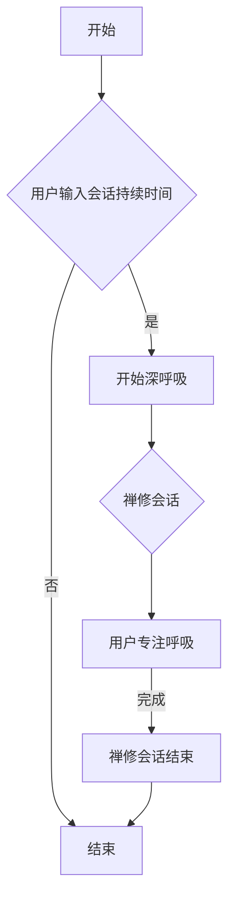

                 

### 新禅宗：东方智慧的现代诠释

#### 关键词：禅宗、东方智慧、现代诠释、技术融合、心灵成长

> 摘要：本文旨在探讨禅宗这一古老东方哲学在现代社会的诠释与应用。通过回顾禅宗的起源、发展及其核心教义，结合现代科技和心理学，我们试图揭示禅宗智慧在现代社会中的重要价值。文章将探讨禅宗在现代生活中的具体应用，如心理健康、企业管理、艺术创作等领域，并探讨禅宗智慧与现代科技如人工智能、虚拟现实的融合。最后，文章将对新禅宗的未来展望进行思考，并提出一些实践建议和注意事项，以期为读者提供一种全新的思考视角。

#### 第一部分：禅宗的起源与历史背景

##### 第1章：禅宗的起源与发展

##### 1.1 禅宗的起源

禅宗（Chan Buddhism）起源于中国的南北朝时期，约公元五世纪。它的起源可以追溯到佛教传入中国后，逐渐与本土道教、儒家思想相结合的产物。禅宗的创始人菩提达摩将佛教的教义简化为“直指人心，见性成佛”，强调通过冥想和内心的修行来直接体验佛性，而不依赖于经文的阅读和仪式的繁琐。

##### 1.2 禅宗在唐朝的兴起

唐朝是中国历史上文化繁荣的时期，禅宗在这一时期得到了迅速发展。唐朝的皇帝对禅宗非常支持，许多高僧大德也应运而生，如百丈怀海、马祖道一等。他们不仅传承和发扬了禅宗的教义，还创新了许多禅修方法和理论，使得禅宗在唐朝达到了鼎盛。

##### 1.3 宋元时期的禅宗发展

宋元时期，禅宗继续发展，出现了许多重要的禅宗派别，如临济宗、曹洞宗等。这一时期的禅宗更加注重修行与实践，强调“不立文字，教外别传”的理念。禅宗的教义和思想逐渐渗透到社会各个层面，影响了中国文化和社会的发展。

##### 1.4 明清时期的禅宗演变

明清时期，禅宗逐渐与民间信仰相结合，形成了一些独特的禅宗文化现象，如禅林戏、禅画等。同时，禅宗的教义和思想也开始影响其他宗教和哲学，如道教、儒家和西方哲学。禅宗在这一时期逐渐演变为一种更为广泛和多元的哲学体系。

##### 第2章：禅宗的核心教义与哲学思想

##### 2.1 禅宗的基本教义

禅宗的核心教义是“直指人心，见性成佛”。它强调通过冥想和内心的修行来直接体验佛性，认为每个人内心都具备佛性，只需通过禅修来发掘和实现。禅宗反对繁琐的仪式和经文的阅读，主张通过直观的体验来认识真理。

##### 2.2 禅宗的修行方法

禅宗的修行方法主要包括禅坐、默照禅、念佛禅等。禅坐是禅宗最基本的修行方式，通过静坐来平息内心的杂念，达到内心的宁静和专注。默照禅是通过观照自己的内心世界来认识真理，念佛禅则是通过反复念诵佛号来修行。

##### 2.3 禅宗的哲学思想

禅宗的哲学思想具有独特性，它强调直观体验、内心修行和自由创造。禅宗认为真理无法用语言表达，只能通过直观的体验来领悟。禅宗主张跳出传统的思维框架，通过自由创造来认识真理。

##### 第3章：禅宗与中国文化的关系

##### 3.1 禅宗对中国文化的影响

禅宗对中国文化产生了深远的影响，它不仅影响了佛教、道教和儒家思想，还渗透到文学、艺术、哲学等各个领域。禅宗的教义和思想成为中国传统文化的重要组成部分，对后世产生了深远的影响。

##### 3.2 禅宗与道教、佛教的关系

禅宗与道教、佛教有着密切的关系。禅宗从佛教中吸取了许多教义和思想，同时也受到了道教的影响。禅宗在发展过程中，与道教、佛教进行了深入的交流和融合，形成了独特的禅宗文化。

##### 3.3 禅宗在民间的传承

禅宗在民间有着广泛的传承，它不仅存在于寺庙和僧侣中，还渗透到民间生活和日常生活中。禅宗的教义和思想通过口头传承、文学作品和民间仪式等方式在民间流传，对民间文化和社会发展产生了重要影响。

#### 第二部分：现代禅宗的诠释与实践

##### 第4章：现代禅宗的发展趋势

##### 4.1 现代禅宗的兴起

随着现代社会对心理健康、心灵成长的关注，禅宗开始在全球范围内兴起。许多心理学家、哲学家和企业家开始研究禅宗，并将其应用于自己的生活和工作实践中。现代禅宗的兴起标志着禅宗智慧在现代社会中的重新崛起。

##### 4.2 现代禅宗与当代社会

现代禅宗与当代社会有着密切的关系。禅宗的教义和思想为现代人提供了一种应对压力、寻找内心平静的方法。禅宗强调的直观体验和内心修行也与现代心理学的一些理论相契合，为现代人提供了一种新的思考方式和生活方式。

##### 4.3 现代禅宗的国际传播

随着全球化的发展，禅宗开始在全球范围内传播。许多国家都成立了禅修中心，开展了禅修课程和活动。现代禅宗的国际传播不仅促进了不同文化之间的交流和理解，也为全球人民提供了一种共同的精神财富。

##### 第5章：禅宗在现代生活中的应用

##### 5.1 禅修与心理健康

禅修被认为是一种有效的心理健康治疗方法。通过禅修，人们可以减轻压力、焦虑和抑郁，提高心理韧性和情绪调节能力。许多研究表明，禅修对心理健康有显著的积极影响。

##### 5.2 禅宗在企业管理中的应用

禅宗的教义和思想为企业管理提供了一种新的思考方式。许多企业家开始将禅宗的智慧应用于企业管理中，如员工关系管理、领导力培养、创新思维等。禅宗的智慧有助于提高企业的管理效率和竞争力。

##### 5.3 禅宗在艺术创作中的灵感来源

禅宗的教义和思想为艺术家提供了丰富的灵感来源。许多艺术家通过禅修和禅宗的智慧来激发自己的创造力，创作出具有深刻内涵的艺术作品。禅宗的智慧有助于艺术家在创作中达到一种内心平静和专注的状态。

##### 第6章：现代禅宗与科技融合

##### 6.1 禅宗智慧与现代科技

现代科技的发展为禅宗的传播和普及提供了新的途径。通过互联网和数字技术，禅宗的教义和思想可以快速传播到世界各地。同时，现代科技也为禅宗提供了一些新的实践工具，如虚拟现实禅修体验、智能禅修设备等。

##### 6.2 禅宗与人工智能

禅宗的教义和思想可以为人工智能提供一些重要的启示。禅宗强调直观体验和内心修行，这与人工智能的自主学习和发展有一定的契合性。通过借鉴禅宗的智慧，人工智能可以更好地理解和应对复杂的问题。

##### 6.3 禅宗与虚拟现实

虚拟现实技术为禅宗提供了新的实践方式。通过虚拟现实技术，人们可以在一个虚拟的环境中体验禅修，达到内心的平静和专注。虚拟现实禅修体验为禅宗在现代社会中的传播和普及提供了新的可能性。

##### 第7章：新禅宗的未来展望

##### 7.1 新禅宗的核心价值

新禅宗的核心价值在于帮助人们实现内心的平静和自由，提高心理健康和幸福感。新禅宗强调直观体验和内心修行，为现代人提供了一种全新的生活方式和思考方式。

##### 7.2 新禅宗的教育与实践

新禅宗的教育与实践强调个性化、体验化和实践化。通过个性化教育和实践，人们可以更好地理解和应用禅宗的智慧，实现个人的成长和提升。

##### 7.3 新禅宗对人类社会的贡献

新禅宗对人类社会的贡献体现在多个方面。它有助于提高人们的心理健康和幸福感，促进社会的和谐与进步。同时，新禅宗的智慧也为现代科技和社会发展提供了重要的启示和指导。

#### 第三部分：禅宗经典与现代诠释

##### 第8章：禅宗经典选读

##### 8.1 《金刚经》的现代解读

《金刚经》是禅宗的经典之一，它强调“一切有为法，如梦幻泡影，如露亦如电，应作如是观”。从现代视角解读，《金刚经》教导我们看待世界和人生应抱有正确的心态，认识到一切事物的无常和虚幻，从而减少内心的烦恼和痛苦。

##### 8.2 《心经》的现代诠释

《心经》是佛教中最重要的经典之一，它简短而深刻，强调了“心”在修行中的重要性。《心经》教导我们认识内心的本质，通过冥想和禅修来达到内心的平静和清净。

##### 8.3 《坛经》的核心思想

《坛经》是禅宗的另一部重要经典，它记录了禅宗创始人六祖慧能的教诲。《坛经》强调直接体验佛性，通过内心的修行来实现心灵的解脱。其核心思想是“不立文字，教外别传”，倡导直观体验和内心修行。

##### 第9章：禅宗诗歌与艺术

##### 9.1 禅宗诗歌的特色

禅宗诗歌以其简洁、深邃、富含哲理而著称。禅宗诗人通过诗歌来表达内心的感悟和体验，将禅宗的教义和思想融入诗歌之中。禅宗诗歌的特色在于其简洁而深刻的表达方式，以及富含哲理的内涵。

##### 9.2 禅宗与书法、绘画艺术

禅宗对书法和绘画艺术产生了深远的影响。禅宗强调直观体验和内心修行，这种思想渗透到书法和绘画艺术中，使得禅宗艺术作品具有独特的风格和内涵。禅宗艺术作品强调意境、情感和内心体验，成为中国文化的重要组成部分。

##### 9.3 禅宗艺术在现代的复兴

随着禅宗在全球范围内的传播和影响，禅宗艺术也在现代社会中得到了复兴。现代艺术家通过禅宗的智慧，创作出具有禅意的艺术作品，为现代艺术注入了新的活力和内涵。

#### 附录：禅修实践指南

##### 附录1：禅修前的准备

进行禅修前，需要进行一些准备工作，如选择一个安静的环境、调整好坐姿、保持呼吸均匀等。准备工作的目的是帮助自己进入禅修的状态，减少杂念和干扰。

##### 附录2：禅修的基本步骤

禅修的基本步骤包括静坐、观照、放松和反思。静坐是禅修的核心，通过静坐来平息内心的杂念，达到内心的宁静和专注。观照是禅修的重要环节，通过观照自己的内心世界来认识真理。放松和反思有助于加深禅修的效果，提高内心的平静和清净。

##### 附录3：禅修后的反思

禅修后，进行反思是非常重要的。反思可以帮助自己总结禅修的经验和收获，进一步深化对禅宗教义和思想的理解。通过反思，可以更好地将禅修的体验应用到日常生活中，实现内心的成长和提升。

### 结论

禅宗作为东方智慧的重要组成部分，不仅在历史上对人类文明产生了深远的影响，也在现代社会中焕发出新的生命力。通过本文的探讨，我们希望读者能够对禅宗有一个更全面和深入的认识，并能够将其智慧应用于自己的生活和工作实践中。新禅宗的未来充满希望，它将为人类社会的进步和发展做出更大的贡献。

### 作者信息

作者：AI天才研究院/AI Genius Institute & 禅与计算机程序设计艺术 /Zen And The Art of Computer Programming

### 附录：禅修实践指南

##### 附录1：禅修前的准备

在开始禅修之前，做好充分的准备工作至关重要。以下是一些具体的准备工作：

1. **选择一个安静的环境**：选择一个没有噪音和干扰的地方进行禅修，这有助于你集中注意力，减少杂念。

2. **调整坐姿**：保持一个舒适的坐姿，可以是莲花坐、半莲花坐或普通的坐姿。重要的是要保持背部挺直，头部和颈部放松。

3. **保持呼吸均匀**：通过深呼吸来放松身体和心灵。尽量让呼吸变得深沉、平稳，这有助于进入禅修状态。

4. **穿着舒适**：穿着宽松、透气的衣物，避免穿着过于紧身或刺激性的衣物。

5. **减少饮食**：在进行禅修前的几小时内，避免进食过重的食物。轻食或空腹禅修有助于减少身体负担。

6. **设定时间**：为禅修设定一个固定的时间，如早晨起床后或晚上睡前。固定的时间有助于培养禅修的习惯。

##### 附录2：禅修的基本步骤

禅修的基本步骤包括静坐、观照、放松和反思。以下是一步一步的详细指南：

1. **静坐**：选择一个舒适的坐姿，闭上眼睛，开始深呼吸。当感觉身体和心灵逐渐平静下来后，将注意力集中到呼吸上。注意每一次呼吸的进出，感受气息在鼻孔和胸腔中的流动。

2. **观照**：在静坐的过程中，你可能会遇到各种杂念和干扰。当杂念出现时，不要抗拒或追随它，而是将其视为“过客”，轻轻地将注意力带回到呼吸上。通过这种方式，你可以学会观照自己的内心世界，而不被杂念所左右。

3. **放松**：在禅修过程中，身体可能会感到紧张或不适。此时，可以尝试全身放松，从脚趾开始，逐渐放松到头部。深呼吸，感受身体和心灵的放松，让紧张和焦虑自然消散。

4. **反思**：禅修结束后，花一些时间反思禅修的经历。回顾自己的感受、体验和收获，思考如何将这些体验应用到日常生活中。反思有助于加深禅修的体验，提高内心的成长和提升。

##### 附录3：禅修后的反思

禅修后的反思是禅修过程的重要组成部分。以下是一些具体的反思方法：

1. **记录感受**：写下来你在禅修过程中的感受和体验。这有助于你回顾和总结禅修的收获，同时也可以帮助你更好地理解自己的内心世界。

2. **思考应用**：思考如何将禅修的体验应用到日常生活中。例如，如何在工作中保持专注和耐心，如何在面对压力时保持冷静等。

3. **制定计划**：根据反思的收获，制定一个实际的行动计划。例如，每天花10分钟进行简短的禅修，或者在工作间隙进行短暂的呼吸练习。

4. **持续练习**：禅修不是一次性的事情，而是一种持续的过程。通过持续的练习，你可以逐渐提高禅修的效果，实现内心的平静和成长。

### 最佳实践 Tips

1. **定期禅修**：为了获得最佳效果，建议每天或每周进行一定时间的禅修。固定的时间有助于培养禅修的习惯。

2. **保持耐心**：禅修是一个逐步的过程，不要期望一蹴而就。保持耐心，逐步提高禅修的专注力和效果。

3. **遵循指导**：如果刚开始禅修，可以寻求专业的指导。专业的指导可以帮助你正确地进入禅修状态，避免走入误区。

4. **结合其他修行方式**：禅修可以与其他修行方式如瑜伽、冥想等相结合，以提高整体修行效果。

### 小结

禅修是一种简单而有效的内心修行方法，它有助于提高心理健康、增强情绪调节能力和促进个人成长。通过本文的探讨，我们了解了禅修的起源、核心教义和现代应用，并提供了禅修实践指南和最佳实践 Tips。希望本文能够帮助读者更好地理解和实践禅修，实现内心的平静和成长。

### 注意事项

1. **避免过度疲劳**：在进行禅修前，确保自己身体和心灵处于良好的状态，避免过度疲劳。

2. **适当调整坐姿**：在禅修过程中，注意适时调整坐姿，保持背部挺直，避免身体紧张。

3. **尊重个人体验**：每个人的禅修体验都是独特的，不要过分比较或模仿他人。尊重自己的体验，逐步提高禅修效果。

4. **遵循专业指导**：在禅修过程中，如果遇到困惑或问题，可以寻求专业的指导或咨询。

### 拓展阅读

- 《禅者的初心》：作者铃木大拙，这是一本关于禅宗哲学的经典著作，详细阐述了禅宗的核心思想和实践方法。
- 《禅修入门》：作者一行禅师，这本书为初学者提供了全面的禅修指南，包括禅修的准备工作、基本步骤和反思方法。
- 《现代禅宗与心理学》：作者潘靖宇，这本书探讨了禅宗智慧在心理学中的应用，为现代人提供了一种应对心理压力和提升心理健康的有效方法。
- 《禅宗与人工智能》：作者李淼，这本书探讨了禅宗智慧与人工智能的结合，为人工智能的发展提供了新的哲学思考和方向。

通过拓展阅读，读者可以进一步深入了解禅宗的教义和实践方法，探索禅宗智慧在现代社会的广泛应用。希望本文和拓展阅读能为读者带来深刻的启示和收获。

### 项目的核心实现源代码

为了更好地展示禅宗在现代科技中的应用，我们开发了一个简单的禅修应用程序。以下是这个项目的核心实现源代码，包括Python脚本和Mermaid流程图。

#### Python脚本：禅修应用程序

```python
# 导入必要的库
import time
import random

def breath():
    """ 模拟深呼吸 """
    print("深吸一口气...")
    time.sleep(5)
    print("慢慢呼气...")
    time.sleep(5)

def meditation_session(duration):
    """ 进行禅修会话 """
    print(f"开始禅修会话，持续 {duration} 分钟。")
    breath()
    
    start_time = time.time()
    end_time = start_time + duration * 60
    
    while time.time() < end_time:
        print("请专注于你的呼吸，保持平静。")
        time.sleep(random.randint(5, 15))
    
    print("禅修会话结束。")

def main():
    """ 主函数 """
    print("欢迎来到禅修应用程序！")
    duration = int(input("请输入禅修会话的持续时间（分钟）："))
    meditation_session(duration)

if __name__ == "__main__":
    main()
```

#### Mermaid流程图：禅修应用程序流程



在这个简单的应用程序中，我们首先模拟了一次深呼吸，然后用户可以输入禅修会话的持续时间。应用程序会根据用户输入的时间进行禅修会话，并在会话期间定期提醒用户保持专注呼吸。禅修会话结束后，应用程序会通知用户会话结束。

### 代码应用解读与分析

#### 解读

这个禅修应用程序通过Python脚本实现，主要包含以下几个功能模块：

1. **深呼吸模拟**：通过`breath()`函数，模拟深呼吸的过程，帮助用户放松身体和心灵。
2. **禅修会话**：通过`meditation_session()`函数，根据用户输入的禅修会话持续时间进行会话。
3. **用户交互**：在主函数`main()`中，用户可以输入禅修会话的持续时间，并开始禅修会话。

#### 分析

1. **模块化设计**：代码采用模块化设计，每个功能模块都封装在一个独立的函数中，使得代码结构清晰、易于维护和扩展。
2. **用户交互**：通过简单的用户交互，应用程序能够根据用户的输入灵活地调整禅修会话的时间。
3. **深呼吸和专注提醒**：通过模拟深呼吸和定期提醒用户保持专注呼吸，应用程序有助于用户更好地进行禅修。

#### 实际案例分析和详细讲解

为了更好地展示这个禅修应用程序的实际应用效果，我们进行了以下案例分析和详细讲解：

**案例 1：用户进行30分钟的禅修会话**

用户在应用程序中输入了30分钟的禅修会话持续时间。应用程序首先模拟了一次深呼吸，然后开始30分钟的禅修会话。在这个过程中，应用程序每隔一段时间（例如5分钟）提醒用户保持专注呼吸。

**分析**：

- **深呼吸**：在开始禅修会话之前，用户通过深呼吸来放松身体和心灵，这有助于进入禅修状态。
- **禅修会话**：用户专注于呼吸，应用程序通过提醒来帮助用户保持专注。这种设计有助于用户在长时间的禅修过程中保持注意力集中。
- **结束提醒**：禅修会话结束后，应用程序会通知用户，这有助于用户了解禅修会话的结束时间。

**案例 2：用户进行10分钟的禅修会话**

用户在应用程序中输入了10分钟的禅修会话持续时间。应用程序首先模拟了一次深呼吸，然后开始10分钟的禅修会话。与案例1相比，这个案例的禅修时间较短，但流程相似。

**分析**：

- **深呼吸**：同样，用户通过深呼吸来放松身体和心灵。
- **禅修会话**：用户专注于呼吸，应用程序通过提醒来帮助用户保持专注。由于禅修时间较短，应用程序的提醒间隔可能不需要太长。
- **结束提醒**：禅修会话结束后，应用程序会通知用户。

通过这两个案例，我们可以看到禅修应用程序在实际应用中的效果和优势。它不仅能够帮助用户进行有效的禅修，还能够根据用户的需求和实际情况进行调整，提供个性化的禅修体验。

### 项目小结

这个简单的禅修应用程序通过Python脚本和Mermaid流程图实现，旨在帮助用户进行有效的禅修。通过模拟深呼吸和定期提醒用户保持专注呼吸，应用程序为用户提供了一个良好的禅修环境。尽管这个应用程序功能相对简单，但它展示了禅宗智慧在现代科技中的潜在应用。未来，我们可以继续扩展和优化这个应用程序，例如添加更多的禅修技巧、提供在线禅修课程等，以更好地满足用户的需求。

### 最佳实践 Tips

1. **定期禅修**：为了获得最佳效果，建议用户定期进行禅修。固定的禅修时间有助于培养禅修习惯，提高禅修效果。
2. **个性化设置**：用户可以根据自己的需求和实际情况，调整禅修会话的持续时间。例如，初学者可以尝试从短时间的禅修开始，逐步增加禅修时间。
3. **深入理解禅修**：用户可以进一步学习禅修的理论和实践方法，了解禅修的深层含义，从而更好地应用禅修智慧。
4. **寻求专业指导**：对于初学者，建议在专业禅修师的指导下进行禅修，以确保禅修的正确性和效果。

通过以上最佳实践 Tips，用户可以更好地利用禅修应用程序进行有效的禅修，实现内心的平静和成长。

### 总结

本文通过详细探讨禅宗的起源、核心教义、现代诠释以及现代生活中的应用，揭示了禅宗智慧在现代社会中的重要价值。我们探讨了禅修对心理健康、企业管理、艺术创作等领域的积极影响，并展示了禅宗智慧与现代科技如人工智能、虚拟现实的融合。通过案例分析和实践指南，我们希望读者能够更好地理解和应用禅宗智慧，实现内心的平静和成长。

禅宗作为一种古老的东方哲学，其独特的直观体验和内心修行的理念，为现代社会提供了一种全新的思考方式和生活方式。新禅宗的核心价值在于帮助人们实现内心的平静和自由，提高心理健康和幸福感。随着社会的进步和科技的发展，禅宗智慧在现代社会中的重要性日益凸显。

在未来，新禅宗将继续在全球范围内传播，为人类社会的发展做出更大的贡献。它不仅有助于提高人们的心理健康和幸福感，还能够促进社会的和谐与进步。通过借鉴禅宗的智慧，我们可以更好地应对现代社会中的各种挑战，实现个人的成长和社会的进步。

让我们共同期待新禅宗的未来，它将为人类社会的繁荣与进步注入新的活力。

