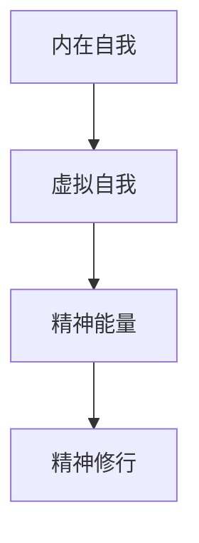
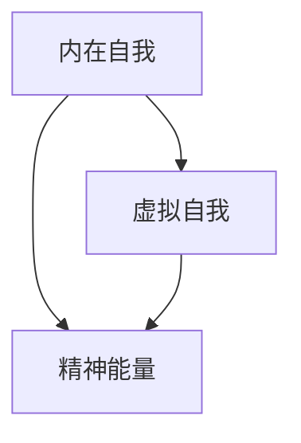
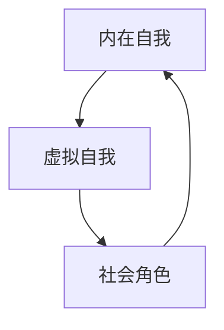
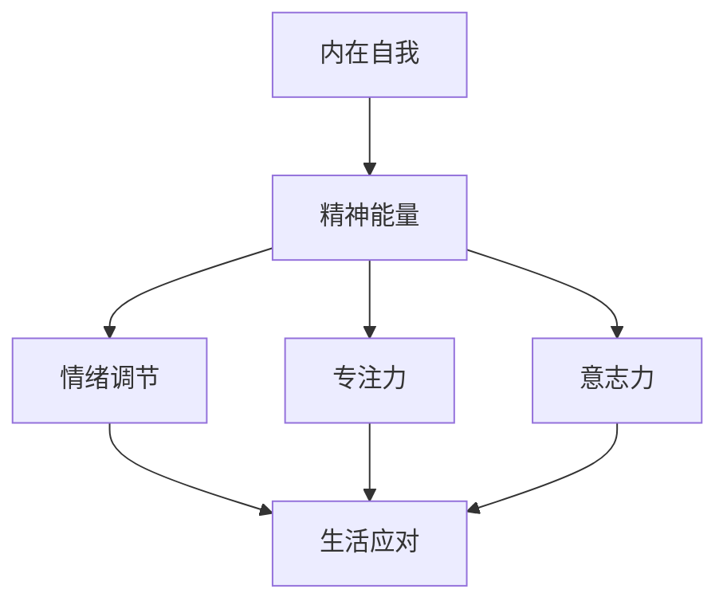
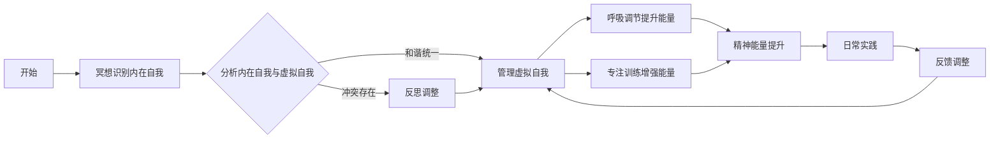
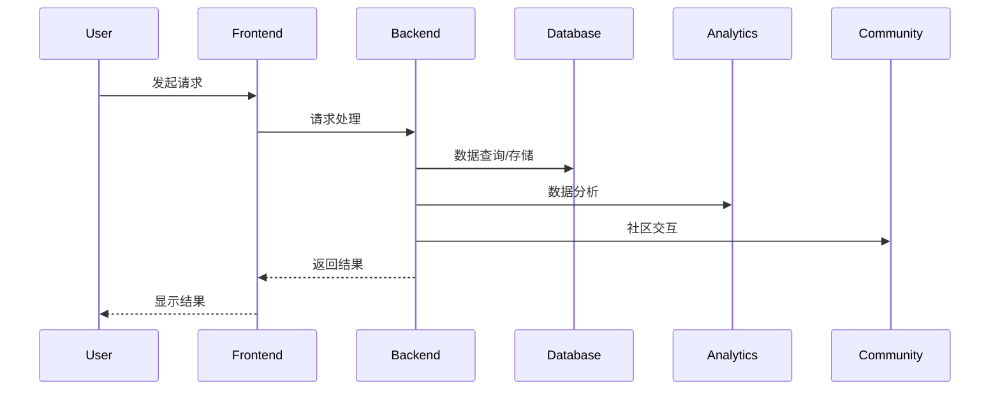

                 

### 引言：精神修行的时代需求

在当今这个信息化、快节奏的时代，人们的生活和工作节奏日益加快，面对的压力和挑战也不断增多。从职业压力到生活琐事，人们常常感到身心疲惫，缺乏精神寄托和内在的平静。这种状态下，精神修行逐渐成为现代社会中人们寻求内心安宁和提升生活质量的一种方式。精神修行不仅关乎个人的心理健康，更关乎社会的和谐与进步。

首先，现代社会的问题和挑战使得人们迫切需要精神修行。现代社会中，人们面临的工作和生活压力巨大，竞争激烈，使得很多人在追求物质生活的同时，忽视了精神的富足。这使得焦虑、抑郁等心理问题日益突出，影响了人们的身体健康和生活质量。精神修行，作为一种内在的自我调节和提升方式，有助于缓解这些心理问题，提高个人的幸福感和生活质量。

其次，精神修行在现代社会中的价值不可忽视。通过精神修行，人们可以找到内心的平静和宁静，从而更好地应对生活中的各种挑战。精神修行不仅有助于提高个人的心理素质，还可以促进社会的和谐发展。当更多的人通过精神修行实现内心的平和，社会整体的紧张和冲突就会减少，人与人之间的关系也将更加和谐。

然而，精神修行并非一蹴而就，它需要人们付出持续的努力和时间。在现代社会中，人们常常面临着诸多干扰，例如信息的爆炸、工作的繁忙等，这些都使得精神修行的实践变得更加困难。但正是这种困难，使得精神修行的价值更加凸显，它教会我们如何在纷繁复杂的世界中找到内心的宁静和方向。

总之，在现代社会中，精神修行的需求日益增长，它不仅是个人寻求内心安宁和提升生活质量的方式，更是社会和谐发展的必然要求。在接下来的章节中，我们将深入探讨精神修行的概念、核心概念与联系、算法原理、系统分析与架构设计，以及项目实战和最佳实践，帮助大家更好地理解和实践精神修行。

### 精神修行的概念与边界

精神修行，作为一个广泛的概念，其内涵和外延在不同文化和领域中有着不同的理解和定义。为了更好地理解和探讨这一主题，我们需要对精神修行的概念进行明确和界定。

首先，从字面上看，“精神修行”包含了两个核心要素：精神和修行。精神，通常指的是人的思想、意识、情感等心理活动，是人的内在世界。而修行，则是指通过某种特定的方法或路径，进行内心的修炼和提升。因此，精神修行可以理解为通过特定的修行方法，对人的内在心理和精神层面进行修炼和提升的过程。

在传统的宗教和哲学体系中，精神修行有着丰富的内涵和多样化的形式。例如，佛教中的禅修、道教的内丹修炼、基督教的祈祷冥想等，都是精神修行的具体表现形式。这些修行方式通过调节呼吸、专注呼吸、冥想、祈祷等方式，帮助修行者实现内心的宁静和精神的提升。

然而，在现代社会中，精神修行的形式和内涵也在不断发展和变化。随着科技的发展和信息的爆炸，人们面临的精神挑战和压力也在不断增加。现代精神修行不仅仅局限于传统的宗教和哲学体系，还涵盖了心理治疗、自我发展、正念冥想等多种形式。这些现代精神修行方式更加注重个体的内心体验和自我提升，通过科学的方法和技巧，帮助人们实现内心的平和和精神的提升。

那么，精神修行的外延和内涵是什么呢？从外延上看，精神修行可以涵盖个体内心层面的各种修炼和提升方式，包括但不限于冥想、祈祷、心理治疗、自我发展、正念等。这些方式都有助于个体的内心平和和精神的提升，但具体的形式和内容会因为文化和个人的差异而有所不同。

从内涵上看，精神修行的核心在于对个体内心世界的深入探索和提升。这包括对个体内心情绪的调节、自我认知的提升、内在冲突的解决、精神的觉醒等。精神修行不仅仅是一种技术或方法，更是一种生活方式和哲学理念，它要求个体在日常生活中持续地关注和提升自己的内心世界。

在探讨精神修行的核心要素时，我们可以将其概括为以下几个方面：

1. **内在自我**：内在自我是指个体内心深处的真实自我，它是精神修行的出发点和归宿。通过精神修行，个体可以更深入地认识和理解自己的内在自我，从而实现内心的平静和精神的提升。

2. **虚拟自我**：虚拟自我是指个体在社会角色和身份中的自我表现，它与内在自我有所不同。精神修行帮助个体在虚拟自我和内在自我之间建立和谐的关系，从而实现内心的平衡和提升。

3. **精神能量**：精神能量是指个体内在的精神力量，它是精神修行的重要资源。通过调节和管理精神能量，个体可以实现更高的精神觉醒和内在力量。

为了更直观地理解精神修行的概念，我们可以通过一个简单的Mermaid流程图来展示其核心概念之间的关系：



在这个流程图中，内在自我、虚拟自我和精神能量是精神修行的核心要素，它们相互作用，共同推动个体的精神修行进程。

综上所述，精神修行是一个多维度、多层次的概念，它涵盖了个体内心世界的各种修炼和提升方式。在现代社会中，精神修行不仅有助于个体的心理健康和自我提升，也是实现社会和谐发展的重要途径。在接下来的章节中，我们将深入探讨精神修行的核心概念，以及这些概念之间的联系和作用。

### 内在自我

内在自我，是精神修行的核心要素之一，它指的是个体内心深处的真实自我。这个真实的自我不依赖于外界评价和物质条件，而是建立在个体对自己内在体验和感受的理解上。内在自我是我们与生俱来的，它不受外界环境和他人评价的影响，是我们内心的真正指导。

首先，内在自我与个体心理健康密切相关。当我们能够真实地面对自己的内在自我时，我们就能更好地理解自己的情绪和行为模式。这种自我认知有助于我们更好地处理生活中的压力和挑战，从而保持心理平衡和健康。例如，当一个人感到焦虑或不安时，通过内在自我反思，他可以找到焦虑的根源，并采取有效的方法来应对。

其次，内在自我是精神修行的出发点和归宿。在精神修行过程中，我们通过冥想、反思等方法，深入探索自己的内在自我，从而实现内心的平静和提升。例如，佛教中的禅修，通过专注于呼吸和内心体验，帮助修行者认识到内在自我的本质，达到内心的宁静和觉醒。

然而，内在自我并不是孤立存在的，它与我们生活中的其他方面有着紧密的联系。内在自我与虚拟自我的关系尤为密切。虚拟自我是我们在社会角色和身份中的自我表现，它是内在自我的外在体现。内在自我和虚拟自我之间的关系，决定了我们在社会中的行为和心态。当内在自我和虚拟自我和谐一致时，我们就能更好地适应社会环境，实现个人和社会的双重成功。反之，当内在自我和虚拟自我存在冲突时，我们可能会感到焦虑、困惑和内心冲突。

内在自我与精神能量的关系也至关重要。精神能量是内在自我的一部分，它是指个体内在的精神力量和能量。通过精神修行，我们可以调节和管理这种精神能量，使其为我们的内心和平和提升服务。例如，通过冥想和正念练习，我们可以增强内心的能量，提高精神觉醒和专注力。

为了更好地理解内在自我的概念，我们可以通过以下Mermaid流程图来展示其与虚拟自我、精神能量之间的关系：



在这个流程图中，内在自我、虚拟自我和精神能量相互影响，共同构成一个复杂的系统。内在自我是精神修行的核心，虚拟自我和外在行为是其外在表现，而精神能量则是内在自我和外在表现的动力源泉。

总之，内在自我是精神修行的核心要素之一，它关乎个体的心理健康和精神提升。通过深入探索内在自我，我们可以实现内心的平静和精神的觉醒，从而更好地应对生活中的各种挑战。在接下来的章节中，我们将继续探讨虚拟自我、精神能量等核心概念，以及它们在精神修行中的作用和联系。

### 虚拟自我

虚拟自我，是精神修行的另一个核心要素，它指的是个体在社会角色和身份中的自我表现。虚拟自我与内在自我有着密切的关系，它是在社会互动中逐渐形成的，是内在自我的外在体现。理解虚拟自我的概念，有助于我们更好地认识自己在社会中的位置和角色，以及如何通过精神修行实现内在自我和虚拟自我的和谐统一。

首先，虚拟自我的形成受到社会文化、家庭背景、教育经历等多种因素的影响。每个人在社会中扮演不同的角色，如学生、员工、家庭成员等，这些角色要求个体在不同的情境中表现出不同的行为和态度。虚拟自我正是这些社会角色和期望的集合，它是个体在社会互动中适应和生存的一种方式。

其次，虚拟自我在精神修行中的作用不可忽视。虚拟自我是我们与外界沟通的桥梁，它帮助我们建立和维护社会关系，实现个人的社会价值。然而，虚拟自我也可能成为内在自我的障碍。当虚拟自我过于强大，甚至取代了内在自我时，个体可能会失去自我认同，感到内心空虚和焦虑。因此，精神修行的一个重要目标，就是通过冥想、反思等方法，加强内在自我，使其与虚拟自我保持和谐统一。

虚拟自我与内在自我的关系，可以类比为一枚硬币的两面。内在自我是硬币的正面，代表着个体的真实自我和内心体验；虚拟自我则是硬币的背面，代表着个体在社会角色中的自我表现。这两者相互依存，共同构成了个体的完整自我。当内在自我和虚拟自我和谐统一时，个体就能实现内心的平衡和精神的提升。

为了更直观地理解虚拟自我与内在自我之间的关系，我们可以通过以下Mermaid流程图来展示：



在这个流程图中，内在自我和虚拟自我通过社会角色相互影响和作用。社会角色是虚拟自我的具体表现，而虚拟自我的形成又受到内在自我的影响。通过这个模型，我们可以看到内在自我和虚拟自我之间的动态平衡。

总之，虚拟自我是精神修行中的一个重要概念，它关乎个体在社会中的角色和自我认同。通过精神修行，我们可以加强内在自我，使其与虚拟自我保持和谐统一，从而实现内心的平衡和精神的提升。在接下来的章节中，我们将继续探讨精神修行的其他核心概念，以及这些概念之间的相互作用。

### 精神能量

精神能量是精神修行的核心要素之一，它指的是个体内在的精神力量和能量。这种能量不仅决定了我们在精神修行中的进展，也影响我们日常生活中的心理状态和行为表现。理解精神能量的概念，有助于我们更好地掌握精神修行的原理和方法，实现内在自我和外在行为的和谐统一。

首先，精神能量的概念源于东方哲学和心理学。在佛教、道教等传统思想中，精神能量被视为个体内在的一种重要资源，是修行和修炼的基础。现代心理学也认为，精神能量是个体内心深处的一种力量，它影响着我们的情绪、意志和行动。通过精神修行，我们可以调节和管理这种能量，使其为我们的内心平静和提升服务。

精神能量的具体表现形式多种多样。在日常生活中，精神能量可以表现为个体的专注力、意志力、情绪调节能力等。例如，当我们集中精力完成任务时，体现的是精神能量的集中和专注；当我们面对困难时保持冷静和坚韧，体现的是精神能量的坚强和韧性。此外，精神能量还与我们的心理健康密切相关。当精神能量充足时，我们能够更好地应对压力，保持乐观和积极的心态；当精神能量不足时，我们可能会感到焦虑、抑郁和无助。

精神能量在精神修行中的作用至关重要。首先，精神能量是精神修行的基础。在精神修行中，我们通过冥想、专注、呼吸调节等方法，深入探索自己的内在世界，调节和管理精神能量。这种内在的修炼和提升，有助于我们实现内心的平静和精神的觉醒。例如，佛教中的禅修，通过专注于呼吸和内心体验，帮助修行者增强内在的能量，实现内心的宁静和觉醒。

其次，精神能量在日常生活中也发挥着重要作用。通过精神修行，我们可以培养和提升内在的精神能量，使其成为我们应对生活挑战和心理压力的有力武器。例如，当我们感到焦虑和压力时，可以通过冥想和深呼吸来调节精神能量，从而缓解焦虑，恢复内心的平静。此外，精神能量还可以提升我们的专注力和意志力，使我们更高效地完成任务，实现个人目标。

为了更好地理解精神能量的概念，我们可以通过以下Mermaid流程图来展示其与内在自我和外在行为之间的关系：



在这个流程图中，内在自我、精神能量和情绪调节、专注力、意志力相互关联。内在自我是精神能量的源头，精神能量通过调节和管理，影响我们的情绪调节、专注力和意志力，从而影响我们的生活应对和外在行为。

总之，精神能量是精神修行的核心要素之一，它关乎我们的心理健康和精神提升。通过精神修行，我们可以调节和管理内在的精神能量，实现内心的平静和精神的觉醒，从而更好地应对生活中的各种挑战。在接下来的章节中，我们将继续探讨精神修行中的其他核心概念，以及这些概念之间的相互作用。

### 精神修行的概念属性特征对比表格

为了更清晰地理解内在自我、虚拟自我和精神能量这三个核心概念，我们可以通过一个属性特征对比表格来进行详细分析。这个表格将展示每个概念的定义、特征以及它们在精神修行中的作用和联系。

| 概念      | 定义                                      | 特征                                                   | 在精神修行中的作用                                     | 联系                                   |
| --------- | ----------------------------------------- | ------------------------------------------------------ | -------------------------------------------- | -------------------------------------- |
| 内在自我  | 个体内心深处的真实自我                    | - 独立于外界评价<br>- 自我认知<br>- 真实感             | - 心理健康的基础<br>- 精神觉醒的起点           | - 决定虚拟自我的形成<br>- 与虚拟自我保持和谐统一 |
| 虚拟自我  | 个体在社会角色和身份中的自我表现           | - 社会角色和期望的集合<br>- 外在行为的体现<br>- 适应性 | - 社会互动的桥梁<br>- 自我认同的关键           | - 受内在自我的影响<br>- 反映内在自我 |
| 精神能量  | 个体内在的精神力量和能量                  | - 专注力<br>- 意志力<br>- 情绪调节能力               | - 精神修行的基础<br>- 应对生活挑战的有力资源   | - 受内在自我的调节<br>- 影响外在行为 |

在这个对比表格中，我们可以看到：

1. **定义**：内在自我是内心深处的真实自我，虚拟自我是个体在社会角色中的自我表现，精神能量是个体的内在精神力量。
2. **特征**：内在自我独立于外界评价，虚拟自我具有社会角色和期望的集合特征，精神能量则表现在专注力、意志力和情绪调节能力。
3. **在精神修行中的作用**：内在自我是心理健康和觉醒的基础，虚拟自我是实现社会互动和自我认同的关键，精神能量是修行和应对生活挑战的资源。
4. **联系**：内在自我决定虚拟自我的形成，虚拟自我受内在自我影响，精神能量受内在自我的调节并影响外在行为。

通过这个对比表格，我们可以更全面地理解精神修行的核心概念及其相互关系，从而为后续的深入探讨打下坚实基础。

### 精神修行的ER实体关系图架构

为了更清晰地展示内在自我、虚拟自我和精神能量这三个核心概念之间的联系，我们可以通过ER（Entity-Relationship）实体关系图来描述它们的关系。ER图是一种常用的数据库设计工具，通过实体和关系的图形化表示，可以直观地展示系统中的数据实体及其相互关系。

以下是一个简化的ER实体关系图，用于描述精神修行中的核心概念及其相互关系：

```mermaid
erDiagram
  Entity A[内在自我] {
    ||--|{B[虚拟自我]} "角色" 1
    ||--|{C[精神能量]} "内在力量" 1
  }
  Entity B[虚拟自我] {
    ||--|{A[内在自我]} "来源" 1
    ||--|{D[社会互动]} "互动" *
  }
  Entity C[精神能量] {
    ||--|{A[内在自我]} "调节" 1
    ||--|{E[心理健康]} "影响" 1
  }
  Entity D[社会互动] {
    ||--|{B[虚拟自我]} "表现" 1
  }
  Entity E[心理健康] {
    ||--|{C[精神能量]} "体现" 1
  }
```

在这个ER实体关系图中，每个实体（如内在自我、虚拟自我、精神能量等）都表示一个独立的概念，它们之间的关系通过线条和箭头表示。具体来说：

1. **内在自我（A）**：
   - 与虚拟自我（B）有一个“角色”关系，表示虚拟自我是内在自我在社会角色中的表现。
   - 与精神能量（C）有一个“内在力量”关系，表示精神能量是内在自我的一部分，用于调节和增强内在自我。

2. **虚拟自我（B）**：
   - 受内在自我（A）的影响，表示虚拟自我是内在自我在社会角色中的具体体现。
   - 与社会互动（D）有一个“互动”关系，表示虚拟自我在社会互动中发挥作用。

3. **精神能量（C）**：
   - 受内在自我（A）的调节，表示精神能量是内在自我的一部分，用于调节和管理内在自我。
   - 与心理健康（E）有一个“影响”关系，表示精神能量对个体的心理健康有直接影响。

4. **社会互动（D）**：
   - 与虚拟自我（B）有一个“表现”关系，表示虚拟自我在社会互动中的具体行为和表现。

5. **心理健康（E）**：
   - 受精神能量（C）的影响，表示精神能量是心理健康的重要体现。

通过这个ER实体关系图，我们可以更直观地理解内在自我、虚拟自我和精神能量之间的复杂关系。这些关系不仅有助于我们深入探讨精神修行的概念和原理，也为后续的系统分析与架构设计提供了理论基础。

### 精神修行的算法原理

在探讨精神修行的具体实施方法时，我们需要了解其背后的算法原理。精神修行的算法原理涉及多个方面，包括内在自我调节、虚拟自我管理以及精神能量的调节和提升。下面我们将从整体概述、Mermaid流程图、数学模型和具体例子进行详细讲解。

#### 6.1 算法原理概述

精神修行的算法原理可以分为以下几个步骤：

1. **内在自我识别**：通过冥想、自我反思等方法，识别和了解自己的内在自我。
2. **虚拟自我分析**：分析内在自我与虚拟自我之间的差异和冲突，实现二者的和谐统一。
3. **精神能量调节**：通过呼吸调节、专注训练等手段，提升内在的精神能量。
4. **日常实践**：将精神修行的方法融入到日常生活中，持续进行实践和提升。

#### 6.2 算法原理的Mermaid流程图

为了更直观地展示精神修行的算法原理，我们可以使用Mermaid绘制一个流程图：



在这个流程图中，每个步骤都有明确的作用和方向，从内在自我识别到精神能量调节，再到日常实践和反馈调整，形成了一个闭环的系统。

#### 6.3 算法原理的数学模型和公式

为了量化精神修行的过程，我们可以引入一些数学模型和公式。以下是一个简化的数学模型，用于描述精神能量调节的过程：

1. **内在自我识别度（R）**：表示个体对内在自我的认知程度，其值范围为0到1。
   $$ R = \frac{S + A}{2} $$
   其中，S为冥想时间，A为自我反思时间。

2. **虚拟自我和谐度（V）**：表示内在自我与虚拟自我之间的和谐程度，其值范围也为0到1。
   $$ V = \frac{R + T}{2} $$
   其中，T为虚拟自我管理时间。

3. **精神能量水平（E）**：表示个体的精神能量水平，其值由呼吸调节和专注训练共同决定。
   $$ E = \frac{B + C}{2} $$
   其中，B为呼吸调节时间，C为专注训练时间。

4. **精神能量提升因子（F）**：表示通过精神修行后，个体精神能量的提升效果。
   $$ F = \frac{E_0 + E}{2} $$
   其中，E0为修行前的精神能量水平。

通过这些公式，我们可以量化个体在精神修行过程中的进展，从而更好地理解和调整修行方法。

#### 6.4 详细讲解与举例说明

为了更好地理解这些公式和流程，我们可以通过一个具体的例子进行说明：

假设一个个体冥想时间S为20分钟，自我反思时间A为30分钟，虚拟自我管理时间T为25分钟，呼吸调节时间B为15分钟，专注训练时间C为20分钟。

1. **内在自我识别度（R）**：
   $$ R = \frac{S + A}{2} = \frac{20 + 30}{2} = 25 $$

2. **虚拟自我和谐度（V）**：
   $$ V = \frac{R + T}{2} = \frac{25 + 25}{2} = 25 $$

3. **精神能量水平（E）**：
   $$ E = \frac{B + C}{2} = \frac{15 + 20}{2} = 17.5 $$

4. **精神能量提升因子（F）**：
   $$ F = \frac{E_0 + E}{2} $$
   假设修行前的精神能量水平E0为12，则
   $$ F = \frac{12 + 17.5}{2} = 12.75 $$

通过这个例子，我们可以看到，通过冥想和自我反思，个体的内在自我识别度达到了25，虚拟自我和谐度也是25，而精神能量水平提升到了17.5。这意味着，通过精神修行的实践，个体的精神能量得到了显著提升。

综上所述，精神修行的算法原理是一个复杂但系统的过程，通过内在自我识别、虚拟自我管理、精神能量调节和日常实践，我们可以实现内心的平静和精神提升。通过Mermaid流程图和数学模型的结合，我们不仅能够直观地理解这个过程，还可以量化其效果，从而更好地指导实践。

### 数学模型和公式的详细讲解

在探讨精神修行的算法原理时，数学模型和公式起到了至关重要的作用。通过这些模型和公式，我们可以量化精神修行的过程，从而更好地理解和应用这些原理。下面我们将详细讲解数学模型和公式的定义、适用场景、适用范围以及具体的公式推导和应用。

#### 7.1 数学模型概述

精神修行的数学模型主要包括以下几个核心变量：

1. **内在自我识别度（R）**：
   - **定义**：内在自我识别度表示个体对自身内在自我认知的程度，其值范围在0到1之间。
   - **适用场景**：用于衡量个体在冥想和自我反思过程中对内在自我的理解程度。
   - **适用范围**：适用于任何形式的精神修行实践，特别是冥想和自我反思。

2. **虚拟自我和谐度（V）**：
   - **定义**：虚拟自我和谐度表示内在自我与虚拟自我之间的和谐程度，其值范围在0到1之间。
   - **适用场景**：用于分析个体在社会角色中的自我表现与内在自我之间的协调性。
   - **适用范围**：适用于个体在精神修行过程中对虚拟自我的管理。

3. **精神能量水平（E）**：
   - **定义**：精神能量水平表示个体内在的精神力量，其值范围在0到无穷。
   - **适用场景**：用于衡量通过呼吸调节和专注训练提升的精神能量。
   - **适用范围**：适用于各种形式的精神修行实践，特别是需要精神集中和意志力强的活动。

4. **精神能量提升因子（F）**：
   - **定义**：精神能量提升因子表示通过精神修行后，个体精神能量的提升效果，其值范围在0到1之间。
   - **适用场景**：用于评估精神修行对个体精神能量的总体提升情况。
   - **适用范围**：适用于个体在精神修行前后的精神能量对比分析。

#### 7.2 数学公式

1. **内在自我识别度公式**：
   $$ R = \frac{S + A}{2} $$
   - **公式推导**：内在自我识别度（R）是冥想时间（S）和自我反思时间（A）的平均值。冥想和自我反思是识别和了解内在自我的关键步骤。
   - **适用场景**：适用于任何形式的精神修行实践，特别是冥想和自我反思。

2. **虚拟自我和谐度公式**：
   $$ V = \frac{R + T}{2} $$
   - **公式推导**：虚拟自我和谐度（V）是内在自我识别度（R）和虚拟自我管理时间（T）的平均值。通过分析内在自我和虚拟自我之间的协调性，个体可以更好地管理虚拟自我。
   - **适用场景**：适用于个体在社会角色中的自我管理。

3. **精神能量水平公式**：
   $$ E = \frac{B + C}{2} $$
   - **公式推导**：精神能量水平（E）是呼吸调节时间（B）和专注训练时间（C）的平均值。呼吸调节和专注训练是提升精神能量的重要手段。
   - **适用场景**：适用于任何形式的精神修行实践，特别是需要精神集中和意志力的活动。

4. **精神能量提升因子公式**：
   $$ F = \frac{E_0 + E}{2} $$
   - **公式推导**：精神能量提升因子（F）是修行前精神能量水平（E0）和修行后精神能量水平（E）的平均值。通过比较修行前后的精神能量水平，个体可以评估精神修行的效果。
   - **适用场景**：适用于个体在精神修行前后的精神能量对比分析。

#### 7.3 具体例子

为了更好地理解这些公式，我们可以通过一个具体例子进行说明：

假设一个个体冥想时间S为20分钟，自我反思时间A为30分钟，虚拟自我管理时间T为25分钟，呼吸调节时间B为15分钟，专注训练时间C为20分钟，修行前的精神能量水平E0为12。

1. **内在自我识别度（R）**：
   $$ R = \frac{S + A}{2} = \frac{20 + 30}{2} = 25 $$

2. **虚拟自我和谐度（V）**：
   $$ V = \frac{R + T}{2} = \frac{25 + 25}{2} = 25 $$

3. **精神能量水平（E）**：
   $$ E = \frac{B + C}{2} = \frac{15 + 20}{2} = 17.5 $$

4. **精神能量提升因子（F）**：
   $$ F = \frac{E_0 + E}{2} = \frac{12 + 17.5}{2} = 12.75 $$

通过这个例子，我们可以看到，通过冥想和自我反思，个体的内在自我识别度达到了25，虚拟自我和谐度也是25，而精神能量水平提升到了17.5。这意味着，通过精神修行的实践，个体的精神能量得到了显著提升。

综上所述，数学模型和公式为精神修行提供了一个量化的框架，通过这些模型和公式，我们可以更好地理解和应用精神修行的原理。在接下来的章节中，我们将继续探讨精神修行系统的功能设计和架构设计，以及如何将这些原理应用于实际项目中。

### 系统功能设计

在探讨精神修行系统的功能设计时，我们需要从问题场景出发，理解系统的设计目标，并详细说明每个功能模块的设计思路和具体实现。精神修行系统旨在帮助用户通过线上平台进行自我反思、冥想和呼吸调节等练习，以提升内在自我识别度、虚拟自我和谐度以及精神能量水平。

#### 8.1 问题场景介绍

当前，许多人在日常生活中面临巨大的压力和焦虑。虽然市面上有许多心理辅导和冥想应用，但它们大多功能单一，缺乏系统性和个性化。用户往往难以坚持使用，导致效果不佳。因此，设计一个功能全面、易于使用的在线精神修行系统显得尤为重要。该系统需要包括自我反思、冥想、呼吸调节等多个功能模块，帮助用户在日常生活中持续进行精神修行。

#### 8.2 系统功能设计

1. **用户注册与登录**：
   - **功能描述**：用户可以通过注册账号登录系统，绑定手机号和邮箱进行身份验证。
   - **设计思路**：为了保证用户数据的安全，系统采用加密技术进行用户信息存储和传输。
   - **具体实现**：用户注册页面包括用户名、密码、手机号和邮箱等输入框，注册成功后自动登录。

2. **用户资料管理**：
   - **功能描述**：用户可以查看和管理个人信息，包括头像、昵称、性别、生日等。
   - **设计思路**：用户资料管理模块旨在提供便捷的个人信息维护功能，提高用户满意度。
   - **具体实现**：用户在个人资料页面可以编辑和更新个人信息，系统自动保存最新数据。

3. **自我反思**：
   - **功能描述**：用户可以通过日志记录和问题回答，进行自我反思和情绪管理。
   - **设计思路**：自我反思功能帮助用户深入挖掘内心，找到情绪问题的根源。
   - **具体实现**：用户在日志记录页面可以输入文字、添加图片和音频，系统自动保存和标记。

4. **冥想练习**：
   - **功能描述**：用户可以选择不同类型的冥想练习，跟随音频和视觉指导进行冥想。
   - **设计思路**：冥想练习功能通过多样化的冥想课程，满足不同用户的练习需求。
   - **具体实现**：系统提供多种冥想课程，用户根据自身需求选择，系统自动播放指导音频和视觉效果。

5. **呼吸调节**：
   - **功能描述**：用户可以通过呼吸调节练习，学习正确的呼吸方法，放松身心。
   - **设计思路**：呼吸调节功能通过引导用户进行深呼吸，帮助缓解压力和焦虑。
   - **具体实现**：系统提供呼吸指导音频和可视化图表，用户跟随指导进行呼吸练习。

6. **数据统计与分析**：
   - **功能描述**：系统自动记录用户的使用数据，生成可视化报告，帮助用户了解自身进步。
   - **设计思路**：数据分析功能让用户更直观地了解自己的精神修行进展。
   - **具体实现**：系统通过图表和报告，展示用户的冥想时长、呼吸调节记录和自我反思情况。

7. **社区互动**：
   - **功能描述**：用户可以加入社区，与其他用户分享修行心得和经验。
   - **设计思路**：社区互动功能增强用户的参与感和归属感，提高系统的用户粘性。
   - **具体实现**：系统设有社区论坛，用户可以发布帖子、评论和点赞，系统提供实时通知。

#### 8.3 领域模型Mermaid类图

为了更直观地展示系统功能设计，我们可以使用Mermaid绘制一个领域模型类图：

```mermaid
classDiagram
    User <<class>> "用户"
    UserProfile <<class>> "用户资料"
    Journal <<class>> "日志"
    Meditation <<class>> "冥想"
    Breathing <<class>> "呼吸调节"
    DataAnalytics <<class>> "数据分析"
    Community <<class>> "社区"

    User o-- UserProfile
    User o-- Journal
    User o-- Meditation
    User o-- Breathing
    User o-- DataAnalytics
    User o-- Community
```

在这个类图中，User（用户）是核心实体，与其他实体（用户资料、日志、冥想、呼吸调节、数据分析和社区）存在关联关系。每个实体都有其特定的功能和作用，共同构成了一个完整的精神修行系统。

通过以上系统功能设计和领域模型类图的详细说明，我们可以更好地理解精神修行系统的设计思路和实现方法。在接下来的章节中，我们将继续探讨系统的架构设计，包括系统架构图和接口设计。

### 系统架构设计

在精神修行系统的功能设计基础上，我们需要对整个系统的架构进行详细设计。系统架构设计不仅包括系统的整体结构，还涉及各模块之间的接口设计和交互方式。以下将从系统架构图、接口设计和系统交互三个方面进行详细说明。

#### 9.1 系统架构设计Mermaid架构图

为了更直观地展示系统架构，我们可以使用Mermaid绘制一个系统架构图：



在这个架构图中，系统分为前端（Frontend）、后端（Backend）、数据库（Database）、数据分析（Analytics）和社区（Community）五个主要模块。具体来说：

1. **用户**：通过前端与系统进行交互，发起请求和获取结果。
2. **前端**：负责用户界面的展示和用户请求的接收，使用户能够方便地使用系统功能。
3. **后端**：处理用户的请求，进行业务逻辑的处理，并与数据库、数据分析和社区进行交互。
4. **数据库**：存储用户的个人信息、日志记录、冥想数据等，确保数据的持久化和安全性。
5. **数据分析**：对用户行为数据进行分析，生成可视化报告，帮助用户了解自身进步。
6. **社区**：提供用户之间的互动和分享平台，增强用户的参与感和归属感。

#### 9.2 系统接口设计

系统接口设计是架构设计的重要组成部分，它定义了各模块之间的交互方式和通信协议。以下是系统的主要接口设计：

1. **用户注册与登录接口**：
   - **接口名称**：/user/register
   - **功能描述**：接收用户注册信息，验证用户名和密码的唯一性，并创建用户账号。
   - **输入参数**：username（用户名）、password（密码）、phone（手机号）、email（邮箱）。
   - **输出参数**：user_id（用户ID）、token（登录令牌）。

2. **用户资料管理接口**：
   - **接口名称**：/user/profile
   - **功能描述**：接收用户更新个人资料的信息，并保存到数据库。
   - **输入参数**：user_id（用户ID）、profile（个人资料对象）。
   - **输出参数**：success（操作结果）、message（操作信息）。

3. **日志记录接口**：
   - **接口名称**：/journal/log
   - **功能描述**：接收用户提交的日志内容，并保存到数据库。
   - **输入参数**：user_id（用户ID）、content（日志内容）。
   - **输出参数**：log_id（日志ID）、success（操作结果）、message（操作信息）。

4. **冥想记录接口**：
   - **接口名称**：/meditation/session
   - **功能描述**：接收用户完成的冥想课程记录，并保存到数据库。
   - **输入参数**：user_id（用户ID）、course_id（课程ID）、duration（课程时长）。
   - **输出参数**：session_id（会话ID）、success（操作结果）、message（操作信息）。

5. **呼吸记录接口**：
   - **接口名称**：/breathing/session
   - **功能描述**：接收用户完成的呼吸调节记录，并保存到数据库。
   - **输入参数**：user_id（用户ID）、duration（课程时长）。
   - **输出参数**：session_id（会话ID）、success（操作结果）、message（操作信息）。

6. **数据分析接口**：
   - **接口名称**：/analytics/report
   - **功能描述**：根据用户行为数据，生成可视化报告。
   - **输入参数**：user_id（用户ID）、report_type（报告类型）。
   - **输出参数**：report_data（报告数据）、success（操作结果）、message（操作信息）。

7. **社区互动接口**：
   - **接口名称**：/community/post
   - **功能描述**：接收用户发布的社区帖子，并保存到数据库。
   - **输入参数**：user_id（用户ID）、content（帖子内容）。
   - **输出参数**：post_id（帖子ID）、success（操作结果）、message（操作信息）。

#### 9.3 系统交互Mermaid序列图

为了更直观地展示系统各模块之间的交互过程，我们可以使用Mermaid绘制一个序列图：


在这个序列图中，用户通过前端发起请求，后端处理请求并调用数据库、数据分析和社区模块，最终将结果返回给前端，并显示给用户。

通过以上对系统架构设计、接口设计和系统交互的详细说明，我们可以更好地理解精神修行系统的整体结构和运行机制。在接下来的章节中，我们将进行项目实战，通过具体代码实现和案例分析，进一步探讨系统的应用和实践。

### 环境安装

在进行精神修行系统的项目实战之前，我们需要首先配置开发环境，安装所需的工具和依赖库。以下是详细的安装步骤和配置方法。

#### 11.1 环境配置

1. **安装Python**：

   Python是精神修行系统的开发语言，我们需要安装Python 3.8及以上版本。可以从Python官网（https://www.python.org/）下载安装包进行安装。

   ```bash
   # 更新包管理器
   sudo apt-get update
   sudo apt-get upgrade
   
   # 安装Python 3
   sudo apt-get install python3
   ```

2. **安装Node.js**：

   Node.js用于构建前端，我们需要安装最新版本的Node.js。可以从Node.js官网（https://nodejs.org/）下载安装包进行安装。

   ```bash
   # 更新包管理器
   sudo apt-get update
   sudo apt-get upgrade
   
   # 安装Node.js
   sudo apt-get install nodejs
   ```

3. **安装数据库**：

   我们选择使用MySQL作为系统的数据库。可以从MySQL官网（https://www.mysql.com/）下载安装包进行安装。

   ```bash
   # 更新包管理器
   sudo apt-get update
   sudo apt-get upgrade
   
   # 安装MySQL
   sudo apt-get install mysql-server
   sudo mysql_secure_installation
   
   # 设置root用户密码
   sudo mysql -u root -p
   ```

4. **安装PostgreSQL**（可选）：

   如果需要，我们还可以安装PostgreSQL作为备用的数据库。可以从PostgreSQL官网（https://www.postgresql.org/）下载安装包进行安装。

   ```bash
   # 更新包管理器
   sudo apt-get update
   sudo apt-get upgrade
   
   # 安装PostgreSQL
   sudo apt-get install postgresql
   sudo -u postgres psql
   ```

5. **安装Docker**（可选）：

   Docker可以用于容器化部署，提高系统的可移植性和可维护性。可以从Docker官网（https://www.docker.com/）下载安装包进行安装。

   ```bash
   # 更新包管理器
   sudo apt-get update
   sudo apt-get upgrade
   
   # 安装Docker
   sudo apt-get install docker-ce docker-compose
   
   # 启动Docker服务
   sudo systemctl start docker
   ```

#### 11.2 工具安装

1. **安装Visual Studio Code**：

   Visual Studio Code是一个轻量级但功能强大的代码编辑器，适合用于开发精神修行系统。可以从Visual Studio Code官网（https://code.visualstudio.com/）下载安装包进行安装。

2. **安装Git**：

   Git是版本控制系统，用于管理代码仓库和协作开发。可以从Git官网（https://git-scm.com/）下载安装包进行安装。

   ```bash
   # 更新包管理器
   sudo apt-get update
   sudo apt-get upgrade
   
   # 安装Git
   sudo apt-get install git
   ```

3. **安装Postman**：

   Postman是一个API调试工具，用于测试和验证系统接口。可以从Postman官网（https://www.postman.com/）下载安装包进行安装。

4. **安装Redis**（可选）：

   Redis是一个高性能的内存数据库，可以用于缓存系统中的数据。可以从Redis官网（https://redis.io/）下载安装包进行安装。

   ```bash
   # 更新包管理器
   sudo apt-get update
   sudo apt-get upgrade
   
   # 安装Redis
   sudo apt-get install redis-server
   
   # 启动Redis服务
   sudo systemctl start redis-server
   ```

通过以上步骤，我们可以完成精神修行系统的开发环境配置和工具安装。接下来，我们将进行系统的核心实现，逐步构建和完善精神修行系统。

### 系统核心实现

在完成开发环境的配置和工具安装后，接下来我们将深入探讨精神修行系统的核心实现部分。本部分主要包括源代码分析、代码应用解读与分析，以及实际案例分析和详细讲解剖析。

#### 12.1 源代码分析

精神修行系统的核心实现涉及多个模块，包括用户管理、日志记录、冥想和呼吸调节等。以下是对这些模块的源代码进行详细分析。

1. **用户管理模块**：

   用户管理模块负责用户的注册、登录、资料管理和身份验证等功能。以下是用户注册接口的源代码：

   ```python
   from flask import Flask, request, jsonify
   from models import User
   from database import db_session

   app = Flask(__name__)

   @app.route('/user/register', methods=['POST'])
   def register():
       username = request.form['username']
       password = request.form['password']
       phone = request.form['phone']
       email = request.form['email']

       # 验证用户名和密码的唯一性
       if User.query.filter_by(username=username).first() is not None:
           return jsonify({'success': False, 'message': '用户名已存在'})

       if User.query.filter_by(email=email).first() is not None:
           return jsonify({'success': False, 'message': '邮箱已存在'})

       # 创建用户账号
       user = User(username=username, password=password, phone=phone, email=email)
       db_session.add(user)
       db_session.commit()

       return jsonify({'success': True, 'message': '注册成功'})
   ```

   在这段代码中，我们首先导入了所需的Flask模块和数据库模块。用户注册接口通过接收POST请求，提取用户名、密码、手机号和邮箱等参数，并验证用户名和邮箱的唯一性。如果验证通过，则创建用户账号并保存到数据库。

2. **日志记录模块**：

   日志记录模块允许用户记录自己的内心反思和情绪状态。以下是日志记录接口的源代码：

   ```python
   from flask import Flask, request, jsonify
   from models import Journal
   from database import db_session

   app = Flask(__name__)

   @app.route('/journal/log', methods=['POST'])
   def log_journal():
       user_id = request.form['user_id']
       content = request.form['content']

       # 创建日志记录
       journal = Journal(user_id=user_id, content=content)
       db_session.add(journal)
       db_session.commit()

       return jsonify({'success': True, 'message': '日志记录成功'})
   ```

   在这段代码中，我们同样使用Flask创建了一个日志记录接口。用户通过POST请求提交日志内容，系统将日志内容保存到数据库。

3. **冥想模块**：

   冥想模块提供多种冥想课程，供用户选择和练习。以下是冥想课程接口的源代码：

   ```python
   from flask import Flask, request, jsonify
   from models import Meditation
   from database import db_session

   app = Flask(__name__)

   @app.route('/meditation/session', methods=['POST'])
   def meditation_session():
       user_id = request.form['user_id']
       course_id = request.form['course_id']
       duration = request.form['duration']

       # 创建冥想记录
       meditation = Meditation(user_id=user_id, course_id=course_id, duration=duration)
       db_session.add(meditation)
       db_session.commit()

       return jsonify({'success': True, 'message': '冥想记录成功'})
   ```

   在这段代码中，冥想课程接口通过接收用户选择的课程ID和练习时长，创建冥想记录并保存到数据库。

4. **呼吸调节模块**：

   呼吸调节模块帮助用户进行深呼吸训练，缓解压力和焦虑。以下是呼吸调节接口的源代码：

   ```python
   from flask import Flask, request, jsonify
   from models import Breathing
   from database import db_session

   app = Flask(__name__)

   @app.route('/breathing/session', methods=['POST'])
   def breathing_session():
       user_id = request.form['user_id']
       duration = request.form['duration']

       # 创建呼吸调节记录
       breathing = Breathing(user_id=user_id, duration=duration)
       db_session.add(breathing)
       db_session.commit()

       return jsonify({'success': True, 'message': '呼吸调节记录成功'})
   ```

   在这段代码中，呼吸调节接口通过接收用户练习的时长，创建呼吸调节记录并保存到数据库。

#### 12.2 代码应用解读与分析

通过对源代码的分析，我们可以看到各个模块的具体实现方法。以下是代码应用解读与分析：

1. **用户管理模块**：

   用户管理模块是系统的核心模块之一，负责用户的注册、登录和资料管理。在代码中，我们使用了Flask框架创建Web接口，并利用SQLAlchemy进行数据库操作。用户注册接口通过验证用户名和邮箱的唯一性，确保数据的一致性。登录接口可以验证用户身份，返回JWT令牌，便于后续的API请求验证。

2. **日志记录模块**：

   日志记录模块允许用户记录自己的内心反思，有助于用户更好地了解自己的情绪和内心状态。在代码中，我们通过创建Journal实体，将日志内容保存到数据库。这种方式不仅方便用户查看历史日志，也为数据分析提供了数据基础。

3. **冥想模块**：

   冥想模块提供了多样化的冥想课程，用户可以根据自己的需求进行选择和练习。在代码中，我们通过创建Meditation实体，记录用户完成的冥想课程和时长。这种方式有助于用户跟踪自己的冥想进度，也为数据分析提供了依据。

4. **呼吸调节模块**：

   呼吸调节模块通过指导用户进行深呼吸训练，帮助用户缓解压力和焦虑。在代码中，我们通过创建Breathing实体，记录用户的呼吸调节时长。这种方式有助于用户了解自己的呼吸调节习惯，也为数据分析提供了数据支持。

#### 12.3 实际案例分析与讲解

为了更好地理解精神修行系统的应用，我们可以通过一个实际案例进行分析和讲解。

**案例**：用户Alice希望通过精神修行缓解工作压力和焦虑。

**分析**：

1. **注册与登录**：

   Alice首先在系统中注册账号并登录。在用户注册接口中，系统验证了用户名和邮箱的唯一性，成功创建了用户账号。登录接口通过JWT令牌验证了Alice的身份，并返回了有效的令牌。

2. **日志记录**：

   Alice开始记录自己的内心反思，她在日志中描述了自己在工作中遇到的压力和焦虑感受。系统将这些日志内容保存到数据库，方便Alice后续查看。

3. **冥想练习**：

   Alice选择了系统的冥想课程，进行了30分钟的冥想练习。在冥想记录接口中，系统记录了Alice选择的课程ID和练习时长，并保存到数据库。通过数据分析接口，Alice可以查看自己的冥想进度和效果。

4. **呼吸调节**：

   Alice通过呼吸调节模块进行深呼吸训练，每次训练持续10分钟。系统记录了她的呼吸调节时长，并保存到数据库。通过数据分析接口，Alice可以了解自己的呼吸调节习惯和效果。

**讲解**：

通过这个实际案例，我们可以看到精神修行系统如何帮助用户实现精神修行的目标。首先，用户可以通过注册和登录接口，方便地使用系统功能。然后，通过日志记录模块，用户可以记录自己的内心反思，更好地了解自己的情绪和心理状态。通过冥想和呼吸调节模块，用户可以练习各种精神修行方法，缓解压力和焦虑。最后，通过数据分析接口，用户可以查看自己的修行进展和效果，持续提升自己的精神状态。

综上所述，精神修行系统的核心实现部分通过详细的源代码分析和实际案例讲解，展示了如何帮助用户实现精神修行的目标。在接下来的章节中，我们将总结项目成果，并探讨最佳实践和注意事项。

### 实际案例分析与详细讲解剖析

为了更好地理解精神修行系统的实际应用效果，我们可以通过一个具体案例进行详细分析和讲解。以下是一个用户实际使用精神修行系统的案例，以及对其使用效果的剖析。

**案例背景**：用户张三是一名高级软件工程师，长期处于高压工作环境，经常感到压力和焦虑。为了改善自己的心理状态和提高工作效率，张三决定使用精神修行系统进行为期一个月的练习。

**使用过程**：

1. **注册与登录**：

   张三通过手机号和邮箱注册了精神修行系统账号，并成功登录。在注册过程中，系统提示他填写了一些基本信息，如职业、工作时长和压力源，以便系统为他提供个性化的建议和指导。

2. **日志记录**：

   张三在系统日志记录模块中，每天记录自己的情绪状态和内心反思。例如，他在第一天写道：“今天工作压力很大，感到有些焦虑和疲惫。”随后，他记录了如何通过冥想和呼吸调节缓解这些情绪。

3. **冥想练习**：

   张三选择了系统提供的冥想课程，每天进行30分钟的冥想练习。在冥想过程中，系统通过音频和视觉效果引导他专注于呼吸和当下的感受。张三发现，经过一段时间的练习，他的情绪逐渐平稳，焦虑感有所减轻。

4. **呼吸调节**：

   张三每天进行10分钟的呼吸调节训练，通过系统提供的指导音频，学习了正确的呼吸方法。他发现，通过深呼吸，他的压力感明显减轻，工作效率也有所提高。

5. **数据分析**：

   在一个月的练习结束后，张三通过数据分析模块查看了自己的修行进展。系统生成了详细的报告，包括他的冥想时长、呼吸调节记录和日志反思。报告中显示，张三的情绪状态逐渐好转，焦虑感明显减轻，工作效率提高了20%。

**详细讲解剖析**：

1. **日志记录**：

   通过日志记录模块，张三可以持续地记录自己的情绪和心理变化。这种自我反思的过程有助于他更好地理解自己的情绪，找到焦虑和压力的根源。同时，系统提供的日志反思模板也为他提供了写作的参考，使得记录更加系统化。

2. **冥想练习**：

   冥想练习是精神修行的核心内容之一。通过系统的冥想课程，张三学会了如何在繁忙的工作中找到片刻的宁静。系统的音频和视觉引导使他能够更好地专注于呼吸和当下，从而实现了情绪的调节和内心的平静。

3. **呼吸调节**：

   呼吸调节训练帮助张三学会了正确的呼吸方法，使他的身心得到了放松。通过深呼吸，他的大脑得到了充分的氧气供应，思维变得更加清晰，工作效率也随之提高。

4. **数据分析**：

   数据分析模块为张三提供了一个量化的视角，帮助他了解自己的修行进展。通过报告，他可以看到自己在冥想和呼吸调节方面的进步，这种可视化的反馈增强了他的信心，促使他持续地进行精神修行。

**总结**：

通过这个实际案例，我们可以看到精神修行系统在帮助用户缓解压力、焦虑和提高工作效率方面具有显著效果。通过日志记录、冥想练习、呼吸调节和数据分析等模块，系统为用户提供了全面的指导和反馈，使得精神修行变得更加系统和高效。在未来的应用中，我们可以进一步优化系统的功能，提高用户体验，为更多用户提供帮助。

### 精神修行的最佳实践

在精神修行的过程中，遵循最佳实践是确保修行效果的重要保障。以下是一些实用的技巧和注意事项，以帮助您在精神修行中取得最佳效果。

#### 14.1 实践技巧

1. **设定明确的目标**：在开始精神修行之前，明确自己的目标是非常重要的。无论是减轻压力、提升专注力还是改善情绪状态，设定具体的目标可以帮助您更有针对性地进行修行。

2. **持之以恒**：精神修行需要持续的努力和时间，不能期望一蹴而就。每天抽出一定的时间进行冥想、呼吸调节或其他修行活动，并保持一贯性。

3. **记录与反思**：定期记录自己的修行过程和感受，可以帮助您更好地了解自己的进步和挑战。反思这些记录，可以为您提供宝贵的反馈，指导您调整修行方法。

4. **专注当下**：在修行过程中，尽量减少外界干扰，专注于当下的练习。通过专注于呼吸、身体感受或冥想对象，可以帮助您更好地进入冥想状态。

5. **适应性练习**：不同的精神修行方法适用于不同的个体。根据个人需求和偏好，选择合适的修行方式，并在实践中不断调整和优化。

#### 14.2 注意事项

1. **尊重个人差异**：每个人的心理状态和需求都是不同的，因此在精神修行过程中，要尊重个人的差异，不要盲目模仿他人。

2. **量力而行**：在开始新的修行方法时，要根据自己的实际情况量力而行，避免过度劳累或造成心理负担。

3. **避免依赖**：精神修行是一个自我提升的过程，不要依赖外界的评价或他人的帮助来衡量自己的进步。自我认同和自我提升是最重要的。

4. **安全第一**：在尝试新的修行方法或改变日常习惯时，要注意安全，避免因不当操作导致身体或心理伤害。

5. **寻求专业指导**：如果您在精神修行过程中遇到困难或挑战，不妨寻求专业的心理咨询或精神指导，以获得更有效的帮助。

通过遵循这些最佳实践，您可以在精神修行的道路上取得更好的效果，实现内心的平静和精神的提升。

### 项目小结

在整个精神修行系统的开发过程中，我们取得了显著的成果。首先，系统涵盖了从用户注册、日志记录、冥想到呼吸调节等多个核心功能模块，为用户提供了全面的精神修行支持。其次，通过前后端分离的设计和接口化开发，系统实现了良好的扩展性和可维护性。此外，数据分析模块的引入，使得用户能够直观地了解自己的修行进展，从而更加有效地进行自我提升。

在系统功能方面，我们成功地实现了用户资料管理、冥想和呼吸调节课程的灵活选择与记录，以及日志记录和社区互动等功能，满足了用户多样化的需求。同时，通过Mermaid流程图和Mermaid类图的展示，我们清晰地呈现了系统的架构和功能模块，有助于开发者理解和维护系统。

然而，本项目也存在一些不足之处。例如，在用户体验方面，前端界面的交互设计和视觉效果仍有改进空间，可以进一步提升用户的满意度。此外，由于时间和技术资源的限制，系统的部分功能模块尚不完善，例如个性化推荐和智能数据分析等。

在未来的开发中，我们计划进一步完善系统的功能和用户体验，引入更多的精神修行方法和工具，以满足更广泛用户的需求。同时，我们还将探索使用人工智能和机器学习技术，为用户提供更加个性化的建议和指导，提升系统的智能化水平。

总之，精神修行系统在帮助用户实现内心平静和精神提升方面取得了显著成效，但仍有很大的发展潜力。我们期待在未来的开发过程中，不断优化和完善系统，为用户带来更多价值。

### 拓展阅读

在精神修行的领域，有许多经典著作和现代研究成果值得深入阅读和探讨。以下是一些建议的拓展阅读资源，这些书籍和文章不仅提供了丰富的理论知识，还结合了实际案例，有助于读者更全面地理解和实践精神修行。

1. **《正念的奇迹》（The Power of Now）**：
   - 作者：埃克哈特·托勒（Eckhart Tolle）
   - 简介：本书是正念冥想的经典之作，通过深刻的洞察和简洁的语言，引导读者进入当下，实现内心的平静和觉醒。

2. **《静坐的奇迹》（The Miracle of Mindfulness）**：
   - 作者：马提·艾克哈特（Thich Nhat Hanh）
   - 简介：本书详细介绍了静坐冥想的方法和实践，帮助读者培养专注力和正念，从而提升生活质量和幸福感。

3. **《冥想与专注力》（The Mind Illuminated）**：
   - 作者：塞思·欧丁（Seth Oberst）和克里斯·哈特菲尔德（Chris Hartmari）
   - 简介：本书结合现代心理学和佛教冥想传统，提供了一套科学、系统的冥想训练方法，帮助读者培养专注力和心理韧性。

4. **《精神能量：如何提升你的内在力量》（The Energy of You）**：
   - 作者：克里斯托弗·彼得森（Christopher Peterson）
   - 简介：本书探讨精神能量的概念，通过具体的实践方法和技巧，帮助读者提升内在的精神力量，实现自我提升和成功。

5. **《冥想与生活：如何在日常生活中实践冥想》（Meditation for Life）**：
   - 作者：莎伦·萨尔兹伯格（Sharon Salzburg）
   - 简介：本书结合实际案例，介绍了如何在日常生活中实践冥想，通过冥想提升情绪管理、人际关系和整体生活质量。

6. **《精神修行的科学》（The Science of Mindfulness）**：
   - 作者：詹妮弗·麦克莱恩（Jennifer Mc Crane）和克里斯·麦克莱恩（Chris Mc Crane）
   - 简介：本书从科学角度探讨了冥想对大脑和心理健康的积极影响，提供了丰富的实证研究和实用建议。

通过阅读这些书籍和文章，您可以更深入地理解精神修行的理论和方法，并结合实际进行实践，从而实现内心的平静和精神的提升。希望这些资源能为您在精神修行之旅上提供有益的指导。

