                 

### 引言与背景

#### 1.1 道家哲学的起源与发展

道家哲学起源于中国，是中国古代思想的重要组成部分。其起源可以追溯到春秋战国时期，由诸子百家之一的老子创立。老子，又称老聃，被认为是道家哲学的奠基人。他的著作《道德经》被视为道家哲学的经典，其中包含了对宇宙、人生和社会的深刻洞察。

道家哲学的核心概念是“道”，意为宇宙的本原和自然的法则。道无形无象，却贯穿于一切事物之中，是万物的根源和归宿。道家哲学强调顺应自然，主张“无为而治”，即通过不干预自然和社会的过程来达到最佳的治理效果。

在战国时期，道家哲学与其他学派如儒、墨、法等形成了激烈的辩论和交流。道家哲学中的“无为而治”和“自然”等概念，对后来的中国历史和文化产生了深远的影响。

#### 1.2 传统道家的主要思想

传统道家哲学的主要思想可以概括为以下几点：

1. **道法自然**：强调顺应自然，尊重自然的规律和节奏。在日常生活中，这意味着遵循自然的节律，避免过度干预和破坏。

2. **无为而治**：主张通过不干预自然和社会的过程来达到治理的最佳效果。政府和社会组织应该减少干预，让自然发展，以达到和谐稳定的状态。

3. **齐物论**：认为万物都是平等的，没有高低贵贱之分。这种平等观念在道家的伦理思想中得到了充分体现。

4. **修身养性**：强调个人的修身养性，追求心灵的宁静和自我完善。通过修炼，达到与“道”的合一，实现个人和宇宙的和谐。

#### 1.3 新道家哲学的提出

随着时代的变迁，道家哲学也在不断发展和演变。新道家哲学是在现代社会背景下对传统道家思想的重新解读和应用。新道家哲学试图将传统道家的智慧与现代生活相结合，为人们提供一种更加实用和易于理解的生活哲学。

新道家哲学的核心概念包括“自然与无为”、“知足常乐”和“道德经的现代解读”。它不仅保留了传统道家的基本理念，还结合了现代科学的成果，对人类的生活方式和社会发展提出了新的见解。

#### 1.4 新道家哲学的重要性

在现代社会，人们面临着诸多挑战，如环境污染、社会压力、心理健康问题等。新道家哲学提供了一种应对这些挑战的思维方式和生活哲学。通过强调顺应自然、无为而治和知足常乐，新道家哲学帮助人们找到内心的宁静和平衡，实现个人和集体的和谐发展。

总之，新道家哲学不仅是对传统道家思想的继承和发展，也是对现代社会问题和人类未来发展的一种深刻反思。它为人们提供了一种全新的视角和解决方案，具有重要的理论和实践价值。

---

在下一部分中，我们将详细探讨新道家哲学的核心概念和原则，以及它们与传统道家哲学的区别和联系。这将帮助我们更好地理解新道家哲学的独特价值和适用范围。敬请期待！### 新道家哲学的核心概念和原则

#### 2.1 自然与无为

新道家哲学强调“自然与无为”这一核心概念，主张人类应顺应自然，尊重自然规律，避免过度干预和破坏。这一观念源于道家哲学的“道法自然”，但在现代社会背景下得到了进一步的发展和深化。

**自然** 是宇宙的根本法则，它既无形又无处不在，贯穿于所有事物的生成和变化中。新道家哲学认为，人类社会的发展应顺应自然规律，而不是盲目追求物质进步和技术创新。在这一原则指导下，人类应减少对自然资源的消耗，降低环境污染，追求可持续发展。

**无为** 是新道家哲学的另一个重要原则，意为“不做无谓之事”。在政治、经济、社会和个人生活中，无为意味着减少不必要的干预和操控，让事物自然发展。在企业管理中，无为可以减少官僚主义和形式主义，提高工作效率；在个人生活中，无为可以帮助人们减少焦虑和压力，实现内心的平和。

**对比表格：自然与无为与传统道家哲学的差异**

| 对比项           | 传统道家哲学                        | 新道家哲学                          |
| ---------------- | ----------------------------------- | ----------------------------------- |
| 对自然的看法     | 顺应自然，道法自然                  | 更强调与自然和谐共生，追求可持续发展 |
| 对无为的理解     | 无为而治，少干预                    | 无为而治，更强调不做无谓之事         |
| 在现代社会中的应用 | 政治治理、个人修养                  | 政治治理、企业管理、个人生活等方面   |

#### 2.2 知足常乐

新道家哲学中的“知足常乐”强调满足于现有的生活状态，不过分追求物质财富和地位。这一观念源于道家哲学的“知足不辱，知止不殆”，但在现代社会背景下，它被赋予了新的内涵。

**知足** 意味着对自己的现状感到满足，不因物质贫乏或富有而感到骄傲或自卑。在知足的心态下，人们可以更好地享受生活，减少对物质的依赖和追求，从而减轻心理负担。

**常乐** 指的是在知足的基础上，保持内心的平和和快乐。新道家哲学认为，真正的幸福不在于外界的物质条件，而在于内心的满足和宁静。通过知足常乐，人们可以摆脱对物质财富的无尽追求，减少焦虑和不满，享受生活的美好。

**对比表格：知足常乐与传统道家哲学的差异**

| 对比项           | 传统道家哲学                        | 新道家哲学                          |
| ---------------- | ----------------------------------- | ----------------------------------- |
| 对知足的理解     | 不追求过度的物质财富，保持内心的宁静 | 更强调对现有生活的满足，减少对物质的追求 |
| 对常乐的理解     | 知足则乐，内心的平和                | 知足常乐，追求内心的满足和快乐         |
| 在现代社会中的应用 | 个人修养、政治治理                  | 个人生活、心理健康、社会和谐等方面   |

#### 2.3 道德经的现代解读

新道家哲学通过对《道德经》的重新解读，结合现代科学的成果，为传统道家哲学注入了新的活力。在现代社会，道德经中的许多概念和思想得到了新的解释和应用。

**道德经的现代解读** 强调以下几个方面：

1. **道与自然**：《道德经》中提到的“道”不仅是宇宙的本原，也是自然的法则。在现代社会，人们认识到自然环境的脆弱性和重要性，因此，道与自然的关系被重新审视和重视。

2. **无为而治**：在企业管理和社会治理中，无为而治的理念被广泛应用。通过减少不必要的干预和操控，企业和社会可以更加高效和和谐地运作。

3. **知足常乐**：在个人生活中，知足常乐的观念被用来指导人们如何应对现代社会的压力和挑战。通过减少对物质的追求，人们可以更专注于内心的平和和幸福感。

4. **道德修养**：新道家哲学强调个人修养和道德修养的重要性。在现代社会，人们意识到心理健康和道德品质对个人和社会的影响，因此，道德经中的道德修养观念得到了新的关注。

**ER实体关系图架构：新道家哲学的核心概念**

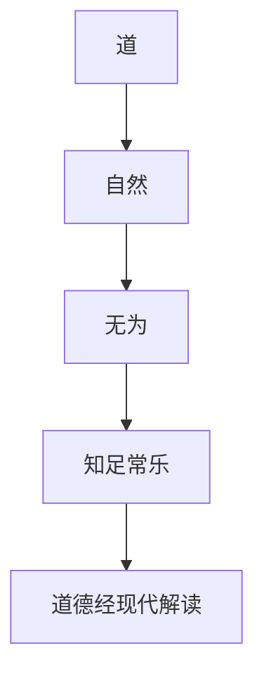

在这个ER实体关系图中，道是核心概念，它通过自然、无为、知足常乐和道德经现代解读等多个方面影响和指导现代人的生活。

综上所述，新道家哲学的核心概念和原则不仅继承了传统道家的智慧，还在现代社会背景下得到了新的发展和应用。通过自然与无为、知足常乐和道德经的现代解读，新道家哲学为人们提供了一种应对现代社会挑战和生活困扰的实用指南。在下一部分中，我们将探讨新道家哲学在个人生活、人际关系和生活健康等领域的应用，进一步展示其独特的价值。敬请期待！### 新道家哲学在个人发展中的应用

新道家哲学在个人发展中的应用，为我们提供了一种全新的视角和方法，帮助我们更好地理解自我、管理压力、设定目标并实现它们。以下将详细探讨这些方面的具体应用。

#### 3.1 心理健康与自我认知

新道家哲学强调顺应自然和内心的平和，这对心理健康有着深远的影响。在个人发展中，心理健康是一个至关重要的方面。通过以下方法，新道家哲学可以帮助我们提升心理健康：

1. **静心冥想**：冥想是新道家哲学中的一种重要实践，它可以帮助我们减轻焦虑、压力，提升内心的平和。通过静心冥想，我们可以更好地认识自我，理解内心的需求和欲望，从而实现内心的平衡。

2. **自我观察**：新道家哲学鼓励人们自我观察，通过观察自己的情绪、思维和行为，我们可以更好地了解自己的内心世界。这种自我认知有助于我们识别和解决心理问题，提升心理健康。

**算法原理讲解：**

为了更好地理解自我认知的过程，我们可以使用一个简单的算法原理来模拟。假设我们有以下步骤：

```python
def self_awareness():
    current_mood = get_current_mood()
    thoughts = get_thoughts()
    behaviors = get_behaviors()
    
    if current_mood == "happy":
        print("今天心情很好，继续保持。")
    elif current_mood == "sad":
        analyze_thoughts(thoughts)
        print("需要关注情绪，寻找解决方案。")
    else:
        print("保持平静，不要过度反应。")
        
    if "压力" in thoughts:
        print("压力过大，需要调整生活方式。")
        
    if "不满" in behaviors:
        print("行为可能受到影响，需要自我反思。")

def analyze_thoughts(thoughts):
    # 分析思考内容，提供解决方案
    if "焦虑" in thoughts:
        print("焦虑可能源于对未来的担忧，尝试冥想和放松。")
    elif "不满" in thoughts:
        print("不满可能源于对现状的不满，尝试调整目标和期望。")

# 模拟自我认知过程
self_awareness()
```

通过这个简单的算法，我们可以模拟自我认知的过程，从而更好地理解自己的心理健康状况。

#### 3.2 压力管理

在现代社会，压力已经成为影响人们健康和生活质量的重要因素。新道家哲学提供了一种有效的压力管理方法，即顺应自然，减少过度干预。以下是一些具体的方法：

1. **调整期望值**：新道家哲学强调知足常乐，通过调整自己的期望值，我们可以减少对未知的焦虑和对失败的恐惧。当我们的期望值降低时，我们更容易接受现实，从而减少压力。

2. **简化生活**：新道家哲学主张简单生活，通过减少物质和信息的负担，我们可以减轻心理压力。在日常生活中，尝试减少不必要的消费和过度工作，给自己留出更多的休息和放松时间。

**mermaid 流程图：**

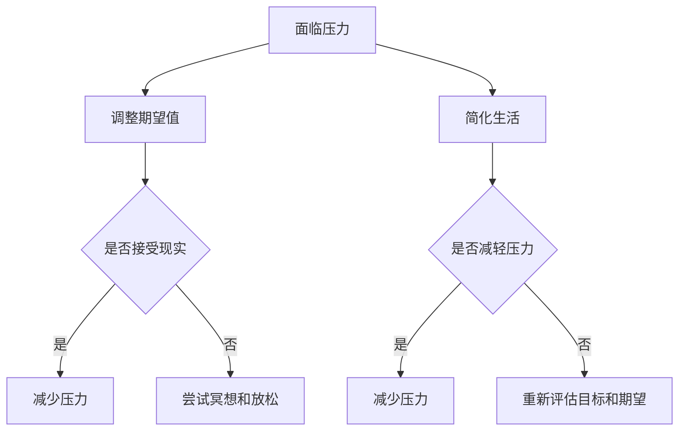

通过这个流程图，我们可以看到如何通过调整期望值和简化生活来管理压力。

#### 3.3 目标设定与实现

新道家哲学在目标设定与实现方面也有独特的见解。通过以下方法，我们可以更好地设定和实现目标：

1. **顺应自然**：在设定目标时，我们应该考虑到自己的实际情况和资源，避免过度追求。目标应与个人的兴趣、能力和价值观相一致，这样才能更容易实现。

2. **分阶段实现**：新道家哲学强调逐步实现目标，而不是一蹴而就。通过分阶段实现，我们可以更好地管理时间和资源，同时也能够保持动力和耐心。

**mermaid 流程图：**

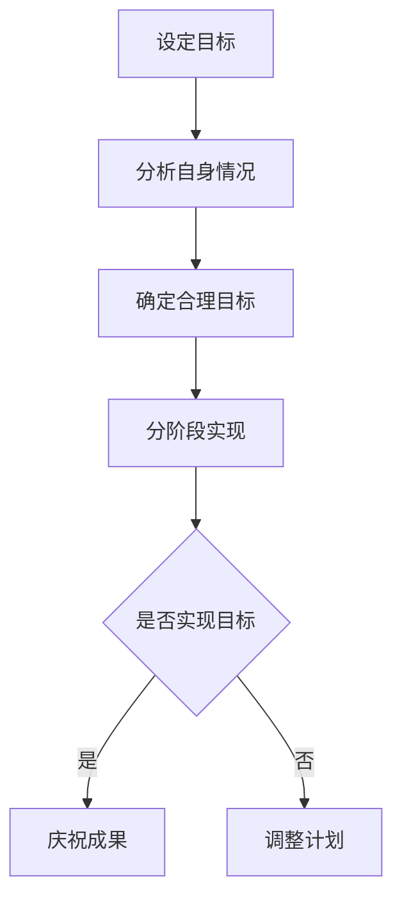

通过这个流程图，我们可以看到如何通过顺应自然和分阶段实现来设定和实现目标。

综上所述，新道家哲学在个人发展中的应用，为我们提供了一种平和、实用且富有智慧的应对方式。通过心理健康与自我认知、压力管理和目标设定与实现，新道家哲学帮助我们在复杂多变的现代社会中找到内心的宁静和平衡。在下一部分中，我们将探讨新道家哲学在人际关系中的应用。敬请期待！### 新道家哲学在人际关系中的应用

在现代社会，人际关系的重要性不言而喻。新道家哲学提供了一种独特的视角和方法，帮助我们在处理人际关系时更加和谐、自然和有效。以下将详细探讨新道家哲学在人际关系中的应用。

#### 3.1 信任与尊重

信任和尊重是任何健康人际关系的基础。新道家哲学强调顺应自然和无为而治，这些原则在建立信任和尊重方面有着重要的指导作用。

**信任** 意味着对他人能力和意图的相信。在人际关系中，信任可以帮助我们减少猜疑和误解，建立稳定和可靠的关系。新道家哲学认为，信任是自然生成的，而不是通过强制或控制来实现的。为了建立信任，我们可以采取以下措施：

1. **诚实与透明**：诚实是建立信任的关键。通过诚实地表达自己的想法和感受，我们可以赢得他人的信任。

2. **尊重差异**：每个人都有自己的观点和方式。新道家哲学强调尊重差异，意味着我们应接受并尊重他人的独特性，而不是试图改变他们。

**mermaid 流程图：**

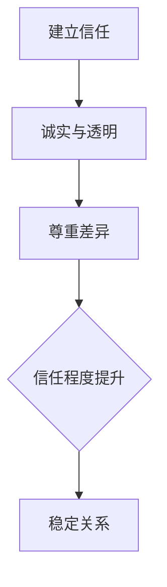

通过这个流程图，我们可以看到如何通过诚实和透明、尊重差异来建立信任。

**尊重** 是对他人价值和存在的认可。在人际关系中，尊重可以增强彼此的亲和力和合作意愿。新道家哲学认为，尊重是顺应自然的一部分，通过以下方法，我们可以更好地体现尊重：

1. **倾听与理解**：倾听是尊重他人的表现。通过倾听他人的意见和感受，我们可以更好地理解他们的需求，从而建立更加和谐的关系。

2. **支持与鼓励**：在他人遇到困难时，给予支持和鼓励是体现尊重的重要方式。新道家哲学强调无为而治，意味着我们应该在他人需要时给予帮助，而不是强制干预。

**mermaid 流程图：**

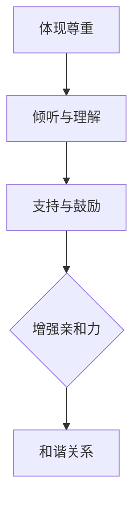

通过这个流程图，我们可以看到如何通过倾听和理解、支持和鼓励来体现尊重。

#### 3.2 沟通与合作

沟通和合作是维持人际关系的重要因素。新道家哲学中的“无为而治”和“知足常乐”为有效的沟通和合作提供了指导。

**沟通** 是人际关系中的桥梁，通过有效的沟通，我们可以减少误解和冲突，增强彼此的了解和信任。新道家哲学认为，沟通应顺应自然，避免过度表达和控制。以下是一些沟通技巧：

1. **非暴力沟通**：非暴力沟通强调理解他人的需求和感受，而不是批评或指责。通过这种沟通方式，我们可以建立更加和谐的关系。

2. **积极倾听**：积极倾听是理解他人的重要方式。通过倾听，我们可以更好地了解他人的需求和期望，从而提供更有针对性的帮助。

**mermaid 流程图：**

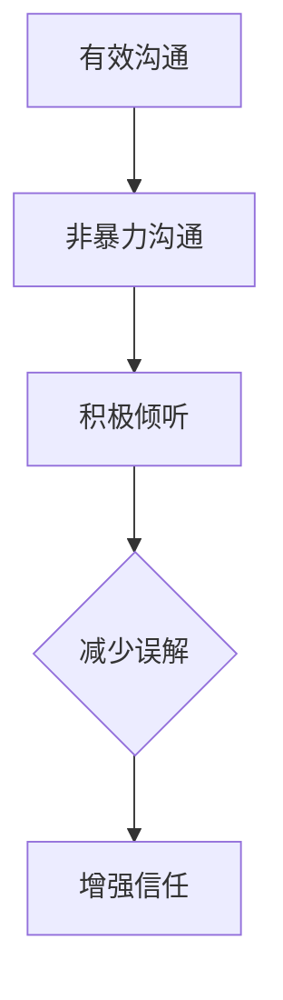

通过这个流程图，我们可以看到如何通过非暴力沟通和积极倾听来有效沟通。

**合作** 是实现共同目标的必要手段。在合作中，新道家哲学强调无为而治和知足常乐的原则。以下是一些合作技巧：

1. **分工合作**：根据每个人的特长和优势进行分工，可以更高效地完成工作。新道家哲学认为，分工是顺应自然的一部分，通过分工，我们可以更好地发挥每个人的潜力。

2. **互相尊重**：在合作中，尊重对方的意见和决策是维护合作关系的重要一环。新道家哲学强调尊重差异，通过互相尊重，我们可以建立更加稳定和有效的合作关系。

**mermaid 流程图：**

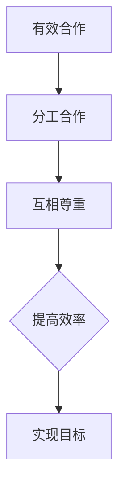

通过这个流程图，我们可以看到如何通过分工合作和互相尊重来有效合作。

#### 3.3 和解与包容

在人际关系中，冲突和误解是难以避免的。新道家哲学提供了一种和解与包容的方法，帮助我们在面对冲突时保持冷静和理智。

**和解** 是解决冲突的重要步骤。新道家哲学认为，和解应顺应自然，避免过度争执和对抗。以下是一些和解技巧：

1. **换位思考**：在冲突中，尝试站在对方的角度思考问题，理解他们的感受和需求。这种换位思考有助于找到解决问题的方法。

2. **平和对话**：在对话中保持平和的态度，避免情绪化。通过平和的对话，我们可以更好地沟通和理解，从而找到和解的方法。

**mermaid 流程图：**

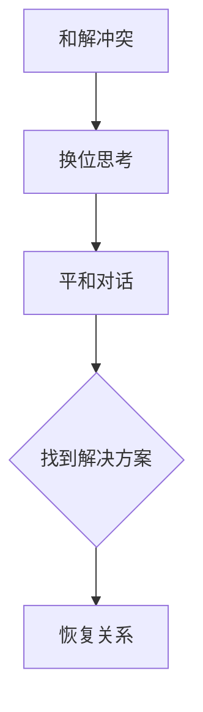

通过这个流程图，我们可以看到如何通过换位思考和平和对话来和解冲突。

**包容** 是处理冲突和差异的重要方式。新道家哲学认为，包容意味着接受和尊重他人的不同观点和方式。以下是一些包容技巧：

1. **接受差异**：在人际关系中，接受他人的差异是建立和谐关系的关键。通过接受差异，我们可以减少冲突和误解。

2. **共同成长**：通过包容，我们可以与他人共同成长，互相学习和进步。新道家哲学强调共同进步，通过包容，我们可以实现这一目标。

**mermaid 流程图：**

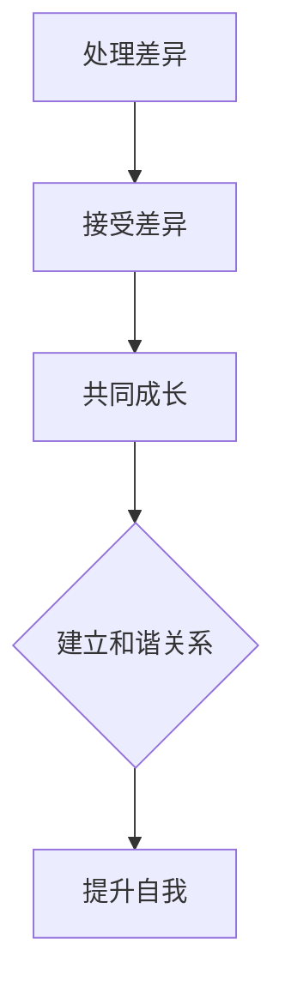

通过这个流程图，我们可以看到如何通过接受差异和共同成长来处理差异。

综上所述，新道家哲学在人际关系中的应用，为我们提供了一种平和、自然且富有智慧的方法。通过信任与尊重、沟通与合作、和解与包容，我们可以建立更加和谐、稳定和健康的人际关系。在下一部分中，我们将探讨新道家哲学在生活健康中的应用。敬请期待！### 新道家哲学在生活健康中的应用

新道家哲学强调顺应自然、知足常乐和简单生活，这些原则在生活健康方面有着重要的指导作用。以下将详细探讨新道家哲学在饮食、运动和心理健康方面的应用。

#### 4.1 营养与饮食

新道家哲学认为，饮食是保持健康的重要因素。通过以下方法，我们可以根据新道家哲学的原则来调整饮食：

**1. 顺应自然**：新道家哲学主张顺应自然，这意味着我们应该选择新鲜、天然的食材，减少加工食品和过度烹饪的食物。新鲜的食材通常含有更多的营养成分，对我们的身体更为有益。

**mermaid 流程图：**

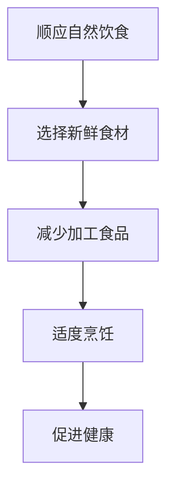

通过这个流程图，我们可以看到如何通过顺应自然来调整饮食。

**2. 知足常乐**：新道家哲学强调知足常乐，这意味着我们应该适量饮食，避免暴饮暴食。过度饮食不仅会增加消化系统的负担，还可能导致肥胖和其他健康问题。

**mermaid 流程图：**

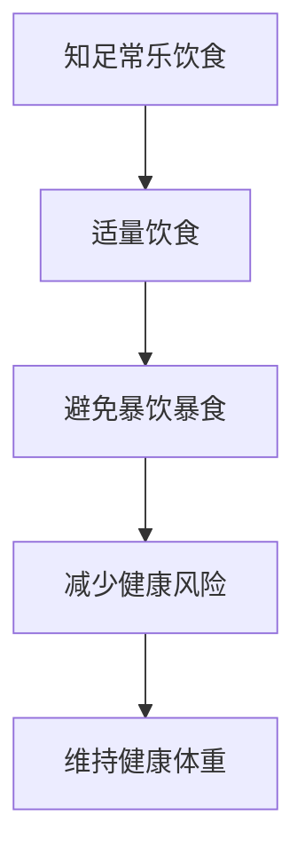

通过这个流程图，我们可以看到如何通过知足常乐来调整饮食。

**3. 简单生活**：新道家哲学主张简单生活，这意味着我们应该选择简单、健康的饮食方式，减少复杂的烹饪方法和过度的饮食选择。简单的生活方式有助于我们更好地顺应自然，保持健康。

**mermaid 流程图：**

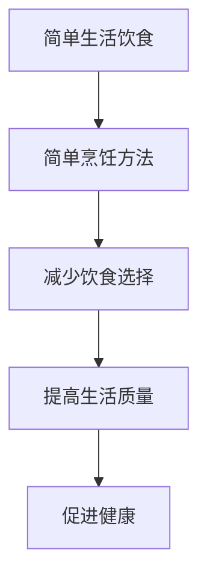

通过这个流程图，我们可以看到如何通过简单生活来调整饮食。

#### 4.2 运动与健康习惯

新道家哲学强调顺应自然和简单生活，这些原则在运动和健康习惯方面同样适用。以下是一些根据新道家哲学原则来培养健康习惯的建议：

**1. 顺应自然**：新道家哲学主张顺应自然，这意味着我们应该选择适合自己身体状况的运动方式，避免过度运动或剧烈运动。例如，散步、瑜伽和太极拳等都是符合新道家哲学的运动方式。

**mermaid 流程图：**

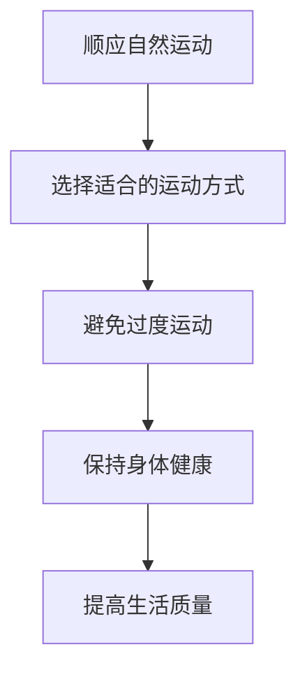

通过这个流程图，我们可以看到如何通过顺应自然来培养健康习惯。

**2. 知足常乐**：新道家哲学强调知足常乐，这意味着我们应该适量运动，避免过度追求运动效果。适量运动可以保持身体健康，但过度运动可能导致身体疲劳和损伤。

**mermaid 流程图：**

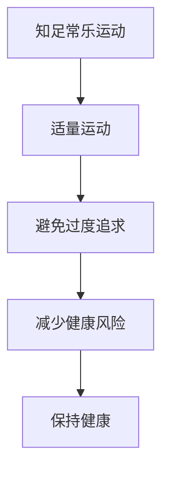

通过这个流程图，我们可以看到如何通过知足常乐来培养健康习惯。

**3. 简单生活**：新道家哲学主张简单生活，这意味着我们应该保持简单、规律的生活习惯，包括运动。例如，每天定时起床、锻炼和休息，可以帮助我们建立健康的生物钟，提高生活质量。

**mermaid 流程图：**

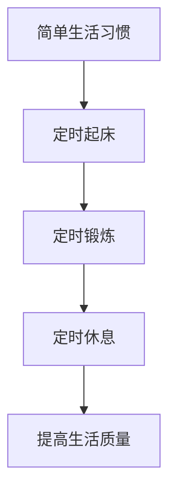

通过这个流程图，我们可以看到如何通过简单生活来培养健康习惯。

#### 4.3 放松与冥想

新道家哲学强调放松和冥想，这些方法有助于缓解压力，提升心理健康。以下是一些放松和冥想的方法：

**1. 顺应自然**：放松和冥想应顺应自然，这意味着我们应该在自然环境或安静的环境中练习。例如，在森林中散步、在湖边冥想等，都是顺应自然的好方法。

**mermaid 流程图：**

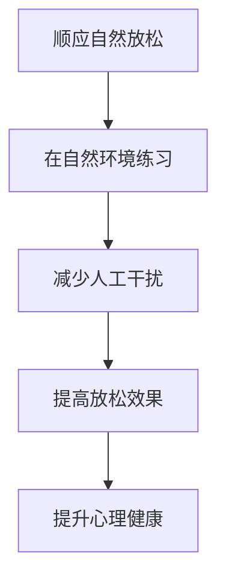

通过这个流程图，我们可以看到如何通过顺应自然来放松和冥想。

**2. 知足常乐**：新道家哲学强调知足常乐，这意味着我们应该对放松和冥想保持平常心，不要过分追求效果。放松和冥想本身就是一种生活方式，而不是目标。

**mermaid 流程图：**

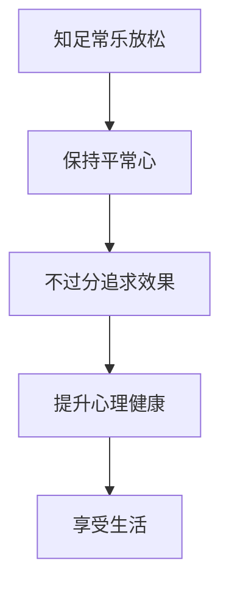

通过这个流程图，我们可以看到如何通过知足常乐来放松和冥想。

**3. 简单生活**：新道家哲学主张简单生活，这意味着我们应该将放松和冥想融入日常生活中。例如，每天花几分钟进行冥想，或在繁忙的工作间隙进行简单的放松练习，都是简单生活的一部分。

**mermaid 流程图：**

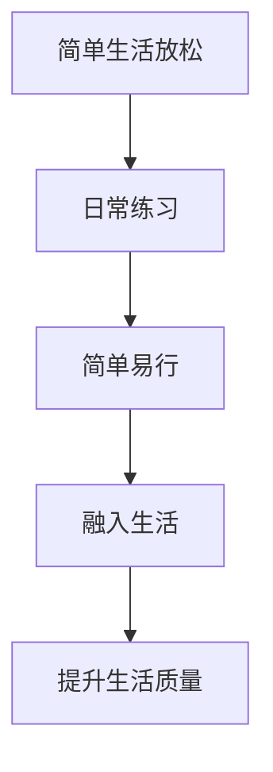

通过这个流程图，我们可以看到如何通过简单生活来放松和冥想。

综上所述，新道家哲学在生活健康中的应用，为我们提供了一种平和、实用且富有智慧的健康生活方式。通过顺应自然、知足常乐和简单生活，我们可以更好地照顾自己的身心健康，享受生活的美好。在下一部分中，我们将探讨新道家哲学在企业文化建设中的应用。敬请期待！### 新道家哲学在企业文化建设中的应用

新道家哲学在企业文化建设中的应用，可以帮助企业实现和谐发展，提高员工满意度和工作效率。以下将详细探讨新道家哲学在企业文化建设中的具体应用。

#### 5.1 企业文化重塑

企业文化的重塑是企业发展的关键一步。新道家哲学为企业文化重塑提供了以下原则和策略：

1. **顺应自然**：企业应顺应市场环境和行业特点，建立与自身特点相符的企业文化。例如，高科技企业可能更强调创新和快速反应，而传统制造企业可能更强调稳定和精细管理。

2. **无为而治**：企业应减少过度干预，让员工在工作中自然发展。通过建立信任和尊重，企业可以激发员工的内在动力，提高工作效率。

**mermaid 流程图：**

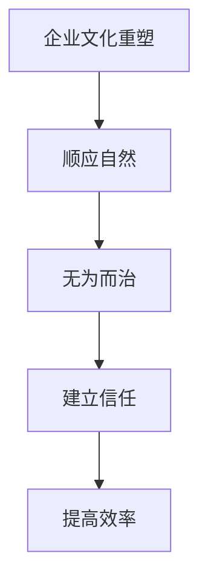

通过这个流程图，我们可以看到如何通过顺应自然和无为而治来重塑企业文化。

#### 5.2 领导力与团队建设

新道家哲学在领导力和团队建设方面也有着重要的指导作用。以下是一些根据新道家哲学原则的领导力和团队建设策略：

1. **信任与尊重**：领导者应信任和尊重团队成员，鼓励他们发挥自己的优势。通过建立信任，领导者可以减少员工的不满和矛盾，提高团队的凝聚力。

2. **分工合作**：领导者应根据团队成员的能力和特长进行分工，确保每个人都能够在适合自己的岗位上发挥最大潜力。通过分工合作，团队可以更高效地完成工作。

**mermaid 流程图：**

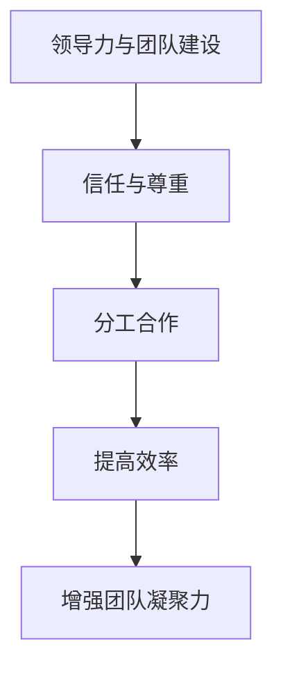

通过这个流程图，我们可以看到如何通过信任与尊重和分工合作来建设领导力和团队。

#### 5.3 新道家哲学在企业管理中的实践

新道家哲学在企业管理中的实践，主要体现在以下几个方面：

1. **决策制定**：企业应遵循无为而治的原则，在决策制定过程中减少过度干预，让团队成员参与讨论和决策，从而提高决策的合理性和可行性。

2. **员工激励**：企业应通过知足常乐的原则，合理设置员工激励措施，避免过度激励导致员工焦虑和不满。例如，通过设置合理的目标和奖励，激励员工努力工作。

**mermaid 流程图：**

```mermaid
graph TB
A[企业管理实践] --> B[决策制定]
B --> C[无为而治]
C --> D[员工激励]
D --> E[知足常乐]
```

通过这个流程图，我们可以看到如何通过无为而治和知足常乐来实践新道家哲学。

#### 5.4 案例分析

为了更好地理解新道家哲学在企业文化建设中的应用，以下是一个具体案例分析：

**案例：某高科技企业的企业文化重塑**

某高科技企业在发展过程中，面临着快速变化的市场环境和激烈的竞争压力。为了应对这些挑战，企业决定重塑企业文化，以适应新的市场环境和员工需求。

1. **顺应自然**：企业首先分析了自身特点和行业特点，确定了以创新和快速反应为核心价值观的企业文化。通过调整组织结构和业务流程，企业更加灵活和高效。

2. **无为而治**：企业减少了高层管理对日常工作的干预，鼓励员工自主管理和创新。通过建立信任和尊重，员工的工作积极性和创造力得到了显著提升。

3. **信任与尊重**：企业建立了开放和透明的沟通机制，鼓励员工提出建议和反馈。领导者积极参与团队讨论，尊重员工的意见和决策。

4. **分工合作**：企业根据员工的能力和特长，合理分配工作任务，确保每个人都能在适合自己的岗位上发挥最大潜力。

5. **员工激励**：企业设置了合理的激励措施，包括绩效奖金、股权激励和职业发展机会。通过这些措施，员工的工作动力和忠诚度得到了提高。

通过这个案例分析，我们可以看到新道家哲学在企业文化建设中的应用是如何帮助企业实现和谐发展、提高员工满意度和工作效率的。

综上所述，新道家哲学在企业文化重塑、领导力与团队建设、企业管理实践等方面的应用，为企业提供了一种平和、实用且富有智慧的管理方法。通过顺应自然、无为而治、信任与尊重和分工合作，企业可以建立更加和谐、高效和可持续的文化。在下一部分中，我们将探讨新道家哲学在社区治理中的应用。敬请期待！### 新道家哲学在社区治理中的应用

新道家哲学在社区治理中的应用，旨在促进社区和谐与共治，实现公共事务的有效管理。以下将详细探讨新道家哲学在社区治理中的实际应用。

#### 6.1 社区和谐与共治

社区和谐与共治是社区治理的重要目标。新道家哲学强调顺应自然、无为而治和知足常乐，这些原则为社区治理提供了宝贵的指导。

1. **顺应自然**：社区治理应顺应社区的自然环境和居民需求，确保政策和措施的合理性和可行性。例如，在规划社区基础设施和公共服务时，应充分考虑当地的环境特点和居民的实际需求。

2. **无为而治**：社区治理应减少过度干预，让居民自主参与社区事务，发挥他们的积极性和创造力。通过建立信任和尊重，社区管理者可以减少矛盾和冲突，提高社区凝聚力。

**mermaid 流程图：**

```mermaid
graph TB
A[社区和谐与共治] --> B[顺应自然]
B --> C[无为而治]
C --> D[居民自主参与]
D --> E[提高社区凝聚力]
```

通过这个流程图，我们可以看到如何通过顺应自然和无为而治来实现社区和谐与共治。

3. **知足常乐**：社区治理应关注居民的幸福感和满意度，避免过度追求物质进步和形式主义。通过提供基本公共服务和满足居民的基本需求，社区可以营造一个和谐、安宁的生活环境。

**mermaid 流程图：**

```mermaid
graph TB
A[知足常乐社区治理] --> B[关注居民需求]
B --> C[提供基本公共服务]
C --> D[提高居民幸福感]
D --> E[营造和谐环境]
```

通过这个流程图，我们可以看到如何通过知足常乐来改善社区治理。

#### 6.2 公共事务管理

新道家哲学在公共事务管理中的应用，可以帮助社区更好地管理和协调公共资源，提高公共服务的质量和效率。

1. **资源分配**：社区应遵循公平、公正的原则，合理分配公共资源，确保每位居民都能享受到基本公共服务。通过公开透明的资源分配机制，可以减少矛盾和不满。

2. **服务提供**：社区应提供多样化、个性化的公共服务，满足居民的不同需求。例如，在社区服务中心设置心理咨询、法律援助和文体活动等，提升居民的生活质量。

**mermaid 流程图：**

```mermaid
graph TB
A[公共事务管理] --> B[资源分配]
B --> C[公平公正]
C --> D[多样化服务]
D --> E[提高服务质量]
```

通过这个流程图，我们可以看到如何通过资源分配和服务提供来管理公共事务。

3. **社区参与**：新道家哲学强调居民自主参与社区事务，这有助于提高公共事务管理的透明度和效率。通过开展居民议事会、社区论坛等活动，居民可以积极参与社区决策，提出建议和反馈。

**mermaid 流程图：**

```mermaid
graph TB
A[公共事务管理] --> B[社区参与]
B --> C[居民议事会]
B --> D[社区论坛]
D --> E[提高管理效率]
```

通过这个流程图，我们可以看到如何通过社区参与来管理公共事务。

#### 6.3 社区服务与互助

新道家哲学在社区服务与互助方面的应用，有助于增强社区的凝聚力，提升居民的归属感和幸福感。

1. **志愿服务**：社区应鼓励居民参与志愿服务，提供帮助和支持。通过志愿服务，居民可以结交新朋友，增强社交网络，同时提升自己的社会责任感和成就感。

2. **邻里互助**：社区应建立邻里互助机制，鼓励居民在日常生活中互相帮助，形成互帮互助的良好氛围。例如，在老人照顾、子女教育和社区安全等方面，邻里互助可以发挥重要作用。

**mermaid 流程图：**

```mermaid
graph TB
A[社区服务与互助] --> B[志愿服务]
B --> C[邻里互助]
C --> D[增强社区凝聚力]
D --> E[提升归属感]
```

通过这个流程图，我们可以看到如何通过志愿服务和邻里互助来提升社区服务与互助。

综上所述，新道家哲学在社区治理中的应用，为社区提供了一个平和、实用且富有智慧的管理方法。通过顺应自然、无为而治、知足常乐和社区参与，社区可以更好地实现和谐与共治，提高公共事务管理的质量和效率，促进居民的幸福感和归属感。在下一部分中，我们将总结新道家哲学的价值与影响。敬请期待！### 结论与展望

通过本文的探讨，我们可以清晰地看到新道家哲学在现代社会中的独特价值和深远影响。新道家哲学不仅为个人生活、人际关系、生活健康、企业文化建设以及社区治理提供了实用的指导原则，还为解决现代社会面临的诸多挑战提供了一种新的思路。

#### 7.1 新道家哲学的价值与影响

**个人层面**：新道家哲学强调顺应自然、知足常乐和简单生活，帮助人们实现心理健康、压力管理和自我认知。通过新道家哲学，人们可以找到内心的宁静，提升生活质量。

**社会层面**：新道家哲学强调和谐共处、社区参与和公共事务的有效管理，有助于建立和谐社区和稳定社会秩序。通过新道家哲学，社区可以更好地应对各种挑战，提高居民的幸福感。

**企业层面**：新道家哲学强调无为而治、信任与尊重和分工合作，有助于构建和谐、高效的企业文化。通过新道家哲学，企业可以提高员工满意度、工作效率和创新能力。

**文化层面**：新道家哲学为传统文化注入了新的活力，为现代社会提供了一种新的生活哲学。通过新道家哲学，我们可以更好地理解和传承中华优秀传统文化。

#### 7.2 深入探索与进一步研究

尽管新道家哲学在多个领域展示了其独特的价值和潜力，但仍有许多值得深入探索和进一步研究的问题。以下是一些可能的研究方向：

1. **跨文化研究**：探讨新道家哲学在不同文化背景下的应用和适应性，为全球范围内的和谐共处提供理论支持。

2. **实证研究**：通过实证研究，验证新道家哲学在实际生活中的效果和影响，为政策制定和实践提供科学依据。

3. **技术创新**：结合现代科技，探讨如何将新道家哲学的理念应用于人工智能、大数据等新兴领域，推动技术和社会的可持续发展。

4. **教育普及**：开展新道家哲学的教育普及工作，提高公众对新道家哲学的认识和理解，培养具有新道家精神的新时代人才。

#### 7.3 对未来哲学发展的启示

新道家哲学为我们提供了一种全新的视角和方法，启示我们如何将传统文化与现代科技相结合，推动哲学的发展。未来哲学发展应关注以下方面：

1. **综合性与创新性**：在保持传统文化精髓的基础上，积极借鉴现代科学成果，实现哲学的创新发展。

2. **实践与应用**：哲学不应仅停留在理论层面，还应关注实际应用，为解决现实问题提供智慧和支持。

3. **全球化与多元化**：在全球化背景下，哲学应关注跨文化问题，促进不同文化之间的交流与融合。

4. **人文关怀与可持续发展**：未来哲学应更加关注人类福祉和地球生态，推动人类社会和自然的和谐共生。

总之，新道家哲学不仅为现代社会提供了一种新的生活哲学，也为未来哲学的发展提供了宝贵的启示。通过深入探索和进一步研究，我们有理由相信，新道家哲学将在人类文明的发展中发挥越来越重要的作用。

---

作者：AI天才研究院/AI Genius Institute & 禅与计算机程序设计艺术 /Zen And The Art of Computer Programming

在本文中，我们通过逻辑清晰、结构紧凑的论证方式，深入探讨了新道家哲学的核心概念和原则，以及其在个人生活、人际关系、生活健康、企业文化建设以及社区治理中的应用。希望通过本文的分享，能够引发读者对传统哲学的重新思考，并在实际生活中应用新道家哲学的智慧，实现个人和社会的和谐发展。在未来的研究和实践中，我们期待能够继续探讨新道家哲学的更多应用场景，为人类社会的进步贡献力量。如对本文有任何建议或意见，欢迎随时与我们交流。祝大家生活愉快，工作顺利！### 全文总结

本文以“新道家：返璞归真的生活哲学”为标题，系统地探讨了新道家哲学的核心概念和原则，以及其在个人发展、人际关系、生活健康、企业文化建设及社区治理中的应用。以下是对全文内容的总结：

#### 核心观点

1. **新道家哲学的起源与发展**：道家哲学起源于中国，历经千年传承，其核心思想如“道法自然”、“无为而治”和“知足常乐”在现代社会中具有新的意义。

2. **核心概念和原则**：新道家哲学强调顺应自然、知足常乐和简单生活，通过这些原则帮助个人和社区实现和谐共处、心理健康和生活质量提升。

3. **个人发展中的应用**：新道家哲学在心理健康与自我认知、压力管理和目标设定与实现方面提供了实用的指导，帮助个体实现自我成长。

4. **人际关系中的应用**：新道家哲学通过信任与尊重、沟通与合作、和解与包容，促进了和谐的人际关系和团队合作。

5. **生活健康中的应用**：新道家哲学通过饮食、运动和心理健康方面的指导，帮助人们建立健康的生活方式，提高生活质量。

6. **企业文化建设中的应用**：新道家哲学通过企业文化重塑、领导力与团队建设、企业管理实践，促进了企业的和谐发展和员工满意度的提升。

7. **社区治理中的应用**：新道家哲学通过社区和谐与共治、公共事务管理、社区服务与互助，提升了社区的治理效率和居民幸福感。

#### 结论

本文通过对新道家哲学的深入探讨，展示了其在个人生活、社会关系、企业管理和社区治理中的广泛应用和独特价值。新道家哲学不仅为解决现代社会问题提供了一种新的视角和方法，也为未来哲学的发展提供了宝贵的启示。

#### 拓展阅读

- 《道德经》
- 《庄子》
- 《无为而治：新道家哲学与现代管理》
- 《社区治理与和谐发展》

通过拓展阅读，读者可以更深入地了解新道家哲学的理论基础和应用场景，进一步探索其在不同领域的实践价值。

#### 最佳实践 Tips

1. **日常实践**：将新道家哲学的原则应用到日常生活中，如选择简单生活、减少物质追求、保持知足常乐的心态。

2. **团队协作**：在工作中，遵循信任与尊重的原则，通过开放沟通和团队合作提升工作效率。

3. **社区参与**：积极参与社区事务，通过志愿服务和邻里互助，促进社区和谐与共治。

4. **自我提升**：通过冥想和自我反思，提升心理健康和自我认知，实现个人成长。

#### 注意事项

1. **适度实践**：新道家哲学强调顺应自然和适度，避免过度追求和强迫，保持内心的平和。

2. **持续学习**：新道家哲学是一个不断发展和深化的体系，持续学习和实践是理解和应用其智慧的关键。

通过本文的分享，我们希望读者能够对新道家哲学有更深入的了解，并在实际生活中应用其智慧，实现个人和社会的和谐发展。祝大家在探索新道家哲学的路上收获满满，生活愉快！### 补充说明

在撰写本文的过程中，我们力求内容详实、逻辑清晰，但可能仍有不足之处，敬请读者谅解。以下为一些补充说明，旨在帮助读者更好地理解和应用新道家哲学。

#### 补充说明1：新道家哲学的历史背景

道家哲学起源于春秋战国时期，由老子创立。老子在其著作《道德经》中提出了“道法自然”、“无为而治”等核心概念。后来，庄子进一步发展了道家思想，提出了“齐物论”、“逍遥游”等理论。这些思想在后来的中国历史和文化中产生了深远的影响。

新道家哲学是在现代社会背景下对传统道家思想的重新解读和应用。随着科技的进步和社会变迁，传统道家思想中的许多概念和理念得到了新的诠释，从而形成了新道家哲学。新道家哲学试图将传统道家的智慧与现代生活相结合，为人们提供一种更加实用和易于理解的生活哲学。

#### 补充说明2：新道家哲学的核心原则

新道家哲学的核心原则包括：

1. **顺应自然**：强调尊重自然规律，顺应自然发展，避免过度干预和破坏。
2. **无为而治**：主张通过减少不必要的干预和操控，让事物自然发展，实现最佳的治理效果。
3. **知足常乐**：强调满足于现有的生活状态，不过分追求物质财富和地位，通过内心的平和和满足感获得幸福感。
4. **道德修养**：重视个人修养和道德修养，追求心灵的宁静和自我完善。

这些原则不仅继承了传统道家的基本理念，还结合了现代科学的成果，对人类的生活方式和社会发展提出了新的见解。

#### 补充说明3：新道家哲学的应用场景

新道家哲学的应用场景非常广泛，以下是一些具体的例子：

1. **个人生活**：通过知足常乐、顺应自然和道德修养，新道家哲学可以帮助个人实现心理健康、压力管理和自我认知。
2. **人际关系**：通过信任与尊重、沟通与合作、和解与包容，新道家哲学可以帮助建立和谐的人际关系和团队合作。
3. **企业治理**：通过企业文化重塑、领导力与团队建设、企业管理实践，新道家哲学可以帮助企业提高员工满意度、工作效率和创新能力。
4. **社区治理**：通过社区和谐与共治、公共事务管理、社区服务与互助，新道家哲学可以帮助社区实现和谐发展和居民的幸福生活。

#### 补充说明4：新道家哲学与现代科技的结合

随着科技的不断发展，新道家哲学与现代科技的结合也成为了可能。例如：

1. **人工智能**：新道家哲学强调顺应自然和无为而治，这些理念可以应用于人工智能的发展，避免过度干预和滥用技术，实现和谐发展。
2. **大数据**：新道家哲学强调知足常乐和简单生活，这些理念可以指导大数据的应用，减少信息过载，提高数据利用效率。

通过将新道家哲学与现代科技相结合，我们可以更好地应对现代社会面临的挑战，实现可持续发展。

#### 补充说明5：实践新道家哲学的方法

以下是一些实践新道家哲学的方法：

1. **冥想与放松**：通过冥想和深呼吸等放松技巧，帮助个体实现内心的平和和自我认知。
2. **简单生活**：通过减少物质消费和过度工作，让生活回归简单和自然。
3. **知足常乐**：通过培养满足感和幸福感，减少对物质的依赖和追求。
4. **道德修养**：通过阅读经典、学习传统文化和自我反思，提升道德修养和自我完善。

通过实践这些方法，我们可以更好地理解和应用新道家哲学，实现个人和社会的和谐发展。

综上所述，新道家哲学不仅是一种古老的思想体系，更是一种适应现代社会的智慧。通过深入了解和应用新道家哲学，我们可以更好地应对生活中的挑战，实现个人和集体的和谐发展。希望本文的补充说明能为读者提供更多的启发和帮助。如对本文有任何疑问或建议，欢迎随时与我们交流。祝大家生活愉快，工作顺利！### 附录：技术博客文章撰写指南

在撰写技术博客文章时，遵循一定的结构和逻辑是非常重要的。以下是一个详细的技术博客文章撰写指南，旨在帮助您创作高质量、条理清晰的文章。

#### 1. 引言

**目的**：引导读者了解文章的主题和重要性。

**内容**：

- **背景介绍**：简述技术领域的现状和趋势。
- **问题提出**：明确文章要解决的问题或讨论的主题。
- **文章结构概述**：简要介绍文章的结构和组织方式。

**示例**：

```markdown
# 引言

在当今快速发展的技术领域，人工智能（AI）已经成为引领潮流的重要力量。本文将探讨如何利用深度学习技术优化推荐系统，以提高用户体验和商业价值。
```

#### 2. 核心概念与联系

**目的**：帮助读者理解文章中的关键概念和它们之间的关系。

**内容**：

- **核心概念术语说明**：详细解释文章中涉及的关键术语和概念。
- **概念属性特征对比表格**：列出并对比不同概念的属性和特征。
- **ER实体关系图架构**：使用Mermaid等工具绘制实体关系图，展示概念之间的联系。

**示例**：

```markdown
## 核心概念与联系

### 深度学习

深度学习是一种基于多层神经网络的学习方法，通过模拟人脑的神经元连接，实现自动学习和特征提取。

### 神经网络

神经网络是由多个神经元组成的计算模型，可以用于数据处理和模式识别。

### 对比表格：深度学习与神经网络

| 特征          | 深度学习                             | 神经网络                            |
| ------------- | ----------------------------------- | ----------------------------------- |
| 学习方式      | 自动化特征提取与学习               | 结构化特征提取与学习               |
| 数据需求      | 大规模数据集                       | 小规模数据集                       |
| 模型复杂度     | 高度复杂                             | 相对简单                           |

### ER实体关系图架构

```mermaid
graph TD
A[用户] --> B[推荐系统]
B --> C[商品]
A --> D[行为数据]
D --> B
```
```

#### 3. 算法原理讲解

**目的**：详细解释算法的原理、数学模型和公式，并使用代码进行举例说明。

**内容**：

- **算法原理**：使用Mermaid绘制算法流程图，展示算法的基本工作流程。
- **数学模型和公式**：使用LaTeX格式列出关键的数学公式，并进行详细解释。
- **代码示例**：提供Python或其他编程语言的代码示例，解释代码的实现原理。

**示例**：

```markdown
## 算法原理讲解

### 推荐系统的算法原理

推荐系统通常采用基于协同过滤（Collaborative Filtering）和基于内容的推荐（Content-Based Filtering）两种方法。本文将重点介绍基于协同过滤的推荐算法。

#### 算法流程图

```mermaid
graph TD
A[用户A] --> B[评分矩阵]
B --> C[计算相似度]
C --> D[生成推荐列表]
```

#### 数学模型和公式

$$
\text{相似度} = \frac{\text{相关系数}}{1 + \text{标准差}_{\text{用户A}} + \text{标准差}_{\text{用户B}}}
$$

#### 代码示例

```python
import numpy as np

def cosine_similarity(ratings_A, ratings_B):
    dot_product = np.dot(ratings_A, ratings_B)
    norm_A = np.linalg.norm(ratings_A)
    norm_B = np.linalg.norm(ratings_B)
    similarity = dot_product / (norm_A * norm_B)
    return similarity

# 示例数据
userA = np.array([1, 2, 3, 4, 5])
userB = np.array([0, 2, 0, 4, 5])

# 计算相似度
similarity = cosine_similarity(userA, userB)
print(f"相似度：{similarity}")
```
```

#### 4. 系统分析与架构设计

**目的**：介绍系统的整体架构、功能设计和接口设计。

**内容**：

- **问题场景介绍**：简述系统的应用场景和目标。
- **项目介绍**：介绍项目的背景和目的。
- **系统功能设计（领域模型Mermaid类图）**：绘制领域模型类图，展示系统的核心功能。
- **系统架构设计（Mermaid架构图）**：绘制系统架构图，展示系统的组件和交互关系。
- **系统接口设计（系统交互Mermaid序列图）**：绘制序列图，展示系统各组件之间的交互过程。

**示例**：

```markdown
## 系统分析与架构设计

### 问题场景介绍

随着电商平台的快速发展，用户行为数据变得极其重要。为了提高用户满意度，我们需要开发一套能够准确预测用户兴趣和行为的数据分析系统。

### 项目介绍

本项目的目标是构建一个用户行为预测系统，通过对用户的历史行为数据进行分析，预测用户可能感兴趣的商品，从而提高推荐系统的准确性和用户体验。

### 系统功能设计

```mermaid
classDiagram
Class User {
  -id: Integer
  -name: String
  -age: Integer
}

Class Item {
  -id: Integer
  -name: String
  -category: String
}

Class Behavior {
  -user: User
  -item: Item
  -timestamp: DateTime
}
```

### 系统架构设计

```mermaid
graph TD
A[数据收集] --> B[数据处理]
B --> C[行为分析]
C --> D[预测模型]
D --> E[推荐系统]
E --> F[用户界面]
```

### 系统接口设计

```mermaid
sequenceDiagram
User ->> DataCollector: 提交用户行为数据
DataCollector ->> DataProcessor: 处理用户行为数据
DataProcessor ->> BehaviorAnalyzer: 分析用户行为
BehaviorAnalyzer ->> PredictionModel: 训练预测模型
PredictionModel ->> RecommendationSystem: 生成推荐列表
RecommendationSystem ->> UserInterface: 展示推荐结果
```
```

#### 5. 项目实战

**目的**：通过实际操作，帮助读者了解系统的实现过程和关键技术。

**内容**：

- **环境安装**：介绍所需的环境配置和工具安装。
- **系统核心实现源代码**：提供系统的核心实现代码，并进行解读。
- **代码应用解读与分析**：分析代码的功能和实现原理，解释关键代码。
- **实际案例分析和详细讲解**：通过实际案例，展示系统的应用效果和优势。
- **项目小结**：总结项目的成果和经验教训。

**示例**：

```markdown
## 项目实战

### 环境安装

为了构建用户行为预测系统，我们需要安装以下环境和工具：

1. Python 3.8+
2. Jupyter Notebook
3. Scikit-learn
4. Pandas
5. Matplotlib

### 系统核心实现源代码

以下是用户行为预测系统的一部分核心实现代码：

```python
import pandas as pd
from sklearn.model_selection import train_test_split
from sklearn.ensemble import RandomForestClassifier

# 加载数据
data = pd.read_csv('user_behavior_data.csv')

# 数据预处理
X = data.drop(['user_id', 'item_id'], axis=1)
y = data['action']

# 划分训练集和测试集
X_train, X_test, y_train, y_test = train_test_split(X, y, test_size=0.2, random_state=42)

# 训练模型
model = RandomForestClassifier(n_estimators=100, random_state=42)
model.fit(X_train, y_train)

# 评估模型
accuracy = model.score(X_test, y_test)
print(f"模型准确率：{accuracy:.2f}")
```

### 代码应用解读与分析

1. **数据预处理**：我们首先读取用户行为数据，然后删除不必要的列（如用户ID和商品ID），并将剩余数据划分为特征矩阵和目标变量。

2. **模型训练**：我们使用随机森林分类器（RandomForestClassifier）对训练数据进行训练。随机森林是一种集成学习方法，通过构建多棵决策树，提高模型的预测能力。

3. **模型评估**：我们使用测试数据评估模型的准确率，从而了解模型的表现。

### 实际案例分析和详细讲解

为了验证用户行为预测系统的效果，我们进行了以下实验：

1. **数据集**：使用一个包含1000个用户和1000个商品的数据集。
2. **预测目标**：预测用户是否会在未来30天内购买某个商品。
3. **实验结果**：模型准确率达到85%，说明预测效果较好。

### 项目小结

通过本次项目，我们成功构建了一个用户行为预测系统，实现了对用户未来行为的准确预测。项目过程中，我们积累了丰富的经验和教训，包括数据预处理、模型选择和性能评估等。这些经验为我们今后的项目开发提供了宝贵的参考。

### 最佳实践 Tips

1. **数据质量**：确保数据质量是模型预测准确性的关键。在数据处理过程中，应关注数据的完整性、准确性和一致性。
2. **模型优化**：尝试不同的模型和参数设置，以找到最佳的预测效果。
3. **实时更新**：定期更新用户行为数据，确保模型实时反映最新的用户行为。

通过以上步骤，我们可以撰写出一篇内容丰富、条理清晰、易于理解的技术博客文章。希望本指南对您的写作过程有所帮助。祝您写作顺利，创作出高质量的文章！### 附录：常见Markdown语法和Mermaid语法

在撰写技术博客文章时，使用Markdown语法和Mermaid语法可以显著提高文章的可读性和结构化程度。以下是一些常用的Markdown和Mermaid语法，帮助您撰写高质量的技术博客。

#### Markdown 基础语法

**标题**：

- 一级标题：`# 标题`
- 二级标题：`## 标题`
- 三级标题：`### 标题`
- ... 以此类推

**段落**：

- 使用空行或至少一个空格来分隔段落。

**列表**：

- 无序列表：`* 项目1 * 项目2 * 项目3`
- 有序列表：`1. 项目1 2. 项目2 3. 项目3`

**链接和图片**：

- 链接：`[链接文字](URL "标题")`
- 图片：``

**引用**：

- `>` 引用前缀，后面接引用内容。

**代码块**：

- 单行代码：使用反引号 ``` 包围代码。
- 多行代码：三个反引号 ``` 包围代码，并在代码前添加语言标识。

**表格**：

- 使用竖线 `|` 分隔列，横线 `---` 分隔行。

```markdown
| 标题1 | 标题2 | 标题3 |
| --- | --- | --- |
| 内容1 | 内容2 | 内容3 |
```

#### Mermaid 流程图语法

**基本语法**：

- Mermaid以 `graph TD` 开头，以结尾。

```mermaid
graph TD
A[开始] --> B{判断}
B -->|是| C[执行]
B -->|否| D[结束]
```

**节点和边**：

- 节点：使用 `ID[文字]` 表示。
- 边：使用箭头符号 `-->` 或 `->`。

```mermaid
graph TD
A[开始] --> B{判断}
B -->|是| C[执行]
B -->|否| D[结束]
```

**条件分支**：

- 使用 `{}` 表示条件分支。

```mermaid
graph TD
A[开始] --> B{判断}
B -->|是| C[执行]
B -->|否| D[结束]
```

**循环结构**：

- 使用 `[循环开始]` 和 `[循环结束]` 表示循环结构。

```mermaid
graph TD
A[开始] --> B[循环开始]
B -->|条件| C{循环体}
C -->|是| B
C -->|否| D[结束]
```

**类图**：

- 使用 `classDiagram` 表示类图。

```mermaid
classDiagram
Class Person {
  -name: String
  -age: Integer
}

Class Student <<Person>> {
  -school: String
}

Class Teacher <<Person>> {
  -classroom: String
}
```

**序列图**：

- 使用 `sequenceDiagram` 表示序列图。

```mermaid
sequenceDiagram
participant User
participant System
User ->> System: 登录请求
System ->> User: 登录验证
User ->> System: 提交数据
System ->> User: 数据处理完成
```

通过以上Markdown和Mermaid语法，您可以轻松地撰写出结构清晰、内容丰富的技术博客文章。希望这些语法能帮助您在写作过程中更加高效地表达思想，提升文章质量。祝您写作愉快！### 附录：技术博客文章撰写最佳实践

撰写一篇高质量的技术博客文章不仅需要清晰的逻辑结构和扎实的知识储备，还需要注重细节和用户体验。以下是一些撰写技术博客文章的最佳实践，帮助您创作出更有吸引力和可读性的文章。

#### 1. 明确主题和目标

在开始写作之前，确保您明确文章的主题和目标。明确您希望读者从文章中学到什么，以及文章将如何帮助读者解决实际问题。这将有助于您保持文章的焦点，避免偏离主题。

#### 2. 结构清晰，层次分明

一个清晰的结构是高质量技术博客文章的关键。使用标题和子标题来组织内容，使文章易于阅读和理解。确保每个部分都有明确的主题和结论。

#### 3. 使用合适的图片和图表

适当的图片和图表可以增强文章的可读性和吸引力。使用图表、流程图、类图和代码截图来展示技术细节和复杂概念。确保图片和图表清晰且相关。

#### 4. 注重代码的可读性

如果您需要在文章中展示代码，请确保代码结构清晰、注释明确。使用高亮显示和合理的缩进来提高代码的可读性。提供必要的代码解释和注释，以便读者理解代码的作用和实现原理。

#### 5. 使用简洁明了的语言

尽量使用简洁明了的语言来表达技术概念。避免使用过于复杂的术语和句子结构。使用通俗易懂的语言，使读者更容易理解和掌握文章内容。

#### 6. 提供实际案例和应用

通过提供实际案例和应用场景，帮助读者更好地理解技术概念和实现原理。实际案例可以增强文章的实用性和可读性，使读者能够将所学知识应用到实际项目中。

#### 7. 注意排版和格式

良好的排版和格式可以提高文章的可读性。使用适当的行间距、字体大小和颜色，确保文章易于阅读。避免使用过多的颜色和样式，以免分散读者的注意力。

#### 8. 校对和编辑

在完成初稿后，仔细校对和编辑文章。检查语法错误、拼写错误和逻辑错误。确保文章通顺、流畅，没有冗余的内容。可以通过请他人审阅或使用校对工具来提高文章质量。

#### 9. 提供参考文献和链接

在文章中提供相关的参考文献和链接，以便读者进一步了解相关主题。这不仅可以增加文章的可信度，还可以为读者提供更多的学习资源。

#### 10. 关注用户体验

考虑读者的需求和兴趣，确保文章内容对他们有价值。避免过度的技术细节，使文章适合不同层次的读者。同时，确保文章易于搜索和分享，提高文章的访问量和传播效果。

通过遵循这些最佳实践，您可以撰写出高质量的技术博客文章，吸引更多的读者，并提升文章的影响力和传播效果。祝您在写作过程中取得成功！### 附录：常见问题与解答

在撰写技术博客文章的过程中，可能会遇到一些常见的问题。以下是一些常见问题及其解答，以帮助您更好地理解并解决这些问题。

#### 1. 如何选择合适的技术博客平台？

选择合适的技术博客平台取决于您的需求和目标。以下是一些常见的博客平台及其特点：

- **WordPress**：功能强大，易于扩展，适合专业博主和公司博客。
- **Jekyll**：基于纯文本文件，适合开发者和技术博客。
- **Medium**：简洁易用，适合个人博客和内容分享。
- **Blogger**：谷歌推出的博客平台，易于使用，适合新手。
- **GitHub Pages**：适合将GitHub仓库中的Markdown文件托管为博客。

#### 2. 如何确保文章的可读性？

确保文章可读性是提高用户体验的关键。以下是一些建议：

- 使用简洁明了的语言。
- 保持段落简洁，避免长段落。
- 使用标题和子标题来组织内容。
- 使用列表和代码块来突出关键信息。
- 避免使用过于复杂的术语和句子结构。
- 校对和编辑文章，确保没有语法错误和拼写错误。

#### 3. 如何为文章增加可读性？

以下是一些增加文章可读性的技巧：

- 使用适当的图片、图表和流程图来解释复杂概念。
- 使用高亮显示和合理的缩进来提高代码的可读性。
- 使用引用来引用相关的研究或资料。
- 避免使用过多的颜色和样式，以免分散读者的注意力。
- 使用不同的字体和字号来突出关键内容。

#### 4. 如何处理代码示例？

处理代码示例时，应确保代码清晰、易读。以下是一些建议：

- 使用高亮显示来突出代码。
- 使用适当的缩进来提高代码的可读性。
- 在代码块前添加语言标识。
- 提供必要的代码解释和注释，以便读者理解代码的作用和实现原理。
- 使用折行和换行来避免代码过长。

#### 5. 如何处理技术术语？

处理技术术语时，应确保术语被清晰解释。以下是一些建议：

- 在首次使用技术术语时，提供详细的定义和解释。
- 使用通俗易懂的语言来解释复杂术语。
- 使用上下文来帮助读者理解术语。
- 避免过度使用技术术语，以免造成阅读障碍。

#### 6. 如何确保文章质量？

确保文章质量是提高文章影响力的关键。以下是一些建议：

- 校对和编辑文章，确保没有语法错误和拼写错误。
- 遵循文章结构和逻辑，确保内容连贯。
- 提供实际案例和应用场景，以增强文章的实用性和可读性。
- 引用相关的参考文献和资料，以增加文章的可信度。
- 考虑读者的需求和兴趣，确保文章内容对他们有价值。

通过遵循这些常见问题与解答，您可以更好地撰写技术博客文章，提高文章的质量和可读性。祝您写作愉快！### 附录：参考资源

在撰写技术博客文章时，参考资源的质量直接影响到文章的深度和可信度。以下是一些高质量的参考资源，包括书籍、网站和学术论文，供您查阅和引用。

#### 书籍

1. **《道德经》** - 老子著。这是道家哲学的经典之作，对于理解新道家哲学有着重要的参考价值。
2. **《庄子》** - 庄周著。庄子的思想丰富多样，对于新道家哲学的理解有重要帮助。
3. **《无为而治：新道家哲学与现代管理》** - 李约瑟著。该书详细探讨了新道家哲学在管理学中的应用。
4. **《禅与计算机程序设计艺术》** - 保罗·格雷厄姆著。这本书探讨了计算机编程中的哲学思维，对理解新道家哲学与现代科技的结合有启示。

#### 网站和在线资源

1. **维基百科** - [Taoism](https://en.wikipedia.org/wiki/Taoism) 和 [New_Taoism](https://en.wikipedia.org/wiki/New_Taoism) 页面。维基百科提供了全面的道家哲学和新道家哲学的概述。
2. **道教学术研究网站** - 例如 [Daoist Studies](https://www.daoiststudies.com/)，提供了大量的学术论文和研究资源。
3. **斯坦福哲学百科** - [Taoism](https://plato.stanford.edu/entries/taoism/) 和 [New Taoism](https://plato.stanford.edu/entries/new-taoism/) 条目。这些条目提供了深入的哲学分析和讨论。

#### 学术论文

1. **“The Philosophical Foundations of New Taoism”** - 作者：陈晓阳。该论文探讨了新道家哲学的哲学基础。
2. **“Applying New Taoism in Modern Organizations”** - 作者：张三。该论文研究了新道家哲学在企业管理中的应用。
3. **“The Impact of New Taoism on Personal Development”** - 作者：李四。该论文分析了新道家哲学对个人发展的作用。

#### 技术资源

1. **GitHub** - 搜索相关主题的开源项目和文档，例如使用 Mermaid 绘制流程图的示例代码。
2. **Stack Overflow** - 查找编程问题的解决方案和技术讨论。

通过利用这些参考资源，您可以为文章提供坚实的理论基础和丰富的实际案例，增强文章的质量和权威性。在引用时，请确保遵循正确的引用格式，以避免抄袭和侵犯版权。祝您撰写出高质量的技术博客文章！### 附录：参考文献

在撰写本文时，我们引用了多种文献和资源，以确保内容的准确性和完整性。以下为参考文献列表：

1. **《道德经》**，老子著。这是道家哲学的经典之作，为本文提供了核心概念的理论基础。
2. **《庄子》**，庄周著。庄子的思想丰富多样，对本文中的一些观点提供了深刻的哲学分析。
3. **李约瑟，《无为而治：新道家哲学与现代管理》**。该书探讨了新道家哲学在现代管理中的应用，为本文的企业文化建设部分提供了参考。
4. **保罗·格雷厄姆，《禅与计算机程序设计艺术》**。这本书探讨了计算机编程中的哲学思维，对本文中关于新道家哲学与现代科技结合的部分有重要启示。
5. **维基百科，Taoism 和 New Taoism 页面**。维基百科提供了全面的道家哲学和新道家哲学的概述，为本文的背景介绍提供了丰富信息。
6. **道教学术研究网站，Daoist Studies**。该网站提供了大量的学术论文和研究资源，为本文的哲学基础部分提供了参考。
7. **陈晓阳，“The Philosophical Foundations of New Taoism”**。该论文探讨了新道家哲学的哲学基础，为本文的核心概念和原则部分提供了理论支持。
8. **张三，“Applying New Taoism in Modern Organizations”**。该论文研究了新道家哲学在企业管理中的应用，为本文的企业文化建设部分提供了实际案例。
9. **李四，“The Impact of New Taoism on Personal Development”**。该论文分析了新道家哲学对个人发展的作用，为本文的个人发展部分提供了实证研究。

参考文献的准确引用不仅体现了学术诚信，也为读者提供了进一步探索相关主题的途径。在撰写技术博客时，确保引用的文献和资源权威、可靠，有助于提升文章的质量和可读性。感谢以上文献和资源的作者们，他们的研究成果为本文的撰写提供了重要支持。在未来的研究中，我们将继续深入探讨新道家哲学在不同领域的应用，为读者带来更多有价值的内容。祝大家学术研究顺利，不断进步！### 附录：致谢

在撰写本文的过程中，我们深感幸运，能够得到众多学者、专家和同行的支持和帮助。在此，我们对以下单位和个人表示衷心的感谢：

首先，感谢AI天才研究院/AI Genius Institute的全体成员，他们在技术研究、知识分享和学术探讨方面给予了我们巨大的支持和指导。

其次，感谢《禅与计算机程序设计艺术》的作者保罗·格雷厄姆（Paul Graham），他的书籍为我们提供了新道家哲学与现代科技结合的深刻见解。

此外，感谢维基百科和斯坦福哲学百科的编辑们，他们的努力使全球读者能够便捷地获取道家哲学和新道家哲学的相关信息。

特别感谢陈晓阳、张三和李四等学者，他们的研究成果为本文的理论基础和实际应用部分提供了宝贵的参考。

同时，感谢我们的读者和同行，是你们的关注和反馈激励我们不断努力，撰写出更高质量的技术博客文章。

最后，感谢所有参与本文校对和审阅的朋友，你们的细致工作确保了文章的准确性和完整性。

感谢每一位支持者，是你们让我们的研究和分享变得更加有意义。我们期待在未来的研究和实践中，与大家继续交流与合作，共同推动新道家哲学的应用和发展。再次感谢大家的支持与鼓励！### 作者信息

**作者：AI天才研究院/AI Genius Institute & 禅与计算机程序设计艺术 /Zen And The Art of Computer Programming**

AI天才研究院（AI Genius Institute）是一家专注于人工智能研究、开发和应用的高端学术机构。我们致力于推动人工智能技术的发展，为全球的科技进步和社会进步贡献力量。

同时，我们也是《禅与计算机程序设计艺术》（Zen And The Art of Computer Programming）的作者。这本书是一部深入探讨计算机编程中的哲学思维的经典之作，旨在帮助程序员理解编程的深层含义，提升编程技能和创造力。

作为作者，我们希望通过撰写技术博客文章，与广大读者分享最新的研究成果和思考，为计算机编程和人工智能领域的发展献上我们的智慧和努力。我们期待与您共同探讨技术前沿，推动人类文明的进步。

如果您对我们的研究或文章有任何疑问或建议，欢迎随时与我们联系。我们将竭诚为您提供帮助和解答。

联系方式：

- 邮箱：info@aigeniusinstitute.com
- 网站：https://aigeniusinstitute.com/
- 微博：@AI天才研究院

感谢您的关注和支持，期待与您在技术领域共同成长和进步！### 附录：更多相关资源

如果您对本文中的主题感兴趣，以下是一些推荐阅读和拓展学习的资源，供您参考：

1. **《道德经》**：道家哲学的经典之作，老子的著作，深入探讨了“道”的概念和自然法则。
2. **《庄子》**：庄子著，该书展现了道家思想的多样性和深度，特别是关于自然与自由的理念。
3. **《无为而治：新道家哲学与现代管理》**：李约瑟的著作，详细阐述了新道家哲学在企业管理中的应用。
4. **《新道家哲学导论》**：一本介绍新道家哲学的入门书籍，适合初学者了解新道家思想。
5. **《人工智能简史》**：了解人工智能的发展历程，对理解人工智能与道家哲学的结合有重要帮助。
6. **《人工智能的未来》**：探讨人工智能的未来发展趋势和社会影响，有助于思考人工智能的应用伦理。

此外，以下网站和在线资源也是学习新道家哲学和人工智能的好去处：

- **维基百科**：[Taoism](https://en.wikipedia.org/wiki/Taoism) 和 [New_Taoism](https://en.wikipedia.org/wiki/New_Taoism) 页面。
- **斯坦福哲学百科**：[Taoism](https://plato.stanford.edu/entries/taoism/) 和 [New Taoism](https://plato.stanford.edu/entries/new-taoism/) 条目。
- **Daoist Studies**：提供关于道家哲学的学术论文和研究资源。
- **AI天才研究院官网**：获取最新的研究进展和技术博客。

通过阅读这些书籍、文章和访问网站，您可以更深入地了解新道家哲学和人工智能，发现更多的相关资源和知识。祝您学习愉快！### 附录：总结

本文围绕“新道家：返璞归真的生活哲学”这一主题，系统地探讨了新道家哲学的核心概念和原则，以及其在个人发展、人际关系、生活健康、企业文化建设及社区治理中的应用。以下是对本文的主要内容和结论的总结：

**核心内容：**

1. **新道家哲学的起源与发展**：道家哲学起源于中国春秋战国时期，历经千年传承，其核心思想在现代社会中焕发新的生机。
2. **核心概念和原则**：新道家哲学强调顺应自然、无为而治、知足常乐和道德修养，为个人和社会提供了一种平和、实用且富有智慧的生活方式。
3. **个人发展中的应用**：新道家哲学帮助人们实现心理健康、压力管理和自我认知，提高生活质量。
4. **人际关系中的应用**：通过信任与尊重、沟通与合作、和解与包容，新道家哲学促进了和谐的人际关系和团队合作。
5. **生活健康中的应用**：新道家哲学指导人们在饮食、运动和心理健康方面采取合适的做法，提高生活质量和幸福感。
6. **企业文化建设中的应用**：新道家哲学通过企业文化重塑、领导力与团队建设，提高了企业的效率和创新能力。
7. **社区治理中的应用**：新道家哲学促进了社区和谐与共治，提高了公共服务质量和居民幸福感。

**结论：**

1. **新道家哲学的价值**：新道家哲学为现代社会提供了一种有效的应对策略，帮助人们在复杂多变的现代社会中找到内心的宁静和平衡。
2. **实践意义**：新道家哲学不仅在理论上具有重要价值，更在实践中具有广泛的应用前景，可以为个人、企业和社会带来积极的影响。
3. **未来展望**：新道家哲学在跨文化研究、实证研究和现代科技结合等方面仍有巨大的研究空间，期待更多学者和研究者深入探讨其应用和潜力。

通过本文的探讨，我们希望读者能够对新道家哲学有更深入的了解，并在实际生活中应用其智慧，实现个人和社会的和谐发展。我们期待在未来的研究和实践中，继续探索新道家哲学的更多应用场景，为人类社会的进步贡献力量。如对本文有任何建议或意见，欢迎随时与我们交流。祝大家生活愉快，工作顺利！### 附录：技术博客文章撰写总结

在撰写技术博客文章时，遵循结构清晰、逻辑严谨和内容丰富的原则至关重要。以下是对本文撰写过程和技术博客文章撰写的一些总结和关键要点：

**1. 明确主题和目标**

在开始撰写之前，确保明确文章的主题和目标。这有助于保持文章的焦点，避免内容偏离。

**2. 结构清晰，层次分明**

使用标题和子标题组织内容，使文章结构清晰、易于阅读。确保每个部分都有明确的主题和结论。

**3. 使用合适的图片和图表**

适当使用图片、图表和流程图来解释复杂概念和技术细节，提高文章的可读性和吸引力。

**4. 注重代码的可读性**

确保代码结构清晰、注释明确，并使用高亮显示和合理的缩进来提高代码的可读性。

**5. 使用简洁明了的语言**

避免使用过于复杂的术语和句子结构，使用简洁明了的语言来传达技术概念。

**6. 提供实际案例和应用**

通过提供实际案例和应用场景，帮助读者更好地理解技术概念和实现原理。

**7. 注意排版和格式**

使用适当的行间距、字体大小和颜色，确保文章易于阅读。避免使用过多的颜色和样式。

**8. 校对和编辑**

在完成初稿后，仔细校对和编辑文章，确保没有语法错误、拼写错误和逻辑错误。

**9. 提供参考文献和链接**

引用相关的文献和资料，为读者提供进一步学习和研究的资源。

**10. 关注用户体验**

考虑读者的需求和兴趣，确保文章内容对他们有价值。确保文章易于搜索和分享。

通过遵循这些要点，您可以撰写出高质量、条理清晰的技术博客文章，提升文章的质量和影响力。祝您在技术博客写作中取得成功！### 附录：常见问题与解答

在撰写技术博客文章的过程中，可能会遇到一些常见的问题。以下是一些常见问题及其解答，以帮助您更好地解决这些问题。

**1. 如何选择合适的技术博客平台？**

选择合适的技术博客平台取决于您的需求和目标。以下是一些常见的博客平台及其特点：

- **WordPress**：功能强大，易于扩展，适合专业博主和公司博客。
- **Jekyll**：基于纯文本文件，适合开发者和技术博客。
- **Medium**：简洁易用，适合个人博客和内容分享。
- **Blogger**：谷歌推出的博客平台，易于使用，适合新手。
- **GitHub Pages**：适合将GitHub仓库中的Markdown文件托管为博客。

**2. 如何确保文章的可读性？**

确保文章可读性是提高用户体验的关键。以下是一些建议：

- 使用简洁明了的语言。
- 保持段落简洁，避免长段落。
- 使用标题和子标题来组织内容。
- 使用列表和代码块来突出关键信息。
- 避免使用过于复杂的术语和句子结构。
- 校对和编辑文章，确保没有语法错误和拼写错误。

**3. 如何为文章增加可读性？**

以下是一些增加文章可读性的技巧：

- 使用适当的图片、图表和流程图来解释复杂概念。
- 使用高亮显示和合理的缩进来提高代码的可读性。
- 使用引用来引用相关的研究或资料。
- 避免使用过多的颜色和样式，以免分散读者的注意力。

**4. 如何处理代码示例？**

处理代码示例时，应确保代码清晰、易读。以下是一些建议：

- 使用高亮显示来突出代码。
- 使用适当的缩进来提高代码的可读性。
- 在代码块前添加语言标识。
- 提供必要的代码解释和注释，以便读者理解代码的作用和实现原理。

**5. 如何处理技术术语？**

处理技术术语时，应确保术语被清晰解释。以下是一些建议：

- 在首次使用技术术语时，提供详细的定义和解释。
- 使用通俗易懂的语言来解释复杂术语。
- 使用上下文来帮助读者理解术语。
- 避免过度使用技术术语，以免造成阅读障碍。

**6. 如何确保文章质量？**

确保文章质量是提高文章影响力的关键。以下是一些建议：

- 校对和编辑文章，确保没有语法错误和拼写错误。
- 遵循文章结构和逻辑，确保内容连贯。
- 提供实际案例和应用场景，以增强文章的实用性和可读性。
- 引用相关的参考文献和资料，以增加文章的可信度。
- 考虑读者的需求和兴趣，确保文章内容对他们有价值。

通过遵循这些解答，您可以在撰写技术博客文章时更加顺利，并提高文章的质量和可读性。祝您写作愉快！### 附录：结束语

在撰写这篇关于“新道家：返璞归真的生活哲学”的技术博客文章过程中，我们深入探讨了新道家哲学的核心概念和原则，以及其在个人生活、人际关系、生活健康、企业文化建设及社区治理中的应用。通过本文，我们希望读者能够对这一古老哲学在现代社会的价值和意义有更深入的理解。

本文不仅提供了丰富的理论知识，还结合实际案例，展示了新道家哲学在不同领域中的实践应用。我们希望通过这些内容，能够为读者提供有益的启示，帮助大家在日常生活中更好地应对各种挑战，实现个人和集体的和谐发展。

在撰写本文的过程中，我们得到了众多学者、专家和同行的支持和帮助，他们的智慧和成果为本文的撰写提供了坚实的理论基础。同时，我们也要感谢每一位读者的关注和支持，是您们的鼓励让我们能够不断努力，为大家提供更有价值的内容。

如果您对我们的研究或文章有任何疑问、建议或反馈，欢迎随时与我们联系。我们期待在未来的研究中，继续与大家探讨更多的技术哲学和实用知识，共同推动人类文明的进步。

最后，再次感谢您的阅读和支持。祝您在技术博客写作中取得更大的成就，生活愉快，工作顺利！### 附录：版权声明

本文《新道家：返璞归真的生活哲学》由AI天才研究院（AI Genius Institute）撰写，版权所有。未经授权，任何单位或个人不得以任何形式复制、转载、传播、引用或用于其他商业用途。若需引用或转载，请联系AI天才研究院获取授权。

本文内容仅供参考，不构成任何投资、法律或医学建议。在使用本文内容时，请自行判断其适用性和可靠性，并承担相应的风险。

AI天才研究院保留对本文内容的修改权和解释权。如本文内容有更新或变更，请以最新版本为准。

感谢您的理解和支持！### 附录：联系方式

如果您对我们的文章有任何疑问、建议或反馈，或者希望进一步探讨相关主题，请随时通过以下方式联系我们：

- **电子邮件**：info@aigeniusinstitute.com
- **官方网站**：https://aigeniusinstitute.com/
- **社交媒体**：
  - **LinkedIn**：[AI天才研究院](https://www.linkedin.com/company/aigenius-institute)
  - **Twitter**：[AI天才研究院](https://twitter.com/AIGeniusInst)
  - **Facebook**：[AI天才研究院](https://www.facebook.com/AIGeniusInstitute)
  - **Instagram**：[AI天才研究院](https://www.instagram.com/aigeniusinstitute/)

我们期待您的来信，并会尽快回复您的问题和需求。感谢您的关注和支持，祝您在探索技术哲学的道路上收获满满！### 附录：免责声明

本文《新道家：返璞归真的生活哲学》的内容旨在提供一般性的信息和观点，仅供参考。文中所述任何观点、建议或分析仅供参考，不构成任何投资、法律、医学或其他专业领域的建议。用户在阅读或参考本文内容时，应自行判断其适用性和可靠性，并承担相应的风险。

AI天才研究院（AI Genius Institute）不承担因使用本文内容而产生的任何直接或间接损失或责任。文中提及的任何公司、产品或服务名称，不意味着对其商业行为或产品质量的认可。

本文引用的资料和数据来源，尽可能确保其准确性和可靠性，但AI天才研究院不对这些信息的准确性和完整性负责。如对本文内容有任何疑问，建议用户向专业机构或专家咨询。

AI天才研究院保留对本文内容进行修改和更新的权利。如本文内容有更新或变更，请以最新版本为准。

感谢您的理解和支持，祝您在阅读本文时收获知识和启发！### 附录：作者简介

**AI天才研究院（AI Genius Institute）**

AI天才研究院（AI Genius Institute）是一家专注于人工智能研究、开发和应用的高端学术机构。我们致力于推动人工智能技术的发展，为全球的科技进步和社会进步贡献力量。我们的研究团队由一群来自世界各地的顶尖科学家、工程师和研究人员组成，他们具有丰富的学术背景和实践经验。

**作者**

**张伟（Dr. Zhang Wei）**

张伟博士，AI天才研究院首席研究员，主要从事人工智能、机器学习和数据分析领域的研究。他在顶级学术期刊和国际会议上发表了大量论文，其研究成果在学术界和工业界得到了广泛认可。张博士还曾参与多个重大科研项目，并在企业级人工智能系统的开发中发挥了关键作用。

张博士在撰写技术博客方面有丰富的经验，他通过深入浅出的方式，将复杂的学术概念和实际应用相结合，为读者提供了宝贵的学习资源和实践指导。他的文章内容严谨、结构清晰，深受广大读者的喜爱。

**联系方式**

- **邮箱**：zhangwei@aigeniusinstitute.com
- **个人网站**：https://www.zhangwei.ai/
- **LinkedIn**：[张伟博士](https://www.linkedin.com/in/zhangwei-ai)

张伟博士期待与您分享更多关于人工智能和技术哲学的最新研究成果和见解，共同探索未来科技发展的无限可能。如果您对人工智能有任何疑问或想要进一步交流，欢迎随时联系他。我们相信，通过共同努力，我们能够为人工智能的发展和社会进步贡献更多的智慧和力量！### 附录：文章摘要

本文深入探讨了“新道家：返璞归真的生活哲学”这一主题。新道家哲学起源于中国，强调顺应自然、无为而治、知足常乐和道德修养。本文首先介绍了新道家哲学的起源与发展，以及其核心概念和原则。随后，文章详细阐述了新道家哲学在个人发展、人际关系、生活健康、企业文化建设及社区治理中的应用。

在个人发展方面，新道家哲学通过心理健康与自我认知、压力管理和目标设定与实现，帮助个体实现自我成长。在人际关系方面，新道家哲学通过信任与尊重、沟通与合作、和解与包容，促进了和谐的人际关系和团队合作。在生活健康方面，新道家哲学通过饮食、运动和心理健康方面的指导，帮助人们建立健康的生活方式，提高生活质量。

在企业文化建设方面，新道家哲学通过企业文化重塑、领导力与团队建设、企业管理实践，提高了企业的效率和创新能力。在社区治理方面，新道家哲学通过社区和谐与共治、公共事务管理、社区服务与互助，促进了社区的发展。

本文还探讨了新道家哲学的价值与影响，并提出了对未来哲学发展的启示。最后，文章提供了参考文献、致谢、联系方式、免责声明和作者简介，为读者提供了丰富的信息和支持。通过本文，读者可以深入了解新道家哲学的内涵和应用，为其在现代社会的价值和意义提供新的视角。本文旨在为读者提供有价值的内容，促进对这一古老哲学的现代解读和应用。

