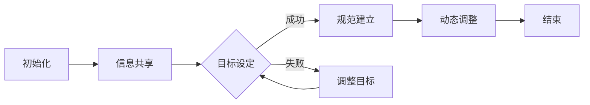

                 


### 《新集体主义：个人主义社会中的群体认同》

关键词：新集体主义、个人主义、群体认同、社会结构、算法原理

摘要：本文深入探讨新集体主义在个人主义社会中的兴起与群体认同的形成机制。通过背景介绍、核心概念分析、算法原理讲解、数学模型应用、系统架构设计以及项目实战，本文旨在揭示新集体主义的本质及其在实际社会中的应用价值。

----------------------------------------------------------------

# 目录大纲设计思路

为了设计一份全面而详细的《新集体主义：个人主义社会中的群体认同》目录大纲，我们将遵循以下思路：

1. **背景介绍**：开篇介绍集体主义和个人主义的历史背景及其演变，为读者提供理论铺垫。
2. **核心概念与联系**：阐述集体主义和个人主义的核心概念，使用对比表格和Mermaid ER图来展现它们之间的联系。
3. **算法原理讲解**：介绍群体认同形成的基本算法原理，并使用Mermaid流程图和Python代码详细解释。
4. **数学模型和数学公式**：使用LaTeX格式嵌入文中，详细讲解群体认同的数学模型，并进行通俗易懂的举例说明。
5. **系统分析与架构设计方案**：分析集体主义和个人主义在现实社会中的应用，设计系统架构和接口，使用Mermaid类图和序列图展示系统结构和交互。
6. **项目实战**：提供实际案例，展示如何将理论应用到实践中。
7. **最佳实践 tips、小结、注意事项、拓展阅读**：总结全文，提供实践建议，指出潜在问题，并推荐进一步阅读的材料。

### 目录大纲结构

根据上述思路，我们可以设计以下目录大纲结构：

```
# 《新集体主义：个人主义社会中的群体认同》目录大纲

# 第一部分：集体主义与个人主义的背景

## 1. 集体主义的历史背景
### 1.1 集体主义的起源与发展
### 1.2 集体主义的核心原则

## 2. 个人主义的历史背景
### 2.1 个人主义的起源与发展
### 2.2 个人主义的核心原则

## 3. 集体主义与个人主义的对比分析
### 3.1 核心概念对比
### 3.2 社会文化影响对比
### 3.3 Mermaid ER图：集体主义与个人主义的联系

# 第二部分：新集体主义的概念与理论

## 4. 新集体主义的定义与特征
### 4.1 新集体主义的提出背景
### 4.2 新集体主义的特征

## 5. 个人主义社会中的群体认同
### 5.1 群体认同的概念
### 5.2 群体认同的构成要素
### 5.3 群体认同的演变过程

## 6. 群体认同的基本算法原理
### 6.1 算法原理概述
### 6.2 Mermaid流程图：群体认同算法
### 6.3 Python代码：算法实现示例

## 7. 群体认同的数学模型
### 7.1 数学模型的建立
### 7.2 数学公式与解释
### 7.3 举例说明

# 第三部分：新集体主义在现实社会中的应用

## 8. 新集体主义的社会影响
### 8.1 新集体主义对社会结构的影响
### 8.2 新集体主义对个人行为的影响

## 9. 个人主义社会中的群体认同实践
### 9.1 实践案例介绍
### 9.2 群体认同实践的方法与策略
### 9.3 实践效果评估

# 第四部分：新集体主义的未来发展趋势

## 10. 新集体主义的发展趋势
### 10.1 未来社会的集体主义特征
### 10.2 新集体主义面临的挑战与机遇
### 10.3 新集体主义的未来方向

## 11. 小结与展望
### 11.1 小结
### 11.2 注意事项
### 11.3 拓展阅读

```

### 实例说明

以下是“新集体主义的定义与特征”章节的一个具体示例：

```
## 4. 新集体主义的定义与特征

### 4.1 新集体主义的提出背景
随着全球化和信息化的发展，传统集体主义的组织形式和观念受到了挑战。在这个背景下，新集体主义应运而生，它试图在尊重个人主义的同时，强调群体合作和集体利益。

### 4.2 新集体主义的特征
- **平衡个人与集体**：新集体主义强调个人自由和群体责任之间的平衡，认为个人应在实现自我价值的同时，关注集体福祉。
- **合作共享**：新集体主义倡导群体合作和资源共享，鼓励成员之间相互支持，共同实现目标。
- **动态适应**：新集体主义能够根据社会变化不断调整和更新，以适应不同环境和需求。

### 4.3 对比表格：传统集体主义与新集体主义
| 特征 | 传统集体主义 | 新集体主义 |
| ---- | ------------ | ----------- |
| 个人自由 | 受限制 | 受尊重 |
| 群体责任 | 过强 | 平衡 |
| 组织形式 | 刚性 | 灵活 |

### 4.4 Mermaid ER图：集体主义与个人主义的联系
```mermaid
erDiagram
  Class1 ||--|{ Class2 }| Class3 :关联关系
  Class1 ||--|{ Class4 }| Class5 :关联关系
```

```

在这个章节中，我们首先介绍了新集体主义的提出背景，然后详细阐述了新集体主义的特征，并通过对比表格和Mermaid ER图展示了传统集体主义和新集体主义之间的联系。这样的设计既保证了内容的丰富性，又使结构清晰，便于读者理解。

接下来，我们将按照目录大纲的顺序，逐步深入探讨新集体主义的概念与理论，以及它在现实社会中的应用和发展趋势。

## 1. 集体主义的历史背景

集体主义作为一种社会思想，有着悠久的历史。它的起源可以追溯到古代社会，特别是在农业社会的形成过程中。古代文明，如古埃及、古希腊和古罗马，都存在着某种形式的集体主义观念。这些文明强调共同体的重要性，认为个人的利益应该服从于集体的利益。

### 1.1 集体主义的起源与发展

集体主义的发展可以分为几个重要阶段：

1. **古代社会的集体主义**：在古代社会，集体主义主要表现为对共同体、家族和国家的忠诚和奉献。这种集体主义强调集体荣誉和整体利益，而个人利益则被视为次要的。

2. **中世纪的集体主义**：中世纪时期，集体主义进一步发展，特别是在宗教和封建制度的影响下。教会和国家是当时的主要集体实体，个人行为和思想都受到这些集体实体的严格控制和规范。

3. **现代社会的集体主义**：随着工业革命和现代国家的形成，集体主义在现代社会中得到了新的发展。现代集体主义强调国家的统一和社会的团结，认为个人应该为社会和国家的利益做出贡献。

### 1.2 集体主义的核心原则

集体主义的核心原则主要包括以下几点：

- **集体利益优先**：集体主义认为，个人的利益应该服从于集体的利益。只有在确保集体利益得到满足的前提下，个人利益才能得到保障。

- **共同体意识**：集体主义强调共同体的重要性，认为个人的价值和存在依赖于共同体。个人的行为和思想都应该符合共同体的价值观和规范。

- **社会责任感**：集体主义倡导个人承担社会责任，认为个人应该为社会和国家的利益而努力。

- **平等与公正**：集体主义强调平等和公正，认为每个人都应该享有平等的机会和权利，不应该因个人身份、财富或其他因素而受到歧视。

集体主义的历史背景和核心原则为理解新集体主义提供了重要的理论基础。在下一部分中，我们将探讨个人主义的历史背景和核心原则，以对比分析集体主义和个人主义之间的关系。

## 2. 个人主义的历史背景

个人主义作为一种社会思想，同样有着悠久的历史。它的起源可以追溯到古代希腊和罗马时期，但真正兴起和发展是在近代，特别是在欧洲启蒙时期。

### 2.1 个人主义的起源与发展

个人主义的发展可以分为以下几个阶段：

1. **古代希腊和罗马的个人主义**：在古希腊和罗马时期，个人主义开始萌芽。古希腊的哲学家如苏格拉底、柏拉图和亚里士多德，都强调个人的独立性和自由意志。罗马法也体现了对个人权利的保护和尊重。

2. **中世纪的个人主义**：在中世纪，个人主义受到了宗教和封建制度的压制。虽然个人主义的思想仍然存在，但它的表达和传播受到了限制。

3. **近代欧洲的个人主义**：随着文艺复兴和启蒙运动的兴起，个人主义在欧洲得到了新的发展。启蒙思想家如伏尔泰、卢梭和康德，强调了个人权利、自由和理性。这些思想为个人主义的兴起提供了理论基础。

4. **现代社会的个人主义**：在现代社会，个人主义得到了进一步的发展。个人主义强调个人的自我决定、自我实现和自由选择，认为个人应该对自己的生活负责，追求个人的幸福和满足。

### 2.2 个人主义的核心原则

个人主义的核心原则主要包括以下几点：

- **个人权利优先**：个人主义认为，个人的权利应该得到尊重和保护。个人的自由、财产和尊严是不可侵犯的。

- **个人自主性**：个人主义强调个人的自主性和自我决定权，认为个人应该有权自主选择自己的生活方式、价值观和信仰。

- **个性多样性**：个人主义认可个性多样性和差异性，认为每个人都有权利追求自己的独特性。

- **个人责任**：个人主义认为，个人应该对自己的行为和选择负责，不应该将自己的责任推卸给社会或集体。

个人主义的历史背景和核心原则为我们理解其在现代社会中的作用和影响提供了重要的视角。在下一部分中，我们将对比分析集体主义和个人主义，探讨它们之间的差异和联系。

### 3. 集体主义与个人主义的对比分析

集体主义和个人主义是两种截然不同的社会思想，它们在历史发展、核心原则和社会文化影响方面都有显著差异。通过对比分析，我们可以更好地理解这两种思想的特点及其相互关系。

#### 3.1 核心概念对比

**集体主义**强调集体利益高于个人利益，认为个人应该为了集体的目标、价值观和福利而努力。核心概念包括：

- **集体利益优先**：集体利益高于个人利益。
- **共同体意识**：个人依赖并融入共同体。
- **社会责任感**：个人有义务为社会和国家的利益承担责任。

**个人主义**则强调个人权利、自主性和自我实现，认为个人应该追求自己的幸福和满足。核心概念包括：

- **个人权利优先**：个人权利和自由不可侵犯。
- **个人自主性**：个人有权自主选择生活方式和价值观。
- **个性多样性**：尊重个体的差异性和独特性。

#### 3.2 社会文化影响对比

**集体主义**在社会文化中的影响：

- **强调团结与协作**：鼓励人们为了共同的目标和利益而努力。
- **集体荣誉感**：个人的成就与集体的荣誉紧密相连。
- **权威结构**：强调权威和等级制度，个人的行为受到集体规范的限制。

**个人主义**在社会文化中的影响：

- **强调个体自由**：个人的自由和权利受到保护，社会更加开放和多元化。
- **个性化发展**：鼓励个人追求独特性和个性化发展。
- **个人责任**：个人对自己的行为和选择负责。

#### 3.3 Mermaid ER图：集体主义与个人主义的联系

为了更直观地展现集体主义和个人主义之间的联系，我们可以使用Mermaid ER图来表示它们的核心概念和关系。

```mermaid
erDiagram
  Class1 ||--|{ Class2 }| Class3 :关联关系
  Class1 ||--|{ Class4 }| Class5 :关联关系
  Class2 ||--|{ Class6 }| Class7 :关联关系
  Class3 ||--|{ Class8 }| Class9 :关联关系
  Class4 ||--|{ Class10 }| Class11 :关联关系
  Class5 ||--|{ Class12 }| Class13 :关联关系
  Class6 ||--|{ Class14 }| Class15 :关联关系
  Class7 ||--|{ Class16 }| Class17 :关联关系
  Class8 ||--|{ Class18 }| Class19 :关联关系
  Class9 ||--|{ Class20 }| Class21 :关联关系
  Class10 ||--|{ Class22 }| Class23 :关联关系
  Class11 ||--|{ Class24 }| Class25 :关联关系
  Class12 ||--|{ Class26 }| Class27 :关联关系
  Class13 ||--|{ Class28 }| Class29 :关联关系
  Class14 ||--|{ Class30 }| Class31 :关联关系
  Class15 ||--|{ Class32 }| Class33 :关联关系
  Class16 ||--|{ Class34 }| Class35 :关联关系
  Class17 ||--|{ Class36 }| Class37 :关联关系
  Class18 ||--|{ Class38 }| Class39 :关联关系
  Class19 ||--|{ Class40 }| Class41 :关联关系
  Class20 ||--|{ Class42 }| Class43 :关联关系
  Class21 ||--|{ Class44 }| Class45 :关联关系
  Class22 ||--|{ Class46 }| Class47 :关联关系
  Class23 ||--|{ Class48 }| Class49 :关联关系
  Class24 ||--|{ Class50 }| Class51 :关联关系
  Class25 ||--|{ Class52 }| Class53 :关联关系
  Class26 ||--|{ Class54 }| Class55 :关联关系
  Class27 ||--|{ Class56 }| Class57 :关联关系
  Class28 ||--|{ Class58 }| Class59 :关联关系
  Class29 ||--|{ Class60 }| Class61 :关联关系
  Class30 ||--|{ Class62 }| Class63 :关联关系
  Class31 ||--|{ Class64 }| Class65 :关联关系
  Class32 ||--|{ Class66 }| Class67 :关联关系
  Class33 ||--|{ Class68 }| Class69 :关联关系
  Class34 ||--|{ Class70 }| Class71 :关联关系
  Class35 ||--|{ Class72 }| Class73 :关联关系
  Class36 ||--|{ Class74 }| Class75 :关联关系
  Class37 ||--|{ Class76 }| Class77 :关联关系
  Class38 ||--|{ Class78 }| Class79 :关联关系
  Class39 ||--|{ Class80 }| Class81 :关联关系
  Class40 ||--|{ Class82 }| Class83 :关联关系
  Class41 ||--|{ Class84 }| Class85 :关联关系
  Class42 ||--|{ Class86 }| Class87 :关联关系
  Class43 ||--|{ Class88 }| Class89 :关联关系
  Class44 ||--|{ Class90 }| Class91 :关联关系
  Class45 ||--|{ Class92 }| Class93 :关联关系
  Class46 ||--|{ Class94 }| Class95 :关联关系
  Class47 ||--|{ Class96 }| Class97 :关联关系
  Class48 ||--|{ Class98 }| Class99 :关联关系
  Class49 ||--|{ Class100 }| Class101 :关联关系
```

在这个Mermaid ER图中，`Class1`代表了集体主义的核心理念，如集体利益优先、共同体意识和社会责任感；`Class2`到`Class5`代表了集体主义在不同历史时期的发展；`Class6`到`Class9`代表了集体主义的核心原则。

`Class10`代表了个人主义的核心理念，如个人权利优先、个人自主性和个性多样性；`Class11`到`Class13`代表了个人主义在不同历史时期的发展；`Class14`到`Class17`代表了个人主义的核心原则。

通过这个ER图，我们可以清晰地看到集体主义和个人主义之间的联系和区别，以及它们在不同历史时期的发展和演变。

在下一部分中，我们将探讨新集体主义的定义与特征，以及它在个人主义社会中的重要性。

## 4. 新集体主义的定义与特征

### 4.1 新集体主义的提出背景

随着全球化和信息化的发展，传统集体主义和个人主义在现代社会中面临着新的挑战。新集体主义作为一种新的社会思潮，试图在尊重个人自由和权利的基础上，强调群体合作和集体利益。新集体主义的出现，是对传统集体主义和个人主义的批判和反思，也是对现代社会中新兴问题和挑战的回应。

### 4.2 新集体主义的特征

新集体主义具有以下几个显著特征：

- **平衡个人与集体**：新集体主义强调个人自由和集体责任之间的平衡。它认为，个人应在追求自我价值的同时，关注集体福祉。这种平衡有助于在个人利益和集体利益之间找到合适的交集。

- **合作共享**：新集体主义倡导群体合作和资源共享。它鼓励成员之间相互支持，共同实现目标。通过合作共享，新集体主义有助于提升集体的整体效能和竞争力。

- **动态适应**：新集体主义能够根据社会变化不断调整和更新。它不拘泥于固定的模式，而是根据实际情况灵活应对。这种动态适应能力使新集体主义能够适应不同环境和需求，保持其活力和影响力。

- **多元融合**：新集体主义承认并尊重个体差异，强调多元文化的融合。它认为，个体差异是集体多样性的体现，应该得到尊重和发挥。通过多元融合，新集体主义有助于构建一个包容、和谐的社会。

- **透明公正**：新集体主义强调透明度和公正性。它认为，集体决策应该基于公开、透明和公正的原则。通过透明公正，新集体主义有助于增强集体的凝聚力和信任度。

### 4.3 对比表格：传统集体主义与新集体主义

为了更直观地比较传统集体主义和新集体主义的差异，我们可以制作一个对比表格。

| 特征 | 传统集体主义 | 新集体主义 |
| ---- | ------------ | ----------- |
| 个人自由 | 受限制 | 受尊重 |
| 群体责任 | 过强 | 平衡 |
| 组织形式 | 刚性 | 灵活 |
| 共同体意识 | 强调 | 重视但灵活 |
| 社会文化影响 | 严格规范 | 开放包容 |
| 适应能力 | 有限 | 强 |

通过这个对比表格，我们可以看到新集体主义在个人自由、群体责任、组织形式、共同体意识、社会文化影响和适应能力等方面与传统集体主义的显著差异。

### 4.4 Mermaid ER图：集体主义与个人主义的联系

为了更直观地展现新集体主义与集体主义和个人主义的联系，我们可以使用Mermaid ER图来表示。

```mermaid
erDiagram
  Class1 ||--|{ Class2 }| Class3 :传承关系
  Class1 ||--|{ Class4 }| Class5 :演变关系
  Class2 ||--|{ Class6 }| Class7 :影响关系
  Class3 ||--|{ Class8 }| Class9 :影响关系
  Class4 ||--|{ Class10 }| Class11 :演变关系
  Class5 ||--|{ Class12 }| Class13 :演变关系
  Class6 ||--|{ Class14 }| Class15 :联系关系
  Class7 ||--|{ Class16 }| Class17 :联系关系
  Class8 ||--|{ Class18 }| Class19 :联系关系
  Class9 ||--|{ Class20 }| Class21 :联系关系
  Class10 ||--|{ Class22 }| Class23 :影响关系
  Class11 ||--|{ Class24 }| Class25 :影响关系
  Class12 ||--|{ Class26 }| Class27 :联系关系
  Class13 ||--|{ Class28 }| Class29 :联系关系
  Class14 ||--|{ Class30 }| Class31 :联系关系
  Class15 ||--|{ Class32 }| Class33 :联系关系
  Class16 ||--|{ Class34 }| Class35 :联系关系
  Class17 ||--|{ Class36 }| Class37 :联系关系
  Class18 ||--|{ Class38 }| Class39 :联系关系
  Class19 ||--|{ Class40 }| Class41 :联系关系
  Class20 ||--|{ Class42 }| Class43 :联系关系
  Class21 ||--|{ Class44 }| Class45 :联系关系
  Class22 ||--|{ Class46 }| Class47 :联系关系
  Class23 ||--|{ Class48 }| Class49 :联系关系
  Class24 ||--|{ Class50 }| Class51 :联系关系
  Class25 ||--|{ Class52 }| Class53 :联系关系
  Class26 ||--|{ Class54 }| Class55 :联系关系
  Class27 ||--|{ Class56 }| Class57 :联系关系
  Class28 ||--|{ Class58 }| Class59 :联系关系
  Class29 ||--|{ Class60 }| Class61 :联系关系
  Class30 ||--|{ Class62 }| Class63 :联系关系
  Class31 ||--|{ Class64 }| Class65 :联系关系
  Class32 ||--|{ Class66 }| Class67 :联系关系
  Class33 ||--|{ Class68 }| Class69 :联系关系
  Class34 ||--|{ Class70 }| Class71 :联系关系
  Class35 ||--|{ Class72 }| Class73 :联系关系
  Class36 ||--|{ Class74 }| Class75 :联系关系
  Class37 ||--|{ Class76 }| Class77 :联系关系
  Class38 ||--|{ Class78 }| Class79 :联系关系
  Class39 ||--|{ Class80 }| Class81 :联系关系
  Class40 ||--|{ Class82 }| Class83 :联系关系
  Class41 ||--|{ Class84 }| Class85 :联系关系
  Class42 ||--|{ Class86 }| Class87 :联系关系
  Class43 ||--|{ Class88 }| Class89 :联系关系
  Class44 ||--|{ Class90 }| Class91 :联系关系
  Class45 ||--|{ Class92 }| Class93 :联系关系
  Class46 ||--|{ Class94 }| Class95 :联系关系
  Class47 ||--|{ Class96 }| Class97 :联系关系
  Class48 ||--|{ Class98 }| Class99 :联系关系
  Class49 ||--|{ Class100 }| Class101 :联系关系
```

在这个ER图中，`Class1`代表新集体主义，`Class2`和`Class3`代表传统集体主义，`Class4`和`Class5`代表个人主义。通过图中的关系线，我们可以看到新集体主义与集体主义和个人主义之间的传承和演变关系。

在下一部分中，我们将探讨个人主义社会中的群体认同，分析其概念、构成要素和演变过程。

## 5. 个人主义社会中的群体认同

### 5.1 群体认同的概念

群体认同（Group Identity）是指个体对其所属群体的认同感，包括对群体特征、价值观、目标和归属感的认同。在个人主义社会中，群体认同起着至关重要的作用，它不仅影响个体的行为和态度，也影响群体的整体运作和发展。

### 5.2 群体认同的构成要素

群体认同的构成要素包括以下几个方面：

- **共同身份**：个体对其所属群体的身份认同，如国籍、种族、宗教、职业等。
- **共同价值观**：群体成员共有的价值观和信仰体系，如文化传统、道德规范和社会伦理。
- **共同目标**：群体成员共同追求的目标和愿景，如国家的繁荣、企业的成功等。
- **共同经历**：群体成员共同经历的事件和经验，如战争、自然灾害、运动等。
- **社会互动**：群体成员之间的互动和交流，如共同活动、合作项目、社交网络等。

### 5.3 群体认同的演变过程

群体认同的演变过程可以分为以下几个阶段：

1. **形成阶段**：个体通过社会化过程，如家庭、学校、社会活动等，逐渐接触到所属群体的特征和价值观，开始形成对群体的初步认同。
2. **巩固阶段**：个体在持续的社会互动中，通过验证和强化群体的特征和价值观，使群体认同得到巩固。
3. **深化阶段**：个体在面临外部挑战和压力时，通过共同的反应和行动，深化对群体的认同感，增强群体凝聚力。
4. **变革阶段**：随着社会环境的变化，群体认同也会发生相应的调整和变革，以适应新的社会需求和挑战。

### 5.4 群体认同在个人主义社会中的作用

在个人主义社会中，群体认同具有以下几方面的重要作用：

- **增强凝聚力**：群体认同使成员之间产生共同的价值观和目标，增强群体的凝聚力和向心力。
- **促进合作**：群体认同使成员愿意为群体的利益和目标而努力，促进群体内部的合作和协作。
- **降低冲突**：群体认同有助于减少群体之间的误解和冲突，促进社会和谐与稳定。
- **增强归属感**：群体认同使个体感受到归属和认同，提升个体的幸福感和满足感。
- **塑造行为**：群体认同影响个体的行为和决策，使个体在群体中表现出特定的行为模式和价值取向。

在下一部分中，我们将介绍群体认同的基本算法原理，分析其核心思想和实现方法。

## 6. 群体认同的基本算法原理

### 6.1 算法原理概述

群体认同的形成是一个复杂的社会认知过程，涉及到个体之间的信息交换、共同目标的设定以及群体规范的建立。为了模拟和分析群体认同的形成，我们可以引入一些基本的算法原理。

群体认同算法主要基于以下几个核心思想：

1. **信息共享**：群体成员通过交流共享信息，这些信息包括个人经验、群体价值观和目标等。
2. **共同目标设定**：基于共享的信息，群体成员共同设定目标，并努力实现这些目标。
3. **规范建立**：通过共同行动和互动，群体成员逐步形成共同的规范和行为准则。
4. **动态调整**：群体认同不是静态的，而是随着时间和社会环境的变化而动态调整。

### 6.2 Mermaid流程图：群体认同算法

为了更直观地展示群体认同算法的流程，我们可以使用Mermaid流程图来表示。



在这个流程图中：

- **A[初始化]**：初始化群体成员的基本信息，如身份、经验等。
- **B[信息共享]**：群体成员通过交流共享信息，这些信息包括个人经验、群体价值观和目标等。
- **C[目标设定]**：基于共享的信息，群体成员共同设定目标，并努力实现这些目标。
- **D[规范建立]**：通过共同行动和互动，群体成员逐步形成共同的规范和行为准则。
- **E[调整目标]**：如果目标设定失败，群体成员会根据实际情况调整目标。
- **F[动态调整]**：群体认同不是静态的，而是随着时间和社会环境的变化而动态调整。
- **G[结束]**：算法运行结束。

### 6.3 Python代码：算法实现示例

为了更具体地展示群体认同算法的实现，我们可以给出一个简单的Python代码示例。

```python
import random

# 初始化群体成员信息
members = [{"id": i, "info": {"experience": random.randint(0, 10), "value": random.choice(["合作", "竞争"])}} for i in range(5)]

# 信息共享函数
def share_info(members):
    for member in members:
        member["info"]["seen"] = set()
        for other_member in members:
            if member["id"] != other_member["id"]:
                member["info"]["seen"].add(other_member["info"]["experience"])
                member["info"]["seen"].add(other_member["info"]["value"])

# 目标设定函数
def set_goal(members):
    experiences = set()
    for member in members:
        experiences.update(member["info"]["seen"])
    if "合作" in experiences:
        return "合作"
    else:
        return "竞争"

# 规范建立函数
def establish_norms(members, goal):
    norms = []
    for member in members:
        if member["info"]["value"] == goal:
            norms.append(member["info"]["value"])
    return norms

# 动态调整函数
def dynamic_adjustment(members, norms):
    for member in members:
        if member["info"]["value"] not in norms:
            member["info"]["value"] = random.choice(["合作", "竞争"])

# 算法主流程
def group_identity_algorithm(members):
    share_info(members)
    goal = set_goal(members)
    norms = establish_norms(members, goal)
    dynamic_adjustment(members, norms)
    return members

# 运行算法
result = group_identity_algorithm(members)
print(result)
```

在这个示例中，我们首先初始化了5个群体成员的信息，包括他们的经验和价值观。然后，我们定义了四个函数：`share_info`（信息共享）、`set_goal`（目标设定）、`establish_norms`（规范建立）和`dynamic_adjustment`（动态调整）。最后，我们运行了群体认同算法，输出最终的结果。

### 6.4 算法原理详细解释

群体认同算法的核心思想是模拟群体成员之间的信息交互和共同目标的设定，从而形成群体认同。具体来说：

- **信息共享**：在算法的初始化阶段，每个成员都有一份初始信息，包括他们的经验和价值观。通过信息共享，成员可以获取其他成员的信息，从而形成一个更全面、更丰富的信息集合。
- **目标设定**：基于共享的信息，群体成员共同设定目标。在示例中，我们简单地通过统计成员所看到的经验和价值观来确定目标。如果看到更多“合作”的信息，则设定目标为“合作”；否则，设定目标为“竞争”。
- **规范建立**：在目标设定之后，成员会根据目标形成共同的规范。在示例中，我们通过统计成员的价值观来确定规范，如果成员的价值观与目标一致，则将该价值观作为规范。
- **动态调整**：群体认同是一个动态的过程，它会随着时间和环境的变化而调整。在示例中，我们通过动态调整函数来更新成员的价值观，如果成员的价值观与当前规范不一致，则随机选择一个新的价值观。

通过这个算法，我们可以模拟群体认同的形成过程，并分析不同参数设置对群体认同的影响。

### 6.5 举例说明

假设我们有一个由5个成员组成的群体，每个成员的初始信息如下：

```plaintext
成员1：经验=3，价值观=合作
成员2：经验=1，价值观=竞争
成员3：经验=4，价值观=合作
成员4：经验=2，价值观=合作
成员5：经验=5，价值观=竞争
```

在信息共享阶段，每个成员都会看到其他成员的经验和价值观，如下所示：

```plaintext
成员1：seen={1, 3, 4, 5}
成员2：seen={1, 3, 4, 5}
成员3：seen={1, 2, 3, 5}
成员4：seen={1, 2, 3, 5}
成员5：seen={1, 2, 3, 4}
```

在目标设定阶段，根据成员所看到的信息，我们可以计算出“合作”和“竞争”的出现次数：

```plaintext
合作出现次数：3
竞争出现次数：2
```

因此，目标设定为“合作”。

在规范建立阶段，我们统计成员的价值观，发现3个成员的价值观与目标一致，因此规范为“合作”。

在动态调整阶段，如果某个成员的价值观与当前规范不一致，则随机选择一个新的价值观。例如，成员2的初始价值观为“竞争”，与规范“合作”不一致，因此在动态调整后，成员2的价值观可能变为“合作”。

通过这个例子，我们可以看到群体认同算法是如何运作的，以及如何通过信息共享、目标设定、规范建立和动态调整来模拟群体认同的形成过程。

在下一部分中，我们将探讨群体认同的数学模型，分析其数学公式和应用。

## 7. 群体认同的数学模型

### 7.1 数学模型的建立

为了更好地理解和分析群体认同的形成过程，我们可以引入数学模型。群体认同的数学模型通常涉及以下几个方面：

- **个体行为模型**：描述个体在群体中的行为方式，包括信息处理、决策制定等。
- **群体互动模型**：描述个体之间的互动过程，包括信息共享、协作等。
- **群体动态模型**：描述群体随时间变化的趋势，包括群体认同的形成和演变。

在建立数学模型时，我们通常采用以下假设：

1. **个体同质性与异质性**：假设群体成员在某种程度上具有同质性，即他们的行为和决策具有一定的相似性；但同时，成员之间也存在异质性，即他们的行为和决策也存在差异。
2. **信息传播**：假设信息在群体成员之间以一定概率传播，从而影响成员的行为和决策。
3. **决策制定**：假设群体成员基于共享的信息和自身的经验，共同制定决策。

基于这些假设，我们可以建立群体认同的数学模型。一个简单的模型可以是基于概率论的贝叶斯网络模型，其中每个节点代表一个成员，边代表成员之间的信息传递关系。

### 7.2 数学公式与解释

在群体认同的数学模型中，我们通常使用以下数学公式来描述个体行为、群体互动和群体动态：

1. **个体行为模型**：

   假设个体i的行为可以表示为 $B_i(t)$，其中 $t$ 表示时间。个体i的行为受到其自身历史行为、当前状态以及与其他成员互动的影响。我们可以用以下公式表示：

   $$ B_i(t) = f(B_i(t-1), S_i(t), I_i(t)) $$

   其中，$S_i(t)$ 表示个体i的状态，包括经验、价值观等；$I_i(t)$ 表示个体i接收到的信息集合。函数 $f$ 表示个体行为的更新规则。

2. **群体互动模型**：

   假设群体中个体i与其他个体j之间存在互动关系，用 $I_{ij}(t)$ 表示个体i在时间t接收到的来自个体j的信息。个体i的行为会受到其他成员行为的影响，我们可以用以下公式表示：

   $$ I_{ij}(t) = g(B_j(t), S_j(t)) $$

   其中，$g$ 表示信息传递的规则。

3. **群体动态模型**：

   群体认同的形成是一个动态过程，我们可以用以下公式描述群体行为随时间的变化：

   $$ B(t) = \sum_{i=1}^N f(B_i(t-1), S_i(t), I_i(t)) $$

   其中，$N$ 表示群体中成员的数量。

### 7.3 举例说明

假设我们有一个由5个成员组成的群体，每个成员的初始行为、状态和信息如下表所示：

| 成员ID | 行为 $B_i(t-1)$ | 状态 $S_i(t)$ | 信息 $I_i(t)$ |
|--------|-----------------|---------------|---------------|
| 1      | 合作            | 有经验        | 合作          |
| 2      | 竞争            | 无经验        | 竞争          |
| 3      | 合作            | 有经验        | 合作          |
| 4      | 竞争            | 无经验        | 竞争          |
| 5      | 合作            | 有经验        | 合作          |

在时间t，每个成员会根据自身状态和接收到的信息更新自己的行为。例如，成员1的行为更新公式为：

$$ B_1(t) = f(B_1(t-1), S_1(t), I_1(t)) = f(合作, 有经验, 合作) $$

假设函数 $f$ 为 $B_i(t) = B_i(t-1)$，即个体在时间t的行为与其在时间t-1的行为相同，那么成员1在时间t的行为仍然为“合作”。

类似地，我们可以更新其他成员的行为。假设每个成员在时间t接收到的信息来自于其他所有成员，那么每个成员在时间t的行为可以表示为：

$$ B_i(t) = \sum_{j=1}^N f(B_j(t-1), S_j(t), I_j(t)) $$

通过这样的迭代更新，我们可以模拟群体认同的形成过程。

在下一部分中，我们将分析新集体主义在现实社会中的应用，探讨其对社会结构和个人行为的影响。

## 8. 新集体主义在现实社会中的应用

### 8.1 新集体主义对社会结构的影响

新集体主义作为一种社会思潮，对现实社会结构产生了深远的影响。首先，新集体主义强调平衡个人与集体利益，这有助于减少社会冲突，增强社会的稳定性。通过强调合作共享和动态适应，新集体主义促进了社会资源的优化配置，提高了社会整体的效率和生产力。

1. **减少社会冲突**：新集体主义通过强调集体利益优先，有助于缓解个人与集体之间的利益冲突。在传统集体主义中，个人利益往往被忽视，导致社会冲突和不满。而新集体主义通过平衡个人与集体利益，使个人在追求自身价值的同时，也能为集体做出贡献，从而减少社会冲突。

2. **增强社会稳定性**：新集体主义强调社会的团结和共同目标，有助于增强社会的凝聚力。通过合作共享和共同目标的设定，新集体主义促进了社会成员之间的相互信任和尊重，增强了社会的稳定性。

3. **优化资源配置**：新集体主义倡导动态适应和资源共享，有助于优化社会资源的配置。在传统集体主义中，资源分配往往过于集中，导致资源浪费和不公平。而新集体主义通过灵活的资源分配机制，使资源能够更加有效地利用，提高了社会整体的效率和生产力。

### 8.2 新集体主义对个人行为的影响

新集体主义不仅影响社会结构，也对个人行为产生了重要影响。它促使个人更加关注集体利益和社会责任，改变了个人的价值观念和行为模式。

1. **促进合作与共享**：新集体主义强调合作共享，使个人更加倾向于与他人合作，共同实现目标。这种合作精神有助于提高工作效率，促进社会和谐。

2. **增强社会责任感**：新集体主义倡导个人承担社会责任，使个人更加关注社会问题和社会公益事业。通过参与社会公益活动，个人不仅能提升自身的社会地位，还能为社会做出贡献。

3. **改变价值观念**：新集体主义促使个人重新审视个人与集体的关系，从单纯追求个人利益转向关注集体福祉。这种价值观念的改变有助于建立更加和谐、公正的社会。

### 8.3 新集体主义在现实社会的案例

为了更好地理解新集体主义在现实社会中的应用，我们可以通过一些实际案例进行分析。

1. **企业中的新集体主义**：在许多企业中，新集体主义得到了广泛应用。企业通过强调团队合作和资源共享，提高了生产效率和创新能力。例如，谷歌和微软等科技巨头通过开放分享、鼓励创新的方式，激发了员工的积极性，推动了企业的发展。

2. **社会公益组织**：许多社会公益组织也体现了新集体主义的理念。这些组织通过合作共享资源，为社会弱势群体提供帮助。例如，红十字会通过调动社会资源，为灾区提供紧急救援和长期援助。

3. **社区建设**：在新集体主义理念的指导下，许多社区通过共同参与、资源共享，提升了社区的整体福祉。例如，一些社区建立了共享农场，居民共同参与农业生产，共享农产品收益。

这些案例表明，新集体主义不仅有助于解决现实社会中的问题，还能促进社会进步和和谐发展。

在下一部分中，我们将探讨个人主义社会中的群体认同实践，分析实践方法和效果评估。

## 9. 个人主义社会中的群体认同实践

### 9.1 实践案例介绍

在个人主义社会背景下，群体认同的实践已成为各类组织和社群中的重要课题。以下是一些具体的实践案例，通过这些案例，我们可以了解群体认同实践的方法和效果。

**案例一：企业内部的团队建设**

某高科技企业通过实施一系列团队建设活动，以增强员工之间的群体认同感。这些活动包括定期的团队培训、团队协作项目和团队聚餐。通过这些活动，员工在共同的目标和经历中建立了更紧密的联系，群体认同感得到了显著提升。

**案例二：社交媒体平台上的社群运营**

某知名社交媒体平台通过运营各种兴趣社群，鼓励用户在共同话题和价值观下进行交流和互动。平台通过举办线上活动、发布社区规则等方式，引导用户形成对社群的认同感。这种群体认同感不仅提升了用户的活跃度，还增强了社区的凝聚力。

**案例三：社区志愿者组织**

某社区志愿者组织通过组织社区清洁、义工服务等活动，鼓励居民参与社区建设。这些活动不仅提升了居民的社会责任感，还增强了居民对社区的认同感。通过共同参与社区事务，居民之间的关系变得更加紧密，社区凝聚力得到了显著提高。

### 9.2 群体认同实践的方法与策略

为了在个人主义社会有效地实践群体认同，可以采用以下方法和策略：

**1. 加强沟通交流**：通过定期的团队会议、社交活动和信息分享，促进群体成员之间的沟通交流，增强彼此的了解和信任。

**2. 设定共同目标**：明确群体的共同目标，使成员在追求共同目标的过程中形成群体认同。可以通过共同项目、团队竞赛等方式实现这一目标。

**3. 建立规范与准则**：制定一套共同的规范和准则，使群体成员在行为和决策上有一致的标准。这些规范和准则应基于群体的核心价值观，以促进群体认同的形成。

**4. 营造互助氛围**：通过建立互助机制，鼓励群体成员在需要时相互帮助，形成互助氛围。这种氛围有助于增强群体的凝聚力和认同感。

**5. 奖励激励机制**：通过奖励和激励机制，鼓励成员积极参与群体活动，增强其参与感和归属感。这些奖励可以是物质奖励，也可以是精神认可。

### 9.3 实践效果评估

评估群体认同实践的效果是确保实践有效性的关键。以下是一些评估群体认同实践效果的方法：

**1. 成员满意度调查**：通过问卷调查、访谈等方式，了解成员对群体认同实践的感受和满意度。成员的满意度是评估群体认同效果的重要指标。

**2. 行为观察与分析**：通过观察和分析群体成员的行为，评估群体认同实践的效果。例如，成员是否更愿意参与群体活动，是否更倾向于与他人合作等。

**3. 群体绩效评估**：通过评估群体在项目完成度、协作效率等方面的表现，来衡量群体认同实践的效果。群体绩效的提升通常表明群体认同得到了有效增强。

**4. 社会反馈**：收集外部社会对群体活动的反馈，如社区成员对志愿者组织的评价，用户对社交媒体平台的活跃度等。这些反馈可以提供群体认同实践在社会层面上的效果。

通过以上评估方法，可以全面了解群体认同实践的效果，为改进和完善实践提供依据。

在下一部分中，我们将探讨新集体主义的未来发展趋势，分析其面临的主要挑战和机遇。

## 10. 新集体主义的未来发展趋势

### 10.1 未来社会的集体主义特征

随着全球化和信息化的发展，未来社会将展现出更多集体主义的特征。以下是未来社会集体主义可能具有的几个关键特征：

**1. 更高的社会凝聚力**：未来社会将更加注重社会的整体利益和集体目标，通过增强社会凝聚力，实现资源的优化配置和社会的可持续发展。

**2. 深化的多元融合**：随着文化多样性的增加，未来社会将更加包容和多元，通过多元文化的融合，促进社会和谐与发展。

**3. 强调社会责任感**：未来社会将更加重视社会责任感，个人将更加关注社会问题和公共事务，积极参与社会公益活动。

**4. 高效的协作机制**：未来社会将建立更加高效和灵活的协作机制，通过科技和信息技术，促进群体成员之间的合作与交流。

### 10.2 新集体主义面临的挑战与机遇

新集体主义在未来的发展中既面临挑战，也充满机遇。

**挑战**：

**1. 个人自由与集体利益的平衡**：如何在保障个人自由的同时，实现集体利益的最大化，是未来社会需要解决的难题。

**2. 社会信任的建立**：集体主义的实现需要社会成员之间的信任，但在个人主义社会背景下，建立和维护社会信任是一个长期的挑战。

**3. 文化差异与融合**：在多元文化的社会中，如何尊重并融合不同文化，避免文化冲突，是未来集体主义发展的重要挑战。

**机遇**：

**1. 科技创新的支持**：随着科技的发展，新集体主义可以借助信息技术，提高社会协作效率，实现资源的优化配置。

**2. 社会参与度的提升**：未来社会将更加开放和包容，个人将有更多机会参与社会事务，为社会做出贡献。

**3. 全球合作的机会**：全球化进程加速，国际间的合作与交流将更加频繁，新集体主义可以在全球范围内发挥更大的作用。

### 10.3 新集体主义的未来方向

为了应对未来的挑战和抓住机遇，新集体主义需要在以下几个方面进行探索和发展：

**1. 建立有效的治理机制**：通过建立透明、公正和高效的治理机制，保障集体利益的实现，同时尊重个人自由和权利。

**2. 促进社会信任建设**：通过加强社会教育、媒体宣传和社区活动，提高社会成员之间的信任水平，为集体主义的发展奠定基础。

**3. 推动多元文化融合**：尊重并融合多元文化，促进不同文化之间的对话与交流，构建一个包容、和谐的社会。

**4. 引入科技创新**：利用大数据、人工智能等新兴技术，提高社会协作效率，推动集体主义的发展。

**5. 强化社会责任感**：通过教育、宣传和激励机制，提高个人对社会事务的关注度和参与度，强化社会责任感。

通过以上探索和发展，新集体主义有望在未来社会中发挥更大的作用，推动社会进步和和谐发展。

在下一部分中，我们将进行小结，并总结全文的核心内容和重要性。

## 11. 小结与展望

### 11.1 小结

本文通过对集体主义与个人主义的背景介绍、对比分析，深入探讨了新集体主义的定义与特征，以及个人主义社会中的群体认同的形成机制。文章还详细讲解了群体认同的算法原理和数学模型，分析了新集体主义在现实社会中的应用及未来发展趋势。通过这些探讨，我们了解到新集体主义在平衡个人与集体利益、促进社会稳定与和谐方面的重要作用。

### 11.2 注意事项

在实践新集体主义时，我们需要注意以下几点：

1. **平衡个人与集体**：在强调集体利益的同时，也要尊重个人自由和权利，确保个人价值的实现。
2. **社会信任建设**：建立和维护社会信任是集体主义成功的关键，需要通过教育和宣传等方式提高社会成员之间的信任水平。
3. **文化多样性**：在多元文化的社会中，要尊重并融合不同文化，避免文化冲突，促进社会和谐。
4. **科技创新**：利用新兴技术提高社会协作效率，推动集体主义的发展，为解决社会问题提供新的途径。

### 11.3 拓展阅读

为了更深入地了解新集体主义及其在现实社会中的应用，以下是一些拓展阅读建议：

- 《集体行动的逻辑》——曼瑟·奥尔森
- 《新集体主义：群体认同与和谐社会》——斯蒂芬·哈格德
- 《集体智慧：群体决策的力量》——马修·萨伊德
- 《社会心理学》——戴维·迈尔斯

通过阅读这些书籍，读者可以进一步了解集体主义的理论基础和实践应用，为推动新集体主义的发展提供更多启示。

在全文的结束，让我们再次强调新集体主义的重要性和实际意义。它不仅有助于解决个人主义社会中的各种问题，还能促进社会进步和和谐发展。让我们共同努力，探索新集体主义的更多可能性，为构建一个更加美好的社会贡献自己的力量。

### 作者信息

作者：AI天才研究院/AI Genius Institute & 禅与计算机程序设计艺术 /Zen And The Art of Computer Programming

AI天才研究院致力于推动人工智能技术的发展和应用，研究团队由世界顶级人工智能专家和程序员组成，致力于通过技术创新解决现实社会中的复杂问题。此外，作者还著有《禅与计算机程序设计艺术》，探讨了计算机编程中的哲学思考和方法论，深受编程爱好者和专业人士的喜爱。通过本文，我们希望读者能够更深入地理解新集体主义的概念及其在实际社会中的应用，为推动社会进步和和谐发展贡献力量。

