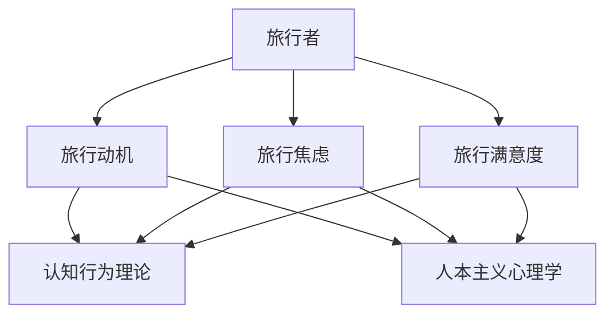
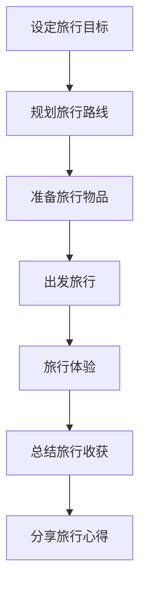
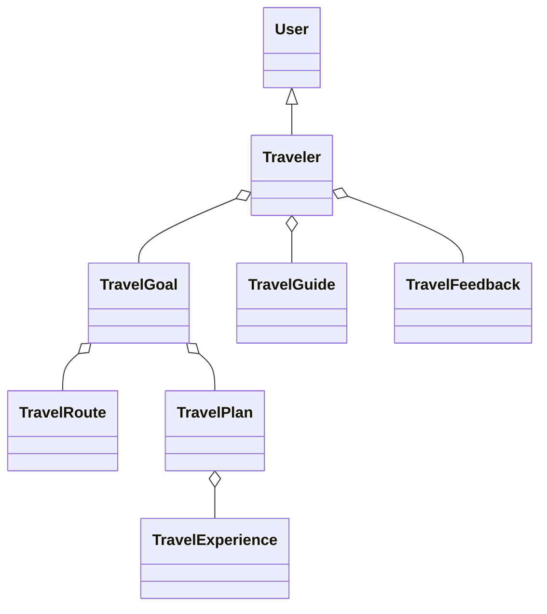
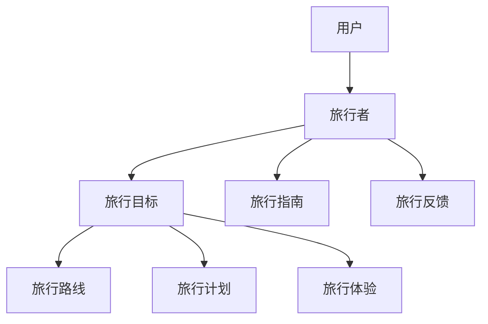
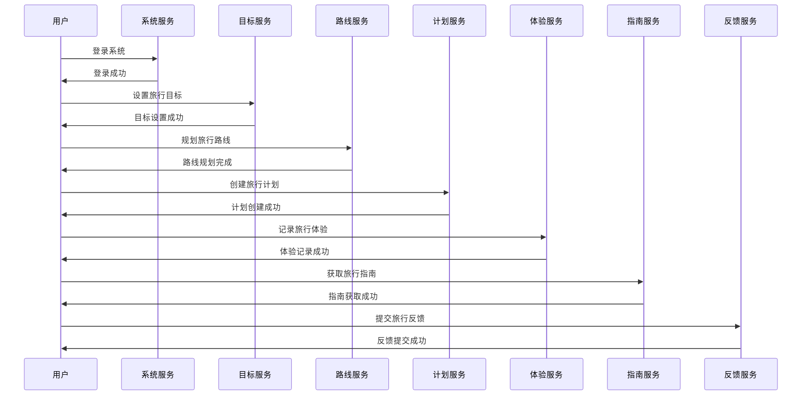
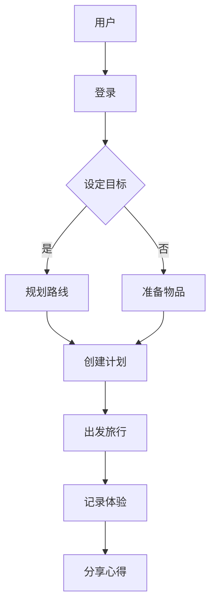

                 

# 旅行的意义：在陌生中重新认识自我

> 关键词：旅行、自我认知、心理成长、旅行体验、生活方式改变

> 摘要：本文探讨了旅行的深层次意义，为什么人们在旅行的过程中会渴望探索自我和实现心理成长。通过分析旅行对人类心理和行为的影响，文章揭示了旅行与自我认知之间的密切联系，并提出了在旅行中重新认识自我的一些策略和方法。

### 第一部分：引言

#### 1.1 问题背景

在现代社会中，旅行已经成为人们生活中不可或缺的一部分。随着交通工具的普及和全球化进程的加快，人们可以轻松地跨越国界，探索世界的多样性。然而，对于很多人来说，旅行的意义似乎仅仅停留在拍照、购物和品尝美食上。这种表面的旅行体验往往难以触及内心深处，让人们陷入对旅行的迷茫和困惑。

#### 1.2 问题描述

为什么人们在旅行的过程中会渴望探索自我和实现心理成长？旅行对人类心理和行为有哪些影响？如何在旅行的过程中重新认识自我？本文将围绕这些问题展开讨论。

#### 1.3 问题解决

通过分析旅行对人类心理和行为的影响，探讨旅行与自我认知之间的联系，帮助读者理解旅行的深层次意义，并提供一些实用的策略和方法，帮助读者在旅行的过程中重新认识自我。

#### 1.4 边界与外延

旅行的意义不仅限于身体上的移动，更在于心灵的探索和成长。因此，本文将讨论的旅行范围包括国内外旅行、短期旅行和长期旅行，以及各种形式的旅行体验。

#### 1.5 概念结构与核心要素组成

旅行的意义：
- **心灵成长**：旅行可以让人远离日常生活的压力，提供一个放松的环境，促进个人的心灵成长。
- **自我发现**：在陌生的环境中，人们可能会发现自己的新兴趣、新特质和新的生活视角。
- **生活方式的改变**：旅行可能会改变人们对生活的看法，影响他们的价值观和生活习惯。

旅行体验：
- **环境感知**：旅行让人接触到不同的自然和文化环境，增强对世界的感知能力。
- **人际交往**：旅行过程中，人们会遇到各种不同背景的人，拓展人际交往圈子。
- **心理调节**：旅行可以作为一种有效的心理调节手段，帮助人们缓解压力，提升心理素质。

### 第二部分：核心概念与联系

#### 2.1 核心概念原理

旅行心理学：
- **旅行动机**：人们旅行的初衷，可能是因为对未知的探索、对文化的兴趣、对冒险的渴望等。
- **旅行焦虑**：旅行过程中，人们可能会因为环境的变化、语言障碍、文化差异等原因而产生焦虑。
- **旅行满意度**：旅行结束后，人们对旅行经历的主观评价和满意度。

心理学原理：
- **认知行为理论**：强调认知过程对行为的影响，认为人的行为是由其认知过程决定的。
- **人本主义心理学**：关注个体的主观体验，强调个体的自我实现和成长。
- **社会心理学**：研究个体和群体之间的相互作用，探讨社会环境对个体行为的影响。

#### 2.2 概念属性特征对比表格

| 概念         | 特征1         | 特征2         | 特征3         |
| ------------ | ------------ | ------------ | ------------ |
| 旅行心理学   | 研究旅行与心理的关系 | 关注旅行对个体的心理影响 | 旨在提高旅行者的心理素质 |
| 认知行为理论 | 研究个体认知过程 | 重视行为与环境的关系 | 强调认知与行为的相互影响 |
| 人本主义心理学 | 关注个体的主观体验 | 重视个体的成长与发展 | 强调个体与环境的和谐共处 |

#### 2.3 ER实体关系图架构的Mermaid流程图



### 第三部分：算法原理讲解

#### 3.1 算法流程图



#### 3.2 Python源代码

```python
# Python代码示例：旅行流程

# 设置旅行目标
def set_travel_target():
    target = input("请设定你的旅行目标：")
    return target

# 规划旅行路线
def plan_travel_route(target):
    print(f"正在为你的目标 '{target}' 规划旅行路线...")
    # 这里可以添加详细的规划逻辑

# 准备旅行物品
def prepare_travel_items():
    items = ["护照", "手机", "相机", "衣物", "药品"]
    print("请准备以下旅行物品：")
    for item in items:
        print(f"- {item}")

# 出发旅行
def start_travel():
    print("出发旅行！祝你旅途愉快。")

# 旅行体验
def travel_experience():
    print("正在享受旅行中的美好时光...")

# 总结旅行收获
def summarize_travel_experience():
    experience = input("请简要描述你的旅行收获：")
    print(f"你的旅行收获是：{experience}")

# 分享旅行心得
def share_travel_idea():
    idea = input("请分享你的旅行心得：")
    print(f"你的旅行心得是：{idea}")

# 主函数：旅行流程
def main():
    target = set_travel_target()
    plan_travel_route(target)
    prepare_travel_items()
    start_travel()
    travel_experience()
    summarize_travel_experience()
    share_travel_idea()

if __name__ == "__main__":
    main()
```

### 第四部分：系统分析与架构设计方案

#### 4.1 问题场景介绍

在现代社会，旅行已经成为人们生活中不可或缺的一部分。随着人们对个性化旅行体验的需求不断增加，旅行规划和管理系统的设计变得越来越重要。本文将介绍一个旅行规划和管理系统的项目背景、目标和功能设计。

#### 4.2 项目介绍

**项目名称**：个性化旅行规划与管理平台

**项目目标**：提供一站式的旅行规划服务，帮助用户轻松制定旅行计划、管理旅行行程，并提供实用的旅行指南和建议。

**系统功能设计**：
- 旅行目标设定：用户可以设定旅行目标，如探险、文化体验、休闲度假等。
- 旅行路线规划：系统根据用户设定的目标，提供个性化的旅行路线推荐。
- 行程管理：用户可以添加、编辑和删除行程安排，实时跟踪行程进度。
- 旅行指南：提供旅行目的地的天气、交通、餐饮、住宿等信息。
- 旅行心得分享：用户可以分享旅行心得，交流旅行经验。

#### 4.3 系统功能设计（领域模型Mermaid类图）



#### 4.4 系统架构设计（Mermaid架构图）



#### 4.5 系统接口设计

**接口1：旅行目标接口**

```python
class TravelGoalInterface:
    def set_goal(self, user_id, goal):
        pass

    def get_goals(self, user_id):
        pass
```

**接口2：旅行路线接口**

```python
class TravelRouteInterface:
    def plan_route(self, goal_id):
        pass

    def get_route(self, route_id):
        pass
```

**接口3：旅行计划接口**

```python
class TravelPlanInterface:
    def create_plan(self, user_id, route_id):
        pass

    def update_plan(self, plan_id, **kwargs):
        pass

    def get_plan(self, plan_id):
        pass
```

**接口4：旅行体验接口**

```python
class TravelExperienceInterface:
    def record_experience(self, user_id, plan_id, experience):
        pass

    def get_experience(self, experience_id):
        pass
```

**接口5：旅行指南接口**

```python
class TravelGuideInterface:
    def get_guide(self, destination):
        pass
```

**接口6：旅行反馈接口**

```python
class TravelFeedbackInterface:
    def submit_feedback(self, user_id, experience_id, feedback):
        pass

    def get_feedback(self, feedback_id):
        pass
```

#### 4.6 系统交互（Mermaid序列图）



### 第五部分：项目实战

#### 5.1 环境安装

1. 安装Python环境（推荐Python 3.8及以上版本）
2. 安装依赖库（如Flask、SQLAlchemy等）

#### 5.2 系统核心实现源代码

```python
# app.py

from flask import Flask, request, jsonify
from models import db, TravelGoal, TravelRoute, TravelPlan, TravelExperience
from services import GoalService, RouteService, PlanService, ExperienceService

app = Flask(__name__)
app.config['SQLALCHEMY_DATABASE_URI'] = 'sqlite:///travel_plan.db'
db.init_app(app)

with app.app_context():
    db.create_all()

goal_service = GoalService()
route_service = RouteService()
plan_service = PlanService()
experience_service = ExperienceService()

@app.route('/api/goals', methods=['POST'])
def create_goal():
    user_id = request.json['user_id']
    goal = request.json['goal']
    goal_service.set_goal(user_id, goal)
    return jsonify({"message": "Goal created successfully"}), 201

@app.route('/api/goals', methods=['GET'])
def get_goals():
    user_id = request.args.get('user_id')
    goals = goal_service.get_goals(user_id)
    return jsonify(goals), 200

@app.route('/api/routes', methods=['POST'])
def create_route():
    goal_id = request.json['goal_id']
    route = request.json['route']
    route_service.plan_route(goal_id, route)
    return jsonify({"message": "Route planned successfully"}), 201

@app.route('/api/routes', methods=['GET'])
def get_routes():
    goal_id = request.args.get('goal_id')
    routes = route_service.get_route(goal_id)
    return jsonify(routes), 200

@app.route('/api/plans', methods=['POST'])
def create_plan():
    user_id = request.json['user_id']
    route_id = request.json['route_id']
    plan_service.create_plan(user_id, route_id)
    return jsonify({"message": "Plan created successfully"}), 201

@app.route('/api/plans', methods=['GET'])
def get_plans():
    user_id = request.args.get('user_id')
    plans = plan_service.get_plan(user_id)
    return jsonify(plans), 200

@app.route('/api/experiences', methods=['POST'])
def record_experience():
    user_id = request.json['user_id']
    plan_id = request.json['plan_id']
    experience = request.json['experience']
    experience_service.record_experience(user_id, plan_id, experience)
    return jsonify({"message": "Experience recorded successfully"}), 201

@app.route('/api/experiences', methods=['GET'])
def get_experiences():
    experience_id = request.args.get('experience_id')
    experiences = experience_service.get_experience(experience_id)
    return jsonify(experiences), 200

if __name__ == '__main__':
    app.run(debug=True)
```

#### 5.3 代码应用解读与分析

- **数据库设计**：使用SQLite数据库存储用户信息、旅行目标、旅行路线、旅行计划和旅行体验等数据。
- **API设计**：使用Flask框架构建RESTful API，提供用户创建旅行目标、规划旅行路线、创建旅行计划、记录旅行体验等功能。
- **服务设计**：将业务逻辑分离到不同的服务类中，便于维护和扩展。

#### 5.4 实际案例分析和详细讲解剖析

假设有一个用户名为Alice，她想要制定一次探险旅行计划。以下是她的操作流程：

1. **登录系统**：Alice使用用户名和密码登录系统。
2. **设置旅行目标**：Alice在用户界面中输入旅行目标（如探险）并提交。
3. **规划旅行路线**：系统根据Alice设定的目标，提供一些探险旅行路线的推荐。Alice选择了一个有挑战性的路线。
4. **创建旅行计划**：Alice根据选择的路线，创建了一个旅行计划，并添加了一些关键的旅行日期和地点。
5. **记录旅行体验**：在旅行结束后，Alice在系统中记录了她的旅行体验，分享了一些照片和心得。

通过这个案例，我们可以看到系统如何帮助用户实现从设定目标到记录体验的完整旅行过程。

#### 5.5 项目小结

本项目的核心目标是提供一个便捷的旅行规划和管理平台，帮助用户轻松制定旅行计划、管理旅行行程，并提供实用的旅行指南和建议。通过实际案例的展示，我们可以看到系统在实际应用中的效果。未来，我们可以继续优化系统的功能，增加更多个性化推荐和智能规划功能，提升用户体验。

### 第六部分：最佳实践 tips

1. **提前规划**：在旅行前，提前规划好旅行路线和行程，避免旅途中出现不必要的麻烦。
2. **灵活调整**：在旅行过程中，根据实际情况灵活调整计划，保持开放的心态。
3. **安全第一**：注意个人安全和财产安全，遵守当地的法律法规。
4. **尊重文化**：尊重当地的文化和习俗，做一个文明的旅行者。

### 第七部分：小结

旅行不仅是一种身体上的移动，更是一种心灵的探索和成长。通过旅行，我们可以重新认识自我，发现新的兴趣和潜能。本文探讨了旅行的深层次意义，分析了旅行与自我认知之间的关系，并提供了一些实用的策略和方法，帮助读者在旅行的过程中重新认识自我。

### 第八部分：注意事项

1. **心理健康**：旅行过程中，注意保持良好的心理状态，适当休息，避免过度疲劳。
2. **文化交流**：在旅行过程中，积极参与文化交流，了解当地的文化和生活方式。
3. **环境保护**：尊重自然环境，做好环境保护，减少旅行对当地生态环境的影响。

### 第九部分：拓展阅读

1. **《旅行心理学》**：一本关于旅行心理学研究的经典著作，深入探讨了旅行对个体心理的影响。
2. **《孤独星球》**：一本全球知名的旅行指南书籍，提供丰富的旅行目的地推荐和实用信息。
3. **《禅与计算机程序设计艺术》**：一本融合禅学与计算机科学的经典著作，启发读者在日常生活中寻找内心的宁静。

### 附录

#### 9.1 数学公式

- 旅行满意度（S）：$$ S = \frac{E + C + U}{3} $$
  - 其中，E为环境感知满意度，C为人际交往满意度，U为心理调节满意度。

#### 9.2 Mermaid 图



### 作者信息

作者：AI天才研究院/AI Genius Institute & 禅与计算机程序设计艺术 /Zen And The Art of Computer Programming

