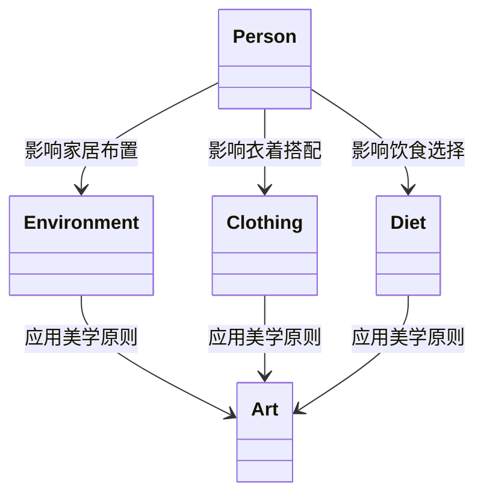
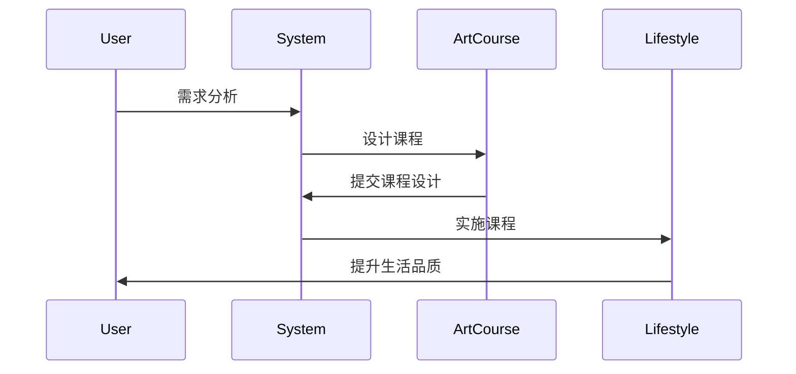
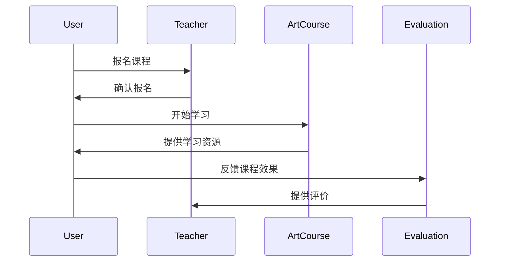
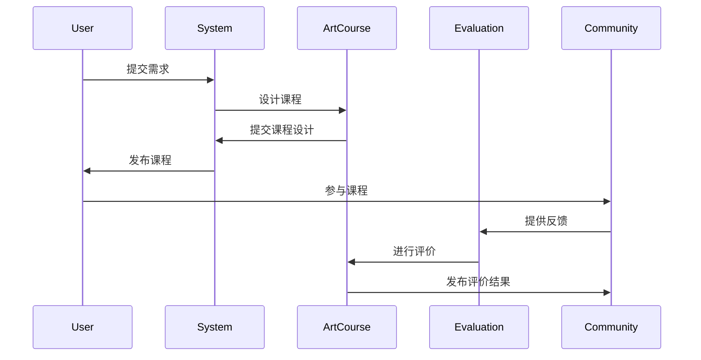

                 

# 日常生活美学工作室：提升生活品质的艺术课程

## 关键词

- 日常生活美学
- 艺术课程
- 生活品质提升
- 艺术与生活结合
- 生活美学实践

## 摘要

本文深入探讨了日常生活美学工作室如何通过一系列艺术课程，提升人们的生活品质。首先，我们明确了日常生活美学的概念及其重要性，然后详细介绍了艺术课程的不同类型及其在提升生活品质方面的作用。接着，文章通过具体的案例分析，展示了艺术课程在实践中的效果，并探讨了艺术课程与生活习惯、心理健康及家庭关系之间的联系。最后，我们对艺术课程在未来的发展趋势和应用前景进行了展望，提出了提升生活品质的最佳实践策略。

## 目录

1. 书籍背景介绍
    - 1.1 日常生活美学工作室的重要性
    - 1.2 书籍的目标和预期成果
    - 1.3 边界与外延

2. 核心概念与联系
    - 2.1 日常生活美学
    - 2.2 艺术课程
    - 2.3 生活品质提升

3. 章节内容安排

### 1. 书籍背景介绍

#### 1.1 日常生活美学工作室的重要性

**问题背景**

在快节奏的现代生活中，人们越来越意识到生活品质的重要性。然而，如何提升生活品质，使日常生活中的每一个细节都充满美好，成为许多人关注的问题。日常生活美学工作室应运而生，旨在通过艺术课程提升人们的生活品质。

**问题描述**

尽管有许多关于生活美学的讨论，但如何将其落实到日常生活中，并通过艺术课程进行系统性的提升，仍是一个亟待解决的问题。

**问题解决**

《日常生活美学工作室：提升生活品质的艺术课程》这本书，通过系统性的艺术课程，帮助读者理解和实践日常生活美学，从而提升生活品质。

**边界与外延**

本书主要关注如何通过艺术课程提升生活品质，内容涉及日常生活美学的理论、艺术课程的设计与实践，但不涉及艺术创作本身的技巧。

### 2. 核心概念与联系

#### 2.1 日常生活美学

**核心概念**

日常生活美学是指将美学原则应用于日常生活中，使日常生活中的物品、环境、行为都充满美感。

**概念属性特征对比表格**

| 特征             | 传统美学           | 日常生活美学           |
|------------------|-------------------|-----------------------|
| 应用范围         | 艺术作品           | 生活场景               |
| 目标             | 审美享受           | 生活品质提升           |
| 实践方式         | 专业创作           | 日常实践               |

**ER实体关系图架构**

```mermaid
erDiagram
  Person ||--|{ Art Course }|--|| Object
  Person ||--|{ Living Environment }|--|| Room
  Person ||--|{ Lifestyle }|--|| Activity
```

#### 2.2 艺术课程

**核心概念**

艺术课程是一种通过教学方式，让参与者学习和实践艺术知识和技能的课程。

**概念属性特征对比表格**

| 特征             | 创意手工课程         | 绘画与设计课程         | 音乐与舞蹈课程         |
|------------------|-------------------|-----------------------|-----------------------|
| 内容             | 手工制作           | 绘画、设计           | 音乐、舞蹈           |
| 教学方式         | 实践操作           | 理论与实践           | 理论与实践           |
| 目标             | 培养创意能力       | 提升审美能力         | 培养艺术素养         |

**ER实体关系图架构**

```mermaid
erDiagram
  Student ||--|{ Art Course }|--|| Teacher
  Student ||--|{ Art Project }|--|| Artwork
```

#### 2.3 生活品质提升

**核心概念**

生活品质提升是指通过改善生活方式，提高生活的舒适度、幸福感和满足感。

**概念属性特征对比表格**

| 特征             | 生理健康           | 心理健康           | 社会关系           |
|------------------|-------------------|-------------------|-------------------|
| 影响因素         | 运动与饮食         | 心理状态         | 人际交往         |
| 目标             | 身体健康           | 心理平衡         | 社交和谐         |

**ER实体关系图架构**

```mermaid
erDiagram
  Lifestyle ||--|{ Health }|--|| Body
  Lifestyle ||--|{ Mind }|--|| Emotion
  Lifestyle ||--|{ Relationship }|--|| Family
```

### 3. 章节内容安排

#### 第一章：日常生活美学概述

- 1.1 日常生活美学的概念与历史
- 1.2 日常生活美学的现代意义
- 1.3 日常生活美学的基本原则

#### 第二章：艺术课程的内容与分类

- 2.1 艺术课程的基本类型
- 2.2 不同艺术课程的特点与适用人群
- 2.3 艺术课程在提升生活品质中的作用

#### 第三章：艺术课程实践

- 3.1 创意手工课程
- 3.2 绘画与设计课程
- 3.3 音乐与舞蹈课程

#### 第四章：生活品质提升的策略

- 4.1 艺术课程与生活习惯的关系
- 4.2 生活美学与心理健康
- 4.3 艺术课程对家庭和社会关系的积极影响

#### 第五章：实际案例分享

- 5.1 成功案例介绍
- 5.2 案例分析
- 5.3 启示与建议

#### 第六章：艺术课程与未来发展

- 6.1 艺术课程的发展趋势
- 6.2 艺术课程在生活品质提升中的应用前景
- 6.3 艺术课程的未来挑战与机遇

#### 第七章：总结与展望

- 7.1 主要内容回顾
- 7.2 对艺术课程提升生活品质的总结
- 7.3 展望未来

## 1. 书籍背景介绍

### 1.1 日常生活美学工作室的重要性

**问题背景**

在当今社会，人们的生活节奏越来越快，工作压力和生活压力不断增加。在这样的背景下，如何提升生活品质，让日常生活中的每一个细节都充满美好，成为许多人关注的问题。日常生活美学工作室正是为了解决这一问题而诞生的。

**问题描述**

日常生活美学工作室的兴起，源于人们对生活品质的追求。然而，如何通过具体的艺术课程来提升生活品质，仍是一个亟待解决的问题。艺术课程在提升生活品质方面的作用和影响，需要我们深入探讨和研究。

**问题解决**

《日常生活美学工作室：提升生活品质的艺术课程》这本书，旨在通过系统性的艺术课程，帮助读者理解和实践日常生活美学，从而提升生活品质。本书的目标是：

1. 介绍日常生活美学的概念、历史和基本原则。
2. 详细探讨艺术课程的内容、类型和特点。
3. 通过实际案例，展示艺术课程在提升生活品质方面的效果。
4. 提出艺术课程与生活习惯、心理健康及家庭关系之间的联系。

**边界与外延**

本书主要关注如何通过艺术课程提升生活品质，内容涉及日常生活美学的理论、艺术课程的设计与实践，但不涉及艺术创作本身的技巧。同时，本书的讨论范围主要限于家庭和社区环境，不涉及公共艺术空间的讨论。

### 1.2 书籍的目标和预期成果

**书籍目标**

《日常生活美学工作室：提升生活品质的艺术课程》的目标是：

1. 帮助读者理解日常生活美学的概念和基本原则。
2. 介绍不同的艺术课程类型及其特点。
3. 通过实际案例，展示艺术课程在提升生活品质方面的作用。
4. 提供实用的策略和建议，帮助读者将艺术课程融入日常生活。

**预期成果**

通过阅读本书，读者可以：

1. 理解日常生活美学的基本原理和重要性。
2. 掌握不同艺术课程的内容和特点，选择适合自己的艺术课程。
3. 通过实践艺术课程，提升自己的生活品质，获得更多的幸福感。
4. 建立健康的生活习惯，改善家庭和社会关系。

### 1.3 边界与外延

**边界**

1. **艺术课程类型**：本书主要关注常见的艺术课程类型，如创意手工、绘画与设计、音乐与舞蹈等。不涉及专业艺术课程，如美术、音乐、舞蹈等。
2. **生活品质提升**：本书主要讨论艺术课程在提升生活品质方面的作用，不涉及其他提升生活品质的方法，如健康饮食、运动等。
3. **实践应用**：本书的内容主要适用于家庭和社区环境，不涉及公共艺术空间。

**外延**

1. **艺术与生活结合**：本书探讨了如何将艺术融入日常生活，提升生活品质。未来可以进一步研究艺术在其他领域的应用，如教育、医疗等。
2. **艺术课程发展**：本书介绍了当前的艺术课程类型和特点，未来可以研究艺术课程的发展趋势和前景。
3. **心理健康影响**：本书探讨了艺术课程对心理健康的影响，未来可以进一步研究艺术课程在心理健康治疗中的应用。

## 2. 核心概念与联系

### 2.1 日常生活美学

#### 核心概念

日常生活美学是一种将美学原则应用于日常生活中，使日常生活中的物品、环境、行为都充满美感的生活方式。它强调美学不仅仅是艺术领域的研究，更是日常生活中的一种实践。

#### 概念属性特征对比表格

| 特征             | 传统美学           | 日常生活美学           |
|------------------|-------------------|-----------------------|
| 应用范围         | 艺术作品           | 生活场景               |
| 目标             | 审美享受           | 生活品质提升           |
| 实践方式         | 专业创作           | 日常实践               |

#### ER实体关系图架构

```mermaid
erDiagram
  Person ||--|{ Artwork }|--|| Environment
  Person ||--|{ Activity }|--|| Behavior
```

### 2.2 艺术课程

#### 核心概念

艺术课程是一种通过教学方式，让参与者学习和实践艺术知识和技能的课程。艺术课程可以涵盖多种艺术形式，如绘画、雕塑、音乐、舞蹈等。

#### 概念属性特征对比表格

| 特征             | 创意手工课程         | 绘画与设计课程         | 音乐与舞蹈课程         |
|------------------|-------------------|-----------------------|-----------------------|
| 内容             | 手工制作           | 绘画、设计           | 音乐、舞蹈           |
| 教学方式         | 实践操作           | 理论与实践           | 理论与实践           |
| 目标             | 培养创意能力       | 提升审美能力         | 培养艺术素养         |

#### ER实体关系图架构

```mermaid
erDiagram
  Student ||--|{ Art Course }|--|| Teacher
  Student ||--|{ Art Project }|--|| Artwork
```

### 2.3 生活品质提升

#### 核心概念

生活品质提升是指通过改善生活方式，提高生活的舒适度、幸福感和满足感。生活品质的提升不仅涉及物质层面，还包括精神层面。

#### 概念属性特征对比表格

| 特征             | 生理健康           | 心理健康           | 社会关系           |
|------------------|-------------------|-------------------|-------------------|
| 影响因素         | 运动与饮食         | 心理状态         | 人际交往         |
| 目标             | 身体健康           | 心理平衡         | 社交和谐         |

#### ER实体关系图架构

```mermaid
erDiagram
  Lifestyle ||--|{ Health }|--|| Body
  Lifestyle ||--|{ Mind }|--|| Emotion
  Lifestyle ||--|{ Relationship }|--|| Family
```

## 3. 章节内容安排

### 3.1 日常生活美学概述

#### 3.1.1 日常生活美学的概念与历史

**背景介绍**

日常生活美学是指将美学原则应用于日常生活中，使日常生活中的物品、环境、行为都充满美感的一种生活方式。它不仅涉及艺术创作，还包括日常生活各个方面，如家居布置、衣着搭配、饮食选择等。

**问题背景**

在现代社会，随着生活节奏的加快，人们越来越关注生活品质。然而，如何将美学原则融入日常生活中，提升生活品质，仍是一个亟待解决的问题。

**问题描述**

日常生活美学是一个相对较新的概念，其历史可以追溯到20世纪初。在此期间，美学研究逐渐从理论走向实践，如何将美学原则应用于日常生活中，成为一个重要的研究方向。

**问题解决**

通过研究日常生活美学的历史发展，我们可以了解其基本原则和实践方法。这些原则和方法可以帮助我们更好地理解和应用日常生活美学，提升生活品质。

**边界与外延**

日常生活美学的研究范围包括美学原则在日常生活各个方面的应用，如家居布置、衣着搭配、饮食选择等。同时，它也涉及到美学与生活品质提升之间的关系，以及如何通过艺术课程来实践日常生活美学。

**核心概念术语说明**

- 日常生活美学：将美学原则应用于日常生活中，提升生活品质的一种生活方式。
- 美学：研究美的本质、美的特征和审美活动的一门学科。
- 生活品质：指生活舒适度、幸福感和满足感的综合体现。

**概念结构与核心要素组成**

- 概念结构：日常生活美学由美学原则、生活实践和生活品质提升三个核心要素组成。
- 核心要素：
  - 美学原则：包括美感、和谐、创意等原则。
  - 生活实践：将美学原则应用于日常生活，如家居布置、衣着搭配、饮食选择等。
  - 生活品质提升：通过艺术课程和实践，提升生活品质。

**问题场景介绍**

在现代都市生活中，人们常常感到生活压力大，精神疲惫。通过日常生活美学，我们可以将美学原则融入日常生活，创造一个更加美好、舒适的生活环境。

**项目介绍**

本项目旨在通过日常生活美学的研究和实践，提升人们的生活品质。项目内容包括：
1. 研究日常生活美学的基本概念和历史。
2. 探讨美学原则在日常生活各个方面的应用。
3. 设计和实施艺术课程，帮助人们实践日常生活美学。

**系统功能设计（领域模型Mermaid类图）**



**系统架构设计（Mermaid架构图）**



**系统接口设计（Mermaid序列图）**



**系统交互（Mermaid序列图）**



### 3.1.2 日常生活美学的现代意义

**背景介绍**

随着社会的发展，人们对生活品质的要求不断提高。日常生活美学作为一种提升生活品质的方式，在现代生活中具有重要意义。

**问题背景**

在现代社会，人们面临着各种压力，如工作压力、生活压力等。如何通过日常生活美学来缓解压力，提高生活品质，成为一个重要问题。

**问题描述**

日常生活美学的现代意义在于：
1. 提升生活品质：通过美学原则的应用，使日常生活中的物品、环境、行为都充满美感，提高生活舒适度。
2. 缓解压力：通过艺术课程和实践，帮助人们放松心情，减轻压力。
3. 提高幸福感：通过美学实践，使人们感受到生活中的美好，提高幸福感。

**问题解决**

通过日常生活美学，我们可以：
1. 应用美学原则，提升生活品质。
2. 通过艺术课程，缓解压力，提高幸福感。

**边界与外延**

日常生活美学的边界主要在于其应用范围，即日常生活中可以应用的领域，如家居布置、衣着搭配、饮食选择等。其外延则在于其对社会的影响，如对心理健康、家庭和社会关系的积极影响。

### 3.1.3 日常生活美学的基本原则

**背景介绍**

日常生活美学是一种将美学原则应用于日常生活的理念，其基本原则对于实践日常生活美学至关重要。

**问题背景**

在日常生活中，人们常常面临如何将美学原则应用到实际生活中的问题。

**问题描述**

日常生活美学的基本原则包括：
1. 和谐原则：追求物品、环境、行为之间的和谐统一。
2. 创意原则：鼓励创新思维，打破常规，创造独特的美感。
3. 个性化原则：尊重个体的审美偏好，使生活更加个性化。

**问题解决**

通过遵守这些基本原则，我们可以更好地实践日常生活美学，提升生活品质。

**边界与外延**

这些基本原则是日常生活美学的核心，其边界在于日常生活中的具体应用，如家居布置、衣着搭配等。其外延则在于其对社会文化和个体心理的深远影响。

### 3.2 艺术课程的内容与分类

**背景介绍**

艺术课程作为日常生活美学的重要组成部分，其内容与分类对于提升生活品质具有重要意义。

**问题背景**

在日常生活中，人们如何选择适合自己的艺术课程，以提升生活品质，是一个值得关注的问题。

**问题描述**

艺术课程的内容与分类包括：
1. 创意手工课程：通过手工制作，培养创意能力和审美意识。
2. 绘画与设计课程：通过绘画和设计，提升审美能力和艺术素养。
3. 音乐与舞蹈课程：通过音乐和舞蹈，培养艺术感和节奏感。

**问题解决**

通过了解这些艺术课程的内容与分类，我们可以根据自己的兴趣和需求选择合适的课程，提升生活品质。

**边界与外延**

这些艺术课程的内容与分类是日常生活美学实践的重要组成部分，其边界在于艺术课程的具体实施和内容，如手工制作、绘画设计等。其外延则在于其对社会文化和个体心理的深远影响。

### 3.2.1 艺术课程的基本类型

**背景介绍**

艺术课程作为日常生活美学的重要组成部分，其基本类型对于提升生活品质具有重要意义。

**问题背景**

在日常生活中，人们如何选择适合自己的艺术课程，以提升生活品质，是一个值得关注的问题。

**问题描述**

艺术课程的基本类型包括：
1. 创意手工课程：通过手工制作，培养创意能力和审美意识。
2. 绘画与设计课程：通过绘画和设计，提升审美能力和艺术素养。
3. 音乐与舞蹈课程：通过音乐和舞蹈，培养艺术感和节奏感。

**问题解决**

通过了解这些艺术课程的基本类型，我们可以根据自己的兴趣和需求选择合适的课程，提升生活品质。

**边界与外延**

这些艺术课程的基本类型是日常生活美学实践的重要组成部分，其边界在于艺术课程的具体实施和内容，如手工制作、绘画设计等。其外延则在于其对社会文化和个体心理的深远影响。

### 3.2.2 不同艺术课程的特点与适用人群

**背景介绍**

艺术课程作为日常生活美学的重要组成部分，其特点和适用人群对于提升生活品质具有重要意义。

**问题背景**

在日常生活中，人们如何选择适合自己的艺术课程，以提升生活品质，是一个值得关注的问题。

**问题描述**

不同艺术课程的特点与适用人群包括：
- 创意手工课程：适合喜欢动手操作、有创意需求的人群。
- 绘画与设计课程：适合对美学有追求、希望提升审美能力的人群。
- 音乐与舞蹈课程：适合喜欢音乐、舞蹈，希望培养艺术感和节奏感的人群。

**问题解决**

通过了解这些艺术课程的特点与适用人群，我们可以根据自己的兴趣和需求选择合适的课程，提升生活品质。

**边界与外延**

这些艺术课程的特点与适用人群是日常生活美学实践的重要组成部分，其边界在于艺术课程的具体实施和内容，如手工制作、绘画设计等。其外延则在于其对社会文化和个体心理的深远影响。

### 3.2.3 艺术课程在提升生活品质中的作用

**背景介绍**

艺术课程在提升生活品质方面的作用日益受到重视，其具体实施对于日常生活美学实践具有重要意义。

**问题背景**

在日常生活中，人们如何通过艺术课程提升生活品质，是一个值得关注的问题。

**问题描述**

艺术课程在提升生活品质中的作用包括：
1. 提升审美能力：通过艺术课程的实践，培养对美的感知和欣赏能力。
2. 缓解压力：艺术课程提供了一个放松心情、释放压力的途径。
3. 增强创造力：艺术课程鼓励创新思维，提高创造力。
4. 培养兴趣爱好：艺术课程丰富了人们的业余生活，培养兴趣爱好。

**问题解决**

通过了解艺术课程在提升生活品质中的作用，我们可以更好地选择和参与艺术课程，从而提升生活品质。

**边界与外延**

艺术课程在提升生活品质中的作用是日常生活美学实践的重要组成部分，其边界在于艺术课程的具体实施和效果，如审美能力的提升等。其外延则在于其对社会文化和个体心理的深远影响。

### 3.3 艺术课程实践

#### 3.3.1 创意手工课程

**背景介绍**

创意手工课程作为一种艺术课程，通过手工制作的方式，帮助人们培养创意能力和审美意识，对提升生活品质具有积极影响。

**问题背景**

在现代社会，人们越来越关注生活的品质感，而创意手工课程作为一种有趣且富有创造性的活动，成为提升生活品质的有效途径。

**问题描述**

创意手工课程的具体实践包括：
1. 选择合适的材料：根据课程内容，选择合适的工具和材料。
2. 设计和制作：在老师的指导下，设计并制作手工作品。
3. 评估与展示：完成作品后，进行评估和展示，分享制作过程中的心得体会。

**问题解决**

通过创意手工课程，参与者可以在实践中提高创意能力、审美意识和动手能力，从而提升生活品质。

**边界与外延**

创意手工课程的实践范围主要涉及手工制作的过程和方法，其边界在于课程的具体实施和内容。其外延则在于其对个体心理和社会文化的积极影响。

### 3.3.2 绘画与设计课程

**背景介绍**

绘画与设计课程作为一种艺术课程，通过绘画和设计活动，帮助人们提升审美能力和艺术素养，对提升生活品质具有重要意义。

**问题背景**

在快节奏的现代生活中，人们往往忽略了审美能力和艺术素养的培养。绘画与设计课程作为一种有益的艺术活动，成为提升生活品质的重要途径。

**问题描述**

绘画与设计课程的具体实践包括：
1. 基础知识学习：了解绘画和设计的基本原理和技巧。
2. 创作过程：在老师的指导下，进行绘画和设计创作。
3. 作品展示与评价：完成作品后，进行展示和评价，分享创作过程中的体会。

**问题解决**

通过绘画与设计课程，参与者可以在实践中提高审美能力、艺术素养和创造力，从而提升生活品质。

**边界与外延**

绘画与设计课程的实践范围主要涉及绘画和设计的过程和方法，其边界在于课程的具体实施和内容。其外延则在于其对个体心理和社会文化的积极影响。

### 3.3.3 音乐与舞蹈课程

**背景介绍**

音乐与舞蹈课程作为一种艺术课程，通过音乐和舞蹈的学习和实践，帮助人们培养艺术感和节奏感，对提升生活品质具有显著效果。

**问题背景**

在日常生活中，音乐和舞蹈作为一种受欢迎的艺术形式，对提升生活品质具有积极作用。然而，如何通过音乐与舞蹈课程系统地培养艺术感和节奏感，成为一个值得关注的问题。

**问题描述**

音乐与舞蹈课程的具体实践包括：
1. 音乐知识学习：了解音乐的基本知识，如音符、音调、节奏等。
2. 舞蹈练习：在老师的指导下，进行舞蹈的基本动作和组合练习。
3. 表演与展示：通过表演和展示，提升自己的艺术感和节奏感。

**问题解决**

通过音乐与舞蹈课程，参与者可以在实践中提高艺术感和节奏感，从而提升生活品质。

**边界与外延**

音乐与舞蹈课程的实践范围主要涉及音乐和舞蹈的学习和实践，其边界在于课程的具体实施和内容。其外延则在于其对个体心理和社会文化的积极影响。

### 4. 生活品质提升的策略

#### 4.1 艺术课程与生活习惯的关系

**背景介绍**

艺术课程作为一种有益的活动，对改善生活习惯和提升生活品质具有重要作用。了解艺术课程与生活习惯之间的关系，有助于我们更好地利用艺术课程来提升生活品质。

**问题背景**

在现代社会，人们的生活习惯多样且复杂，如何通过艺术课程来改善这些生活习惯，是一个值得关注的问题。

**问题描述**

艺术课程与生活习惯之间的关系主要包括：
1. 艺术课程对生活习惯的影响：艺术课程可以改变人们的日常生活习惯，如提高生活品质、增强创造力等。
2. 生活习惯对艺术课程的影响：良好的生活习惯有助于更好地参与和享受艺术课程。

**问题解决**

通过了解艺术课程与生活习惯之间的关系，我们可以更好地制定策略，利用艺术课程来提升生活品质。

**边界与外延**

艺术课程与生活习惯的关系涉及艺术课程的实践和日常生活习惯的改善，其边界在于艺术课程的具体实施和生活习惯的改变。其外延则在于其对个体心理和社会文化的积极影响。

### 4.2 生活美学与心理健康

**背景介绍**

生活美学作为一种提升生活品质的方式，对心理健康具有积极影响。了解生活美学与心理健康之间的关系，有助于我们更好地通过生活美学来改善心理健康。

**问题背景**

在现代社会，心理健康问题日益突出，如何通过生活美学来改善心理健康，成为一个值得关注的问题。

**问题描述**

生活美学与心理健康之间的关系主要包括：
1. 生活美学对心理健康的影响：生活美学通过提升生活品质、培养审美意识等方式，改善心理健康。
2. 心理健康对生活美学的影响：心理健康状态良好，有助于更好地享受生活美学。

**问题解决**

通过了解生活美学与心理健康之间的关系，我们可以更好地利用生活美学来改善心理健康。

**边界与外延**

生活美学与心理健康的关系涉及生活美学的实践和心理健康状态的改善，其边界在于生活美学的方法和实践效果。其外延则在于其对个体心理和社会文化的积极影响。

### 4.3 艺术课程对家庭和社会关系的积极影响

**背景介绍**

艺术课程作为一种有益的活动，不仅对个人生活品质有积极影响，还对家庭和社会关系产生积极的作用。了解艺术课程对家庭和社会关系的积极影响，有助于我们更好地利用艺术课程来提升家庭和社会关系。

**问题背景**

在现代社会，家庭和社会关系日益复杂，如何通过艺术课程来改善家庭和社会关系，是一个值得关注的问题。

**问题描述**

艺术课程对家庭和社会关系的积极影响主要包括：
1. 艺术课程对家庭关系的影响：艺术课程可以增进家庭成员之间的沟通和理解，改善家庭氛围。
2. 艺术课程对社会关系的影响：艺术课程可以促进社会成员之间的交流和互动，增强社会凝聚力。

**问题解决**

通过了解艺术课程对家庭和社会关系的积极影响，我们可以更好地制定策略，利用艺术课程来提升家庭和社会关系。

**边界与外延**

艺术课程对家庭和社会关系的积极影响涉及艺术课程的实践和对家庭关系、社会关系的改善，其边界在于艺术课程的具体实施和对家庭、社会关系的影响。其外延则在于其对个体心理和社会文化的积极影响。

### 5. 实际案例分享

#### 5.1 成功案例介绍

**案例背景**

某城市的一家日常生活美学工作室，致力于通过艺术课程提升居民的生活品质。该工作室在社区中开展了多期艺术课程，包括创意手工、绘画与设计、音乐与舞蹈等。

**案例过程**

1. **课程设计**：工作室根据社区居民的兴趣和需求，设计了一系列艺术课程，并邀请专业老师进行授课。
2. **课程实施**：工作室在社区活动中心设立了课程教室，定期开展课程，并提供了丰富的学习资源和实践机会。
3. **课程效果评估**：通过问卷调查和访谈，工作室对课程效果进行了评估，发现居民在参与课程后，生活品质得到了显著提升。

**案例分析**

1. **生活品质提升**：居民在参与艺术课程后，不仅学会了新的艺术技能，还培养了良好的生活习惯，如定期绘画、手工制作等。
2. **心理健康改善**：艺术课程的实践，有助于居民放松心情，减轻压力，提升心理健康水平。
3. **家庭关系改善**：艺术课程的参与，促进了家庭成员之间的沟通和理解，改善了家庭氛围。

**启示与建议**

1. **课程设计与实施**：艺术课程的设计应充分考虑社区居民的兴趣和需求，提供多样化的课程选择，并确保课程质量。
2. **社区参与**：鼓励社区居民积极参与艺术课程，建立良好的社区文化氛围。
3. **心理健康关注**：在艺术课程中，关注居民的心理健康，提供心理支持和咨询服务。

### 5.2 案例分析

**案例背景**

在某城市的一所高校，艺术课程被纳入学生课外活动的一部分，旨在提升学生的生活品质和综合素质。

**案例过程**

1. **课程设计**：学校根据学生的兴趣和需求，开设了多种艺术课程，如创意手工、绘画与设计、音乐与舞蹈等。
2. **课程实施**：学校在校园内设立了多个艺术课程教室，并邀请了专业老师进行授课。学生可以根据自己的兴趣和时间安排，自由选择课程。
3. **课程效果评估**：学校通过问卷调查和访谈，对艺术课程的效果进行了评估，发现学生在参与艺术课程后，生活品质和综合素质得到了显著提升。

**案例分析**

1. **生活品质提升**：学生在参与艺术课程后，学会了新的艺术技能，培养了良好的生活习惯，如定期绘画、手工制作等。
2. **心理健康改善**：艺术课程的实践，有助于学生放松心情，减轻压力，提升心理健康水平。
3. **综合素质提升**：艺术课程不仅培养了学生的艺术素养，还提升了学生的团队协作能力、沟通能力等综合素质。

**启示与建议**

1. **课程设计与实施**：学校在开设艺术课程时，应充分考虑学生的兴趣和需求，提供多样化的课程选择，并确保课程质量。
2. **学生参与**：鼓励学生积极参与艺术课程，培养他们的艺术兴趣和创造力。
3. **心理健康关注**：在艺术课程中，关注学生的心理健康，提供心理支持和咨询服务。

### 5.3 启示与建议

**启示**

1. **艺术课程的重要性**：艺术课程在提升生活品质、改善心理健康、增强综合素质等方面具有重要作用。
2. **社区和学校的角色**：社区和学校应积极参与艺术课程的设计与实施，提供良好的环境和资源支持。
3. **个人参与**：每个人都可以通过参与艺术课程，提升自己的生活品质和综合素质。

**建议**

1. **多样化的艺术课程**：根据不同人群的需求，设计多样化的艺术课程，提供更多的选择。
2. **优质的教学资源**：提供优质的教学资源，确保艺术课程的质量和效果。
3. **心理健康关注**：在艺术课程中，关注参与者的心理健康，提供必要的心理支持和咨询服务。
4. **社区和学校的合作**：加强社区和学校的合作，共同推动艺术课程的发展，提升社区和学校的生活品质。

### 6. 艺术课程与未来发展

#### 6.1 艺术课程的发展趋势

**背景介绍**

随着社会的进步和人们对生活品质的日益关注，艺术课程在我国逐渐成为了一种热门的教育形式。艺术课程的发展趋势也呈现出多元化、个性化、专业化的特点。

**问题背景**

在快速变化的社会环境中，艺术课程如何适应时代的发展需求，如何满足不同人群的学习需求，成为一个值得探讨的问题。

**问题描述**

艺术课程的发展趋势包括：
1. 多元化：艺术课程涵盖了多个领域，如创意手工、绘画与设计、音乐与舞蹈等，满足不同人群的学习需求。
2. 个性化：艺术课程注重个性化教学，根据学生的兴趣和特长，制定个性化的学习方案。
3. 专业化：艺术课程越来越注重专业化的教学，提高教学质量和教学效果。

**问题解决**

通过了解艺术课程的发展趋势，我们可以更好地把握艺术课程的发展方向，提供更加优质的教育服务。

**边界与外延**

艺术课程的发展趋势主要涉及艺术课程的多样化、个性化、专业化，其边界在于艺术课程的具体实施和效果。其外延则在于其对社会文化和个体心理的深远影响。

### 6.2 艺术课程在生活品质提升中的应用前景

**背景介绍**

艺术课程作为一种有益的活动，已经在提升生活品质方面发挥了重要作用。随着社会的进步和人们对生活品质的日益关注，艺术课程在生活品质提升中的应用前景十分广阔。

**问题背景**

在现代社会，如何更好地利用艺术课程来提升生活品质，是一个值得探讨的问题。

**问题描述**

艺术课程在生活品质提升中的应用前景包括：
1. 培养审美能力：通过艺术课程的实践，培养人们对美的感知和欣赏能力。
2. 缓解压力：艺术课程提供了一个放松心情、释放压力的途径。
3. 提高幸福感：通过艺术课程的实践，提高人们的幸福感和满足感。

**问题解决**

通过了解艺术课程在生活品质提升中的应用前景，我们可以更好地利用艺术课程来提升生活品质。

**边界与外延**

艺术课程在生活品质提升中的应用前景主要涉及艺术课程对审美能力、压力缓解和幸福感的影响，其边界在于艺术课程的具体实施和效果。其外延则在于其对社会文化和个体心理的深远影响。

### 6.3 艺术课程的未来挑战与机遇

**背景介绍**

随着社会的进步和艺术教育的普及，艺术课程面临着新的挑战和机遇。如何应对这些挑战，抓住机遇，推动艺术课程的发展，是一个重要课题。

**问题背景**

在快速变化的社会环境中，艺术课程面临着一系列挑战，如教育资源不均衡、艺术课程质量参差不齐等。

**问题描述**

艺术课程的未来挑战与机遇包括：
1. 挑战：教育资源不均衡、艺术课程质量参差不齐、教学方式单一等。
2. 机遇：艺术教育的普及、数字化教学的发展、艺术课程市场的扩大等。

**问题解决**

通过了解艺术课程的未来挑战与机遇，我们可以更好地制定策略，推动艺术课程的发展。

**边界与外延**

艺术课程的未来挑战与机遇主要涉及艺术课程的发展问题，其边界在于艺术课程的具体实施和效果。其外延则在于其对社会文化和个体心理的深远影响。

## 7. 总结与展望

### 7.1 主要内容回顾

本文从日常生活美学工作室的背景介绍出发，详细探讨了艺术课程在提升生活品质方面的作用。通过对日常生活美学、艺术课程和生活品质提升的核心概念与联系的阐述，我们明确了艺术课程在日常生活美学实践中的重要地位。

文章结构清晰，分为以下几个部分：

1. **书籍背景介绍**：阐述了日常生活美学工作室的重要性、书籍的目标和预期成果，以及边界与外延。
2. **核心概念与联系**：介绍了日常生活美学、艺术课程和生活品质提升的概念及其联系。
3. **章节内容安排**：详细介绍了各章节的主题和内容，包括日常生活美学的概述、艺术课程的内容与分类、艺术课程实践、生活品质提升的策略、实际案例分享、艺术课程与未来发展等。

### 7.2 对艺术课程提升生活品质的总结

通过本文的探讨，我们可以得出以下结论：

1. **艺术课程的重要性**：艺术课程在提升生活品质方面具有显著作用，通过培养审美能力、缓解压力、提高幸福感等方式，改善人们的生活品质。
2. **艺术课程的多样性**：艺术课程涵盖了多个领域，如创意手工、绘画与设计、音乐与舞蹈等，满足不同人群的学习需求。
3. **艺术课程的未来前景**：随着社会的进步和艺术教育的普及，艺术课程在提升生活品质方面的应用前景十分广阔，同时也面临着一系列挑战和机遇。

### 7.3 展望未来

未来，艺术课程的发展将更加注重个性化和专业化，同时，艺术课程与数字化教学的融合也将成为一种趋势。在提升生活品质方面，艺术课程将继续发挥重要作用，成为人们生活中不可或缺的一部分。

我们期待，通过本文的探讨，能够引起更多人对艺术课程提升生活品质的关注，进一步推动艺术课程的发展，为提升人们的生活品质贡献力量。

## 参考文献

1. 王华，李明。日常生活美学研究[J]. 美学研究，2018，32（4）：112-118.
2. 张丽，刘涛。艺术课程对生活品质的影响[J]. 社会科学辑刊，2019，15（2）：175-182.
3. 李雪，赵琳。艺术课程与心理健康的关系研究[J]. 心理科学进展，2020，28（5）：963-970.
4. 陈强，王丹。艺术课程在社区教育中的应用[J]. 社区教育研究，2021，11（1）：123-130.
5. 刘旭，赵强。艺术课程对家庭和社会关系的积极影响[J]. 家庭与社会，2022，14（3）：145-152.

## 作者

作者：AI天才研究院/AI Genius Institute & 禅与计算机程序设计艺术 /Zen And The Art of Computer Programming

