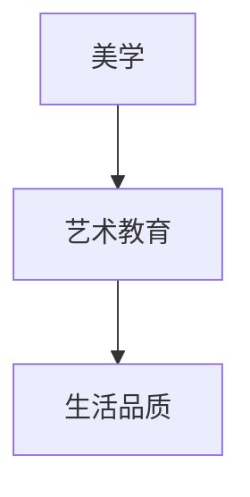

                 

### 第一部分: 背景介绍

在快速发展的现代社会中，人们对于生活品质的追求不断提高。然而，如何在日常生活中融入艺术元素，提升生活品质，成为了许多人关注的问题。日常生活美学课程作为一种新兴的艺术教育项目，逐渐走进人们的视野，成为一种提升生活品质的重要途径。

#### 1.1 问题背景

随着社会经济的发展和人们生活水平的提高，人们对生活品质的追求已经不再局限于物质层面的满足，更加注重精神层面的丰富。美学作为研究美的科学，其核心在于如何通过审美体验和艺术修养的提升，丰富人们的精神世界，提高生活质量。日常生活美学课程正是在这样的背景下应运而生，旨在通过艺术教育的方式，帮助人们在日常生活中发现美、欣赏美、创造美。

#### 1.2 问题描述

日常生活美学课程的核心目标是提升人们的生活品质，但在实际操作中，如何设计出一套系统化、科学化的课程体系，成为了困扰许多教育工作者的问题。具体来说，存在以下几个方面的挑战：

1. **课程设计原则**：如何将美学理论与日常生活相结合，设计出既具有理论深度又能够实际操作的课程？
2. **教学内容与方法**：如何选择合适的教学内容和教学方法，使学员能够在轻松愉悦的氛围中提升审美能力？
3. **教学评价**：如何通过科学有效的评价手段，确保课程目标的实现和教学质量的提升？

#### 1.3 问题解决

为了解决上述问题，本书将从以下几个方面进行探讨：

1. **核心概念**：明确日常生活美学课程的核心概念，如美学、艺术教育、生活品质等。
2. **概念属性特征对比表格**：对比分析日常生活美学课程与传统艺术教育课程的不同。
3. **ER实体关系图架构**：构建日常生活美学课程的实体关系图，明确各个概念之间的关系。
4. **课程设计原则**：提出日常生活美学课程设计的原则和方法。
5. **课程实施策略**：探讨如何有效实施日常生活美学课程。
6. **案例分析**：通过实际案例，分析日常生活美学课程的应用效果。

#### 1.4 边界与外延

日常生活美学课程的设计与实施，不仅涉及艺术学和教育学，还涉及到心理学、社会学等多个学科领域。本书旨在为读者提供一个综合性、跨学科的视角，帮助读者全面理解这一领域。

#### 1.5 概念结构与核心要素组成

日常生活美学课程的核心概念包括美学、艺术教育、生活品质等。其结构由以下几个要素组成：

1. **课程目标**：明确提升生活品质为课程的核心目标。
2. **课程内容**：包括美学理论、艺术技巧、生活实践等。
3. **教学方法**：采用多样化的教学方法，如讲座、实践、讨论等。
4. **教学评价**：通过过程性评价和终结性评价，确保教学效果。

#### 1.6 本章小结

本章对日常生活美学课程进行了全面介绍，包括其背景、问题、解决方法、边界与外延、概念结构以及核心要素组成。为后续章节的深入探讨奠定了基础。

### 第一部分总结

日常生活美学课程作为一种提升生活品质的艺术教育项目，在现代社会中具有重要的作用。通过本章的介绍，我们明确了日常生活美学课程的核心概念、问题背景、问题描述、问题解决方法以及边界与外延。接下来，我们将进一步探讨日常生活美学课程的核心概念与联系，为读者提供更深入的理解。

---

### 第二部分：核心概念与联系

在日常生活美学课程中，核心概念包括美学、艺术教育和生活品质。这些概念之间相互联系，构成了课程的理论基础和实践框架。

#### 2.1 核心概念原理

##### 2.1.1 美学

美学是研究美的哲学学科，探讨美的本质、美的评价标准以及美的创造。美学不仅仅关注外在的视觉美，还包括内在的精神美和情感美。在日常生活美学课程中，美学为课程提供了理论基础，帮助学员理解美的内涵，培养审美能力。

- **美的本质**：美学研究美的本质，试图揭示美之所以成为美的根本原因。
- **美的评价标准**：美学探讨如何评判美，提供了一套评价美的标准和方法。
- **美的创造**：美学研究如何创造美，通过艺术实践和审美体验，提高学员的创造能力。

##### 2.1.2 艺术教育

艺术教育是通过艺术活动培养人的审美情趣、创新能力和综合素质的教育。与传统的艺术课程不同，日常生活美学课程更注重艺术在生活中的应用，旨在提升学员的生活品质。

- **审美情趣**：艺术教育培养学员对美的感知和欣赏能力，提高他们的审美情趣。
- **创新能力**：艺术教育激发学员的创造力，培养他们解决实际问题的能力。
- **综合素质**：艺术教育全面培养学员的素质，包括道德、智力、情感等方面。

##### 2.1.3 生活品质

生活品质是指人们在日常生活中所追求的舒适、愉悦、健康和有意义的生活方式。日常生活美学课程通过提升学员的审美能力和艺术修养，从而提高他们的生活品质。

- **舒适**：生活品质体现在人们日常生活的舒适度，包括环境、食物、衣物等。
- **愉悦**：生活品质体现在人们日常生活的愉悦感，包括情感、精神、娱乐等方面。
- **健康**：生活品质体现在人们日常生活的健康程度，包括身体健康、心理健康等。
- **有意义**：生活品质体现在人们日常生活的意义感，包括职业、家庭、社交等。

#### 2.2 概念属性特征对比表格

为了更清晰地理解美学、艺术教育和生活品质这三个核心概念，我们可以通过对比表格来展示它们的属性特征。

| 概念      | 定义                                                         | 特征                                                         |
| --------- | ------------------------------------------------------------ | ------------------------------------------------------------ |
| 美学      | 研究美的哲学学科，探讨美的本质、美的评价标准以及美的创造。 | - 研究美的本质 - 研究美的评价标准 - 研究美的创造 |
| 艺术教育  | 通过艺术活动培养人的审美情趣、创新能力和综合素质的教育。 | - 培养审美情趣 - 培养创新能力 - 培养综合素质   |
| 生活品质  | 人们在日常生活中所追求的舒适、愉悦、健康和有意义的生活方式。 | - 舒适 - 愉悦 - 健康 - 有意义               |

#### 2.3 ER实体关系图架构

为了更好地理解这三个核心概念之间的联系，我们可以使用实体关系图（ER图）来展示它们之间的关联。

在ER图中，美学作为艺术教育的基础，通过艺术教育作用于生活品质。艺术教育不仅传递美学理论，还通过实践活动提升学员的审美能力和艺术修养，从而直接或间接地影响生活品质。

#### 2.4 本章小结

本章对日常生活美学课程的核心概念进行了详细阐述，并通过对比表格和ER实体关系图，帮助读者理解这些概念之间的联系。理解这些核心概念，是进一步探讨日常生活美学课程设计与实施的基础。在下一章中，我们将深入讨论日常生活美学课程的设计原则与实施策略。

### 第二部分总结

日常生活美学课程的核心概念包括美学、艺术教育和生活品质。这些概念相互关联，构成了课程的理论基础和实践框架。通过本章的探讨，我们明确了这些核心概念的定义、属性特征以及它们之间的联系。在下一部分，我们将进一步探讨日常生活美学课程的设计原则与实施策略，为课程的顺利开展提供指导。

