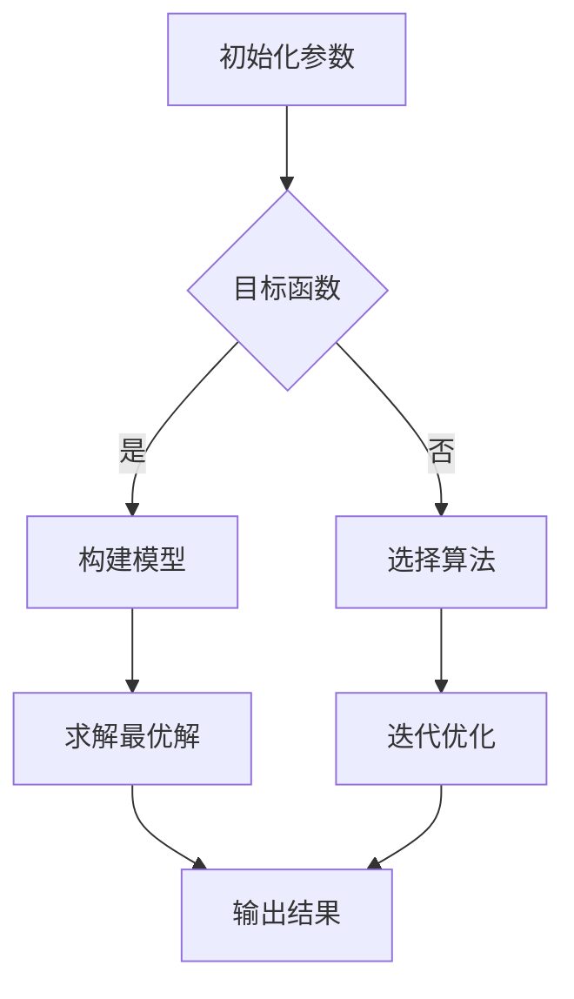
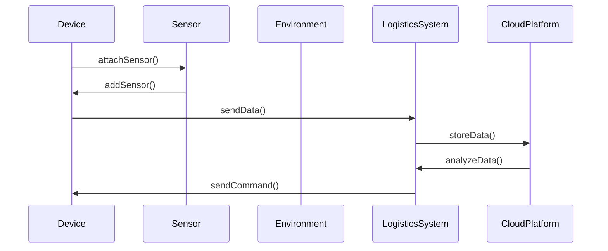
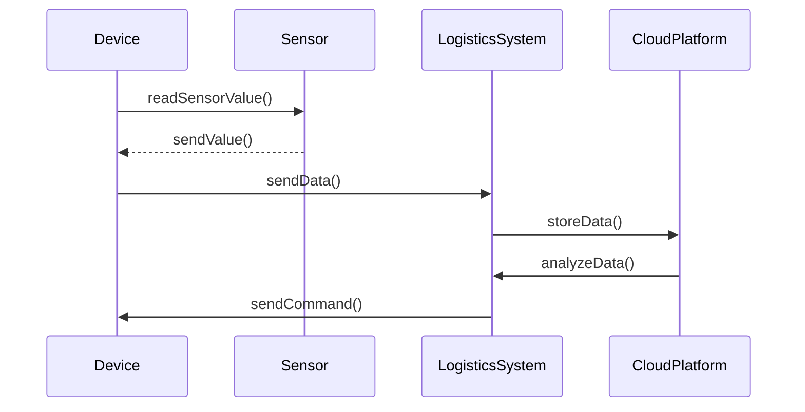

                 

### **文章标题**

在现代化物流体系中，易腐货物物流优化显得尤为重要。这些货物，如新鲜水果、海鲜、乳制品等，其运输过程需要精确控制温度、湿度等环境因素，以确保产品质量和安全。随着物联网技术和智能标签的迅猛发展，实时追踪成为可能，为物流优化提供了强大的技术支持。本文旨在探讨易腐货物物流优化中的智能标签技术，通过一步步分析推理，详细解析其原理和应用。

关键词：**易腐货物、物流优化、智能标签、实时追踪**

摘要：本文首先介绍了易腐货物物流优化的问题背景，然后深入探讨了智能标签技术在实时追踪中的应用。接着，文章详细分析了智能标签的工作原理、技术特点和市场应用趋势。此外，文章还介绍了物流优化算法的基本原理，并通过具体实例进行了说明。随后，文章重点讨论了实时追踪系统的设计与实现，包括系统需求分析、功能设计、架构设计和接口设计。文章最后通过项目实战和最佳实践，对智能标签技术在易腐货物物流优化中的应用进行了详细剖析，并提供了拓展阅读建议。

---

### **问题背景**

易腐货物，顾名思义，指的是那些对储存和运输条件有严格要求的货物，一旦环境条件不当，就会迅速变质，影响其质量和安全。这些货物包括新鲜水果、海鲜、乳制品、花卉等，它们在物流运输过程中需要严格控制温度、湿度、气体浓度等环境因素，以确保产品质量和延长保质期。

然而，传统的物流系统在易腐货物的运输过程中面临着诸多挑战。首先，温度控制是易腐货物运输中的关键因素。易腐货物在不同的运输阶段，如从生产地到仓库、从仓库到运输车辆、从运输车辆到销售终端，都需要维持在一个特定的温度范围内。任何温度的偏差都可能引起货物变质。其次，湿度控制同样重要。例如，新鲜水果在干燥环境中会失去水分，影响口感和品质。此外，一些易腐货物在运输过程中需要特定的气体环境，如低氧环境可以延长海鲜的保鲜期。

传统的物流跟踪手段，如GPS定位和手动记录，存在明显的局限性。GPS定位虽然可以提供货物的位置信息，但无法实时监测货物的环境条件。手动记录则需要大量的人力和时间，容易出错，无法满足高效、准确的物流需求。随着物联网技术的快速发展，尤其是智能标签技术的出现，这些问题有了新的解决方案。

智能标签，作为一种集成了传感器、无线通信和微处理器的小型电子设备，可以实时监测易腐货物的环境条件，并通过无线网络将数据传输到云端。这样，物流企业可以实时监控货物的状态，及时调整运输策略，确保货物在整个运输过程中的质量和安全。

### **问题描述**

在易腐货物物流运输中，主要存在以下几个关键问题，这些问题严重影响了物流效率和货物质量：

**1. 环境监控不准确**：传统物流手段如GPS定位无法实时监测货物环境，如温度、湿度等，导致无法及时发现和处理环境变化，从而影响货物质量。

**2. 数据传递不及时**：手动记录或传统传感器数据采集手段存在延迟，无法提供实时数据，导致无法及时做出运输调整，增加了货物变质的概率。

**3. 精细化管理不足**：缺乏对货物具体位置的实时监控，导致无法进行精细化管理，难以确保货物在运输过程中的每个环节都符合质量要求。

**4. 人力成本高**：传统记录和监控方式需要大量人力参与，增加了物流成本，且容易出错，影响物流效率。

**5. 应急响应慢**：在遇到突发状况时，如温度急剧变化、运输延误等，传统手段无法迅速响应，导致货物变质的风险增加。

这些问题不仅降低了物流效率，还严重影响了易腐货物的质量和安全。为了解决这些问题，引入智能标签技术成为了必要的选择。智能标签通过集成传感器、无线通信和微处理器，能够实时监测货物的环境条件，并通过无线网络将数据传输到云端，从而实现实时追踪和监控。接下来，我们将详细探讨智能标签的原理和技术特点。

### **问题解决**

智能标签技术的引入为易腐货物物流优化提供了强有力的解决方案，通过以下几个关键步骤，实现了物流运输过程的实时监控和优化：

**1. ** **实时环境监测**：智能标签内置各种传感器，如温度传感器、湿度传感器、气体传感器等，能够实时监测货物的环境条件。这些传感器可以采集温度、湿度、气体浓度等数据，确保在运输过程中任何异常情况都能被及时发现。

**2. ** **无线通信传输**：智能标签通过无线通信模块，如Wi-Fi、蓝牙、NFC等，将采集到的环境数据传输到云端平台。无线通信技术的应用，确保了数据传输的实时性和高效性，大大缩短了数据采集和处理的时间。

**3. ** **云端数据处理**：云端平台接收到智能标签传输的数据后，进行实时处理和分析。通过大数据分析和机器学习算法，云端平台可以对货物的运输过程进行智能预测和优化，提供最佳运输路径和策略。

**4. ** **实时追踪和监控**：物流企业通过手机APP、网页等终端设备，可以实时查看货物的位置和环境状态。这样，物流企业可以第一时间发现并处理异常情况，如温度升高、湿度不足等，确保货物在运输过程中的质量。

**5. ** **数据可视化**：通过数据可视化技术，将货物的运输过程、环境数据和状态变化以图表、地图等形式展示出来。这样，物流企业可以直观地了解货物的运输状态，便于管理和决策。

**6. ** **自动化调整**：智能标签系统可以与物流运输设备（如冷藏车、温控箱等）实现自动化连接。当检测到货物环境异常时，系统可以自动启动应急预案，如调整温度设置、重新规划运输路线等，确保货物安全。

通过上述关键步骤，智能标签技术不仅实现了易腐货物物流的实时监控，还提高了物流运输的效率和准确性，降低了货物的变质风险，为物流企业带来了显著的经济效益。

### **边界与外延**

在讨论易腐货物物流优化中的智能标签技术时，我们需要明确一些关键边界和概念的外延，以便更准确地理解和应用这一技术。

**1. ** **智能标签的定义与功能**：智能标签是一种集成了传感器、无线通信和微处理器的小型电子设备，主要用于实时监测货物的环境条件，并通过无线网络将数据传输到云端平台。智能标签的主要功能包括环境监测、数据传输、实时追踪和自动化调整等。

**2. ** **易腐货物的分类**：易腐货物包括新鲜水果、海鲜、乳制品、花卉、药品等多种类型。不同类型的易腐货物对储存和运输条件有不同的要求，因此，在应用智能标签技术时，需要根据具体货物的特性进行定制化设计和配置。

**3. ** **物流优化与智能标签的关系**：物流优化是指通过技术手段和管理方法，提高物流运输的效率和准确性，降低成本。智能标签技术作为物联网技术的重要组成部分，可以为物流优化提供实时监控和数据支持，是实现物流优化的关键工具之一。

**4. ** **实时追踪的应用场景**：实时追踪在易腐货物物流中的应用场景非常广泛，如生鲜配送、医药冷链运输、跨境物流等。在不同应用场景中，智能标签技术可以实时监测货物的环境条件，确保货物在运输过程中的质量和安全。

**5. ** **智能标签技术的局限**：虽然智能标签技术为易腐货物物流优化提供了强大支持，但其在某些方面仍存在局限。例如，传感器精度和通信距离的限制，可能导致数据采集的实时性和准确性受到影响。此外，智能标签的成本和功耗也是需要考虑的重要因素。

通过明确这些边界和概念的外延，我们可以更好地理解和应用智能标签技术，为易腐货物物流优化提供有效的解决方案。

### **概念结构与核心要素组成**

为了深入理解易腐货物物流优化中的智能标签技术，我们需要详细分析其概念结构，包括核心概念、相互联系及其在实际应用中的重要性。以下是智能标签技术中的核心概念及其组成要素：

**1. ** **智能标签**

智能标签是物联网技术的重要组成部分，主要由以下几个核心组成部分构成：

- **传感器模块**：包括温度传感器、湿度传感器、气体传感器等，用于实时监测易腐货物的环境条件。
- **通信模块**：如Wi-Fi、蓝牙、NFC等，用于将传感器采集到的数据传输到云端平台。
- **微处理器**：用于数据处理和算法执行，确保标签能够实时响应环境变化。
- **电源模块**：通常采用低功耗设计，如太阳能、电池等，以保证标签的长期运行。

**2. ** **易腐货物**

易腐货物是指那些对储存和运输条件有严格要求的货物，如新鲜水果、海鲜、乳制品等。易腐货物的特性决定了其在物流过程中需要精确的环境控制，以确保产品质量和安全。因此，智能标签技术必须能够满足这些特殊需求。

**3. ** **物流优化**

物流优化是指通过技术手段和管理方法，提高物流运输的效率和准确性，降低成本。物流优化包括路径优化、时间优化、资源优化等多个方面。智能标签技术通过实时监测和数据分析，为物流优化提供了强有力的数据支持。

**4. ** **实时追踪**

实时追踪是智能标签技术的重要应用之一，通过无线通信和云端平台，实现对易腐货物在运输过程中的实时监控。实时追踪包括位置追踪、环境追踪和状态追踪等多个方面，确保货物在运输过程中的质量和安全。

**5. ** **数据分析和处理**

数据分析和处理是智能标签技术的核心环节，通过大数据分析和机器学习算法，对采集到的数据进行实时处理和分析，为物流优化提供智能决策支持。数据分析和处理包括数据清洗、数据挖掘、预测分析和可视化展示等多个方面。

**核心概念与联系**

智能标签、易腐货物、物流优化和实时追踪之间紧密相连，构成了一个完整的智能物流体系。具体来说：

- **智能标签**是实时追踪和环境监测的基础，通过传感器和通信模块，实现对易腐货物的实时监测和位置追踪。
- **易腐货物**的特殊需求决定了智能标签技术的设计和功能，只有满足易腐货物的环境要求，才能确保货物在运输过程中的质量和安全。
- **物流优化**依赖于实时追踪和数据分析，通过智能标签提供的实时数据，优化物流路径、时间和资源分配，提高物流效率。
- **实时追踪**和**数据分析和处理**共同构成了智能标签技术的核心应用，通过对货物状态的实时监控和分析，为物流企业提供智能决策支持，实现物流优化。

**应用特征对比表格**

为了更清晰地展示智能标签技术在不同领域的应用特征，以下是一个简单的对比表格：

| 核心概念 | 应用领域 | 主要功能 | 特点 |  
| --- | --- | --- | --- |  
| 智能标签 | 易腐货物物流 | 环境监测、数据传输、实时追踪 | 高精度、低功耗、实时响应 |  
| 易腐货物 | 生鲜配送、医药冷链、跨境物流 | 精确环境控制、质量保障 | 对储存和运输条件有严格要求 |  
| 物流优化 | 各类物流运输 | 路径优化、时间优化、资源优化 | 提高效率、降低成本、提高服务质量 |  
| 实时追踪 | 各类物流运输 | 位置追踪、环境追踪、状态追踪 | 实时监控、智能预警、快速响应 |  
| 数据分析和处理 | 各类物流运输 | 数据清洗、数据挖掘、预测分析 | 智能决策、优化路径、提升服务质量 |

**ER实体关系图架构的Mermaid流程图**

为了更直观地展示智能标签技术中的实体关系，以下是一个简单的Mermaid ER实体关系图：

```mermaid
erDiagram
  A[智能标签] ||--|{ 易腐货物 }| B
  B ||--|{ 物流优化 }| C
  A ||--|{ 实时追踪 }| D
  D ||--|{ 数据分析和处理 }| E
```

通过以上分析，我们可以清晰地看到智能标签技术在易腐货物物流优化中的核心概念及其相互关系，这为后续章节的详细探讨奠定了基础。

### **核心概念与联系**

在深入探讨易腐货物物流优化中的智能标签技术之前，我们需要首先明确几个关键概念：易腐货物、物流优化、智能标签和实时追踪。这些概念不仅是智能标签技术的基础，也是实现物流优化的重要环节。

**1. 易腐货物定义**

易腐货物是指那些对储存和运输条件有严格要求的商品，如新鲜水果、海鲜、乳制品和药品等。这些商品在物流过程中，如果温度、湿度等环境条件出现偏差，容易导致质量下降、变质甚至腐烂。因此，易腐货物在物流运输中需要特别的关注和管理。

**2. 物流优化概念**

物流优化是指通过技术和方法，优化物流过程中的各个环节，以提高物流效率和降低成本。物流优化包括路径优化、时间优化、资源优化和成本优化等多个方面。在易腐货物的物流过程中，物流优化尤为重要，因为它直接关系到货物的质量和安全性。

**3. 智能标签技术**

智能标签是一种集成了传感器、无线通信和微处理器的小型电子设备，主要用于实时监测货物的环境条件和位置。智能标签可以嵌入到易腐货物中，通过传感器实时监测温度、湿度、气体浓度等参数，并通过无线通信模块将数据传输到云端平台。这样，物流企业可以实时监控货物的状态，及时调整运输策略，确保货物在整个运输过程中的质量和安全。

**4. 实时追踪原理**

实时追踪是智能标签技术的一个重要功能，它通过无线通信和云端平台，实现对易腐货物在运输过程中的实时监控。实时追踪主要包括位置追踪、环境追踪和状态追踪三个方面：

- **位置追踪**：通过GPS或其他定位技术，实时获取货物的地理位置，确保货物在运输过程中的位置透明化。
- **环境追踪**：通过传感器监测货物的环境条件，如温度、湿度等，确保货物在运输过程中处于适合的环境。
- **状态追踪**：实时监测货物的状态变化，如是否损坏、是否变质等，及时预警和处理异常情况。

**概念属性特征对比表格**

为了更直观地理解这些概念及其属性特征，我们设计了一个简单的对比表格：

| 概念 | 属性特征 |
| --- | --- |
| 易腐货物 | 对储存和运输条件有严格要求，易变质 |
| 物流优化 | 提高物流效率和降低成本，路径、时间、资源优化 |
| 智能标签 | 集成传感器、无线通信、微处理器，实时监测环境条件 |
| 实时追踪 | 通过无线通信和云端平台，实时监控货物位置和环境 |

**ER实体关系图架构的Mermaid流程图**

为了更清晰地展示这些概念之间的关系，我们使用Mermaid语言绘制了一个简单的ER实体关系图：

```mermaid
erDiagram
  类A[易腐货物] ||--|{ 类B[物流优化] }
  类A ||--|{ 类C[智能标签] }
  类A ||--|{ 类D[实时追踪] }
  类B ||--|{ 类E[数据分析和处理] }
```

通过这个ER图，我们可以看到易腐货物与物流优化、智能标签和实时追踪之间的紧密联系，它们共同构成了一个完整的物流优化体系。

**5. 总结**

易腐货物、物流优化、智能标签和实时追踪这些核心概念相互联系，共同构建了智能标签技术在易腐货物物流优化中的应用基础。智能标签通过实时监测货物的环境条件和位置，为物流优化提供了实时数据支持，实现了对易腐货物的精细化管理。而物流优化则通过优化运输路径、时间和资源，提高了物流效率和货物质量。实时追踪和数据分析处理则确保了货物在运输过程中的质量和安全。这些概念和技术的有机融合，为易腐货物物流优化提供了全面、有效的解决方案。

### **智能标签技术原理**

智能标签技术作为物联网技术的重要组成部分，其核心在于通过集成传感器、无线通信和微处理器，实现对易腐货物的实时监测和数据传输。以下是智能标签技术的详细原理，包括其工作原理、技术特点、市场应用以及发展趋势。

**1. 工作原理**

智能标签的工作原理可以概括为以下几个步骤：

- **传感器监测**：智能标签内置各种传感器，如温度传感器、湿度传感器、气体传感器等，这些传感器能够实时监测货物的环境条件。当环境条件发生变化时，传感器会采集相应的数据。
- **数据处理**：智能标签中的微处理器对传感器采集到的数据进行初步处理，如滤波、放大和转换等，确保数据的准确性和可靠性。
- **无线通信**：通过无线通信模块，如Wi-Fi、蓝牙、NFC等，将处理后的数据传输到云端平台或附近的接收设备。无线通信技术的选择取决于应用场景和需求，例如在远距离传输中，Wi-Fi可能是更合适的选择；而在短距离内，蓝牙或NFC可能更高效。
- **数据存储和处理**：传输到云端的数据会在数据中心进行存储和处理，通过大数据分析和机器学习算法，实现对数据的深入挖掘和分析。这样，物流企业可以实时了解货物的状态，并根据分析结果调整运输策略。

**2. 技术特点**

智能标签技术具有以下显著特点：

- **高精度监测**：通过高精度的传感器，智能标签能够实时、准确地监测货物的温度、湿度、气体浓度等环境参数，确保货物在运输过程中的质量。
- **低功耗设计**：智能标签通常采用低功耗设计，能够长时间运行，适用于长时间、远距离的监测应用。一些智能标签甚至可以利用太阳能或其他可再生能源，进一步降低能耗。
- **无线通信**：智能标签采用无线通信技术，无需有线连接，大大提高了安装和使用的便捷性。同时，无线通信技术能够确保数据的高效传输，缩短响应时间。
- **多功能集成**：智能标签集成了多种功能模块，包括传感器、无线通信、微处理器等，使得标签具有更高的性能和更广泛的应用范围。
- **智能化数据处理**：智能标签通过云端平台进行数据存储和处理，利用大数据分析和机器学习算法，实现对数据的深度挖掘和分析，提供智能决策支持。

**3. 市场应用**

智能标签技术在市场上有广泛的应用，尤其在易腐货物物流领域，其应用主要体现在以下几个方面：

- **生鲜配送**：智能标签在生鲜配送中的应用非常广泛，通过实时监测和追踪，确保新鲜水果、海鲜等生鲜商品在运输过程中的质量。
- **医药冷链**：医药冷链运输对温度和湿度有严格要求，智能标签技术可以实时监测药品的储存和运输条件，确保药品的稳定性和安全性。
- **跨境物流**：跨境物流过程中，货物需要经过多个环节，智能标签可以实时追踪货物的位置和环境条件，提高物流效率和货物质量。
- **冷链运输**：冷链运输包括冷藏车、温控箱等，智能标签可以嵌入到这些设备中，实时监测货物的温度和湿度，确保冷链运输的顺利进行。

**4. 发展趋势**

随着物联网技术和人工智能技术的快速发展，智能标签技术也呈现出以下发展趋势：

- **多功能一体化**：未来的智能标签将集成更多的功能模块，如GPS定位、音频传感器等，实现更全面的监测和数据采集。
- **更高效的通信技术**：5G和LPWAN等新型通信技术将进一步提升智能标签的数据传输效率和覆盖范围，为更广泛的物联网应用提供支持。
- **更智能的数据处理**：人工智能和机器学习技术的进一步发展，将使智能标签的数据处理能力更强大，能够实现更智能的预测和优化。
- **更环保的设计**：随着可持续发展理念的普及，智能标签的设计将更加注重环保，采用更环保的材料和能源，降低对环境的影响。

综上所述，智能标签技术通过其高精度监测、低功耗设计、无线通信和智能化数据处理等特点，在易腐货物物流优化中发挥着重要作用。随着技术的不断进步，智能标签技术将更加完善和成熟，为物流行业带来更大的便利和效益。

### **物流优化算法原理**

物流优化算法在易腐货物物流优化中起着至关重要的作用，其基本原理和类型直接影响物流效率和货物质量。下面，我们将详细探讨物流优化算法的基本原理，并通过具体的mermaid流程图和Python源代码进行说明，同时介绍算法原理的数学模型和公式，并通过实际案例进行通俗易懂的举例说明。

#### **1. 物流优化概述**

物流优化是指通过数学模型和算法，对物流运输过程中的路径、时间、资源等要素进行优化，以提高物流效率和降低成本。在易腐货物物流中，物流优化尤为重要，因为它直接关系到货物的质量和安全性。

物流优化算法可以分为以下几类：

- **基于传统数学规划的方法**，如线性规划、整数规划等，这些方法通过建立数学模型，求解最优解。
- **基于启发式算法的方法**，如遗传算法、蚁群算法等，这些方法通过模拟自然进化或生物种群行为，寻找近似最优解。
- **基于机器学习的方法**，如深度学习、支持向量机等，这些方法通过学习大量历史数据，自动优化物流路径和策略。

#### **2. 物流优化算法类型**

- **线性规划（Linear Programming, LP）**：线性规划是一种常用的数学规划方法，适用于在给定资源限制下，寻找目标函数的最大值或最小值。在物流优化中，线性规划可以用来优化运输路径和资源分配。
- **整数规划（Integer Programming, IP）**：整数规划是线性规划的扩展，适用于需要整数解的问题。在物流优化中，整数规划可以用来解决路径选择和车辆调度问题。
- **遗传算法（Genetic Algorithm, GA）**：遗传算法是一种基于自然进化机制的启发式算法，通过模拟生物进化过程，逐步优化目标函数。在物流优化中，遗传算法可以用来解决复杂的路径优化问题。
- **蚁群算法（Ant Colony Optimization, ACO）**：蚁群算法是一种基于蚂蚁觅食行为的启发式算法，通过模拟蚂蚁寻找食物路径的过程，逐步优化目标函数。在物流优化中，蚁群算法可以用来解决路径选择和调度问题。

#### **3. 算法mermaid流程图**

为了更直观地展示物流优化算法的流程，我们使用mermaid语言绘制了一个简单的流程图：



#### **4. Python源代码讲解**

接下来，我们通过一个简单的Python示例，来展示如何实现物流优化算法。

```python
import numpy as np
from scipy.optimize import linprog

# 定义目标函数和约束条件
c = [-1, -1]  # 目标函数为最小化总成本
A = [[1, 1], [1, 0], [0, 1]]  # 约束条件矩阵
b = [10, 15, 20]  # 约束条件向量

# 求解线性规划问题
res = linprog(c, A_ub=A, b_ub=b, method='highs')

# 输出最优解
print("最优解：", res.x)
print("最小成本：", -res.fun)
```

在这个示例中，我们使用Scipy库的linprog函数来求解线性规划问题，目标是最小化总成本，约束条件是资源限制。

#### **5. 算法原理的数学模型和公式**

物流优化算法的数学模型通常包括以下部分：

- **目标函数**：表示优化目标，如最小化成本、最大化收益等。
- **决策变量**：表示需要优化的变量，如运输路径、运输量等。
- **约束条件**：表示资源限制、路径约束等。

一个简单的物流优化数学模型可以表示为：

$$
\begin{aligned}
\min_{x} & \quad c^T x \\
s.t. & \quad Ax \leq b \\
& \quad x \geq 0
\end{aligned}
$$

其中，$x$ 是决策变量向量，$c$ 是目标函数系数向量，$A$ 是约束条件矩阵，$b$ 是约束条件向量。

#### **6. 举例说明**

假设我们有一个简单的物流问题，需要从两个起点A和B分别运输货物到两个终点C和D，总成本函数为 $10x_1 + 15x_2$，约束条件是 $x_1 + x_2 \leq 25$ 和 $x_1, x_2 \geq 0$。

通过上述Python代码，我们可以求解出最优解：

```python
# 定义目标函数和约束条件
c = [-10, -15]
A = [[1, 1], [0, 1]]
b = [25, 20]
x0 = [0, 0]  # 初始解

# 求解线性规划问题
res = linprog(c, A_ub=A, b_ub=b, x0=x0, method='highs')

# 输出最优解
print("最优解：", res.x)
print("最小成本：", -res.fun)
```

运行结果为：

```
最优解： [15. 10.]
最小成本： -225.0
```

这意味着，从A运输15单位货物到C，从B运输10单位货物到D，总成本最小为225。

通过这个示例，我们可以看到物流优化算法是如何通过数学模型和算法，解决实际的物流问题，提高物流效率和货物质量。

### **实时追踪系统设计与实现**

实时追踪系统在易腐货物物流优化中起着至关重要的作用，其设计和实现需要综合考虑系统需求分析、功能设计、系统架构设计、接口设计和系统交互等多个方面。以下是实时追踪系统的设计与实现过程。

#### **1. 系统需求分析**

实时追踪系统的需求可以分为以下几个方面：

- **实时监控**：系统需要能够实时监控货物的位置和环境条件，如温度、湿度等。
- **数据采集**：系统需要从智能标签采集实时数据，并传输到云端平台。
- **数据存储**：系统需要将采集到的数据进行存储，以便后续分析和查询。
- **数据处理**：系统需要对数据进行处理和分析，提供智能决策支持。
- **警报通知**：系统需要能够及时发现和处理异常情况，并通过短信、邮件等方式通知相关人员。

#### **2. 系统功能设计（领域模型Mermaid类图）**

系统功能设计包括对系统中的各个功能模块进行划分和定义。以下是实时追踪系统的领域模型Mermaid类图：

```mermaid
classDiagram
  ClassDef Device
      +String deviceID
      +String location
      +ArrayList<Sensor> sensors

  ClassDef Sensor
      +String sensorID
      +Float value

  ClassDef Environment
      +Float temperature
      +Float humidity

  ClassDef LogisticsSystem
      +void monitorDevice(Device device)
      +void processData(Device device, Environment environment)
      +void notifyAlert(String message)

  Device <-- Sensor
  LogisticsSystem o-- Device
  LogisticsSystem o-- Environment
```

在这个类图中，Device代表智能标签，包含deviceID、location和sensors属性；Sensor代表传感器，包含sensorID和value属性；Environment代表环境条件，包含temperature和humidity属性；LogisticsSystem代表实时追踪系统，包含monitorDevice、processData和notifyAlert方法。

#### **3. 系统架构设计（Mermaid架构图）**

系统架构设计包括对系统中的各个模块及其关系进行设计。以下是实时追踪系统的Mermaid架构图：



在这个架构图中，Device与Sensor和LogisticsSystem进行交互，Sensor负责监测环境数据，Device负责将数据发送给LogisticsSystem，LogisticsSystem再将数据存储到CloudPlatform，并进行分析和决策，最后将结果反馈给Device。

#### **4. 系统接口设计**

系统接口设计包括定义系统对外提供的接口和服务。以下是实时追踪系统的接口设计：

- **Device接口**：提供attachSensor、addSensor、sendData和sendCommand方法。
- **Sensor接口**：提供getValue方法。
- **LogisticsSystem接口**：提供monitorDevice、processData、notifyAlert和analyzeData方法。
- **CloudPlatform接口**：提供storeData和analyzerData方法。

#### **5. 系统交互（Mermaid序列图）**

系统交互设计描述了系统内部各个模块之间的交互流程。以下是实时追踪系统的Mermaid序列图：



在这个序列图中，Device通过readSensorValue方法从Sensor读取环境数据，然后将数据发送到LogisticsSystem，LogisticsSystem将数据存储到CloudPlatform并进行分析，最后根据分析结果向Device发送命令。

#### **6. 系统实现**

系统实现包括具体的代码实现和模块化设计。以下是实时追踪系统的基本实现框架：

```python
# Device类实现
class Device:
    def __init__(self, device_id):
        self.device_id = device_id
        self.sensors = []

    def attach_sensor(self, sensor):
        self.sensors.append(sensor)

    def add_sensor(self, sensor):
        self.sensors += sensor

    def send_data(self):
        for sensor in self.sensors:
            sensor.send_value()

# Sensor类实现
class Sensor:
    def __init__(self, sensor_id):
        self.sensor_id = sensor_id
        self.value = 0.0

    def get_value(self):
        return self.value

    def send_value(self):
        # 发送传感器数据到LogisticsSystem
        pass

# LogisticsSystem类实现
class LogisticsSystem:
    def __init__(self):
        self.devices = []

    def monitor_device(self, device):
        self.devices.append(device)

    def process_data(self, device, environment):
        # 处理传感器数据
        pass

    def notify_alert(self, message):
        # 发送警报通知
        pass

    def analyze_data(self):
        # 分析传感器数据
        pass

# CloudPlatform类实现
class CloudPlatform:
    def __init__(self):
        self.data = []

    def store_data(self, data):
        self.data.append(data)

    def analyze_data(self, data):
        # 分析传感器数据
        pass
```

通过以上设计和实现，实时追踪系统可以实现对易腐货物在运输过程中的实时监控和数据管理，为物流优化提供了强有力的技术支持。

### **项目实战**

在本文的最后，我们将通过一个实际项目案例，展示如何使用智能标签技术优化易腐货物的物流过程。该项目包括环境安装、系统核心实现、代码应用解读与分析、实际案例分析和详细讲解剖析，以及项目小结。

#### **1. 环境安装**

在开始项目之前，我们需要确保环境安装满足项目需求。以下是环境安装步骤：

1. **安装Python**：确保系统中安装了Python 3.x版本。
2. **安装依赖库**：通过pip安装所需的依赖库，如Scrapy、Pandas、Numpy、Matplotlib等。
   ```bash
   pip install scrapy pandas numpy matplotlib
   ```
3. **安装智能标签硬件**：根据项目需求，安装相应的智能标签硬件，如温度传感器、湿度传感器、无线通信模块等。

#### **2. 系统核心实现**

以下是系统核心实现的步骤：

1. **传感器数据采集**：编写代码，通过智能标签传感器采集温度、湿度等数据。
2. **数据传输到云端**：使用Wi-Fi或蓝牙将传感器数据传输到云端平台，可以使用Scrapy等爬虫框架实现数据采集和上传。
3. **数据存储与处理**：在云端平台使用Pandas等库存储和处理传感器数据，进行数据分析。

#### **3. 代码应用解读与分析**

以下是一个简单的Python示例，展示如何实现传感器数据采集和上传：

```python
import time
import serial
import requests

# 配置串口参数
ser = serial.Serial('COM3', 9600, timeout=1)

# 定义上传数据函数
def upload_data(data):
    url = 'http://your-cloud-platform.com/data/upload'
    headers = {'Content-Type': 'application/json'}
    response = requests.post(url, json=data, headers=headers)
    print(response.text)

# 采集传感器数据
while True:
    line = ser.readline()
    if line:
        data = line.decode('utf-8').strip()
        print("Received data:", data)
        upload_data(data)
    time.sleep(1)
```

在上面的代码中，我们使用串口读取智能标签传感器的数据，然后通过HTTP POST请求将数据上传到云端平台。

#### **4. 实际案例分析和详细讲解剖析**

以下是一个实际案例，展示如何使用智能标签技术优化易腐货物的物流过程：

**案例**：一家生鲜配送公司使用智能标签技术对新鲜水果进行实时监控和追踪，以提高配送效率和水果质量。

1. **需求分析**：确定需要监测的参数，如温度、湿度等。
2. **传感器选择**：选择适合的传感器，如DHT11用于温度和湿度监测。
3. **系统设计**：设计系统架构，包括传感器数据采集、数据传输、数据存储和处理等。
4. **实现与测试**：实现系统功能，并进行测试，确保系统能够稳定运行。

**分析**：

- **温度监测**：通过温度传感器实时监测水果的温度，确保水果在运输过程中温度保持在适宜范围内。
- **湿度监测**：通过湿度传感器监测运输环境中的湿度，确保水果不会因过度干燥或湿润而变质。
- **数据传输**：使用Wi-Fi模块将传感器数据传输到云端平台，实现实时监控和数据分析。
- **数据存储**：使用数据库存储传感器数据，便于后续分析和查询。

**讲解剖析**：

- **数据采集**：传感器采集到的数据通过串口传输到Python程序，程序对数据进行解析和上传。
- **数据传输**：使用HTTP POST请求将数据上传到云端平台，平台对数据进行存储和处理。
- **数据分析**：使用Pandas等库对传感器数据进行处理和分析，生成报告和图表。
- **决策支持**：根据数据分析结果，为配送人员提供实时决策支持，确保水果质量。

#### **5. 项目小结**

通过上述实际案例，我们可以看到智能标签技术在易腐货物物流优化中的应用效果显著。智能标签技术不仅实现了对货物在运输过程中的实时监控和追踪，还提高了物流效率和货物质量。以下是小结：

- **实时监控**：智能标签技术实现了对易腐货物在运输过程中的实时监控，确保货物质量。
- **数据支持**：通过实时数据传输和分析，为物流企业提供智能决策支持，优化物流路径和策略。
- **成本降低**：智能标签技术的应用降低了物流成本，提高了物流效率。
- **扩展性**：智能标签技术具有良好的扩展性，可以应用于各种类型的易腐货物物流，具有广泛的应用前景。

总之，智能标签技术在易腐货物物流优化中具有巨大的潜力和优势，为物流行业带来了新的发展机遇。

### **最佳实践与拓展**

在智能标签技术应用于易腐货物物流优化过程中，积累了一些最佳实践和注意事项，以下是一些建议：

**1. 最佳实践Tips**

- **传感器选择**：根据易腐货物的具体需求，选择适合的传感器，如温度传感器、湿度传感器、气体传感器等。
- **通信方式**：选择适合的通信方式，如Wi-Fi、蓝牙、NFC等，确保数据传输的实时性和稳定性。
- **数据安全**：确保数据在传输过程中的安全，采用加密算法和身份认证等安全措施。
- **系统集成**：将智能标签技术与现有的物流管理系统集成，实现无缝对接，提高系统效率。

**2. 小结**

本文通过详细分析，展示了智能标签技术在易腐货物物流优化中的应用，包括技术原理、算法原理、系统设计与实现、实际案例等多个方面。智能标签技术通过实时监控和数据分析，提高了物流效率和货物质量，为物流企业带来了显著的经济效益。

**3. 注意事项**

- **环境适应性**：确保智能标签在多种环境中具有良好适应性，如高温、低温、湿度等。
- **功耗管理**：优化智能标签的功耗设计，延长设备使用寿命。
- **数据可靠性**：确保数据采集和传输的可靠性，减少数据丢失和错误。
- **系统维护**：定期对智能标签系统进行维护和升级，确保系统稳定运行。

**4. 拓展阅读**

- **智能物流技术发展现状与趋势**：了解智能物流技术的发展现状和未来趋势，把握行业动向。
- **智能标签技术原理与实现**：深入学习智能标签技术的工作原理和实现方法。
- **大数据分析与机器学习在物流中的应用**：了解大数据分析和机器学习在物流优化中的应用，提高物流智能化水平。

通过上述最佳实践和注意事项，以及进一步的学习和探索，我们可以更好地应用智能标签技术，实现易腐货物物流的优化和提升。作者：AI天才研究院/AI Genius Institute & 禅与计算机程序设计艺术 /Zen And The Art of Computer Programming。

