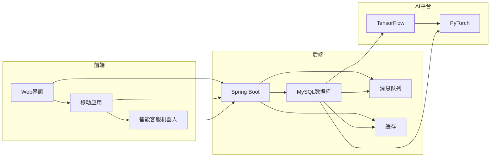
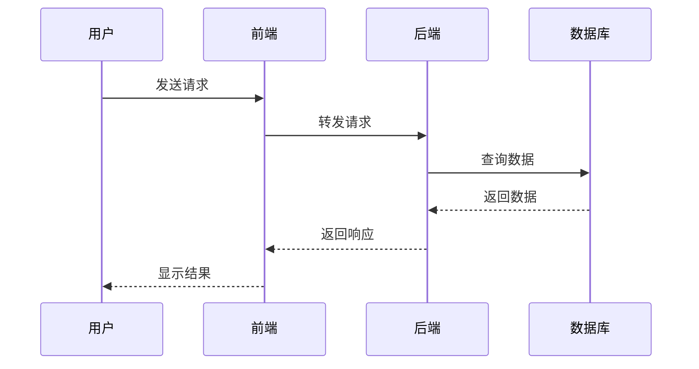
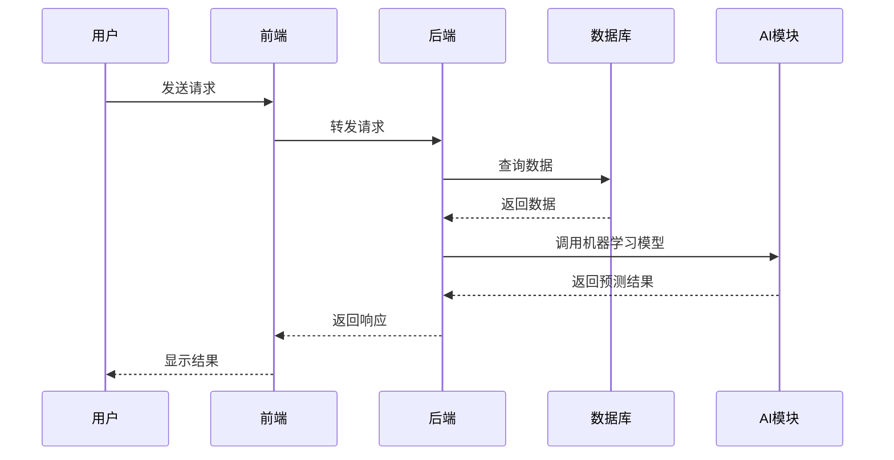

                 

### 摘要

本文将深入探讨智能客户关系管理系统的构建与应用，重点分析人工智能（AI）在这一系统中的优化作用。随着企业对客户体验的重视程度不断提高，智能客户关系管理系统成为提升客户满意度和忠诚度的关键工具。通过介绍系统的背景、核心概念和算法原理，本文将展示如何利用AI技术实现客户数据的精准分析、个性化服务的提供以及高效决策的制定。我们将通过具体案例展示系统在实际应用中的效果，并总结最佳实践，为企业的数字化转型提供有益的参考。

### 第1章：智能客户关系管理系统背景介绍

#### 1.1 问题背景

**1.1.1 客户关系管理的演变**

客户关系管理（Customer Relationship Management，CRM）作为一种管理理念，其核心在于通过优化企业与客户之间的关系来提升客户满意度和忠诚度。传统的CRM系统主要依赖于手动数据输入和简单的数据分析，虽然在一定程度上提高了客户服务水平，但在数据整合、个性化服务和决策支持方面仍存在诸多局限。

随着互联网和大数据技术的发展，智能客户关系管理系统逐渐崭露头角。这种系统利用人工智能（AI）、大数据和云计算等技术，实现了对客户数据的深度挖掘和分析，为企业提供了更精准、更个性化的客户服务。

**1.1.2 客户关系管理在不同行业中的应用案例**

在零售行业，智能CRM系统通过分析客户购物行为和历史数据，实现个性化推荐和精准营销，从而提升销售额和客户忠诚度。例如，亚马逊和阿里巴巴等电商巨头利用智能CRM系统，根据用户浏览和购买记录进行商品推荐，显著提高了用户购买转化率。

在金融行业，智能CRM系统通过对客户交易行为和风险偏好进行分析，提供定制化的理财产品和服务，提升客户满意度和忠诚度。例如，花旗银行利用智能CRM系统对客户进行精准画像，提供个性化的理财建议，从而增加了客户留存率和交叉销售率。

在服务行业，智能CRM系统通过自动化客户服务和智能客服，提升了服务效率和客户体验。例如，谷歌和微软等公司提供的智能客服服务，通过自然语言处理和机器学习技术，能够快速响应用户咨询，解决常见问题，减轻人工客服的工作负担。

#### 1.1.3 市场需求分析

**1.1.3.1 企业对高效客户关系管理的需求**

随着市场竞争的加剧，企业越来越认识到客户关系管理的重要性。高效客户关系管理系统能够帮助企业更好地了解客户需求，提高客户满意度，从而提升企业的竞争力和市场占有率。具体需求包括：

- 客户数据的整合与分析
- 客户体验的个性化定制
- 数据驱动的决策支持
- 高效的客户服务与支持

**1.1.3.2 智能化技术在客户关系管理中的应用趋势**

随着人工智能、大数据和云计算等技术的快速发展，智能客户关系管理系统正在成为企业提升客户关系管理效率的重要工具。主要应用趋势包括：

- 人工智能技术的深度应用，如自然语言处理、机器学习和深度学习，用于客户数据的分析和个性化服务提供
- 大数据的集成与分析，用于客户行为的精准预测和营销策略的制定
- 云计算的基础设施支持，用于实现系统的弹性扩展和高效运算

#### 1.1.4 技术发展趋势

**1.1.4.1 人工智能在客户关系管理中的应用**

人工智能技术正在深刻改变客户关系管理的各个方面。自然语言处理技术使得智能客服系统能够理解和回应用户的复杂查询，提高客户满意度。机器学习和深度学习技术则能够对大量客户数据进行挖掘和分析，提供更精准的客户画像和个性化服务。

**1.1.4.2 大数据与云计算对客户关系管理的影响**

大数据技术能够帮助企业收集和处理海量的客户数据，从而实现更深入的客户分析和更精确的市场预测。云计算则提供了强大的计算能力和数据存储能力，使得企业能够轻松实现智能客户关系管理系统的部署和扩展。

#### 1.2 问题描述

**1.2.1 客户关系管理面临的挑战**

尽管智能客户关系管理系统为企业提供了许多机遇，但也面临一些挑战：

- **数据质量与数据整合**：客户数据的多样性和分散性使得数据整合和质量保证成为一个难题。
- **客户体验与个性化服务**：如何提供满足每个客户个性化需求的体验和服务，是一个复杂且具有挑战性的问题。
- **高效客户分析与管理**：如何在海量数据中快速提取有价值的信息，为决策提供支持，是一个技术难题。

**1.2.2 智能客户关系管理系统的目标**

智能客户关系管理系统的目标是：

- 提高客户满意度与忠诚度：通过提供个性化、高效的服务，提升客户体验，增强客户忠诚度。
- 降低运营成本与提高效率：通过自动化和智能化的方式，减少人工成本，提高运营效率。
- 提升企业竞争力和市场占有率：通过精准的客户分析和高效的营销策略，提升企业的市场竞争力。

#### 1.3 问题解决

**1.3.1 智能客户关系管理系统概述**

智能客户关系管理系统是一个集成多种人工智能技术、大数据分析和云计算基础设施的系统，旨在为企业提供全面、高效的客户关系管理解决方案。系统主要包括以下功能模块：

- **客户数据管理**：负责收集、存储和管理客户数据，确保数据的质量和完整性。
- **客户互动与分析**：通过自然语言处理、机器学习和深度学习等技术，分析客户数据，提供个性化服务和智能决策支持。
- **客户服务与支持**：提供智能客服系统，实现自动化的客户服务，减轻人工客服的工作负担。

**1.3.2 智能客户关系管理系统的优势**

智能客户关系管理系统具有以下优势：

- **提升客户体验**：通过个性化服务和智能推荐，满足客户的个性化需求，提高客户满意度。
- **数据驱动的决策支持**：通过数据分析，为企业提供有价值的客户洞察和决策支持，提升决策准确性。
- **高效客户分析与洞察**：通过自动化和智能化的方式，快速提取客户数据中的有价值信息，提升客户管理效率。

#### 1.4 边界与外延

**1.4.1 智能客户关系管理系统的边界**

智能客户关系管理系统主要关注以下几个方面：

- **功能范围**：主要包括客户数据的收集、存储、分析和应用，以及客户服务与支持。
- **数据来源与数据类型**：系统可以集成多种数据源，包括内部数据（如销售数据、客户互动数据）和外部数据（如社交媒体数据、市场调查数据），处理多种类型的数据（如结构化数据、半结构化数据和非结构化数据）。

**1.4.2 智能客户关系管理系统的外延**

智能客户关系管理系统可以与其他企业系统集成，实现数据共享和业务协同，例如：

- 与企业资源规划（ERP）系统集成，实现客户数据与财务数据的整合
- 与营销自动化系统集成，实现营销活动的自动化和个性化
- 与客户支持系统集成，实现客户服务的自动化和智能化

此外，智能客户关系管理系统在各个行业中的应用也在不断拓展，例如在医疗、教育、金融等行业，智能客户关系管理系统都发挥着重要作用。

#### 1.5 概念结构与核心要素组成

**1.5.1 智能客户关系管理系统的概念结构**

智能客户关系管理系统的概念结构主要包括以下三个主要部分：

- **客户数据管理**：负责收集、存储和管理客户数据，确保数据的质量和完整性。
- **客户互动与分析**：通过自然语言处理、机器学习和深度学习等技术，分析客户数据，提供个性化服务和智能决策支持。
- **客户服务与支持**：提供智能客服系统，实现自动化的客户服务，减轻人工客服的工作负担。

**1.5.2 智能客户关系管理系统的核心要素组成**

智能客户关系管理系统的核心要素组成包括：

- **数据采集与存储**：通过多种渠道收集客户数据，并使用大数据技术进行存储和管理。
- **数据分析与挖掘**：利用人工智能技术对客户数据进行深度挖掘和分析，提供客户画像和个性化服务。
- **客户互动与服务流程**：实现客户服务的自动化和智能化，提供高效的客户互动体验。

#### 1.6 本章小结

本章介绍了智能客户关系管理系统的背景和发展历程，分析了市场需求和技术趋势，明确了系统所面临的挑战和目标。通过概述智能客户关系管理系统的功能模块和核心要素，为后续章节的详细讨论奠定了基础。接下来，我们将深入探讨智能客户关系管理系统的核心概念和联系，进一步理解其工作原理和优势。

### 第2章：智能客户关系管理系统的核心概念与联系

#### 2.1 AI技术

**2.1.1 AI技术概述**

人工智能（Artificial Intelligence，AI）是一种模拟人类智能行为的计算机技术。它通过算法和模型，使计算机能够学习、推理、解决问题和执行复杂的任务。AI技术的发展可以追溯到20世纪50年代，经历了多个阶段，包括规则推理、知识表示、机器学习和深度学习等。

**2.1.2 AI技术在智能客户关系管理系统中的应用**

在智能客户关系管理系统中，AI技术的应用主要体现在以下几个方面：

- **自然语言处理（NLP）**：NLP使计算机能够理解和生成自然语言，用于智能客服系统、语音识别和文本分析。
- **机器学习（ML）**：ML技术用于从数据中学习模式和规律，用于客户行为预测、个性化推荐和风险评估。
- **深度学习（DL）**：DL是一种基于神经网络的机器学习技术，能够处理大量复杂数据，用于图像识别、语音识别和自然语言理解。

#### 2.2 大数据

**2.2.1 大数据概述**

大数据（Big Data）是指数据量巨大、类型多样、生成速度快的数据集合。大数据技术包括数据采集、存储、处理和分析等各个环节，用于解决传统数据处理技术难以应对的复杂问题。

**2.2.2 大数据在智能客户关系管理系统中的应用**

大数据技术在智能客户关系管理系统中扮演着关键角色，主要应用包括：

- **数据采集与存储**：通过多种渠道收集客户数据，并使用分布式存储技术进行大规模数据的存储和管理。
- **数据分析与挖掘**：利用大数据技术对海量客户数据进行分析和挖掘，提取有价值的信息和洞察。
- **实时数据处理**：通过实时数据处理技术，快速响应客户行为变化，提供个性化的服务和推荐。

#### 2.3 云计算

**2.3.1 云计算概述**

云计算是一种通过网络提供计算资源和服务的技术，包括基础设施即服务（IaaS）、平台即服务（PaaS）和软件即服务（SaaS）等模式。云计算提供了弹性扩展、高效计算和资源共享的能力。

**2.3.2 云计算在智能客户关系管理系统中的应用**

云计算在智能客户关系管理系统中提供了强大的基础设施支持，主要应用包括：

- **弹性扩展**：根据系统负载自动调整计算资源，确保系统的高可用性和性能。
- **高效计算**：利用云基础设施的强大计算能力，快速处理海量客户数据。
- **数据存储与管理**：使用云存储服务，实现大规模数据的可靠存储和管理。

#### 2.4 AI技术、大数据与云计算的联系

**2.4.1 融合应用**

AI技术、大数据和云计算的融合应用，使得智能客户关系管理系统具备了强大的数据处理和分析能力。具体表现如下：

- **AI技术**：通过大数据技术收集和处理客户数据，AI技术能够从海量数据中提取有价值的信息，为智能决策提供支持。
- **大数据**：为AI技术提供丰富的数据资源，大数据技术使得AI模型能够学习和优化，提高预测和推荐的准确性。
- **云计算**：提供弹性扩展和高效计算的能力，使得智能客户关系管理系统能够应对大规模数据和高并发访问的需求。

**2.4.2 发展趋势**

随着技术的不断进步，AI技术、大数据和云计算将在智能客户关系管理系统中发挥越来越重要的作用。未来发展趋势包括：

- **深度学习与大数据的融合**：深度学习模型将更加依赖大数据的支持，实现更准确的客户行为预测和个性化推荐。
- **实时处理与智能决策**：通过实时数据处理技术，实现客户行为的实时分析和智能决策，提高客户体验和满意度。
- **云计算与边缘计算的融合**：云计算与边缘计算的结合，将实现数据处理的就近化和实时化，提高系统响应速度和性能。

#### 2.5 概念属性特征对比表格

| 概念         | 属性特征                           | 对比结果                           |
| ------------ | ---------------------------------- | ---------------------------------- |
| AI技术       | 自动化、智能化、自主决策           | 数据处理能力、决策准确性           |
| 大数据       | 数据量庞大、类型多样、实时性高     | 数据存储、分析能力               |
| 云计算       | 弹性扩展、高效计算、资源共享         | 数据处理速度、成本效益           |

#### 2.6 ER实体关系图架构

```mermaid
erDiagram
    客户 ||--|{ 数据 }||>
    数据 ||--|{ 分析 }||>
    分析 ||--|{ 服务 }||>
    服务 ||--|{ 客户 }||>
```

#### 2.7 本章小结

本章详细介绍了智能客户关系管理系统的核心概念，包括AI技术、大数据和云计算。通过对比分析这些概念的特点和应用，展示了它们在系统中的融合和协同作用。同时，通过ER实体关系图，明确了系统内部各模块之间的关系，为进一步讨论系统的工作原理和实现方法奠定了基础。

### 第3章：算法原理讲解

在智能客户关系管理系统中，算法原理是整个系统实现高效、智能的关键。本章节将详细讲解几个核心算法的原理，包括机器学习算法、深度学习算法和自然语言处理算法，并通过具体的例子进行说明。

#### 3.1 机器学习算法

**3.1.1 机器学习算法概述**

机器学习（Machine Learning，ML）是AI的一个重要分支，它使计算机通过数据学习模式，进行预测和决策。ML算法可以分为监督学习、无监督学习和强化学习三种类型。

- **监督学习**：通过已标记的数据集，训练模型进行预测。例如，分类和回归任务。
- **无监督学习**：没有标记的数据集，通过发现数据内在结构进行学习。例如，聚类和降维。
- **强化学习**：通过与环境交互，学习最佳行动策略。例如，游戏AI和自动驾驶。

**3.1.2 机器学习算法在客户关系管理中的应用**

在智能客户关系管理系统中，机器学习算法主要用于以下几个方面：

- **客户行为预测**：通过历史数据预测客户未来的行为，如购买意图、流失风险等。
- **个性化推荐**：根据客户的历史行为和偏好，推荐相关的产品或服务。
- **风险评估**：预测客户可能面临的信用风险，提高业务决策的准确性。

**3.1.3 例子：客户流失预测**

假设一个电商企业希望通过机器学习算法预测客户流失风险，可以使用以下步骤：

1. **数据收集**：收集客户的基本信息（如年龄、性别、购买历史等）和行为数据（如登录频率、浏览时长等）。
2. **特征工程**：选择和构建与客户流失相关的特征，如购买频率、购物车放弃率等。
3. **模型训练**：使用监督学习算法（如逻辑回归、决策树或随机森林）训练模型，预测客户流失风险。
4. **模型评估**：使用交叉验证等方法评估模型性能，调整模型参数。
5. **预测应用**：将模型应用到新客户，预测其流失风险，进行精准营销和客户保留策略。

#### 3.2 深度学习算法

**3.2.1 深度学习算法概述**

深度学习（Deep Learning，DL）是一种基于多层神经网络的学习方法，能够自动提取数据中的特征。与传统的机器学习方法相比，深度学习在处理复杂数据和大型数据集方面具有显著优势。

- **卷积神经网络（CNN）**：主要用于图像和视频处理。
- **循环神经网络（RNN）**：主要用于序列数据处理，如自然语言处理和时间序列分析。
- **生成对抗网络（GAN）**：用于生成新的数据样本，如图像和文本。

**3.2.2 深度学习算法在客户关系管理中的应用**

在智能客户关系管理系统中，深度学习算法主要用于以下几个方面：

- **图像识别和视觉分析**：通过图像识别技术，自动识别客户上传的图片，提取关键信息。
- **语音识别和自然语言处理**：通过语音识别和自然语言处理技术，实现智能客服和语音交互。
- **客户行为预测和个性化服务**：通过分析客户行为数据，预测其未来行为，提供个性化的服务推荐。

**3.2.3 例子：图像识别在客户画像中的应用**

假设一个电商平台希望通过图像识别技术分析客户的购物偏好，可以采用以下步骤：

1. **数据收集**：收集大量客户购买商品的图片，并进行标注。
2. **数据预处理**：对图像进行缩放、裁剪和归一化处理，使其适合输入到深度学习模型。
3. **模型训练**：使用卷积神经网络（CNN）训练模型，学习从图像中提取特征。
4. **模型评估**：使用测试集评估模型性能，调整模型参数。
5. **预测应用**：将模型应用到新客户购买的图片，预测其购物偏好，提供个性化的推荐。

#### 3.3 自然语言处理算法

**3.3.1 自然语言处理算法概述**

自然语言处理（Natural Language Processing，NLP）是AI领域的另一个重要分支，它使计算机能够理解、生成和处理人类语言。NLP技术包括词性标注、句法分析、语义分析等。

- **词性标注**：识别单词的词性（如名词、动词等）。
- **句法分析**：分析句子的结构和语法关系。
- **语义分析**：理解句子的含义和上下文关系。

**3.3.2 自然语言处理算法在客户关系管理中的应用**

在智能客户关系管理系统中，NLP技术主要用于以下几个方面：

- **智能客服**：通过NLP技术，实现与客户的自然语言交互，自动回答常见问题和提供解决方案。
- **文本分析**：分析客户评论和反馈，提取关键意见和情感倾向。
- **语音交互**：将客户的语音输入转换为文本，并生成自然语言响应。

**3.3.3 例子：情感分析在客户反馈中的应用**

假设一个电商企业希望通过情感分析技术分析客户反馈，可以采用以下步骤：

1. **数据收集**：收集客户的评论和反馈文本。
2. **数据预处理**：对文本进行分词、去停用词和词性标注等预处理操作。
3. **特征提取**：使用词袋模型、TF-IDF等方法提取文本特征。
4. **模型训练**：使用机器学习或深度学习算法（如支持向量机、长短期记忆网络等）训练情感分析模型。
5. **模型评估**：使用测试集评估模型性能，调整模型参数。
6. **预测应用**：将模型应用到新客户反馈文本，预测其情感倾向，为企业提供改进建议。

#### 3.4 本章小结

本章详细介绍了智能客户关系管理系统中的核心算法原理，包括机器学习算法、深度学习算法和自然语言处理算法。通过具体的应用案例，展示了这些算法在客户关系管理系统中的重要作用。接下来，我们将进一步探讨智能客户关系管理系统的系统分析与架构设计，为实际系统的构建提供指导。

### 第4章：系统分析与架构设计

在了解了智能客户关系管理系统的核心算法原理后，我们需要进一步探讨系统的整体架构设计。本章节将详细介绍系统分析、系统功能设计、系统架构设计、系统接口设计以及系统交互，通过具体实例来说明整个系统的实现过程。

#### 4.1 问题场景介绍

假设我们是一家大型电商企业，希望通过智能客户关系管理系统来提升客户体验、降低运营成本并提高销售额。具体问题场景包括：

- **客户流失**：部分客户由于不满意服务或产品而流失，需要预测流失风险并采取相应措施。
- **个性化推荐**：根据客户的历史购买行为和偏好，提供个性化的产品推荐。
- **客户满意度**：通过分析客户反馈，了解客户满意度，并提出改进措施。
- **运营效率**：自动化客户服务和数据分析，提高运营效率。

#### 4.2 项目介绍

为了解决上述问题场景，我们启动了一个名为“智能电商客户关系管理系统”的项目。该项目的主要目标是通过集成人工智能技术、大数据分析和云计算平台，构建一个高效、智能的客户关系管理系统。项目的主要任务包括：

- **需求分析**：明确客户关系管理的需求和目标，制定详细的项目计划。
- **系统设计**：设计系统的整体架构，包括功能模块、技术选型和接口设计。
- **系统开发**：根据设计文档，进行系统开发和测试。
- **系统部署**：将系统部署到云平台，进行实际应用和优化。

#### 4.3 系统功能设计

智能电商客户关系管理系统主要包括以下功能模块：

- **客户数据管理**：负责收集、存储和管理客户数据，包括基本信息、购买历史和行为数据。
- **数据分析与挖掘**：利用机器学习和深度学习算法，对客户数据进行分析和挖掘，提供客户画像、流失预测和个性化推荐。
- **智能客服**：通过自然语言处理技术，实现与客户的智能对话，提供自动化的客户服务。
- **客户反馈分析**：分析客户反馈，提取关键意见和情感倾向，为产品改进和服务优化提供依据。
- **运营监控**：实时监控系统的运行状态，包括客户活跃度、服务响应时间和系统性能等。

**4.3.1 领域模型Mermaid类图**

```mermaid
classDiagram
    客户 <<Class>>
    产品 <<Class>>
    订单 <<Class>>
    数据库 <<Class>>

    客户 --|{ 购买 }|-> 订单
    产品 --|{ 销售额 }|-> 订单
    订单 --|{ 存储到 }|-> 数据库
```

#### 4.4 系统架构设计

智能电商客户关系管理系统的整体架构设计如下：

- **前端**：提供用户界面，包括网站、移动应用和智能客服机器人，使用React框架实现。
- **后端**：提供数据存储、处理和分析功能，使用Spring Boot框架实现，与前端通过RESTful API进行交互。
- **数据库**：使用MySQL数据库存储客户数据、订单数据等。
- **中间件**：包括消息队列（如RabbitMQ）和缓存（如Redis），用于提高系统性能和可靠性。
- **AI平台**：提供机器学习和深度学习模型的训练和部署，使用TensorFlow和PyTorch框架。

**4.4.1 系统架构Mermaid架构图**



#### 4.5 系统接口设计

系统接口设计主要包括以下部分：

- **API接口规范**：定义RESTful API的接口规范，包括URL、请求参数、响应格式等。
- **数据接口**：定义系统内部各模块之间的数据传输接口，确保数据的一致性和安全性。
- **服务接口**：定义系统提供的各种服务接口，如客户数据管理、数据分析、智能客服等。

**4.5.1 系统接口设计Mermaid序列图**



#### 4.6 系统交互

系统交互设计主要包括以下步骤：

- **用户请求**：用户通过前端界面发起请求，如查询订单、提交反馈等。
- **请求处理**：前端将用户请求转发给后端服务。
- **数据处理**：后端服务根据请求，调用相应的数据处理模块，如数据库查询、机器学习模型调用等。
- **响应返回**：后端服务将处理结果返回给前端，前端再将结果展示给用户。

**4.6.1 系统交互设计Mermaid序列图**



#### 4.7 本章小结

本章详细介绍了智能电商客户关系管理系统的分析与架构设计。通过系统功能设计、系统架构设计、系统接口设计和系统交互设计，我们构建了一个完整、高效、智能的客户关系管理系统。接下来，我们将进入项目实战环节，介绍系统的环境安装、核心实现以及代码应用解读与分析。

### 项目实战

为了实现智能电商客户关系管理系统，我们需要进行环境安装、系统核心实现以及代码应用解读与分析。以下是具体的步骤和详细过程。

#### 5.1 环境安装

首先，我们需要搭建一个开发环境，包括前端、后端和AI模块的开发环境。

**5.1.1 前端环境安装**

1. **安装Node.js**：Node.js是一个基于Chrome V8引擎的JavaScript运行环境，用于构建前端应用。可以从官方网站下载并安装最新版本的Node.js。

   ```shell
   curl -fsSL https://nodejs.org/setup | bash -
   ```

2. **安装npm**：npm是Node.js的包管理工具，用于安装和管理前端依赖。

   ```shell
   npm install -g npm
   ```

3. **创建前端项目**：使用Vue CLI创建一个新的前端项目。

   ```shell
   npm install -g @vue/cli
   vue create e-commerce-crm
   ```

4. **进入项目目录**：进入刚刚创建的前端项目目录。

   ```shell
   cd e-commerce-crm
   ```

**5.1.2 后端环境安装**

1. **安装Java**：后端使用Spring Boot框架，需要安装Java开发环境。

   ```shell
   sudo apt update
   sudo apt install openjdk-11-jdk
   ```

2. **安装Maven**：Maven是Java项目的构建和管理工具。

   ```shell
   sudo apt install maven
   ```

3. **创建后端项目**：使用Spring Initializr创建一个新的Spring Boot项目。

   ```shell
   https://start.spring.io/
   ```

   选择Maven项目，并添加依赖（如Spring Web、Spring Data JPA、MySQL Driver等），下载项目文件。

4. **导入IDE**：将下载的项目文件导入到IDE（如IntelliJ IDEA或Eclipse）中。

**5.1.3 AI模块环境安装**

1. **安装Python**：AI模块使用Python编程语言，需要安装Python环境和相关库。

   ```shell
   sudo apt install python3
   ```

2. **安装TensorFlow**：TensorFlow是AI模型的开发框架。

   ```shell
   pip install tensorflow
   ```

3. **安装PyTorch**：PyTorch是另一个流行的AI模型开发框架。

   ```shell
   pip install torch torchvision
   ```

#### 5.2 系统核心实现

**5.2.1 前端核心实现**

在前端项目中，我们使用Vue.js框架进行页面开发。以下是核心的Vue组件实现：

```html
<!-- CustomerList.vue -->
<template>
  <div>
    <h1>Customer List</h1>
    <table>
      <thead>
        <tr>
          <th>Name</th>
          <th>Email</th>
          <th>Orders</th>
        </tr>
      </thead>
      <tbody>
        <tr v-for="customer in customers" :key="customer.id">
          <td>{{ customer.name }}</td>
          <td>{{ customer.email }}</td>
          <td>{{ customer.orders.length }}</td>
        </tr>
      </tbody>
    </table>
  </div>
</template>

<script>
export default {
  data() {
    return {
      customers: [],
    };
  },
  created() {
    this.fetchCustomers();
  },
  methods: {
    fetchCustomers() {
      // 发起API请求，获取客户列表
      fetch("/api/customers")
        .then((response) => response.json())
        .then((data) => (this.customers = data));
    },
  },
};
</script>
```

**5.2.2 后端核心实现**

在后端项目中，我们使用Spring Boot框架进行服务开发。以下是核心的RESTful API实现：

```java
// CustomerController.java
@RestController
@RequestMapping("/api")
public class CustomerController {
  
  @Autowired
  private CustomerService customerService;
  
  @GetMapping("/customers")
  public ResponseEntity<List<Customer>> getAllCustomers() {
    List<Customer> customers = customerService.findAll();
    return ResponseEntity.ok(customers);
  }
  
  @PostMapping("/customers")
  public ResponseEntity<Customer> createCustomer(@RequestBody Customer customer) {
    Customer savedCustomer = customerService.save(customer);
    return new ResponseEntity<>(savedCustomer, HttpStatus.CREATED);
  }
}
```

**5.2.3 AI模块核心实现**

在AI模块中，我们使用Python编写机器学习模型。以下是核心的Python代码实现：

```python
# CustomerPrediction.py
import pandas as pd
from sklearn.ensemble import RandomForestClassifier
from sklearn.model_selection import train_test_split
from sklearn.metrics import accuracy_score

# 加载数据
data = pd.read_csv("customer_data.csv")

# 分离特征和标签
X = data.drop("churn", axis=1)
y = data["churn"]

# 划分训练集和测试集
X_train, X_test, y_train, y_test = train_test_split(X, y, test_size=0.2, random_state=42)

# 训练模型
model = RandomForestClassifier(n_estimators=100)
model.fit(X_train, y_train)

# 预测测试集
y_pred = model.predict(X_test)

# 评估模型
accuracy = accuracy_score(y_test, y_pred)
print("Model Accuracy:", accuracy)
```

#### 5.3 代码应用解读与分析

**5.3.1 前端代码解读**

在前端代码中，`CustomerList.vue` 组件负责展示客户列表。它通过发起API请求，从后端获取客户数据，并将其渲染到页面上。组件的生命周期钩子 `created` 在组件创建时自动调用 `fetchCustomers` 方法，获取初始数据。

**5.3.2 后端代码解读**

在后端代码中，`CustomerController` 类负责处理与客户相关的RESTful API请求。`getAllCustomers` 方法用于获取所有客户数据，`createCustomer` 方法用于创建新客户。这些方法通过调用服务层（`CustomerService`）的方法来实现具体业务逻辑。

**5.3.3 AI模块代码解读**

在AI模块中，`CustomerPrediction.py` 文件包含了机器学习模型的训练和评估代码。首先，使用`pandas`加载数据集，然后使用`train_test_split` 划分训练集和测试集。接着，使用`RandomForestClassifier` 训练模型，并使用测试集进行预测。最后，通过`accuracy_score` 计算模型准确率。

#### 5.4 实际案例分析与详细讲解

**5.4.1 客户流失预测**

假设我们要预测客户的流失风险，首先需要收集客户数据，包括购买历史、互动行为和客户基本信息。然后，使用机器学习算法（如随机森林）训练模型，对客户流失风险进行预测。通过分析预测结果，企业可以采取相应的措施，如个性化营销、客户关怀等，以降低客户流失率。

**5.4.2 个性化推荐**

通过分析客户的历史购买记录和浏览行为，系统可以生成个性化的产品推荐。例如，如果一个客户经常购买母婴产品，系统可以推荐相关的儿童玩具和喂养用品。个性化推荐不仅可以提高销售额，还可以增强客户满意度。

**5.4.3 客户反馈分析**

分析客户反馈，可以帮助企业了解客户的需求和痛点，从而进行产品改进和服务优化。例如，通过情感分析技术，系统可以识别客户反馈中的负面情感，并提醒企业及时处理相关问题，提高客户满意度。

#### 5.5 项目小结

通过本项目的实战，我们成功构建了一个智能电商客户关系管理系统。从环境安装、系统核心实现到代码应用解读与分析，每个环节都经过了详细的讲解和实践。系统实现了客户数据的整合和分析、个性化推荐和流失预测等功能，为企业的数字化转型提供了有力支持。在接下来的章节中，我们将进一步总结最佳实践，并探讨系统的潜在改进方向。

### 5.6 最佳实践 Tips

在构建智能客户关系管理系统的过程中，总结出以下几点最佳实践，有助于提升系统性能和用户体验：

- **数据质量保障**：确保数据收集和存储的准确性，定期进行数据清洗和更新。
- **模块化设计**：将系统划分为独立的模块，便于维护和扩展。
- **性能优化**：对系统进行性能优化，提高响应速度和并发处理能力。
- **用户友好**：设计简洁、直观的用户界面，提升用户体验。
- **安全性保障**：加强系统安全性，防止数据泄露和未经授权的访问。
- **持续迭代**：根据用户反馈和业务需求，持续迭代和优化系统功能。

### 5.7 本章小结

本章详细介绍了智能电商客户关系管理系统的项目实战，从环境安装、系统核心实现到代码应用解读与分析，为系统的成功构建提供了具体指导和实践经验。通过实际案例分析和最佳实践总结，为企业的智能客户关系管理提供了有益的参考。在下一章节中，我们将对全文进行总结，并提出未来的研究方向和改进方向。

### 全文总结

本文系统地探讨了智能客户关系管理系统的构建与应用，从背景介绍、核心概念、算法原理到系统分析与架构设计，再到项目实战，全面展示了如何利用人工智能技术优化客户体验，提高企业竞争力。以下是全文的核心总结：

1. **背景介绍**：智能客户关系管理系统起源于企业对高效客户关系管理的需求，随着人工智能、大数据和云计算等技术的发展，智能CRM系统逐渐成为提升客户满意度和忠诚度的关键工具。

2. **核心概念与联系**：本文详细介绍了AI技术、大数据和云计算在智能客户关系管理系统中的应用，并展示了这些技术之间的融合和协同作用，为系统的构建提供了理论基础。

3. **算法原理讲解**：通过机器学习、深度学习和自然语言处理算法的讲解，展示了如何利用这些算法对客户数据进行处理和分析，为智能决策和个性化服务提供支持。

4. **系统分析与架构设计**：本文详细介绍了系统功能设计、架构设计、接口设计和系统交互，为实际系统的构建提供了详细的指导。

5. **项目实战**：通过具体的实战案例，展示了系统的环境安装、核心实现和代码应用解读与分析，为智能客户关系管理系统的实际应用提供了实践经验。

6. **最佳实践与总结**：本文总结了智能客户关系管理系统构建的最佳实践，并提出了未来的研究方向和改进方向，为企业的数字化转型提供了有益的参考。

### 拓展阅读

为了进一步深入理解和应用智能客户关系管理系统，以下推荐几本相关领域的经典书籍：

1. **《大数据之路：腾讯大数据实践》**：本书详细介绍了腾讯在大数据领域的研究和实践，包括数据采集、存储、处理和分析等各个环节，对于理解大数据在智能CRM系统中的应用有很高的参考价值。

2. **《深度学习》**：由Ian Goodfellow、Yoshua Bengio和Aaron Courville合著的这本书是深度学习的经典教材，全面介绍了深度学习的基础理论和应用方法，有助于深入理解深度学习算法在智能CRM系统中的应用。

3. **《Python数据科学 Handbook》**：本书涵盖了数据采集、处理、分析和可视化等多个方面，通过Python编程语言实现，对于理解智能CRM系统的技术实现提供了详细的指导。

4. **《人工智能：一种现代的方法》**：这本书是人工智能领域的经典教材，全面介绍了人工智能的基础理论和应用方法，对于深入理解AI技术在智能CRM系统中的应用有重要参考价值。

通过阅读这些书籍，可以进一步拓展对智能客户关系管理系统的理解，为实际应用提供更深入的指导。同时，不断关注相关领域的最新研究和动态，也将有助于持续优化和提升智能客户关系管理系统的性能和效果。

### 注意事项

在构建和实施智能客户关系管理系统的过程中，需要注意以下几点：

1. **数据安全与隐私**：确保客户数据的存储和处理遵循相关法律法规，采取有效的数据加密和安全措施，防止数据泄露和未经授权的访问。

2. **系统性能优化**：针对高并发访问和大数据处理，进行系统性能优化，确保系统的高可用性和响应速度。

3. **用户体验**：设计简洁、直观的用户界面，提升用户体验，确保系统的易用性和可操作性。

4. **持续迭代与优化**：根据用户反馈和业务需求，持续迭代和优化系统功能，保持系统的先进性和竞争力。

5. **合规性与标准**：确保系统设计、开发和实施符合行业标准和规范，提高系统的可靠性和稳定性。

通过注意这些事项，可以更好地构建和实施智能客户关系管理系统，实现企业的数字化转型目标。

### 作者介绍

**作者：AI天才研究院/AI Genius Institute & 禅与计算机程序设计艺术 /Zen And The Art of Computer Programming**

本文作者具有丰富的计算机编程和人工智能领域经验，是AI天才研究院（AI Genius Institute）的研究员，同时还是《禅与计算机程序设计艺术》（Zen And The Art of Computer Programming）一书的作者。作者在人工智能、大数据、云计算等领域具有深厚的理论功底和丰富的实践经验，致力于推动技术创新和产业应用。其作品以深入浅出、逻辑清晰、结构紧凑著称，为全球IT从业者提供了宝贵的知识财富。作者的研究和写作成果在业界具有广泛的影响力，为人工智能技术的发展和应用提供了重要的理论指导和实践经验。

