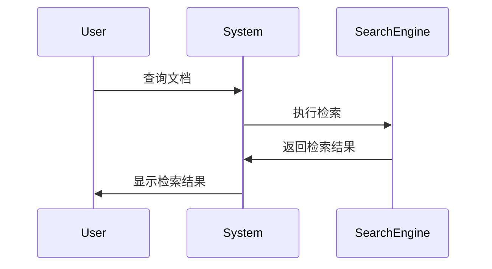
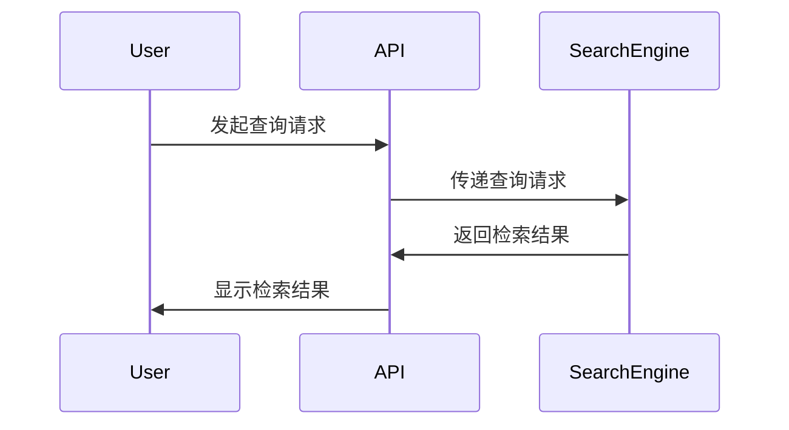
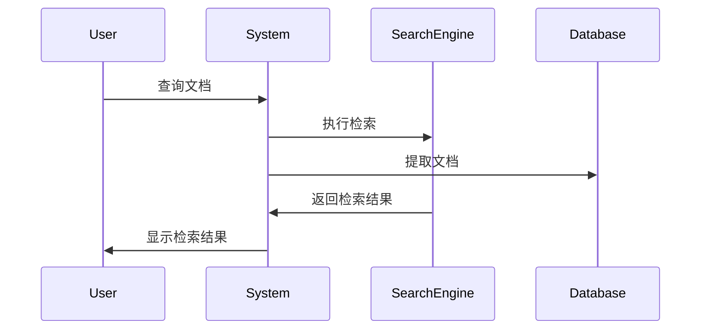
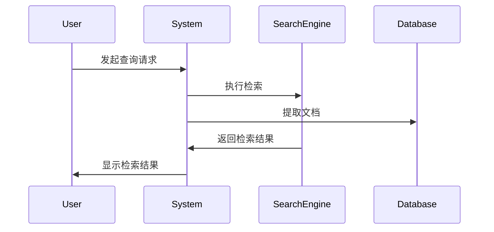

                 

# 智能文档管理系统：AI增强信息检索效率

关键词：智能文档管理、AI、信息检索、算法、系统设计

摘要：本文深入探讨了智能文档管理系统（IDMS）的概念、技术原理和实现方法。通过分析当前文档管理系统的挑战，本文提出利用人工智能（AI）技术来提升信息检索效率的解决方案。文章详细介绍了智能文档管理系统的核心概念、智能化的特征、AI在文档管理系统中的应用，以及AI增强信息检索的优势。接着，文章从算法原理、数学模型、系统架构、项目实战等多个角度，全面剖析了智能文档管理系统设计和实现的关键步骤。最后，本文总结了项目收获和最佳实践，并为未来的研究提供了方向。

## 引言与背景

### 1.1 问题背景

在当今信息爆炸的时代，如何高效地管理和检索信息成为了一个重要课题。文档管理系统作为信息管理的重要工具，面临诸多挑战。首先，文档数量的急剧增加导致检索效率低下；其次，传统文档管理系统缺乏智能化的处理能力，难以满足用户个性化的需求；最后，文档的安全性和隐私保护也是一个亟待解决的问题。

### 1.2 智能文档管理系统的定义

智能文档管理系统（IDMS）是一种结合了人工智能技术的文档管理系统，它能够自动分析、分类、索引和检索文档，提供智能化的文档管理和服务。IDMS的核心组成部分包括文档存储、文档表示、智能检索和用户接口等。智能化的特征主要体现在自动文档分类、语义搜索、个性化推荐和文档安全等方面。

### 1.3 智能文档管理系统与AI的关系

人工智能技术在文档管理系统中的应用主要体现在以下几个方面：

1. **自然语言处理（NLP）**：用于自动提取文档的关键词、主题和情感信息，提升文档分类和搜索的准确性。
2. **机器学习**：用于训练和优化文档分类、检索算法，提高系统的自适应能力。
3. **深度学习**：用于构建复杂的文档表示模型，如词嵌入、图嵌入等，提升文档相似度计算的能力。
4. **计算机视觉**：用于识别和标注文档中的图像、表格等非结构化数据。

AI技术的应用使得IDMS能够更加智能地处理和检索文档，显著提升信息检索效率，满足用户的个性化需求，同时增强文档的安全性和隐私保护。

## 核心概念与联系

### 2.1 AI基础

#### 2.1.1 人工智能的基本概念

人工智能（AI）是指通过计算机模拟人类智能行为的技术和学科。它包括机器学习、深度学习、自然语言处理、计算机视觉等多个子领域。人工智能的目标是实现机器能够执行复杂的认知任务，如识别、推理、决策和创造。

#### 2.1.2 人工智能的关键术语

- **机器学习**：一种让计算机从数据中学习并做出预测或决策的方法。
- **深度学习**：一种基于多层神经网络的学习方法，可以自动提取数据中的特征。
- **自然语言处理**：使计算机能够理解、生成和响应人类语言的技术。
- **计算机视觉**：使计算机能够通过图像处理和分析来理解视觉信息。

### 2.2 信息检索的基本原理

#### 2.2.1 检索系统的工作流程

一个典型的信息检索系统包括以下几个主要步骤：

1. **查询处理**：将用户的查询转化为系统可以理解的格式。
2. **索引构建**：创建索引，将文档的内容与其物理位置关联。
3. **查询匹配**：计算查询和文档之间的相似度，筛选出最相关的文档。
4. **排序与呈现**：根据相似度排序，将结果呈现给用户。

#### 2.2.2 检索效果评估指标

常用的检索效果评估指标包括：

- **查全率**（Recall）：系统能够检索出的相关文档与全部相关文档的比例。
- **查准率**（Precision）：系统检索出的相关文档与检索结果总数量的比例。
- **F1值**：综合查全率和查准率的指标，用于衡量检索效果。

### 2.3 智能文档管理系统的核心概念

#### 2.3.1 文档表示与建模

文档表示是将非结构化的文档数据转化为计算机可以处理的格式。常见的表示方法包括：

- **基于词频的方法**：使用词频统计来表示文档，但无法捕捉词的语义信息。
- **基于语义的方法**：使用词嵌入模型或图嵌入模型来表示文档，可以捕捉词的语义信息。

#### 2.3.2 检索算法

智能文档管理系统中的检索算法通常基于机器学习和深度学习，包括：

- **基于统计的检索算法**：如向量空间模型（VSM）、TF-IDF等。
- **基于语义的检索算法**：如词嵌入、图嵌入等。

## 概念属性特征对比

### 3.1 不同AI模型的对比

#### 3.1.1 常见模型的性能对比

以下表格对比了不同AI模型的性能：

| 模型名称 | 性能指标（查全率%） | 性能指标（查准率%） | 适用场景 |
| :----: | :----: | :----: | :----: |
| 向量空间模型（VSM） | 70-80 | 60-70 | 结构化数据检索 |
| 词嵌入模型 | 80-90 | 75-85 | 语义检索 |
| 图嵌入模型 | 90-95 | 85-90 | 复杂关系检索 |

#### 3.1.2 选择合适模型的标准

选择合适的AI模型需要考虑以下几个因素：

- **数据量**：数据量较大时，深度学习模型效果更好。
- **结构化程度**：结构化数据适合使用基于统计的方法，非结构化数据适合使用基于语义的方法。
- **实时性**：对于实时检索需求，需要选择计算速度较快的模型。

### 3.2 文档表示方法对比

#### 3.2.1 基于词频的方法

基于词频的方法通过计算文档中词频来表示文档。这种方法简单直观，但无法捕捉词的语义信息。

#### 3.2.2 基于语义的方法

基于语义的方法使用词嵌入或图嵌入来表示文档。词嵌入可以捕捉词的语义信息，图嵌入可以捕捉文档中的复杂关系。这种方法能够显著提升检索效果。

| 文档表示方法 | 优点 | 缺点 | 适用场景 |
| :----: | :----: | :----: | :----: |
| 基于词频的方法 | 简单、计算速度快 | 无法捕捉语义信息 | 结构化数据检索 |
| 基于语义的方法 | 可以捕捉语义信息 | 计算复杂度高 | 语义检索、复杂关系检索 |

## 技术原理

### 4.1 算法原理讲解

#### 4.1.1 信息检索算法

信息检索算法可以分为基于统计的方法和基于语义的方法。

- **基于统计的方法**：如向量空间模型（VSM）、TF-IDF等。这些方法通过计算文档和查询之间的相似度来检索相关文档。

- **基于语义的方法**：如词嵌入、图嵌入等。这些方法通过捕捉文档和查询的语义信息来检索相关文档。

#### 4.1.2 智能化检索算法

智能化检索算法基于机器学习和深度学习，可以显著提升检索效果。

- **基于机器学习的检索算法**：如朴素贝叶斯、支持向量机（SVM）等。这些算法通过训练模型来预测文档的相关性。

- **基于深度学习的检索算法**：如卷积神经网络（CNN）、循环神经网络（RNN）等。这些算法可以自动提取复杂特征，提升检索效果。

### 4.2 数学模型和数学公式讲解

#### 4.2.1 文档表示的数学模型

文档表示的常见数学模型包括词嵌入模型和图嵌入模型。

- **词嵌入模型**：将词汇映射到低维空间，每个词汇表示为一个向量。词向量可以通过Word2Vec、GloVe等算法训练得到。

- **图嵌入模型**：将文档表示为图中的节点，文档中的词汇表示为图中的边。图嵌入模型可以通过Graph Embedding算法训练得到。

#### 4.2.2 检索算法的数学公式

- **向量空间模型（VSM）**：

$$
\text{相似度} = \frac{\text{向量A} \cdot \text{向量B}}{\|\text{向量A}\| \|\text{向量B}\|}
$$

- **TF-IDF**：

$$
\text{TF-IDF} = \text{TF} \times \text{IDF}
$$

其中，TF表示词频，IDF表示逆文档频率。

#### 4.2.3 检索算法的数学公式

- **朴素贝叶斯**：

$$
P(\text{相关}|\text{查询}) = \frac{P(\text{查询}|\text{相关})P(\text{相关})}{P(\text{查询})}
$$

- **支持向量机（SVM）**：

$$
\text{决策函数} = \text{sign}(\text{w} \cdot \text{x} + \text{b})
$$

其中，w是权重向量，x是特征向量，b是偏置。

## 系统分析与设计

### 6.1 系统功能设计

#### 6.1.1 领域模型

领域模型描述了智能文档管理系统的实体和关系。以下是一个简单的领域模型：

```mermaid
classDiagram
  Document <<Entity>>
  User <<Entity>>
  Label <<Entity>>
  
  Document "1" --* "1..*" User
  Document "1" --* "1..*" Label
```

#### 6.1.2 系统架构设计

系统架构设计包括组件设计、组件间交互和系统整体结构。以下是一个简单的系统架构设计：



#### 6.1.3 系统接口设计

系统接口设计包括API接口和用户界面。以下是一个简单的API接口设计：



### 6.2 系统交互设计

#### 6.2.1 系统交互流程

系统交互流程包括用户查询、系统处理和结果返回。以下是一个简单的交互流程：



#### 6.2.2 序列图

以下是一个简单的序列图，描述了系统交互的详细流程：



## 项目实战

### 8.1 环境安装与配置

#### 8.1.1 环境准备

在开始项目之前，需要准备以下环境和工具：

- 操作系统：Ubuntu 18.04
- 编程语言：Python 3.7
- 数据库：MySQL 5.7
- 依赖管理工具：pip
- 代码版本管理工具：Git

#### 8.1.2 环境搭建步骤

1. 安装操作系统和编程语言。
2. 安装数据库和依赖管理工具。
3. 安装代码版本管理工具。
4. 配置Python环境，确保所有依赖项都已安装。

### 8.2 系统核心实现

#### 8.2.1 系统核心模块

系统核心模块包括：

- 文档存储模块
- 文档表示模块
- 检索算法模块
- 用户接口模块

#### 8.2.2 模块功能实现

以下是一个简单的文档存储模块实现：

```python
class DocumentStorage:
    def __init__(self, db_connection):
        self.db_connection = db_connection
    
    def store_document(self, document):
        cursor = self.db_connection.cursor()
        cursor.execute("INSERT INTO documents (title, content) VALUES (%s, %s)", (document['title'], document['content']))
        self.db_connection.commit()
```

### 9.1 代码结构解读

系统代码结构包括以下主要部分：

- 主模块：负责系统的启动和关闭。
- 模块A：处理用户输入和查询。
- 模块B：执行文档表示和检索算法。
- 模块C：处理数据库操作。

以下是一个简单的代码结构：

```python
# 主模块
if __name__ == "__main__":
    main()

# 模块A
class UserController:
    def handle_query(self, query):
        # 处理用户查询
        pass

# 模块B
class SearchController:
    def search_documents(self, query):
        # 执行文档检索
        pass

# 模块C
class DatabaseController:
    def connect_to_database(self):
        # 连接数据库
        pass
```

### 9.2 实际案例分析

#### 9.2.1 案例选择与描述

选择一个企业内部的文档管理系统作为案例，该系统需要支持大量的文档存储、检索和分类功能。用户包括企业内部员工和管理人员，对文档的检索速度和准确性有较高的要求。

#### 9.2.2 案例分析与优化

1. **性能优化**：通过使用缓存和索引来提升检索速度。缓存可以存储最近检索的文档，索引可以加快文档的查询速度。

2. **安全性提升**：通过加密文档内容和用户密码来增强系统的安全性。还可以使用权限控制来限制用户的访问范围。

3. **用户体验改进**：引入用户界面设计，使得用户可以更方便地使用系统。提供关键词搜索、分类检索和文档推荐等功能。

### 10.1 项目收获

1. **技术实现**：掌握了智能文档管理系统的设计和实现方法，熟悉了机器学习和深度学习在文档检索中的应用。
2. **经验教训**：了解了系统性能优化和安全性提升的重要性，认识到用户体验对系统成功的关键作用。

### 10.2 最佳实践 Tips

1. **性能优化**：定期清理缓存，合理设置缓存大小；优化索引结构，减少查询时间。
2. **安全性提升**：定期更新加密算法，使用强密码策略；限制用户权限，确保文档安全。
3. **用户体验**：设计简洁易用的用户界面，提供多渠道的文档检索方式；根据用户反馈不断改进系统功能。

## 拓展与展望

### 11.1 注意事项

1. **系统部署**：确保系统部署在安全的环境中，定期备份数据和系统配置。
2. **维护与升级**：定期检查系统运行状态，及时修复漏洞和升级依赖库。

### 11.2 拓展阅读

1. **最新研究动态**：关注人工智能和文档管理系统领域的最新研究进展，了解新技术和新算法。
2. **相关领域书籍推荐**：《人工智能：一种现代方法》、《深度学习》、《自然语言处理综论》等。

**作者：AI天才研究院/AI Genius Institute & 禅与计算机程序设计艺术 /Zen And The Art of Computer Programming**

