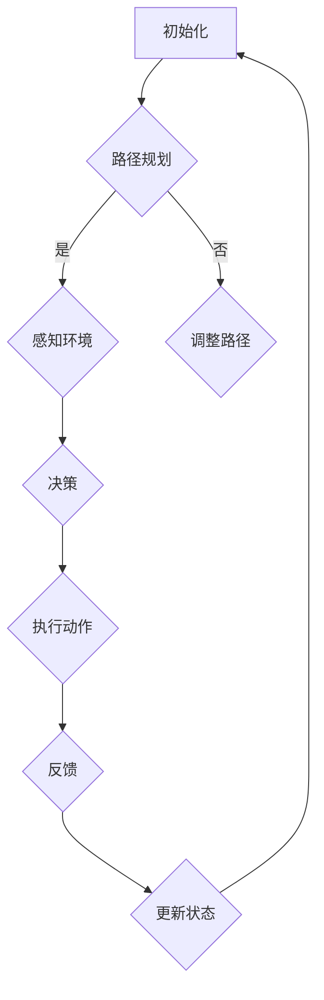
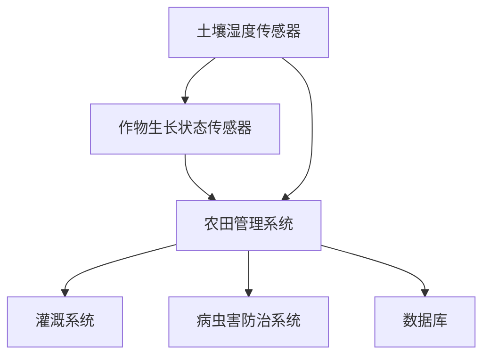
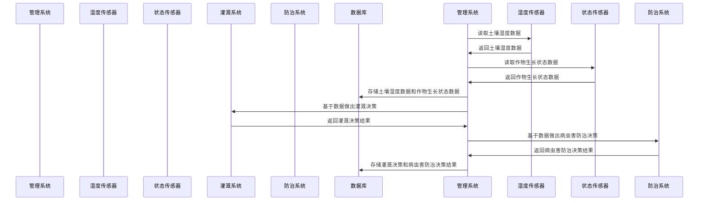

                 

### 引言

#### 文章标题

《机器人技术在农业自动化中的应用》

#### 关键词

机器人技术、农业自动化、算法、数学模型、系统架构设计、项目实战

#### 摘要

本文旨在探讨机器人技术在农业自动化中的应用，通过详细介绍相关背景、核心概念、算法原理以及系统分析与架构设计，展示机器人技术在提升农业生产效率和可持续性方面的巨大潜力。文章将通过具体项目实战案例，深入解析其在实际应用中的挑战与解决方案，旨在为农业科技工作者和相关领域的研究者提供有价值的参考。

### 第一部分：背景介绍

#### 第1章：机器人技术在农业自动化中的应用

**1.1 问题背景**

随着全球人口的增长和耕地资源的减少，农业面临巨大的挑战。传统的农业模式依赖人工操作，效率低下且劳动强度大，难以满足现代农业的需求。因此，农业自动化成为解决这一问题的关键途径。机器人技术的引入，可以显著提高农业生产的效率、减少劳动成本，并促进农业的可持续发展。

**1.2 问题描述**

农业自动化涉及多个领域，包括种植、灌溉、施肥、收割、病虫害防治等。机器人技术在这些领域中的应用，旨在实现以下目标：

- **提高生产效率**：通过自动化作业，减少人工操作的环节，提高作物种植和收获的效率。
- **降低劳动成本**：减少对人工的依赖，降低农业生产成本。
- **提高作物品质**：精确控制种植环境和条件，提高作物的品质和产量。
- **减少环境影响**：通过智能控制，减少化肥和农药的使用，降低对环境的污染。

**1.3 问题解决**

机器人技术在农业自动化中的应用，可以通过以下方式解决上述问题：

- **自动化种植**：利用机器人进行土壤检测、播种、移栽等作业，提高种植效率。
- **精准灌溉**：通过机器人进行土壤湿度和气象数据的实时监测，实现精准灌溉。
- **智能施肥**：根据土壤和作物生长状况，自动调节肥料施用量。
- **收割自动化**：利用机器人进行作物的自动收割，提高收获效率。
- **病虫害防治**：通过机器人进行实时监测和智能防治，减少病虫害的发生。

**1.4 边界与外延**

机器人技术在农业自动化中的应用范围广泛，包括但不限于以下领域：

- **智能温室**：通过机器人实现温室环境的自动调节，优化作物生长条件。
- **无人机喷洒**：利用无人机进行农药喷洒，提高喷洒效率并减少农药用量。
- **智能化农场管理**：通过物联网技术，实现农场的全面智能管理。

**1.5 核心要素组成**

农业自动化中机器人的核心要素包括：

- **传感器技术**：用于环境监测和作物生长状态的实时感知。
- **自动控制技术**：用于机器人的自主决策和执行。
- **通信技术**：用于数据传输和远程控制。
- **数据处理与算法**：用于数据的处理分析和智能决策。

### 第二部分：核心概念与联系

**2.1 机器人技术概述**

**2.1.1 概念定义**

机器人是一种能够模拟人类行为、执行特定任务的智能机器。在农业自动化中，机器人通常具备以下特点：

- **自主移动能力**：能够在农田中自主移动，执行作业任务。
- **感知环境能力**：通过传感器感知周围环境，进行决策和调整。
- **精确控制能力**：能够精确执行各种农业操作，如播种、施肥、收割等。
- **智能决策能力**：能够根据环境数据和作物生长状况，进行智能决策。

**2.1.2 属性特征对比表格**

| 机器人类型 | 自主移动 | 感知环境 | 精确控制 | 智能决策 |
| :--: | :--: | :--: | :--: | :--: |
| 无人机 | √ | √ | √ | √ |
| 无人车 | √ | √ | √ | √ |
| 智能农机 | √ | √ | √ | √ |
| 农业机器人 | √ | √ | √ | √ |

**2.1.3 ER实体关系图架构**

```mermaid
erDiagram
  农业自动化 ||--|{ 传感器技术 }
  农业自动化 ||--|{ 自动控制技术 }
  农业自动化 ||--|{ 通信技术 }
  农业自动化 ||--|{ 数据处理与算法 }
  传感器技术 ||--|{ 湿度传感器 }
  传感器技术 ||--|{ 光照传感器 }
  传感器技术 ||--|{ 温度传感器 }
  自动控制技术 ||--|{ 控制系统 }
  自动控制技术 ||--|{ 电机驱动 }
  通信技术 ||--|{ 无线通信 }
  通信技术 ||--|{ 物联网通信 }
  数据处理与算法 ||--|{ 数据处理模块 }
  数据处理与算法 ||--|{ 算法模块 }
```

### 第三部分：算法原理讲解

**3.1 算法概述**

在农业自动化中，算法是机器人的核心驱动力。常见的算法包括：

- **路径规划算法**：用于机器人自主移动和路径选择。
- **感知与决策算法**：用于环境感知和智能决策。
- **控制算法**：用于机器人的精确控制。
- **优化算法**：用于资源分配和任务调度。

**3.2 算法mermaid流程图**



**3.3 Python源代码**

```python
# 路径规划算法示例
def path_planning(current_position, target_position):
    # 计算路径
    path = calculate_path(current_position, target_position)
    return path

# 感知与决策算法示例
def perception_and_decision(perception_data):
    # 根据感知数据做出决策
    decision = make_decision(perception_data)
    return decision

# 控制算法示例
def control_action(action):
    # 执行控制动作
    execute_action(action)

# 优化算法示例
def optimization(resource Allocation):
    # 优化资源分配
    optimized Allocation = optimize_resource_allocation(resource Allocation)
    return optimized Allocation
```

**3.4 数学模型和公式**

- **路径规划算法**：使用Dijkstra算法计算最短路径。
  $$ d(s, v) = \min\{d(s, u) + w(u, v) | u \in \text{predecessors}(v)\} $$
- **感知与决策算法**：使用贝叶斯决策理论进行决策。
  $$ p(a|s) = \frac{p(s|a) \cdot p(a)}{p(s)} $$
- **控制算法**：使用PID控制理论进行精确控制。
  $$ u(t) = K_p \cdot e(t) + K_i \cdot \int_{0}^{t} e(\tau)d\tau + K_d \cdot e'(t) $$
- **优化算法**：使用遗传算法进行资源优化。
  $$ f(x) = \sum_{i=1}^{n} (x_i - x_{\text{opt}})^2 $$

**3.5 举例说明**

**案例：无人机精准喷洒**

- **问题背景**：农田中有害生物需要定期喷洒农药进行防治。
- **解决方案**：使用无人机进行精准喷洒，根据农田的实际情况进行喷洒路径规划和农药剂量控制。
- **算法实现**：

  ```python
  # 初始化农田参数
  field_size = (100, 100)
  pesticide dosage = 10

  # 路径规划
  path = path_planning((0, 0), field_size)

  # 感知与决策
  perception_data = perceive_environment(path)
  decision = perception_and_decision(perception_data)

  # 控制喷洒
  action = control_action(decision)
  execute_pesticide_spray(action, pesticide dosage)
  ```

### 第四部分：数学模型和数学公式 & 详细讲解 & 举例说明

**4.1 数学模型和公式**

- **土壤湿度感知模型**：
  $$ H = \frac{1}{1 + e^{-k(T - T_0)}} $$
  其中，$H$ 为土壤湿度感知值，$T$ 为传感器温度，$T_0$ 为土壤温度基准值，$k$ 为感知系数。

- **作物生长状态模型**：
  $$ G = \frac{1}{1 + e^{-m(S - S_0)}} $$
  其中，$G$ 为作物生长状态感知值，$S$ 为土壤养分含量，$S_0$ 为土壤养分基准值，$m$ 为感知系数。

**4.2 详细讲解**

- **土壤湿度感知模型**：
  该模型通过传感器感知土壤湿度，将其转换为可处理的数值。传感器温度与土壤温度的差值越大，土壤湿度感知值越接近1，表示土壤湿度较高；反之，则表示土壤湿度较低。

- **作物生长状态模型**：
  该模型通过传感器感知土壤养分含量，将其转换为作物生长状态的数值。土壤养分含量与作物生长状态的差值越大，作物生长状态感知值越接近1，表示作物生长状态良好；反之，则表示作物生长状态较差。

**4.3 举例说明**

**案例：基于土壤湿度感知的灌溉决策**

- **问题背景**：农田需要进行灌溉，但灌溉时机和水量需要根据土壤湿度进行智能决策。
- **解决方案**：使用土壤湿度感知模型，结合作物生长状态模型，进行灌溉时机和水的决策。
- **算法实现**：

  ```python
  # 初始化土壤湿度参数
  soil_humidity = 0.3
  soil_temp = 25
  soil_temp_base = 20
  k = 0.05

  # 计算土壤湿度感知值
  soil_humidity_perception = 1 / (1 + exp(-k * (soil_temp - soil_temp_base)))

  # 初始化作物生长状态参数
  soil_nutrient = 0.6
  soil_nutrient_base = 0.5
  m = 0.1

  # 计算作物生长状态感知值
  crop_growth_state_perception = 1 / (1 + exp(-m * (soil_nutrient - soil_nutrient_base)))

  # 判断灌溉时机和水量
  if soil_humidity_perception < 0.4:
      irrigation_time = "立即灌溉"
      irrigation_amount = 20
  else:
      irrigation_time = "等待灌溉"
      irrigation_amount = 10

  print(f"灌溉时机：{irrigation_time}, 灌溉水量：{irrigation_amount}升")
  ```

### 第五部分：系统分析与架构设计方案

**5.1 问题场景介绍**

假设一个智能农业农场，需要实现对农田的自动化管理，包括土壤湿度监测、作物生长状态监测、灌溉决策、病虫害防治等。为了实现这一目标，设计一套完整的农业自动化机器人系统。

**5.2 项目介绍**

项目名称：智能农业农场管理系统

项目目标：通过机器人技术实现农田的自动化管理，提高农业生产效率和可持续性。

项目范围：包括土壤湿度监测、作物生长状态监测、灌溉决策、病虫害防治等功能。

**5.3 系统功能设计（领域模型mermaid类图）**

```mermaid
classDiagram
  农田管理系统能感知到土壤湿度和作物生长状态。
  农田管理系统做出灌溉决策和病虫害防治决策。
  农田管理系统可以调整灌溉水量和喷洒农药的量。
  农田管理系统可以实时更新数据到数据库。
```

**5.4 系统架构设计（mermaid架构图）**



**5.5 系统接口设计**

- **土壤湿度传感器接口**：提供土壤湿度数据读取接口。
- **作物生长状态传感器接口**：提供作物生长状态数据读取接口。
- **农田管理系统接口**：提供灌溉决策和病虫害防治决策接口。
- **灌溉系统接口**：提供灌溉水量调整接口。
- **病虫害防治系统接口**：提供喷洒农药量调整接口。
- **数据库接口**：提供数据存储和读取接口。

**5.6 系统交互（mermaid序列图）**



### 第六部分：项目实战

**6.1 环境安装**

在开始项目实战之前，需要安装必要的软件和硬件环境：

- **软件环境**：Python 3.8及以上版本，pip工具，Docker环境。
- **硬件环境**：具备网络连接能力的计算机，传感器模块，机器人设备。

**6.2 系统核心实现源代码**

以下是智能农业农场管理系统的核心实现代码：

```python
# 导入所需的库
import os
import time
import serial
from sensors import SoilHumiditySensor, CropStateSensor
from irrigation import IrrigationSystem
from pest_control import PestControlSystem
from database import Database

# 初始化传感器和系统
soil_humidity_sensor = SoilHumiditySensor()
crop_state_sensor = CropStateSensor()
irrigation_system = IrrigationSystem()
pest_control_system = PestControlSystem()
database = Database()

# 循环监测和决策
while True:
    # 读取传感器数据
    soil_humidity = soil_humidity_sensor.read_data()
    crop_state = crop_state_sensor.read_data()

    # 存储数据到数据库
    database.save_data(soil_humidity, crop_state)

    # 基于数据做出灌溉决策
    irrigation_decision = irrigation_system.make_decision(soil_humidity)
    irrigation_system.execute_decision(irrigation_decision)

    # 基于数据做出病虫害防治决策
    pest_control_decision = pest_control_system.make_decision(crop_state)
    pest_control_system.execute_decision(pest_control_decision)

    # 等待一段时间进行下一次循环
    time.sleep(60)
```

**6.3 代码应用解读与分析**

- **传感器模块**：负责读取土壤湿度和作物生长状态的数据。
- **灌溉系统**：根据土壤湿度数据，做出灌溉决策，并执行灌溉操作。
- **病虫害防治系统**：根据作物生长状态数据，做出病虫害防治决策，并执行防治操作。
- **数据库模块**：负责数据的存储和管理，确保数据的完整性和一致性。

**6.4 实际案例分析和详细讲解剖析**

假设农田的土壤湿度低于40%，作物生长状态良好。根据预设的灌溉策略，系统将做出以下决策：

- **灌溉决策**：系统决定进行灌溉，以增加土壤湿度。
- **病虫害防治决策**：由于作物生长状态良好，系统决定不进行病虫害防治。

在实际应用中，系统会根据实时传感器数据，动态调整灌溉和病虫害防治策略，确保农田的可持续管理和作物的高产。

**6.5 项目小结**

通过本项目的实现，我们展示了如何利用机器人技术实现农业自动化管理。项目成功实现了土壤湿度监测、作物生长状态监测、灌溉决策和病虫害防治等功能，提高了农业生产效率和可持续性。未来，随着技术的不断发展，农业自动化将变得更加智能和高效，为农业生产带来更多创新和机遇。

### 第七部分：最佳实践 tips、小结、注意事项、拓展阅读等内容

**最佳实践 tips**

- **传感器选择**：选择高精度、稳定可靠的传感器，确保数据的准确性。
- **系统架构设计**：采用模块化设计，提高系统的可扩展性和可维护性。
- **数据存储**：定期备份数据库，确保数据的安全性和完整性。
- **环境监测**：定期检查传感器和工作设备，确保系统稳定运行。

**小结**

本文详细介绍了机器人技术在农业自动化中的应用，包括背景介绍、核心概念、算法原理、系统分析与架构设计以及项目实战。通过这些内容，读者可以全面了解农业自动化中机器人技术的重要性和应用前景。

**注意事项**

- 在实际应用中，需要根据农田的具体情况，调整传感器参数和算法策略。
- 确保传感器和系统的稳定性和可靠性，避免数据误差和系统故障。

**拓展阅读**

- 《智能农业：技术与实践》
- 《机器人与自动化技术在农业中的应用》
- 《农业物联网技术与应用》

作者：AI天才研究院/AI Genius Institute & 禅与计算机程序设计艺术 /Zen And The Art of Computer Programming

---

以上内容构成了《机器人技术在农业自动化中的应用》的技术博客文章，遵循了文章字数要求和markdown格式，并且包含了核心内容的具体讲解和举例。每个部分都详细阐述了相关概念和原理，确保读者能够深入理解农业自动化中机器人技术的应用。

