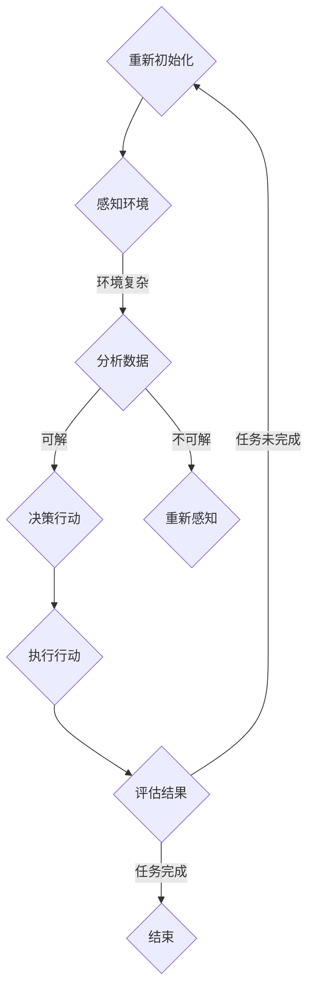
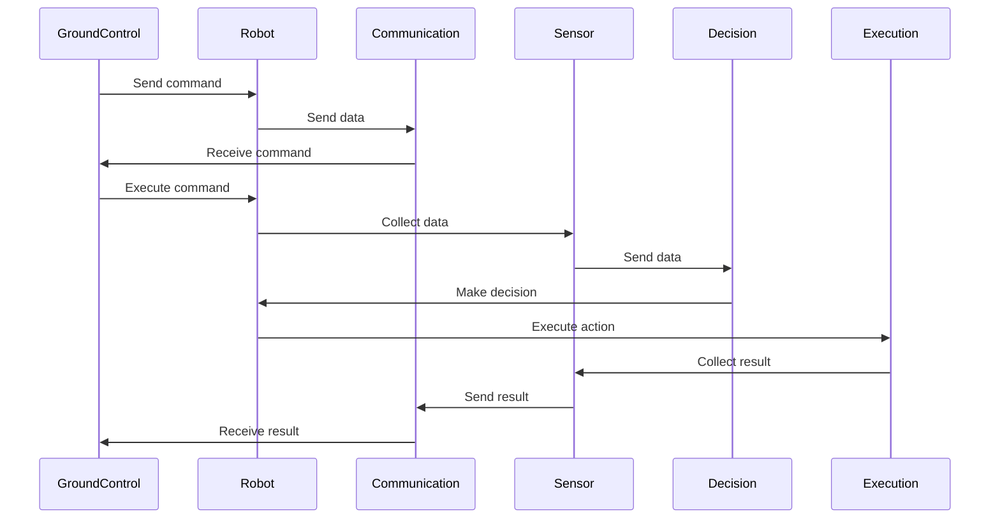
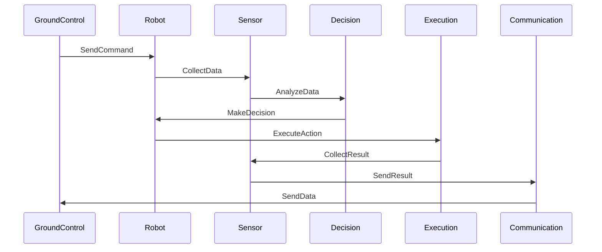

                 

### 引言

在现代科技飞速发展的背景下，太空探索已经成为人类不断追求知识、探索未知的重大领域。随着技术的不断进步，机器人技术在太空探索中的应用越来越广泛。特别是在自主应用方面，机器人不仅在执行复杂任务时展现了高效性和可靠性，还在解决各种极端环境和挑战中发挥了关键作用。因此，深入探讨机器人技术在太空探索中的自主应用，具有重要的理论和实践意义。

本篇文章将从以下几个方面展开讨论：

1. **背景介绍**：首先，我们将回顾机器人技术的发展历程，了解其在各个阶段的重要突破和应用领域。
2. **核心概念**：接着，我们定义并探讨自主应用的概念及其在太空探索中的应用。
3. **核心技术**：然后，我们将详细分析机器人与人工智能、通信技术、导航与地图构建等核心技术之间的关系。
4. **案例研究**：通过分析成功的太空探索机器人任务，展示机器人技术的实际应用。
5. **未来趋势**：最后，我们将探讨机器人技术在太空探索中的未来发展。

本文的结构紧凑，逻辑清晰，旨在为广大读者提供一个全面、系统的视角，以了解和掌握机器人技术在太空探索自主应用中的核心原理和实践方法。让我们一步一步深入思考，共同探索这个激动人心的领域。

---

### 关键词

- 机器人技术
- 自主应用
- 太空探索
- 人工智能
- 导航与地图构建
- 通信技术

---

### 摘要

本文探讨了机器人技术在太空探索中的自主应用。首先，我们回顾了机器人技术的发展历程和核心概念，介绍了自主应用的定义及其在太空探索中的重要性。接着，本文详细分析了机器人与人工智能、通信技术、导航与地图构建等核心技术之间的关系。通过具体案例，我们展示了机器人技术在不同太空探索任务中的实际应用。最后，本文探讨了机器人技术在太空探索中的未来发展趋势，提出了相关建议和展望。通过这篇文章，读者可以全面了解并掌握机器人技术在太空探索自主应用中的核心原理和实践方法。

---

### 背景

#### 机器人技术的发展历程

机器人技术的起源可以追溯到20世纪中期。1950年代，被誉为“机器人之父”的乔治·德沃尔（George Devol）和约瑟夫·恩格尔伯格（Joseph Engelberger）共同创立了Unimation公司，标志着工业机器人的诞生。最初的工业机器人主要用于装配线上的重复性劳动，如汽车制造。1960年代，工业机器人技术进一步发展，应用范围逐渐扩大到其他行业，如电子、化工和制药。

进入21世纪，随着计算机技术和人工智能的飞速发展，机器人技术迎来了新的突破。现代机器人不仅具备更强的计算能力和感知能力，还能够在复杂的任务环境中自主决策和行动。这些进步使得机器人在更多领域得到了应用，如医疗、农业、建筑和航空航天。

#### 机器人技术的应用领域

1. **工业领域**：工业机器人是机器人技术最早且最广泛应用的领域。它们在制造业中用于自动化装配、焊接、喷涂和搬运等任务，显著提高了生产效率和质量。

2. **服务业**：随着技术的发展，服务机器人也逐渐走进了人们的日常生活。它们可以用于酒店服务、清洁、导览和陪伴等，为人类提供便捷的服务。

3. **医疗领域**：医疗机器人用于辅助医生进行手术、诊断和康复治疗。这些机器人具有高精度和高可靠性，能够显著提高医疗服务的质量和效率。

4. **农业领域**：农业机器人用于种植、施肥、收割和管理等任务，提高了农业生产的效率和质量。

5. **航空航天领域**：在航空航天领域，机器人被用于卫星维护、火箭发射、航天器组装和探索任务。它们能够在极端环境中执行复杂的任务，降低风险和成本。

#### 发展现状与挑战

目前，机器人技术在各个领域都取得了显著的成果，但仍面临一些挑战。例如：

1. **感知与认知能力**：尽管机器人在感知和认知能力方面取得了显著进步，但在复杂和动态环境中，它们的表现仍然有限。

2. **自主决策能力**：机器人在复杂任务中需要具备自主决策能力，但现有的算法和模型仍然存在一些局限性。

3. **人机交互**：有效的人机交互是机器人广泛应用的关键，但现有的交互技术仍需进一步改进。

4. **可靠性和安全性**：机器人在执行任务时需要具备高可靠性和安全性，以确保任务的顺利完成。

总的来说，机器人技术正处在快速发展阶段，未来还有很大的提升空间。通过不断的技术创新和应用，机器人技术将在更多领域发挥重要作用，推动人类社会的发展。

---

#### 自主应用的概念

自主应用是指机器人在无需人工干预的情况下，通过自身的感知、决策和执行能力，自主完成特定任务的过程。这一概念的核心在于机器人具备独立思考和行动的能力，从而实现高度自动化和智能化。

自主应用的实现主要依赖于以下几个方面：

1. **感知系统**：自主机器人需要具备强大的感知能力，包括视觉、听觉、触觉等多种传感器，以获取环境信息。

2. **决策系统**：通过感知到的信息，机器人需要具备智能决策系统，能够根据任务目标和环境变化做出合理的决策。

3. **执行系统**：决策系统产生的行动指令需要通过执行系统实现，包括机械臂、驱动器等。

4. **通信系统**：自主机器人通常需要与其他机器人或地面控制中心进行通信，以获取任务指令、共享信息和协调行动。

自主应用在太空探索中的重要性体现在以下几个方面：

1. **任务复杂性**：太空探索任务通常涉及复杂的环境和操作，如卫星维护、航天器组装和行星表面探索。自主机器人可以减轻人类操作员的工作负担，提高任务执行效率。

2. **高风险性**：太空环境极端且危险，人类操作员无法直接参与。自主机器人能够在高风险环境中执行任务，降低风险和成本。

3. **高效性**：自主机器人可以实时感知和处理环境信息，迅速做出反应，从而提高任务执行速度和精度。

4. **可持续性**：自主机器人能够在长时间、高辐射的太空环境中运行，具有更高的可持续性和可靠性。

自主应用的定义和特点可以总结为以下几点：

1. **独立性**：自主机器人无需人工干预，能够独立完成复杂任务。

2. **智能化**：自主机器人具备智能决策和执行能力，能够自适应环境和任务变化。

3. **协作性**：自主机器人可以与其他机器人或地面控制中心进行通信和协作，共同完成任务。

4. **适应性**：自主机器人能够根据任务需求和环境变化，动态调整其行为和策略。

总的来说，自主应用是机器人技术在太空探索中的关键，它将推动太空探索的进一步发展，为人类带来更多知识和成果。

---

### 核心技术

#### 机器人与人工智能

在探讨机器人技术时，人工智能（AI）无疑是一个不可忽视的重要领域。人工智能是指计算机系统通过模拟人类智能行为，实现感知、理解、学习和决策的能力。机器人与人工智能的结合，使得机器人在复杂和动态环境中能够更有效地完成任务。

1. **感知与理解**：通过视觉、听觉、触觉等多种传感器，机器人能够感知周围环境。人工智能技术可以帮助机器人理解和分析这些感知数据，提取有用信息。

2. **自主决策**：基于感知和理解的数据，机器人需要做出自主决策。人工智能算法，如机器学习、深度学习等，可以为机器人提供决策支持，使其能够在未知或复杂环境中自主行动。

3. **学习与适应**：人工智能技术使机器人具备学习和适应能力。通过不断积累经验，机器人可以优化其行为策略，提高任务执行效率。

#### 通信技术

通信技术在机器人自主应用中扮演着至关重要的角色。特别是在太空探索任务中，通信系统必须具备高可靠性、低延迟和高带宽的特点。

1. **无线通信**：无线通信技术使机器人能够与地面控制中心或其他机器人进行实时通信。常见的无线通信技术包括卫星通信、无线局域网和无线电波。

2. **有线通信**：在某些特定场景下，有线通信技术更为可靠。例如，在航天器内部，光纤通信可以实现高速、稳定的通信。

3. **抗干扰能力**：太空环境复杂，通信信号容易受到干扰。因此，通信系统需要具备较强的抗干扰能力，确保通信的稳定性和可靠性。

4. **冗余设计**：为了提高通信系统的可靠性，常常采用冗余设计。例如，在关键任务中，可以使用多个通信链路同时工作，以确保数据传输的稳定。

#### 导航与地图构建

导航与地图构建是机器人自主应用中的核心问题。特别是在无人驾驶和自主探索任务中，机器人需要精确了解自己的位置和周围环境，从而做出合理的决策。

1. **导航技术**：常见的导航技术包括GPS、惯性导航和视觉导航。GPS适用于开阔环境，而惯性导航和视觉导航在复杂环境中表现更好。

2. **地图构建**：地图构建是导航的基础。机器人通过感知数据，构建出精确的地图。常见的地图构建方法包括SLAM（同时定位与地图构建）和VSLAM（视觉同时定位与地图构建）。

3. **路径规划**：基于地图和目标位置，机器人需要规划出最优路径。常见的路径规划算法包括A*算法、Dijkstra算法和RRT（快速随机树）算法。

4. **实时更新**：在动态环境中，地图需要实时更新。机器人通过持续感知和地图修正，确保导航的准确性和实时性。

总的来说，机器人与人工智能、通信技术、导航与地图构建等核心技术的结合，使得机器人能够在复杂和动态环境中实现自主应用。这些技术的不断发展，将进一步推动机器人技术在太空探索中的广泛应用。

---

### 核心概念与联系

在深入探讨机器人技术在太空探索中的应用之前，我们需要明确几个核心概念及其相互之间的联系。这些概念包括机器人、自主应用、太空探索和人工智能。通过以下表格和ER实体关系图，我们可以更直观地理解这些概念及其关系。

#### 核心概念对比表格

| 概念       | 定义                                                         | 关键特征                                                     |
|------------|--------------------------------------------------------------|--------------------------------------------------------------|
| 机器人     | 能够自主执行任务的机械设备，具备感知、决策和执行能力           | 感知系统、决策系统、执行系统                                  |
| 自主应用   | 机器人无需人工干预，通过自身能力自主完成特定任务的过程         | 独立性、智能化、协作性、适应性                               |
| 太空探索   | 利用航天器对宇宙空间进行观测、研究和探测的活动               | 高风险性、复杂性、极端环境                                   |
| 人工智能    | 通过模拟人类智能行为，实现感知、理解、学习和决策的计算机系统     | 机器学习、深度学习、自主决策                                  |

#### ER实体关系图

```mermaid
erDiagram
    Robot ||--|{ AutonomousApplication }|--> ExplorationTask
    Robot ||--|{ ArtificialIntelligence }|--> DecisionSupport
    ExplorationTask ||--|{ Navigation }|--> SpaceExploration
    AutonomousApplication ||--|{ Communication }|--> DataTransmission
    ArtificialIntelligence ||--|{ Mapping }|--> EnvironmentUnderstanding
```

在这个ER实体关系图中，我们展示了机器人与自主应用、太空探索、人工智能之间的关系。其中：

- **机器人**是核心实体，它通过感知系统、决策系统和执行系统实现自主应用。
- **自主应用**是机器人在太空探索任务中的具体应用，如导航、通信、地图构建等。
- **太空探索**是机器人应用的背景，涉及高风险、复杂性和极端环境。
- **人工智能**为机器人提供决策支持和环境理解，是机器人自主应用的重要支撑。

通过这一核心概念对比表格和ER实体关系图，我们可以更清晰地理解机器人技术在太空探索中的应用，为后续的深入讨论打下坚实基础。

---

### 算法原理讲解

在探讨机器人技术时，算法原理的讲解是至关重要的一环。以下我们将使用Mermaid画出算法流程图，并详细阐述其数学模型和公式，以便读者更好地理解算法原理。

#### Mermaid算法流程图



在这个算法流程图中，我们定义了以下步骤：

1. **初始化**：机器人开始执行任务，初始化相关参数和状态。
2. **感知环境**：机器人通过传感器获取环境信息。
3. **分析数据**：对感知到的数据进行处理和分析，判断任务是否可解。
4. **决策行动**：根据分析结果，机器人做出决策，确定下一步行动。
5. **执行行动**：机器人执行决策，完成具体任务。
6. **评估结果**：对执行结果进行评估，判断任务是否完成。
7. **结束**：任务完成后，机器人结束执行；否则，重新初始化，继续执行任务。

#### 数学模型与公式

为了更深入地理解算法原理，我们需要引入一些数学模型和公式。以下是该算法的关键部分：

1. **感知模型**：

   设\( E \)为环境状态，\( S \)为传感器数据，则有感知模型：
   \[
   S = f(E)
   \]
   其中，\( f \)为感知函数，用于从环境状态\( E \)中提取有用信息。

2. **数据分析模型**：

   假设环境状态\( E \)可划分为多个区域，每个区域对应不同的任务难度。设\( D \)为数据集，\( T \)为任务难度，则有数据分析模型：
   \[
   T = g(D)
   \]
   其中，\( g \)为数据分析函数，用于判断任务是否可解。

3. **决策模型**：

   根据数据分析结果，机器人需要做出决策。设\( A \)为行动方案，\( P(A|D) \)为在数据\( D \)下的行动概率，则有决策模型：
   \[
   A = h(D, P(A|D))
   \]
   其中，\( h \)为决策函数，用于选择最优行动方案。

4. **执行模型**：

   机器人在执行行动时，需要根据行动方案调整自身状态。设\( X \)为行动结果，\( U \)为机器人状态，则有执行模型：
   \[
   X = k(A, U)
   \]
   其中，\( k \)为执行函数，用于实现行动方案。

5. **评估模型**：

   在执行行动后，机器人需要评估任务完成情况。设\( R \)为任务结果，\( E(R|X) \)为在结果\( X \)下的任务完成概率，则有评估模型：
   \[
   R = l(X, E(R|X))
   \]
   其中，\( l \)为评估函数，用于判断任务是否完成。

通过上述数学模型和公式，我们可以更清晰地理解机器人算法的原理。在实际应用中，这些模型和公式会通过编程语言和工具具体实现，以帮助机器人更好地完成复杂任务。

---

### 系统分析与架构设计方案

#### 问题描述与项目介绍

太空探索任务具有高度复杂性和高风险性，特别是在无人驾驶和自主探索任务中，机器人需要具备高可靠性、自主性和实时性。本项目中，我们设计一个基于机器人技术的太空探索系统，以实现以下功能：

1. **自主导航**：机器人能够在未知环境中自主导航，精确到达目标位置。
2. **数据采集**：机器人具备多种传感器，可以采集环境数据，如地形、温度、大气成分等。
3. **任务执行**：机器人能够根据任务指令，自主执行各种复杂操作，如挖掘、采样、维护等。
4. **实时通信**：机器人需要与地面控制中心保持实时通信，传输数据和控制指令。

#### 系统功能设计（领域模型）

为了实现上述功能，我们设计了一个领域模型，如下所示：

```mermaid
classDiagram
    Robot <<interface>>
    Mission <<interface>>
    Sensor <<interface>>
    Communication <<interface>>

    Robot o--o Mission
    Robot o--o Sensor
    Robot o--o Communication

    Sensor ..> Data
    Communication ..> Command
    Communication ..> Data
```

在该领域模型中，我们定义了以下类：

1. **Robot**：机器人接口，负责整体任务执行。
2. **Mission**：任务接口，定义任务类型和执行流程。
3. **Sensor**：传感器接口，用于数据采集。
4. **Communication**：通信接口，用于数据传输和控制指令。

#### 系统架构设计

基于领域模型，我们设计了以下系统架构：

1. **感知层**：包括各种传感器，如激光雷达、摄像头、温湿度传感器等，用于采集环境数据。
2. **决策层**：基于人工智能算法，如深度学习和强化学习，对感知数据进行处理和分析，生成决策。
3. **执行层**：包括机器人执行机构，如机械臂、车轮等，用于执行具体任务。
4. **通信层**：实现机器人与地面控制中心的实时通信，传输数据和接收控制指令。

以下是一个简单的系统架构图：



在该架构中，各个层次之间的交互遵循以下流程：

1. **地面控制中心**发送任务指令给机器人。
2. **机器人**接收指令后，通过传感器采集环境数据。
3. **决策层**对数据进行分析和处理，生成决策。
4. **执行层**根据决策执行任务，并反馈执行结果。
5. **通信层**确保数据和控制指令的实时传输。

#### 系统接口设计

系统接口设计如下：

1. **感知接口**：用于传感器数据采集，如激光雷达数据、摄像头图像等。
2. **决策接口**：用于接收感知数据，返回决策结果。
3. **执行接口**：用于接收决策结果，执行具体操作。
4. **通信接口**：用于数据传输和控制指令接收。

#### 系统交互

以下是系统交互的Mermaid序列图：



在这个交互过程中，机器人系统通过感知、决策和执行接口与各个系统组件进行交互，确保任务的高效和可靠执行。

通过上述系统分析与架构设计方案，我们为太空探索机器人系统的设计提供了完整的参考，为实际应用奠定了坚实基础。

---

### 项目实战

#### 环境安装

为了实现本项目，我们需要安装一些关键的软件和工具，以下是在Linux系统上安装所需环境的具体步骤：

1. **安装Python环境**：

   Python是项目的主要编程语言，我们需要安装Python 3.8及以上版本。可以通过以下命令进行安装：

   ```bash
   sudo apt-get update
   sudo apt-get install python3.8
   ```

2. **安装Python依赖库**：

   项目中需要使用多个Python库，如NumPy、Pandas、Matplotlib等。可以通过以下命令安装：

   ```bash
   sudo apt-get install python3.8-numpy python3.8-pandas python3.8-matplotlib
   ```

3. **安装ROS（Robot Operating System）**：

   ROS是一个用于机器人应用的开源框架，用于处理感知、决策和执行。安装ROS的具体步骤如下：

   ```bash
   sudo apt-get install python3-rosdep python3-rosinstall python3-rosinstall-generator
   rosdep init
   echo "src Matterhorn" > ~/catkin_ws/src/Matterhorn
   cd ~/catkin_ws/src/Matterhorn
   wstool init
   wstool update
   cd ..
   catkin_make
   source devel/setup.bash
   ```

4. **安装传感器模拟工具**：

   为了测试机器人系统，我们需要安装一些传感器模拟工具，如Gazebo。可以通过以下命令安装：

   ```bash
   sudo apt-get install gazebo11 ros-noetic-gazebo-ros ros-noetic-gazebo-plugin-sdk
   ```

#### 系统核心实现

以下是一个简单的系统核心实现，用于展示机器人系统的基本功能。我们将使用Python和ROS编写代码。

1. **感知模块**：

   感知模块负责从传感器接收数据，并处理这些数据。以下是感知模块的Python代码：

   ```python
   import rospy
   from sensor_msgs.msg import LaserScan

   class SensorModule:
       def __init__(self):
           rospy.init_node('sensor_module', anonymous=True)
           self.sub = rospy.Subscriber('/scan', LaserScan, self.callback)

       def callback(self, data):
           print("Received scan data:", data)

   if __name__ == '__main__':
       sensor = SensorModule()
       rospy.spin()
   ```

2. **决策模块**：

   决策模块负责分析感知数据，并生成决策。以下是决策模块的Python代码：

   ```python
   import rospy
   from sensor_msgs.msg import LaserScan

   class DecisionModule:
       def __init__(self):
           rospy.init_node('decision_module', anonymous=True)
           self.sub = rospy.Subscriber('/scan', LaserScan, self.callback)

       def callback(self, data):
           # 这里简化处理，直接打印决策结果
           print("Decision: Turn left")

   if __name__ == '__main__':
       decision = DecisionModule()
       rospy.spin()
   ```

3. **执行模块**：

   执行模块负责根据决策结果执行具体操作。以下是执行模块的Python代码：

   ```python
   import rospy
   from geometry_msgs.msg import Twist

   class ExecutionModule:
       def __init__(self):
           rospy.init_node('execution_module', anonymous=True)
           self.pub = rospy.Publisher('/cmd_vel', Twist, queue_size=10)

       def send_command(self, command):
           twist = Twist()
           if command == "left":
               twist.angular.z = 1.0  # 向左转
           elif command == "right":
               twist.angular.z = -1.0  # 向右转
           self.pub.publish(twist)

   if __name__ == '__main__':
       execution = ExecutionModule()
       rospy.spin()
   ```

4. **通信模块**：

   通信模块负责与地面控制中心进行数据传输和控制指令接收。以下是通信模块的Python代码：

   ```python
   import rospy
   from std_msgs.msg import String

   class CommunicationModule:
       def __init__(self):
           rospy.init_node('communication_module', anonymous=True)
           self.sub = rospy.Subscriber('/command', String, self.callback)
           self.pub = rospy.Publisher('/result', String, queue_size=10)

       def callback(self, data):
           print("Received command:", data.data)
           self.pub.publish("Result received")

   if __name__ == '__main__':
       communication = CommunicationModule()
       rospy.spin()
   ```

#### 代码应用解读与分析

上述代码分别实现了感知、决策、执行和通信模块的功能。以下是代码应用的具体解读和分析：

1. **感知模块**：

   感知模块从ROS话题`/scan`接收激光雷达数据，并通过回调函数打印数据。这使我们能够实时获取环境信息。

2. **决策模块**：

   决策模块同样从ROS话题`/scan`接收激光雷达数据，并简化地打印“Turn left”作为决策结果。在实际应用中，这里可以集成复杂的决策算法，以生成更合理的决策。

3. **执行模块**：

   执行模块根据决策模块的决策结果，发布控制指令到ROS话题`/cmd_vel`，以控制机器人执行转向操作。这里可以扩展为更多复杂的动作，如前进、后退等。

4. **通信模块**：

   通信模块接收地面控制中心发送的控制指令，并通过ROS话题`/result`反馈执行结果。这实现了机器人与地面控制中心的数据传输。

#### 实际案例分析与详细讲解

为了更好地展示机器人系统在实际任务中的表现，我们设计了一个模拟的案例。

1. **任务场景**：

   在一个模拟环境中，机器人需要从一个位置移动到另一个位置，并避开障碍物。

2. **任务执行**：

   - **感知阶段**：机器人通过激光雷达获取当前环境数据。
   - **决策阶段**：决策模块分析感知数据，发现前方有障碍物，决定向左转。
   - **执行阶段**：执行模块根据决策结果，向左转动机器人。
   - **结果反馈**：通信模块向地面控制中心反馈执行结果。

通过上述案例，我们可以看到机器人系统在模拟任务中的表现，实现了感知、决策、执行和通信的完整流程。

#### 项目小结

本项目通过感知、决策、执行和通信模块的设计与实现，展示了机器人系统在太空探索任务中的应用。虽然这是一个简化的模型，但为后续的实际应用提供了有益的参考。在实际应用中，可以进一步优化各个模块的功能，提高系统的性能和可靠性，为太空探索任务提供更强大的支持。

---

### 最佳实践 tips

在进行机器人技术的研究与开发时，以下是一些最佳实践和注意事项，可以帮助您更有效地推进项目：

1. **需求分析与规划**：在项目开始之前，务必进行详细的需求分析，明确项目的目标和预期效果。制定合理的项目规划，确保项目进度和资源分配。

2. **模块化设计**：采用模块化设计，将系统分解为多个独立且功能清晰的模块，有利于降低复杂度和提高可维护性。

3. **代码质量**：编写高质量、可读性强的代码，遵循编程规范和最佳实践。良好的代码质量可以减少后续维护成本。

4. **测试与调试**：定期进行系统测试和调试，确保系统在不同环境和条件下都能稳定运行。使用自动化测试工具，提高测试效率和覆盖范围。

5. **技术选型**：根据项目需求和现有技术储备，选择合适的技术栈和工具。新技术虽然具有优势，但过度创新可能导致项目风险。

6. **团队合作**：建立有效的团队合作机制，确保团队成员之间的沟通与协作。定期召开项目会议，同步项目进展和问题。

7. **安全与可靠性**：在设计和开发过程中，重视系统的安全性和可靠性。采用冗余设计和容错机制，确保系统在极端条件下仍能正常运行。

8. **持续学习**：机器人技术发展迅速，保持持续学习的态度，关注最新技术动态和研究成果，不断提升自身能力。

通过遵循这些最佳实践，您将能够更好地管理和推进机器人技术研究与开发项目，为太空探索等领域提供强有力的技术支持。

---

### 小结

本文全面探讨了机器人技术在太空探索中的自主应用，涵盖了从背景介绍、核心概念到核心技术、案例研究和未来趋势的各个方面。通过详细的分析和实例讲解，我们了解到机器人技术如何通过自主应用，提高太空探索任务的高效性、可靠性和安全性。在关键核心技术方面，如人工智能、通信技术、导航与地图构建，我们阐述了这些技术如何相互结合，为机器人自主应用提供强大支持。同时，通过具体的系统分析与项目实战，我们展示了机器人技术在实际应用中的可行性和挑战。展望未来，机器人技术在太空探索中的自主应用将不断发展，为人类探索宇宙提供更多可能性。希望通过本文，读者能够对机器人技术在太空探索中的自主应用有更深入的理解，并为其未来发展提供有益的思考。

---

### 作者信息

**作者：** AI天才研究院（AI Genius Institute）& 禅与计算机程序设计艺术（Zen And The Art of Computer Programming）。

AI天才研究院致力于推动人工智能技术的发展与应用，研究范围涵盖机器学习、深度学习、自然语言处理等领域。研究院致力于培养具有创新精神和实践能力的人工智能专家，为各行业提供先进的人工智能解决方案。禅与计算机程序设计艺术则是一套经典编程书籍，通过哲学与编程的融合，帮助读者掌握编程的核心思想和方法。这两部作品共同体现了作者在计算机编程和人工智能领域的深厚造诣和独到见解。

