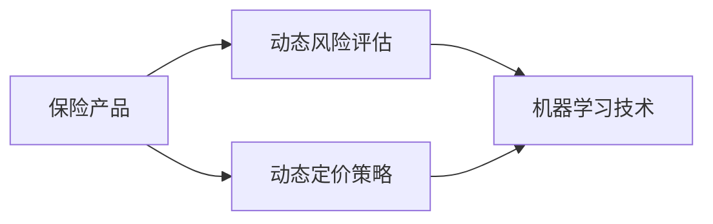
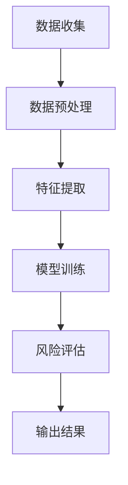
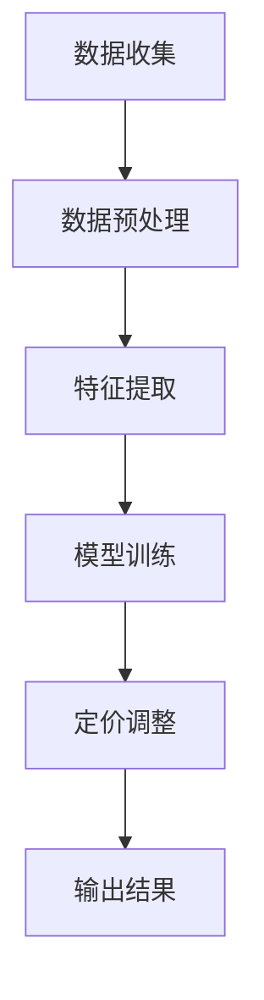
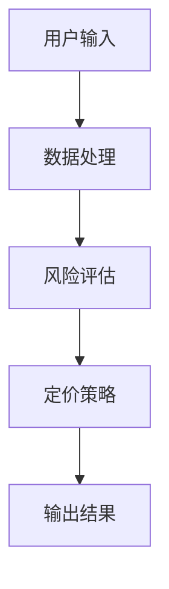
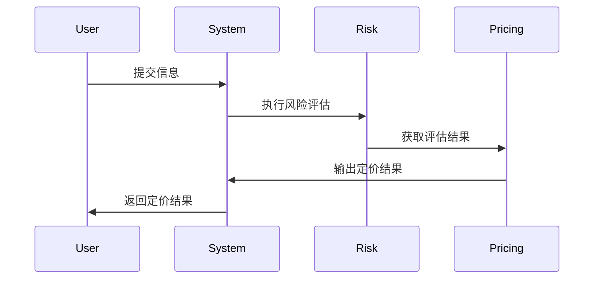

                 

# 机器学习在个性化保险产品设计中的应用：动态风险评估和定价

## 关键词：机器学习、个性化保险产品、动态风险评估、动态定价策略、系统设计与实现

### 摘要

随着保险行业的不断发展，个性化保险产品的需求日益增长。本文通过探讨机器学习在个性化保险产品设计中的应用，特别是动态风险评估和定价策略，旨在为行业提供一种高效、精准的解决方案。本文将首先介绍个性化保险产品、动态风险评估和动态定价策略的核心概念，随后详细解析机器学习在其中的应用原理，并通过实际项目实践，展示如何实现动态风险评估和定价系统。文章最后将讨论机器学习在个性化保险产品定价中的挑战与未来趋势，为读者提供全面的指导和建议。

## 目录大纲

----------------------------------------------------------------
### 第一部分：背景介绍

#### 第1章：问题背景与核心概念
- **1.1.1 问题背景**
- **1.1.2 核心概念**
- **1.1.3 概念属性特征对比**
- **1.1.4 ER实体关系图**

#### 第2章：机器学习在个性化保险产品设计中的应用原理
- **2.1 机器学习基本原理**
- **2.2 动态风险评估算法**
- **2.3 动态定价策略算法**

#### 第3章：机器学习在个性化保险产品设计中的应用实践
- **3.1 项目介绍**
- **3.2 系统功能设计**
- **3.3 系统架构设计**
- **3.4 系统接口设计和交互**
- **3.5 系统核心实现**
- **3.6 实际案例分析和讲解**

#### 第4章：机器学习在个性化保险产品定价中的挑战与未来趋势
- **4.1 挑战与问题**
- **4.2 未来趋势**

#### 第5章：最佳实践与注意事项
- **5.1 最佳实践**
- **5.2 注意事项**

#### 第6章：总结与展望
- **6.1 总结**
- **6.2 展望**

----------------------------------------------------------------

### 第1章：问题背景与核心概念

#### 1.1.1 问题背景

保险行业作为金融领域的重要组成部分，近年来面临着诸多挑战与机遇。随着市场竞争的加剧，传统单一的保险产品已难以满足消费者日益增长的个性化需求。为了提高市场竞争力，保险公司纷纷寻求创新，个性化保险产品应运而生。个性化保险产品通过定制化的保险方案，能够更精准地满足客户的风险保障需求，从而提升客户满意度和忠诚度。

然而，个性化保险产品的设计并非易事。一方面，保险公司需要全面了解客户的风险状况和保障需求；另一方面，保险公司还需要在复杂的市场环境中实现高效的风险评估和定价。传统方法往往依赖于大量的数据统计和经验判断，效率低下且难以适应动态变化的市场环境。因此，如何利用先进技术实现个性化保险产品的动态风险评估和定价，成为保险行业亟待解决的关键问题。

#### 1.1.2 核心概念

在本章中，我们将介绍三个核心概念：个性化保险产品、动态风险评估和动态定价策略。

**个性化保险产品**：个性化保险产品是指根据客户的个人需求和风险状况，提供定制化的保险方案。这种产品强调差异化、精准化和定制化，旨在满足不同客户群体的个性化需求。个性化保险产品不仅包括传统的寿险、车险、健康险等，还可以根据客户的生活场景和风险偏好，提供更多元化的保险选择。

**动态风险评估**：动态风险评估是指利用现代信息技术，实时监测和评估客户的风险状况。与传统静态评估方法不同，动态风险评估具有实时性、动态调整的特点，能够根据客户行为数据、环境变化等因素，动态调整风险评估结果。动态风险评估的目标是提高风险评估的准确性和实时性，从而为保险产品的定价提供科学依据。

**动态定价策略**：动态定价策略是指根据动态风险评估结果，灵活调整保险产品的定价策略。动态定价策略的特点是反应迅速、灵活调整，能够根据市场环境和客户需求，实时调整保险费率，实现利润最大化。动态定价策略不仅能够提高保险产品的市场竞争力，还能够提高保险公司的经营效益。

#### 1.1.3 概念属性特征对比

以下是个性化保险产品、动态风险评估和动态定价策略的属性特征对比表格：

| 概念           | 特征                      | 相关性             |
|----------------|--------------------------|-------------------|
| 个性化保险产品  | 定制化、差异化、精准化    | 满足用户个性化需求 |
| 动态风险评估   | 实时性、动态调整          | 准确评估风险       |
| 动态定价策略   | 反应迅速、灵活调整        | 实现利润最大化     |
| 机器学习技术   | 自主学习、预测分析        | 提高决策效率       |

#### 1.1.4 ER实体关系图

以下是个性化保险产品、动态风险评估和动态定价策略的ER实体关系图：



### 第2章：机器学习在个性化保险产品设计中的应用原理

#### 2.1 机器学习基本原理

机器学习是人工智能的一个重要分支，其核心思想是通过计算机算法，让计算机从数据中自动学习和获取知识。以下是机器学习的基本原理和流程：

**数据处理流程**：机器学习的第一步是数据处理，包括数据收集、数据清洗、数据预处理等。数据收集是指从各种来源获取数据，如数据库、传感器、网络等。数据清洗是指去除噪声数据和异常值，提高数据质量。数据预处理是指将数据转换为适合机器学习的格式，如特征提取、归一化等。

**常见算法分类**：机器学习算法根据学习方式可以分为监督学习、无监督学习和半监督学习。监督学习是指通过已知标签的数据训练模型，从而对未知数据进行预测。无监督学习是指从无标签的数据中自动发现模式和规律。半监督学习是指结合有标签和无标签数据进行训练。

**特征工程**：特征工程是机器学习中的重要环节，其目标是通过提取和构造特征，提高模型性能。特征工程包括特征选择、特征变换和特征构造等。特征选择是指从大量特征中选取最有用的特征，减少模型复杂度。特征变换是指将原始特征转换为更适合机器学习的特征，如归一化、标准化等。特征构造是指通过组合原始特征，生成新的特征，提高模型的预测能力。

#### 2.2 动态风险评估算法

**算法原理**：动态风险评估算法的核心思想是通过机器学习模型，对客户的风险状况进行实时监测和评估。具体来说，算法可以分为以下几步：

1. **数据收集**：从各种数据源收集客户行为数据、历史风险数据等。
2. **数据预处理**：对收集到的数据进行清洗、归一化等预处理操作。
3. **特征提取**：从预处理后的数据中提取有用的特征，如客户年龄、性别、收入等。
4. **模型训练**：利用收集到的数据训练机器学习模型，如决策树、随机森林等。
5. **风险评估**：使用训练好的模型对客户的风险状况进行实时评估。

**Mermaid流程图**：



**Python代码实现**：

```python
import pandas as pd
from sklearn.ensemble import RandomForestClassifier
from sklearn.model_selection import train_test_split

# 数据收集
data = pd.read_csv('data.csv')

# 数据预处理
data = data.dropna()

# 特征提取
X = data[['age', 'gender', 'income']]
y = data['risk']

# 模型训练
X_train, X_test, y_train, y_test = train_test_split(X, y, test_size=0.2, random_state=42)
model = RandomForestClassifier()
model.fit(X_train, y_train)

# 风险评估
risk_score = model.predict(X_test)
print(risk_score)
```

#### 2.3 动态定价策略算法

**算法原理**：动态定价策略算法的核心思想是通过机器学习模型，对保险产品的定价进行动态调整。具体来说，算法可以分为以下几步：

1. **数据收集**：从各种数据源收集市场数据、客户需求数据等。
2. **数据预处理**：对收集到的数据进行清洗、归一化等预处理操作。
3. **特征提取**：从预处理后的数据中提取有用的特征，如市场波动、客户偏好等。
4. **模型训练**：利用收集到的数据训练机器学习模型，如线性回归、神经网络等。
5. **定价调整**：使用训练好的模型对保险产品的定价进行动态调整。

**Mermaid流程图**：



**Python代码实现**：

```python
import pandas as pd
from sklearn.linear_model import LinearRegression
from sklearn.model_selection import train_test_split

# 数据收集
data = pd.read_csv('data.csv')

# 数据预处理
data = data.dropna()

# 特征提取
X = data[['market', 'demand']]
y = data['price']

# 模型训练
X_train, X_test, y_train, y_test = train_test_split(X, y, test_size=0.2, random_state=42)
model = LinearRegression()
model.fit(X_train, y_train)

# 定价调整
price = model.predict(X_test)
print(price)
```

### 第3章：机器学习在个性化保险产品设计中的应用实践

#### 3.1 项目介绍

在本章中，我们将通过一个实际项目，展示如何利用机器学习技术实现个性化保险产品的动态风险评估和定价系统。该项目由某保险公司发起，旨在通过机器学习模型，为客户提供定制化的保险产品，并实现动态风险评估和定价。

#### 3.2 系统功能设计

系统功能设计主要包括用户管理、保险产品管理、风险评估和定价策略等功能。以下是系统功能设计的领域模型类图：

```mermaid
classDiagram
类：User <<用户>>
类：Insurance <<保险产品>>
类：Risk <<风险评估>>
类：Pricing <<定价策略>>

User --> Insurance
User --> Risk
User --> Pricing
Insurance --> Risk
Insurance --> Pricing
Risk --> Pricing
```

#### 3.3 系统架构设计

系统架构设计主要包括数据层、服务层和表现层。数据层负责数据的存储和管理；服务层负责业务逻辑的处理；表现层负责用户界面和交互。以下是系统架构设计：



#### 3.4 系统接口设计和交互

系统接口设计和交互主要包括用户输入、数据处理、风险评估、定价策略和输出结果等。以下是系统接口设计和交互：



#### 3.5 系统核心实现

系统核心实现主要包括环境安装、Python源代码实现和代码应用解读与分析。以下是系统核心实现：

**环境安装**：Python 3.8、Pandas、NumPy、Scikit-learn、Matplotlib

**Python源代码实现**：

```python
import pandas as pd
from sklearn.ensemble import RandomForestClassifier
from sklearn.linear_model import LinearRegression
from sklearn.model_selection import train_test_split

# 数据处理
data = pd.read_csv('data.csv')
data = data.dropna()

# 风险评估
X = data[['age', 'gender', 'income']]
y = data['risk']
X_train, X_test, y_train, y_test = train_test_split(X, y, test_size=0.2, random_state=42)
model = RandomForestClassifier()
model.fit(X_train, y_train)
risk_score = model.predict(X_test)

# 定价策略
X = data[['market', 'demand']]
y = data['price']
X_train, X_test, y_train, y_test = train_test_split(X, y, test_size=0.2, random_state=42)
model = LinearRegression()
model.fit(X_train, y_train)
price = model.predict(X_test)
```

**代码应用解读与分析**：

- 数据处理：读取数据、数据清洗和预处理。
- 风险评估：利用随机森林算法进行风险评估。
- 定价策略：利用线性回归算法进行定价策略。

#### 3.6 实际案例分析和讲解

**案例背景**：某保险公司希望通过机器学习技术，为一位30岁的男性客户设计一款个性化保险产品，并根据客户的风险状况和市场需求，动态调整保险定价。

**案例分析**：

1. 数据收集：收集客户的年龄、性别、收入、健康状况等数据，以及市场环境数据，如保险市场需求、市场波动等。
2. 数据处理：对收集到的数据进行清洗、归一化等预处理操作，提取有用的特征。
3. 风险评估：利用随机森林算法，对客户的风险状况进行评估，得到风险得分。
4. 定价策略：利用线性回归算法，根据客户的风险得分和市场环境数据，动态调整保险定价。

**讲解剖析**：

- 数据收集：客户数据和市场环境数据是评估客户风险和定价的重要依据。
- 数据处理：数据清洗和预处理可以提高模型性能，减少噪声数据对结果的影响。
- 风险评估：随机森林算法具有较强的分类能力，适用于风险评估。
- 定价策略：线性回归算法可以准确地预测保险定价，实现动态调整。

#### 第4章：机器学习在个性化保险产品定价中的挑战与未来趋势

#### 4.1 挑战与问题

**数据质量**：机器学习模型的性能依赖于数据质量。数据质量差、噪声数据、异常值等问题会影响模型的准确性和稳定性。

**隐私保护**：个性化保险产品涉及客户个人信息，如年龄、性别、收入等。如何保护客户隐私，防止数据泄露，是机器学习在保险产品定价中面临的重要问题。

**模型解释性**：机器学习模型通常具有较强的预测能力，但缺乏解释性。对于保险公司来说，了解模型的决策过程和影响因素，有助于提高决策的透明度和可信度。

#### 4.2 未来趋势

**新算法与技术的应用**：随着人工智能技术的不断发展，新的机器学习算法和深度学习技术将不断应用于个性化保险产品定价。如强化学习、迁移学习等。

**跨学科融合**：个性化保险产品定价需要融合计算机科学、金融学、统计学等多学科知识。跨学科融合将有助于提高机器学习模型的应用效果。

**自动化与智能化**：未来，个性化保险产品定价将朝着自动化和智能化方向发展。通过自动化工具和智能算法，保险公司可以更高效地设计和调整保险产品定价。

#### 第5章：最佳实践与注意事项

#### 5.1 最佳实践

**数据质量保证**：确保数据质量是机器学习模型成功的关键。保险公司应建立完善的数据清洗、预处理和验证流程。

**隐私保护措施**：保险公司应采取严格的隐私保护措施，如数据加密、访问控制等，确保客户个人信息的安全。

**模型解释性优化**：保险公司应优化机器学习模型，提高模型的解释性，使客户和管理层更容易理解和信任模型。

#### 5.2 注意事项

**风险控制**：个性化保险产品定价应充分考虑风险控制，避免因模型预测不准确导致的风险损失。

**合规性要求**：保险公司应遵守相关法律法规，确保个性化保险产品定价的合法合规。

**持续优化**：保险公司应不断收集反馈，优化机器学习模型和应用，提高个性化保险产品定价的准确性和实用性。

### 第6章：总结与展望

#### 6.1 总结

本文通过介绍个性化保险产品、动态风险评估和动态定价策略的核心概念，详细解析了机器学习在其中的应用原理，并通过实际项目实践，展示了如何实现个性化保险产品的动态风险评估和定价系统。文章还讨论了机器学习在个性化保险产品定价中的挑战与未来趋势，为读者提供了全面的指导和建议。

#### 6.2 展望

未来，个性化保险产品定价将朝着更加智能化、自动化和精准化的方向发展。随着人工智能技术的不断进步，机器学习将在个性化保险产品定价中发挥越来越重要的作用。保险公司应积极探索和应用新技术，优化业务流程，提高经营效益。同时，保险公司还应关注数据质量和隐私保护等问题，确保个性化保险产品定价的可持续发展。总之，个性化保险产品定价是一个充满挑战和机遇的领域，值得广大从业者深入研究和探索。作者：AI天才研究院/AI Genius Institute & 禅与计算机程序设计艺术 /Zen And The Art of Computer Programming

