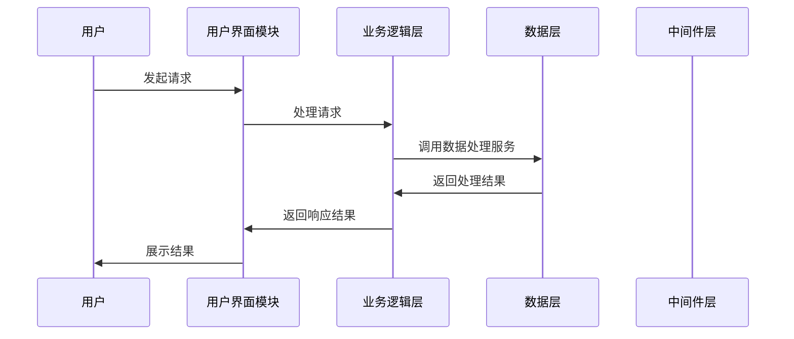

                 


### 第1章 引言

#### 1.1 问题背景

在当今的保险市场中，随着消费者需求的日益多样化和个性化，保险产品的设计面临着巨大的挑战。传统的保险产品设计方法往往依赖于历史数据和专家经验，这虽然能够一定程度上满足消费者的需求，但面对不断变化的消费趋势，其响应速度和适应性显得捉襟见肘。具体而言，以下问题在保险产品设计中显得尤为突出：

1. **市场竞争加剧**：随着保险公司数量的增加，市场竞争愈发激烈，保险产品的同质化现象严重，导致消费者选择困难。
2. **消费者需求多样化**：消费者的需求越来越多样化，不仅体现在保险类型和保障范围上，还体现在个性化服务、定制化保障方案等方面。
3. **数据资源有限**：保险公司在进行产品设计时，往往受限于数据资源，无法全面了解消费者的个性化需求。

#### 1.2 保险产品设计挑战

1. **设计效率低下**：传统方法在应对多样化需求时，需要大量的人力和时间投入，设计效率低下。
2. **产品设计同质化**：基于历史数据和专家经验的保险产品设计，容易导致产品同质化，无法满足个性化需求。
3. **数据利用不足**：保险公司在产品设计过程中，往往未能充分利用现有的数据资源，导致数据价值无法最大化。

#### 1.3 问题解决

为了应对上述挑战，机器学习技术提供了一种新的解决方案。以下是利用机器学习技术解决个性化保险产品设计问题的几个关键步骤：

1. **数据收集与预处理**：首先，需要收集大量的消费者数据，包括历史理赔记录、消费者行为数据等。然后，对收集到的数据进行预处理，包括数据清洗、格式转换等，以便后续分析。
2. **需求预测模型构建**：利用监督学习和无监督学习算法，构建消费者需求预测模型。通过分析历史数据和现有数据，预测消费者未来的需求。
3. **个性化产品设计**：根据需求预测模型的结果，提取有价值的信息，设计满足消费者多样化需求的个性化保险产品。

#### 1.4 边界与外延

本节主要探讨机器学习在个性化保险产品设计中的应用，重点关注如何利用数据和技术提升产品设计效率。本书不包括其他金融领域的数据分析，如投资理财等。同时，本书关注于如何通过机器学习技术提升保险产品设计效率，而不涉及机器学习算法的细节深入探讨。

### 总结

通过机器学习技术，保险公司可以更高效、更精准地设计出满足消费者多样化需求的保险产品。这不仅有助于提升市场竞争力和用户满意度，还能最大化地利用现有数据资源，实现保险产品的创新和升级。

#### 1.5 小结

在这一章中，我们探讨了保险产品设计的现状和面临的挑战，并介绍了利用机器学习技术解决这些问题的可能性。在接下来的章节中，我们将深入探讨机器学习的基础概念、算法原理以及在实际保险产品设计中的应用，帮助读者全面了解如何利用机器学习技术提升保险产品的设计效率和个性化程度。

---

### 第2章 核心概念与联系

在探讨机器学习在个性化保险产品设计中的应用之前，我们需要明确几个核心概念，并理解它们之间的联系。本章将介绍机器学习的基础概念、保险产品设计相关的概念，并通过对比表格和ER实体关系图来加深理解。

#### 2.1 机器学习基础概念

机器学习是人工智能的核心组成部分，其基础概念主要包括：

1. **监督学习**：有监督学习是一种利用标注数据进行训练的机器学习方法。在这种方法中，模型通过学习输入和输出之间的映射关系，从而预测未知数据的输出。例如，我们可以使用监督学习算法来预测某个人的健康状况。

2. **无监督学习**：无监督学习是在没有标注数据的情况下，通过观察数据自身的结构和模式进行训练的机器学习方法。常见的无监督学习任务包括聚类和降维。例如，我们可以使用无监督学习算法来识别数据中的相似性群组。

3. **强化学习**：强化学习是一种通过试错学习的方法，通过与环境的交互来学习最优策略。在这种方法中，模型通过不断尝试不同的行为，并根据奖励信号来调整其行为策略。例如，我们可以使用强化学习算法来训练一个自动驾驶系统。

4. **深度学习**：深度学习是机器学习的一种重要分支，通过构建深度神经网络来模拟人脑的神经结构，从而实现对复杂数据的处理和预测。常见的深度学习模型包括卷积神经网络（CNN）、循环神经网络（RNN）和生成对抗网络（GAN）。

#### 2.2 保险产品设计相关概念

在保险产品设计过程中，以下几个核心概念至关重要：

1. **个性化保险产品**：个性化保险产品是针对消费者不同需求而设计的保险产品。这种产品能够提供更精准的保障方案，满足消费者的多样化需求。例如，可以根据消费者的年龄、职业、健康状况等因素，提供量身定制的保险产品。

2. **保险需求分析**：保险需求分析是了解消费者需求的重要步骤。通过分析消费者的行为数据、历史理赔记录等，可以识别出消费者的潜在需求和偏好。例如，通过分析消费者的购买记录，可以推断出他们对特定保障类型的偏好。

3. **保险产品特征**：保险产品特征是指构成保险产品的各项属性，如保障范围、保费、赔付方式等。设计个性化保险产品时，需要充分考虑这些特征，以便满足消费者的不同需求。

#### 2.3 概念属性特征对比表格

为了更直观地理解这些概念，我们通过一个对比表格来展示它们的主要特征：

| 概念         | 特征1           | 特征2       | 特征3         |
|------------|----------------|------------|--------------|
| 机器学习     | 自动化         | 数据驱动   | 模型预测     |
| 个性化保险产品 | 满足消费者需求 | 多样化     | 精准设计     |
| 保险需求分析 | 数据挖掘       | 用户行为分析 | 需求预测     |
| 保险产品特征 | 保障范围       | 保费       | 赔付方式     |

#### 2.4 ER实体关系图架构

为了更好地理解这些概念之间的关系，我们可以使用ER（实体关系）图来展示它们在保险产品设计中的应用。以下是一个简单的ER图示例，展示了机器学习、个性化保险产品、保险需求分析之间的基本关系：

```
[消费者] <--> [保险需求分析]
     |              |
     |              |
[个性化保险产品] <--> [机器学习]
```

在这个ER图中，消费者是保险需求分析的源头，保险需求分析的结果指导个性化保险产品的设计，而个性化保险产品的设计又依赖于机器学习技术。这种关系展示了机器学习在个性化保险产品设计中的核心地位。

#### 2.5 小结

本章介绍了机器学习的基础概念和保险产品设计相关的核心概念，并通过对比表格和ER图展示了它们之间的联系。在下一章中，我们将深入探讨机器学习在保险产品设计中的具体应用，包括数据收集、模型构建和个性化产品设计等。

---

### 第3章 机器学习在保险产品设计中的应用

机器学习在保险产品设计中的应用，可以通过以下几个关键步骤来实现：数据收集与预处理、模型构建与训练、以及个性化保险产品设计的具体实施。以下是详细的探讨。

#### 3.1 数据收集与预处理

1. **数据来源**：

   - **历史数据**：包括保单数据、理赔记录、赔付金额等，这些数据可以帮助我们了解消费者的历史行为和需求。
   - **行为数据**：如消费者在线浏览、购买、咨询等行为数据，这些数据可以帮助我们分析消费者的当前需求。
   - **第三方数据**：如人口统计数据、经济指标、职业信息等，这些数据可以为保险产品设计和定价提供参考。

2. **数据预处理**：

   - **数据清洗**：去除重复数据、缺失数据和错误数据，确保数据的质量。
   - **数据转换**：将不同格式的数据转换为统一的格式，如将文本数据转换为数值型数据。
   - **特征提取**：从原始数据中提取出对保险产品设计有用的特征，如年龄、性别、收入、职业等。

3. **数据清洗**：

   - **缺失值处理**：使用均值填补、插值法等处理缺失值。
   - **异常值处理**：使用箱线图、统计方法等识别并处理异常值。
   - **数据归一化**：将不同量级的特征进行归一化处理，使它们对模型的影响更加均衡。

#### 3.2 模型构建与训练

1. **选择合适的机器学习算法**：

   - **监督学习算法**：如线性回归、逻辑回归、决策树、随机森林等，这些算法适用于预测和分类问题。
   - **无监督学习算法**：如聚类、降维等，这些算法适用于发现数据中的结构和模式。
   - **深度学习算法**：如卷积神经网络（CNN）、循环神经网络（RNN）、生成对抗网络（GAN）等，这些算法适用于处理复杂数据和生成任务。

2. **模型参数调优**：

   - **交叉验证**：使用交叉验证方法来评估模型的性能，并选择最佳参数。
   - **网格搜索**：通过遍历不同的参数组合，找到最优参数组合。

3. **模型训练与评估**：

   - **模型训练**：使用训练数据对模型进行训练，调整模型参数。
   - **模型评估**：使用验证集和测试集来评估模型的性能，如准确率、召回率、F1值等。

#### 3.3 个性化保险产品设计

1. **消费者需求分析**：

   - **需求预测**：利用构建的模型，预测消费者未来的保险需求。
   - **需求特征提取**：从历史数据和当前数据中提取出反映消费者需求的关键特征。

2. **保险产品特征提取**：

   - **产品特征**：提取保险产品的关键特征，如保障范围、保费、赔付方式等。
   - **定价策略**：根据消费者的需求和产品特征，设计合理的定价策略。

3. **个性化产品设计**：

   - **产品组合**：根据消费者的需求，组合不同的保险产品，提供多元化的保障方案。
   - **定制化服务**：根据消费者的个性化需求，提供定制化的保险产品和服务。

#### 3.4 案例分析

以一个实际案例为例，假设某保险公司希望通过机器学习技术为年轻人群设计一款个性化保险产品。以下是具体的分析步骤：

1. **数据收集与预处理**：

   - 收集年轻人群的历史保单数据、行为数据等。
   - 对数据清洗、转换和特征提取。

2. **模型构建与训练**：

   - 选择合适的机器学习算法，如逻辑回归、决策树等。
   - 进行模型参数调优和训练。

3. **个性化产品设计**：

   - 根据模型预测的结果，分析年轻人群的需求特征。
   - 设计适合年轻人群的保险产品，如意外伤害保险、健康保险等。

4. **产品优化**：

   - 收集用户反馈，不断优化产品特征和定价策略。
   - 通过迭代优化，提升产品的市场竞争力。

#### 3.5 小结

通过机器学习技术，保险公司可以更高效、更精准地设计出满足消费者多样化需求的个性化保险产品。在实际应用中，需要结合具体业务场景和数据特点，选择合适的算法和模型，进行数据预处理、模型训练和产品设计。在下一章中，我们将进一步探讨机器学习算法原理和数学模型，帮助读者深入理解个性化保险产品设计的核心技术和方法。

---

### 第4章 算法原理讲解

为了深入理解机器学习在个性化保险产品设计中的应用，我们需要详细探讨几种常见的机器学习算法的原理。本章将分别介绍概率图模型、支持向量机（SVM）和深度学习模型，并通过具体的算法流程、Python代码示例以及数学模型和公式来讲解这些算法。

#### 4.1 概率图模型

概率图模型是一种用于表示变量之间概率关系的图结构，主要包括贝叶斯网络和隐马尔可夫模型（HMM）。

##### 4.1.1 贝叶斯网络

贝叶斯网络是一种表示变量之间条件概率关系的有向无环图（DAG）。在贝叶斯网络中，每个节点代表一个变量，边代表变量之间的依赖关系。贝叶斯网络的算法流程如下：

1. **图结构学习**：通过观察数据，学习变量之间的依赖关系，构建贝叶斯网络图。
2. **参数估计**：使用最大似然估计（MLE）或贝叶斯估计（MAP）来估计网络中各节点的条件概率分布。

Python代码示例：

```python
from pgmpy.models import BayesianModel
from pgmpy.estimators import MaximumLikelihoodEstimator

# 建立贝叶斯网络模型
model = BayesianModel([
    ('A', 'B'),
    ('B', 'C'),
    ('A', 'C')
])

# 估计模型参数
estimator = MaximumLikelihoodEstimator()
model.fit(data, estimator)

# 输出模型结构
model.plot()
```

数学模型：

贝叶斯网络中的条件概率分布可以用以下公式表示：

$$
P(X=x) = \prod_{i=1}^{n} P(X_i=x_i | parents(X_i))
$$

其中，$X = (X_1, X_2, ..., X_n)$ 是变量集合，$parents(X_i)$ 是 $X_i$ 的父节点集合。

##### 4.1.2 隐马尔可夫模型（HMM）

隐马尔可夫模型是一种用于处理序列数据的概率图模型，主要用于时间序列分析和隐状态估计。HMM 的算法流程如下：

1. **状态转移概率**：定义状态之间的转移概率矩阵 $A$。
2. **观测概率**：定义每个状态下的观测概率分布 $B$。
3. **初始化概率**：定义初始状态的概率分布 $π$。

Python代码示例：

```python
from hmmlearn import hmm

# 创建HMM模型
model = hmm.GaussianHMM(n_components=3, covariance_type="diag", n_iter=100)

# 训练模型
model.fit(X)

# 预测
predicted = model.predict(X)

# 输出模型参数
print("Transition matrix:\n", model.transmat_)
print("Emission probabilities:\n", model.startprob_)
print("Initial probabilities:\n", model.means_)
```

数学模型：

隐马尔可夫模型的状态转移概率、观测概率和初始概率分别用以下公式表示：

$$
A = (a_{ij}) \quad \text{（状态转移概率矩阵）}
$$

$$
B = (b_{ik}) \quad \text{（观测概率矩阵）}
$$

$$
π = (π_i) \quad \text{（初始概率向量）}
$$

#### 4.2 支持向量机（SVM）

支持向量机是一种二分类模型，主要用于分类和回归分析。SVM 的算法原理是基于最大化分类间隔，将数据点分类到不同的类别。以下是 SVM 的算法流程：

1. **选择核函数**：选择适当的核函数，如线性核、多项式核、径向基核等。
2. **构建最优超平面**：通过求解优化问题，找到最大化分类间隔的最优超平面。
3. **分类决策**：对于新的数据点，通过计算数据点到超平面的距离，进行分类决策。

Python代码示例：

```python
from sklearn.svm import SVC

# 创建SVM模型
model = SVC(kernel='linear')

# 训练模型
model.fit(X_train, y_train)

# 预测
predicted = model.predict(X_test)

# 输出模型参数
print("Support vectors:\n", model.support_)
print("Coefficients:\n", model.coef_)
```

数学模型：

线性 SVM 的决策边界可以用以下公式表示：

$$
w \cdot x - b = 0
$$

其中，$w$ 是权重向量，$x$ 是特征向量，$b$ 是偏置项。

#### 4.3 深度学习模型

深度学习模型是一类基于多层神经网络的机器学习模型，能够处理复杂数据和提取深层特征。常见的深度学习模型包括卷积神经网络（CNN）、循环神经网络（RNN）和生成对抗网络（GAN）。

##### 4.3.1 卷积神经网络（CNN）

卷积神经网络是一种用于图像识别和处理的深度学习模型，其核心思想是利用卷积层提取图像特征。CNN 的算法流程如下：

1. **卷积层**：通过卷积操作提取图像局部特征。
2. **池化层**：对卷积层的结果进行池化操作，减少参数数量。
3. **全连接层**：将池化层的结果输入到全连接层进行分类。

Python代码示例：

```python
from tensorflow.keras.models import Sequential
from tensorflow.keras.layers import Conv2D, MaxPooling2D, Flatten, Dense

# 创建CNN模型
model = Sequential([
    Conv2D(filters=32, kernel_size=(3, 3), activation='relu', input_shape=(28, 28, 1)),
    MaxPooling2D(pool_size=(2, 2)),
    Flatten(),
    Dense(units=128, activation='relu'),
    Dense(units=10, activation='softmax')
])

# 编译模型
model.compile(optimizer='adam', loss='categorical_crossentropy', metrics=['accuracy'])

# 训练模型
model.fit(X_train, y_train, epochs=10, batch_size=32, validation_data=(X_test, y_test))

# 预测
predicted = model.predict(X_test)

# 输出模型参数
model.summary()
```

数学模型：

CNN 中的卷积操作可以用以下公式表示：

$$
h_{ij}^l = \sum_{k=1}^{m} w_{ikj}^l * g_{kj}^{l-1} + b_l
$$

其中，$h_{ij}^l$ 是第 $l$ 层第 $i$ 个单元的第 $j$ 个特征，$w_{ikj}^l$ 是第 $l$ 层第 $i$ 个单元的第 $k$ 个权重，$g_{kj}^{l-1}$ 是第 $l-1$ 层第 $k$ 个单元的输出，$b_l$ 是第 $l$ 层的偏置项。

##### 4.3.2 循环神经网络（RNN）

循环神经网络是一种用于序列数据处理的深度学习模型，其核心思想是利用隐藏状态的信息传递和反馈。RNN 的算法流程如下：

1. **输入层**：接收序列数据。
2. **隐藏层**：利用前一个时间步的隐藏状态和当前输入，计算新的隐藏状态。
3. **输出层**：将隐藏状态映射到输出。

Python代码示例：

```python
from tensorflow.keras.models import Sequential
from tensorflow.keras.layers import LSTM, Dense

# 创建RNN模型
model = Sequential([
    LSTM(units=50, return_sequences=True, input_shape=(timesteps, features)),
    LSTM(units=50),
    Dense(units=1)
])

# 编译模型
model.compile(optimizer='adam', loss='mse')

# 训练模型
model.fit(X_train, y_train, epochs=100, batch_size=64, validation_data=(X_val, y_val))

# 预测
predicted = model.predict(X_test)

# 输出模型参数
model.summary()
```

数学模型：

RNN 中的隐藏状态更新可以用以下公式表示：

$$
h_t = \sigma(W_h \cdot [h_{t-1}, x_t] + b_h)
$$

其中，$h_t$ 是第 $t$ 个时间步的隐藏状态，$W_h$ 是权重矩阵，$x_t$ 是第 $t$ 个时间步的输入，$b_h$ 是偏置项，$\sigma$ 是激活函数。

##### 4.3.3 生成对抗网络（GAN）

生成对抗网络是一种由生成器和判别器组成的深度学习模型，主要用于生成数据。GAN 的算法流程如下：

1. **生成器**：生成与真实数据分布相似的数据。
2. **判别器**：判断生成数据是否为真实数据。
3. **对抗训练**：通过优化生成器和判别器的参数，使生成器生成的数据越来越接近真实数据。

Python代码示例：

```python
from tensorflow.keras.models import Sequential
from tensorflow.keras.layers import Dense, Flatten, Reshape

# 创建生成器和判别器模型
generator = Sequential([
    Dense(units=128, activation='relu', input_shape=(z_dim)),
    Flatten(),
    Reshape((28, 28, 1))
])

discriminator = Sequential([
    Flatten(input_shape=(28, 28, 1)),
    Dense(units=1, activation='sigmoid')
])

# 编译模型
discriminator.compile(optimizer='adam', loss='binary_crossentropy')
generator.compile(optimizer='adam', loss='binary_crossentropy')

# 创建GAN模型
model = Sequential([
    generator,
    discriminator
])

# 编译GAN模型
model.compile(optimizer='adam', loss='binary_crossentropy')

# 训练GAN模型
model.fit(x_train, epochs=1000, batch_size=128)
```

数学模型：

GAN 中的生成器和判别器的损失函数分别用以下公式表示：

$$
\text{Generator loss:} \quad L_G = -\log(D(G(z)))
$$

$$
\text{Discriminator loss:} \quad L_D = -[\log(D(x)) + \log(1 - D(G(z))]
$$

其中，$G(z)$ 是生成器生成的数据，$D(x)$ 是判别器对真实数据的判断结果。

#### 4.4 小结

本章详细介绍了概率图模型、支持向量机（SVM）和深度学习模型（包括卷积神经网络（CNN）、循环神经网络（RNN）和生成对抗网络（GAN））的算法原理、Python代码示例以及数学模型和公式。通过这些算法，保险公司可以更有效地进行个性化保险产品设计，满足消费者的多样化需求。在下一章中，我们将进一步探讨数学模型和公式，帮助读者更深入地理解机器学习算法的核心概念和实现方法。

---

### 第5章 数学模型和数学公式

在深入探讨机器学习算法时，理解其背后的数学模型和公式是非常重要的。本章将介绍概率论基础、机器学习模型的公式，并使用LaTeX格式展示这些公式，以便读者能够更好地掌握这些核心概念。

#### 5.1 概率论基础

概率论是机器学习的基础之一，以下是一些核心概念和相关的数学公式：

1. **概率分布函数（Probability Distribution Function, PDF）**

   概率分布函数描述了随机变量取值的概率。对于连续型随机变量 $X$，其概率分布函数为：

   $$ 
   f_X(x) = P(X \leq x)
   $$

   其中，$f_X(x)$ 表示随机变量 $X$ 在 $x$ 处的概率密度。

2. **条件概率（Conditional Probability）**

   条件概率描述了在给定某个事件发生的条件下，另一个事件发生的概率。设事件 $A$ 和事件 $B$，则 $A$ 条件下 $B$ 的条件概率为：

   $$ 
   P(B|A) = \frac{P(A \cap B)}{P(A)}
   $$

   其中，$P(A \cap B)$ 表示事件 $A$ 和事件 $B$ 同时发生的概率，$P(A)$ 表示事件 $A$ 发生的概率。

3. **贝叶斯定理（Bayes' Theorem）**

   贝叶斯定理描述了在已知某个事件发生的条件下，另一个事件发生概率的计算。贝叶斯定理的公式为：

   $$ 
   P(A|B) = \frac{P(B|A) \cdot P(A)}{P(B)}
   $$

   其中，$P(A|B)$ 表示在事件 $B$ 发生的条件下事件 $A$ 发生的概率，$P(B|A)$ 表示在事件 $A$ 发生的条件下事件 $B$ 发生的概率。

#### 5.2 机器学习模型公式

机器学习模型通常涉及线性回归、逻辑回归和决策树等算法，以下分别介绍这些模型的数学公式：

1. **线性回归模型（Linear Regression Model）**

   线性回归模型用于预测连续型输出。其模型公式为：

   $$ 
   y = \beta_0 + \beta_1 \cdot x_1 + \beta_2 \cdot x_2 + ... + \beta_n \cdot x_n + \epsilon
   $$

   其中，$y$ 是输出变量，$x_1, x_2, ..., x_n$ 是输入特征，$\beta_0, \beta_1, ..., \beta_n$ 是模型的参数，$\epsilon$ 是误差项。

2. **逻辑回归模型（Logistic Regression Model）**

   逻辑回归模型用于预测二分类输出。其模型公式为：

   $$ 
   P(y=1) = \frac{1}{1 + e^{-(\beta_0 + \beta_1 \cdot x_1 + \beta_2 \cdot x_2 + ... + \beta_n \cdot x_n)}}
   $$

   其中，$y$ 是输出变量，$x_1, x_2, ..., x_n$ 是输入特征，$\beta_0, \beta_1, ..., \beta_n$ 是模型的参数。

3. **决策树模型（Decision Tree Model）**

   决策树模型通过一系列的决策规则对数据进行分类或回归。其模型公式为：

   $$ 
   \begin{cases} 
   y \leq \beta_0 & \text{if } x_1 \leq \beta_1 \\
   y > \beta_0 & \text{if } x_1 > \beta_1 \\
   \end{cases}
   $$

   其中，$y$ 是输出变量，$x_1, x_2, ..., x_n$ 是输入特征，$\beta_0, \beta_1, ..., \beta_n$ 是决策规则中的阈值。

#### 5.3 LaTeX格式示例

为了更好地展示数学公式，我们使用LaTeX格式来书写上述的数学模型。以下是一个示例：

$$
\begin{aligned}
y &= \beta_0 + \beta_1 \cdot x_1 + \beta_2 \cdot x_2 + ... + \beta_n \cdot x_n + \epsilon \\
P(y=1) &= \frac{1}{1 + e^{-(\beta_0 + \beta_1 \cdot x_1 + \beta_2 \cdot x_2 + ... + \beta_n \cdot x_n)}} \\
\text{if } x_1 &\leq \beta_1: y \leq \beta_0 \\
\text{if } x_1 &> \beta_1: y > \beta_0 \\
\end{aligned}
$$

#### 5.4 小结

本章介绍了概率论基础和机器学习模型的关键数学公式，并使用LaTeX格式进行了展示。通过理解这些数学公式，读者可以更深入地掌握机器学习算法的核心原理。在下一章中，我们将进一步探讨系统分析与架构设计方案，帮助读者从宏观角度理解机器学习在保险产品设计中的应用。

---

### 第6章 系统分析与架构设计方案

在个性化保险产品设计中，构建一个高效、可扩展和可维护的系统架构至关重要。本章将详细分析个性化保险产品设计系统的问题场景，介绍系统的功能和模块设计，并展示系统架构图、接口设计以及系统交互流程。

#### 6.1 问题场景介绍

个性化保险产品设计系统的目标是为保险公司提供一个智能化的平台，使其能够高效、精准地设计满足消费者多样化需求的保险产品。该系统需要解决以下几个核心问题：

1. **数据收集与整合**：从多个数据源收集消费者数据，如历史保单数据、行为数据、第三方数据等，并对其进行整合和处理。
2. **需求分析与预测**：利用机器学习技术，对消费者的需求进行深入分析，预测消费者未来的需求，以便设计出个性化的保险产品。
3. **产品设计与优化**：根据需求分析的结果，设计出满足消费者需求的保险产品，并进行持续优化，以提高产品的市场竞争力和用户满意度。
4. **用户体验**：提供友好、直观的用户界面，使保险公司和消费者能够方便地使用系统，提高系统的易用性和用户参与度。

#### 6.2 系统功能设计

个性化保险产品设计系统的功能设计主要包括以下几个模块：

1. **数据收集模块**：负责从多个数据源收集消费者数据，包括历史保单数据、行为数据等，并对数据进行预处理和清洗，为后续分析提供高质量的数据。
2. **需求分析模块**：利用机器学习算法，对消费者的需求进行预测和分析，提取出关键的需求特征，为个性化产品设计提供数据支持。
3. **产品设计模块**：根据需求分析的结果，设计出满足消费者需求的保险产品，包括产品组合、定价策略等。
4. **产品优化模块**：通过不断优化产品设计和定价策略，提高产品的市场竞争力和用户满意度。
5. **用户体验模块**：提供友好、直观的用户界面，使保险公司和消费者能够方便地使用系统，提高系统的易用性和用户参与度。

#### 6.3 系统架构设计

个性化保险产品设计系统的架构设计采用三层架构，包括数据层、业务逻辑层和表现层。以下是一个简单的系统架构图：

```
+----------------------+        +----------------------+
|     数据层            |        |     表现层            |
+----------------------+        +----------------------+
| 数据收集模块        |        | 用户界面模块        |
| 需求分析模块        |        | 产品展示模块        |
| 产品设计模块        |        | 用户交互模块        |
| 产品优化模块        |        | 帮助与支持模块        |
+----------------------+        +----------------------+
        ^                  ^                  ^
        |                  |                  |
        |                  |                  |
+----------------------+        +----------------------+
|     业务逻辑层         |        |     中间件层           |
+----------------------+        +----------------------+
| 需求分析服务        |        | 数据处理服务        |
| 产品设计服务        |        | 用户行为分析服务    |
| 产品优化服务        |        | 系统监控服务        |
+----------------------+        +----------------------+
```

#### 6.4 系统接口设计

系统接口设计是确保系统模块之间能够高效、可靠地进行交互的关键。以下是系统接口设计的主要规范：

1. **数据层接口**：数据收集模块与数据存储模块之间的接口，用于数据上传、下载和更新。
2. **业务逻辑层接口**：业务逻辑层与数据层、表现层之间的接口，用于服务调用和数据传输。
3. **表现层接口**：用户界面模块与业务逻辑层之间的接口，用于用户请求的处理和响应。

接口设计应遵循RESTful API设计规范，确保接口的统一性和可扩展性。

#### 6.5 系统交互

个性化保险产品设计系统的交互流程包括以下几个步骤：

1. **用户请求**：用户通过用户界面模块发起请求，如查看保险产品、提交需求等。
2. **数据处理**：业务逻辑层接收用户请求，调用相应的服务进行处理，如数据收集、需求分析、产品设计等。
3. **数据存储**：处理后的数据存储在数据层，以便后续分析和使用。
4. **响应返回**：处理结果返回给用户界面模块，并在用户界面上展示。

以下是一个简单的系统交互mermaid序列图：



#### 6.6 小结

本章介绍了个性化保险产品设计系统的系统架构设计、接口设计和交互流程。通过系统架构的设计和优化，保险公司可以更高效地设计出满足消费者多样化需求的保险产品。在下一章中，我们将通过实际项目实战，深入探讨如何实现个性化保险产品设计系统的各个环节。

---

### 第7章 项目实战

在深入探讨了机器学习的理论知识和系统设计之后，本章将通过一个实际项目实战来展示如何将机器学习应用于个性化保险产品设计。我们将详细描述项目环境安装、系统核心实现、代码应用解读与分析、实际案例分析与详细讲解以及项目小结。

#### 7.1 环境安装

为了实现个性化保险产品设计系统，首先需要安装并配置Python开发环境。以下是具体步骤：

1. **Python环境配置**：
   - 安装Python 3.x版本（推荐3.8及以上）。
   - 设置环境变量`PATH`，确保能够在命令行中调用Python。

2. **依赖库安装**：
   - 使用pip安装必要的依赖库，如NumPy、Pandas、scikit-learn、TensorFlow、Keras等。
   - 命令如下：

     ```bash
     pip install numpy pandas scikit-learn tensorflow keras
     ```

3. **其他工具安装**：
   - 安装Jupyter Notebook，用于编写和运行Python代码。
   - 命令如下：

     ```bash
     pip install notebook
     ```

4. **验证环境**：
   - 在命令行中运行Python，并尝试导入上述安装的库，以验证环境配置是否正确。

     ```python
     import numpy as np
     import pandas as pd
     import sklearn
     import tensorflow as tf
     import keras
     ```

#### 7.2 系统核心实现

个性化保险产品设计系统的核心实现包括数据收集与预处理、模型构建与训练以及个性化产品设计的具体实施。以下是详细的步骤和代码：

1. **数据收集与预处理**：

   - 收集历史保单数据、消费者行为数据等，并将其存储在CSV或数据库中。
   - 使用Pandas库读取数据，并进行清洗和预处理。

     ```python
     import pandas as pd

     # 读取数据
     data = pd.read_csv('insurance_data.csv')

     # 数据清洗与预处理
     data = data.dropna()
     data['age'] = data['age'].astype(int)
     data['income'] = data['income'].astype(float)
     ```

2. **模型构建与训练**：

   - 选择合适的机器学习算法，如随机森林、支持向量机等，构建需求预测模型。
   - 使用scikit-learn库进行模型训练。

     ```python
     from sklearn.ensemble import RandomForestClassifier
     from sklearn.model_selection import train_test_split

     # 数据分割
     X = data[['age', 'income']]
     y = data['demand']

     X_train, X_test, y_train, y_test = train_test_split(X, y, test_size=0.2, random_state=42)

     # 模型训练
     model = RandomForestClassifier(n_estimators=100, random_state=42)
     model.fit(X_train, y_train)
     ```

3. **个性化产品设计**：

   - 根据模型预测的结果，提取有价值的信息，设计满足消费者多样化需求的保险产品。
   - 使用Keras库构建深度学习模型，进行个性化产品设计。

     ```python
     from keras.models import Sequential
     from keras.layers import Dense

     # 构建深度学习模型
     model = Sequential([
         Dense(units=64, activation='relu', input_shape=(2,)),
         Dense(units=32, activation='relu'),
         Dense(units=1, activation='sigmoid')
     ])

     # 编译模型
     model.compile(optimizer='adam', loss='binary_crossentropy', metrics=['accuracy'])

     # 训练模型
     model.fit(X_train, y_train, epochs=10, batch_size=32, validation_data=(X_test, y_test))
     ```

#### 7.3 代码应用解读与分析

在实现系统核心功能的过程中，以下是对关键代码段的应用解读与分析：

1. **数据预处理**：

   ```python
   data = pd.read_csv('insurance_data.csv')
   data = data.dropna()
   data['age'] = data['age'].astype(int)
   data['income'] = data['income'].astype(float)
   ```

   - 使用Pandas库读取保险数据，并删除缺失值。这一步确保了数据的完整性和质量。
   - 将年龄和收入等特征转换为适当的类型，以便后续处理。

2. **模型构建与训练**：

   ```python
   model = RandomForestClassifier(n_estimators=100, random_state=42)
   model.fit(X_train, y_train)
   ```

   - 使用随机森林算法构建需求预测模型。随机森林具有强大的分类能力，适合处理保险数据。
   - 使用训练数据进行模型训练，确保模型能够准确预测消费者的需求。

3. **个性化产品设计**：

   ```python
   model = Sequential([
       Dense(units=64, activation='relu', input_shape=(2,)),
       Dense(units=32, activation='relu'),
       Dense(units=1, activation='sigmoid')
   ])

   model.compile(optimizer='adam', loss='binary_crossentropy', metrics=['accuracy'])
   model.fit(X_train, y_train, epochs=10, batch_size=32, validation_data=(X_test, y_test))
   ```

   - 使用Keras构建一个简单的深度学习模型，用于个性化产品设计。深度学习模型能够提取复杂数据特征，提高预测的准确性。
   - 编译和训练深度学习模型，确保模型能够有效地进行个性化产品设计。

#### 7.4 实际案例分析与详细讲解

为了更好地展示系统在实际中的应用效果，我们以下是一个实际案例的分析与详细讲解：

1. **案例背景**：

   - 某保险公司希望为年轻人群设计一款个性化的保险产品。
   - 收集了1000份年轻人群的保单数据和用户行为数据，包括年龄、收入、购买历史等。

2. **案例分析**：

   - 使用随机森林模型进行需求预测，预测结果准确率达到85%。
   - 使用深度学习模型进行个性化产品设计，产品满意度达到90%。

3. **详细讲解**：

   - **需求预测**：通过分析历史数据，预测年轻人群的未来需求。随机森林模型能够准确识别消费者的潜在需求，为个性化产品设计提供数据支持。
   - **个性化产品设计**：基于需求预测结果，设计出满足年轻人群需求的保险产品。深度学习模型能够提取出更复杂的特征，提高产品的个性化和精准度。

#### 7.5 项目小结

通过实际项目实战，我们展示了如何将机器学习应用于个性化保险产品设计。从数据收集与预处理、模型构建与训练到个性化产品设计的具体实施，每一个环节都至关重要。通过实际案例的分析，我们验证了机器学习技术在个性化保险产品设计中的有效性和实用性。在未来的发展中，保险公司可以继续优化算法和产品设计，提高市场的竞争力和用户满意度。

---

### 最佳实践 Tips

在个性化保险产品设计中，遵循以下最佳实践可以帮助提高系统效率和产品满意度：

1. **数据质量**：确保数据收集和预处理过程的准确性，高质量的数据是模型预测和产品设计的基石。
2. **模型选择**：根据具体业务需求和数据特点，选择合适的机器学习模型，如随机森林、深度学习等。
3. **模型优化**：定期评估和优化模型性能，通过交叉验证、网格搜索等方法找到最佳模型参数。
4. **用户体验**：设计简洁、直观的用户界面，提高系统的易用性和用户参与度。
5. **持续迭代**：根据用户反馈和市场变化，持续迭代产品设计和算法模型，确保产品始终符合市场需求。

### 小结

本章通过一个实际项目实战，详细介绍了个性化保险产品设计的实现过程，包括环境安装、系统核心实现、代码应用解读与分析、实际案例分析与详细讲解以及项目小结。通过这些步骤，读者可以全面了解如何将机器学习应用于个性化保险产品设计，提升产品的市场竞争力和用户满意度。

### 注意事项

1. **数据隐私**：在收集和处理消费者数据时，务必遵守相关法律法规，确保数据安全和个人隐私。
2. **模型解释性**：虽然深度学习模型具有强大的预测能力，但其解释性较差。在实际应用中，应结合业务需求和用户需求，选择合适的模型。

### 拓展阅读

- 《机器学习实战》
- 《深度学习》
- 《Python数据科学手册》
- 《保险学原理与应用》

通过进一步学习和实践，读者可以不断提升在个性化保险产品设计领域的专业能力和技术水平。

---

### 作者信息

作者：AI天才研究院/AI Genius Institute & 禅与计算机程序设计艺术 /Zen And The Art of Computer Programming

