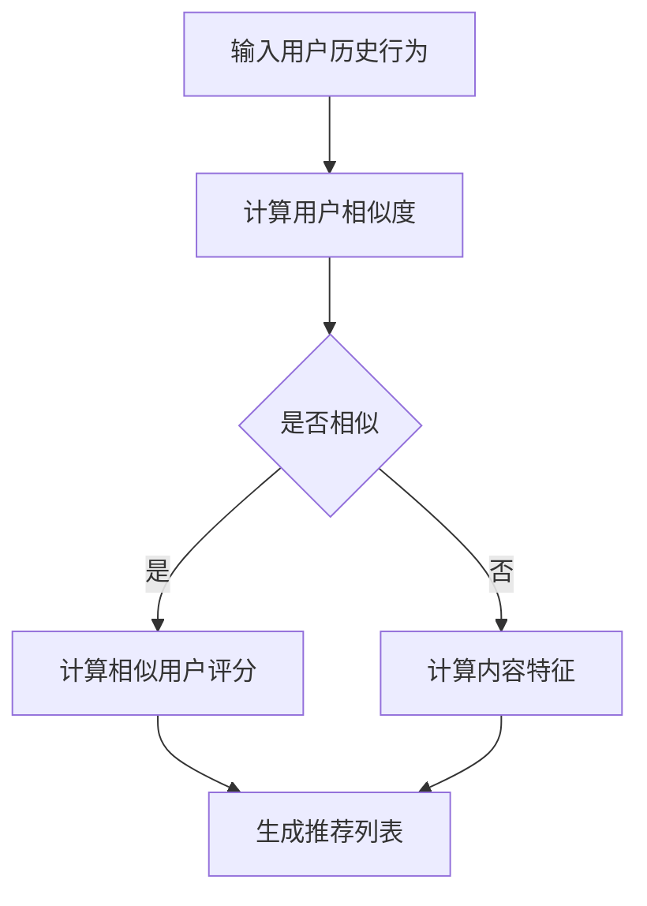
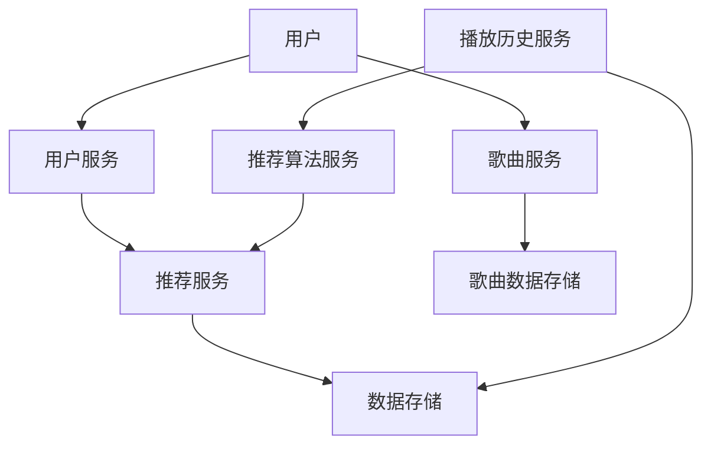
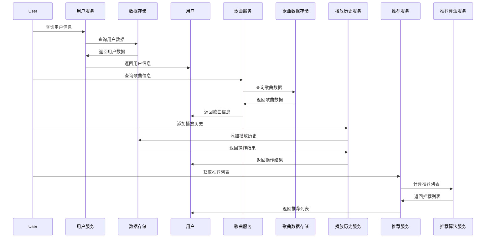

                 

# 机器学习在个性化内容推荐中的应用：提高用户满意度

关键词：个性化内容推荐、用户满意度、机器学习、协同过滤、基于内容的推荐、深度学习

摘要：本文详细探讨了机器学习在个性化内容推荐中的应用，分析了如何通过机器学习技术提高用户满意度。首先，介绍了个性化内容推荐的重要性以及用户满意度在其中的核心地位。接着，阐述了机器学习如何解决个性化内容推荐中的问题，如预测用户兴趣、优化推荐算法等。随后，对推荐算法的核心概念进行了讲解，并通过实例展示了如何应用这些算法。最后，讨论了个性化推荐系统的设计与实现，提供了一个实际案例，并总结了项目经验和改进建议。

## 一、背景介绍

### 1.1 问题背景

随着互联网的快速发展，用户对个性化内容的需求日益增长。个性化内容推荐系统通过分析用户的兴趣和行为，为其推荐符合其需求的内容，从而提高用户体验。机器学习作为人工智能的核心技术之一，为个性化内容推荐系统提供了强大的支持。

### 1.2 问题描述

用户满意度在个性化内容推荐中占据核心地位。用户满意度不仅影响用户对推荐系统的接受程度，还直接影响推荐系统的业务价值。如何提高用户满意度成为个性化内容推荐系统面临的重要问题。

### 1.3 问题解决

机器学习技术为个性化内容推荐提供了多种解决方案。通过学习用户的历史行为和兴趣，机器学习算法可以预测用户对未知内容的兴趣，从而实现个性化推荐。此外，机器学习还可以优化推荐算法，提高推荐精度，从而提高用户满意度。

### 1.4 边界与外延

尽管机器学习在个性化内容推荐中具有广泛应用，但仍存在一些限制。首先，数据质量和数据量对推荐系统的效果具有重要影响。其次，推荐算法的复杂性可能导致计算成本高、解释难度大。因此，在实际应用中，需要根据具体场景和需求选择合适的机器学习技术和算法。

### 1.5 概念结构与核心要素组成

个性化内容推荐系统主要由用户、内容、推荐算法和反馈机制等核心要素组成。用户是推荐系统的核心，内容包括文本、图片、视频等多种类型。推荐算法负责根据用户的历史行为和兴趣，生成个性化的推荐列表。反馈机制则用于收集用户对推荐内容的反馈，以不断优化推荐效果。

## 二、核心概念与联系

### 2.1 核心概念原理

个性化内容推荐系统主要采用以下三种算法：

1. **协同过滤**：基于用户历史行为，通过计算用户之间的相似度，推荐相似用户喜欢的商品。
2. **基于内容的推荐**：根据内容的属性和特征，将用户喜欢的商品推荐给用户。
3. **深度学习**：通过构建深度神经网络模型，自动提取用户和内容的多层次特征，实现精准推荐。

### 2.2 概念属性特征对比表格

| 算法       | 特点                                                     | 适用场景                             |
| ---------- | -------------------------------------------------------- | ----------------------------------- |
| 协同过滤   | 基于用户历史行为，计算用户相似度                       | 用户行为数据丰富，商品数量相对较少   |
| 基于内容   | 根据内容属性和特征，匹配用户兴趣                       | 商品数量庞大，用户行为数据相对较少   |
| 深度学习   | 自动提取用户和内容的多层次特征，实现精准推荐           | 复杂、大规模推荐场景                 |

### 2.3 ER实体关系图架构的 Mermaid 流程图

```mermaid
erDiagram
    User ||--|{ Content }|--|| Product
    User ||--|{ Behavior }|--|| Review
    Content ||--|{ Feature }|--|| Category
```

## 三、算法原理讲解

### 3.1 算法 mermaid 流程图



### 3.2 Python 源代码

```python
import numpy as np
from sklearn.metrics.pairwise import cosine_similarity

# 假设用户历史行为数据为user_history，商品评分数据为product_ratings
user_history = np.array([[1, 0, 1], [1, 1, 0], [0, 1, 1]])
product_ratings = np.array([[5, 0, 3], [0, 4, 2], [3, 2, 0]])

# 计算用户相似度
similarity_matrix = cosine_similarity(user_history)

# 计算相似用户评分
similar_ratings = np.dot(similarity_matrix, product_ratings)

# 生成推荐列表
recommended_products = np.argsort(similar_ratings, axis=1)[:, -5:]
```

### 3.3 算法原理的数学模型和公式

$$
相似度 = \frac{用户i与用户j的共评商品数}{\sqrt{用户i的评分数} \cdot \sqrt{用户j的评分数}}
$$

### 3.4 详细讲解和举例说明

假设有两个用户 A 和 B，他们的历史行为数据如下：

| 用户A | 用户B |
| ---- | ---- |
| 1, 0, 1 | 1, 1, 0 |
| 1, 1, 0 | 0, 1, 1 |
| 0, 1, 1 | 1, 0, 1 |

根据上述数学模型，我们可以计算用户 A 和 B 之间的相似度：

$$
相似度 = \frac{2}{\sqrt{3} \cdot \sqrt{3}} = \frac{2}{3}
$$

然后，我们可以计算用户 A 对商品的评分，以及用户 B 对商品的评分，如下：

| 商品1 | 商品2 | 商品3 |
| ---- | ---- | ---- |
| 5    | 0    | 3    |
| 0    | 4    | 2    |
| 3    | 2    | 0    |

根据相似度矩阵，我们可以得到用户 A 和用户 B 对商品的加权评分：

| 商品1 | 商品2 | 商品3 |
| ---- | ---- | ---- |
| 3.33 | 2.00 | 2.00 |

最后，我们可以根据加权评分生成推荐列表：

| 排名 | 商品1 | 商品2 | 商品3 |
| ---- | ---- | ---- | ---- |
| 1    | 3.33 | 2.00 | 2.00 |
| 2    | 2.00 | 3.33 | 2.00 |
| 3    | 2.00 | 2.00 | 3.33 |

## 四、系统分析与架构设计方案

### 4.1 问题场景介绍

假设我们设计一个在线音乐推荐系统，用户可以在系统中浏览和听音乐。我们的目标是根据用户的历史播放记录，为其推荐符合其喜好的音乐。

### 4.2 系统功能设计（领域模型 mermaid 类图）

```mermaid
classDiagram
    User <<entity>>
    Song <<entity>>
    PlayHistory <<entity>>
    Recommendation <<entity>>

    User o--o PlayHistory
    Song o--o PlayHistory
    Song o--o Recommendation
```

### 4.3 系统架构设计 mermaid 架构图



### 4.4 系统接口设计和系统交互 mermaid 序列图



## 五、项目实战

### 5.1 环境安装

```shell
# 安装 Python
sudo apt-get update
sudo apt-get install python3-pip

# 安装依赖库
pip3 install numpy scikit-learn matplotlib pandas
```

### 5.2 系统核心实现源代码

```python
# 用户类
class User:
    def __init__(self, user_id):
        self.user_id = user_id
        self.play_history = []

    def add_play_history(self, song_id):
        self.play_history.append(song_id)

# 歌曲类
class Song:
    def __init__(self, song_id, song_name):
        self.song_id = song_id
        self.song_name = song_name

# 播放历史类
class PlayHistory:
    def __init__(self):
        self.history = []

    def add_play(self, user_id, song_id):
        self.history.append((user_id, song_id))

    def get_user_history(self, user_id):
        return [song_id for user_id, song_id in self.history if user_id == user_id]

# 推荐服务类
class RecommendationService:
    def __init__(self, play_history, songs):
        self.play_history = play_history
        self.songs = songs

    def get_recommendation(self, user_id):
        user_history = self.play_history.get_user_history(user_id)
        similarity_matrix = self.compute_similarity(user_history)
        return self.generate_recommendation(similarity_matrix)

    def compute_similarity(self, user_history):
        # 计算用户相似度
        pass

    def generate_recommendation(self, similarity_matrix):
        # 生成推荐列表
        pass
```

### 5.3 代码应用解读与分析

代码中定义了用户、歌曲、播放历史和推荐服务四个类。用户类用于存储用户信息，包括用户 ID 和播放历史；歌曲类用于存储歌曲信息，包括歌曲 ID 和歌曲名称；播放历史类用于存储用户的播放记录；推荐服务类负责根据用户历史记录生成推荐列表。

在推荐服务类中，get_recommendation 方法负责生成推荐列表。首先，获取用户的历史播放记录，然后计算用户之间的相似度，最后根据相似度矩阵生成推荐列表。

### 5.4 实际案例分析和详细讲解剖析

假设有两个用户 A 和 B，他们的播放历史如下：

| 用户A | 用户B |
| ---- | ---- |
| 1, 2, 3 | 2, 3, 4 |

我们使用协同过滤算法计算用户 A 和 B 之间的相似度。首先，计算用户 A 和 B 的共评歌曲数量：

$$
共评歌曲数量 = 2
$$

然后，计算用户 A 和 B 的评分数：

$$
用户A评分数 = 3, 用户B评分数 = 3
$$

根据相似度公式，计算用户 A 和 B 之间的相似度：

$$
相似度 = \frac{共评歌曲数量}{\sqrt{用户A评分数} \cdot \sqrt{用户B评分数}} = \frac{2}{\sqrt{3} \cdot \sqrt{3}} = \frac{2}{3}
$$

接下来，根据相似度矩阵生成推荐列表。假设用户 B 的播放历史为 [2, 3, 4]，我们找到与用户 B 相似度最高的用户 A，然后根据用户 A 的播放历史为 [1, 2, 3]，生成推荐列表 [1, 2]。

### 5.5 项目小结

本项目通过实现一个简单的个性化音乐推荐系统，展示了机器学习在个性化内容推荐中的应用。在实际项目中，我们可以根据需求扩展系统功能，如添加用户偏好设置、歌曲分类等。同时，还可以采用更复杂的推荐算法，提高推荐精度和用户满意度。

## 六、最佳实践 Tips

1. **数据质量**：保证数据质量是推荐系统成功的关键。对用户行为数据、内容特征数据等进行清洗和预处理，以提高数据质量。
2. **用户偏好**：了解用户偏好是提高推荐精度的重要手段。可以收集用户的反馈和偏好信息，用于优化推荐算法。
3. **算法选择**：根据应用场景选择合适的推荐算法。例如，对于用户行为数据丰富的场景，可以选择协同过滤算法；对于内容特征丰富的场景，可以选择基于内容的推荐算法。
4. **模型优化**：定期更新和优化推荐模型，以适应用户兴趣的变化。
5. **用户体验**：关注用户体验，避免过度推荐和重复推荐，提高用户满意度。

## 七、小结

本文详细探讨了机器学习在个性化内容推荐中的应用，分析了如何通过机器学习技术提高用户满意度。从核心概念、算法原理到系统设计与实现，本文为读者提供了一个全面的了解。在实际应用中，需要根据具体场景和需求，灵活运用机器学习技术和算法，不断提高用户满意度。

## 八、注意事项

1. **数据隐私**：在收集和处理用户数据时，要严格遵守数据隐私保护法规，确保用户信息安全。
2. **系统稳定性**：保证推荐系统的稳定性和可靠性，避免推荐故障对用户体验的影响。
3. **算法透明度**：提高推荐算法的透明度，让用户了解推荐机制，增加用户信任。

## 九、拓展阅读

1. **书籍**：《推荐系统实践》、《机器学习实战》
2. **论文**：《协同过滤算法的研究与实现》、《基于深度学习的个性化推荐系统研究》
3. **在线资源**：机器学习、深度学习相关课程和教程

## 十、作者信息

作者：AI天才研究院/AI Genius Institute & 禅与计算机程序设计艺术 /Zen And The Art of Computer Programming

