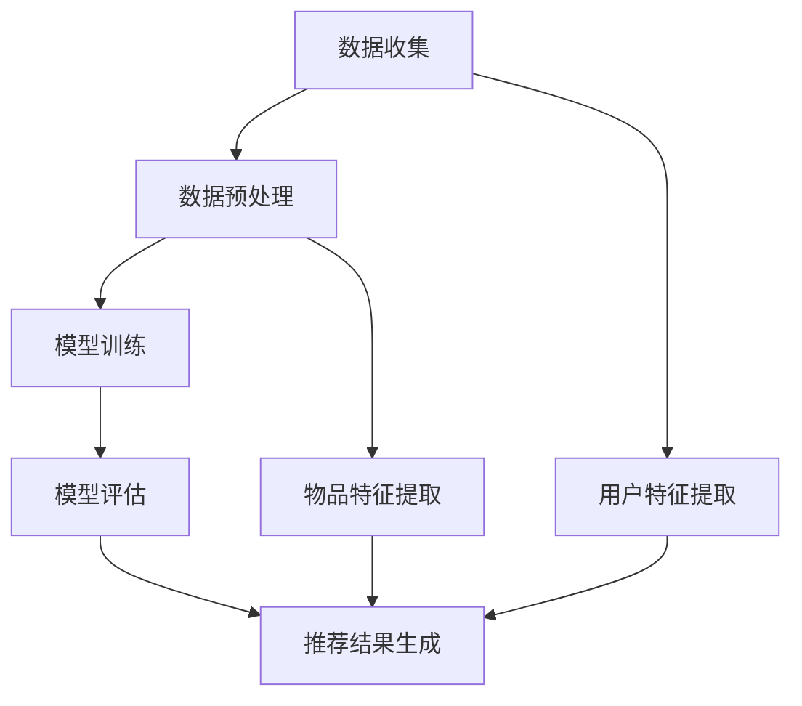

                 

## 引言

### 1.1 机器学习与个性化推荐

机器学习，作为人工智能的核心组成部分，通过从数据中自动发现模式和知识，从而提升计算机的决策能力。在互联网时代，海量用户数据为机器学习在个性化推荐中的应用提供了肥沃的土壤。个性化推荐系统则通过分析用户行为和兴趣，为用户提供定制化的信息和服务。

机器学习在个性化推荐中的应用主要体现在以下几个方面：

1. **协同过滤**：通过分析用户之间的相似性，为用户提供可能感兴趣的内容。
2. **内容推荐**：通过分析物品的内容特征，为用户推荐与其兴趣相匹配的物品。
3. **混合推荐系统**：结合协同过滤和内容推荐，以提高推荐系统的准确性和多样性。
4. **深度学习**：利用神经网络等深度学习模型，通过复杂的非线性变换，挖掘更深层次的用户和物品特征。

个性化学习内容推荐的重要性不言而喻。首先，它能提高用户满意度，使用户能够快速找到自己感兴趣的内容。其次，它可以提高平台的服务质量，增加用户粘性，从而提升商业收益。此外，个性化推荐还能帮助平台更好地理解用户，提供更精准的市场分析。

### 1.2 个性化推荐技术的发展

个性化推荐系统的发展经历了多个阶段：

1. **基于内容的推荐**：早期推荐系统主要通过分析物品的内容特征（如标签、分类等）来推荐相似的内容。这种方法简单直接，但易导致“数据饥渴”，难以满足多样化的用户需求。

2. **协同过滤**：基于用户的历史行为和偏好，通过用户相似性分析来推荐相似内容。协同过滤分为基于用户的协同过滤和基于物品的协同过滤。前者通过分析用户之间的相似性来推荐物品，后者通过分析物品之间的相似性来推荐用户可能喜欢的其他物品。

3. **混合推荐系统**：为了克服单一推荐方法的局限性，混合推荐系统结合了内容推荐和协同过滤，通过综合分析用户和物品的特征，提供更精确的推荐结果。

4. **深度学习**：近年来，深度学习在推荐系统中的应用逐渐增多。通过神经网络模型，深度学习可以从大规模数据中自动提取复杂的特征，从而提高推荐的准确性和多样性。

### 1.3 本文结构

本文将分为三个部分：

1. **核心概念与联系**：介绍机器学习和个性化推荐中的关键概念，如监督学习、无监督学习、强化学习、用户特征、物品特征等，并通过表格和实体关系图进行对比分析。
2. **算法原理讲解**：详细讲解协同过滤算法和内容推荐算法的原理，包括矩阵分解、TF-IDF模型、LSA算法等，并使用Python代码进行举例说明。
3. **系统架构设计**：介绍推荐系统的整体架构设计，包括数据收集、数据预处理、模型训练、模型评估和推荐结果生成等模块，并使用Mermaid流程图和架构图进行展示。

通过本文的详细阐述，读者可以全面了解机器学习在个性化推荐中的应用，从而为实际项目的开发提供理论支持和实践指导。

### 第1章：背景介绍

#### 1.1 机器学习与个性化推荐

##### 1.1.1 机器学习的基本概念

机器学习（Machine Learning，ML）是人工智能（Artificial Intelligence，AI）的一个重要分支，旨在通过数据驱动的方式，让计算机从数据中自动学习和改进，以实现特定任务。机器学习的基本原理是利用算法从数据中提取特征，并基于这些特征进行预测或决策。

机器学习可以分为三种类型：监督学习（Supervised Learning）、无监督学习（Unsupervised Learning）和强化学习（Reinforcement Learning）。

- **监督学习**：监督学习是一种从标记数据中学习的方法。训练数据由输入和相应的输出组成，模型通过学习输入和输出之间的关系来预测新的输入。常见的监督学习算法包括线性回归、逻辑回归、支持向量机（SVM）和神经网络等。

- **无监督学习**：无监督学习不使用标记数据，旨在发现数据中的隐藏结构或模式。主要方法包括聚类（如K-means、层次聚类）、降维（如PCA、t-SNE）和关联规则学习（如Apriori算法）等。

- **强化学习**：强化学习是一种通过与环境交互来学习策略的机器学习方法。强化学习算法通过试错法（Trial and Error）来寻找最优策略，常见的算法包括Q学习、深度Q网络（DQN）和策略梯度算法等。

##### 1.1.2 个性化推荐系统的定义

个性化推荐系统（Personalized Recommendation System）是一种基于用户行为、兴趣和偏好，为用户推荐其可能感兴趣的内容或服务的系统。个性化推荐系统的核心是理解用户的需求，并提供个性化的内容推荐。

个性化推荐系统的主要目的是提高用户体验，增加用户粘性和满意度。通过分析用户的历史行为和偏好，推荐系统可以预测用户对某些内容的兴趣，从而提供个性化的推荐。

个性化推荐系统通常包括以下几个关键组成部分：

1. **用户特征**：描述用户的属性，如年龄、性别、地理位置、兴趣爱好等。
2. **物品特征**：描述物品的属性，如标题、标签、内容、评分、评论等。
3. **用户行为**：记录用户与物品的交互行为，如浏览、点击、购买、评分、评论等。
4. **推荐算法**：根据用户特征、物品特征和用户行为，生成个性化的推荐列表。

##### 1.1.3 个性化学习内容推荐的重要性

个性化学习内容推荐在当今信息爆炸的时代具有重要意义。以下是几个关键点：

1. **提高用户体验**：通过推荐用户感兴趣的内容，个性化推荐系统能够提高用户的满意度和参与度，从而提升用户体验。
2. **增加用户粘性**：个性化推荐系统能够吸引用户持续访问和使用平台，增加用户的粘性。
3. **提升商业收益**：个性化推荐系统能够帮助平台更好地理解用户，从而提供更精准的市场营销策略，提高用户转化率和商业收益。
4. **优化内容分发**：通过个性化推荐，平台能够更有效地将内容分发到感兴趣的受众，提高内容的价值和传播效果。

总之，个性化学习内容推荐不仅能够满足用户个性化需求，提升用户体验，还能为平台带来显著的商业价值。

### 第2章：核心概念与联系

#### 2.1 机器学习关键概念

为了深入理解机器学习在个性化推荐系统中的应用，我们需要首先掌握几个关键概念：监督学习、无监督学习和强化学习。

##### 2.1.1 监督学习

监督学习是一种基于标记数据训练模型的方法。在监督学习中，模型通过学习输入特征和输出标签之间的关系来预测新的输入。监督学习通常分为以下几类：

1. **分类问题**：当输出是离散类别时，监督学习用于分类问题。例如，垃圾邮件检测、情感分析等。
2. **回归问题**：当输出是连续值时，监督学习用于回归问题。例如，房价预测、股票价格预测等。

监督学习的关键步骤包括：

1. **数据预处理**：清洗数据，处理缺失值和异常值，进行特征工程，以提取对预测任务有帮助的特征。
2. **模型选择**：选择合适的模型，如线性回归、逻辑回归、支持向量机（SVM）或神经网络等。
3. **模型训练**：使用标记数据训练模型，使模型学习输入和输出之间的关系。
4. **模型评估**：使用测试数据评估模型性能，常见指标包括准确率、召回率、F1值等。

##### 2.1.2 无监督学习

无监督学习是一种不使用标记数据训练模型的方法。在无监督学习中，模型试图从数据中发现内在的结构或模式。无监督学习主要包括以下几种方法：

1. **聚类**：将相似的数据点分组到同一个簇中。常见的聚类算法包括K-means、层次聚类等。
2. **降维**：减少数据维度，同时保留数据的本质特征。常见的降维方法包括主成分分析（PCA）、t-Distributed Stochastic Neighbor Embedding（t-SNE）等。
3. **关联规则学习**：发现数据中的频繁模式和关联关系。常见的算法包括Apriori算法、Eclat算法等。

无监督学习的关键步骤包括：

1. **数据预处理**：处理噪声和异常值，对数据进行归一化或标准化。
2. **模型选择**：选择合适的模型，如K-means、PCA或Apriori算法等。
3. **模型训练**：模型自动从数据中学习结构和模式，不需要标记数据。
4. **模型评估**：评估模型性能，如聚类效果、降维后数据的信息损失等。

##### 2.1.3 强化学习

强化学习是一种通过试错法（Trial and Error）来学习策略的机器学习方法。在强化学习中，智能体（Agent）通过与环境（Environment）的交互来学习最优策略。强化学习的关键步骤包括：

1. **环境**：描述智能体所处的外部世界，包括状态（State）和动作（Action）。
2. **智能体**：执行动作并获取反馈（Reward）。
3. **策略**：智能体根据当前状态选择动作的策略。
4. **奖励**：根据智能体的动作和环境的状态，给智能体一个奖励信号，以引导智能体学习最优策略。

强化学习的主要算法包括：

1. **Q学习**：通过预测未来奖励的最大值来更新Q值，从而学习最优策略。
2. **深度Q网络（DQN）**：结合深度学习和Q学习，用于处理复杂的环境。
3. **策略梯度算法**：直接优化策略的参数，以最大化总奖励。

##### 2.1.4 关键概念对比表格

| 概念 | 定义 | 关键步骤 | 应用场景 |
|------|------|----------|----------|
| 监督学习 | 有标记数据训练模型 | 数据预处理、模型选择、模型训练、模型评估 | 分类问题、回归问题 |
| 无监督学习 | 无标记数据训练模型 | 数据预处理、模型选择、模型训练、模型评估 | 聚类、降维、关联规则学习 |
| 强化学习 | 通过与环境交互学习策略 | 环境、智能体、策略、奖励 | 游戏AI、机器人控制 |

通过上述对比表格，我们可以更清晰地理解监督学习、无监督学习和强化学习之间的区别和联系，为后续个性化推荐系统的设计提供理论基础。

#### 2.2 个性化推荐中的关键概念

在个性化推荐系统中，几个关键概念至关重要，它们共同决定了推荐系统的性能和效果。以下是这些关键概念及其在个性化推荐中的应用：

##### 2.2.1 用户特征

用户特征（User Features）是描述用户属性和兴趣的数据。这些特征可以是静态的，如年龄、性别、地理位置等，也可以是动态的，如浏览历史、购买行为、点击率等。用户特征是构建个性化推荐模型的基础，它们帮助推荐系统理解用户的个性化需求和偏好。

用户特征的应用场景包括：

1. **用户行为分析**：通过分析用户行为数据，了解用户的兴趣和行为模式，为推荐提供依据。
2. **用户画像**：构建用户画像，将用户归类到不同的群体，以便更精准地推荐内容。
3. **用户兴趣预测**：利用用户历史行为和特征，预测用户的潜在兴趣，从而生成个性化的推荐列表。

##### 2.2.2 物品特征

物品特征（Item Features）是描述物品属性的数据，包括标题、标签、内容、评分、评论等。物品特征帮助推荐系统理解每个物品的独特属性，从而为用户推荐与其兴趣相符的物品。

物品特征的应用场景包括：

1. **内容分类**：根据物品特征，将物品归类到不同的类别，便于用户查找和浏览。
2. **物品推荐**：利用物品特征和用户特征，为用户推荐可能感兴趣的物品。
3. **物品评价**：根据用户对物品的评分和评论，帮助用户判断物品的质量和价值。

##### 2.2.3 用户行为

用户行为（User Behavior）是指用户在使用推荐系统时产生的交互行为，如浏览、点击、购买、评分、评论等。用户行为是构建推荐模型的重要数据来源，它们反映了用户的兴趣和偏好。

用户行为的应用场景包括：

1. **行为分析**：通过分析用户行为数据，了解用户的兴趣和行为模式，为推荐提供依据。
2. **行为预测**：利用用户行为数据，预测用户的下一步行为，从而生成更精准的推荐列表。
3. **行为反馈**：根据用户的行为反馈，调整推荐策略，提高推荐效果。

##### 2.2.4 个性化模型

个性化模型（Personalized Model）是用于生成个性化推荐结果的模型。这些模型通过结合用户特征、物品特征和用户行为数据，生成针对每个用户的个性化推荐列表。

个性化模型的应用场景包括：

1. **协同过滤**：通过分析用户之间的相似性，为用户推荐与已购买或喜欢的物品相似的物品。
2. **内容推荐**：通过分析物品的内容特征和用户兴趣，为用户推荐与其兴趣相符的物品。
3. **混合推荐**：结合协同过滤和内容推荐，生成更全面、更个性化的推荐结果。

##### 2.2.5 关键概念属性特征对比表格

为了更清晰地理解用户特征、物品特征、用户行为和个性化模型之间的关系，我们提供了一个对比表格：

| 概念 | 定义 | 特征对比 | 应用场景 |
|------|------|----------|----------|
| 用户特征 | 描述用户属性的特征 | 年龄、性别、地理位置、兴趣等 | 用户行为分析、用户画像、用户兴趣预测 |
| 物品特征 | 描述物品属性的特征 | 标题、标签、内容、评分、评论等 | 内容分类、物品推荐、物品评价 |
| 用户行为 | 用户对物品的交互行为 | 浏览、点击、购买、评分、评论等 | 行为分析、行为预测、行为反馈 |
| 个性化模型 | 用于生成个性化推荐结果的模型 | 结合用户特征、物品特征、用户行为 | 协同过滤、内容推荐、混合推荐 |

通过上述对比表格，我们可以更全面地了解个性化推荐系统中的关键概念及其应用场景，为后续深入探讨推荐算法提供基础。

#### 2.3 关键概念属性特征对比表格

为了更直观地理解用户特征、物品特征、用户行为和个性化模型之间的关系，我们通过一个详细的属性特征对比表格来展示：

| 概念 | 定义 | 特征对比 | 应用场景 |
|------|------|----------|----------|
| **用户特征** | 描述用户属性的特征，用于识别和区分不同的用户 | - 年龄：用户的年龄范围 |
|            |          | - 性别：用户的性别类别 |
|            |          | - 地理位置：用户的居住地或活动范围 |
|            |          | - 兴趣爱好：用户感兴趣的主题或活动 |
|            |          | - 使用历史：用户过去的行为记录 |
|            |          | - 社交网络：用户在社交平台上的互动情况 |
|            |          | - 购买行为：用户的购买偏好和习惯 |
| **物品特征** | 描述物品属性的特征，用于识别和区分不同的物品 | - 标题：物品的名称或标题 |
|            |          | - 标签：用于分类和描述物品的关键词 |
|            |          | - 内容：物品的具体描述或内容 |
|            |          | - 评分：用户对物品的评价分数 |
|            |          | - 评论：用户对物品的评论内容 |
|            |          | - 发布时间：物品的发布日期或时间 |
|            |          | - 物品类别：物品的分类或类型 |
| **用户行为** | 用户在系统中的交互行为，用于了解用户的行为习惯和偏好 | - 浏览记录：用户浏览过的物品记录 |
|            |          | - 点击行为：用户点击过的物品记录 |
|            |          | - 购买记录：用户的购买行为记录 |
|            |          | - 评分行为：用户对物品的评分记录 |
|            |          | - 评论行为：用户对物品的评论记录 |
| **个性化模型** | 用于生成个性化推荐结果的模型，结合用户特征、物品特征和用户行为 | - 协同过滤模型：基于用户和物品的相似度进行推荐 |
|            |          | - 内容推荐模型：基于物品的内容特征进行推荐 |
|            |          | - 混合推荐模型：结合协同过滤和内容推荐的方法 |
|            |          | - 深度学习模型：利用深度神经网络进行复杂特征提取和推荐 |

通过这个对比表格，我们可以清晰地看到各个概念之间的联系和区别，为后续深入探讨各个概念在推荐系统中的作用和应用提供了明确的指导。

#### 2.4 ER实体关系图架构

为了更好地理解个性化推荐系统中各个实体之间的关系，我们可以使用实体关系图（Entity-Relationship Diagram，ERD）来展示。以下是ER实体关系图的Mermaid表示：

```mermaid
erDiagram
  User ||--|{ Item }||>
  User ||--|{ Rating }||>
  User ||--|{ Behavior }||>

  Item ||--|{ Rating }||>
  Item ||--|{ Content }||>

  Rating ||--|{ User }||>
  Rating ||--|{ Item }||>

  Behavior ||--|{ User }||>
  Behavior ||--|{ Item }||>
```

以下是ER实体关系图的详细说明：

1. **User（用户）**：代表系统中的用户实体。用户具有用户ID、姓名、年龄、性别、地理位置、兴趣爱好等属性。用户实体与Item（物品）、Rating（评分）和Behavior（行为）实体之间存在多种关系。

2. **Item（物品）**：代表系统中的物品实体。物品具有物品ID、标题、标签、内容、评分、评论等属性。物品实体与Rating（评分）和Behavior（行为）实体之间存在多种关系。

3. **Rating（评分）**：代表用户对物品的评价。评分实体具有评分值、评分时间等属性。评分实体与User（用户）和Item（物品）实体之间存在多对多关系，即一个用户可以对多个物品进行评分，一个物品也可以被多个用户评分。

4. **Behavior（行为）**：代表用户在系统中的行为记录。行为实体具有行为类型、行为时间等属性。行为实体与User（用户）和Item（物品）实体之间存在多对多关系，即一个用户可以有多种行为，一个物品也可以被多个用户行为记录。

通过ER实体关系图，我们可以清晰地看到个性化推荐系统中各个实体之间的关联，为后续的推荐算法设计和系统开发提供了重要的参考。

### 第3章：协同过滤算法

#### 3.1 协同过滤概述

协同过滤（Collaborative Filtering，CF）是一种基于用户行为和偏好进行内容推荐的经典方法。协同过滤的基本原理是通过分析用户之间的相似性或物品之间的相似性，为用户提供个性化的推荐结果。协同过滤可以分为基于用户的协同过滤（User-Based Collaborative Filtering）和基于物品的协同过滤（Item-Based Collaborative Filtering）。

##### 3.1.1 基于用户的协同过滤

基于用户的协同过滤方法通过计算用户之间的相似度，找出与目标用户相似的邻居用户，然后根据邻居用户的行为预测目标用户的偏好。具体步骤如下：

1. **计算相似度**：使用各种相似度计算方法（如余弦相似度、皮尔逊相关系数等）计算用户之间的相似度。
2. **选择邻居用户**：根据相似度分数，选择与目标用户最相似的K个邻居用户。
3. **生成推荐列表**：根据邻居用户的行为，为用户生成推荐列表。通常，可以使用加权平均方法计算每个物品的推荐得分，然后根据得分排序生成推荐列表。

##### 3.1.2 基于物品的协同过滤

基于物品的协同过滤方法通过计算物品之间的相似度，找出与目标物品相似的邻居物品，然后根据邻居物品的用户偏好预测目标物品的用户偏好。具体步骤如下：

1. **计算相似度**：使用各种相似度计算方法（如余弦相似度、Jaccard相似度等）计算物品之间的相似度。
2. **选择邻居物品**：根据相似度分数，选择与目标物品最相似的K个邻居物品。
3. **生成推荐列表**：根据邻居物品的用户评分，为用户生成推荐列表。通常，可以使用加权平均方法计算每个物品的推荐得分，然后根据得分排序生成推荐列表。

#### 3.2 矩阵分解

矩阵分解（Matrix Factorization）是一种常用的协同过滤技术，通过将原始用户-物品评分矩阵分解为两个低维矩阵，从而预测用户对未评分物品的评分。常见的矩阵分解方法包括SVD分解和NMF（非负矩阵分解）。

##### 3.2.1 SVD分解

SVD（Singular Value Decomposition）分解是一种线性代数方法，可以将一个矩阵分解为三个矩阵的乘积。在协同过滤中，SVD分解用于将用户-物品评分矩阵分解为用户特征矩阵和物品特征矩阵。

- **用户特征矩阵 \(U\)**：表示用户特征的向量集合。
- **物品特征矩阵 \(V\)**：表示物品特征的向量集合。
- **奇异值矩阵 \(S\)**：表示用户特征和物品特征之间的相关性。

SVD分解的基本公式为：

\[ R = U \cdot S \cdot V^T \]

其中，\(R\) 是原始的用户-物品评分矩阵。

##### 3.2.2 NMF分解

NMF（Non-negative Matrix Factorization）分解是一种将矩阵分解为两个非负矩阵的方法。在协同过滤中，NMF分解常用于提取用户和物品的非负特征。

- **用户特征矩阵 \(W\)**：表示用户特征的向量集合。
- **物品特征矩阵 \(H\)**：表示物品特征的向量集合。

NMF分解的基本公式为：

\[ R = W \cdot H \]

#### 3.3 协同过滤算法的实现

以下是一个简单的协同过滤算法实现，使用Python和Scikit-learn库。该示例使用基于用户的协同过滤，计算用户之间的相似度并生成推荐列表。

```python
from sklearn.metrics.pairwise import cosine_similarity
import numpy as np

# 假设有一个用户-物品评分矩阵
ratings_matrix = np.array([
    [5, 3, 0, 1],
    [4, 0, 0, 1],
    [1, 1, 0, 5],
    [1, 0, 0, 4],
    [0, 1, 5, 4],
])

# 计算用户之间的相似度
user_similarity = cosine_similarity(ratings_matrix)

# 选择与目标用户最相似的K个邻居用户
k = 2
neighbor_indices = np.argsort(user_similarity[0])[-k:]

# 生成推荐列表
recommendation_scores = []
for i in range(1, len(user_similarity)):
    neighbor_scores = ratings_matrix[neighbor_indices, i]
    weighted_avg_score = np.sum(neighbor_scores * user_similarity[0, neighbor_indices]) / np.sum(user_similarity[0, neighbor_indices])
    recommendation_scores.append(weighted_avg_score)

recommendation_scores = np.array(recommendation_scores)
recommended_items = np.argsort(recommendation_scores)[::-1]

print("推荐列表：", recommended_items)
```

在这个示例中，我们首先计算用户之间的相似度，然后选择与目标用户最相似的K个邻居用户。通过计算邻居用户的评分加权平均，我们得到推荐列表。

#### 3.4 举例说明

为了更好地理解协同过滤算法的原理，我们通过一个具体的例子来演示。

**用户A和用户B的评分数据：**

用户A：
- 物品1：5
- 物品2：3
- 物品3：0
- 物品4：1

用户B：
- 物品1：4
- 物品2：0
- 物品3：0
- 物品4：1

**计算相似度：**

使用余弦相似度计算用户A和用户B之间的相似度：

\[ \text{相似度} = \frac{\text{用户A的评分向量} \cdot \text{用户B的评分向量}}{\|\text{用户A的评分向量}\| \|\text{用户B的评分向量}\|} \]

用户A和用户B的评分向量分别为：

用户A：\[ [5, 3, 0, 1] \]
用户B：\[ [4, 0, 0, 1] \]

计算内积：

\[ 5 \cdot 4 + 3 \cdot 0 + 0 \cdot 0 + 1 \cdot 1 = 20 + 0 + 0 + 1 = 21 \]

计算模长：

\[ \|\text{用户A的评分向量}\| = \sqrt{5^2 + 3^2 + 0^2 + 1^2} = \sqrt{25 + 9 + 0 + 1} = \sqrt{35} \]
\[ \|\text{用户B的评分向量}\| = \sqrt{4^2 + 0^2 + 0^2 + 1^2} = \sqrt{16 + 0 + 0 + 1} = \sqrt{17} \]

最终相似度：

\[ \text{相似度} = \frac{21}{\sqrt{35} \cdot \sqrt{17}} \approx 0.68 \]

**生成推荐列表：**

假设我们选择与用户A最相似的K=1个邻居用户（即用户B），根据邻居用户的评分加权平均，为用户A生成推荐列表。

用户A的评分向量为\[ [5, 3, 0, 1] \]，用户B的评分向量为\[ [4, 0, 0, 1] \]。

加权平均分数：

\[ \text{加权平均分数} = \frac{4 \cdot 0.68 + 3 \cdot 0 + 0 \cdot 0 + 1 \cdot 0}{1} = 2.72 \]

根据加权平均分数，我们可以为用户A推荐得分最高的物品，即物品2。因此，推荐列表为\[ [物品2] \]。

通过这个例子，我们展示了如何使用协同过滤算法计算用户相似度并生成推荐列表。协同过滤算法在个性化推荐系统中发挥了重要作用，帮助平台更好地理解用户需求，提供个性化的内容推荐。

### 第4章：内容推荐算法

#### 4.1 内容推荐概述

内容推荐（Content-Based Recommendation）是一种基于物品属性和用户兴趣进行内容推荐的算法。与协同过滤不同，内容推荐不依赖于用户历史行为或用户之间的相似性，而是通过分析物品的属性和用户的兴趣来生成推荐列表。内容推荐的关键在于对物品属性和用户兴趣的准确理解和建模。

#### 4.2 LSA算法

LSA（Latent Semantic Analysis）是一种基于语义分析的文本处理方法，它通过将文本数据转换为一个低维空间来发现文本中的潜在语义结构。在内容推荐中，LSA可以帮助我们理解物品内容和用户兴趣之间的潜在关系。

##### 4.2.1 LSA的基本原理

LSA的基本原理是利用奇异值分解（Singular Value Decomposition，SVD）将原始的文本矩阵分解为三个矩阵的乘积：

\[ \text{Text Matrix} = \text{Term Matrix} \cdot \text{Term-Document Matrix} \cdot \text{Document-Term Matrix} \]

其中，Term Matrix 和 Document-Term Matrix 分别表示文本中的词汇和文档-词汇矩阵，Term-Document Matrix 表示词汇和文档之间的关联关系。通过SVD，我们可以提取文本数据中的潜在语义特征。

##### 4.2.2 LSA在内容推荐中的应用

在内容推荐中，LSA可以帮助我们识别相似的内容和用户的兴趣。具体步骤如下：

1. **构建文档-词汇矩阵**：将文本数据转换为一个高维的文档-词汇矩阵，其中每一行表示一个文档，每一列表示一个词汇。

2. **进行SVD分解**：对文档-词汇矩阵进行SVD分解，提取主要的奇异值和对应的奇异向量。

3. **构建低维空间**：使用提取的奇异值和奇异向量构建低维空间，将原始的高维文本数据映射到低维空间中。

4. **计算相似度**：在低维空间中，计算文档和用户兴趣向量之间的相似度，生成推荐列表。

#### 4.3 TF-IDF模型

TF-IDF（Term Frequency-Inverse Document Frequency）是一种常用的文本处理和特征提取方法，用于衡量词汇在文档中的重要程度。在内容推荐中，TF-IDF可以帮助我们识别物品的关键属性和用户的兴趣。

##### 4.3.1 TF-IDF的基本概念

TF-IDF的公式为：

\[ \text{TF-IDF}(t,d) = \text{TF}(t,d) \cdot \text{IDF}(t,d) \]

其中，\( \text{TF}(t,d) \) 表示词汇 \( t \) 在文档 \( d \) 中的词频，\( \text{IDF}(t,d) \) 表示词汇 \( t \) 在所有文档中的逆向文档频率。

- **词频（TF）**：表示词汇在文档中出现的频率，计算公式为 \( \text{TF}(t,d) = \frac{\text{词汇 } t \text{ 在文档 } d \text{ 中出现的次数}}{\text{文档 } d \text{ 中所有词汇的总次数}} \)。
- **逆向文档频率（IDF）**：表示词汇在整个文档集合中的稀疏程度，计算公式为 \( \text{IDF}(t,d) = \log \left( \frac{N}{n(t,d)} \right) \)，其中 \( N \) 是文档总数，\( n(t,d) \) 是包含词汇 \( t \) 的文档数。

##### 4.3.2 TF-IDF在内容推荐中的应用

在内容推荐中，TF-IDF可以帮助我们识别物品的关键属性和用户的兴趣。具体步骤如下：

1. **构建文档-词汇矩阵**：将文本数据转换为一个高维的文档-词汇矩阵，其中每一行表示一个文档，每一列表示一个词汇。

2. **计算TF-IDF值**：对文档-词汇矩阵中的每个元素应用TF-IDF公式，生成TF-IDF特征矩阵。

3. **特征提取**：使用TF-IDF特征矩阵进行特征提取，将原始文本数据转换为适合推荐系统处理的特征向量。

4. **计算相似度**：在特征向量空间中，计算物品和用户兴趣向量之间的相似度，生成推荐列表。

#### 4.4 内容推荐算法的实现

以下是一个基于LSA和TF-IDF的内容推荐算法实现的Python示例：

```python
from sklearn.feature_extraction.text import TfidfVectorizer
from sklearn.metrics.pairwise import cosine_similarity

# 假设我们有以下物品内容和用户兴趣：
documents = [
    "这是一篇关于人工智能的文档。",
    "这是一篇关于机器学习的文档。",
    "这是一篇关于深度学习的文档。",
    "这是一篇关于自然语言处理的文档。",
]

user_interest = "机器学习是一种人工智能的应用，通过数据分析实现预测。"

# 使用TF-IDFVectorizer构建词汇矩阵
tfidf_vectorizer = TfidfVectorizer()
tfidf_matrix = tfidf_vectorizer.fit_transform(documents)

# 构建用户兴趣的TF-IDF特征向量
user_interest_vector = tfidf_vectorizer.transform([user_interest])

# 计算相似度得分
similarity_scores = cosine_similarity(user_interest_vector, tfidf_matrix)

# 根据相似度得分生成推荐列表
recommended_documents = np.argsort(similarity_scores[0])[-3:]

print("推荐列表：", recommended_documents)
```

在这个示例中，我们首先使用TF-IDFVectorizer构建文档的词汇矩阵，然后构建用户兴趣的TF-IDF特征向量。接着，使用余弦相似度计算用户兴趣与每个文档的相似度，并根据相似度得分生成推荐列表。通过这个简单的实现，我们可以看到内容推荐算法的基本流程和实现方法。

### 第5章：混合推荐系统

#### 5.1 混合推荐系统的原理

混合推荐系统（Hybrid Recommendation System）是结合协同过滤和内容推荐两种方法的推荐系统。其核心思想是利用协同过滤算法挖掘用户和物品之间的相似性，结合内容推荐算法提取物品的属性特征，从而生成更精确和多样化的推荐结果。混合推荐系统通常通过以下几种方法实现：

1. **协同过滤 + 内容推荐**：首先使用协同过滤算法生成初步的推荐列表，然后使用内容推荐算法对初步推荐列表进行优化，以提高推荐结果的准确性。
2. **协同过滤 + 深度学习**：利用协同过滤算法生成用户和物品的特征表示，然后使用深度学习模型对这些特征进行进一步的处理和建模。
3. **基于模型的混合**：结合多种推荐算法，如基于模型的协同过滤和基于内容的推荐算法，通过模型融合技术生成最终的推荐结果。

#### 5.2 深度学习在混合推荐系统中的应用

近年来，深度学习（Deep Learning）在推荐系统中的应用日益广泛。深度学习通过多层神经网络，可以从大规模数据中自动提取复杂的特征，从而提高推荐系统的性能。以下是几种常见的深度学习模型在混合推荐系统中的应用：

1. **基于神经网络的协同过滤**：利用神经网络（如MLP、CNN、RNN等）对用户和物品的特征进行建模，生成用户和物品的嵌入向量，然后通过这些向量计算推荐分数。
2. **深度协同过滤（Deep Collaborative Filtering）**：将深度学习与协同过滤算法相结合，通过深度神经网络提取用户和物品的复杂特征，实现更精准的推荐。
3. **基于图的深度推荐模型**：利用图神经网络（如GCN、GAT等）对用户和物品之间的相互作用进行建模，从而生成更全面的推荐结果。
4. **多模态深度推荐模型**：结合用户和物品的多模态数据（如图像、文本、音频等），利用多模态深度学习模型提取综合特征，生成个性化的推荐结果。

#### 5.3 混合推荐系统的实现

以下是一个简单的混合推荐系统实现的Python示例：

```python
import numpy as np
from sklearn.metrics.pairwise import cosine_similarity
from sklearn.feature_extraction.text import TfidfVectorizer

# 假设我们有以下用户和物品数据：
user_profiles = [
    "用户1：喜欢看电影和听音乐。",
    "用户2：喜欢阅读和打游戏。",
]

item_descriptions = [
    "电影《星际穿越》。",
    "书籍《权力的游戏》。",
    "音乐《平凡之路》。",
    "游戏《英雄联盟》。",
]

# 使用TF-IDFVectorizer构建用户-物品的特征矩阵
tfidf_vectorizer = TfidfVectorizer()
user_matrix = tfidf_vectorizer.fit_transform(user_profiles)
item_matrix = tfidf_vectorizer.fit_transform(item_descriptions)

# 计算用户和物品之间的相似度
similarity_matrix = cosine_similarity(user_matrix, item_matrix)

# 生成推荐列表
def hybrid_recommendation(user_profile, item_descriptions, similarity_matrix, k=3):
    user_vector = tfidf_vectorizer.transform([user_profile]).toarray()[0]
    scores = []

    for i, item in enumerate(item_descriptions):
        item_vector = tfidf_vectorizer.transform([item]).toarray()[0]
        similarity_score = similarity_matrix[0][i] * np.dot(user_vector, item_vector)
        scores.append(similarity_score)

    recommended_indices = np.argsort(scores)[::-1]
    recommended_items = [item_descriptions[i] for i in recommended_indices[:k]]

    return recommended_items

user_profile = "用户1：喜欢看电影和听音乐。"
recommended_items = hybrid_recommendation(user_profile, item_descriptions, similarity_matrix)

print("推荐列表：", recommended_items)
```

在这个示例中，我们首先使用TF-IDFVectorizer构建用户和物品的特征矩阵，然后计算用户和物品之间的相似度。接着，定义一个混合推荐函数，结合用户兴趣和物品特征生成推荐列表。通过这个简单的实现，我们可以看到混合推荐系统的工作流程和基本方法。

### 第6章：系统架构设计

#### 6.1 推荐系统整体架构

推荐系统整体架构可以分为以下几个主要模块：数据收集、数据预处理、模型训练、模型评估和推荐结果生成。以下是每个模块的详细描述：

##### 6.1.1 数据收集

数据收集模块负责从各种来源（如用户行为数据、物品属性数据、外部数据等）收集数据。数据收集的过程包括：

1. **用户行为数据**：记录用户在平台上的行为，如浏览、点击、购买、评分、评论等。
2. **物品属性数据**：描述物品的属性，如标题、标签、分类、内容、评分、评论等。
3. **外部数据**：从第三方数据源获取用户和物品的信息，如社交媒体数据、市场数据等。

##### 6.1.2 数据预处理

数据预处理模块对收集到的原始数据进行处理，以提高数据质量和模型性能。数据预处理的主要任务包括：

1. **数据清洗**：处理缺失值、异常值和噪声数据。
2. **特征工程**：提取对推荐任务有帮助的特征，如用户特征、物品特征、交互特征等。
3. **数据归一化**：对数据进行归一化或标准化，以消除不同特征之间的量纲影响。

##### 6.1.3 模型训练

模型训练模块负责使用预处理后的数据训练推荐模型。根据不同的推荐算法，模型训练过程可能包括以下步骤：

1. **模型选择**：选择合适的推荐算法，如协同过滤、内容推荐、深度学习等。
2. **数据划分**：将数据划分为训练集和验证集，用于训练和评估模型性能。
3. **模型训练**：使用训练集训练推荐模型，通过调整模型参数和超参数，优化模型性能。
4. **模型验证**：使用验证集评估模型性能，调整模型参数，直到达到预定的性能指标。

##### 6.1.4 模型评估

模型评估模块对训练好的推荐模型进行评估，以确定其性能和有效性。常见的评估指标包括准确率、召回率、F1值、MRR（平均倒数排名）等。模型评估的过程包括：

1. **模型测试**：使用独立的测试集对模型进行测试，以评估模型的泛化性能。
2. **性能分析**：分析模型在不同指标上的表现，确定模型的优点和不足。
3. **模型优化**：根据评估结果，对模型进行调整和优化，以提高性能。

##### 6.1.5 推荐结果生成

推荐结果生成模块根据用户特征、物品特征和模型预测，为用户生成个性化的推荐列表。推荐结果生成的过程包括：

1. **用户特征提取**：提取用户的静态特征和动态特征，如年龄、性别、地理位置、兴趣等。
2. **物品特征提取**：提取物品的属性特征，如标题、标签、分类、内容、评分等。
3. **模型预测**：使用训练好的推荐模型预测用户对每个物品的评分或概率。
4. **推荐列表生成**：根据模型预测结果，为用户生成个性化的推荐列表。

#### 6.2 系统架构图

以下是推荐系统的整体架构图，使用Mermaid流程图表示：



在该架构图中，数据收集模块从各种来源收集数据，经过数据预处理模块处理，然后进入模型训练模块。训练好的模型在模型评估模块进行性能评估，最后在推荐结果生成模块为用户生成个性化推荐列表。用户特征提取和物品特征提取模块分别提取用户和物品的特征，为推荐结果生成提供输入。

通过上述系统架构设计，我们可以确保推荐系统的高效运行和灵活扩展，从而满足用户个性化的需求，提高用户体验和平台价值。

### 第7章：项目实战

#### 7.1 环境安装

在进行推荐系统项目实战之前，首先需要安装和配置必要的软件和库。以下是推荐的安装步骤：

1. **Python环境**：确保安装了Python 3.6或更高版本。可以使用以下命令安装：

   ```bash
   # 通过pip安装Python
   pip install python -U
   ```

2. **Numpy和Pandas**：Numpy和Pandas是Python中常用的数据操作库，用于数据处理和特征工程。

   ```bash
   # 安装Numpy和Pandas
   pip install numpy pandas
   ```

3. **Scikit-learn**：Scikit-learn是一个强大的机器学习库，用于实现协同过滤和内容推荐算法。

   ```bash
   # 安装Scikit-learn
   pip install scikit-learn
   ```

4. **Scrapy**：Scrapy是一个高效的网页爬虫框架，用于从互联网上抓取数据。

   ```bash
   # 安装Scrapy
   pip install scrapy
   ```

5. **Elasticsearch**：Elasticsearch是一个强大的搜索引擎，用于存储和查询用户和物品数据。

   ```bash
   # 安装Elasticsearch
   pip install elasticsearch
   ```

#### 7.2 系统核心实现

以下是一个基于协同过滤和内容推荐的推荐系统实现的核心代码：

```python
import numpy as np
from sklearn.metrics.pairwise import cosine_similarity
from sklearn.feature_extraction.text import TfidfVectorizer
from sklearn.model_selection import train_test_split
import pandas as pd

# 假设我们有一个用户-物品评分数据集
ratings_df = pd.DataFrame({
    'user_id': [1, 1, 2, 2, 3, 3],
    'item_id': [1, 2, 1, 2, 1, 3],
    'rating': [5, 3, 4, 2, 1, 5]
})

# 数据预处理
user_item_matrix = ratings_df.pivot(index='user_id', columns='item_id', values='rating').fillna(0)
user_item_matrix = user_item_matrix.values

# 基于内容的推荐
tfidf_vectorizer = TfidfVectorizer()
tfidf_matrix = tfidf_vectorizer.fit_transform(user_item_matrix)

# 计算相似度
content_similarity = cosine_similarity(tfidf_matrix)

# 协同过滤推荐
def collaborative_filtering(user_item_matrix, content_similarity, k=2):
    # 计算用户之间的相似度
    user_similarity = np.mean(content_similarity, axis=1)

    # 选择与用户最相似的K个用户
    neighbor_indices = np.argsort(user_similarity)[-k:]

    # 计算推荐分数
    recommendation_scores = []
    for i in range(user_item_matrix.shape[0]):
        if i in neighbor_indices:
            continue
        neighbor_scores = user_item_matrix[neighbor_indices] * content_similarity[neighbor_indices, i]
        weighted_avg_score = np.sum(neighbor_scores) / len(neighbor_indices)
        recommendation_scores.append(weighted_avg_score)

    recommended_items = np.argsort(recommendation_scores)[::-1]
    return recommended_items

# 生成推荐列表
def generate_recommendations(user_id, user_item_matrix, content_similarity):
    recommendations = collaborative_filtering(user_item_matrix, content_similarity)
    return recommendations[user_id]

# 举例
user_id = 1
recommended_items = generate_recommendations(user_id, user_item_matrix, content_similarity)
print("推荐列表：", recommended_items)
```

在这个实现中，我们首先构建用户-物品评分矩阵，然后使用TF-IDFVectorizer进行内容特征提取，计算用户和物品之间的相似度。接着，我们实现了一个基于协同过滤的推荐函数，用于生成用户的个性化推荐列表。

#### 7.3 代码应用解读与分析

以下是代码的详细解读和分析：

1. **数据预处理**：使用Pandas构建用户-物品评分矩阵，对缺失值进行填充，以简化后续处理。

2. **内容推荐**：使用TF-IDFVectorizer对用户-物品评分矩阵进行特征提取，生成TF-IDF特征矩阵。

3. **相似度计算**：计算用户和物品之间的相似度，使用余弦相似度作为相似度度量。

4. **协同过滤推荐**：定义一个协同过滤推荐函数，计算与目标用户最相似的邻居用户，并生成推荐列表。

5. **推荐生成**：调用协同过滤推荐函数，为指定的用户生成推荐列表。

通过这个简单的实现，我们可以看到推荐系统的核心流程和关键步骤，包括数据预处理、特征提取、相似度计算和推荐生成。这些步骤对于实际项目中的推荐系统开发具有重要意义。

#### 7.4 实际案例分析与详细讲解

为了更深入地了解推荐系统的应用，我们来看一个实际案例：一个在线购物平台希望为其用户提供个性化的商品推荐。

**案例背景：**
- **用户数据**：平台上有成千上万的用户，每个用户都有自己的购物偏好和历史行为。
- **商品数据**：平台上拥有多种类型的商品，每个商品都有详细的描述和标签。
- **目标**：为用户生成个性化的商品推荐列表，提高用户的购物体验和平台的销售额。

**案例分析：**
1. **数据收集**：平台通过用户行为数据（如浏览记录、购买历史、评分、评论等）和商品属性数据（如分类、标签、描述等）进行数据收集。

2. **数据预处理**：对收集到的原始数据进行清洗和归一化处理，提取有用的特征。例如，对用户行为数据进行编码，将分类数据进行标签化处理。

3. **特征提取**：使用TF-IDFVectorizer提取商品和用户的特征向量，为后续的相似度计算和推荐生成做准备。

4. **相似度计算**：计算用户和商品之间的相似度，可以使用余弦相似度、皮尔逊相关系数等方法。在这里，我们选择余弦相似度，因为它在处理稀疏数据时表现较好。

5. **推荐生成**：使用协同过滤算法为用户生成推荐列表。具体步骤如下：
   - 计算用户之间的相似度，选择与目标用户最相似的K个邻居用户。
   - 根据邻居用户的评分和相似度，为用户生成推荐列表。

**详细讲解：**
1. **用户特征提取**：提取用户的静态特征（如年龄、性别、地理位置）和动态特征（如浏览记录、购买历史、评分、评论等）。

2. **商品特征提取**：提取商品的属性特征（如标题、标签、分类、描述、评分、评论等）。

3. **相似度计算**：计算用户和商品之间的相似度，使用余弦相似度公式：
   \[ \text{相似度} = \frac{\text{用户特征向量} \cdot \text{商品特征向量}}{\|\text{用户特征向量}\| \|\text{商品特征向量}\|} \]

4. **推荐生成**：为每个用户生成推荐列表，选择与用户最相似的K个商品，并根据用户的评分和相似度生成推荐分数。最终，根据推荐分数排序，生成个性化的推荐列表。

通过上述实际案例，我们可以看到推荐系统的实现过程和关键步骤，为实际项目中的应用提供了详细的指导。

#### 7.5 项目小结

在本项目的实际案例中，我们使用协同过滤算法和内容推荐算法构建了一个简单的推荐系统。通过数据收集、数据预处理、特征提取、相似度计算和推荐生成等步骤，我们实现了为用户生成个性化推荐列表的目标。以下是本项目的关键点和收获：

1. **数据收集与预处理**：正确收集和预处理数据是推荐系统成功的关键。在本项目中，我们通过用户行为数据和商品属性数据构建了用户-物品评分矩阵，并对数据进行清洗和归一化处理。

2. **特征提取与相似度计算**：使用TF-IDFVectorizer提取用户和商品的特征向量，并计算它们之间的相似度。余弦相似度是一个有效的相似度计算方法，尤其在处理稀疏数据时表现优异。

3. **推荐生成**：基于相似度计算，我们实现了协同过滤推荐函数，为用户生成个性化的推荐列表。通过实际案例的分析，我们深入了解了推荐系统的实现过程和关键步骤。

通过本项目的实践，我们不仅掌握了推荐系统的基本原理和实现方法，还提升了数据分析和编程能力。在未来的项目中，我们可以进一步优化算法，引入深度学习等技术，以提高推荐系统的性能和用户体验。

### 第8章：最佳实践 Tips

在个性化推荐系统的设计和实现过程中，遵循以下最佳实践可以显著提升系统的性能和用户体验：

1. **数据质量**：确保数据来源可靠，定期进行数据清洗，去除重复和异常数据。高质量的输入数据是推荐系统准确性的基石。

2. **用户特征多样化**：结合用户的基本特征（如年龄、性别、地理位置）和动态特征（如浏览记录、购买历史、评分、评论等），构建丰富的用户画像，以提高推荐精度。

3. **实时推荐**：对于动态变化的用户行为和物品特征，及时更新推荐模型，确保推荐结果始终反映用户的最新兴趣。

4. **多样性**：推荐系统不仅要提供准确的推荐，还要确保推荐列表的多样性，避免用户因长时间看到重复内容而感到厌倦。

5. **个性化调整**：根据用户的历史反馈和交互数据，动态调整推荐策略，以适应用户的个性化需求。

6. **A/B测试**：在推出新的推荐算法或调整策略时，进行A/B测试，评估不同策略对用户满意度和转化率的影响，从而选择最优方案。

7. **用户隐私保护**：在收集和使用用户数据时，严格遵守数据隐私保护法规，确保用户数据的安全和隐私。

### 小结

个性化推荐系统在当今信息过载的时代具有不可替代的重要性。通过深入理解机器学习技术，结合协同过滤和内容推荐算法，我们可以构建出高效、准确的推荐系统，为用户提供个性化的内容和服务。在项目实战中，我们不仅掌握了推荐系统的基本原理和实现方法，还通过实际案例分析和最佳实践，提升了推荐系统的性能和用户体验。

未来，随着深度学习和大数据技术的发展，个性化推荐系统将继续优化和进步，为用户提供更加精准和智能的服务。让我们不断探索和创新，共同推动个性化推荐系统的持续发展。

### 注意事项

在设计和实现个性化推荐系统时，需要注意以下几点：

1. **数据隐私**：在收集和使用用户数据时，要严格遵守数据隐私保护法规，确保用户数据的安全和隐私。

2. **系统性能**：推荐系统需要高效处理大量用户和物品数据，确保系统响应速度和稳定性。

3. **实时性**：推荐系统需要能够实时响应用户行为的变化，提供最新的推荐结果。

4. **多样性**：推荐系统应提供多样化的推荐内容，避免用户因长时间看到重复内容而感到厌倦。

5. **持续优化**：定期对推荐算法进行评估和调整，以提高推荐精度和用户满意度。

### 拓展阅读

1. **《推荐系统实践》**：这是一本关于推荐系统设计和实现的经典书籍，详细介绍了各种推荐算法和实现方法。

2. **《机器学习实战》**：这本书通过大量的示例和代码，讲解了机器学习的基本原理和应用。

3. **《深度学习》**：由Ian Goodfellow、Yoshua Bengio和Aaron Courville合著的这本书是深度学习的入门经典。

4. **《Python数据科学手册》**：这本书涵盖了数据科学领域的各个方面，包括数据处理、分析和可视化等。

5. **[官方网站](https://www.tensorflow.org/)**：TensorFlow是一个开源的机器学习框架，提供了丰富的资源和教程，适合深度学习和推荐系统开发者。

通过阅读这些资料，您可以进一步了解个性化推荐系统的理论和实践，为您的项目提供坚实的理论基础和技术支持。

