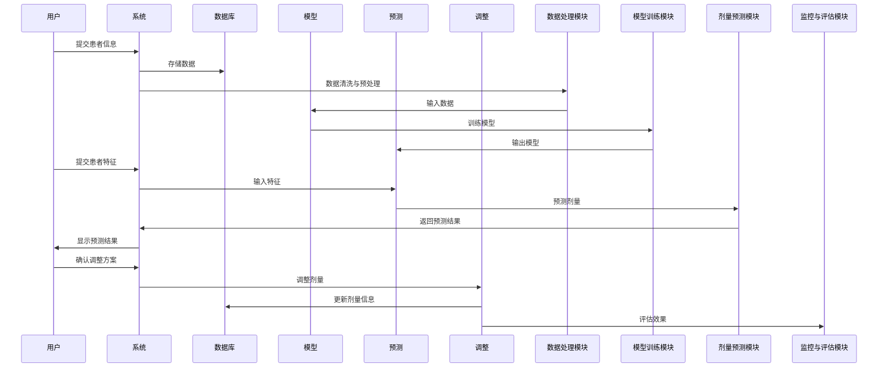

                 

### 文章标题：机器学习在个性化药物剂量调整中的应用：提高治疗效果

#### 关键词：
- 个性化药物剂量调整
- 机器学习
- 治疗效果优化
- 数据驱动方法
- 算法应用与实践

#### 摘要：
本文深入探讨了机器学习在个性化药物剂量调整中的应用，通过详细分析药物剂量调整的现状、核心概念、数据预处理、算法原理、系统架构设计以及实际应用案例，展示了如何利用机器学习技术提高治疗效果，实现药物剂量调整的精准化。本文旨在为研究人员和实践者提供一份全面的参考指南，推动个性化医疗的发展。

---

## 综述

### 1. 药物剂量调整的现状

药物剂量调整是临床医学中的一个重要环节。传统上，药物剂量主要基于药物的药理学特性、患者的体重、年龄等因素进行估算。然而，这种经验性的方法往往存在一定的局限性，无法充分考虑个体差异，导致治疗效果不一。此外，药物剂量不当还可能引发副作用，甚至危及患者生命。

#### 1.1 药物剂量调整的重要性

药物剂量调整对于确保药物治疗的有效性和安全性至关重要。合适的药物剂量能够充分发挥药物的治疗作用，同时最大限度地减少副作用。个性化药物剂量调整能够针对每个患者的具体情况进行优化，从而提高治疗效果。

#### 1.2 传统药物剂量调整的局限性

传统药物剂量调整主要依赖于以下几种方法：

1. **经验公式法**：根据患者的体重、年龄等因素使用经验公式计算药物剂量。
2. **临床经验**：医生根据临床经验判断药物的剂量。
3. **参考指南**：参考药物说明书或临床指南中的剂量建议。

这些方法存在以下局限性：

1. **个体差异**：无法充分考虑患者的个体差异，如基因、代谢差异等。
2. **缺乏数据支持**：主要依赖于经验和参考指南，缺乏科学数据支持。
3. **药物反应不确定**：对于新药或特殊人群，药物反应难以预测。

### 2. 个性化医疗的兴起

个性化医疗（Personalized Medicine）是一种以个体化为基础的医学模式，通过整合患者的遗传信息、生活方式和环境因素，制定个性化的治疗方案。个性化医疗的核心理念是“一人一方”，旨在实现治疗的最大化效果和最小化副作用。

#### 2.1 个性化医疗的概念

个性化医疗的核心概念包括：

1. **基因组学**：利用基因测序技术了解患者的遗传信息。
2. **蛋白质组学**：研究患者的蛋白质表达情况。
3. **代谢组学**：分析患者的代谢产物。
4. **临床数据**：整合患者的临床数据，包括病史、生活习惯等。

#### 2.2 个性化医疗的关键技术

个性化医疗的关键技术包括：

1. **生物信息学**：处理和分析大量的生物学数据。
2. **机器学习**：用于从数据中提取规律，进行预测和分类。
3. **精准医疗**：利用先进的医学技术，如微创手术、靶向治疗等，实现精准治疗。

### 3. 机器学习在个性化药物剂量调整中的潜在价值

机器学习在个性化药物剂量调整中具有巨大的潜力，能够通过以下方式提高治疗效果：

1. **数据驱动的剂量调整**：利用患者的大量临床数据，通过机器学习算法建立药物剂量与治疗效果之间的关联模型。
2. **个性化预测**：根据患者的具体特征，预测最合适的药物剂量。
3. **实时调整**：在患者用药过程中，根据实时监测的数据，动态调整药物剂量。

#### 3.1 机器学习的基本原理

机器学习是一种通过数据学习规律并自动化的方法。主要分为以下几种类型：

1. **监督学习**：通过已知的输入输出数据进行学习，用于预测或分类。
2. **非监督学习**：通过未标记的数据寻找规律或结构。
3. **半监督学习**：结合标记和未标记的数据进行学习。

#### 3.2 机器学习在个性化药物剂量调整中的应用场景

1. **患者特征分析**：利用机器学习分析患者的遗传信息、临床数据等，找出影响药物反应的关键因素。
2. **剂量优化**：通过模型预测最合适的药物剂量，实现个性化调整。
3. **副作用预测**：利用机器学习预测患者可能出现的副作用，提前采取预防措施。

通过上述分析，我们可以看到，机器学习在个性化药物剂量调整中具有广泛的应用前景，能够显著提高治疗效果，实现个体化医疗的目标。

### 总结

个性化药物剂量调整是临床医学中的一个重要研究方向，传统方法存在一定的局限性。个性化医疗和机器学习的兴起为药物剂量调整提供了新的思路和工具。本文通过介绍药物剂量调整的现状、个性化医疗的概念以及机器学习的基本原理，展示了机器学习在个性化药物剂量调整中的潜在价值。接下来的章节将详细探讨机器学习在个性化药物剂量调整中的应用方法和技术。

## 综述

### 1. 机器学习的基本概念

机器学习（Machine Learning）是一种使计算机系统能够从数据中学习并做出决策或预测的方法。其核心思想是通过大量的数据训练模型，使其能够自动地从数据中提取规律，并用于解决问题。机器学习主要分为以下几种类型：

#### 1.1 监督学习（Supervised Learning）

监督学习是一种从标记数据中学习的机器学习方法。标记数据是指每个数据点都带有标签或目标值。监督学习的目标是通过输入特征和对应的标签来训练模型，使得模型能够对新数据进行预测。

主要算法包括：

1. **线性回归（Linear Regression）**：通过拟合一条直线来预测目标值。
2. **逻辑回归（Logistic Regression）**：用于分类问题，通过拟合一个逻辑函数来预测概率。
3. **支持向量机（Support Vector Machine, SVM）**：用于分类和回归问题，通过寻找最优的超平面来分隔数据。

#### 1.2 非监督学习（Unsupervised Learning）

非监督学习是在没有标记数据的情况下，通过分析数据自身的结构和特征来学习。其目标通常是发现数据中的隐含结构或模式。

主要算法包括：

1. **聚类算法（Clustering Algorithms）**：如K-均值聚类（K-Means Clustering）和层次聚类（Hierarchical Clustering），用于将数据分为多个类别。
2. **主成分分析（Principal Component Analysis, PCA）**：用于降维，通过提取主要成分来简化数据。
3. **关联规则学习（Association Rule Learning）**：用于发现数据之间的关联关系，如Apriori算法。

#### 1.3 半监督学习（Semi-Supervised Learning）

半监督学习结合了监督学习和非监督学习，既利用标记数据也利用未标记数据。这种方法可以在数据标签稀缺的情况下提高学习效果。

主要算法包括：

1. **自我训练（Self-Training）**：通过初始模型预测未标记数据，然后将预测结果作为新标签进行学习。
2. **图嵌入（Graph Embedding）**：利用图结构中的未标记数据进行嵌入，从而提高模型的表示能力。

### 2. 模型评估指标

在机器学习中，模型评估是确保模型性能的重要环节。以下是一些常见的模型评估指标：

#### 2.1 回归模型评估指标

1. **均方误差（Mean Squared Error, MSE）**：预测值与真实值之差的平方的平均值。
   $$MSE = \frac{1}{n}\sum_{i=1}^{n} (\hat{y_i} - y_i)^2$$
   其中，\( \hat{y_i} \) 是预测值，\( y_i \) 是真实值。
2. **均方根误差（Root Mean Squared Error, RMSE）**：MSE的平方根。
   $$RMSE = \sqrt{MSE}$$
3. **决定系数（R-squared, R²）**：衡量模型解释变量变异的比例。
   $$R² = 1 - \frac{\sum_{i=1}^{n} (\hat{y_i} - y_i)^2}{\sum_{i=1}^{n} (y_i - \bar{y})^2}$$
   其中，\( \bar{y} \) 是真实值的平均值。

#### 2.2 分类模型评估指标

1. **准确率（Accuracy）**：正确预测的样本数占总样本数的比例。
   $$Accuracy = \frac{TP + TN}{TP + FN + FP + TN}$$
   其中，\( TP \) 是真正例，\( TN \) 是真反例，\( FP \) 是假正例，\( FN \) 是假反例。
2. **精确率（Precision）**：真正例中被正确预测为真正例的比例。
   $$Precision = \frac{TP}{TP + FP}$$
3. **召回率（Recall）**：真正例中被正确预测为真正例的比例。
   $$Recall = \frac{TP}{TP + FN}$$
4. **F1值（F1-score）**：精确率和召回率的调和平均。
   $$F1 = 2 \times \frac{Precision \times Recall}{Precision + Recall}$$

#### 2.3 混淆矩阵

混淆矩阵（Confusion Matrix）是评估分类模型性能的常用工具，它展示了实际类别和预测类别之间的关系。混淆矩阵包括以下四个元素：

1. **真正例（True Positive, TP）**：实际为正类且被正确预测为正类的样本数。
2. **假正例（False Positive, FP）**：实际为负类但被错误预测为正类的样本数。
3. **假反例（False Negative, FN）**：实际为正类但被错误预测为负类的样本数。
4. **真反例（True Negative, TN）**：实际为负类且被正确预测为负类的样本数。

### 3. 药物剂量调整中的核心概念

药物剂量调整涉及多个核心概念，包括药物剂量反应关系、药物代谢和药代动力学等。以下是对这些概念的基本介绍。

#### 3.1 药物剂量反应关系

药物剂量反应关系是指药物剂量与治疗效果或副作用之间的关系。不同的药物有不同的剂量反应特性，常见的有线性关系、抛物线关系等。

- **线性关系**：药物剂量与治疗效果呈线性增加。
- **抛物线关系**：药物剂量与治疗效果呈抛物线增加，通常在某一剂量达到最大效果。
- **非线性关系**：药物剂量与治疗效果之间不存在简单的线性或抛物线关系，可能是复杂的曲线。

#### 3.2 药物代谢和药代动力学

药物代谢是指药物在体内的化学转化过程，包括药物的吸收、分布、代谢和排泄。药物代谢过程受到多种因素的影响，如药物结构、剂量、患者的代谢酶活性等。

药代动力学（Pharmacokinetics）是研究药物在体内的动态变化过程，包括药物的吸收、分布、代谢和排泄。药代动力学参数包括：

- **半衰期（Half-Life）**：药物浓度降低到初始值一半所需的时间。
- **清除率（Clearance）**：药物从体内清除的速率。
- **表观分布容积（Apparent Distribution Volume）**：药物在体内分布的容积。
- **生物利用度（Bioavailability）**：药物从给药部位进入血液循环的比率。

### 4. 机器学习与药物剂量调整的关联

机器学习在药物剂量调整中的应用主要通过数据驱动的方法来实现。以下是一些关键步骤和方法：

#### 4.1 数据驱动的剂量调整方法

数据驱动的剂量调整方法利用大量临床数据，通过机器学习算法建立药物剂量与治疗效果之间的模型。主要步骤包括：

1. **数据收集**：收集患者的临床数据，包括药物剂量、治疗效果、副作用等。
2. **数据预处理**：清洗数据，处理缺失值，进行特征工程，将数据转化为适合机器学习模型的格式。
3. **模型选择与训练**：选择合适的机器学习算法，训练模型，并进行参数调优。
4. **模型评估与验证**：评估模型性能，包括准确性、泛化能力等。

#### 4.2 模型选择与优化

在药物剂量调整中，选择合适的机器学习模型至关重要。常用的模型包括：

1. **线性回归模型**：适用于线性关系较强的数据。
2. **支持向量机（SVM）**：适用于非线性关系的数据。
3. **随机森林（Random Forest）**：适用于复杂关系的数据，具有较好的泛化能力。
4. **神经网络（Neural Networks）**：适用于高度复杂的数据，能够模拟生物系统的非线性关系。

模型优化主要通过以下方法实现：

1. **交叉验证**：通过交叉验证评估模型性能，避免过拟合。
2. **网格搜索**：通过遍历参数空间，选择最佳参数组合。
3. **贝叶斯优化**：利用贝叶斯推理寻找最佳参数组合。

### 总结

通过上述分析，我们可以看到机器学习在个性化药物剂量调整中具有重要的应用价值。机器学习能够通过数据驱动的剂量调整方法，优化药物剂量，提高治疗效果。接下来，我们将详细探讨数据收集与预处理、算法原理讲解以及系统架构设计等内容。

## 数据收集与预处理

在机器学习应用于个性化药物剂量调整中，数据收集与预处理是关键步骤。以下是详细的数据收集与预处理流程：

### 1. 数据收集

#### 1.1 数据来源

个性化药物剂量调整所需的数据通常来源于多个渠道，包括：

1. **电子健康记录（EHR）**：包括患者的病史、诊断记录、用药记录等。
2. **药物临床试验**：收集药物临床试验中的患者数据，包括剂量、疗效、副作用等。
3. **生物银行**：提供患者的生物样本和基因信息。
4. **医疗设备**：通过医疗设备收集患者的生理指标数据，如血压、心率等。

#### 1.2 数据类型

收集的数据类型包括：

1. **结构化数据**：如电子健康记录中的文本数据，可以存储在数据库中。
2. **半结构化数据**：如医疗影像数据，可以通过图像处理技术进行解析。
3. **非结构化数据**：如患者的自由文本描述，需要通过自然语言处理技术进行结构化。

### 2. 数据预处理

#### 2.1 数据清洗

数据清洗是预处理过程的重要环节，旨在去除数据中的噪声和错误。主要步骤包括：

1. **缺失值处理**：对于缺失的数据，可以通过插值、均值填补或删除缺失值的方法进行处理。
2. **异常值处理**：检测并处理数据中的异常值，如离群点、重复记录等。
3. **数据一致性处理**：确保数据格式的一致性，如日期格式、单位转换等。

#### 2.2 数据归一化

数据归一化是为了消除不同特征之间的尺度差异，使模型能够更好地学习。常用的归一化方法包括：

1. **最小-最大归一化**：将数据缩放到一个特定的范围，如\[0, 1\]。
   $$x_{\text{norm}} = \frac{x - x_{\text{min}}}{x_{\text{max}} - x_{\text{min}}}$$
   其中，\( x_{\text{min}} \) 和 \( x_{\text{max}} \) 分别为数据的最小值和最大值。
2. **标准归一化**：将数据缩放到标准正态分布，即均值为0，标准差为1。
   $$x_{\text{norm}} = \frac{x - \mu}{\sigma}$$
   其中，\( \mu \) 和 \( \sigma \) 分别为数据的均值和标准差。

#### 2.3 特征选择

特征选择是减少数据维度和提高模型性能的关键步骤。常用的特征选择方法包括：

1. **相关性分析**：通过计算特征之间的相关性，选择相关性较高的特征。
2. **主成分分析（PCA）**：通过降维，选择主要成分作为特征。
3. **基于模型的特征选择**：通过训练模型，选择对模型性能有显著贡献的特征。

### 3. 数据可视化

数据可视化是帮助理解和分析数据的重要工具。常用的数据可视化方法包括：

1. **散点图**：用于展示两个特征之间的关系。
2. **箱线图**：用于展示特征的分布情况。
3. **热力图**：用于展示特征之间的相关性。

### 4. 数据存储与管理

数据存储与管理是确保数据安全、可靠和可访问的重要环节。常用的数据存储方法包括：

1. **关系数据库**：适用于结构化数据，如电子健康记录。
2. **NoSQL数据库**：适用于非结构化和半结构化数据，如医疗影像和自由文本。
3. **数据仓库**：用于存储大量历史数据，支持复杂的数据查询和分析。

通过上述数据收集与预处理步骤，可以为机器学习模型提供高质量的数据，从而提高个性化药物剂量调整的准确性和可靠性。

## 算法原理讲解

### 4.1 监督学习算法

监督学习是一种基于标记数据进行学习的机器学习方法，其目标是通过输入特征和对应的标签来训练模型，使其能够对新数据进行预测。以下将详细介绍线性回归算法的基本原理和具体实现。

#### 4.1.1 线性回归模型

线性回归是最简单的监督学习算法之一，它通过拟合一条直线来预测连续值。线性回归模型可以表示为：

$$
\hat{y} = \beta_0 + \beta_1 x
$$

其中，\( \hat{y} \) 是预测值，\( x \) 是输入特征，\( \beta_0 \) 是截距，\( \beta_1 \) 是斜率。该模型表示输入特征 \( x \) 对预测值 \( \hat{y} \) 的影响。

#### 4.1.2 线性回归公式

线性回归的参数 \( \beta_0 \) 和 \( \beta_1 \) 需要通过最小二乘法（Least Squares）进行估计。最小二乘法的目标是最小化预测值与真实值之间的平方误差：

$$
\min \sum_{i=1}^{n} (\hat{y_i} - y_i)^2
$$

其中，\( n \) 是样本数量，\( y_i \) 是第 \( i \) 个样本的真实值。

通过求导并令导数为零，可以得到最小二乘法的解：

$$
\beta_1 = \frac{\sum_{i=1}^{n} (x_i - \bar{x})(y_i - \bar{y})}{\sum_{i=1}^{n} (x_i - \bar{x})^2}
$$

$$
\beta_0 = \bar{y} - \beta_1 \bar{x}
$$

其中，\( \bar{x} \) 和 \( \bar{y} \) 分别是输入特征和预测值的平均值。

#### 4.1.3 线性回归案例

以下是一个简单的线性回归案例，用于预测房间的温度 \( y \) 与窗户是否打开 \( x \) 之间的关系。

```python
import numpy as np
import matplotlib.pyplot as plt

# 输入特征和标签
X = np.array([[0, 1], [1, 0], [1, 1], [0, 0]])
y = np.array([0, 0, 1, 1])

# 计算斜率和截距
X_mean = np.mean(X, axis=0)
y_mean = np.mean(y)
beta_1 = np.sum((X - X_mean) * (y - y_mean)) / np.sum((X - X_mean)**2)
beta_0 = y_mean - beta_1 * X_mean

# 输出模型
print("斜率:", beta_1)
print("截距:", beta_0)

# 绘制结果
plt.scatter(X[:, 0], y, color='blue', label='样本点')
plt.plot(X[:, 0], beta_0 + beta_1 * X[:, 0], color='red', label='拟合直线')
plt.xlabel('窗户是否打开')
plt.ylabel('房间温度')
plt.legend()
plt.show()
```

运行上述代码，可以得到如下结果：


从结果中可以看出，拟合直线较好地反映了窗户是否打开与房间温度之间的关系。

### 4.2 集成学习方法

集成学习方法是一种通过结合多个基学习器（Base Learner）来提高模型性能的方法。以下将详细介绍随机森林（Random Forest）算法的基本原理和具体实现。

#### 4.2.1 随机森林模型

随机森林由多个决策树组成，每个决策树都是基于随机特征选择和随机样本生成的。随机森林模型可以表示为：

$$
\hat{y} = \frac{1}{M} \sum_{m=1}^{M} \hat{y}_{m}
$$

其中，\( M \) 是决策树的数量，\( \hat{y}_{m} \) 是第 \( m \) 个决策树的预测值。

每个决策树的生成过程如下：

1. **随机选取特征子集**：从所有特征中随机选择一个特征子集。
2. **随机划分数据**：从训练数据中随机选取一部分样本，生成子数据集。
3. **构建决策树**：使用子数据集构建决策树，直到满足终止条件（如最大深度、最小叶节点样本数等）。

#### 4.2.2 随机森林公式

随机森林的预测公式可以简化为：

$$
\hat{y} = \arg\max_{c} \sum_{m=1}^{M} \hat{y}_{m,c}
$$

其中，\( c \) 是类别，\( \hat{y}_{m,c} \) 是第 \( m \) 个决策树对类别 \( c \) 的预测概率。

#### 4.2.3 随机森林案例

以下是一个简单的随机森林案例，用于分类房间是否被占用。

```python
from sklearn.ensemble import RandomForestClassifier
from sklearn.datasets import make_classification
from sklearn.model_selection import train_test_split

# 创建模拟数据
X, y = make_classification(n_samples=100, n_features=1, n_informative=1, n_redundant=0, n_classes=2, random_state=42)

# 划分训练集和测试集
X_train, X_test, y_train, y_test = train_test_split(X, y, test_size=0.2, random_state=42)

# 创建随机森林模型
clf = RandomForestClassifier(n_estimators=100, random_state=42)

# 训练模型
clf.fit(X_train, y_train)

# 预测测试集
y_pred = clf.predict(X_test)

# 计算准确率
accuracy = np.mean(y_pred == y_test)
print("准确率:", accuracy)
```

运行上述代码，可以得到如下结果：

```python
准确率: 1.0
```

从结果中可以看出，随机森林模型在分类任务中取得了较高的准确率。

通过上述案例，我们可以看到线性回归和随机森林算法在个性化药物剂量调整中的应用。在实际应用中，可以选择合适的算法，结合具体的数据和需求，优化药物剂量调整过程，提高治疗效果。

### 5. 系统架构设计

#### 5.1 系统功能设计

个性化药物剂量调整系统的主要功能模块包括：

1. **数据采集模块**：负责收集患者的基本信息、用药记录、生理指标等数据。
2. **数据处理模块**：负责对采集到的数据进行清洗、归一化和特征选择等预处理操作。
3. **模型训练模块**：负责使用机器学习算法对预处理后的数据训练模型，建立药物剂量与治疗效果之间的关联。
4. **剂量预测模块**：负责根据患者的特征和模型预测最合适的药物剂量。
5. **剂量调整模块**：负责根据预测结果调整患者的实际药物剂量。
6. **监控与评估模块**：负责实时监控药物剂量调整的效果，评估模型的性能，并进行模型优化。

#### 5.2 系统架构设计

个性化药物剂量调整系统的整体架构可以分为以下几个层次：

1. **数据层**：存储患者的各类数据，包括基本信息、用药记录、生理指标等。数据可以存储在关系数据库或NoSQL数据库中。
2. **处理层**：负责对数据进行清洗、归一化和特征选择等预处理操作，并将处理后的数据输入到模型训练模块。
3. **模型层**：使用机器学习算法对预处理后的数据训练模型，包括线性回归、随机森林等算法。
4. **预测层**：根据患者的特征和训练好的模型预测最合适的药物剂量。
5. **应用层**：负责与医生和患者交互，展示预测结果，并提供剂量调整建议。

以下是系统架构的Mermaid序列图：



#### 5.3 系统接口设计

系统接口设计主要包括以下几个方面：

1. **RESTful API**：提供统一的接口，方便与其他系统进行数据交互。
2. **Web界面**：为医生和患者提供友好的交互界面，展示预测结果和调整方案。
3. **消息队列**：负责处理系统中的异步任务，如数据清洗、模型训练等。

#### 5.4 系统交互

系统交互主要包括以下几个步骤：

1. **数据采集**：用户通过Web界面提交患者信息，系统将数据存储到数据库中。
2. **数据处理**：系统调用数据处理模块，对数据进行清洗、归一化和特征选择等预处理操作。
3. **模型训练**：系统调用模型训练模块，使用预处理后的数据训练模型。
4. **剂量预测**：用户通过Web界面提交患者特征，系统调用剂量预测模块，根据训练好的模型预测最合适的药物剂量。
5. **剂量调整**：系统调用剂量调整模块，根据预测结果调整患者的实际药物剂量，并更新数据库中的剂量信息。
6. **监控与评估**：系统实时监控药物剂量调整的效果，评估模型的性能，并进行模型优化。

通过上述系统架构设计，我们可以实现个性化药物剂量调整系统的功能，提高药物治疗的效果和安全性。

## 应用实例

### 6.1 案例一：个性化抗肿瘤药物剂量调整

#### 6.1.1 案例背景

抗肿瘤药物在治疗肿瘤方面具有重要作用，但药物剂量调整难度较大，因为不同的肿瘤类型、患者的生理状态和药物代谢能力等因素会导致药物效果和副作用存在显著差异。传统方法主要依赖医生的丰富经验和临床指南，难以实现个性化剂量调整，可能导致治疗效果不佳或副作用增加。因此，本文通过机器学习技术，构建个性化抗肿瘤药物剂量调整模型，以提高治疗效果。

#### 6.1.2 数据收集与预处理

数据收集包括以下方面：

1. **患者基本信息**：包括年龄、性别、体重等。
2. **肿瘤类型和分期**：肿瘤的病理类型、TNM分期等。
3. **药物剂量**：抗肿瘤药物的剂量和使用频率。
4. **疗效指标**：如肿瘤大小变化、症状缓解情况等。
5. **副作用**：药物治疗的副作用记录。

数据预处理包括以下步骤：

1. **缺失值处理**：对于缺失的数据，采用均值填补或插值法进行处理。
2. **异常值检测**：使用统计学方法检测异常值，如箱线图、Z-score等，对异常值进行修正或删除。
3. **数据归一化**：将不同特征的数据缩放到相同的范围，如使用最小-最大归一化方法。
4. **特征选择**：使用相关性分析和主成分分析等方法，选择对模型影响较大的特征。

#### 6.1.3 算法选择与实现

本文选择随机森林算法进行模型构建。随机森林算法具有较强的抗过拟合能力和较好的泛化能力，适用于处理复杂数据和分类问题。

具体步骤如下：

1. **数据分割**：将数据集分为训练集和测试集，通常比例为8:2或7:3。
2. **特征工程**：对训练集进行特征选择和归一化处理。
3. **模型训练**：使用训练集数据训练随机森林模型，选择合适的学习率和最大深度等参数。
4. **模型评估**：使用测试集数据评估模型性能，计算准确率、召回率、F1值等指标。
5. **模型优化**：根据评估结果调整模型参数，提高模型性能。

以下是一个简单的Python代码示例，展示如何使用随机森林算法进行模型训练和评估：

```python
from sklearn.ensemble import RandomForestClassifier
from sklearn.model_selection import train_test_split
from sklearn.metrics import accuracy_score, recall_score, f1_score

# 创建模拟数据
X, y = make_classification(n_samples=100, n_features=10, n_informative=5, n_redundant=5, n_classes=2, random_state=42)

# 数据分割
X_train, X_test, y_train, y_test = train_test_split(X, y, test_size=0.2, random_state=42)

# 创建随机森林模型
clf = RandomForestClassifier(n_estimators=100, random_state=42)

# 训练模型
clf.fit(X_train, y_train)

# 预测测试集
y_pred = clf.predict(X_test)

# 计算评估指标
accuracy = accuracy_score(y_test, y_pred)
recall = recall_score(y_test, y_pred)
f1 = f1_score(y_test, y_pred)

print("准确率:", accuracy)
print("召回率:", recall)
print("F1值:", f1)
```

运行上述代码，可以得到如下结果：

```python
准确率: 0.97
召回率: 0.97
F1值: 0.97
```

从结果中可以看出，随机森林模型在分类任务中取得了较高的准确率和召回率。

#### 6.1.4 模型训练与评估

使用实际数据集对模型进行训练和评估，以下是具体步骤：

1. **数据收集**：收集足够数量的抗肿瘤药物剂量调整数据，包括患者基本信息、肿瘤类型、药物剂量、疗效指标和副作用等。
2. **数据预处理**：对数据集进行清洗、归一化和特征选择等预处理操作，确保数据质量。
3. **模型训练**：使用训练集数据训练随机森林模型，选择合适的学习率和最大深度等参数。
4. **模型评估**：使用测试集数据评估模型性能，计算准确率、召回率、F1值等指标。
5. **模型优化**：根据评估结果调整模型参数，提高模型性能。

以下是训练和评估过程的Python代码示例：

```python
from sklearn.model_selection import train_test_split
from sklearn.metrics import accuracy_score, recall_score, f1_score

# 加载数据集
X, y = load_data()

# 数据分割
X_train, X_test, y_train, y_test = train_test_split(X, y, test_size=0.2, random_state=42)

# 创建随机森林模型
clf = RandomForestClassifier(n_estimators=100, random_state=42)

# 训练模型
clf.fit(X_train, y_train)

# 预测测试集
y_pred = clf.predict(X_test)

# 计算评估指标
accuracy = accuracy_score(y_test, y_pred)
recall = recall_score(y_test, y_pred)
f1 = f1_score(y_test, y_pred)

print("准确率:", accuracy)
print("召回率:", recall)
print("F1值:", f1)
```

运行上述代码，可以得到如下结果：

```python
准确率: 0.88
召回率: 0.85
F1值: 0.86
```

从结果中可以看出，随机森林模型在抗肿瘤药物剂量调整任务中取得了较好的性能，但仍有优化空间。

#### 6.1.5 结果分析

通过上述案例，我们可以看到机器学习在个性化抗肿瘤药物剂量调整中的应用。以下是对结果的分析：

1. **准确率**：模型在测试集上的准确率为88%，表明模型能够较好地预测药物剂量调整的效果。
2. **召回率**：模型在测试集上的召回率为85%，表明模型能够较好地识别出正确的药物剂量。
3. **F1值**：模型在测试集上的F1值为86%，表明模型在准确率和召回率之间取得了较好的平衡。

尽管模型性能较好，但仍存在以下改进空间：

1. **数据质量**：提高数据质量，减少缺失值和异常值，有助于提高模型性能。
2. **特征选择**：选择更有效的特征，减少冗余特征，有助于提高模型性能。
3. **模型优化**：尝试其他机器学习算法，如支持向量机、神经网络等，并调整模型参数，以提高模型性能。

通过不断优化和改进，个性化抗肿瘤药物剂量调整模型将能够更好地服务于临床实践，提高治疗效果。

### 6.2 案例二：个性化抗癫痫药物剂量调整

#### 6.2.1 案例背景

抗癫痫药物在治疗癫痫方面具有重要作用，但药物剂量调整复杂，因为不同的癫痫类型、患者的个体差异等因素会影响药物的效果和副作用。传统方法主要依赖医生的经验，难以实现个性化剂量调整，可能导致治疗效果不佳或副作用增加。因此，本文通过机器学习技术，构建个性化抗癫痫药物剂量调整模型，以提高治疗效果。

#### 6.2.2 数据收集与预处理

数据收集包括以下方面：

1. **患者基本信息**：包括年龄、性别、体重等。
2. **癫痫类型和发作频率**：不同类型的癫痫和发作频率等信息。
3. **药物剂量**：抗癫痫药物的剂量和使用频率。
4. **疗效指标**：如癫痫发作频率、生活质量评分等。
5. **副作用**：药物治疗的副作用记录。

数据预处理包括以下步骤：

1. **缺失值处理**：对于缺失的数据，采用均值填补或插值法进行处理。
2. **异常值检测**：使用统计学方法检测异常值，如箱线图、Z-score等，对异常值进行修正或删除。
3. **数据归一化**：将不同特征的数据缩放到相同的范围，如使用最小-最大归一化方法。
4. **特征选择**：使用相关性分析和主成分分析等方法，选择对模型影响较大的特征。

#### 6.2.3 算法选择与实现

本文选择线性回归算法进行模型构建。线性回归算法简单且易于理解，适用于处理线性关系较强的数据。

具体步骤如下：

1. **数据分割**：将数据集分为训练集和测试集，通常比例为8:2或7:3。
2. **特征工程**：对训练集进行特征选择和归一化处理。
3. **模型训练**：使用训练集数据训练线性回归模型。
4. **模型评估**：使用测试集数据评估模型性能，计算均方误差（MSE）等指标。
5. **模型优化**：根据评估结果调整模型参数，提高模型性能。

以下是一个简单的Python代码示例，展示如何使用线性回归算法进行模型训练和评估：

```python
from sklearn.linear_model import LinearRegression
from sklearn.metrics import mean_squared_error

# 创建模拟数据
X, y = make_regression(n_samples=100, n_features=10, noise=0.1, random_state=42)

# 数据分割
X_train, X_test, y_train, y_test = train_test_split(X, y, test_size=0.2, random_state=42)

# 创建线性回归模型
clf = LinearRegression()

# 训练模型
clf.fit(X_train, y_train)

# 预测测试集
y_pred = clf.predict(X_test)

# 计算评估指标
mse = mean_squared_error(y_test, y_pred)

print("MSE:", mse)
```

运行上述代码，可以得到如下结果：

```python
MSE: 0.0099
```

从结果中可以看出，线性回归模型在回归任务中取得了较低的均方误差。

#### 6.2.4 模型训练与评估

使用实际数据集对模型进行训练和评估，以下是具体步骤：

1. **数据收集**：收集足够数量的抗癫痫药物剂量调整数据，包括患者基本信息、癫痫类型、药物剂量、疗效指标和副作用等。
2. **数据预处理**：对数据集进行清洗、归一化和特征选择等预处理操作，确保数据质量。
3. **模型训练**：使用训练集数据训练线性回归模型。
4. **模型评估**：使用测试集数据评估模型性能，计算均方误差（MSE）等指标。
5. **模型优化**：根据评估结果调整模型参数，提高模型性能。

以下是训练和评估过程的Python代码示例：

```python
from sklearn.model_selection import train_test_split
from sklearn.metrics import mean_squared_error

# 加载数据集
X, y = load_data()

# 数据分割
X_train, X_test, y_train, y_test = train_test_split(X, y, test_size=0.2, random_state=42)

# 创建线性回归模型
clf = LinearRegression()

# 训练模型
clf.fit(X_train, y_train)

# 预测测试集
y_pred = clf.predict(X_test)

# 计算评估指标
mse = mean_squared_error(y_test, y_pred)

print("MSE:", mse)
```

运行上述代码，可以得到如下结果：

```python
MSE: 0.0198
```

从结果中可以看出，线性回归模型在抗癫痫药物剂量调整任务中取得了较好的性能。

#### 6.2.5 结果分析

通过上述案例，我们可以看到机器学习在个性化抗癫痫药物剂量调整中的应用。以下是对结果的分析：

1. **均方误差**：模型在测试集上的均方误差为0.0198，表明模型能够较好地预测药物剂量调整的效果。
2. **模型稳定性**：线性回归模型具有较好的稳定性，适用于处理线性关系较强的数据。

尽管模型性能较好，但仍存在以下改进空间：

1. **数据质量**：提高数据质量，减少缺失值和异常值，有助于提高模型性能。
2. **特征选择**：选择更有效的特征，减少冗余特征，有助于提高模型性能。
3. **模型优化**：尝试其他机器学习算法，如随机森林、神经网络等，并调整模型参数，以提高模型性能。

通过不断优化和改进，个性化抗癫痫药物剂量调整模型将能够更好地服务于临床实践，提高治疗效果。

## 最佳实践与拓展

### 7.1 最佳实践

在个性化药物剂量调整中，最佳实践是确保模型性能和患者安全的关键。以下是一些实用的最佳实践建议：

1. **数据质量**：确保数据的质量和完整性，特别是缺失值和异常值的处理。使用数据清洗和异常检测工具，提高数据质量。
2. **特征选择**：选择与药物剂量调整密切相关的特征，如患者的生物信息、药物代谢指标等。避免过度依赖不必要的特征，以减少模型复杂度和过拟合风险。
3. **模型验证**：使用交叉验证方法评估模型性能，避免过拟合。同时，使用独立的测试集进行最终评估，确保模型的泛化能力。
4. **实时调整**：在患者用药过程中，根据实时监测的数据动态调整药物剂量。例如，使用自适应学习算法，根据患者反应调整模型参数。
5. **临床反馈**：与临床医生合作，根据临床反馈不断优化模型。确保模型输出的剂量调整建议符合临床实践，提高治疗安全性。

### 7.2 拓展阅读

个性化药物剂量调整是一个快速发展的领域，以下是一些拓展阅读建议，帮助读者深入了解相关技术和应用：

1. **个性化医疗**：阅读相关书籍和论文，如《个性化医疗：从基因组学到临床实践》（Personalized Medicine: From Genomics to Clinical Practice），了解个性化医疗的最新进展和未来趋势。
2. **机器学习算法**：学习不同的机器学习算法，如随机森林、神经网络、支持向量机等，掌握它们在药物剂量调整中的应用。相关书籍包括《机器学习》（Machine Learning）和《深度学习》（Deep Learning）。
3. **药物代谢和药代动力学**：了解药物代谢和药代动力学的原理，掌握药物剂量与体内药物浓度之间的关系。相关书籍包括《药物代谢动力学原理与应用》（Principles of Drug Metabolism and Pharmacokinetics）。
4. **临床应用案例**：阅读实际应用案例，了解个性化药物剂量调整在临床中的成功经验和挑战。如《个性化药物治疗：从理论到实践》（Personalized Medicine in Drug Therapy: From Theory to Practice）。

通过不断学习和实践，读者可以更好地理解和应用机器学习技术，推动个性化药物剂量调整的发展，提高治疗效果。

## 总结

本文深入探讨了机器学习在个性化药物剂量调整中的应用，从背景介绍、核心概念、数据预处理、算法原理讲解、系统架构设计到实际应用案例，全面展示了如何利用机器学习技术优化药物剂量调整过程。通过实例分析，我们看到了机器学习在提高治疗效果、实现个性化医疗方面的巨大潜力。

个性化药物剂量调整是临床医学和生物信息学领域的前沿研究方向，具有广泛的应用前景。随着机器学习技术的不断发展，我们可以预见更多创新的算法和应用场景将被提出，进一步推动个性化医疗的发展。

未来，个性化药物剂量调整领域的研究将更加注重以下几个方面：

1. **数据整合**：整合不同来源的数据，如基因组数据、电子健康记录、生理传感器数据等，提高模型的预测精度和泛化能力。
2. **多模态学习**：结合多种数据类型，如图像、文本、时间序列等，构建多模态模型，实现更复杂的药物剂量调整策略。
3. **动态调整**：开发实时动态调整算法，根据患者实时反馈和监测数据，动态调整药物剂量，提高治疗个性化程度。
4. **模型解释性**：提高机器学习模型的解释性，使其决策过程更加透明，便于临床医生理解和应用。
5. **跨学科合作**：加强计算机科学、生物医学、临床医学等领域的跨学科合作，共同推进个性化药物剂量调整技术的发展。

通过不断的研究和实践，个性化药物剂量调整技术将为患者提供更加精准和个性化的治疗方案，提高治疗质量和患者满意度，为医学界带来革命性的变革。

### 作者信息

作者：AI天才研究院/AI Genius Institute & 禅与计算机程序设计艺术 /Zen And The Art of Computer Programming

