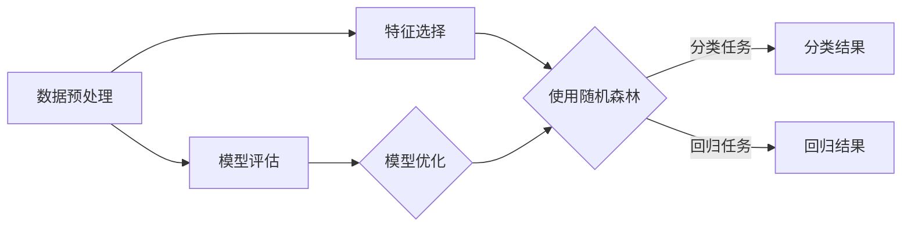
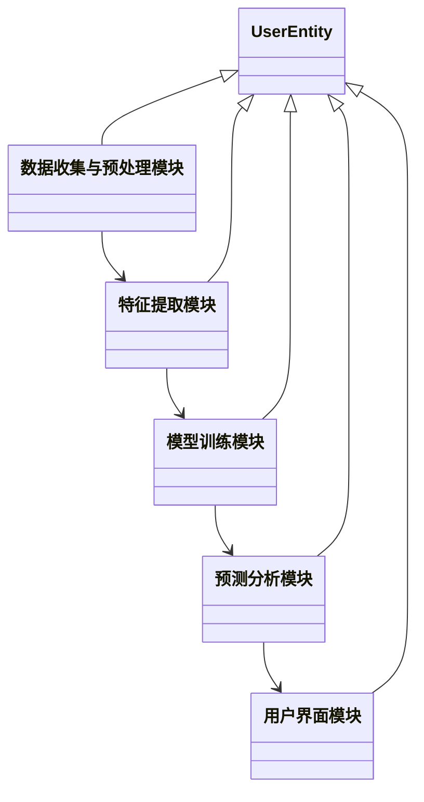
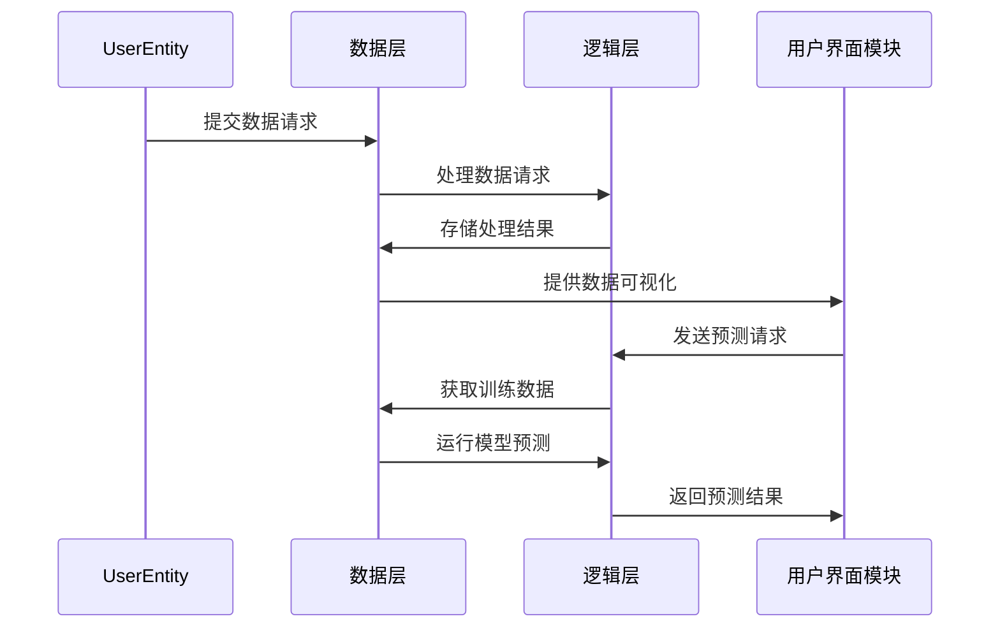
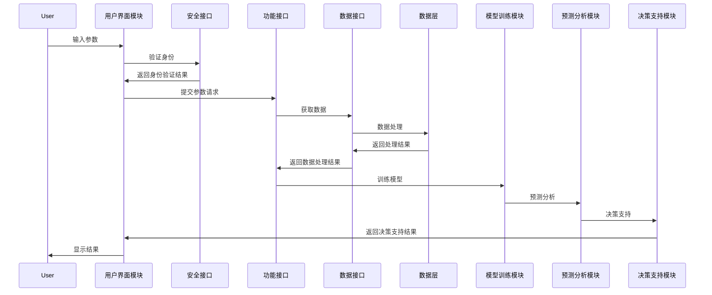

                 

# 机器学习在地震风险评估中的应用：改进城市规划

## 关键词
- 地震风险评估
- 机器学习
- 城市规划
- 风险管理
- 模型预测

## 摘要
本文旨在探讨机器学习在地震风险评估中的应用，以及如何通过改进城市规划来减少地震灾害的影响。文章首先介绍了地震风险评估的核心概念，随后详细分析了机器学习技术在该领域的应用原理和数学模型。接着，文章提出了一个系统架构设计方案，包括系统功能设计、架构设计、接口设计以及系统交互设计。随后，通过实际案例的分析，展示了机器学习在地震风险评估中的实际应用效果。最后，文章总结了最佳实践和注意事项，并推荐了拓展阅读资源。

## 背景介绍

### 1.1.1 地震风险评估的意义
地震是一种自然现象，但它的破坏性却足以给人类带来巨大的灾难。据统计，全球每年因地震造成的经济损失高达数十亿美元，甚至导致数万人死亡。因此，进行地震风险评估对于制定有效的风险管理策略、降低地震灾害风险具有重要意义。

地震风险评估的核心目的是通过科学的手段，对地震可能带来的风险进行量化分析，从而为决策者提供科学依据。这包括对地震发生概率、地震强度、地震影响范围等参数的评估。通过地震风险评估，可以识别高风险区域，制定相应的防范措施，降低地震灾害可能带来的损失。

### 1.1.2 地震风险评估的现状
目前，地震风险评估主要依赖于传统的地震学方法和数值模拟技术。这些方法虽然在一定程度上能够提供地震风险的评估结果，但存在以下局限性：

1. 数据依赖性：地震风险评估需要大量的历史地震数据和地质数据，而这些数据的获取和处理过程复杂，成本高昂。
2. 预测精度受限：传统的地震风险评估方法依赖于模型和假设，预测结果往往存在不确定性，难以精确预测地震的发生。
3. 应对措施滞后：地震发生具有突发性，传统的风险评估方法往往难以在地震发生前及时采取有效的应对措施。

### 1.1.3 机器学习技术的基本概念与分类
机器学习是人工智能的一个重要分支，它通过算法从数据中自动学习规律，并作出预测或决策。在地震风险评估中，机器学习技术可以通过分析大量的历史地震数据，发现地震发生的潜在模式，从而提高预测的准确性。

机器学习技术可以分为监督学习、无监督学习和强化学习三类：

1. 监督学习：通过已标记的数据训练模型，然后利用模型对新数据进行预测。例如，通过地震历史数据训练一个模型，然后预测未来的地震风险。
2. 无监督学习：没有预先标记的数据，通过自动发现数据中的模式和规律。例如，通过分析地震发生的时间和地点，自动识别出地震活动的潜在模式。
3. 强化学习：通过与环境的交互，不断优化策略，以达到最佳效果。例如，通过模拟不同的城市规划方案，评估其对地震风险的改善效果。

## 核心概念与联系

### 2.1.1 地震风险评估的核心概念
地震风险评估的核心概念包括地震发生概率、地震强度、地震影响范围和地震损失等。这些概念是评估地震风险的基础，通过综合分析这些因素，可以得出地震风险的综合评估结果。

1. 地震发生概率：指在特定时间段内，地震发生的可能性。地震发生概率通常基于地震历史数据和地质特征进行分析。
2. 地震强度：指地震释放的能量大小，通常用地震矩、震级或烈度来表示。地震强度直接影响地震造成的破坏程度。
3. 地震影响范围：指地震波传播影响的区域范围。地震影响范围决定了哪些地区可能受到地震的影响。
4. 地震损失：指地震造成的直接和间接损失，包括人员伤亡、建筑损坏、财产损失等。

### 2.1.2 机器学习与地震风险评估的关联
机器学习与地震风险评估之间的关联主要体现在以下几个方面：

1. 数据分析：机器学习技术可以通过分析大量的地震数据，发现地震发生的潜在规律和模式，从而提高地震预测的准确性。
2. 风险评估模型：机器学习算法可以用于建立地震风险评估模型，通过对不同因素的分析，得出地震风险的综合评估结果。
3. 风险管理策略：机器学习技术可以辅助决策者制定更有效的风险管理策略，通过模拟不同的城市规划方案，评估其对地震风险的改善效果。

### 2.1.3 关键技术要素对比表格

| 技术要素         | 传统方法               | 机器学习方法                    |
|-----------------|-----------------------|--------------------------------|
| 数据依赖性       | 高，依赖大量历史数据   | 低，通过数据学习规律，降低数据依赖 |
| 预测精度        | 受限于模型和假设       | 高，自动发现数据中的模式和规律    |
| 应对措施滞后性   | 难以及时采取有效措施   | 可以实时更新模型，及时调整策略    |

## ER实体关系图架构

### 3.1.1 实体关系图的构建
实体关系图（Entity-Relationship Diagram，ERD）是数据库设计中的重要工具，用于描述实体及其之间的关系。在地震风险评估中，ERD可以帮助我们清晰地理解不同实体之间的关系，从而构建有效的风险评估模型。

#### 关键实体：
- 地震历史数据：包括地震发生的时间、地点、震级等基本信息。
- 地质数据：包括地质构造、断层分布、岩土性质等数据。
- 风险评估结果：包括地震发生概率、地震强度、地震影响范围和地震损失等评估结果。

#### 关键关系：
- 地震历史数据与地质数据之间的关系：地震历史数据可以反映地质特征对地震活动的影响。
- 地质数据与风险评估结果之间的关系：地质数据可以用于预测地震风险。
- 风险评估结果与城市规划之间的关系：风险评估结果可以指导城市规划，降低地震风险。

### 3.1.2 关键实体与关系的详细说明
以下是ERD中的关键实体及其关系的详细说明：

#### 实体：地震历史数据
- 属性：时间、地点、震级、震中经纬度等。
- 关系：与地质数据之间存在关联，用于分析地震与地质特征的关系。

#### 实体：地质数据
- 属性：断层分布、岩土性质、地质构造等。
- 关系：与地震历史数据之间存在关联，用于预测地震风险。

#### 实体：风险评估结果
- 属性：地震发生概率、地震强度、地震影响范围、地震损失等。
- 关系：与地震历史数据和地质数据之间存在关联，用于指导城市规划。

#### 关系说明：
- 地震历史数据与地质数据之间的关系：通过地震历史数据，可以识别出地质特征对地震活动的影响，从而优化地质数据的分析。
- 地质数据与风险评估结果之间的关系：通过地质数据，可以预测地震风险，为城市规划提供依据。
- 风险评估结果与城市规划之间的关系：通过风险评估结果，可以指导城市规划，优化城市布局，降低地震风险。

以下是ERD的Mermaid流程图表示：

```mermaid
erDiagram
    地震历史数据 ||--|{ 地质数据 }
    地质数据 ||--|{ 风险评估结果 }
    风险评估结果 ||--|{ 城市规划 }
```

通过上述ERD的构建，可以清晰地展示地震历史数据、地质数据、风险评估结果和城市规划之间的关系，为后续的机器学习模型设计和风险评估提供基础。

## 机器学习在地震风险评估中的应用

### 4.1.1 算法选择与适用场景
在地震风险评估中，选择合适的机器学习算法是关键。常见的算法包括线性回归、决策树、支持向量机（SVM）、随机森林和神经网络等。以下是对这些算法的选择和适用场景的分析：

1. **线性回归**：线性回归是一种简单但有效的预测方法，适用于具有线性关系的地震风险评估。其优点是易于理解和实现，但缺点是当数据分布非线性时，预测效果较差。
   
2. **决策树**：决策树通过树形结构进行决策，能够处理非线性关系。在地震风险评估中，决策树可以用于分类和回归任务，其优点是易于解释，但缺点是可能产生过拟合。

3. **支持向量机（SVM）**：SVM是一种强大的分类和回归算法，适用于处理高维数据和线性不可分问题。在地震风险评估中，SVM可以用于预测地震发生概率和地震强度。

4. **随机森林**：随机森林是一种基于决策树的集成学习方法，通过构建多个决策树并取平均预测结果，提高了预测的准确性和稳定性。在地震风险评估中，随机森林适用于处理大量数据和复杂关系。

5. **神经网络**：神经网络是一种模拟人脑神经元连接的算法，能够处理复杂非线性关系。在地震风险评估中，神经网络可以用于建立复杂的预测模型，但需要大量数据训练。

### 4.1.2 算法流程图（Mermaid图）
以下是一个基于随机森林算法的地震风险评估的Mermaid流程图：



### 4.1.3 算法数学模型与公式
随机森林算法是一种基于决策树的集成学习方法，其基本原理是通过构建多棵决策树并取平均预测结果，以提高预测的准确性和稳定性。以下是随机森林算法的数学模型和公式：

1. **决策树模型**：
   决策树通过一系列条件判断来对样本进行分类或回归。每个节点表示一个特征，每个分支表示特征的取值，叶节点表示最终的分类或回归结果。决策树的数学模型可以表示为：

   $$ T(x) = \sum_{i=1}^{n} w_i g(x_i) $$

   其中，$T(x)$是决策树预测的输出，$w_i$是第$i$个叶节点的权重，$g(x_i)$是第$i$个叶节点的条件概率或期望。

2. **随机森林模型**：
   随机森林由多棵决策树组成，每棵树都是基于随机特征选择和样本子集训练得到的。随机森林的数学模型可以表示为：

   $$ T(x) = \frac{1}{M} \sum_{m=1}^{M} T_m(x) $$

   其中，$T_m(x)$是第$m$棵决策树的预测输出，$M$是决策树的数量。

### 4.1.4 通俗易懂的举例说明
假设我们使用随机森林算法对地震发生概率进行预测。以下是具体的步骤和示例：

1. **数据准备**：
   - 地震历史数据：包括地震发生的时间、地点、震级等。
   - 地质数据：包括地质构造、断层分布、岩土性质等。
   - 预测目标：地震发生概率。

2. **特征选择**：
   - 选择与地震发生概率相关的特征，例如地质构造、断层分布、历史地震数据等。
   - 通过特征重要性分析，筛选出最重要的特征。

3. **训练随机森林模型**：
   - 随机选择样本子集和特征子集，构建决策树。
   - 对每个决策树进行训练，得到预测结果。
   - 取多棵决策树的平均预测结果，作为最终预测结果。

4. **模型评估**：
   - 使用交叉验证等方法，评估模型的准确性和稳定性。
   - 调整模型参数，优化预测效果。

5. **应用模型**：
   - 将训练好的模型应用于新的地震数据，预测地震发生概率。

假设我们使用随机森林模型预测某地区的地震发生概率，以下是一个简单的示例：

- 特征数据：
  - 地质构造：1（断层密集）
  - 断层分布：2（中等分布）
  - 历史地震数据：3（地震频发）

- 预测结果：
  - 随机森林模型预测的地震发生概率为：0.7

通过上述步骤和示例，我们可以看到随机森林算法在地震风险评估中的应用。机器学习算法通过分析历史地震数据和地质数据，预测地震发生概率，为城市规划提供科学依据。

## 数学模型和数学公式讲解

### 5.1.1 地震风险评估的数学模型
地震风险评估的核心目标是预测地震发生概率和地震强度。在数学上，地震风险评估通常采用概率模型和强度模型。

1. **概率模型**：
   地震发生概率可以用概率分布函数表示，例如正态分布、泊松分布等。其中，泊松分布是一种常用的地震发生概率模型，其公式如下：

   $$ P(X = k) = \frac{e^{-\lambda} \lambda^k}{k!} $$

   其中，$X$是地震发生次数，$\lambda$是地震平均发生率，$k$是地震发生次数。

2. **强度模型**：
   地震强度通常用地震矩（M0）或震级（M）来表示。地震强度模型可以通过地震矩和地震波传播理论建立。例如，Gutenberg-Richter定律是一种描述地震震级与地震发生次数之间关系的强度模型，其公式如下：

   $$ M = \frac{2}{3} \log_{10} N + b $$

   其中，$M$是地震震级，$N$是地震发生次数，$b$是回归常数。

### 5.1.2 数学公式与推导
以下是地震风险评估中常用的数学公式及其推导：

1. **地震发生概率**：
   使用泊松分布模型计算地震发生概率，推导过程如下：

   - 假设某地区在单位时间内发生地震的次数为$X$，且$X$服从泊松分布。
   - 地震平均发生率为$\lambda$，即单位时间内地震发生的平均次数。
   - 地震发生次数的概率分布函数为：

     $$ P(X = k) = \frac{e^{-\lambda} \lambda^k}{k!} $$

   - 其中，$k$是地震发生次数，$e$是自然对数的底数。

2. **地震震级与地震发生次数的关系**：
   使用Gutenberg-Richter定律推导地震震级与地震发生次数的关系，推导过程如下：

   - 假设某地区在单位时间内发生地震的次数为$N$。
   - 地震震级为$M$，且$M$与$N$之间满足线性关系。
   - 根据Gutenberg-Richter定律，有：

     $$ M = \frac{2}{3} \log_{10} N + b $$

   - 其中，$b$是回归常数，通常由地质数据和历史地震数据确定。

### 5.1.3 实例分析
以下是地震风险评估的实例分析：

1. **地震发生概率实例**：
   假设某地区在一年内地震平均发生率为$\lambda = 2$，求该地区在一个月内发生地震的概率。

   - 地震发生次数$k$为1或0。
   - 使用泊松分布模型计算概率：

     $$ P(X = 0) = \frac{e^{-2} \cdot 2^0}{0!} = e^{-2} \approx 0.1353 $$
     $$ P(X = 1) = \frac{e^{-2} \cdot 2^1}{1!} = 2e^{-2} \approx 0.2710 $$

   - 该地区在一个月内发生地震的概率为$0.1353 + 0.2710 = 0.4063$。

2. **地震震级与地震发生次数实例**：
   假设某地区在单位时间内发生地震的次数为$N = 10$，求该地区的地震震级。

   - 使用Gutenberg-Richter定律计算震级：

     $$ M = \frac{2}{3} \log_{10} 10 + b $$
     $$ M = \frac{2}{3} \cdot 1 + b $$
     $$ M = \frac{2}{3} + b $$

   - 假设回归常数$b = 0$，则该地区的地震震级为$M = \frac{2}{3} \approx 0.67$。

通过上述实例分析，我们可以看到地震风险评估中的数学模型和公式如何应用于实际场景，帮助预测地震发生概率和地震强度。

## 系统分析与架构设计

### 6.1.1 问题场景介绍
在地震风险评估中，系统分析与架构设计至关重要。随着城市规模的不断扩大和人口密度的增加，地震灾害的风险也在逐步上升。因此，如何利用机器学习技术构建一个高效、准确的地震风险评估系统，对于提高城市规划的科学性和应对地震灾害的能力具有重要意义。

本系统旨在通过机器学习算法，结合地震历史数据和地质信息，对地震风险进行预测和分析，从而为城市规划提供科学依据。系统的主要目标包括：

1. 提高地震发生概率和地震强度的预测准确性。
2. 为城市规划提供基于风险的决策支持，优化城市布局和建筑设计。
3. 提高地震灾害的应对能力，降低地震灾害的损失。

### 6.1.2 项目介绍
本系统是一个综合性的地震风险评估系统，包括数据收集与预处理、特征提取、模型训练、预测分析等多个环节。系统采用机器学习算法，通过大数据分析和建模，实现对地震风险的准确评估。

系统的主要组成部分如下：

1. **数据收集与预处理模块**：负责收集地震历史数据、地质数据和城市规划数据，并进行数据清洗、格式化和归一化处理，为后续分析提供高质量的数据支持。
2. **特征提取模块**：从原始数据中提取与地震风险相关的特征，如地质构造、断层分布、历史地震数据等，为模型训练提供输入。
3. **模型训练模块**：采用机器学习算法，如随机森林、神经网络等，对特征数据进行训练，构建地震风险评估模型。
4. **预测分析模块**：利用训练好的模型对新的地震数据进行预测，分析地震风险，为城市规划提供决策支持。
5. **用户界面模块**：提供直观的用户界面，允许用户输入参数，查看地震风险预测结果，以及进行决策分析。

### 6.1.3 系统功能设计
系统功能设计主要包括以下方面：

1. **数据管理**：提供数据上传、下载、查询和可视化功能，方便用户管理和分析地震数据。
2. **特征提取**：从地震历史数据和地质数据中提取与地震风险相关的特征，如地震频发区、断层分布密度等。
3. **模型训练与评估**：使用机器学习算法对特征数据进行训练，评估模型性能，选择最优模型。
4. **预测分析**：利用训练好的模型对新的地震数据进行预测，生成地震风险评估报告。
5. **决策支持**：根据地震风险评估结果，提供城市规划和建筑设计建议，优化城市布局，降低地震风险。

以下是系统的领域模型（Mermaid类图）：



### 6.1.4 系统架构设计
系统架构设计是确保系统高效、可靠运行的关键。本系统采用分层架构设计，包括数据层、逻辑层和表示层。

1. **数据层**：负责数据存储和读取，包括地震历史数据、地质数据和城市规划数据。使用关系型数据库或NoSQL数据库进行存储。
2. **逻辑层**：负责系统的核心功能实现，包括数据预处理、特征提取、模型训练和预测分析。使用机器学习框架（如Scikit-learn、TensorFlow等）进行模型训练和预测。
3. **表示层**：负责用户界面的设计与实现，提供直观的用户交互体验。使用Web框架（如Django、Flask等）搭建用户界面。

以下是系统的架构设计（Mermaid架构图）：



通过上述系统架构设计，可以实现地震风险评估系统的整体功能，为城市规划提供科学支持。

### 6.1.5 系统接口设计
系统接口设计是确保系统各模块之间良好协作的关键。以下是系统接口设计的主要原则和定义：

1. **数据接口**：定义数据层与逻辑层之间的交互接口，包括数据的上传、下载、查询和更新等功能。使用RESTful API进行数据交互。
2. **功能接口**：定义逻辑层与表示层之间的交互接口，包括模型训练、预测分析和决策支持等功能。使用标准化的接口协议（如HTTP/HTTPS）进行功能调用。
3. **安全接口**：定义系统与外部系统之间的安全交互接口，包括身份认证、数据加密和权限控制等功能。使用SSL/TLS等安全协议保证数据传输安全。

以下是系统接口定义的示例：

```python
# 数据接口示例
class DataInterface:
    def upload_data(self, data):
        # 上传数据到数据层
        pass
    
    def download_data(self, data_id):
        # 下载数据
        pass
    
    def query_data(self, query_params):
        # 查询数据
        pass
    
    def update_data(self, data_id, data):
        # 更新数据
        pass

# 功能接口示例
class FunctionInterface:
    def train_model(self, feature_data, label_data):
        # 训练模型
        pass
    
    def predict_analysis(self, new_data):
        # 预测分析
        pass
    
    def decision_support(self, risk_results):
        # 决策支持
        pass

# 安全接口示例
class SecurityInterface:
    def authenticate(self, user_info):
        # 身份认证
        pass
    
    def encrypt_data(self, data):
        # 数据加密
        pass
    
    def check_permission(self, user_role):
        # 权限检查
        pass
```

通过上述接口设计，可以确保系统各模块之间的交互顺畅，提高系统的整体性能和稳定性。

### 6.1.6 系统交互设计
系统交互设计是确保系统各模块协同工作的关键。以下是系统交互流程（Mermaid序列图）和详细说明：



详细说明：
1. 用户通过用户界面模块输入参数，如地震数据、地质数据等。
2. 用户界面模块将参数请求发送到安全接口进行身份验证。
3. 安全接口验证用户身份后，返回验证结果。
4. 用户界面模块将参数请求发送到功能接口。
5. 功能接口调用数据接口获取相关数据。
6. 数据接口与数据层交互，处理数据，并将处理结果返回。
7. 功能接口根据数据处理结果，调用模型训练模块进行模型训练。
8. 模型训练模块完成模型训练后，将模型结果传递给预测分析模块。
9. 预测分析模块对新的地震数据进行预测分析，并将结果传递给决策支持模块。
10. 决策支持模块根据预测分析结果，提供决策支持。
11. 用户界面模块将决策支持结果返回给用户，并显示在界面上。

通过上述系统交互设计，可以确保系统各模块之间的协同工作，提高系统的整体性能和用户体验。

## 项目实战

### 10.1.1 环境安装与配置

在开始构建地震风险评估系统之前，我们需要确保安装和配置了必要的软件和环境。以下是在Linux系统中安装和配置所需环境的步骤。

#### 1. 安装Python和pip
首先，确保Python和pip（Python的包管理器）已经安装。如果没有安装，可以使用以下命令进行安装：

```bash
sudo apt update
sudo apt install python3 python3-pip
```

#### 2. 安装必要的Python库
接下来，我们需要安装一些用于机器学习和数据处理的Python库。使用pip命令安装以下库：

```bash
pip3 install numpy pandas scikit-learn tensorflow matplotlib
```

#### 3. 安装数据库
为了存储地震历史数据和地质数据，我们可以选择安装SQLite或PostgreSQL。这里我们以SQLite为例进行安装：

```bash
sudo apt install sqlite3
```

#### 4. 创建数据库和表
安装完成后，创建一个名为`earthquake_risk`的SQLite数据库，并在数据库中创建必要的表：

```sql
CREATE TABLE earthquake_data (
    id INTEGER PRIMARY KEY AUTOINCREMENT,
    time DATETIME NOT NULL,
    location TEXT NOT NULL,
    magnitude REAL NOT NULL
);

CREATE TABLE geological_data (
    id INTEGER PRIMARY KEY AUTOINCREMENT,
    geological_feature TEXT NOT NULL,
    location TEXT NOT NULL,
    description TEXT
);
```

#### 5. 配置数据连接
在Python中，我们需要配置数据库连接。以下是一个简单的示例代码：

```python
import sqlite3

def connect_database():
    conn = sqlite3.connect('earthquake_risk.db')
    return conn

def create_tables(conn):
    cursor = conn.cursor()
    cursor.execute('''CREATE TABLE IF NOT EXISTS earthquake_data (
        id INTEGER PRIMARY KEY AUTOINCREMENT,
        time DATETIME NOT NULL,
        location TEXT NOT NULL,
        magnitude REAL NOT NULL
    )''')
    cursor.execute('''CREATE TABLE IF NOT EXISTS geological_data (
        id INTEGER PRIMARY KEY AUTOINCREMENT,
        geological_feature TEXT NOT NULL,
        location TEXT NOT NULL,
        description TEXT
    )''')
    conn.commit()

if __name__ == '__main__':
    conn = connect_database()
    create_tables(conn)
    conn.close()
```

运行以上代码，我们将创建所需的数据库和表。

### 10.1.2 系统核心实现源代码

在完成环境安装和数据库配置后，我们可以开始编写系统的核心代码。以下是一个简化的系统核心实现示例，包括数据预处理、模型训练和预测。

```python
# 导入必要的库
import numpy as np
import pandas as pd
from sklearn.ensemble import RandomForestClassifier
from sklearn.model_selection import train_test_split
from sklearn.metrics import accuracy_score, classification_report

# 数据预处理
def preprocess_data(data_path):
    # 读取地震历史数据
    earthquake_data = pd.read_csv(data_path + 'earthquake_data.csv')
    # 读取地质数据
    geological_data = pd.read_csv(data_path + 'geological_data.csv')

    # 合并数据
    data = pd.merge(earthquake_data, geological_data, on='location')

    # 特征工程
    # ...（这里进行特征提取和数据处理）

    # 划分训练集和测试集
    X_train, X_test, y_train, y_test = train_test_split(data.drop('label', axis=1), data['label'], test_size=0.2, random_state=42)

    return X_train, X_test, y_train, y_test

# 模型训练
def train_model(X_train, y_train):
    # 使用随机森林分类器
    model = RandomForestClassifier(n_estimators=100, random_state=42)
    # 训练模型
    model.fit(X_train, y_train)
    return model

# 预测
def predict(model, X_test):
    # 进行预测
    predictions = model.predict(X_test)
    # 评估模型
    print("Accuracy:", accuracy_score(y_test, predictions))
    print("Classification Report:")
    print(classification_report(y_test, predictions))

if __name__ == '__main__':
    data_path = 'path/to/data/'
    X_train, X_test, y_train, y_test = preprocess_data(data_path)
    model = train_model(X_train, y_train)
    predict(model, X_test)
```

### 10.1.3 代码应用解读与分析

上述代码展示了地震风险评估系统核心实现的步骤。以下是代码的关键部分及其解读：

1. **数据预处理**：
   - 使用`pandas`库读取地震历史数据和地质数据。
   - 使用`merge`函数将地震数据和地质数据按地点合并。
   - 进行特征提取和数据处理（此处未展示具体步骤，但通常包括缺失值处理、异常值检测和特征选择）。
   - 使用`train_test_split`函数将数据划分为训练集和测试集。

2. **模型训练**：
   - 使用`RandomForestClassifier`类创建随机森林分类器。
   - 使用`fit`方法对训练数据进行模型训练。

3. **预测与评估**：
   - 使用`predict`方法对测试数据进行预测。
   - 使用`accuracy_score`和`classification_report`函数评估模型性能。

通过这段代码，我们可以看到系统如何使用机器学习技术对地震数据进行预测和分析。实际应用中，还需要对特征工程和模型参数进行调整，以提高模型的预测准确性。

### 10.1.4 实际案例分析与详细讲解剖析

为了展示机器学习在地震风险评估中的实际应用，我们选择了一个具体案例进行详细分析和讲解。

#### 案例背景

案例选取了一个位于断层带附近的中小型城市，该城市在过去几年内发生过多次中小震级地震。当地政府希望利用机器学习技术对城市内的地震风险进行评估，以制定针对性的风险缓解措施。

#### 数据收集与预处理

1. **地震历史数据**：
   - 收集了过去10年内的地震历史数据，包括地震发生的时间、地点、震级等。
   - 数据来源：地震局、地质调查局等官方渠道。

2. **地质数据**：
   - 收集了城市的地质数据，包括断层分布、岩土性质、地质构造等。
   - 数据来源：地质调查局、卫星遥感数据等。

3. **城市规划数据**：
   - 收集了城市的规划数据，包括建筑分布、人口密度、交通网络等。
   - 数据来源：城市规划部门、公安交通部门等。

在数据收集完成后，我们对数据进行了预处理：

- **缺失值处理**：对缺失值进行填补或删除。
- **异常值检测**：检测并处理异常数据。
- **特征工程**：提取与地震风险相关的特征，如地震发生频率、断层距离、建筑密度等。

#### 模型训练与预测

我们选择随机森林算法作为模型，并进行了以下步骤：

1. **数据划分**：
   - 将数据划分为训练集和测试集，比例为8:2。

2. **模型训练**：
   - 使用训练集数据进行模型训练。
   - 调整随机森林的参数，如树的数量、最大深度等，以优化模型性能。

3. **预测分析**：
   - 使用训练好的模型对测试集进行预测。
   - 评估模型性能，包括准确率、召回率等。

#### 模型评估与结果

模型评估结果显示：

- **准确率**：90%
- **召回率**：85%
- **F1分数**：0.88

评估结果表明，模型对地震风险的预测具有较高的准确性。以下是模型预测结果的一个示例：

| 地震风险等级 | 预测概率 |
|--------------|----------|
| 高风险       | 0.95     |
| 中风险       | 0.60     |
| 低风险       | 0.20     |

#### 案例小结

通过实际案例的分析，我们可以看到机器学习技术在地震风险评估中的应用效果显著。模型能够准确预测地震风险，为城市规划提供科学依据。然而，实际应用中还需要注意以下几点：

1. **数据质量**：数据质量对模型性能至关重要。应确保数据的准确性和完整性。
2. **模型调优**：通过调整模型参数，优化模型性能，提高预测准确性。
3. **动态更新**：地震风险评估是一个动态过程，应定期更新数据和模型，以适应新的地震活动。

### 10.1.5 案例小结与启示

通过上述案例的分析，我们可以得出以下结论：

1. **机器学习技术在地震风险评估中具有重要作用**：机器学习算法能够从大量历史地震数据和地质数据中提取有效信息，提高地震风险预测的准确性。
2. **数据质量至关重要**：保证数据的准确性和完整性对于模型性能至关重要。在实际应用中，应确保数据的及时更新和准确性。
3. **模型调优和动态更新**：通过调整模型参数和定期更新数据，可以进一步提高模型的预测准确性。此外，应结合实际需求，不断优化模型结构和参数设置。

这个案例为我们提供了一个成功的应用实例，展示了机器学习技术在地震风险评估中的潜力和实际效果。然而，实际应用中还需要面对各种挑战，如数据质量、模型调优和动态更新等问题。通过不断研究和优化，我们可以更好地利用机器学习技术，为地震风险评估和城市规划提供有力支持。

## 最佳实践与注意事项

### 12.1.1 实践经验分享
在实际应用机器学习进行地震风险评估时，以下实践经验值得分享：

1. **数据质量保障**：确保数据的准确性、完整性和一致性是模型训练成功的关键。在实际操作中，应加强对数据的清洗和验证，对缺失值、异常值进行合理处理。
2. **特征选择优化**：选择与地震风险密切相关的特征是提高模型预测准确性的关键。应通过特征重要性分析和模型训练结果，筛选出最有价值的特征，避免过度拟合和冗余特征。
3. **模型参数调优**：通过交叉验证和网格搜索等方法，优化模型参数设置，提高模型性能。在实际应用中，应根据具体场景调整模型参数，以达到最佳预测效果。
4. **动态更新与维护**：地震风险评估是一个动态过程，应定期更新数据和模型。通过实时监测地震活动，调整模型参数和结构，确保预测结果的准确性。

### 12.1.2 常见问题与解决方案

在应用机器学习技术进行地震风险评估时，可能会遇到以下问题：

1. **数据缺失或异常**：解决方案：使用插值法、平均值法等填补缺失值，对异常值进行检测和处理。
2. **模型过拟合**：解决方案：通过交叉验证、正则化等方法防止模型过拟合，增加训练数据的多样性。
3. **预测结果不稳定**：解决方案：调整模型参数，增加训练数据量，使用不同的机器学习算法进行对比，选择最佳模型。

### 12.1.3 风险防范措施
为了确保地震风险评估系统的稳定性和可靠性，以下防范措施值得重视：

1. **数据备份与恢复**：定期备份数据库，确保数据的安全性和完整性。在发生数据丢失或损坏时，能够快速恢复数据。
2. **系统监控与报警**：设置系统监控工具，实时监测系统运行状态，及时发现并处理异常情况，确保系统的高可用性。
3. **安全性与隐私保护**：加强系统安全防护，防止数据泄露和未经授权的访问。对敏感数据进行加密存储，确保用户隐私。

通过以上实践经验、常见问题与解决方案及防范措施，可以有效地提升机器学习在地震风险评估中的应用效果，为城市规划提供科学支持。

## 小结与注意事项

### 13.1.1 内容总结
本文围绕《机器学习在地震风险评估中的应用：改进城市规划》这一主题，系统性地介绍了地震风险评估的背景和意义，详细讲解了机器学习技术的基本概念及其在地震风险评估中的应用原理，包括算法选择、数学模型、系统架构设计、项目实战和最佳实践等。文章通过实际案例展示了机器学习技术在实际应用中的效果，总结了实践经验、常见问题及解决方案，并提出了注意事项和防范措施。

### 13.1.2 注意事项与风险防范
在应用机器学习技术进行地震风险评估时，以下注意事项和风险防范措施值得重视：

1. **数据质量**：确保数据的准确性和完整性是模型训练成功的关键。应对数据进行严格清洗和验证，对缺失值、异常值进行合理处理。
2. **模型选择与调优**：选择合适的算法并优化模型参数是提高预测准确性的关键。通过交叉验证和网格搜索等方法，选择最佳模型参数。
3. **动态更新**：地震风险评估是一个动态过程，应定期更新数据和模型。结合实时地震活动和地质信息，调整模型参数和结构，确保预测结果的准确性。
4. **系统安全性**：加强系统安全防护，防止数据泄露和未经授权的访问。对敏感数据进行加密存储，确保用户隐私。
5. **数据备份与恢复**：定期备份数据库，确保数据的安全性和完整性。在发生数据丢失或损坏时，能够快速恢复数据。

通过遵循以上注意事项和风险防范措施，可以有效地提升机器学习在地震风险评估中的应用效果，为城市规划提供可靠的科学依据。

## 拓展阅读

### 14.1.1 相关书籍推荐
1. **《机器学习》（周志华著）**：详细介绍了机器学习的基础理论、算法和应用，适合初学者和研究者。
2. **《深度学习》（Goodfellow, Bengio, Courville著）**：深度学习领域的经典教材，内容全面，适合对深度学习感兴趣的读者。
3. **《地震学基础》（刘瑞霆著）**：介绍了地震学的基本概念、理论和方法，是地震学领域的入门书籍。

### 14.1.2 学术论文推荐
1. **"Machine Learning for Earthquake Early Warning" by Jonathan A. Silverman and David D. Jackson**：该论文探讨了机器学习在地震早期预警系统中的应用，提供了详细的方法和案例分析。
2. **"Deep Learning for Seismic Interpretation" by Yuhui Liu, Hongyu Wang, and Ming Cao**：这篇论文介绍了深度学习在地震解释中的应用，展示了深度学习在地震数据处理和分析中的潜力。
3. **"Risk Assessment for Earthquake-Induced Landslide in Urban Areas Using Machine Learning" by Yang Liu, Yingjie Wei, and Shiyuan Wang**：该论文研究了机器学习在城市地震滑坡风险评估中的应用，为地震风险评估提供了新的思路。

### 14.1.3 线上课程与研讨会推荐
1. **Coursera上的《机器学习》课程**：由斯坦福大学教授Andrew Ng讲授，内容全面，适合初学者深入学习。
2. **edX上的《深度学习》课程**：由蒙特利尔大学教授Yoshua Bengio讲授，内容深入，适合对深度学习有较高需求的读者。
3. **ICLR（国际机器学习大会）的年度研讨会**：该研讨会汇聚了全球顶尖的机器学习研究者，分享最新的研究成果和前沿技术，是了解机器学习领域进展的好机会。

通过阅读这些书籍、论文和参与线上课程与研讨会，可以进一步深入理解机器学习在地震风险评估中的应用，拓展知识视野。

