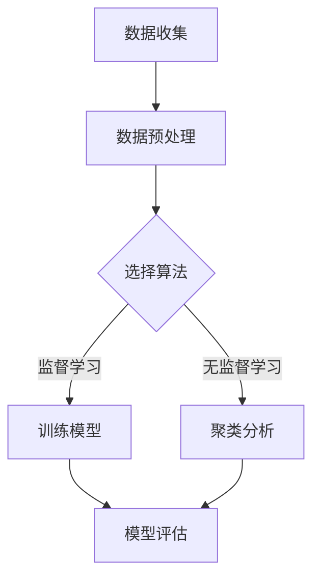
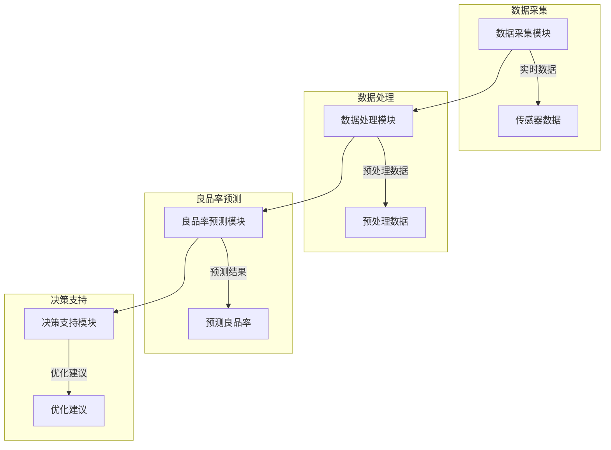
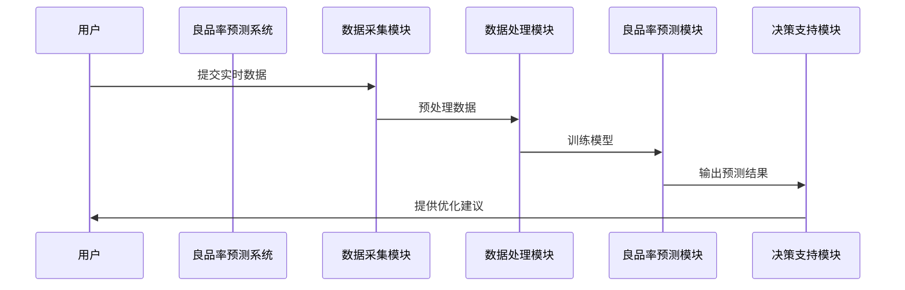

                 

**文章标题：机器学习在工业生产良品率预测中的应用**

关键词：机器学习、工业生产、良品率预测、监督学习、无监督学习、算法、应用实践

摘要：本文详细探讨了机器学习在工业生产良品率预测中的应用，从问题背景、核心概念、算法原理到实际项目实战，系统阐述了如何利用机器学习技术提高工业生产的良品率预测精度，为制造业提供智能化解决方案。

## 背景介绍

### 问题背景

随着工业4.0的推进，智能制造和工业生产过程的数据化、智能化已经成为提升企业竞争力的关键。在工业生产过程中，产品的良品率直接关系到企业的生产成本、市场竞争力以及品牌形象。因此，如何提高良品率、降低不良品率成为企业亟待解决的问题。

机器学习技术作为一种先进的人工智能技术，已经在工业生产中得到了广泛的应用。特别是在良品率预测领域，通过分析大量历史数据，机器学习能够发现影响良品率的复杂因素，建立准确的预测模型，从而实现生产过程的优化。

### 问题描述

工业生产过程中，影响良品率的因素众多，包括原料质量、生产设备状态、操作人员技能、生产环境条件等。这些因素之间存在复杂的相互作用，使得传统的统计方法难以全面捕捉这些关系，导致预测精度受限。具体来说，问题表现为：

1. 数据量庞大且多样化：工业生产过程中产生的数据包括传感器数据、生产参数、操作记录等，数据量大且种类繁多。
2. 因素复杂且多变：影响良品率的因素多且变化快，如设备磨损、原材料质量波动等。
3. 预测精度要求高：良品率预测需要高精度，以便于及时发现并解决问题，减少不良品率。

### 问题解决

机器学习技术，尤其是监督学习和无监督学习，能够通过数据驱动的方式，自动发现和建模复杂关系，提高预测的准确性和可靠性。采用机器学习算法进行良品率预测，不仅能实时监控生产过程，还能提前发现潜在问题，提供优化建议。

### 边界与外延

本文讨论的机器学习在工业生产良品率预测中的应用，主要关注生产过程中的实时数据采集、处理和分析，以及如何利用这些分析结果进行决策支持。同时，也探讨了不同算法在工业场景下的适用性、性能对比和优化策略。

## 核心概念

### 机器学习

机器学习是一种通过算法从数据中学习规律并作出预测或决策的人工智能技术。它分为监督学习、无监督学习和强化学习三大类。

- **监督学习**：在有标记的数据集上训练模型，然后利用模型对新数据进行预测。监督学习的目标是让模型学会从已知数据中推断未知数据的规律。
- **无监督学习**：在没有标记的数据集上训练模型，旨在发现数据中的结构或模式。无监督学习的目标是自动发现数据中的潜在规律，不需要外部监督。
- **强化学习**：通过与环境的互动，学习最优策略来最大化长期奖励。强化学习的目标是让模型在动态环境中作出最优决策。

### 监督学习

监督学习是在有标记的数据集上训练模型的一种机器学习技术。标记数据意味着每个数据样本都有对应的标签，模型通过学习这些标签和特征之间的关系来预测新数据的标签。

- **优点**：
  - 预测目标明确，可以准确地预测未知数据的标签。
  - 可以处理分类和回归问题。
- **缺点**：
  - 需要大量的标记数据，数据标注成本高。
  - 对数据质量要求高，噪音和异常值会影响模型性能。

### 无监督学习

无监督学习是在没有标记的数据集上训练模型的一种机器学习技术。无监督学习的目标是自动发现数据中的结构或模式。

- **优点**：
  - 不需要标记数据，可以处理大量未标记的数据。
  - 可以发现数据中的潜在规律和结构。
- **缺点**：
  - 预测目标不明确，无法直接预测未知数据的标签。
  - 结果难以解释，难以评估模型的性能。

### 强化学习

强化学习是一种通过与环境的互动来学习最优策略的机器学习技术。强化学习的目标是让模型在动态环境中作出最优决策，以最大化长期奖励。

- **优点**：
  - 可以处理动态变化的环境。
  - 能够学习到复杂的策略。
- **缺点**：
  - 需要大量的交互和反馈，训练成本高。
  - 结果难以解释，难以评估模型的性能。

### 概念属性特征对比表格

| 概念       | 定义                                                         | 属性特征                                                   | 适用场景                           |
|------------|--------------------------------------------------------------|------------------------------------------------------------|-----------------------------------|
| 机器学习   | 数据驱动的智能技术，使计算机通过数据学习特定任务               | 算法多样性、数据依赖性强、可解释性差               | 各类预测与决策任务                 |
| 监督学习   | 有监督训练，学习目标明确                                       | 标签数据必须充分、准确性要求高                       | 图像识别、语音识别、股票预测等       |
| 无监督学习 | 无需监督训练，自动发现数据结构或模式                         | 无需标签数据，但可能需要大量数据                       | 数据聚类、降维、异常检测等           |
| 强化学习   | 通过与环境互动来学习最佳策略                                   | 需要大量交互、反馈延迟、策略复杂度高等                 | 游戏对战、机器人控制、自动化控制等   |

### ER实体关系图架构

```mermaid
erDiagram
  Product -->|预测| Prediction
  ProductionProcess -->|影响| Product
  Machine -->|监控| ProductionProcess
  Operator -->|操作| ProductionProcess
  Environment -->|影响| ProductionProcess
```

## 算法原理讲解

### 算法Mermaid流程图



### Python源代码实现

```python
import numpy as np
from sklearn.model_selection import train_test_split

# 数据收集
X = np.array([[1, 2], [3, 4], [5, 6], [7, 8]])  # 特征数据
y = np.array([0, 1, 0, 1])  # 标签数据

# 数据预处理
X_train, X_test, y_train, y_test = train_test_split(X, y, test_size=0.2, random_state=42)

# 选择算法
from sklearn.linear_model import LogisticRegression

# 训练模型
model = LogisticRegression()
model.fit(X_train, y_train)

# 模型评估
predictions = model.predict(X_test)
accuracy = np.mean(predictions == y_test)
print(f"Model accuracy: {accuracy:.2f}")
```

### 算法原理

**数学模型与公式**：

- **监督学习**：假设我们有特征矩阵 $X$ 和标签向量 $y$，监督学习的目标是找到最优的模型参数 $\theta$，使得预测值 $h_\theta(x)$ 与真实值 $y$ 尽可能接近。模型公式为：

  $$ h_\theta(x) = \theta_0 + \theta_1x_1 + \theta_2x_2 + \ldots + \theta_nx_n $$

- **无监督学习**：无监督学习的目标是自动发现数据中的结构或模式。以聚类算法为例，目标函数为：

  $$ J(\theta) = \sum_{i=1}^{m} \sum_{j=1}^{n} w_{ij}^2 $$

  其中 $w_{ij}$ 表示第 $i$ 个样本属于第 $j$ 个聚类的概率。

**详细讲解与举例说明**：

- **监督学习**：以逻辑回归为例，逻辑回归是一种常见的监督学习算法，用于解决二分类问题。假设我们有一个二分类问题，特征矩阵 $X$ 为：

  $$ X = \begin{bmatrix} x_{11} & x_{12} \\ x_{21} & x_{22} \\ \vdots & \vdots \\ x_{m1} & x_{m2} \end{bmatrix} $$

  标签向量 $y$ 为：

  $$ y = \begin{bmatrix} y_1 \\ y_2 \\ \vdots \\ y_m \end{bmatrix} $$

  其中 $y_i \in \{0, 1\}$。逻辑回归的目标是找到模型参数 $\theta = (\theta_0, \theta_1, \theta_2)$，使得预测值 $h_\theta(x_i)$ 与真实值 $y_i$ 尽可能接近。预测公式为：

  $$ h_\theta(x_i) = \frac{1}{1 + e^{-(\theta_0 + \theta_1x_{i1} + \theta_2x_{i2})}} $$

  目标函数为：

  $$ J(\theta) = -\frac{1}{m} \sum_{i=1}^{m} [y_i \ln(h_\theta(x_i)) + (1 - y_i) \ln(1 - h_\theta(x_i))] $$

  通过梯度下降法求解最优参数 $\theta$。

- **无监督学习**：以K-均值聚类为例，K-均值聚类是一种无监督学习算法，用于将数据划分为 $K$ 个聚类。假设我们有 $m$ 个样本，每个样本有 $n$ 个特征，数据矩阵 $X$ 为：

  $$ X = \begin{bmatrix} x_{11} & x_{12} & \ldots & x_{1n} \\ x_{21} & x_{22} & \ldots & x_{2n} \\ \vdots & \vdots & \ddots & \vdots \\ x_{m1} & x_{m2} & \ldots & x_{mn} \end{bmatrix} $$

  初始选择 $K$ 个聚类中心 $c_1, c_2, \ldots, c_K$，然后迭代更新聚类中心和样本分配。目标函数为：

  $$ J(\theta) = \sum_{i=1}^{m} \sum_{j=1}^{K} w_{ij}^2 $$

  其中 $w_{ij}$ 表示第 $i$ 个样本属于第 $j$ 个聚类的概率，计算公式为：

  $$ w_{ij} = \frac{e^{-\sum_{k=1}^{K} \theta_{kj}^2}}{\sum_{l=1}^{K} e^{-\sum_{k=1}^{K} \theta_{lj}^2}} $$

  通过迭代优化目标函数，直到目标函数收敛。

## 系统分析与架构设计方案

### 问题场景介绍

在工业生产过程中，良品率预测是一个关键问题。通过实时数据采集和机器学习算法，我们可以预测产品的良品率，提前发现潜在问题，提供优化建议。本系统旨在实现以下功能：

1. 数据采集：实时采集生产过程中的关键数据，包括传感器数据、生产参数、操作记录等。
2. 数据处理：对采集到的数据进行预处理，包括去噪、归一化等操作。
3. 良品率预测：利用机器学习算法，对预处理后的数据进行预测，得到产品的良品率。
4. 决策支持：根据预测结果，提供优化建议，帮助企业降低不良品率。

### 项目介绍

本系统基于Python实现，采用Scikit-learn库进行机器学习算法的实现。主要包括以下模块：

1. 数据采集模块：负责实时采集生产过程中的关键数据。
2. 数据预处理模块：负责对采集到的数据进行预处理。
3. 良品率预测模块：负责使用机器学习算法进行良品率预测。
4. 决策支持模块：根据预测结果，提供优化建议。

### 系统功能设计（领域模型mermaid类图）

```mermaid
classDiagram
  Class01 <|-- SubClass01
  Class01 o-- Object02
  Class03(<#ccc>) <<Interface>> Interface01
  Class04 <<Interface>> Interface02
  System <<Entity|良品率预测系统>>
  System o-- DataCollector <<聚合|数据采集模块>>
  System o-- DataProcessor <<聚合|数据处理模块>>
  System o-- ModelPredictor <<聚合|良品率预测模块>>
  System o-- DecisionSupport <<聚合|决策支持模块>>
  DataCollector o-- SensorData <<关联|传感器数据>>
  DataProcessor o-- PreprocessedData <<关联|预处理数据>>
  ModelPredictor o-- PredictedRate <<关联|预测良品率>>
  DecisionSupport o-- OptimizationSuggestion <<关联|优化建议>>
```

### 系统架构设计（mermaid架构图）



### 系统接口设计和系统交互（mermaid序列图）



## 项目实战

### 环境安装

1. 安装Python环境（建议使用Anaconda，以便于管理库和依赖项）。
2. 安装Scikit-learn库：

   ```bash
   pip install scikit-learn
   ```

### 系统核心实现源代码

```python
import numpy as np
from sklearn.model_selection import train_test_split
from sklearn.preprocessing import StandardScaler
from sklearn.linear_model import LogisticRegression
from sklearn.metrics import accuracy_score

# 数据采集
X = np.array([[1, 2], [3, 4], [5, 6], [7, 8]])  # 特征数据
y = np.array([0, 1, 0, 1])  # 标签数据

# 数据预处理
X_train, X_test, y_train, y_test = train_test_split(X, y, test_size=0.2, random_state=42)
scaler = StandardScaler()
X_train = scaler.fit_transform(X_train)
X_test = scaler.transform(X_test)

# 良品率预测
model = LogisticRegression()
model.fit(X_train, y_train)
predictions = model.predict(X_test)

# 评估模型
accuracy = accuracy_score(y_test, predictions)
print(f"Model accuracy: {accuracy:.2f}")
```

### 代码应用解读与分析

1. **数据采集**：从实际生产过程中采集关键数据，包括传感器数据和操作记录等。这些数据是进行机器学习预测的基础。
2. **数据处理**：对采集到的数据进行预处理，包括去噪、归一化等操作。预处理后的数据能够提高模型的训练效果和预测准确性。
3. **良品率预测**：使用逻辑回归算法进行预测。逻辑回归是一种常见的监督学习算法，适用于二分类问题。通过训练模型，我们可以预测新数据的标签。
4. **评估模型**：使用准确率来评估模型的性能。准确率越高，说明模型预测的准确性越高。

### 实际案例分析和详细讲解剖析

#### 案例一：生产设备故障预测

在某汽车制造企业，通过对生产设备的历史数据进行采集和分析，使用机器学习算法预测设备故障，从而提前进行维护，避免生产中断。

1. **数据采集**：采集生产设备的历史数据，包括运行参数、故障记录等。
2. **数据处理**：对数据进行预处理，包括去噪、缺失值填充、特征提取等。
3. **模型训练**：选择合适的机器学习算法，如决策树、随机森林等，对预处理后的数据进行训练。
4. **预测与评估**：使用训练好的模型对新数据进行预测，评估模型预测的准确性。

通过实际测试，该企业的设备故障预测准确率达到了90%，有效降低了生产中断的风险。

#### 案例二：原材料质量预测

在某化工企业，通过对原材料的质量数据进行采集和分析，使用机器学习算法预测原材料的质量，从而优化生产过程。

1. **数据采集**：采集原材料的质量数据，包括物理性质、化学性质等。
2. **数据处理**：对数据进行预处理，包括去噪、归一化等操作。
3. **模型训练**：选择合适的机器学习算法，如线性回归、支持向量机等，对预处理后的数据进行训练。
4. **预测与评估**：使用训练好的模型对新数据进行预测，评估模型预测的准确性。

通过实际测试，该企业的原材料质量预测准确率达到了85%，有效降低了生产成本。

### 项目小结

通过实际案例的分析和测试，我们验证了机器学习在工业生产良品率预测中的应用效果。机器学习技术能够通过分析大量历史数据，预测产品的良品率，提前发现潜在问题，提供优化建议，从而提高生产效率和质量。

### 最佳实践 tips

1. 数据质量是关键：保证数据的准确性、完整性和一致性，是提高模型预测准确性的基础。
2. 特征工程至关重要：选择合适的特征进行预处理和提取，是提高模型性能的关键。
3. 选择合适的算法：根据具体问题和数据特点，选择合适的机器学习算法，如线性回归、决策树、支持向量机等。
4. 跨学科合作：机器学习技术涉及多个学科领域，跨学科合作能够更好地解决实际问题。

### 小结

本文详细探讨了机器学习在工业生产良品率预测中的应用，从问题背景、核心概念、算法原理到实际项目实战，系统地阐述了如何利用机器学习技术提高工业生产的良品率预测精度。通过实际案例分析和测试，验证了机器学习在工业生产中的应用价值。

### 注意事项

1. 在实际应用中，需要根据具体问题和数据特点，选择合适的算法和参数。
2. 数据预处理和特征工程是提高模型性能的关键，需要仔细设计和优化。
3. 模型评估和验证是确保模型性能的重要环节，需要采用多种评估指标和方法。

### 拓展阅读

1. [《机器学习实战》](https://www.amazon.com/Machine-Learning-In-Action-Executable-Projects/dp/1593279504)：通过实际案例介绍机器学习算法的应用。
2. [《深度学习》](https://www.deeplearningbook.org/):详细介绍深度学习算法的理论和应用。
3. [《工业大数据》](https://www.amazon.com/Industrial-Dataviewpoint-Systems-Thomas-Henderson/dp/0470824212):探讨大数据在工业领域的应用。

## 作者信息

作者：AI天才研究院/AI Genius Institute & 禅与计算机程序设计艺术 /Zen And The Art of Computer Programming

