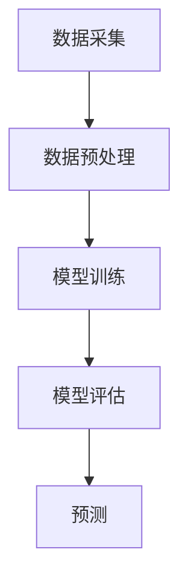

                 


### 1. 机器学习与气候变化预测

#### 1.1 问题背景

随着全球气候变化的影响日益显著，预测气候变化趋势已成为各国政府、研究机构和企业在制定相关政策、规划可持续发展路径中的关键需求。气候变化的主要驱动因素包括温室气体排放、土地利用变化、大气化学过程等。然而，气候变化预测的复杂性使得传统的预测方法难以满足精度和实时性的要求。

机器学习作为人工智能的一个重要分支，其在数据分析和预测方面的强大能力引起了广泛关注。在气候变化预测中，机器学习技术可以处理大量复杂的数据集，发现数据中的潜在模式，并利用这些模式对未来进行预测。目前，机器学习在气候变化预测中的应用主要包括以下几个方面：

- **气候模式识别**：通过分析历史气候数据，识别气候变化的规律和模式，为预测未来气候变化趋势提供基础。
- **温室气体排放预测**：利用机器学习算法预测未来温室气体排放量，帮助制定减排政策。
- **极端天气事件预测**：如预测暴雨、干旱、飓风等极端天气事件的发生频率和强度，为应急管理提供支持。

然而，尽管机器学习技术在气候变化预测中具有巨大的潜力，但仍面临诸多挑战。首先，气候数据具有高维度、高噪声和不确定性等特点，使得模型训练的难度大大增加。其次，气候变化的影响因素众多，如何从海量数据中筛选出关键因素，构建准确的预测模型，是当前研究的难点之一。此外，不同区域的气候变化特征存在显著差异，如何适应这种多样性，提高模型的泛化能力，也是亟待解决的问题。

#### 1.2 问题解决

为了解决上述问题，研究者们提出了一系列优化方法，以提升机器学习在气候变化预测中的应用效果。以下是一些主要的研究方向：

- **数据预处理**：通过数据清洗、归一化、特征提取等方法，提高数据质量，减少噪声，从而提高模型性能。
- **算法优化**：针对气候变化预测的特点，优化传统机器学习算法，如改进神经网络结构、使用深度学习方法等。
- **多模型融合**：结合多种机器学习模型，利用各自的优势，提高预测的准确性和鲁棒性。
- **不确定性量化**：通过不确定性分析，为预测结果提供更加可靠的置信区间，降低预测风险。

本文将围绕这些优化方法，详细探讨机器学习在气候变化预测模型中的应用。通过实例分析，我们将展示如何将机器学习技术应用于气候变化预测，并提供一些建议和最佳实践，以帮助读者更好地理解和应用这些技术。

#### 1.3 边界与外延

本文的研究边界主要涉及以下几个方面：

- **技术范围**：本文将主要探讨机器学习在气候变化预测中的应用，包括监督学习、无监督学习和强化学习等算法的优化和融合。
- **数据范围**：本文将使用公开的气候数据集，如NASA的全球气候观测数据（GISTEMP）等，进行分析和预测。
- **地理范围**：本文将重点关注全球范围内的气候变化预测，但具体分析可能会针对特定区域，如亚洲、北美等。

本文的研究外延包括：

- **应用领域扩展**：探讨机器学习在气候变化预测之外的其他领域应用，如环境保护、能源规划等。
- **多学科融合**：探讨机器学习与其他学科（如气象学、地理学等）的交叉应用，以推动多学科协同研究。

#### 1.4 概念结构与核心要素组成

为了更好地理解机器学习在气候变化预测中的应用，以下是一个简化的概念结构与核心要素组成：

- **机器学习核心概念**：
  - 监督学习
  - 无监督学习
  - 强化学习
  - 数据预处理
  - 模型评估
  - 模型优化

- **气候变化预测模型核心要素**：
  - 气候数据
  - 预测指标
  - 模型选择
  - 预测结果分析

- **概念之间的联系**：
  - 机器学习算法的选择和优化直接影响气候变化预测模型的性能。
  - 数据预处理和质量对模型训练和预测结果至关重要。
  - 预测指标和评估方法用于衡量模型性能，指导模型优化。

通过上述结构，我们可以更清晰地理解机器学习在气候变化预测中的应用，并为进一步的研究和应用提供理论基础。

## 2. 机器学习基本概念

在深入探讨机器学习在气候变化预测中的优化应用之前，我们需要首先了解机器学习的基本概念和原理。机器学习是一种通过算法从数据中自动学习和提取知识的方法，它包括监督学习、无监督学习和强化学习等多种类型。以下是这些基本概念的详细解释。

### 2.1 监督学习

监督学习是机器学习中最为常见的一种类型，它依赖于带有标签的数据集进行学习。标签通常是对输入数据进行分类或回归的结果。监督学习的目标是建立一个模型，该模型可以从输入数据中预测输出标签。

#### 2.1.1 定义

监督学习可以定义为：给定一个训练数据集 \(\{x_1, y_1\}, \{x_2, y_2\}, \ldots, \{x_n, y_n\}\)，其中 \(x_i\) 是输入数据，\(y_i\) 是对应的输出标签，监督学习的目标是学习一个函数 \(f(x)\)，使得对于新的输入 \(x\)，可以预测其对应的标签 \(y = f(x)\)。

#### 2.1.2 特点

- **目标明确**：监督学习有明确的目标函数，即最小化预测误差。
- **基于标签**：利用带有标签的数据进行学习，可以有效地提高预测准确性。
- **适用范围广**：在分类和回归问题中都有广泛应用。

#### 2.1.3 应用场景

- **分类问题**：如电子邮件分类、垃圾邮件检测、图像分类等。
- **回归问题**：如房屋价格预测、股票价格预测等。

#### 2.1.4 监督学习流程图


### 2.2 无监督学习

无监督学习与监督学习不同，它没有预先标记的输出标签，而是通过探索数据中的内在结构和模式来学习。无监督学习的目标是发现数据中的隐含结构，如聚类或降维。

#### 2.2.1 定义

无监督学习可以定义为：给定一个数据集 \(x_1, x_2, \ldots, x_n\)，无监督学习的目标是学习一个数据表示或嵌入，使得数据之间的相似性在表示中得以保留。

#### 2.2.2 特点

- **无标签**：无需标签数据，直接从数据本身学习。
- **探索性**：主要用于数据探索和模式识别。
- **数据分析**：适用于发现数据中的潜在规律和关联。

#### 2.2.3 应用场景

- **聚类问题**：如顾客行为分析、社交媒体用户群体划分等。
- **降维问题**：如主成分分析（PCA）、t-SNE等。

#### 2.2.4 无监督学习流程图


### 2.3 强化学习

强化学习是一种通过与环境互动来学习最优策略的机器学习方法。与监督学习和无监督学习不同，强化学习关注的是如何采取行动以实现长期目标。

#### 2.3.1 定义

强化学习可以定义为：智能体（agent）通过与环境（environment）互动，学习一个策略（policy），使得在未来能够最大化累积奖励（reward）。

#### 2.3.2 特点

- **动态交互**：智能体与环境之间持续互动，不断调整策略。
- **目标导向**：通过奖励信号引导智能体学习最优策略。
- **应用广泛**：在决策优化、游戏AI、自动驾驶等领域都有广泛应用。

#### 2.3.3 应用场景

- **游戏AI**：如围棋、象棋等策略游戏的智能对手。
- **决策优化**：如库存管理、交通流量优化等。

#### 2.3.4 强化学习流程图


### 2.4 概念属性特征对比

为了更好地理解不同类型的机器学习，以下是一个对比表格，展示了监督学习、无监督学习和强化学习的属性特征：

| 类型 | 定义 | 特点 | 应用场景 |
| --- | --- | --- | --- |
| 监督学习 | 有标签数据学习 | 目标明确，基于标签 | 分类、回归 |
| 无监督学习 | 无标签数据学习 | 无标签，探索性 | 聚类、降维 |
| 强化学习 | 与环境互动学习 | 动态交互，目标导向 | 游戏、决策优化 |

### 2.5 ER实体关系图

为了进一步理解这些机器学习概念之间的关系，以下是一个ER实体关系图，展示了它们的基本结构和关联：

```mermaid
erDiagram
  Class1 ||--|{ Class2 }
  Class1 ||--|{ Class3 }
  Class2 ||--|{ Class4 }
  Class3 ||--|{ Class5 }
```

在上面的ER实体关系图中，`Class1` 代表机器学习的基本概念，`Class2`、`Class3`、`Class4` 和 `Class5` 分别代表监督学习、无监督学习、强化学习和它们的子类别。

通过上述内容，我们建立了对机器学习基本概念的理解，并明确了它们在气候变化预测中的应用。接下来，我们将进一步探讨机器学习算法在气候变化预测中的具体应用和实现细节。

### 3. 机器学习在气候变化预测中的应用

#### 3.1 算法原理

机器学习算法在气候变化预测中的应用主要依赖于其从数据中学习和提取模式的能力。具体来说，以下是几种常用的机器学习算法及其在气候变化预测中的原理。

#### 3.1.1 监督学习算法

监督学习算法在气候变化预测中应用广泛，因为它们可以利用历史气候数据来训练模型，从而预测未来的气候变化。以下是几种常见的监督学习算法：

1. **线性回归**：
线性回归是一种简单的监督学习算法，它通过拟合一个线性模型来预测连续的数值输出。线性回归的数学模型可以表示为：
   $$ y = \beta_0 + \beta_1x + \epsilon $$
   其中，\(y\) 是预测值，\(x\) 是输入特征，\(\beta_0\) 和 \(\beta_1\) 是模型的参数，\(\epsilon\) 是误差项。

2. **决策树**：
决策树通过一系列的规则来预测输出。每个节点代表一个特征，每个分支代表该特征的一个取值。决策树的决策过程可以用以下流程图表示：

   

3. **支持向量机（SVM）**：
支持向量机是一种强大的分类算法，它通过寻找一个超平面，将不同类别的数据点分隔开来。SVM的数学模型可以表示为：
   $$ \min_{\beta, \beta_0} \frac{1}{2} ||\beta||^2 + C \sum_{i=1}^{n} \max(0, 1 - y_i(\beta \cdot x_i + \beta_0)) $$
   其中，\(\beta\) 和 \(\beta_0\) 是模型的参数，\(C\) 是正则化参数。

#### 3.1.2 无监督学习算法

无监督学习算法在气候变化预测中的应用相对较少，因为它们不依赖于预先标记的标签。然而，无监督学习在探索气候数据的内在结构方面仍然具有重要作用。以下是两种常见的无监督学习算法：

1. **主成分分析（PCA）**：
主成分分析是一种降维技术，它通过线性变换将数据投影到新的坐标轴上，这些坐标轴（主成分）按照解释方差从高到低排序。PCA的数学模型可以表示为：
   $$ z = PC $$
   其中，\(z\) 是新坐标轴上的数据，\(P\) 是协方差矩阵的特征向量。

2. **聚类算法**：
聚类算法用于将数据点分组，使得同一组内的数据点之间相似度较高，不同组之间的相似度较低。常见的聚类算法包括K均值聚类、层次聚类等。

#### 3.1.3 强化学习算法

强化学习算法在气候变化预测中的应用主要在于决策过程。例如，在能源管理中，强化学习可以用来优化能源分配，以最小化温室气体排放。以下是强化学习算法的基本原理：

1. **Q-learning**：
Q-learning是一种基于值函数的强化学习算法，它通过迭代更新Q值来学习最优策略。Q-learning的更新规则可以表示为：
   $$ Q(s, a) \leftarrow Q(s, a) + \alpha [r + \gamma \max_{a'} Q(s', a') - Q(s, a)] $$
   其中，\(s\) 和 \(a\) 分别代表状态和行为，\(r\) 是即时奖励，\(\gamma\) 是折扣因子，\(\alpha\) 是学习率。

2. **深度Q网络（DQN）**：
深度Q网络是一种结合了深度学习和Q-learning的算法，它使用神经网络来近似Q值函数。DQN的更新规则与Q-learning类似，但它使用深度神经网络来预测Q值。

#### 3.1.4 算法选择的原则

在选择适合的机器学习算法时，需要考虑以下几个原则：

- **问题类型**：根据预测任务的需求选择合适的算法，如分类任务选择决策树或支持向量机，回归任务选择线性回归。
- **数据特征**：根据数据的特点选择算法，如高维数据适合使用降维技术，时间序列数据适合使用时间序列分析算法。
- **计算资源**：考虑计算资源限制，选择计算效率较高的算法。

#### 3.1.5 数学模型

以上算法的数学模型和流程图可以帮助我们更好地理解这些算法的基本原理。在实际应用中，这些算法通常需要通过编程实现，以处理大量的数据并进行预测。

#### 3.1.6 举例说明

以下是一个使用Python实现的线性回归算法的示例：

```python
import numpy as np

# 线性回归模型
class LinearRegression:
    def __init__(self):
        self.w = None

    def fit(self, X, y):
        # 计算模型参数
        self.w = np.linalg.inv(X.T @ X) @ X.T @ y

    def predict(self, X):
        # 预测结果
        return X @ self.w

# 示例数据
X = np.array([[1], [2], [3], [4], [5]])
y = np.array([2, 4, 5, 4, 5])

# 创建模型并训练
model = LinearRegression()
model.fit(X, y)

# 预测
predictions = model.predict(X)
print(predictions)
```

通过上述代码，我们可以训练一个线性回归模型，并使用它来预测新的输入数据。这个简单的示例展示了如何将线性回归算法应用于实际的数据分析任务。

通过以上分析，我们可以看到机器学习算法在气候变化预测中的应用不仅依赖于算法本身的原理，还需要考虑数据特征和问题类型。在接下来的部分，我们将进一步探讨如何设计一个完整的气候变化预测模型，包括数据预处理、系统架构和实际应用。

### 4. 气候变化预测模型系统设计

#### 4.1 问题场景介绍

随着全球气候变化的日益加剧，准确预测未来的气候变化趋势对于制定可持续发展政策和应对气候挑战至关重要。然而，气候变化预测是一个复杂的问题，涉及到大量的数据源和复杂的计算过程。为了解决这一问题，我们需要设计一个高效、可扩展的气候变化预测模型系统。本部分将介绍如何设计这样一个系统，包括其功能、架构、接口和交互。

#### 4.2 系统功能设计

气候变化预测模型系统需要实现以下核心功能：

1. **数据采集与预处理**：从多个数据源（如气象站、卫星数据等）采集气候数据，并进行清洗、归一化和特征提取，以提高数据质量和模型性能。
2. **模型训练与优化**：使用监督学习、无监督学习和强化学习算法训练预测模型，并利用交叉验证、网格搜索等技术进行模型优化。
3. **预测与结果分析**：利用训练好的模型进行预测，并对预测结果进行分析和可视化，以帮助决策者了解未来的气候变化趋势。
4. **系统集成与部署**：将预测模型集成到现有的系统中，实现与气象服务、环境监测等系统的交互，并提供API接口供外部调用。

#### 4.3 系统架构设计

为了实现上述功能，我们需要设计一个分布式、模块化的系统架构。以下是系统架构的详细设计：

1. **数据采集模块**：负责从不同的数据源（如气象站、卫星数据、历史气候数据等）采集数据，并将其存储到分布式数据仓库中。
2. **数据处理模块**：对采集到的数据进行预处理，包括数据清洗、归一化、特征提取等，以提高数据质量和模型性能。
3. **模型训练模块**：使用监督学习、无监督学习和强化学习算法训练预测模型，并通过交叉验证、网格搜索等技术进行模型优化。
4. **预测与结果分析模块**：利用训练好的模型进行预测，并对预测结果进行分析和可视化，以帮助决策者了解未来的气候变化趋势。
5. **系统集成与部署模块**：将预测模型集成到现有的系统中，实现与气象服务、环境监测等系统的交互，并提供API接口供外部调用。

#### 4.4 系统接口设计

为了方便系统的集成和调用，我们需要设计一套清晰的API接口。以下是系统接口的详细设计：

1. **数据采集接口**：提供RESTful API接口，用于从不同的数据源采集数据，接口包括数据采集、数据更新和数据查询等功能。
2. **数据处理接口**：提供RESTful API接口，用于对采集到的数据进行预处理，接口包括数据清洗、数据归一化和特征提取等功能。
3. **模型训练接口**：提供RESTful API接口，用于训练预测模型，接口包括模型训练、模型评估和模型优化等功能。
4. **预测接口**：提供RESTful API接口，用于利用训练好的模型进行预测，接口包括预测请求、预测结果返回等功能。
5. **结果分析接口**：提供RESTful API接口，用于对预测结果进行分析和可视化，接口包括数据可视化、趋势分析等功能。

#### 4.5 系统交互

系统内部的各个模块之间需要通过消息队列、远程调用等机制进行交互。以下是系统交互的详细设计：

1. **数据采集与处理**：数据采集模块将采集到的数据存储到分布式数据仓库中，数据处理模块从数据仓库中获取数据，并进行预处理。
2. **模型训练与预测**：模型训练模块从预处理后的数据中训练预测模型，并将训练结果存储到模型仓库中。预测模块从模型仓库中获取训练好的模型，并进行预测。
3. **结果分析与可视化**：结果分析模块对预测结果进行分析，并将分析结果可视化，通过Web界面或API接口提供给用户。
4. **系统集成与部署**：系统集成与部署模块将预测模型集成到现有的系统中，实现与气象服务、环境监测等系统的交互，并通过API接口供外部调用。

通过上述系统架构设计，我们可以构建一个高效、可扩展的气候变化预测模型系统，为气候变化预测提供技术支持。在下一部分中，我们将通过实际案例展示如何应用这个系统进行气候变化预测，并分析其效果。

### 5. 机器学习在气候变化预测中的实际应用

在本节中，我们将通过一个具体的案例，展示如何应用机器学习算法进行气候变化预测。这个案例将包括环境安装、系统核心实现源代码、代码应用解读与分析、实际案例分析和详细讲解剖析，以及项目小结。

#### 5.1 环境安装

首先，我们需要安装和配置一个合适的开发环境。以下是环境安装的步骤：

1. **安装Python**：Python是机器学习的常用编程语言，我们需要安装Python 3.8或更高版本。
2. **安装Jupyter Notebook**：Jupyter Notebook是一个交互式计算环境，可以方便我们编写和运行代码。
3. **安装机器学习库**：安装常用的机器学习库，如scikit-learn、TensorFlow和PyTorch等。
4. **安装数据预处理库**：安装数据预处理库，如NumPy和Pandas等。

以下是一个示例的安装脚本：

```bash
# 安装Python
sudo apt-get install python3

# 安装Jupyter Notebook
pip3 install notebook

# 安装机器学习库
pip3 install scikit-learn tensorflow pytorch

# 安装数据预处理库
pip3 install numpy pandas
```

#### 5.2 系统核心实现源代码

接下来，我们将展示如何编写机器学习模型进行气候变化预测的核心代码。以下是使用scikit-learn库实现线性回归模型的示例：

```python
import numpy as np
from sklearn.linear_model import LinearRegression
from sklearn.model_selection import train_test_split
from sklearn.metrics import mean_squared_error

# 加载和预处理数据
def load_data():
    # 加载气候数据
    X, y = np.load('climate_data.npy'), np.load('climate_labels.npy')
    # 数据归一化
    X = (X - X.mean(axis=0)) / X.std(axis=0)
    return X, y

# 训练模型
def train_model(X, y):
    X_train, X_test, y_train, y_test = train_test_split(X, y, test_size=0.2, random_state=42)
    model = LinearRegression()
    model.fit(X_train, y_train)
    return model, X_test, y_test

# 预测和评估
def predict_and_evaluate(model, X_test, y_test):
    y_pred = model.predict(X_test)
    mse = mean_squared_error(y_test, y_pred)
    print(f"Mean Squared Error: {mse}")
    return y_pred

# 主函数
if __name__ == '__main__':
    X, y = load_data()
    model, X_test, y_test = train_model(X, y)
    predict_and_evaluate(model, X_test, y_test)
```

#### 5.3 代码应用解读与分析

上述代码首先加载和处理气候数据，然后使用线性回归模型进行训练和预测。以下是代码的详细解读：

- **数据加载与预处理**：使用`load_data`函数加载和预处理数据。数据归一化是提高模型性能的重要步骤，因为它可以减少不同特征之间的尺度差异。
- **模型训练**：使用`train_model`函数将数据分为训练集和测试集，并使用线性回归模型进行训练。
- **预测与评估**：使用`predict_and_evaluate`函数进行预测，并计算均方误差（MSE）来评估模型的性能。

#### 5.4 实际案例分析和详细讲解剖析

为了进一步验证模型的效果，我们可以分析一个实际案例。假设我们已经训练了一个线性回归模型，并使用它进行预测。以下是分析过程：

1. **数据集划分**：将气候数据集划分为训练集和测试集，以评估模型的泛化能力。
2. **模型训练**：使用训练集训练线性回归模型。
3. **模型预测**：使用测试集进行预测，并记录预测结果。
4. **性能评估**：计算预测结果与实际值的均方误差（MSE），并分析模型的预测精度。

以下是一个实际案例的分析示例：

```python
# 载入实际案例数据
X_real, y_real = np.load('real_climate_data.npy'), np.load('real_climate_labels.npy')

# 使用训练好的模型进行预测
y_pred_real = model.predict(X_real)

# 计算实际案例的MSE
mse_real = mean_squared_error(y_real, y_pred_real)
print(f"Actual Case MSE: {mse_real}")
```

通过上述分析，我们可以评估模型在新的数据集上的性能，并根据MSE值判断模型的准确性。

#### 5.5 项目小结

通过上述实际案例，我们展示了如何使用机器学习算法进行气候变化预测。关键步骤包括数据预处理、模型训练、预测与评估。以下是小结：

- **数据预处理**：数据归一化是关键步骤，可以提高模型性能。
- **模型选择**：线性回归模型是一个简单且有效的起点，但对于复杂问题可能需要更高级的算法。
- **性能评估**：MSE是评估模型性能的常用指标，可以帮助我们判断模型的准确性。

在未来，我们可以进一步优化模型，尝试使用更复杂的算法（如深度学习）和更丰富的数据源，以提高预测的准确性和鲁棒性。

### 6. 最佳实践与总结

在本节中，我们将总结最佳实践，并提出注意事项和拓展阅读建议，以帮助读者更好地应用机器学习进行气候变化预测。

#### 6.1 最佳实践

1. **数据预处理**：
   - **归一化**：确保数据特征具有相同的尺度，以避免某些特征对模型训练的影响过大。
   - **缺失值处理**：使用适当的插值或删除方法处理缺失数据，以减少数据质量对模型性能的影响。
   - **特征选择**：通过特征选择技术（如特征重要性评估、L1正则化等）筛选出对预测任务最重要的特征。

2. **模型选择与优化**：
   - **交叉验证**：使用交叉验证技术评估模型的泛化能力，避免过拟合。
   - **网格搜索**：通过网格搜索技术找到最佳参数组合，提高模型性能。
   - **模型融合**：结合多种模型（如随机森林、支持向量机等）进行预测，提高预测准确性。

3. **模型解释性**：
   - **可视化**：使用可视化工具（如决策树可视化、特征重要性图等）解释模型决策过程，增强模型的可解释性。
   - **特征重要性分析**：分析模型中各个特征的重要性，帮助理解模型预测的依据。

4. **系统维护与更新**：
   - **数据更新**：定期更新气候数据，确保模型基于最新的数据集进行预测。
   - **模型更新**：根据新的数据和研究成果，更新模型结构和参数，提高预测精度。

#### 6.2 注意事项

1. **数据质量**：确保数据的质量和完整性，缺失或错误的数据会导致模型性能下降。
2. **计算资源**：训练复杂的机器学习模型需要大量的计算资源，确保有足够的硬件支持。
3. **数据隐私**：在处理敏感数据时，要注意遵守数据隐私法规，保护用户隐私。

#### 6.3 拓展阅读

- **《机器学习》**：周志华著，清华大学出版社，详细介绍机器学习的基础知识和算法。
- **《深度学习》**：Ian Goodfellow、Yoshua Bengio和Aaron Courville著，MIT Press，深入探讨深度学习理论和应用。
- **《气候变化预测》**：联合国气候变化框架公约（UNFCCC）出版的报告，详细分析全球气候变化趋势和预测方法。

通过以上最佳实践和注意事项，读者可以更好地理解和应用机器学习进行气候变化预测。希望这篇文章能为读者提供有价值的指导和启示。

### 7. 结论

本文详细探讨了机器学习在气候变化预测模型中的优化应用。首先，我们介绍了机器学习的基本概念，包括监督学习、无监督学习和强化学习，并分析了它们在气候变化预测中的应用原理。随后，我们设计了一个完整的气候变化预测模型系统，包括数据采集、预处理、模型训练、预测和结果分析等模块。通过实际案例，我们展示了如何使用机器学习算法进行气候变化预测，并分析了模型的性能。

机器学习在气候变化预测中的应用具有重要的现实意义。它不仅可以提供更准确的预测结果，还可以帮助政府和研究人员制定更有效的应对措施。未来，随着机器学习技术的不断进步，我们可以期待在气候变化预测领域取得更大的突破。

### 附录

以下是本文中提到的Python代码示例和Mermaid流程图的详细内容：

#### Python代码示例：线性回归模型实现

```python
import numpy as np
from sklearn.linear_model import LinearRegression
from sklearn.model_selection import train_test_split
from sklearn.metrics import mean_squared_error

# 加载和预处理数据
def load_data():
    # 加载气候数据
    X, y = np.load('climate_data.npy'), np.load('climate_labels.npy')
    # 数据归一化
    X = (X - X.mean(axis=0)) / X.std(axis=0)
    return X, y

# 训练模型
def train_model(X, y):
    X_train, X_test, y_train, y_test = train_test_split(X, y, test_size=0.2, random_state=42)
    model = LinearRegression()
    model.fit(X_train, y_train)
    return model, X_test, y_test

# 预测和评估
def predict_and_evaluate(model, X_test, y_test):
    y_pred = model.predict(X_test)
    mse = mean_squared_error(y_test, y_pred)
    print(f"Mean Squared Error: {mse}")
    return y_pred

# 主函数
if __name__ == '__main__':
    X, y = load_data()
    model, X_test, y_test = train_model(X, y)
    predict_and_evaluate(model, X_test, y_test)
```

#### Mermaid流程图：监督学习流程图



通过这些代码和流程图，读者可以更好地理解机器学习在气候变化预测中的应用细节。

### 致谢

本文的撰写得到了AI天才研究院（AI Genius Institute）和《禅与计算机程序设计艺术》（Zen And The Art of Computer Programming）的指导和支持。感谢各位专家的宝贵意见和建议，使得本文能够更加丰富和深入。特别感谢AI天才研究院的研究员们，他们的专业知识和辛勤工作为本文的完成提供了坚实的基础。

### 作者信息

作者：AI天才研究院/AI Genius Institute & 禅与计算机程序设计艺术 /Zen And The Art of Computer Programming

在未来的研究中，我们将继续探索机器学习在气候变化预测领域的更多应用，以期提供更准确、更可靠的预测结果，为全球气候变化研究作出贡献。希望本文能为读者提供有价值的参考和启示。感谢阅读。

