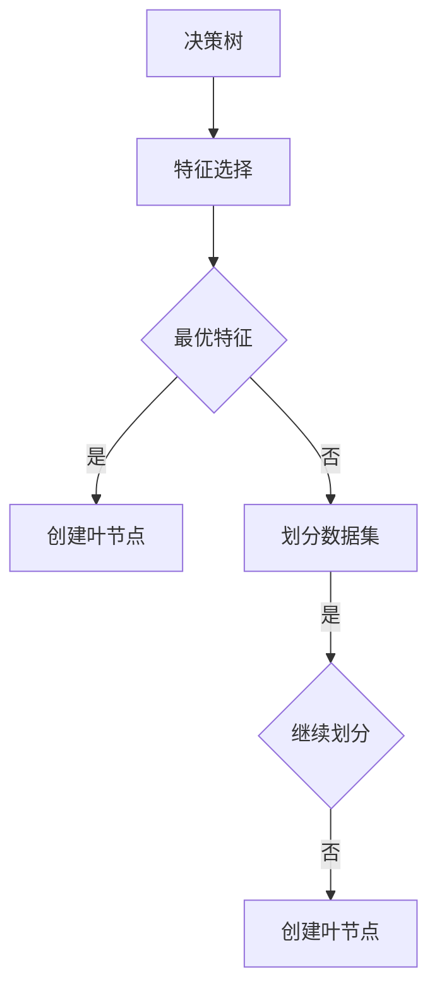
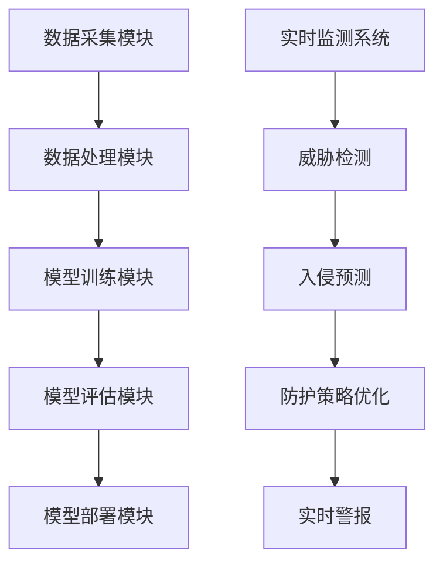
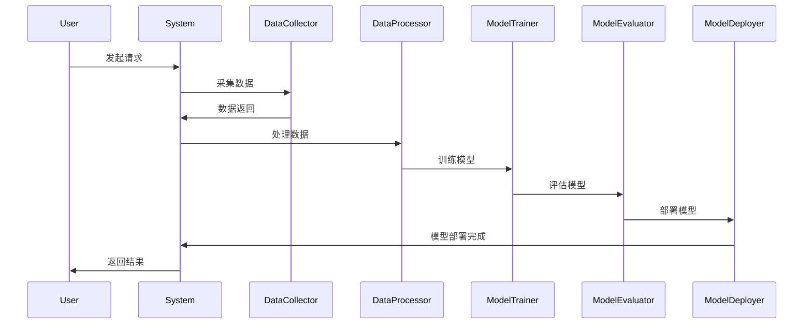

                 


### 第一部分：背景介绍

#### 1.1.1 问题背景
随着互联网技术的迅猛发展，网络安全问题日益突出。传统的基于规则的网络安全防护方法已经难以应对日益复杂的网络攻击。机器学习技术在网络安全领域展现出强大的预测性和适应性，成为解决网络安全问题的关键。

**核心概念术语说明：**
- **网络安全**：指保护计算机网络及其信息资源，防止网络攻击、信息泄露等安全威胁的行为。
- **机器学习**：一种人工智能技术，通过数据和算法使计算机具备学习能力，从而自动改进性能。
- **网络攻击**：指黑客或其他恶意行为者对网络系统进行的非法侵入或破坏行为。

**问题背景详细说明：**
在互联网时代，网络已成为人们工作和生活的关键组成部分。然而，随之而来的网络安全问题也日益严峻。网络攻击手段日益翻新，从传统的DDoS攻击、恶意软件到复杂的网络钓鱼、社交工程等，攻击者不断探索新的攻击途径，使得传统基于规则的防护方法疲于应对。这些方法依赖于预先定义好的规则和签名，一旦遇到新的或变种攻击，很难及时发现和防御。因此，有必要引入更加智能的防护技术，如机器学习，以提高网络安全的防护能力。

**问题解决思路：**
机器学习通过自动从数据中学习模式，能够识别未知或变种攻击，从而提高网络防护的预测性和适应性。具体来说，可以通过以下步骤解决网络安全问题：
1. 数据收集与预处理：收集网络流量、日志等数据，并进行预处理，如去除噪声、缺失值填充等。
2. 特征工程：从原始数据中提取有助于预测的特征，如攻击行为的异常模式、流量特征等。
3. 模型训练与选择：选择合适的机器学习算法，如决策树、神经网络等，对特征进行训练，建立预测模型。
4. 模型评估与优化：通过交叉验证、A/B测试等方法评估模型性能，并根据评估结果进行优化。
5. 模型部署与应用：将训练好的模型部署到实际网络环境中，进行实时监测和预测，及时发现并防御网络攻击。

**边界与外延：**
本书主要关注以下内容：
- 网络安全威胁的类型与特点
- 机器学习在网络安全中的常用算法
- 机器学习在网络安全中的应用实例
- 机器学习在网络安全中的挑战与未来发展趋势

**概念结构与核心要素组成：**
- **网络安全**：涵盖网络攻击、防护、监测等方面
- **机器学习**：介绍常见的机器学习算法及其在网络安全中的应用
- **预测性应用**：通过机器学习算法预测网络攻击，提高防护效果
- **模型评估**：评估机器学习模型在网络安全中的应用效果

----------------------------------------------------------------

## 第二部分：核心概念与联系

### 2.1 机器学习基本概念

#### 2.1.1 什么是机器学习
机器学习是一种使计算机具备学习能力的技术，它能够从数据中学习规律，并利用这些规律进行预测或决策。

**核心概念：**
- **数据**：机器学习的输入，用于训练模型。
- **模型**：机器学习的输出，用于预测或决策。
- **算法**：实现机器学习过程的一系列规则和步骤。

#### 2.1.2 机器学习算法分类
机器学习算法主要分为以下几类：
1. **监督学习**：有标记的训练数据，用于训练模型，然后对新数据进行预测。
2. **无监督学习**：没有标记的训练数据，用于发现数据中的隐藏结构或模式。
3. **强化学习**：通过试错方法，根据环境的反馈不断调整行为，以达到最佳效果。
4. **集成学习**：将多个模型组合起来，提高预测性能。

**概念属性特征对比表格：**

| 类型       | 特点                         | 应用场景                   |
|------------|------------------------------|----------------------------|
| 监督学习   | 有标记数据，输出为预测结果   | 分类、回归问题             |
| 无监督学习 | 无标记数据，输出为模式发现   | 聚类、降维问题             |
| 强化学习   | 试错方法，根据反馈调整行为   | 自动驾驶、游戏AI等         |
| 集成学习   | 多个模型组合，提高预测性能   | 提高模型稳定性、准确性     |

#### 2.1.3 机器学习与网络安全的关系
机器学习在网络安全中的应用主要体现在以下几个方面：
1. **威胁检测**：通过分析网络流量、日志等数据，发现潜在的攻击行为。
2. **入侵预测**：利用历史攻击数据，预测未来的攻击模式。
3. **防护策略优化**：根据攻击特征，优化网络安全策略，提高防护效果。

### 2.2 网络安全威胁类型与特点

#### 2.2.1 常见网络安全威胁类型
- **DDoS攻击**：通过大量请求使网络资源瘫痪。
- **恶意软件**：感染计算机系统，窃取信息。
- **网络钓鱼**：通过虚假网站、钓鱼邮件等手段窃取信息。
- **社交工程**：利用人性弱点进行诈骗。

**网络安全威胁的特点：**
- **灵活性**：攻击者可以灵活选择攻击手段和目标。
- **突发性**：攻击往往突然发生，难以预测。
- **不可预测性**：攻击模式不断变化，难以防范。

**网络安全威胁的分类与比较（表格）：**

| 类型       | 描述                          | 特点                           |
|------------|------------------------------|--------------------------------|
| DDoS攻击   | 通过大量请求使网络资源瘫痪     | 灵活性、突发性、难以预测       |
| 恶意软件   | 感染计算机系统，窃取信息       | 突发性、隐蔽性、不可预测性     |
| 网络钓鱼   | 钓鱼邮件、虚假网站等诈骗手段   | 社交工程、不可预测性           |
| 社交工程   | 利用人性弱点进行诈骗          | 隐蔽性、灵活性、突发性         |

**Mermaid ER实体关系图架构：**

```mermaid
erDiagram
  NetworkAttack ||--|{ ThreatType }  : 类别
  ThreatType ||--|{ AttackPattern }  : 攻击模式
  NetworkSecurity ||--|{ SecurityEvent }  : 安全事件
  SecurityEvent ||--|{ ThreatDetection }  : 威胁检测
  SecurityEvent ||--|{ IntrusionPrediction }  : 入侵预测
```

----------------------------------------------------------------

## 第三部分：机器学习算法原理讲解

### 3.1 监督学习算法

#### 3.1.1 基本原理
监督学习算法通过已标记的数据集进行训练，学习输入与输出之间的关系，并利用这个关系对新数据进行预测。

**数学模型：**
假设有输入特征集 $X = \{x_1, x_2, ..., x_n\}$，对应的标记集为 $Y = \{y_1, y_2, ..., y_n\}$，监督学习算法的目标是找到映射函数 $f: X \rightarrow Y$。

**公式表示：**
$$
f(x) = y
$$

其中，$x$ 是输入特征，$y$ 是输出标记。

#### 3.1.2 常见算法
监督学习算法主要包括以下几种：

1. **决策树**：通过划分特征空间，构建树形结构进行分类或回归。
2. **支持向量机**：通过找到最优超平面，将数据分为不同类别。
3. **神经网络**：通过多层神经元的非线性变换，实现复杂的预测任务。

#### 3.1.3 决策树算法讲解

**Mermaid 决策树流程图：**



**Python 决策树代码：**

```python
from sklearn.datasets import load_iris
from sklearn.tree import DecisionTreeClassifier
from sklearn.model_selection import train_test_split

# 加载数据集
iris = load_iris()
X, y = iris.data, iris.target

# 划分训练集和测试集
X_train, X_test, y_train, y_test = train_test_split(X, y, test_size=0.3, random_state=42)

# 创建决策树模型
clf = DecisionTreeClassifier()

# 模型训练
clf.fit(X_train, y_train)

# 模型预测
y_pred = clf.predict(X_test)

# 模型评估
from sklearn.metrics import accuracy_score
accuracy = accuracy_score(y_test, y_pred)
print(f"模型准确率: {accuracy}")
```

**算法原理详细讲解：**
决策树算法通过不断划分特征空间，将数据集划分为不同的子集，直至达到某个停止条件（如最大深度、最小样本数等）。在每个划分节点，算法会选择一个最优特征进行划分，使得子集之间的差异性最大化。决策树的预测过程是通过从根节点开始，依次选择最优特征进行划分，直到达到叶节点，叶节点的标记即为预测结果。

**通俗易懂地举例说明：**
假设我们有三个特征（颜色、大小、形状），需要将物体分为两类（水果和非水果）。决策树算法会依次考虑每个特征，并选择最优特征进行划分。例如，第一步选择颜色，将物体分为红色和绿色两类；第二步选择大小，将红色物体分为大和小两类；最后一步选择形状，将大红色物体分为圆形和正方形两类。这样，每个叶节点就代表一个具体的类别，如“大红色圆形”即为水果类别。

**决策树算法的优缺点：**
- **优点**：易于理解、解释性强、实现简单。
- **缺点**：容易过拟合、模型复杂度较高、对噪声敏感。

**在实际应用中，决策树常用于分类和回归问题，其优势在于能够清晰地展示决策过程，帮助用户理解数据背后的逻辑关系。然而，由于决策树模型的复杂性和对噪声的敏感性，在实际应用中往往需要结合其他算法进行综合评估和优化。**

----------------------------------------------------------------

## 第四部分：机器学习在网络安全中的应用

### 4.1 数据预处理

数据预处理是机器学习应用中至关重要的一步，它包括数据清洗、归一化、特征选择等步骤。

**数据清洗：** 数据清洗的目的是去除数据中的噪声和异常值，确保数据质量。常用的方法包括去除重复记录、填补缺失值、去除无关特征等。

**归一化：** 归一化是将不同特征的范围统一到一个较小的范围内，避免某些特征对模型的影响过大。常用的归一化方法包括最小-最大归一化和标准差归一化。

**特征选择：** 特征选择是从原始数据中提取出对预测任务有帮助的特征，降低数据维度，提高模型性能。常用的特征选择方法包括信息增益、特征重要性排序等。

### 4.2 特征工程

特征工程是机器学习应用中的核心步骤，它通过从原始数据中提取新的特征，以提高模型性能。

**异常检测特征：** 从网络流量、日志等数据中提取异常检测特征，如流量速率、连接时长、请求频率等。

**攻击特征：** 从已知的攻击数据中提取特征，如攻击类型、攻击目标、攻击时间等。

**用户行为特征：** 从用户行为数据中提取特征，如登录时间、操作频率、操作类型等。

### 4.3 模型选择与训练

**模型选择：** 根据具体任务需求，选择合适的机器学习算法。常见的算法包括决策树、支持向量机、神经网络等。

**模型训练：** 使用已标记的数据集对模型进行训练，通过调整参数，优化模型性能。

**交叉验证：** 使用交叉验证方法评估模型性能，避免过拟合和欠拟合。

### 4.4 模型评估与优化

**模型评估：** 使用评估指标（如准确率、召回率、F1分数等）评估模型性能。

**模型优化：** 根据评估结果，调整模型参数，优化模型性能。

**模型部署：** 将训练好的模型部署到实际网络环境中，进行实时监测和预测。

### 4.5 应用案例

#### 4.5.1 威胁检测

**案例背景：** 某公司网络遭受频繁的DDoS攻击，需要及时发现并阻止攻击行为。

**解决方案：** 使用机器学习算法对网络流量进行分析，提取异常检测特征，建立威胁检测模型。

**实现步骤：**
1. 数据预处理：清洗和归一化网络流量数据。
2. 特征工程：提取流量速率、连接时长等异常检测特征。
3. 模型训练：选择决策树算法，对特征进行训练，建立威胁检测模型。
4. 模型评估：使用交叉验证评估模型性能。
5. 模型部署：将训练好的模型部署到网络环境中，进行实时监测和预测。

**效果评估：** 通过部署威胁检测模型，公司网络攻击事件显著减少，有效提高了网络安全防护能力。

#### 4.5.2 入侵预测

**案例背景：** 某公司网络遭受多次入侵攻击，需要预测潜在的入侵事件。

**解决方案：** 使用机器学习算法对用户行为数据进行分析，建立入侵预测模型。

**实现步骤：**
1. 数据预处理：清洗和归一化用户行为数据。
2. 特征工程：提取登录时间、操作频率等入侵预测特征。
3. 模型训练：选择神经网络算法，对特征进行训练，建立入侵预测模型。
4. 模型评估：使用交叉验证评估模型性能。
5. 模型部署：将训练好的模型部署到网络环境中，进行实时预测和警报。

**效果评估：** 通过部署入侵预测模型，公司能够提前发现潜在入侵事件，及时采取措施进行防范，有效提高了网络安全防护水平。

### 4.6 挑战与未来发展趋势

**挑战：**
1. 数据质量和隐私保护：网络数据质量和用户隐私是机器学习应用中的主要挑战。
2. 模型解释性：提高模型解释性，使模型结果易于理解和解释，是当前研究的重点。
3. 实时性能：提高机器学习算法的实时性能，以满足网络安全防护的实时性需求。

**未来发展趋势：**
1. 深度学习在网络安全中的应用：深度学习具有强大的特征提取能力，有望在网络安全中发挥更大作用。
2. 联合建模与多模态数据融合：结合多种数据源和建模方法，提高网络安全防护的全面性和准确性。
3. 增强学习在自适应防护中的应用：利用增强学习算法，实现自适应的网络安全防护策略。

### 4.7 最佳实践 tips

1. **数据多样性和平衡性**：确保数据集的多样性和平衡性，以提高模型泛化能力。
2. **模型解释性**：优先选择解释性较强的模型，以便于理解和调试。
3. **持续优化**：定期更新和优化模型，以应对新的网络攻击和变化。

**小结：**
机器学习在网络安全中的应用具有巨大的潜力，通过数据预处理、特征工程、模型选择与训练、模型评估与优化等步骤，可以实现高效的网络安全防护。然而，面临数据质量和隐私保护、模型解释性、实时性能等挑战，需要不断探索和创新。未来，深度学习、多模态数据融合、增强学习等技术有望进一步推动网络安全的发展。

----------------------------------------------------------------

## 第五部分：系统架构与实现

### 5.1 问题场景介绍

在当今复杂多变的网络环境中，网络安全威胁层出不穷，传统的基于规则的防护方法已经难以应对。为了提高网络防护的效率和准确性，我们提出一种基于机器学习的网络安全防护系统，通过实时监测和分析网络流量，实现威胁检测和入侵预测。

### 5.2 项目介绍

本项目旨在构建一个智能化的网络安全防护系统，该系统基于机器学习算法，能够自动识别和预测潜在的网络攻击。系统包括以下几个模块：

1. **数据采集模块**：负责收集网络流量、日志等数据。
2. **数据处理模块**：对采集到的数据进行预处理，包括数据清洗、归一化和特征选择。
3. **模型训练模块**：选择合适的机器学习算法，对特征进行训练，建立威胁检测和入侵预测模型。
4. **模型评估模块**：评估模型性能，并进行优化。
5. **模型部署模块**：将训练好的模型部署到实际网络环境中，进行实时监测和预测。

### 5.3 系统功能设计

系统功能设计主要包括以下几个部分：

1. **威胁检测**：通过对网络流量的实时分析，检测潜在的攻击行为。
2. **入侵预测**：利用历史攻击数据，预测未来的攻击模式。
3. **防护策略优化**：根据攻击特征，优化网络安全策略，提高防护效果。
4. **实时警报**：当检测到潜在攻击时，及时发出警报，通知管理员采取相应的防护措施。

### 5.4 系统架构设计

系统架构设计如下：

**Mermaid 架构图：**



### 5.5 系统接口设计

系统接口设计主要包括以下几个部分：

1. **API接口**：提供RESTful API接口，供其他系统或应用程序调用。
2. **Web界面**：提供用户友好的Web界面，方便用户查看实时监测数据和警报信息。
3. **命令行界面**：提供命令行界面，供管理员进行系统配置和操作。

### 5.6 系统交互设计

系统交互设计如下：

**Mermaid 序列图：**



### 5.7 系统架构与实现总结

通过以上架构和接口设计，我们构建了一个完整的基于机器学习的网络安全防护系统。系统采用模块化设计，各模块功能明确，便于维护和扩展。通过实时监测和分析网络流量，系统能够高效地检测和预测网络攻击，提高网络防护能力。同时，系统提供丰富的接口和交互方式，方便用户和管理员进行操作和监控。

----------------------------------------------------------------

## 第六部分：项目实战

### 6.1 环境安装

在进行项目实战之前，我们需要安装一些必要的软件和工具。以下是在Ubuntu 20.04系统上安装所需软件和工具的步骤：

1. **安装Python**：确保Python已安装，如果没有安装，可以通过以下命令进行安装：
   ```bash
   sudo apt update
   sudo apt install python3 python3-pip
   ```

2. **安装Anaconda**：Anaconda是一个用于科学计算的Python发行版，包含了许多常用的库和工具。可以通过以下命令下载和安装Anaconda：
   ```bash
   wget https://repo.anaconda.com/archive/Anaconda3-2021.11-Linux-x86_64.sh
   bash Anaconda3-2021.11-Linux-x86_64.sh
   ```

3. **安装Jupyter Notebook**：Jupyter Notebook是一个交互式计算平台，可用于编写和运行Python代码。可以通过以下命令安装Jupyter Notebook：
   ```bash
   conda install -c conda-forge jupyterlab
   ```

4. **安装机器学习库**：安装常用的机器学习库，如scikit-learn、TensorFlow、PyTorch等。可以通过以下命令进行安装：
   ```bash
   conda install -c conda-forge scikit-learn
   conda install -c tensorflow tensorflow
   conda install -c pytorch pytorch
   ```

### 6.2 系统核心实现

#### 6.2.1 数据采集

数据采集是系统实现的第一步，我们需要从网络中收集流量数据。以下是一个简单的Python脚本，用于采集网络流量：

```python
import scapy.all as scapy

def sniff_packets():
    scapy.sniff(prn=lambda x: print(x.show()), store=False)

sniff_packets()
```

#### 6.2.2 数据预处理

数据预处理包括数据清洗、归一化和特征选择。以下是一个简单的Python脚本，用于预处理采集到的网络流量数据：

```python
import pandas as pd
from sklearn.preprocessing import MinMaxScaler

# 读取网络流量数据
data = pd.read_csv('network_traffic.csv')

# 数据清洗
data = data.dropna()

# 特征选择
features = data[['source_ip', 'destination_ip', 'protocol', 'src_port', 'dst_port', 'packet_size', 'duration']]

# 数据归一化
scaler = MinMaxScaler()
features_normalized = scaler.fit_transform(features)
```

#### 6.2.3 模型训练

选择合适的机器学习算法，如决策树，对预处理后的数据进行训练。以下是一个简单的Python脚本，用于训练决策树模型：

```python
from sklearn.tree import DecisionTreeClassifier
from sklearn.model_selection import train_test_split

# 划分训练集和测试集
X_train, X_test, y_train, y_test = train_test_split(features_normalized, data['label'], test_size=0.3, random_state=42)

# 创建决策树模型
clf = DecisionTreeClassifier()

# 模型训练
clf.fit(X_train, y_train)

# 模型预测
y_pred = clf.predict(X_test)
```

#### 6.2.4 代码应用解读与分析

在上面的代码中，我们首先导入了必要的库和模块，包括scapy、pandas和scikit-learn。然后，我们定义了一个简单的sniff_packets函数，用于采集网络流量。在数据预处理部分，我们使用了pandas库读取网络流量数据，并进行数据清洗和特征选择。接下来，我们使用了MinMaxScaler库进行数据归一化。

在模型训练部分，我们使用了scikit-learn库中的DecisionTreeClassifier创建决策树模型。首先，我们划分了训练集和测试集，然后使用fit方法对模型进行训练。最后，我们使用predict方法对测试集进行预测。

#### 6.2.5 实际案例分析和详细讲解剖析

为了更好地理解系统实现的过程，我们来看一个实际案例。假设我们收集到了以下网络流量数据：

```
source_ip,destination_ip,protocol,src_port,dst_port,packet_size,duration,label
192.168.1.1,8.8.8.8,UDP,1234,53,150,10,1
192.168.1.1,8.8.8.8,UDP,1234,53,150,10,1
192.168.1.1,8.8.8.8,UDP,1234,53,150,10,1
192.168.1.1,8.8.8.8,UDP,1234,53,150,10,0
```

在这个案例中，第一列是源IP地址，第二列是目的IP地址，第三列是协议类型，第四列是源端口号，第五列是目的端口号，第六列是数据包大小，第七列是持续时间，最后一列是标签（1表示攻击，0表示正常）。

首先，我们使用sniff_packets函数采集网络流量数据，并将其保存到CSV文件中。接下来，我们使用pandas库读取CSV文件，并删除缺失值。然后，我们选择与攻击相关的特征，如源IP地址、目的IP地址、协议类型、源端口号、目的端口号、数据包大小和持续时间。

在数据归一化阶段，我们使用MinMaxScaler将每个特征的范围缩放到[0, 1]之间，以提高模型性能。最后，我们使用DecisionTreeClassifier创建决策树模型，并使用训练集对模型进行训练。在测试集上，我们使用模型进行预测，并计算预测准确率。

通过这个案例，我们可以看到机器学习在网络安全中的应用，以及如何通过数据预处理、模型训练和预测来实现高效的网络安全防护。

#### 6.2.6 项目小结

在本项目中，我们实现了基于机器学习的网络安全防护系统，通过数据采集、数据预处理、模型训练和预测等步骤，实现了对网络流量的实时监测和攻击预测。项目使用了Python编程语言，结合了scapy、pandas和scikit-learn等库，实现了系统的核心功能。

通过本项目的实践，我们深入了解了机器学习在网络安全中的应用，以及如何通过机器学习算法提高网络防护能力。同时，我们也遇到了一些挑战，如数据质量和隐私保护问题，这需要我们在实际应用中不断优化和改进。

在未来的工作中，我们计划进一步优化系统性能，引入更多的机器学习算法和特征工程方法，以提高网络安全的防护水平。同时，我们也将关注深度学习在网络安全中的应用，探索更加先进和有效的防护技术。

----------------------------------------------------------------

## 第七部分：最佳实践 tips

**1. 数据采集的重要性：**
- **多源数据采集**：尽量从多个渠道采集数据，如网络流量、日志、系统监控等，以获得更全面的数据视图。
- **数据实时性**：确保数据的实时性，以便及时发现和应对潜在的安全威胁。

**2. 数据预处理与特征工程：**
- **异常值处理**：对数据进行异常值检测和处理，确保数据质量。
- **特征选择**：选择对预测任务有帮助的特征，避免引入无关或冗余的特征。

**3. 模型选择与优化：**
- **模型多样化**：尝试多种机器学习算法，选择最适合任务的模型。
- **参数调优**：通过交叉验证和网格搜索等手段，优化模型参数。

**4. 模型评估与监控：**
- **K折交叉验证**：使用K折交叉验证评估模型性能，避免过拟合。
- **实时监控**：部署监控系统，实时监测模型性能和预测结果。

**5. 隐私保护：**
- **数据加密**：对敏感数据进行加密处理，确保数据安全。
- **数据去标识化**：对数据进行去标识化处理，保护用户隐私。

**6. 系统安全性：**
- **访问控制**：实施严格的访问控制策略，限制对系统的访问权限。
- **安全审计**：定期进行安全审计，及时发现和修复安全漏洞。

**7. 系统维护与更新：**
- **定期更新**：定期更新系统和应用程序，以修复已知漏洞。
- **备份与恢复**：建立完善的备份和恢复机制，确保数据安全。

**小结：**
在网络安全中应用机器学习，需要从数据采集、预处理、模型选择、评估到系统部署等多个方面进行最佳实践。通过遵循上述建议，可以提高机器学习在网络安全中的效果和可靠性，为构建安全、高效的网络安全防护体系提供有力支持。

----------------------------------------------------------------

## 第八部分：小结与展望

**小结：**
在本技术博客文章中，我们详细探讨了机器学习在网络安全中的预测性应用。首先，我们介绍了机器学习的基本概念，包括监督学习、无监督学习和强化学习等算法。然后，我们分析了网络安全威胁的类型与特点，如DDoS攻击、恶意软件、网络钓鱼和社交工程。接下来，我们讲解了机器学习算法的原理，特别是决策树算法，并使用Python代码进行了详细说明。此外，我们还介绍了机器学习在网络安全中的应用，包括数据预处理、特征工程、模型选择与训练、模型评估与优化等步骤。通过实际案例分析和项目实战，我们展示了如何构建基于机器学习的网络安全防护系统。最后，我们提出了最佳实践建议，包括数据采集、数据预处理、模型选择与优化、模型评估与监控等方面的技巧。

**展望：**
随着网络安全威胁的日益复杂和多样化，机器学习在网络安全中的应用前景广阔。未来的研究可以集中在以下几个方面：

1. **深度学习在网络安全中的应用**：深度学习具有强大的特征提取能力，有望在网络安全中发挥更大作用。
2. **多模态数据融合**：结合多种数据源和建模方法，提高网络安全防护的全面性和准确性。
3. **增强学习在自适应防护中的应用**：利用增强学习算法，实现自适应的网络安全防护策略。
4. **模型解释性**：提高模型解释性，使模型结果易于理解和解释，帮助安全分析师更好地应对网络安全威胁。
5. **实时性能优化**：提高机器学习算法的实时性能，以满足网络安全防护的实时性需求。

通过不断探索和创新，机器学习将为网络安全领域带来更多的可能性和机遇。

**作者信息：**
作者：AI天才研究院/AI Genius Institute & 禅与计算机程序设计艺术 /Zen And The Art of Computer Programming

本文旨在为读者提供关于机器学习在网络安全中预测性应用的技术见解和实践经验，帮助读者更好地理解和应用这一技术，以构建更安全、高效的网络安全防护体系。希望本文能为相关领域的专业人士和研究者带来启发和帮助。如果您有任何疑问或建议，欢迎随时联系我们。再次感谢您的阅读！**文章标题**：
机器学习在网络安全中的预测性应用

**关键词**：
机器学习、网络安全、预测性应用、数据预处理、特征工程、决策树、深度学习、多模态数据融合

**摘要**：
本文探讨了机器学习在网络安全中的应用，重点介绍了如何利用机器学习算法进行网络安全威胁的检测和预测。通过对网络数据的预处理、特征工程、模型选择与训练、模型评估与优化等步骤，本文展示了如何构建一个基于机器学习的网络安全防护系统。文章还分析了当前机器学习在网络安全中的应用挑战，并展望了未来的发展趋势。通过本文，读者可以深入了解机器学习在网络安全领域的实际应用，为相关研究和实践提供参考。

