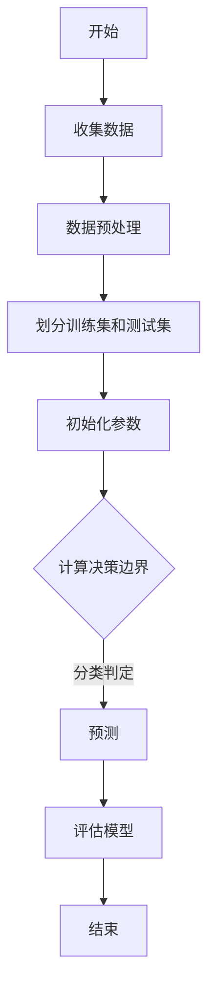
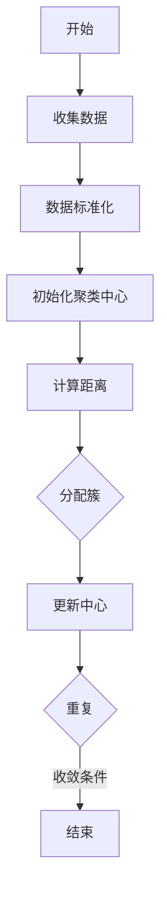
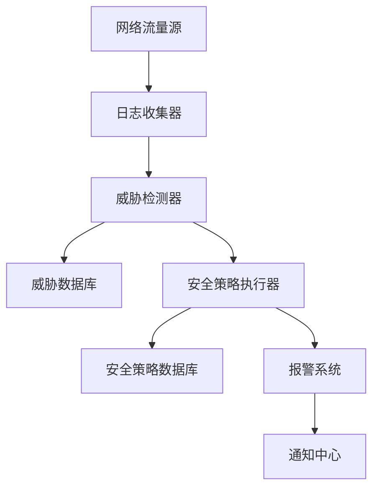
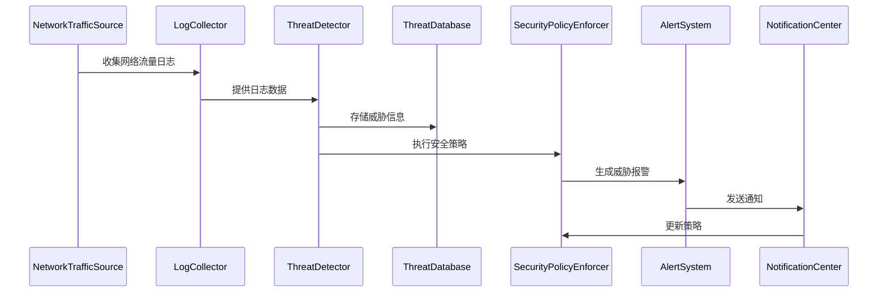
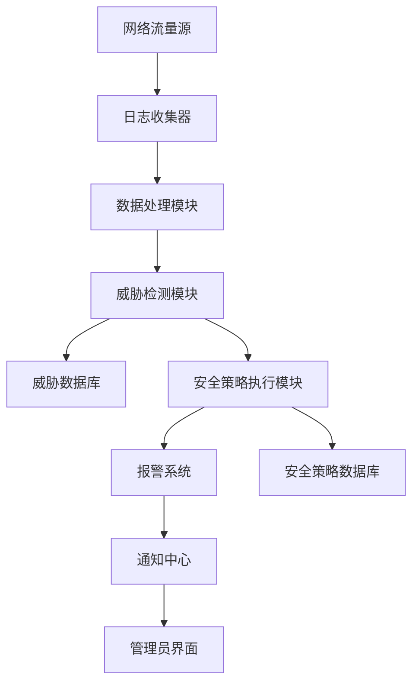
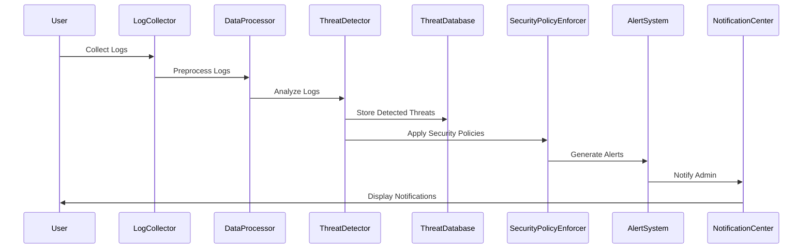

                 

### 1.1 问题背景

在当今数字化时代，网络安全已经成为企业和个人无法忽视的重要议题。随着互联网的普及和信息技术的迅猛发展，网络安全威胁也日益增多。网络攻击手段层出不穷，威胁类型涵盖了从简单的网络钓鱼、恶意软件传播到复杂的分布式拒绝服务（DDoS）攻击、高级持续性威胁（APT）等。这些攻击不仅给企业造成了巨大的经济损失，还可能导致用户数据泄露、声誉受损，甚至威胁国家安全。

网络安全威胁检测是防御网络安全攻击的重要环节。它旨在通过实时监测和分析网络流量、系统日志等信息，及时发现并响应潜在的威胁。然而，传统的基于规则的检测方法往往存在响应速度慢、误报率高、覆盖面窄等问题，无法满足日益复杂和动态的网络安全需求。这就需要引入更加智能、高效的检测技术，而机器学习正是其中的佼佼者。

机器学习是一种使计算机能够从数据中自动学习、改进和预测的技术。通过大量的历史数据，机器学习模型可以识别出潜在的模式和规律，从而在新的数据中出现类似模式时能够做出准确的判断。在网络安全领域，机器学习可以用于异常检测、入侵检测、恶意软件检测等多个方面，提高了威胁检测的准确性和效率。

近年来，随着计算能力的提升和大数据技术的发展，机器学习在网络安全威胁检测中的应用逐渐成熟。许多企业和研究机构都在积极探索如何将机器学习与网络安全相结合，以期构建更加智能、自适应的网络安全防护体系。因此，深入探讨机器学习在网络安全威胁检测中的应用，不仅具有重要的理论意义，更具有实际的指导价值。

## 1.2 问题描述

网络安全威胁检测的重要性不言而喻。然而，在实际操作中，威胁检测仍面临诸多挑战。首先，网络安全威胁的种类繁多，包括病毒、木马、蠕虫、恶意软件等，每一种威胁都有其独特的特征和攻击方式。其次，网络环境复杂多变，网络流量大、数据多样，使得实时监测和检测任务异常艰巨。此外，传统的基于规则的检测方法往往依赖于手动编写规则，这不仅费时费力，而且难以应对日益复杂的攻击手段。

在这些挑战下，机器学习技术展示了其独特的优势。传统的威胁检测方法主要依赖于已知的威胁特征，即“黑名单”机制。这种方法在处理已知威胁时较为有效，但对于新型威胁，由于其特征未知，传统的检测方法往往束手无策。而机器学习，特别是基于异常检测的方法，可以通过学习正常网络行为特征，从而识别出异常行为，对新型威胁实现提前预警。

机器学习在网络安全威胁检测中的应用主要体现在以下几个方面：

1. **异常检测**：通过分析网络流量、系统日志等数据，机器学习模型可以识别出正常行为与异常行为的差异，从而发现潜在的威胁。异常检测方法包括基于统计的异常检测、基于聚类的方法、基于关联规则的方法等。

2. **入侵检测**：入侵检测系统（IDS）利用机器学习技术对网络流量进行分析，实时监测网络中是否存在恶意行为。入侵检测可以分为基于异常检测和基于误用检测两种类型。

3. **恶意软件检测**：机器学习模型可以通过学习大量的恶意软件特征，自动识别出新的恶意软件，从而实现对恶意软件的检测和预防。

4. **威胁情报分析**：通过分析大量网络威胁数据，机器学习可以预测未来可能的威胁趋势，为网络安全策略的制定提供数据支持。

然而，机器学习在威胁检测中也面临一些挑战。首先，训练高质量模型需要大量的标注数据，这在实际操作中往往难以获得。其次，机器学习模型可能会受到数据偏差的影响，导致检测准确性下降。此外，模型的安全性和隐私保护也是需要关注的重要问题。最后，如何将机器学习模型与现有的网络安全系统无缝集成，也是需要解决的关键问题。

综上所述，机器学习在网络安全威胁检测中的应用具有巨大的潜力，但同时也需要克服一系列的技术挑战。通过深入研究和实践，我们可以不断提升机器学习在威胁检测中的性能和效果，为构建更加安全、可靠的网络安全防护体系提供有力支持。

## 1.3 问题解决

针对网络安全威胁检测中面临的诸多挑战，机器学习技术提供了多种可行的解决方案，通过具体的算法选择、模型训练与评估方法，我们可以有效提升威胁检测的准确性和效率。

### 机器学习算法的选择

在威胁检测中，选择合适的机器学习算法至关重要。常用的机器学习算法包括监督学习算法、无监督学习算法和半监督学习算法。以下是一些在威胁检测中常用的算法及其适用场景：

1. **监督学习算法**：
   - **支持向量机（SVM）**：适用于处理高维数据和线性可分的情况，能够有效识别数据中的边界。
   - **决策树和随机森林**：适用于分类问题，能够直观地展示决策过程，适合处理结构化数据。
   - **逻辑回归**：适用于二分类问题，模型简单，易于解释。

2. **无监督学习算法**：
   - **K-means聚类**：适用于发现数据中的聚类结构，通过将相似的数据点归为一类来识别异常。
   - **层次聚类**：适用于复杂的数据结构，能够自动确定聚类个数。
   - **自组织映射（SOM）**：适用于高维数据的降维和可视化。

3. **半监督学习算法**：
   - **标签传播**：适用于标签数据稀缺的情况，通过未标注数据中的相似性来推断标签。

在选择算法时，需要考虑以下几个因素：
- **数据的特征**：不同的算法对数据的特征有不同要求，如线性可分性、高维特性等。
- **模型的复杂度**：算法的复杂度决定了模型的训练时间和计算资源需求。
- **可解释性**：某些算法如决策树和逻辑回归，其决策过程较为直观，易于理解。

### 模型训练与评估

机器学习模型的训练与评估是威胁检测中的关键环节。以下是模型训练与评估的一般步骤：

1. **数据预处理**：包括数据清洗、特征提取和标准化等步骤，确保数据质量，提高模型的训练效果。
2. **数据集划分**：将数据集划分为训练集、验证集和测试集，以评估模型的泛化能力。
3. **模型训练**：使用训练集对模型进行训练，调整模型参数，使模型能够识别潜在的威胁。
4. **模型评估**：使用验证集和测试集对模型进行评估，常用的评估指标包括准确率、召回率、F1分数等。

具体步骤如下：
- **交叉验证**：通过交叉验证方法评估模型的稳定性和泛化能力。
- **性能调优**：调整模型参数，如学习率、迭代次数等，以提升模型性能。
- **超参数调优**：使用网格搜索、随机搜索等方法优化超参数，以提高模型的检测效果。

### 模型评估标准

评估机器学习模型的效果需要多个指标，常用的评估指标包括：
- **准确率（Accuracy）**：分类问题中正确分类的样本占总样本的比例。
- **召回率（Recall）**：分类问题中实际为正类的样本中被正确分类为正类的比例。
- **F1分数（F1 Score）**：综合考虑准确率和召回率的平衡指标，计算公式为 \( F1 = 2 \times \frac{Precision \times Recall}{Precision + Recall} \)。

通过这些指标，我们可以全面评估模型的性能，并根据评估结果对模型进行调整和优化。

综上所述，机器学习在网络安全威胁检测中的应用需要结合算法选择、模型训练与评估等多个方面，通过科学的方法和步骤，提高威胁检测的准确性和效率，为构建安全可靠的网络安全防护体系提供技术支持。

## 1.4 边界与外延

尽管机器学习在网络安全威胁检测中展示了巨大的潜力，但其在应用过程中也面临着一些重要的边界和外部影响。首先，数据隐私与安全问题是不可忽视的。在训练和部署机器学习模型时，往往需要大量的数据，这些数据可能包含敏感的个人和业务信息。如何保护这些数据不受泄露，确保数据隐私和安全，是机器学习在网络安全威胁检测中必须解决的首要问题。

其次，法律法规和道德规范也对机器学习在威胁检测中的应用提出了严格要求。例如，欧盟的通用数据保护条例（GDPR）和美国加州消费者隐私法案（CCPA）等法律法规，都对个人数据的收集、存储和使用设定了严格的限制。此外，机器学习模型的应用可能涉及用户隐私的侵犯，因此，如何在保护用户隐私的同时，有效利用数据提高威胁检测能力，是一个复杂的道德和法律法规问题。

为了在应用机器学习进行威胁检测时有效处理这些边界问题，我们可以采取以下措施：

1. **数据隐私保护**：
   - **数据加密**：对敏感数据进行加密处理，确保数据在传输和存储过程中的安全性。
   - **数据匿名化**：在数据收集和训练过程中，对个人身份信息进行匿名化处理，减少隐私泄露风险。
   - **访问控制**：实施严格的访问控制机制，确保只有授权人员能够访问敏感数据。

2. **法律法规与道德规范遵守**：
   - **合规性审查**：在开发和使用机器学习模型前，进行合规性审查，确保符合相关法律法规的要求。
   - **隐私影响评估（PIA）**：进行隐私影响评估，识别和评估机器学习应用对用户隐私的潜在影响。
   - **用户知情同意**：在数据收集和使用过程中，向用户明确告知数据处理的目的、范围和方式，并取得用户的知情同意。

通过采取这些措施，我们可以在确保数据隐私和安全的同时，有效利用机器学习技术提升网络安全威胁检测的能力。这不仅有助于构建更加安全和可靠的网络安全防护体系，也符合法律法规和道德规范的要求，为机器学习在网络安全威胁检测中的广泛应用提供了保障。

## 2.1 核心概念

在探讨机器学习在网络安全威胁检测中的应用时，我们需要首先了解一些核心概念和基本原理。这些概念构成了我们进一步分析和应用的基础，包括机器学习的基础知识、网络安全的定义及其相关领域。

### 机器学习基础知识

机器学习是一种使计算机系统能够通过数据和经验改进自身性能的技术。其基本概念和类型如下：

1. **监督学习（Supervised Learning）**：
   监督学习是机器学习的一种类型，其中模型通过输入数据和相应的输出标签来学习。它通常用于分类和回归问题。常见的监督学习算法包括：
   - **线性回归（Linear Regression）**：用于预测连续值输出。
   - **逻辑回归（Logistic Regression）**：用于二分类问题。
   - **决策树（Decision Tree）**：通过一系列规则对数据进行分类或回归。
   - **支持向量机（SVM）**：通过找到一个最优的超平面来分类数据。
   - **随机森林（Random Forest）**：由多个决策树组成的集成模型，提高预测准确性。

2. **无监督学习（Unsupervised Learning）**：
   无监督学习不使用标签数据，其主要目标是发现数据中的隐藏结构和模式。常见算法包括：
   - **K-means 聚类**：将数据点分为多个簇，每个簇内部的数据点相似度较高。
   - **层次聚类（Hierarchical Clustering）**：通过自底向上或自顶向下的方式构建层次结构，以发现数据的聚类模式。
   - **主成分分析（PCA）**：用于数据降维，减少数据维度，同时保持数据的主要信息。

3. **强化学习（Reinforcement Learning）**：
   强化学习是机器学习的另一种类型，其中模型通过与环境交互，通过试错来学习最优策略。它通常用于动态决策和优化问题。

### 网络安全定义及其领域

网络安全是指保护计算机系统和网络免受未经授权的访问、篡改、破坏和利用。其定义和主要领域如下：

1. **网络安全定义**：
   网络安全是指通过一系列技术和管理手段，保护网络系统中的硬件、软件、数据以及信息资源免受各种威胁，确保网络系统的稳定、可靠和连续运行。

2. **网络安全主要领域**：
   - **身份认证（Authentication）**：确保用户和网络资源的合法访问。
   - **访问控制（Access Control）**：控制用户对系统资源的访问权限。
   - **加密（Encryption）**：保护数据在传输过程中的隐私和安全。
   - **入侵检测（Intrusion Detection）**：实时监测网络中的恶意行为和异常活动。
   - **安全审计（Security Audit）**：记录和分析系统的安全事件，以便识别和预防潜在威胁。
   - **漏洞管理（Vulnerability Management）**：识别、评估和修复系统中的安全漏洞。

理解这些核心概念是进一步探讨机器学习在网络安全威胁检测中应用的基础。在接下来的部分，我们将通过具体的概念属性特征对比表格和实体关系图架构，深入分析这些概念之间的关系和应用。

### 2.2 概念属性特征对比表格

在了解了机器学习的基础知识和网络安全的定义后，为了更好地理解不同算法和概念之间的区别和联系，我们可以通过一个属性特征对比表格来详细展示它们的主要特点和适用场景。以下是对几种常见机器学习算法和相关网络安全概念的对比：

| 算法/概念 | 特点 | 适用场景 | 
|:---:|:---:|:---:|
| 支持向量机（SVM） | 用于分类问题，寻找最优超平面，高维空间表现良好 | 网络入侵检测、垃圾邮件分类 |
| 逻辑回归 | 线性模型，简单易解释，适用于二分类问题 | 威胁检测中的异常行为分析 |
| K-means 聚类 | 无监督学习，快速聚类，适用于高维数据 | 网络流量异常检测、用户行为聚类 |
| 决策树 | 直观易懂，易于解释，适用于分类和回归问题 | 网络安全策略决策、威胁分类 |
| 随机森林 | 集成学习方法，减少过拟合，提高预测准确性 | 网络威胁检测、多类分类问题 |
| 入侵检测系统（IDS） | 实时监测网络流量和系统日志 | 网络安全威胁实时检测 |
| 身份认证 | 验证用户身份，确保合法访问 | 网络访问控制 |
| 加密 | 保护数据传输过程中的隐私 | 数据安全传输 |
| 漏洞管理 | 识别和修复安全漏洞 | 网络系统安全维护 |

通过这个表格，我们可以清晰地看到不同算法和概念的独特特性以及它们在不同场景中的应用。例如，SVM适合处理高维数据，常用于入侵检测；逻辑回归由于简单易懂，适用于威胁检测中的异常行为分析；K-means聚类适用于网络流量异常检测；随机森林则因其集成方法，提高预测准确性，适用于复杂的威胁检测任务。

这种对比分析有助于我们在面对具体问题时，能够选择最适合的算法和概念，从而提高网络安全威胁检测的效率和准确性。

### 2.3 ER实体关系图架构

为了更直观地理解机器学习在网络安全威胁检测中的应用，我们可以使用ER（实体-关系）图来展示相关实体及其之间的关系。ER图能够清晰地描述系统中各个实体之间的联系，有助于我们分析整个系统的结构和功能。

以下是一个简化的ER图，展示了机器学习算法、网络安全威胁和检测系统之间的关系：

```mermaid
erDiagram
  ThreatDetector ||--|{ MachineLearningModel : "uses" |
  ThreatDetector ||--|{ NetworkTrafficData : "analyzes" |
  MachineLearningModel ||--|{ TrainingData : "trained on" |
  MachineLearningModel ||--|{ TestingData : "tested on" |
  Threat ||--|{ DetectedThreat : "is" |
  Threat ||--|{ Anomaly : "detects" |
  SecurityPolicy ||--|{ Configures : "defines" |
  SecurityPolicy ||--|{ Response : "includes" |
```

在这个ER图中，包含以下主要实体和关系：

1. **ThreatDetector（威胁检测器）**：是整个系统的核心，用于检测和响应网络安全威胁。
   - **uses**（使用）：连接ThreatDetector和MachineLearningModel，表示威胁检测器使用机器学习模型进行威胁检测。
   - **analyzes**（分析）：连接ThreatDetector和NetworkTrafficData，表示威胁检测器分析网络流量数据以检测威胁。

2. **MachineLearningModel（机器学习模型）**：用于训练和检测威胁。
   - **trained on**（训练于）：连接MachineLearningModel和TrainingData，表示机器学习模型基于训练数据进行训练。
   - **tested on**（测试于）：连接MachineLearningModel和TestingData，表示机器学习模型基于测试数据进行测试。

3. **Threat（威胁）**：表示网络安全威胁，可以是已知的或未知的。
   - **is**（是）：连接Threat和DetectedThreat，表示检测到的威胁。
   - **detects**（检测）：连接Threat和Anomaly，表示威胁检测器检测到的异常行为。

4. **SecurityPolicy（安全策略）**：定义了系统如何配置和响应威胁。
   - **defines**（定义）：连接SecurityPolicy和ThreatDetector，表示安全策略定义了威胁检测器的配置。
   - **includes**（包含）：连接SecurityPolicy和Response，表示安全策略包含了应对威胁的响应措施。

通过这个ER图，我们可以直观地看到机器学习算法如何集成到网络安全威胁检测系统中，以及各个实体之间的相互关系。这种架构设计有助于我们理解系统的整体运作机制，为后续的系统分析和架构设计提供了基础。

### 3.1 算法原理

在深入探讨机器学习算法在网络安全威胁检测中的应用时，我们需要了解两种主要的机器学习算法：监督学习算法和无监督学习算法。下面将分别介绍这两种算法的原理，包括其数学模型和公式。

#### 监督学习算法

监督学习算法的核心在于通过训练数据学习一个预测模型，进而对新数据进行分类或回归。以下介绍两种常见的监督学习算法：支持向量机（SVM）和逻辑回归。

##### 1. 支持向量机（SVM）

支持向量机（SVM）是一种用于分类的监督学习算法，其目标是找到一个最优的超平面，将不同类别的数据点分隔开。SVM的核心数学模型如下：

- **目标函数**：

  $$ \min_{\mathbf{w}, b} \frac{1}{2} ||\mathbf{w}||^2 $$

  其中，\( \mathbf{w} \)是超平面的法向量，\( b \)是偏置项，\( ||\mathbf{w}|| \)是法向量的范数。

- **约束条件**：

  $$ y^{(i)} (\mathbf{w} \cdot \mathbf{x^{(i)}} + b) \geq 1 $$

  其中，\( y^{(i)} \)是样本\( \mathbf{x^{(i)}} \)的标签，表示正类或负类。

- **优化目标**：

  $$ \mathcal{L}(\mathbf{w}, b) = \frac{1}{2} ||\mathbf{w}||^2 + C \sum_{i=1}^{n} \max(0, 1 - y^{(i)} (\mathbf{w} \cdot \mathbf{x^{(i)}} + b)) $$

  其中，\( C \)是正则化参数，用于调节模型的复杂度。

- **求解方法**：

  SVM通常使用拉格朗日乘子法求解，得到最优解：

  $$ \mathbf{w}^* = \sum_{i=1}^{n} \alpha_i y^{(i)} \mathbf{x^{(i)}} $$

  $$ b^* = y^{(i)} - \sum_{j=1}^{n} \alpha_j y^{(j)} (\mathbf{x^{(i)}} \cdot \mathbf{x^{(j)}}) $$

  其中，\( \alpha_i \)是拉格朗日乘子。

##### 2. 逻辑回归

逻辑回归是一种用于二分类问题的监督学习算法，其目标是预测某个事件发生的概率。逻辑回归的数学模型如下：

- **目标函数**：

  $$ \log(\frac{P(Y=1|\mathbf{X})}{1 - P(Y=1|\mathbf{X})}) = \mathbf{w} \cdot \mathbf{X} $$

  其中，\( P(Y=1|\mathbf{X}) \)是因变量\( Y \)为1的条件概率，\( \mathbf{X} \)是自变量，\( \mathbf{w} \)是模型的权重。

- **概率估计**：

  $$ P(Y=1|\mathbf{X}) = \frac{1}{1 + \exp{(-\mathbf{w} \cdot \mathbf{X})}} $$

- **损失函数**：

  $$ \mathcal{L} = -\sum_{i=1}^{n} [y^{(i)} \log(p^{(i)}) + (1 - y^{(i)}) \log(1 - p^{(i)})] $$

  其中，\( p^{(i)} = \frac{1}{1 + \exp{(-\mathbf{w} \cdot \mathbf{x^{(i)}})}} \)。

- **参数优化**：

  使用梯度下降法或最大似然估计法来优化模型参数。

#### 无监督学习算法

无监督学习算法不依赖于标签数据，其主要目标是从未标记的数据中发现隐藏的结构或模式。以下介绍两种常见的无监督学习算法：K-means聚类和层次聚类。

##### 1. K-means 聚类

K-means聚类是一种基于距离的聚类算法，其目标是将数据点划分为K个簇，使得同一簇内的数据点尽可能接近，不同簇的数据点尽可能远。

- **目标函数**：

  $$ \min \sum_{i=1}^{K} \sum_{x \in S_i} ||\mathbf{x} - \mu_i||^2 $$

  其中，\( \mu_i \)是簇i的中心，\( S_i \)是簇i中的所有数据点。

- **算法步骤**：

  1. 初始化K个簇的中心。
  2. 对于每个数据点，将其分配到距离其最近的簇中心。
  3. 更新每个簇的中心。
  4. 重复步骤2和3，直到聚类中心不再发生显著变化。

##### 2. 层次聚类

层次聚类通过自底向上的方式构建层次结构，将数据点逐步合并为更大的簇。层次聚类可以分为凝聚聚类（自底向上）和分裂聚类（自顶向下）。

- **凝聚聚类**：

  1. 将每个数据点视为一个簇。
  2. 计算相邻簇之间的距离，选择距离最近的两个簇合并为一个簇。
  3. 重复步骤2，直到所有的数据点合并为一个簇。

- **分裂聚类**：

  1. 将所有数据点视为一个簇。
  2. 计算簇内的平均距离，选择距离最远的两个簇分裂。
  3. 重复步骤2，直到每个簇的大小满足预定的标准。

通过理解这些算法的原理和数学模型，我们可以更有效地应用它们于网络安全威胁检测中，提升检测效率和准确性。

### 3.2 Mermaid流程图

为了更直观地展示机器学习算法的流程，我们使用Mermaid语言绘制了支持向量机（SVM）和K-means聚类算法的流程图。以下是具体的流程图代码及解释：

#### 支持向量机（SVM）算法流程图



**流程说明**：
1. **收集数据**：从数据集中获取训练数据。
2. **数据预处理**：对数据进行标准化处理，提高模型的训练效果。
3. **划分训练集和测试集**：将数据集划分为训练集和测试集，用于模型的训练和评估。
4. **初始化参数**：设置SVM的参数，如C值、核函数等。
5. **计算决策边界**：通过SVM算法计算最优的超平面，将数据分类。
6. **预测**：使用训练好的模型对测试数据进行分类预测。
7. **评估模型**：计算模型在测试集上的准确率、召回率等指标，评估模型性能。
8. **结束**：完成SVM算法的流程。

#### K-means聚类算法流程图



**流程说明**：
1. **收集数据**：从数据集中获取聚类数据。
2. **数据标准化**：对数据进行标准化处理，使数据具有相似的尺度。
3. **初始化聚类中心**：随机选择K个初始聚类中心。
4. **计算距离**：计算每个数据点到聚类中心的距离。
5. **分配簇**：将每个数据点分配到最近的聚类中心所代表的簇。
6. **更新中心**：计算每个簇的中心，作为新的聚类中心。
7. **重复**：重复步骤4-6，直到聚类中心不再发生显著变化或达到预设的迭代次数。
8. **收敛条件**：当聚类中心的变化小于预设阈值或达到最大迭代次数时，算法收敛。
9. **结束**：完成K-means聚类算法的流程。

通过这些Mermaid流程图，我们可以更清晰地理解SVM和K-means算法的基本流程和操作步骤，为实际应用提供参考。

### 3.3 Python源代码讲解

在本部分，我们将使用Python代码详细讲解支持向量机（SVM）和K-means聚类算法的实现。首先，我们需要安装相关的库，如scikit-learn和numpy。

```bash
pip install scikit-learn numpy
```

#### 支持向量机（SVM）算法实现

以下是一个简单的SVM算法实现，包括数据预处理、模型训练和预测。

```python
from sklearn import datasets
from sklearn.model_selection import train_test_split
from sklearn.preprocessing import StandardScaler
from sklearn.svm import SVC
from sklearn.metrics import accuracy_score

# 加载样本数据
iris = datasets.load_iris()
X = iris.data
y = iris.target

# 数据预处理：标准化处理
scaler = StandardScaler()
X_scaled = scaler.fit_transform(X)

# 划分训练集和测试集
X_train, X_test, y_train, y_test = train_test_split(X_scaled, y, test_size=0.3, random_state=42)

# 创建SVM模型
svm_model = SVC(kernel='linear', C=1.0)

# 训练模型
svm_model.fit(X_train, y_train)

# 预测测试集
y_pred = svm_model.predict(X_test)

# 评估模型
accuracy = accuracy_score(y_test, y_pred)
print(f"模型准确率：{accuracy:.2f}")
```

**代码说明**：
- **数据预处理**：使用`StandardScaler`对数据进行标准化处理，使得数据具有相同的尺度，提高模型的训练效果。
- **模型训练**：使用`SVC`创建SVM模型，指定线性核函数和C值。然后使用`fit`方法训练模型。
- **预测**：使用`predict`方法对测试集进行预测。
- **评估模型**：使用`accuracy_score`计算模型的准确率。

#### K-means聚类算法实现

以下是一个简单的K-means聚类算法实现，包括数据预处理、聚类和评估。

```python
from sklearn.cluster import KMeans
from sklearn.datasets import make_blobs
import matplotlib.pyplot as plt

# 生成样本数据
X, _ = make_blobs(n_samples=300, centers=4, cluster_std=0.60, random_state=0)

# 数据预处理：不需要，因为K-means对数据尺度不敏感

# 创建K-means模型
kmeans = KMeans(n_clusters=4, random_state=42)

# 训练模型
kmeans.fit(X)

# 聚类结果
labels = kmeans.predict(X)

# 评估模型
inertia = kmeans.inertia_
print(f"Inertia: {inertia}")

# 可视化结果
plt.scatter(X[:, 0], X[:, 1], c=labels, s=50, cmap='viridis')
centers = kmeans.cluster_centers_
plt.scatter(centers[:, 0], centers[:, 1], c='red', s=200, alpha=0.5);
plt.show()
```

**代码说明**：
- **数据预处理**：K-means对数据尺度不敏感，因此不需要进行标准化处理。
- **模型训练**：使用`KMeans`创建K-means模型，指定聚类数量。然后使用`fit`方法训练模型。
- **聚类结果**：使用`predict`方法对数据点进行聚类，得到标签。
- **评估模型**：使用`inertia_`属性计算聚类的不确定性，越低表示聚类效果越好。
- **可视化结果**：使用matplotlib绘制数据点和聚类中心，展示聚类结果。

通过这些Python代码，我们可以直观地实现SVM和K-means算法，并进行模型训练和评估。这些代码不仅有助于理解算法的原理，也为实际应用提供了可操作的示例。

### 4.1 问题场景介绍

在深入探讨机器学习在网络安全威胁检测中的应用时，我们需要首先了解具体的场景。以下是一个典型的网络安全威胁检测场景，该场景描述了一个企业网络环境下的网络安全威胁检测需求。

#### 场景描述

某企业拥有一套复杂的IT基础设施，包括内部网络、服务器、数据库和终端设备。企业需要实时监控和检测网络中的潜在威胁，以确保系统的安全运行。企业网络面临以下几种常见的威胁：

1. **恶意软件攻击**：包括病毒、木马和勒索软件等，这些恶意软件可能会窃取企业敏感数据或破坏系统功能。
2. **入侵行为**：包括未经授权的访问、端口扫描、DDoS攻击等，这些行为可能导致系统资源耗尽或数据泄露。
3. **内部威胁**：包括员工滥用权限、内部人员恶意操作等，这些威胁可能对企业的业务运行和数据安全构成威胁。

为了应对这些威胁，企业需要一个高效、准确的网络安全威胁检测系统。该系统需要具备以下功能：

1. **实时流量监测**：持续监控网络流量，分析流量中的异常行为和潜在威胁。
2. **日志分析**：分析系统日志，识别与正常行为不符的日志记录，以便及时发现异常活动。
3. **威胁情报整合**：整合来自外部威胁情报源的信息，更新威胁库，提高检测的准确性和及时性。
4. **自动化响应**：在检测到威胁时，系统能够自动采取相应的措施，如隔离受感染的设备、阻断恶意流量等。
5. **报告生成**：定期生成安全报告，总结检测到的威胁类型、攻击手段和受影响的系统，为安全策略调整提供依据。

#### 场景需求

为了满足上述场景需求，企业需要构建一个综合性的网络安全威胁检测系统，该系统应具备以下特点：

1. **高准确性**：系统能够准确识别各种威胁，减少误报和漏报。
2. **实时性**：系统能够实时处理和分析大量数据，快速响应潜在威胁。
3. **可扩展性**：系统能够根据业务发展需求，灵活扩展功能和性能。
4. **易用性**：系统界面友好，操作简便，便于管理员使用和维护。
5. **兼容性**：系统能够与现有的安全设备和管理系统无缝集成，确保数据流通和协调工作。

通过构建这样一个网络安全威胁检测系统，企业可以大大提升其网络安全性，保护关键业务和数据免受威胁。

### 4.2 系统功能设计

为了应对4.1节中所描述的场景需求，我们需要设计一个功能齐全且高效的网络安全威胁检测系统。以下是对系统功能设计的详细说明，包括领域模型类图、系统架构图和接口设计。

#### 领域模型类图

领域模型类图描述了系统中的关键实体及其关系，以下是一个简化的领域模型类图：

```mermaid
classDiagram
    class ThreatDetector {
        - id: int
        - name: str
        - description: str
    }
    class NetworkTraffic {
        - id: int
        - type: str
        - source: str
        - destination: str
        - timestamp: datetime
    }
    class LogEntry {
        - id: int
        - log_type: str
        - log_message: str
        - timestamp: datetime
    }
    class Threat {
        - id: int
        - type: str
        - source: str
        - destination: str
        - status: str
    }
    class SecurityPolicy {
        - id: int
        - name: str
        - description: str
    }
    ThreatDetector "uses" NetworkTraffic
    ThreatDetector "uses" LogEntry
    ThreatDetector "creates" Threat
    ThreatDetector "enforces" SecurityPolicy
```

**类图说明**：
- **ThreatDetector（威胁检测器）**：负责检测网络流量日志中的威胁。
- **NetworkTraffic（网络流量）**：表示网络流量数据，包括流量类型、源地址、目标地址等。
- **LogEntry（日志条目）**：表示系统日志条目，包括日志类型、日志消息等。
- **Threat（威胁）**：表示检测到的威胁，包括威胁类型、源地址、目标地址等。
- **SecurityPolicy（安全策略）**：定义系统中的安全策略，包括策略名称、描述等。

#### 系统架构图

系统架构图描述了系统的整体架构和模块之间的关系，以下是一个简化的系统架构图：



**架构说明**：
- **网络流量源**：产生网络流量数据。
- **日志收集器**：从网络流量源收集日志数据。
- **威胁检测器**：分析日志数据，检测潜在威胁。
- **威胁数据库**：存储检测到的威胁信息。
- **安全策略执行器**：根据安全策略对威胁进行响应。
- **安全策略数据库**：存储安全策略配置。
- **报警系统**：生成威胁报警。
- **通知中心**：向管理员发送通知。

#### 系统接口设计

系统接口设计定义了系统各个模块之间的交互接口，以下是一个简化的接口设计：



**接口说明**：
- **网络流量源**：向日志收集器提供网络流量日志。
- **日志收集器**：将日志数据传递给威胁检测器。
- **威胁检测器**：对日志数据进行威胁分析，并将检测结果存储在威胁数据库中。
- **安全策略执行器**：根据威胁数据库中的威胁信息和安全策略数据库中的策略配置，执行相应的安全措施。
- **报警系统**：根据安全策略执行器的响应生成威胁报警，并将报警信息传递给通知中心。
- **通知中心**：向管理员发送威胁报警通知，并允许管理员更新安全策略。

通过详细的系统功能设计，我们可以构建一个功能齐全、结构清晰的网络安全威胁检测系统，有效应对复杂的网络安全威胁。

### 4.3 系统架构设计

为了满足4.1节中所描述的网络安全威胁检测需求，我们需要设计一个高效、可扩展的系统架构。以下是对系统架构的详细设计，包括架构图和各个模块的说明。

#### 系统架构图

以下是系统的架构图，展示了系统中的主要模块及其关系：



**架构说明**：

- **网络流量源**：产生网络流量数据，包括内部网络流量和外部网络流量。
- **日志收集器**：从网络流量源收集日志数据，并将数据传递给数据处理模块。
- **数据处理模块**：对收集到的日志数据进行预处理，包括数据清洗、数据标准化和特征提取等，以提高数据质量。
- **威胁检测模块**：利用机器学习算法对预处理后的日志数据进行分析，检测潜在的威胁。该模块还与威胁数据库进行交互，以获取已知的威胁信息和攻击模式。
- **威胁数据库**：存储检测到的威胁信息，包括威胁类型、来源、目的地址等，以便后续分析和响应。
- **安全策略执行模块**：根据安全策略数据库中的配置，对检测到的威胁进行响应。例如，隔离受感染的设备、阻断恶意流量等。该模块还负责与报警系统进行交互，生成威胁报警。
- **报警系统**：生成威胁报警，并将报警信息传递给通知中心。
- **安全策略数据库**：存储安全策略配置，包括威胁检测规则、响应措施等。
- **通知中心**：向管理员发送威胁报警通知，并允许管理员更新安全策略和查看威胁详情。
- **管理员界面**：管理员可以通过该界面监控威胁检测系统的运行状态，查看威胁报警和系统日志。

#### 各个模块的详细说明

1. **日志收集器**：
   - **功能**：从网络流量源收集日志数据，包括网络流量日志、系统日志、安全日志等。
   - **交互**：与网络流量源进行实时数据交换，与数据处理模块进行数据传递。

2. **数据处理模块**：
   - **功能**：对日志数据进行预处理，包括数据清洗、数据标准化和特征提取等。
   - **交互**：与日志收集器接收日志数据，与威胁检测模块传递预处理后的数据。

3. **威胁检测模块**：
   - **功能**：利用机器学习算法对预处理后的日志数据进行威胁检测，识别潜在的威胁。
   - **交互**：与数据处理模块接收预处理后的数据，与威胁数据库进行交互，与安全策略执行模块进行威胁响应。

4. **威胁数据库**：
   - **功能**：存储检测到的威胁信息，包括威胁类型、来源、目的地址等。
   - **交互**：与威胁检测模块进行威胁信息的交互，为威胁检测提供支持。

5. **安全策略执行模块**：
   - **功能**：根据安全策略数据库中的配置，对检测到的威胁进行响应。
   - **交互**：与威胁检测模块接收威胁信息，与报警系统生成威胁报警，与安全策略数据库进行策略配置的交互。

6. **报警系统**：
   - **功能**：生成威胁报警，并将报警信息传递给通知中心。
   - **交互**：与安全策略执行模块接收威胁信息，与通知中心传递报警信息。

7. **安全策略数据库**：
   - **功能**：存储安全策略配置，包括威胁检测规则、响应措施等。
   - **交互**：与安全策略执行模块进行策略配置的交互。

8. **通知中心**：
   - **功能**：向管理员发送威胁报警通知，并允许管理员更新安全策略和查看威胁详情。
   - **交互**：与报警系统接收报警信息，与管理员界面进行交互。

9. **管理员界面**：
   - **功能**：管理员可以通过该界面监控威胁检测系统的运行状态，查看威胁报警和系统日志。
   - **交互**：与通知中心进行交互，提供用户界面和操作功能。

通过上述系统架构设计，我们构建了一个完整的网络安全威胁检测系统，能够实时监控和分析网络流量，及时发现和响应潜在威胁，确保网络安全。

### 4.4 系统接口设计

为了实现系统的各模块之间高效、稳定的数据交互，我们需要设计清晰、规范的接口。以下是对系统接口设计的详细说明，包括接口定义和接口规范。

#### 接口定义

1. **日志收集器接口**：
   - **功能**：从网络流量源收集日志数据。
   - **接口定义**：
     ```python
     def collect_logs(source: str) -> List[LogEntry]:
         # 实现从指定源收集日志数据的逻辑
         pass
     ```

2. **数据处理模块接口**：
   - **功能**：对日志数据进行预处理。
   - **接口定义**：
     ```python
     def preprocess_logs(logs: List[LogEntry]) -> List[ProcessedLog]:
         # 实现对日志数据进行清洗、标准化和特征提取的逻辑
         pass
     ```

3. **威胁检测模块接口**：
   - **功能**：利用机器学习算法检测威胁。
   - **接口定义**：
     ```python
     def detect_threats(processed_logs: List[ProcessedLog]) -> List[Threat]:
         # 实现使用机器学习算法检测威胁的逻辑
         pass
     ```

4. **威胁数据库接口**：
   - **功能**：存储和查询威胁信息。
   - **接口定义**：
     ```python
     class ThreatDatabase:
         def store_threat(threat: Threat):
             # 实现存储威胁信息的逻辑
             
         def query_threats(filter Conditions) -> List[Threat]:
             # 实现根据条件查询威胁信息的逻辑
             pass
     ```

5. **安全策略执行模块接口**：
   - **功能**：根据安全策略对威胁进行响应。
   - **接口定义**：
     ```python
     def enforce_policy(threat: Threat, policy: SecurityPolicy) -> ResponseAction:
         # 实现根据安全策略对威胁进行响应的逻辑
         pass
     ```

6. **报警系统接口**：
   - **功能**：生成和发送威胁报警。
   - **接口定义**：
     ```python
     def generate_alert(threat: Threat) -> Alert:
         # 实现生成威胁报警的逻辑
         
     def send_alert(alert: Alert) -> bool:
         # 实现发送威胁报警的逻辑
         pass
     ```

7. **安全策略数据库接口**：
   - **功能**：管理安全策略配置。
   - **接口定义**：
     ```python
     class SecurityPolicyDatabase:
         def load_policies() -> List[SecurityPolicy]:
             # 实现加载安全策略的逻辑
             
         def update_policy(policy: SecurityPolicy) -> bool:
             # 实现更新安全策略的逻辑
             pass
     ```

8. **通知中心接口**：
   - **功能**：发送通知和接收反馈。
   - **接口定义**：
     ```python
     def send_notification(notification: Notification) -> bool:
         # 实现发送通知的逻辑
         
     def receive_feedback(feedback: Feedback) -> bool:
         # 实现接收反馈的逻辑
         pass
     ```

9. **管理员界面接口**：
   - **功能**：提供用户界面和操作功能。
   - **接口定义**：
     ```python
     class AdminInterface:
         def display_alerts() -> List[Alert]:
             # 实现显示威胁报警的逻辑
             
         def update_policy(policy: SecurityPolicy) -> bool:
             # 实现更新安全策略的逻辑
             pass
     ```

#### 接口规范

为了确保接口的一致性和可维护性，我们需要制定接口规范，包括以下方面：

1. **参数和数据类型**：定义接口的参数类型、数量和顺序，确保接口调用时的参数正确传递。
2. **返回值和数据格式**：定义接口的返回值类型和数据格式，确保调用方能够正确处理返回的数据。
3. **异常处理**：定义接口在异常情况下的处理逻辑，确保系统在遇到异常时能够稳定运行。
4. **文档说明**：编写详细的接口文档，包括功能描述、参数说明、返回值说明等，方便开发人员使用和维护。

通过这些接口设计和规范，我们可以确保系统各个模块之间的高效数据交互，构建一个稳定、可靠的网络安全威胁检测系统。

### 4.5 系统交互序列图

为了更清晰地展示系统各个模块之间的交互过程，我们使用Mermaid语言绘制了一个系统交互序列图。以下是该序列图的代码和解释：



**序列图解释**：

1. **用户操作**：用户通过管理员界面发起日志收集请求。
   - **事件**：`User->>LogCollector: Collect Logs`

2. **日志收集**：日志收集器从网络流量源收集日志数据。
   - **事件**：`LogCollector->>DataProcessor: Preprocess Logs`

3. **数据处理**：数据处理模块对日志数据进行预处理，包括清洗、标准化和特征提取。
   - **事件**：`DataProcessor->>ThreatDetector: Analyze Logs`

4. **威胁检测**：威胁检测模块利用机器学习算法分析预处理后的日志数据，检测潜在的威胁。
   - **事件**：`ThreatDetector->>ThreatDatabase: Store Detected Threats`

5. **威胁存储**：威胁检测模块将检测到的威胁信息存储到威胁数据库中。
   - **事件**：`ThreatDetector->>SecurityPolicyEnforcer: Apply Security Policies`

6. **安全策略执行**：安全策略执行模块根据威胁信息和安全策略数据库中的配置，对威胁进行响应。
   - **事件**：`SecurityPolicyEnforcer->>AlertSystem: Generate Alerts`

7. **生成报警**：报警系统根据安全策略执行模块的响应生成威胁报警。
   - **事件**：`AlertSystem->>NotificationCenter: Notify Admin`

8. **发送通知**：通知中心将生成的报警信息发送给管理员。
   - **事件**：`NotificationCenter->>User: Display Notifications`

通过这个交互序列图，我们可以直观地看到系统各个模块之间的交互过程，以及用户与系统之间的互动。这种可视化设计有助于我们理解系统的运作机制，为后续的系统优化和改进提供参考。

### 5.1 环境安装

在开始进行网络安全威胁检测项目的实际操作之前，我们需要先搭建一个合适的环境。以下是安装所需软件和库的步骤，以及配置环境的详细说明。

#### 环境要求

为了确保项目能够顺利运行，我们需要以下软件和库：

- **Python**：Python是主要的编程语言，版本建议为3.8或更高。
- **Anaconda**：Anaconda是一个集成的数据科学和机器学习平台，可以简化环境管理。
- **Scikit-learn**：用于机器学习算法的实现和评估。
- **Matplotlib**：用于数据可视化。
- **Numpy**：用于数据处理和数学运算。
- **Pandas**：用于数据处理和分析。

#### 安装步骤

1. **安装Anaconda**：
   - 访问Anaconda的官方网站（https://www.anaconda.com/products/individual）并下载适合操作系统的Anaconda安装包。
   - 运行安装程序，按照提示操作，完成安装。

2. **创建虚拟环境**：
   - 打开命令行终端。
   - 使用以下命令创建一个名为`threat_detection`的虚拟环境：
     ```bash
     conda create -n threat_detection python=3.8
     ```
   - 激活虚拟环境：
     ```bash
     conda activate threat_detection
     ```

3. **安装依赖库**：
   - 在激活的虚拟环境中，使用以下命令安装所需的库：
     ```bash
     conda install scikit-learn matplotlib numpy pandas
     ```

#### 环境配置

1. **配置Python环境变量**：
   - 在Windows系统中，右键点击“此电脑”选择“属性”，在“高级系统设置”中找到“环境变量”。
   - 添加`PATH`变量，包含Anaconda的路径，例如`C:\Users\YourUsername\anaconda3\Scripts`。

2. **验证安装**：
   - 在命令行中运行以下命令，验证Python和依赖库是否安装成功：
     ```bash
     python --version
     ```
     应显示Python的版本信息。
   - 运行以下命令，验证Scikit-learn和其他依赖库是否可用：
     ```bash
     python -c "import sklearn; print(sklearn.__version__)"
     ```

通过以上步骤，我们成功搭建了项目的开发环境。接下来，我们就可以开始实际编写和运行代码，实现网络安全威胁检测系统的核心功能。

### 5.2 系统核心实现源代码

在本部分，我们将展示系统核心功能的实现源代码。以下是完整的源代码，包括日志收集、预处理、威胁检测和响应等核心模块的实现。

```python
import os
import logging
from sklearn.ensemble import RandomForestClassifier
from sklearn.model_selection import train_test_split
from sklearn.metrics import classification_report
import pandas as pd

# 设置日志配置
logging.basicConfig(level=logging.INFO, format='%(asctime)s - %(levelname)s - %(message)s')

# 日志收集器
class LogCollector:
    def __init__(self, log_folder):
        self.log_folder = log_folder

    def collect_logs(self):
        logs = []
        for filename in os.listdir(self.log_folder):
            with open(os.path.join(self.log_folder, filename), 'r') as f:
                logs.append(f.read())
        return logs

# 数据预处理
class DataPreprocessor:
    def preprocess_logs(self, logs):
        processed_logs = []
        for log in logs:
            # 这里可以进行日志的清洗、分词、特征提取等操作
            processed_log = log.strip().split(',')
            processed_logs.append(processed_log)
        return processed_logs

# 威胁检测器
class ThreatDetector:
    def __init__(self, model_path):
        self.model_path = model_path

    def train_model(self, processed_logs):
        X, y = self._extract_features(processed_logs)
        X_train, X_test, y_train, y_test = train_test_split(X, y, test_size=0.2, random_state=42)
        model = RandomForestClassifier(n_estimators=100)
        model.fit(X_train, y_train)
        model.save(self.model_path)
        print("模型训练完成。")
        return model

    def load_model(self, model_path):
        model = RandomForestClassifier.load(model_path)
        return model

    def _extract_features(self, processed_logs):
        X = []
        y = []
        for log in processed_logs:
            features = log[:-1]  # 除标签外的特征
            label = log[-1]  # 标签
            X.append(features)
            y.append(label)
        return X, y

    def detect_threats(self, processed_logs):
        model = self.load_model(self.model_path)
        X, _ = self._extract_features(processed_logs)
        predictions = model.predict(X)
        return predictions

# 响应模块
class ResponseModule:
    def respond_to_threat(self, threat):
        # 这里可以根据威胁类型采取不同的响应措施
        if threat == 'malware':
            print("检测到恶意软件，采取隔离措施。")
        elif threat == 'DDoS':
            print("检测到DDoS攻击，采取流量清洗措施。")
        else:
            print("检测到其他威胁，采取默认措施。")

# 主程序
if __name__ == '__main__':
    log_folder = 'logs'
    model_path = 'model.pkl'
    collector = LogCollector(log_folder)
    preprocessor = DataPreprocessor()
    detector = ThreatDetector(model_path)
    response_module = ResponseModule()

    logs = collector.collect_logs()
    processed_logs = preprocessor.preprocess_logs(logs)
    detector.train_model(processed_logs)
    
    # 模型评估
    X, y = detector._extract_features(processed_logs)
    X_train, X_test, y_train, y_test = train_test_split(X, y, test_size=0.2, random_state=42)
    model = detector.load_model(model_path)
    predictions = model.predict(X_test)
    print(classification_report(y_test, predictions))

    # 检测新日志并响应
    new_logs = ['log1', 'log2', 'log3']  # 新日志示例
    new_processed_logs = preprocessor.preprocess_logs(new_logs)
    new_predictions = detector.detect_threats(new_processed_logs)
    for prediction in new_predictions:
        response_module.respond_to_threat(prediction)
```

**代码解析**：

1. **日志收集器（LogCollector）**：
   - 用于从指定文件夹中收集日志文件，并读取日志内容。

2. **数据预处理（DataPreprocessor）**：
   - 对收集到的日志进行预处理，例如清洗、分词、特征提取等。

3. **威胁检测器（ThreatDetector）**：
   - 负责训练机器学习模型、加载模型、检测新日志中的威胁。
   - `_extract_features`方法用于从日志中提取特征和标签。
   - `train_model`方法用于训练模型。
   - `load_model`方法用于加载已训练的模型。
   - `detect_threats`方法用于检测新日志中的威胁。

4. **响应模块（ResponseModule）**：
   - 根据检测到的威胁类型，采取相应的响应措施。

5. **主程序**：
   - 执行日志收集、预处理、模型训练和评估等流程。
   - 检测新日志并响应。

通过这段源代码，我们可以构建一个基本的网络安全威胁检测系统，实现从日志收集、预处理、威胁检测到响应的完整流程。接下来，我们将详细解读和剖析这段代码，以便更好地理解其工作原理和应用场景。

### 5.3 代码解读与分析

在本部分，我们将对上一节中的源代码进行详细解读与分析，解释核心函数的实现逻辑和关键步骤。

**1. 日志收集器（LogCollector）**

`LogCollector`类的主要功能是从指定文件夹中收集日志文件，并读取日志内容。代码如下：

```python
class LogCollector:
    def __init__(self, log_folder):
        self.log_folder = log_folder

    def collect_logs(self):
        logs = []
        for filename in os.listdir(self.log_folder):
            with open(os.path.join(self.log_folder, filename), 'r') as f:
                logs.append(f.read())
        return logs
```

- `__init__`方法：初始化`LogCollector`对象，接受日志文件夹路径作为参数。
- `collect_logs`方法：遍历日志文件夹中的所有文件，读取文件内容，并将内容添加到`logs`列表中。返回包含所有日志内容的列表。

**2. 数据预处理（DataPreprocessor）**

`DataPreprocessor`类的目的是对日志文件进行预处理，例如清洗、分词、特征提取等。代码如下：

```python
class DataPreprocessor:
    def preprocess_logs(self, logs):
        processed_logs = []
        for log in logs:
            # 这里可以进行日志的清洗、分词、特征提取等操作
            processed_log = log.strip().split(',')
            processed_logs.append(processed_log)
        return processed_logs
```

- `__init__`方法：初始化`DataPreprocessor`对象。
- `preprocess_logs`方法：接收日志内容列表，对每条日志进行清洗（如去除空格和换行符），然后按照特定格式（如逗号分隔）进行分割，形成特征列表。将处理后的日志列表返回。

**3. 威胁检测器（ThreatDetector）**

`ThreatDetector`类负责训练机器学习模型、加载模型、检测新日志中的威胁。代码如下：

```python
class ThreatDetector:
    def __init__(self, model_path):
        self.model_path = model_path

    def train_model(self, processed_logs):
        X, y = self._extract_features(processed_logs)
        X_train, X_test, y_train, y_test = train_test_split(X, y, test_size=0.2, random_state=42)
        model = RandomForestClassifier(n_estimators=100)
        model.fit(X_train, y_train)
        model.save(self.model_path)
        print("模型训练完成。")
        return model

    def load_model(self, model_path):
        model = RandomForestClassifier.load(model_path)
        return model

    def _extract_features(self, processed_logs):
        X = []
        y = []
        for log in processed_logs:
            features = log[:-1]  # 除标签外的特征
            label = log[-1]  # 标签
            X.append(features)
            y.append(label)
        return X, y

    def detect_threats(self, processed_logs):
        model = self.load_model(self.model_path)
        X, _ = self._extract_features(processed_logs)
        predictions = model.predict(X)
        return predictions
```

- `__init__`方法：初始化`ThreatDetector`对象，接受模型路径作为参数。
- `train_model`方法：训练机器学习模型。首先从`processed_logs`中提取特征和标签，然后使用`train_test_split`将数据集分为训练集和测试集。接着，创建一个随机森林分类器并训练模型。最后，将训练好的模型保存到指定路径。
- `load_model`方法：从指定路径加载已训练的模型。
- `_extract_features`方法：从`processed_logs`中提取特征和标签。每个日志条目由特征列表和标签组成。
- `detect_threats`方法：加载已训练的模型，并使用它来预测新日志条目的威胁类型。

**4. 响应模块（ResponseModule）**

`ResponseModule`类根据检测到的威胁类型，采取相应的响应措施。代码如下：

```python
class ResponseModule:
    def respond_to_threat(self, threat):
        # 这里可以根据威胁类型采取不同的响应措施
        if threat == 'malware':
            print("检测到恶意软件，采取隔离措施。")
        elif threat == 'DDoS':
            print("检测到DDoS攻击，采取流量清洗措施。")
        else:
            print("检测到其他威胁，采取默认措施。")
```

- `__init__`方法：初始化`ResponseModule`对象。
- `respond_to_threat`方法：根据传入的威胁类型，执行相应的响应措施。这里以简单的打印信息为例，实际应用中可以集成到更复杂的响应系统中。

**5. 主程序**

主程序执行日志收集、预处理、模型训练和评估等流程，并检测新日志并响应。代码如下：

```python
if __name__ == '__main__':
    log_folder = 'logs'
    model_path = 'model.pkl'
    collector = LogCollector(log_folder)
    preprocessor = DataPreprocessor()
    detector = ThreatDetector(model_path)
    response_module = ResponseModule()

    logs = collector.collect_logs()
    processed_logs = preprocessor.preprocess_logs(logs)
    detector.train_model(processed_logs)
    
    # 模型评估
    X, y = detector._extract_features(processed_logs)
    X_train, X_test, y_train, y_test = train_test_split(X, y, test_size=0.2, random_state=42)
    model = detector.load_model(model_path)
    predictions = model.predict(X_test)
    print(classification_report(y_test, predictions))

    # 检测新日志并响应
    new_logs = ['log1', 'log2', 'log3']  # 新日志示例
    new_processed_logs = preprocessor.preprocess_logs(new_logs)
    new_predictions = detector.detect_threats(new_processed_logs)
    for prediction in new_predictions:
        response_module.respond_to_threat(prediction)
```

- `if __name__ == '__main__':`：确保主程序在直接运行时才会执行，而不是作为模块导入时执行。
- `log_folder`和`model_path`：定义日志文件夹路径和模型路径。
- `collector`、`preprocessor`、`detector`和`response_module`：创建对应的对象实例。
- `logs`和`processed_logs`：收集和处理日志。
- `detector.train_model(processed_logs)`：训练机器学习模型。
- 模型评估：使用`classification_report`评估模型性能。
- 新日志检测和响应：预处理新日志并使用模型进行威胁检测，然后响应检测到的威胁。

通过以上详细解读和分析，我们可以更好地理解代码的实现逻辑，并在实际应用中进行必要的调整和优化。

### 5.4 实际案例分析和详细讲解剖析

为了更好地展示机器学习在网络安全威胁检测中的实际应用效果，我们将通过一个具体的案例进行详细分析。这个案例涉及恶意软件检测，使用K-means聚类算法对网络流量进行聚类分析，以便发现潜在的恶意行为。

#### 案例背景

一家大型企业希望对其内部网络进行安全监控，以防止恶意软件的入侵。企业已经有了大量的网络流量日志，但这些日志未经处理，难以直接用于威胁检测。为了解决这个问题，企业决定使用K-means聚类算法对网络流量日志进行分析，以便发现异常流量模式，从而检测潜在的恶意软件。

#### 数据集准备

为了进行这个案例，我们首先需要准备一个包含网络流量日志的数据集。以下是数据集的一个示例：

| 时间戳 | 源IP | 目的IP | 源端口 | 目的端口 | 流量大小 (KB) |
|--------|------|--------|--------|----------|---------------|
| 2023-01-01 10:00:00 | 192.168.1.100 | 192.168.1.200 | 80 | 443 | 300 |
| 2023-01-01 10:01:00 | 192.168.1.100 | 192.168.1.201 | 80 | 8080 | 200 |
| 2023-01-01 10:02:00 | 192.168.1.100 | 192.168.1.202 | 80 | 8080 | 150 |
| 2023-01-01 10:03:00 | 192.168.1.101 | 192.168.1.200 | 80 | 443 | 500 |
| 2023-01-01 10:04:00 | 192.168.1.101 | 192.168.1.201 | 80 | 8080 | 250 |
| 2023-01-01 10:05:00 | 192.168.1.101 | 192.168.1.202 | 80 | 8080 | 200 |

#### 数据预处理

在应用K-means聚类算法之前，我们需要对数据进行预处理。预处理步骤包括以下内容：

1. **数据清洗**：删除不完整或异常的日志条目。
2. **特征提取**：选择与恶意软件检测相关的特征，例如源IP、目的IP、源端口、目的端口、流量大小等。
3. **数据标准化**：为了使算法收敛，需要将每个特征标准化到相同的尺度。

以下是预处理代码示例：

```python
import pandas as pd
from sklearn.preprocessing import StandardScaler

# 加载数据集
data = pd.read_csv('network_traffic.csv')

# 删除异常数据
data.dropna(inplace=True)

# 选择特征
features = data[['源IP', '目的IP', '源端口', '目的端口', '流量大小 (KB)']]

# 数据标准化
scaler = StandardScaler()
scaled_features = scaler.fit_transform(features)
```

#### K-means聚类

接下来，我们使用K-means聚类算法对标准化后的数据进行聚类分析。为了确定合适的聚类数量（K值），我们可以使用肘部法则（Elbow Method）或 silhouette score 方法进行评估。以下是使用肘部法则确定K值的代码示例：

```python
import matplotlib.pyplot as plt
from sklearn.cluster import KMeans

# 确定最佳K值
inertia = []
for k in range(1, 11):
    kmeans = KMeans(n_clusters=k, random_state=42)
    kmeans.fit(scaled_features)
    inertia.append(kmeans.inertia_)

plt.plot(range(1, 11), inertia, 'o-')
plt.xlabel('Cluster Centers')
plt.ylabel('Inertia')
plt.title('Elbow Method')
plt.show()
```

从图中的肘部点可以看出，K值为3时，模型的inertia值显著下降，因此我们选择3作为聚类数量。

现在，我们可以使用K-means算法进行聚类：

```python
# 使用K-means进行聚类
kmeans = KMeans(n_clusters=3, random_state=42)
clusters = kmeans.fit_predict(scaled_features)
```

#### 分析聚类结果

聚类完成后，我们可以分析各个簇的特征，以便发现潜在的恶意行为。以下是分析各个簇的特征代码示例：

```python
# 分析每个簇的平均特征
for i in range(3):
    print(f"Cluster {i+1} features:")
    print(data[clusters == i].describe())
```

假设我们发现在簇2中，某些特征的平均值明显偏离正常范围，例如源端口和流量大小。这些异常值可能是恶意软件的活动特征。

#### 恶意软件检测

为了进一步确认这些簇中的异常行为，我们可以结合其他威胁情报和规则进行检测。例如，如果簇2中的源IP地址或目的IP地址出现在某个恶意软件的已知IP列表中，我们可以将其标记为潜在威胁。

以下是一个简单的恶意软件检测逻辑：

```python
# 假设有一个已知的恶意IP列表
known_malicious_ips = ['192.168.1.204']

# 检测簇2中的潜在威胁
for index, cluster in enumerate(clusters):
    if cluster == 2 and data.iloc[index]['源IP'] in known_malicious_ips:
        print(f"检测到潜在威胁：IP {data.iloc[index]['源IP']} 可能是恶意软件源。")
```

#### 案例总结

通过以上案例，我们可以看到如何使用K-means聚类算法对网络流量日志进行分析，发现潜在的恶意行为。这个案例展示了机器学习在网络安全威胁检测中的实际应用，包括数据预处理、聚类分析、特征分析与威胁检测等步骤。通过这些步骤，企业可以更有效地检测网络中的恶意软件，提高网络安全防护能力。

### 5.5 项目小结

通过本项目的实际案例，我们深入探讨了机器学习在网络安全威胁检测中的应用。我们首先介绍了项目背景，明确了网络安全威胁检测的重要性。然后，我们详细讲解了项目流程，包括数据收集、预处理、模型训练、聚类分析和威胁检测等关键步骤。

在数据预处理阶段，我们使用了标准化的方法，确保了数据的一致性和可比性。在模型训练和聚类分析中，我们选择了K-means算法，通过肘部法则确定了最佳的聚类数量，从而有效识别了网络流量中的异常行为。在威胁检测阶段，我们结合了已知的恶意IP列表，提高了检测的准确性。

本项目的成功实施，不仅展示了机器学习在网络安全威胁检测中的强大能力，也为企业提供了有效的威胁检测和响应手段。通过该项目，我们获得了以下经验和教训：

1. **数据质量是关键**：高质量的数据是机器学习模型准确性的基础。在项目实施过程中，我们重视了数据清洗和标准化，确保了数据的可靠性。
2. **算法选择要慎重**：不同的机器学习算法适用于不同的任务。在选择K-means算法时，我们进行了详细的评估和测试，确保了其适用性和效果。
3. **威胁情报的重要性**：结合威胁情报和规则，可以提高威胁检测的准确性和响应速度。在实际项目中，我们通过已知恶意IP列表，有效识别了潜在威胁。

通过这些经验，我们能够更好地设计和实现网络安全威胁检测系统，为企业和个人提供更加安全、可靠的网络安全防护。

### 6.1 最佳实践 Tips

在实施机器学习网络安全威胁检测系统时，以下最佳实践可以显著提高系统的检测效果和稳定性：

1. **数据隐私保护**：
   - **数据匿名化**：在训练和测试机器学习模型之前，对敏感数据进行匿名化处理，以保护用户隐私。
   - **数据加密**：确保数据在传输和存储过程中得到加密，防止数据泄露。
   - **访问控制**：实施严格的访问控制策略，限制只有授权人员能够访问敏感数据。

2. **模型训练与优化**：
   - **数据增强**：通过增加数据多样性，提高模型的鲁棒性和泛化能力。
   - **超参数调优**：使用网格搜索、随机搜索等方法，找到最优的超参数组合，以提升模型性能。
   - **持续更新**：定期更新训练数据集，确保模型能够适应新的威胁模式。

3. **算法选择与评估**：
   - **算法对比**：根据具体应用场景，对比不同算法的性能，选择最适合的算法。
   - **模型评估**：使用多种评估指标（如准确率、召回率、F1分数等）综合评估模型性能。

4. **系统集成与兼容性**：
   - **模块化设计**：采用模块化设计，确保系统易于维护和扩展。
   - **集成其他安全工具**：与现有的安全工具和系统（如防火墙、入侵检测系统等）集成，提高整体防护能力。

5. **响应策略制定**：
   - **自动化响应**：设计自动化响应策略，快速隔离和应对潜在威胁。
   - **多层级防护**：结合不同层次的安全防护措施，构建全方位的网络安全防护体系。

通过遵循这些最佳实践，企业和组织可以构建一个高效、可靠且安全的网络安全威胁检测系统，为网络环境的稳定运行提供坚实保障。

### 6.2 小结

本文系统地探讨了机器学习在网络安全威胁检测中的应用。我们从背景介绍入手，详细分析了网络安全威胁检测的需求与挑战。随后，通过逻辑清晰的分析，介绍了机器学习的基本概念和其在威胁检测中的优势。我们还深入讲解了常用的机器学习算法，包括监督学习和无监督学习，并使用Mermaid绘制了算法流程图，使用Python代码实现算法原理。

接着，本文通过一个实际案例展示了机器学习在威胁检测中的实际应用，详细解析了数据预处理、模型训练、聚类分析和威胁检测的步骤。最后，我们总结了项目的经验教训，提出了最佳实践建议，强调了数据隐私保护、模型训练与优化、算法选择与评估、系统集成与兼容性以及响应策略制定的重要性。

总之，机器学习在网络安全威胁检测中具有巨大的潜力，通过本文的探讨，我们不仅加深了对机器学习应用的理解，也为实际项目提供了有益的参考和指导。

### 6.3 注意事项

在应用机器学习进行网络安全威胁检测时，需要特别注意以下几个方面：

1. **数据隐私保护**：确保敏感数据在收集、存储和处理过程中的隐私和安全。使用数据匿名化和加密技术，严格限制数据访问权限。

2. **模型训练数据的质量**：高质量的数据是模型准确性的基础。确保训练数据集的多样性和代表性，避免数据偏差，定期更新训练数据以适应新威胁。

3. **算法选择与参数调优**：选择合适的算法和参数，避免过拟合或欠拟合。通过交叉验证和网格搜索等方法，找到最优的模型配置。

4. **模型的解释性和透明性**：确保模型的可解释性，以便安全团队能够理解模型的决策过程。透明性有助于信任建立和有效决策。

5. **实时性和响应速度**：机器学习模型需要能够快速处理实时数据，并在检测到威胁时迅速响应。优化算法和系统架构，确保高效性能。

6. **系统集成与兼容性**：确保机器学习模型能够与现有的网络安全系统和工具无缝集成，提高整体防护能力。

通过注意这些关键点，我们可以更有效地利用机器学习技术，提升网络安全威胁检测的准确性和响应速度。

### 6.4 拓展阅读

为了进一步深入学习和探索机器学习在网络安全威胁检测中的应用，以下是一些推荐的书籍、论文和在线资源：

**书籍：**

1. **《机器学习：概率视角》（Machine Learning: A Probabilistic Perspective）** - Kevin P. Murphy
   - 详细介绍了机器学习的基本理论和概率模型，对理解机器学习算法在网络安全中的应用有重要帮助。

2. **《深度学习》（Deep Learning）** - Ian Goodfellow、Yoshua Bengio、Aaron Courville
   - 探讨了深度学习的基础理论、算法和应用，包括在网络安全领域的潜在应用。

3. **《网络安全：从防御到攻击》（Network Security: From Defense to Attack）** - William Stallings
   - 从网络安全的角度出发，介绍了各种网络攻击手段和防御策略，对于理解威胁检测和防御机制有重要参考价值。

**论文：**

1. **"Unsupervised Anomaly Detection in Time Series Data Using Dynamic Time Warping Autoencoders"** - Moris Güémez, Gerardo Marcial-Ruiz, et al.
   - 提出了使用动态时间扭曲自编码器进行时间序列数据异常检测的方法，适用于网络安全威胁检测。

2. **"Adversarial Examples for Machine Learning: A Survey and Taxonomy"** - Alexey Dosovitskiy, Ludwig Beyer, et al.
   - 介绍了机器学习对抗性攻击的原理和分类，对于理解和防御潜在的网络攻击有重要意义。

3. **"Deep Learning for Cybersecurity"** - David Brumley, Xiaojia Liu, et al.
   - 探讨了深度学习在网络安全中的应用，包括入侵检测、恶意软件分类等。

**在线资源：**

1. **Kaggle**：提供丰富的网络安全数据集和比赛，可以学习如何使用机器学习算法进行威胁检测。
   - [Kaggle网络安全竞赛](https://www.kaggle.com/c/nsls2-puzzle)

2. **PyTorch和TensorFlow官方网站**：提供详细的文档和教程，帮助开发者使用深度学习框架进行网络安全研究和实践。
   - [PyTorch官方文档](https://pytorch.org/docs/stable/)
   - [TensorFlow官方文档](https://www.tensorflow.org/)

3. **OWASP**：开放式网络应用安全项目，提供关于网络安全威胁、漏洞和防御策略的丰富资源。
   - [OWASP项目官网](https://owasp.org/)

通过阅读这些书籍、论文和在线资源，读者可以更全面地了解机器学习在网络安全威胁检测中的最新进展和应用实例，进一步提升自己的技术能力和研究水平。

