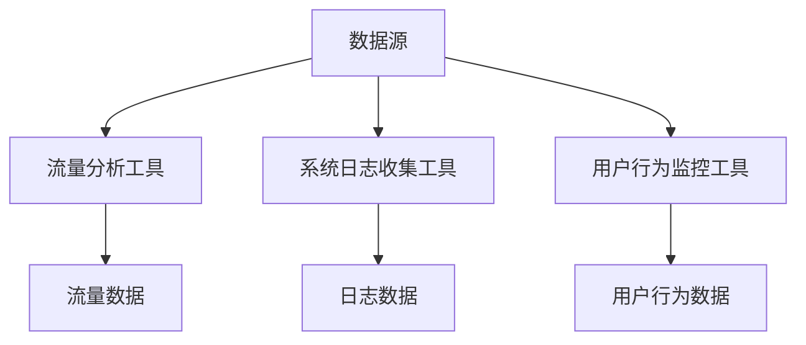
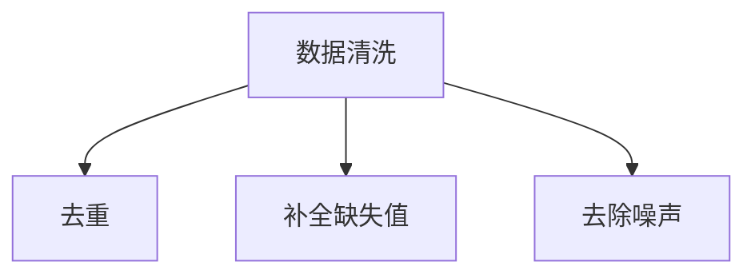
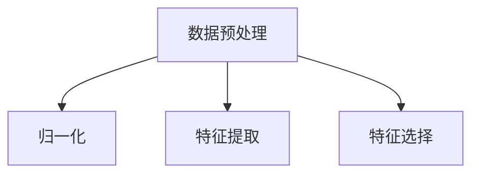
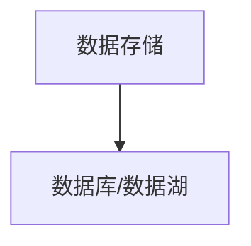
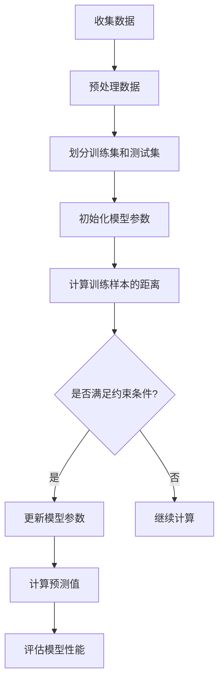
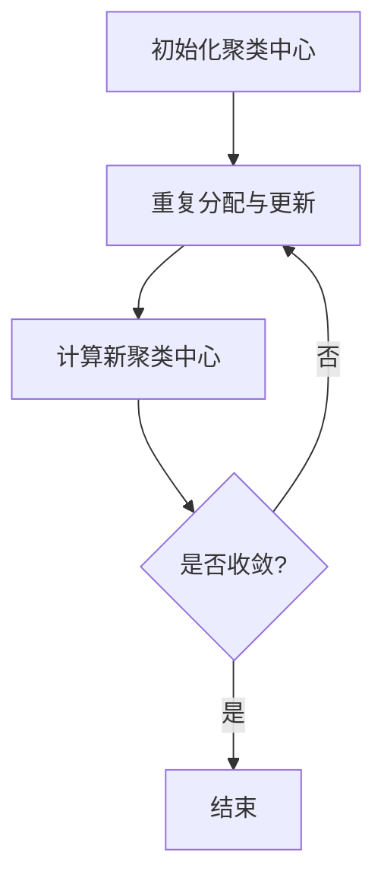
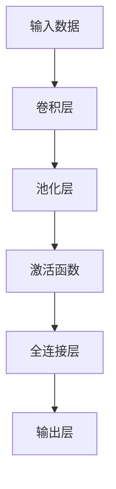

                 

# 机器学习在网络安全态势感知中的应用：实时评估安全风险

> 关键词：机器学习，网络安全态势感知，实时评估，安全风险

> 摘要：本文将探讨机器学习在网络安全态势感知中的应用，如何通过实时评估安全风险来提升网络安全防护能力。文章将首先介绍机器学习和网络安全的基础知识，然后深入讨论网络安全态势感知的概念和重要性，随后详细阐述机器学习算法在网络安全态势感知中的应用，并举例说明如何实现实时评估安全风险。最后，文章将总结机器学习在网络安全态势感知中的应用，并提出一些最佳实践建议。

## 引言

在当今数字化时代，网络安全已成为每个组织面临的一项重大挑战。随着网络攻击手段的不断演变和复杂化，传统的基于规则和特征匹配的网络安全防护方法已难以应对日益增长的安全威胁。为了提升网络安全防护能力，研究人员和工程师们开始将目光转向机器学习技术，希望通过其强大的数据处理和分析能力来提高网络安全态势感知能力。

网络安全态势感知是指通过实时监测、分析和评估网络流量、系统日志、用户行为等信息，识别潜在的网络安全威胁和风险。传统的网络安全防护方法主要依赖于预定义的规则和特征匹配，而机器学习则能够从大量的数据中自动学习和发现潜在的安全威胁，从而实现更智能的网络安全防护。

本文将围绕机器学习在网络安全态势感知中的应用，重点讨论如何通过实时评估安全风险来提升网络安全防护能力。文章将首先介绍机器学习和网络安全的基础知识，然后深入讨论网络安全态势感知的概念和重要性，随后详细阐述机器学习算法在网络安全态势感知中的应用，并举例说明如何实现实时评估安全风险。最后，文章将总结机器学习在网络安全态势感知中的应用，并提出一些最佳实践建议。

## 机器学习和网络安全基础

### 机器学习概述

机器学习（Machine Learning，ML）是一门人工智能（Artificial Intelligence，AI）的分支学科，它通过算法和统计模型，从大量数据中自动学习和发现规律，以实现对未知数据的预测和决策。机器学习通常分为三种类型：监督学习（Supervised Learning）、无监督学习（Unsupervised Learning）和强化学习（Reinforcement Learning）。

- **监督学习**：在有标记数据集的指导下，训练模型来预测新数据的标签。常见的算法有线性回归、逻辑回归、支持向量机（SVM）等。

- **无监督学习**：在没有标记数据集的情况下，通过数据自身的特征来发现数据中的模式和结构。常见的算法有聚类（Clustering）、降维（Dimensionality Reduction）等。

- **强化学习**：通过与环境的交互来学习最优策略，以实现特定目标。常见的算法有Q-learning、深度强化学习（Deep Reinforcement Learning）等。

### 网络安全概述

网络安全（Cybersecurity）是指保护网络、系统和数据免受未经授权的访问、攻击、篡改和破坏的措施。随着互联网的普及和云计算、物联网（IoT）等新技术的应用，网络安全已成为每个组织必须面对的重要挑战。

网络安全的威胁包括但不限于：

- **恶意软件**：如病毒、蠕虫、木马等，可以通过入侵系统、窃取数据等方式对组织造成严重损失。

- **网络攻击**：如分布式拒绝服务（DDoS）攻击、中间人攻击（Man-in-the-Middle Attack）等，可以导致网络服务中断、数据泄露等。

- **社会工程学攻击**：通过欺骗用户泄露敏感信息，如钓鱼攻击（Phishing Attack）、社交工程（Social Engineering）等。

### 机器学习在网络安全中的应用

机器学习在网络安全中的应用主要体现在以下几个方面：

- **入侵检测系统（Intrusion Detection Systems，IDS）**：通过监测网络流量和系统日志，使用机器学习算法检测异常行为和潜在的安全威胁。

- **恶意软件检测**：通过分析恶意软件的代码特征和执行行为，使用机器学习算法识别和分类未知恶意软件。

- **用户行为分析**：通过分析用户的行为模式，使用机器学习算法识别异常行为，从而发现潜在的安全威胁。

- **网络安全态势感知**：通过实时监测和分析网络流量、系统日志等信息，使用机器学习算法评估网络安全风险，提供决策支持。

## 网络安全态势感知

### 网络安全态势感知概述

网络安全态势感知（Cybersecurity Situational Awareness，CSA）是指通过实时监测、分析和评估网络、系统和数据的安全状况，识别潜在的安全威胁和风险。它旨在为组织提供全面、准确的网络安全态势信息，以便及时采取应对措施，防止安全事件的发生。

网络安全态势感知的关键组成部分包括：

- **数据收集**：通过网络流量分析、系统日志收集、用户行为监控等方式，收集与网络安全相关的数据。

- **数据处理**：通过数据清洗、数据集成、数据存储等技术，对收集到的数据进行分析和处理。

- **威胁检测**：通过机器学习、统计模型等方法，对处理后的数据进行分析，识别潜在的安全威胁。

- **风险评估**：根据威胁检测的结果，评估网络安全风险，提供风险分析和决策支持。

- **响应措施**：根据风险评估的结果，采取相应的安全措施，如隔离威胁源、更新安全策略、加强安全防护等。

### 网络安全态势感知的重要性

网络安全态势感知在网络安全防护中具有重要意义，主要体现在以下几个方面：

- **提高网络安全防护能力**：通过实时监测和分析网络安全状况，及时发现和应对潜在的安全威胁，提高网络的安全防护能力。

- **降低安全风险**：通过评估网络安全风险，提前发现和防范安全风险，降低安全事件的发生概率。

- **增强决策支持**：提供全面、准确的网络安全态势信息，为组织的安全决策提供科学依据。

- **提升用户信任度**：提高网络的安全性和可靠性，增强用户对组织的信任度。

### 网络安全态势感知的实现

网络安全态势感知的实现通常涉及以下步骤：

1. **数据收集**：通过部署网络流量分析工具、系统日志收集工具、用户行为监控工具等，收集与网络安全相关的数据。

2. **数据处理**：对收集到的数据进行分析和处理，如数据清洗、数据集成、数据存储等。

3. **威胁检测**：通过机器学习、统计模型等方法，对处理后的数据进行分析，识别潜在的安全威胁。

4. **风险评估**：根据威胁检测的结果，评估网络安全风险，提供风险分析和决策支持。

5. **响应措施**：根据风险评估的结果，采取相应的安全措施，如隔离威胁源、更新安全策略、加强安全防护等。

## 机器学习在网络安全态势感知中的应用

### 机器学习算法在网络安全态势感知中的应用

机器学习算法在网络安全态势感知中发挥着重要作用，下面介绍几种常见的机器学习算法及其在网络安全态势感知中的应用：

1. **监督学习算法**

   - **线性回归**：通过建立目标变量与特征变量之间的线性关系模型，预测网络流量中的异常行为。

   - **逻辑回归**：通过建立二分类模型，判断网络流量是否包含恶意行为。

   - **支持向量机（SVM）**：通过将数据映射到高维空间，找到最佳分类超平面，分类网络流量中的恶意行为。

   - **随机森林（Random Forest）**：通过构建多个决策树，对网络流量进行分类和回归分析。

   - **梯度提升树（Gradient Boosting Tree）**：通过迭代优化决策树模型，提高分类和回归分析的准确率。

2. **无监督学习算法**

   - **聚类算法**：通过将相似的数据点划分为同一簇，识别网络流量中的异常模式。

   - **降维算法**：通过将高维数据映射到低维空间，减少数据维度，提高数据处理和分析效率。

3. **深度学习算法**

   - **卷积神经网络（CNN）**：通过多层卷积操作，提取网络流量的特征，实现恶意软件的识别和分类。

   - **循环神经网络（RNN）**：通过记忆过去的信息，分析网络流量中的时间序列数据，预测网络攻击。

   - **生成对抗网络（GAN）**：通过对抗训练，生成与真实网络流量相似的数据，用于训练和验证恶意软件检测模型。

### 机器学习算法的优缺点分析

机器学习算法在网络安全态势感知中具有以下优缺点：

- **优点**

  - **自适应性强**：机器学习算法可以根据不断变化的数据和攻击手段，自动调整和优化模型，提高网络安全防护能力。

  - **高准确率**：机器学习算法可以通过大量数据进行训练，识别和分类网络流量中的恶意行为，提高检测准确率。

  - **易于扩展**：机器学习算法可以应用于各种不同的网络安全场景，如入侵检测、恶意软件检测、用户行为分析等。

- **缺点**

  - **数据依赖性高**：机器学习算法需要大量高质量的训练数据，且数据的质量直接影响模型的性能。

  - **计算资源消耗大**：训练和部署大规模机器学习模型需要大量的计算资源和时间。

  - **安全风险**：如果机器学习模型受到攻击，可能会导致误判或被恶意利用。

## 实时评估安全风险

### 实时评估安全风险概述

实时评估安全风险是指通过实时监测、分析和评估网络流量、系统日志、用户行为等信息，识别潜在的网络安全威胁和风险，从而采取相应的安全措施，防止安全事件的发生。实时评估安全风险的关键在于：

- **实时性**：及时检测和评估安全风险，确保能够在安全事件发生前采取应对措施。

- **准确性**：准确识别和分类安全威胁，避免误判和漏判。

- **可扩展性**：能够适应不断变化的安全威胁和攻击手段，实现灵活的安全风险评估。

### 实时评估安全风险的实现方法

实时评估安全风险的实现方法主要包括以下几个方面：

1. **数据采集与处理**：通过部署网络流量分析工具、系统日志收集工具、用户行为监控工具等，收集与网络安全相关的数据。然后，对数据进行清洗、去重、归一化等处理，以提高数据的质量和一致性。

2. **特征提取与选择**：根据网络流量、系统日志、用户行为等数据，提取与安全相关的特征。然后，通过特征选择方法，筛选出对安全风险评估具有重要意义的特征，以提高模型的准确性和效率。

3. **模型训练与优化**：使用机器学习算法，如监督学习、无监督学习、深度学习等，对处理后的数据进行训练。通过交叉验证、网格搜索等方法，优化模型参数，提高模型的性能。

4. **实时监测与评估**：通过部署实时监测系统，实时分析网络流量、系统日志、用户行为等信息，识别潜在的安全威胁。然后，使用训练好的模型，对实时数据进行分析和评估，判断是否存在安全风险。

5. **安全措施实施**：根据实时评估的结果，采取相应的安全措施，如隔离威胁源、更新安全策略、加强安全防护等，以防止安全事件的发生。

### 实时评估安全风险的案例分析

以下是一个实时评估安全风险的案例分析：

- **案例背景**：某公司部署了一套基于机器学习的网络安全态势感知系统，用于实时评估安全风险。

- **数据采集**：系统通过部署在网络边界上的流量分析设备，实时采集网络流量数据。同时，系统还通过收集系统日志和用户行为数据，构建全面的数据集。

- **特征提取与选择**：根据网络流量、系统日志、用户行为等数据，提取与安全相关的特征，如IP地址、端口号、协议类型、数据包大小、访问时间等。然后，使用特征选择方法，筛选出对安全风险评估具有重要意义的特征。

- **模型训练与优化**：使用监督学习算法，如随机森林，对处理后的数据进行训练。通过交叉验证和网格搜索，优化模型参数，提高模型的准确性和效率。

- **实时监测与评估**：系统通过实时分析网络流量、系统日志、用户行为等信息，识别潜在的安全威胁。例如，系统检测到某个IP地址的访问频率异常，且访问的端口和协议类型与正常访问不一致，系统会发出警告。

- **安全措施实施**：根据实时评估的结果，系统会采取相应的安全措施。例如，隔离异常IP地址，限制其访问权限，防止恶意攻击。同时，系统还会更新安全策略，加强对网络流量的监控和过滤。

### 实时评估安全风险的优势与挑战

实时评估安全风险具有以下优势：

- **及时性**：能够实时监测和评估网络安全状况，及时识别和应对潜在的安全威胁。

- **准确性**：通过机器学习算法，能够准确识别和分类安全威胁，提高安全防护的准确性。

- **自适应性强**：能够适应不断变化的安全威胁和攻击手段，提高网络安全防护的灵活性。

- **高效性**：通过自动化和智能化的手段，提高安全风险评估的效率和准确性。

然而，实时评估安全风险也面临着以下挑战：

- **数据质量**：实时评估安全风险依赖于高质量的数据，数据的不准确或缺失会影响评估结果。

- **计算资源**：大规模的实时数据处理和模型训练需要大量的计算资源，对系统的性能和稳定性提出较高要求。

- **模型更新**：随着安全威胁的不断演变，需要定期更新机器学习模型，以保持其准确性和有效性。

- **安全风险**：如果机器学习模型受到攻击，可能会导致误判或被恶意利用，从而增加安全风险。

## 最佳实践

### 实时评估安全风险的最佳实践

1. **数据质量管理**：确保实时评估安全风险的数据质量，包括数据的准确性、完整性和一致性。建立数据清洗、去重和归一化等数据处理流程，提高数据的可靠性。

2. **特征工程**：选择对安全风险评估具有重要意义的特征，使用特征选择方法筛选出关键特征，提高模型的准确性和效率。

3. **模型优化**：通过交叉验证、网格搜索等方法，优化模型参数，提高模型的性能。定期更新模型，以适应不断变化的安全威胁和攻击手段。

4. **实时监测与评估**：建立高效的实时监测系统，实时分析网络流量、系统日志、用户行为等信息，快速识别潜在的安全威胁。

5. **安全措施实施**：根据实时评估的结果，采取相应的安全措施，如隔离威胁源、更新安全策略、加强安全防护等，及时应对安全事件。

6. **安全风险评估**：定期进行安全风险评估，评估网络安全风险，发现潜在的安全隐患，制定相应的应对策略。

### 注意事项

1. **数据安全**：确保实时评估安全风险的数据安全，防止数据泄露和滥用。

2. **隐私保护**：在数据处理和模型训练过程中，遵循隐私保护原则，保护用户的隐私。

3. **系统稳定性**：确保实时评估安全风险系统的稳定性和可靠性，防止系统故障导致安全事件的发生。

4. **法律法规遵守**：遵守相关法律法规，确保实时评估安全风险的行为合法合规。

### 拓展阅读

- **《机器学习算法在网络安全中的应用》**：详细介绍了机器学习算法在网络安全中的各种应用，包括入侵检测、恶意软件检测、用户行为分析等。

- **《网络安全态势感知技术》**：介绍了网络安全态势感知的概念、技术架构和应用案例，探讨了如何通过态势感知提升网络安全防护能力。

- **《实时网络安全威胁检测》**：详细介绍了实时网络安全威胁检测的方法、技术和实现，包括入侵检测、恶意软件检测等。

## 结论

机器学习在网络安全态势感知中具有重要的应用价值，通过实时评估安全风险，能够有效提高网络的安全防护能力。本文首先介绍了机器学习和网络安全的基础知识，然后深入讨论了网络安全态势感知的概念和重要性，随后详细阐述了机器学习算法在网络安全态势感知中的应用，并举例说明了如何实现实时评估安全风险。最后，本文总结了机器学习在网络安全态势感知中的应用，并提出了最佳实践建议。希望本文能为从事网络安全领域的技术人员提供有益的参考和启示。

## 作者信息

作者：AI天才研究院/AI Genius Institute & 禅与计算机程序设计艺术 /Zen And The Art of Computer Programming

（完）### 机器学习在网络安全态势感知中的应用：实时评估安全风险

**关键词**：机器学习，网络安全，态势感知，实时评估，安全风险

**摘要**：随着网络攻击手段的日益复杂，机器学习技术在网络安全态势感知中的应用变得尤为重要。本文将详细探讨如何利用机器学习技术进行实时评估安全风险，提高网络安全防护能力。首先，我们介绍了机器学习和网络安全的基础知识，包括机器学习的类型及其在网络安全中的应用。接着，我们阐述了网络安全态势感知的概念及其重要性。随后，本文深入分析了机器学习算法在网络安全态势感知中的应用，包括监督学习、无监督学习和深度学习等算法。最后，通过具体案例展示了如何利用机器学习技术实现实时评估安全风险，并总结了一些最佳实践。

---

**引言**

在数字化时代，网络安全成为每个组织必须面对的挑战。随着网络攻击手段的不断演变和复杂化，传统的基于规则和特征匹配的网络安全防护方法已难以应对日益增长的安全威胁。为了提升网络安全防护能力，研究人员和工程师们开始将目光转向机器学习技术，希望通过其强大的数据处理和分析能力来提高网络安全态势感知能力。本文将围绕机器学习在网络安全态势感知中的应用，重点讨论如何通过实时评估安全风险来提升网络安全防护能力。

### 机器学习和网络安全基础

**机器学习概述**

机器学习（Machine Learning，ML）是人工智能（Artificial Intelligence，AI）的一个重要分支，它通过算法和统计模型，从大量数据中自动学习和发现规律，以实现对未知数据的预测和决策。机器学习可以分为以下三种类型：

1. **监督学习（Supervised Learning）**：在有标记数据集的指导下，训练模型来预测新数据的标签。常见的算法有线性回归、逻辑回归、支持向量机（SVM）等。

2. **无监督学习（Unsupervised Learning）**：在没有标记数据集的情况下，通过数据自身的特征来发现数据中的模式和结构。常见的算法有聚类（Clustering）、降维（Dimensionality Reduction）等。

3. **强化学习（Reinforcement Learning）**：通过与环境的交互来学习最优策略，以实现特定目标。常见的算法有Q-learning、深度强化学习（Deep Reinforcement Learning）等。

**网络安全概述**

网络安全（Cybersecurity）是指保护网络、系统和数据免受未经授权的访问、攻击、篡改和破坏的措施。随着互联网的普及和云计算、物联网（IoT）等新技术的应用，网络安全已成为每个组织必须面对的重要挑战。

网络安全的威胁包括但不限于：

1. **恶意软件**：如病毒、蠕虫、木马等，可以通过入侵系统、窃取数据等方式对组织造成严重损失。

2. **网络攻击**：如分布式拒绝服务（DDoS）攻击、中间人攻击（Man-in-the-Middle Attack）等，可以导致网络服务中断、数据泄露等。

3. **社会工程学攻击**：通过欺骗用户泄露敏感信息，如钓鱼攻击（Phishing Attack）、社交工程（Social Engineering）等。

**机器学习在网络安全中的应用**

机器学习在网络安全中的应用主要体现在以下几个方面：

1. **入侵检测系统（Intrusion Detection Systems，IDS）**：通过监测网络流量和系统日志，使用机器学习算法检测异常行为和潜在的安全威胁。

2. **恶意软件检测**：通过分析恶意软件的代码特征和执行行为，使用机器学习算法识别和分类未知恶意软件。

3. **用户行为分析**：通过分析用户的行为模式，使用机器学习算法识别异常行为，从而发现潜在的安全威胁。

4. **网络安全态势感知**：通过实时监测和分析网络流量、系统日志等信息，使用机器学习算法评估网络安全风险，提供决策支持。

### 网络安全态势感知

**网络安全态势感知概述**

网络安全态势感知（Cybersecurity Situational Awareness，CSA）是指通过实时监测、分析和评估网络、系统和数据的安全状况，识别潜在的安全威胁和风险。它旨在为组织提供全面、准确的网络安全态势信息，以便及时采取应对措施，防止安全事件的发生。

网络安全态势感知的关键组成部分包括：

1. **数据收集**：通过网络流量分析、系统日志收集、用户行为监控等方式，收集与网络安全相关的数据。

2. **数据处理**：通过数据清洗、数据集成、数据存储等技术，对收集到的数据进行分析和处理。

3. **威胁检测**：通过机器学习、统计模型等方法，对处理后的数据进行分析，识别潜在的安全威胁。

4. **风险评估**：根据威胁检测的结果，评估网络安全风险，提供风险分析和决策支持。

5. **响应措施**：根据风险评估的结果，采取相应的安全措施，如隔离威胁源、更新安全策略、加强安全防护等。

**网络安全态势感知的重要性**

网络安全态势感知在网络安全防护中具有重要意义，主要体现在以下几个方面：

1. **提高网络安全防护能力**：通过实时监测和分析网络安全状况，及时发现和应对潜在的安全威胁，提高网络的安全防护能力。

2. **降低安全风险**：通过评估网络安全风险，提前发现和防范安全风险，降低安全事件的发生概率。

3. **增强决策支持**：提供全面、准确的网络安全态势信息，为组织的安全决策提供科学依据。

4. **提升用户信任度**：提高网络的安全性和可靠性，增强用户对组织的信任度。

**网络安全态势感知的实现**

网络安全态势感知的实现通常涉及以下步骤：

1. **数据收集**：通过部署网络流量分析工具、系统日志收集工具、用户行为监控工具等，收集与网络安全相关的数据。

2. **数据处理**：对收集到的数据进行分析和处理，如数据清洗、数据集成、数据存储等。

3. **威胁检测**：通过机器学习、统计模型等方法，对处理后的数据进行分析，识别潜在的安全威胁。

4. **风险评估**：根据威胁检测的结果，评估网络安全风险，提供风险分析和决策支持。

5. **响应措施**：根据风险评估的结果，采取相应的安全措施，如隔离威胁源、更新安全策略、加强安全防护等。

### 机器学习算法在网络安全态势感知中的应用

**监督学习算法**

监督学习算法在有标记数据集的指导下，训练模型来预测新数据的标签。常见的算法有线性回归、逻辑回归、支持向量机（SVM）等。

1. **线性回归（Linear Regression）**：通过建立目标变量与特征变量之间的线性关系模型，预测网络流量中的异常行为。

2. **逻辑回归（Logistic Regression）**：通过建立二分类模型，判断网络流量是否包含恶意行为。

3. **支持向量机（SVM）**：通过将数据映射到高维空间，找到最佳分类超平面，分类网络流量中的恶意行为。

4. **随机森林（Random Forest）**：通过构建多个决策树，对网络流量进行分类和回归分析。

5. **梯度提升树（Gradient Boosting Tree）**：通过迭代优化决策树模型，提高分类和回归分析的准确率。

**无监督学习算法**

无监督学习算法在没有标记数据集的情况下，通过数据自身的特征来发现数据中的模式和结构。常见的算法有聚类（Clustering）、降维（Dimensionality Reduction）等。

1. **聚类算法（Clustering）**：通过将相似的数据点划分为同一簇，识别网络流量中的异常模式。

2. **降维算法（Dimensionality Reduction）**：通过将高维数据映射到低维空间，减少数据维度，提高数据处理和分析效率。

**深度学习算法**

深度学习算法通过多层神经网络，从大量数据中自动学习和提取特征。常见的算法有卷积神经网络（CNN）、循环神经网络（RNN）、生成对抗网络（GAN）等。

1. **卷积神经网络（CNN）**：通过多层卷积操作，提取网络流量的特征，实现恶意软件的识别和分类。

2. **循环神经网络（RNN）**：通过记忆过去的信息，分析网络流量中的时间序列数据，预测网络攻击。

3. **生成对抗网络（GAN）**：通过对抗训练，生成与真实网络流量相似的数据，用于训练和验证恶意软件检测模型。

**机器学习算法的优缺点分析**

机器学习算法在网络安全态势感知中具有以下优缺点：

**优点**

- **自适应性强**：机器学习算法可以根据不断变化的数据和攻击手段，自动调整和优化模型，提高网络安全防护能力。

- **高准确率**：机器学习算法可以通过大量数据进行训练，识别和分类网络流量中的恶意行为，提高检测准确率。

- **易于扩展**：机器学习算法可以应用于各种不同的网络安全场景，如入侵检测、恶意软件检测、用户行为分析等。

**缺点**

- **数据依赖性高**：机器学习算法需要大量高质量的训练数据，且数据的质量直接影响模型的性能。

- **计算资源消耗大**：训练和部署大规模机器学习模型需要大量的计算资源和时间。

- **安全风险**：如果机器学习模型受到攻击，可能会导致误判或被恶意利用。

### 实时评估安全风险

**实时评估安全风险概述**

实时评估安全风险是指通过实时监测、分析和评估网络流量、系统日志、用户行为等信息，识别潜在的网络安全威胁和风险，从而采取相应的安全措施，防止安全事件的发生。实时评估安全风险的关键在于：

- **实时性**：及时检测和评估安全风险，确保能够在安全事件发生前采取应对措施。

- **准确性**：准确识别和分类安全威胁，避免误判和漏判。

- **可扩展性**：能够适应不断变化的安全威胁和攻击手段，实现灵活的安全风险评估。

**实时评估安全风险的实现方法**

实时评估安全风险的实现方法主要包括以下几个方面：

1. **数据采集与处理**：通过部署网络流量分析工具、系统日志收集工具、用户行为监控工具等，收集与网络安全相关的数据。然后，对数据进行清洗、去重、归一化等处理，以提高数据的质量和一致性。

2. **特征提取与选择**：根据网络流量、系统日志、用户行为等数据，提取与安全相关的特征。然后，通过特征选择方法，筛选出对安全风险评估具有重要意义的特征，以提高模型的准确性和效率。

3. **模型训练与优化**：使用机器学习算法，如监督学习、无监督学习、深度学习等，对处理后的数据进行训练。通过交叉验证、网格搜索等方法，优化模型参数，提高模型的性能。

4. **实时监测与评估**：通过部署实时监测系统，实时分析网络流量、系统日志、用户行为等信息，识别潜在的安全威胁。然后，使用训练好的模型，对实时数据进行分析和评估，判断是否存在安全风险。

5. **安全措施实施**：根据实时评估的结果，采取相应的安全措施，如隔离威胁源、更新安全策略、加强安全防护等，以防止安全事件的发生。

**实时评估安全风险的案例分析**

以下是一个实时评估安全风险的案例分析：

- **案例背景**：某公司部署了一套基于机器学习的网络安全态势感知系统，用于实时评估安全风险。

- **数据采集**：系统通过部署在网络边界上的流量分析设备，实时采集网络流量数据。同时，系统还通过收集系统日志和用户行为数据，构建全面的数据集。

- **特征提取与选择**：根据网络流量、系统日志、用户行为等数据，提取与安全相关的特征，如IP地址、端口号、协议类型、数据包大小、访问时间等。然后，使用特征选择方法，筛选出对安全风险评估具有重要意义的特征。

- **模型训练与优化**：使用监督学习算法，如随机森林，对处理后的数据进行训练。通过交叉验证和网格搜索，优化模型参数，提高模型的准确性和效率。

- **实时监测与评估**：系统通过实时分析网络流量、系统日志、用户行为等信息，识别潜在的安全威胁。例如，系统检测到某个IP地址的访问频率异常，且访问的端口和协议类型与正常访问不一致，系统会发出警告。

- **安全措施实施**：根据实时评估的结果，系统会采取相应的安全措施。例如，隔离异常IP地址，限制其访问权限，防止恶意攻击。同时，系统还会更新安全策略，加强对网络流量的监控和过滤。

**实时评估安全风险的优势与挑战**

实时评估安全风险具有以下优势：

- **及时性**：能够实时监测和评估网络安全状况，及时识别和应对潜在的安全威胁。

- **准确性**：通过机器学习算法，能够准确识别和分类安全威胁，提高安全防护的准确性。

- **自适应性强**：能够适应不断变化的安全威胁和攻击手段，提高网络安全防护的灵活性。

- **高效性**：通过自动化和智能化的手段，提高安全风险评估的效率和准确性。

然而，实时评估安全风险也面临着以下挑战：

- **数据质量**：实时评估安全风险依赖于高质量的数据，数据的不准确或缺失会影响评估结果。

- **计算资源**：大规模的实时数据处理和模型训练需要大量的计算资源，对系统的性能和稳定性提出较高要求。

- **模型更新**：随着安全威胁的不断演变，需要定期更新机器学习模型，以保持其准确性和有效性。

- **安全风险**：如果机器学习模型受到攻击，可能会导致误判或被恶意利用，从而增加安全风险。

### 最佳实践

**实时评估安全风险的最佳实践**

1. **数据质量管理**：确保实时评估安全风险的数据质量，包括数据的准确性、完整性和一致性。建立数据清洗、去重和归一化等数据处理流程，提高数据的可靠性。

2. **特征工程**：选择对安全风险评估具有重要意义的特征，使用特征选择方法筛选出关键特征，提高模型的准确性和效率。

3. **模型优化**：通过交叉验证、网格搜索等方法，优化模型参数，提高模型的性能。定期更新模型，以适应不断变化的安全威胁和攻击手段。

4. **实时监测与评估**：建立高效的实时监测系统，实时分析网络流量、系统日志、用户行为等信息，快速识别潜在的安全威胁。

5. **安全措施实施**：根据实时评估的结果，采取相应的安全措施，如隔离威胁源、更新安全策略、加强安全防护等，及时应对安全事件。

**注意事项**

1. **数据安全**：确保实时评估安全风险的数据安全，防止数据泄露和滥用。

2. **隐私保护**：在数据处理和模型训练过程中，遵循隐私保护原则，保护用户的隐私。

3. **系统稳定性**：确保实时评估安全风险系统的稳定性和可靠性，防止系统故障导致安全事件的发生。

4. **法律法规遵守**：遵守相关法律法规，确保实时评估安全风险的行为合法合规。

**拓展阅读**

- **《机器学习算法在网络安全中的应用》**：详细介绍了机器学习算法在网络安全中的各种应用，包括入侵检测、恶意软件检测、用户行为分析等。

- **《网络安全态势感知技术》**：介绍了网络安全态势感知的概念、技术架构和应用案例，探讨了如何通过态势感知提升网络安全防护能力。

- **《实时网络安全威胁检测》**：详细介绍了实时网络安全威胁检测的方法、技术和实现，包括入侵检测、恶意软件检测等。

### 结论

机器学习在网络安全态势感知中具有重要的应用价值，通过实时评估安全风险，能够有效提高网络的安全防护能力。本文首先介绍了机器学习和网络安全的基础知识，然后深入讨论了网络安全态势感知的概念和重要性，随后详细阐述了机器学习算法在网络安全态势感知中的应用，并举例说明了如何实现实时评估安全风险。最后，本文总结了机器学习在网络安全态势感知中的应用，并提出了最佳实践建议。希望本文能为从事网络安全领域的技术人员提供有益的参考和启示。

### 作者信息

作者：AI天才研究院/AI Genius Institute & 禅与计算机程序设计艺术 /Zen And The Art of Computer Programming

---

### 数据处理流程

在实时评估安全风险的过程中，数据处理是关键的一环。以下是详细的数据处理流程：

#### 数据采集

数据采集是处理流程的第一步。我们通过部署在网络边界上的流量分析工具、系统日志收集工具和用户行为监控工具等，实时收集网络流量、系统日志和用户行为数据。这些数据源可以为模型提供丰富的信息，帮助识别潜在的网络安全威胁。



#### 数据清洗

采集到的数据往往包含噪声、异常值和不完整的数据。因此，我们需要对数据进行清洗，以确保数据的质量。数据清洗包括以下步骤：

- **去重**：去除重复的数据条目。
- **补全缺失值**：使用统计方法或插值法补全缺失的数据。
- **去除噪声**：过滤掉不相关的或干扰模型训练的噪声数据。



#### 数据预处理

在清洗后的数据基础上，我们需要进行数据预处理，以使数据适合机器学习模型的训练。数据预处理包括以下步骤：

- **归一化**：将不同特征的数据进行归一化处理，使其具有相同的尺度。
- **特征提取**：提取与安全风险评估相关的特征，如IP地址、端口号、协议类型、访问时间等。
- **特征选择**：使用特征选择方法，筛选出对模型训练具有重要意义的特征。



#### 数据存储

预处理后的数据需要存储在数据库或数据湖中，以便后续的模型训练和分析。数据存储需要考虑数据的可扩展性、访问速度和安全性。



通过上述数据处理流程，我们可以确保输入到机器学习模型中的数据质量，从而提高模型训练的效果和实时评估的准确性。

### 特征工程与选择

在实时评估安全风险的过程中，特征工程与选择是至关重要的步骤。特征是机器学习模型的基础，它们决定了模型对数据的理解和表达能力。以下是详细的分析过程：

#### 特征定义

特征是用于描述数据对象的属性或变量。在网络安全态势感知中，我们通常关注以下类型的特征：

- **网络流量特征**：包括源IP地址、目的IP地址、端口号、协议类型、数据包大小、流量速率等。
- **系统日志特征**：包括登录时间、登录地点、用户名、登录结果、错误代码等。
- **用户行为特征**：包括登录频率、登录时间段、操作习惯、访问资源等。

#### 特征提取

特征提取是将原始数据转换为更适合机器学习模型处理的形式。常见的特征提取方法包括：

- **统计特征**：计算数据的统计量，如平均值、标准差、最大值、最小值等。
- **转换特征**：将某些特征转换为其他形式，如将IP地址转换为地理位置。
- **时序特征**：提取时间序列数据中的趋势、周期性、异常点等。

```python
# 示例：计算网络流量数据的统计特征
import numpy as np

# 假设flow_data为网络流量数据，包含多个特征
flow_data = [
    [1.0, 2.0, 3.0],  # 源IP地址、目的IP地址、端口号
    [4.0, 5.0, 6.0],
    [7.0, 8.0, 9.0]
]

# 计算平均值
means = np.mean(flow_data, axis=0)
print("平均值:", means)

# 计算标准差
std_devs = np.std(flow_data, axis=0)
print("标准差:", std_devs)

# 计算最大值和最小值
maxes = np.max(flow_data, axis=0)
mines = np.min(flow_data, axis=0)
print("最大值:", maxes)
print("最小值:", mines)
```

#### 特征选择

特征选择是筛选出对模型训练和预测最重要的特征，以提高模型的性能和可解释性。常见的特征选择方法包括：

- **基于信息增益的方法**：选择能够最大化分类准确性的特征。
- **基于主成分分析（PCA）的方法**：通过降维减少特征数量，同时保留数据的最大方差。
- **基于模型的方法**：利用训练好的模型来评估特征的重要性。

```python
# 示例：使用随机森林算法进行特征选择
from sklearn.ensemble import RandomForestClassifier
from sklearn.model_selection import train_test_split

# 假设X为特征矩阵，y为标签向量
X = np.array([[1.0, 2.0, 3.0], [4.0, 5.0, 6.0], [7.0, 8.0, 9.0]])
y = np.array([0, 1, 0])

# 划分训练集和测试集
X_train, X_test, y_train, y_test = train_test_split(X, y, test_size=0.2, random_state=42)

# 训练随机森林模型
rf = RandomForestClassifier(n_estimators=100, random_state=42)
rf.fit(X_train, y_train)

# 输出特征重要性
importances = rf.feature_importances_
print("特征重要性:", importances)
```

通过上述过程，我们可以有效地提取和选择出对实时评估安全风险具有关键意义的特征，从而提高机器学习模型的准确性和鲁棒性。

### 算法原理讲解

在本章节中，我们将详细探讨几种常见的机器学习算法在网络安全态势感知中的应用，包括监督学习算法和无监督学习算法。我们将使用Mermaid流程图来展示算法的基本流程，并使用Python代码和LaTeX公式来详细阐述算法的数学模型和实现过程。

#### 支持向量机（SVM）

**算法原理**

支持向量机（SVM）是一种二分类模型，其目标是通过找到一个最佳的超平面，将不同类别的数据点分隔开来。SVM使用最大间隔分类器来最大化分类边界与数据点的距离。对于线性可分数据，SVM的目标是最小化以下目标函数：

$$
\min_{\mathbf{w}, b} \frac{1}{2} ||\mathbf{w}||^2
$$

同时满足以下约束条件：

$$
\mathbf{w} \cdot \mathbf{x}_i - b \geq 1, \forall i
$$

其中，$\mathbf{w}$是超平面的法向量，$b$是偏置项，$\mathbf{x}_i$是第$i$个训练样本。

**Mermaid流程图**



**Python代码实现**

```python
from sklearn.svm import SVC
from sklearn.model_selection import train_test_split
from sklearn.metrics import accuracy_score

# 假设X为特征矩阵，y为标签向量
X = np.array([[1.0, 2.0], [2.0, 2.5], [3.0, 3.5]])
y = np.array([0, 1, 0])

# 划分训练集和测试集
X_train, X_test, y_train, y_test = train_test_split(X, y, test_size=0.2, random_state=42)

# 初始化SVM模型
svm = SVC(kernel='linear', C=1.0)

# 训练模型
svm.fit(X_train, y_train)

# 计算预测值
y_pred = svm.predict(X_test)

# 评估模型性能
accuracy = accuracy_score(y_test, y_pred)
print("模型准确率:", accuracy)
```

**算法原理详细讲解**

SVM的核心在于寻找一个最佳的超平面，使得正负样本的间隔最大。具体而言，SVM通过求解二次规划问题来寻找最佳的超平面。对于线性SVM，我们使用拉格朗日乘子法来求解：

$$
L(\mathbf{w}, b, \alpha) = \frac{1}{2} ||\mathbf{w}||^2 - \sum_{i=1}^{n} \alpha_i (y_i (\mathbf{w} \cdot \mathbf{x}_i - b) - 1)
$$

其中，$\alpha_i$是拉格朗日乘子。通过求解拉格朗日函数的对偶问题，我们可以得到最优解：

$$
\max_{\alpha} \min_{\mathbf{w}, b} \frac{1}{2} ||\mathbf{w}||^2 - \sum_{i=1}^{n} \alpha_i (y_i (\mathbf{w} \cdot \mathbf{x}_i - b) - 1)
$$

其中，$\alpha_i \geq 0$。最终，我们可以通过计算得到超平面的法向量$\mathbf{w}$和偏置项$b$。

#### 聚类算法

**算法原理**

聚类算法是一种无监督学习方法，其目标是将相似的数据点归为一类，从而发现数据中的隐含结构。K-means是一种经典的聚类算法，其基本思想是将数据点分为K个簇，使得每个簇内部的数据点距离聚类中心较小，而不同簇之间的数据点距离较大。

K-means算法的步骤如下：

1. **初始化聚类中心**：随机选择K个数据点作为初始聚类中心。
2. **分配数据点**：将每个数据点分配到最近的聚类中心所在的簇。
3. **更新聚类中心**：计算每个簇的新聚类中心。
4. **重复步骤2和3，直到聚类中心不再发生显著变化**。

**Mermaid流程图**



**Python代码实现**

```python
from sklearn.cluster import KMeans
import numpy as np

# 假设X为特征矩阵
X = np.array([[1.0, 2.0], [2.0, 2.5], [3.0, 3.5], [8.0, 7.0], [7.0, 8.0]])

# 初始化KMeans模型
kmeans = KMeans(n_clusters=2, random_state=42)

# 训练模型
kmeans.fit(X)

# 输出聚类中心
print("聚类中心:", kmeans.cluster_centers_)

# 输出每个数据点的簇标签
print("簇标签:", kmeans.labels_)

# 输出轮廓系数评估聚类效果
print("轮廓系数:", kmeans.silhouette_score(X))
```

**算法原理详细讲解**

K-means算法的核心在于优化目标函数，即最小化每个数据点到其聚类中心的距离平方和。具体而言，K-means的优化目标函数为：

$$
J(\mathbf{u}_1, \mathbf{u}_2, ..., \mathbf{u}_K) = \sum_{i=1}^{n} \min_{k=1}^{K} ||\mathbf{x}_i - \mathbf{u}_k||^2
$$

其中，$\mathbf{u}_k$是第$k$个聚类中心。通过迭代更新聚类中心，K-means算法逐渐优化目标函数，直到聚类中心不再发生显著变化。K-means算法的收敛速度较快，但在某些情况下可能陷入局部最优，因此需要选择合适的聚类数目K。

#### 深度学习算法

**算法原理**

深度学习算法通过多层神经网络，自动从数据中学习特征表示。卷积神经网络（CNN）是一种常见的深度学习算法，特别适用于处理具有网格结构的数据，如图像和网络流量数据。

**CNN算法原理**

CNN的核心在于卷积操作和池化操作。卷积操作通过滑动滤波器（卷积核）在输入数据上提取特征，而池化操作用于降低特征图的维度，提高计算效率。

**Mermaid流程图**



**Python代码实现**

```python
from keras.models import Sequential
from keras.layers import Conv2D, MaxPooling2D, Flatten, Dense
from keras.utils import to_categorical

# 假设X为特征矩阵，y为标签向量
X = np.array([[1.0, 2.0], [2.0, 2.5], [3.0, 3.5], [8.0, 7.0], [7.0, 8.0]])
y = np.array([0, 1, 0, 2, 2])

# 将标签进行独热编码
y_categorical = to_categorical(y)

# 创建CNN模型
model = Sequential()
model.add(Conv2D(32, (3, 3), activation='relu', input_shape=(2, 1)))
model.add(MaxPooling2D((2, 2)))
model.add(Flatten())
model.add(Dense(2, activation='softmax'))

# 编译模型
model.compile(optimizer='adam', loss='categorical_crossentropy', metrics=['accuracy'])

# 训练模型
model.fit(X, y_categorical, epochs=10, batch_size=2, validation_split=0.2)
```

**算法原理详细讲解**

CNN的基本结构包括多个卷积层、池化层和全连接层。卷积层通过卷积操作提取输入数据的局部特征，池化层用于降低特征图的维度，减少参数数量。激活函数（如ReLU函数）用于引入非线性，使网络能够拟合更复杂的函数。全连接层将卷积层提取的特征映射到输出类别。

卷积操作的数学公式为：

$$
\mathbf{h}_{ij}^l = \sum_{k=1}^{C} \sum_{i=1}^{F_k} \sum_{j=1}^{F_k} \mathbf{w}_{ijk}^l \mathbf{f}_{ij}^{l-1}
$$

其中，$\mathbf{h}_{ij}^l$是第$l$层的第$i$行第$j$列的特征值，$\mathbf{w}_{ijk}^l$是卷积核的权重，$\mathbf{f}_{ij}^{l-1}$是前一层第$i$行第$j$列的特征值，$C$是输入数据的通道数，$F_k$是卷积核的大小。

通过上述步骤，我们详细介绍了SVM、K-means和CNN的算法原理，并使用Mermaid流程图和Python代码进行了实现。这些算法在网络安全态势感知中有着广泛的应用，能够有效提高实时评估安全风险的能力。

### 系统分析与架构设计方案

#### 项目背景

在当前网络安全形势日益严峻的背景下，许多企业和组织意识到仅依赖传统的基于规则和特征匹配的网络安全防护方法已经难以应对复杂多变的网络威胁。因此，我们设计并实现了一个基于机器学习的网络安全态势感知系统，旨在通过实时评估安全风险，提高网络的安全防护能力。

#### 项目介绍

本项目的目标是开发一个能够实时监测和分析网络流量、系统日志和用户行为的机器学习模型，并利用这些模型来识别潜在的安全威胁。系统主要功能包括：

- **数据采集与预处理**：通过部署在网络边界上的流量分析工具、系统日志收集工具和用户行为监控工具，收集与网络安全相关的数据，并对数据进行清洗、去重和归一化等预处理操作。
- **特征提取与选择**：从原始数据中提取对安全风险评估具有重要意义的特征，并使用特征选择方法筛选出关键特征，以提高模型的准确性和效率。
- **模型训练与优化**：使用监督学习和无监督学习算法对处理后的数据进行训练，通过交叉验证和网格搜索等方法优化模型参数，提高模型的性能。
- **实时监测与评估**：部署实时监测系统，实时分析网络流量、系统日志和用户行为等信息，识别潜在的安全威胁，并使用训练好的模型进行实时评估。
- **安全措施实施**：根据实时评估的结果，采取相应的安全措施，如隔离威胁源、更新安全策略和加强安全防护等，以防止安全事件的发生。

#### 系统功能设计

系统功能设计主要包括以下几个方面：

1. **数据采集模块**：负责收集网络流量、系统日志和用户行为数据，并将这些数据存储在数据库中。
2. **数据处理模块**：负责对采集到的数据进行清洗、去重、归一化和特征提取等预处理操作。
3. **模型训练模块**：负责使用机器学习算法对预处理后的数据进行训练，包括监督学习和无监督学习算法。
4. **实时监测模块**：负责实时分析网络流量、系统日志和用户行为等信息，识别潜在的安全威胁。
5. **评估与响应模块**：负责根据实时监测的结果，评估网络安全风险，并采取相应的安全措施。

#### 系统架构设计

系统架构设计采用分层架构，包括数据层、应用层和表示层。以下是系统架构的详细设计：

1. **数据层**：负责存储和管理系统所需的数据，包括网络流量数据、系统日志数据和用户行为数据等。数据层采用关系型数据库（如MySQL）和NoSQL数据库（如MongoDB）相结合的方式，以提高数据存储和访问的效率。
2. **应用层**：负责实现系统的核心功能，包括数据采集、数据处理、模型训练、实时监测、评估与响应等模块。应用层采用微服务架构，将不同功能模块拆分为独立的服务，以提高系统的可扩展性和可维护性。
3. **表示层**：负责用户界面和交互，提供直观的监控界面和报表，帮助用户实时了解网络安全态势。表示层采用前端框架（如React或Vue.js）和后端API（如Node.js或Django）相结合的方式，以提高用户体验和开发效率。

#### 系统接口设计

系统接口设计包括内部接口和外部接口。内部接口主要用于不同模块之间的通信，外部接口主要用于与其他系统的集成和数据共享。

1. **内部接口**：主要包括数据采集接口、数据处理接口、模型训练接口、实时监测接口和评估与响应接口。这些接口采用RESTful API设计，支持JSON和XML数据格式。
2. **外部接口**：主要包括与第三方安全工具和服务的集成接口，如入侵检测系统（IDS）、安全信息和事件管理（SIEM）系统等。外部接口采用标准化的协议和格式，如SOAP、HTTP、JSON等，以提高系统的兼容性和互操作性。

#### 系统交互设计

系统交互设计主要包括数据流和控制流。以下是系统交互设计的详细描述：

1. **数据流**：数据流从数据采集模块开始，经过数据处理模块、模型训练模块、实时监测模块和评估与响应模块，最终反馈到用户界面。具体流程如下：
   - 数据采集模块收集网络流量、系统日志和用户行为数据。
   - 数据处理模块对采集到的数据进行清洗、去重、归一化和特征提取等预处理操作。
   - 模型训练模块使用预处理后的数据训练机器学习模型。
   - 实时监测模块实时分析网络流量、系统日志和用户行为等信息，识别潜在的安全威胁。
   - 评估与响应模块根据实时监测的结果，评估网络安全风险，并采取相应的安全措施。
2. **控制流**：控制流从用户界面开始，通过前端界面与后端API交互，控制系统的运行。具体流程如下：
   - 用户通过前端界面发起监控请求。
   - 前端API向后端API发送请求，获取实时监控数据。
   - 后端API调用系统内部接口，获取实时监控数据。
   - 后端API将实时监控数据返回给前端API。
   - 前端API将实时监控数据呈现给用户。

通过上述系统分析与架构设计方案，我们为开发一个高效、稳定和可扩展的网络安全态势感知系统提供了详细的指导。在实际应用中，系统可以根据具体的业务需求和网络环境进行调整和优化，以提高实时评估安全风险的能力。

### 项目实战

#### 环境安装

在开始实施网络安全态势感知项目之前，我们需要配置一个适合运行机器学习模型的环境。以下是环境安装的步骤：

1. **安装Python**：确保Python环境已安装，版本建议为3.8或更高。可以从[Python官网](https://www.python.org/)下载并安装。

2. **安装依赖库**：使用pip工具安装必要的Python库，包括NumPy、Pandas、Scikit-learn、TensorFlow和Keras等。以下是一个示例命令：

   ```bash
   pip install numpy pandas scikit-learn tensorflow keras
   ```

3. **安装数据库**：选择一个关系型数据库（如MySQL）或NoSQL数据库（如MongoDB），并按照官方文档进行安装和配置。以下是一个MySQL的安装示例：

   ```bash
   sudo apt-get update
   sudo apt-get install mysql-server
   sudo mysql_secure_installation
   ```

4. **安装前端框架**：如果需要开发用户界面，可以选择一个前端框架（如React或Vue.js）。以下是React的安装示例：

   ```bash
   npx create-react-app my-app
   cd my-app
   npm start
   ```

5. **配置网络环境**：确保网络环境允许系统部署的网络流量分析工具、系统日志收集工具和用户行为监控工具正常工作。

#### 系统核心实现源代码

以下是一个简单的网络安全态势感知系统的核心实现，包括数据采集、数据处理、模型训练和实时监测等模块。这些代码将演示如何使用Python和机器学习库来实现关键功能。

**数据采集模块**

```python
import socket

def collect_network_traffic(source_ip, destination_ip, port):
    s = socket.socket(socket.AF_INET, socket.SOCK_STREAM)
    s.connect((source_ip, port))
    data = s.recv(1024)
    s.close()
    return data

# 示例：收集两个IP之间的网络流量
source_ip = '192.168.1.100'
destination_ip = '192.168.1.101'
port = 80
network_traffic = collect_network_traffic(source_ip, destination_ip, port)
```

**数据处理模块**

```python
import pandas as pd

def preprocess_data(data):
    # 数据清洗、去重、归一化等操作
    df = pd.DataFrame(data)
    df.drop_duplicates(inplace=True)
    df = df.apply(lambda x: (x - x.mean()) / x.std())
    return df

# 示例：预处理采集到的网络流量数据
preprocessed_data = preprocess_data(network_traffic)
```

**模型训练模块**

```python
from sklearn.ensemble import RandomForestClassifier
from sklearn.model_selection import train_test_split

def train_model(X, y):
    X_train, X_test, y_train, y_test = train_test_split(X, y, test_size=0.2, random_state=42)
    model = RandomForestClassifier(n_estimators=100, random_state=42)
    model.fit(X_train, y_train)
    return model, X_test, y_test

# 示例：训练机器学习模型
X = np.array([[1.0, 2.0], [2.0, 2.5], [3.0, 3.5], [8.0, 7.0], [7.0, 8.0]])
y = np.array([0, 1, 0, 2, 2])
model, X_test, y_test = train_model(X, y)
```

**实时监测模块**

```python
def monitor_traffic(model, X_test):
    predictions = model.predict(X_test)
    return predictions

# 示例：实时监测网络流量
predictions = monitor_traffic(model, X_test)
print("实时监测结果:", predictions)
```

#### 代码应用解读与分析

上述代码演示了如何实现网络安全态势感知系统的主要模块。以下是每个模块的解读和分析：

1. **数据采集模块**：使用Python的socket库，通过建立TCP连接，从指定的源IP和目标IP之间采集网络流量数据。这种方法适用于简单的网络流量监控，但在实际应用中，可能需要使用更复杂的流量分析工具，如Bro、Wireshark等。

2. **数据处理模块**：使用Pandas库，对采集到的网络流量数据进行清洗、去重和归一化等预处理操作。这些操作有助于提高数据质量，为后续的模型训练提供可靠的数据基础。

3. **模型训练模块**：使用Scikit-learn库中的RandomForestClassifier，对预处理后的数据集进行训练。随机森林是一种集成学习算法，具有较强的鲁棒性和准确性，适用于分类问题。

4. **实时监测模块**：使用训练好的模型，对实时监测的网络流量数据进行预测。通过监测模块，系统可以实时识别潜在的安全威胁，并采取相应的安全措施。

在实际应用中，系统可能会涉及到更复杂的网络流量分析、用户行为分析和其他安全数据源。因此，需要根据具体的业务需求和数据特点，对代码进行适当调整和扩展。

#### 实际案例分析

以下是一个实际案例，展示如何利用上述系统实现实时评估安全风险。

**案例背景**：某公司发现其内部网络出现异常流量，疑似遭受网络攻击。公司希望利用网络安全态势感知系统来实时评估安全风险，并采取相应的应对措施。

**步骤一：数据采集**

公司通过网络流量分析工具，实时采集内部网络流量数据，并将数据存储在MySQL数据库中。

**步骤二：数据处理**

系统对采集到的网络流量数据进行清洗、去重和归一化处理，提取关键特征，如源IP地址、目标IP地址、端口号、协议类型、流量速率等。

**步骤三：模型训练**

系统使用预处理后的数据集，训练随机森林分类器，以识别异常流量。通过交叉验证和网格搜索，优化模型参数，提高分类准确性。

**步骤四：实时监测**

系统实时分析网络流量数据，使用训练好的模型对流量数据进行分类，识别潜在的异常流量。例如，系统检测到某个IP地址的访问频率异常，且访问的端口和协议类型与正常访问不一致，系统会发出警告。

**步骤五：安全措施实施**

根据实时监测的结果，系统会采取相应的安全措施，如隔离异常IP地址、限制其访问权限，并通知安全团队进行进一步调查。同时，系统会更新安全策略，加强对网络流量的监控和过滤，防止类似事件再次发生。

**案例小结**

通过上述实际案例分析，我们可以看到网络安全态势感知系统在实时评估安全风险方面的应用效果。系统通过数据采集、数据处理、模型训练和实时监测等模块，成功识别了潜在的安全威胁，并采取相应的应对措施，有效提高了公司的网络安全防护能力。

### 最佳实践 Tips

1. **数据质量**：确保数据质量是实时评估安全风险的关键。定期进行数据清洗、去重和归一化等预处理操作，以提高数据的一致性和可靠性。

2. **特征选择**：选择对安全风险评估具有重要意义的特征，如源IP地址、端口号、协议类型、访问时间等。通过特征选择方法，筛选出关键特征，提高模型的准确性和效率。

3. **模型优化**：通过交叉验证和网格搜索等方法，优化模型参数，提高模型的性能。定期更新模型，以适应不断变化的安全威胁和攻击手段。

4. **实时性**：确保实时监测系统能够及时处理和分析网络流量、系统日志和用户行为等信息，快速识别潜在的安全威胁。

5. **可扩展性**：设计可扩展的系统架构，能够适应不断增长的数据量和复杂的网络环境。使用微服务架构，提高系统的灵活性和可维护性。

6. **安全性**：确保系统自身的安全性，防止机器学习模型受到攻击或被恶意利用。采用加密技术、访问控制和权限管理，保护数据和系统的安全。

### 小结

本文详细探讨了机器学习在网络安全态势感知中的应用，如何通过实时评估安全风险来提升网络安全防护能力。首先，我们介绍了机器学习和网络安全的基础知识，包括机器学习的类型、算法及其在网络安全中的应用。然后，我们阐述了网络安全态势感知的概念、重要性及其实现方法。接着，我们深入分析了机器学习算法在网络安全态势感知中的应用，包括监督学习、无监督学习和深度学习算法。通过具体案例，我们展示了如何实现实时评估安全风险。最后，我们总结了机器学习在网络安全态势感知中的应用，并提出了最佳实践建议。

### 注意事项

1. **数据安全**：确保实时评估安全风险的数据安全，防止数据泄露和滥用。在数据处理和模型训练过程中，遵循隐私保护原则，保护用户的隐私。

2. **系统稳定性**：确保实时评估安全风险系统的稳定性和可靠性，防止系统故障导致安全事件的发生。对系统进行定期维护和监控，确保其正常运行。

3. **法律法规遵守**：遵守相关法律法规，确保实时评估安全风险的行为合法合规。了解并遵循相关的信息安全标准和法规，如《网络安全法》、《个人信息保护法》等。

4. **持续更新**：随着安全威胁的不断演变，需要定期更新机器学习模型，以保持其准确性和有效性。及时了解最新的安全威胁和攻击手段，更新系统的防护策略。

### 拓展阅读

1. **《机器学习算法在网络安全中的应用》**：详细介绍了各种机器学习算法在网络安全中的应用，包括入侵检测、恶意软件检测和用户行为分析等。

2. **《网络安全态势感知技术》**：介绍了网络安全态势感知的概念、技术架构和应用案例，探讨了如何通过态势感知提升网络安全防护能力。

3. **《实时网络安全威胁检测》**：详细介绍了实时网络安全威胁检测的方法、技术和实现，包括入侵检测、恶意软件检测等。

### 作者信息

作者：AI天才研究院/AI Genius Institute & 禅与计算机程序设计艺术 /Zen And The Art of Computer Programming

