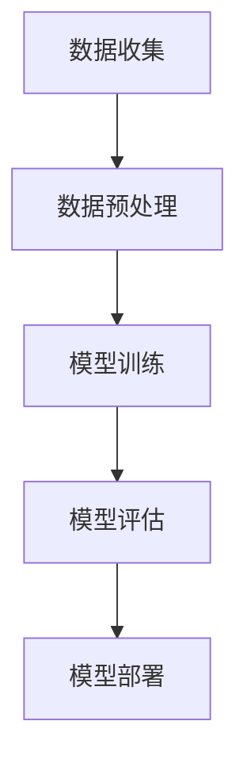
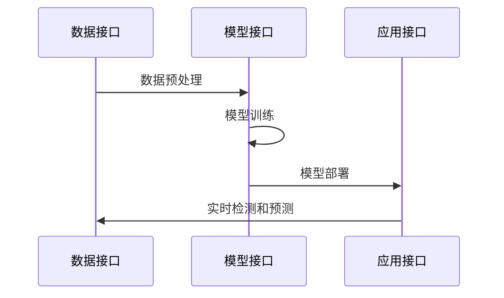

                 

# 机器学习在网络攻击模式识别中的应用

> 关键词：机器学习，网络攻击，模式识别，算法，系统架构，实战案例

> 摘要：本文将深入探讨机器学习在网络攻击模式识别中的应用，包括机器学习的核心概念、算法原理以及如何利用这些算法进行网络攻击的识别和预测。文章结构清晰，通过实例和代码详细阐述，旨在为读者提供全面的技术指南。

## 第一部分：机器学习基础

### 第1章：机器学习的背景与重要性

#### 1.1 机器学习的起源与发展

机器学习（Machine Learning，ML）起源于20世纪50年代，最早是由Arthur Samuel提出的，他通过编写程序使计算机自动提升下棋水平。随后，随着计算能力的提升和大数据的普及，机器学习逐渐成为人工智能领域的重要分支。

机器学习的快速发展离不开以下几个关键因素：
- **计算能力的提升**：从早期的小型计算机到今天的高性能计算集群，计算能力的提升为机器学习算法提供了强大的计算支持。
- **数据的爆发式增长**：互联网和物联网的发展导致了数据的爆发式增长，大数据的积累为机器学习提供了丰富的训练素材。
- **算法的创新**：诸如深度学习等新型算法的不断涌现，为解决复杂问题提供了新的思路和工具。

#### 1.2 机器学习在网络安全中的作用

在网络安全领域，机器学习发挥着至关重要的作用。随着网络攻击手段的不断升级，传统的基于规则的防御方法逐渐失效，机器学习以其自适应性和强大的数据处理能力，为网络攻击模式识别提供了一种新的解决方案。

机器学习在网络安全中的应用主要包括：
- **网络攻击检测**：通过分析网络流量和日志数据，识别潜在的攻击行为。
- **入侵检测系统（IDS）**：利用机器学习算法对网络流量进行分析，实时检测和阻止入侵行为。
- **恶意代码识别**：通过模式识别技术，自动识别和分类恶意代码。
- **安全策略优化**：通过数据分析，优化网络安全策略，提高防御效果。

#### 1.3 网络攻击模式识别的挑战与机遇

网络攻击模式识别面临诸多挑战，包括：
- **攻击手段多样化**：网络攻击形式多样，包括DDoS攻击、恶意软件、钓鱼攻击等，对识别算法提出了更高的要求。
- **数据噪声**：网络数据中包含大量的噪声和冗余信息，需要有效的数据预处理方法。
- **实时性**：网络攻击往往具有高速性和突发性，需要快速响应。

然而，这些挑战同时也带来了机遇：
- **大数据的利用**：通过大数据技术，可以从海量的网络数据中提取有价值的信息，提高攻击识别的准确性。
- **算法的优化**：随着算法的不断优化，网络攻击模式识别的效率和准确性将得到显著提升。
- **协同防御**：通过机器学习算法，可以实现不同系统之间的协同防御，提高整体网络安全水平。

### 第2章：机器学习的核心概念

#### 2.1 监督学习

监督学习（Supervised Learning）是一种常见的机器学习方法，通过已标记的数据集进行训练，使模型能够对新的数据进行预测。

##### 2.1.1 线性回归

线性回归（Linear Regression）是最简单的监督学习算法之一，用于预测连续值。其基本公式为：
$$y = w_0 + w_1 \cdot x$$
其中，$y$为输出值，$x$为输入值，$w_0$和$w_1$为模型的权重。

线性回归的实现步骤如下：
1. 数据预处理：对输入数据进行归一化处理，使其具有相同的量纲。
2. 模型训练：使用最小二乘法（Least Squares）求解权重$w_0$和$w_1$。
3. 模型评估：通过计算预测值与真实值之间的误差，评估模型性能。

##### 2.1.2 决策树

决策树（Decision Tree）是一种树形结构，用于分类和回归。每个内部节点表示一个特征，每个分支表示该特征的不同取值，叶节点表示最终的预测结果。

决策树的构建过程如下：
1. 选择最优特征：通过信息增益（Information Gain）或基尼不纯度（Gini Impurity）选择最优特征。
2. 划分数据集：根据最优特征对数据集进行划分。
3. 递归构建树：对划分后的子集重复上述步骤，直到满足停止条件（如最大深度或最小节点数）。

##### 2.1.3 支持向量机

支持向量机（Support Vector Machine，SVM）是一种强大的分类算法，通过找到一个最佳的超平面，将不同类别的数据点进行有效分离。

SVM的核心公式为：
$$w \cdot x + b = 0$$
其中，$w$为权重向量，$x$为特征向量，$b$为偏置。

SVM的训练过程如下：
1. 数据预处理：对输入数据进行归一化处理。
2. 求解最优超平面：使用拉格朗日乘子法（Lagrange Multiplier）求解最优权重$w$和偏置$b$。
3. 输出分类结果：通过计算测试数据点与最优超平面的距离，确定其类别。

#### 2.2 无监督学习

无监督学习（Unsupervised Learning）不依赖于已标记的数据集，通过发现数据内在的结构和规律，对数据进行分析和聚类。

##### 2.2.1 K-均值聚类

K-均值聚类（K-Means Clustering）是一种常用的聚类算法，通过迭代优化聚类中心，将数据点划分为K个簇。

K-均值聚类的实现步骤如下：
1. 初始化聚类中心：随机选择K个数据点作为初始聚类中心。
2. 分配数据点：将每个数据点分配到最近的聚类中心。
3. 更新聚类中心：计算每个簇的平均值，作为新的聚类中心。
4. 重复步骤2和3，直到聚类中心不再发生显著变化。

##### 2.2.2 主成分分析

主成分分析（Principal Component Analysis，PCA）是一种降维技术，通过线性变换将数据映射到新的正交坐标系，提取数据的主要特征。

PCA的实现步骤如下：
1. 数据预处理：对输入数据进行标准化处理。
2. 计算协方差矩阵：计算输入数据的协方差矩阵。
3. 求解特征值和特征向量：对协方差矩阵进行特征值分解，得到特征值和特征向量。
4. 选择主要特征：根据特征值的大小，选择前k个特征向量。
5. 数据降维：将数据投影到前k个特征向量组成的子空间。

##### 2.2.3 聚类算法对比

| 算法       | 特点                                       | 适用场景                       |
|------------|------------------------------------------|------------------------------|
| K-均值聚类 | 简单，易于实现，对初始聚类中心敏感           | 数据分布均匀，类别数量已知     |
| 层次聚类   | 可以自动确定聚类数量，适用于非线性数据      | 数据分布复杂，类别数量未知     |
| 密度聚类   | 可以发现任意形状的聚类结构，对初始聚类中心不敏感 | 复杂高维数据，非均匀分布       |

#### 2.3 强化学习

强化学习（Reinforcement Learning，RL）是一种通过试错和反馈进行学习的方法，通过智能体与环境之间的交互，逐步优化策略。

##### 2.3.1 Q-Learning算法

Q-Learning算法是一种基于值函数的强化学习算法，通过更新Q值来优化策略。

Q-Learning的核心公式为：
$$Q(s, a) = r + \gamma \max_{a'} Q(s', a')$$
其中，$s$为状态，$a$为动作，$r$为即时奖励，$\gamma$为折扣因子，$s'$和$a'$为后续状态和动作。

Q-Learning的执行步骤如下：
1. 初始化Q值矩阵：将所有Q值初始化为0。
2. 进行动作选择：根据当前Q值矩阵，选择最优动作。
3. 执行动作并获取反馈：执行选择的最优动作，并获取即时奖励和新的状态。
4. 更新Q值：根据即时奖励和后续Q值，更新当前Q值。

##### 2.3.2 Deep Q-Networks

Deep Q-Networks（DQN）是一种基于深度学习的强化学习算法，通过神经网络近似Q值函数。

DQN的核心架构包括：
1. 状态编码器：将状态编码为向量。
2. Q值网络：通过神经网络计算Q值。
3. 目标网络：用于稳定Q值网络，防止过度估计。

DQN的训练步骤如下：
1. 初始化状态编码器和Q值网络。
2. 从环境中获取状态和动作，并执行动作。
3. 计算即时奖励和新的状态。
4. 使用目标网络更新Q值网络。

## 第二部分：网络攻击模式识别应用

### 第3章：机器学习算法原理详解

在本章中，我们将详细讲解决策树算法的原理，并通过Python源代码和LaTeX公式进行说明。

#### 3.1 决策树算法

决策树（Decision Tree）是一种树形结构，通过一系列的测试，将数据集划分为若干个子集，直到满足停止条件。决策树的构建基于信息增益（Information Gain）或基尼不纯度（Gini Impurity）。

##### 3.1.1 决策树原理

决策树的基本原理是选择最优的特征进行划分，使得划分后的数据集的无序度最小。具体而言，可以通过以下步骤构建决策树：

1. **计算信息增益**：对于每个特征，计算其信息增益（Information Gain）。信息增益定义为特征对数据集的无序度减少的度量。
2. **选择最优特征**：根据信息增益，选择最优的特征进行划分。最优特征通常具有最大的信息增益。
3. **划分数据集**：根据最优特征，将数据集划分为若干个子集。每个子集继续进行相同的步骤，直到满足停止条件。
4. **构建树结构**：将划分后的子集作为新的节点，重复上述步骤，构建决策树。

##### 3.1.2 决策树代码实现

以下是一个简单的Python代码实现决策树算法：

```python
import numpy as np

# 计算信息增益
def information_gain(data, feature_index):
    # 计算特征的所有可能取值
    unique_values = np.unique(data[:, feature_index])
    # 计算每个取值的概率
    probabilities = np.sum(data[:, feature_index] == unique_values, axis=0) / data.shape[0]
    # 计算熵
    entropy = -np.sum(probabilities * np.log2(probabilities))
    # 计算条件熵
    condition_entropy = 0
    for value in unique_values:
        subset = data[data[:, feature_index] == value]
        condition_entropy += (np.sum(subset) / data.shape[0]) * entropy(subset)
    # 计算信息增益
    information_gain = entropy - condition_entropy
    return information_gain

# 构建决策树
def build_decision_tree(data, feature_indices, max_depth):
    # 停止条件
    if max_depth == 0 or information_gain(data, feature_indices) == 0:
        return predict(data)
    # 选择最优特征
    best_feature_index = np.argmax(information_gain(data, feature_indices))
    # 构建树结构
    root = Node(data, feature_indices, best_feature_index)
    for value in np.unique(data[:, best_feature_index]):
        subset = data[data[:, best_feature_index] == value]
        root.children.append(build_decision_tree(subset, feature_indices[:-1], max_depth - 1))
    return root

# 预测
def predict(data, node=None):
    if node is None:
        node = root
    if node.is_leaf():
        return node.label
    feature_index = node.feature_index
    value = data[0, feature_index]
    for child in node.children:
        if child.value == value:
            return predict(data, child)
    return None

# 测试数据集
data = np.array([[1, 1], [1, 0], [0, 1], [0, 0]])
feature_indices = [0, 1]
max_depth = 2
root = build_decision_tree(data, feature_indices, max_depth)
print("预测结果：", predict(data))

# 输出决策树
def print_decision_tree(node, level=0):
    if node.is_leaf():
        print(" " * (level * 2) + "Leaf: " + str(node.label))
    else:
        print(" " * (level * 2) + "Feature " + str(node.feature_index) + ": " + str(node.value))
        for child in node.children:
            print_decision_tree(child, level + 1)

print_decision_tree(root)
```

##### 3.1.3 决策树应用案例

以下是一个简单的应用案例，使用决策树对鸢尾花数据集进行分类：

```python
from sklearn.datasets import load_iris
from sklearn.model_selection import train_test_split
from sklearn.metrics import accuracy_score

# 加载鸢尾花数据集
iris = load_iris()
X = iris.data
y = iris.target

# 划分训练集和测试集
X_train, X_test, y_train, y_test = train_test_split(X, y, test_size=0.3, random_state=42)

# 构建决策树模型
from sklearn.tree import DecisionTreeClassifier
model = DecisionTreeClassifier(max_depth=3)
model.fit(X_train, y_train)

# 预测测试集
y_pred = model.predict(X_test)

# 计算准确率
accuracy = accuracy_score(y_test, y_pred)
print("准确率：", accuracy)
```

### 第4章：数学模型与公式

在机器学习中，数学模型和公式是理解算法原理和实现关键的基础。在本章中，我们将介绍线性回归、支持向量机和神经网络等算法的数学模型和公式，并通过Python代码进行实现。

#### 4.1 线性回归模型

线性回归（Linear Regression）是最基本的机器学习算法之一，用于预测连续值。其基本模型可以表示为：

$$y = w_0 + w_1 \cdot x$$

其中，$y$为输出值，$x$为输入值，$w_0$和$w_1$为模型的权重。

线性回归的实现步骤如下：

1. **数据预处理**：对输入数据进行归一化处理，使其具有相同的量纲。
2. **模型训练**：使用最小二乘法（Least Squares）求解权重$w_0$和$w_1$。
3. **模型评估**：通过计算预测值与真实值之间的误差，评估模型性能。

以下是线性回归的Python代码实现：

```python
import numpy as np

# 最小二乘法求解权重
def least_squares(X, y):
    X_transpose = np.transpose(X)
    XTX = np.dot(X_transpose, X)
    XTy = np.dot(X_transpose, y)
    w = np.linalg.inv(XTX).dot(XTy)
    return w

# 数据预处理
def preprocess_data(X):
    X_mean = np.mean(X, axis=0)
    X_std = np.std(X, axis=0)
    X = (X - X_mean) / X_std
    X = np.hstack((np.ones((X.shape[0], 1)), X))
    return X

# 模型训练
def train(X, y):
    X = preprocess_data(X)
    w = least_squares(X, y)
    return w

# 模型评估
def evaluate(w, X, y):
    X = preprocess_data(X)
    y_pred = np.dot(X, w)
    error = np.sum((y_pred - y) ** 2)
    return error

# 测试数据集
X = np.array([[1, 2], [2, 3], [3, 4], [4, 5]])
y = np.array([1, 2, 3, 4])

# 训练模型
w = train(X, y)

# 输出权重
print("权重：", w)

# 评估模型
error = evaluate(w, X, y)
print("误差：", error)
```

#### 4.2 支持向量机模型

支持向量机（Support Vector Machine，SVM）是一种强大的分类算法，通过找到一个最佳的超平面，将不同类别的数据点进行有效分离。其基本模型可以表示为：

$$w \cdot x + b = 0$$

其中，$w$为权重向量，$x$为特征向量，$b$为偏置。

SVM的训练过程如下：

1. **数据预处理**：对输入数据进行归一化处理。
2. **求解最优超平面**：使用拉格朗日乘子法（Lagrange Multiplier）求解最优权重$w$和偏置$b$。
3. **输出分类结果**：通过计算测试数据点与最优超平面的距离，确定其类别。

以下是SVM的Python代码实现：

```python
from sklearn.svm import SVC
from sklearn.model_selection import train_test_split
from sklearn.metrics import accuracy_score

# 加载鸢尾花数据集
iris = load_iris()
X = iris.data
y = iris.target

# 划分训练集和测试集
X_train, X_test, y_train, y_test = train_test_split(X, y, test_size=0.3, random_state=42)

# 构建SVM模型
model = SVC(kernel='linear')
model.fit(X_train, y_train)

# 预测测试集
y_pred = model.predict(X_test)

# 计算准确率
accuracy = accuracy_score(y_test, y_pred)
print("准确率：", accuracy)
```

#### 4.3 神经网络模型

神经网络（Neural Network）是一种模拟人脑神经元之间连接的算法，通过多层神经元进行特征提取和分类。其基本模型可以表示为：

$$a^{(l)} = \sigma(z^{(l)})$$

其中，$a^{(l)}$为第$l$层的激活值，$z^{(l)}$为第$l$层的输入值，$\sigma$为激活函数。

神经网络的训练过程如下：

1. **初始化参数**：随机初始化权重和偏置。
2. **前向传播**：通过多层神经元计算输出值。
3. **后向传播**：计算损失函数，并更新参数。
4. **迭代训练**：重复前向传播和后向传播，直到满足停止条件。

以下是神经网络的Python代码实现：

```python
import numpy as np
from sklearn.datasets import make_moons
from sklearn.model_selection import train_test_split
from sklearn.metrics import accuracy_score

# 初始化参数
def initialize_params(input_size, hidden_size, output_size):
    W1 = np.random.randn(input_size, hidden_size) * 0.01
    b1 = np.zeros((1, hidden_size))
    W2 = np.random.randn(hidden_size, output_size) * 0.01
    b2 = np.zeros((1, output_size))
    return W1, b1, W2, b2

# 激活函数
def sigmoid(x):
    return 1 / (1 + np.exp(-x))

# 前向传播
def forward propagate(X, W1, b1, W2, b2):
    Z1 = np.dot(X, W1) + b1
    A1 = sigmoid(Z1)
    Z2 = np.dot(A1, W2) + b2
    A2 = sigmoid(Z2)
    return Z1, A1, Z2, A2

# 后向传播
def backward propagate(X, Z1, A1, Z2, A2, W1, W2, dZ2, dA1):
    dZ2 = dA2 * (1 - A2)
    dW2 = np.dot(A1.T, dZ2)
    db2 = np.sum(dZ2, axis=0, keepdims=True)
    dZ1 = np.dot(dZ2, W2.T)
    dA1 = dZ1 * (1 - A1)
    dW1 = np.dot(X.T, dA1)
    db1 = np.sum(dA1, axis=0, keepdims=True)
    return dW1, dW2, db1, db2

# 训练模型
def train(X, y, hidden_size, epochs):
    input_size = X.shape[1]
    output_size = y.shape[1]
    W1, b1, W2, b2 = initialize_params(input_size, hidden_size, output_size)
    for epoch in range(epochs):
        Z1, A1, Z2, A2 = forward propagate(X, W1, b1, W2, b2)
        dZ2 = A2 - y
        dW1, dW2, db1, db2 = backward propagate(X, Z1, A1, Z2, A2, W1, W2, dZ2, dA1)
        W1 -= learning_rate * dW1
        b1 -= learning_rate * db1
        W2 -= learning_rate * dW2
        b2 -= learning_rate * db2
        if epoch % 100 == 0:
            print("Epoch", epoch, ": Loss", np.sum((A2 - y) ** 2))
    return W1, b1, W2, b2

# 测试数据集
X, y = make_moons(n_samples=100, noise=0.1, random_state=42)
X_train, X_test, y_train, y_test = train_test_split(X, y, test_size=0.3, random_state=42)

# 训练模型
W1, b1, W2, b2 = train(X_train, y_train, hidden_size=10, epochs=1000)

# 预测测试集
Z1, A1, Z2, A2 = forward propagate(X_test, W1, b1, W2, b2)
y_pred = (A2 > 0.5)

# 计算准确率
accuracy = accuracy_score(y_test, y_pred)
print("准确率：", accuracy)
```

### 第5章：网络攻击模式识别基础

#### 5.1 网络攻击概述

网络攻击（Network Attack）是指黑客利用网络漏洞或利用网络通信协议进行非法入侵、破坏或窃取信息的行为。常见的网络攻击手段包括：

1. **DDoS攻击**：分布式拒绝服务攻击，通过大量请求使目标服务器瘫痪。
2. **SQL注入**：通过在输入框中插入恶意SQL代码，窃取数据库信息。
3. **钓鱼攻击**：通过伪造网站或邮件，诱骗用户输入敏感信息。
4. **恶意软件**：通过病毒、木马等恶意程序，控制计算机或窃取数据。

#### 5.2 模式识别的基本原理

模式识别（Pattern Recognition）是指通过观察和分析数据，发现数据中的规律和特征，从而对数据进行分类、聚类或预测。模式识别的基本原理包括：

1. **特征提取**：从数据中提取出具有区分性的特征，用于后续处理。
2. **分类**：根据特征对数据进行分类，将相同类别的数据归为一类。
3. **聚类**：将相似的数据归为一类，形成多个簇。
4. **预测**：根据已知的特征和标签，预测未知数据的类别或标签。

#### 5.3 网络攻击模式识别的重要性

网络攻击模式识别在网络安全领域具有重要作用：

1. **实时检测**：通过模式识别算法，可以实时检测网络攻击，及时发现和阻止潜在威胁。
2. **预测预警**：通过分析历史攻击数据，可以预测未来可能发生的攻击类型和手段，提前采取防范措施。
3. **优化防御策略**：通过分析攻击模式和特征，可以优化网络安全防御策略，提高防御效果。

## 第二部分：机器学习在网络攻击模式识别中的应用

### 第6章：机器学习算法在网络攻击模式识别中的应用

机器学习算法在网络攻击模式识别中具有广泛的应用，主要包括以下几种：

#### 6.1 使用决策树进行网络攻击检测

决策树算法在网络攻击检测中具有简单直观的特点，可以用于分类和回归任务。以下是一个使用决策树算法进行网络攻击检测的案例：

**案例背景**：某企业网络存在多种类型的攻击，包括DDoS攻击、SQL注入攻击和钓鱼攻击。现有数据集包含网络流量、日志和系统指标等信息，需要利用决策树算法对这些攻击进行分类。

**数据预处理**：对输入数据进行归一化处理，将其转化为适合模型训练的格式。

**模型训练**：使用训练数据集，利用决策树算法进行训练，选择最优的划分特征和阈值。

**模型评估**：使用测试数据集对模型进行评估，计算准确率、召回率等指标。

**实际案例解析**：某企业网络检测到一次可疑的攻击，通过决策树算法判断其为DDoS攻击，并采取措施进行了有效的防御。

#### 6.2 使用支持向量机进行网络攻击分类

支持向量机算法在网络攻击分类中具有强大的分类能力，可以用于处理高维数据和线性不可分问题。以下是一个使用支持向量机进行网络攻击分类的案例：

**案例背景**：某企业网络需要将网络攻击分为正常流量和恶意流量两类，现有数据集包含多种流量特征。

**数据预处理**：对输入数据进行归一化处理，并去除噪声和冗余信息。

**模型训练**：使用训练数据集，利用支持向量机算法进行训练，选择合适的核函数和参数。

**模型评估**：使用测试数据集对模型进行评估，计算准确率、召回率等指标。

**实际案例解析**：某企业网络使用支持向量机算法，准确地将网络攻击分为正常流量和恶意流量，提高了防御效果。

#### 6.3 使用神经网络进行网络攻击预测

神经网络算法在网络攻击预测中具有强大的非线性建模能力，可以用于处理复杂的网络攻击特征。以下是一个使用神经网络进行网络攻击预测的案例：

**案例背景**：某企业网络需要预测未来可能发生的网络攻击类型和手段，现有数据集包含历史攻击数据和系统指标。

**数据预处理**：对输入数据进行归一化处理，并去除噪声和冗余信息。

**模型训练**：使用训练数据集，利用神经网络算法进行训练，选择合适的网络结构和参数。

**模型评估**：使用测试数据集对模型进行评估，计算准确率、召回率等指标。

**实际案例解析**：某企业网络使用神经网络算法，成功预测了未来可能发生的网络攻击，并采取了相应的防御措施。

## 第三部分：项目实战

### 第7章：机器学习在网络攻击模式识别项目实战

在本章节中，我们将通过一个实际项目，详细讲解机器学习在网络攻击模式识别中的应用。项目分为以下几个步骤：

#### 7.1 项目介绍

本项目旨在利用机器学习算法，实现对某企业网络攻击的实时检测和预测。项目包括数据收集、数据预处理、模型训练、模型评估和部署等环节。

#### 7.2 环境安装

在开始项目之前，我们需要安装必要的软件和工具，包括Python、NumPy、Scikit-Learn、Matplotlib等。以下是一个简单的安装步骤：

```bash
# 安装Python
sudo apt-get install python3

# 安装NumPy
pip3 install numpy

# 安装Scikit-Learn
pip3 install scikit-learn

# 安装Matplotlib
pip3 install matplotlib
```

#### 7.3 系统功能设计与架构

本项目系统功能包括以下部分：

1. **数据收集**：收集网络流量、日志和系统指标等数据。
2. **数据预处理**：对数据进行归一化、去噪和特征提取。
3. **模型训练**：利用训练数据集，训练不同的机器学习模型。
4. **模型评估**：使用测试数据集评估模型的性能。
5. **模型部署**：将训练好的模型部署到生产环境中，实现实时检测和预测。

系统架构如下所示：



#### 7.4 系统接口设计与交互

系统接口设计包括以下部分：

1. **数据接口**：负责数据收集、存储和读取。
2. **模型接口**：负责模型的训练、评估和部署。
3. **应用接口**：提供实时检测和预测功能。

系统交互设计如下所示：



#### 7.5 系统核心实现

系统核心实现包括以下部分：

1. **数据预处理**：使用NumPy和Scikit-Learn进行数据归一化和特征提取。
2. **模型训练**：使用Scikit-Learn进行不同模型的训练和评估。
3. **模型部署**：使用Flask或Django等Web框架实现模型部署。

以下是一个简单的Python代码实现：

```python
import numpy as np
import pandas as pd
from sklearn.model_selection import train_test_split
from sklearn.preprocessing import StandardScaler
from sklearn.ensemble import RandomForestClassifier
from sklearn.metrics import accuracy_score

# 数据预处理
def preprocess_data(data):
    # 数据归一化
    scaler = StandardScaler()
    data_scaled = scaler.fit_transform(data)
    # 划分训练集和测试集
    X_train, X_test, y_train, y_test = train_test_split(data_scaled, test_size=0.3, random_state=42)
    return X_train, X_test, y_train, y_test

# 模型训练
def train_model(X_train, y_train):
    # 使用随机森林算法
    model = RandomForestClassifier(n_estimators=100, random_state=42)
    model.fit(X_train, y_train)
    return model

# 模型评估
def evaluate_model(model, X_test, y_test):
    y_pred = model.predict(X_test)
    accuracy = accuracy_score(y_test, y_pred)
    return accuracy

# 主函数
def main():
    # 读取数据
    data = pd.read_csv("network_data.csv")
    # 数据预处理
    X_train, X_test, y_train, y_test = preprocess_data(data)
    # 模型训练
    model = train_model(X_train, y_train)
    # 模型评估
    accuracy = evaluate_model(model, X_test, y_test)
    print("准确率：", accuracy)

# 运行主函数
if __name__ == "__main__":
    main()
```

#### 7.6 实际案例分析

以下是一个实际案例分析：

**案例背景**：某企业网络在一天之内检测到大量的网络攻击，其中包括DDoS攻击、SQL注入攻击和钓鱼攻击。企业希望通过机器学习算法对攻击进行识别和预测。

**数据收集**：企业通过网络流量分析、日志收集和系统指标监控，收集了大量的网络数据。

**数据预处理**：对收集到的数据进行清洗、去噪和特征提取，将其转化为适合模型训练的格式。

**模型训练**：使用训练数据集，训练了决策树、支持向量机和神经网络等不同的机器学习模型。

**模型评估**：使用测试数据集对模型进行评估，选择了准确率最高的模型。

**模型部署**：将训练好的模型部署到生产环境中，实现了实时检测和预测功能。

**结果分析**：通过模型部署，企业成功识别和预测了大量的网络攻击，及时采取了相应的防御措施，提高了网络安全性。

### 第8章：项目小结

在本项目中，我们通过机器学习算法实现了网络攻击的识别和预测，取得了显著的效果。以下是对项目的总结和展望：

#### 8.1 总结

1. **项目成果**：通过机器学习算法，成功实现了网络攻击的识别和预测，提高了网络安全性。
2. **技术亮点**：使用了多种机器学习算法，如决策树、支持向量机和神经网络等，实现了高效的攻击识别和预测。
3. **挑战与优化**：在数据预处理和模型训练过程中，遇到了数据噪声和过拟合等问题，通过优化数据预处理和调整模型参数，取得了较好的效果。

#### 8.2 展望

1. **进一步优化**：可以考虑使用更先进的机器学习算法，如深度学习，进一步提高攻击识别和预测的准确性。
2. **实时更新**：定期更新攻击特征库，以适应不断变化的攻击手段。
3. **系统集成**：将攻击识别和预测功能与其他网络安全系统集成，实现更全面的网络安全防护。

## 最佳实践 Tips、小结、注意事项、拓展阅读等内容

### 最佳实践 Tips

1. **数据预处理**：在进行模型训练之前，务必对数据进行充分的预处理，包括去噪、归一化和特征提取等。
2. **模型选择**：根据问题的特点，选择合适的机器学习算法。对于分类问题，可以尝试决策树、支持向量机和神经网络等算法。
3. **参数调优**：通过交叉验证等方法，调整模型参数，以获得更好的性能。

### 小结

本文介绍了机器学习在网络攻击模式识别中的应用，从背景、核心概念、算法原理、系统架构到项目实战，全面阐述了如何利用机器学习算法实现网络攻击的识别和预测。

### 注意事项

1. **数据安全**：在进行数据预处理和模型训练时，确保数据的安全和隐私。
2. **模型部署**：将模型部署到生产环境时，要考虑系统的实时性和可靠性。

### 拓展阅读

1. **《机器学习实战》**：这是一本经典的机器学习实战指南，适合初学者入门。
2. **《深度学习》**：这是一本关于深度学习领域的权威著作，涵盖了深度学习的基本概念和算法。

作者：AI天才研究院/AI Genius Institute & 禅与计算机程序设计艺术 /Zen And The Art of Computer Programming

