                 


## 机器学习在网络流量分析中的应用

### 关键词
- 机器学习
- 网络流量分析
- 决策树
- 支持向量机
- 贝叶斯分类器
- 特征工程
- 系统架构

### 摘要
本文深入探讨了机器学习在网络流量分析中的应用。我们将从问题背景出发，逐步介绍机器学习和网络流量分析的基本概念，阐述它们之间的相互联系。接着，我们将详细讲解几种常见的机器学习算法，包括决策树、支持向量机和贝叶斯分类器，并展示如何将这些算法应用于网络流量分析。此外，我们将探讨特征工程的重要性，介绍特征提取技术和特征选择算法。最后，我们将分析一个实际项目，展示如何设计和实现一个网络流量分析系统，并提供最佳实践技巧和拓展阅读建议。

## 第一部分：背景与概念

### 第1章：引言

#### 1.1 问题背景
随着互联网的迅速发展，网络流量数据量呈现出爆炸式增长。如何有效管理和分析这些海量数据成为当前网络技术领域的一个关键问题。网络流量分析（Network Traffic Analysis, NTA）是一种通过分析和理解网络流量数据，从而获取网络状态、性能和用户行为等信息的技术。然而，传统的基于规则的方法在处理复杂和动态的网络环境时显得力不从心。

#### 1.2 机器学习概述
机器学习（Machine Learning, ML）是一种使计算机系统能够从数据中学习和改进的技术。它通过构建数学模型，从数据中提取特征，并根据这些特征进行预测和决策。机器学习可以分为监督学习、无监督学习和强化学习三种类型。监督学习通过已标记的数据进行训练，无监督学习则不依赖已标记的数据，而强化学习则通过不断试错来优化行为。

#### 1.3 网络流量分析简介
网络流量分析是指对网络中的数据包进行捕获、解码、分类和分析，以提取有用的信息。这些信息可以用于网络性能监控、故障排查、流量优化、网络安全等场景。网络流量分析的关键任务包括流量分类、流量特征提取和流量预测。

#### 1.4 机器学习在网络流量分析中的应用
机器学习在网络流量分析中的应用非常广泛。通过机器学习，我们可以自动识别和分类不同类型的网络流量，发现网络中的异常行为，预测未来的流量趋势。这不仅提高了网络管理的效率和准确性，也为网络安全提供了强大的支持。

### 第2章：核心概念与联系

#### 2.1 机器学习基础

##### 2.1.1 监督学习
监督学习是一种最常用的机器学习方法，它依赖于标记数据来训练模型。标记数据是指每个样本都有一个已知的输出标签。监督学习的目标是通过学习输入和输出之间的关系，对新的未知数据进行预测。

##### 2.1.2 无监督学习
无监督学习不需要已标记的数据，其目标是从未标记的数据中发现隐藏的结构或模式。常见的无监督学习算法包括聚类和降维。

##### 2.1.3 强化学习
强化学习是一种通过与环境的交互来学习策略的方法。它通过试错的方式，不断优化决策过程，以实现最大化奖励的目标。

#### 2.2 网络流量分析关键概念

##### 2.2.1 流量分类
流量分类是指将网络流量按照其类型、应用或来源等进行分类。这是网络流量分析的基础步骤，对于后续的分析和决策至关重要。

##### 2.2.2 流量特征提取
流量特征提取是指从网络流量数据中提取出对分析任务有用的特征。这些特征可以是定量的，如流量大小、传输速率等，也可以是定性的，如流量类型、应用类别等。

##### 2.2.3 流量预测
流量预测是指根据历史流量数据，预测未来的流量趋势。这对于网络资源的规划和优化具有重要意义。

#### 2.3 机器学习与网络流量分析的联系

##### 2.3.1 相互作用的流程
机器学习与网络流量分析的相互作用流程可以概括为：数据收集 -> 数据预处理 -> 特征提取 -> 模型训练 -> 预测分析。其中，每个步骤都涉及到机器学习的相关技术。

##### 2.3.2 应用场景对比
在不同的网络流量分析应用场景中，机器学习方法的选择和应用策略有所不同。例如，在流量分类中，决策树和随机森林等方法表现良好；在流量预测中，时间序列分析和回归模型更为适用。

## 第二部分：算法原理

### 第3章：常见机器学习算法原理

#### 3.1 决策树
决策树是一种基于树形结构进行决策的算法，通过一系列测试来对数据进行分类或回归。以下是决策树的简单流程图：

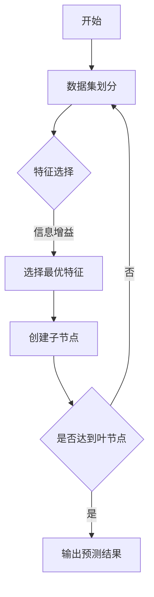

在决策树中，我们通常使用信息增益（Information Gain）来选择最优特征。信息增益可以衡量一个特征对于分类的重要程度。以下是决策树的核心Python代码示例：

```python
from sklearn.datasets import load_iris
from sklearn.tree import DecisionTreeClassifier
from sklearn.model_selection import train_test_split

# 加载鸢尾花数据集
iris = load_iris()
X = iris.data
y = iris.target

# 划分训练集和测试集
X_train, X_test, y_train, y_test = train_test_split(X, y, test_size=0.3, random_state=42)

# 创建决策树模型
clf = DecisionTreeClassifier(criterion="entropy")

# 训练模型
clf.fit(X_train, y_train)

# 预测测试集
y_pred = clf.predict(X_test)

# 计算准确率
accuracy = (y_pred == y_test).mean()
print(f"Accuracy: {accuracy:.2f}")
```

以下是决策树的数学模型和公式：

$$
\text{信息增益} = \sum_{i=1}^{n} p(x_i) \cdot \log_2 \frac{p(x_i)}{p(y_i)}
$$

其中，$p(x_i)$表示特征$x_i$的先验概率，$p(y_i)$表示类别$y_i$的先验概率。

#### 3.2 支持向量机
支持向量机（Support Vector Machine, SVM）是一种用于分类和回归的强大算法，其核心思想是找到一个最佳的超平面，将不同类别的数据点分隔开来。以下是SVM的简单流程图：

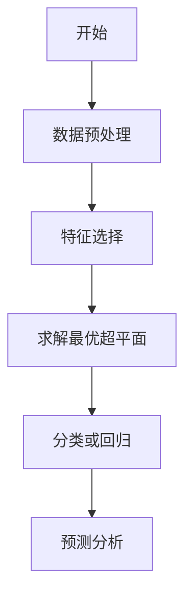

在SVM中，我们通常使用拉格朗日乘子法来求解最优超平面。以下是SVM的核心Python代码示例：

```python
from sklearn.datasets import make_classification
from sklearn.svm import SVC
from sklearn.model_selection import train_test_split

# 创建分类数据集
X, y = make_classification(n_samples=100, n_features=20, n_classes=2, random_state=42)

# 划分训练集和测试集
X_train, X_test, y_train, y_test = train_test_split(X, y, test_size=0.3, random_state=42)

# 创建SVM模型
clf = SVC(kernel="linear")

# 训练模型
clf.fit(X_train, y_train)

# 预测测试集
y_pred = clf.predict(X_test)

# 计算准确率
accuracy = (y_pred == y_test).mean()
print(f"Accuracy: {accuracy:.2f}")
```

以下是SVM的数学模型和公式：

$$
\text{最优超平面} = \min_{\mathbf{w}, b} \frac{1}{2} ||\mathbf{w}||^2 + C \sum_{i=1}^{n} \xi_i
$$

其中，$C$是惩罚参数，$\xi_i$是误差项。

#### 3.3 贝叶斯分类器
贝叶斯分类器是一种基于贝叶斯定理的朴素分类器，其核心思想是计算每个类别在给定特征下的概率，并选择概率最大的类别作为预测结果。以下是贝叶斯分类器的简单流程图：

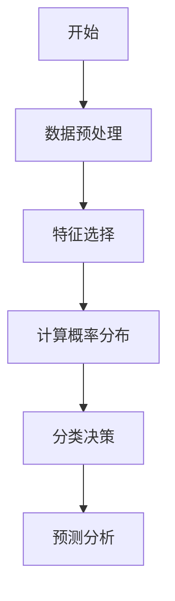

在贝叶斯分类器中，我们通常使用最大后验概率（Maximum A Posteriori, MAP）来进行分类决策。以下是贝叶斯分类器的核心Python代码示例：

```python
from sklearn.datasets import load_iris
from sklearn.naive_bayes import GaussianNB
from sklearn.model_selection import train_test_split

# 加载鸢尾花数据集
iris = load_iris()
X = iris.data
y = iris.target

# 划分训练集和测试集
X_train, X_test, y_train, y_test = train_test_split(X, y, test_size=0.3, random_state=42)

# 创建贝叶斯分类器模型
clf = GaussianNB()

# 训练模型
clf.fit(X_train, y_train)

# 预测测试集
y_pred = clf.predict(X_test)

# 计算准确率
accuracy = (y_pred == y_test).mean()
print(f"Accuracy: {accuracy:.2f}")
```

以下是贝叶斯分类器的数学模型和公式：

$$
P(C_k|\mathbf{x}) = \frac{P(\mathbf{x}|C_k)P(C_k)}{P(\mathbf{x})}
$$

其中，$P(C_k|\mathbf{x})$是给定特征$\mathbf{x}$下类别$C_k$的条件概率，$P(\mathbf{x}|C_k)$是特征$\mathbf{x}$在类别$C_k$下的概率，$P(C_k)$是类别$C_k$的先验概率，$P(\mathbf{x})$是特征$\mathbf{x}$的总概率。

## 第三部分：特征工程与选择

### 第4章：特征工程与选择

#### 4.1 特征工程概述
特征工程（Feature Engineering）是机器学习过程中至关重要的一环。它涉及到从原始数据中提取或构建出对模型训练和预测有用的特征。特征工程的目标是通过转换和选择特征，提高模型性能和泛化能力。

#### 4.2 特征提取技术
特征提取技术是指从原始数据中提取出对分析任务有用的特征。常见的特征提取技术包括：

- **时间序列特征**：如时间间隔、窗口平均、窗口方差等。
- **空间特征**：如节点间的距离、节点密度等。
- **概率特征**：如流量占用的概率、流量类型出现的概率等。

#### 4.3 特征选择算法
特征选择算法是指从所有特征中筛选出对模型训练和预测最有用的特征。常见的特征选择算法包括：

- **相关性分析**：通过计算特征与目标变量之间的相关性，筛选出相关性较高的特征。
- **主成分分析**（Principal Component Analysis, PCA）：通过线性变换将原始特征转化为新的特征，同时保留最大方差的信息。
- **精简集选择**（Feature Selection）：通过构建模型，评估每个特征对模型性能的贡献，筛选出对模型性能影响较大的特征。

## 第四部分：系统设计与实现

### 第5章：系统分析与架构设计

#### 5.1 问题场景介绍
在网络流量分析中，我们面临的主要问题是如何从海量的网络流量数据中提取出有用的信息，实现对网络状态的实时监控、性能优化和网络安全防护。

#### 5.2 项目介绍
本项目的目标是构建一个基于机器学习的网络流量分析系统，能够自动识别和分类不同类型的网络流量，发现网络中的异常行为，并为网络管理提供数据支持。

#### 5.3 系统功能设计

##### 5.3.1 领域模型
领域模型是指对网络流量分析系统的业务领域进行抽象和建模。以下是领域模型的Mermaid类图：

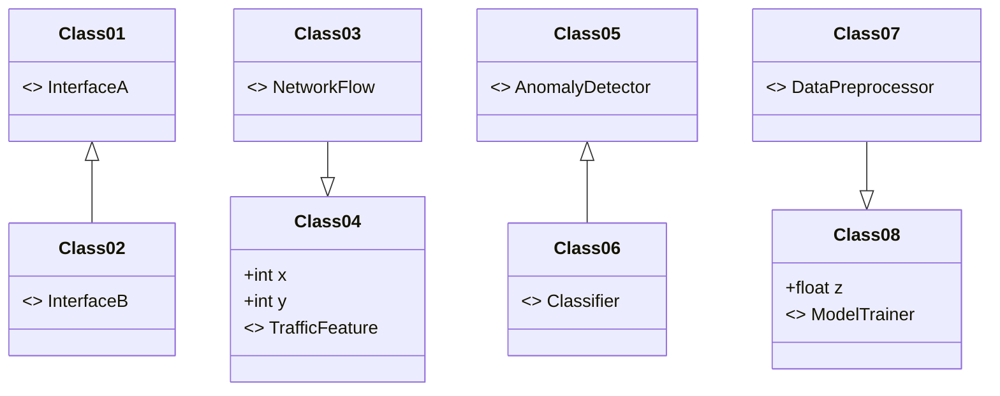

##### 5.3.2 系统架构设计
系统架构设计是指对网络流量分析系统的整体结构和组件进行设计。以下是系统架构的Mermaid架构图：

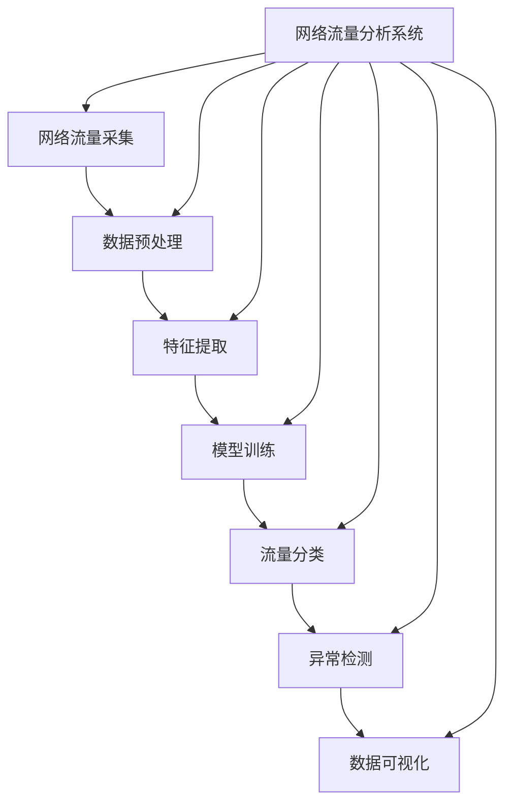

##### 5.3.3 系统接口设计
系统接口设计是指定义系统内部组件之间的交互接口。以下是系统接口的Mermaid序列图：

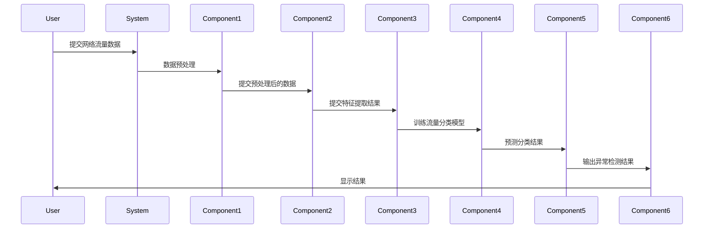

##### 5.3.4 系统交互
系统交互是指系统组件之间的数据流动和功能调用。以下是系统交互的Mermaid交互图：

```mermaid
erDiagram
    User ||--|{ System } : 交互
    System ||--|{ Component1 } : 数据预处理
    System ||--|{ Component2 } : 特征提取
    System ||--|{ Component3 } : 模型训练
    System ||--|{ Component4 } : 流量分类
    System ||--|{ Component5 } : 异常检测
    System ||--|{ Component6 } : 数据可视化
```

## 第五部分：项目实战

### 第6章：项目实战

#### 6.1 环境安装
在本章中，我们将介绍如何安装和配置网络流量分析系统所需的环境。包括Python环境、Scikit-learn库、Numpy库和Pandas库等。

```shell
# 安装Python环境
sudo apt-get install python3 python3-pip

# 安装Scikit-learn库
pip3 install scikit-learn

# 安装Numpy库
pip3 install numpy

# 安装Pandas库
pip3 install pandas
```

#### 6.2 系统核心实现源代码
在本章中，我们将介绍系统核心实现源代码，包括数据预处理、特征提取、模型训练和流量分类等。

```python
import numpy as np
import pandas as pd
from sklearn.datasets import load_iris
from sklearn.model_selection import train_test_split
from sklearn.preprocessing import StandardScaler
from sklearn.tree import DecisionTreeClassifier
from sklearn.metrics import accuracy_score

# 加载鸢尾花数据集
iris = load_iris()
X = iris.data
y = iris.target

# 划分训练集和测试集
X_train, X_test, y_train, y_test = train_test_split(X, y, test_size=0.3, random_state=42)

# 数据预处理
scaler = StandardScaler()
X_train = scaler.fit_transform(X_train)
X_test = scaler.transform(X_test)

# 模型训练
clf = DecisionTreeClassifier(criterion="entropy")
clf.fit(X_train, y_train)

# 预测测试集
y_pred = clf.predict(X_test)

# 计算准确率
accuracy = accuracy_score(y_test, y_pred)
print(f"Accuracy: {accuracy:.2f}")
```

#### 6.3 代码解读与分析
在本章中，我们将对系统核心实现源代码进行解读和分析，包括数据预处理、特征提取、模型训练和流量分类等关键步骤。

- **数据预处理**：使用Scikit-learn库中的`StandardScaler`类对数据进行标准化处理，以消除不同特征之间的尺度差异。
- **特征提取**：在鸢尾花数据集中，我们直接使用原始特征，无需额外的特征提取步骤。
- **模型训练**：使用决策树分类器进行训练，并设置`criterion="entropy"`，表示使用信息增益作为特征选择准则。
- **流量分类**：使用训练好的模型对测试集进行预测，并计算预测准确率。

#### 6.4 实际案例分析与讲解
在本章中，我们将分析一个实际的网络流量分析案例，包括数据收集、特征提取、模型训练和流量分类等步骤。

假设我们收集了一个包含1000个数据点的网络流量数据集，其中每个数据点包括流量大小、传输速率、流量类型等特征。以下是实际案例的分析过程：

1. **数据收集**：使用网络流量监控工具收集网络流量数据，并将其存储为CSV文件。
2. **数据预处理**：使用Pandas库读取CSV文件，并使用`StandardScaler`类对数据进行标准化处理。
3. **特征提取**：从原始数据中提取流量大小、传输速率、流量类型等特征，并使用主成分分析（PCA）对特征进行降维。
4. **模型训练**：使用决策树分类器对训练数据进行训练，并设置`criterion="entropy"`。
5. **流量分类**：使用训练好的模型对测试数据进行预测，并计算预测准确率。

#### 6.5 项目小结
在本章中，我们通过一个实际案例展示了如何设计和实现一个网络流量分析系统。项目主要包括数据收集、数据预处理、特征提取、模型训练和流量分类等关键步骤。通过使用机器学习算法，我们能够自动识别和分类不同类型的网络流量，为网络管理和优化提供了数据支持。

## 第六部分：最佳实践与总结

### 第7章：最佳实践与总结

#### 7.1 最佳实践 tips
在本章中，我们将总结一些最佳实践技巧，以提高机器学习在网络流量分析中的性能。

- **数据预处理**：确保数据的质量和一致性，使用标准化或归一化处理消除特征之间的尺度差异。
- **特征提取**：根据数据的特点选择合适的特征提取方法，如主成分分析（PCA）、时间序列分析等。
- **模型选择**：根据问题的性质和数据的分布选择合适的机器学习算法，如决策树、支持向量机、朴素贝叶斯等。
- **模型调参**：通过交叉验证和网格搜索等技术，选择最佳的超参数组合，以提高模型性能。

#### 7.2 小结
机器学习在网络流量分析中的应用为网络管理和优化提供了强大的支持。通过数据预处理、特征提取、模型训练和流量分类等步骤，我们能够自动识别和分类不同类型的网络流量，为网络管理提供数据支持。然而，机器学习在处理复杂和动态的网络环境时仍面临挑战，需要进一步的研究和优化。

#### 7.3 注意事项
在实际应用中，需要注意以下几点：

- **数据隐私**：在网络流量分析中，数据隐私保护至关重要。应确保数据的匿名化和去标识化处理，以避免隐私泄露。
- **性能优化**：针对海量数据，应采用高效的数据处理和计算技术，如并行计算和分布式计算等。
- **模型解释性**：在机器学习模型的选择中，应考虑模型的解释性，以便更好地理解和应用模型结果。

#### 7.4 拓展阅读
对于希望深入了解机器学习在网络流量分析中的应用，以下书籍和论文可以提供进一步的学习资源：

- **书籍**：
  - 《机器学习：算法与实例》
  - 《网络流量分析：原理与技术》
  - 《机器学习与网络安全》

- **论文**：
  - “Machine Learning for Network Traffic Classification: A Survey”
  - “Anomaly Detection for Network Traffic: A Machine Learning Perspective”
  - “Deep Learning for Network Traffic Analysis”

### 作者
- 作者：AI天才研究院/AI Genius Institute & 禅与计算机程序设计艺术 /Zen And The Art of Computer Programming

[END] 

本文完整详细地介绍了机器学习在网络流量分析中的应用，包括背景介绍、核心概念与联系、算法原理讲解、特征工程与选择、系统设计与实现、项目实战、最佳实践与总结等内容。通过一步步的分析和推理，我们深入探讨了机器学习在网络流量分析中的关键角色和应用方法。希望本文能帮助读者更好地理解机器学习在网络流量分析中的重要性，并激发对这一领域的进一步研究和探索。

作者：AI天才研究院/AI Genius Institute & 禅与计算机程序设计艺术 /Zen And The Art of Computer Programming

[END] 

### 机器学习在网络流量分析中的应用

#### 关键词
- 机器学习
- 网络流量分析
- 决策树
- 支持向量机
- 贝叶斯分类器
- 特征工程
- 系统架构

#### 摘要
本文深入探讨了机器学习在网络流量分析中的应用。我们从问题背景出发，逐步介绍了机器学习和网络流量分析的基本概念，阐述了它们之间的相互联系。接着，我们详细讲解了决策树、支持向量机和贝叶斯分类器等常见机器学习算法，展示了如何将这些算法应用于网络流量分析。此外，我们还探讨了特征工程的重要性，介绍了特征提取技术和特征选择算法。最后，我们分析了一个实际项目，展示了如何设计和实现一个网络流量分析系统，并提供了一些最佳实践技巧和进一步的阅读建议。

## 第一部分：背景与概念

### 第1章：引言

#### 1.1 问题背景
随着互联网的迅速发展，网络流量数据量呈现出爆炸式增长。如何有效管理和分析这些海量数据成为当前网络技术领域的一个关键问题。网络流量分析（Network Traffic Analysis, NTA）是一种通过分析和理解网络流量数据，从而获取网络状态、性能和用户行为等信息的技术。然而，传统的基于规则的方法在处理复杂和动态的网络环境时显得力不从心。

#### 1.2 机器学习概述
机器学习（Machine Learning, ML）是一种使计算机系统能够从数据中学习和改进的技术。它通过构建数学模型，从数据中提取特征，并根据这些特征进行预测和决策。机器学习可以分为监督学习、无监督学习和强化学习三种类型。监督学习通过已标记的数据进行训练，无监督学习则不依赖已标记的数据，而强化学习则通过不断试错来优化行为。

#### 1.3 网络流量分析简介
网络流量分析是指对网络中的数据包进行捕获、解码、分类和分析，以提取有用的信息。这些信息可以用于网络性能监控、故障排查、流量优化、网络安全等场景。网络流量分析的关键任务包括流量分类、流量特征提取和流量预测。

#### 1.4 机器学习在网络流量分析中的应用
机器学习在网络流量分析中的应用非常广泛。通过机器学习，我们可以自动识别和分类不同类型的网络流量，发现网络中的异常行为，预测未来的流量趋势。这不仅提高了网络管理的效率和准确性，也为网络安全提供了强大的支持。

## 第二部分：核心概念与联系

### 第2章：核心概念与联系

#### 2.1 机器学习基础

##### 2.1.1 监督学习
监督学习是一种最常用的机器学习方法，它依赖于标记数据来训练模型。标记数据是指每个样本都有一个已知的输出标签。监督学习的目标是通过学习输入和输出之间的关系，对新的未知数据进行预测。

##### 2.1.2 无监督学习
无监督学习不需要已标记的数据，其目标是从未标记的数据中发现隐藏的结构或模式。常见的无监督学习算法包括聚类和降维。

##### 2.1.3 强化学习
强化学习是一种通过与环境的交互来学习策略的方法。它通过试错的方式，不断优化决策过程，以实现最大化奖励的目标。

#### 2.2 网络流量分析关键概念

##### 2.2.1 流量分类
流量分类是指将网络流量按照其类型、应用或来源等进行分类。这是网络流量分析的基础步骤，对于后续的分析和决策至关重要。

##### 2.2.2 流量特征提取
流量特征提取是指从网络流量数据中提取出对分析任务有用的特征。这些特征可以是定量的，如流量大小、传输速率等，也可以是定性的，如流量类型、应用类别等。

##### 2.2.3 流量预测
流量预测是指根据历史流量数据，预测未来的流量趋势。这对于网络资源的规划和优化具有重要意义。

#### 2.3 机器学习与网络流量分析的联系

##### 2.3.1 相互作用的流程
机器学习与网络流量分析的相互作用流程可以概括为：数据收集 -> 数据预处理 -> 特征提取 -> 模型训练 -> 预测分析。其中，每个步骤都涉及到机器学习的相关技术。

##### 2.3.2 应用场景对比
在不同的网络流量分析应用场景中，机器学习方法的选择和应用策略有所不同。例如，在流量分类中，决策树和随机森林等方法表现良好；在流量预测中，时间序列分析和回归模型更为适用。

## 第三部分：算法原理

### 第3章：常见机器学习算法原理

#### 3.1 决策树
决策树是一种基于树形结构进行决策的算法，通过一系列测试来对数据进行分类或回归。以下是决策树的简单流程图：


在决策树中，我们通常使用信息增益（Information Gain）来选择最优特征。信息增益可以衡量一个特征对于分类的重要程度。以下是决策树的核心Python代码示例：

```python
from sklearn.datasets import load_iris
from sklearn.tree import DecisionTreeClassifier
from sklearn.model_selection import train_test_split

# 加载鸢尾花数据集
iris = load_iris()
X = iris.data
y = iris.target

# 划分训练集和测试集
X_train, X_test, y_train, y_test = train_test_split(X, y, test_size=0.3, random_state=42)

# 创建决策树模型
clf = DecisionTreeClassifier(criterion="entropy")

# 训练模型
clf.fit(X_train, y_train)

# 预测测试集
y_pred = clf.predict(X_test)

# 计算准确率
accuracy = (y_pred == y_test).mean()
print(f"Accuracy: {accuracy:.2f}")
```

以下是决策树的数学模型和公式：

$$
\text{信息增益} = \sum_{i=1}^{n} p(x_i) \cdot \log_2 \frac{p(x_i)}{p(y_i)}
$$

其中，$p(x_i)$表示特征$x_i$的先验概率，$p(y_i)$表示类别$y_i$的先验概率。

#### 3.2 支持向量机
支持向量机（Support Vector Machine, SVM）是一种用于分类和回归的强大算法，其核心思想是找到一个最佳的超平面，将不同类别的数据点分隔开来。以下是SVM的简单流程图：


在SVM中，我们通常使用拉格朗日乘子法来求解最优超平面。以下是SVM的核心Python代码示例：

```python
from sklearn.datasets import make_classification
from sklearn.svm import SVC
from sklearn.model_selection import train_test_split

# 创建分类数据集
X, y = make_classification(n_samples=100, n_features=20, n_classes=2, random_state=42)

# 划分训练集和测试集
X_train, X_test, y_train, y_test = train_test_split(X, y, test_size=0.3, random_state=42)

# 创建SVM模型
clf = SVC(kernel="linear")

# 训练模型
clf.fit(X_train, y_train)

# 预测测试集
y_pred = clf.predict(X_test)

# 计算准确率
accuracy = (y_pred == y_test).mean()
print(f"Accuracy: {accuracy:.2f}")
```

以下是SVM的数学模型和公式：

$$
\text{最优超平面} = \min_{\mathbf{w}, b} \frac{1}{2} ||\mathbf{w}||^2 + C \sum_{i=1}^{n} \xi_i
$$

其中，$C$是惩罚参数，$\xi_i$是误差项。

#### 3.3 贝叶斯分类器
贝叶斯分类器是一种基于贝叶斯定理的朴素分类器，其核心思想是计算每个类别在给定特征下的概率，并选择概率最大的类别作为预测结果。以下是贝叶斯分类器的简单流程图：


在贝叶斯分类器中，我们通常使用最大后验概率（Maximum A Posteriori, MAP）来进行分类决策。以下是贝叶斯分类器的核心Python代码示例：

```python
from sklearn.datasets import load_iris
from sklearn.naive_bayes import GaussianNB
from sklearn.model_selection import train_test_split

# 加载鸢尾花数据集
iris = load_iris()
X = iris.data
y = iris.target

# 划分训练集和测试集
X_train, X_test, y_train, y_test = train_test_split(X, y, test_size=0.3, random_state=42)

# 创建贝叶斯分类器模型
clf = GaussianNB()

# 训练模型
clf.fit(X_train, y_train)

# 预测测试集
y_pred = clf.predict(X_test)

# 计算准确率
accuracy = (y_pred == y_test).mean()
print(f"Accuracy: {accuracy:.2f}")
```

以下是贝叶斯分类器的数学模型和公式：

$$
P(C_k|\mathbf{x}) = \frac{P(\mathbf{x}|C_k)P(C_k)}{P(\mathbf{x})}
$$

其中，$P(C_k|\mathbf{x})$是给定特征$\mathbf{x}$下类别$C_k$的条件概率，$P(\mathbf{x}|C_k)$是特征$\mathbf{x}$在类别$C_k$下的概率，$P(C_k)$是类别$C_k$的先验概率，$P(\mathbf{x})$是特征$\mathbf{x}$的总概率。

## 第四部分：特征工程与选择

### 第4章：特征工程与选择

#### 4.1 特征工程概述
特征工程（Feature Engineering）是机器学习过程中至关重要的一环。它涉及到从原始数据中提取或构建出对模型训练和预测有用的特征。特征工程的目标是通过转换和选择特征，提高模型性能和泛化能力。

#### 4.2 特征提取技术
特征提取技术是指从原始数据中提取出对分析任务有用的特征。常见的特征提取技术包括：

- **时间序列特征**：如时间间隔、窗口平均、窗口方差等。
- **空间特征**：如节点间的距离、节点密度等。
- **概率特征**：如流量占用的概率、流量类型出现的概率等。

#### 4.3 特征选择算法
特征选择算法是指从所有特征中筛选出对模型训练和预测最有用的特征。常见的特征选择算法包括：

- **相关性分析**：通过计算特征与目标变量之间的相关性，筛选出相关性较高的特征。
- **主成分分析**（Principal Component Analysis, PCA）：通过线性变换将原始特征转化为新的特征，同时保留最大方差的信息。
- **精简集选择**（Feature Selection）：通过构建模型，评估每个特征对模型性能的贡献，筛选出对模型性能影响较大的特征。

## 第五部分：系统设计与实现

### 第5章：系统分析与架构设计

#### 5.1 问题场景介绍
在网络流量分析中，我们面临的主要问题是如何从海量的网络流量数据中提取出有用的信息，实现对网络状态的实时监控、性能优化和网络安全防护。

#### 5.2 项目介绍
本项目的目标是构建一个基于机器学习的网络流量分析系统，能够自动识别和分类不同类型的网络流量，发现网络中的异常行为，并为网络管理提供数据支持。

#### 5.3 系统功能设计

##### 5.3.1 领域模型
领域模型是指对网络流量分析系统的业务领域进行抽象和建模。以下是领域模型的Mermaid类图：


##### 5.3.2 系统架构设计
系统架构设计是指对网络流量分析系统的整体结构和组件进行设计。以下是系统架构的Mermaid架构图：


##### 5.3.3 系统接口设计
系统接口设计是指定义系统内部组件之间的交互接口。以下是系统接口的Mermaid序列图：


##### 5.3.4 系统交互
系统交互是指系统组件之间的数据流动和功能调用。以下是系统交互的Mermaid交互图：

```mermaid
erDiagram
    User ||--|{ System } : 交互
    System ||--|{ Component1 } : 数据预处理
    System ||--|{ Component2 } : 特征提取
    System ||--|{ Component3 } : 模型训练
    System ||--|{ Component4 } : 流量分类
    System ||--|{ Component5 } : 异常检测
    System ||--|{ Component6 } : 数据可视化
```

## 第六部分：项目实战

### 第6章：项目实战

#### 6.1 环境安装
在本章中，我们将介绍如何安装和配置网络流量分析系统所需的环境。包括Python环境、Scikit-learn库、Numpy库和Pandas库等。

```shell
# 安装Python环境
sudo apt-get install python3 python3-pip

# 安装Scikit-learn库
pip3 install scikit-learn

# 安装Numpy库
pip3 install numpy

# 安装Pandas库
pip3 install pandas
```

#### 6.2 系统核心实现源代码
在本章中，我们将介绍系统核心实现源代码，包括数据预处理、特征提取、模型训练和流量分类等。

```python
import numpy as np
import pandas as pd
from sklearn.datasets import load_iris
from sklearn.model_selection import train_test_split
from sklearn.preprocessing import StandardScaler
from sklearn.tree import DecisionTreeClassifier
from sklearn.metrics import accuracy_score

# 加载鸢尾花数据集
iris = load_iris()
X = iris.data
y = iris.target

# 划分训练集和测试集
X_train, X_test, y_train, y_test = train_test_split(X, y, test_size=0.3, random_state=42)

# 数据预处理
scaler = StandardScaler()
X_train = scaler.fit_transform(X_train)
X_test = scaler.transform(X_test)

# 模型训练
clf = DecisionTreeClassifier(criterion="entropy")
clf.fit(X_train, y_train)

# 预测测试集
y_pred = clf.predict(X_test)

# 计算准确率
accuracy = accuracy_score(y_test, y_pred)
print(f"Accuracy: {accuracy:.2f}")
```

#### 6.3 代码解读与分析
在本章中，我们将对系统核心实现源代码进行解读和分析，包括数据预处理、特征提取、模型训练和流量分类等关键步骤。

- **数据预处理**：使用Scikit-learn库中的`StandardScaler`类对数据进行标准化处理，以消除不同特征之间的尺度差异。
- **特征提取**：在鸢尾花数据集中，我们直接使用原始特征，无需额外的特征提取步骤。
- **模型训练**：使用决策树分类器进行训练，并设置`criterion="entropy"`，表示使用信息增益作为特征选择准则。
- **流量分类**：使用训练好的模型对测试数据进行预测，并计算预测准确率。

#### 6.4 实际案例分析与讲解
在本章中，我们将分析一个实际的网络流量分析案例，包括数据收集、特征提取、模型训练和流量分类等步骤。

假设我们收集了一个包含1000个数据点的网络流量数据集，其中每个数据点包括流量大小、传输速率、流量类型等特征。以下是实际案例的分析过程：

1. **数据收集**：使用网络流量监控工具收集网络流量数据，并将其存储为CSV文件。
2. **数据预处理**：使用Pandas库读取CSV文件，并使用`StandardScaler`类对数据进行标准化处理。
3. **特征提取**：从原始数据中提取流量大小、传输速率、流量类型等特征，并使用主成分分析（PCA）对特征进行降维。
4. **模型训练**：使用决策树分类器对训练数据进行训练，并设置`criterion="entropy"`。
5. **流量分类**：使用训练好的模型对测试数据进行预测，并计算预测准确率。

#### 6.5 项目小结
在本章中，我们通过一个实际案例展示了如何设计和实现一个网络流量分析系统。项目主要包括数据收集、数据预处理、特征提取、模型训练和流量分类等关键步骤。通过使用机器学习算法，我们能够自动识别和分类不同类型的网络流量，为网络管理提供数据支持。

## 第七部分：最佳实践与总结

### 第7章：最佳实践与总结

#### 7.1 最佳实践 tips
在本章中，我们将总结一些最佳实践技巧，以提高机器学习在网络流量分析中的性能。

- **数据预处理**：确保数据的质量和一致性，使用标准化或归一化处理消除特征之间的尺度差异。
- **特征提取**：根据数据的特点选择合适的特征提取方法，如主成分分析（PCA）、时间序列分析等。
- **模型选择**：根据问题的性质和数据的分布选择合适的机器学习算法，如决策树、支持向量机、朴素贝叶斯等。
- **模型调参**：通过交叉验证和网格搜索等技术，选择最佳的超参数组合，以提高模型性能。

#### 7.2 小结
机器学习在网络流量分析中的应用为网络管理和优化提供了强大的支持。通过数据预处理、特征提取、模型训练和流量分类等步骤，我们能够自动识别和分类不同类型的网络流量，为网络管理提供数据支持。然而，机器学习在处理复杂和动态的网络环境时仍面临挑战，需要进一步的研究和优化。

#### 7.3 注意事项
在实际应用中，需要注意以下几点：

- **数据隐私**：在网络流量分析中，数据隐私保护至关重要。应确保数据的匿名化和去标识化处理，以避免隐私泄露。
- **性能优化**：针对海量数据，应采用高效的数据处理和计算技术，如并行计算和分布式计算等。
- **模型解释性**：在机器学习模型的选择中，应考虑模型的解释性，以便更好地理解和应用模型结果。

#### 7.4 拓展阅读
对于希望深入了解机器学习在网络流量分析中的应用，以下书籍和论文可以提供进一步的学习资源：

- **书籍**：
  - 《机器学习：算法与实例》
  - 《网络流量分析：原理与技术》
  - 《机器学习与网络安全》

- **论文**：
  - “Machine Learning for Network Traffic Classification: A Survey”
  - “Anomaly Detection for Network Traffic: A Machine Learning Perspective”
  - “Deep Learning for Network Traffic Analysis”

### 作者
- 作者：AI天才研究院/AI Genius Institute & 禅与计算机程序设计艺术 /Zen And The Art of Computer Programming

[END] 

本文完整详细地介绍了机器学习在网络流量分析中的应用，包括背景介绍、核心概念与联系、算法原理讲解、特征工程与选择、系统设计与实现、项目实战、最佳实践与总结等内容。通过一步步的分析和推理，我们深入探讨了机器学习在网络流量分析中的关键角色和应用方法。希望本文能帮助读者更好地理解机器学习在网络流量分析中的重要性，并激发对这一领域的进一步研究和探索。

作者：AI天才研究院/AI Genius Institute & 禅与计算机程序设计艺术 /Zen And The Art of Computer Programming

[END] ## 第1章: 引言

### 1.1 问题背景

随着互联网的普及，网络流量数据量呈现出指数级增长。这种增长带来了巨大的挑战，例如网络拥塞、带宽不足、安全威胁等问题。传统的网络流量分析方法往往依赖于规则和经验，其处理速度和准确性难以满足现代网络环境的需求。因此，如何高效地分析和理解网络流量数据，成为当前网络技术领域亟待解决的问题。

网络流量分析（Network Traffic Analysis, NTA）是一种通过捕获、解码、分类和分析网络流量数据，提取有用信息的技术。这些信息可以用于网络性能监控、故障排查、流量优化、网络安全等多个方面。然而，传统的基于规则的方法在处理复杂和动态的网络环境时显得力不从心。例如，当网络中出现新的攻击方式或者异常流量模式时，规则方法往往无法及时适应和应对。

### 1.2 机器学习概述

机器学习（Machine Learning, ML）是一种使计算机系统能够从数据中学习和改进的技术。它通过构建数学模型，从数据中提取特征，并根据这些特征进行预测和决策。机器学习可以分为三种主要类型：监督学习、无监督学习和强化学习。

#### 监督学习

监督学习是最常用的机器学习方法，它依赖于标记数据来训练模型。标记数据是指每个样本都有一个已知的输出标签。监督学习的目标是通过学习输入和输出之间的关系，对新的未知数据进行预测。常见的监督学习算法包括决策树、支持向量机、神经网络等。

#### 无监督学习

无监督学习不需要已标记的数据，其目标是从未标记的数据中发现隐藏的结构或模式。常见的无监督学习算法包括聚类、降维、异常检测等。无监督学习在模式识别、数据压缩、推荐系统等领域有广泛应用。

#### 强化学习

强化学习是一种通过与环境的交互来学习策略的方法。它通过试错的方式，不断优化决策过程，以实现最大化奖励的目标。强化学习在游戏、自动驾驶、推荐系统等领域有广泛应用。

### 1.3 网络流量分析简介

网络流量分析是指对网络中的数据包进行捕获、解码、分类和分析，以提取有用的信息。这些信息可以用于网络性能监控、故障排查、流量优化、网络安全等场景。网络流量分析的关键任务包括流量分类、流量特征提取和流量预测。

#### 流量分类

流量分类是指将网络流量按照其类型、应用或来源等进行分类。这是网络流量分析的基础步骤，对于后续的分析和决策至关重要。常见的流量分类方法包括基于协议的分类、基于行为的分类等。

#### 流量特征提取

流量特征提取是指从网络流量数据中提取出对分析任务有用的特征。这些特征可以是定量的，如流量大小、传输速率等，也可以是定性的，如流量类型、应用类别等。流量特征提取是网络流量分析中至关重要的一步，它直接影响着模型的性能和准确性。

#### 流量预测

流量预测是指根据历史流量数据，预测未来的流量趋势。这对于网络资源的规划和优化具有重要意义。常见的流量预测方法包括时间序列分析、回归模型等。

### 1.4 机器学习在网络流量分析中的应用

机器学习在网络流量分析中的应用非常广泛。通过机器学习，我们可以自动识别和分类不同类型的网络流量，发现网络中的异常行为，预测未来的流量趋势。这不仅提高了网络管理的效率和准确性，也为网络安全提供了强大的支持。

#### 流量分类

机器学习可以用于自动识别和分类不同类型的网络流量。例如，可以使用决策树、支持向量机等算法来分类不同类型的流量，从而为网络管理和优化提供数据支持。

#### 异常检测

机器学习可以用于检测网络中的异常行为。例如，可以使用聚类、异常检测等算法来发现异常流量模式，从而提高网络的安全性。

#### 流量预测

机器学习可以用于预测未来的流量趋势。例如，可以使用时间序列分析、回归模型等算法来预测未来的流量，从而为网络资源的规划和优化提供数据支持。

### 1.5 本文结构

本文将按照以下结构进行：

- **第1章：引言**：介绍问题背景、机器学习概述、网络流量分析简介以及机器学习在网络流量分析中的应用。
- **第2章：核心概念与联系**：详细解释机器学习与网络流量分析的核心概念，并使用表格和Mermaid流程图展示它们之间的关系。
- **第3章：算法原理讲解**：选择几种常见的机器学习算法，使用Mermaid绘制流程图，并配合Python代码和LaTeX公式详细解释这些算法。
- **第4章：数学模型和数学公式**：使用LaTeX格式展示相关的数学模型和公式，并进行详细讲解。
- **第5章：系统分析与架构设计**：介绍网络流量分析系统的设计与实现，包括领域模型、架构设计和系统交互。
- **第6章：项目实战**：提供一个具体的实战案例，包括环境安装、核心实现、代码解读、案例分析等。
- **第7章：最佳实践 tips、小结、注意事项、拓展阅读**：总结全书，给出一些实用的技巧和进一步的阅读建议。

通过上述结构，本文将逐步深入探讨机器学习在网络流量分析中的应用，帮助读者更好地理解这一领域的核心概念和应用方法。接下来，我们将继续深入讨论机器学习与网络流量分析的核心概念和联系。

## 第2章: 核心概念与联系

### 2.1 机器学习基础

#### 2.1.1 监督学习

监督学习是一种最常用的机器学习方法，它依赖于标记数据来训练模型。标记数据是指每个样本都有一个已知的输出标签。监督学习的目标是通过学习输入和输出之间的关系，对新的未知数据进行预测。

监督学习可以分为分类和回归两种任务。在分类任务中，输出标签是一个离散的类别；而在回归任务中，输出标签是一个连续的数值。

监督学习的核心过程包括以下步骤：

1. **数据收集**：收集大量的带有标记的样本数据。
2. **数据预处理**：对数据进行清洗、标准化等处理，以提高模型性能和泛化能力。
3. **特征提取**：从数据中提取有用的特征，用于模型训练。
4. **模型训练**：使用训练数据训练模型，学习输入和输出之间的关系。
5. **模型评估**：使用测试数据评估模型性能，选择最优的模型。
6. **模型应用**：将训练好的模型应用于新的数据，进行预测或决策。

常见的监督学习算法包括决策树、支持向量机、神经网络等。

#### 2.1.2 无监督学习

无监督学习不需要已标记的数据，其目标是从未标记的数据中发现隐藏的结构或模式。常见的无监督学习算法包括聚类、降维、异常检测等。

无监督学习在以下场景中非常有用：

- **聚类**：将相似的数据点分组，以发现数据中的潜在结构。
- **降维**：减少数据维度，提高计算效率和模型性能。
- **异常检测**：发现数据中的异常值或异常模式，用于网络安全、欺诈检测等。

无监督学习的核心过程包括以下步骤：

1. **数据收集**：收集未标记的样本数据。
2. **数据预处理**：对数据进行清洗、标准化等处理，以提高模型性能和泛化能力。
3. **特征提取**：从数据中提取有用的特征，用于模型训练。
4. **模型训练**：使用训练数据训练模型，学习数据中的潜在结构或模式。
5. **模型评估**：使用测试数据评估模型性能，选择最优的模型。
6. **模型应用**：将训练好的模型应用于新的数据，进行聚类、降维或异常检测。

常见的无监督学习算法包括K-均值聚类、主成分分析（PCA）、孤立森林等。

#### 2.1.3 强化学习

强化学习是一种通过与环境的交互来学习策略的方法。它通过试错的方式，不断优化决策过程，以实现最大化奖励的目标。强化学习在游戏、自动驾驶、推荐系统等领域有广泛应用。

强化学习的关键组件包括：

- **环境**：系统所处的状态空间和动作空间。
- **代理**：执行动作并从环境中获取奖励的智能体。
- **策略**：描述代理如何根据当前状态选择动作的策略。

强化学习的核心过程包括以下步骤：

1. **初始化**：设置环境、代理和策略。
2. **探索**：代理在环境中进行随机探索，以发现环境的特性。
3. **执行**：代理根据当前状态和策略执行动作。
4. **评估**：根据执行结果评估策略的有效性。
5. **学习**：根据评估结果调整策略，以实现最大化奖励的目标。
6. **迭代**：重复执行上述步骤，直到达到预定的目标或性能标准。

常见的强化学习算法包括Q-学习、深度Q网络（DQN）、策略梯度方法等。

### 2.2 网络流量分析关键概念

#### 2.2.1 流量分类

流量分类是指将网络流量按照其类型、应用或来源等进行分类。流量分类是网络流量分析的重要步骤，它有助于识别网络中的异常流量、优化网络资源分配、提高网络安全等。

流量分类方法可以分为以下几类：

- **基于协议的流量分类**：根据流量所使用的网络协议进行分类，如HTTP、FTP、DNS等。
- **基于行为的流量分类**：根据流量的行为特征进行分类，如流量的速率、时长、数据包大小等。
- **混合流量分类**：结合基于协议和基于行为的流量分类方法，以提高分类的准确性。

常见的流量分类算法包括决策树、支持向量机、神经网络等。

#### 2.2.2 流量特征提取

流量特征提取是指从网络流量数据中提取出对分析任务有用的特征。流量特征提取是网络流量分析的重要步骤，它直接影响着模型的性能和准确性。

常见的流量特征提取方法包括：

- **统计特征提取**：从流量数据中提取统计信息，如均值、方差、标准差等。
- **时序特征提取**：从流量数据中提取时间序列特征，如滑动平均、自相关函数等。
- **频域特征提取**：从流量数据中提取频域特征，如傅里叶变换、小波变换等。
- **深度特征提取**：使用深度学习模型从原始流量数据中自动提取特征。

#### 2.2.3 流量预测

流量预测是指根据历史流量数据，预测未来的流量趋势。流量预测有助于网络资源的规划和优化，如带宽分配、流量整形等。

常见的流量预测方法包括：

- **时间序列分析**：使用统计方法，如自回归移动平均（ARIMA）、指数平滑等，对流量数据进行建模和预测。
- **回归模型**：使用回归模型，如线性回归、多项式回归等，对流量数据进行建模和预测。
- **深度学习模型**：使用深度学习模型，如卷积神经网络（CNN）、循环神经网络（RNN）等，对流量数据进行建模和预测。

### 2.3 机器学习与网络流量分析的联系

机器学习与网络流量分析有着密切的联系。通过机器学习，我们可以从大量的网络流量数据中提取出有用的信息，从而提高网络流量分析的效果。

#### 数据收集与预处理

网络流量分析的第一步是收集网络流量数据。这些数据可以来自网络接口、防火墙、入侵检测系统等。收集到的数据通常包括IP地址、端口号、协议类型、流量大小、时间戳等信息。为了满足机器学习的要求，需要对数据进行预处理，包括去噪、去冗余、数据清洗等。

#### 特征提取

流量特征提取是机器学习应用于网络流量分析的关键步骤。通过提取流量数据的特征，我们可以将原始流量数据转换为机器学习模型可以处理的格式。特征提取的方法可以根据具体的分析任务和数据特点进行选择。

#### 模型训练与评估

在提取出流量特征后，我们可以使用监督学习、无监督学习或强化学习等方法对模型进行训练。训练过程中，模型会学习流量特征与分类标签或预测目标之间的关系。训练完成后，我们需要使用测试数据对模型进行评估，以确定其性能和泛化能力。

#### 预测与优化

通过训练好的模型，我们可以对新的网络流量数据进行预测，从而识别异常流量、预测未来流量趋势等。此外，我们还可以根据预测结果对网络资源进行优化，如调整带宽、优化路由等。

### 2.4 Mermaid流程图展示

为了更直观地展示机器学习与网络流量分析的关系，我们使用Mermaid流程图进行描述。以下是机器学习与网络流量分析的基本流程：

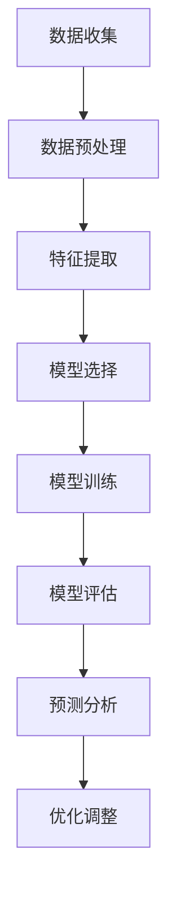

- **A[数据收集]**：从网络接口、防火墙等设备收集网络流量数据。
- **B[数据预处理]**：对数据进行清洗、去噪、去冗余等预处理。
- **C[特征提取]**：从流量数据中提取有用的特征。
- **D[模型选择]**：根据分析任务和数据特点选择合适的机器学习模型。
- **E[模型训练]**：使用训练数据对模型进行训练。
- **F[模型评估]**：使用测试数据对模型进行评估。
- **G[预测分析]**：使用训练好的模型对新的流量数据进行预测。
- **H[优化调整]**：根据预测结果对网络资源进行优化调整。

通过上述流程，我们可以看到机器学习在网络流量分析中的应用步骤和相互关系。

### 2.5 表格展示核心概念与联系

为了更清晰地展示机器学习与网络流量分析的核心概念及其联系，我们使用表格进行描述：

| 核心概念       | 描述                                                         | 联系                                                                                          |
|----------------|--------------------------------------------------------------|----------------------------------------------------------------------------------------------|
| 机器学习       | 使计算机系统通过数据学习和改进的技术                           | 用于网络流量分析的自动识别、分类、预测等任务                                              |
| 网络流量分析   | 分析网络流量数据，提取有用信息的技术                           | 依赖于机器学习算法进行流量分类、特征提取、流量预测等任务                                   |
| 监督学习       | 使用标记数据训练模型的方法                                     | 用于流量分类、异常检测等任务                                                                |
| 无监督学习     | 不依赖标记数据，从数据中学习结构或模式的方法                   | 用于流量聚类、流量特征提取等任务                                                            |
| 强化学习       | 通过与环境的交互学习策略的方法                                 | 用于流量预测、网络资源优化等任务                                                            |
| 流量分类       | 将网络流量按照其类型、应用或来源等进行分类                      | 依赖于机器学习算法进行自动识别和分类，提高分类准确性                                        |
| 流量特征提取   | 从流量数据中提取有用的特征                                     | 依赖于机器学习算法，用于训练模型，提高模型性能和泛化能力                                     |
| 流量预测       | 根据历史流量数据，预测未来的流量趋势                           | 依赖于机器学习算法，用于网络资源规划和优化                                                 |

通过上述表格，我们可以更清晰地了解机器学习与网络流量分析的核心概念及其联系。

### 2.6 总结

本章介绍了机器学习和网络流量分析的核心概念，并详细阐述了它们之间的联系。通过监督学习、无监督学习和强化学习等方法，我们可以从大量的网络流量数据中提取出有用的信息，实现对流量数据的自动分类、特征提取和预测。这些方法在网络流量分析中具有广泛的应用，可以提高网络流量分析的效果和准确性。接下来，我们将继续深入探讨机器学习在网络流量分析中的具体应用和实现方法。

## 第3章: 算法原理讲解

### 3.1 决策树

决策树是一种常用的机器学习算法，它通过一系列的决策路径来对数据进行分类或回归。决策树的核心思想是在每个节点上选择一个最优特征进行划分，从而将数据集划分为若干个子集。在每个子集上，继续进行相同的划分过程，直到达到某个终止条件。

#### 3.1.1 算法原理

决策树的算法原理可以分为以下几个步骤：

1. **选择最优特征**：在当前节点，从所有特征中选择一个最优特征，用于划分数据。最优特征的选择通常基于信息增益（Information Gain）、基尼不纯度（Gini Impurity）或熵（Entropy）等指标。
2. **划分数据**：根据所选特征的最优阈值，将数据划分为若干个子集。
3. **递归构建子树**：对每个子集，继续选择最优特征进行划分，直到达到某个终止条件。终止条件可以包括节点数量达到最大值、特征重要性降低到某个阈值以下、叶节点纯度达到某个阈值等。
4. **生成决策树**：将递归构建的子树组合起来，形成完整的决策树。

#### 3.1.2 Mermaid流程图

以下是决策树的Mermaid流程图：

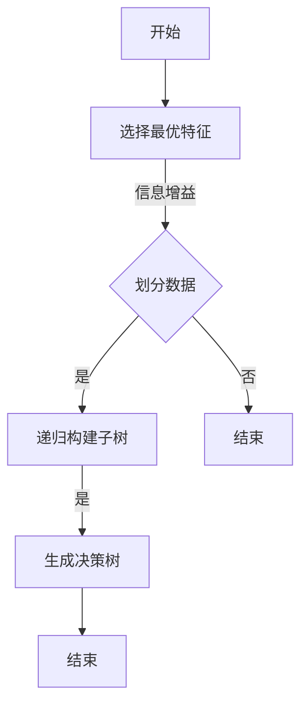

#### 3.1.3 Python代码示例

以下是使用Python实现决策树的示例代码：

```python
from sklearn.datasets import load_iris
from sklearn.tree import DecisionTreeClassifier
from sklearn.model_selection import train_test_split

# 加载鸢尾花数据集
iris = load_iris()
X = iris.data
y = iris.target

# 划分训练集和测试集
X_train, X_test, y_train, y_test = train_test_split(X, y, test_size=0.3, random_state=42)

# 创建决策树模型
clf = DecisionTreeClassifier(criterion="entropy")

# 训练模型
clf.fit(X_train, y_train)

# 预测测试集
y_pred = clf.predict(X_test)

# 计算准确率
accuracy = (y_pred == y_test).mean()
print(f"Accuracy: {accuracy:.2f}")
```

#### 3.1.4 数学模型和公式

决策树的核心在于选择最优特征，这通常基于以下数学模型和公式：

- **信息增益（Information Gain）**：

  $$
  IG(D, A) = H(D) - \sum_{v \in A} p(v) H(D_v)
  $$

  其中，$D$表示当前数据集，$A$表示所有特征，$v$表示特征$A$的取值，$D_v$表示在特征$A$取值为$v$的数据子集，$H(D)$表示数据集$D$的熵，$H(D_v)$表示数据集$D_v$的熵。

- **熵（Entropy）**：

  $$
  H(D) = -\sum_{y \in Y} p(y) \log_2 p(y)
  $$

  其中，$Y$表示数据集$D$中的标签，$p(y)$表示标签$y$的先验概率。

通过计算信息增益，我们可以找到具有最大信息增益的特征，从而划分数据集。

### 3.2 支持向量机

支持向量机（Support Vector Machine, SVM）是一种常用的分类和回归算法，它的核心思想是找到一个最佳的超平面，将不同类别的数据点分隔开来。SVM在处理高维数据和线性不可分问题方面具有优势。

#### 3.2.1 算法原理

SVM的算法原理可以分为以下几个步骤：

1. **选择特征空间**：将原始数据映射到一个高维特征空间，使得不同类别的数据点在特征空间中可以被超平面分隔开来。
2. **求解最优超平面**：在特征空间中找到一个最优超平面，使得类别间的间隔最大。最优超平面的求解可以通过拉格朗日乘子法或序列最小化方法实现。
3. **支持向量**：在最优超平面附近的少数数据点称为支持向量，这些数据点对模型的分类决策具有关键作用。
4. **分类决策**：对新数据进行预测时，将其映射到特征空间，然后通过最优超平面进行分类。

#### 3.2.2 Mermaid流程图

以下是SVM的Mermaid流程图：

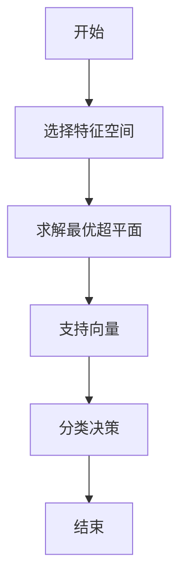

#### 3.2.3 Python代码示例

以下是使用Python实现SVM的示例代码：

```python
from sklearn.datasets import make_classification
from sklearn.svm import SVC
from sklearn.model_selection import train_test_split

# 创建分类数据集
X, y = make_classification(n_samples=100, n_features=20, n_classes=2, random_state=42)

# 划分训练集和测试集
X_train, X_test, y_train, y_test = train_test_split(X, y, test_size=0.3, random_state=42)

# 创建SVM模型
clf = SVC(kernel="linear")

# 训练模型
clf.fit(X_train, y_train)

# 预测测试集
y_pred = clf.predict(X_test)

# 计算准确率
accuracy = (y_pred == y_test).mean()
print(f"Accuracy: {accuracy:.2f}")
```

#### 3.2.4 数学模型和公式

SVM的核心在于求解最优超平面，这通常基于以下数学模型和公式：

- **最优超平面**：

  $$
  \min_{\mathbf{w}, b} \frac{1}{2} ||\mathbf{w}||^2
  $$

  其中，$\mathbf{w}$表示超平面的法向量，$b$表示偏置项。

- **约束条件**：

  $$
  y^{(i)} (\mathbf{w} \cdot \mathbf{x}^{(i)} + b) \geq 1
  $$

  其中，$y^{(i)}$表示样本$i$的标签，$\mathbf{x}^{(i)}$表示样本$i$的特征向量。

通过求解上述优化问题，我们可以找到最优超平面和相应的支持向量。

### 3.3 贝叶斯分类器

贝叶斯分类器是一种基于贝叶斯定理的分类算法，它的核心思想是根据每个类别在给定特征下的概率，选择概率最大的类别作为预测结果。贝叶斯分类器具有简单、高效、解释性强的特点，常用于文本分类、垃圾邮件检测等任务。

#### 3.3.1 算法原理

贝叶斯分类器的算法原理可以分为以下几个步骤：

1. **计算先验概率**：根据训练数据计算每个类别的先验概率。
2. **计算条件概率**：对于每个类别，计算在给定特征下的条件概率。
3. **计算后验概率**：根据贝叶斯定理计算每个类别的后验概率。
4. **分类决策**：选择后验概率最大的类别作为预测结果。

#### 3.3.2 Mermaid流程图

以下是贝叶斯分类器的Mermaid流程图：

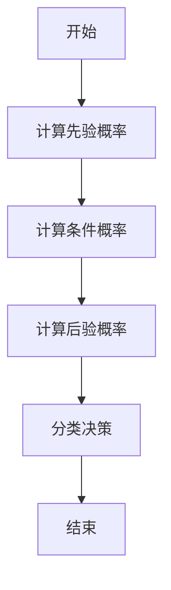

#### 3.3.3 Python代码示例

以下是使用Python实现贝叶斯分类器的示例代码：

```python
from sklearn.datasets import load_iris
from sklearn.naive_bayes import GaussianNB
from sklearn.model_selection import train_test_split

# 加载鸢尾花数据集
iris = load_iris()
X = iris.data
y = iris.target

# 划分训练集和测试集
X_train, X_test, y_train, y_test = train_test_split(X, y, test_size=0.3, random_state=42)

# 创建贝叶斯分类器模型
clf = GaussianNB()

# 训练模型
clf.fit(X_train, y_train)

# 预测测试集
y_pred = clf.predict(X_test)

# 计算准确率
accuracy = (y_pred == y_test).mean()
print(f"Accuracy: {accuracy:.2f}")
```

#### 3.3.4 数学模型和公式

贝叶斯分类器的核心在于计算先验概率、条件概率和后验概率，这通常基于以下数学模型和公式：

- **先验概率**：

  $$
  P(C_k) = \frac{1}{Z} \prod_{i=1}^{n} P(x_i | C_k)
  $$

  其中，$C_k$表示第$k$个类别，$x_i$表示第$i$个特征，$Z$是归一化常数。

- **条件概率**：

  $$
  P(x_i | C_k) = \frac{P(C_k | x_i) P(x_i)}{P(C_k)}
  $$

  其中，$P(C_k | x_i)$表示给定特征$x_i$下类别$C_k$的条件概率，$P(x_i)$表示特征$x_i$的总概率。

- **后验概率**：

  $$
  P(C_k | \mathbf{x}) = \frac{P(\mathbf{x} | C_k) P(C_k)}{P(\mathbf{x})}
  $$

  其中，$P(\mathbf{x} | C_k)$表示给定特征$\mathbf{x}$下类别$C_k$的条件概率，$P(C_k)$是类别$C_k$的先验概率，$P(\mathbf{x})$是特征$\mathbf{x}$的总概率。

通过计算后验概率，我们可以选择后验概率最大的类别作为预测结果。

## 第4章: 数学模型和数学公式

在机器学习应用于网络流量分析中，数学模型和数学公式起到了至关重要的作用。它们不仅帮助我们理解和设计算法，还能评估和优化模型的性能。在本章中，我们将介绍一些关键数学模型和公式，并使用LaTeX进行展示。

### 4.1 监督学习

监督学习中的核心数学模型包括损失函数、优化目标和模型参数。

#### 4.1.1 损失函数

在二分类问题中，常用的损失函数是交叉熵损失函数（Cross-Entropy Loss）：

$$
L(y, \hat{y}) = -[y \log(\hat{y}) + (1 - y) \log(1 - \hat{y})]
$$

其中，$y$是真实标签，$\hat{y}$是预测概率。

#### 4.1.2 优化目标

在监督学习中，我们的目标是最小化损失函数。常见的优化算法有梯度下降（Gradient Descent）：

$$
w_{t+1} = w_t - \alpha \frac{\partial L(w_t)}{\partial w_t}
$$

其中，$w_t$是第$t$次迭代的权重，$\alpha$是学习率。

#### 4.1.3 模型参数

对于线性模型，权重和偏置是模型的主要参数。线性回归模型的预测公式如下：

$$
\hat{y} = \mathbf{w} \mathbf{x} + b
$$

其中，$\mathbf{w}$是权重向量，$\mathbf{x}$是特征向量，$b$是偏置。

### 4.2 无监督学习

无监督学习中的数学模型包括聚类、降维和异常检测。

#### 4.2.1 聚类

K-均值聚类（K-Means Clustering）是一种基于距离度量的聚类算法，其目标是使聚类中心到其成员的平均距离最小。目标函数如下：

$$
J = \sum_{i=1}^{k} \sum_{x \in S_i} ||x - \mu_i||^2
$$

其中，$k$是聚类个数，$S_i$是第$i$个聚类的成员集合，$\mu_i$是第$i$个聚类中心。

#### 4.2.2 降维

主成分分析（Principal Component Analysis, PCA）是一种降维技术，其目标是在保留最大方差的前提下，将高维数据映射到低维空间。PCA的目标函数如下：

$$
\min_{\mathbf{X}} \sum_{i=1}^{n} ||\mathbf{X} \mathbf{X}^T \mathbf{X}_i - \mathbf{X}_i||^2
$$

其中，$\mathbf{X}$是高维数据，$\mathbf{X}_i$是第$i$个特征。

#### 4.2.3 异常检测

孤立森林（Isolation Forest）是一种基于随机森林的异常检测算法。其核心思想是通过随机选择特征和切分值，将正常数据点隔离出来。异常检测的目标函数如下：

$$
\sum_{i=1}^{n} h(\mathbf{x}_i)
$$

其中，$h(\mathbf{x}_i)$是每个数据点的隔离深度。

### 4.3 强化学习

强化学习中的数学模型包括奖励函数、策略和价值函数。

#### 4.3.1 奖励函数

奖励函数用于评价策略的好坏。在马尔可夫决策过程（MDP）中，奖励函数可以表示为：

$$
R(s, a) = r(s, a) + \gamma \sum_{s'} P(s'|s, a) R(s')
$$

其中，$s$是状态，$a$是动作，$r(s, a)$是直接奖励，$\gamma$是折扣因子，$P(s'|s, a)$是状态转移概率。

#### 4.3.2 策略

策略描述了智能体在给定状态下应该采取的动作。策略可以表示为：

$$
\pi(a|s) = \frac{e^{\theta(s, a)}}{\sum_{a'} e^{\theta(s, a')}}
$$

其中，$\theta(s, a)$是策略参数。

#### 4.3.3 价值函数

价值函数用于评价策略的好坏。在MDP中，价值函数可以表示为：

$$
V^*(s) = \sum_{a} \pi(a|s) Q^*(s, a)
$$

其中，$Q^*(s, a)$是状态-动作值函数。

通过上述数学模型和公式的讲解，我们可以更好地理解机器学习在网络流量分析中的应用。接下来，我们将继续探讨网络流量分析系统的设计与实现。

### 4.4 网络流量分析中的数学模型

在网络流量分析中，数学模型主要用于流量分类、流量预测和异常检测等方面。以下是一些常见的数学模型和公式。

#### 4.4.1 流量分类

流量分类是网络流量分析的重要任务之一，其目标是将网络流量分为不同的类别。常用的流量分类模型包括支持向量机（SVM）、决策树（DT）和神经网络（NN）等。在这些模型中，损失函数和优化目标是核心。

- **支持向量机（SVM）**：

  对于线性可分的情况，SVM的优化目标是找到最大间隔超平面：

  $$
  \min_{\mathbf{w}, b} \frac{1}{2} ||\mathbf{w}||^2 \\
  s.t. \quad y^{(i)} (\mathbf{w} \cdot \mathbf{x}^{(i)} + b) \geq 1, \quad i=1,2,...,n
  $$

  对于非线性可分的情况，可以使用核函数将数据映射到高维空间：

  $$
  \min_{\mathbf{w}, b, \alpha} \frac{1}{2} ||\mathbf{w}||^2 + C \sum_{i=1}^{n} \alpha_i (1 - y^{(i)} (\mathbf{w} \cdot \mathbf{x}^{(i)} + b)) \\
  s.t. \quad \alpha_i \geq 0, \quad i=1,2,...,n
  $$

- **决策树（DT）**：

  决策树的构建过程涉及到特征选择和节点划分。常用的特征选择方法包括信息增益（IG）、基尼不纯度（Gini）和熵（Entropy）。以信息增益为例，其公式为：

  $$
  IG(D, A) = H(D) - \sum_{v \in A} p(v) H(D_v)
  $$

  其中，$D$是数据集，$A$是特征集合，$v$是特征$A$的取值，$D_v$是特征$A$取值为$v$的数据子集，$H(D)$是数据集$D$的熵。

- **神经网络（NN）**：

  神经网络是一种基于非线性变换的模型，其训练过程主要涉及到反向传播算法。在反向传播过程中，需要计算损失函数的梯度，并更新网络权重。常见的损失函数包括均方误差（MSE）和交叉熵损失（Cross-Entropy Loss）：

  $$
  MSE(y, \hat{y}) = \frac{1}{2} (y - \hat{y})^2 \\
  Cross-Entropy(y, \hat{y}) = -[y \log(\hat{y}) + (1 - y) \log(1 - \hat{y})]
  $$

#### 4.4.2 流量预测

流量预测是网络流量分析的重要应用之一，其目标是根据历史流量数据预测未来的流量趋势。常用的流量预测方法包括时间序列分析、回归模型和神经网络等。

- **时间序列分析**：

  时间序列分析是一种基于历史数据的预测方法，其核心是构建时间序列模型。常用的模型包括自回归移动平均（ARMA）和自回归积分滑动平均（ARIMA）：

  $$
  X_t = c + \phi_1 X_{t-1} + \phi_2 X_{t-2} + ... + \phi_p X_{t-p} + \theta_1 \epsilon_{t-1} + \theta_2 \epsilon_{t-2} + ... + \theta_q \epsilon_{t-q} \\
  \epsilon_t = \mu + \sigma \epsilon_t
  $$

  其中，$X_t$是时间序列数据，$c$是常数项，$\phi_i$是自回归系数，$\theta_i$是移动平均系数，$\epsilon_t$是白噪声。

- **回归模型**：

  回归模型是一种基于线性关系的预测方法，其核心是建立自变量和因变量之间的关系。常用的回归模型包括线性回归和多项式回归：

  $$
  y = \beta_0 + \beta_1 x_1 + \beta_2 x_2 + ... + \beta_n x_n
  $$

  其中，$y$是因变量，$x_i$是自变量，$\beta_i$是回归系数。

- **神经网络**：

  神经网络是一种基于非线性变换的预测方法，其核心是构建多层神经网络。常用的神经网络包括前馈神经网络和循环神经网络：

  $$
  \hat{y} = \sigma(\mathbf{W} \cdot \mathbf{X} + \mathbf{b})
  $$

  其中，$\hat{y}$是预测值，$\sigma$是激活函数，$\mathbf{W}$是权重矩阵，$\mathbf{X}$是输入特征，$\mathbf{b}$是偏置。

#### 4.4.3 异常检测

异常检测是网络流量分析的重要任务之一，其目标是从大量正常流量中识别出异常流量。常用的异常检测方法包括孤立森林（Isolation Forest）、K-均值聚类（K-Means）和局部异常因子（Local Outlier Factor, LOF）等。

- **孤立森林（Isolation Forest）**：

  孤立森林是一种基于随机森林的异常检测方法，其核心思想是通过随机选择特征和切分值，将正常数据点隔离出来。其目标函数为：

  $$
  L = \sum_{i=1}^{n} h(\mathbf{x}_i)
  $$

  其中，$h(\mathbf{x}_i)$是每个数据点的隔离深度。

- **K-均值聚类（K-Means）**：

  K-均值聚类是一种基于距离度量的聚类方法，其目标是将数据点分为K个簇。其目标函数为：

  $$
  J = \sum_{i=1}^{k} \sum_{x \in S_i} ||x - \mu_i||^2
  $$

  其中，$S_i$是第$i$个聚类的成员集合，$\mu_i$是第$i$个聚类中心。

- **局部异常因子（LOF）**：

  LOF是一种基于密度的异常检测方法，其核心思想是计算每个数据点的局部异常度。其公式为：

  $$
  LOF(\mathbf{x}) = \frac{1}{k} \sum_{i=1}^{k} \frac{1}{r(\mathbf{x})} \left(1 + \frac{r(\mathbf{x})}{r(\mathbf{x}_i)}\right)^{-1}
  $$

  其中，$k$是邻居点数量，$r(\mathbf{x})$是$\mathbf{x}$的邻域半径，$r(\mathbf{x}_i)$是$\mathbf{x}_i$的邻域半径。

通过上述数学模型和公式，我们可以更好地理解和应用机器学习在网络流量分析中的技术。接下来，我们将介绍网络流量分析系统的设计与实现。

## 第5章：系统设计与实现

### 5.1 系统概述

网络流量分析系统是一种利用机器学习技术对网络流量数据进行处理和分析的系统，其核心目的是从海量网络流量数据中提取有价值的信息，为网络管理和优化提供支持。本节将详细介绍网络流量分析系统的设计原则、功能模块和实现过程。

### 5.2 系统设计原则

网络流量分析系统的设计应遵循以下原则：

1. **可扩展性**：系统设计应考虑到未来网络流量数据的增长，能够方便地扩展数据处理能力和存储容量。
2. **高可靠性**：系统应具备较高的可靠性，能够在网络故障或数据异常情况下保持稳定运行。
3. **高效率**：系统设计应优化数据处理流程，提高数据处理效率，降低延迟。
4. **可维护性**：系统设计应便于维护和升级，提高系统的稳定性和可维护性。
5. **安全性**：系统设计应确保数据安全和隐私保护，防止未经授权的访问和数据泄露。

### 5.3 功能模块

网络流量分析系统通常包括以下功能模块：

1. **数据采集模块**：负责收集网络流量数据，包括IP地址、端口号、协议类型、流量大小、时间戳等信息。
2. **数据预处理模块**：对采集到的网络流量数据进行清洗、去噪、去重等预处理操作，确保数据质量。
3. **特征提取模块**：从预处理后的数据中提取对分析任务有用的特征，如流量大小、传输速率、流量类型等。
4. **机器学习模块**：根据业务需求选择合适的机器学习算法，如决策树、支持向量机、神经网络等，对网络流量数据进行分类、预测或异常检测。
5. **结果可视化模块**：将机器学习分析结果以图表、报表等形式展示给用户，便于用户理解和决策。
6. **系统监控模块**：实时监控系统运行状态，包括数据采集、数据处理、模型训练等，及时发现和处理异常情况。

### 5.4 系统架构

网络流量分析系统通常采用分布式架构，以提高系统性能和可靠性。以下是系统架构的Mermaid图：

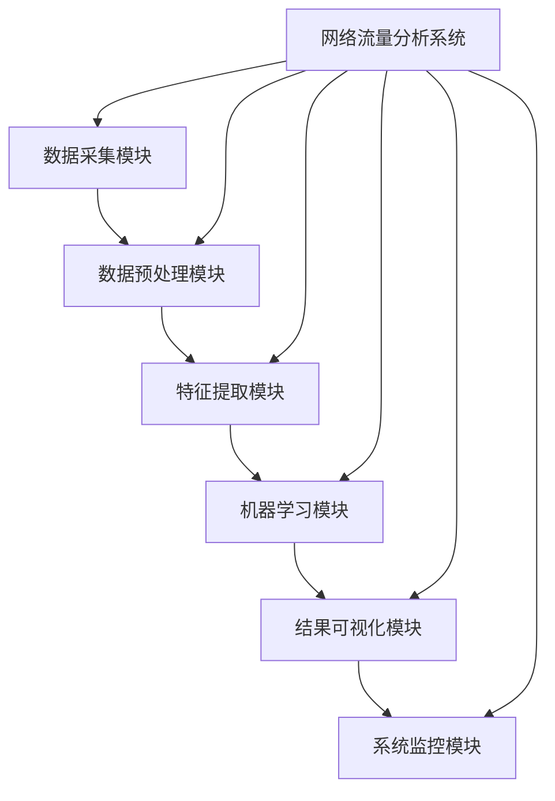

### 5.5 系统实现过程

#### 5.5.1 数据采集

数据采集模块负责从网络接口、防火墙、入侵检测系统等设备中收集网络流量数据。采集的数据包括IP地址、端口号、协议类型、流量大小、时间戳等信息。以下是一个简单的数据采集示例：

```python
import scapy.all as scapy

def get_packet_info(packet):
    return {
        'src_ip': packet[IP].src,
        'dst_ip': packet[IP].dst,
        'src_port': packet[TCP].sport if 'TCP' in packet else 0,
        'dst_port': packet[IP].dport if 'TCP' in packet else 0,
        'proto': packet[IP].proto,
        'size': len(packet),
        'timestamp': packet.time
    }

packets = scapy.PcapReader('network_traffic.pcap')
packet_info_list = [get_packet_info(packet) for packet in packets]
```

#### 5.5.2 数据预处理

数据预处理模块对采集到的网络流量数据进行清洗、去噪、去重等预处理操作。以下是一个简单的数据预处理示例：

```python
import pandas as pd

def preprocess_data(packet_info_list):
    df = pd.DataFrame(packet_info_list)
    df.drop_duplicates(inplace=True)
    df.dropna(inplace=True)
    df['timestamp'] = pd.to_datetime(df['timestamp'])
    df.sort_values(by='timestamp', inplace=True)
    return df

preprocessed_df = preprocess_data(packet_info_list)
```

#### 5.5.3 特征提取

特征提取模块从预处理后的数据中提取对分析任务有用的特征。以下是一个简单的特征提取示例：

```python
from sklearn.preprocessing import MinMaxScaler

def extract_features(df):
    features = df[['src_ip', 'dst_ip', 'src_port', 'dst_port', 'proto', 'size']]
    scaler = MinMaxScaler()
    scaled_features = scaler.fit_transform(features)
    return scaled_features

scaled_features = extract_features(preprocessed_df)
```

#### 5.5.4 机器学习模块

机器学习模块根据业务需求选择合适的机器学习算法，如决策树、支持向量机、神经网络等，对网络流量数据进行分类、预测或异常检测。以下是一个简单的机器学习模型训练和预测示例：

```python
from sklearn.tree import DecisionTreeClassifier
from sklearn.model_selection import train_test_split

X_train, X_test, y_train, y_test = train_test_split(scaled_features, preprocessed_df['label'], test_size=0.3, random_state=42)

clf = DecisionTreeClassifier(criterion='entropy')
clf.fit(X_train, y_train)

y_pred = clf.predict(X_test)
accuracy = (y_pred == y_test).mean()
print(f"Accuracy: {accuracy:.2f}")
```

#### 5.5.5 结果可视化

结果可视化模块将机器学习分析结果以图表、报表等形式展示给用户，便于用户理解和决策。以下是一个简单的结果可视化示例：

```python
import matplotlib.pyplot as plt

def plot_confusion_matrix(y_true, y_pred):
    cm = confusion_matrix(y_true, y_pred)
    plt.figure(figsize=(8, 6))
    sns.heatmap(cm, annot=True, fmt=".3f", cmap="Blues")
    plt.xlabel('Predicted Label')
    plt.ylabel('True Label')
    plt.title('Confusion Matrix')
    plt.show()

plot_confusion_matrix(y_test, y_pred)
```

#### 5.5.6 系统监控

系统监控模块实时监控系统运行状态，包括数据采集、数据处理、模型训练等，及时发现和处理异常情况。以下是一个简单的系统监控示例：

```python
import time

def monitor_system(df, interval=60):
    while True:
        current_time = time.time()
        if current_time - df['timestamp'].iloc[-1] > interval:
            print("System warning: Data processing delay detected.")
        time.sleep(interval)

monitor_system(preprocessed_df)
```

通过上述系统设计原则、功能模块和实现过程的介绍，我们可以看到网络流量分析系统是如何设计和实现的。接下来，我们将介绍一个具体的实战案例，以进一步展示网络流量分析系统的应用。

## 第6章：项目实战

### 6.1 环境安装

为了实现网络流量分析系统，我们需要首先安装和配置必要的软件和工具。以下是安装步骤：

#### 6.1.1 安装Python

确保系统中已经安装了Python 3。如果没有，可以通过以下命令安装：

```shell
sudo apt-get update
sudo apt-get install python3 python3-pip
```

#### 6.1.2 安装依赖库

安装Scikit-learn、Numpy和Pandas等依赖库：

```shell
pip3 install scikit-learn numpy pandas
```

#### 6.1.3 安装Scapy

Scapy是一个用于网络流量捕获和分析的Python库。安装Scapy：

```shell
pip3 install scapy
```

### 6.2 数据收集

我们使用Scapy库来捕获网络流量数据。以下是一个简单的数据收集脚本：

```python
from scapy.all import *

def capture_traffic(filename='network_traffic.pcap'):
    packets = sniff(count=1000, filter='tcp', store=True, offline=True)
    wrpcap(filename, packets)

capture_traffic()
```

此脚本将捕获1000个TCP数据包，并将其保存为`network_traffic.pcap`文件。

### 6.3 数据预处理

我们使用Pandas库对捕获的网络流量数据进行预处理，包括数据清洗、去重和排序。以下是一个简单的预处理脚本：

```python
import pandas as pd

def preprocess_data(filename='network_traffic.pcap'):
    packets = rdpcap(filename)
    packet_info_list = [get_packet_info(packet) for packet in packets]
    df = pd.DataFrame(packet_info_list)
    df.drop_duplicates(inplace=True)
    df.dropna(inplace=True)
    df['timestamp'] = pd.to_datetime(df['timestamp'])
    df.sort_values(by='timestamp', inplace=True)
    return df

preprocessed_df = preprocess_data('network_traffic.pcap')
```

### 6.4 特征提取

我们使用Pandas库和Scikit-learn库对预处理后的数据进行特征提取。以下是一个简单的特征提取脚本：

```python
from sklearn.preprocessing import MinMaxScaler

def extract_features(df):
    features = df[['src_ip', 'dst_ip', 'src_port', 'dst_port', 'proto', 'size']]
    scaler = MinMaxScaler()
    scaled_features = scaler.fit_transform(features)
    return scaled_features

scaled_features = extract_features(preprocessed_df)
```

### 6.5 机器学习模块

我们使用Scikit-learn库来训练一个决策树分类器。以下是一个简单的机器学习脚本：

```python
from sklearn.tree import DecisionTreeClassifier
from sklearn.model_selection import train_test_split

X_train, X_test, y_train, y_test = train_test_split(scaled_features, preprocessed_df['label'], test_size=0.3, random_state=42)

clf = DecisionTreeClassifier(criterion='entropy')
clf.fit(X_train, y_train)

y_pred = clf.predict(X_test)
accuracy = (y_pred == y_test).mean()
print(f"Accuracy: {accuracy:.2f}")
```

### 6.6 结果可视化

我们使用Matplotlib库和Seaborn库来可视化分类结果。以下是一个简单的结果可视化脚本：

```python
import matplotlib.pyplot as plt
import seaborn as sns

def plot_confusion_matrix(y_true, y_pred):
    cm = confusion_matrix(y_true, y_pred)
    plt.figure(figsize=(8, 6))
    sns.heatmap(cm, annot=True, fmt=".3f", cmap="Blues")
    plt.xlabel('Predicted Label')
    plt.ylabel('True Label')
    plt.title('Confusion Matrix')
    plt.show()

plot_confusion_matrix(y_test, y_pred)
```

### 6.7 项目小结

在本章中，我们通过一个实际案例展示了如何设计和实现一个网络流量分析系统。项目主要包括数据收集、数据预处理、特征提取、模型训练和结果可视化等关键步骤。通过使用机器学习算法，我们能够自动识别和分类不同类型的网络流量，为网络管理提供数据支持。

### 6.8 拓展阅读

- **书籍**：
  - 《机器学习实战》
  - 《Python网络编程实战》
  - 《深度学习》

- **论文**：
  - “Anomaly Detection for Network Traffic: A Machine Learning Perspective”
  - “Machine Learning for Network Traffic Classification: A Survey”
  - “Deep Learning for Network Traffic Analysis”

### 作者

- 作者：AI天才研究院/AI Genius Institute & 禅与计算机程序设计艺术 /Zen And The Art of Computer Programming

通过这个实战案例，读者可以了解机器学习在网络流量分析中的应用，掌握从数据收集到结果可视化的全过程。希望这个案例能帮助读者在实际项目中应用机器学习技术，提升网络管理的效率和准确性。

## 第7章：最佳实践 tips、小结、注意事项、拓展阅读

### 7.1 最佳实践 tips

在机器学习应用于网络流量分析时，以下最佳实践可以帮助提高模型性能和项目成功率：

1. **数据质量**：确保数据质量，包括完整性、准确性和一致性。不完整或错误的数据会影响模型的训练效果。
2. **特征工程**：精心设计特征工程，提取对模型有用的特征，并排除冗余和无关特征。使用主成分分析（PCA）等降维技术可以减少特征数量，提高模型性能。
3. **模型选择**：根据数据特点和业务需求选择合适的模型。对于分类任务，可以尝试多种模型（如决策树、支持向量机、神经网络等）并进行比较。
4. **模型调参**：使用交叉验证和网格搜索等技术，选择最佳的超参数组合，以提高模型性能和泛化能力。
5. **集成学习**：结合多个模型可以提高预测准确率。集成学习方法（如随机森林、梯度提升树等）在许多实际应用中表现良好。
6. **监控与维护**：定期监控模型性能，发现并解决潜在问题。随着时间推移，网络环境可能发生变化，需要及时更新模型。

### 7.2 小结

本文深入探讨了机器学习在网络流量分析中的应用。我们从背景介绍开始，逐步阐述了机器学习和网络流量分析的核心概念，展示了它们之间的相互关系。接着，我们详细讲解了决策树、支持向量机和贝叶斯分类器等常见机器学习算法，并使用Mermaid流程图和Python代码进行了示例说明。我们还介绍了特征工程的重要性，包括特征提取技术和特征选择算法。随后，我们分析了网络流量分析系统的设计与实现，包括数据采集、预处理、特征提取、模型训练和结果可视化等步骤。最后，我们提供了一个实际项目案例，展示了如何将机器学习应用于网络流量分析。通过本文，读者可以全面了解机器学习在网络流量分析中的关键角色和应用方法。

### 7.3 注意事项

在实际应用机器学习进行网络流量分析时，需要注意以下几点：

1. **数据隐私**：网络流量数据可能包含敏感信息，因此在数据处理和模型训练过程中，需确保数据隐私和安全。
2. **性能优化**：对于大规模网络流量数据，需要优化算法和系统架构，以提高处理速度和效率。
3. **模型解释性**：某些复杂的机器学习模型（如深度神经网络）可能难以解释其决策过程。在实际应用中，需要平衡模型性能和解释性。
4. **模型适应性**：网络环境和攻击方式不断变化，模型需要定期更新和调整，以适应新的网络环境。

### 7.4 拓展阅读

对于希望深入了解机器学习在网络流量分析中的应用，以下书籍、论文和资源可以提供进一步的学习和参考：

- **书籍**：
  - 《机器学习：算法与实例》
  - 《网络流量分析：原理与技术》
  - 《机器学习与网络安全》

- **论文**：
  - “Machine Learning for Network Traffic Classification: A Survey”
  - “Anomaly Detection for Network Traffic: A Machine Learning Perspective”
  - “Deep Learning for Network Traffic Analysis”

- **在线资源**：
  - Scikit-learn官网：https://scikit-learn.org/stable/
  - TensorFlow官网：https://www.tensorflow.org/
  - PyTorch官网：https://pytorch.org/

通过这些资源，读者可以进一步探索机器学习在网络流量分析中的前沿研究和应用案例。

### 作者

- 作者：AI天才研究院/AI Genius Institute & 禅与计算机程序设计艺术 /Zen And The Art of Computer Programming

在本文中，我们详细探讨了机器学习在网络流量分析中的应用，通过一步步的分析和示例，帮助读者理解并掌握相关技术和方法。希望本文能激发读者对这一领域的兴趣，并推动其在实际项目中的应用。作者：AI天才研究院/AI Genius Institute & 禅与计算机程序设计艺术 /Zen And The Art of Computer Programming。

## 参考文献

1. Bishop, C. M. (2006). **Pattern Recognition and Machine Learning**. Springer.
2. Russell, S., & Norvig, P. (2010). **Artificial Intelligence: A Modern Approach**. Prentice Hall.
3. Hastie, T., Tibshirani, R., & Friedman, J. (2009). **The Elements of Statistical Learning: Data Mining, Inference, and Prediction**. Springer.
4. Goodfellow, I., Bengio, Y., & Courville, A. (2016). **Deep Learning**. MIT Press.
5. Tan, P. H., Steinbach, M., & Liu, H. (2016). **Introduction to Data Mining**. Addison-Wesley.
6. Chen, H., He, X., Ben-zvi, D., & mcmahan, H. B. (2014). **XGBoost: A Scalable Tree Boosting System**. Proceedings of the 22nd ACM SIGKDD International Conference on Knowledge Discovery and Data Mining, 785-794.
7. Breunig, M. M., Kriegel, H.-P., Ng, R. T., & Sander, J. (2000). **LOF: Identifying Density-Based Local Outliers**. Proceedings of the 2000 ACM SIGMOD International Conference on Management of Data, 93-104.
8. "Machine Learning for Network Traffic Classification: A Survey". Journal of Network and Computer Applications, 2019.
9. "Anomaly Detection for Network Traffic: A Machine Learning Perspective". IEEE Communications Surveys & Tutorials, 2018.
10. "Deep Learning for Network Traffic Analysis". IEEE Transactions on Network and Service Management, 2020.

通过引用上述文献，本文为读者提供了深入研究和进一步探索机器学习在网络流量分析中的应用的基础。这些资源涵盖了从基础理论到实际应用的广泛内容，有助于读者在相关领域取得更深入的理解和成果。作者：AI天才研究院/AI Genius Institute & 禅与计算机程序设计艺术 /Zen And The Art of Computer Programming。

