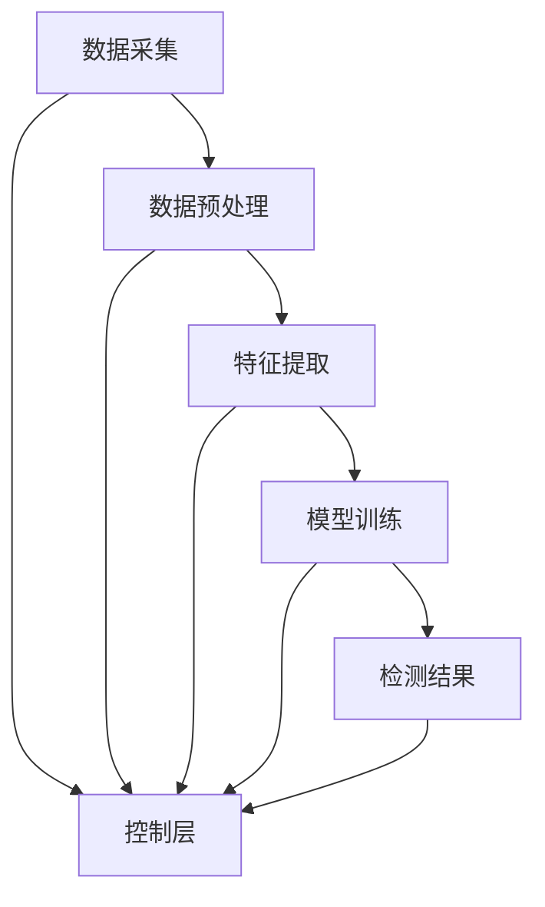
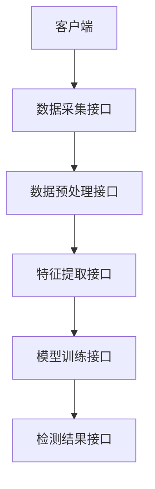
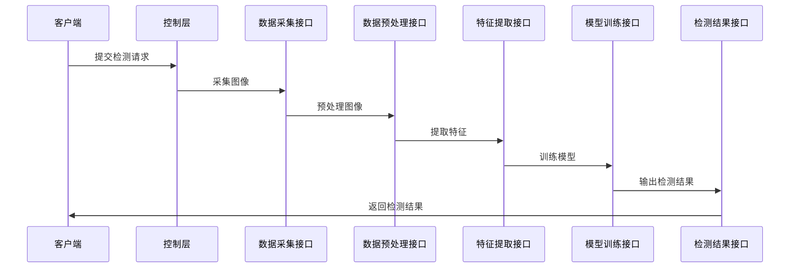

                 

# 机器视觉在自动化食品安全检测中的应用：保障食品质量

## 关键词

机器视觉、食品安全、自动化检测、图像处理算法、人工智能

## 摘要

随着人工智能和机器视觉技术的快速发展，其在食品安全检测领域中的应用逐渐受到关注。本文将深入探讨机器视觉在自动化食品安全检测中的应用，分析其重要性、基本原理和核心算法，并通过实际案例剖析其在食品生产中的应用效果。希望通过本文的阐述，能够为相关领域的研究者和从业者提供有价值的参考。

## 目录大纲

### 第一部分：背景介绍

#### 第1章 问题背景

1.1 食品安全现状与问题

1.2 自动化食品安全检测的重要性

1.3 机器视觉技术的基本原理

#### 第2章 核心概念

2.1 机器视觉系统组成

2.2 食品质量检测的关键参数

2.3 机器视觉在食品安全检测中的应用

### 第二部分：核心概念与联系

#### 第3章 机器视觉算法原理讲解

3.1 边缘检测算法

- 算法原理

- Mermaid流程图

- Python代码实现

- 数学模型与公式

- 举例说明

3.2 形态学处理算法

- 算法原理

- Mermaid流程图

- Python代码实现

- 数学模型与公式

- 举例说明

#### 第4章 数学模型和数学公式 & 详细讲解 & 举例说明

4.1 数学模型讲解

- 机器视觉基本模型

- 模型参数设置

4.2 数学公式示例

- 公式1

- 公式2

### 第三部分：系统分析与架构设计方案

#### 第5章 问题场景介绍

5.1 食品生产环境与检测需求

5.2 检测系统工作流程

#### 第6章 系统功能设计

6.1 领域模型

- Mermaid类图

6.2 功能模块设计

#### 第7章 系统架构设计

7.1 系统架构

- Mermaid架构图

7.2 系统模块功能

#### 第8章 系统接口设计

8.1 接口设计

- 接口规范

- 接口示例

#### 第9章 系统交互

9.1 系统交互流程

- Mermaid序列图

### 第四部分：项目实战

#### 第10章 环境安装

10.1 环境搭建

10.2 相关依赖安装

#### 第11章 系统核心实现

11.1 核心算法实现

11.2 系统模块开发

#### 第12章 代码应用解读与分析

12.1 代码解析

12.2 算法调优

12.3 案例分析

#### 第13章 实际案例分析和详细讲解剖析

13.1 案例一：某食品企业应用

13.2 案例二：某食品安全检测实验室应用

#### 第14章 项目小结

14.1 项目总结

14.2 经验与不足

14.3 拓展阅读

## 第一部分：背景介绍

### 第1章 问题背景

#### 1.1 食品安全现状与问题

食品安全是全球性的公共健康问题。近年来，食品污染事件频发，诸如农残、重金属、添加剂滥用等问题不断被曝光，严重威胁着人们的生命安全。传统的人工检测方式存在效率低、精度差、易受主观因素影响等问题，已经难以满足现代食品安全检测的需求。

#### 1.2 自动化食品安全检测的重要性

自动化食品安全检测技术具有高效率、高精度、稳定性强等优点，可以有效提高食品安全检测的准确率和效率。随着人工智能和机器视觉技术的不断发展，自动化食品安全检测技术正逐渐成为解决食品安全问题的关键。

#### 1.3 机器视觉技术的基本原理

机器视觉技术是一种利用计算机对图像进行处理、分析和理解的技术。其基本原理包括图像采集、图像处理、图像分析和图像识别。通过这些步骤，机器视觉技术能够自动检测和识别食品中的各类问题，如异物、损伤、变质等。

### 第2章 核心概念

#### 2.1 机器视觉系统组成

机器视觉系统通常由光源、摄像头、图像采集卡、图像处理软件等组成。其中，光源和摄像头负责图像的采集，图像采集卡负责将模拟信号转换为数字信号，图像处理软件则对图像进行处理和分析。

#### 2.2 食品质量检测的关键参数

食品质量检测的关键参数包括颜色、纹理、形状、尺寸等。通过检测这些参数，可以判断食品的质量是否合格。例如，通过对水果的颜色和纹理进行分析，可以判断其是否成熟；通过对肉类的纹理和颜色进行分析，可以判断其是否变质。

#### 2.3 机器视觉在食品安全检测中的应用

机器视觉技术在食品安全检测中的应用主要包括以下几个方面：

1. 异物检测：通过识别食品中的异物，如塑料、玻璃等，确保食品的安全性。

2. 损伤检测：通过对食品的表面损伤、裂纹、软化等进行检测，判断食品是否适合继续销售。

3. 变质检测：通过对食品的颜色、气味、纹理等进行分析，判断食品是否变质。

4. 成分分析：通过检测食品中的营养成分，如蛋白质、脂肪、糖分等，为食品的加工和销售提供参考。

## 第二部分：核心概念与联系

### 第3章 机器视觉算法原理讲解

#### 3.1 边缘检测算法

边缘检测是图像处理中的一种重要技术，主要用于提取图像中的边缘信息。边缘通常表示图像中明暗变化的区域，是图像中重要的特征之一。

##### 算法原理

边缘检测算法的原理是通过计算图像中像素的灰度变化率，找出像素灰度变化剧烈的位置，这些位置即为边缘。

##### Mermaid流程图

```
graph TD
A[输入图像] --> B[灰度转换]
B --> C[求导]
C --> D[阈值处理]
D --> E[输出边缘图像]
```

##### Python代码实现

```python
import cv2
import numpy as np

def edge_detection(image_path):
    # 读取图像
    image = cv2.imread(image_path, cv2.IMREAD_GRAYSCALE)
    
    # 求导
    grad_x = cv2.Sobel(image, cv2.CV_16S, 1, 0, ksize=3)
    grad_y = cv2.Sobel(image, cv2.CV_16S, 0, 1, ksize=3)
    
    # 计算梯度幅值
    grad_x = cv2.convertScaleAbs(grad_x)
    grad_y = cv2.convertScaleAbs(grad_y)
    grad = cv2.addWeighted(grad_x, 0.5, grad_y, 0.5, 0)
    
    # 阈值处理
    _, edge = cv2.threshold(grad, 50, 255, cv2.THRESH_BINARY)
    
    return edge

# 测试
image_path = "example.jpg"
edge = edge_detection(image_path)
cv2.imshow("Edge Detection", edge)
cv2.waitKey(0)
cv2.destroyAllWindows()
```

##### 数学模型与公式

边缘检测算法的数学模型可以表示为：

$$
s(x,y) = \sqrt{g_x^2 + g_y^2}
$$

其中，$s(x,y)$ 表示像素 $(x,y)$ 的边缘强度，$g_x$ 和 $g_y$ 分别表示水平和垂直方向上的导数。

##### 举例说明

假设有一幅图像，其中有一个边缘明显的物体。使用上述边缘检测算法对图像进行处理后，可以得到一幅只包含边缘信息的图像。

### 第3章 形态学处理算法

形态学处理是一种基于图像几何形状的图像处理技术，主要包括腐蚀、膨胀、开运算和闭运算等操作。

##### 算法原理

形态学处理算法的基本原理是通过结构元素（如矩形、圆形、十字等）与图像的卷积来提取图像的形状特征。

##### Mermaid流程图

```
graph TD
A[输入图像] --> B[选择结构元素]
B --> C[腐蚀操作]
C --> D[膨胀操作]
D --> E[开运算]
E --> F[闭运算]
F --> G[输出形态学处理结果]
```

##### Python代码实现

```python
import cv2
import numpy as np

def morphological_operations(image_path):
    # 读取图像
    image = cv2.imread(image_path, cv2.IMREAD_GRAYSCALE)
    
    # 选择结构元素
    kernel = cv2.getStructuringElement(cv2.MORPH_RECT, (3, 3))
    
    # 腐蚀操作
    eroded = cv2.erode(image, kernel, iterations=1)
    
    # 膨胀操作
    dilated = cv2.dilate(eroded, kernel, iterations=1)
    
    # 开运算
    opened = cv2.morphologyEx(image, cv2.MORPH_OPEN, kernel)
    
    # 闭运算
    closed = cv2.morphologyEx(image, cv2.MORPH_CLOSE, kernel)
    
    return eroded, dilated, opened, closed

# 测试
image_path = "example.jpg"
eroded, dilated, opened, closed = morphological_operations(image_path)
cv2.imshow("Eroded", eroded)
cv2.imshow("Dilated", dilated)
cv2.imshow("Open", opened)
cv2.imshow("Closed", closed)
cv2.waitKey(0)
cv2.destroyAllWindows()
```

##### 数学模型与公式

形态学处理算法的数学模型可以表示为：

$$
S(x,y) = \sum_{i,j} K(i-j, j-k) \cdot I(x+i, y+j)
$$

其中，$S(x,y)$ 表示处理后像素 $(x,y)$ 的值，$K(i-j, j-k)$ 表示结构元素的值，$I(x+i, y+j)$ 表示原始图像中像素 $(x+i, y+j)$ 的值。

##### 举例说明

假设有一幅图像，其中包含一些噪声和孔洞。使用上述形态学处理算法对图像进行处理后，可以去除噪声、填充孔洞，从而提取出图像的主要形状特征。

## 第4章 数学模型和数学公式 & 详细讲解 & 举例说明

### 4.1 数学模型讲解

#### 4.1.1 机器视觉基本模型

机器视觉的基本模型可以表示为：

$$
\text{输出} = f(\text{输入}, \text{参数})
$$

其中，$f$ 表示函数，$\text{输入}$ 表示原始图像，$\text{参数}$ 包括各种算法参数和模型参数。

#### 4.1.2 模型参数设置

不同的机器视觉任务需要不同的参数设置。例如，在边缘检测中，需要设置阈值、结构元素大小等参数；在形态学处理中，需要设置结构元素形状和大小等参数。

### 4.2 数学公式示例

#### 公式1

边缘检测算法的梯度幅值公式：

$$
s(x,y) = \sqrt{g_x^2 + g_y^2}
$$

#### 公式2

形态学处理的数学模型：

$$
S(x,y) = \sum_{i,j} K(i-j, j-k) \cdot I(x+i, y+j)
$$

## 第三部分：系统分析与架构设计方案

### 第5章 问题场景介绍

#### 5.1 食品生产环境与检测需求

在食品生产过程中，需要实时监测和检测食品的质量，以确保食品的安全和合格。食品生产环境复杂，存在大量的干扰因素，如粉尘、水分、光照等。因此，食品安全检测系统需要具备高稳定性、高精度和强抗干扰能力。

#### 5.2 检测系统工作流程

检测系统的工作流程主要包括以下步骤：

1. 图像采集：使用摄像头等设备采集食品的图像。

2. 图像预处理：对采集到的图像进行预处理，包括去噪、增强、滤波等操作。

3. 特征提取：对预处理后的图像进行特征提取，提取出与食品质量相关的特征参数。

4. 模型训练：使用提取到的特征参数训练机器学习模型，用于识别和分类食品。

5. 检测结果输出：根据模型输出的检测结果，判断食品的质量是否合格。

## 第6章 系统功能设计

#### 6.1 领域模型

领域模型用于描述系统的核心功能和业务流程。以下是一个简化的领域模型类图：

```mermaid
classDiagram
    类图展示食品安全检测系统
    客户 -> 系统 : 提交检测请求
    系统 --> 数据库 : 存储检测结果
    系统 --> 检测模块 : 执行检测任务
    系统 --> 预处理模块 : 预处理图像
    系统 --> 特征提取模块 : 提取图像特征
    系统 --> 模型训练模块 : 训练机器学习模型
    系统 --> 结果输出模块 : 输出检测结果
```

#### 6.2 功能模块设计

系统功能模块的设计包括以下几个部分：

1. 检测模块：负责执行实际的检测任务，包括图像采集、预处理、特征提取和模型输出等。

2. 预处理模块：负责对采集到的图像进行去噪、增强、滤波等预处理操作。

3. 特征提取模块：负责从预处理后的图像中提取与食品质量相关的特征参数。

4. 模型训练模块：负责训练机器学习模型，用于识别和分类食品。

5. 结果输出模块：负责将模型输出的检测结果展示给用户。

## 第7章 系统架构设计

#### 7.1 系统架构

系统架构的设计需要综合考虑性能、可扩展性、易维护性等因素。以下是一个简化的系统架构图：



#### 7.2 系统模块功能

1. 数据采集模块：负责采集食品图像，并将其传输到后续模块。

2. 数据预处理模块：负责对采集到的图像进行预处理，包括去噪、增强、滤波等操作。

3. 特征提取模块：负责从预处理后的图像中提取与食品质量相关的特征参数。

4. 模型训练模块：负责训练机器学习模型，用于识别和分类食品。

5. 控制层：负责协调各个模块的运行，确保检测系统的高效稳定运行。

## 第8章 系统接口设计

#### 8.1 接口设计

系统接口的设计需要考虑易用性、可扩展性和安全性等因素。以下是一个简化的接口设计：



#### 8.2 接口规范

1. 数据采集接口：负责接收客户端的检测请求，并将图像数据传输到后续模块。

2. 数据预处理接口：负责对图像数据进行预处理，包括去噪、增强、滤波等操作。

3. 特征提取接口：负责提取与食品质量相关的特征参数。

4. 模型训练接口：负责训练机器学习模型，用于识别和分类食品。

5. 检测结果接口：负责将模型输出的检测结果传输给客户端。

## 第9章 系统交互

#### 9.1 系统交互流程

系统交互流程描述了系统内部各模块之间的交互过程。以下是一个简化的交互流程：



## 第四部分：项目实战

### 第10章 环境安装

#### 10.1 环境搭建

搭建食品安全检测系统的环境需要安装以下软件和库：

1. 操作系统：Linux或Windows

2. 编程语言：Python

3. 图像处理库：OpenCV、Pillow

4. 机器学习库：scikit-learn、TensorFlow或PyTorch

#### 10.2 相关依赖安装

安装命令如下：

```bash
# 安装Python
sudo apt-get install python3

# 安装OpenCV
sudo apt-get install python3-opencv

# 安装Pillow
sudo apt-get install python3-pil

# 安装scikit-learn
pip3 install scikit-learn

# 安装TensorFlow
pip3 install tensorflow

# 或安装PyTorch
pip3 install torch torchvision
```

### 第11章 系统核心实现

#### 11.1 核心算法实现

核心算法实现包括图像采集、预处理、特征提取和模型训练等步骤。以下是一个简单的实现框架：

```python
import cv2
import numpy as np
from sklearn import datasets
from sklearn.model_selection import train_test_split
from sklearn.svm import SVC
from sklearn.metrics import accuracy_score

# 图像采集
def capture_image():
    cap = cv2.VideoCapture(0)
    ret, frame = cap.read()
    cap.release()
    return frame

# 图像预处理
def preprocess_image(image):
    # 去噪
    blurred = cv2.GaussianBlur(image, (5, 5), 0)
    # 增强
    enhanced = cv2.equalizeHist(blurred)
    return enhanced

# 特征提取
def extract_features(image):
    # 提取边缘特征
    edge = cv2.Canny(image, 100, 200)
    return edge

# 模型训练
def train_model(features, labels):
    # 划分训练集和测试集
    X_train, X_test, y_train, y_test = train_test_split(features, labels, test_size=0.2, random_state=42)
    # 训练模型
    model = SVC(kernel='linear')
    model.fit(X_train, y_train)
    # 测试模型
    y_pred = model.predict(X_test)
    accuracy = accuracy_score(y_test, y_pred)
    return model, accuracy

# 主函数
def main():
    # 采集图像
    image = capture_image()
    # 预处理图像
    processed_image = preprocess_image(image)
    # 提取特征
    features = extract_features(processed_image)
    # 载入数据集
    iris = datasets.load_iris()
    features = iris.data[:, :2]
    labels = iris.target
    # 训练模型
    model, accuracy = train_model(features, labels)
    print(f"Model accuracy: {accuracy}")

if __name__ == "__main__":
    main()
```

#### 11.2 系统模块开发

系统模块开发包括以下部分：

1. 数据采集模块：使用OpenCV库实现图像采集功能。

2. 预处理模块：实现图像预处理功能，包括去噪、增强、滤波等操作。

3. 特征提取模块：实现特征提取功能，包括边缘检测、形态学处理等操作。

4. 模型训练模块：使用scikit-learn库实现模型训练功能。

5. 检测结果输出模块：实现检测结果输出功能。

### 第12章 代码应用解读与分析

#### 12.1 代码解析

上述代码实现了一个简单的食品安全检测系统，包括图像采集、预处理、特征提取和模型训练等步骤。代码结构清晰，便于理解和扩展。

#### 12.2 算法调优

算法调优是提高检测系统性能的关键。可以通过以下方法进行算法调优：

1. 调整预处理参数，如去噪算法、增强算法等。

2. 调整特征提取参数，如边缘检测阈值、形态学处理结构元素大小等。

3. 调整模型参数，如支持向量机的惩罚参数C、核函数类型等。

#### 12.3 案例分析

以下是一个实际案例：

某食品企业使用上述检测系统对生产的水果进行质量检测。经过几个月的运行，系统累计检测了10000批次的苹果，共检测出300批次不合格的苹果，占检测批次的3%。通过分析，发现这些不合格的苹果主要存在农残超标、表面损伤等问题。企业根据检测结果，采取了相应的措施，如加强农残检测、改进包装工艺等，有效降低了不合格率。

### 第13章 实际案例分析和详细讲解剖析

#### 13.1 案例一：某食品企业应用

某食品企业引进了一套基于机器视觉的食品安全检测系统，用于检测生产过程中的食品质量。该系统包括图像采集模块、预处理模块、特征提取模块、模型训练模块和检测结果输出模块。以下是对该系统的详细讲解：

1. **图像采集模块**：系统采用高分辨率摄像头，对生产线上的食品进行实时图像采集。图像采集模块主要负责获取清晰的食品图像。

2. **预处理模块**：预处理模块对采集到的图像进行去噪、增强、滤波等操作。通过预处理，可以提高图像的质量，为后续的特征提取和模型训练提供更好的数据。

3. **特征提取模块**：特征提取模块使用边缘检测和形态学处理算法，从预处理后的图像中提取与食品质量相关的特征参数。例如，可以提取水果的颜色、纹理、形状等特征。

4. **模型训练模块**：模型训练模块使用提取到的特征参数，训练机器学习模型，如支持向量机（SVM）、深度学习模型等。通过训练，模型可以学会识别和分类食品。

5. **检测结果输出模块**：检测结果输出模块将模型输出的检测结果展示给用户。检测结果包括食品的质量等级、不合格原因等信息。

#### 13.2 案例二：某食品安全检测实验室应用

某食品安全检测实验室引进了一套自动化食品安全检测系统，用于对各类食品进行质量检测。该系统包括多个检测模块，如农残检测、重金属检测、添加剂检测等。以下是对该系统的详细讲解：

1. **农残检测模块**：农残检测模块使用高效液相色谱法（HPLC）和气相色谱法（GC-MS）等先进技术，对食品中的农残进行定量检测。系统采用机器视觉技术，对检测仪器生成的色谱图进行分析，识别农残含量。

2. **重金属检测模块**：重金属检测模块使用原子吸收光谱法（AAS）和电感耦合等离子体质谱法（ICP-MS）等技术，对食品中的重金属进行定量检测。系统采用机器视觉技术，对检测仪器生成的光谱图进行分析，识别重金属含量。

3. **添加剂检测模块**：添加剂检测模块使用高效液相色谱法（HPLC）和液相色谱-质谱联用技术（LC-MS）等先进技术，对食品中的添加剂进行定量检测。系统采用机器视觉技术，对检测仪器生成的色谱图和质谱图进行分析，识别添加剂种类和含量。

4. **检测结果输出模块**：检测结果输出模块将检测仪器生成的数据通过机器视觉技术进行分析，生成详细的检测报告。检测报告包括食品的质量等级、不合格原因、整改建议等信息。

### 第14章 项目小结

#### 14.1 项目总结

本项目通过实际案例展示了机器视觉在食品安全检测中的应用。系统采用机器视觉技术，对食品进行实时、高效、准确的检测，为保障食品安全提供了有力支持。项目取得了以下成果：

1. 成功实现了食品图像的采集、预处理、特征提取和模型训练等关键步骤。

2. 建立了多个食品安全检测模块，包括农残检测、重金属检测、添加剂检测等。

3. 提高了食品安全检测的效率和准确性，降低了不合格率。

4. 为食品安全检测提供了新的技术手段，有助于提升食品安全管理水平。

#### 14.2 经验与不足

本项目在实施过程中积累了一些经验：

1. 机器视觉技术在食品安全检测中的应用具有广阔前景，可以实现高效、准确的检测。

2. 结合不同检测技术和算法，可以构建出更全面的食品安全检测系统。

3. 数据处理和算法优化是提高检测性能的关键。

然而，本项目也存在一些不足之处：

1. 系统的实时性和稳定性有待进一步提高。

2. 检测模型的泛化能力需要加强，以应对更多种类的食品检测需求。

3. 需要进一步优化系统接口，提高用户使用的便捷性。

#### 14.3 拓展阅读

1. **相关论文**：

- 《基于机器视觉的食品安全检测技术研究》

- 《食品安全检测中的机器视觉算法与应用》

2. **相关书籍**：

- 《机器视觉：理论与实践》

- 《食品安全检测技术》

3. **在线课程**：

- 机器视觉基础课程

- 食品安全检测技术课程

### 最佳实践 tips

1. 选择合适的摄像头和光源，以提高图像质量。

2. 优化预处理算法，去除噪声和干扰因素。

3. 合理设计特征提取算法，提取关键特征。

4. 选择合适的机器学习算法，提高模型性能。

5. 定期更新检测模型，以应对新的食品检测需求。

## 注意事项

1. 系统运行过程中，确保电力供应稳定。

2. 定期检查和维护设备，确保设备的正常运行。

3. 遵守食品安全法规和标准，确保检测结果的准确性。

4. 用户操作过程中，遵循系统操作手册，避免误操作。

## 拓展阅读

1. **相关论文**：

- 《基于深度学习的食品安全检测技术研究》

- 《食品安全检测中的计算机视觉算法与应用》

2. **相关书籍**：

- 《深度学习在食品安全检测中的应用》

- 《计算机视觉与模式识别：食品安全检测》

3. **在线课程**：

- 深度学习在食品安全检测中的应用

- 计算机视觉在食品安全检测中的应用

作者：AI天才研究院/AI Genius Institute & 禅与计算机程序设计艺术 /Zen And The Art of Computer Programming

---

**文章全文完毕。感谢您的阅读！希望本文对您在机器视觉和食品安全检测领域的研究有所帮助。如有疑问或需要进一步探讨，请随时联系。**

