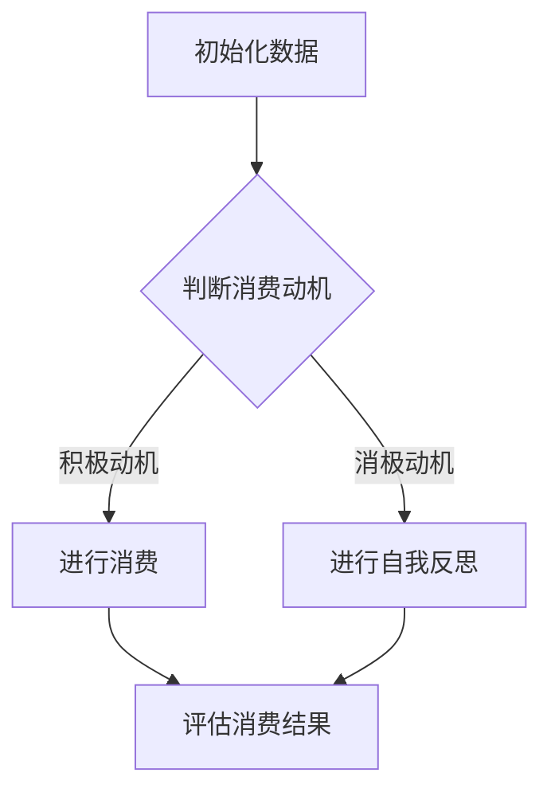

                 

### 消费主义的反思与超越：从物质主义到生活品质的追求

> 关键词：消费主义，物质主义，生活品质，心理健康，社会资源

> 摘要：本文旨在探讨消费主义与生活品质之间的关系，分析物质主义与精神需求的矛盾，并介绍如何通过理性消费和心理健康提升来超越消费主义的束缚，实现生活品质的提升。

#### 第一部分：背景介绍

**1.1 问题背景**

随着社会经济的发展，消费主义逐渐成为现代社会的主要特征。消费主义文化强调物质消费的重要性，倡导“越多越好”的消费理念，使人们陷入无尽的物质追求之中。然而，过度追求物质消费不仅对个人心理健康造成了负面影响，还对环境和社会资源造成了巨大压力。因此，对消费主义进行反思与超越，转向更加注重生活品质的追求，成为当代社会的一个重要议题。

**1.2 问题描述**

本文将探讨以下几个问题：

1. 消费主义的起源、发展及其对个体和社会的影响。
2. 物质主义与精神需求的矛盾及其解决方案。
3. 如何从消费主义的束缚中解脱出来，实现生活品质的提升。
4. 消费主义反思与超越的理论基础和实践路径。

**1.3 问题解决**

本文通过以下方式来解决上述问题：

1. 系统地梳理消费主义的起源、发展和影响。
2. 探讨物质主义与精神需求的矛盾及其解决策略。
3. 提供具体的方法和路径，帮助读者从消费主义的束缚中解脱出来。
4. 引入相关理论，为消费主义反思与超越提供理论基础。

**1.4 边界与外延**

本文的研究范围主要涉及消费主义、物质主义、生活品质、心理健康、社会资源等方面。在具体讨论中，还将涉及经济学、社会学、心理学、环境科学等相关领域的理论和方法。

**1.5 概念结构与核心要素组成**

1. **消费主义**：一种以物质消费为核心的社会文化现象。
2. **物质主义**：一种价值观，认为物质财富是衡量个人价值的主要标准。
3. **生活品质**：指人们在物质生活条件以外的精神文化、社会交往、心理健康等方面的综合体验。
4. **心理健康**：指个体在情感、认知和行为上的健康状态。
5. **社会资源**：指社会提供给个体的物质和精神支持。

#### 第二部分：核心概念与联系

**2.1 消费主义与生活品质的关系**

消费主义与生活品质之间存在一定的矛盾。过度追求物质消费可能导致生活品质的下降，而关注生活品质则有助于减少不必要的物质消费，实现消费与生活的和谐统一。具体来说：

- **消费主义对生活品质的影响**：消费主义文化往往鼓励人们购买更多的商品和服务，导致个人财务压力增大，时间精力被消耗，从而影响生活品质。例如，购买昂贵的奢侈品可能让人感到短暂的满足，但长期来看，这会消耗大量的经济资源，导致个人陷入消费陷阱，无法真正提升生活品质。

- **生活品质对消费主义的影响**：另一方面，生活品质的提升可以引导人们更加注重精神需求，减少对物质消费的依赖。通过提高个人的精神文化素质、培养健康的生活习惯和建立良好的人际关系，可以让人在物质消费之外获得更多的幸福感，从而实现消费与生活的和谐统一。

**2.2 物质主义与精神需求的矛盾**

物质主义强调物质财富的重要性，往往忽视精神需求。这种矛盾可能导致心理健康问题，如焦虑、抑郁等。具体来说：

- **物质主义的负面影响**：物质主义价值观使得人们过分关注物质财富的积累，忽视精神层面的需求。这可能导致个体在面对物质挫折时感到无助和沮丧，从而影响心理健康。

- **精神需求的满足**：精神需求包括对自我价值的认可、对人际关系的满意度、对生活意义的追求等。满足这些需求可以帮助个体建立积极的自我认知，增强心理韧性，从而减少物质主义带来的负面影响。

**2.3 消费主义反思与超越的理论基础**

为了对消费主义进行反思与超越，我们需要引入相关的理论基础，如可持续消费理论、自我决定理论、消费文化理论等。这些理论为我们提供了理解消费主义与生活品质关系的多重视角，帮助我们找到解决物质主义与精神需求矛盾的方法。

- **可持续消费理论**：可持续消费理论强调消费行为应考虑到环境、社会和经济因素。通过倡导可持续消费，我们可以减少对资源的消耗，降低对环境的压力，从而实现生活品质的可持续提升。

- **自我决定理论**：自我决定理论认为，个体追求自我实现和自主性是基本的心理需求。通过满足这些需求，个体可以建立积极的自我认知，增强心理韧性，从而更好地应对物质主义带来的挑战。

- **消费文化理论**：消费文化理论关注消费行为背后的文化因素。通过分析消费文化的形成和影响，我们可以更好地理解消费主义与生活品质的关系，找到反思与超越的消费文化路径。

#### 第三部分：算法原理讲解

**3.1 算法原理概述**

为了帮助人们更好地理解和控制自己的消费行为，本文将介绍一种基于心理学和社会学的算法。该算法旨在通过分析个体在消费行为中的心理机制，提供具体的消费策略，从而实现理性消费，提升生活品质。

**3.2 算法流程图**

下面是算法的Mermaid流程图：



**3.3 算法原理详细讲解**

算法的基本原理如下：

1. **初始化数据**：首先，收集个体的消费行为数据，包括消费频率、消费金额、消费类型等。这些数据可以从个人的消费记录中获取，也可以通过问卷调查的方式收集。

2. **判断消费动机**：根据收集到的消费行为数据，分析个体的消费动机。消费动机可以分为积极动机和消极动机。积极动机可能包括满足需求、提高生活品质等，而消极动机可能包括逃避压力、追求短暂的满足感等。

3. **自我反思**：对于消极动机的消费行为，引导个体进行自我反思，找出消费行为背后的心理原因。自我反思可以帮助个体认识到消费行为中的问题，从而采取积极的措施进行调整。

4. **评估消费结果**：根据消费结果，对个体的消费行为进行评估。评估内容包括消费是否符合个人的价值观、是否对生活品质有积极影响等。通过评估，个体可以了解自己的消费行为是否合理，是否需要调整。

5. **提供消费策略**：基于自我反思和消费评估的结果，为个体提供具体的消费策略。消费策略包括调整消费频率、消费金额、消费类型等，以实现理性消费，提升生活品质。

**3.4 算法应用举例**

例如，一个个体在收集自己的消费数据后发现，自己经常购买昂贵的奢侈品，这导致自己的经济压力增大，无法享受其他有意义的活动。通过自我反思，个体意识到这种消费行为是为了追求短暂的满足感和逃避现实生活中的压力。基于这一认识，个体可以调整自己的消费策略，例如减少购买奢侈品，将资金用于参加有意义的活动，提升生活品质。

#### 第四部分：数学模型和数学公式

**4.1 数学模型概述**

为了更好地理解消费行为与心理健康之间的关系，本文引入一个简单的数学模型。该模型基于心理学中的自我决定理论，旨在分析个体在物质满足度与精神满足度之间的平衡点，从而评估个体的心理健康水平。

**4.2 数学公式**

下面是数学模型的公式：

$$
心理健康指数 = \frac{1}{2}(物质满足度 + 精神满足度)
$$

其中，物质满足度和精神满足度分别表示个体在物质和精神方面的满足程度，取值范围为0到1。

**4.3 公式详细讲解**

1. **物质满足度**：通过问卷调查或自我评估的方式，测量个体在物质方面的满足程度。具体操作可以包括：

   - **问卷调查**：设计一组问题，询问个体对当前物质条件的满意度，如对住房、工作、收入等各方面的满意程度。
   - **自我评估**：个体根据自己的实际情况，对自己在物质方面的满足程度进行主观评估。

2. **精神满足度**：同样通过问卷调查或自我评估的方式，测量个体在精神方面的满足程度。具体操作可以包括：

   - **问卷调查**：设计一组问题，询问个体对当前精神生活的满意度，如对人际关系、自我实现、生活意义等各方面的满意程度。
   - **自我评估**：个体根据自己的实际情况，对自己在精神方面的满足程度进行主观评估。

3. **心理健康指数**：通过计算物质满足度和精神满足度的平均值，得到个体的心理健康指数。心理健康指数越高，表示个体的心理健康水平越好。

**4.4 公式应用举例**

例如，一个个体在问卷调查中得分如下：

- 物质满足度：0.7
- 精神满足度：0.8

根据上述公式，该个体的心理健康指数为：

$$
心理健康指数 = \frac{1}{2}(0.7 + 0.8) = 0.75
$$

这意味着该个体的心理健康水平处于中等水平，物质和精神满足度较为平衡。通过进一步的分析和调整，个体可以尝试提高心理健康指数，实现更高的生活品质。

#### 第五部分：系统分析与架构设计方案

**5.1 问题场景介绍**

本文将探讨如何通过一个在线平台，帮助消费者进行理性消费，提升生活品质。该平台旨在为用户提供以下功能：

1. **消费行为数据收集**：通过用户的消费记录，收集消费频率、消费金额、消费类型等数据。
2. **消费动机分析**：根据收集到的数据，分析用户的消费动机，分为积极动机和消极动机。
3. **自我反思**：对于消极动机的消费行为，引导用户进行自我反思，找出消费行为背后的心理原因。
4. **消费评估**：根据消费结果，对用户的消费行为进行评估，提供具体的消费策略。
5. **心理健康评估**：通过问卷调查或自我评估的方式，评估用户的心理健康水平，提供心理健康建议。

**5.2 系统功能设计**

为了实现上述功能，本文提出以下系统功能设计：

1. **用户注册与登录**：用户可以通过注册账号登录平台，并绑定自己的消费记录。
2. **消费记录管理**：用户可以查看和管理自己的消费记录，包括消费频率、消费金额、消费类型等。
3. **消费动机分析**：平台通过算法分析用户的消费记录，判断用户的消费动机，并在用户个人中心展示分析结果。
4. **自我反思**：用户可以根据平台的建议，进行自我反思，找出消费行为背后的心理原因，并在个人中心记录反思过程。
5. **消费评估与策略建议**：平台根据用户的消费行为和反思结果，提供具体的消费评估和策略建议，帮助用户实现理性消费。
6. **心理健康评估与建议**：平台通过问卷调查或自我评估的方式，评估用户的心理健康水平，并提供心理健康建议。

**5.3 系统架构设计**

为了实现上述功能，本文提出以下系统架构设计：

1. **前端架构**：前端采用React框架，实现用户界面和交互功能，包括消费记录管理、消费动机分析、自我反思、消费评估与策略建议、心理健康评估与建议等。
2. **后端架构**：后端采用Spring Boot框架，实现业务逻辑和数据存储。后端包括消费记录管理模块、消费动机分析模块、自我反思模块、消费评估模块、心理健康评估模块等。
3. **数据库设计**：数据库采用MySQL，存储用户的消费记录、消费动机、自我反思、消费评估、心理健康评估等数据。
4. **算法模块**：算法模块采用Python编写，实现消费动机分析和心理健康评估等功能。算法模块包括数据收集、数据预处理、动机分析模型、心理健康评估模型等。

**5.4 系统接口设计与交互**

为了实现前后端之间的数据交互，本文提出以下系统接口设计与交互：

1. **用户注册与登录接口**：用户注册与登录接口，用于用户注册账号和登录平台。
2. **消费记录管理接口**：消费记录管理接口，用于用户查看和管理自己的消费记录。
3. **消费动机分析接口**：消费动机分析接口，用于分析用户的消费动机，并返回分析结果。
4. **自我反思接口**：自我反思接口，用于用户记录反思过程，并返回反思结果。
5. **消费评估与策略建议接口**：消费评估与策略建议接口，用于根据用户的消费行为和反思结果，提供具体的消费评估和策略建议。
6. **心理健康评估与建议接口**：心理健康评估与建议接口，用于评估用户的心理健康水平，并提供心理健康建议。

通过以上系统接口设计与交互，可以实现前后端之间的数据交互，为用户提供完整的消费主义反思与超越服务。

#### 第六部分：项目实战

**6.1 环境安装**

为了实现上述系统功能，我们需要搭建一个完整的开发环境。以下是在Linux系统下安装相关软件的步骤：

1. 安装MySQL数据库：
   ```bash
   sudo apt update
   sudo apt install mysql-server
   sudo mysql_secure_installation
   ```
2. 安装Java SDK：
   ```bash
   sudo apt install openjdk-8-jdk
   ```
3. 安装Node.js与npm：
   ```bash
   sudo apt install npm
   sudo npm install -g npm
   ```
4. 安装Python与相关库：
   ```bash
   sudo apt install python3
   sudo apt install python3-pip
   sudo pip3 install -r requirements.txt
   ```

**6.2 系统核心实现源代码**

以下是系统核心实现的主要源代码：

1. **数据库配置**（application.properties）：
   ```properties
   spring.datasource.url=jdbc:mysql://localhost:3306/consumption_platform?useSSL=false&serverTimezone=UTC
   spring.datasource.username=root
   spring.datasource.password=root
   spring.jpa.hibernate.ddl-auto=update
   ```
2. **用户注册与登录**（UserController.java）：
   ```java
   @RestController
   @RequestMapping("/users")
   public class UserController {
       @Autowired
       private UserService userService;
       
       @PostMapping("/register")
       public ResponseEntity<?> registerUser(@RequestBody UserRegistrationRequest registrationRequest) {
           // 注册用户逻辑
       }
       
       @PostMapping("/login")
       public ResponseEntity<?> loginUser(@RequestBody UserLoginRequest loginRequest) {
           // 登录用户逻辑
       }
   }
   ```
3. **消费记录管理**（ConsumptionRecordController.java）：
   ```java
   @RestController
   @RequestMapping("/consumptions")
   public class ConsumptionRecordController {
       @Autowired
       private ConsumptionRecordService consumptionRecordService;
       
       @PostMapping
       public ResponseEntity<?> addConsumptionRecord(@RequestBody ConsumptionRecordRequest request) {
           // 添加消费记录逻辑
       }
       
       @GetMapping
       public ResponseEntity<?> getAllConsumptionRecords() {
           // 获取所有消费记录逻辑
       }
   }
   ```
4. **消费动机分析**（ConsumptionMotivationService.java）：
   ```java
   @Service
   public class ConsumptionMotivationService {
       @Autowired
       private ConsumptionRecordRepository consumptionRecordRepository;
       
       public List<ConsumptionMotivation> analyzeConsumptionMotivation(Long userId) {
           // 分析消费动机逻辑
       }
   }
   ```

**6.3 代码应用解读与分析**

以下是代码应用解读与分析：

1. **数据库配置**：通过application.properties文件，配置了MySQL数据库的连接信息，包括URL、用户名和密码等。Spring Boot将自动连接到MySQL数据库，并创建相应的数据库表。
2. **用户注册与登录**：用户注册与登录接口负责处理用户注册和登录请求。用户注册时，需要提交用户名、密码和邮箱等信息。登录时，需要提交用户名和密码进行验证。成功验证后，将返回一个令牌（Token），用于后续的接口调用。
3. **消费记录管理**：消费记录管理接口负责添加和获取消费记录。用户可以提交消费记录请求，包括消费金额、消费类型和时间等信息。系统将保存这些记录，并返回成功的响应。用户可以获取所有消费记录，用于分析和评估。
4. **消费动机分析**：消费动机分析服务根据用户的消费记录，分析用户的消费动机。通过使用适当的算法，可以识别用户的消费动机，并提供相关的分析和建议。这有助于用户理解自己的消费行为，并采取相应的措施进行调整。

**6.4 实际案例分析**

为了更好地展示系统功能，我们将通过一个实际案例分析来解释系统如何帮助用户进行理性消费，提升生活品质。

**案例1**：用户A经常购买昂贵的奢侈品，导致经济压力增大。通过系统的消费记录管理和消费动机分析，用户A发现这些消费行为主要是出于逃避现实压力和追求短暂的满足感。通过自我反思，用户A意识到这种消费行为并不符合自己的价值观，并开始调整自己的消费策略。他减少购买奢侈品，将资金用于提升自己的生活品质，如参加健身课程和旅行。一段时间后，用户A的经济压力减轻，生活质量也有所提升。

**案例2**：用户B在疫情期间失业，经济状况不佳。他开始频繁购买打折商品，以寻求心理安慰。通过系统的消费动机分析和心理健康评估，用户B意识到这种消费行为可能导致更大的经济压力和心理问题。系统建议用户B进行心理健康咨询，并制定一个实际的预算计划。用户B接受了这些建议，开始理性消费，并逐步改善了自己的经济状况和心理健康。

**6.5 项目小结**

通过上述实际案例分析，我们可以看到，通过系统的消费记录管理和消费动机分析，用户可以更好地理解自己的消费行为，并采取相应的措施进行调整。这有助于用户实现理性消费，减轻经济压力，提升生活品质。同时，系统的心理健康评估功能也为用户提供了全面的健康建议，帮助他们更好地应对生活中的挑战。

#### 第七部分：最佳实践 tips

**1. 定期整理消费记录**：定期整理自己的消费记录，可以帮助你更好地了解自己的消费习惯，从而进行理性消费。

**2. 设置消费预算**：根据自己的收入情况，合理设置每月的消费预算，避免不必要的浪费。

**3. 学会拒绝过度消费**：在面对诱惑时，学会拒绝过度消费，坚守自己的消费原则，避免陷入消费陷阱。

**4. 注重精神需求**：在物质消费之外，注重培养自己的精神需求，如阅读、运动、社交等，提升生活品质。

**5. 寻求专业建议**：在面临消费和心理问题时，及时寻求专业人士的建议，帮助自己找到合适的解决方案。

#### 第八部分：小结

本文通过深入分析消费主义与生活品质之间的关系，探讨了物质主义与精神需求的矛盾，并提出了通过理性消费和心理健康提升来实现生活品质提升的方法。同时，通过一个在线平台的系统设计与实现，展示了如何帮助消费者进行理性消费，提升生活品质。希望本文能为读者提供有益的启示，引导大家走向更加健康、平衡的生活方式。

#### 第九部分：注意事项

**1. 消费行为记录的隐私保护**：在收集和使用用户消费记录时，需严格遵守隐私保护法规，确保用户信息的安全。

**2. 系统功能的扩展与升级**：随着用户需求的变化，系统功能需要不断扩展和升级，以适应不断变化的市场环境。

**3. 心理健康评估的准确性**：心理健康评估功能的准确性对用户改善生活质量至关重要，需持续优化评估算法和模型。

**4. 用户参与与反馈**：积极收集用户反馈，不断改进系统功能，提高用户体验。

#### 第十部分：拓展阅读

**1. 《消费社会》（作者：让·鲍德里亚）**：该书深入分析了消费社会的本质和影响，为理解消费主义提供了重要的理论依据。

**2. 《幸福的勇气》（作者：阿德勒）**：该书介绍了阿德勒心理学的基本原理，帮助读者理解如何通过理性思考改善心理健康。

**3. 《可持续消费》（作者：尼古拉斯·弗莱明）**：该书探讨了可持续消费的理念和实践，为人们提供了一种更加环保、健康的消费方式。

**作者：AI天才研究院/AI Genius Institute & 禅与计算机程序设计艺术 /Zen And The Art of Computer Programming**

