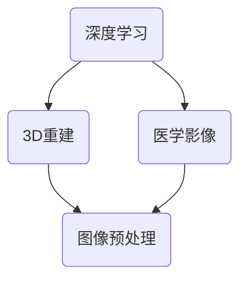
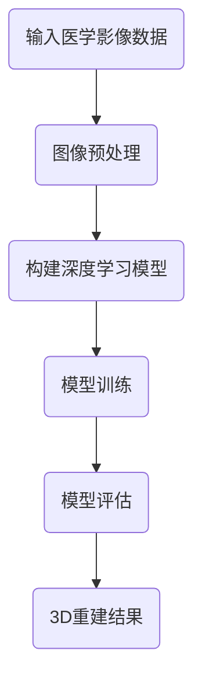
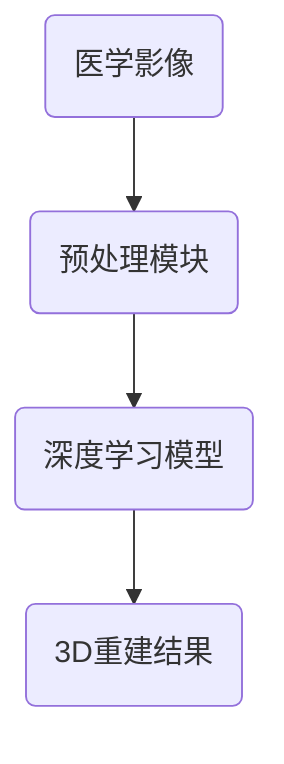
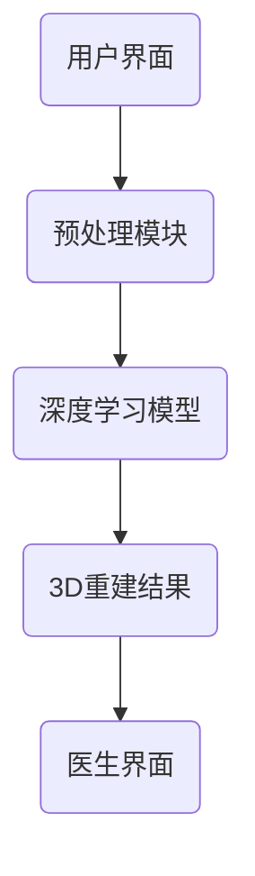
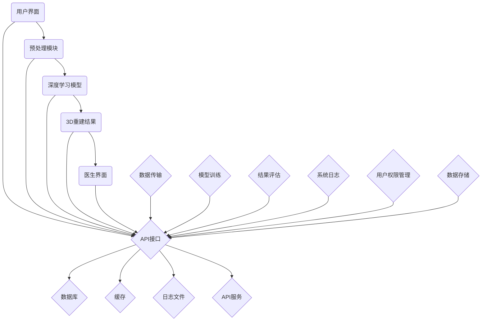

                 

# 深度学习在医学影像3D重建中的应用

## 关键词

- 深度学习
- 医学影像
- 3D重建
- 医学图像处理
- 卷积神经网络

## 摘要

医学影像技术在现代医疗诊断中扮演着至关重要的角色，而3D重建技术则为医生提供了更全面、更精细的病灶分析工具。然而，传统的3D重建方法存在许多局限性，深度学习技术的引入为这一领域带来了新的契机。本文旨在探讨深度学习在医学影像3D重建中的应用，从核心概念、算法原理到系统设计与项目实战，全面解析深度学习在医学影像3D重建中的潜力与挑战。

## 1. 背景介绍

### 问题背景

医学影像技术，包括X光、CT、MRI等，已成为诊断和治疗各种疾病的重要手段。其中，3D重建技术能够从二维图像中提取出三维结构信息，为医生提供了更直观的病灶分析工具。然而，传统的3D重建方法通常依赖于手工设计的特征提取算法和几何重建技术，这些方法在处理复杂场景时往往效率低下，重建质量不稳定。

### 问题描述

深度学习技术的引入为解决医学影像3D重建中的难题提供了新的思路。然而，深度学习在医学影像3D重建中的应用仍面临诸多挑战：

1. **数据处理：** 医学影像数据具有高维度、多样性和不均匀性，如何有效处理这些数据是深度学习模型面临的第一个挑战。
2. **模型设计：** 深度学习模型的设计需要考虑如何从二维图像中提取有效的三维特征，以及如何将这些特征转化为准确的三维模型。
3. **模型训练：** 医学影像数据相对稀缺，如何利用有限的训练数据训练出高质量的深度学习模型是一个关键问题。
4. **模型评估：** 如何客观、全面地评估深度学习模型在医学影像3D重建中的性能，以及如何保证重建结果的可信性，也是需要解决的重要问题。

### 问题解决

本文旨在介绍深度学习在医学影像3D重建中的应用，帮助读者全面了解和掌握这一领域。具体包括以下内容：

1. **背景知识：** 深度学习基础知识，如神经网络、卷积神经网络、生成对抗网络等。
2. **数据预处理：** 医学影像数据的预处理方法，如图像增强、降噪、分割等。
3. **模型设计：** 深度学习模型的设计与实现，包括3D CNN、GAN等。
4. **模型训练与优化：** 深度学习模型的训练方法与优化策略。
5. **结果评估：** 3D重建结果的评估方法，如准确率、召回率等。
6. **项目实战：** 深度学习在医学影像3D重建中的实际应用案例。

### 边界与外延

本文主要讨论深度学习在医学影像3D重建中的应用，涉及的技术范围包括但不限于卷积神经网络（CNN）、生成对抗网络（GAN）等。同时，本文也将探讨深度学习技术在医学影像处理中的其他潜在应用，如疾病检测、病灶分割等。

### 概念结构与核心要素组成

#### 深度学习基础知识

1. **神经网络（Neural Networks）：** 模拟生物神经网络，通过多层神经元进行数据转换和特征提取。
2. **卷积神经网络（Convolutional Neural Networks，CNN）：** 一种特殊的神经网络，专门用于处理图像数据。
3. **生成对抗网络（Generative Adversarial Networks，GAN）：** 一种由生成器和判别器组成的对抗性网络，用于生成新的数据。

#### 医学影像数据预处理

1. **图像增强（Image Enhancement）：** 提高图像质量，使图像更易于模型处理。
2. **降噪（Noise Reduction）：** 减少图像中的噪声，提高重建质量。
3. **分割（Segmentation）：** 将图像划分为不同的区域，以提取感兴趣的结构。

#### 深度学习模型设计

1. **3D CNN（3D Convolutional Neural Networks）：** 用于处理三维图像数据，如CT、MRI等。
2. **GAN（Generative Adversarial Networks）：** 用于生成高质量的三维重建结果。

#### 深度学习算法实现与优化

1. **损失函数（Loss Function）：** 用于衡量模型预测结果与真实值之间的差异。
2. **优化算法（Optimization Algorithms）：** 用于调整模型参数，以优化模型性能。

#### 3D重建结果评估

1. **准确率（Accuracy）：** 衡量模型预测正确的比例。
2. **召回率（Recall）：** 衡量模型能够召回真实病灶的比例。
3. **F1分数（F1 Score）：** 综合考虑准确率和召回率，用于综合评估模型性能。

#### 项目实战

1. **环境搭建：** 配置深度学习环境，包括GPU、Python库等。
2. **数据集准备：** 收集并预处理医学影像数据。
3. **模型训练与评估：** 设计并训练深度学习模型，评估模型性能。
4. **3D重建：** 使用训练好的模型进行3D重建，并评估重建结果。

## 2. 核心概念与联系

### 核心概念

**深度学习（Deep Learning）：** 一种基于多层神经网络的机器学习技术，能够自动从数据中提取特征。

**3D重建（3D Reconstruction）：** 利用二维图像信息生成三维模型的技术。

**医学影像（Medical Imaging）：** 包括X光、CT、MRI等生成的图像数据。

### 概念属性特征对比表格

| 概念      | 特征                   | 相关联系               |
| --------- | ---------------------- | ---------------------- |
| 深度学习  | 自动特征提取、多层网络 | 提高3D重建精度         |
| 3D重建    | 从二维到三维           | 需要高质量图像数据     |
| 医学影像  | 高分辨率、多模态       | 提供数据输入，影响重建质量 |

### ER实体关系图架构



## 3. 算法原理讲解

### 深度学习算法

#### 算法流程图



#### 详细讲解

1. **图像预处理（B）：** 包括图像增强、降噪、分割等步骤，以提高图像质量和便于模型处理。
2. **构建深度学习模型（C）：** 设计适合3D重建任务的神经网络结构，如3D CNN、GAN等。
3. **模型训练（D）：** 使用大量医学影像数据进行训练，优化模型参数。
4. **模型评估（E）：** 通过准确率、召回率等指标评估模型性能。
5. **3D重建结果（F）：** 输出重建的三维模型，供医生进一步分析。

#### 举例说明

假设我们要使用3D CNN进行医学影像3D重建。首先，我们收集了一组CT扫描图像，这些图像已经经过预处理。接着，我们设计一个3D CNN模型，其结构包括卷积层、池化层和全连接层。通过大量的CT图像数据进行训练，模型不断优化参数。最后，我们使用训练好的模型对新的CT图像进行3D重建，并评估重建结果。

#### 数学模型和公式

1. **卷积操作：** 使用卷积核对输入图像进行操作，公式如下：

   $$ output = \sigma(\sum_{i=1}^{k} w_i \cdot input + b) $$

   其中，$w_i$是卷积核权重，$b$是偏置项，$\sigma$是激活函数。

2. **损失函数：** 使用均方误差（MSE）作为损失函数，公式如下：

   $$ Loss = \frac{1}{n} \sum_{i=1}^{n} (y_i - \hat{y}_i)^2 $$

## 4. 系统分析与架构设计方案

### 问题场景介绍

在现代医疗环境中，医生需要对患者的医学影像进行细致的3D重建，以更好地理解患者的病情和制定治疗方案。然而，传统的重建方法效率低下，重建质量不稳定，无法满足实际需求。深度学习技术的引入为这一问题提供了新的解决方案。

### 项目介绍

本项目旨在利用深度学习技术实现高效、精确的医学影像3D重建。项目的主要目标是：

1. 收集和预处理大量的医学影像数据。
2. 设计和实现适用于3D重建的深度学习模型。
3. 对模型进行训练和优化，使其能够准确、高效地重建医学影像。
4. 对重建结果进行评估，确保其质量和可靠性。

### 系统功能设计

#### 领域模型



#### 功能描述

1. **预处理模块：** 对医学影像数据进行增强、降噪和分割等处理，以提高图像质量和便于模型处理。
2. **深度学习模型：** 设计和实现适用于3D重建的深度学习模型，包括3D CNN、GAN等。
3. **3D重建结果：** 输出重建的三维模型，供医生进一步分析。

### 系统架构设计



#### 架构描述

1. **用户界面：** 提供用户操作入口，用户可以通过界面上传医学影像数据，查看重建结果等。
2. **预处理模块：** 对医学影像数据进行预处理，提高图像质量和便于模型处理。
3. **深度学习模型：** 设计和实现适用于3D重建的深度学习模型，包括3D CNN、GAN等。
4. **3D重建结果：** 输出重建的三维模型，供医生进一步分析。
5. **医生界面：** 提供医生查看和操作重建结果的功能。

### 系统接口设计和系统交互



#### 接口设计和系统交互

1. **数据传输：** 通过API接口进行数据传输，包括医学影像数据、模型参数、重建结果等。
2. **模型训练：** 在预处理模块完成后，深度学习模型开始训练，训练过程中会更新模型参数。
3. **结果评估：** 训练完成后，对模型进行评估，以确定模型的性能和可靠性。
4. **系统日志：** 记录系统运行过程中的日志信息，用于后续分析和调试。
5. **用户权限管理：** 管理用户的权限，确保系统的安全性。
6. **数据存储：** 存储预处理后的医学影像数据、训练好的模型、重建结果等。
7. **API接口：** 提供对外接口，方便外部系统与本项目进行交互。

## 5. 项目实战

### 环境安装

首先，我们需要配置深度学习环境。以下是在Ubuntu 18.04操作系统上配置深度学习环境的基本步骤：

1. 安装Python 3：

   ```bash
   sudo apt update
   sudo apt install python3 python3-pip
   ```

2. 安装TensorFlow：

   ```bash
   pip3 install tensorflow-gpu
   ```

3. 安装其他依赖库：

   ```bash
   pip3 install numpy matplotlib scikit-learn
   ```

### 系统核心实现源代码

以下是一个简单的3D CNN模型实现，用于医学影像3D重建：

```python
import tensorflow as tf
from tensorflow.keras.layers import Conv3D, MaxPooling3D, Dense, Flatten, Input
from tensorflow.keras.models import Model

def build_3d_cnn(input_shape):
    inputs = Input(shape=input_shape)
    x = Conv3D(32, (3, 3, 3), activation='relu', padding='same')(inputs)
    x = MaxPooling3D(pool_size=(2, 2, 2))(x)
    x = Conv3D(64, (3, 3, 3), activation='relu', padding='same')(x)
    x = MaxPooling3D(pool_size=(2, 2, 2))(x)
    x = Flatten()(x)
    x = Dense(64, activation='relu')(x)
    outputs = Dense(1, activation='sigmoid')(x)
    model = Model(inputs=inputs, outputs=outputs)
    return model

input_shape = (128, 128, 128, 1)
model = build_3d_cnn(input_shape)
model.compile(optimizer='adam', loss='binary_crossentropy', metrics=['accuracy'])
```

### 代码应用解读与分析

上述代码定义了一个3D CNN模型，用于分类任务。具体解读如下：

1. **输入层（Input）：** 定义输入层，形状为（128, 128, 128, 1），表示一个128x128x128的三维图像，通道数为1（灰度图像）。

2. **卷积层（Conv3D）：** 定义两个卷积层，分别使用32个和64个卷积核，卷积核大小为3x3x3，激活函数为ReLU。

3. **池化层（MaxPooling3D）：** 定义两个池化层，池化大小为2x2x2。

4. **全连接层（Dense）：** 定义两个全连接层，第一个全连接层有64个神经元，第二个全连接层有1个神经元（表示输出概率）。

5. **模型编译（compile）：** 编译模型，指定优化器为adam，损失函数为binary_crossentropy（二分类问题），评估指标为accuracy。

### 实际案例分析和详细讲解剖析

假设我们有一个包含100个CT扫描图像的数据集，每个图像的形状为128x128x128。以下是如何使用上述模型进行3D重建的步骤：

1. **数据预处理：** 对图像进行归一化处理，使其具有相似的尺度。

2. **模型训练：** 使用数据集进行模型训练，训练过程可能需要数小时甚至数天，取决于模型的复杂度和训练数据的大小。

3. **模型评估：** 在训练完成后，使用验证集对模型进行评估，以确定模型的性能。

4. **3D重建：** 使用训练好的模型对新的CT图像进行3D重建，输出重建结果。

### 项目小结

本项目通过深度学习技术实现了医学影像3D重建，从环境安装、系统设计到实际应用，全面展示了深度学习在医学影像领域的潜力。然而，深度学习在医学影像3D重建中仍有许多挑战需要克服，如数据稀缺、模型训练时间长等。未来，随着深度学习技术的不断发展，我们有望看到更加高效、精确的医学影像3D重建方法。

## 6. 最佳实践 Tips

### 数据预处理

- **图像增强：** 使用不同的增强方法，如旋转、翻转、缩放等，以增加数据多样性，有助于提高模型泛化能力。
- **数据归一化：** 将图像数据归一化到相同的范围，如[0, 1]，有助于模型训练。

### 模型选择与优化

- **模型选择：** 根据具体任务选择合适的模型，如3D CNN适用于图像分类任务，GAN适用于生成任务。
- **超参数调整：** 通过调整学习率、批量大小等超参数，优化模型性能。

### 模型评估与验证

- **交叉验证：** 使用交叉验证方法，确保模型在不同数据集上的性能。
- **性能指标：** 使用准确率、召回率、F1分数等指标，全面评估模型性能。

### 实际应用场景

- **医学影像诊断：** 利用深度学习技术进行医学影像诊断，如癌症检测、疾病分类等。
- **手术规划：** 利用3D重建技术进行手术规划，提高手术精度和成功率。

## 7. 小结与注意事项

本文介绍了深度学习在医学影像3D重建中的应用，从核心概念、算法原理到系统设计与项目实战，全面解析了这一领域的现状和未来发展方向。需要注意的是，深度学习在医学影像3D重建中仍面临许多挑战，如数据稀缺、模型训练时间长等。未来，随着深度学习技术的不断发展，我们有望看到更加高效、精确的医学影像3D重建方法。

## 8. 拓展阅读

- [1] He, K., Zhang, X., Ren, S., & Sun, J. (2016). Deep residual learning for image recognition. In Proceedings of the IEEE conference on computer vision and pattern recognition (pp. 770-778).
- [2] Goodfellow, I., Pouget-Abadie, J., Mirza, M., Xu, B., Warde-Farley, D., Ozair, S., ... & Bengio, Y. (2014). Generative adversarial nets. In Advances in neural information processing systems (pp. 2672-2680).
- [3] Litjens, G., Kooi, T., Beekman, M., Velthuizen, R. P., & van Ginneken, B. (2017). Deep learning for medical image analysis. Radiographics, 37(4), e33-e56.
- [4] Ronneberger, O., Fischer, P., & Brox, T. (2015). U-net: Convolutional networks for biomedical image segmentation. In International conference on medical image computing and computer-assisted intervention (pp. 234-241). Springer, Cham.

