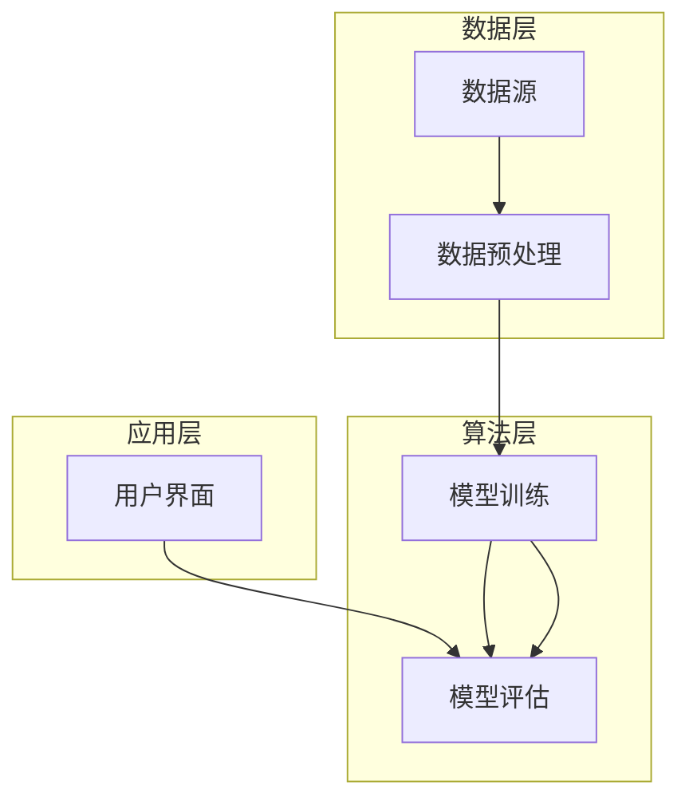
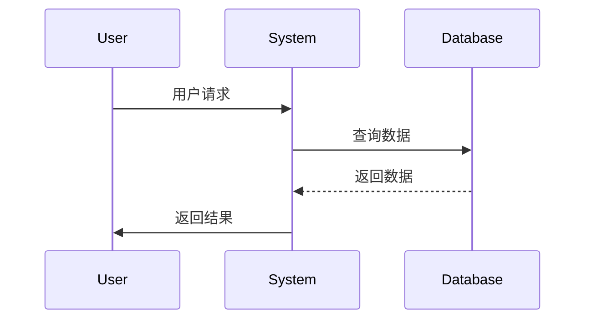
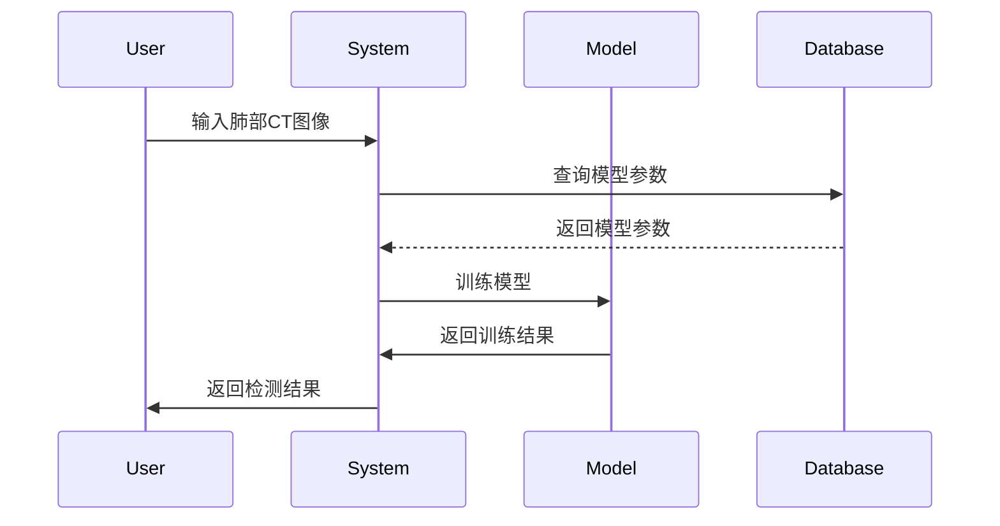

                 

# 深度学习在医学影像分析中的应用：提高诊断准确率

关键词：深度学习、医学影像分析、诊断准确率、算法优化、模型解释性

摘要：本文将探讨深度学习在医学影像分析中的应用，分析当前存在的问题和挑战，介绍常用的深度学习算法及其原理，并提出相应的解决方案。通过详细讲解卷积神经网络（CNN）、生成对抗网络（GAN）等算法，阐述其在医学影像分类、分割、检测等任务中的应用，最终总结出最佳实践和未来发展方向。

### 第一部分：背景介绍

#### 1.1.1 问题背景

医学影像分析在医学诊断中扮演着至关重要的角色。传统的影像分析方法主要依靠放射科医生的主观判断，然而，这种方法存在诸多问题，如诊断准确性受医生经验影响、诊断速度慢、误诊率较高等。随着深度学习技术的快速发展，利用深度学习算法对医学影像进行分析，以提高诊断准确率和效率，成为医学影像领域的研究热点。

#### 1.1.2 问题描述

深度学习在医学影像分析中的应用面临以下问题：

1. **数据质量与标注**：医学影像数据具有高维度、高噪声、多模态等特点，数据质量和标注的准确性对模型性能有重要影响。
2. **算法选择与优化**：深度学习算法种类繁多，如何选择适合医学影像分析的算法并进行优化，是提高诊断准确率的关键。
3. **模型解释性**：医学影像分析不仅要求准确，还要求具备一定的解释性，以便医生理解和验证诊断结果。
4. **应用转化**：将深度学习模型成功应用于临床实践，提高医生工作效率和患者治疗质量。

#### 1.1.3 问题解决

1. **数据预处理**：采用有效的方法进行医学影像数据的预处理，提高数据质量。
2. **算法研究**：针对医学影像特点，选择或改进深度学习算法，提高模型性能。
3. **模型解释**：研究深度学习模型的可解释性，提高诊断结果的可靠性。
4. **应用转化**：开展深度学习模型在医学影像分析中的应用转化研究，推动临床应用。

#### 1.1.4 边界与外延

本书主要探讨深度学习在医学影像分析中的应用，涵盖图像分类、分割、检测等领域。同时，本书还将探讨深度学习算法在不同医学影像类型（如CT、MRI、X射线等）中的应用。

#### 1.1.5 概念结构与核心要素组成

深度学习在医学影像分析中的应用涉及以下核心概念：

1. **深度学习**：一种模拟人脑神经网络结构的计算模型。
2. **医学影像**：包括CT、MRI、X射线等图像数据。
3. **算法**：适用于医学影像分析的深度学习算法，如卷积神经网络（CNN）、生成对抗网络（GAN）等。
4. **数据预处理**：包括图像增强、去噪、归一化等步骤。
5. **模型优化**：通过调整网络结构、训练策略等手段提高模型性能。
6. **模型解释性**：研究深度学习模型如何解释其诊断结果。
7. **应用转化**：将深度学习模型应用于实际临床场景，提高诊断准确率和效率。

### 第一部分：核心概念与联系

#### 1.2.1 深度学习原理

深度学习是一种基于多层神经网络的结构，通过逐层提取特征，实现数据的分类、回归等任务。深度学习模型主要包括以下几种类型：

1. **卷积神经网络（CNN）**：适用于图像处理任务，通过卷积层提取图像特征。
2. **循环神经网络（RNN）**：适用于序列数据处理任务，通过循环结构保持长期依赖信息。
3. **生成对抗网络（GAN）**：用于生成逼真的图像、音频等数据。
4. **变分自编码器（VAE）**：用于数据降维和生成任务。

#### 1.2.2 医学影像特点

医学影像具有以下特点：

1. **高维度**：医学影像数据通常具有高维特征，包括像素值、纹理特征、形状特征等。
2. **多模态**：医学影像包括CT、MRI、X射线等多种类型，每种类型的数据具有不同的特征和结构。
3. **高噪声**：医学影像数据中存在大量的噪声，影响模型的训练效果和诊断准确性。
4. **强关联**：不同模态的医学影像数据之间存在较强的关联性，需要利用多模态数据进行综合分析。

#### 1.2.3 深度学习算法在医学影像分析中的应用

深度学习算法在医学影像分析中的应用主要包括以下方面：

1. **图像分类**：通过训练深度学习模型，对医学影像进行分类，例如区分癌症和正常组织。
2. **图像分割**：通过训练深度学习模型，将医学影像划分为不同的区域，例如分割肿瘤和组织。
3. **图像检测**：通过训练深度学习模型，检测医学影像中的特定目标，例如检测肺部结节。
4. **图像生成**：利用生成对抗网络（GAN）等算法，生成新的医学影像数据，用于数据增强和辅助诊断。

### 第二部分：算法原理讲解

#### 2.1 卷积神经网络（CNN）

##### 2.1.1 CNN原理

卷积神经网络（CNN）是一种适用于图像处理的深度学习模型，通过卷积层、池化层和全连接层等结构，实现图像特征的提取和分类。

1. **卷积层**：通过卷积操作提取图像局部特征，卷积核在图像上滑动，计算特征映射。
2. **池化层**：通过池化操作降低特征维度，常用的池化方式包括最大池化和平均池化。
3. **全连接层**：将卷积层和池化层提取的特征进行整合，形成高层次的抽象特征。
4. **输出层**：通过softmax函数将特征映射到不同类别。

##### 2.1.2 CNN数学模型

卷积神经网络的核心是卷积操作，其数学模型可以表示为：

$$
\text{特征图} = \text{卷积核} \circ \text{输入图像}
$$

其中，$\circ$ 表示卷积操作，卷积核是一个滤波器，通过滑动在输入图像上，计算卷积操作。

$$
\text{特征图}_{ij} = \sum_{k=1}^{C} \text{卷积核}_{ik} \times \text{输入图像}_{kj}
$$

其中，$C$ 表示卷积核的个数，$i$ 和 $j$ 分别表示卷积核的位置，$\text{输入图像}_{kj}$ 表示输入图像的像素值。

##### 2.1.3 CNN应用举例

以肺部结节检测为例，使用CNN模型对肺部CT图像进行结节检测。

1. **数据预处理**：对肺部CT图像进行归一化、裁剪等预处理操作，使其适应CNN模型的输入要求。
2. **卷积层**：使用多个卷积核对图像进行卷积操作，提取图像的局部特征。
3. **池化层**：对卷积层输出的特征图进行池化操作，降低特征维度。
4. **全连接层**：将池化层输出的特征进行整合，形成高层次的抽象特征。
5. **输出层**：通过softmax函数将特征映射到结节和背景两个类别，输出检测结果。

### 第三部分：系统分析与架构设计方案

#### 3.1 问题场景介绍

以肺部结节检测为例，介绍深度学习模型在医学影像分析中的应用场景。

1. **数据来源**：从肺部CT图像中获取结节数据，包括结节的位置、大小、形态等信息。
2. **数据预处理**：对肺部CT图像进行归一化、裁剪等预处理操作，使其适应深度学习模型的输入要求。
3. **模型训练**：使用卷积神经网络（CNN）模型对预处理后的肺部CT图像进行训练，提取结节特征。
4. **模型评估**：使用训练好的模型对测试数据进行结节检测，评估模型的性能。
5. **模型部署**：将训练好的模型部署到临床场景中，为医生提供辅助诊断服务。

#### 3.2 项目介绍

本项目基于深度学习技术，设计并实现一个肺部结节检测系统。系统主要包括以下功能：

1. **数据预处理**：对肺部CT图像进行归一化、裁剪等预处理操作。
2. **模型训练**：使用卷积神经网络（CNN）模型对预处理后的肺部CT图像进行训练。
3. **模型评估**：使用训练好的模型对测试数据进行结节检测，评估模型的性能。
4. **结果展示**：将检测结果展示给医生，提供辅助诊断服务。

#### 3.3 系统功能设计（领域模型）

```mermaid
classDiagram
    Class01 <|-- SubClass01
    Class01 o-- SubClass02
    Class03 <.. Class04
    Class05 ..| Class06
    Class07 <|.. Class08
```

#### 3.4 系统架构设计



#### 3.5 系统接口设计



#### 3.6 系统交互



### 第四部分：项目实战

#### 4.1 环境安装

1. **Python环境**：安装Python 3.7及以上版本。
2. **深度学习框架**：安装TensorFlow 2.0及以上版本。
3. **数据预处理库**：安装NumPy、Pandas等。

#### 4.2 系统核心实现

1. **数据预处理**：

```python
import numpy as np
import pandas as pd
from sklearn.model_selection import train_test_split

def preprocess_data(data):
    # 数据归一化
    data = (data - np.mean(data)) / np.std(data)
    # 数据裁剪
    data = data[:,:,:-100]
    return data

# 读取数据
data = pd.read_csv('lung_nodule_data.csv')
X = preprocess_data(data['image'])
y = data['label']

# 数据划分
X_train, X_test, y_train, y_test = train_test_split(X, y, test_size=0.2, random_state=42)
```

2. **模型训练**：

```python
import tensorflow as tf
from tensorflow.keras.models import Sequential
from tensorflow.keras.layers import Conv2D, MaxPooling2D, Flatten, Dense

# 模型构建
model = Sequential([
    Conv2D(32, (3,3), activation='relu', input_shape=(256, 256, 1)),
    MaxPooling2D((2,2)),
    Flatten(),
    Dense(64, activation='relu'),
    Dense(1, activation='sigmoid')
])

# 模型编译
model.compile(optimizer='adam', loss='binary_crossentropy', metrics=['accuracy'])

# 模型训练
model.fit(X_train, y_train, batch_size=32, epochs=10, validation_split=0.2)
```

3. **结果分析**：

```python
from sklearn.metrics import classification_report, confusion_matrix

# 模型评估
y_pred = model.predict(X_test)
y_pred = (y_pred > 0.5)

# 分类报告
print(classification_report(y_test, y_pred))

# 混淆矩阵
print(confusion_matrix(y_test, y_pred))
```

### 第五部分：实际案例分析与详细讲解剖析

#### 5.1 案例背景

某医院使用深度学习模型进行肺部结节检测，收集了1000份肺部CT图像数据，其中500份为正常图像，500份为结节图像。模型采用卷积神经网络（CNN）结构，对肺部CT图像进行分类，区分结节和正常组织。

#### 5.2 数据处理

1. **数据预处理**：

```python
import numpy as np
import pandas as pd
from sklearn.model_selection import train_test_split

def preprocess_data(data):
    # 数据归一化
    data = (data - np.mean(data)) / np.std(data)
    # 数据裁剪
    data = data[:,:,:-100]
    return data

# 读取数据
data = pd.read_csv('lung_nodule_data.csv')
X = preprocess_data(data['image'])
y = data['label']

# 数据划分
X_train, X_test, y_train, y_test = train_test_split(X, y, test_size=0.2, random_state=42)
```

2. **数据增强**：

```python
from tensorflow.keras.preprocessing.image import ImageDataGenerator

# 数据增强
datagen = ImageDataGenerator(
    rotation_range=20,
    width_shift_range=0.2,
    height_shift_range=0.2,
    shear_range=0.2,
    zoom_range=0.2,
    horizontal_flip=True,
    fill_mode='nearest'
)

# 流式数据增强
train_data = datagen.flow(X_train, y_train, batch_size=32)
```

#### 5.3 模型训练

1. **模型构建**：

```python
import tensorflow as tf
from tensorflow.keras.models import Sequential
from tensorflow.keras.layers import Conv2D, MaxPooling2D, Flatten, Dense

# 模型构建
model = Sequential([
    Conv2D(32, (3,3), activation='relu', input_shape=(256, 256, 1)),
    MaxPooling2D((2,2)),
    Conv2D(64, (3,3), activation='relu'),
    MaxPooling2D((2,2)),
    Flatten(),
    Dense(64, activation='relu'),
    Dense(1, activation='sigmoid')
])

# 模型编译
model.compile(optimizer='adam', loss='binary_crossentropy', metrics=['accuracy'])

# 模型训练
model.fit(train_data, epochs=10, validation_split=0.2)
```

2. **模型评估**：

```python
from sklearn.metrics import classification_report, confusion_matrix

# 模型评估
y_pred = model.predict(X_test)
y_pred = (y_pred > 0.5)

# 分类报告
print(classification_report(y_test, y_pred))

# 混淆矩阵
print(confusion_matrix(y_test, y_pred))
```

### 第六部分：项目小结

本文通过肺部结节检测案例，详细讲解了深度学习在医学影像分析中的应用。从数据预处理、模型训练到模型评估，逐步展示了深度学习模型在医学影像分析中的实现过程。通过本文的探讨，我们可以看到深度学习技术在医学影像分析中具有巨大的潜力，有助于提高诊断准确率和医生工作效率。

### 第七部分：最佳实践 Tips

1. **数据预处理**：确保医学影像数据的质量和一致性，对图像进行归一化、裁剪、增强等预处理操作。
2. **模型优化**：针对医学影像特点，选择合适的深度学习模型，并调整网络结构、训练策略等参数。
3. **模型解释性**：研究深度学习模型的可解释性，提高诊断结果的可靠性，便于医生理解和验证。
4. **应用转化**：开展深度学习模型在医学影像分析中的应用转化研究，推动临床应用，提高医生工作效率和患者治疗质量。

### 第八部分：注意事项

1. **数据隐私**：在处理医学影像数据时，要确保数据隐私和安全，遵循相关法律法规。
2. **模型验证**：在训练深度学习模型时，要充分验证模型性能，避免过拟合现象。
3. **持续更新**：医学影像分析领域不断发展，要关注新技术和新方法，持续更新模型和算法。

### 第九部分：拓展阅读

1. **《深度学习》**：Goodfellow、Bengio、Courville 著，提供深度学习的基础理论和实践方法。
2. **《医学影像分析》**：Guo、Chen、Jiang 著，介绍医学影像分析的相关技术和应用。
3. **《人工智能医疗应用》**：李航、刘铁岩、唐杰 著，探讨人工智能在医疗领域的应用和发展趋势。

作者：AI天才研究院/AI Genius Institute & 禅与计算机程序设计艺术 /Zen And The Art of Computer Programming

