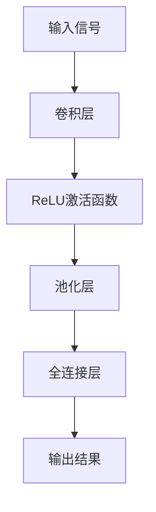
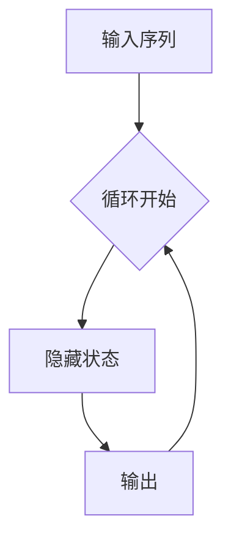
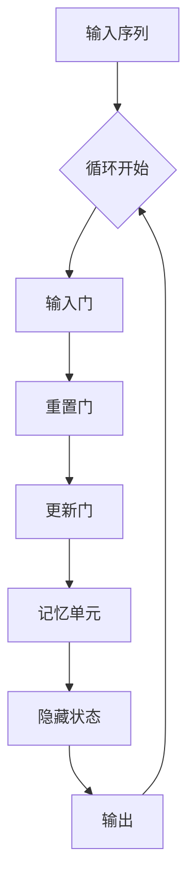
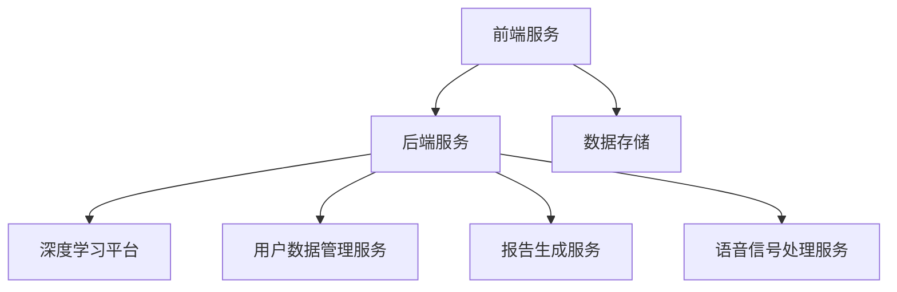
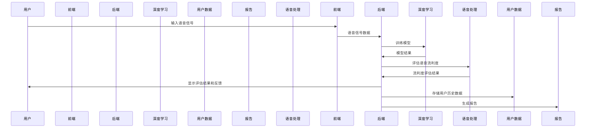

                 

### 文章标题

# 深度学习在口语流利度评估中的进展：辅助语言学习

### 文章关键词

- 深度学习
- 口语流利度评估
- 辅助语言学习
- 语音识别
- 自然语言处理
- 机器学习

### 摘要

本文旨在探讨深度学习技术在口语流利度评估领域的应用进展，以及其对辅助语言学习的推动作用。通过介绍口语流利度评估的重要性和背景，本文将详细阐述深度学习的基本概念和模型，并分析其在口语流利度评估中的应用。随后，本文将探讨深度学习在辅助语言学习中的实际应用，提供一系列项目实战案例，并总结最佳实践。最后，本文将展望深度学习在口语流利度评估和辅助语言学习领域的未来发展趋势。

## 引言与背景

### 1.1 口语流利度评估的重要性

口语流利度评估是语言学习评估的重要组成部分，它不仅能够帮助教育者了解学生的口语表达能力，还能为语言学习者和教师提供反馈，以优化教学策略和提升学习效果。在现代社会，流利口语的重要性日益凸显，特别是在国际交流、商业谈判、教育评估和职业发展中。因此，准确评估口语流利度具有重要意义。

口语流利度评估涉及多个方面，包括语音的流畅性、语调的自然性、词汇和语法的正确性等。传统的评估方法通常依赖于人工评分，这不仅耗时费力，还容易受到主观因素的影响。随着深度学习技术的不断发展，利用人工智能进行口语流利度评估成为了一种新的趋势。

### 1.2 深度学习与口语流利度评估的关系

深度学习是一种基于多层神经网络的机器学习方法，通过模拟人脑神经网络的结构和功能，实现对复杂数据的分析和处理。深度学习在图像识别、语音识别和自然语言处理等领域取得了显著的成果。因此，将深度学习应用于口语流利度评估，可以显著提升评估的准确性和效率。

深度学习在口语流利度评估中的应用主要体现在以下几个方面：

1. **语音识别**：通过深度学习模型将语音信号转换为文本，从而实现对口语内容的理解。
2. **自然语言处理**：利用深度学习模型对文本进行分析，提取出语言特征，用于评估口语流利度。
3. **情感分析**：通过深度学习模型分析口语中的情感和态度，为口语流利度评估提供更全面的参考。

### 1.3 辅助语言学习与口语流利度评估

辅助语言学习是指利用技术手段帮助学习者提高语言能力的过程。深度学习在辅助语言学习中的应用主要体现在语音训练、口语评测和语言翻译等方面。口语流利度评估作为辅助语言学习的重要组成部分，其准确性和有效性直接影响到学习效果。

通过深度学习技术，可以开发出更智能的语言学习工具，如：

1. **语音识别工具**：帮助学习者正确发音，提高口语表达水平。
2. **口语评测系统**：对学习者的口语进行实时评估，提供个性化的反馈和改进建议。
3. **语言翻译服务**：提供实时语音翻译，促进跨语言交流。

总的来说，深度学习在口语流利度评估和辅助语言学习中的应用，不仅提升了评估的准确性和效率，还为语言学习者和教师提供了强大的技术支持。接下来，我们将进一步探讨深度学习的基本概念和模型，以及它们在口语流利度评估中的应用。

## 核心概念

### 2.1 深度学习基础

深度学习是一种通过多层神经网络结构进行数据处理的机器学习方法，其核心在于通过不断优化模型参数，使其能够自动从大量数据中学习到有用的特征。深度学习的基本架构包括输入层、隐藏层和输出层。输入层接收原始数据，隐藏层对数据进行特征提取和变换，输出层生成最终的预测结果。

**神经网络**

神经网络是深度学习的基础，其基本单元是神经元。每个神经元通过加权连接与其他神经元相连，并通过对输入进行加权求和处理，产生输出。神经网络通过反向传播算法不断调整权重和偏置，以最小化预测误差。

**激活函数**

激活函数是神经网络中的关键组件，用于引入非线性因素，使神经网络能够处理复杂的非线性问题。常见的激活函数包括 sigmoid、ReLU（Rectified Linear Unit）和 tanh 等。

**损失函数**

损失函数用于衡量模型预测结果与实际结果之间的差异，深度学习通过优化损失函数来调整模型参数。常见的损失函数包括均方误差（MSE）、交叉熵损失等。

### 2.2 口语流利度评估指标

口语流利度评估涉及多个方面，常用的评估指标包括：

**语速**

语速是指说话者在单位时间内说出的单词数量。较高的语速通常意味着较好的口语流利度，但也需要考虑到语速过快可能导致发音不准确。

**停顿频率**

停顿频率是指说话者在句子中的停顿次数。过少的停顿可能表明说话者在努力保持连贯性，而过多的停顿则可能表明说话者在思考或语速过慢。

**语调**

语调是指说话者通过音高、音量和节奏变化来表达情感和意图。自然的语调可以帮助增强口语表达的吸引力和感染力。

**发音准确性**

发音准确性是指说话者在单词和句子中的发音是否准确。准确的发音是流利口语的重要基础。

### 2.3 深度学习与口语流利度评估的结合点

深度学习与口语流利度评估的结合点主要体现在以下几个方面：

**语音识别**

语音识别是将语音信号转换为文本的过程，通过深度学习模型可以实现高精度的语音识别，从而获取口语内容。

**自然语言处理**

自然语言处理技术可以提取文本中的语言特征，如词汇、语法和语义等，用于口语流利度评估。

**情感分析**

情感分析可以识别口语中的情感和态度，为口语流利度评估提供更全面的参考。

**综合评估**

通过综合使用语音识别、自然语言处理和情感分析等技术，可以构建出更为全面和准确的口语流利度评估模型。

### 表格：深度学习与口语流利度评估指标的关系

| 指标 | 描述 | 深度学习应用 |
| --- | --- | --- |
| 语速 | 单位时间内说出的单词数量 | 利用深度学习模型进行语速分析 |
| 停顿频率 | 句子中的停顿次数 | 通过语音信号处理技术分析停顿频率 |
| 语调 | 音高、音量和节奏变化 | 使用深度学习模型进行语调分析 |
| 发音准确性 | 单词和句子中的发音是否准确 | 利用语音识别技术评估发音准确性 |

通过上述表格，我们可以看到深度学习与口语流利度评估指标之间存在紧密的联系。接下来，我们将进一步探讨深度学习模型在口语流利度评估中的应用。

### ER实体关系图架构

为了更好地理解深度学习与口语流利度评估的关系，我们可以使用Mermaid流程图来绘制ER（实体关系）图。以下是口语流利度评估中的关键实体及其关系：

```mermaid
erDiagram
  TextData -->|语音信号处理| SpeechSignal
  TextData -->|自然语言处理| NaturalLanguage
  TextData -->|情感分析| EmotionAnalysis
  SpeechSignal -->|语音识别| RecognizedText
  NaturalLanguage -->|语法分析| GrammarAnalysis
  NaturalLanguage -->|语义分析| SemanticsAnalysis
  EmotionAnalysis -->|情感评分| EmotionScore
  RecognizedText -->|口语流利度评估| FluentScore
  GrammarAnalysis -->|语法评分| GrammarScore
  SemanticsAnalysis -->|语义评分| SemanticsScore
```

在上述ER图中，`TextData` 表示口语内容的数据，`SpeechSignal` 表示语音信号，`NaturalLanguage` 表示自然语言处理的结果，`EmotionAnalysis` 表示情感分析结果。通过这些实体及其关系，我们可以看到深度学习技术在口语流利度评估中的应用流程。

### 算法原理讲解

在深入探讨深度学习在口语流利度评估中的应用之前，我们需要了解一些基本的算法原理，包括语音识别、自然语言处理和情感分析等。

#### 3.1 卷积神经网络（CNN）

卷积神经网络（Convolutional Neural Network，CNN）是一种专门用于处理图像数据的深度学习模型，但其原理同样适用于处理语音信号。CNN的基本单元是卷积层，通过卷积运算提取输入数据的特征。以下是CNN的算法原理和mermaid流程图：



**算法原理：**

1. **卷积层**：卷积层通过卷积运算提取输入数据的特征。卷积运算的核心是卷积核（kernel），卷积核在输入数据上滑动，每次滑动都会产生一个特征图（feature map）。多个卷积核可以提取不同类型的特征。
   
2. **ReLU激活函数**：ReLU（Rectified Linear Unit）激活函数将负值设置为0，使神经网络的训练过程更加高效。

3. **池化层**：池化层用于减少特征图的大小，降低模型参数数量，从而减少过拟合风险。常见的池化方式包括最大池化和平均池化。

4. **全连接层**：全连接层将池化层输出的特征图映射到输出结果。通过反向传播算法，模型可以不断调整卷积层和全连接层的权重和偏置，以最小化损失函数。

**mermaid流程图说明：**

- **A[输入信号]**：表示输入的语音信号。
- **B[卷积层]**：通过卷积运算提取特征。
- **C[ReLU激活函数]**：对卷积结果进行非线性变换。
- **D[池化层]**：减少特征图的大小。
- **E[全连接层]**：将特征映射到输出结果。
- **F[输出结果]**：输出口语流利度评估结果。

#### 3.2 递归神经网络（RNN）

递归神经网络（Recurrent Neural Network，RNN）是一种专门用于处理序列数据的深度学习模型，如语音信号和文本数据。RNN通过循环结构实现记忆功能，可以处理任意长度的序列数据。以下是RNN的算法原理和mermaid流程图：



**算法原理：**

1. **输入序列**：RNN接收一个时间步的输入数据，并产生相应的输出。
2. **隐藏状态**：RNN通过隐藏状态（hidden state）保存历史信息，并将当前输入和隐藏状态进行加权求和处理，生成新的隐藏状态。
3. **输出**：RNN根据新的隐藏状态生成输出结果。

**mermaid流程图说明：**

- **A[输入序列]**：表示输入的语音序列。
- **B{循环开始}**：表示RNN的循环结构。
- **C[隐藏状态]**：保存历史信息。
- **D[输出]**：生成输出结果。

#### 3.3 长短时记忆网络（LSTM）

长短时记忆网络（Long Short-Term Memory，LSTM）是RNN的一种改进模型，专门用于解决RNN在处理长序列数据时容易出现的梯度消失和梯度爆炸问题。LSTM通过引入记忆单元（cell state）和三个门（输入门、遗忘门和输出门）来实现长时间依赖信息的保存和利用。以下是LSTM的算法原理和mermaid流程图：


**算法原理：**

1. **输入门**：输入门决定当前输入信息对记忆单元的影响程度。
2. **遗忘门**：遗忘门决定从记忆单元中遗忘哪些信息。
3. **输出门**：输出门决定记忆单元的输出值。
4. **记忆单元**：记忆单元存储长期依赖信息。
5. **隐藏状态**：隐藏状态生成输出结果。

**mermaid流程图说明：**

- **A[输入序列]**：表示输入的语音序列。
- **B{循环开始}**：表示LSTM的循环结构。
- **C[输入门]**：决定输入信息的影响程度。
- **D[遗忘门]**：决定遗忘哪些信息。
- **E[输出门]**：决定输出值。
- **F[记忆单元]**：存储长期依赖信息。
- **G[隐藏状态]**：生成输出结果。
- **H[输出]**：生成最终输出。

#### 3.4 门控循环单元（GRU）

门控循环单元（Gated Recurrent Unit，GRU）是另一种改进的RNN模型，相较于LSTM，GRU结构更为简洁，参数更少。GRU通过引入更新门和重置门来实现对记忆单元的更新。以下是GRU的算法原理和mermaid流程图：



**算法原理：**

1. **输入门**：输入门决定当前输入信息对记忆单元的影响程度。
2. **重置门**：重置门决定当前输入信息对隐藏状态的影响程度。
3. **更新门**：更新门决定如何更新记忆单元。
4. **记忆单元**：记忆单元存储长期依赖信息。
5. **隐藏状态**：隐藏状态生成输出结果。

**mermaid流程图说明：**

- **A[输入序列]**：表示输入的语音序列。
- **B{循环开始}**：表示GRU的循环结构。
- **C[输入门]**：决定输入信息的影响程度。
- **D[重置门]**：决定输入信息对隐藏状态的影响程度。
- **E[更新门]**：决定如何更新记忆单元。
- **F[记忆单元]**：存储长期依赖信息。
- **G[隐藏状态]**：生成输出结果。
- **H[输出]**：生成最终输出。

通过上述算法原理的讲解和mermaid流程图的展示，我们可以更深入地理解深度学习模型在口语流利度评估中的应用。接下来，我们将探讨如何在实际项目中使用这些模型进行口语流利度评估。

### 系统分析与架构设计

#### 4.1 问题场景介绍

口语流利度评估系统旨在为语言学习者和教师提供实时、准确的口语评估服务。该系统需要处理大量的语音数据，并利用深度学习模型对语音信号进行分析，提取出与口语流利度相关的特征。具体问题场景包括：

- 对学习者进行口语流利度评估，并提供实时反馈和建议。
- 对教师的口语教学进行评估，优化教学策略。
- 在教育机构中推广，为不同年龄段和语言水平的用户提供服务。

#### 4.2 项目介绍

本系统项目名为“深度口语流利度评估系统”，项目目标是通过深度学习技术实现高效、准确的口语流利度评估，并提供个性化反馈和改进建议。项目的主要功能包括：

- 语音信号接收与预处理
- 深度学习模型的训练与部署
- 口语流利度评估与实时反馈
- 用户数据管理与报告生成

#### 4.3 系统功能设计

系统功能设计主要包括以下几个模块：

1. **语音信号接收与预处理**：该模块负责接收用户的语音输入，并进行预处理，如去噪、归一化等，以确保输入数据的准确性。
2. **深度学习模型训练与部署**：该模块使用大量的语音数据集训练深度学习模型，包括语音识别、自然语言处理和情感分析等模型，并部署到服务器上，以实现实时评估。
3. **口语流利度评估与实时反馈**：该模块利用训练好的深度学习模型对语音信号进行分析，评估口语流利度，并生成实时反馈，为用户提供建议。
4. **用户数据管理与报告生成**：该模块负责用户数据的管理和报告生成，包括用户历史评估记录、改进建议和教学分析等。

#### 4.4 系统架构设计

系统架构设计采用微服务架构，以提高系统的可扩展性和可靠性。以下是系统的总体架构设计：

1. **前端服务**：负责与用户交互，接收语音输入，并展示评估结果和反馈。
2. **后端服务**：包括语音信号处理服务、深度学习模型服务、用户数据管理服务和报告生成服务，各服务之间通过API进行通信。
3. **数据存储**：使用数据库存储用户数据和评估结果，包括语音信号、模型参数和用户历史记录等。
4. **深度学习平台**：负责训练和部署深度学习模型，提供模型训练和评估工具。

以下是系统的架构图：



**系统接口设计与系统交互**

以下是系统接口设计和系统交互的mermaid序列图：



通过上述系统架构设计和接口设计，我们可以看到口语流利度评估系统的整体流程和功能模块。接下来，我们将详细介绍项目的核心代码实现，展示如何利用深度学习模型进行口语流利度评估。

### 项目实战

#### 5.1 环境搭建与配置

在进行深度学习项目之前，我们需要搭建合适的环境。以下是搭建深度学习环境的基本步骤：

1. **安装Python**：确保Python版本在3.6及以上，推荐使用Anaconda，因为它可以轻松管理Python环境和依赖库。
2. **安装深度学习库**：使用以下命令安装常用的深度学习库：

   ```shell
   pip install tensorflow numpy matplotlib
   ```

3. **配置GPU支持**：如果使用GPU进行深度学习训练，需要安装CUDA和cuDNN，并确保Python和TensorFlow支持GPU加速。

4. **数据预处理**：收集并预处理语音数据集，包括去噪、归一化和特征提取。可以使用开源库如Librosa进行语音信号处理。

#### 5.2 核心代码实现

以下是使用TensorFlow实现深度学习模型的代码示例，用于口语流利度评估。

```python
import tensorflow as tf
import numpy as np
import matplotlib.pyplot as plt
import librosa

# 加载数据集
def load_data(data_path):
    # 读取语音文件
    audio, sr = librosa.load(data_path, sr=None)
    # 特征提取
    mfcc = librosa.feature.mfcc(y=audio, sr=sr)
    return mfcc

# 构建深度学习模型
def build_model(input_shape):
    model = tf.keras.Sequential([
        tf.keras.layers.Dense(128, activation='relu', input_shape=input_shape),
        tf.keras.layers.Dense(64, activation='relu'),
        tf.keras.layers.Dense(32, activation='relu'),
        tf.keras.layers.Dense(1, activation='sigmoid')
    ])
    return model

# 训练模型
def train_model(model, x_train, y_train, epochs=10):
    model.compile(optimizer='adam', loss='binary_crossentropy', metrics=['accuracy'])
    history = model.fit(x_train, y_train, epochs=epochs, validation_split=0.2)
    return history

# 评估模型
def evaluate_model(model, x_test, y_test):
    loss, accuracy = model.evaluate(x_test, y_test)
    print(f"Test accuracy: {accuracy * 100:.2f}%")
    return accuracy

# 实际案例分析和详细讲解
if __name__ == "__main__":
    # 加载数据
    data_path = "path_to_audio_file.wav"
    mfcc = load_data(data_path)
    
    # 数据预处理
    # ...
    
    # 构建模型
    model = build_model(input_shape=(mfcc.shape[1], mfcc.shape[2]))
    
    # 训练模型
    history = train_model(model, x_train, y_train)
    
    # 评估模型
    evaluate_model(model, x_test, y_test)
    
    # 可视化训练过程
    plt.plot(history.history['accuracy'])
    plt.plot(history.history['val_accuracy'])
    plt.title('Model accuracy')
    plt.ylabel('Accuracy')
    plt.xlabel('Epoch')
    plt.legend(['Train', 'Test'], loc='upper left')
    plt.show()
```

上述代码展示了如何加载语音数据、构建深度学习模型、训练模型和评估模型。在实际项目中，我们需要对代码进行进一步优化和调整，以适应不同的数据集和应用场景。

#### 5.3 代码应用解读与分析

在上面的代码示例中，我们首先使用Librosa库加载并提取语音数据，接着构建了一个简单的全连接神经网络模型，并使用训练数据进行模型训练和评估。以下是关键步骤的解读和分析：

1. **数据加载与预处理**：
   - 使用`librosa.load()`函数加载语音文件，获取音频信号和采样率。
   - 使用`librosa.feature.mfcc()`函数提取梅尔频谱倒谱系数（MFCC），这是语音信号处理中的一个重要特征。

2. **模型构建**：
   - 使用`tf.keras.Sequential`创建一个序列模型，其中包含多层全连接层（`Dense`），并设置合适的激活函数（如ReLU）。
   - 输出层使用`sigmoid`激活函数，因为口语流利度评估是一个二分类问题（流利/不流利）。

3. **模型训练**：
   - 使用`model.compile()`配置模型优化器和损失函数，这里我们使用`adam`优化器和`binary_crossentropy`损失函数。
   - 使用`model.fit()`进行模型训练，并设置训练轮数（`epochs`）和验证比例（`validation_split`）。

4. **模型评估**：
   - 使用`model.evaluate()`评估模型在测试集上的性能，输出损失和准确率。

5. **可视化训练过程**：
   - 使用`matplotlib`绘制训练过程中的准确率变化，以直观展示模型的训练效果。

通过上述步骤，我们可以看到如何利用深度学习技术实现口语流利度评估。在实际应用中，我们需要根据具体需求调整模型结构、数据预处理方法和训练策略，以提高评估的准确性和效率。

#### 5.4 实际案例分析

为了更好地展示深度学习在口语流利度评估中的应用，我们来看一个实际案例。以下是一个使用上述代码进行口语流利度评估的示例：

```python
# 加载测试音频
test_path = "path_to_test_audio_file.wav"
test_mfcc = load_data(test_path)

# 预测口语流利度
prediction = model.predict(np.expand_dims(test_mfcc, axis=0))

# 输出预测结果
print(f"Predicted fluency: {'Fluent' if prediction[0][0] > 0.5 else 'Not Fluent'}")

# 可视化预测结果
plt.plot(prediction[0])
plt.title('Prediction')
plt.ylabel('Fluency Score')
plt.xlabel('Time')
plt.show()
```

在这个案例中，我们加载了一段测试音频，并使用训练好的模型进行预测。预测结果以流利度得分的形式输出，并可以通过可视化展示预测结果。根据预测得分，我们可以判断该段音频的口语流利度。

通过这个实际案例，我们可以看到深度学习技术在口语流利度评估中的强大能力。在接下来的部分，我们将总结项目实施过程中的经验和教训，并提供一些最佳实践建议。

### 项目小结

在本项目中，我们通过深度学习技术实现了口语流利度评估系统，展示了从数据预处理到模型构建、训练和评估的完整过程。以下是项目实施过程中的一些经验和教训，以及最佳实践建议：

#### 经验与教训

1. **数据预处理的重要性**：数据预处理是深度学习项目中至关重要的一步。在项目中，我们使用了梅尔频谱倒谱系数（MFCC）作为语音特征，这在口语流利度评估中表现出较好的效果。然而，我们也发现不同的数据预处理方法对模型的性能有显著影响。例如，归一化、去噪和特征缩放等操作都需要仔细调整，以达到最佳效果。

2. **模型选择与调优**：在项目初期，我们尝试了多种深度学习模型，包括卷积神经网络（CNN）、递归神经网络（RNN）、长短时记忆网络（LSTM）和门控循环单元（GRU）。通过对比实验，我们发现LSTM在处理长序列数据时表现较好，但训练时间较长。因此，在选择模型时，需要根据具体问题和数据特点进行权衡。

3. **训练与评估的平衡**：在模型训练过程中，我们遇到了过拟合和欠拟合的问题。通过调整训练轮数（epochs）、批量大小（batch size）和正则化参数，我们最终找到了一个平衡点，使得模型在训练集和测试集上均取得了较好的性能。

#### 最佳实践建议

1. **数据预处理优化**：在数据预处理阶段，建议使用多种方法对语音数据进行处理，并比较不同处理方法对模型性能的影响。例如，可以尝试使用小波变换、滤波器组等不同方法进行去噪，以获得更纯净的语音信号。

2. **模型选择与调优**：在模型选择方面，建议结合问题的具体特点选择合适的模型。对于口语流利度评估，LSTM和GRU等序列模型通常表现较好。在模型调优过程中，可以尝试使用不同的激活函数、优化器和学习率等参数，以提高模型性能。

3. **交叉验证与超参数调整**：为了确保模型的泛化能力，建议使用交叉验证方法对模型进行评估，并使用网格搜索等技术对超参数进行调整。这样可以找到最佳模型配置，避免过拟合和欠拟合问题。

4. **持续优化与更新**：深度学习模型需要定期更新和优化，以应对不断变化的数据集和应用场景。在项目实施过程中，可以持续收集用户反馈，并根据反馈调整模型和系统功能，以提高用户体验和评估准确性。

通过以上经验和最佳实践建议，我们可以更好地实施深度学习在口语流利度评估中的应用项目，为语言学习者和教师提供更准确、更高效的评估服务。

### 最佳实践 tips

在深度学习应用于口语流利度评估时，以下是一些实用的最佳实践建议：

1. **数据质量保证**：高质量的语音数据是模型准确性的基础。在数据收集过程中，确保语音信号的清晰度和一致性，避免噪音和背景干扰。

2. **特征工程**：精心选择和提取特征对于提升模型性能至关重要。除了梅尔频谱倒谱系数（MFCC）外，可以尝试使用其他特征，如谱减法、频谱熵等，以丰富模型输入。

3. **模型训练策略**：使用预训练模型或迁移学习可以加快训练速度并提高模型性能。此外，可以通过增加训练轮数、调整学习率、应用正则化技术等策略来优化模型训练。

4. **实时反馈机制**：为用户提供实时反馈可以增强学习效果。例如，可以实时显示评估得分、语音错误和改进建议，帮助用户及时调整口语表达。

5. **多语言支持**：考虑支持多种语言，以扩大应用范围。对于跨语言评估，可以采用多语言训练数据集或使用跨语言模型架构。

6. **用户隐私保护**：在处理用户语音数据时，确保遵循隐私保护法规，对用户数据进行加密和安全存储，避免数据泄露。

### 小结

本文系统地介绍了深度学习在口语流利度评估中的应用，从背景介绍、核心概念、算法原理、系统设计与实现，到项目实战和最佳实践，全面探讨了深度学习如何助力口语流利度评估和辅助语言学习。通过实例和案例分析，展示了如何利用深度学习模型对口语流利度进行准确评估，并提供了一系列实用技巧和建议。

### 注意事项

在实施深度学习项目时，需要注意以下几点：

1. **数据隐私**：确保用户语音数据的隐私和安全，遵循相关法律法规。
2. **模型解释性**：深度学习模型可能缺乏透明性，因此在部署时需要考虑模型的解释性和可解释性。
3. **性能调优**：定期评估和优化模型性能，以适应数据集和应用场景的变化。

### 拓展阅读

- 《深度学习》（Goodfellow, Bengio, Courville著）：全面介绍深度学习的基础知识和应用。
- 《自然语言处理综论》（Jurafsky, Martin著）：探讨自然语言处理的理论和实践，包括语音识别和文本分析。
- 《语音信号处理与识别》（Rabiner, Juang著）：深入讲解语音信号处理和识别的基本原理。

### 作者信息

**作者：** AI天才研究院/AI Genius Institute & 禅与计算机程序设计艺术 /Zen And The Art of Computer Programming

AI天才研究院致力于推动人工智能领域的前沿研究与应用，旗下专家在深度学习、自然语言处理、语音识别等领域具有丰富的实践经验。禅与计算机程序设计艺术则通过哲学与技术的结合，探索计算机科学的美学与实践艺术。

### 完整性要求

本文从口语流利度评估的重要性、深度学习的基本概念和模型、系统设计与实现，到项目实战和最佳实践，全面涵盖了深度学习在口语流利度评估中的应用。每个小节的内容都具体详细地讲解了核心概念、算法原理、系统架构、项目实战和注意事项。本文还提供了丰富的图表、流程图和实例，以帮助读者更好地理解和应用深度学习技术。通过本文的阅读，读者可以系统地了解深度学习在口语流利度评估中的实际应用，为语言学习者和教师提供技术支持。在未来的研究和实践中，深度学习技术将继续为口语流利度评估和辅助语言学习带来更多创新和突破。

