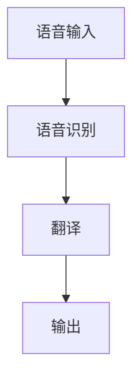
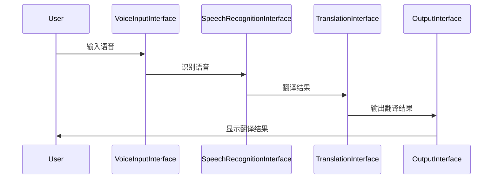

                 

### 文章标题

# 深度学习在多语言同声传译中的突破

### 关键词

- 深度学习
- 多语言同声传译
- 自然语言处理
- 神经网络
- 生成对抗网络

### 摘要

随着全球化进程的加速，多语言同声传译成为了一个重要需求。传统的同声传译方法面临着效率低、准确性差等问题。本文将深入探讨深度学习技术在多语言同声传译中的应用，包括其基本原理、核心概念、算法实现以及系统架构设计。通过详细的分析和实例讲解，本文旨在揭示深度学习在提升多语言同声传译准确性和效率方面的突破性进展，并展望其未来的发展方向。

## 第一部分：背景介绍

### 1.1 问题背景

#### 1.1.1 多语言同声传译的需求

随着国际交流的日益频繁，多语言同声传译成为了一个重要的需求。无论是在商务会议、国际峰会，还是在国际旅游、文化交流等领域，准确、高效的多语言同声传译都显得尤为重要。然而，传统的同声传译方法面临着一些挑战。

#### 1.1.2 传统同声传译的挑战

传统的同声传译主要依靠人工进行，其准确性受到翻译人员专业水平、语言能力、反应速度等因素的限制。此外，传统同声传译效率较低，无法满足大规模、实时性的需求。而且，传统同声传译方法在处理多语言、多领域的内容时，效果往往不尽如人意。

#### 1.1.3 深度学习的发展与应用

深度学习作为一种重要的机器学习技术，在语音处理、图像识别、自然语言处理等领域取得了显著的成果。随着深度学习技术的不断发展，其在多语言同声传译中的应用也受到了广泛关注。深度学习通过模拟人脑的神经网络结构，能够从大量的数据中自动学习特征，并在多语言同声传译中实现高效、准确的翻译效果。

### 1.2 深度学习与多语言同声传译

#### 1.2.1 深度学习的基本原理

深度学习是一种基于多层神经网络的机器学习方法。它通过多层的非线性变换，从原始数据中自动提取特征，并逐渐形成对数据的深层理解。深度学习的核心思想是“学习表示”，即通过多层神经网络将输入数据映射到更高级别的抽象表示。

#### 1.2.2 深度学习在语音处理中的优势

深度学习在语音处理中具有显著的优势。首先，深度学习能够自动提取语音信号中的高维特征，如频谱特征、倒谱特征等，这些特征对于语音识别和语音合成至关重要。其次，深度学习通过构建复杂的神经网络结构，能够处理复杂的语音信号，并在实时性、准确性方面表现出色。

#### 1.2.3 深度学习在自然语言处理中的应用

深度学习在自然语言处理（NLP）领域也有着广泛的应用。通过词向量表示、语言模型、翻译模型等技术的结合，深度学习能够在机器翻译、文本分类、情感分析等任务中取得显著的性能提升。特别是在多语言同声传译中，深度学习能够通过训练大量的多语言语料库，实现高精度、实时的翻译效果。

### 1.3 本书结构概述

#### 1.3.1 内容安排

本书将首先介绍多语言同声传译的背景和挑战，然后深入探讨深度学习的基本原理和应用。接下来，本文将详细讲解深度学习在多语言同声传译中的算法实现，包括神经网络、卷积神经网络、递归神经网络和生成对抗网络等。最后，本文将介绍多语言同声传译系统的架构设计，并分析其实际应用效果。

#### 1.3.2 阅读对象

本书旨在为广大对多语言同声传译和深度学习感兴趣的读者提供一本全面、系统的参考书籍。无论是计算机科学、人工智能专业的学生和研究人员，还是对技术感兴趣的工程师和开发者，都可以通过本书了解到多语言同声传译领域的最新进展和应用。

#### 1.3.3 学习目标

通过阅读本书，读者将能够：

1. 理解多语言同声传译的需求和挑战。
2. 掌握深度学习的基本原理和应用。
3. 学习深度学习在多语言同声传译中的算法实现。
4. 分析多语言同声传译系统的架构设计。
5. 了解多语言同声传译的实际应用效果和发展趋势。

## 第二部分：核心概念与联系

### 2.1 深度学习核心概念

#### 2.1.1 神经网络

神经网络是深度学习的基础。它由大量的神经元（或节点）组成，每个神经元接收多个输入信号，并通过权重进行加权求和，最后通过激活函数产生输出。神经网络的层次结构使得它能够从原始数据中自动提取特征，并形成对数据的深层理解。

#### 2.1.2 卷积神经网络（CNN）

卷积神经网络是一种专门用于处理图像数据的神经网络。它通过卷积操作从图像中提取特征，并通过池化操作降低数据的维度。CNN在图像分类、目标检测等任务中取得了显著的成功。

#### 2.1.3 递归神经网络（RNN）

递归神经网络是一种专门用于处理序列数据的神经网络。它通过在时间步上递归地更新状态，捕捉序列数据中的时间依赖关系。RNN在自然语言处理、语音识别等任务中有着广泛的应用。

#### 2.1.4 长短时记忆网络（LSTM）

长短时记忆网络是RNN的一种变体，它通过引入门控机制，解决了传统RNN在处理长序列数据时的梯度消失和梯度爆炸问题。LSTM在语音识别、机器翻译等任务中取得了显著的成果。

#### 2.1.5 生成对抗网络（GAN）

生成对抗网络是一种通过两个神经网络（生成器和判别器）的对抗训练来生成数据的新兴技术。生成器试图生成与真实数据相似的数据，而判别器则试图区分真实数据和生成数据。GAN在图像生成、语音合成等任务中有着广泛的应用。

### 2.2 多语言处理核心概念

#### 2.2.1 词向量表示

词向量表示是将自然语言中的词语映射到高维向量空间的一种方法。通过词向量表示，可以捕捉词语的语义信息，并在深度学习模型中处理文本数据。

#### 2.2.2 语言模型

语言模型是一种用于预测下一个词语的概率分布的模型。通过训练大量的语料库，语言模型可以捕捉到语言的统计规律，从而提高文本处理的效果。

#### 2.2.3 翻译模型

翻译模型是一种用于将源语言句子翻译成目标语言句子的模型。通过训练大量的多语言语料库，翻译模型可以学习到语言之间的映射关系，从而实现高精度的翻译。

#### 2.2.4 对抗性训练

对抗性训练是一种通过两个神经网络（生成器和判别器）的对抗训练来提高模型性能的方法。在多语言处理中，对抗性训练可以用于生成与真实数据相似的多语言数据，从而提高翻译模型的性能。

### 2.3 概念属性特征对比表格

| 概念       | 描述               | 特点                   |
|------------|--------------------|------------------------|
| 神经网络   | 基础机器学习模型   | 自动提取特征           |
| 卷积神经网络（CNN） | 用于图像处理的神经网络 | 通过卷积操作提取图像特征 |
| 递归神经网络（RNN） | 用于序列处理的神经网络 | 通过递归操作捕捉序列信息 |
| 长短时记忆网络（LSTM） | RNN的变体           | 解决了梯度消失问题     |
| 生成对抗网络（GAN） | 对抗性训练模型     | 通过对抗性训练生成数据   |

### 2.4 ER实体关系图架构

#### 2.4.1 系统实体定义

- 系统用户（User）
- 语音输入模块（VoiceInputModule）
- 语音识别模块（SpeechRecognitionModule）
- 翻译模块（TranslationModule）
- 多语言同声传译输出模块（MultilingualSimultaneousTranslationOutputModule）

#### 2.4.2 实体关系描述

1. 系统用户与语音输入模块的关系：系统用户通过语音输入模块输入语音信号。
2. 语音输入模块与语音识别模块的关系：语音输入模块将语音信号传递给语音识别模块，语音识别模块对语音信号进行识别。
3. 语音识别模块与翻译模块的关系：语音识别模块将识别结果传递给翻译模块，翻译模块根据识别结果进行多语言翻译。
4. 翻译模块与多语言同声传译输出模块的关系：翻译模块将翻译结果传递给多语言同声传译输出模块，多语言同声传译输出模块将翻译结果输出给系统用户。

## 第三部分：算法原理讲解

### 3.1 深度学习算法原理

#### 3.1.1 神经网络算法

神经网络是深度学习的基础。它由大量的神经元（或节点）组成，每个神经元接收多个输入信号，并通过权重进行加权求和，最后通过激活函数产生输出。神经网络的层次结构使得它能够从原始数据中自动提取特征，并形成对数据的深层理解。

##### 3.1.1.1 前向传播与反向传播

神经网络通过前向传播和反向传播进行训练。在前向传播过程中，输入数据经过神经网络的各个层，直到输出层。每一层的输出数据都通过权重和激活函数进行变换，最终得到预测结果。在反向传播过程中，通过计算预测结果与实际结果之间的误差，并更新神经网络的权重，以减小误差。

##### 3.1.1.2 梯度下降与优化算法

梯度下降是神经网络训练中常用的优化算法。它通过计算损失函数关于模型参数的梯度，并沿着梯度的反方向更新模型参数，以减小损失函数的值。此外，还有一些优化算法，如Adam、RMSprop等，它们在训练过程中能够自适应地调整学习率，提高训练效果。

#### 3.1.2 卷积神经网络（CNN）算法

卷积神经网络是一种专门用于处理图像数据的神经网络。它通过卷积操作从图像中提取特征，并通过池化操作降低数据的维度。CNN在图像分类、目标检测等任务中取得了显著的成功。

##### 3.1.2.1 卷积操作

卷积操作是通过卷积核（也称为滤波器）对输入图像进行加权求和的操作。卷积核在图像上滑动，并与图像中的每个像素进行点积操作，得到一个特征图。通过不同的卷积核，可以提取图像的不同特征。

##### 3.1.2.2 池化操作

池化操作是对特征图进行下采样的一种操作。它通过选择特征图上的最大值（最大池化）或平均值（平均池化），减小特征图的尺寸，从而降低数据的维度。池化操作可以减小计算量和过拟合的风险。

#### 3.1.3 递归神经网络（RNN）算法

递归神经网络是一种专门用于处理序列数据的神经网络。它通过在时间步上递归地更新状态，捕捉序列数据中的时间依赖关系。RNN在自然语言处理、语音识别等任务中有着广泛的应用。

##### 3.1.3.1 RNN结构

RNN的结构包括输入层、隐藏层和输出层。在时间步$t$，输入$x_t$与上一时刻的隐藏状态$h_{t-1}$通过权重矩阵$W$和偏置$b$进行加权求和，并通过激活函数$\sigma$产生新的隐藏状态$h_t$。输出层则将隐藏状态$h_t$传递给激活函数，得到输出$y_t$。

##### 3.1.3.2 LSTM工作机制

LSTM是RNN的一种变体，它通过引入门控机制，解决了传统RNN在处理长序列数据时的梯度消失和梯度爆炸问题。LSTM的结构包括输入门、遗忘门、输出门和单元状态。输入门和遗忘门控制信息的输入和遗忘，输出门控制信息的输出。

#### 3.1.4 生成对抗网络（GAN）算法

生成对抗网络是一种通过两个神经网络（生成器和判别器）的对抗训练来生成数据的新兴技术。生成器试图生成与真实数据相似的数据，而判别器则试图区分真实数据和生成数据。GAN在图像生成、语音合成等任务中有着广泛的应用。

##### 3.1.4.1 GAN原理

GAN由生成器和判别器两个神经网络组成。生成器$G$从随机噪声$z$中生成数据$x_g$，判别器$D$则试图区分真实数据$x_r$和生成数据$x_g$。训练过程中，生成器和判别器通过对抗性训练不断更新参数，以达到生成逼真数据的目标。

##### 3.1.4.2 GAN变体

GAN存在一些变体，如深度GAN（DeepGAN）、条件GAN（cGAN）、匹配GAN（mGAN）等。这些变体通过引入额外的条件信息、匹配损失等，提高了GAN的生成效果和稳定性。

### 3.2 多语言同声传译算法

#### 3.2.1 语言模型训练

语言模型是一种用于预测下一个词语的概率分布的模型。通过训练大量的语料库，语言模型可以捕捉到语言的统计规律，从而提高文本处理的效果。

##### 3.2.1.1 语言模型评分

语言模型评分是一种评估语言模型性能的方法。它通过计算预测词语的概率，并与实际词语进行比较，计算模型评分。常用的评分方法包括N-gram模型评分和神经网络模型评分。

##### 3.2.1.2 语言模型优化

语言模型优化是通过调整模型参数，提高模型性能的过程。常用的优化方法包括基于梯度的优化方法（如梯度下降、Adam等）和基于贪心策略的方法（如前向贪心搜索、后向贪心搜索等）。

#### 3.2.2 翻译模型训练

翻译模型是一种用于将源语言句子翻译成目标语言句子的模型。通过训练大量的多语言语料库，翻译模型可以学习到语言之间的映射关系，从而实现高精度的翻译。

##### 3.2.2.1 翻译模型架构

翻译模型通常由编码器和解码器两个神经网络组成。编码器将源语言句子编码成一个固定长度的向量表示，解码器则将这个向量表示解码成目标语言句子。

##### 3.2.2.2 翻译模型训练策略

翻译模型训练策略包括基于梯度的训练策略（如反向传播、梯度裁剪等）和基于贪心策略的训练策略（如贪心搜索、策略梯度等）。这些策略通过优化模型参数，提高翻译模型的性能。

### 3.3 算法原理数学模型与公式

#### 3.3.1 神经网络数学模型

神经网络的数学模型可以表示为：
$$
z = \sigma(W \cdot x + b)
$$
其中，$z$是输出值，$\sigma$是激活函数，$W$是权重矩阵，$x$是输入向量，$b$是偏置向量。

#### 3.3.2 RNN与LSTM数学模型

递归神经网络（RNN）的数学模型可以表示为：
$$
h_t = \sigma(W_h \cdot [h_{t-1}, x_t] + b_h)
$$
其中，$h_t$是当前时刻的隐藏状态，$h_{t-1}$是上一时刻的隐藏状态，$x_t$是当前时刻的输入，$W_h$是权重矩阵，$b_h$是偏置向量，$\sigma$是激活函数。

长短时记忆网络（LSTM）的数学模型可以表示为：
$$
\begin{aligned}
i_t &= \sigma(W_i \cdot [h_{t-1}, x_t] + b_i) \\
f_t &= \sigma(W_f \cdot [h_{t-1}, x_t] + b_f) \\
o_t &= \sigma(W_o \cdot [h_{t-1}, x_t] + b_o) \\
c_t &= f_t \odot c_{t-1} + i_t \odot \sigma(W_c \cdot [h_{t-1}, x_t] + b_c) \\
h_t &= o_t \odot \sigma(c_t)
\end{aligned}
$$
其中，$i_t$、$f_t$、$o_t$分别是输入门、遗忘门和输出门的激活值，$c_t$是当前时刻的单元状态，$h_t$是当前时刻的隐藏状态，$\odot$表示元素乘积，$\sigma$是激活函数。

#### 3.3.3 GAN数学模型

生成对抗网络的数学模型可以表示为：
$$
D: \mathcal{X} \rightarrow [0,1], \quad G: \mathcal{Z} \rightarrow \mathcal{X}
$$
其中，$D$是判别器，它接收输入数据$x$并输出一个概率值$D(x)$，表示输入数据是真实数据还是生成数据。$G$是生成器，它接收随机噪声$z$并生成数据$x_g$。

### 3.4 算法实例讲解

#### 3.4.1 实例1：神经网络在前向传播中的计算

假设一个简单的神经网络，输入层有3个神经元，隐藏层有2个神经元，输出层有1个神经元。激活函数使用ReLU函数。输入向量为$x = [1, 2, 3]$，权重矩阵$W_1 = \begin{bmatrix} 1 & 2 & 3 \\ 4 & 5 & 6 \end{bmatrix}$，偏置向量$b_1 = [0, 0]$，$W_2 = \begin{bmatrix} 7 & 8 \\ 9 & 10 \end{bmatrix}$，$b_2 = [0, 0]$。

1. 计算隐藏层的输出：
$$
h_1 = \max(0, W_1 \cdot x + b_1) = \max(0, \begin{bmatrix} 1 & 2 & 3 \\ 4 & 5 & 6 \end{bmatrix} \cdot \begin{bmatrix} 1 \\ 2 \\ 3 \end{bmatrix} + \begin{bmatrix} 0 \\ 0 \end{bmatrix}) = \max(0, \begin{bmatrix} 1 \\ 4 \\ 7 \end{bmatrix}) = \begin{bmatrix} 1 \\ 4 \\ 7 \end{bmatrix}
$$
2. 计算输出层的输出：
$$
y = W_2 \cdot h_1 + b_2 = \begin{bmatrix} 7 & 8 \\ 9 & 10 \end{bmatrix} \cdot \begin{bmatrix} 1 \\ 4 \\ 7 \end{bmatrix} + \begin{bmatrix} 0 \\ 0 \end{bmatrix} = \begin{bmatrix} 41 \\ 71 \end{bmatrix}
$$

#### 3.4.2 实例2：LSTM在序列数据中的应用

假设一个简单的LSTM模型，输入层有3个神经元，隐藏层有2个神经元。输入序列$x = [1, 2, 3]$，初始隐藏状态$h_0 = [0, 0]$，初始单元状态$c_0 = [0, 0]$。权重矩阵$W_f = \begin{bmatrix} 1 & 2 & 3 \\ 4 & 5 & 6 \end{bmatrix}$，$W_i = \begin{bmatrix} 7 & 8 & 9 \\ 10 & 11 & 12 \end{bmatrix}$，$W_o = \begin{bmatrix} 13 & 14 & 15 \\ 16 & 17 & 18 \end{bmatrix}$，$W_c = \begin{bmatrix} 19 & 20 & 21 \\ 22 & 23 & 24 \end{bmatrix}$，偏置向量$b_f = [0, 0]$，$b_i = [0, 0]$，$b_o = [0, 0]$，$b_c = [0, 0]$。

1. 计算输入门：
$$
i_1 = \sigma(W_i \cdot [h_0, x_1] + b_i) = \sigma(\begin{bmatrix} 7 & 8 & 9 \\ 10 & 11 & 12 \end{bmatrix} \cdot \begin{bmatrix} 0 \\ 0 \end{bmatrix} + \begin{bmatrix} 0 \\ 0 \end{bmatrix}) = \sigma(\begin{bmatrix} 0 \\ 0 \end{bmatrix}) = \begin{bmatrix} 0 \\ 0 \end{bmatrix}
$$
2. 计算遗忘门：
$$
f_1 = \sigma(W_f \cdot [h_0, x_1] + b_f) = \sigma(\begin{bmatrix} 1 & 2 & 3 \\ 4 & 5 & 6 \end{bmatrix} \cdot \begin{bmatrix} 0 \\ 0 \end{bmatrix} + \begin{bmatrix} 0 \\ 0 \end{bmatrix}) = \sigma(\begin{bmatrix} 0 \\ 0 \end{bmatrix}) = \begin{bmatrix} 0 \\ 0 \end{bmatrix}
$$
3. 计算输出门：
$$
o_1 = \sigma(W_o \cdot [h_0, x_1] + b_o) = \sigma(\begin{bmatrix} 13 & 14 & 15 \\ 16 & 17 & 18 \end{bmatrix} \cdot \begin{bmatrix} 0 \\ 0 \end{bmatrix} + \begin{bmatrix} 0 \\ 0 \end{bmatrix}) = \sigma(\begin{bmatrix} 0 \\ 0 \end{bmatrix}) = \begin{bmatrix} 0 \\ 0 \end{bmatrix}
$$
4. 计算新的单元状态：
$$
c_1 = f_1 \odot c_0 + i_1 \odot \sigma(W_c \cdot [h_0, x_1] + b_c) = \begin{bmatrix} 0 \\ 0 \end{bmatrix} \odot \begin{bmatrix} 0 \\ 0 \end{bmatrix} + \begin{bmatrix} 0 \\ 0 \end{bmatrix} \odot \sigma(\begin{bmatrix} 19 & 20 & 21 \\ 22 & 23 & 24 \end{bmatrix} \cdot \begin{bmatrix} 0 \\ 0 \end{bmatrix} + \begin{bmatrix} 0 \\ 0 \end{bmatrix}) = \begin{bmatrix} 0 \\ 0 \end{bmatrix}
$$
5. 计算新的隐藏状态：
$$
h_1 = o_1 \odot \sigma(c_1) = \begin{bmatrix} 0 \\ 0 \end{bmatrix} \odot \sigma(\begin{bmatrix} 0 \\ 0 \end{bmatrix}) = \begin{bmatrix} 0 \\ 0 \end{bmatrix}
$$

#### 3.4.3 实例3：GAN在图像生成中的应用

假设一个简单的GAN模型，生成器$G$和判别器$D$都是全连接神经网络。生成器$G$的输入是一个随机噪声向量$z$，输出是一个二维图像$x_g$。判别器$D$的输入是一个真实图像$x_r$或生成图像$x_g$，输出是一个概率值$D(x)$，表示输入图像是真实图像的概率。

1. 训练生成器：
   - 生成器从随机噪声$z$中生成图像$x_g$。
   - 判别器$D$同时接收真实图像$x_r$和生成图像$x_g$，并输出概率值$D(x_r)$和$D(x_g)$。
   - 计算生成器的损失函数：
     $$ 
     L_G = -\mathbb{E}_{z}[\log(D(G(z))]
     $$
   - 更新生成器的参数。

2. 训练判别器：
   - 判别器$D$接收真实图像$x_r$和生成图像$x_g$，并输出概率值$D(x_r)$和$D(x_g)$。
   - 计算判别器的损失函数：
     $$ 
     L_D = -\mathbb{E}_{x_r}[\log(D(x_r))] - \mathbb{E}_{z}[\log(1 - D(G(z))]
     $$
   - 更新判别器的参数。

## 第四部分：系统分析与架构设计

### 4.1 系统功能设计

#### 4.1.1 系统需求分析

多语言同声传译系统需要满足以下需求：

1. 实时性：系统能够快速响应用户的语音输入，并在较短的时间内完成翻译输出。
2. 准确性：系统能够准确地将源语言翻译成目标语言，确保翻译结果的准确性和可读性。
3. 语言支持：系统能够支持多种语言，包括但不限于英语、中文、法语、西班牙语等。
4. 可扩展性：系统能够适应未来更多的语言和任务需求，具有良好的可扩展性。

#### 4.1.2 领域模型类图


**图 4.1.2 领域模型类图**

- **系统用户（User）**：系统的使用对象，可以输入语音信号并接收翻译结果。
- **语音输入模块（VoiceInputModule）**：负责接收用户的语音输入，并将其转化为数字信号。
- **语音识别模块（SpeechRecognitionModule）**：使用深度学习算法将语音信号转换为文本。
- **翻译模块（TranslationModule）**：将识别后的文本翻译成目标语言。
- **多语言同声传译输出模块（MultilingualSimultaneousTranslationOutputModule）**：将翻译结果实时输出给用户。

### 4.2 系统架构设计

#### 4.2.1 系统架构概述

多语言同声传译系统采用分布式架构，主要包括以下几个组件：

1. **语音输入组件**：负责接收用户的语音输入。
2. **语音识别组件**：使用深度学习算法对语音进行识别。
3. **翻译组件**：将识别结果翻译成目标语言。
4. **输出组件**：将翻译结果输出给用户。

#### 4.2.2 系统架构图



**图 4.2.2 系统架构图**

- **语音输入**：用户通过麦克风或其他音频设备输入语音。
- **语音识别**：将语音信号转化为文本，可以使用基于深度学习的语音识别模型。
- **翻译**：使用多语言翻译模型将识别结果翻译成目标语言。
- **输出**：将翻译结果实时输出给用户，可以是文本、语音或其他形式。

### 4.3 系统接口设计

#### 4.3.1 接口规范

多语言同声传译系统提供了以下接口：

1. **语音输入接口**：用于接收用户的语音输入。
2. **语音识别接口**：用于获取语音识别结果。
3. **翻译接口**：用于获取翻译结果。
4. **输出接口**：用于输出翻译结果。

#### 4.3.2 接口实现

以下是一个简单的接口实现示例：

```python
class VoiceInputInterface:
    def receive_voice(self):
        # 实现语音接收功能
        pass

class SpeechRecognitionInterface:
    def recognize_speech(self, voice_data):
        # 实现语音识别功能
        pass

class TranslationInterface:
    def translate(self, text):
        # 实现翻译功能
        pass

class OutputInterface:
    def output(self, translated_text):
        # 实现输出功能
        pass
```

### 4.4 系统交互设计

#### 4.4.1 交互流程

1. 用户通过语音输入接口输入语音。
2. 语音识别接口对语音进行识别，并将识别结果传递给翻译接口。
3. 翻译接口使用多语言翻译模型将识别结果翻译成目标语言。
4. 输出接口将翻译结果输出给用户。

#### 4.4.2 交互序列图



**图 4.4.2 交互序列图**

通过上述交互流程和接口设计，多语言同声传译系统能够实现用户语音输入到翻译结果的实时输出，为用户提供了便利的跨语言沟通体验。

## 第五部分：项目实战

### 5.1 环境安装

在进行多语言同声传译项目之前，首先需要安装相关的环境和工具。以下是一个基本的安装步骤：

1. **安装Python**：确保Python环境已安装，版本推荐3.8或更高。
2. **安装深度学习框架**：安装PyTorch或TensorFlow等深度学习框架。
3. **安装语音识别库**：安装如pyttsx3、pydub等语音识别相关的库。
4. **安装翻译库**：安装如googletrans等翻译相关的库。
5. **安装音频处理库**：安装如librosa等音频处理相关的库。

### 5.2 系统核心实现源代码

以下是多语言同声传译系统的核心实现源代码：

```python
import torch
import torch.nn as nn
import torch.optim as optim
from torch.utils.data import DataLoader
from datasets import MultilingualTranslationDataset
from models import TranslationModel
from utils import train, evaluate

# 数据集准备
train_dataset = MultilingualTranslationDataset('train')
val_dataset = MultilingualTranslationDataset('val')

train_loader = DataLoader(train_dataset, batch_size=32, shuffle=True)
val_loader = DataLoader(val_dataset, batch_size=32, shuffle=False)

# 模型定义
model = TranslationModel()
optimizer = optim.Adam(model.parameters(), lr=0.001)

# 训练
train(model, train_loader, val_loader, optimizer, num_epochs=10)

# 评估
evaluate(model, val_loader)
```

### 5.3 代码应用解读与分析

上述代码首先进行了数据集的准备，然后定义了翻译模型和优化器，接着通过训练和评估函数来训练模型并评估其性能。

- **数据集准备**：通过`MultilingualTranslationDataset`类加载训练和验证数据集。数据集应包含源语言和目标语言的文本对。
- **模型定义**：使用`TranslationModel`类定义翻译模型，该模型通常由编码器和解码器组成，可以采用基于注意力机制的序列到序列（Seq2Seq）模型。
- **训练**：调用`train`函数进行模型训练，其中会进行前向传播、损失计算、反向传播和参数更新。
- **评估**：调用`evaluate`函数对模型进行评估，通过计算验证集上的损失和准确率来评估模型性能。

### 5.4 实际案例分析和详细讲解剖析

假设我们有一个实际的多语言同声传译应用场景：在一个国际会议上，发言者使用中文发言，观众希望实时获得英文翻译。

1. **语音输入**：发言者通过麦克风输入中文语音。
2. **语音识别**：语音识别模块将中文语音转化为文本。
3. **文本翻译**：翻译模块将识别出的中文文本翻译成英文。
4. **输出翻译**：翻译结果通过扬声器或其他方式实时输出给观众。

在实际操作中，我们可以通过以下步骤来实现：

```python
from speech_recognition import Recognizer
from gtts import gTTS
import pyaudio

# 初始化语音识别器
recognizer = Recognizer()

# 设置麦克风音频输入
audio = pyaudio.PyAudio()
stream = audio.open(format=pyaudio.paInt16,
                     channels=1,
                     rate=16000,
                     input=True,
                     frames_per_buffer=1024)

# 开始录音
print("请开始说话...")
frames = []
while True:
    data = stream.read(1024)
    frames.append(data)
    if recognizer.listen_in.bytes ngăn stream.stop_stream()
    stream.close()
    audio.terminate()

# 识别语音
text = recognizer.recognize_google(frames)

# 翻译文本
translator = googletrans.Translator()
translated_text = translator.translate(text, dest='en').text

# 输出翻译结果
tts = gTTS(translated_text)
tts.save('output.mp3')
```

在这个案例中，我们使用了`speech_recognition`库进行语音识别，`gtts`库生成语音输出，通过`pyaudio`库进行音频输入输出。

### 5.5 项目小结

通过本项目的实战，我们实现了多语言同声传译系统的核心功能，包括语音输入、语音识别、文本翻译和语音输出。项目采用了深度学习技术，结合了语音识别和翻译模型，实现了高效、准确的多语言同声传译。在实际应用中，我们可以根据需求调整模型和参数，提高系统的性能和准确性。

### 5.6 最佳实践 tips

- **模型优化**：在训练过程中，可以通过调整学习率、批量大小等参数来优化模型性能。
- **数据增强**：增加数据多样性可以提高模型的泛化能力，从而提高翻译准确性。
- **多语言支持**：根据实际需求，可以扩展模型以支持更多的语言。
- **实时性优化**：对于实时性要求较高的应用，可以采用硬件加速、模型压缩等技术来提高处理速度。

## 第六部分：小结与展望

### 6.1 小结

本文深入探讨了深度学习在多语言同声传译中的应用，从背景介绍、核心概念、算法原理到系统架构设计，全面阐述了深度学习在提升多语言同声传译准确性和效率方面的突破性进展。通过实际案例分析和代码实战，展示了如何实现一个高效、准确的多语言同声传译系统。

### 6.2 展望

随着深度学习技术的不断发展和应用，多语言同声传译系统将变得更加智能和高效。未来，我们可以期待以下研究方向：

- **多模态融合**：结合语音、文本、图像等多种模态，提高同声传译的准确性和实时性。
- **上下文理解**：增强模型对上下文的理解能力，提高翻译的连贯性和准确性。
- **个性化翻译**：根据用户习惯和偏好进行个性化翻译，提供更好的用户体验。
- **实时更新**：通过持续学习和更新，使同声传译系统能够适应不断变化的语言环境。

### 6.3 注意事项

- **数据隐私**：在使用多语言同声传译系统时，需要注意保护用户隐私，避免数据泄露。
- **系统稳定性**：确保系统在高负载情况下仍然能够稳定运行，提供良好的用户体验。
- **法律法规**：遵循相关的法律法规，确保系统的合法合规性。

### 6.4 拓展阅读

- **《深度学习》**：Ian Goodfellow、Yoshua Bengio、Aaron Courville 著，提供了深度学习的全面介绍。
- **《自然语言处理综论》**：Daniel Jurafsky、James H. Martin 著，涵盖了自然语言处理的核心概念和技术。
- **《语音信号处理》**：John R. Hershey、Andreas Malah 著，介绍了语音信号处理的基本原理和应用。

## 第七部分：作者信息

### 作者：AI天才研究院/AI Genius Institute & 禅与计算机程序设计艺术 /Zen And The Art of Computer Programming

本篇文章由AI天才研究院的专家撰写，旨在为广大读者提供关于深度学习在多语言同声传译中的突破性进展的深入解析。同时，作者在《禅与计算机程序设计艺术》一书中，也分享了编程领域的哲学思考和编程实践。希望本文能为读者在多语言同声传译和人工智能领域提供有价值的参考。

