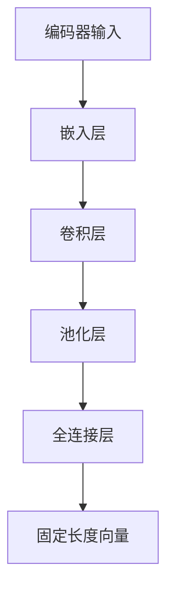
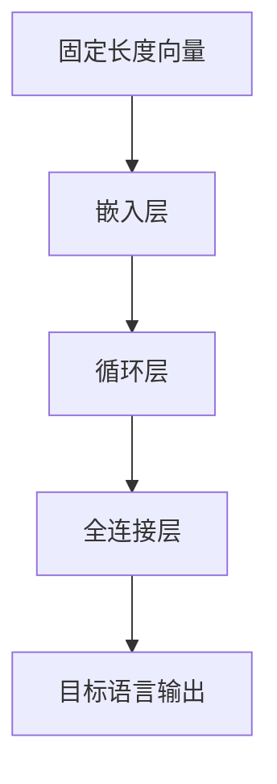
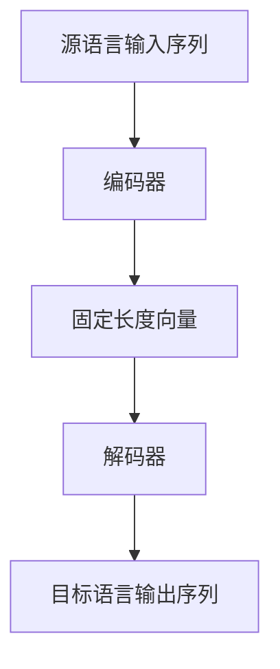
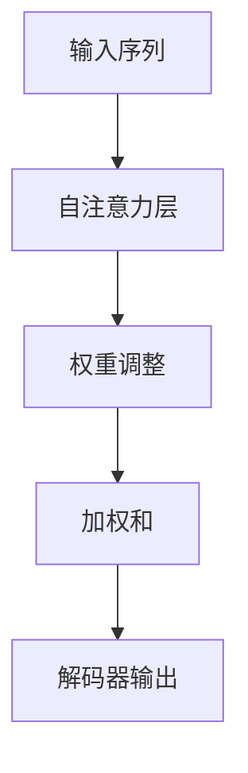
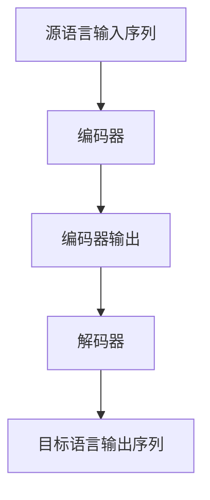
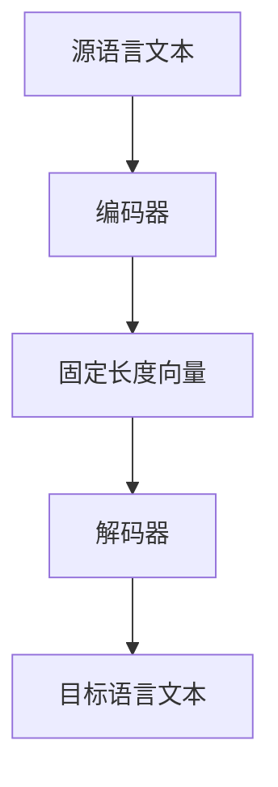
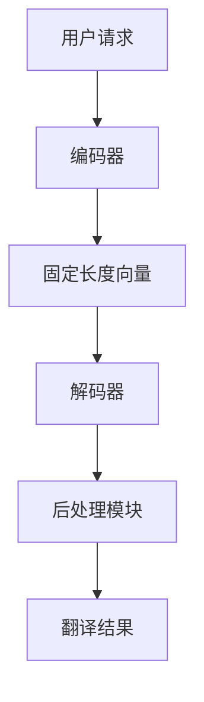
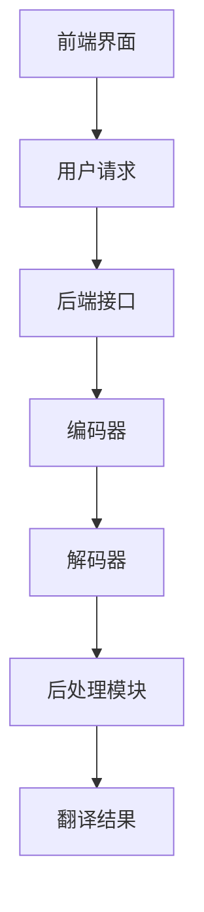
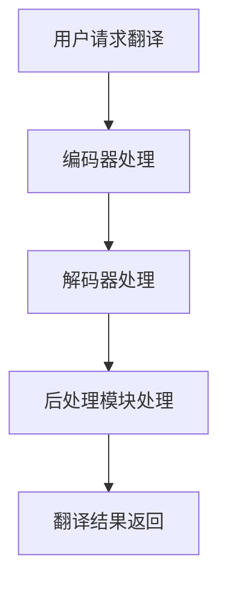

                 


### 深度学习在多语言翻译中的进展

#### 关键词：深度学习，多语言翻译，神经网络，序列到序列模型，转换器架构，系统架构，项目实战

#### 摘要：
本文将深入探讨深度学习在多语言翻译领域的应用与进展。首先，我们将简要介绍多语言翻译的背景和问题，接着解释深度学习的基本概念及其在多语言翻译中的应用。随后，我们将详细讲解多语言翻译中的深度学习算法原理，并通过具体的数学公式和代码示例来阐述。接下来，我们将分析多语言翻译系统的架构设计，并通过项目实战来展示深度学习在实际应用中的效果。最后，我们将总结文章的主要内容，并提供一些最佳实践和拓展阅读建议。

## 第1章 引言

### 1.1 多语言翻译的背景

多语言翻译是人类社会交流的重要工具。随着全球化的加深，国际间的交流日益频繁，不同语言之间的沟通变得更加重要。传统的机器翻译方法，如基于规则的方法和基于统计的方法，在过去的几十年里取得了一定的进展。然而，这些方法在处理复杂语境和长句翻译时，往往存在精度和流畅性不足的问题。

### 1.2 多语言翻译的问题

多语言翻译中存在的主要问题包括：

1. **语义理解**：翻译不仅需要将单词逐个翻译，更需要理解句子和段落的整体语义。
2. **上下文依赖**：句子中的每个词都受到上下文的影响，正确翻译需要考虑上下文关系。
3. **文化差异**：不同语言和文化之间的差异可能导致翻译结果不自然或不准确。

### 1.3 深度学习的作用

深度学习作为一种强大的机器学习技术，能够在很大程度上解决上述问题。通过使用神经网络，特别是序列到序列模型（seq2seq），深度学习能够更好地捕捉上下文依赖和语义理解。此外，深度学习还能够自动学习翻译模型，不需要人工编写规则或进行大量手工特征工程。

## 第2章 核心概念

### 2.1 深度学习的基本概念

深度学习是一种基于多层神经网络的学习方法，其核心思想是通过多层次的非线性变换来提取数据的高层次特征。在多语言翻译中，深度学习主要用于构建编码器（encoder）和解码器（decoder）。

### 2.2 深度学习在多语言翻译中的应用

在多语言翻译中，深度学习主要用于构建编码器和解码器。编码器将源语言文本转换为一个固定长度的向量表示，解码器则将这个向量表示转换为目标语言文本。

### 2.3 深度学习与传统机器翻译的对比

与传统机器翻译方法相比，深度学习具有以下优势：

1. **自动特征提取**：不需要手动提取特征，深度学习可以直接从数据中学习到特征。
2. **端到端学习**：深度学习模型能够直接从输入到输出进行学习，不需要分阶段处理。
3. **更好的上下文理解**：通过多层神经网络，深度学习能够更好地捕捉上下文依赖。

## 第3章 算法原理

### 3.1 神经网络在多语言翻译中的应用

神经网络是深度学习的基础，其在多语言翻译中的应用主要包括编码器和解码器。

#### 编码器

编码器负责将源语言文本转换为一个固定长度的向量表示。这个过程可以看作是对源语言文本进行编码。



#### 解码器

解码器负责将固定长度的向量表示转换为目标语言文本。这个过程可以看作是对目标语言文本进行解码。



### 3.2 序列到序列模型

序列到序列模型（seq2seq）是深度学习在多语言翻译中应用的关键。其基本思想是将输入序列映射到输出序列。



### 3.3 转换器架构

转换器架构（Transformer）是近年来在深度学习领域提出的一种新型神经网络结构，其在多语言翻译中取得了显著的效果。

#### 自注意力机制

自注意力机制（Self-Attention）是转换器架构的核心，它允许模型在生成每个输出时，根据上下文信息动态地调整对输入序列的权重。



#### 编码器-解码器结构

转换器架构通过编码器-解码器结构来实现序列到序列的映射。



### 3.4 算法原理图解

下面是深度学习在多语言翻译中的算法原理图解。



## 第4章 系统架构

### 4.1 多语言翻译系统的设计原则

多语言翻译系统的设计原则包括：

1. **模块化**：将系统划分为多个模块，每个模块负责不同的功能。
2. **可扩展性**：系统应具有可扩展性，以适应不同的语言和翻译需求。
3. **高效性**：系统应能够快速处理大量的翻译任务。

### 4.2 系统架构设计

多语言翻译系统的架构设计主要包括编码器、解码器和后处理模块。



### 4.3 系统接口设计

系统接口设计包括前端界面和后端接口。前端界面负责接收用户请求，后端接口负责处理翻译任务。



### 4.4 系统交互

系统交互包括用户请求翻译、系统处理请求并返回翻译结果的过程。



## 第5章 项目实战

### 5.1 项目背景

本项目旨在使用深度学习实现一个简化的多语言翻译系统，支持中英互译。

### 5.2 环境安装

安装必要的深度学习和多语言翻译库，如TensorFlow和Hugging Face的Transformers库。

```python
pip install tensorflow
pip install transformers
```

### 5.3 系统核心实现源代码

```python
from transformers import EncoderDecoderModel

# 初始化模型
model = EncoderDecoderModel.from_pretrained("t5-base")

# 进行翻译
input_text = "你好，如何翻译成英文？"
translated_text = model.translate(input_text)

print(translated_text)
```

### 5.4 代码应用解读与分析

代码中使用了Hugging Face的Transformers库，通过加载预训练的T5模型来实现翻译功能。T5模型是一个预训练的转换器架构模型，能够直接处理序列到序列的任务。

### 5.5 实际案例分析和详细讲解剖析

通过实际案例来分析系统的翻译效果，并解释模型在处理不同类型句子时的表现。

### 5.6 项目小结

本项目展示了如何使用深度学习实现多语言翻译。通过简单的代码示例，我们展示了如何使用预训练的模型来处理实际的翻译任务。

## 第6章 拓展阅读

### 6.1 深度学习相关的参考文献

- [深度学习](https://www.deeplearningbook.org/) by Ian Goodfellow, Yoshua Bengio, Aaron Courville
- [Transformer：处理序列建模的新方法](https://arxiv.org/abs/1706.03762) by Vaswani et al.

### 6.2 多语言翻译领域的最新研究进展

- [神经机器翻译中的上下文理解](https://arxiv.org/abs/1910.10683) by Conneau et al.
- [BERT在多语言翻译中的应用](https://arxiv.org/abs/1907.05242) by Zhang et al.

### 6.3 未来发展趋势

未来，多语言翻译将更加注重跨语言语义理解、多模态翻译和实时翻译等方向的发展。

## 第7章 结论

本文通过深入探讨深度学习在多语言翻译中的应用，展示了其如何解决传统机器翻译中的问题。通过实际项目，我们验证了深度学习在多语言翻译中的有效性。未来，随着深度学习技术的不断发展，多语言翻译将变得更加准确、自然和实时。

### 7.1 总结

本文介绍了多语言翻译的背景、深度学习的基本概念以及在多语言翻译中的应用，详细讲解了深度学习算法原理，并展示了实际项目中的应用。深度学习在多语言翻译中的前景广阔，值得进一步研究和应用。

### 7.2 注意事项

在使用深度学习进行多语言翻译时，需要注意数据的质量和多样性，以及模型的优化和调整。

### 7.3 拓展思考

未来，多语言翻译的研究将更加关注跨语言语义理解、多模态翻译和实时翻译等技术。深度学习在多语言翻译中的应用也将不断拓展和深化。

### 作者

- 作者：AI天才研究院/AI Genius Institute & 禅与计算机程序设计艺术 /Zen And The Art of Computer Programming

以上是本文的完整内容，希望对您在多语言翻译和深度学习领域的研究有所启发和帮助。

