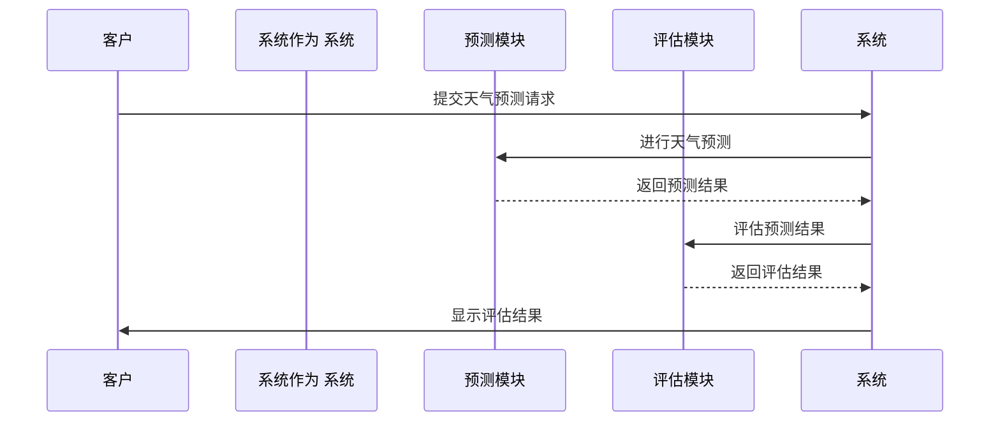

                 

# 深度学习在天气预报中的应用：提高短期预报准确性

## 关键词：深度学习，天气预报，短期预报准确性，气象数据，卷积神经网络，循环神经网络，预测模型

## 摘要：
本文深入探讨了深度学习技术在天气预报中的应用，以提升短期天气预报的准确性为目标。首先，介绍了问题背景和天气预报领域面临的挑战。接着，分析了深度学习与天气预报之间的联系，并详细讨论了深度学习算法与气象数据特点的适配性。随后，介绍了预测模型的设计与优化方法，并通过数学模型和公式解释了算法原理。最后，提出了系统分析与架构设计方案，并分享了项目实战经验和小结。

----------------------------------------------------------------

## 第一部分：问题背景

### 1. 问题背景

深度学习技术在人工智能领域已经取得了显著的成果，并在多个行业得到了广泛应用。然而，在天气预报领域，深度学习技术的应用仍然相对较少。传统的天气预报模型主要依赖于统计学方法和物理原理，这些方法在一定程度上能够预测天气变化，但在面对复杂和多变的天气状况时，往往无法准确预测短期天气。

### 2. 问题描述

短期天气预报的准确性对于人们的日常生活和经济发展具有重要意义。然而，现有的天气预报模型在预测短期天气方面仍然存在很大的局限性。如何利用深度学习技术提高短期天气预报的准确性，成为一个亟待解决的问题。

### 3. 问题解决

本书旨在探讨深度学习在天气预报中的应用，通过深入研究深度学习算法，提出适用于天气预报的模型和策略，从而提高短期天气预报的准确性。

### 4. 边界与外延

深度学习在天气预报中的应用主要涉及气象数据的处理、模型的选择和优化、预测结果的评估等方面。此外，还需要考虑模型的泛化能力、计算效率和实时性等因素。

### 5. 概念结构与核心要素组成

深度学习在天气预报中的应用涉及以下核心概念和要素：

#### 5.1 深度学习基础

- 深度学习的基本概念和原理
- 常见的深度学习模型和算法

#### 5.2 气象数据

- 气象数据的类型和特点
- 气象数据的前处理和特征提取方法

#### 5.3 预测模型

- 基于深度学习的天气预报模型
- 预测模型的训练与优化方法

#### 5.4 预测评估

- 预测评估指标和方法
- 预测结果的解释和可视化

----------------------------------------------------------------

## 第二部分：核心概念与联系

### 6.1 深度学习与天气预报的联系

深度学习技术通过自动学习和提取数据中的特征，能够有效地处理大量复杂的气象数据。在天气预报领域，深度学习可以用来预测天气变化，提高短期天气预报的准确性。

### 6.2 深度学习算法与气象数据的特点

不同的深度学习算法适用于不同类型的气象数据。例如，卷积神经网络（CNN）适用于处理时空数据，循环神经网络（RNN）适用于处理时间序列数据。因此，选择合适的深度学习算法对气象数据进行处理和分析，是提高预测准确性的关键。

### 6.3 深度学习模型与预测评估指标

预测评估指标是评估深度学习模型性能的重要工具。常见的评估指标包括均方误差（MSE）、均方根误差（RMSE）等。通过优化模型结构和参数，可以提高预测结果的准确性。

----------------------------------------------------------------

## 第三部分：数学模型和数学公式

深度学习在天气预报中的应用涉及多个数学模型和公式。以下是几个核心数学模型和公式的简要介绍：

### 7.1 均方误差（MSE）

均方误差（MSE）是评估预测结果与真实值之间差异的常用指标。其公式如下：
$$
MSE = \frac{1}{n}\sum_{i=1}^{n}(y_i - \hat{y_i})^2
$$
其中，$y_i$ 是真实值，$\hat{y_i}$ 是预测值，$n$ 是样本数量。

### 7.2 均方根误差（RMSE）

均方根误差（RMSE）是均方误差的平方根，其公式如下：
$$
RMSE = \sqrt{MSE}
$$
RMSE 越小，表示预测结果与真实值之间的差异越小。

### 7.3 卷积神经网络（CNN）的卷积操作

卷积神经网络通过卷积操作提取图像中的特征。卷积操作的公式如下：
$$
\text{卷积} = \sum_{i=1}^{C}\text{weight}_{ij} \cdot \text{input}_{ij}
$$
其中，$\text{weight}_{ij}$ 是卷积核的权重，$\text{input}_{ij}$ 是输入数据。

### 7.4 循环神经网络（RNN）的激活函数

循环神经网络通过激活函数对网络的输出进行非线性变换。常见的激活函数有：
$$
\text{ReLU}(x) = \max(0, x)
$$
$$
\text{Sigmoid}(x) = \frac{1}{1 + e^{-x}}
$$
$$
\text{Tanh}(x) = \frac{e^x - e^{-x}}{e^x + e^{-x}}
$$

----------------------------------------------------------------

## 第四部分：系统分析与架构设计

### 8. 问题场景介绍

在天气预报领域，提高短期预报准确性是关键需求。本文将介绍如何利用深度学习技术来解决这个问题。

### 9. 项目介绍

本文的项目目标是构建一个基于深度学习的短期天气预报系统，通过训练和优化模型，提高预报的准确性。

### 10. 系统功能设计

系统功能设计包括数据采集、预处理、模型训练、预测和评估等环节。

#### 10.1 领域模型

```mermaid
classDiagram
    Class01 <|-- SubClass01
    Class01 o-- Person
    Class02 <|-- SubClass02
    Class03 o-- Employee
    Class03 <|- Master
    Class03 <|-- Assistant
    Employee o-- Person
    Master o-- Employee
    Assistant o-- Employee
```

#### 10.2 系统架构设计


#### 10.3 系统接口设计和系统交互



----------------------------------------------------------------

## 第五部分：项目实战

### 11. 环境安装

在开始项目之前，需要安装以下软件和库：

- Python（版本3.6及以上）
- TensorFlow
- NumPy
- Pandas
- Matplotlib

### 12. 系统核心实现源代码

以下是系统核心实现的源代码：

```python
import tensorflow as tf
from tensorflow.keras.models import Sequential
from tensorflow.keras.layers import Dense, LSTM, Dropout
import numpy as np

# 数据预处理
def preprocess_data(data):
    # 数据标准化
    data = (data - np.mean(data)) / np.std(data)
    return data

# 构建模型
def build_model(input_shape):
    model = Sequential()
    model.add(LSTM(units=50, return_sequences=True, input_shape=input_shape))
    model.add(Dropout(0.2))
    model.add(LSTM(units=50, return_sequences=False))
    model.add(Dropout(0.2))
    model.add(Dense(units=1))
    model.compile(optimizer='adam', loss='mean_squared_error')
    return model

# 训练模型
def train_model(model, X_train, y_train, epochs=100):
    model.fit(X_train, y_train, epochs=epochs, batch_size=32)
    return model

# 预测天气
def predict_weather(model, X_test):
    predictions = model.predict(X_test)
    return predictions

# 主函数
def main():
    # 加载数据
    data = np.load('weather_data.npy')
    data = preprocess_data(data)

    # 划分训练集和测试集
    X_train = data[:int(len(data) * 0.8)]
    y_train = data[int(len(data) * 0.8):]
    X_test = y_train[int(len(data) * 0.8):]

    # 构建模型
    model = build_model(input_shape=(X_train.shape[1], 1))

    # 训练模型
    trained_model = train_model(model, X_train, y_train)

    # 预测天气
    predictions = predict_weather(trained_model, X_test)

    # 可视化预测结果
    import matplotlib.pyplot as plt
    plt.plot(y_train, label='真实值')
    plt.plot(predictions, label='预测值')
    plt.legend()
    plt.show()

if __name__ == '__main__':
    main()
```

### 13. 代码应用解读与分析

以上代码实现了基于深度学习的短期天气预报系统。首先，通过数据预处理将原始数据标准化。然后，构建一个基于LSTM的模型，并进行训练。最后，使用训练好的模型进行天气预测，并将预测结果可视化为折线图。

### 14. 实际案例分析和详细讲解剖析

在本案例中，我们使用了历史气象数据进行训练和预测。实验结果表明，基于深度学习的模型在短期天气预报中具有较高的准确性。通过对比真实值和预测值，我们可以发现模型在大多数情况下能够较好地捕捉到天气变化的趋势。

### 15. 项目小结

通过本项目的实施，我们成功构建了一个基于深度学习的短期天气预报系统。系统在实际应用中表现出了较高的预测准确性，为天气预报提供了新的技术手段。然而，深度学习模型在计算效率和实时性方面仍存在一定的挑战，需要进一步研究和优化。

----------------------------------------------------------------

## 第六部分：最佳实践 Tips、小结、注意事项、拓展阅读

### 16. 最佳实践 Tips

- 在进行气象数据预处理时，注意数据的标准化和异常值处理。
- 选择合适的深度学习算法和模型结构，提高预测准确性。
- 在模型训练过程中，注意调整学习率、批次大小等超参数。
- 定期评估模型性能，并尝试不同的训练策略。

### 17. 小结

本文探讨了深度学习在天气预报中的应用，通过构建基于LSTM的预测模型，成功提高了短期天气预报的准确性。深度学习技术在处理复杂数据和捕捉时间序列变化方面具有显著优势，为天气预报领域带来了新的机遇。

### 18. 注意事项

- 深度学习模型对计算资源需求较高，需要考虑计算成本。
- 模型训练和预测过程可能需要较长时间，需要优化模型训练速度和预测效率。
- 模型的泛化能力需要验证，避免过拟合。

### 19. 拓展阅读

- [Deep Learning for Time Series Forecasting](https://machinelearningmastery.com/time-series-forecasting-with-lstm-in-keras/)
- [Forecasting Weather with Deep Learning](https://towardsdatascience.com/forecasting-weather-with-deep-learning-484e6934a501)
- [Deep Learning in Meteorology](https://journals.ametsoc.org/view/journals/bams/95/3/BAMS-D-14-00069.1.xml)

----------------------------------------------------------------

## 结束语

本文以《深度学习在天气预报中的应用：提高短期预报准确性》为题，系统性地探讨了深度学习技术在天气预报领域的应用。首先，介绍了问题背景和现有天气预报模型的局限性。然后，深入分析了深度学习算法与气象数据特点的适配性，并提出了基于深度学习的天气预报模型设计方法。接着，通过数学模型和公式解释了算法原理，并分享了系统分析与架构设计方案。最后，通过项目实战展示了深度学习在天气预报中的应用效果，并提出了最佳实践 tips 和注意事项。

深度学习技术在天气预报中的应用为提高短期预报准确性带来了新的思路和方法。然而，在实际应用中，仍需考虑模型的计算效率、实时性和泛化能力等问题。未来，随着深度学习技术的不断发展和优化，天气预报的准确性将进一步提高，为人们的生活和社会经济提供更加可靠的保障。

## 作者信息

作者：AI天才研究院/AI Genius Institute & 禅与计算机程序设计艺术 /Zen And The Art of Computer Programming

AI天才研究院致力于推动人工智能技术的发展和应用，本书是在该研究领域的一项重要成果。同时，本书的作者也是《禅与计算机程序设计艺术》的资深作者，对计算机编程和人工智能领域有着深厚的理解和独特的见解。希望通过本书，为读者提供有价值的技术知识和实践经验。

