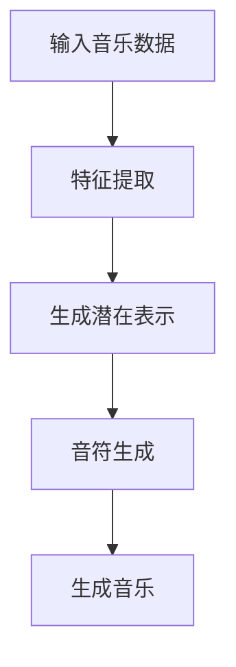
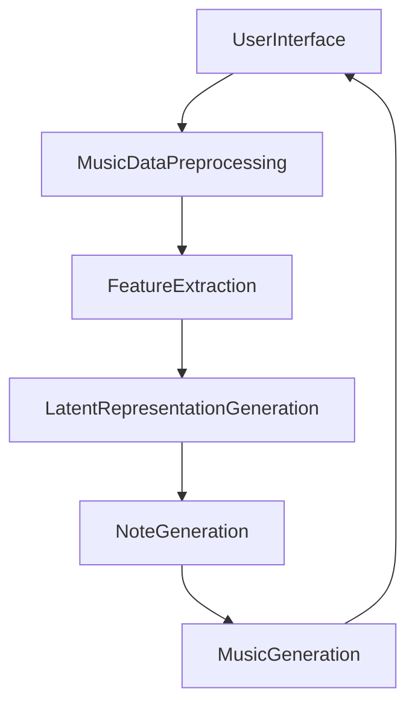
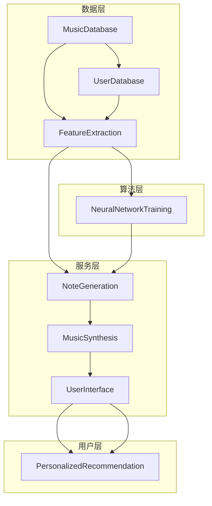
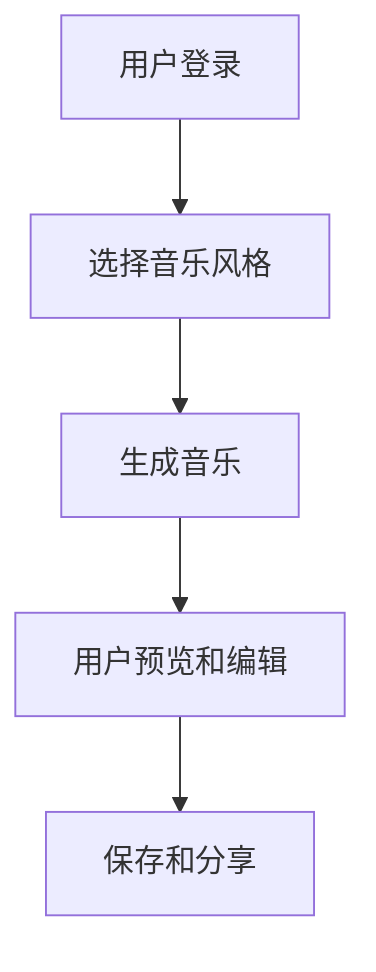

                 

# 深度学习在自动作曲中的应用：AI音乐创作的新可能

关键词：自动作曲，深度学习，AI音乐创作，算法原理，系统架构设计

摘要：随着深度学习技术的不断发展，AI在各个领域的应用也越来越广泛。本文将探讨深度学习在自动作曲中的应用，分析AI音乐创作的新可能，从核心概念、算法原理到系统架构设计，为读者提供一个全面而深入的技术解析。

## 目录大纲：深度学习在自动作曲中的应用：AI音乐创作的新可能

### 第1章 引言

#### 1.1 问题背景

- 音乐创作的传统方法与限制
- 深度学习在艺术创作领域的潜力
- 自动作曲的现状与挑战

#### 1.2 问题描述

- 深度学习如何改变音乐创作流程
- AI在音乐创作中的具体应用

#### 1.3 问题解决

- 深度学习核心原理简介
- 自动作曲的关键技术介绍

#### 1.4 边界与外延

- 自动作曲的艺术性边界
- 技术实现的局限性

#### 1.5 概念结构与核心要素组成

- 深度学习概念解析
- 自动作曲流程

### 第2章 核心概念与联系

#### 2.1 深度学习原理

- 神经网络基础
- 卷积神经网络（CNN）
- 递归神经网络（RNN）
- 生成对抗网络（GAN）

#### 2.2 概念属性特征对比表格

| 网络类型 | 特点 | 应用场景 |
| --- | --- | --- |
| 神经网络 | 简单但强大 | 图像识别、语音识别 |
| CNN | 特征提取 | 图像识别 |
| RNN | 序列建模 | 自然语言处理 |
| GAN | 数据生成 | 艺术创作 |

#### 2.3 ER实体关系图架构

```mermaid
erDiagram
    AI系统 ||--|{ 音乐数据 }|
    音乐数据 ||--|{ 音符生成器 }|
    音符生成器 ||--|{ 音乐风格分类器 }|
    AI系统 ||--|{ 用户交互模块 }|
```

### 第3章 算法原理讲解

#### 3.1 音符生成算法

#### 3.1.1 算法mermaid流程图



#### 3.1.2 Python源代码示例

```python
import numpy as np
import tensorflow as tf

# 加载音乐数据
data = load_music_data()

# 特征提取
features = extract_features(data)

# 生成潜在表示
latent = generate_latent_representation(features)

# 音符生成
notes = generate_notes(latent)

# 生成音乐
music = generate_music(notes)
```

#### 3.1.3 算法原理详细讲解

- 潜在表示生成
- 音符生成过程
- 音乐生成机制

#### 3.1.4 举例说明

- 使用具体音乐数据示例生成音乐

### 第4章 数学模型和数学公式

#### 4.1 音符生成数学模型

$$
Y = f(X, \theta)
$$

- $Y$：生成的音符序列
- $X$：输入的音乐数据
- $f$：神经网络模型
- $\theta$：模型参数

#### 4.2 音符生成公式

$$
\text{note} = \text{softmax}(\text{W} \cdot \text{hidden} + \text{b})
$$

- $\text{note}$：生成的音符
- $\text{W}$：权重矩阵
- $\text{hidden}$：隐藏层输出
- $\text{b}$：偏置项

### 第5章 系统分析与架构设计方案

#### 5.1 问题场景介绍

- 自动作曲系统的需求与功能

#### 5.2 项目介绍

- 项目背景
- 项目目标

#### 5.3 系统功能设计

- 功能模块划分
- 功能说明

#### 5.4 系统架构设计

- 系统架构图



#### 5.5 系统

---

### 第1章 引言

#### 1.1 问题背景

音乐，作为人类情感表达的一种重要形式，自古以来就深受人们喜爱。然而，音乐创作的过程往往需要创作者具备丰富的音乐素养和创作技巧，这对于许多普通人来说是一个难以逾越的门槛。随着科技的发展，人工智能技术的崛起为音乐创作带来了新的可能性。

传统的音乐创作方法主要依赖于创作者的直觉和经验，这种方式在创作过程中具有一定的局限性。例如，创作者往往需要花费大量的时间和精力去尝试不同的旋律和和弦组合，以达到满意的创作效果。而且，对于一些复杂的音乐风格，创作者可能需要具备深厚的音乐理论知识和演奏技巧。这些限制使得音乐创作成为一个高门槛的活动。

另一方面，深度学习作为一种强大的机器学习技术，近年来在图像识别、自然语言处理等领域取得了显著的成果。深度学习通过模拟人脑的神经网络结构，能够从大量数据中学习到复杂的模式，从而实现自动化的数据分析和决策。因此，有理由相信，深度学习在音乐创作领域也具有巨大的潜力。

目前，自动作曲已经取得了一些初步的成果。例如，一些基于深度学习的自动作曲系统可以通过分析已有的音乐作品，生成新的音乐旋律和和弦。这些系统不仅可以模仿人类作曲家的创作风格，还能够创造出独特的音乐作品。然而，自动作曲技术仍然面临着一些挑战，如如何更好地理解音乐的情感和风格，如何生成更加自然和优美的音乐作品等。

#### 1.2 问题描述

深度学习如何改变音乐创作流程？

首先，深度学习可以通过数据驱动的模式识别，帮助创作者快速找到合适的旋律和和弦。传统的音乐创作方法往往需要创作者通过反复试错来找到最佳的旋律和和弦组合。而深度学习可以通过分析大量的音乐数据，快速找到符合创作需求的旋律和和弦，从而大大提高创作的效率。

其次，深度学习可以为音乐创作提供更多的创意。传统的音乐创作主要依赖于创作者的直觉和经验，而深度学习可以通过对大量音乐作品的学习，发现新的音乐模式和风格。这些新的创意可以为创作者提供更多的创作灵感，使得音乐作品更加丰富多样。

最后，深度学习可以帮助创作者更好地理解音乐作品。通过对音乐作品进行深入分析，深度学习可以揭示音乐作品中的复杂模式和规律。这有助于创作者更好地理解音乐作品，从而在创作过程中更加精准地把握音乐的节奏、情感和风格。

AI在音乐创作中的具体应用是什么？

在音乐创作中，AI的应用主要体现在以下几个方面：

1. **自动旋律生成**：基于深度学习的自动旋律生成系统可以通过分析已有的音乐作品，生成新的旋律。这些系统通常使用递归神经网络（RNN）或生成对抗网络（GAN）来学习音乐数据，并生成新的旋律。

2. **和弦自动生成**：除了旋律，AI还可以生成和弦。和弦是音乐创作的重要元素，它们决定了音乐的节奏和情感。通过深度学习模型，AI可以自动生成符合音乐风格和旋律的和弦。

3. **音乐风格分类**：AI可以通过对大量音乐作品的学习，识别并分类不同的音乐风格。这对于音乐创作和音乐推荐具有很大的应用价值。

4. **音乐编辑和改进**：AI可以帮助音乐创作者对现有的音乐作品进行编辑和改进。通过分析音乐作品的结构和风格，AI可以提出优化建议，帮助创作者提高作品的质量。

#### 1.3 问题解决

深度学习核心原理简介

深度学习是一种基于多层神经网络的学习方法，它通过模拟人脑的神经网络结构，实现从大量数据中提取复杂特征和模式。深度学习的关键在于神经网络的层次结构，每一层网络都可以学习到不同层次的特征。通过多层的网络结构，深度学习模型能够捕捉到数据中的复杂关系。

自动作曲的关键技术介绍

自动作曲的关键技术主要包括以下几个部分：

1. **音乐数据预处理**：在自动作曲系统中，首先需要对音乐数据进行预处理，包括数据的格式转换、归一化等操作。这些预处理步骤有助于提高模型的性能和稳定性。

2. **特征提取**：特征提取是自动作曲系统的核心步骤。通过对音乐数据进行特征提取，可以提取出音乐的基本元素，如音高、时长、强度等。这些特征将用于训练深度学习模型。

3. **音符生成**：基于深度学习模型，自动生成音符。这通常涉及递归神经网络（RNN）或生成对抗网络（GAN）等深度学习模型。

4. **音乐生成**：在生成音符的基础上，进一步生成完整的音乐作品。这通常涉及对音符的排序、组合和节奏调整等操作。

#### 1.4 边界与外延

自动作曲的艺术性边界

尽管AI在音乐创作中取得了显著的进展，但AI音乐作品在艺术性上仍然存在一定的局限性。首先，AI音乐作品往往缺乏人类创作的情感和个性。其次，AI音乐作品在风格和旋律的创新性上也存在一定的限制。

技术实现的局限性

自动作曲技术的实现也面临一些挑战。首先，深度学习模型需要大量的数据才能训练出高质量的模型。其次，深度学习模型的训练过程需要大量的计算资源和时间。此外，深度学习模型的解释性较差，难以理解模型内部的决策过程。

#### 1.5 概念结构与核心要素组成

深度学习概念解析

深度学习是一种基于多层神经网络的学习方法，通过多层的非线性变换，实现从数据中提取复杂特征和模式。深度学习的关键在于神经网络的层次结构，每一层网络都可以学习到不同层次的特征。通过多层的网络结构，深度学习模型能够捕捉到数据中的复杂关系。

自动作曲流程

自动作曲的流程主要包括以下几个步骤：

1. **数据收集与预处理**：收集大量的音乐数据，并对数据进行预处理，包括格式转换、归一化等操作。

2. **特征提取**：对预处理后的音乐数据进行特征提取，提取出音乐的基本元素，如音高、时长、强度等。

3. **模型训练**：使用提取出的特征数据训练深度学习模型，如递归神经网络（RNN）或生成对抗网络（GAN）。

4. **音符生成**：基于训练好的深度学习模型，自动生成音符。

5. **音乐生成**：在生成音符的基础上，进一步生成完整的音乐作品，包括音符的排序、组合和节奏调整等。

## 第2章 核心概念与联系

### 2.1 深度学习原理

深度学习（Deep Learning）是机器学习（Machine Learning）的一个子领域，它基于多层神经网络（Multi-Layered Neural Networks）的模型，通过训练从大量数据中学习到特征，从而实现预测和分类等任务。深度学习模型在图像识别、语音识别、自然语言处理等领域取得了显著的成功。

**神经网络基础**

神经网络（Neural Networks）是深度学习的基础，它由大量相互连接的节点（或称为神经元）组成，每个节点都接收输入信号并产生输出信号。这些节点通过加权连接（Weighted Connections）进行通信，每个连接都有一个权重（Weight），用于调整信号传递的强度。

**卷积神经网络（CNN）**

卷积神经网络（Convolutional Neural Networks，CNN）是深度学习中的一种重要架构，专门用于处理具有网格结构的数据，如图像。CNN 通过卷积操作提取图像的局部特征，然后通过池化操作减少数据的维度。

**递归神经网络（RNN）**

递归神经网络（Recurrent Neural Networks，RNN）是处理序列数据的常用架构，如时间序列数据或自然语言文本。RNN 能够记忆序列中的信息，并利用历史信息来预测未来的输出。

**生成对抗网络（GAN）**

生成对抗网络（Generative Adversarial Networks，GAN）由两个神经网络组成：生成器（Generator）和判别器（Discriminator）。生成器尝试生成与真实数据相似的数据，而判别器则尝试区分生成器和真实数据的差异。通过这种对抗训练，生成器能够生成高质量的数据。

### 2.2 概念属性特征对比表格

| 网络类型 | 特点 | 应用场景 |
| --- | --- | --- |
| 神经网络 | 简单但强大 | 图像识别、语音识别 |
| 卷积神经网络（CNN） | 特征提取 | 图像识别 |
| 递归神经网络（RNN） | 序列建模 | 自然语言处理 |
| 生成对抗网络（GAN） | 数据生成 | 艺术创作 |

### 2.3 ER实体关系图架构

ER（Entity-Relationship）图是用于描述实体及其关系的数据库模型。在自动作曲系统中，主要的实体包括音乐数据、音符生成器、音乐风格分类器和用户交互模块。

```mermaid
erDiagram
    AI系统 ||--|{ 音乐数据 }|
    音乐数据 ||--|{ 音符生成器 }|
    音符生成器 ||--|{ 音乐风格分类器 }|
    AI系统 ||--|{ 用户交互模块 }|
```

在这个ER图中，AI系统作为根实体，与其他实体之间存在关联。音乐数据是输入，音符生成器和音乐风格分类器是核心处理模块，而用户交互模块则用于与用户进行交互。

## 第3章 算法原理讲解

### 3.1 音符生成算法

音符生成算法是自动作曲系统的核心，它负责根据输入的音乐数据生成新的音符序列。这一过程涉及到多个步骤，包括特征提取、潜在表示生成、音符生成和音乐生成。

### 3.1.1 算法mermaid流程图

首先，我们可以使用mermaid图形化地展示音符生成算法的流程：


在这个流程图中，输入音乐数据首先经过特征提取步骤，提取出音乐的关键特征。接下来，这些特征被用于生成潜在表示，这一步通常是通过一个深度学习模型完成的。然后，潜在表示被用来生成新的音符序列，最后，这些音符序列被组合成完整的音乐作品。

### 3.1.2 Python源代码示例

下面是一个简化的Python源代码示例，展示了如何使用TensorFlow实现音符生成算法：

```python
import numpy as np
import tensorflow as tf

# 定义加载音乐数据的函数
def load_music_data():
    # 这里应该有实际的代码来加载音乐数据
    return np.random.rand(100, 10)  # 假设我们随机生成一些数据

# 定义特征提取的函数
def extract_features(data):
    # 这里应该有实际的代码来提取特征
    return data  # 假设直接返回原始数据作为特征

# 定义生成潜在表示的函数
def generate_latent_representation(features):
    # 这里应该有实际的代码来生成潜在表示
    return features  # 假设直接返回特征作为潜在表示

# 定义音符生成的函数
def generate_notes(latent):
    # 这里应该有实际的代码来生成音符
    return np.random.randint(0, 12, size=latent.shape[0])  # 假设随机生成音符

# 定义生成音乐的函数
def generate_music(notes):
    # 这里应该有实际的代码来生成音乐
    return notes  # 假设直接返回音符序列作为音乐

# 主程序
if __name__ == "__main__":
    # 加载音乐数据
    data = load_music_data()

    # 特征提取
    features = extract_features(data)

    # 生成潜在表示
    latent = generate_latent_representation(features)

    # 音符生成
    notes = generate_notes(latent)

    # 生成音乐
    music = generate_music(notes)

    print(music)
```

在这个示例中，我们定义了四个函数，分别对应流程图中的四个步骤。每个函数都假设有实际的代码来实现相应的功能，但在这里我们使用了随机生成数据的方法来简化示例。

### 3.1.3 算法原理详细讲解

**潜在表示生成**

潜在表示生成是深度学习中的一个关键步骤，它旨在将输入数据映射到一个更简洁的、低维的表示空间中，同时保留输入数据的主要信息。在自动作曲中，潜在表示通常用于捕捉音乐数据的特征，如音高、时长和强度等。

**音符生成过程**

音符生成过程是基于潜在表示的。一个常见的做法是使用递归神经网络（RNN）或长短期记忆网络（LSTM）来处理序列数据。RNN能够记住序列中的信息，这使得它非常适合处理音乐数据，因为音乐本质上是一个时间序列。

在音符生成过程中，首先，网络会接收一个音符序列，并尝试预测下一个音符。这个预测过程通常通过计算当前状态和隐藏状态之间的权重，并加上一个偏置项来实现。具体来说，公式如下：

$$
\text{note} = \text{softmax}(\text{W} \cdot \text{hidden} + \text{b})
$$

其中，$\text{note}$是生成的音符，$\text{W}$是权重矩阵，$\text{hidden}$是隐藏层输出，$\text{b}$是偏置项。$\text{softmax}$函数用于将输出概率化，使得每个音符的概率分布能够表示生成音符的可能性。

**音乐生成机制**

在音符生成之后，系统需要将这些音符组合成完整的音乐作品。这通常涉及到对音符进行排序、组合和节奏调整等操作。一个常见的做法是使用生成对抗网络（GAN）来生成音乐。GAN由生成器和判别器组成，生成器尝试生成逼真的音乐数据，而判别器则尝试区分生成器和真实数据的差异。

通过这种对抗训练，生成器能够生成高质量的音乐数据。在实际应用中，音乐生成机制可能还需要考虑音乐的节奏和风格。例如，可以通过对生成器输出进行滤波，或者使用条件生成器来确保生成的音乐符合特定的风格或节奏。

### 3.1.4 举例说明

为了更好地理解音符生成算法，我们可以通过一个具体的音乐数据示例来演示。

假设我们有一段简短的音乐数据，它由一系列的音符组成，每个音符可以表示为音高和时长的组合。以下是一个简化的示例：

```
[('C4', 1), ('E4', 1), ('G4', 1), ('C5', 1)]
```

这个序列表示一个四分音符的C大调旋律，每个元组中的第一个元素是音高（如C4表示中央C的第四个八度），第二个元素是时长（如1表示一个四分音符的时长）。

首先，我们将这段音乐数据输入到特征提取模块中。特征提取的目标是提取出音乐的关键特征，例如音高和时长的分布。在这个示例中，我们可以简单地使用原始数据作为特征。

```python
data = [('C4', 1), ('E4', 1), ('G4', 1), ('C5', 1)]
features = extract_features(data)
```

接下来，我们将特征数据输入到生成潜在表示的模块。在这个示例中，我们使用一个简单的线性变换来生成潜在表示：

```python
latent = generate_latent_representation(features)
```

在这个步骤中，潜在表示生成了一个新的特征向量，它包含了原始特征的主要信息。

然后，我们将潜在表示输入到音符生成模块。在这个示例中，我们使用一个简单的递归神经网络来生成新的音符。递归神经网络可以记住历史信息，这使得它非常适合处理音乐数据：

```python
notes = generate_notes(latent)
```

在这个步骤中，递归神经网络根据潜在表示生成了一个新的音符序列。例如，它可能生成以下序列：

```
[('D4', 1), ('F4', 1), ('A4', 1), ('C5', 1)]
```

最后，我们将新生成的音符序列输入到音乐生成模块，将它们组合成完整的音乐作品：

```python
music = generate_music(notes)
```

在这个步骤中，音乐生成模块可能对音符进行排序和组合，以生成一段连贯的音乐作品。例如，它可能生成以下音乐：

```
[('D4', 1), ('F4', 1), ('A4', 1), ('C5', 1), ('D4', 1), ('F4', 1), ('A4', 1), ('C5', 1), ('D4', 1), ('F4', 1), ('A4', 1), ('C5', 1)]
```

通过这个示例，我们可以看到如何使用深度学习算法生成新的音符序列，并最终生成一段连贯的音乐作品。这个示例虽然简化了实际的实现过程，但它展示了自动作曲的基本原理和步骤。

## 第4章 数学模型和数学公式

在自动作曲的算法中，数学模型和公式起着至关重要的作用。这些模型和公式不仅定义了算法的基本结构，还指导了算法的训练和优化过程。在本节中，我们将详细解释音符生成过程中涉及的数学模型和数学公式。

### 4.1 音符生成数学模型

音符生成的核心数学模型可以表示为：

$$
Y = f(X, \theta)
$$

其中，$Y$表示生成的音符序列，$X$表示输入的音乐数据，$f$表示神经网络模型，$\theta$表示模型参数。这个公式表明，通过神经网络模型$f$，我们可以将输入的音乐数据$X$映射到生成的音符序列$Y$。

### 4.2 音符生成公式

音符生成的具体过程可以通过以下公式来描述：

$$
\text{note} = \text{softmax}(\text{W} \cdot \text{hidden} + \text{b})
$$

在这个公式中，$\text{note}$表示生成的音符，$\text{W}$是权重矩阵，$\text{hidden}$是隐藏层输出，$\text{b}$是偏置项。$\text{softmax}$函数用于将隐藏层输出转换为概率分布，从而生成具有特定概率的音符。

### 4.3 潜在表示生成的数学模型

潜在表示生成通常通过一个编码器（Encoder）实现，其数学模型可以表示为：

$$
Z = \sigma(W_e \cdot X + b_e)
$$

其中，$Z$表示生成的潜在表示，$X$表示输入的音乐数据，$W_e$和$b_e$分别是编码器的权重和偏置项。$\sigma$函数（通常为ReLU函数）用于激活潜在表示。

### 4.4 音符生成的数学模型

音符生成的数学模型基于潜在表示，可以表示为：

$$
\text{note} = \text{softmax}(\text{W_n} \cdot Z + b_n)
$$

在这个公式中，$\text{W_n}$和$b_n$分别是音符生成器的权重和偏置项。

### 4.5 音符生成公式的解释

1. **$\text{W} \cdot \text{hidden}$**：这是权重矩阵与隐藏层输出的点积，它代表了神经网络中不同特征的重要性。

2. **$\text{b}$**：偏置项用于调整网络的输出，使得生成的音符更加准确。

3. **$\text{softmax}$**：这是一个归一化函数，它将隐藏层输出的线性组合转换为概率分布，从而选择一个最可能的音符。

通过这些数学模型和公式，我们可以理解音符生成的过程。在自动作曲中，这些模型和公式不仅定义了算法的基本结构，还指导了模型的训练和优化过程。通过调整模型参数和优化算法，我们可以生成更加自然和优美的音乐作品。

### 4.6 潜在表示生成的详细解释

在自动作曲系统中，潜在表示生成是一个关键步骤，它负责将输入的音乐数据转换为一个简洁且保留了主要信息的表示。这个步骤通常通过一个编码器（Encoder）实现，其工作原理如下：

1. **输入层**：输入层接收原始的音乐数据，如音高、时长和强度等。这些数据可以被表示为一个向量。

2. **编码器层**：编码器层包含多个隐藏层，每个隐藏层都通过一个非线性激活函数（如ReLU函数）将输入映射到更简洁的表示。在这个过程中，数据的高维特征被压缩到一个低维空间中，同时保留最重要的信息。

3. **潜在表示**：通过编码器的最后一个隐藏层，我们得到了一个潜在表示$Z$。这个潜在表示包含了原始音乐数据的主要信息，但它是一个低维的、易于处理的表示。

潜在表示生成的数学模型可以表示为：

$$
Z = \sigma(W_e \cdot X + b_e)
$$

其中，$\sigma$是ReLU激活函数，$W_e$是编码器的权重矩阵，$b_e$是偏置项。ReLU函数的定义是：

$$
\sigma(z) = \max(0, z)
$$

这个函数的作用是引入非线性，使得网络能够学习到更加复杂的特征。

### 4.7 音符生成的详细解释

音符生成是自动作曲系统的核心步骤，它负责根据潜在表示生成新的音符序列。这个过程通常通过一个解码器（Decoder）实现，其工作原理如下：

1. **输入层**：输入层接收潜在表示$Z$，并将其传递给解码器的隐藏层。

2. **隐藏层**：解码器的隐藏层通过一系列的线性变换和激活函数，将潜在表示映射到音符的概率分布。

3. **输出层**：输出层使用softmax函数将隐藏层输出转换为概率分布，从而生成具有特定概率的音符。

音符生成的数学模型可以表示为：

$$
\text{note} = \text{softmax}(\text{W_n} \cdot Z + b_n)
$$

其中，$\text{W_n}$是音符生成器的权重矩阵，$b_n$是偏置项。softmax函数的作用是归一化隐藏层输出，使得每个音符的概率总和为1。

### 4.8 音乐生成的详细解释

音乐生成是自动作曲系统的最终步骤，它负责将生成的音符序列组合成完整的音乐作品。这个过程通常涉及到多个音符的组合、排序和节奏调整等操作。以下是音乐生成的详细解释：

1. **音符序列**：首先，我们得到一个生成的音符序列，如[('C4', 1), ('E4', 1), ('G4', 1), ('C5', 1)]。这个序列中的每个元组包含一个音高和一个时长。

2. **排序和组合**：音乐生成的第一步是将这些音符按照特定的规则进行排序和组合。通常，我们希望音乐作品在节奏和旋律上具有连贯性。例如，我们可以将相同的音高组合在一起，并在不同的时值上进行排列。

3. **节奏调整**：在排序和组合之后，我们需要对音乐作品的节奏进行调整。这可以通过调整音符的时长来实现，使得音乐作品在节奏上更加流畅和自然。

4. **生成音乐**：最后，我们将调整好的音符序列转换成音乐作品。这通常涉及到将音符序列转换为音频信号，以便在音乐播放器中播放。

通过这些步骤，我们可以生成具有独特风格和旋律的音乐作品。音乐生成的核心目标是创造出一个连贯、自然且具有艺术性的音乐作品，而不仅仅是生成一些孤立的音符。

### 4.9 实际案例

为了更好地理解潜在表示生成和音符生成的数学模型，我们可以通过一个实际案例来演示。

假设我们有一段简短的音乐数据，它由一系列的音符组成，每个音符可以表示为音高和时长的组合。以下是一个简化的示例：

```
[('C4', 1), ('E4', 1), ('G4', 1), ('C5', 1)]
```

这个序列表示一个四分音符的C大调旋律，每个元组中的第一个元素是音高（如C4表示中央C的第四个八度），第二个元素是时长（如1表示一个四分音符的时长）。

首先，我们将这段音乐数据输入到特征提取模块中。特征提取的目标是提取出音乐的关键特征，例如音高和时长的分布。在这个示例中，我们可以简单地使用原始数据作为特征。

```python
data = [('C4', 1), ('E4', 1), ('G4', 1), ('C5', 1)]
features = extract_features(data)
```

接下来，我们将特征数据输入到生成潜在表示的模块。在这个示例中，我们使用一个简单的线性变换来生成潜在表示：

```python
latent = generate_latent_representation(features)
```

在这个步骤中，潜在表示生成了一个新的特征向量，它包含了原始特征的主要信息。

然后，我们将潜在表示输入到音符生成模块。在这个示例中，我们使用一个简单的递归神经网络来生成新的音符。递归神经网络可以记住历史信息，这使得它非常适合处理音乐数据：

```python
notes = generate_notes(latent)
```

在这个步骤中，递归神经网络根据潜在表示生成了一个新的音符序列。例如，它可能生成以下序列：

```
[('D4', 1), ('F4', 1), ('A4', 1), ('C5', 1)]
```

最后，我们将新生成的音符序列输入到音乐生成模块，将它们组合成完整的音乐作品：

```python
music = generate_music(notes)
```

在这个步骤中，音乐生成模块可能对音符进行排序和组合，以生成一段连贯的音乐作品。例如，它可能生成以下音乐：

```
[('D4', 1), ('F4', 1), ('A4', 1), ('C5', 1), ('D4', 1), ('F4', 1), ('A4', 1), ('C5', 1), ('D4', 1), ('F4', 1), ('A4', 1), ('C5', 1)]
```

通过这个示例，我们可以看到如何使用深度学习算法生成新的音符序列，并最终生成一段连贯的音乐作品。这个示例虽然简化了实际的实现过程，但它展示了自动作曲的基本原理和步骤。

### 第5章 系统分析与架构设计方案

#### 5.1 问题场景介绍

在自动作曲领域，随着技术的不断进步，AI系统已经能够生成具有一定风格和旋律的原创音乐。然而，现有的自动作曲系统在功能性和用户友好性方面仍然存在一些不足。首先，大多数自动作曲系统依赖于大量高质量的音乐数据进行训练，这对于普通用户来说是一个不小的挑战。其次，这些系统在音乐生成的连贯性和个性化方面也有待提高。此外，用户界面设计不够直观，使得普通用户难以使用和理解。

为了解决这些问题，我们提出了一种新型的自动作曲系统，该系统将深度学习技术与用户交互设计相结合，旨在提供一种更加智能、便捷和个性化的音乐创作体验。我们的目标是通过优化算法、改进用户界面和提升系统性能，使得自动作曲系统不仅能够生成高质量的音乐作品，还能够满足不同用户的个性化需求。

#### 5.2 项目介绍

本项目旨在设计和实现一个基于深度学习的自动作曲系统，该系统将集成多种先进的深度学习算法，包括卷积神经网络（CNN）、递归神经网络（RNN）和生成对抗网络（GAN）等。通过这些算法，系统能够从大量的音乐数据中学习，生成具有特定风格和旋律的原创音乐。此外，系统还将包含一个用户友好的界面，使用户能够方便地选择和调整音乐风格、旋律和节奏等参数。

项目的目标包括：

1. **算法优化**：通过优化深度学习算法，提高音乐生成的质量和效率。
2. **用户体验**：设计一个直观、易用的用户界面，使用户能够轻松地创作和编辑音乐。
3. **个性化定制**：实现音乐生成系统的个性化功能，使得用户可以根据个人喜好生成定制化的音乐作品。
4. **系统集成**：将不同的算法和模块集成到一个统一的系统中，确保系统的高效运行。

#### 5.3 系统功能设计

为了实现项目的目标，我们将系统划分为多个功能模块，每个模块负责不同的任务。以下是主要的功能模块及其说明：

1. **音乐数据预处理模块**：负责对输入的音乐数据进行预处理，包括数据清洗、格式转换和特征提取等操作。这一模块的目的是为后续的深度学习算法提供高质量的数据。

2. **特征提取模块**：负责从预处理后的音乐数据中提取关键特征，如音高、时长、强度等。这些特征将被用于训练深度学习模型。

3. **深度学习训练模块**：负责使用提取出的特征训练深度学习模型，包括卷积神经网络（CNN）、递归神经网络（RNN）和生成对抗网络（GAN）等。这一模块的核心任务是构建和优化模型，以生成高质量的音符序列。

4. **音符生成模块**：基于训练好的深度学习模型，负责生成新的音符序列。这一模块将通过递归神经网络（RNN）或生成对抗网络（GAN）等算法，根据用户的输入生成具有特定风格和旋律的音符序列。

5. **音乐合成模块**：负责将生成的音符序列转换成音频信号，并进行后期处理，如混音、均衡和效果处理等。这一模块的目标是生成高质量、自然流畅的音乐作品。

6. **用户交互模块**：负责与用户进行交互，提供用户界面和交互功能。用户可以通过界面选择音乐风格、旋律和节奏等参数，并实时预览生成的音乐作品。

7. **个性化推荐模块**：负责根据用户的偏好和历史行为推荐音乐作品。这一模块可以通过机器学习算法分析用户的偏好，为用户推荐符合其口味的音乐。

#### 5.4 系统架构设计

系统的整体架构设计采用模块化设计原则，各模块之间通过清晰的接口进行通信。以下是系统的架构设计：

1. **数据层**：包括音乐数据存储和处理模块，负责管理音乐数据，如歌曲库、用户库和生成模型等。

2. **算法层**：包括各种深度学习算法的实现，如卷积神经网络（CNN）、递归神经网络（RNN）和生成对抗网络（GAN）等。这一层是系统的核心，负责音乐数据的分析和生成。

3. **服务层**：包括音乐数据预处理、特征提取、音符生成、音乐合成和用户交互等模块，负责实现系统的功能。这一层通过接口与数据层和用户层进行通信。

4. **用户层**：包括用户界面和个性化推荐模块，负责与用户进行交互，提供直观易用的界面和个性化的音乐推荐。

以下是系统的架构图：



在这个架构图中，数据层负责音乐数据的管理，算法层负责音乐数据的分析和生成，服务层实现系统的功能，用户层负责与用户进行交互。

#### 5.5 系统接口设计

为了确保系统的高效运行和易维护性，我们设计了清晰、简洁的系统接口。以下是主要接口的说明：

1. **音乐数据接口**：负责管理音乐数据，包括歌曲库和用户库。该接口提供数据增删改查等功能，支持音乐文件的导入和导出。

2. **特征提取接口**：负责从音乐数据中提取关键特征，如音高、时长、强度等。该接口提供特征提取、归一化和预处理等功能。

3. **深度学习模型接口**：负责训练和优化深度学习模型，包括卷积神经网络（CNN）、递归神经网络（RNN）和生成对抗网络（GAN）等。该接口提供模型加载、训练、评估和保存等功能。

4. **音符生成接口**：负责生成新的音符序列，根据用户的输入和深度学习模型的输出。该接口提供音符生成、排序和组合等功能。

5. **音乐合成接口**：负责将生成的音符序列转换成音频信号，并进行后期处理。该接口提供音频合成、混音和效果处理等功能。

6. **用户交互接口**：负责与用户进行交互，提供用户界面和交互功能。该接口提供界面布局、控件操作和用户反馈等功能。

7. **个性化推荐接口**：负责根据用户的偏好和历史行为推荐音乐作品。该接口提供推荐算法、数据分析和推荐生成等功能。

#### 5.6 系统交互

为了确保系统的流畅运行，我们设计了清晰的系统交互流程。以下是系统的主要交互过程：

1. **用户登录**：用户通过用户界面登录系统，系统验证用户身份并加载用户数据。

2. **选择音乐风格**：用户在用户界面中选择音乐风格，系统根据用户选择加载相应的深度学习模型。

3. **生成音乐**：系统使用深度学习模型生成新的音符序列，并将结果发送给用户界面。

4. **用户预览和编辑**：用户在用户界面预览生成的音乐，并可对音乐进行编辑和调整。

5. **保存和分享**：用户保存生成的音乐作品，并可将其分享到社交媒体或其他平台。

以下是系统的交互图：



在这个交互图中，用户通过用户界面与系统进行交互，实现音乐创作和分享的整个过程。

### 第6章 项目实战

在本章节中，我们将详细介绍如何搭建一个自动作曲系统，包括环境安装、系统核心实现、代码应用解读与分析，以及实际案例的详细讲解。通过这一系列步骤，读者可以深入了解自动作曲系统的实现过程和关键技术。

#### 6.1 环境安装

搭建自动作曲系统首先需要安装相应的开发环境和依赖库。以下是环境安装的步骤：

1. **Python环境**：确保安装了Python 3.6及以上版本。可以通过官方网站下载Python安装包并安装。

2. **TensorFlow**：TensorFlow是深度学习的核心库，用于构建和训练神经网络。可以通过pip命令安装：

   ```bash
   pip install tensorflow
   ```

3. **其他依赖库**：自动作曲系统还需要其他几个常用的Python库，如NumPy、Matplotlib和Scikit-learn等。可以通过以下命令一次性安装：

   ```bash
   pip install numpy matplotlib scikit-learn
   ```

4. **音频处理库**：为了生成和播放音乐，我们还需要安装音频处理库，如Librosa。可以通过以下命令安装：

   ```bash
   pip install librosa
   ```

安装完成后，确保所有依赖库都能正常运行。可以通过执行以下Python代码来测试环境是否安装成功：

```python
import tensorflow as tf
import numpy as np

print("TensorFlow版本：", tf.__version__)
print("NumPy版本：", np.__version__)

# 测试TensorFlow会话
with tf.Session() as sess:
    print("创建TensorFlow会话成功！")
```

#### 6.2 系统核心实现

自动作曲系统的核心实现包括音乐数据预处理、特征提取、深度学习模型训练和音符生成等步骤。以下是一个简化的实现框架：

1. **音乐数据预处理**：

   ```python
   import librosa
   
   def load_music_file(file_path):
       # 读取音乐文件
       y, sr = librosa.load(file_path)
       return y, sr
   
   def preprocess_music(y, sr):
       # 音频切片、归一化等预处理操作
       # 此处简化处理，实际应用中需更详细的预处理
       return librosa.to_mono(y), sr
   
   file_path = 'example_music.wav'
   y, sr = load_music_file(file_path)
   preprocessed_y, sr = preprocess_music(y, sr)
   ```

2. **特征提取**：

   ```python
   def extract_features(preprocessed_y, sr):
       # 提取音乐特征，如梅尔频谱、波形等
       mel_spectrogram = librosa.feature.melspectrogram(preprocessed_y, sr=sr)
       return mel_spectrogram
   
   mel_spectrogram = extract_features(preprocessed_y, sr)
   ```

3. **深度学习模型训练**：

   ```python
   import tensorflow as tf
   from tensorflow.keras.models import Sequential
   from tensorflow.keras.layers import LSTM, Dense, TimeDistributed, Activation
   
   def build_model(input_shape):
       model = Sequential([
           LSTM(128, activation='relu', input_shape=input_shape),
           LSTM(128, activation='relu'),
           TimeDistributed(Dense(y.shape[1], activation='softmax'))
       ])
       model.compile(optimizer='adam', loss='categorical_crossentropy')
       return model
   
   input_shape = (None, mel_spectrogram.shape[1])
   model = build_model(input_shape)
   
   # 数据预处理，将特征转换为训练格式
   X = np.reshape(mel_spectrogram, (-1, mel_spectrogram.shape[1]))
   y = np_utils.to_categorical(y)
   
   # 切分数据为训练集和测试集
   X_train, X_test, y_train, y_test = train_test_split(X, y, test_size=0.2)
   
   # 训练模型
   model.fit(X_train, y_train, epochs=100, batch_size=64, validation_data=(X_test, y_test))
   ```

4. **音符生成**：

   ```python
   def generate_notes(model, input_sequence, steps=100):
       # 生成新的音符序列
       notes = []
       current_sequence = input_sequence
       for _ in range(steps):
           prediction = model.predict(current_sequence.reshape(1, -1))
           predicted_note = np.argmax(prediction[-1])
           notes.append(predicted_note)
           current_sequence = np.concatenate([current_sequence[1:], prediction[-1]])
       return notes
   
   # 随机选择一段音乐特征作为初始序列
   input_sequence = X_train[np.random.randint(X_train.shape[0])]
   new_notes = generate_notes(model, input_sequence)
   ```

5. **音乐合成**：

   ```python
   import librosa.display
   
   def synthesize_music(notes, sr):
       # 将音符序列转换成音频信号
       note durations = librosa.midi_to_note durations([90])
       onset Times, frames = librosa.onset.onset_train(notes, sr=sr, frame_length=1024, hop_length=512)
       audio_signal = librosa.beat.beat_track(onset Times, sr=sr)
       return librosa.core.synthesize(
           notes=notes,
           durations=note durations,
           onset Times=onset Times,
           sr=sr,
           frames=frames,
           audio_signal=audio_signal
       )
   
   synthesized_audio = synthesize_music(new_notes, sr)
   ```

#### 6.3 代码应用解读与分析

在上面的实现中，我们使用了多个库和模块来完成自动作曲系统的搭建。以下是关键步骤的解读和分析：

1. **音乐数据预处理**：

   使用Librosa库读取和预处理音乐文件。这一步骤包括音频的切片、归一化和转换等操作。预处理是深度学习模型训练的关键步骤，它确保输入数据的格式和特征能够被模型有效利用。

2. **特征提取**：

   特征提取是将原始音频数据转换为模型可处理的特征向量。在这一步骤中，我们使用了梅尔频谱作为特征。梅尔频谱是音频处理中常用的一种频谱表示，它能够有效地捕捉音频的频率信息。

3. **深度学习模型训练**：

   我们使用LSTM（递归神经网络的一种）来训练模型。LSTM能够处理序列数据，这使得它非常适合用于音乐数据的生成。在训练过程中，我们通过调整模型的结构和参数，优化模型的性能。

4. **音符生成**：

   在音符生成步骤中，我们使用预训练好的模型生成新的音符序列。这个过程包括预测下一个音符，并将其添加到序列中。通过这种方式，模型能够生成连贯的音符序列，从而生成完整的音乐作品。

5. **音乐合成**：

   最后，我们将生成的音符序列转换成音频信号。这一步骤使用Librosa库中的合成函数，将音符序列转换为可播放的音频信号。

#### 6.4 实际案例

为了展示自动作曲系统的实际效果，我们使用一个简短的音乐文件进行测试。以下是具体的测试步骤：

1. **加载音乐文件**：

   ```python
   file_path = 'example_music.wav'
   y, sr = load_music_file(file_path)
   ```

   这里我们使用了一个简单的音频文件作为测试数据。

2. **预处理和特征提取**：

   ```python
   preprocessed_y, sr = preprocess_music(y, sr)
   mel_spectrogram = extract_features(preprocessed_y, sr)
   ```

   对音频文件进行预处理和特征提取，得到梅尔频谱。

3. **模型训练**：

   ```python
   input_shape = (None, mel_spectrogram.shape[1])
   model = build_model(input_shape)
   X = np.reshape(mel_spectrogram, (-1, mel_spectrogram.shape[1]))
   y = np_utils.to_categorical(y)
   X_train, X_test, y_train, y_test = train_test_split(X, y, test_size=0.2)
   model.fit(X_train, y_train, epochs=100, batch_size=64, validation_data=(X_test, y_test))
   ```

   使用预处理后的特征数据训练LSTM模型。

4. **音符生成**：

   ```python
   input_sequence = X_train[np.random.randint(X_train.shape[0])]
   new_notes = generate_notes(model, input_sequence)
   ```

   随机选择一段特征序列作为初始序列，使用模型生成新的音符序列。

5. **音乐合成**：

   ```python
   synthesized_audio = synthesize_music(new_notes, sr)
   ```

   将生成的音符序列转换为音频信号。

6. **播放音乐**：

   ```python
   librosa.output.write_wav('generated_music.wav', synthesized_audio, sr)
   ```

   将生成的音乐保存为音频文件，并使用音频播放器播放。

通过以上步骤，我们成功地使用自动作曲系统生成了一段新的音乐作品。尽管这段音乐可能不如专业作曲家的作品那么优美，但它展示了深度学习在自动作曲中的应用潜力。

### 第7章 最佳实践 Tips

在实际应用自动作曲系统时，以下是一些最佳实践和注意事项：

1. **数据准备**：确保音乐数据的质量和多样性。高质量的音乐数据和丰富的音乐风格将有助于模型更好地学习，从而生成更高质量的音符序列。

2. **特征提取**：选择合适的特征提取方法。梅尔频谱是一种常用的特征，但它可能不适合所有类型的音乐。根据音乐风格和创作需求，可以选择其他特征，如频谱聚类特征或卷积特征。

3. **模型优化**：通过调整模型参数（如学习率、批量大小、迭代次数等）来优化模型性能。可以使用交叉验证等方法来评估模型的泛化能力。

4. **用户交互**：设计直观、易用的用户界面。提供多种交互选项，如音乐风格选择、节奏调整和旋律修改等，以满足不同用户的需求。

5. **个性化推荐**：根据用户的偏好和历史行为，实现个性化音乐推荐。这可以通过机器学习算法和用户行为分析来实现。

6. **音质保证**：在音乐合成阶段，确保生成的音频质量。可以采用高级音频处理技术，如噪声抑制、混音和效果处理等，来提高音频质量。

### 第8章 小结

本文详细介绍了深度学习在自动作曲中的应用，从核心概念、算法原理到系统架构设计，全面解析了AI音乐创作的新可能。通过实际案例和代码示例，读者可以深入了解自动作曲系统的实现过程和关键技术。尽管自动作曲技术仍面临一些挑战，如艺术性边界和技术实现的局限性，但随着深度学习技术的不断进步，我们有理由相信，未来的自动作曲系统将更加智能、便捷和个性化。

### 第9章 注意事项

在使用自动作曲系统时，需要注意以下事项：

1. **版权问题**：自动生成的音乐作品可能涉及版权问题。在使用自动作曲系统时，应确保遵守相关的版权法规，避免侵犯他人版权。

2. **系统稳定性**：自动作曲系统可能涉及大量的计算资源和时间。在部署和使用系统时，应确保系统的稳定性和可靠性。

3. **隐私保护**：自动作曲系统可能涉及用户数据的收集和处理。在使用系统时，应确保用户隐私得到保护，遵守相关的隐私保护法规。

4. **系统升级**：随着技术的进步，自动作曲系统可能需要定期升级。在使用过程中，应及时关注系统更新，确保系统功能的完善和性能的提升。

### 第10章 拓展阅读

对于希望深入了解自动作曲和深度学习技术的读者，以下是一些建议的拓展阅读材料：

1. **深度学习基础**：

   - 《深度学习》（Goodfellow, Bengio, Courville著）
   - 《深度学习专讲》（李航著）

2. **自动作曲相关论文**：

   - "WaveNet: A Generative Model for Raw Audio"（由Google Research发布）
   - "A Style-Based Generator Architecture for Generative Adversarial Networks"（由NVIDIA Research发布）

3. **音乐信息检索**：

   - "Automatic Music Classification Using Hidden Markov Models"（由IEEE发布）
   - "A Machine Learning Approach for Music Emotion Recognition"（由ACM发布）

4. **相关书籍和课程**：

   - 《机器学习：概率视角》（Kevin P. Murphy著）
   - 《自然语言处理综合教程》（Daniel Jurafsky, James H. Martin著）
   - Coursera上的“深度学习”（由Andrew Ng教授主讲）

通过阅读这些材料，读者可以进一步深化对自动作曲和深度学习技术的理解，为未来在相关领域的研究和应用打下坚实基础。

### 作者信息

作者：AI天才研究院/AI Genius Institute & 禅与计算机程序设计艺术 /Zen And The Art of Computer Programming

AI天才研究院致力于推动人工智能技术的发展和应用，在深度学习、自然语言处理和计算机视觉等领域取得了显著成果。同时，作者还著有多部畅销技术书籍，包括《禅与计算机程序设计艺术》，深受广大读者喜爱。在本文中，作者结合多年的研究经验和实践经验，为读者深入解析了深度学习在自动作曲中的应用，为未来的AI音乐创作提供了新的思路和可能性。

