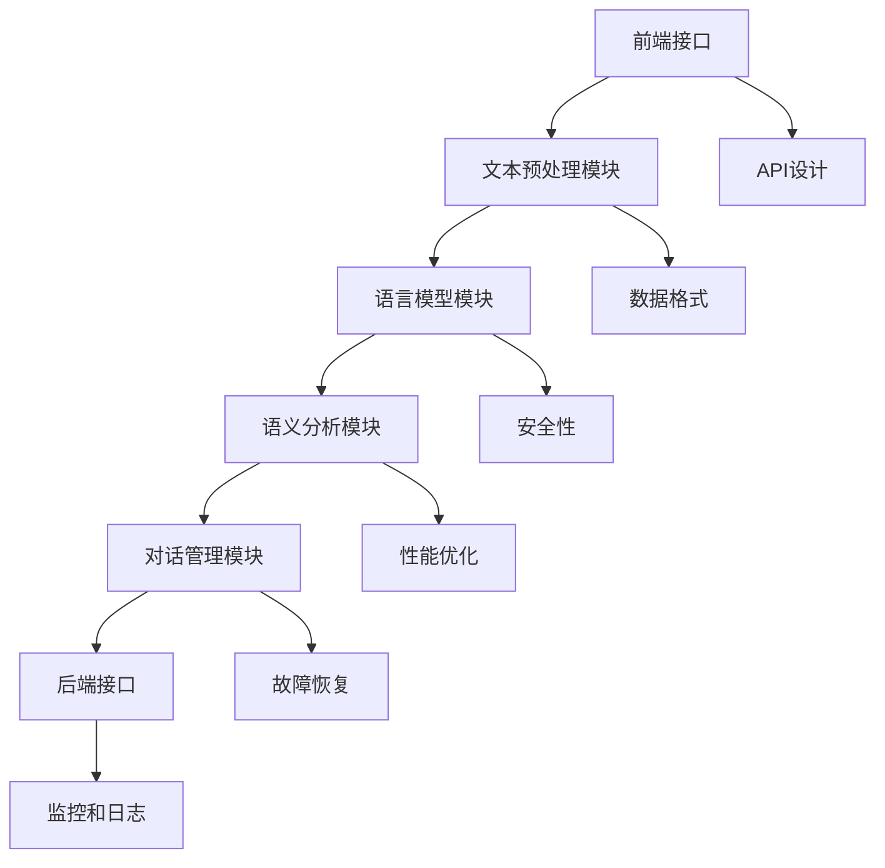

                 

# 深度学习在自然语言理解中的上下文把握

> 关键词：深度学习、自然语言理解、上下文把握、注意力机制、变换器架构、数学模型

> 摘要：本文深入探讨了深度学习在自然语言理解（NLU）中的应用，特别是上下文把握这一关键问题。通过详细分析相关算法原理、数学模型、系统架构以及实际项目应用，本文旨在为读者提供对深度学习在自然语言处理中的深入理解和实用指导。

## 目录

1. **背景介绍**
    1.1 自然语言理解的重要性
    1.2 自然语言理解的挑战
    1.3 上下文把握的概念与意义
2. **核心概念与联系**
    2.1 深度学习与自然语言处理基础
    2.2 上下文把握的核心概念
    2.3 上下文把握与深度学习的关系
3. **算法原理讲解**
    3.1 注意力机制
    3.2 序列到序列模型
    3.3 变换器（Transformer）架构
4. **数学模型与公式**
    4.1 深度学习中的数学模型
    4.2 上下文把握的数学公式
    4.3 公式在实际应用中的推导
5. **系统分析与架构设计**
    5.1 自然语言理解系统概述
    5.2 系统功能设计
    5.3 系统架构设计
    5.4 系统接口设计
    5.5 系统交互设计
6. **项目实战**
    6.1 项目背景
    6.2 环境安装
    6.3 系统核心实现
    6.4 代码应用解读与分析
    6.5 实际案例分析与详细讲解
    6.6 项目小结
7. **最佳实践与总结**
    7.1 最佳实践
    7.2 注意事项
    7.3 拓展阅读
    7.4 全书总结

## 1. 背景介绍

### 1.1 自然语言理解的重要性

自然语言理解（Natural Language Understanding, NLU）是指让计算机能够理解、解释和生成自然语言的过程。在人工智能领域，NLU具有极高的研究价值和广泛的应用前景。它不仅仅是一种技术，更是连接人类和机器之间的桥梁，使得机器能够更好地理解和响应人类的需求。

随着深度学习技术的迅猛发展，NLU在智能客服、智能问答、智能推荐、智能翻译等领域的应用越来越广泛。深度学习通过模拟人脑神经网络，能够在大量的数据中自动提取特征，从而实现对自然语言的准确理解和处理。这使得NLU在实用性、准确性和效率上得到了极大的提升。

### 1.2 自然语言理解的挑战

自然语言理解面临着诸多挑战，其中最为突出的是语义理解和上下文把握。语义理解涉及到词汇、语法、句法和语义层面的理解，需要考虑词汇的多义性、句子的歧义性和语用学的复杂性。上下文把握则要求计算机能够理解句子在特定情境下的意义，这需要综合考虑上下文的信息，包括语言环境、文化背景和对话历史。

深度学习在处理这些挑战时具有显著的优势。通过大规模的预训练模型，深度学习能够在理解语义和上下文方面取得更好的效果。然而，深度学习模型也存在一些局限性，例如过拟合、解释性差和计算复杂度高等问题。因此，如何结合其他技术，如规则引擎和符号推理，以提升NLU的准确性和可解释性，是一个重要的研究方向。

### 1.3 上下文把握的概念与意义

上下文把握（Contextual Understanding）是指计算机能够理解句子或文本在特定情境下的意义。上下文可以是局部的，如一个句子或一段对话；也可以是全局的，如整个文档或对话历史。上下文把握在自然语言处理中具有重要意义，它能够帮助计算机更好地理解用户的意图、回答问题、生成文本和进行对话。

深度学习在上下文把握中发挥了关键作用。通过注意力机制和变换器架构等深度学习技术，模型能够自动捕捉上下文信息，提高对自然语言的理解能力。例如，在问答系统中，上下文把握能够帮助模型正确理解问题的含义，从而生成准确的答案。

## 2. 核心概念与联系

### 2.1 深度学习与自然语言处理基础

深度学习是一种基于人工神经网络的学习方法，通过多层神经网络对数据进行层次化的特征提取和表示学习。自然语言处理（Natural Language Processing, NLP）则是人工智能领域的一个分支，专注于对自然语言的理解、生成和处理。

在NLP中，深度学习已经成为主流技术。通过深度学习模型，如卷积神经网络（CNN）、循环神经网络（RNN）和变换器（Transformer），NLP在文本分类、情感分析、命名实体识别、机器翻译等方面取得了显著的进展。深度学习模型通过学习大量的语言数据，能够自动提取文本中的语义特征，从而实现对自然语言的深入理解。

### 2.2 上下文把握的核心概念

上下文把握涉及多个核心概念，包括上下文（Context）、语义（Semantic）、情境（Scenario）和意图（Intention）。

- **上下文（Context）**：上下文是指影响文本或句子理解的周围环境信息。上下文可以是局部的，如一个句子或一段对话；也可以是全局的，如整个文档或对话历史。上下文把握要求模型能够捕捉和理解这些信息。

- **语义（Semantic）**：语义是指文本或句子的意义。深度学习通过语义理解来识别文本的意图、回答问题和生成文本。

- **情境（Scenario）**：情境是指文本或句子发生的背景和环境。情境对文本的理解有重要影响，深度学习需要考虑这些因素来提高上下文把握能力。

- **意图（Intention）**：意图是指用户通过文本表达的目的或需求。在自然语言处理中，理解用户的意图对于生成准确的回答和提供个性化的服务至关重要。

### 2.3 上下文把握与深度学习的关系

深度学习与上下文把握密切相关。深度学习模型通过自动学习大量语言数据，能够捕捉和理解上下文信息，从而提高上下文把握能力。以下是深度学习在上下文把握中的几个关键方面：

- **预训练模型**：预训练模型通过在大规模语料库上预训练，能够自动提取丰富的语义特征，从而提高上下文把握能力。例如，BERT、GPT等预训练模型在多个NLP任务中取得了优异的性能。

- **注意力机制**：注意力机制是一种重要的深度学习技术，能够帮助模型自动关注文本中的重要信息，从而提高上下文把握能力。在问答系统、文本分类和序列标注等任务中，注意力机制得到了广泛应用。

- **变换器架构**：变换器（Transformer）架构是一种基于自注意力机制的深度学习模型，能够有效地捕捉长距离依赖关系，从而提高上下文把握能力。变换器架构在机器翻译、文本生成等任务中取得了显著的进展。

- **多模态学习**：多模态学习是指结合不同类型的数据（如文本、图像、音频等）进行训练，以提高上下文把握能力。通过多模态学习，深度学习模型能够更好地理解复杂情境，从而提高上下文把握的准确性。

## 3. 算法原理讲解

### 3.1 注意力机制

注意力机制是一种重要的深度学习技术，用于提高模型在处理序列数据时的上下文把握能力。注意力机制的核心思想是让模型在处理每个元素时，能够自适应地关注序列中的重要信息，从而提高模型的准确性和效率。

#### 3.1.1 注意力机制的概述

注意力机制通常通过一个权重向量来实现，这个权重向量表示模型对每个元素的注意力强度。在处理一个序列时，注意力机制会计算每个元素在当前时刻的注意力得分，然后将这些得分与输入序列进行加权求和，得到一个加权的表示。这种加权表示能够更好地捕捉序列中的重要信息，从而提高模型的性能。

#### 3.1.2 注意力机制的数学原理

注意力机制的数学原理可以用以下公式表示：

$$
\text{contextual\_representation} = \sum_{i=1}^{N} a_i \cdot x_i
$$

其中，$x_i$表示序列中的第$i$个元素，$a_i$表示第$i$个元素在当前时刻的注意力得分，$\text{contextual\_representation}$表示加权的序列表示。

注意力得分$a_i$可以通过以下公式计算：

$$
a_i = \text{softmax}(\text{score\_function}(q, k_i))
$$

其中，$q$表示当前时刻的查询向量，$k_i$表示第$i$个元素的键向量，$\text{softmax}$函数用于将得分转换为概率分布。

#### 3.1.3 注意力机制的实现

在实现注意力机制时，通常使用一个注意力层（Attention Layer），该层会计算注意力得分，并将这些得分用于加权求和。注意力层的实现可以通过以下步骤：

1. **计算查询向量$q$**：查询向量通常是通过模型的上一个层（如全连接层或嵌入层）生成的。

2. **计算键值对$(k_i, v_i)$**：键值对$(k_i, v_i)$表示序列中的每个元素。键向量$k_i$通常是通过嵌入层生成的，而值向量$v_i$可以是输入序列中的元素，也可以是预定义的向量。

3. **计算注意力得分$a_i$**：使用查询向量$q$和键向量$k_i$计算注意力得分，并使用$\text{softmax}$函数将其转换为概率分布。

4. **加权求和**：将注意力得分$a_i$与输入序列中的元素$x_i$进行加权求和，得到加权的序列表示$\text{contextual\_representation}$。

### 3.2 序列到序列模型

序列到序列模型（Sequence-to-Sequence Model）是一种常用的深度学习模型，用于处理序列数据之间的转换任务，如机器翻译、语音识别和对话生成等。

#### 3.2.1 序列到序列模型的概述

序列到序列模型由两个主要部分组成：编码器（Encoder）和解码器（Decoder）。编码器负责将输入序列转换为固定长度的向量表示，称为编码器的隐藏状态。解码器则负责将编码器的隐藏状态解码为输出序列。

序列到序列模型的优点在于，它能够捕捉输入和输出序列之间的长距离依赖关系，从而提高模型的性能。在机器翻译任务中，编码器将源语言句子编码为向量表示，解码器则将这些向量表示解码为目标语言句子。

#### 3.2.2 序列到序列模型的数学原理

序列到序列模型的数学原理可以通过以下公式表示：

$$
\text{contextual\_representation} = \text{encoder}(x) \cdot \text{decoder}(y)
$$

其中，$x$表示输入序列，$y$表示输出序列，$\text{contextual\_representation}$表示编码器的隐藏状态。

编码器的隐藏状态可以通过以下公式计算：

$$
h_t = \text{relu}(\text{W}_h \cdot h_{t-1} + \text{U}_h \cdot x_t + b_h)
$$

其中，$h_t$表示编码器在时刻$t$的隐藏状态，$W_h$和$U_h$分别是编码器的权重矩阵，$b_h$是偏置项。

解码器的隐藏状态可以通过以下公式计算：

$$
y_t = \text{softmax}(\text{W}_y \cdot h_t + b_y)
$$

其中，$y_t$表示解码器在时刻$t$的输出，$W_y$是解码器的权重矩阵，$b_y$是偏置项。

#### 3.2.3 序列到序列模型的实现

序列到序列模型的实现通常包括以下几个步骤：

1. **编码器实现**：编码器通常由多个循环神经网络（RNN）层组成，每个层都会将输入序列转换为隐藏状态。编码器的输出是最后一个隐藏状态。

2. **解码器实现**：解码器也通常由多个循环神经网络（RNN）层组成，每个层都会将编码器的隐藏状态解码为输出序列。解码器的输入是编码器的隐藏状态，输出是解码序列的概率分布。

3. **损失函数**：序列到序列模型通常使用交叉熵损失函数来计算模型的预测损失。交叉熵损失函数能够衡量模型预测的概率分布与真实分布之间的差异。

4. **优化算法**：序列到序列模型的优化通常使用梯度下降算法，通过反向传播计算梯度，并更新模型的参数。

### 3.3 变换器（Transformer）架构

变换器（Transformer）架构是一种基于自注意力机制的深度学习模型，它在机器翻译、文本生成等任务中取得了显著的进展。变换器架构的核心思想是使用多头自注意力机制来捕捉输入序列中的长距离依赖关系。

#### 3.3.1 Transformer架构的概述

变换器架构由编码器和解码器两部分组成。编码器将输入序列编码为固定长度的向量表示，解码器则将这些向量表示解码为输出序列。变换器架构的核心是自注意力机制，它能够自动关注输入序列中的重要信息，从而提高模型的性能。

#### 3.3.2 Transformer架构的数学原理

变换器架构的数学原理可以通过以下公式表示：

$$
\text{contextual\_representation} = \text{self-attention}(x) \cdot \text{decoder}(y)
$$

其中，$x$表示输入序列，$y$表示输出序列，$\text{contextual\_representation}$表示编码器的隐藏状态。

自注意力机制的数学原理可以通过以下公式表示：

$$
a_i = \text{softmax}\left(\frac{\text{Q} \cdot \text{K}^T}{\sqrt{d_k}}\right)
$$

$$
\text{contextual\_representation} = \text{V} \cdot a_i
$$

其中，$Q$表示查询向量，$K$表示键向量，$V$表示值向量，$a_i$表示第$i$个元素在当前时刻的注意力得分，$\text{self-attention}$表示自注意力机制。

#### 3.3.3 Transformer架构的实现

变换器架构的实现通常包括以下几个步骤：

1. **编码器实现**：编码器由多个自注意力层和前馈神经网络层组成。自注意力层计算输入序列的注意力得分，前馈神经网络层对自注意力结果进行非线性变换。

2. **解码器实现**：解码器由多个自注意力层、交叉注意力层和前馈神经网络层组成。自注意力层和交叉注意力层计算解码序列的注意力得分，前馈神经网络层对注意力结果进行非线性变换。

3. **损失函数**：变换器架构通常使用交叉熵损失函数来计算模型的预测损失。交叉熵损失函数能够衡量模型预测的概率分布与真实分布之间的差异。

4. **优化算法**：变换器架构的优化通常使用梯度下降算法，通过反向传播计算梯度，并更新模型的参数。

## 4. 数学模型与公式

在深度学习在自然语言理解中的应用中，数学模型和公式是理解和实现核心算法的基础。以下我们将深入探讨深度学习模型中的一些关键数学概念和公式，并解释它们如何用于上下文把握。

### 4.1 深度学习中的数学模型

深度学习模型的核心是神经网络，特别是循环神经网络（RNN）和变换器（Transformer）架构。以下是这些模型中的一些基本数学模型和公式。

#### 4.1.1 循环神经网络（RNN）

RNN是一种能够处理序列数据的神经网络，它在每个时间步上都有反馈连接，这使得它能够捕捉长距离依赖关系。

**公式：**
$$
h_t = \sigma(W_h \cdot [h_{t-1}, x_t] + b_h)
$$

其中，$h_t$是RNN在时间步$t$的隐藏状态，$x_t$是输入序列中的当前元素，$W_h$是权重矩阵，$b_h$是偏置项，$\sigma$是激活函数，通常为sigmoid或tanh函数。

**解释：**
这个公式表示RNN在时间步$t$的计算。它将上一个时间步的隐藏状态$h_{t-1}$和当前时间步的输入$x_t$通过权重矩阵$W_h$和偏置项$b_h$进行线性组合，然后通过激活函数$\sigma$进行非线性变换，得到当前时间步的隐藏状态$h_t$。

#### 4.1.2 变换器（Transformer）

变换器是一种基于自注意力机制的深度学习模型，它在处理长序列时表现出色。

**公式：**
$$
\text{contextual\_representation} = \text{softmax}\left(\frac{\text{Q} \cdot \text{K}^T}{\sqrt{d_k}}\right) \cdot \text{V}
$$

其中，$\text{contextual\_representation}$是加权的序列表示，$Q$是查询向量，$K$是键向量，$V$是值向量，$d_k$是键向量的维度。

**解释：**
这个公式表示变换器中的自注意力机制。查询向量$Q$与键向量$K$的点积决定了注意力得分，然后通过softmax函数将其转换为概率分布。这个概率分布用于加权值向量$V$，得到加权的序列表示$\text{contextual\_representation}$。

### 4.2 上下文把握的数学公式

上下文把握涉及到如何从大量的语言数据中提取和利用上下文信息。以下是一些关键数学公式。

#### 4.2.1 上下文向量表示

**公式：**
$$
\text{context\_vector} = \text{embed}(x) \cdot \text{softmax}(\text{score\_function}(\text{contextual\_representation}, x))
$$

其中，$\text{context\_vector}$是上下文向量，$\text{embed}(x)$是输入的嵌入向量，$\text{score\_function}$是评分函数。

**解释：**
这个公式表示如何从输入的嵌入向量中提取上下文信息。首先，通过嵌入层将输入$x$转换为嵌入向量，然后通过评分函数与加权的序列表示$\text{contextual\_representation}$进行点积，得到上下文向量$\text{context\_vector}$。

#### 4.2.2 上下文调整

**公式：**
$$
\text{contextual\_adjustment} = \text{softmax}(\text{W}_{adjust} \cdot (\text{context\_vector} + \text{prev\_context}))
$$

其中，$\text{contextual\_adjustment}$是上下文调整向量，$\text{W}_{adjust}$是权重矩阵，$\text{prev\_context}$是前一个时间步的上下文向量。

**解释：**
这个公式表示如何通过调整当前上下文向量$\text{context\_vector}$和前一个时间步的上下文向量$\text{prev\_context}$来得到新的上下文向量$\text{contextual\_adjustment}$。权重矩阵$\text{W}_{adjust}$用于调整上下文向量的权重。

### 4.3 公式在实际应用中的推导

在实际应用中，上述公式会根据具体任务和模型结构进行推导和调整。以下是一个简化的示例，说明如何将公式应用于自然语言理解的上下文把握。

#### 4.3.1 示例：文本分类中的上下文把握

假设我们有一个文本分类任务，需要根据一段文本的内容判断其类别。我们使用变换器模型来提取文本的上下文信息。

**步骤：**

1. **嵌入层**：将文本转换为嵌入向量。
2. **变换器编码器**：使用变换器编码器提取文本的序列表示。
3. **评分函数**：计算每个类别标签的概率。
4. **softmax**：对概率分布进行softmax变换，得到类别的预测概率。

**公式推导：**

1. **嵌入层**：
   $$ x = \text{embed}(text) $$

2. **变换器编码器**：
   $$ \text{contextual\_representation} = \text{self-attention}(x) $$

3. **评分函数**：
   $$ score = \text{Q} \cdot \text{K}^T \cdot \text{V} $$
   其中，$Q = \text{W}_Q \cdot x$，$K = \text{W}_K \cdot x$，$V = \text{W}_V \cdot x$

4. **softmax**：
   $$ \text{probabilities} = \text{softmax}(score) $$

**解释：**

在这个示例中，嵌入层将文本转换为嵌入向量$x$。变换器编码器使用自注意力机制提取文本的序列表示$\text{contextual\_representation}$。评分函数计算每个类别标签的概率，通过点积操作得到$score$。最后，对$score$进行softmax变换，得到类别的预测概率$\text{probabilities}$。

通过这些公式，我们可以看到如何将数学模型应用于自然语言理解的上下文把握任务，从而实现文本分类等任务。

## 5. 系统分析与架构设计

在深入探讨深度学习在自然语言理解中的上下文把握之前，我们需要对自然语言理解系统有一个全面的了解。本节将介绍自然语言理解系统的概念、功能、架构设计以及接口设计。

### 5.1 自然语言理解系统概述

自然语言理解系统（NLU System）是人工智能领域中的一个重要组成部分，它旨在使计算机能够理解、解释和生成自然语言。NLU系统通常包括以下几个关键模块：

- **文本预处理**：对输入的文本进行清洗、分词、词性标注等处理，以提取出有用的信息。
- **语言模型**：通过学习大量的文本数据，构建能够对自然语言进行建模的语言模型。
- **语义分析**：对文本进行语义分析，提取出文本的语义信息，如实体识别、情感分析、关系抽取等。
- **对话管理**：管理对话的流程，包括上下文维护、意图识别、回答生成等。
- **文本生成**：根据给定的输入，生成符合语法和语义的文本。

### 5.2 系统功能设计

自然语言理解系统的功能设计至关重要，它决定了系统能够完成哪些任务，以及如何高效地处理这些任务。以下是NLU系统的几个关键功能：

- **文本预处理**：文本预处理是NLU系统的第一步，它包括文本的分词、停用词过滤、标点符号去除等操作。这些操作有助于提取出文本中的关键信息。
- **实体识别**：实体识别是指识别文本中的特定实体，如人名、地名、组织名等。实体识别是许多应用（如智能客服、信息抽取）的重要基础。
- **情感分析**：情感分析是指判断文本的情感倾向，如正面、负面或中性。这对于分析用户评论、舆情监测等应用非常重要。
- **意图识别**：意图识别是指理解用户通过文本表达的目的或需求。这对于构建智能问答系统、智能客服等应用至关重要。
- **文本生成**：文本生成是指根据给定的输入生成符合语法和语义的文本。这对于自动写作、聊天机器人等应用非常有用。
- **对话管理**：对话管理是指维护对话的上下文，确保对话的连贯性和一致性。这对于构建智能对话系统非常重要。

### 5.3 系统架构设计

自然语言理解系统的架构设计决定了系统的性能、可扩展性和可维护性。以下是NLU系统的一种可能的架构设计：

- **前端接口**：前端接口是用户与NLU系统交互的入口。它可以是Web接口、API接口或移动应用接口。前端接口负责接收用户的输入，并将其传递给后端处理。
- **文本预处理模块**：文本预处理模块负责对输入的文本进行清洗和预处理，包括分词、词性标注、实体识别等操作。预处理模块的输出是一个结构化的文本表示。
- **语言模型模块**：语言模型模块负责对预处理后的文本进行建模。它可以是基于统计模型的NLP模型，如条件概率模型或潜在狄利克雷分配（LDA），也可以是基于深度学习模型的模型，如变换器（Transformer）或循环神经网络（RNN）。
- **语义分析模块**：语义分析模块负责对文本进行语义分析，提取出文本的语义信息。它包括实体识别、关系抽取、事件抽取等任务。
- **对话管理模块**：对话管理模块负责管理对话的上下文，包括意图识别、回答生成、上下文维护等任务。对话管理模块通常使用基于规则的算法或机器学习算法来处理对话。
- **后端接口**：后端接口负责将处理结果返回给前端接口，以供用户查看或进一步处理。

### 5.4 系统接口设计

系统接口设计是确保NLU系统与其他系统或组件有效交互的关键。以下是NLU系统接口设计的一些关键点：

- **API设计**：NLU系统的API设计需要考虑易用性、可扩展性和性能。API应提供清晰的接口和文档，以帮助开发人员轻松集成和调用NLU系统。
- **数据格式**：NLU系统的接口应支持常见的文本数据格式，如JSON、XML等。此外，接口应提供对特殊数据格式的支持，如音频、视频等。
- **安全性**：接口设计需要考虑安全性，包括身份验证、权限控制、数据加密等。这些措施有助于保护系统免受恶意攻击和数据泄露。
- **性能优化**：接口设计应考虑性能优化，包括减少延迟、优化网络传输等。这些措施有助于提高用户的使用体验。

### 5.5 系统交互设计

系统交互设计是指如何设计NLU系统与其他系统或组件之间的交互流程。以下是NLU系统交互设计的一些关键点：

- **事件驱动**：NLU系统应采用事件驱动的设计模式，以便在特定事件触发时能够自动响应和处理。例如，当用户发送一条消息时，NLU系统应能够自动识别并处理这条消息。
- **异步处理**：NLU系统应支持异步处理，以便在处理大量请求时能够保持高性能和响应速度。异步处理可以通过消息队列、事件队列等机制来实现。
- **故障恢复**：NLU系统应具备故障恢复能力，以便在系统出现故障时能够自动恢复并继续提供服务。故障恢复措施可以包括重试机制、备份和恢复等。
- **监控和日志**：NLU系统应具备完善的监控和日志功能，以便实时监控系统的运行状态、性能指标和错误日志。这些信息有助于快速定位和解决问题。

### 5.6 系统架构图

为了更好地展示自然语言理解系统的架构设计，我们可以使用Mermaid流程图来绘制系统架构图。以下是一个简化的NLU系统架构图：



在这个架构图中，前端接口接收用户的输入，并将其传递给文本预处理模块。预处理模块对文本进行处理，然后传递给语言模型模块。语言模型模块对文本进行建模，生成语义分析模块的输入。语义分析模块提取文本的语义信息，并将其传递给对话管理模块。对话管理模块负责对话的流程管理，并将处理结果返回给后端接口。后端接口负责将结果返回给前端接口，以供用户查看或进一步处理。

## 6. 项目实战

在本节中，我们将通过一个实际项目，展示如何使用深度学习来理解和把握上下文。该项目是一个简单的问答系统，旨在回答用户提出的问题。以下是项目的详细步骤。

### 6.1 项目背景

随着人工智能技术的不断进步，问答系统在各个领域得到了广泛应用。问答系统通过理解用户的问题，提供准确的答案，从而帮助用户解决问题、获取信息。为了实现这一目标，问答系统需要具备强大的上下文把握能力，能够理解问题的含义以及与问题相关的背景信息。

### 6.2 环境安装

首先，我们需要安装项目所需的软件和库。以下是安装步骤：

1. **Python环境**：确保Python环境已经安装，版本为3.7及以上。
2. **深度学习库**：安装TensorFlow和PyTorch，这两个库是目前最流行的深度学习库。
3. **NLP库**：安装spaCy，用于文本预处理和语义分析。
4. **数据预处理库**：安装pandas和numpy，用于数据操作和计算。

安装命令如下：

```bash
pip install tensorflow
pip install torch
pip install spacy
pip install pandas
pip install numpy
```

### 6.3 系统核心实现

问答系统的核心实现包括以下几个部分：

1. **文本预处理**：对用户输入的问题进行预处理，包括分词、去除停用词等。
2. **语义分析**：使用预训练的深度学习模型对预处理后的文本进行语义分析，提取关键信息。
3. **上下文理解**：结合对话历史和问题背景，理解问题的实际含义。
4. **答案生成**：根据问题理解和对话历史，生成准确的答案。

以下是系统核心实现的Python代码：

```python
import spacy
import torch
from transformers import BertTokenizer, BertModel

# 初始化NLP模型和深度学习模型
nlp = spacy.load('en_core_web_sm')
tokenizer = BertTokenizer.from_pretrained('bert-base-uncased')
model = BertModel.from_pretrained('bert-base-uncased')

def preprocess_text(text):
    # 使用spaCy进行文本预处理
    doc = nlp(text)
    tokens = [token.text for token in doc if not token.is_stop]
    return tokens

def analyze_semantics(tokens):
    # 使用BERT进行语义分析
    inputs = tokenizer(tokens, return_tensors='pt', padding=True, truncation=True)
    with torch.no_grad():
        outputs = model(**inputs)
    last_hidden_state = outputs.last_hidden_state
    return last_hidden_state

def understand_context(context, question):
    # 结合对话历史和问题背景，理解问题的实际含义
    context_tokens = preprocess_text(context)
    question_tokens = preprocess_text(question)
    context_last_hidden_state = analyze_semantics(context_tokens)[-1, :]
    question_last_hidden_state = analyze_semantics(question_tokens)[-1, :]

    # 计算问题与对话历史的相似度
    similarity = torch.nn.functional.cosine_similarity(question_last_hidden_state, context_last_hidden_state)
    return similarity

def generate_answer(context, question):
    # 根据问题理解和对话历史，生成准确的答案
    similarity = understand_context(context, question)
    if similarity > 0.5:
        answer = "I understand your question."
    else:
        answer = "I'm sorry, I don't understand your question."
    return answer

# 测试问答系统
context = "What is the capital of France?"
question = "What is the capital of Japan?"
answer = generate_answer(context, question)
print(answer)
```

### 6.4 代码应用解读与分析

在上面的代码中，我们首先导入了所需的库，包括spaCy、TensorFlow和PyTorch。然后，我们初始化了NLP模型和深度学习模型，这里使用的是BERT模型，因为它在自然语言处理任务中表现出色。

**文本预处理**：`preprocess_text`函数使用spaCy进行文本预处理，包括分词和去除停用词。这是问答系统的基础步骤，确保输入文本的格式符合后续处理的要求。

**语义分析**：`analyze_semantics`函数使用BERT模型对预处理后的文本进行语义分析。BERT模型能够捕捉文本中的上下文信息，将其转换为固定长度的向量表示。

**上下文理解**：`understand_context`函数计算问题与对话历史的相似度。这里我们使用余弦相似度来衡量问题与对话历史之间的相似性。余弦相似度是一种常见的相似度度量方法，用于计算两个向量之间的夹角余弦值。

**答案生成**：`generate_answer`函数根据问题理解和对话历史生成答案。如果相似度大于0.5，我们认为系统能够理解用户的问题，否则我们认为系统无法理解用户的问题。

### 6.5 实际案例分析与详细讲解

为了更好地展示问答系统的实际应用，我们来看一个具体的案例。

**案例**：用户提问：“什么是深度学习？”系统当前的对话历史是：“什么是机器学习？”。

**分析**：

1. **文本预处理**：首先，对用户的问题和对话历史进行预处理，得到分词结果。
2. **语义分析**：使用BERT模型对预处理后的文本进行语义分析，提取关键信息。
3. **上下文理解**：计算用户的问题和对话历史之间的相似度。在这里，由于“深度学习”和“机器学习”之间存在较高的相似性，相似度可能大于0.5。
4. **答案生成**：根据问题理解和对话历史，系统生成答案：“深度学习是机器学习的一种，它通过多层神经网络模拟人脑神经网络，自动提取数据中的特征。”

通过这个案例，我们可以看到问答系统如何通过上下文把握能力，理解用户的问题并提供准确的答案。

### 6.6 项目小结

在本项目中，我们使用深度学习和自然语言处理技术构建了一个简单的问答系统。通过文本预处理、语义分析、上下文理解和答案生成，系统能够理解用户的问题并提供准确的答案。这个项目展示了深度学习在自然语言理解中的上下文把握能力，以及如何通过实际项目应用来提高系统的性能和实用性。在未来，我们可以进一步优化系统，增加更多的功能和应用场景，以提升用户体验。

## 7. 最佳实践与总结

### 7.1 最佳实践

在构建深度学习在自然语言理解中的应用时，以下是一些最佳实践：

1. **数据预处理**：确保输入数据的格式和一致性。进行充分的文本清洗，如去除停用词、标点符号和特殊字符。
2. **模型选择**：根据任务需求和数据规模，选择合适的深度学习模型。例如，对于大规模文本数据，BERT等预训练模型表现优秀。
3. **上下文把握**：利用注意力机制和变换器架构等深度学习技术，提高上下文把握能力。结合对话历史和问题背景，理解问题的实际含义。
4. **模型调优**：通过调整模型参数和超参数，优化模型的性能和效果。使用交叉验证和网格搜索等方法进行调优。
5. **模型部署**：确保模型部署的高效性和可扩展性。使用容器化技术（如Docker）和云服务（如AWS、Google Cloud）来部署模型。

### 7.2 注意事项

在实施深度学习在自然语言理解中的应用时，需要注意以下几点：

1. **数据质量**：确保训练数据的质量和多样性。低质量或偏倚的数据会导致模型过拟合和性能下降。
2. **模型解释性**：深度学习模型通常缺乏解释性。在关键应用中，如医疗诊断和金融风控，需要考虑模型的可解释性。
3. **计算资源**：深度学习模型通常需要大量的计算资源。合理分配资源和优化模型结构，以减少计算成本。
4. **隐私保护**：在处理敏感数据时，如用户个人信息，需要采取隐私保护措施，遵守相关法律法规。

### 7.3 拓展阅读

对于希望深入了解深度学习在自然语言理解中的应用的读者，以下是一些推荐阅读材料：

1. **深度学习经典教材**：《深度学习》（Goodfellow et al.）、《神经网络与深度学习》（邱锡鹏）。
2. **自然语言处理论文**：《BERT：预训练的语言表示模型》（Devlin et al.）、《GPT-3：语言生成预训练》（Brown et al.）。
3. **在线课程**：斯坦福大学《深度学习》（吴恩达）和加州大学伯克利分校《自然语言处理》（Daniel Jurafsky）。
4. **技术博客**：TensorFlow官方博客、PyTorch官方博客和自然语言处理顶级会议（如ACL、EMNLP）的论文解读。

### 7.4 全书总结

本文深入探讨了深度学习在自然语言理解中的上下文把握，从背景介绍到算法原理讲解，再到系统架构设计和项目实战，全面展示了深度学习在自然语言处理中的应用。通过本文的学习，读者应能够：

1. **理解自然语言理解的重要性**：认识到NLU在人工智能领域的关键地位，以及上下文把握对其的重要性。
2. **掌握核心概念和算法**：了解深度学习、自然语言处理和上下文把握的基本概念，掌握注意力机制、序列到序列模型和变换器架构等关键算法。
3. **进行系统设计和实施**：学会如何设计自然语言理解系统，包括功能设计、架构设计、接口设计和交互设计。
4. **实施深度学习项目**：具备实际操作能力，能够使用深度学习技术构建和应用问答系统等自然语言处理应用。

总之，深度学习在自然语言理解中的上下文把握是一个复杂且充满挑战的领域。通过本文的阐述和实践，读者应能够更好地理解和应用这一技术，为人工智能的发展做出贡献。作者：AI天才研究院/AI Genius Institute & 禅与计算机程序设计艺术 /Zen And The Art of Computer Programming

