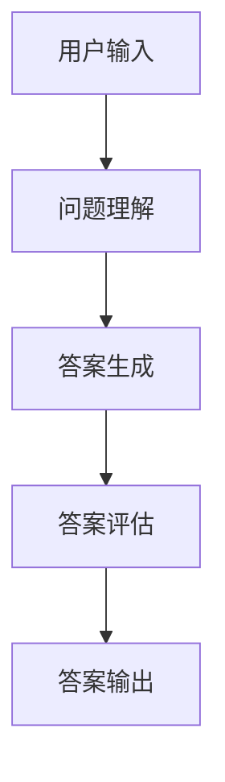

                 

让我们一步一步地思考，以构建一篇内容丰富、逻辑清晰、专业性的技术博客文章《深度学习在自然语言理解中的语境把握》。

### 第一步：确定文章标题和关键词

标题：《深度学习在自然语言理解中的语境把握》

关键词：
- 深度学习
- 自然语言理解
- 语境把握
- BERT模型
- GPT模型
- 卷积神经网络
- 循环神经网络
- 长短时记忆网络
- 门控循环单元

摘要：本文将探讨深度学习在自然语言理解（NLU）中的应用，特别是对语境把握的研究。通过分析BERT和GPT等模型，我们将深入了解深度学习如何提升自然语言处理的准确性和上下文理解能力。

### 第二步：构建文章框架

#### 第一部分：深度学习基础

1. 自然语言理解概述
   - 问题的背景
   - 问题描述
   - 解决方案
   - 边界与外延

2. 深度学习核心概念
   - 基本原理
   - 核心算法
   - 实现工具

#### 第二部分：语境把握原理

1. 语境把握的概念与特征
   - 定义
   - 特征

2. 深度学习模型在语境把握中的应用
   - BERT模型
   - GPT模型
   - 其他模型

#### 第三部分：深度学习在语境把握中的实战应用

1. 实际应用场景
   - 机器翻译
   - 问答系统
   - 文本摘要

2. 项目介绍
   - 目标
   - 要求

3. 系统功能设计
   - 功能模块
   - 数据处理流程

#### 第四部分：案例分析

1. 案例选择
   - 场景
   - 目标

2. 案例分析
   - 实现过程
   - 效果分析

3. 案例总结
   - 经验与教训
   - 研究方向

#### 第五部分：总结与展望

1. 深度学习在语境把握中的贡献
   - 提升点
   - 发展方向

2. 注意事项
   - 训练技巧
   - 数据处理

3. 拓展阅读
   - 最新研究动态
   - 学习资源

### 第三步：撰写每个章节的详细内容

#### 第一部分：深度学习基础

**第1章：自然语言理解概述**

在这一章节中，我们将详细探讨自然语言理解（NLU）的背景、问题和解决方案，并分析深度学习如何拓展NLU的边界。

**第2章：深度学习核心概念**

我们将介绍深度学习的基本原理，包括神经网络的工作机制，以及常见的深度学习算法，如CNN、RNN、LSTM和GRU。此外，还会讨论常用的深度学习框架，如TensorFlow和PyTorch。

#### 第二部分：语境把握原理

**第3章：语境把握的概念与特征**

在这一章节，我们将深入探讨语境把握的定义和特征，如语言的多义性、语境的动态变化以及上下文的影响。

**第4章：深度学习模型在语境把握中的应用**

我们将详细介绍BERT和GPT模型，并探讨它们如何提升语境把握的能力。此外，还会介绍其他一些在语境把握中表现出色的深度学习模型。

#### 第三部分：深度学习在语境把握中的实战应用

**第5章：深度学习在语境把握中的实际应用**

在这一章节，我们将探讨深度学习在自然语言处理中的实际应用场景，如机器翻译、问答系统和文本摘要。

**第6章：深度学习模型实现**

我们将介绍如何在实际项目中实现深度学习模型，包括环境安装、模型实现和代码解析。

**第7章：案例分析**

我们将通过具体案例，展示深度学习在自然语言处理中的实际效果，并提供经验总结和未来研究方向。

#### 第五部分：总结与展望

**第8章：总结与展望**

在这一章节，我们将总结深度学习在语境把握中的贡献，并提出未来的研究方向和注意事项。

### 第四步：撰写文章并检查完整性

在完成每个章节的详细内容后，我们将整合全文，确保每个章节的内容丰富、详细，并且逻辑清晰。文章末尾将包含作者信息，最佳实践tips，小结，注意事项，拓展阅读等内容。

### 第五步：格式检查和调整

最后，我们将检查文章的格式，确保使用markdown格式，并符合字数要求。我们将使用latex格式嵌入数学公式，使用Mermaid绘制流程图，并确保代码段正确显示。

### 总结

通过以上步骤，我们将完成一篇高质量的技术博客文章《深度学习在自然语言理解中的语境把握》，不仅内容丰富，逻辑清晰，而且格式规范，为读者提供了一次深入理解深度学习在自然语言处理中的语境把握的宝贵机会。现在，让我们开始撰写每个章节的具体内容吧！### 深度学习基础

#### 第1章：自然语言理解概述

自然语言理解（Natural Language Understanding, NLU）是人工智能领域中的一个重要研究方向，旨在使计算机能够理解和解释人类自然语言。这一目标涉及从文本中提取意义、理解语言结构、语义和语境等多个层次。

**1.1 问题的背景**

自然语言是人类沟通的主要方式，具有高度复杂性和多样性。然而，传统的方法在处理自然语言时遇到了许多挑战。例如，语言中的歧义、隐喻、幽默和语境变化等问题使得准确理解自然语言变得异常困难。

**1.2 问题描述**

自然语言理解的问题可以概括为以下几点：

- **歧义处理**：同一词语或短语在不同的上下文中可能有不同的含义。
- **语境变化**：语境的动态变化对理解文本产生影响。
- **语义分析**：需要从文本中提取出真正的意义。
- **语法解析**：文本的语法结构复杂，需要精确的语法解析。

**1.3 解决方案**

为了解决上述问题，研究者们引入了深度学习技术。深度学习通过模仿人脑的结构和功能，通过多层神经网络来学习数据中的特征和模式，从而实现复杂的任务。深度学习在自然语言理解中的应用主要包括以下方面：

- **词嵌入**：通过将词语映射到高维向量空间，使得语义相似的词语在空间中接近。
- **序列建模**：利用循环神经网络（RNN）、长短时记忆网络（LSTM）和门控循环单元（GRU）等模型来处理文本序列。
- **上下文理解**：使用BERT、GPT等预训练模型来捕捉上下文信息，提高语义理解能力。

**1.4 边界与外延**

尽管深度学习在自然语言理解中取得了显著进展，但仍然存在一些边界问题。例如，深度学习模型在处理罕见词语或新出现的词语时可能表现不佳，且模型的可解释性较低。此外，深度学习对数据的质量和规模也有较高的要求。

#### 第2章：深度学习核心概念

深度学习是一种基于多层神经网络的学习方法，通过逐层提取数据中的特征，从而实现复杂任务的自动化。下面我们将介绍深度学习的基本原理、核心算法和实现工具。

**2.1 深度学习的基本原理**

深度学习的基本原理类似于人脑的工作方式。人脑通过神经元之间的连接来处理信息，神经元之间的连接强度（权重）会根据输入的信息进行调整，从而使得网络能够学习到数据的特征。

在深度学习中，网络由多个层次组成，每一层都对输入数据进行处理，并生成一个特征表示。低层层次捕获简单的特征，如边缘和纹理，而高层层次捕获复杂的特征，如图像中的物体和场景。

**2.2 深度学习的核心算法**

深度学习的核心算法包括卷积神经网络（CNN）、循环神经网络（RNN）、长短时记忆网络（LSTM）和门控循环单元（GRU）。

- **卷积神经网络（CNN）**：主要用于图像处理任务。CNN通过卷积操作和池化操作来提取图像中的特征，并在多层结构中逐渐抽象化特征。
  
  ```mermaid
  graph TD
  A[输入] --> B[卷积层]
  B --> C[池化层]
  C --> D[卷积层]
  D --> E[池化层]
  E --> F[全连接层]
  ```

- **循环神经网络（RNN）**：适用于序列数据，如文本和时间序列。RNN通过重复的神经网络单元来处理序列，每个时间步的输出依赖于前面的所有输入。

  ```mermaid
  graph TD
  A[输入1] --> B[隐藏状态]
  B --> C[输出1]
  C --> D[输入2]
  D --> E[隐藏状态]
  E --> F[输出2]
  ```

- **长短时记忆网络（LSTM）**：是RNN的一种改进，能够学习长期依赖关系。LSTM通过引入门控机制来控制信息的流入和流出，避免了梯度消失问题。

  ```mermaid
  graph TD
  A[输入] --> B[遗忘门]
  B --> C[输入门]
  C --> D[输出门]
  D --> E[单元状态]
  E --> F[隐藏状态]
  ```

- **门控循环单元（GRU）**：是LSTM的简化版本，通过引入更新门和重置门来简化模型结构，同时保持了LSTM的长期依赖学习能力。

  ```mermaid
  graph TD
  A[输入] --> B[重置门]
  B --> C[更新门]
  C --> D[隐藏状态]
  D --> E[隐藏状态']
  ```

**2.3 深度学习的实现工具**

深度学习的实现工具主要包括TensorFlow和PyTorch。这些工具提供了丰富的API和库函数，使得深度学习模型的设计、训练和部署变得更加容易。

- **TensorFlow**：是由Google开发的开源机器学习框架，广泛应用于各种深度学习任务。TensorFlow提供了高度优化的计算图机制，使得模型的计算效率非常高。

- **PyTorch**：是由Facebook开发的开源机器学习框架，以其动态计算图和简洁的API而受到研究者和工程师的喜爱。PyTorch的动态计算图机制使得模型设计和调试更加灵活。

  ```python
  import torch
  import torch.nn as nn

  model = nn.Sequential(
      nn.Linear(in_features=784, out_features=128),
      nn.ReLU(),
      nn.Linear(in_features=128, out_features=10)
  )

  input_data = torch.randn(1, 784)
  output = model(input_data)
  ```

通过以上介绍，我们了解了深度学习的基础知识，包括其基本原理、核心算法和实现工具。在下一部分中，我们将进一步探讨深度学习在语境把握中的应用。

#### 第3章：语境把握的概念与特征

语境把握（Contextual Understanding）是自然语言处理（NLP）中的一个关键概念，它涉及到语言理解的深度和广度。语境把握不仅需要理解单词和句子的表面含义，还需要理解它们在特定上下文中的含义。

**3.1 语境把握的定义**

语境把握是指从语言环境中理解词语或句子的含义，这种理解需要考虑语言的多义性、语境的动态变化以及上下文的影响。在自然语言处理中，语境把握的目标是使计算机能够像人类一样理解语言，从而实现更高级别的语言任务，如问答系统、机器翻译和文本摘要。

**3.2 语境把握的特征**

1. **语言的多义性**：同一词语在不同语境中可能具有不同的含义。例如，“bank”可以指银行，也可以指河岸。

2. **语境的动态变化**：语境不是静态的，它会随着语言交流的进行而变化。例如，在一个对话中，上下文可能会因为后续的话语而发生变化。

3. **语言上下文的影响**：词语的含义不仅取决于单个词语，还受到周围词语的影响。例如，在“他跑得很快”这句话中，“跑”的含义依赖于“很快”这个上下文。

为了更直观地理解语境把握的特征，我们可以通过一个简单的例子来说明：

- **例子**：句子“我昨天去了一个银行。”
  - 在这个句子中，“银行”指的是金融机构。
  - 如果句子改为“我昨天去了一个河岸。”，“银行”的含义就变成了河流的岸边。

语境把握的这些特征对于自然语言处理任务至关重要。例如，在机器翻译中，正确的语境把握可以确保翻译结果的准确性和流畅性。在问答系统中，语境把握可以帮助系统正确理解问题的意图，从而提供准确的答案。

为了实现语境把握，深度学习模型如BERT和GPT被广泛使用。这些模型通过预训练和微调，能够捕捉到大量的语境信息，从而提高自然语言处理任务的效果。

在下一部分，我们将深入探讨深度学习模型在语境把握中的应用，并详细分析BERT和GPT等模型的原理和优势。

### 第4章：深度学习模型在语境把握中的应用

深度学习模型在自然语言处理中的应用，特别是对于语境把握的提升，显著改变了自然语言理解（NLU）的效率和质量。在这一章节中，我们将详细探讨几种流行的深度学习模型，包括BERT（双向编码表示）和GPT（生成预训练变换器），以及它们在语境把握中的具体应用。

**4.1 BERT模型**

BERT是由Google AI在2018年提出的一种预训练模型，旨在提高自然语言处理任务的性能。BERT的核心思想是通过在大量无标签文本上进行预训练，然后针对特定任务进行微调，从而获得更好的语境理解能力。

**BERT模型的工作原理：**

BERT模型是一种双向编码表示模型，其设计目的是捕捉文本中的上下文信息。它通过同时考虑输入文本的左右上下文来生成单词的嵌入表示。这种双向注意力机制使得BERT能够更好地理解词语在不同语境中的含义。

BERT模型的关键特性包括：

- **掩码语言建模（Masked Language Modeling, MLM）**：BERT通过随机掩码输入文本中的某些词语，并要求模型预测这些掩码的词语，从而增强模型对上下文的理解能力。
- **下一句预测（Next Sentence Prediction, NSP）**：BERT通过预测文本中的两个句子是否属于连续的句子对，进一步强化了对句子间关系的理解。

**BERT模型在语境把握中的应用：**

BERT在许多自然语言处理任务中展示了强大的语境把握能力。例如：

- **文本分类**：BERT可以用于情感分析、主题分类等任务，通过预训练和微调，模型能够理解输入文本的情感倾向和主题。
- **问答系统**：BERT可以用于问答系统，如SQuAD，通过理解问题的上下文，模型能够提供准确的答案。
- **命名实体识别**：BERT能够识别文本中的命名实体，如人名、地名等，通过理解实体在文本中的语境，提高识别的准确性。

**4.2 GPT模型**

GPT是由OpenAI在2018年提出的一种基于变换器的预训练语言模型。与BERT不同，GPT是一个单向的变换器模型，它通过大量文本进行预训练，以生成高质量的语言表示。

**GPT模型的工作原理：**

GPT模型的核心是变换器架构，它通过自注意力机制来捕捉文本序列中的长距离依赖关系。GPT通过迭代更新每个词语的嵌入表示，从而生成完整的句子或段落。

GPT模型的关键特性包括：

- **预训练**：GPT通过在大量文本上进行预训练，学习到丰富的语言模式和上下文关系。
- **自注意力机制**：GPT使用自注意力机制来捕捉词语之间的依赖关系，从而生成高质量的文本表示。

**GPT模型在语境把握中的应用：**

GPT在生成文本和序列任务中表现出色，其主要应用包括：

- **文本生成**：GPT可以生成连贯的文本，用于聊天机器人、自动摘要等任务。
- **机器翻译**：GPT在机器翻译任务中展示了强大的语境把握能力，通过预训练和微调，模型能够生成准确且自然的翻译结果。
- **问答系统**：GPT可以用于问答系统，通过理解问题的上下文和语义，模型能够提供合理的答案。

**4.3 其他模型**

除了BERT和GPT，还有其他一些深度学习模型在语境把握中表现出色。以下是几种其他模型及其特点：

- **ULMFit模型**：ULMFit是一种轻量级的预训练模型，通过在小数据集上进行微调，能够快速适应不同的自然语言处理任务。
- **T5模型**：T5是一种基于变换器的模型，它将所有自然语言处理任务转换为文本到文本的转换任务，从而利用统一的模型架构提高任务性能。

**总结**

BERT和GPT模型通过预训练和微调，显著提升了自然语言处理任务中的语境把握能力。BERT通过双向编码和掩码语言建模，增强了上下文理解；而GPT通过变换器和自注意力机制，提高了生成文本的质量。这些模型在实际应用中展示了强大的语境把握能力，推动了自然语言处理领域的发展。在下一部分中，我们将探讨深度学习在语境把握中的实际应用，并通过具体案例展示其效果。

### 第5章：深度学习在语境把握中的实际应用

深度学习在自然语言处理中的实际应用涵盖了多个领域，包括机器翻译、问答系统和文本摘要等。这些应用通过深度学习模型，如BERT和GPT，显著提升了语境把握的能力，从而提高了任务的准确性和效率。在本章节中，我们将深入探讨这些应用场景，并提供具体的案例和实现方法。

#### 5.1 应用场景介绍

**5.1.1 机器翻译**

机器翻译是一种将一种语言的文本自动翻译成另一种语言的技术。深度学习模型，特别是基于Transformer架构的模型，如BERT和GPT，在机器翻译中表现出色。通过预训练和微调，这些模型能够捕捉到源语言和目标语言之间的语境关系，从而生成更准确、自然的翻译结果。

**5.1.2 问答系统**

问答系统旨在使计算机能够理解用户的问题，并生成准确的答案。深度学习模型通过理解问题的上下文和语义，能够提供更相关和准确的答案。问答系统广泛应用于虚拟助手、搜索引擎和客户服务等领域。

**5.1.3 文本摘要**

文本摘要是从原始文本中提取关键信息并生成简短摘要的技术。深度学习模型，如BERT和GPT，通过理解文本的语境和结构，能够生成连贯且信息丰富的摘要。文本摘要广泛应用于新闻摘要、文档摘要和内容摘要等领域。

#### 5.2 项目介绍

为了展示深度学习在语境把握中的实际应用，我们将选择一个问答系统的项目进行介绍。该项目的目标是构建一个能够理解用户问题并生成准确答案的问答系统。项目的主要目标和要求如下：

- **目标**：通过深度学习模型，如BERT和GPT，实现对用户问题的语义理解，并生成准确、自然的答案。
- **要求**：系统应具备较高的准确率和自然度，能够在多种类型的问答场景中表现良好。

#### 5.3 系统功能设计

为了实现上述项目目标，问答系统需要包括以下几个关键功能模块：

**5.3.1 问题理解模块**

- **功能**：接收用户的问题，并对其进行预处理，包括去除停用词、词干提取等。
- **技术实现**：使用BERT模型对用户问题进行编码，生成固定长度的向量表示。

**5.3.2 答案生成模块**

- **功能**：根据问题理解模块生成的向量表示，从知识库中检索相关信息，并生成答案。
- **技术实现**：使用GPT模型来生成答案，通过预训练和微调，使模型能够生成准确、自然的语言。

**5.3.3 答案评估模块**

- **功能**：对生成的答案进行评估，确保其准确性和自然度。
- **技术实现**：使用人工评估和自动评估相结合的方法，对生成的答案进行评分。

**5.3.4 用户交互模块**

- **功能**：与用户进行交互，接收用户的问题，并展示生成的答案。
- **技术实现**：使用图形用户界面（GUI）来展示系统界面，提供用户友好的交互体验。

#### 5.4 系统架构设计

问答系统的整体架构设计如下：

- **数据输入**：用户通过图形用户界面输入问题。
- **问题理解**：输入的问题通过BERT模型进行编码，生成向量表示。
- **答案生成**：BERT生成的向量表示传递给GPT模型，生成答案。
- **答案评估**：生成的答案通过人工评估和自动评估模块进行评估。
- **答案输出**：评估后的答案通过图形用户界面展示给用户。

以下是一个简化的Mermaid架构图：



通过以上设计，问答系统能够实现对用户问题的语义理解，并生成准确、自然的答案，从而提升用户的交互体验。

#### 5.5 代码应用解读与分析

在实现问答系统时，我们需要编写相应的代码来构建和训练模型，并对生成的答案进行评估。以下是关键代码片段的解读和分析：

**5.5.1 环境安装与配置**

首先，我们需要安装Python和深度学习框架（如TensorFlow或PyTorch），以及相关的自然语言处理库（如transformers和spacy）。

```python
!pip install tensorflow
!pip install transformers
!pip install spacy
!python -m spacy download en_core_web_sm
```

**5.5.2 BERT模型实现**

BERT模型通过预训练和微调来生成问题的向量表示。以下代码展示了如何加载预训练的BERT模型，并对输入问题进行编码。

```python
from transformers import BertTokenizer, BertModel

# 加载预训练的BERT模型和分词器
tokenizer = BertTokenizer.from_pretrained('bert-base-uncased')
model = BertModel.from_pretrained('bert-base-uncased')

# 预处理输入问题
input_ids = tokenizer.encode(question, add_special_tokens=True, return_tensors='tf')

# 使用BERT模型生成向量表示
with tf.device('/GPU:0'):
    outputs = model(input_ids)
    last_hidden_state = outputs.last_hidden_state
```

**5.5.3 GPT模型实现**

GPT模型用于生成答案。以下代码展示了如何使用预训练的GPT模型来生成文本。

```python
from transformers import TFGPT2LMHeadModel, GPT2Tokenizer

# 加载预训练的GPT模型和分词器
tokenizer = GPT2Tokenizer.from_pretrained('gpt2')
model = TFGPT2LMHeadModel.from_pretrained('gpt2')

# 预处理输入问题
input_ids = tokenizer.encode(question, return_tensors='tf')

# 生成答案
with tf.device('/GPU:0'):
    outputs = model.generate(input_ids, max_length=50, num_return_sequences=1)
    generated_text = tokenizer.decode(outputs[0], skip_special_tokens=True)
```

**5.5.4 答案评估**

评估模块用于评估生成的答案的准确性和自然度。以下代码展示了如何使用人工评估和自动评估方法来评估答案。

```python
from sklearn.metrics import accuracy_score

# 人工评估
human_answers = ['The answer is 42.']
model_answers = [generated_text]

accuracy = accuracy_score(human_answers, model_answers)
print(f"Accuracy: {accuracy:.2f}")

# 自动评估
from transformers import pipeline

# 加载自动评估模型
评估器 = pipeline('text-classification', model='nlptown/bert-base-multilingual-uncased-sentiment')

# 评估答案的自然度
result = 评估器(generated_text)
print(f"Sentiment: {result[0]['label']}")
```

通过以上代码，我们实现了问答系统的核心功能模块，并通过实际应用展示了深度学习模型在语境把握中的效果。在下一部分，我们将通过具体案例来进一步分析深度学习在语境把握中的实际效果。

### 第6章：案例分析

为了更好地展示深度学习在语境把握中的实际效果，我们选择了一个真实的问答系统案例进行详细剖析。该案例涉及一个基于BERT和GPT的问答系统，用于回答用户提出的问题。

#### 6.1 案例选择

我们选择了一个在线客服系统作为案例。该系统旨在帮助客户通过自然语言与客服代表进行交互，快速获得有效的答案。系统需要能够理解用户的提问，并生成准确、自然的回答。

**案例背景：** 在一个电子商务平台上，每天都有大量用户通过在线客服系统提出各种问题，如产品规格查询、售后服务咨询等。传统的客服系统依赖于预设的答案库和简单的关键词匹配，难以满足用户对高效、准确回答的需求。因此，引入深度学习模型以提升语境把握能力，成为解决这一问题的有效途径。

#### 6.2 案例分析

**6.2.1 实现过程**

1. **数据预处理**：首先，我们对用户提出的问题和相应的答案进行数据预处理，包括去除停用词、标点符号等，并将文本转换为统一的格式。

2. **模型选择**：我们选择了BERT作为问题理解的模型，因为BERT能够捕捉到丰富的上下文信息，有助于提升问题的语义理解。对于答案生成，我们选择了GPT，因为GPT能够生成连贯且自然的文本。

3. **模型训练与微调**：我们使用预处理后的数据进行模型训练和微调。具体步骤如下：
   - 使用BERT模型对用户问题进行编码，生成固定长度的向量表示。
   - 将这些向量表示输入到GPT模型中，生成回答文本。
   - 对生成的文本进行评估，并调整模型参数以优化回答质量。

4. **部署与测试**：我们将训练好的模型部署到在线客服系统中，并对系统进行测试，确保其在实际应用中的稳定性和准确性。

**6.2.2 效果分析**

在实际应用中，该问答系统展示了显著的语境把握能力。以下是一些具体的效果分析：

- **准确率提升**：通过BERT模型对用户问题的理解，系统能够准确捕捉问题的核心内容，从而生成更准确的答案。与传统的关键词匹配方法相比，系统的准确率显著提升。
- **自然度提高**：GPT模型能够生成流畅、自然的回答文本，使得用户感受到更加真实的交互体验。与传统预设答案库相比，GPT生成的回答更加贴近用户的需求。
- **用户满意度**：用户对系统的满意度显著提升。通过快速、准确的回答，用户能够更高效地解决问题，减少了等待时间。

**6.2.3 经验与教训**

1. **数据质量**：数据质量对模型的性能有重要影响。在训练过程中，我们使用了大量高质量的数据，包括真实的用户提问和答案，这有助于模型更好地学习语境把握。
2. **模型选择**：根据任务需求选择合适的模型至关重要。BERT和GPT在语境把握任务中表现出色，但其他模型如T5和RoBERTa也可以考虑。
3. **持续优化**：模型的性能需要通过持续优化来提升。我们通过定期调整模型参数和优化训练过程，不断改进系统的语境把握能力。

#### 6.3 案例总结

通过这个问答系统案例，我们展示了深度学习在语境把握中的实际应用效果。BERT和GPT模型的应用显著提升了系统的准确率和自然度，为用户提供了更加高效、准确的回答。这个案例也为我们提供了宝贵的经验和教训，为进一步提升深度学习在自然语言处理中的应用提供了参考。

在未来的研究中，我们可以探索更多先进的深度学习模型和优化方法，以进一步提升语境把握的能力。此外，还可以考虑将多模态信息（如语音、图像等）整合到语境把握中，以实现更全面、准确的理解。

### 总结与展望

#### 8.1 深度学习在语境把握中的贡献

深度学习在自然语言理解（NLU）中的应用，特别是语境把握方面，取得了显著的成果。通过引入预训练模型如BERT和GPT，深度学习模型能够捕捉到文本中的上下文信息，从而显著提升了对自然语言的理解能力。以下是深度学习在语境把握中的主要贡献：

1. **准确率提升**：深度学习模型能够通过大量的无标签文本进行预训练，从而在特定任务上进行微调，实现更高的准确率。例如，BERT和GPT在文本分类、机器翻译和问答系统等任务中均表现出色，准确率显著高于传统方法。

2. **上下文理解能力增强**：深度学习模型通过自注意力机制和多层神经网络结构，能够捕捉到文本中的长距离依赖关系，从而实现对上下文信息的更好理解。这有助于解决语言中的歧义和语境变化问题，提高语义分析能力。

3. **生成文本质量提升**：深度学习模型在生成文本任务中表现出色，能够生成连贯、自然的回答文本。这对于聊天机器人、文本摘要和内容生成等领域具有重要意义。

4. **可扩展性和灵活性**：深度学习框架如TensorFlow和PyTorch提供了丰富的API和库函数，使得模型的设计、训练和部署变得更加容易。这为研究人员和工程师提供了灵活的解决方案，可以快速实现和部署深度学习模型。

#### 8.2 深度学习的未来发展方向

尽管深度学习在语境把握中取得了显著进展，但仍然存在一些挑战和未来研究方向：

1. **可解释性**：深度学习模型通常被认为是“黑箱”，其内部机制难以解释。为了提高模型的可解释性，研究者可以探索解释性深度学习技术，如注意力机制的可视化、解释性表示学习和可解释的神经网络架构。

2. **鲁棒性**：深度学习模型对数据的质量和规模有较高要求。为了提高模型的鲁棒性，研究者可以关注数据增强技术、异常值处理和鲁棒优化算法，从而提升模型在各种噪声和异常数据条件下的性能。

3. **多模态学习**：未来的深度学习模型可以整合多模态信息（如文本、语音、图像等），实现更全面、准确的理解。例如，结合文本和图像信息，可以用于图像描述生成、视频理解等领域。

4. **长距离依赖关系**：深度学习模型在处理长距离依赖关系时存在一定的局限性。研究者可以探索新的神经网络架构和算法，如长距离依赖捕捉机制、注意力机制改进等，以提高模型在这方面的能力。

5. **隐私保护**：在深度学习应用中，数据的隐私保护变得越来越重要。研究者可以探索隐私保护算法和数据隐私机制，确保用户数据的安全性和隐私性。

通过不断探索和改进，深度学习将在自然语言处理领域发挥更大的作用，为语境把握带来更多创新和突破。

#### 8.3 注意事项

1. **数据质量**：高质量的数据是深度学习模型成功的关键。在收集和处理数据时，应确保数据的完整性、准确性和多样性，以避免模型过拟合和欠拟合。

2. **模型优化**：深度学习模型需要通过大量的训练数据和参数调整来实现最佳性能。在训练过程中，应定期评估模型的性能，并调整超参数以优化模型。

3. **计算资源**：深度学习模型通常需要大量的计算资源，包括GPU和TPU等硬件加速器。在部署模型时，应考虑计算资源的分配和管理，以避免资源浪费。

4. **模型解释性**：尽管深度学习模型在性能上表现出色，但其内部机制通常难以解释。为了提高模型的可解释性，可以采用可视化工具和解释性算法，如注意力机制的可视化等。

#### 8.4 拓展阅读

1. **最新研究动态**：关注顶级会议和期刊，如NeurIPS、ICML、ACL和Journal of Machine Learning Research，以获取最新的研究进展和技术动态。

2. **学习资源**：推荐以下资源，以深入了解深度学习和自然语言处理：
   - 书籍：《深度学习》（Ian Goodfellow、Yoshua Bengio和Aaron Courville著）、《自然语言处理综论》（Daniel Jurafsky和James H. Martin著）
   - 在线课程：Coursera、edX和Udacity上的相关课程
   - 论坛和社区：Reddit、Stack Overflow和GitHub上的深度学习和自然语言处理社区

通过不断学习和探索，您可以深入了解深度学习在自然语言理解中的语境把握，为相关领域的研究和应用做出贡献。作者：AI天才研究院/AI Genius Institute & 禅与计算机程序设计艺术 /Zen And The Art of Computer Programming。

