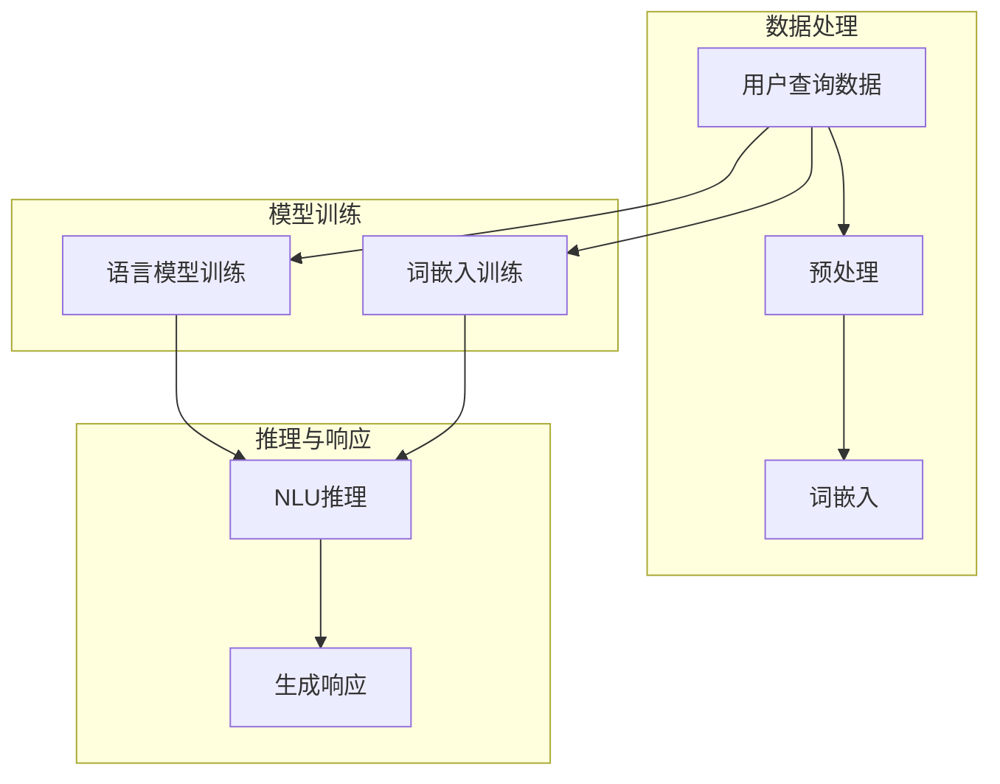
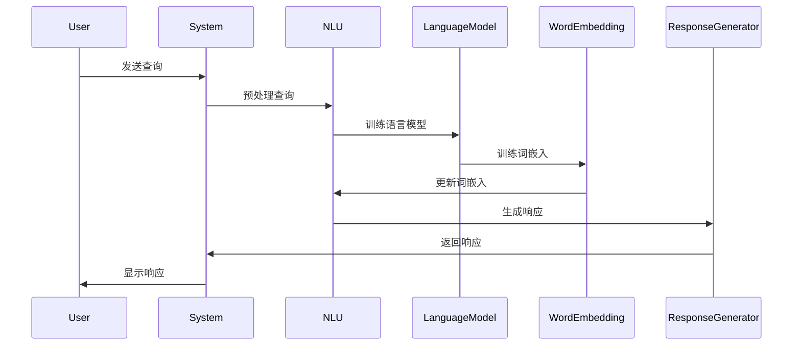
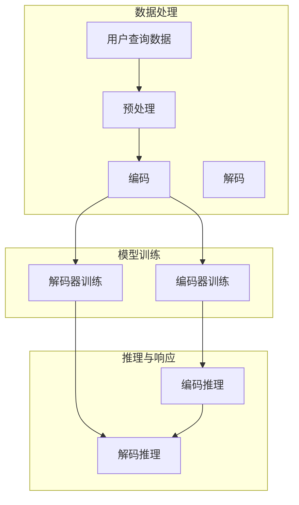
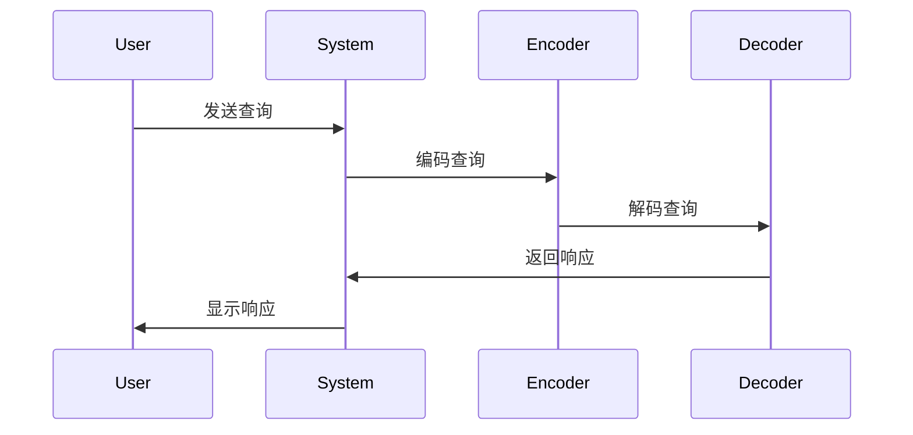
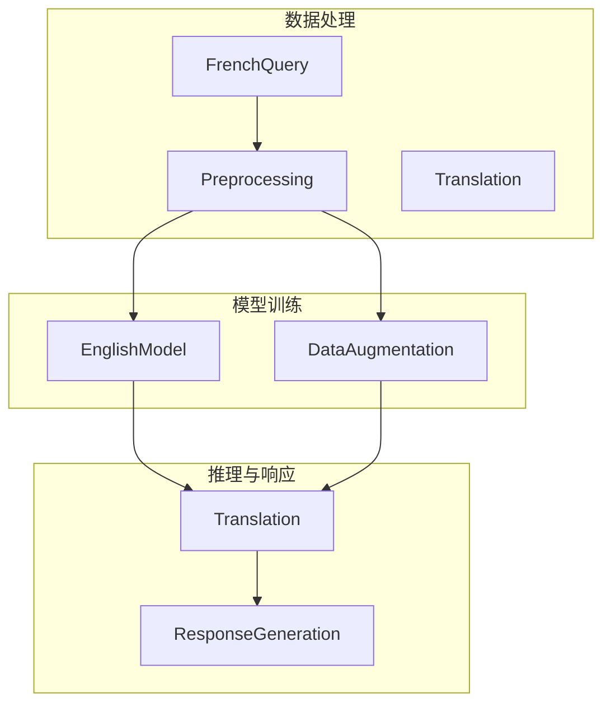
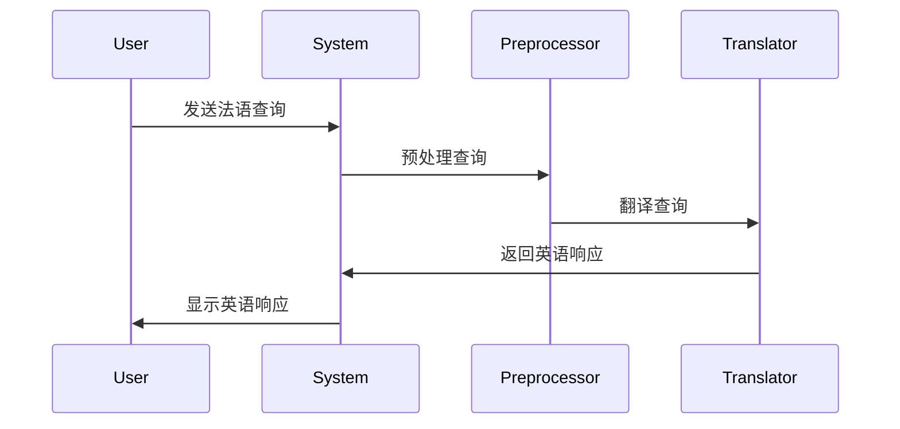

                 

### 文章标题

《深度学习在自然语言理解中的进展：走向真正的人机对话》

### 关键词

- 深度学习
- 自然语言理解
- 人机对话
- 情感分析
- 问答系统

### 摘要

本文将探讨深度学习在自然语言理解（NLU）中的最新进展，重点分析其在实现真正的人机对话方面的应用。通过逐步分析深度学习的基础理论、NLU的关键技术以及实际应用案例，我们旨在揭示NLU技术的现状与未来发展方向，为读者提供一份全面的技术指南。

---

### 第一部分：深度学习与自然语言理解基础

#### 1.1 深度学习基础

**背景介绍：**
深度学习（Deep Learning，简称DL）是机器学习（Machine Learning，简称ML）的一个重要分支，以其多层神经网络结构而闻名。深度学习的发展起源于20世纪40年代，但直到近年来，得益于计算能力的提升和大数据的普及，深度学习才得以迅速发展。

**核心概念与联系：**
- **神经网络（Neural Networks）**：模拟人脑神经元的工作方式，通过大量连接（权重）进行数据传递和计算。
- **反向传播（Backpropagation）**：一种训练神经网络的方法，通过计算输出误差，反向调整网络权重。

**表格：神经网络与深度学习的关系**

| 关键概念 | 定义 | 关系 |
| --- | --- | --- |
| 神经网络 | 基本计算单元，由神经元组成 | 深度学习的核心组成部分 |
| 深度学习 | 多层神经网络，用于复杂任务 | 基于神经网络的更高级技术 |

**ER实体关系图架构：**
```mermaid
erDiagram
  Animal ||--|{ Mammal } Mammal
  Mammal ||--|{ Dog } Dog
  Mammal ||--|{ Cat } Cat
```
**算法原理讲解：**
深度学习算法的核心是多层感知机（MLP），其工作原理如下：
1. 输入数据通过输入层传入网络。
2. 通过隐藏层进行特征提取和变换。
3. 最终输出层产生预测结果。

数学模型：
$$
\text{输出} = \sigma(\text{权重} \cdot \text{输入} + \text{偏置})
$$
其中，$\sigma$ 表示激活函数，通常使用Sigmoid或ReLU。

**举例说明：**
以一个简单的神经网络为例，输入层有2个神经元，隐藏层有3个神经元，输出层有1个神经元。假设激活函数为ReLU，输入数据为 `[2, 3]`，权重和偏置分别为 `[1, 2]` 和 `[0.5, 1]`。

$$
\text{隐藏层输出} = \max(0, 1 \cdot 2 + 0.5) = 2.5 \\
\text{输出} = \max(0, 2.5 \cdot 1 + 1) = 3.5
$$

#### 1.2 自然语言理解基础

**背景介绍：**
自然语言理解（Natural Language Understanding，简称NLU）是人工智能领域的一个重要分支，旨在使计算机能够理解、解析和生成自然语言。随着深度学习技术的发展，NLU取得了显著的进展。

**核心概念与联系：**
- **语言模型（Language Model）**：用于预测下一个单词的概率分布。
- **词嵌入（Word Embedding）**：将单词映射到高维向量空间，以便进行计算和处理。

**表格：语言模型与词嵌入技术对比**

| 技术名称 | 定义 | 关键特征 |
| --- | --- | --- |
| 语言模型 | 预测下一个单词的概率分布 | 基于统计方法，考虑单词序列 |
| 词嵌入 | 将单词映射到高维向量空间 | 基于神经网络，考虑单词的语义信息 |

**ER实体关系图架构：**
```mermaid
erDiagram
  Word ||--|{ WordVector } WordVector
  Sentence ||--|{ Word } Word
```

**算法原理讲解：**
词嵌入算法通常使用神经网络进行训练，例如Word2Vec模型。其基本原理如下：
1. 输入一个单词和其上下文。
2. 通过神经网络生成该单词的词向量。
3. 更新词向量，以最大化单词和上下文之间的相似性。

数学模型：
$$
\text{词向量} = \text{神经网络}(\text{单词}, \text{上下文})
$$

**举例说明：**
假设有一个单词 "猫"，其上下文为 "我喜欢猫咪"。通过Word2Vec模型，我们可以得到 "猫" 的词向量。例如，如果使用Skip-Gram模型，输入序列为 "我喜欢猫咪"，我们可以得到 "猫" 的词向量。

**系统分析与架构设计方案：**

**问题场景介绍：**
在一个智能客服系统中，需要实现对用户查询的自然语言理解，以提供准确和高效的响应。

**项目介绍：**
- 系统名称：智能客服系统
- 系统功能：接收用户查询，解析查询内容，生成响应文本

**系统功能设计（领域模型类图）：**
```mermaid
classDiagram
  UserQuery <<entity>>
  NLU <<entity>>
  Response <<entity>>

  UserQuery -> NLU
  NLU -> Response
```

**系统架构设计（架构图）：**


**系统接口设计与系统交互（序列图）：**


#### 1.3 深度学习在自然语言理解中的应用实例

**情感分析：**
情感分析是NLU的一个重要应用，旨在判断文本的情感倾向。深度学习模型如卷积神经网络（CNN）和循环神经网络（RNN）在情感分析中取得了显著成果。

**机器翻译：**
深度学习在机器翻译中的应用尤为突出，基于序列到序列（Seq2Seq）模型的翻译方法取得了比传统统计方法更好的效果。

**问答系统：**
问答系统通过理解用户问题，提供准确答案。深度学习模型如BERT（Bidirectional Encoder Representations from Transformers）在问答系统中表现出色。

**自动摘要：**
自动摘要旨在生成文本的简洁摘要。基于注意力机制和Transformer模型的深度学习模型在自动摘要中取得了很好的效果。

#### 1.4 评估与优化

**评估指标：**
深度学习模型的评估指标包括准确率、召回率、F1分数等。针对NLU任务，还需要考虑特定指标，如BLEU分数用于机器翻译评估。

**优化策略：**
深度学习模型的优化策略包括超参数调整、正则化、数据增强等。针对NLU任务，还需要考虑模型解释性、鲁棒性等优化方向。

### 第二部分：深度学习在自然语言理解中的实际应用

#### 2.1 实际应用案例：智能客服系统

**环境安装：**
安装Python和深度学习相关库，如TensorFlow和PyTorch。

**系统核心实现源代码：**
```python
# 示例：使用BERT模型进行情感分析
from transformers import BertTokenizer, BertForSequenceClassification
import torch

# 加载预训练模型
tokenizer = BertTokenizer.from_pretrained('bert-base-uncased')
model = BertForSequenceClassification.from_pretrained('bert-base-uncased')

# 输入文本
text = "我非常喜欢这个产品！"

# 预处理文本
inputs = tokenizer(text, return_tensors='pt')

# 进行预测
with torch.no_grad():
    outputs = model(**inputs)

# 输出结果
print(outputs.logits)
```

**代码应用解读与分析：**
- 加载预训练BERT模型。
- 预处理输入文本，将其转换为模型可处理的格式。
- 进行预测，输出文本的情感分类结果。

**实际案例分析和详细讲解剖析：**
假设我们有一个智能客服系统，用户提问："我非常喜欢这个产品！"，我们希望系统能够识别出用户的积极情感。

- **预处理**：首先，我们使用BERT分词器对文本进行分词和标记。
- **预测**：然后，我们将预处理后的文本输入BERT模型，模型通过计算得到情感分类结果。

**项目小结：**
智能客服系统通过深度学习模型实现了对用户情感的理解，从而提供更个性化的服务。

### 第三部分：深度学习在自然语言理解中的未来发展趋势

#### 3.1 跨语言对话

**背景介绍：**
随着全球化的发展，跨语言对话成为了一个重要需求。深度学习在跨语言对话中的应用前景广阔。

**核心概念与联系：**
- **多语言词嵌入**：将不同语言的单词映射到同一向量空间。
- **跨语言翻译模型**：用于实现不同语言之间的文本转换。

**表格：多语言词嵌入与跨语言翻译模型对比**

| 技术名称 | 定义 | 关键特征 |
| --- | --- | --- |
| 多语言词嵌入 | 将不同语言的单词映射到同一向量空间 | 考虑单词在不同语言中的语义信息 |
| 跨语言翻译模型 | 实现不同语言之间的文本转换 | 基于深度学习，考虑文本的语法和语义信息 |

**ER实体关系图架构：**
```mermaid
erDiagram
  Sentence ||--|{ Translation } Translation
  SourceLanguage ||--|{ Sentence } Sentence
  TargetLanguage ||--|{ Sentence } Sentence
```

**算法原理讲解：**
跨语言对话的算法通常基于序列到序列（Seq2Seq）模型，其基本原理如下：
1. 输入源语言文本。
2. 通过编码器生成编码表示。
3. 通过解码器生成目标语言文本。

数学模型：
$$
\text{编码表示} = \text{Encoder}(\text{源语言文本}) \\
\text{目标语言文本} = \text{Decoder}(\text{编码表示})
$$

**举例说明：**
假设我们要翻译英文句子 "I like apples" 为中文。

- **编码**：首先，我们将英文句子输入编码器，得到编码表示。
- **解码**：然后，我们将编码表示输入解码器，生成中文句子。

**系统分析与架构设计方案：**

**问题场景介绍：**
在跨国公司中，员工可能使用不同语言进行沟通。需要实现一个跨语言对话系统，以支持不同语言之间的沟通。

**项目介绍：**
- 系统名称：跨国公司内部跨语言对话系统
- 系统功能：接收不同语言的输入，生成目标语言的响应

**系统功能设计（领域模型类图）：**
```mermaid
classDiagram
  UserQuery <<entity>>
  Translation <<entity>>
  Response <<entity>>

  UserQuery -> Translation
  Translation -> Response
```

**系统架构设计（架构图）：**


**系统接口设计与系统交互（序列图）：**


#### 3.2 低资源语言处理

**背景介绍：**
低资源语言（Low-Resource Languages）是指在自然语言处理（NLP）领域中数据量较少的语言。深度学习在低资源语言处理中面临着挑战。

**核心概念与联系：**
- **迁移学习（Transfer Learning）**：将高资源语言的模型应用于低资源语言。
- **数据增强（Data Augmentation）**：通过生成或修改数据，增加低资源语言的数据量。

**表格：迁移学习与数据增强技术对比**

| 技术名称 | 定义 | 关键特征 |
| --- | --- | --- |
| 迁移学习 | 将高资源语言的模型应用于低资源语言 | 利用高资源语言模型的先验知识 |
| 数据增强 | 通过生成或修改数据，增加低资源语言的数据量 | 提高低资源语言的模型性能 |

**ER实体关系图架构：**
```mermaid
erDiagram
  SourceLanguage ||--|{ Model } Model
  LowResourceLanguage ||--|{ Model } Model
```

**算法原理讲解：**
迁移学习的基本原理如下：
1. 在高资源语言上训练一个模型。
2. 将训练好的模型应用于低资源语言。

数学模型：
$$
\text{低资源语言模型} = \text{Fine-tuning}(\text{高资源语言模型}, \text{低资源语言数据})
$$

**举例说明：**
假设我们有一个英语模型的权重 $W$ 和一个法语模型的数据集 $D_f$。

- **迁移学习**：首先，我们将英语模型的权重 $W$ 应用于法语模型。
- **微调**：然后，我们在法语数据集 $D_f$ 上对模型进行微调。

**系统分析与架构设计方案：**

**问题场景介绍：**
在非洲的某些地区，法语和英语是主要语言，但数据资源有限。需要实现一个法语到英语的翻译系统。

**项目介绍：**
- 系统名称：法语到英语翻译系统
- 系统功能：接收法语输入，生成英语响应

**系统功能设计（领域模型类图）：**
```mermaid
classDiagram
  FrenchQuery <<entity>>
  EnglishResponse <<entity>>

  FrenchQuery -> TranslationModel
  TranslationModel -> EnglishResponse
```

**系统架构设计（架构图）：**


**系统接口设计与系统交互（序列图）：**


### 结论与展望

**总结：**
本文详细介绍了深度学习在自然语言理解（NLU）中的应用，从基础理论到实际应用，再到未来发展趋势。深度学习在NLU中的进展为构建真正的人机对话系统提供了有力支持。

**未来研究方向：**
- 进一步优化深度学习模型，提高其在低资源语言处理中的性能。
- 探索更多跨语言对话的算法和技术。
- 加强模型解释性和透明性，提高模型的可靠性和用户信任度。

**对从业者的建议：**
- 保持对新技术和算法的关注，不断学习。
- 结合实际应用场景，选择合适的模型和技术。
- 注重数据质量和多样性，以提高模型性能。

---

**作者信息：**

- 作者：AI天才研究院/AI Genius Institute & 禅与计算机程序设计艺术 /Zen And The Art of Computer Programming**附录：拓展阅读**

1. **《深度学习》（Deep Learning）** - Goodfellow, Bengio, Courville
2. **《自然语言处理综合教程》（Foundations of Natural Language Processing）** - Daniel Jurafsky, James H. Martin
3. **《跨语言情感分析》（Cross-Linguistic Sentiment Analysis）** - Maedche, Angeli
4. **《低资源语言处理》（Low-Resource Language Processing）** - Riezler, Oepen, Bressan

这些资源为读者提供了更深入的学习和实践指导，有助于更好地理解深度学习在自然语言理解中的应用。**END**

