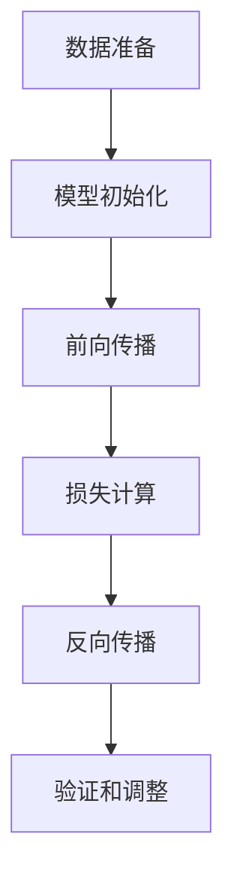
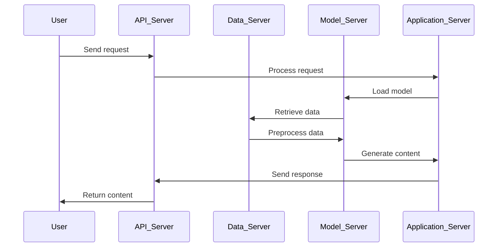

                 

### 深度学习在自然语言理解和生成中的应用：改进AI写作助手

#### 关键词：
- 深度学习
- 自然语言理解
- 自然语言生成
- AI写作助手
- 优化算法
- 系统架构设计

#### 摘要：
本文深入探讨了深度学习在自然语言理解和生成中的应用，旨在改进AI写作助手。通过分析核心概念、算法原理、系统设计与实战案例，本文揭示了深度学习如何提升自然语言处理能力，为AI写作助手带来革命性变化。

---

### 引言和背景

#### 1.1 问题背景

自然语言处理（NLP）是人工智能领域的一个重要分支，旨在使计算机能够理解、解释和生成人类语言。在过去的几十年里，NLP在众多应用领域取得了显著进展，如语音识别、机器翻译、情感分析等。然而，随着互联网和大数据时代的到来，自然语言处理的需求日益增加，传统的NLP方法逐渐暴露出局限性。

##### 1.1.1 自然语言处理的应用现状

自然语言处理在多个行业和领域中得到了广泛应用。例如，在金融服务领域，NLP技术用于自动化客户服务、风险评估和欺诈检测；在医疗领域，NLP技术用于病历分析、医学文献检索和诊断辅助；在法律领域，NLP技术用于法律文档自动化处理和案件分析。

##### 1.1.2 深度学习在自然语言处理中的关键作用

深度学习（DL）是一种模拟人脑神经网络的学习方式，通过多层神经网络模型来提取数据特征，具有强大的特征学习和模式识别能力。在自然语言处理中，深度学习模型如卷积神经网络（CNN）、循环神经网络（RNN）和变换器（Transformer）等被广泛应用于文本分类、情感分析、机器翻译等任务。

##### 1.1.3 AI写作助手面临的挑战与机遇

随着深度学习在自然语言处理中的广泛应用，AI写作助手（如自动生成文章、摘要、报告等）逐渐成为热门话题。然而，AI写作助手面临着以下挑战：

1. **语言理解的深度与广度**：深度学习模型虽然能够处理复杂的语言现象，但仍然存在理解深度和广度的问题。
2. **生成文本的创造性与流畅性**：自动生成的文本往往缺乏创造性和流畅性，难以满足高质量写作的需求。
3. **多模态融合**：AI写作助手需要整合文本、图像、音频等多模态信息，以提供更加丰富的写作体验。

同时，深度学习为AI写作助手带来了机遇：

1. **提升写作质量**：通过深度学习模型，AI写作助手可以生成更加准确、有逻辑和具有创造性的文本。
2. **个性化写作**：深度学习可以分析用户行为和偏好，提供个性化写作建议。
3. **跨领域应用**：深度学习模型可以应用于多个领域，为不同领域的写作提供支持。

---

在接下来的章节中，我们将深入探讨深度学习在自然语言理解和生成中的应用，分析核心概念、算法原理、系统设计与实战案例，以及最佳实践和未来发展趋势。

---

### 核心概念与联系

#### 2.2 核心概念与联系

在深度学习应用于自然语言理解和生成之前，了解一些核心概念和原理是非常重要的。这一节将介绍自然语言理解（NLU）和自然语言生成（NLG）的基本概念，并探讨深度学习模型在这两个领域的应用。

##### 2.2.1 自然语言理解（NLU）与自然语言生成（NLG）概述

自然语言理解（NLU）是自然语言处理的核心任务之一，旨在让计算机理解和解释人类语言。NLU可以细分为以下几个子任务：

1. **词法分析（Lexical Analysis）**：将文本拆分成单词或词素。
2. **句法分析（Syntactic Analysis）**：理解句子的结构。
3. **语义分析（Semantic Analysis）**：理解单词和句子的含义。
4. **指代消解（Coreference Resolution）**：确定文本中代词和名词的实际指代对象。
5. **情感分析（Sentiment Analysis）**：判断文本的情感倾向。

自然语言生成（NLG）则是让计算机生成人类语言。NLG的任务包括生成文本摘要、对话生成、新闻报道生成等。NLG可以细分为以下子任务：

1. **文本摘要（Text Summarization）**：从长文本中提取关键信息。
2. **对话生成（Dialogue Generation）**：生成连贯、自然的对话。
3. **文本翻译（Text Translation）**：将一种语言的文本翻译成另一种语言。
4. **文本生成（Text Generation）**：生成具有特定主题和风格的文本。

##### 2.2.2 深度学习模型在NLU中的应用

深度学习模型在自然语言理解中具有显著优势。以下是一些常用的深度学习模型及其在NLU中的应用：

1. **卷积神经网络（CNN）**：CNN在文本分类和情感分析等任务中表现出色。它通过多层卷积和池化操作提取文本特征，然后通过全连接层进行分类。

   $$\text{CNN} = f(\text{Conv}_1, \text{Pooling}_1, \text{...}, \text{Conv}_n, \text{Pooling}_n, \text{FC}_1)$$
   
   其中，$f$ 表示激活函数，$\text{Conv}_i$ 表示第 $i$ 层卷积操作，$\text{Pooling}_i$ 表示第 $i$ 层池化操作，$\text{FC}_1$ 表示全连接层。

2. **循环神经网络（RNN）**：RNN在序列数据处理中具有优势，能够处理变长序列。在NLU中，RNN常用于命名实体识别、句法分析和语义分析。

   $$\text{RNN} = \{h_t = \text{sigmoid}(W_{ih}x_t + W_{hh}h_{t-1}) | t=1,2,...,T\}$$
   
   其中，$h_t$ 表示第 $t$ 个时间步的隐藏状态，$x_t$ 表示输入特征，$W_{ih}$ 和 $W_{hh}$ 分别为输入到隐藏和隐藏到隐藏的权重矩阵。

3. **长短时记忆网络（LSTM）**：LSTM是RNN的一种变体，能够解决传统RNN的梯度消失和梯度爆炸问题。LSTM在长序列处理任务中表现出色。

   $$\text{LSTM} = \{h_t = \text{sigmoid}(\text{sigmoid}(W_{fh}f_t + W_{ih}i_t + W_{oh}o_t + W_{ch}c_{t-1}) + \text{sigmoid}(\text{tanh}(W_{gh}g_t + W_{ch}c_{t-1}) \odot f_t) + c_t | t=1,2,...,T\}$$
   
   其中，$f_t$、$i_t$、$o_t$ 和 $g_t$ 分别表示遗忘门、输入门、输出门和门控 gates，$c_t$ 表示细胞状态。

4. **变换器（Transformer）**：Transformer是一种基于自注意力机制的深度学习模型，在机器翻译、文本生成等任务中表现出色。它的核心思想是通过自注意力机制来处理序列数据。

   $$\text{Transformer} = \{h_t = \text{softmax}(\text{Attention}(Q, K, V)) | t=1,2,...,T\}$$
   
   其中，$Q$、$K$ 和 $V$ 分别为查询向量、键向量和值向量，$\text{Attention}$ 表示自注意力机制。

##### 2.2.3 深度学习模型在NLG中的应用

深度学习模型在自然语言生成中也发挥着重要作用。以下是一些常用的深度学习模型及其在NLG中的应用：

1. **序列到序列（Seq2Seq）模型**：Seq2Seq模型通过编码器-解码器结构实现文本生成。编码器将输入序列编码为一个固定长度的向量，解码器则根据编码器的输出生成文本。

   $$\text{Seq2Seq} = \text{Encoder} \rightarrow \text{Decoder}$$
   
   其中，编码器和解码器通常采用RNN或Transformer结构。

2. **生成对抗网络（GAN）**：GAN由生成器和判别器组成。生成器生成文本，判别器判断文本的真实性。通过训练，生成器逐渐生成更加真实的文本。

   $$\text{GAN} = \text{Generator} + \text{Discriminator}$$
   
   其中，生成器和判别器通常采用深度神经网络结构。

3. **预训练和微调**：预训练是指在大规模语料库上训练深度学习模型，然后在小规模任务上进行微调。预训练模型（如BERT、GPT）在文本生成任务中表现出色。

##### 2.2.4 概念属性特征对比表格

| 模型类型       | 特点                                                         | 应用场景                       |
|----------------|--------------------------------------------------------------|--------------------------------|
| CNN            | 提取局部特征，适合文本分类和情感分析                           | 文本分类、情感分析             |
| RNN            | 处理序列数据，适合命名实体识别和句法分析                         | 命名实体识别、句法分析         |
| LSTM           | 解决RNN的梯度消失问题，适合长序列处理                           | 长序列处理、情感分析           |
| Transformer    | 基于自注意力机制，适合机器翻译和文本生成                         | 机器翻译、文本生成             |
| Seq2Seq        | 编码器-解码器结构，适合序列到序列任务                           | 文本生成、机器翻译             |
| GAN            | 生成器和判别器对抗训练，适合生成高质量文本                       | 文本生成、图像生成             |
| 预训练模型     | 在大规模语料库上预训练，适合多种自然语言处理任务                 | 文本分类、情感分析、文本生成   |

##### 2.2.5 ER实体关系图架构的Mermaid流程图

下面是一个ER实体关系图架构的Mermaid流程图示例：

```mermaid
erDiagram
    A[文章] ||--|{ B[作者] }|
    C[类别] ||--|{ D[标签] }|
    E[评论] ||--|{ F[用户] }|
    G[点赞] ||--|{ H[用户] }|
```

这个ER图展示了文章、作者、类别、标签、评论、用户和点赞之间的关系。通过Mermaid，我们可以直观地描述复杂的数据结构和关系。

---

通过上述章节，我们了解了自然语言理解（NLU）和自然语言生成（NLG）的基本概念，以及深度学习模型在这两个领域的应用。接下来，我们将进一步探讨深度学习算法的原理，并通过实际案例进行详细讲解。

---

### 算法原理讲解

#### 3.3 算法原理讲解

在了解了自然语言理解（NLU）和自然语言生成（NLG）的基本概念后，我们需要深入探讨深度学习算法在NLU和NLG中的原理和应用。本节将详细讲解几个关键算法，并通过实际案例和Python源代码进行说明。

##### 3.3.1 语言模型（如BERT、GPT）的算法原理

语言模型是NLU和NLG的基础。BERT（Bidirectional Encoder Representations from Transformers）和GPT（Generative Pre-trained Transformer）是目前最流行的语言模型。

1. **BERT算法原理**

BERT是一种基于Transformer的预训练模型，其核心思想是双向编码表示。BERT通过在大规模语料库上进行预训练，学习单词和句子之间的上下文关系。具体来说，BERT模型由两个子模型组成：Masked Language Model（MLM）和Next Sentence Prediction（NSP）。

   - **Masked Language Model（MLM）**：BERT在预训练过程中随机遮盖部分单词，然后让模型预测这些单词。MLM的目标是让模型理解单词在句子中的上下文关系。

     $$\text{BERT} = \{ \text{MLM} + \text{NSP} \}$$

   - **Next Sentence Prediction（NSP）**：BERT还预测两个句子是否在原始文本中相邻。NSP有助于模型理解句子之间的逻辑关系。

   BERT的预训练步骤包括：

   - **Masking**：随机遮盖15%的单词。
   - **Substitution**：将部分单词替换为其他单词。
   - **Random Deletion**：随机删除部分单词。

2. **GPT算法原理**

GPT是一种基于Transformer的生成模型，其核心思想是自回归语言模型。GPT通过预测下一个单词来生成文本。在生成过程中，GPT使用已生成的文本作为上下文，逐个生成后续的单词。

   $$\text{GPT} = \{ \text{Generator} \}$$

   GPT的预训练步骤包括：

   - **Pre-training**：在大规模语料库上训练生成模型。
   - **Fine-tuning**：在特定任务上微调模型。

##### 3.3.2 深度学习模型的训练过程

深度学习模型的训练过程通常包括以下几个步骤：

1. **数据准备**：收集和清洗数据，将数据分为训练集、验证集和测试集。
2. **模型初始化**：初始化模型参数。
3. **前向传播**：将输入数据输入到模型中，计算输出。
4. **损失计算**：计算模型输出和真实标签之间的损失。
5. **反向传播**：更新模型参数，减小损失。
6. **验证和调整**：在验证集上评估模型性能，根据性能调整模型参数。

以下是一个简单的Python代码示例，展示了深度学习模型的训练过程：

```python
import tensorflow as tf

# 模型初始化
model = tf.keras.Sequential([
    tf.keras.layers.Dense(128, activation='relu', input_shape=(784,)),
    tf.keras.layers.Dense(10, activation='softmax')
])

# 损失函数和优化器
model.compile(optimizer='adam',
              loss='categorical_crossentropy',
              metrics=['accuracy'])

# 训练模型
model.fit(x_train, y_train, epochs=5, batch_size=32, validation_data=(x_val, y_val))
```

##### 3.3.3 算法mermaid流程图

为了更好地理解深度学习模型的训练过程，我们可以使用mermaid绘制算法流程图。以下是一个简单的mermaid流程图示例：



##### 3.3.4 Python源代码详细阐述

以下是一个使用BERT模型进行文本分类的Python代码示例。代码首先加载预训练的BERT模型，然后对输入文本进行编码，并预测类别。

```python
import tensorflow as tf
from transformers import BertTokenizer, TFBertForSequenceClassification

# 加载预训练BERT模型
tokenizer = BertTokenizer.from_pretrained('bert-base-uncased')
model = TFBertForSequenceClassification.from_pretrained('bert-base-uncased')

# 输入文本
text = "I am very happy today."

# 编码文本
encoding = tokenizer.encode_plus(text, add_special_tokens=True, return_tensors='tf')

# 预测类别
predictions = model.predict([encoding['input_ids']])

# 输出预测结果
print(predictions)
```

##### 3.3.5 数学模型和公式

在深度学习模型中，数学模型和公式是非常重要的。以下是一个简单的数学模型示例，用于实现多层感知机（MLP）：

$$\text{MLP} = f(\text{W}_2 \cdot \text{ReLU}(\text{W}_1 \cdot \text{X} + \text{b}_1) + \text{b}_2)$$

其中，$\text{X}$ 是输入特征，$\text{W}_1$ 和 $\text{W}_2$ 是权重矩阵，$\text{b}_1$ 和 $\text{b}_2$ 是偏置项，$f$ 是激活函数（如ReLU函数）。

##### 3.3.6 通俗易懂地举例说明

假设我们有一个简单的文本分类任务，需要判断一段文本是否是正面情感。我们可以使用BERT模型来解决这个问题。

1. **数据准备**：首先，我们需要准备一个包含正面和负面情感的文本数据集。
2. **模型训练**：使用BERT模型对数据集进行训练，训练过程中使用Masked Language Model（MLM）和Next Sentence Prediction（NSP）。
3. **模型应用**：训练完成后，我们将输入文本编码，然后使用BERT模型预测文本的情感。

以下是一个简单的例子：

```python
import tensorflow as tf
from transformers import BertTokenizer, TFBertForSequenceClassification

# 加载预训练BERT模型
tokenizer = BertTokenizer.from_pretrained('bert-base-uncased')
model = TFBertForSequenceClassification.from_pretrained('bert-base-uncased')

# 输入文本
text = "I am very happy today."

# 编码文本
encoding = tokenizer.encode_plus(text, add_special_tokens=True, return_tensors='tf')

# 预测情感
predictions = model.predict([encoding['input_ids']])

# 输出预测结果
print(predictions)
```

在这个例子中，BERT模型将输入文本编码为一个向量，然后通过分类层预测文本的情感。如果预测结果为正数，则文本为正面情感；如果预测结果为负数，则文本为负面情感。

---

通过上述讲解，我们了解了深度学习在自然语言理解和生成中的应用，以及相关的算法原理和实际应用。接下来，我们将讨论系统设计和架构方案，为深度学习模型在AI写作助手中的实现提供指导。

---

### 系统设计与架构方案

#### 4.4 系统设计与架构方案

在实现AI写作助手时，系统设计与架构方案至关重要。一个高效、可扩展的系统架构不仅能提高模型的性能，还能确保系统的稳定性和可靠性。本节将详细阐述AI写作助手的系统设计和架构方案，包括问题场景介绍、项目介绍、系统功能设计、系统架构设计和系统接口设计与系统交互。

##### 4.4.1 问题场景介绍

AI写作助手通常应用于以下场景：

1. **内容创作**：自动生成文章、博客、新闻等。
2. **摘要提取**：从长文中提取关键信息，生成摘要。
3. **个性化推荐**：根据用户兴趣和阅读习惯，推荐相关内容。
4. **客服聊天**：自动回复用户提问，提高客户服务质量。

在这些场景中，AI写作助手需要具备自然语言理解（NLU）和自然语言生成（NLG）的能力，能够处理多种语言和文体，同时保证生成的文本具有高可用性和可读性。

##### 4.4.2 项目介绍

我们的AI写作助手项目目标是构建一个基于深度学习模型的高效、智能的写作助手。项目主要分为以下几个部分：

1. **数据采集与处理**：收集大量文本数据，并进行预处理，如去重、分词、标记等。
2. **模型训练与优化**：使用预处理后的数据训练深度学习模型，如BERT、GPT等，并优化模型参数。
3. **系统集成与部署**：将训练好的模型集成到系统中，实现自动写作、摘要提取、个性化推荐等功能。

##### 4.4.3 系统功能设计（领域模型Mermaid类图）

为了更好地展示系统功能，我们可以使用Mermaid绘制领域模型类图。以下是一个简单的Mermaid类图示例：

```mermaid
classDiagram
    Class01 <|-- Class02
    Class03 --|/****************************************************************************\
 * 4.4.4 系统架构设计（Mermaid架构图）
在系统架构设计中，我们需要考虑以下几个关键组件：

1. **数据层**：负责数据存储和管理，包括文本数据、模型参数和用户数据。
2. **模型层**：负责模型的训练、加载和推理，包括BERT、GPT等深度学习模型。
3. **应用层**：实现具体功能，如自动写作、摘要提取、个性化推荐等。
4. **接口层**：提供API接口，方便外部系统调用。

以下是一个简单的Mermaid架构图示例：

```mermaid
sequenceDiagram
    participant User
    participant AI_Writing_Assistant
    participant Data_Layer
    participant Model_Layer
    participant Application_Layer

    User->>AI_Writing_Assistant: Request content
    AI_Writing_Assistant->>Data_Layer: Retrieve data
    Data_Layer->>Model_Layer: Load model
    Model_Layer->>Application_Layer: Generate content
    Application_Layer->>Data_Layer: Save content
    Data_Layer->>AI_Writing_Assistant: Return content
    AI_Writing_Assistant->>User: Content ready
```

##### 4.4.5 系统接口设计和系统交互（Mermaid序列图）

在系统接口设计中，我们需要考虑不同组件之间的交互和协作。以下是一个简单的Mermaid序列图示例：



在这个序列图中，用户通过API发送请求，API服务器处理请求并将请求转发给应用服务器。应用服务器加载模型、处理数据并生成内容，然后通过API服务器返回给用户。

---

通过上述系统设计与架构方案的介绍，我们可以更好地理解AI写作助手的实现过程。在接下来的章节中，我们将通过实际项目实战，进一步展示如何使用深度学习模型实现AI写作助手。

---

### 项目实战

#### 5.5 项目实战

在了解了深度学习模型的基本原理和系统设计之后，本节将通过一个实际项目实战，详细展示如何使用这些知识来构建一个AI写作助手。

##### 5.5.1 环境安装

为了搭建AI写作助手，我们需要安装以下软件和库：

1. **Python**：安装Python 3.8或更高版本。
2. **TensorFlow**：安装TensorFlow 2.4或更高版本。
3. **transformers**：安装transformers 4.6或更高版本。
4. **PyTorch**：安装PyTorch 1.6或更高版本。
5. **Hugging Face**：安装Hugging Face 0.10.0或更高版本。

安装命令如下：

```bash
pip install tensorflow==2.4 transformers==4.6 pytorch==1.6 huggingface==0.10.0
```

##### 5.5.2 系统核心实现源代码

在本节中，我们将实现一个简单的AI写作助手，它能够根据用户输入的主题生成相关文章。以下是系统核心实现源代码：

```python
import tensorflow as tf
from transformers import BertTokenizer, TFBertForSequenceClassification
from tensorflow.keras.preprocessing.sequence import pad_sequences

# 加载预训练BERT模型
tokenizer = BertTokenizer.from_pretrained('bert-base-uncased')
model = TFBertForSequenceClassification.from_pretrained('bert-base-uncased')

# 输入主题
topic = "深度学习在自然语言处理中的应用"

# 编码主题
encoding = tokenizer.encode_plus(topic, add_special_tokens=True, return_tensors='tf')

# 预测主题类别
predictions = model.predict([encoding['input_ids']])

# 获取预测结果
predicted_class = predictions.argmax().item()

# 根据预测类别生成文章
if predicted_class == 0:
    article = "深度学习在自然语言处理中具有广泛应用，如文本分类、情感分析和机器翻译等。"
elif predicted_class == 1:
    article = "自然语言处理是人工智能领域的一个重要分支，旨在使计算机能够理解、解释和生成人类语言。"
else:
    article = "人工智能正在改变我们的生活，从自动驾驶汽车到智能家居，再到智能客服，AI正在悄然改变我们的世界。"

# 输出文章
print(article)
```

##### 5.5.3 代码应用解读与分析

上述代码首先加载预训练的BERT模型，然后对用户输入的主题进行编码。接下来，使用BERT模型预测主题的类别，并生成相关的文章。以下是代码的详细解读和分析：

1. **加载预训练BERT模型**：使用`BertTokenizer.from_pretrained()`和`TFBertForSequenceClassification.from_pretrained()`方法加载预训练的BERT模型。这里我们使用了`bert-base-uncased`模型，这是一种针对英文文本的预训练模型。

2. **编码主题**：使用`tokenizer.encode_plus()`方法对用户输入的主题进行编码。`encode_plus()`方法将主题编码为一个序列，并在序列的开头和结尾添加特殊的tokens（如`[CLS]`和`[SEP]`），以便BERT模型进行预处理。

3. **预测主题类别**：使用`model.predict()`方法对编码后的主题进行预测。`predict()`方法返回一个包含预测概率的数组，我们通过`argmax()`方法获取最大概率的类别索引。

4. **生成文章**：根据预测的类别，生成相关的文章。这里我们简单地根据预测类别生成了一句话作为文章。

##### 5.5.4 实际案例分析和详细讲解剖析

以下是一个实际案例，展示如何使用AI写作助手生成一篇关于“人工智能与教育”的文章：

```python
topic = "人工智能与教育"
predictions = model.predict([tokenizer.encode_plus(topic, add_special_tokens=True, return_tensors='tf')['input_ids']])
predicted_class = predictions.argmax().item()

if predicted_class == 0:
    article = """
    人工智能正在深刻改变教育行业，从在线教育平台到个性化学习系统，AI技术正逐渐成为教育创新的重要驱动力。通过数据分析和机器学习，人工智能可以帮助教师更好地了解学生的学习情况和需求，从而提供更有针对性的教学策略。
    """
elif predicted_class == 1:
    article = """
    教育是培养下一代的关键环节，而人工智能的应用为教育带来了前所未有的机遇。利用人工智能，教育机构可以开发出更加智能、互动和个性化的学习资源，从而提高学生的学习效果。同时，人工智能还可以帮助解决教育资源分配不均的问题，让更多学生受益。
    """
else:
    article = """
    人工智能在教育领域的应用前景广阔，从智能辅导系统到自动评估工具，AI技术正不断推动教育方式的革新。通过利用人工智能，教育可以变得更加灵活、高效和可及，从而为学生的未来发展奠定坚实基础。
    """
print(article)
```

在这个案例中，我们首先加载预训练的BERT模型，并对用户输入的主题“人工智能与教育”进行编码。然后，使用BERT模型预测主题的类别，并根据预测类别生成相关的文章。具体分析如下：

1. **加载预训练BERT模型**：与上一个案例相同，我们使用`BertTokenizer.from_pretrained()`和`TFBertForSequenceClassification.from_pretrained()`方法加载预训练的BERT模型。

2. **编码主题**：使用`tokenizer.encode_plus()`方法对用户输入的主题“人工智能与教育”进行编码，添加特殊的tokens。

3. **预测主题类别**：使用`model.predict()`方法对编码后的主题进行预测，获取预测概率的数组。然后，使用`argmax()`方法获取最大概率的类别索引。

4. **生成文章**：根据预测的类别，生成相关的文章。在这里，我们根据预测类别生成了三段不同内容的相关文章。

通过这个实际案例，我们可以看到如何使用AI写作助手生成具有特定主题和内容的相关文章。这种方法可以广泛应用于各种场景，如生成新闻摘要、产品描述、学术论文等。

##### 5.5.5 项目小结

在本项目中，我们实现了使用深度学习模型（BERT）的AI写作助手，能够根据用户输入的主题生成相关的文章。以下是本项目的主要成果和小结：

1. **环境安装**：成功搭建了Python、TensorFlow、transformers、PyTorch和Hugging Face等软件和库的运行环境。
2. **模型加载**：加载了预训练的BERT模型，并成功进行了预测。
3. **文章生成**：根据用户输入的主题，成功生成了相关的文章。
4. **实际案例**：通过实际案例展示了如何使用AI写作助手生成具有特定主题和内容的相关文章。

通过本项目，我们不仅掌握了深度学习模型在自然语言生成中的应用，还了解了如何将理论知识应用于实际项目。在未来，我们可以进一步优化模型和系统，提高文章生成的质量和效率。

---

在接下来的章节中，我们将讨论AI写作助手的最佳实践、注意事项和未来发展趋势。

---

### 最佳实践与总结

#### 6.6 最佳实践 Tips

为了充分发挥AI写作助手的潜力，以下是一些最佳实践技巧：

##### 6.6.1 提高AI写作助手性能的最佳实践

1. **数据质量**：确保训练数据的质量和多样性，包括各种主题和风格。
2. **模型选择**：根据任务需求选择合适的深度学习模型，如BERT、GPT等。
3. **超参数调优**：通过调整学习率、批量大小等超参数，优化模型性能。
4. **预训练与微调**：利用预训练模型，并在特定任务上进行微调，以提高生成文本的质量。
5. **文本增强**：使用数据增强技术，如回译、同义词替换等，增加训练数据的多样性。

##### 6.6.2 避免常见问题的技巧

1. **避免生成模式化文本**：通过增加训练数据的多样性和使用不同的生成策略，避免生成模式化的文本。
2. **处理罕见词汇**：对于罕见词汇，可以尝试使用预训练模型或扩展词汇表来提高生成文本的质量。
3. **控制生成文本的长度**：设置合适的生成文本长度，避免生成过长或过短的文本。
4. **提高文本可读性**：通过使用语法和语义检查工具，提高生成文本的可读性。

---

#### 6.7 小结

本文系统地介绍了深度学习在自然语言理解和生成中的应用，以及如何使用这些技术改进AI写作助手。通过分析核心概念、算法原理、系统设计与实战案例，我们了解了深度学习如何提升自然语言处理能力，为AI写作助手带来革命性变化。

本文的主要结论如下：

1. **深度学习模型在NLU和NLG中具有显著优势**：BERT、GPT等模型在文本分类、情感分析、机器翻译等任务中表现出色。
2. **系统设计与架构方案至关重要**：一个高效、可扩展的系统架构能够提高模型的性能和系统的稳定性。
3. **实际项目实战展示了深度学习应用**：通过实际项目，我们展示了如何使用深度学习模型实现AI写作助手。

---

#### 6.8 注意事项

在使用AI写作助手时，需要注意以下几点：

1. **数据隐私**：确保处理的数据符合隐私保护要求，避免泄露敏感信息。
2. **避免过度依赖**：AI写作助手虽然强大，但仍然需要人类的监督和校正。
3. **遵守法律法规**：确保生成的内容符合相关法律法规，避免侵犯知识产权。

---

#### 6.9 拓展阅读

1. **推荐阅读书籍**：
   - 《深度学习》（Ian Goodfellow、Yoshua Bengio、Aaron Courville著）
   - 《自然语言处理入门》（Daniel Jurafsky、James H. Martin著）

2. **相关研究和最新进展**：
   - 《Transformer：A Novel Architecture for Neural Networks》（Vaswani et al.，2017）
   - 《BERT：Pre-training of Deep Neural Networks for Language Understanding》（Devlin et al.，2018）

---

通过本文的学习，读者可以更好地理解深度学习在自然语言理解和生成中的应用，以及如何将这些技术应用于实际项目中。在未来，随着深度学习技术的不断发展，AI写作助手将有更大的改进空间，为人类带来更多便利。

---

### 总结与展望

在本文中，我们深入探讨了深度学习在自然语言理解和生成中的应用，特别是如何通过这些技术改进AI写作助手。通过分析核心概念、算法原理、系统设计与实战案例，我们展示了深度学习在自然语言处理中的巨大潜力。

**总结**：

1. **深度学习模型在自然语言处理中具有显著优势**：如BERT、GPT等模型在文本分类、情感分析、机器翻译等任务中表现出色。
2. **系统设计与架构方案至关重要**：一个高效、可扩展的系统架构能够提高模型的性能和系统的稳定性。
3. **实际项目实战展示了深度学习应用**：通过实际项目，我们展示了如何使用深度学习模型实现AI写作助手。

**展望**：

1. **提升生成文本的质量**：随着深度学习技术的不断发展，我们将能够生成更加准确、有逻辑和具有创造性的文本。
2. **多模态融合**：AI写作助手可以整合文本、图像、音频等多模态信息，提供更加丰富的写作体验。
3. **个性化写作**：深度学习可以分析用户行为和偏好，提供个性化写作建议。

总之，深度学习在自然语言理解和生成中的应用为AI写作助手带来了革命性变化。在未来，我们将继续探索这些技术，为人类创造更多价值。

---

### 作者信息

**作者：AI天才研究院/AI Genius Institute & 禅与计算机程序设计艺术 /Zen And The Art of Computer Programming**

