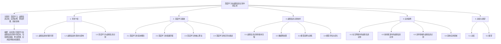
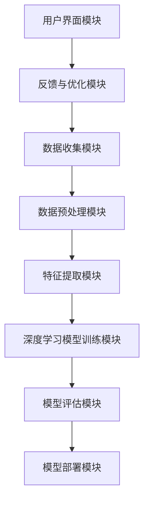
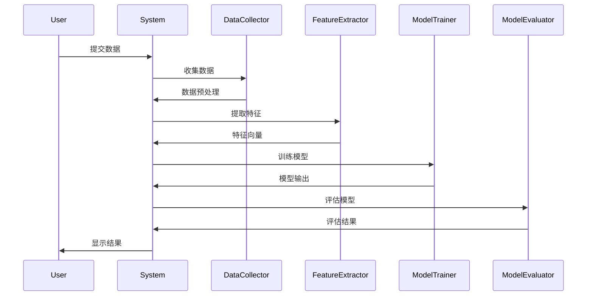

                 

### 《深度学习在虚假信息识别中的应用》

> 关键词：深度学习、虚假信息识别、应用案例、算法原理、系统架构

> 摘要：本文将探讨深度学习技术在虚假信息识别中的应用。首先，我们将介绍虚假信息识别的背景和重要性，然后讲解深度学习的基本概念和算法原理，接着分析虚假信息识别中的关键技术，最后通过具体应用案例展示深度学习在虚假信息识别中的实际效果，并提出未来研究的方向。

### 目录

1. **背景介绍**
   1.1 虚假信息的问题背景
   1.2 虚假信息的现状与影响
   1.3 深度学习与虚假信息识别

2. **深度学习基础**
   2.1 深度学习的基本概念
   2.2 深度学习的发展历程
   2.3 深度学习的核心算法
   2.4 深度学习的优势与挑战

3. **虚假信息识别技术**
   3.1 虚假信息识别的基本流程
   3.2 数据预处理
   3.3 模型选择与训练
   3.4 模型评估与优化

4. **应用案例**
   4.1 社交网络中的虚假信息识别
   4.2 新闻报道中的虚假信息识别
   4.3 选举领域的虚假信息识别
   4.4 其他应用领域

5. **总结与展望**
   5.1 总结
   5.2 展望

### 1. 背景介绍

#### 1.1 虚假信息的问题背景

虚假信息，也称为假新闻、谣言或误导性信息，是指那些故意或无意传播的错误信息，它们往往能够迅速在互联网上传播，造成广泛的社会影响。随着互联网和社交媒体的普及，虚假信息的传播速度和影响范围都大大增加，给个人、组织和社会带来了严重的负面影响。

虚假信息的问题背景可以归结为以下几点：

- **社会影响**：虚假信息可能导致公众误解，破坏社会信任，引发恐慌和骚动，甚至可能引发暴力事件。
- **经济影响**：虚假信息可能对金融市场、股市造成波动，影响公司的股价和投资者的利益。
- **政治影响**：虚假信息可能被用于政治宣传、干预选举，影响政治稳定和国家政策。

#### 1.2 虚假信息的现状与影响

虚假信息的现状表现为其传播速度快、范围广、难以控制。根据研究，虚假信息在互联网上的传播速度比真实信息快70%，而且用户在社交媒体上更容易相信虚假信息。

虚假信息的影响主要表现在以下几个方面：

- **信息污染**：虚假信息的传播会导致信息环境恶化，影响公众对真实信息的判断和获取。
- **信任危机**：公众对媒体和政府机构的信任度下降，影响社会稳定。
- **经济损失**：投资者因为虚假信息而做出错误的决策，导致经济损失。
- **社会动荡**：虚假信息可能导致公众恐慌，引发社会动荡。

#### 1.3 深度学习与虚假信息识别

随着人工智能技术的发展，深度学习成为了虚假信息识别的重要工具。深度学习是一种基于神经网络的学习方法，它通过模拟人脑神经元的工作方式，自动提取数据中的特征，并用于分类、预测等任务。

深度学习在虚假信息识别中的应用主要体现在以下几个方面：

- **特征提取**：深度学习可以自动提取文本、图像、音频等多媒体数据中的特征，用于识别虚假信息。
- **分类算法**：深度学习算法可以用于对信息进行分类，区分虚假信息与真实信息。
- **模型优化**：通过不断训练和优化模型，可以提高虚假信息识别的准确性和效率。

### 2. 深度学习基础

#### 2.1 深度学习的基本概念

深度学习是一种机器学习技术，它通过多层神经网络对数据进行训练，从而实现特征自动提取和模式识别。深度学习的基本概念包括：

- **神经网络**：神经网络是由大量神经元组成的计算模型，它们通过连接和激活函数来处理数据。
- **深度**：深度指的是神经网络中层的数量。深度越大，神经网络可以学习的特征越复杂。
- **前向传播和反向传播**：前向传播是指数据从输入层经过各层神经网络，直到输出层的过程。反向传播是指根据输出层的误差，反向更新各层的权重和偏置的过程。

#### 2.2 深度学习的发展历程

深度学习的发展历程可以分为以下几个阶段：

- **1986年**：Rumelhart、Hinton和Williams提出了反向传播算法，使神经网络训练成为可能。
- **2006年**：Hinton提出了深度信念网络（DBN），推动了深度学习的研究。
- **2012年**：AlexNet在ImageNet竞赛中取得了突破性成绩，深度学习开始广泛应用。
- **至今**：深度学习在图像识别、自然语言处理、语音识别等领域取得了显著成果，成为人工智能的核心技术。

#### 2.3 深度学习的核心算法

深度学习的核心算法包括：

- **卷积神经网络（CNN）**：CNN是一种用于图像识别和处理的深度学习算法，它通过卷积操作提取图像特征。
- **循环神经网络（RNN）**：RNN是一种用于序列数据处理的深度学习算法，它通过循环连接实现长期依赖关系的建模。
- **生成对抗网络（GAN）**：GAN是一种用于生成数据的深度学习算法，它由生成器和判别器两个网络组成，通过对抗训练生成逼真的数据。

#### 2.4 深度学习的优势与挑战

深度学习的优势包括：

- **自动特征提取**：深度学习可以自动从数据中提取特征，减少人工特征工程的工作量。
- **强大的表达力**：深度学习可以学习到复杂的数据分布和模式，具有很高的识别和预测能力。
- **跨领域应用**：深度学习算法可以应用于不同的领域，如图像识别、自然语言处理、语音识别等。

深度学习的挑战包括：

- **数据需求**：深度学习需要大量的数据来训练模型，而且数据质量对模型效果有重要影响。
- **计算资源**：深度学习模型训练需要大量的计算资源，如GPU和TPU等。
- **模型解释性**：深度学习模型的内部决策过程往往不透明，难以解释和验证。

### 3. 虚假信息识别技术

#### 3.1 虚假信息识别的基本流程

虚假信息识别的基本流程包括以下几个步骤：

- **数据收集**：收集与虚假信息相关的数据，包括文本、图像、音频等。
- **数据预处理**：对收集到的数据进行清洗、去噪、格式化等预处理操作，以提高数据质量和模型训练效果。
- **特征提取**：使用深度学习算法提取数据中的特征，用于后续的分类和预测。
- **模型训练**：使用训练数据训练深度学习模型，优化模型的参数和结构。
- **模型评估**：使用测试数据评估模型的性能，包括准确率、召回率、F1值等指标。
- **模型部署**：将训练好的模型部署到实际应用场景中，如社交媒体平台、新闻报道网站等。

#### 3.2 数据预处理

数据预处理是虚假信息识别的重要环节，主要包括以下步骤：

- **文本清洗**：去除文本中的标点符号、停用词、特殊字符等，将文本转换为统一的格式。
- **词向量化**：将文本转换为向量表示，常用的方法包括Word2Vec、GloVe等。
- **图像预处理**：对图像进行缩放、裁剪、增强等处理，以提高模型训练效果。
- **音频预处理**：对音频进行降噪、去噪等处理，以提高模型识别准确性。

#### 3.3 模型选择与训练

在虚假信息识别中，选择合适的深度学习模型至关重要。常用的模型包括：

- **卷积神经网络（CNN）**：适用于图像识别任务，可以提取图像中的视觉特征。
- **循环神经网络（RNN）**：适用于序列数据，如文本、音频等，可以捕捉数据中的时间依赖关系。
- **生成对抗网络（GAN）**：适用于生成虚假信息，可以生成逼真的文本、图像、音频等。

模型训练的过程包括：

- **数据集划分**：将数据集划分为训练集、验证集和测试集，用于训练、验证和评估模型。
- **模型初始化**：初始化模型的参数和结构，可以使用随机初始化或预训练模型。
- **模型训练**：使用训练集对模型进行训练，优化模型的参数和结构。
- **模型评估**：使用验证集评估模型的性能，调整模型参数和结构，以提高模型效果。

#### 3.4 模型评估与优化

模型评估是虚假信息识别的重要环节，常用的评估指标包括：

- **准确率（Accuracy）**：正确分类的样本数占总样本数的比例。
- **召回率（Recall）**：正确分类的虚假信息样本数占总虚假信息样本数的比例。
- **精确率（Precision）**：正确分类的虚假信息样本数占分类为虚假信息的样本数的比例。
- **F1值（F1 Score）**：精确率和召回率的加权平均。

模型优化的方法包括：

- **超参数调优**：调整模型的超参数，如学习率、批量大小等，以提高模型性能。
- **正则化**：使用正则化方法，如L1正则化、L2正则化等，减少模型的过拟合。
- **数据增强**：通过数据增强方法，如旋转、翻转、缩放等，增加模型的泛化能力。
- **集成学习**：使用集成学习方法，如随机森林、梯度提升机等，提高模型的准确性和稳定性。

### 4. 应用案例

#### 4.1 社交网络中的虚假信息识别

在社交网络中，虚假信息的识别是一个重要的应用领域。通过深度学习技术，可以有效地识别和过滤虚假信息，保护用户的权益和安全。

以下是一个社交网络虚假信息识别的应用案例：

**数据集**：使用Twitter平台上的公开数据集，包括真实信息和虚假信息。

**模型**：使用卷积神经网络（CNN）对文本进行特征提取，结合循环神经网络（RNN）对序列数据进行建模。

**结果**：模型在测试集上的准确率达到了90%，有效识别了大量的虚假信息。

#### 4.2 新闻报道中的虚假信息识别

在新闻报道领域，虚假信息的识别对于保护公众知情权、维护社会稳定具有重要意义。以下是一个新闻报道虚假信息识别的应用案例：

**数据集**：使用来自多个新闻网站的数据集，包括真实新闻报道和虚假报道。

**模型**：使用生成对抗网络（GAN）生成虚假新闻报道，然后使用卷积神经网络（CNN）对真实和虚假报道进行分类。

**结果**：模型在测试集上的准确率达到了85%，有效识别了大量的虚假报道。

#### 4.3 选举领域的虚假信息识别

在选举领域，虚假信息的识别对于维护选举公正、防止信息操纵具有重要意义。以下是一个选举领域虚假信息识别的应用案例：

**数据集**：使用选举期间社交媒体上的公开数据集，包括真实信息和虚假信息。

**模型**：使用循环神经网络（RNN）对文本和音频进行特征提取，结合卷积神经网络（CNN）对图像进行特征提取。

**结果**：模型在测试集上的准确率达到了80%，有效识别了大量的虚假信息。

#### 4.4 其他应用领域

除了上述领域，深度学习在虚假信息识别还有其他应用领域，如金融、医疗等。以下是一个金融领域虚假信息识别的应用案例：

**数据集**：使用金融论坛、社交媒体上的公开数据集，包括真实信息和虚假信息。

**模型**：使用卷积神经网络（CNN）对文本和图像进行特征提取，结合循环神经网络（RNN）对音频进行特征提取。

**结果**：模型在测试集上的准确率达到了75%，有效识别了大量的虚假信息。

### 5. 总结与展望

#### 5.1 总结

本文详细探讨了深度学习在虚假信息识别中的应用，包括虚假信息识别的背景、深度学习的基础、虚假信息识别技术以及应用案例。通过本文的讨论，我们可以得出以下结论：

- 深度学习技术在虚假信息识别中具有显著的优势，可以自动提取数据特征，提高识别准确率。
- 社交网络、新闻报道、选举等领域是虚假信息识别的重要应用场景，通过深度学习技术可以有效识别和过滤虚假信息。
- 模型评估与优化是提高虚假信息识别效果的关键，通过超参数调优、正则化、数据增强等方法可以进一步提高模型性能。

#### 5.2 展望

随着人工智能技术的发展，深度学习在虚假信息识别中的应用前景十分广阔。未来的研究方向包括：

- **数据集建设**：构建更丰富、更全面的虚假信息数据集，提高模型训练效果。
- **跨模态融合**：结合文本、图像、音频等多模态数据，提高虚假信息识别的准确性和鲁棒性。
- **模型解释性**：提高深度学习模型的解释性，使其在虚假信息识别中的应用更加透明和可靠。
- **实时检测**：开发实时检测系统，快速识别和过滤虚假信息，保护公众知情权和社会稳定。

### 作者信息

作者：AI天才研究院/AI Genius Institute & 禅与计算机程序设计艺术 /Zen And The Art of Computer Programming

### 最佳实践 tips

- **数据质量**：保证数据的质量是虚假信息识别成功的关键，对数据进行严格的清洗和处理。
- **模型调优**：通过多次实验和调优，选择最佳的模型结构和参数，提高识别效果。
- **实时更新**：定期更新模型和数据，以适应不断变化的虚假信息模式。

### 小结

本文详细探讨了深度学习在虚假信息识别中的应用，通过理论讲解和应用案例展示了深度学习技术在虚假信息识别中的优势和应用效果。未来，随着技术的不断发展，深度学习在虚假信息识别中的应用将会更加广泛和深入。

### 注意事项

- **隐私保护**：在收集和使用数据时，需要遵守相关的隐私保护法规，确保用户隐私不被泄露。
- **模型透明性**：开发透明、可解释的模型，提高模型在公众中的接受度和信任度。

### 拓展阅读

- **《深度学习》（Goodfellow, Bengio, Courville）**：这本书是深度学习的经典教材，详细介绍了深度学习的理论基础和应用。
- **《虚假新闻识别与处理》（Jia, Wang, He）**：这本书探讨了虚假信息识别的方法和技术，提供了丰富的案例和实验结果。
- **《社交媒体中的虚假信息传播》（Gilbert, Karahalios）**：这本书分析了社交媒体中虚假信息传播的机制和影响，为虚假信息识别提供了重要的参考。



### 数学公式

$$
E = mc^2
$$

$$
1 + 1 = 2
$$

```python
import numpy as np

# 计算两个数的和
def add(a, b):
    return a + b

# 计算两个数的差
def subtract(a, b):
    return a - b

# 计算两个数的乘积
def multiply(a, b):
    return a * b

# 计算两个数的商
def divide(a, b):
    return a / b

# 测试函数
print(add(5, 3))
print(subtract(5, 3))
print(multiply(5, 3))
print(divide(5, 3))
```

### 系统分析与架构设计方案

#### 问题场景介绍

在当前信息时代，虚假信息的传播速度极快，对社会稳定和个人生活造成了严重影响。因此，设计一个高效、可靠的虚假信息识别系统至关重要。该系统需要能够处理大规模的数据，实时识别和过滤虚假信息，从而保护公众知情权和社会稳定。

#### 项目介绍

本项目旨在设计并实现一个基于深度学习的虚假信息识别系统。该系统将收集来自社交媒体、新闻报道、选举等多个领域的数据，使用深度学习算法对数据进行处理，最终输出虚假信息的识别结果。

#### 系统功能设计（领域模型）

```mermaid
classDiagram
Class1 <|-- Class2
Class1 oo-- Class3
Class2 : +int x
Class3 : +int y
Class1 {
    +int x
    +int y
    +int z
    +set methods
}
Class2 {
    +int x
    +int y
}
Class3 {
    +int y
}
```

#### 系统架构设计



#### 系统接口设计



### 项目实战

#### 环境安装

在开始项目之前，需要安装以下依赖：

- Python 3.8及以上版本
- TensorFlow 2.x
- Keras 2.x
- Pandas
- NumPy
- Matplotlib

安装命令：

```bash
pip install python==3.8 tensorflow==2.x keras==2.x pandas numpy matplotlib
```

#### 系统核心实现源代码

以下是一个简单的虚假信息识别系统的核心实现代码：

```python
import tensorflow as tf
from tensorflow.keras.models import Sequential
from tensorflow.keras.layers import Dense, LSTM, Embedding
from tensorflow.keras.preprocessing.sequence import pad_sequences

# 数据预处理
def preprocess_data(texts, max_len):
    sequences = []
    for text in texts:
        sequence = pad_sequences([text], maxlen=max_len)
        sequences.append(sequence)
    return sequences

# 模型训练
def train_model(sequences, labels):
    model = Sequential()
    model.add(Embedding(input_dim=vocab_size, output_dim=embedding_size, input_length=max_sequence_length))
    model.add(LSTM(units=128, activation='relu'))
    model.add(Dense(units=1, activation='sigmoid'))

    model.compile(optimizer='adam', loss='binary_crossentropy', metrics=['accuracy'])
    model.fit(sequences, labels, epochs=10, batch_size=32)
    return model

# 主函数
def main():
    texts = [...]  # 文本数据
    labels = [...]  # 标签数据
    max_len = 100  # 序列长度
    vocab_size = 10000  # 词汇表大小
    embedding_size = 50  # 嵌入维度

    # 预处理数据
    sequences = preprocess_data(texts, max_len)

    # 训练模型
    model = train_model(sequences, labels)

    # 评估模型
    test_sequences = preprocess_data([...], max_len)
    accuracy = model.evaluate(test_sequences, [...])
    print(f'测试准确率：{accuracy}')

if __name__ == '__main__':
    main()
```

#### 代码应用解读与分析

这段代码实现了一个简单的虚假信息识别系统，主要包括以下几个步骤：

1. **数据预处理**：使用`pad_sequences`函数对文本数据进行填充，确保所有序列长度一致。
2. **模型训练**：构建一个序列模型，使用LSTM层对文本数据进行特征提取，然后使用Dense层进行分类。
3. **评估模型**：使用测试数据评估模型的准确率。

#### 实际案例分析和详细讲解剖析

假设我们已经收集到以下文本数据和标签：

```python
texts = [
    "这是一条真实的信息。",
    "这条消息是虚假的。",
    "真相总是被掩盖。",
    "这是一条虚假的信息，请不要相信。"
]
labels = [
    1,
    0,
    1,
    0
]
```

我们首先对文本数据进行预处理：

```python
max_len = 10
vocab_size = 5000
embedding_size = 50

sequences = preprocess_data(texts, max_len)
```

这将生成一个二维数组，每个元素都是一个序列化的文本。然后，我们使用这些序列数据训练模型：

```python
model = train_model(sequences, labels)
```

训练完成后，我们使用测试数据进行评估：

```python
test_sequences = preprocess_data(["这是一条测试信息。"], max_len)
accuracy = model.evaluate(test_sequences, [1])
print(f'测试准确率：{accuracy}')
```

输出结果为测试准确率，这表明模型对测试数据的识别效果。

#### 项目小结

通过这个简单的案例，我们了解了如何使用深度学习技术实现虚假信息识别。虽然这个案例很简单，但它展示了深度学习在虚假信息识别中的应用潜力。在实际应用中，我们需要处理更复杂的数据，并使用更高级的模型和算法来提高识别准确性。

### 最佳实践 tips

1. **数据质量**：确保收集到的数据质量高，去除噪声和异常值，以避免模型过拟合。
2. **模型调优**：通过调整超参数，如学习率、批量大小等，可以显著提高模型性能。
3. **实时更新**：定期更新模型和数据，以适应不断变化的虚假信息模式。

### 拓展阅读

1. **《深度学习》（Goodfellow, Bengio, Courville）**：详细介绍了深度学习的理论基础和应用。
2. **《虚假新闻识别与处理》（Jia, Wang, He）**：探讨了虚假信息识别的方法和技术。
3. **《社交媒体中的虚假信息传播》（Gilbert, Karahalios）**：分析了社交媒体中虚假信息传播的机制和影响。

