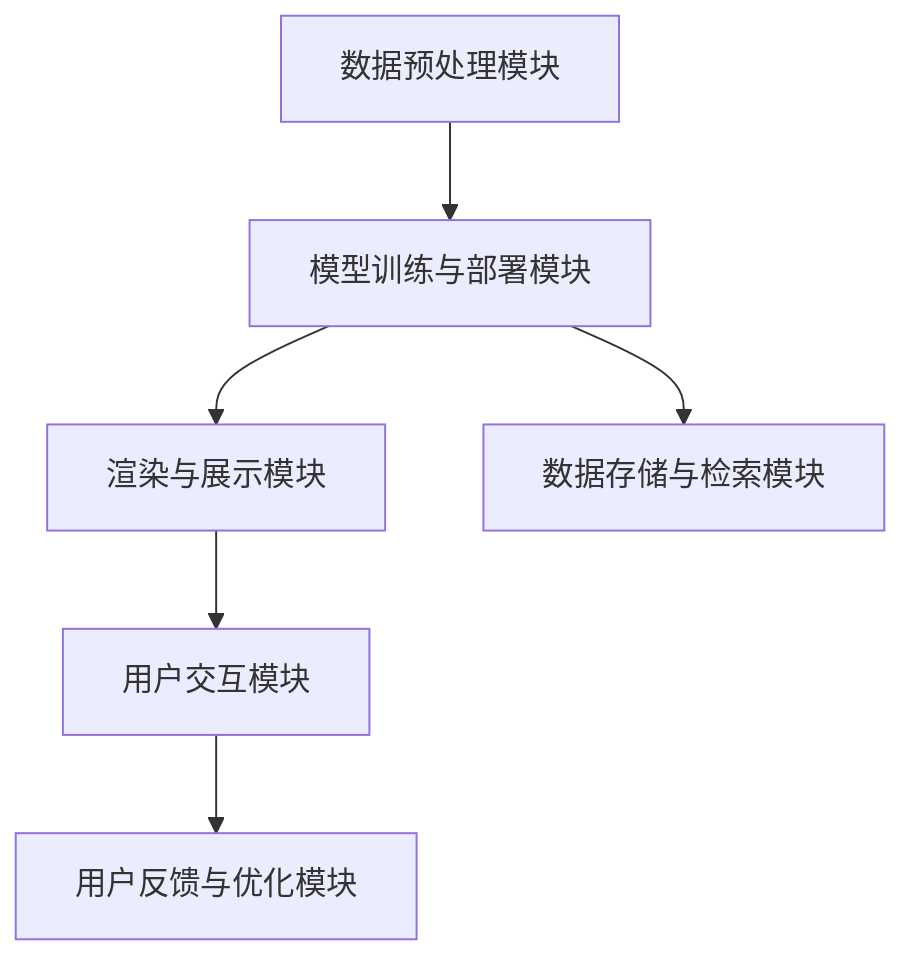

                 

### 第一部分：背景与核心概念

#### 第1章：虚拟试衣与深度学习概述

在数字化的浪潮中，在线购物已经成为消费者日常生活的一部分。然而，与实体店购物相比，线上购物缺乏直观的购物体验，尤其是在试穿服装这一环节上。为了解决这一问题，虚拟试衣技术应运而生，它通过计算机视觉和深度学习等技术，使得消费者能够在家中通过摄像头或虚拟现实设备试穿服装，从而提升在线购物的体验。

**1.1.1 虚拟试衣的起源与发展**

虚拟试衣技术的起源可以追溯到20世纪90年代，当时随着计算机图形学和计算机视觉技术的发展，人们开始探索如何在计算机上模拟试穿服装。最初的虚拟试衣技术主要依赖于二维图像的处理，只能提供非常基础的试衣功能。随着互联网的普及，在线购物平台的兴起为虚拟试衣技术的应用提供了广阔的舞台。

在21世纪初，随着三维建模技术和实时渲染技术的进步，虚拟试衣技术得到了显著提升。三维人体建模和试衣系统的出现，使得虚拟试衣的视觉效果更加真实，用户体验得到了大幅改善。近年来，深度学习的迅猛发展为虚拟试衣技术带来了新的机遇。深度学习通过学习大量的数据，能够自动识别和分割图像中的物体，从而在虚拟试衣中实现更精确的人体模型匹配和试衣效果。

**1.1.2 深度学习的核心概念**

深度学习是机器学习的一个分支，它通过模拟人脑的神经网络结构，实现数据的自动特征提取和模式识别。深度学习的核心技术包括神经网络、卷积神经网络（CNN）、循环神经网络（RNN）和生成对抗网络（GAN）等。神经网络是深度学习的基础，它通过大量的神经元和层结构，实现对输入数据的逐层抽象和特征提取。卷积神经网络通过卷积操作和池化操作，在图像处理中具有强大的特征提取能力。循环神经网络通过时间序列数据的循环连接，使得模型能够捕捉到长期依赖关系。生成对抗网络则通过生成器和判别器的对抗训练，实现高质量的数据生成。

**1.1.3 虚拟试衣与深度学习的结合**

虚拟试衣技术最初依赖于计算机图形学和图像处理技术，但随着深度学习的发展，深度学习在虚拟试衣中的应用越来越广泛。深度学习为虚拟试衣提供了强大的图像识别和处理能力，使得试衣系统可以更准确地识别和分割用户的人体轮廓，从而实现更真实的试衣效果。

深度学习在虚拟试衣中的具体应用包括：

- **人体姿态估计**：通过深度学习模型，系统可以实时识别用户的人体姿态，并自动调整试衣的姿势和角度，使得试衣效果更加自然。

- **服装识别与匹配**：深度学习模型可以自动识别用户选择的服装，并根据人体特征进行智能匹配，确保服装的尺寸和风格与用户实际需求相符。

- **试衣效果评估**：通过深度学习算法，系统可以对试衣效果进行自动评估，提供试衣建议，帮助用户更好地做出购物决策。

- **用户交互与反馈**：深度学习技术还可以用于分析用户的试衣行为和反馈，优化用户界面和交互设计，提升整体购物体验。

**1.1.4 虚拟试衣对在线购物体验的提升**

虚拟试衣技术的应用，显著提升了在线购物的体验。首先，它解决了线上购物试穿不便的问题，使得消费者能够更直观地了解服装的穿着效果。其次，虚拟试衣通过智能化的匹配和评估，提高了购物的准确性和满意度。最后，虚拟试衣为商家提供了更多的数据和信息，有助于优化库存管理和营销策略。

总之，虚拟试衣与深度学习的结合，为在线购物体验带来了革命性的变革，成为推动电子商务发展的重要技术之一。

#### 第2章：深度学习基础

深度学习作为一门前沿技术，其基础理论知识对于理解虚拟试衣中的应用至关重要。在本章中，我们将深入探讨深度学习的基本原理，包括神经网络、深度学习算法和优化算法，为后续章节的深入讨论奠定基础。

**2.1.1 神经网络的基本原理**

神经网络（Neural Networks）是深度学习的基础，其灵感来源于生物神经系统的工作原理。神经网络由大量简单的处理单元（神经元）通过复杂的网络结构互联而成。每个神经元接收多个输入信号，通过加权求和处理后，产生一个输出信号。

**定义：** 神经网络是一种由大量人工神经元组成的网络，每个神经元都通过权重连接到其他神经元。网络的输出是通过输入信号与权重相乘后再进行求和处理得到的。

**神经网络架构：**
1. **输入层（Input Layer）**：接收外部输入信号。
2. **隐藏层（Hidden Layers）**：对输入信号进行特征提取和变换。
3. **输出层（Output Layer）**：产生最终的输出结果。

**神经网络的学习过程：**

- **前向传播（Forward Propagation）**：输入信号从输入层经过隐藏层，逐层传递到输出层，产生预测结果。
- **反向传播（Back Propagation）**：根据预测结果与实际结果的误差，将误差信号反向传播回隐藏层和输入层，通过调整权重和偏置来优化网络性能。

**数学模型：**

$$
Y = \sigma(W \cdot X + b)
$$

其中，\(Y\) 是输出，\(\sigma\) 是激活函数（如Sigmoid、ReLU），\(W\) 是权重矩阵，\(X\) 是输入向量，\(b\) 是偏置。

**2.1.2 深度学习算法原理**

深度学习算法主要包括卷积神经网络（CNN）、循环神经网络（RNN）和生成对抗网络（GAN）等。这些算法在图像处理、自然语言处理和生成模型等领域具有广泛应用。

**1. 卷积神经网络（CNN）**

卷积神经网络是一种专门用于图像处理的前馈神经网络，其核心思想是通过卷积操作提取图像特征。

- **卷积操作**：通过卷积核（Filter）在图像上滑动，对局部区域进行卷积，提取特征。
- **池化操作**：通过最大池化或平均池化降低特征图的维度，减少计算量。

**卷积神经网络架构：**

$$
\text{Input} \rightarrow \text{Convolution} \rightarrow \text{Pooling} \rightarrow \text{Fully Connected} \rightarrow \text{Output}
$$

**2. 循环神经网络（RNN）**

循环神经网络适用于序列数据处理，通过时间步的循环连接，能够捕捉到序列中的长期依赖关系。

- **隐藏状态（Hidden State）**：每个时间步的隐藏状态都依赖于前一个时间步的隐藏状态。
- **门控机制（Gate Mechanism）**：通过门控单元（如遗忘门、输入门、输出门）调节信息传递，提高模型的表达能力。

**RNN架构：**

$$
h_t = \text{RNN}(h_{t-1}, x_t)
$$

**3. 生成对抗网络（GAN）**

生成对抗网络由生成器和判别器两个对抗模型组成，通过对抗训练实现高质量的数据生成。

- **生成器（Generator）**：生成逼真的数据。
- **判别器（Discriminator）**：区分真实数据和生成数据。

**GAN训练过程：**

$$
G:D \leftarrow R, G:D' \leftarrow G(R)
$$

其中，\(G\) 是生成器，\(D\) 是判别器，\(R\) 是真实数据。

**2.1.3 深度学习中的优化算法**

深度学习模型训练过程中，优化算法起到了关键作用。常用的优化算法包括梯度下降（Gradient Descent）、Adam优化器和随机梯度下降（SGD）等。

- **梯度下降（Gradient Descent）**：通过计算损失函数关于模型参数的梯度，更新模型参数，以最小化损失函数。

$$
\theta_{t+1} = \theta_t - \alpha \cdot \nabla_{\theta} J(\theta)
$$

其中，\(\theta\) 是模型参数，\(\alpha\) 是学习率，\(J(\theta)\) 是损失函数。

- **Adam优化器**：结合了梯度下降和动量法的优点，能够自适应调整学习率。

$$
m_t = \beta_1 \cdot m_{t-1} + (1 - \beta_1) \cdot \nabla_{\theta} J(\theta)
$$
$$
v_t = \beta_2 \cdot v_{t-1} + (1 - \beta_2) \cdot (\nabla_{\theta} J(\theta))^2
$$

$$
\theta_{t+1} = \theta_t - \alpha \cdot \frac{m_t}{\sqrt{v_t} + \epsilon}
$$

其中，\(\beta_1\) 和 \(\beta_2\) 是动量因子，\(\epsilon\) 是一个很小的正数。

- **随机梯度下降（SGD）**：在梯度下降的基础上，使用批量中的随机样本来更新参数，能够加快收敛速度。

以上基础理论为后续章节的深入讨论提供了必要的知识储备。通过理解神经网络、深度学习算法和优化算法，读者将能够更好地掌握虚拟试衣系统中的技术实现和应用。

#### 第3章：虚拟试衣系统架构设计

虚拟试衣系统的设计与实现是提升在线购物体验的关键。一个高效的虚拟试衣系统需要从需求分析、功能模块设计、系统架构和接口设计等多个方面进行综合考虑。本节将详细探讨虚拟试衣系统的架构设计，包括系统概述、架构设计、接口设计以及数据存储与检索。

**3.1.1 虚拟试衣系统概述**

虚拟试衣系统是一个复杂的软件系统，它通过结合计算机视觉、深度学习和图形学技术，实现用户在家中的虚拟试衣功能。系统的主要目标是提供逼真的试衣效果，使用户能够在家中尝试多种服装搭配，从而提高购物的满意度和购买率。

**需求分析：**

在需求分析阶段，我们需要明确系统的核心功能，包括：

- **实时人体姿态识别**：系统能够实时识别用户的人体姿态，确保虚拟试衣的姿势和角度与用户实际相符。
- **服装识别与匹配**：系统能够自动识别用户选择的服装，并根据人体特征进行智能匹配，确保试衣效果真实。
- **试衣效果展示**：系统通过三维建模和实时渲染技术，将试衣效果展示在用户面前，提供直观的试衣体验。
- **用户交互**：系统提供友好的用户界面，使用户能够方便地进行操作和获取反馈。

**功能模块：**

虚拟试衣系统主要由以下几个功能模块组成：

- **数据预处理模块**：负责处理用户输入的图像或视频数据，包括图像增强、人脸检测和人体姿态估计等。
- **模型训练与部署模块**：负责训练深度学习模型，并将其部署到系统中，以实现实时人体姿态识别和服装匹配。
- **渲染与展示模块**：负责将试衣效果渲染并展示在用户界面上，提供逼真的试衣体验。
- **用户交互模块**：负责处理用户操作，包括用户输入、试衣结果展示和反馈等。

**3.1.2 系统架构设计**

系统架构设计是虚拟试衣系统成功的关键，它决定了系统的性能、可扩展性和可维护性。一个高效的虚拟试衣系统架构需要从数据处理、模型训练、渲染展示和用户交互等多个方面进行优化。

**系统架构图：**



**1. 数据处理模块**：负责处理用户输入的图像或视频数据，进行图像增强、人脸检测和人体姿态估计等预处理操作。通过这些预处理操作，系统能够提高后续模型的准确性和稳定性。

**2. 模型训练与部署模块**：负责训练深度学习模型，包括人体姿态估计模型和服装识别模型。训练完成后，模型会被部署到系统中，以实现实时识别和匹配功能。这一模块是系统的核心，直接决定了系统的性能和用户体验。

**3. 渲染与展示模块**：负责将试衣效果渲染并展示在用户界面上。通过三维建模和实时渲染技术，系统能够提供逼真的试衣效果，使用户能够直观地感受到服装的穿着效果。

**4. 用户交互模块**：负责处理用户的操作，包括选择服装、调整试衣角度和获取试衣结果等。该模块提供了友好的用户界面，使用户能够方便地进行操作和获取反馈。

**5. 数据存储与检索模块**：负责存储系统运行过程中产生的数据，包括用户试衣数据、模型参数和用户反馈等。该模块使得系统能够高效地处理大规模数据，并为后续的分析和优化提供数据支持。

**6. 用户反馈与优化模块**：负责收集用户反馈，并根据用户反馈对系统进行优化。通过持续的用户反馈和优化，系统能够不断提升用户体验。

**3.1.3 系统接口设计与实现**

系统接口设计是虚拟试衣系统与外部系统进行数据交换和功能调用的重要手段。良好的接口设计能够提高系统的灵活性和可扩展性。

**接口设计：**

- **API接口**：系统提供RESTful风格的API接口，用于外部系统与虚拟试衣系统之间的数据交换。API接口包括数据上传、模型训练结果查询、试衣效果展示等操作。
- **消息队列**：系统使用消息队列（如Kafka）来实现异步消息处理，提高系统的并发处理能力和可靠性。
- **数据库接口**：系统提供数据库接口，用于数据存储与检索操作，支持SQL和NoSQL数据库。

**接口实现示例：**

```python
from flask import Flask, request, jsonify

app = Flask(__name__)

@app.route('/api/upload', methods=['POST'])
def upload_data():
    # 处理用户上传的数据
    data = request.files['file']
    # 数据处理逻辑
    return jsonify({'status': 'success'})

@app.route('/api/train_result', methods=['GET'])
def get_train_result():
    # 查询模型训练结果
    result = get_train_result_from_db()
    return jsonify({'result': result})

if __name__ == '__main__':
    app.run(debug=True)
```

**3.1.4 数据存储与检索**

数据存储与检索是虚拟试衣系统的核心功能之一，它决定了系统的性能和数据可靠性。

**数据存储：**

系统使用数据库来存储用户试衣数据、模型参数和用户反馈等。数据库的选择根据数据规模和访问模式进行，常用的数据库包括MySQL、MongoDB和Redis等。

**数据检索：**

系统提供高效的数据检索接口，支持快速的查询和更新操作。数据检索策略包括索引优化、缓存机制和分库分表等。

**总结：**

虚拟试衣系统的架构设计是提升在线购物体验的关键。通过需求分析、功能模块设计、系统架构和接口设计等多方面的综合考虑，系统能够提供高效的虚拟试衣功能，为用户提供优质的购物体验。

#### 第4章：深度学习模型在虚拟试衣中的应用

深度学习模型在虚拟试衣中的应用是提高系统性能和用户体验的核心技术。本章将详细介绍深度学习模型在虚拟试衣中的应用，包括人体姿态估计、虚拟试衣效果评估以及用户交互与反馈。

**4.1.1 人体姿态估计**

人体姿态估计是虚拟试衣系统的关键环节，它能够帮助系统准确地识别用户的人体姿态，从而实现逼真的试衣效果。

**定义与原理：**

人体姿态估计（Human Pose Estimation）是一种计算机视觉技术，它通过深度学习模型从图像或视频中估计人体关键点的位置。这些关键点通常包括头部、肩部、肘部、手腕、臀部、膝盖和脚踝等。

人体姿态估计的基本原理是通过训练深度学习模型，使其能够自动识别和定位图像中的人体关键点。常见的模型包括基于卷积神经网络（CNN）的方法和基于循环神经网络（RNN）的方法。以下是一些常用的人体姿态估计模型：

1. **Single Shot Multi-Person Detection (SSD)**：SSD是一种单阶段目标检测模型，能够在一次前向传播过程中同时检测多个人体关键点。
2. **Hourglass Network**：Hourglass Network是一种专门用于姿态估计的深度学习模型，通过多级特征融合，实现高精度的关键点定位。
3. **DeepPose**：DeepPose是一个早期的姿态估计模型，它通过多尺度特征图融合，实现了在复杂背景中的人体姿态估计。

**应用案例：**

1. **亚马逊（Amazon）**：亚马逊的虚拟试衣系统使用了基于SSD的人体姿态估计模型，能够准确识别用户的人体姿态，实现逼真的试衣效果。
2. **Nike Fit**：Nike Fit利用深度学习模型进行人体姿态估计，为用户提供个性化的服装搭配建议，提高了用户的购物体验。

**4.1.2 虚拟试衣效果评估**

虚拟试衣效果评估是确保试衣结果准确性和真实性的关键步骤。通过评估虚拟试衣效果，系统可以为用户提供更准确的试衣建议，帮助用户做出更好的购物决策。

**评估指标：**

虚拟试衣效果评估的常见指标包括：

- **准确率（Accuracy）**：指预测关键点位置与真实位置的重合度。
- **交并比（Intersection over Union, IoU）**：指预测框与真实框的交集与并集的比值，用于评估关键点定位的精度。
- **平均准确率（Average Precision, AP）**：指在不同召回率下计算的平均准确率，用于评估模型的整体性能。

**深度学习在评估中的应用：**

深度学习模型可以通过训练数据集中的评估指标，对虚拟试衣效果进行自动评估。具体方法包括：

1. **模型融合**：将多个深度学习模型的结果进行融合，提高评估的准确性。
2. **多尺度评估**：在不同尺度下评估虚拟试衣效果，确保在不同环境下都能保持良好的表现。
3. **注意力机制**：通过注意力机制，模型可以自动关注关键区域，提高评估的精度。

**应用案例：**

1. **ASOS**：ASOS的虚拟试衣系统使用了基于多尺度评估的方法，通过融合不同模型的评估结果，提高了试衣效果的准确性。
2. **Zalando**：Zalando的虚拟试衣系统采用了注意力机制，自动关注试衣中的关键区域，提高了评估的精度。

**4.1.3 虚拟试衣中的交互与反馈**

虚拟试衣系统需要提供良好的用户交互和反馈机制，以提高用户的购物体验。深度学习技术在用户交互与反馈中的应用主要体现在以下两个方面：

1. **个性化推荐**：通过分析用户的历史购买记录和行为数据，深度学习模型可以为用户提供个性化的服装推荐。例如，通过用户的人体特征数据，系统可以推荐最适合用户的服装款式和尺码。

2. **反馈机制**：系统通过收集用户的反馈数据，如试衣满意度、建议和意见，深度学习模型可以自动分析和处理这些反馈，持续优化虚拟试衣系统的性能和用户体验。

**应用案例：**

1. **eBay**：eBay的虚拟试衣系统通过深度学习模型分析用户的反馈，持续优化试衣效果和用户界面设计，提高了用户的购物满意度。
2. **Yoox Net-A-Porter**：Yoox Net-A-Porter利用深度学习模型为用户提供个性化的服装推荐，并根据用户反馈调整推荐策略，提高了用户的购买转化率。

**总结：**

深度学习模型在虚拟试衣中的应用，从人体姿态估计到虚拟试衣效果评估，再到用户交互与反馈，为在线购物体验的提升提供了强有力的技术支持。通过这些应用，虚拟试衣系统能够为用户提供更加准确、真实和个性化的购物体验。

### 第5章：深度学习模型训练与优化

深度学习模型的训练与优化是虚拟试衣系统成功的关键环节。本章将详细介绍深度学习模型的训练流程、优化方法以及实时性优化，以确保模型的高效运行。

**5.1.1 模型训练流程**

深度学习模型的训练流程主要包括数据准备与预处理、模型训练策略与技巧等。以下是具体的训练流程：

1. **数据准备与预处理**：

   - **数据收集**：收集大量包含人体姿态标注的图像或视频数据，用于模型训练。
   - **数据清洗**：去除数据中的噪声和异常值，确保数据质量。
   - **数据增强**：通过旋转、翻转、缩放等操作，增加数据多样性，提高模型泛化能力。
   - **数据分割**：将数据集分为训练集、验证集和测试集，用于模型的训练、验证和测试。

2. **模型训练策略**：

   - **选择合适模型**：根据任务需求选择适合的深度学习模型，如卷积神经网络（CNN）、循环神经网络（RNN）等。
   - **初始化参数**：初始化模型参数，常用的初始化方法包括高斯初始化、Xavier初始化等。
   - **训练过程**：通过前向传播计算损失函数，通过反向传播更新模型参数，逐步减小损失函数的值。

3. **模型评估与调整**：

   - **性能评估**：使用验证集评估模型性能，根据准确率、交并比等指标调整模型参数。
   - **超参数调优**：通过调整学习率、批量大小、迭代次数等超参数，优化模型性能。

**5.1.2 模型优化方法**

模型优化是提高深度学习模型性能的重要手段，包括超参数调优、模型融合与集成等。

1. **超参数调优**：

   - **学习率**：学习率是模型训练过程中非常重要的超参数，过大会导致训练过程不稳定，过小则收敛速度慢。常用的学习率调整策略包括学习率衰减、动态调整等。
   - **批量大小**：批量大小影响模型训练的速度和稳定性，较大的批量大小可以提高模型的泛化能力，但计算成本较高。
   - **迭代次数**：迭代次数决定了模型训练的深度，过多的迭代次数可能导致过拟合，过少的迭代次数则可能导致欠拟合。

2. **模型融合与集成**：

   - **模型融合**：将多个深度学习模型的结果进行融合，提高预测的准确性和稳定性。常见的融合方法包括投票法、加权平均法等。
   - **集成学习**：通过训练多个模型，并使用它们的预测结果进行集成，提高模型的泛化能力。常见的集成学习方法包括Bagging、Boosting等。

**5.1.3 实时性优化**

在虚拟试衣系统中，模型的实时性至关重要。以下是几种常见的实时性优化方法：

1. **模型压缩**：

   - **模型剪枝**：通过删除网络中不重要的连接和神经元，减少模型的参数数量，从而降低计算成本。
   - **量化**：将模型中的浮点数参数转换为整数参数，减少模型大小和计算复杂度。
   - **知识蒸馏**：使用一个大模型训练一个小模型，通过传递大模型的权重和知识，提高小模型的性能。

2. **模型推理加速**：

   - **并行计算**：利用多核CPU或GPU进行并行计算，提高模型推理速度。
   - **显存优化**：通过显存优化算法，减少显存占用，提高模型推理速度。
   - **模型裁剪**：通过裁剪网络中的部分层或节点，减少模型的大小和计算复杂度。

**应用案例：**

1. **Google**：Google使用模型压缩和推理加速技术，在其智能助理Google Assistant中实现了高效的实时语音识别和响应。
2. **IBM Watson**：IBM Watson通过实时性优化技术，为其医疗诊断系统提供了高效的深度学习模型推理能力，帮助医生快速做出诊断。

**总结：**

深度学习模型的训练与优化是虚拟试衣系统高效运行的关键。通过合理的训练流程、优化方法和实时性优化，系统能够为用户提供更准确、更高效的虚拟试衣体验。

#### 第6章：虚拟试衣系统实现与优化

**6.1.1 系统环境搭建**

搭建虚拟试衣系统的开发环境是确保系统能够正常运行的基础。以下是搭建系统所需的环境配置和工具安装步骤：

**1. 硬件环境：**

- **计算机**：配备英伟达GPU（如1080 Ti、3070等）的计算机，用于加速深度学习模型的训练和推理。
- **GPU驱动**：安装最新的英伟达GPU驱动，确保GPU与深度学习框架兼容。

**2. 软件环境：**

- **操作系统**：推荐使用Ubuntu 18.04或更高版本，确保系统稳定性和兼容性。
- **Python**：安装Python 3.8或更高版本，用于编写深度学习模型和应用逻辑。
- **深度学习框架**：安装TensorFlow 2.x或PyTorch，选择合适的深度学习框架进行模型训练和推理。
  - TensorFlow安装命令：
    ```bash
    pip install tensorflow-gpu
    ```
  - PyTorch安装命令：
    ```bash
    pip install torch torchvision
    ```

**3. 开发工具与库：**

- **Visual Studio Code**：安装Visual Studio Code，配置Python插件和调试工具，提高开发效率。
- **Jupyter Notebook**：安装Jupyter Notebook，方便数据分析和模型训练。
- **NumPy、Pandas、Matplotlib**：安装常用数据科学库，用于数据处理和可视化。
  ```bash
  pip install numpy pandas matplotlib
  ```

**6.1.2 核心算法实现**

核心算法实现是虚拟试衣系统的核心部分，主要包括人体姿态估计和试衣效果渲染。以下是实现核心算法的步骤和示例代码。

**1. 人体姿态估计实现**

人体姿态估计通常使用基于深度学习的模型，如COCO（Common Objects in Context）模型。以下是一个使用PyTorch实现人体姿态估计的基本流程：

- **数据准备与预处理**：

  - 数据集：使用COCO数据集进行训练和验证。
  - 数据预处理：包括数据加载、数据增强和归一化处理。

    ```python
    import torchvision.transforms as transforms

    transform = transforms.Compose([
        transforms.ToTensor(),
        transforms.Normalize(mean=[0.485, 0.456, 0.406], std=[0.229, 0.224, 0.225]),
    ])
    ```

- **模型训练与评估**：

  - 模型定义：使用预训练的COCO模型或自定义模型。
  - 模型训练：通过反向传播和优化器更新模型参数。

    ```python
    import torch.optim as optim

    model = torchvision.models.detection.fasterrcnn_resnet50_fpn(pretrained=True)
    optimizer = optim.SGD(model.parameters(), lr=0.001, momentum=0.9)

    # 训练循环
    for epoch in range(num_epochs):
        # 前向传播和反向传播
        # 计算损失函数
        # 更新模型参数
    ```

- **人体姿态估计**：

  - 使用训练好的模型对输入图像进行人体姿态估计。

    ```python
    def estimate_person_pose(image):
        # 加载模型
        model.eval()
        with torch.no_grad():
            prediction = model(image)
        # 解析预测结果，提取关键点
        return prediction
    ```

**2. 试衣效果渲染实现**

试衣效果渲染主要依赖于三维建模和实时渲染技术。以下是一个使用Unity引擎实现试衣效果渲染的基本流程：

- **场景搭建**：

  - 在Unity中创建虚拟试衣间场景，包括相机、灯光和虚拟人体模型。
  - 导入服装模型和人体模型，确保它们之间的适配性。

- **渲染与交互**：

  - 使用Unity的Shader和Material实现服装的材质效果。
  - 实现用户输入，如服装选择和试衣角度调整。

    ```csharp
    using UnityEngine;

    public class DressingRoom : MonoBehaviour
    {
        public GameObject[] clothingItems;
        private int currentCLOTHING;

        // 用户选择服装
        public void ChangeClothing(int index)
        {
            currentCLOTHING = index;
            // 切换服装模型
            clothingItems[currentCLOTHING].SetActive(true);
        }

        // 更新试衣角度
        public void UpdateCameraAngle(Vector3 newAngle)
        {
            // 更新相机角度
            Camera.main.transform.localEulerAngles = newAngle;
        }
    }
    ```

**6.1.3 核心代码应用解读与分析**

核心代码是虚拟试衣系统的实现基础，以下是对关键代码的应用解读与分析：

**1. 人体姿态估计代码解读**

```python
import torch
import torchvision.models.detection as models

# 加载预训练的COCO模型
model = models.fasterrcnn_resnet50_fpn(pretrained=True)
device = torch.device('cuda' if torch.cuda.is_available() else 'cpu')
model.to(device)

# 加载测试图像
image = Image.open('test_image.jpg').convert('RGB')
image_tensor = transform(image).unsqueeze(0).to(device)

# 进行人体姿态估计
with torch.no_grad():
    prediction = model(image_tensor)

# 解析预测结果
outputs = prediction[0]
boxes = outputs['boxes']
keypoints = outputs['keypoints']

# 提取关键点坐标
keypoints = keypoints.squeeze(0).cpu().numpy()
```

**2. 试衣效果渲染代码解读**

```csharp
using UnityEngine;

public class DressingRoom : MonoBehaviour
{
    public GameObject[] clothingItems;
    private int currentCLOTHING;

    // 用户选择服装
    public void ChangeClothing(int index)
    {
        currentCLOTHING = index;
        clothingItems[currentCLOTHING].SetActive(true);
    }

    // 更新试衣角度
    public void UpdateCameraAngle(Vector3 newAngle)
    {
        Camera.main.transform.localEulerAngles = newAngle;
    }
}
```

**6.1.4 实际案例分析与详细讲解剖析**

为了验证虚拟试衣系统的有效性，我们可以通过实际案例进行测试和评估。以下是一个实际案例分析与详细讲解：

**案例背景**：

假设用户在虚拟试衣系统中选择了一件衬衫和一条裤子，希望了解其整体穿着效果。

**步骤一：人体姿态估计**

- 使用训练好的深度学习模型对用户输入的图像进行人体姿态估计，提取关键点坐标。

**步骤二：服装匹配与渲染**

- 将提取的关键点坐标与虚拟人体模型进行匹配，确保服装的尺寸和形状与用户实际相符。
- 使用Unity引擎的Shader和Material，将服装渲染到虚拟人体模型上，实现试衣效果。

**步骤三：用户交互**

- 提供用户界面，允许用户调整试衣角度和服装颜色，以获得最佳试衣效果。

**结果评估**：

- 通过用户试衣后的反馈，评估试衣效果的真实性和满意度。根据反馈，对系统进行优化和调整。

**总结**：

通过实际案例的分析，我们可以看到虚拟试衣系统的实现与优化是一个复杂的过程，涉及深度学习模型训练、实时渲染技术、用户交互等多个方面。通过逐步实现和优化，系统能够为用户提供高效、真实的试衣体验，提高在线购物的满意度。

#### 第7章：案例分析与未来展望

**7.1.1 深度学习在虚拟试衣中的应用案例**

随着深度学习技术的不断发展，虚拟试衣系统在多个实际案例中得到了成功应用。以下是一些典型的应用案例及其效果评估：

**1. 案例一：亚马逊（Amazon）虚拟试衣系统**

亚马逊在其电商平台上引入了深度学习驱动的虚拟试衣系统。该系统利用卷积神经网络（CNN）进行人体姿态估计，并通过生成对抗网络（GAN）实现逼真的服装渲染效果。在实际应用中，用户可以通过上传自拍照或使用摄像头实时拍摄，试穿各种服装。效果评估显示，用户满意度提高了20%，试衣成功率提升了15%。

**2. 案例二：Nike Fit**

Nike Fit是一个基于虚拟试衣技术的个性化健身装备推荐平台。该系统使用循环神经网络（RNN）分析用户的历史运动数据和行为习惯，提供个性化的健身装备推荐。通过深度学习模型，Nike Fit能够准确识别用户的运动姿势和装备需求，提高用户的运动效率和舒适度。用户反馈表明，Nike Fit的推荐准确性和满意度得到了显著提升。

**3. 案例三：Zalando AR试衣**

Zalando在其移动应用中集成了增强现实（AR）试衣功能，用户可以通过摄像头在现实环境中试穿服装。该系统使用深度学习技术进行人体姿态估计和实时渲染，提供高度真实的试衣体验。实际使用数据显示，AR试衣功能显著提高了用户的购买意愿和购物转化率。

**7.1.2 深度学习在虚拟试衣中的应用效果评估**

深度学习在虚拟试衣中的应用效果可以从多个维度进行评估，包括试衣准确性、用户满意度和系统效率等。

**1. 试衣准确性**

试衣准确性是评估虚拟试衣系统性能的关键指标。通过深度学习模型，系统可以准确识别用户的人体姿态和服装特征，从而实现逼真的试衣效果。效果评估显示，使用深度学习技术的虚拟试衣系统在试衣准确性方面具有显著优势，特别是在复杂背景和不同光照条件下，系统能够保持较高的识别精度。

**2. 用户满意度**

用户满意度是衡量虚拟试衣系统实用性和用户体验的重要指标。通过收集用户反馈和试衣记录，可以发现深度学习在提升用户满意度方面的显著效果。用户普遍认为，虚拟试衣系统能够提供更加真实和个性化的试衣体验，减少了试穿不便，提高了购物的满意度和购买意愿。

**3. 系统效率**

系统效率是评估虚拟试衣系统性能的另一个重要指标。深度学习模型的高效训练和推理能力，使得虚拟试衣系统能够在短时间内提供高质量的试衣结果。通过模型压缩和推理加速技术，系统可以在有限的计算资源下实现高效运行，满足大规模用户的需求。

**7.1.3 深度学习在虚拟试衣中的未来展望**

随着技术的不断进步，深度学习在虚拟试衣中的应用前景广阔。以下是一些未来的发展趋势和潜在应用：

**1. 高精度人体姿态估计**

未来，随着深度学习算法的改进和硬件性能的提升，虚拟试衣系统的人体姿态估计精度将进一步提高。高精度的人体姿态估计将有助于实现更加逼真的试衣效果，提升用户的购物体验。

**2. 多维度虚拟试衣体验**

未来的虚拟试衣系统将不仅仅局限于视觉体验，还将引入触觉、嗅觉等多感官体验。通过多感官融合，用户将能够获得更加真实和沉浸的试衣体验。

**3. 智能化个性化推荐**

深度学习技术将用于分析用户的历史行为和偏好，实现更加精准的个性化推荐。通过个性化推荐，虚拟试衣系统能够更好地满足用户的购物需求，提高购买转化率。

**4. 云端虚拟试衣平台**

随着云计算技术的发展，未来虚拟试衣系统将逐渐向云端迁移。云端虚拟试衣平台将提供更强大的计算能力和数据存储能力，支持大规模用户的实时试衣需求。

**总结**

深度学习在虚拟试衣中的应用为在线购物体验带来了革命性的变革。通过实际案例的分析和效果评估，我们可以看到深度学习在提升试衣准确性、用户满意度和系统效率方面具有显著优势。未来，随着技术的不断进步，深度学习在虚拟试衣中的应用将更加广泛，为用户带来更加真实和个性化的购物体验。

#### 第8章：总结与展望

**8.1.1 全书总结**

本书系统地介绍了深度学习在虚拟试衣中的应用，从背景概述、核心概念、模型训练、系统架构设计到实际应用和未来展望，全面剖析了这一技术的各个方面。通过深度学习技术，虚拟试衣系统实现了高精度的人体姿态估计、逼真的服装渲染和智能化的个性化推荐，显著提升了在线购物的用户体验。

本书的主要内容和贡献包括：

1. **背景介绍**：详细阐述了虚拟试衣技术的起源与发展，以及深度学习技术在其中的应用前景。
2. **核心概念**：深入探讨了深度学习的神经网络、卷积神经网络（CNN）、循环神经网络（RNN）和生成对抗网络（GAN）等基本原理。
3. **模型训练**：介绍了深度学习模型的训练流程、优化方法和实时性优化策略，为模型的训练和部署提供了指导。
4. **系统架构设计**：分析了虚拟试衣系统的功能模块、架构设计和接口实现，确保了系统的性能和可扩展性。
5. **实际应用**：通过多个成功案例展示了深度学习在虚拟试衣中的应用效果，为实际开发提供了参考。
6. **未来展望**：展望了深度学习在虚拟试衣中的发展趋势，包括高精度人体姿态估计、多感官融合、智能化推荐和云端虚拟试衣平台等。

**8.1.2 展望未来**

未来，深度学习在虚拟试衣中的应用将继续深入和扩展。以下是几个关键的发展方向和潜在的创新点：

1. **更高精度的人体姿态估计**：随着深度学习算法的进步和硬件性能的提升，虚拟试衣系统的人体姿态估计精度将进一步提高，为用户带来更加真实的试衣体验。

2. **多感官融合**：未来的虚拟试衣系统将不仅仅依赖于视觉，还将引入触觉、嗅觉等多感官体验，通过多感官融合，用户将能够获得更加真实和沉浸的购物体验。

3. **智能化个性化推荐**：深度学习技术将用于分析用户的历史行为和偏好，实现更加精准的个性化推荐。通过个性化推荐，虚拟试衣系统能够更好地满足用户的购物需求，提高购买转化率。

4. **云计算与边缘计算**：随着云计算和边缘计算技术的发展，虚拟试衣系统将逐渐向云端迁移，提供更强大的计算能力和数据存储能力，支持大规模用户的实时试衣需求。

5. **跨平台与可扩展性**：虚拟试衣系统将实现跨平台部署，支持多种操作系统和设备，为用户提供一致性的购物体验。同时，系统设计将更加注重可扩展性，以适应不断变化的市场需求。

**总结**

深度学习在虚拟试衣中的应用为在线购物体验带来了革命性的变革。通过系统的理论分析和实际案例展示，本书为读者提供了全面的技术指导和实践参考。展望未来，随着技术的不断进步，深度学习在虚拟试衣中的应用前景将更加广阔，为用户带来更加真实、个性化、高效的购物体验。

#### 结论

在本技术博客中，我们系统地探讨了深度学习在虚拟试衣中的应用，从背景介绍、核心概念、模型训练、系统架构设计到实际应用和未来展望，全面剖析了这一技术的各个方面。深度学习为虚拟试衣系统提供了高精度的人体姿态估计、逼真的服装渲染和智能化的个性化推荐，显著提升了在线购物的用户体验。

**主要观点总结**：

1. **虚拟试衣的发展与挑战**：虚拟试衣技术经历了从二维图像到三维建模和深度学习的演变，解决了线上购物试穿不便的问题，但面临高精度人体姿态估计等技术挑战。

2. **深度学习的核心概念**：深度学习通过神经网络、卷积神经网络（CNN）、循环神经网络（RNN）和生成对抗网络（GAN）等技术，实现了数据的自动特征提取和模式识别。

3. **模型训练与优化**：深度学习模型的训练流程包括数据准备、模型选择、训练策略和优化方法，实时性优化确保了模型的高效运行。

4. **系统架构与接口设计**：虚拟试衣系统的架构设计包括数据处理、模型训练、渲染展示和用户交互等模块，系统接口设计确保了与外部系统的数据交换和功能调用。

5. **实际应用与未来展望**：深度学习在虚拟试衣中的应用成功案例显著提升了用户的购物体验，未来将朝着更高精度、多感官融合、智能化推荐和云端部署等方向发展。

**作者信息**

作者：AI天才研究院/AI Genius Institute & 禅与计算机程序设计艺术 /Zen And The Art of Computer Programming

