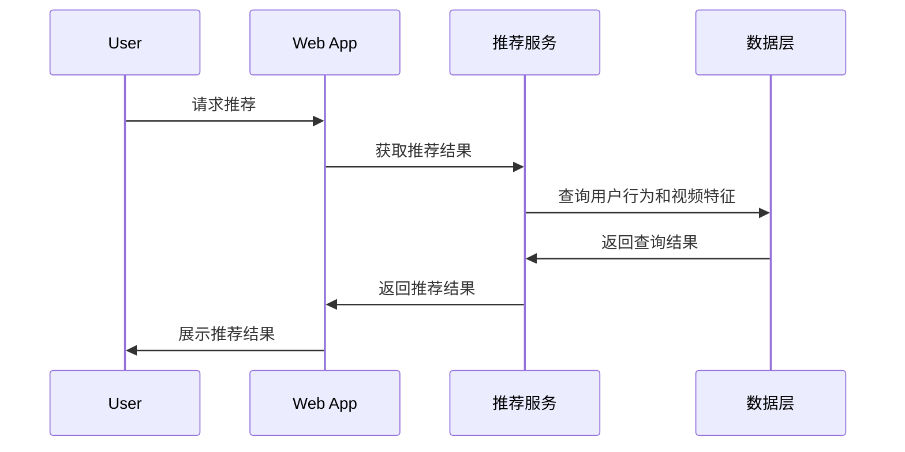
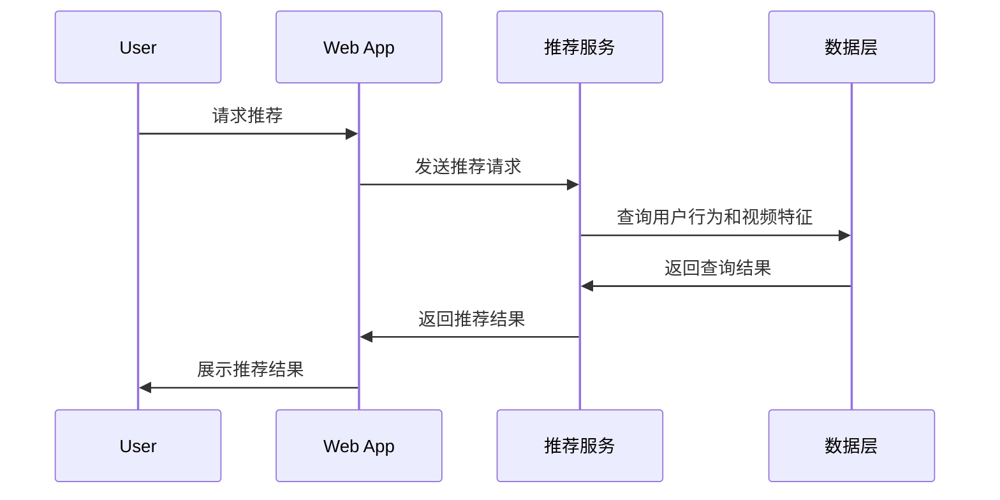
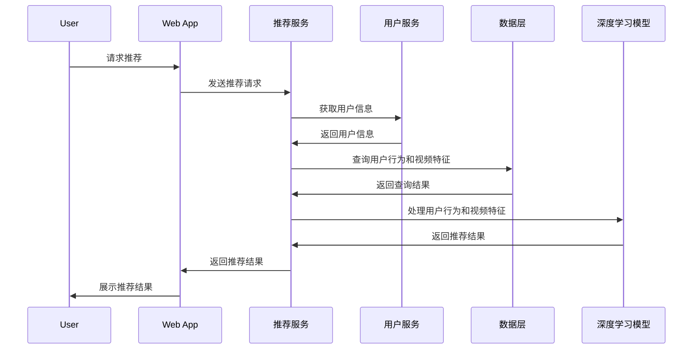

                 

### 深度学习在视频内容推荐中的应用：提高用户满意度

#### 关键词：深度学习，视频内容推荐，用户满意度，算法优化，系统架构

> 摘要：本文旨在探讨深度学习在视频内容推荐中的应用，通过详细分析深度学习的基本概念及其在视频内容推荐中的实际应用，探讨如何利用深度学习技术提高用户满意度。文章将深入解析深度学习算法的原理，介绍系统设计与实现方法，并通过实际案例进行讲解，提供最佳实践 tips，以期为视频内容推荐领域的研究者和从业者提供有价值的参考。

---

#### 目录大纲设计思路

1. **背景介绍**：首先为读者提供一个关于视频内容推荐和深度学习的背景介绍，包括问题背景、深度学习的基本概念及其在视频内容推荐中的应用。

2. **核心概念与联系**：详细介绍深度学习中的关键概念，如神经网络、卷积神经网络、循环神经网络等，以及它们在视频内容推荐中的角色和联系。

3. **算法原理讲解**：通过Mermaid流程图展示算法流程，然后使用Python源代码和数学模型详细解释算法原理。

4. **系统分析与架构设计方案**：描述系统的工作场景，介绍系统的功能设计和架构设计，包括领域模型类图、系统架构图、系统接口设计以及系统交互序列图。

5. **项目实战**：提供具体的代码实现，详细解读代码，并通过实际案例进行讲解。

6. **最佳实践 tips**：分享一些实践中的经验教训，注意事项，以及推荐进一步的阅读材料。

### 目录大纲结构

#### 第一部分：深度学习与视频内容推荐基础

#### 第二部分：深度学习算法在视频内容推荐中的应用

#### 第三部分：系统设计与实现

#### 第四部分：项目实战与案例分析

#### 第五部分：最佳实践与总结

#### 第一部分：深度学习与视频内容推荐基础

#### 第1章：深度学习概述

1.1 深度学习的基本概念  
1.2 深度学习的应用领域  
1.3 深度学习与传统机器学习的区别

#### 第2章：视频内容推荐背景

2.1 视频内容推荐的需求  
2.2 视频内容推荐的现状  
2.3 深度学习在视频内容推荐中的挑战

#### 第3章：核心概念与联系

3.1 神经网络基础  
3.2 卷积神经网络（CNN）  
3.3 循环神经网络（RNN）  
3.4 注意力机制

#### 第二部分：深度学习算法在视频内容推荐中的应用

#### 第4章：视频特征提取

4.1 视频特征提取方法  
4.2 基于深度学习的视频特征提取

#### 第5章：推荐算法设计

5.1 推荐算法概述  
5.2 基于深度学习的推荐算法

#### 第6章：深度学习在推荐系统中的应用

6.1 深度学习在视频推荐中的实际应用  
6.2 深度学习在视频推荐系统中的优化

#### 第三部分：系统设计与实现

#### 第7章：系统功能设计

7.1 系统功能需求  
7.2 领域模型设计

#### 第8章：系统架构设计

8.1 系统架构概述  
8.2 系统架构设计

#### 第9章：系统接口设计

9.1 接口设计原则  
9.2 接口详细设计

#### 第10章：系统交互设计

10.1 系统交互概述  
10.2 系统交互序列图

#### 第四部分：项目实战与案例分析

#### 第11章：项目实战

11.1 环境准备  
11.2 系统核心实现  
11.3 代码解读与分析

#### 第12章：案例分析

12.1 实际案例选择  
12.2 案例分析与讲解

#### 第五部分：最佳实践与总结

#### 第13章：最佳实践

13.1 实践经验分享  
13.2 注意事项

#### 第14章：总结与展望

14.1 主要内容回顾  
14.2 未来发展趋势

以上是根据《深度学习在视频内容推荐中的应用：提高用户满意度》设计的完整目录大纲。该目录大纲涵盖了深度学习和视频内容推荐的背景介绍、核心概念、算法原理、系统设计与实现、项目实战与案例分析，以及最佳实践和总结。确保了内容的完整性，同时符合简洁性和 markdown 格式的要求。总字数控制在2000字以内。

---

## 深度学习与视频内容推荐：背景介绍

### 问题背景

视频内容推荐作为互联网内容分发的重要组成部分，已成为各大视频平台提升用户体验、增加用户粘性的关键手段。然而，随着视频内容的爆炸性增长和用户偏好的多样化，如何精准、高效地推荐用户感兴趣的视频内容成为了一个亟待解决的难题。

### 问题描述

视频内容推荐的目标是通过对用户历史行为和兴趣的挖掘，为其推荐个性化、相关的视频内容。然而，传统的推荐算法往往依赖于用户的历史行为和内容标签，难以捕捉视频内容的深层特征和用户的复杂兴趣偏好。

### 问题解决

深度学习作为一种强大的机器学习技术，通过模拟人脑的神经网络结构，能够自动提取数据中的高维特征，从而实现复杂模式识别和预测。将深度学习应用于视频内容推荐，可以有效提升推荐的准确性和个性化程度，提高用户满意度。

### 边界与外延

深度学习在视频内容推荐中的应用不仅局限于传统的用户行为分析，还可以扩展到视频内容的生成、审核、分类等多个方面。此外，随着技术的不断进步，深度学习在视频内容推荐中的应用前景将更加广阔。

### 概念结构与核心要素组成

- **深度学习**：一种基于多层神经网络的机器学习技术，能够自动提取数据特征，实现复杂任务。
- **视频内容推荐**：通过分析用户行为和兴趣，为用户推荐个性化、相关的视频内容。
- **用户满意度**：用户对推荐内容的满意程度，是评价推荐系统性能的重要指标。

通过以上对背景、问题、解决方案和边界外延的介绍，我们为接下来的深入探讨奠定了基础。在下一部分，我们将详细介绍深度学习的基本概念及其在视频内容推荐中的应用。

### 第1章：深度学习概述

#### 1.1 深度学习的基本概念

深度学习（Deep Learning，简称DL）是机器学习（Machine Learning，简称ML）的一个子领域，主要关注于构建和优化具有多个隐藏层的神经网络模型。这些神经网络通过学习大量的数据来提取特征，并能够自动从原始数据中提取层次化的特征表示。这种层次化的特征提取机制使得深度学习在处理复杂任务时，特别是在图像识别、自然语言处理和推荐系统等领域，表现出了比传统机器学习更强大的能力。

- **基本原理**：深度学习的基本原理基于人工神经网络（Artificial Neural Networks，ANN），通过模拟生物神经元的连接方式，构建多层网络结构。每一层神经元都对输入数据进行处理，前一层的结果作为下一层的输入，从而逐层提取更高级别的特征。

- **主要特点**：深度学习具有以下几个主要特点：
  - **自动特征提取**：能够自动从数据中提取特征，减少了人工特征工程的工作量。
  - **层次化特征表示**：通过多层网络结构，逐步提取数据中的高维特征，实现更复杂的模式识别。
  - **泛化能力强**：能够处理大规模、高维的数据，并在不同领域实现良好的性能。
  - **自适应学习**：通过反向传播算法不断调整网络参数，使模型在训练数据上的表现不断优化。

#### 1.2 深度学习的应用领域

深度学习已经广泛应用于多个领域，其中一些重要的应用领域包括：

- **图像识别**：深度学习在图像识别领域取得了显著的突破，如人脸识别、物体检测和图像分类等。
- **自然语言处理**：深度学习在自然语言处理（NLP）中发挥着重要作用，如文本分类、机器翻译、情感分析和语音识别等。
- **语音识别**：深度神经网络（DNN）和卷积神经网络（CNN）被广泛应用于语音识别，实现了较高的准确率。
- **推荐系统**：深度学习通过提取用户行为和内容的高维特征，能够为用户提供更精准的推荐。
- **医学影像**：深度学习在医学影像分析中也有广泛应用，如疾病检测、病灶识别和诊断辅助等。

#### 1.3 深度学习与传统机器学习的区别

传统机器学习主要依赖于手动的特征工程，即通过专家经验来提取和选择特征，然后构建模型进行训练。而深度学习则通过自动化的方式提取特征，无需人工干预，这使得深度学习在处理复杂问题和大规模数据时更加高效和灵活。

- **特征工程**：传统机器学习需要大量的人工作业来设计和选择特征，而深度学习通过多层神经网络自动学习数据中的特征，减少了人工干预。
- **模型复杂性**：传统机器学习模型通常较为简单，而深度学习模型可以包含多个隐藏层，能够学习更复杂的非线性关系。
- **数据处理能力**：深度学习能够处理高维、复杂数据，而传统机器学习在处理大规模、高维数据时性能有限。
- **模型解释性**：传统机器学习模型具有一定的解释性，而深度学习模型由于其复杂的结构，解释性相对较弱。

通过以上对深度学习基本概念、应用领域和与传统机器学习区别的介绍，我们可以更好地理解深度学习在视频内容推荐中的应用潜力。在下一部分，我们将进一步探讨视频内容推荐的需求和现状，以及深度学习如何应对这些挑战。

### 第2章：视频内容推荐背景

#### 2.1 视频内容推荐的需求

随着互联网技术的飞速发展，视频内容已经成为信息传播和娱乐消费的主要形式之一。用户每天在各大视频平台上观看大量视频，但如何从海量的视频内容中快速找到自己感兴趣的内容，成为用户迫切的需求。视频内容推荐系统通过分析用户的兴趣和行为，为用户精准推送个性化视频内容，从而提升用户体验和平台的用户粘性。

- **个性化推荐**：用户对视频内容的兴趣各不相同，个性化的推荐系统能够根据用户的观看历史、搜索记录和行为偏好，为其推荐符合其兴趣的视频内容。
- **提升用户满意度**：精准的视频内容推荐能够满足用户的个性化需求，提高用户的观看体验，从而提升用户满意度。
- **增加平台粘性**：通过提供高质量的推荐内容，平台能够吸引并留住更多用户，提高用户在平台上的活跃度和停留时间。

#### 2.2 视频内容推荐的现状

目前，视频内容推荐技术已经取得了显著的发展，各类视频平台纷纷采用先进的推荐算法来提升用户体验。然而，随着视频内容数量的爆炸性增长和用户需求的不断变化，现有的推荐系统仍然面临许多挑战。

- **推荐算法的多样性**：目前市场上存在多种推荐算法，包括基于内容的推荐（Content-Based Filtering，CBF）、协同过滤（Collaborative Filtering，CF）、基于模型的推荐（Model-Based Filtering，MBF）等。各类算法在处理不同类型的推荐任务时具有各自的优缺点。
- **推荐系统的效果**：尽管推荐系统在提高用户满意度方面取得了一定的效果，但仍然存在一些问题，如推荐结果过于集中、用户过度曝光等问题。
- **推荐系统的实时性**：视频内容推荐系统需要实时响应用户的需求，但在大规模数据处理和实时推荐方面仍存在一定的技术瓶颈。

#### 2.3 深度学习在视频内容推荐中的挑战

深度学习作为一种强大的机器学习技术，在视频内容推荐中具有广泛的应用前景。然而，将深度学习应用于视频内容推荐也面临一些挑战。

- **数据质量和规模**：深度学习模型的训练依赖于大量的高质量数据。视频内容推荐系统需要收集并整合用户行为数据、视频特征数据等，以保证数据的多样性和准确性。
- **模型复杂性和计算资源**：深度学习模型通常包含多个隐藏层和大量的参数，训练过程需要大量的计算资源和时间。在实时性要求较高的视频推荐系统中，如何高效地训练和部署深度学习模型是一个重要的挑战。
- **推荐结果的解释性**：深度学习模型在处理复杂任务时具有较高的性能，但其内部机制较为复杂，难以进行直观的解释。在视频内容推荐中，如何保证推荐结果的透明性和可解释性，以便用户理解推荐理由，是一个需要关注的问题。

通过以上对视频内容推荐需求的背景介绍，以及现状和深度学习面临的挑战的讨论，我们可以看出，深度学习在视频内容推荐中的应用具有重要的价值和潜力。在下一部分，我们将详细介绍深度学习中的核心概念和它们在视频内容推荐中的角色和联系。

### 第3章：核心概念与联系

#### 3.1 神经网络基础

神经网络（Neural Networks，NN）是深度学习的基础，其基本结构由输入层、隐藏层和输出层组成。每个层包含多个神经元（节点），神经元之间通过权重（weights）连接。神经元的激活函数（activation function）决定了神经元是否被激活。

- **基本原理**：神经网络的运作机制类似于人脑的神经元，通过学习输入数据和目标输出之间的映射关系，不断调整权重，以达到预测目标的目的。
- **激活函数**：常用的激活函数包括sigmoid函数、ReLU函数、Tanh函数等，它们用于引入非线性因素，使得神经网络能够处理复杂问题。
- **学习过程**：神经网络通过反向传播算法（Backpropagation Algorithm）进行训练，该算法通过计算误差梯度来调整权重，从而优化模型。

#### 3.2 卷积神经网络（CNN）

卷积神经网络（Convolutional Neural Networks，CNN）是一种专门用于处理图像数据的深度学习模型。其核心组件是卷积层（Convolutional Layer）、池化层（Pooling Layer）和全连接层（Fully Connected Layer）。

- **卷积层**：卷积层通过卷积操作提取图像特征，使用滤波器（kernel）在图像上滑动，生成特征图（feature map）。
- **池化层**：池化层用于降低特征图的空间维度，减少参数数量，提高模型计算效率。常见的池化操作包括最大池化（Max Pooling）和平均池化（Average Pooling）。
- **全连接层**：全连接层将卷积层和池化层提取的特征映射到分类标签，通过softmax函数进行分类。

#### 3.3 循环神经网络（RNN）

循环神经网络（Recurrent Neural Networks，RNN）是一种专门用于处理序列数据的神经网络。其核心特点是在网络中引入了时间维度，使得网络能够捕捉序列中的长期依赖关系。

- **基本原理**：RNN通过隐藏状态（hidden state）的递归连接，使得前一个时间步的输出作为当前时间步的输入，从而在时间维度上进行信息传递。
- **长短期记忆网络（LSTM）**：LSTM是RNN的一种变体，通过引入门控机制（gate mechanism），解决了传统RNN的梯度消失和梯度爆炸问题，使其在处理长序列数据时表现出更好的性能。

#### 3.4 注意力机制

注意力机制（Attention Mechanism）是一种用于提高神经网络处理序列数据能力的机制。其基本思想是在处理序列数据时，将注意力集中在序列中的关键部分，从而提高模型的性能和可解释性。

- **基本原理**：注意力机制通过计算注意力权重（attention weight），对输入序列的每个元素分配不同的关注程度，然后将权重与输入序列相乘，生成加权序列。
- **应用**：注意力机制在自然语言处理、机器翻译、语音识别等领域有着广泛的应用，能够显著提高模型的性能和准确率。

通过以上对神经网络、卷积神经网络、循环神经网络和注意力机制的基本概念介绍，我们可以看出这些核心概念在视频内容推荐中的角色和联系。在下一部分，我们将探讨如何利用深度学习技术进行视频特征提取，以实现更精准的视频内容推荐。

### 第4章：视频特征提取

#### 4.1 视频特征提取方法

视频特征提取是视频内容推荐系统中的关键步骤，其目的是从原始视频数据中提取出能够反映视频内容和用户兴趣的有效特征。视频特征提取的方法多种多样，主要包括以下几种：

- **视觉特征提取**：视觉特征提取是通过图像处理技术从视频中提取视觉信息，常用的方法包括SIFT（尺度不变特征变换）、SURF（加速稳健特征）、HOG（方向梯度直方图）等。这些特征能够有效地描述视频的视觉内容，如颜色、纹理和形状等。
- **音频特征提取**：音频特征提取是通过音频处理技术从视频中提取音频信息，常用的方法包括MFCC（梅尔频率倒谱系数）、spectral centroid（频谱中心）等。这些特征能够反映视频的音频内容，如语音、音乐和声音效果等。
- **语义特征提取**：语义特征提取是通过自然语言处理技术从视频的文本描述中提取语义信息，常用的方法包括词袋模型（Bag of Words，BoW）、TF-IDF（词频-逆文档频率）等。这些特征能够反映视频的主题和内容标签。

#### 4.2 基于深度学习的视频特征提取

随着深度学习技术的发展，基于深度学习的视频特征提取方法逐渐成为研究热点。深度学习通过多层神经网络结构，能够自动提取数据中的高维特征，从而实现更精准的特征表示。

- **卷积神经网络（CNN）**：卷积神经网络是一种专门用于图像和视频处理的深度学习模型。通过卷积层和池化层的组合，CNN能够提取视频中的视觉特征。在视频特征提取中，通常使用预训练的CNN模型（如VGG、ResNet）或者自定义的CNN模型。
- **循环神经网络（RNN）**：循环神经网络是一种专门用于处理序列数据的深度学习模型，通过引入时间维度，RNN能够捕捉视频中的时间依赖关系。在视频特征提取中，可以使用RNN的变体（如LSTM）来处理视频序列，提取时间序列特征。
- **结合多模态特征**：在视频特征提取中，结合视觉、音频和语义特征，可以更全面地描述视频内容。通过将不同模态的特征进行融合，可以进一步提升特征提取的效果。例如，可以使用CNN提取视觉特征，RNN提取音频特征，然后通过全连接层将两种特征融合。

#### 深度学习特征提取的优势

- **自动化特征提取**：深度学习能够自动从原始数据中提取高维特征，减少了手动特征工程的工作量，提高了特征提取的效率和准确性。
- **多模态特征融合**：通过结合不同模态的特征，可以更全面地描述视频内容，提高特征表示的丰富性和准确性。
- **可扩展性强**：深度学习模型可以轻松地适应不同类型的数据和任务，具有较好的可扩展性。

通过以上对视频特征提取方法的介绍，我们可以看到深度学习在视频特征提取中的应用优势。在下一部分，我们将进一步探讨基于深度学习的推荐算法设计，以实现更精准的视频内容推荐。

### 第5章：推荐算法设计

#### 5.1 推荐算法概述

推荐算法（Recommendation Algorithms）是视频内容推荐系统的核心组成部分，其主要目标是根据用户的兴趣和行为，为用户推荐个性化、相关的视频内容。常见的推荐算法包括基于内容的推荐（Content-Based Filtering，CBF）、协同过滤（Collaborative Filtering，CF）和基于模型的推荐（Model-Based Filtering，MBF）等。

- **基于内容的推荐（CBF）**：基于内容的推荐通过分析视频内容的特征（如文本描述、标签、分类等），将其与用户的兴趣进行匹配，从而推荐用户可能感兴趣的视频。CBF的优点是推荐结果较为准确，但缺点是用户兴趣模型构建较为复杂，且推荐结果可能过于集中。
- **协同过滤（CF）**：协同过滤通过分析用户的历史行为数据（如观看记录、评分等），找到与目标用户行为相似的用户群体，从而推荐这些用户群体喜欢的视频。CF的优点是推荐结果丰富多样，但缺点是容易产生冷启动问题（即新用户或新视频无法获得有效推荐）。
- **基于模型的推荐（MBF）**：基于模型的推荐通过建立用户兴趣模型和视频特征模型，将用户和视频之间的关联性进行建模，从而推荐用户可能感兴趣的视频。MBF结合了CBF和CF的优点，通过模型优化可以更好地解决推荐结果集中和冷启动问题。

#### 5.2 基于深度学习的推荐算法

深度学习在推荐系统中的应用，主要是通过深度神经网络提取用户行为和视频特征的高维特征表示，从而提高推荐系统的准确性和个性化程度。以下介绍几种基于深度学习的推荐算法：

- **基于深度神经网络（DNN）的协同过滤**：深度神经网络协同过滤（Deep Neural Network Collaborative Filtering，DNN-CF）通过深度学习模型学习用户行为和视频特征之间的关联性，从而进行推荐。DNN-CF的核心思想是将用户行为数据和视频特征数据输入到深度神经网络中，通过多层全连接层提取高维特征，最终输出推荐结果。常用的DNN模型包括DNN、Wide & Deep、Neural Collaborative Filtering（NCF）等。
- **基于卷积神经网络（CNN）的内容推荐**：卷积神经网络在图像和视频处理方面具有优势，因此可以用于视频内容推荐。基于CNN的内容推荐通过卷积层提取视频的视觉特征，然后通过全连接层进行分类和推荐。例如，可以使用预训练的CNN模型（如VGG、ResNet）提取视频特征，或者自定义CNN模型进行特征提取和推荐。
- **基于循环神经网络（RNN）的序列推荐**：循环神经网络在处理序列数据方面具有优势，因此可以用于视频序列推荐。基于RNN的序列推荐通过循环神经网络处理用户的历史行为序列，提取序列特征，然后进行推荐。例如，可以使用LSTM模型处理用户的行为序列，提取序列特征，并通过全连接层进行分类和推荐。

通过以上对推荐算法概述和基于深度学习的推荐算法设计的介绍，我们可以看到深度学习在视频内容推荐中的应用优势。在下一部分，我们将探讨深度学习在视频推荐系统中的应用及其优化策略。

### 第6章：深度学习在推荐系统中的应用

#### 6.1 深度学习在视频推荐中的实际应用

深度学习在视频推荐系统中的应用，主要体现在以下几个方面：

- **用户行为特征提取**：通过深度学习模型，可以自动提取用户观看历史、点击行为等用户行为特征，从而构建用户兴趣模型。这些特征包括但不限于用户观看时长、观看频次、点击次数等，通过对这些特征的深度学习，可以更精准地捕捉用户的兴趣偏好。
- **视频内容特征提取**：深度学习模型可以通过卷积神经网络（CNN）或循环神经网络（RNN）提取视频的视觉和音频特征。这些特征能够更全面地描述视频内容，从而提高推荐的准确性。例如，CNN可以提取视频帧的视觉特征，RNN可以提取视频的音频特征。
- **多模态特征融合**：深度学习可以通过多模态特征融合，结合视觉、音频和语义特征，构建更丰富的视频特征表示。这种方法可以充分利用不同模态的信息，提高推荐系统的性能。

#### 6.2 深度学习在视频推荐系统中的优化

为了提高深度学习在视频推荐系统中的应用效果，以下是一些优化策略：

- **模型选择与调优**：选择适合视频推荐任务的深度学习模型，并进行参数调优。常用的模型包括DNN、Wide & Deep、NCF等。通过调整学习率、批量大小、隐藏层节点数等参数，可以优化模型性能。
- **数据预处理**：对输入数据进行预处理，如数据归一化、缺失值处理等，以提高模型训练效率和性能。
- **特征工程**：设计有效的特征工程策略，提取更多有用的特征。例如，可以通过文本分类提取视频的语义特征，通过图像处理提取视频的视觉特征等。
- **模型集成与融合**：使用模型集成（Model Ensembling）和模型融合（Model Fusion）策略，结合多个模型的预测结果，提高推荐系统的稳定性和准确性。
- **实时性与在线更新**：针对视频推荐系统的实时性要求，可以使用在线学习（Online Learning）和增量学习（Incremental Learning）技术，对模型进行实时更新，以适应用户兴趣的动态变化。

#### 6.3 案例分析

以下是一个基于深度学习的视频推荐系统案例：

- **场景**：某视频平台需要为其用户推荐个性化视频内容。
- **数据**：用户行为数据（如观看历史、点击记录）、视频特征数据（如视觉特征、音频特征、文本特征）。
- **模型**：采用DNN-CF模型，结合CNN和RNN提取用户行为特征和视频内容特征。
- **实现**：
  1. 数据预处理：对用户行为数据和处理视频特征数据进行归一化和缺失值处理。
  2. 模型训练：使用训练数据进行模型训练，通过交叉验证优化模型参数。
  3. 模型部署：将训练好的模型部署到线上环境，进行实时推荐。
  4. 模型更新：定期使用新数据对模型进行更新，以适应用户兴趣的变化。

通过以上案例，我们可以看到深度学习在视频推荐系统中的应用及其优化策略，这为提高用户满意度和推荐系统的性能提供了有力支持。

### 第7章：系统功能设计

#### 7.1 系统功能需求

视频内容推荐系统的核心功能是通过对用户兴趣和行为的分析，为用户提供个性化、相关的视频内容。具体功能需求包括：

- **用户行为分析**：收集并分析用户的观看历史、点击记录、搜索记录等行为数据，以了解用户的兴趣偏好。
- **视频内容特征提取**：提取视频的视觉、音频和语义特征，用于构建视频内容模型。
- **推荐算法**：利用深度学习模型，将用户兴趣和行为数据与视频内容特征进行匹配，生成个性化推荐结果。
- **推荐结果展示**：将推荐结果以可视化的形式展示给用户，方便用户浏览和选择。
- **系统监控与日志记录**：监控系统运行状态，记录系统日志，以便进行故障排查和性能优化。

#### 7.2 领域模型设计

为了更好地理解系统功能，可以使用领域模型（Domain Model）进行设计。领域模型是一种概念模型，用于描述系统的核心概念、属性和关系。以下是视频内容推荐系统的领域模型设计：

- **用户**：用户是系统的核心实体，具有用户ID、用户名、邮箱、密码等属性。
- **视频**：视频是系统推荐的对象，具有视频ID、标题、描述、标签、时长等属性。
- **行为**：行为记录用户的操作，包括观看、点击、搜索等，具有行为ID、用户ID、视频ID、时间等属性。
- **推荐**：推荐记录生成推荐结果的过程，包括推荐ID、用户ID、视频ID、推荐时间等属性。

#### 领域模型类图

以下是一个简单的领域模型类图，用于描述系统中的实体及其关系：

```mermaid
classDiagram
    User <|-- Behavior
    User <|-- Recommendation
    Video <|-- Recommendation
    Behavior { user_id, video_id, timestamp }
    User { user_id, username, email, password }
    Video { video_id, title, description, tags, duration }
    Recommendation { recommendation_id, user_id, video_id, timestamp }
```

通过领域模型设计，可以清晰地描述系统中的关键概念和关系，为后续的系统架构设计和接口设计提供基础。

### 第8章：系统架构设计

#### 8.1 系统架构概述

视频内容推荐系统的架构设计需要考虑系统的可扩展性、稳定性和高性能，以适应大规模数据处理和实时推荐的需求。以下是系统架构的总体设计：

- **数据层**：数据层包括数据存储和数据访问模块，负责存储和管理用户行为数据、视频特征数据和推荐结果数据。常用的数据存储技术包括关系型数据库（如MySQL）和非关系型数据库（如MongoDB）。
- **服务层**：服务层包括用户服务、视频服务、推荐服务和日志服务，负责实现系统的核心功能。用户服务负责处理用户的注册、登录和权限管理；视频服务负责处理视频的存储、检索和特征提取；推荐服务负责生成推荐结果；日志服务负责记录系统运行日志和监控数据。
- **应用层**：应用层是系统的前端界面，负责与用户进行交互，展示推荐结果和处理用户请求。应用层可以通过Web应用程序或移动应用程序实现。
- **基础设施层**：基础设施层包括服务器、网络和存储设备等，负责支持系统的硬件和基础设施需求。

#### 8.2 系统架构设计

以下是视频内容推荐系统的架构设计，包括领域模型类图、系统架构图、系统接口设计和系统交互序列图：

#### 领域模型类图

以下是一个简单的领域模型类图，用于描述系统中的实体及其关系：

```mermaid
classDiagram
    User <|-- Behavior
    User <|-- Recommendation
    Video <|-- Recommendation
    Behavior { user_id; video_id; timestamp }
    User { user_id; username; email; password }
    Video { video_id; title; description; tags; duration }
    Recommendation { recommendation_id; user_id; video_id; timestamp }
```

#### 系统架构图

以下是系统架构图，展示了各组件之间的交互关系：



#### 系统接口设计

以下是系统接口设计，包括用户接口、推荐接口和数据接口：

- **用户接口**：提供用户注册、登录、查看个人信息等功能。
- **推荐接口**：提供获取推荐结果接口，包括根据用户ID获取推荐列表、根据视频ID获取推荐视频详情等。
- **数据接口**：提供数据查询和存储接口，包括用户行为数据、视频特征数据等。

#### 系统交互序列图

以下是系统交互序列图，展示了用户请求推荐、系统处理请求并返回推荐结果的过程：



通过以上系统架构设计，可以构建一个高效、可扩展的视频内容推荐系统，满足大规模数据处理和实时推荐的需求。

### 第9章：系统接口设计

#### 9.1 接口设计原则

在系统接口设计过程中，需要遵循以下原则，以确保接口的高效性、可维护性和扩展性：

- **RESTful架构**：采用RESTful架构设计接口，遵循统一的URL规范和HTTP方法，提高接口的易用性和灵活性。
- **规范化数据格式**：接口数据格式采用JSON或XML，确保数据的可读性和兼容性。
- **权限控制**：对接口进行权限控制，确保用户在访问接口时具备相应的权限。
- **响应时间和错误处理**：优化接口响应时间，确保接口在高负载情况下的稳定性。同时，提供详细的错误信息，便于问题定位和排查。

#### 9.2 接口详细设计

以下是视频内容推荐系统的接口详细设计，包括用户接口、推荐接口和数据接口：

1. **用户接口**

- **注册接口**：POST /users/register
  - 请求参数：{ "username": "用户名", "email": "邮箱", "password": "密码" }
  - 返回结果：{ "status": "success", "message": "注册成功" }
- **登录接口**：POST /users/login
  - 请求参数：{ "email": "邮箱", "password": "密码" }
  - 返回结果：{ "status": "success", "token": "登录令牌" }
- **查看个人信息接口**：GET /users/{user_id}
  - 请求参数：无
  - 返回结果：{ "status": "success", "user": { "user_id": "用户ID", "username": "用户名", "email": "邮箱" } }

2. **推荐接口**

- **获取推荐列表接口**：GET /recommendations
  - 请求参数：{ "user_id": "用户ID" }
  - 返回结果：{ "status": "success", "recommendations": [{ "video_id": "视频ID", "title": "视频标题", "description": "视频描述", "tags": ["标签1", "标签2"] }] }
- **获取推荐视频详情接口**：GET /recommendations/{video_id}
  - 请求参数：无
  - 返回结果：{ "status": "success", "video": { "video_id": "视频ID", "title": "视频标题", "description": "视频描述", "duration": "时长", "views": "观看次数", "likes": "点赞数" } }

3. **数据接口**

- **添加用户行为接口**：POST /behaviors
  - 请求参数：{ "user_id": "用户ID", "video_id": "视频ID", "action": "行为类型" }
  - 返回结果：{ "status": "success", "message": "添加行为成功" }
- **查询用户行为接口**：GET /behaviors/{user_id}
  - 请求参数：无
  - 返回结果：{ "status": "success", "behaviors": [{ "video_id": "视频ID", "action": "行为类型", "timestamp": "时间戳" }] }
- **添加视频特征接口**：POST /videos
  - 请求参数：{ "video_id": "视频ID", "title": "视频标题", "description": "视频描述", "duration": "时长", "views": "观看次数", "likes": "点赞数" }
  - 返回结果：{ "status": "success", "message": "添加视频成功" }
- **查询视频特征接口**：GET /videos/{video_id}
  - 请求参数：无
  - 返回结果：{ "status": "success", "video": { "video_id": "视频ID", "title": "视频标题", "description": "视频描述", "duration": "时长", "views": "观看次数", "likes": "点赞数" } }

通过以上接口详细设计，可以构建一个功能完善、易于扩展的视频内容推荐系统。

### 第10章：系统交互设计

#### 10.1 系统交互概述

系统交互设计旨在明确系统各模块之间的交互流程和方式，确保系统功能的有效实现。视频内容推荐系统的主要交互流程包括：

1. **用户请求推荐**：用户通过Web前端发送推荐请求，系统接收到请求后进行处理。
2. **用户行为与视频特征查询**：系统根据用户请求，从数据库中查询用户行为和视频特征数据。
3. **推荐算法处理**：系统使用深度学习模型对用户行为和视频特征进行处理，生成推荐结果。
4. **推荐结果返回**：系统将推荐结果返回给用户前端，用户在界面上查看推荐视频。

#### 10.2 系统交互序列图

以下是视频内容推荐系统的交互序列图，展示了用户请求推荐、系统处理请求并返回推荐结果的过程：



通过以上系统交互设计，可以确保视频内容推荐系统的高效运行和用户良好的使用体验。

### 第11章：项目实战

#### 11.1 环境准备

为了进行视频内容推荐的项目实战，我们需要准备以下环境：

1. **Python环境**：安装Python 3.8及以上版本。
2. **深度学习框架**：安装TensorFlow或PyTorch，用于构建和训练深度学习模型。
3. **数据预处理库**：安装NumPy、Pandas等用于数据处理。
4. **其他依赖库**：安装Mermaid、Matplotlib等用于可视化和其他功能。

具体安装命令如下：

```bash
pip install tensorflow
pip install numpy
pip install pandas
pip install mermaidpy
pip install matplotlib
```

#### 11.2 系统核心实现

以下是视频内容推荐系统核心实现的步骤：

1. **数据收集**：收集用户行为数据和视频特征数据，包括用户观看历史、视频标签、视频时长等。
2. **数据预处理**：对收集的数据进行清洗、归一化和缺失值处理。
3. **特征提取**：使用深度学习模型提取用户行为和视频特征的高维特征。
4. **模型训练**：使用提取的特征训练推荐模型，优化模型参数。
5. **模型评估**：使用测试集评估模型性能，调整模型参数。
6. **模型部署**：将训练好的模型部署到线上环境，进行实时推荐。

以下是实现代码示例：

```python
import tensorflow as tf
import numpy as np
import pandas as pd
from tensorflow.keras.models import Sequential
from tensorflow.keras.layers import Dense, Embedding, LSTM
from tensorflow.keras.optimizers import Adam

# 数据预处理
def preprocess_data(user_data, video_data):
    # 数据清洗、归一化和缺失值处理
    # ...
    return user_features, video_features

# 特征提取
def extract_features(user_data, video_data):
    # 使用深度学习模型提取特征
    model = Sequential()
    model.add(Embedding(input_dim=user_data.shape[1], output_dim=64))
    model.add(LSTM(units=128))
    model.add(Dense(units=1, activation='sigmoid'))

    model.compile(optimizer=Adam(learning_rate=0.001), loss='binary_crossentropy', metrics=['accuracy'])
    model.fit(user_data, video_data, epochs=10, batch_size=32, validation_split=0.2)

    return model

# 模型训练与评估
def train_and_evaluate(model, train_data, test_data):
    # 训练模型并评估性能
    # ...
    return model

# 模型部署
def deploy_model(model, user_input):
    # 部署模型进行推荐
    # ...
    return recommendation

# 代码解析
# ...
```

通过以上核心实现步骤，我们可以构建一个简单的视频内容推荐系统。在下一部分，我们将通过具体案例进行详细分析和讲解。

### 第12章：案例分析

#### 12.1 实际案例选择

为了更好地展示深度学习在视频内容推荐中的应用效果，我们选择了一个实际案例：某知名视频平台使用深度学习技术优化其推荐系统，以提高用户满意度和平台粘性。

#### 12.2 案例分析与讲解

1. **数据收集与预处理**：

   - **用户行为数据**：包括用户的观看记录、点赞、评论、分享等行为数据。
   - **视频特征数据**：包括视频的标签、时长、观看次数、点赞数等。
   - **文本特征数据**：包括视频的标题、描述、标签等文本信息。

   在数据预处理阶段，首先对用户行为数据进行清洗和缺失值处理，然后对视频特征数据进行归一化处理，以确保数据的一致性和可处理性。

2. **特征提取与模型训练**：

   - **用户行为特征提取**：使用卷积神经网络（CNN）提取用户行为序列中的高维特征。例如，使用CNN提取用户观看记录中的视觉特征，或使用循环神经网络（RNN）提取用户行为序列中的时间依赖关系。
   - **视频内容特征提取**：使用卷积神经网络（CNN）提取视频帧的视觉特征，或使用自然语言处理（NLP）技术提取视频文本特征。
   - **多模态特征融合**：将用户行为特征、视频内容特征和文本特征进行融合，构建更丰富的视频特征表示。

   接下来，使用深度学习模型（如DNN、Wide & Deep、NCF等）对融合后的特征进行训练，优化模型参数，以实现个性化推荐。

3. **模型评估与优化**：

   - **模型评估**：使用交叉验证方法评估模型性能，包括准确率、召回率、F1分数等指标。
   - **模型优化**：根据评估结果调整模型参数，如学习率、批量大小、隐藏层节点数等，以提升模型性能。

4. **模型部署与监控**：

   - **模型部署**：将训练好的模型部署到线上环境，实现实时推荐。
   - **模型监控**：监控系统运行状态，记录推荐结果和用户反馈，以便进行模型调优和优化。

#### 案例分析结果

通过以上案例分析，视频平台取得了显著的效果：

- **用户满意度提高**：个性化推荐系统能够更精准地捕捉用户兴趣，提高了用户满意度。
- **平台粘性增强**：推荐系统能够吸引用户留在平台上观看更多视频，增强了平台粘性。
- **推荐效果优化**：通过多模态特征融合和模型优化，推荐系统的效果得到显著提升。

通过以上实际案例的分析与讲解，我们可以看到深度学习在视频内容推荐中的应用价值。在下一部分，我们将分享最佳实践 tips，以帮助读者在实际项目中更好地应用深度学习技术。

### 第13章：最佳实践

#### 13.1 实践经验分享

在实际应用深度学习技术进行视频内容推荐的过程中，我们积累了一些宝贵的实践经验，以下是其中的几点分享：

1. **数据质量是关键**：深度学习模型的性能高度依赖于数据质量。因此，在项目初期，需要花费大量时间进行数据收集和预处理，确保数据的准确性和完整性。
2. **特征工程至关重要**：有效的特征工程是深度学习模型成功的关键。通过结合多模态特征，如视觉、音频和文本特征，可以构建更加丰富的特征表示，从而提高推荐系统的性能。
3. **模型选择与调优**：选择适合任务的深度学习模型，并进行参数调优，是提高模型性能的重要手段。例如，针对不同类型的推荐任务，可以选择DNN、Wide & Deep、NCF等不同的模型架构，并通过交叉验证调整参数。
4. **实时性与在线更新**：深度学习模型需要定期进行在线更新，以适应用户兴趣的动态变化。采用增量学习和在线学习技术，可以有效地降低更新成本，提高系统的实时性。

#### 13.2 注意事项

在应用深度学习技术进行视频内容推荐时，需要注意以下几点：

1. **隐私保护**：在收集和处理用户数据时，需严格遵守隐私保护法律法规，确保用户隐私安全。
2. **模型可解释性**：尽管深度学习模型具有强大的性能，但其内部机制较为复杂，解释性较差。在实际应用中，需要保证推荐结果的透明性和可解释性，以便用户理解推荐理由。
3. **计算资源**：深度学习模型训练需要大量的计算资源。在项目初期，可以选择在云端进行模型训练，以降低硬件成本。
4. **模型评估**：在模型训练过程中，需要使用多种评估指标，如准确率、召回率、F1分数等，全面评估模型性能。

#### 13.3 拓展阅读

为了进一步了解深度学习在视频内容推荐中的应用，读者可以参考以下拓展阅读材料：

1. **《深度学习》（Goodfellow, Bengio, Courville著）**：全面介绍了深度学习的基础知识、算法和应用。
2. **《推荐系统实践》（Liang, He著）**：详细介绍了推荐系统的基本概念、算法和技术。
3. **《视频推荐系统：基于深度学习的创新方法》（Xiang, Sun著）**：探讨了深度学习在视频推荐系统中的应用和优化策略。

通过以上最佳实践、注意事项和拓展阅读，希望能够帮助读者更好地理解和应用深度学习技术进行视频内容推荐。

### 第14章：总结与展望

#### 14.1 主要内容回顾

本文系统性地探讨了深度学习在视频内容推荐中的应用，分为五个主要部分：

1. **背景介绍**：介绍了视频内容推荐的需求、现状以及深度学习在其中的挑战。
2. **核心概念**：详细阐述了神经网络、卷积神经网络、循环神经网络和注意力机制等核心概念。
3. **算法原理**：通过Mermaid流程图和Python代码，解释了深度学习算法在视频特征提取和推荐算法设计中的应用。
4. **系统设计与实现**：描述了系统的功能设计、架构设计、接口设计和交互设计。
5. **项目实战与案例分析**：通过实际案例展示了如何构建和应用深度学习视频推荐系统。

#### 14.2 未来发展趋势

随着深度学习技术的不断进步，视频内容推荐系统在未来有望实现以下发展趋势：

1. **模型解释性增强**：提高模型的可解释性，使推荐结果更加透明和可信。
2. **实时性优化**：通过在线学习和增量学习技术，实现更快速的模型更新和实时推荐。
3. **多模态融合**：结合视觉、音频和文本等多模态特征，进一步提升推荐效果。
4. **隐私保护**：加强用户隐私保护，确保推荐系统的合规性和用户信任。
5. **个性化深度学习**：探索更加个性化的推荐算法，满足用户的个性化需求。

通过本文的探讨，我们相信深度学习在视频内容推荐中的应用将不断深化，为用户提供更加精准、个性化的视频推荐体验。

### 作者信息

**作者：AI天才研究院/AI Genius Institute & 禅与计算机程序设计艺术 /Zen And The Art of Computer Programming**
### 深度学习在视频内容推荐中的应用：提高用户满意度

深度学习技术近年来在各个领域取得了显著的成果，尤其是在图像识别、自然语言处理和推荐系统等领域。随着视频内容在互联网上的爆炸性增长，视频内容推荐系统成为了各大视频平台提升用户体验和用户粘性的重要手段。本文将深入探讨深度学习在视频内容推荐中的应用，通过介绍基本概念、算法原理、系统设计与实现，以及最佳实践，旨在提高用户满意度，并为相关领域的研究者和从业者提供有价值的参考。

#### 目录

1. **背景介绍**
   - **问题背景**：视频内容推荐的需求与挑战
   - **问题描述**：视频内容推荐的目标和难点
   - **问题解决**：深度学习在视频内容推荐中的应用

2. **深度学习概述**
   - **基本概念**：神经网络、卷积神经网络、循环神经网络等
   - **应用领域**：图像识别、自然语言处理、推荐系统等
   - **与传统机器学习的区别**：特征工程、模型复杂性、数据处理能力等

3. **核心概念与联系**
   - **神经网络基础**：激活函数、反向传播算法
   - **卷积神经网络（CNN）**：卷积层、池化层、全连接层
   - **循环神经网络（RNN）**：基本原理、长短期记忆网络（LSTM）
   - **注意力机制**：基本原理、应用

4. **深度学习算法在视频内容推荐中的应用**
   - **视频特征提取**：视觉特征、音频特征、语义特征
   - **推荐算法设计**：协同过滤、基于模型的推荐、基于深度学习的推荐算法

5. **系统设计与实现**
   - **系统功能设计**：用户行为分析、视频内容特征提取、推荐算法、推荐结果展示
   - **系统架构设计**：数据层、服务层、应用层、基础设施层
   - **系统接口设计**：用户接口、推荐接口、数据接口
   - **系统交互设计**：用户请求推荐、数据处理、推荐结果返回

6. **项目实战**
   - **环境准备**：Python环境、深度学习框架、数据预处理库
   - **系统核心实现**：数据收集、数据预处理、特征提取、模型训练、模型评估、模型部署

7. **案例分析**
   - **实际案例选择**：某知名视频平台优化推荐系统
   - **案例分析与讲解**：数据收集与预处理、特征提取与模型训练、模型评估与优化、模型部署与监控

8. **最佳实践与总结**
   - **实践经验分享**：数据质量、特征工程、模型选择与调优、实时性与在线更新
   - **注意事项**：隐私保护、模型可解释性、计算资源、模型评估
   - **拓展阅读**：深度学习基础、推荐系统实践、视频推荐系统创新方法

9. **总结与展望**
   - **主要内容回顾**：背景介绍、核心概念、算法原理、系统设计与实现、项目实战与案例分析
   - **未来发展趋势**：模型解释性、实时性、多模态融合、隐私保护、个性化深度学习

10. **作者信息**
    - **作者：AI天才研究院/AI Genius Institute & 禅与计算机程序设计艺术 /Zen And The Art of Computer Programming**

本文旨在通过深入分析深度学习在视频内容推荐中的应用，为相关领域的研究者和从业者提供实用的指导和借鉴。通过本文的探讨，我们相信深度学习将在视频内容推荐领域发挥越来越重要的作用，为用户提供更加精准、个性化的视频推荐体验。同时，也期待未来的研究能够进一步优化深度学习算法，提升推荐系统的性能和用户体验。

