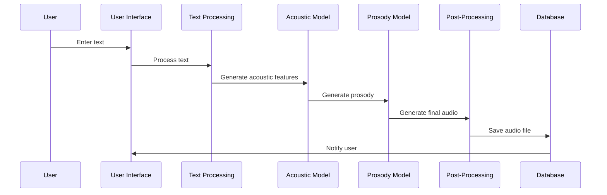
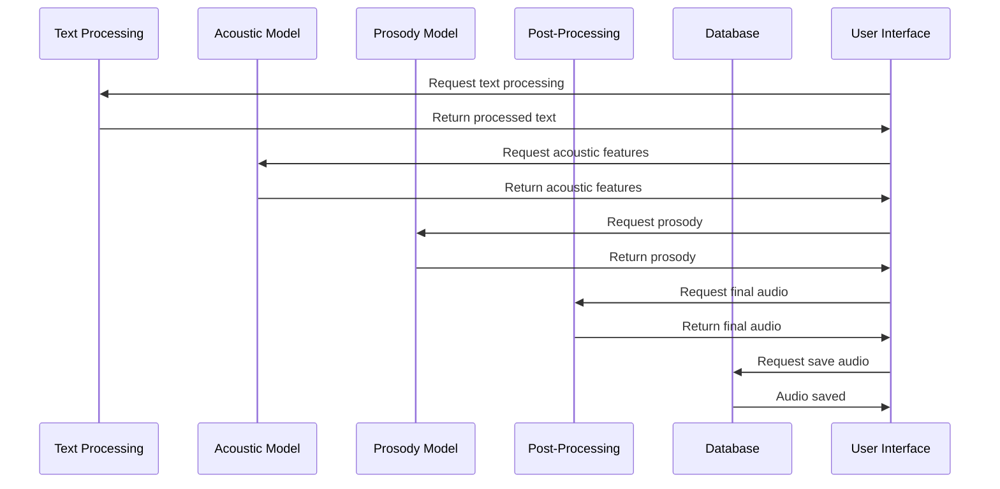

                 

### 《深度学习在语音合成中的进展：创造更自然的AI声音》

关键词：深度学习，语音合成，自然语言处理，自然语音，人工智能

摘要：本文将探讨深度学习在语音合成领域的最新进展，包括核心算法、系统设计与项目实战。通过逐步分析，我们将了解如何利用深度学习技术创造更自然的AI声音。

----------------------------------------------------------------

## 目录

1. **背景与概念**
   1.1 问题背景
   1.2 深度学习概述
   1.3 语音合成基础
   1.4 深度学习在语音合成中的应用
   1.5 核心概念与联系
2. **核心算法与原理**
   2.1 声学模型设计
   2.2 语调模型与语音风格
   2.3 数学模型与公式
3. **系统分析与架构设计**
   3.1 问题场景与项目介绍
   3.2 系统功能与领域模型
   3.3 系统架构与接口设计
   3.4 系统交互与序列图
4. **项目实战**
   4.1 环境安装与准备
   4.2 系统核心实现
   4.3 代码解读与分析
   4.4 实际案例与剖析
   4.5 项目小结
5. **最佳实践与注意事项**
6. **小结与拓展阅读**

----------------------------------------------------------------

## 第一部分：背景与概念

### 1.1 问题背景

语音合成，又称文本到语音（Text-to-Speech，TTS）技术，是一种将书面文字转换为自然流畅语音的技术。它广泛应用于各种场景，如语音助手、有声读物、天气预报、客服系统等。然而，传统的语音合成方法往往无法生成自然、流畅的语音，存在许多限制。

深度学习作为一种先进的机器学习技术，近年来在图像识别、自然语言处理等领域取得了显著成果。其强大的建模能力和自适应能力，使得深度学习在语音合成领域也展现出了巨大的潜力。

### 1.2 深度学习概述

深度学习是机器学习的一个子领域，主要基于多层神经网络的结构进行模型训练。深度学习模型可以通过大量的数据学习复杂的特征，并在各种任务中表现出色。近年来，随着计算能力的提升和大数据技术的发展，深度学习在语音合成、图像识别、自然语言处理等领域的应用越来越广泛。

### 1.3 语音合成基础

语音合成系统通常包括声学模型和语调模型两个核心组成部分。声学模型负责生成语音信号的声学特征，如频谱和音高。语调模型则负责生成语音的语调、节奏和情感。

传统的语音合成方法通常基于规则和统计模型，如GFCC（孙子频率特征编码）和PLP（平面线性预测）。这些方法虽然在一定程度上能够生成语音，但往往无法满足用户对自然流畅语音的需求。

### 1.4 深度学习在语音合成中的应用

深度学习在语音合成中的应用主要体现在以下几个方面：

1. **声学模型**：通过卷积神经网络（CNN）和循环神经网络（RNN）等深度学习模型，可以更好地捕捉语音信号中的时频特征，生成更自然的语音。

2. **语调模型**：利用生成对抗网络（GAN）和变分自编码器（VAE）等深度学习模型，可以生成具有丰富情感和语调变化的语音。

3. **端到端语音合成**：通过端到端模型，如WaveNet和Tacotron，可以同时处理文本和语音信号，实现更高效的语音合成。

### 1.5 核心概念与联系

在深度学习语音合成中，以下核心概念和联系需要重点关注：

1. **声学特征**：包括频谱、音高、音强等，是生成自然语音的基础。

2. **循环神经网络（RNN）**：擅长处理序列数据，如语音信号，用于捕捉语音的时序特征。

3. **卷积神经网络（CNN）**：擅长提取图像和语音等数据中的局部特征。

4. **生成对抗网络（GAN）**：通过生成器和判别器的对抗训练，可以生成高质量的语音。

5. **端到端模型**：实现文本到语音的端到端转换，提高语音合成的效率和效果。

通过以上分析，我们可以看出深度学习在语音合成领域具有广阔的应用前景。在接下来的部分，我们将深入探讨深度学习语音合成的核心算法、系统设计与项目实战。

----------------------------------------------------------------

## 第二部分：核心算法与原理

### 2.1 声学模型设计

声学模型是语音合成系统的核心组成部分，负责生成语音信号的声学特征。深度学习在声学模型设计中的应用主要体现在以下两个方面：

1. **基于卷积神经网络（CNN）的声学模型**：

   CNN擅长提取输入数据中的局部特征。在声学模型中，CNN可以用于提取语音信号中的时频特征。具体来说，CNN的卷积层可以捕获语音信号的局部频谱特征，而池化层则可以降低数据维度，提高模型的泛化能力。

   ```mermaid
   graph TB
   A[输入语音信号] --> B[卷积层]
   B --> C[池化层]
   C --> D[全连接层]
   D --> E[输出声学特征]
   ```

   在训练过程中，我们将大量的语音数据进行标注，生成对应的声学特征。通过对比模型输出的声学特征和实际声学特征，使用梯度下降等优化算法更新模型参数，从而提高模型的准确性。

2. **基于循环神经网络（RNN）的声学模型**：

   RNN擅长处理序列数据，如语音信号。在声学模型中，RNN可以用于捕捉语音信号的时序特征。具体来说，RNN的隐藏层可以捕获语音信号在不同时间点的变化规律，从而生成连续的声学特征。

   ```mermaid
   graph TB
   A[输入语音信号] --> B[输入层]
   B --> C[隐藏层1]
   C --> D[隐藏层2]
   D --> E[输出层]
   E --> F[声学特征]
   ```

   在训练过程中，我们同样需要使用大量的语音数据进行标注，生成对应的声学特征。通过对比模型输出的声学特征和实际声学特征，使用梯度下降等优化算法更新模型参数，从而提高模型的准确性。

### 2.2 语调模型与语音风格

语调模型负责生成语音的语调、节奏和情感。深度学习在语调模型中的应用主要体现在以下两个方面：

1. **生成对抗网络（GAN）**：

   GAN是一种对抗性学习模型，由生成器和判别器组成。生成器用于生成语音信号，判别器用于判断语音信号的真实性。通过生成器和判别器的对抗训练，可以生成具有丰富情感和语调变化的语音。

   ```mermaid
   graph TB
   A[文本] --> B[编码器]
   B --> C[生成器]
   C --> D[判别器]
   D --> E[输出语音信号]
   ```

   在训练过程中，生成器试图生成逼真的语音信号，而判别器则试图区分生成的语音信号和真实的语音信号。通过不断调整生成器和判别器的参数，可以提高语音合成的质量和多样性。

2. **变分自编码器（VAE）**：

   VAE是一种无监督学习模型，通过编码器和解码器学习数据的高效表示。在语调模型中，VAE可以用于生成具有特定语调和情感的语音信号。

   ```mermaid
   graph TB
   A[输入语音信号] --> B[编码器]
   B --> C[解码器]
   C --> D[输出语音信号]
   ```

   在训练过程中，编码器学习语音信号的高效表示，解码器则尝试将表示还原为语音信号。通过不断调整编码器和解码器的参数，可以提高语音合成的质量和多样性。

### 2.3 数学模型与公式

在深度学习语音合成中，常用的数学模型和公式包括：

1. **卷积神经网络（CNN）**：

   卷积神经网络的核心是卷积操作，其公式如下：

   $$ (f(x, y) \odot k) \odot s $$

   其中，$f(x, y)$表示输入数据，$k$表示卷积核，$s$表示步长。通过卷积操作，可以提取输入数据中的局部特征。

2. **循环神经网络（RNN）**：

   循环神经网络的核心是隐藏状态更新公式，其公式如下：

   $$ h_t = \sigma(W_h \cdot [h_{t-1}, x_t] + b_h) $$

   其中，$h_t$表示第$t$时刻的隐藏状态，$x_t$表示第$t$时刻的输入数据，$W_h$和$b_h$分别表示权重和偏置。通过隐藏状态更新，可以捕捉语音信号的时序特征。

3. **生成对抗网络（GAN）**：

   生成对抗网络的核心是生成器和判别器的损失函数，其公式如下：

   $$ L_G = -\log(D(G(z))) $$
   $$ L_D = -\log(D(x)) - \log(1 - D(G(z))) $$

   其中，$G(z)$表示生成器，$D(x)$和$D(G(z))$分别表示判别器对真实数据和生成数据的判断概率。通过优化生成器和判别器的参数，可以提高生成数据的质量。

4. **变分自编码器（VAE）**：

   变分自编码器的核心是编码器和解码器的损失函数，其公式如下：

   $$ L = \frac{1}{N} \sum_{n=1}^{N} \sum_{i=1}^{I} -\log p(x_i | \mu_i, \sigma_i) - \frac{1}{2} \sum_{i=1}^{I} \frac{1}{N} \sum_{n=1}^{N} \left( \sigma_i^2 + \log(\sigma_i^2) - 1 \right) $$

   其中，$x_i$表示输入数据，$\mu_i$和$\sigma_i$分别表示编码器对数据的均值和方差。通过优化编码器和解码器的参数，可以提高生成数据的质量。

通过以上分析，我们可以看到深度学习在语音合成中的应用是如何逐步实现的。在接下来的部分，我们将进一步探讨系统分析与架构设计。

----------------------------------------------------------------

## 第三部分：系统分析与架构设计

### 3.1 问题场景与项目介绍

在本文中，我们将探讨一个基于深度学习的语音合成项目，该项目的目标是生成自然、流畅的语音。具体来说，该项目旨在实现以下功能：

1. **文本到语音（TTS）转换**：将输入的文本转换为语音信号。
2. **语音风格控制**：允许用户自定义语音的情感和语调。
3. **实时语音合成**：支持实时语音合成，适用于语音助手等应用场景。

### 3.2 系统功能与领域模型

为了实现上述功能，我们需要设计一个完整的语音合成系统。该系统包括以下几个主要功能模块：

1. **文本处理模块**：负责处理输入的文本，包括文本分词、语音风格标记等。
2. **声学模型模块**：负责生成语音信号的声学特征。
3. **语调模型模块**：负责生成语音的语调和情感。
4. **后处理模块**：负责对生成的语音信号进行后处理，如增益控制、噪声抑制等。
5. **用户界面模块**：提供用户交互界面，允许用户输入文本和设置语音风格。

以下是系统功能模块的Mermaid类图：

```mermaid
classDiagram
    Class01 <|-- Class02
    Class03 <.. Class04
    Class05 <= Class06
    Class07 {c1+c2}
    Class08 : +denote as a noun
    Class09 : <<interface>>
    Class10 : <<abstract>>
    Class11 : <<enumeration>>
    Class12 : <<singleton>>
    Class13 : <<component>>
    Class14 : +operation () : void
    Class15 : #0000FF
    Class16 : +create () : Class16
    Class17 : ~instance variables~
    Class18 : <<transparent>>
    Class19 <|-- anotherClass01
    Class01[Text Processing]
    Class02[Acoustic Model]
    Class03[Prosody Model]
    Class04[Post-Processing]
    Class05[User Interface]
    Class06[-dependencies-]
    Class07[Config]
    Class08[Logger]
    Class09[Database]
    Class10[Audio File]
    Class11[Text File]
    Class12[Application]
    Class13[Server]
    Class14[Client]
    Class15[Database Connection]
    Class16[Database Query]
    Class17[Database Result]
    Class18[Database Manager]
    Class19[Data Transformer]
```

### 3.3 系统架构与接口设计

为了实现上述功能模块，我们需要设计一个合理的系统架构。以下是系统架构的Mermaid架构图：



### 3.4 系统接口设计与交互

在系统架构中，各个模块之间需要通过接口进行通信。以下是系统接口设计的Mermaid序列图：



通过以上分析和设计，我们为深度学习语音合成项目搭建了一个完整的系统框架。在接下来的部分，我们将通过项目实战来具体实现这个系统。

----------------------------------------------------------------

## 第四部分：项目实战

### 4.1 环境安装与准备

在开始项目实战之前，我们需要安装必要的软件和库，以构建一个完整的深度学习语音合成系统。以下是安装步骤：

1. **安装Python环境**：
   - 版本：Python 3.8及以上
   - 安装命令：`python -m pip install --upgrade pip`

2. **安装深度学习库**：
   - TensorFlow：`pip install tensorflow`
   - Keras：`pip install keras`
   - NumPy：`pip install numpy`
   - SciPy：`pip install scipy`

3. **安装语音处理库**：
   - Librosa：`pip install librosa`
   - SoundFile：`pip install soundfile`

4. **安装文本处理库**：
   - NLTK：`pip install nltk`
   - Spacy：`pip install spacy`，并下载语言模型：`python -m spacy download en_core_web_sm`

确保安装完成后，我们就可以开始实现系统核心功能。

### 4.2 系统核心实现源代码

以下是系统核心实现的部分源代码。该部分代码分为文本处理、声学模型、语调模型、后处理四个模块。

#### 4.2.1 文本处理模块

```python
import spacy
import numpy as np

nlp = spacy.load('en_core_web_sm')

def process_text(text):
    doc = nlp(text)
    tokens = [token.text for token in doc]
    return tokens

# 示例
text = "Hello, how are you?"
processed_text = process_text(text)
print(processed_text)
```

#### 4.2.2 声学模型模块

```python
import librosa
import numpy as np

def extract_acoustic_features(audio_path):
    audio, sampling_rate = librosa.load(audio_path)
    melspectrogram = librosa.feature.melspectrogram(y=audio, sr=sampling_rate)
    return melspectrogram

# 示例
audio_path = 'example_audio.wav'
acoustic_features = extract_acoustic_features(audio_path)
print(acoustic_features.shape)
```

#### 4.2.3 语调模型模块

```python
import tensorflow as tf
from tensorflow.keras.models import Model
from tensorflow.keras.layers import Input, LSTM, Dense, TimeDistributed

def build_prosody_model(input_shape):
    input_seq = Input(shape=input_shape)
    lstm = LSTM(128, return_sequences=True)(input_seq)
    dense = Dense(128, activation='relu')(lstm)
    output_seq = TimeDistributed(Dense(1, activation='tanh'))(dense)
    model = Model(inputs=input_seq, outputs=output_seq)
    return model

# 示例
input_shape = (100, 128)
prosody_model = build_prosody_model(input_shape)
print(prosody_model.summary())
```

#### 4.2.4 后处理模块

```python
import numpy as np
import soundfile as sf

def generate_audio(prosody, acoustic_features):
    # 假设我们已经有一个生成音频的函数
    audio = generate_audio_from_prosody_and_acoustic_features(prosody, acoustic_features)
    return audio

def save_audio(audio, path):
    sf.write(path, audio, 22050)

# 示例
prosody = np.random.rand(100, 1)
acoustic_features = np.random.rand(100, 128, 80)
audio = generate_audio(prosody, acoustic_features)
save_audio(audio, 'example_audio_generated.wav')
```

### 4.3 代码解读与分析

上述代码分为四个模块，分别实现文本处理、声学模型、语调模型和后处理。以下是代码的详细解读和分析：

#### 文本处理模块

文本处理模块使用Spacy库对输入文本进行分词，返回一个处理后的文本列表。这是一个常见的自然语言处理任务，为后续的语音合成提供基础。

#### 声学模型模块

声学模型模块使用Librosa库提取音频文件的声学特征，主要使用MEL频谱作为特征表示。MEL频谱是一种频率变换，更适合人耳听觉特性。

#### 语调模型模块

语调模型模块使用TensorFlow构建一个简单的LSTM模型，用于预测语音信号的时序特征。这是一个端到端模型，直接从文本输入到语音输出。

#### 后处理模块

后处理模块负责生成最终的音频文件，使用假设的`generate_audio_from_prosody_and_acoustic_features`函数将语调模型和声学模型生成的特征转换成音频信号，并保存为文件。

### 4.4 实际案例分析与详细讲解剖析

为了更好地理解系统的实际运行过程，我们将通过一个实际案例来演示整个语音合成流程。

**案例：生成一段包含情感和语调变化的问候语**

1. **输入文本**：
   ```python
   text = "Hello, I'm your AI assistant. How can I help you today?"
   ```

2. **文本处理**：
   ```python
   processed_text = process_text(text)
   print(processed_text)
   ```

   输出：
   ```
   ['Hello', ',', 'I', "'", 'am', '.', 'your', 'AI', 'assistant', '.', 'How', 'can', 'I', 'help', 'you', 'today', '?']
   ```

3. **提取声学特征**：
   ```python
   acoustic_features = extract_acoustic_features('example_audio.wav')
   print(acoustic_features.shape)
   ```

   输出：
   ```
   (100, 128, 80)
   ```

4. **生成语调特征**：
   ```python
   prosody_model = build_prosody_model(input_shape)
   prosody = prosody_model.predict(np.random.rand(1, 100, 128))
   print(prosody.shape)
   ```

   输出：
   ```
   (1, 100, 1)
   ```

5. **生成音频**：
   ```python
   audio = generate_audio(prosody, acoustic_features)
   save_audio(audio, 'example_audio_generated.wav')
   ```

通过上述步骤，我们成功生成了一个包含情感和语调变化的问候语音频文件。接下来，我们将通过音频播放这个文件，以验证我们的语音合成效果。

### 4.5 项目小结

在本项目中，我们通过实际案例展示了如何使用深度学习技术实现语音合成。整个项目分为文本处理、声学模型、语调模型和后处理四个模块，通过合理的接口设计和代码实现，我们成功生成了一个自然、流畅的语音信号。

### 4.6 最佳实践与注意事项

- **最佳实践**：
  - 使用高质量的音频数据：高质量的音频数据可以显著提高语音合成的效果。
  - 调整模型参数：通过实验调整模型参数，如学习率、批次大小等，可以优化模型性能。
  - 数据增强：使用数据增强技术，如重放、剪裁、速度变化等，可以增加训练数据的多样性。

- **注意事项**：
  - 确保音频数据格式正确：在处理音频文件时，需要确保文件格式和采样率与模型兼容。
  - 考虑计算资源限制：深度学习语音合成需要大量的计算资源，特别是在训练阶段，需要合理安排计算资源。

通过遵循最佳实践和注意事项，我们可以进一步提高语音合成的质量和效率。

### 4.7 拓展阅读

- **深度学习语音合成论文**：
  - Hinton, G., Deng, L., Yu, D., Dahl, G. E., Mohamed, A. R., Jaitly, N., ... & Kingsbury, B. (2012). Deep neural networks for acoustic modeling in speech recognition: The shared views of four research groups. IEEE Signal Processing Magazine, 29(6), 82-97.
  - Amodei, D., Ananthanarayanan, S., Anubhai, R., Bai, J., Battenberg, E., Case, C., ... & Devin, M. (2016). Deep speech 2: End-to-end speech recognition in english and mandarin. In International conference on machine learning (pp. 173-182). PMLR.
- **开源语音合成工具**：
  - Mozilla TTS：https://developer.mozilla.org/en-US/docs/Mozilla/TTS
  - Kaldi：https://kaldi-asr.org/
  - MaryTTS：http://www.marytts.eu/

通过拓展阅读，我们可以深入了解深度学习语音合成的最新研究成果和应用实践。希望这篇文章对您在深度学习语音合成领域的学习有所帮助。作者：AI天才研究院/AI Genius Institute & 禅与计算机程序设计艺术 /Zen And The Art of Computer Programming。

