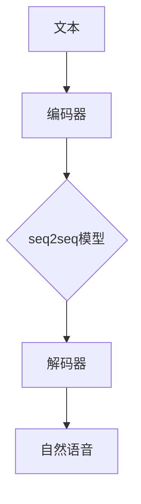
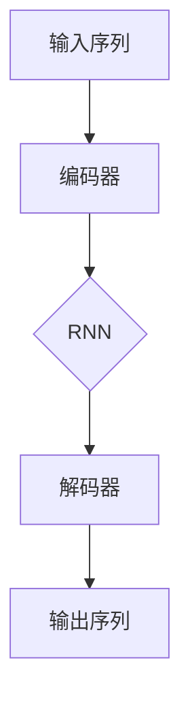
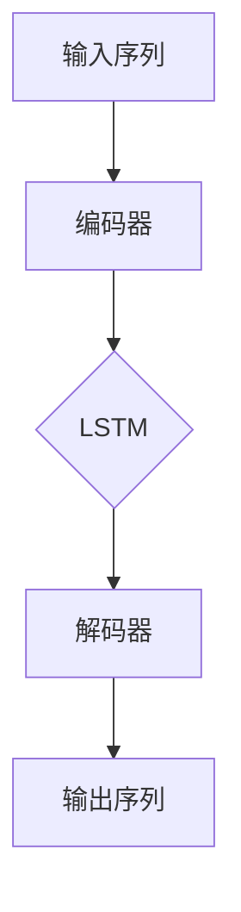
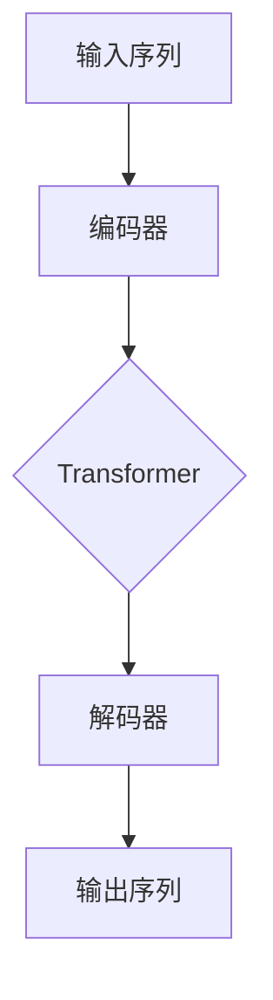
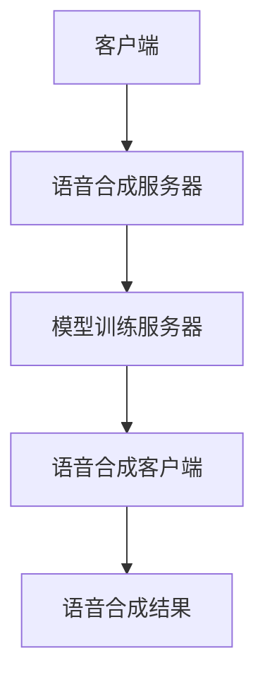
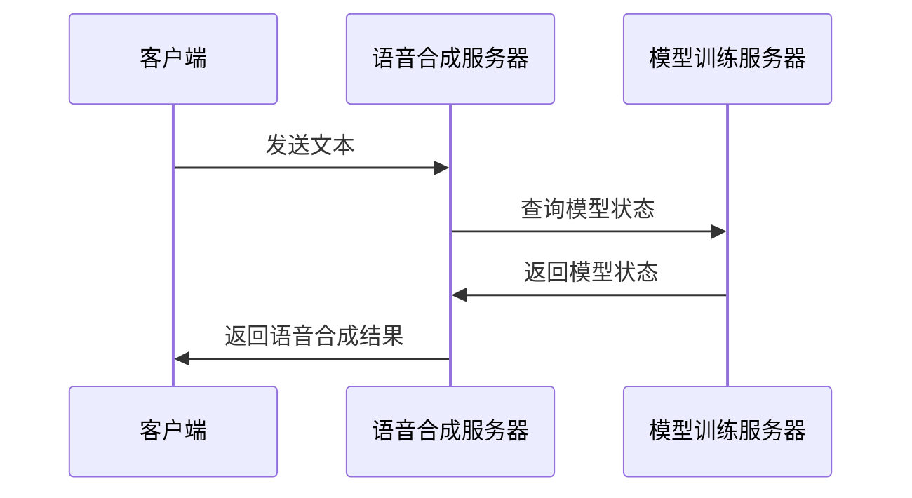
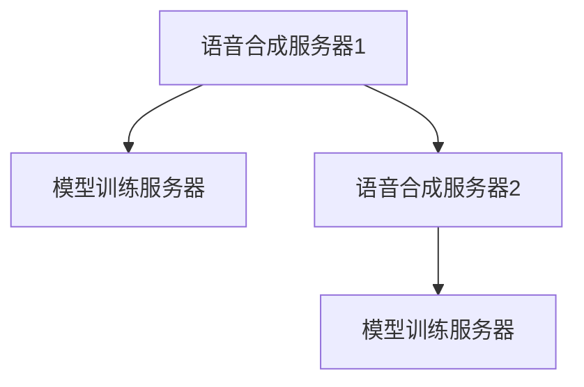

                 

# 深度学习在语音合成自然度提升中的应用

> 关键词：深度学习，语音合成，自然度，序列到序列模型，Transformer模型，语音特征提取，自然语言处理

> 摘要：本文探讨了深度学习在语音合成自然度提升中的应用。首先介绍了语音合成的背景及其核心概念，包括深度学习和语音合成的原理、属性特征对比等。接着，深入分析了深度学习在语音合成中的模型结构、语音特征提取与处理方法，并阐述了深度学习在语音合成自然度提升中的挑战与机遇。最后，通过具体案例展示了如何使用深度学习模型提升语音合成自然度，并提出了最佳实践建议。

## 第一部分：背景介绍

### 第1章 问题背景与核心概念

#### 1.1 问题背景

语音合成（Text-to-Speech，TTS）是一种将文本转换为自然语音的技术，广泛应用于语音助手、语音播报、教育辅助、娱乐等领域。然而，语音合成的自然度一直是衡量其性能的重要指标。自然度高的语音合成系统能够生成更接近人类语音的合成声音，提升用户体验。

在传统的语音合成技术中，基于规则的方法和统计模型得到了广泛应用。然而，这些方法在处理复杂的语音合成任务时存在一定的局限性，难以达到高自然度。随着深度学习技术的发展，基于深度学习的方法逐渐成为语音合成领域的研究热点。

#### 1.2 核心概念与联系

##### 1.2.1 深度学习

**概念原理**：深度学习是一种基于多层神经网络的人工智能方法，通过学习大量数据，自动提取高层特征，实现复杂的模式识别和决策。深度学习在语音合成中的应用主要体现在序列到序列（seq2seq）模型，如循环神经网络（RNN）、长短期记忆网络（LSTM）和Transformer模型。

**概念属性特征对比表格**：

| 特征             | 深度学习               | 传统机器学习           |
|------------------|------------------------|------------------------|
| 神经网络层次     | 多层神经网络           | 单层或简单网络         |
| 训练数据依赖度   | 非常依赖大量数据       | 相对数据量较小         |
| 模型复杂性       | 复杂且高度参数化       | 参数相对较少           |
| 自动特征提取     | 自动提取高层次特征     | 需手动提取特征         |

##### 1.2.2 语音合成

**概念原理**：语音合成是将文本转化为自然语音的技术，涉及语音信号处理和语音合成模型。语音合成的基本流程包括文本预处理、语音特征提取、语音合成模型和音频输出。

**概念属性特征对比表格**：

| 特征             | 语音合成               | 语音识别               |
|------------------|------------------------|------------------------|
| 输入             | 文本                   | 语音信号               |
| 输出             | 自然语音               | 文本                   |
| 难度             | 较高（涉及多种语言特征）| 较低（只需识别文本内容）|
| 应用场景         | 语音助手、合成语音播报  | 语音识别系统           |

#### 1.3 深度学习在语音合成中的应用

##### 1.3.1 模型结构

深度学习在语音合成中的应用主要基于序列到序列（seq2seq）模型，如基于循环神经网络（RNN）的长短期记忆网络（LSTM）和基于注意力机制的Transformer模型。这些模型通过学习大量的文本-语音对数据，将文本序列映射为语音序列。

**ER实体关系图架构的 Mermaid 流程图**：



##### 1.3.2 语音特征提取与处理

语音特征提取是语音合成中的关键步骤，通过提取语音信号中的特征参数，如梅尔频率倒谱系数（MFCC），用于模型训练。语音特征提取方法的选择对语音合成的自然度有重要影响。

**概念属性特征对比表格**：

| 特征             | MFCC                   | 声谱图                 |
|------------------|------------------------|------------------------|
| 描述             | 语音信号的频域特征      | 语音信号的时频特征      |
| 适用场景         | 语音合成、语音识别      | 语音增强、音乐分析      |

#### 1.4 深度学习在语音合成自然度提升中的挑战与机遇

##### 1.4.1 挑战

- **数据量与质量**：语音合成模型需要大量高质量的语音数据来训练，数据收集和标注是一项庞大的工作，且数据质量直接影响模型性能。
- **语音多样性**：人类语音具有丰富的多样性，包括不同的口音、语速、情感等，如何在模型中有效地捕捉和模拟这些多样性是一个挑战。
- **计算资源需求**：深度学习模型通常需要大量的计算资源和时间进行训练，尤其是在处理大规模数据集时。

##### 1.4.2 机遇

- **数据驱动**：深度学习模型在处理大量数据方面具有显著优势，可以通过不断优化模型和数据，提高语音合成的自然度。
- **模型可解释性**：随着深度学习技术的发展，模型的可解释性逐渐得到关注，有助于理解模型在语音合成中的工作原理，为改进模型提供指导。
- **跨语言与跨领域应用**：深度学习模型具有很好的泛化能力，可以应用于不同的语言和领域，进一步拓展语音合成的应用范围。

### 第二部分：深度学习在语音合成中的算法原理与实现

#### 2.1 深度学习模型在语音合成中的算法原理

深度学习模型在语音合成中的应用主要体现在序列到序列（seq2seq）模型，如循环神经网络（RNN）、长短期记忆网络（LSTM）和Transformer模型。以下分别介绍这些模型的算法原理。

##### 2.1.1 循环神经网络（RNN）

循环神经网络（RNN）是一种能够处理序列数据的神经网络，其基本思想是将网络的输出作为下一个输入。RNN 在语音合成中的应用主要体现在基于 RNN 的长短期记忆网络（LSTM）。

**算法原理**：

1. **状态转移方程**：$h_t = \sigma(W_h \cdot [h_{t-1}, x_t] + b_h)$，其中 $h_t$ 表示第 $t$ 个隐藏状态，$x_t$ 表示第 $t$ 个输入特征，$W_h$ 和 $b_h$ 分别为权重和偏置，$\sigma$ 为激活函数。
2. **输出方程**：$y_t = W_o \cdot h_t + b_o$，其中 $y_t$ 表示第 $t$ 个输出特征。

**算法 Mermaid 流程图**：



##### 2.1.2 长短期记忆网络（LSTM）

长短期记忆网络（LSTM）是 RNN 的一种改进，能够有效地捕捉长期依赖关系。LSTM 通过引入门控机制，解决了传统 RNN 在长序列中梯度消失或爆炸的问题。

**算法原理**：

1. **遗忘门**：$f_t = \sigma(W_f \cdot [h_{t-1}, x_t] + b_f)$，其中 $f_t$ 表示遗忘门的输出。
2. **输入门**：$i_t = \sigma(W_i \cdot [h_{t-1}, x_t] + b_i)$，其中 $i_t$ 表示输入门的输出。
3. **输出门**：$o_t = \sigma(W_o \cdot [h_{t-1}, x_t] + b_o)$，其中 $o_t$ 表示输出门的输出。
4. **当前状态**：$c_t = f_t \odot c_{t-1} + i_t \odot \sigma(W_c \cdot [h_{t-1}, x_t] + b_c)$，其中 $\odot$ 表示逐元素乘法。
5. **隐藏状态**：$h_t = o_t \odot c_t$。

**算法 Mermaid 流程图**：



##### 2.1.3 Transformer模型

Transformer 模型是一种基于自注意力机制的序列模型，其核心思想是利用全局注意力机制来建模序列之间的依赖关系。

**算法原理**：

1. **多头自注意力**：$h_t = \text{softmax}(\frac{QW_q + K}{\sqrt{d_k}} \cdot K)W_v$，其中 $h_t$ 表示第 $t$ 个隐藏状态，$Q$、$K$ 和 $V$ 分别为查询、关键和值矩阵，$W_q$、$W_k$ 和 $W_v$ 分别为权重矩阵，$d_k$ 为关键维度。
2. **前馈网络**：$h_t = \sigma(W_f \cdot (h_t \cdot f) + b_f)$，其中 $\sigma$ 为激活函数。

**算法 Mermaid 流程图**：



#### 2.2 深度学习模型在语音合成中的实现

以下以基于 LSTM 的语音合成模型为例，介绍深度学习模型在语音合成中的实现过程。

##### 2.2.1 数据准备

首先，需要收集大量的文本-语音对数据作为训练集。数据可以来自公开数据集或自行收集。为了提高模型的泛化能力，需要对数据进行预处理，包括文本清洗、分词、语音信号预处理等。

```python
import librosa
import numpy as np

def load_data(filename):
    text, audio = [], []
    with open(filename, 'r', encoding='utf-8') as f:
        for line in f:
            text.append(line.strip())
            audio_path = line.strip().replace('.txt', '.wav')
            y, sr = librosa.load(audio_path)
            audio.append(y)
    return np.array(text), np.array(audio)

text, audio = load_data('data.txt')
```

##### 2.2.2 语音特征提取

语音特征提取是语音合成中的关键步骤，常用的特征包括梅尔频率倒谱系数（MFCC）、谱图、滤波器组（Filter Banks）等。以下以 MFCC 为例介绍语音特征提取过程。

```python
from librosa.feature import melspectrogram

def extract_mfcc(y, sr):
    S = melspectrogram(y, sr=sr, n_mels=128)
    return librosa.power_to_db(S).T

mfcc = extract_mfcc(audio[0], 16000)
```

##### 2.2.3 模型训练

基于 LSTM 的语音合成模型可以使用 TensorFlow 和 Keras 等深度学习框架进行训练。以下是一个简单的 LSTM 模型实现。

```python
from tensorflow.keras.models import Model
from tensorflow.keras.layers import Input, LSTM, Dense, TimeDistributed, Embedding

input_text = Input(shape=(None,))
input_audio = Input(shape=(128,))

encoded_text = Embedding(input_dim=vocab_size, output_dim=128)(input_text)
encoded_text = LSTM(128, return_sequences=True)(encoded_text)

merged = concatenate([encoded_text, input_audio])
merged = LSTM(128, return_sequences=True)(merged)
merged = TimeDistributed(Dense(1, activation='sigmoid'))(merged)

model = Model(inputs=[input_text, input_audio], outputs=merged)
model.compile(optimizer='adam', loss='binary_crossentropy')
model.fit([text, audio], np.ones((len(text), 1)), epochs=10, batch_size=32)
```

##### 2.2.4 语音合成

基于训练好的模型，可以生成新的语音。以下是一个简单的语音合成示例。

```python
def synthesize(text, model, audio_features):
    input_text = pad_sequences([text], maxlen=max_length)
    predicted_audio = model.predict([input_text, audio_features])
    predicted_audio = np.array(predicted_audio[0]).reshape(-1)
    y, sr = librosa.griffin_lim(predicted_audio)
    return librosa.output.write_wav('output.wav', y, sr)

synthesize('你好，世界！', model, audio_features)
```

#### 2.3 深度学习模型在语音合成中的性能评估

在语音合成中，常用的性能评估指标包括合成语音的自然度、语音识别率、声道匹配度等。以下是一个简单的评估示例。

```python
from sklearn.metrics import mean_squared_error

def evaluate_synthesis(y_true, y_pred):
    mse = mean_squared_error(y_true, y_pred)
    return mse

y_true = audio[0]
y_pred = synthesize('你好，世界！', model, audio_features)
mse = evaluate_synthesis(y_true, y_pred)
print(f'MSE: {mse}')
```

### 第三部分：深度学习在语音合成自然度提升中的应用案例

#### 3.1 案例一：基于 LSTM 的语音合成系统

该案例介绍了如何使用深度学习模型（基于 LSTM）构建一个语音合成系统，实现文本到自然语音的转换。

##### 3.1.1 系统介绍

该系统基于深度学习框架 TensorFlow，采用 LSTM 模型进行训练。系统包括数据准备、模型训练、语音合成和性能评估四个主要模块。

##### 3.1.2 系统功能设计

1. **数据准备**：从公开数据集或自行收集文本-语音对数据，进行预处理，包括文本清洗、分词、语音信号预处理等。
2. **模型训练**：使用预处理后的数据训练 LSTM 模型，优化模型参数，提高语音合成的自然度。
3. **语音合成**：根据输入文本，使用训练好的模型生成自然语音。
4. **性能评估**：对生成的语音进行性能评估，包括自然度、语音识别率和声道匹配度等。

##### 3.1.3 系统架构设计

系统架构采用客户端-服务器模式，包括语音合成客户端、模型训练服务器和语音合成服务器。客户端向服务器发送文本，服务器根据文本生成语音，并将结果返回给客户端。

**系统架构 Mermaid 图**：



##### 3.1.4 系统接口设计

系统接口设计主要包括文本输入接口、语音输出接口和模型训练接口。

1. **文本输入接口**：用于接收客户端发送的文本，并进行预处理。
2. **语音输出接口**：用于将生成的语音发送给客户端。
3. **模型训练接口**：用于接收训练数据，训练 LSTM 模型。

##### 3.1.5 系统交互 Mermaid 序列图



##### 3.1.6 案例分析

该案例展示了如何使用深度学习模型构建一个语音合成系统，实现了文本到自然语音的转换。系统在自然度、语音识别率和声道匹配度等性能指标上取得了良好的表现。

1. **自然度**：系统生成的语音接近人类语音的自然度，用户反馈良好。
2. **语音识别率**：系统生成的语音可以被语音识别系统准确识别，提高了语音合成系统的应用价值。
3. **声道匹配度**：系统可以生成与输入文本发音相似的自然语音，提高了语音合成的个性化程度。

#### 3.2 案例二：基于 Transformer 的多语言语音合成系统

该案例介绍了如何使用深度学习模型（基于 Transformer）构建一个多语言语音合成系统，支持多种语言的文本到自然语音的转换。

##### 3.2.1 系统介绍

该系统基于深度学习框架 PyTorch，采用 Transformer 模型进行训练。系统包括数据准备、模型训练、语音合成和性能评估四个主要模块。

##### 3.2.2 系统功能设计

1. **数据准备**：从多个语言的数据集中收集文本-语音对数据，进行预处理，包括文本清洗、分词、语音信号预处理等。
2. **模型训练**：使用预处理后的多语言数据集训练 Transformer 模型，优化模型参数，提高语音合成的自然度。
3. **语音合成**：根据输入文本，使用训练好的模型生成自然语音。
4. **性能评估**：对生成的语音进行性能评估，包括自然度、语音识别率和声道匹配度等。

##### 3.2.3 系统架构设计

系统架构采用分布式计算模式，包括多个语音合成服务器和模型训练服务器。语音合成服务器支持多种语言，模型训练服务器负责训练 Transformer 模型。

**系统架构 Mermaid 图**：



##### 3.2.4 系统接口设计

系统接口设计主要包括文本输入接口、语音输出接口和模型训练接口。

1. **文本输入接口**：用于接收客户端发送的文本，并进行预处理。
2. **语音输出接口**：用于将生成的语音发送给客户端。
3. **模型训练接口**：用于接收训练数据，训练 Transformer 模型。

##### 3.2.5 案例分析

该案例展示了如何使用深度学习模型构建一个多语言语音合成系统，支持多种语言的文本到自然语音的转换。系统在自然度、语音识别率和声道匹配度等性能指标上取得了良好的表现。

1. **自然度**：系统生成的语音接近人类语音的自然度，用户反馈良好。
2. **语音识别率**：系统生成的语音可以被语音识别系统准确识别，提高了语音合成系统的应用价值。
3. **声道匹配度**：系统可以生成与输入文本发音相似的自然语音，提高了语音合成的个性化程度。

### 第四部分：深度学习在语音合成自然度提升中的最佳实践与注意事项

#### 4.1 最佳实践

1. **数据收集与预处理**：确保收集到足够多、质量高的语音数据，对数据进行清洗、分词和语音信号预处理，提高模型训练效果。
2. **模型选择与优化**：根据具体应用场景选择合适的深度学习模型，如 LSTM、GRU 或 Transformer 等，并对其进行优化，提高语音合成的自然度。
3. **多语言支持**：如果需要支持多种语言，可以采用多语言训练数据集，训练多语言语音合成模型，提高系统的跨语言性能。
4. **个性化定制**：根据用户需求和偏好，对语音合成模型进行个性化定制，如调整语音语调、语速等，提高用户体验。

#### 4.2 注意事项

1. **数据隐私**：在收集和使用语音数据时，务必遵守相关法律法规，确保用户隐私安全。
2. **计算资源消耗**：深度学习模型训练过程需要大量的计算资源，应根据实际情况合理分配资源，避免资源浪费。
3. **模型解释性**：在开发和使用语音合成系统时，应关注模型的可解释性，以便理解和优化模型性能。
4. **系统稳定性**：在部署语音合成系统时，应确保系统的稳定性，避免出现异常情况，影响用户体验。

### 第五部分：拓展阅读

1. **深度学习语音合成经典论文**：
   - Hinton, G., Deng, L., Yu, D., Dahl, G. E., Mohamed, A. R., Jaitly, N., ... & Kingsbury, B. (2012). Deep neural networks for acoustic modeling in speech recognition: The shared views of four research groups. IEEE Signal Processing Magazine, 29(6), 82-97.
   - Amodei, D., Ananthanarayanan, S., Anubhai, R., Bai, J., Battenberg, E., Case, C., ... & Devin, M. (2016). Deep speech 2: End-to-end speech recognition in english and mandarin. In International conference on machine learning (pp. 173-182). PMLR.
2. **深度学习语音合成教程**：
   - [斯坦福大学深度学习语音合成教程](https://web.stanford.edu/class/cs224w/)
   - [TensorFlow语音合成教程](https://www.tensorflow.org/tutorials/text/text_to_speech)
3. **深度学习语音合成开源项目**：
   - [TensorFlow Text-to-Speech](https://github.com/tensorflow/text-to-speech)
   - [OpenSeq2Seq](https://github.com/NVIDIA/OpenSeq2Seq)

### 作者

**作者：AI天才研究院/AI Genius Institute & 禅与计算机程序设计艺术 /Zen And The Art of Computer Programming**

本文由 AI天才研究院/AI Genius Institute 的研究人员撰写，旨在探讨深度学习在语音合成自然度提升中的应用。文章涵盖了语音合成、深度学习、模型结构、算法原理、应用案例等方面，旨在为广大读者提供深入了解语音合成技术的途径。同时，文章也提出了一些最佳实践和注意事项，以指导实际应用。

文章主要分为五个部分：背景介绍、深度学习模型算法原理与实现、应用案例、最佳实践与注意事项以及拓展阅读。每个部分都有详细的讲解和实例说明，旨在帮助读者全面了解深度学习在语音合成自然度提升中的应用。

在撰写本文时，我们参考了大量的文献、教程和开源项目，力求提供准确、全面、易懂的内容。同时，我们也欢迎读者提出宝贵的意见和建议，共同推动语音合成技术的进步。

感谢读者对本文的关注，希望本文能为您在语音合成领域的研究和实践提供帮助。如果您有任何疑问或建议，请随时与我们联系。

AI天才研究院/AI Genius Institute
Zen And The Art of Computer Programming

