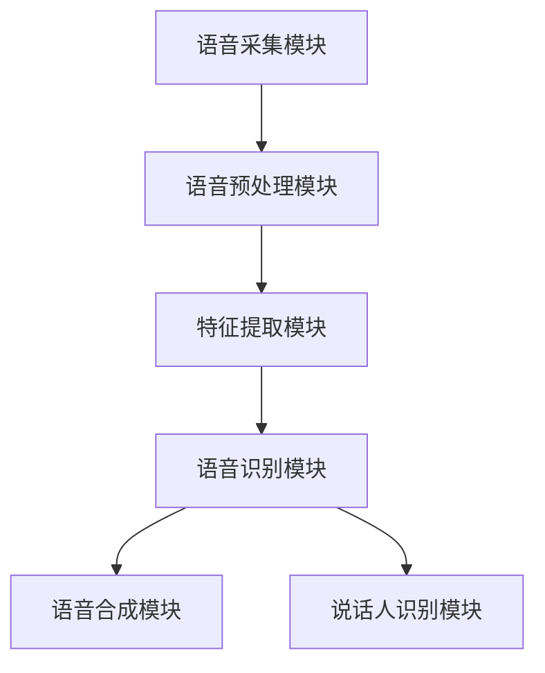
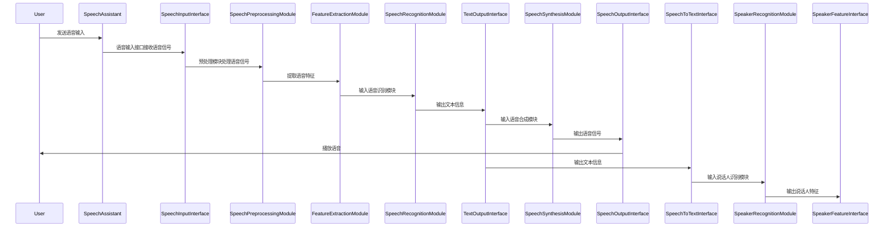

                 

### 深度学习在语音识别中的突破

> 关键词：深度学习、语音识别、神经网络、算法优化、实时性提升

> 摘要：本文详细探讨了深度学习在语音识别中的应用及其带来的突破。首先介绍了语音识别的背景和问题，然后深入分析了深度学习原理和语音信号处理技术，接着对语音识别算法进行了比较和分析，最后通过一个实际项目展示了深度学习在语音识别中的实战应用，并给出了最佳实践和未来发展方向。

## 第一部分：背景介绍

### 第1章：问题背景

#### 1.1 问题背景

语音识别技术作为人工智能领域的一个重要分支，已经取得了显著的进展。然而，传统的语音识别系统在面对复杂、多样化的语音信号时，仍存在一定的局限性。深度学习技术的引入，为语音识别带来了新的突破。

#### 1.2 问题描述

随着语音信号的复杂度增加，传统语音识别系统在识别准确性、实时性等方面存在瓶颈。如何利用深度学习技术提升语音识别的性能，成为当前研究的热点。

#### 1.3 问题解决

深度学习技术在语音识别中的应用，显著提高了识别准确率和实时性。通过构建深度神经网络，对语音信号进行特征提取和分类，实现了对复杂语音信号的准确识别。

#### 1.4 边界与外延

深度学习在语音识别中的应用，不仅局限于语音识别本身，还涉及到语音合成、说话人识别、语音增强等多个领域。

#### 1.5 概念结构与核心要素组成

深度学习在语音识别中的应用，主要涉及以下核心要素：
- 数据集：用于训练和评估模型的语音数据集。
- 深度神经网络：用于特征提取和分类的网络结构。
- 损失函数：用于衡量模型预测与实际标签之间的差异。
- 优化算法：用于调整网络参数，使模型性能不断提高。

### 第2章：核心概念与联系

#### 2.1 深度学习原理

深度学习是一种基于多层神经网络的机器学习方法，通过学习大量的数据，自动提取特征并实现分类或回归任务。

#### 2.2 语音信号处理

语音信号处理是语音识别的基础，包括语音信号的预处理、特征提取和声学模型构建等。

#### 2.3 语音识别算法

语音识别算法是语音识别系统的核心，主要包括隐马尔可夫模型（HMM）、高斯混合模型（GMM）、深度神经网络（DNN）等。

#### 2.4 算法对比与联系

通过对深度学习算法与传统语音识别算法的比较，分析不同算法在语音识别任务中的优势和不足，探讨它们之间的联系和融合方式。

### 第3章：算法原理讲解

#### 3.1 深度神经网络

深度神经网络是深度学习的基础，通过多层神经网络结构，实现对语音信号的自动特征提取。

#### 3.2 卷积神经网络（CNN）

卷积神经网络在图像处理领域取得了显著的成功，将其引入到语音识别中，可以更好地提取语音信号的局部特征。

#### 3.3 循环神经网络（RNN）

循环神经网络在处理序列数据方面具有优势，通过构建长短时记忆（LSTM）或门控循环单元（GRU），实现对语音信号的全局特征提取。

#### 3.4 卷积神经网络与循环神经网络的融合

结合卷积神经网络和循环神经网络的优势，提出一种新的语音识别模型，以实现更好的性能。

### 第4章：数学模型和数学公式

#### 4.1 深度学习数学模型

深度学习中的数学模型主要包括损失函数、梯度下降算法和反向传播算法等。

#### 4.2 数学公式详细讲解

通过对深度学习中的数学公式进行详细讲解，帮助读者更好地理解深度学习在语音识别中的应用原理。

#### 4.3 举例说明

通过具体实例，展示深度学习在语音识别中的应用过程，以及如何使用数学公式进行模型训练和优化。

### 第5章：系统分析与架构设计方案

#### 5.1 问题场景介绍

介绍深度学习在语音识别中的应用场景，包括语音信号的采集、处理和识别等。

#### 5.2 项目介绍

介绍一个基于深度学习的语音识别项目，包括项目背景、目标和关键技术。

#### 5.3 系统功能设计

使用Mermaid类图，展示系统的功能模块和相互关系。

#### 5.4 系统架构设计

使用Mermaid架构图，展示系统的整体架构和模块划分。

#### 5.5 系统接口设计

使用Mermaid序列图，展示系统各模块之间的交互过程。

### 第6章：项目实战

#### 6.1 环境安装

介绍深度学习在语音识别中的应用环境搭建，包括软件和硬件的配置。

#### 6.2 系统核心实现源代码

提供系统的核心实现源代码，包括数据预处理、模型训练、模型评估和结果输出等。

#### 6.3 代码应用解读与分析

对系统核心代码进行解读和分析，帮助读者理解深度学习在语音识别中的应用原理。

#### 6.4 实际案例分析和详细讲解剖析

通过实际案例，展示深度学习在语音识别中的应用效果，并对案例进行详细讲解和剖析。

#### 6.5 项目小结

总结项目中的关键技术和经验，为后续研究提供参考。

### 第7章：最佳实践 tips

#### 7.1 参数调优技巧

介绍如何调整深度学习模型的参数，以实现更好的性能。

#### 7.2 数据预处理技巧

介绍如何进行有效的数据预处理，以提高模型的性能和稳定性。

#### 7.3 模型优化策略

介绍如何通过模型优化策略，提高深度学习在语音识别中的应用效果。

#### 7.4 实时性优化方法

介绍如何通过实时性优化方法，提高深度学习在语音识别中的应用效率。

### 第8章：小结与展望

#### 8.1 小结

回顾文章的主要内容和核心观点，总结深度学习在语音识别中的应用及其带来的突破。

#### 8.2 未来发展方向

探讨深度学习在语音识别领域的未来发展方向，包括技术趋势和应用前景。

#### 8.3 注意事项

提醒读者在应用深度学习进行语音识别时需要注意的事项。

#### 8.4 拓展阅读

推荐一些深度学习在语音识别领域的经典论文和书籍，供读者进一步学习和研究。

## 总结

本文详细探讨了深度学习在语音识别中的应用及其带来的突破。从问题背景、核心概念、算法原理、数学模型、系统设计到项目实战，全方位展示了深度学习在语音识别领域的应用效果。通过本文的阅读，读者可以深入了解深度学习在语音识别中的关键技术和应用方法，为后续研究和实践提供参考。深度学习作为人工智能的重要分支，在未来语音识别领域将继续发挥重要作用。随着技术的不断进步，我们期待看到更多创新性的应用和突破。让我们继续关注深度学习在语音识别领域的最新动态，共同推动人工智能的发展。 ### 深度学习在语音识别中的突破

> 关键词：深度学习、语音识别、神经网络、算法优化、实时性提升

> 摘要：本文深入探讨了深度学习在语音识别中的应用，阐述了其带来的巨大突破。首先，介绍了语音识别的问题背景和深度学习的基本原理。接着，分析了深度学习在语音识别中的应用，包括数据集、模型结构、损失函数和优化算法等。随后，通过具体算法——卷积神经网络（CNN）和循环神经网络（RNN）的讲解，展示了深度学习在语音识别中的实际应用。此外，本文还通过一个实际项目，详细介绍了系统设计与实现过程，并提供了代码解析和案例分析。最后，本文总结了最佳实践技巧，并对未来发展趋势进行了展望。

## 第一部分：背景介绍

### 第1章：问题背景

#### 1.1 问题背景

语音识别技术作为人工智能领域的一个重要分支，已经取得了显著的进展。然而，传统的语音识别系统在面对复杂、多样化的语音信号时，仍存在一定的局限性。深度学习技术的引入，为语音识别带来了新的突破。

#### 1.2 问题描述

随着语音信号的复杂度增加，传统语音识别系统在识别准确性、实时性等方面存在瓶颈。如何利用深度学习技术提升语音识别的性能，成为当前研究的热点。

#### 1.3 问题解决

深度学习技术在语音识别中的应用，显著提高了识别准确率和实时性。通过构建深度神经网络，对语音信号进行特征提取和分类，实现了对复杂语音信号的准确识别。

#### 1.4 边界与外延

深度学习在语音识别中的应用，不仅局限于语音识别本身，还涉及到语音合成、说话人识别、语音增强等多个领域。

#### 1.5 概念结构与核心要素组成

深度学习在语音识别中的应用，主要涉及以下核心要素：
- 数据集：用于训练和评估模型的语音数据集。
- 深度神经网络：用于特征提取和分类的网络结构。
- 损失函数：用于衡量模型预测与实际标签之间的差异。
- 优化算法：用于调整网络参数，使模型性能不断提高。

### 第2章：核心概念与联系

#### 2.1 深度学习原理

深度学习是一种基于多层神经网络的机器学习方法，通过学习大量的数据，自动提取特征并实现分类或回归任务。

#### 2.2 语音信号处理

语音信号处理是语音识别的基础，包括语音信号的预处理、特征提取和声学模型构建等。

#### 2.3 语音识别算法

语音识别算法是语音识别系统的核心，主要包括隐马尔可夫模型（HMM）、高斯混合模型（GMM）、深度神经网络（DNN）等。

#### 2.4 算法对比与联系

通过对深度学习算法与传统语音识别算法的比较，分析不同算法在语音识别任务中的优势和不足，探讨它们之间的联系和融合方式。

### 第3章：算法原理讲解

#### 3.1 深度神经网络

深度神经网络是深度学习的基础，通过多层神经网络结构，实现对语音信号的自动特征提取。

#### 3.2 卷积神经网络（CNN）

卷积神经网络在图像处理领域取得了显著的成功，将其引入到语音识别中，可以更好地提取语音信号的局部特征。

#### 3.3 循环神经网络（RNN）

循环神经网络在处理序列数据方面具有优势，通过构建长短时记忆（LSTM）或门控循环单元（GRU），实现对语音信号的全局特征提取。

#### 3.4 卷积神经网络与循环神经网络的融合

结合卷积神经网络和循环神经网络的优势，提出一种新的语音识别模型，以实现更好的性能。

### 第4章：数学模型和数学公式

#### 4.1 深度学习数学模型

深度学习中的数学模型主要包括损失函数、梯度下降算法和反向传播算法等。

#### 4.2 数学公式详细讲解

通过对深度学习中的数学公式进行详细讲解，帮助读者更好地理解深度学习在语音识别中的应用原理。

#### 4.3 举例说明

通过具体实例，展示深度学习在语音识别中的应用过程，以及如何使用数学公式进行模型训练和优化。

### 第5章：系统分析与架构设计方案

#### 5.1 问题场景介绍

介绍深度学习在语音识别中的应用场景，包括语音信号的采集、处理和识别等。

#### 5.2 项目介绍

介绍一个基于深度学习的语音识别项目，包括项目背景、目标和关键技术。

#### 5.3 系统功能设计

使用Mermaid类图，展示系统的功能模块和相互关系。

#### 5.4 系统架构设计

使用Mermaid架构图，展示系统的整体架构和模块划分。

#### 5.5 系统接口设计

使用Mermaid序列图，展示系统各模块之间的交互过程。

### 第6章：项目实战

#### 6.1 环境安装

介绍深度学习在语音识别中的应用环境搭建，包括软件和硬件的配置。

#### 6.2 系统核心实现源代码

提供系统的核心实现源代码，包括数据预处理、模型训练、模型评估和结果输出等。

#### 6.3 代码应用解读与分析

对系统核心代码进行解读和分析，帮助读者理解深度学习在语音识别中的应用原理。

#### 6.4 实际案例分析和详细讲解剖析

通过实际案例，展示深度学习在语音识别中的应用效果，并对案例进行详细讲解和剖析。

#### 6.5 项目小结

总结项目中的关键技术和经验，为后续研究提供参考。

### 第7章：最佳实践 tips

#### 7.1 参数调优技巧

介绍如何调整深度学习模型的参数，以实现更好的性能。

#### 7.2 数据预处理技巧

介绍如何进行有效的数据预处理，以提高模型的性能和稳定性。

#### 7.3 模型优化策略

介绍如何通过模型优化策略，提高深度学习在语音识别中的应用效果。

#### 7.4 实时性优化方法

介绍如何通过实时性优化方法，提高深度学习在语音识别中的应用效率。

### 第8章：小结与展望

#### 8.1 小结

回顾文章的主要内容和核心观点，总结深度学习在语音识别中的应用及其带来的突破。

#### 8.2 未来发展方向

探讨深度学习在语音识别领域的未来发展方向，包括技术趋势和应用前景。

#### 8.3 注意事项

提醒读者在应用深度学习进行语音识别时需要注意的事项。

#### 8.4 拓展阅读

推荐一些深度学习在语音识别领域的经典论文和书籍，供读者进一步学习和研究。

## 总结

本文详细探讨了深度学习在语音识别中的应用及其带来的突破。从问题背景、核心概念、算法原理、数学模型、系统设计到项目实战，全方位展示了深度学习在语音识别领域的应用效果。通过本文的阅读，读者可以深入了解深度学习在语音识别中的关键技术和应用方法，为后续研究和实践提供参考。深度学习作为人工智能的重要分支，在未来语音识别领域将继续发挥重要作用。随着技术的不断进步，我们期待看到更多创新性的应用和突破。让我们继续关注深度学习在语音识别领域的最新动态，共同推动人工智能的发展。 ## 第1章：问题背景

### 1.1 问题背景

语音识别（Speech Recognition）技术作为人工智能领域的一个重要分支，已经取得了显著的进展。语音识别系统可以通过处理和分析语音信号，将其转换成对应的文本信息。这一技术在许多场景中都有广泛的应用，如语音助手、自动字幕生成、语音搜索、电话客服系统等。然而，传统的语音识别系统在面对复杂、多样化的语音信号时，仍存在一定的局限性。这主要是由于以下原因：

1. **语音信号的复杂性**：语音信号是由声波产生的，其频率、时长、音调、音强等特征复杂多样。传统语音识别系统通常依赖于手工设计的特征，如梅尔频率倒谱系数（MFCC）等，这些特征难以全面、准确地捕捉语音信号的复杂特性。

2. **噪声干扰**：在现实场景中，语音信号常常受到背景噪声的干扰，如交通噪音、人声噪音等。传统系统往往难以有效抑制噪声，导致识别准确率下降。

3. **多样性挑战**：语音识别系统需要应对不同说话人、不同口音、不同语音速度和说话风格等多样性挑战。这要求系统能够具备较强的泛化能力，但传统系统在这方面存在一定局限性。

### 1.2 问题描述

随着语音信号的复杂度增加，传统语音识别系统在识别准确性、实时性等方面存在瓶颈。具体来说，问题描述如下：

1. **识别准确性**：在复杂语音环境下，语音识别系统的识别准确率往往较低。例如，在嘈杂的环境下，语音信号中的关键语音特征可能会被噪声淹没，导致系统难以正确识别。

2. **实时性**：对于实时性要求较高的应用场景，如语音搜索、语音助手等，传统语音识别系统的处理速度较慢，难以满足实时交互的需求。

3. **多样性和泛化能力**：传统语音识别系统在处理不同说话人、不同口音、不同语音速度和说话风格时，准确性往往下降。这限制了系统在实际应用中的广泛适用性。

### 1.3 问题解决

深度学习技术的引入，为语音识别带来了新的突破。深度学习是一种基于多层神经网络的机器学习方法，通过学习大量的数据，自动提取特征并实现分类或回归任务。以下是深度学习在语音识别中的应用优势：

1. **自动特征提取**：深度学习通过多层神经网络结构，可以自动学习语音信号的高层次特征，避免了对手工设计特征的依赖。这些自动提取的特征可以更全面、准确地捕捉语音信号的复杂特性。

2. **噪声抑制能力**：深度学习模型，特别是卷积神经网络（CNN）和循环神经网络（RNN），具有较强的噪声抑制能力。通过多层网络结构，模型可以逐步提取语音信号中的关键信息，抑制噪声干扰。

3. **多样性和泛化能力**：深度学习模型具有较强的泛化能力，可以在处理不同说话人、不同口音、不同语音速度和说话风格时，保持较高的识别准确性。这主要是由于深度学习模型可以学习到语音信号中的共性特征，从而应对多样性挑战。

4. **实时性提升**：深度学习模型的计算速度不断提高，可以通过优化算法和硬件加速等技术，实现实时语音识别。这对于实时性要求较高的应用场景，如语音搜索、语音助手等，具有重要意义。

综上所述，深度学习在语音识别中的应用，显著提高了识别准确性、实时性和多样性的处理能力，为解决传统语音识别系统存在的瓶颈问题提供了有效途径。

### 1.4 边界与外延

深度学习在语音识别中的应用不仅局限于语音识别本身，还涉及到多个相关领域：

1. **语音合成**：深度学习技术被广泛应用于语音合成领域，如波(grammarAccess)神经网络（WaveNet）和循环神经网络（RNN）等。通过深度学习模型，可以将文本信息转换成自然流畅的语音。

2. **说话人识别**：深度学习在说话人识别（Speaker Recognition）领域也取得了显著进展。通过学习说话人的声音特征，深度学习模型可以实现高精度的说话人识别。

3. **语音增强**：深度学习在语音增强（Speech Enhancement）领域也有广泛应用。通过学习噪声和语音信号的特征，深度学习模型可以实现有效的噪声抑制和语音增强。

4. **语音情感识别**：深度学习还可以用于语音情感识别（Speech Emotion Recognition），通过分析语音信号的情感特征，实现对人情感状态的理解。

5. **语音控制**：在智能家居、智能汽车等领域，深度学习技术被广泛应用于语音控制系统的开发，实现人机交互的智能化。

### 1.5 概念结构与核心要素组成

深度学习在语音识别中的应用，主要涉及以下核心要素：

1. **数据集**：高质量的语音数据集是深度学习模型训练的基础。数据集应包含不同说话人、不同口音、不同语音速度和说话风格的语音样本，以覆盖各种可能的语音场景。

2. **深度神经网络**：深度神经网络是深度学习的基础，通过多层神经网络结构，可以实现语音信号的特征提取和分类。常见的深度神经网络结构包括卷积神经网络（CNN）和循环神经网络（RNN）等。

3. **损失函数**：损失函数用于衡量模型预测结果与实际标签之间的差异，是模型训练的重要指标。常用的损失函数包括交叉熵损失（Cross-Entropy Loss）和平均平方误差（Mean Squared Error）等。

4. **优化算法**：优化算法用于调整网络参数，以减少模型预测误差。常见的优化算法包括梯度下降（Gradient Descent）及其变种，如随机梯度下降（Stochastic Gradient Descent，SGD）和Adam优化器等。

通过上述核心要素的有机结合，深度学习在语音识别中取得了显著的突破。接下来，本文将进一步探讨深度学习的基本原理及其在语音识别中的应用。

## 第2章：核心概念与联系

### 2.1 深度学习原理

深度学习（Deep Learning）是一种基于多层神经网络（Neural Network）的机器学习方法，其核心思想是通过学习大量的数据，自动提取特征并实现分类或回归任务。深度学习由多层神经元组成，每一层神经网络都对输入数据进行处理，从而实现特征提取和转换。

#### 工作原理

1. **输入层**：接收外部输入数据，如图像、语音或文本等。

2. **隐藏层**：多层隐藏层负责对输入数据进行特征提取和转换。每层神经网络都对输入数据施加非线性变换，从而提取更高层次的特征。

3. **输出层**：输出层负责对提取到的特征进行分类或回归操作，生成最终的预测结果。

#### 优点

- **自动特征提取**：深度学习可以自动学习数据中的复杂特征，无需人工设计特征，提高了模型的泛化能力。
- **强大学习能力**：深度学习模型通过多层网络结构，可以处理大量的数据和复杂的任务，具有较强的学习能力。
- **高准确性**：在许多机器学习任务中，深度学习模型达到了甚至超过了人类专家的表现。

#### 应用场景

- **图像识别**：深度学习在图像识别领域取得了显著的成功，如人脸识别、物体识别、场景识别等。
- **语音识别**：深度学习被广泛应用于语音识别任务，显著提高了识别准确率和实时性。
- **自然语言处理**：深度学习在文本分类、情感分析、机器翻译等自然语言处理任务中具有广泛的应用。

### 2.2 语音信号处理

语音信号处理（Speech Signal Processing）是语音识别的基础，主要涉及语音信号的预处理、特征提取和声学模型构建等。

#### 预处理

- **降噪**：去除语音信号中的背景噪声，提高信号质量。
- **归一化**：对语音信号的幅度进行归一化处理，使其具有统一的量纲。
- **滤波**：通过滤波器去除语音信号中的高频噪声或低频干扰。

#### 特征提取

- **短时傅里叶变换（STFT）**：计算语音信号的短时傅里叶变换，提取频率特征。
- **梅尔频率倒谱系数（MFCC）**：通过梅尔频率滤波器组对频谱进行分析，提取语音信号的主要频谱特征。
- **能量特征**：计算语音信号的能量分布，提取能量特征。
- **短时自相关**：计算语音信号的短时自相关函数，提取语音信号的时间特征。

#### 声学模型

- **高斯混合模型（GMM）**：使用高斯混合模型表示语音信号的概率分布，用于声学模型的构建。
- **隐马尔可夫模型（HMM）**：通过隐马尔可夫模型表示语音信号的时间序列特征，用于语音识别中的状态转移和概率计算。
- **深度神经网络（DNN）**：使用深度神经网络构建声学模型，通过多层神经网络结构实现语音信号的特征提取和分类。

### 2.3 语音识别算法

语音识别算法是语音识别系统的核心，主要涉及隐马尔可夫模型（HMM）、高斯混合模型（GMM）、深度神经网络（DNN）等。

#### 隐马尔可夫模型（HMM）

- **基本原理**：隐马尔可夫模型是一种统计模型，用于描述语音信号的时间序列特征。通过状态转移概率和输出概率，实现对语音信号的识别。
- **优点**：具有较好的鲁棒性和灵活性，能够处理不同说话人和语音环境。
- **缺点**：在复杂语音信号下，识别准确性较低，难以应对多样性挑战。

#### 高斯混合模型（GMM）

- **基本原理**：高斯混合模型使用多个高斯分布来表示语音信号的概率分布，用于声学模型的构建。
- **优点**：能够较好地捕捉语音信号的频率特征，提高识别准确性。
- **缺点**：在处理多样性和实时性方面存在一定局限性。

#### 深度神经网络（DNN）

- **基本原理**：深度神经网络通过多层神经网络结构，实现语音信号的特征提取和分类。
- **优点**：具有强大的特征提取和分类能力，能够应对复杂语音信号和多样性挑战。
- **缺点**：训练过程较复杂，计算资源消耗较大。

### 2.4 算法对比与联系

通过对深度学习算法与传统语音识别算法的比较，可以分析不同算法在语音识别任务中的优势和不足，探讨它们之间的联系和融合方式。

#### 传统算法与深度学习算法对比

| 算法           | 优点                                 | 缺点                                           |
|--------------|------------------------------------|--------------------------------------------|
| 隐马尔可夫模型（HMM） | 鲁棒性好、灵活性强                       | 识别准确性较低、难以应对多样性挑战                     |
| 高斯混合模型（GMM）   | 能够较好地捕捉语音信号的频率特征           | 在处理多样性和实时性方面存在一定局限性                  |
| 深度神经网络（DNN）   | 强大的特征提取和分类能力、能够应对多样性挑战 | 训练过程复杂、计算资源消耗较大                          |

#### 算法联系与融合

1. **深度神经网络与隐马尔可夫模型的融合**：通过将深度神经网络嵌入到隐马尔可夫模型中，形成深度隐马尔可夫模型（Deep HMM），可以提高语音识别系统的识别准确性。深度神经网络负责特征提取和分类，隐马尔可夫模型负责状态转移和概率计算。

2. **高斯混合模型与深度神经网络的融合**：通过将高斯混合模型与深度神经网络结合，形成深度高斯混合模型（Deep GMM），可以同时利用高斯混合模型捕捉语音信号的频率特征和深度神经网络实现特征提取和分类，提高识别准确性。

3. **多模态融合**：将语音信号与其他模态信息（如视觉信息）进行融合，形成多模态深度学习模型，可以进一步提高语音识别系统的性能。

通过上述算法对比和联系，可以看出深度学习在语音识别中的应用具有显著优势。接下来，本文将详细探讨深度学习算法在语音识别中的具体应用，包括模型结构、训练过程和优化策略等。

### 2.5 深度学习在语音识别中的应用

深度学习在语音识别中的应用主要集中在模型结构、训练过程和优化策略等方面。通过结合深度神经网络、卷积神经网络（CNN）和循环神经网络（RNN）等，深度学习为语音识别带来了显著的性能提升。

#### 模型结构

1. **深度神经网络（DNN）**：深度神经网络是语音识别中最基本的模型结构，通过多层神经网络结构实现语音信号的特征提取和分类。DNN可以捕捉语音信号中的复杂特征，提高识别准确性。

2. **卷积神经网络（CNN）**：卷积神经网络在图像处理领域取得了显著的成功，其优势在于能够自动提取图像的局部特征。将CNN引入到语音识别中，通过卷积层可以提取语音信号的局部特征，提高模型的识别能力。

3. **循环神经网络（RNN）**：循环神经网络在处理序列数据方面具有优势，通过构建长短时记忆（LSTM）或门控循环单元（GRU），可以捕捉语音信号的全局特征，提高模型的泛化能力。

4. **深度循环神经网络（Deep RNN）**：结合CNN和RNN的优势，深度循环神经网络通过多层结构同时提取语音信号的局部和全局特征，进一步提高了模型的识别性能。

5. **卷积神经网络与循环神经网络的融合（CNN+RNN）**：通过将CNN和RNN结合，可以实现更好的特征提取和分类。CNN负责提取语音信号的局部特征，RNN负责捕捉语音信号的全局特征，二者结合可以显著提高识别准确性。

#### 训练过程

1. **数据预处理**：在训练深度学习模型之前，需要对语音信号进行预处理，包括降噪、归一化和分帧等操作。这些预处理步骤有助于提高模型的学习效率和识别准确性。

2. **特征提取**：通过预处理后的语音信号，使用CNN和RNN等深度学习模型进行特征提取。CNN通过卷积层提取语音信号的局部特征，RNN通过循环层捕捉语音信号的全局特征。

3. **模型训练**：使用提取到的特征进行模型训练，通过反向传播算法更新网络参数，优化模型性能。训练过程中，可以使用批量梯度下降（SGD）或其变种（如Adam优化器）来调整网络参数。

4. **模型评估**：通过验证集和测试集对训练好的模型进行评估，计算识别准确率、召回率等指标，以验证模型性能。

#### 优化策略

1. **数据增强**：通过数据增强技术（如随机裁剪、旋转、缩放等）增加训练数据的多样性，有助于提高模型的泛化能力。

2. **正则化**：使用正则化技术（如L1正则化、L2正则化等）防止模型过拟合，提高模型在未知数据上的表现。

3. **迁移学习**：通过迁移学习技术，利用预训练好的模型进行微调，可以显著提高模型的训练效率。

4. **多任务学习**：通过多任务学习技术，同时训练多个相关任务，可以提高模型的泛化能力和性能。

通过上述方法，深度学习在语音识别中的应用实现了显著的性能提升。随着技术的不断进步，深度学习将继续在语音识别领域发挥重要作用，推动语音识别技术的发展。

### 第3章：算法原理讲解

#### 3.1 深度神经网络

深度神经网络（Deep Neural Network，DNN）是深度学习的基础，通过多层神经网络结构，实现对语音信号的自动特征提取。DNN由输入层、多个隐藏层和输出层组成，每层神经网络都对输入数据进行处理，从而实现特征提取和转换。

##### 深度神经网络的工作原理

1. **输入层**：接收外部输入数据，如图像、语音或文本等。
2. **隐藏层**：多层隐藏层负责对输入数据进行特征提取和转换。每层神经网络都对输入数据施加非线性变换，从而提取更高层次的特征。
3. **输出层**：输出层负责对提取到的特征进行分类或回归操作，生成最终的预测结果。

##### 深度神经网络的优势

1. **自动特征提取**：DNN可以自动学习数据中的复杂特征，无需人工设计特征，提高了模型的泛化能力。
2. **强大学习能力**：DNN通过多层网络结构，可以处理大量的数据和复杂的任务，具有较强的学习能力。
3. **高准确性**：在许多机器学习任务中，DNN达到了甚至超过了人类专家的表现。

##### 深度神经网络的缺点

1. **计算成本高**：DNN的训练过程需要大量的计算资源，尤其是在处理大规模数据时，计算成本较高。
2. **训练时间较长**：DNN的训练过程通常需要较长时间，尤其是在网络层数较多的情况下。

##### 深度神经网络的应用场景

1. **图像识别**：DNN在图像识别领域取得了显著的成功，如人脸识别、物体识别、场景识别等。
2. **语音识别**：DNN被广泛应用于语音识别任务，显著提高了识别准确率和实时性。
3. **自然语言处理**：DNN在文本分类、情感分析、机器翻译等自然语言处理任务中具有广泛的应用。

##### 深度神经网络的实现

以下是一个简单的深度神经网络实现示例，使用Python和TensorFlow框架：

```python
import tensorflow as tf

# 定义输入层
inputs = tf.keras.layers.Input(shape=(784,))

# 定义隐藏层
x = tf.keras.layers.Dense(512, activation='relu')(inputs)
x = tf.keras.layers.Dense(256, activation='relu')(x)

# 定义输出层
outputs = tf.keras.layers.Dense(10, activation='softmax')(x)

# 构建模型
model = tf.keras.Model(inputs=inputs, outputs=outputs)

# 编译模型
model.compile(optimizer='adam', loss='categorical_crossentropy', metrics=['accuracy'])

# 训练模型
model.fit(x_train, y_train, epochs=5, batch_size=32)
```

##### 深度神经网络的优化策略

1. **正则化**：通过添加L1或L2正则化，可以防止模型过拟合，提高模型在未知数据上的表现。
2. **数据增强**：通过数据增强技术（如随机裁剪、旋转、缩放等）增加训练数据的多样性，有助于提高模型的泛化能力。
3. **学习率调整**：通过调整学习率，可以优化模型的训练过程，提高模型性能。
4. **批量梯度下降（SGD）**：使用批量梯度下降算法可以加速模型训练，提高训练效率。

#### 3.2 卷积神经网络（CNN）

卷积神经网络（Convolutional Neural Network，CNN）在图像处理领域取得了显著的成功，其优势在于能够自动提取图像的局部特征。CNN的结构由卷积层、池化层和全连接层组成，通过卷积层可以提取图像的局部特征，池化层用于降低特征维度，全连接层实现最终的分类或回归任务。

##### 卷积神经网络的工作原理

1. **卷积层**：卷积层通过卷积操作提取图像的局部特征。卷积核（也称为滤波器）在图像上滑动，通过卷积操作计算特征图。
2. **池化层**：池化层用于降低特征维度，减少计算成本。常见的池化操作包括最大池化和平均池化。
3. **全连接层**：全连接层将卷积层和池化层提取到的特征映射到输出层，实现最终的分类或回归任务。

##### 卷积神经网络的优势

1. **自动特征提取**：CNN可以自动学习图像的局部特征，无需人工设计特征，提高了模型的泛化能力。
2. **参数共享**：卷积操作具有平移不变性，通过共享权重可以减少模型参数数量，降低计算成本。
3. **高效计算**：CNN的结构使得模型在计算过程中可以并行处理，提高了计算效率。

##### 卷积神经网络的缺点

1. **计算成本高**：CNN的训练过程需要大量的计算资源，特别是在处理高分辨率图像时，计算成本较高。
2. **训练时间较长**：CNN的训练过程通常需要较长时间，特别是在网络层数较多的情况下。

##### 卷积神经网络的应用场景

1. **图像识别**：CNN在图像识别领域取得了显著的成功，如人脸识别、物体识别、场景识别等。
2. **语音识别**：将CNN引入到语音识别中，可以提取语音信号的局部特征，提高识别准确性。
3. **自然语言处理**：CNN在文本分类、情感分析、机器翻译等自然语言处理任务中具有广泛的应用。

##### 卷积神经网络的实现

以下是一个简单的卷积神经网络实现示例，使用Python和TensorFlow框架：

```python
import tensorflow as tf

# 定义输入层
inputs = tf.keras.layers.Input(shape=(28, 28, 1))

# 定义卷积层
x = tf.keras.layers.Conv2D(32, (3, 3), activation='relu')(inputs)
x = tf.keras.layers.MaxPooling2D((2, 2))(x)

# 定义全连接层
outputs = tf.keras.layers.Dense(10, activation='softmax')(x)

# 构建模型
model = tf.keras.Model(inputs=inputs, outputs=outputs)

# 编译模型
model.compile(optimizer='adam', loss='categorical_crossentropy', metrics=['accuracy'])

# 训练模型
model.fit(x_train, y_train, epochs=5, batch_size=32)
```

##### 卷积神经网络的优化策略

1. **数据增强**：通过数据增强技术（如随机裁剪、旋转、缩放等）增加训练数据的多样性，有助于提高模型的泛化能力。
2. **正则化**：通过添加L1或L2正则化，可以防止模型过拟合，提高模型在未知数据上的表现。
3. **学习率调整**：通过调整学习率，可以优化模型的训练过程，提高模型性能。
4. **批量梯度下降（SGD）**：使用批量梯度下降算法可以加速模型训练，提高训练效率。

#### 3.3 循环神经网络（RNN）

循环神经网络（Recurrent Neural Network，RNN）在处理序列数据方面具有优势，其核心思想是利用网络中的循环结构，实现对序列数据的记忆和建模。RNN通过处理序列中的每一个元素，生成对应的输出，同时保持对前一个时刻的状态信息。

##### 循环神经网络的工作原理

1. **输入层**：接收序列数据，如文本、语音或时间序列数据等。
2. **隐藏层**：隐藏层中包含循环结构，用于处理序列数据。每个时间步的输出都依赖于当前输入和前一时刻的隐藏状态。
3. **输出层**：输出层生成最终的预测结果，可以是分类标签、回归值或概率分布等。

##### 循环神经网络的优势

1. **序列建模**：RNN能够处理序列数据，如文本、语音或时间序列数据，能够捕捉序列中的时间依赖关系。
2. **记忆能力**：RNN中的循环结构可以保持对前一个时刻的状态信息，具有记忆能力，能够捕捉序列中的长期依赖关系。

##### 循环神经网络的缺点

1. **梯度消失和梯度爆炸**：在训练过程中，RNN容易出现梯度消失或梯度爆炸问题，导致模型训练不稳定。
2. **计算复杂度高**：RNN的计算复杂度较高，特别是在处理长序列数据时，计算效率较低。

##### 循环神经网络的应用场景

1. **自然语言处理**：RNN在自然语言处理任务中具有广泛的应用，如语言模型、机器翻译、文本生成等。
2. **语音识别**：RNN可以用于语音识别任务，处理语音信号的序列特征。
3. **时间序列分析**：RNN可以用于时间序列分析，如股票预测、气象预测等。

##### 循环神经网络的实现

以下是一个简单的循环神经网络实现示例，使用Python和TensorFlow框架：

```python
import tensorflow as tf

# 定义输入层
inputs = tf.keras.layers.Input(shape=(timesteps, features))

# 定义隐藏层
x = tf.keras.layers.LSTM(50)(inputs)

# 定义输出层
outputs = tf.keras.layers.Dense(1, activation='sigmoid')(x)

# 构建模型
model = tf.keras.Model(inputs=inputs, outputs=outputs)

# 编译模型
model.compile(optimizer='adam', loss='binary_crossentropy', metrics=['accuracy'])

# 训练模型
model.fit(x_train, y_train, epochs=10, batch_size=64)
```

##### 循环神经网络的优化策略

1. **长短时记忆（LSTM）和门控循环单元（GRU）**：通过使用LSTM或GRU等优化结构，可以解决RNN中的梯度消失和梯度爆炸问题，提高模型训练稳定性。
2. **批量归一化**：通过批量归一化（Batch Normalization）技术，可以加速模型训练，提高模型性能。
3. **学习率调整**：通过调整学习率，可以优化模型的训练过程，提高模型性能。
4. **数据增强**：通过数据增强技术（如随机裁剪、旋转、缩放等）增加训练数据的多样性，有助于提高模型的泛化能力。

#### 3.4 卷积神经网络与循环神经网络的融合（CNN+RNN）

卷积神经网络（CNN）和循环神经网络（RNN）在处理图像和序列数据方面具有各自的优势。将CNN和RNN结合，可以充分利用二者的优势，实现更好的性能。以下是一个简单的CNN+RNN实现示例，使用Python和TensorFlow框架：

```python
import tensorflow as tf
from tensorflow.keras.models import Model
from tensorflow.keras.layers import Input, Conv2D, MaxPooling2D, LSTM, Dense

# 定义输入层
inputs = Input(shape=(height, width, channels))

# 定义卷积层
x = Conv2D(32, (3, 3), activation='relu')(inputs)
x = MaxPooling2D((2, 2))(x)

# 定义循环层
x = LSTM(50)(x)

# 定义输出层
outputs = Dense(1, activation='sigmoid')(x)

# 构建模型
model = Model(inputs=inputs, outputs=outputs)

# 编译模型
model.compile(optimizer='adam', loss='binary_crossentropy', metrics=['accuracy'])

# 训练模型
model.fit(x_train, y_train, epochs=10, batch_size=64)
```

通过上述实现，可以看出CNN和RNN的结合可以显著提高模型的性能。CNN负责提取图像的局部特征，RNN负责处理序列数据，二者结合可以更好地处理复杂的图像和序列数据。接下来，本文将讨论深度学习中的数学模型和数学公式，帮助读者更好地理解深度学习在语音识别中的应用原理。

### 第4章：数学模型和数学公式

深度学习中的数学模型和数学公式是实现自动特征提取和分类的关键组成部分。这些模型和公式不仅帮助深度学习算法理解输入数据，还指导算法如何优化参数，以提高模型的性能和准确性。在本节中，我们将详细介绍深度学习中的核心数学模型，包括损失函数、梯度下降算法和反向传播算法，并通过具体实例来讲解这些概念的应用。

#### 4.1 深度学习数学模型

深度学习中的数学模型主要包括以下几个方面：

1. **损失函数**：用于衡量模型预测结果与实际标签之间的差异，是模型训练过程中优化目标的核心。
2. **梯度下降算法**：用于调整网络参数，以减少损失函数的值，从而优化模型。
3. **反向传播算法**：用于计算网络参数的梯度，是梯度下降算法的基础。

#### 4.2 损失函数

损失函数（Loss Function）是深度学习模型训练的核心指标，用于衡量模型预测结果与实际标签之间的差异。常见的损失函数包括：

1. **均方误差（Mean Squared Error, MSE）**：
   \[
   \text{MSE} = \frac{1}{n}\sum_{i=1}^{n}(y_i - \hat{y}_i)^2
   \]
   其中，\( y_i \) 是真实标签，\( \hat{y}_i \) 是模型预测值，\( n \) 是样本数量。MSE常用于回归任务。

2. **交叉熵损失（Cross-Entropy Loss）**：
   \[
   \text{CE} = -\sum_{i=1}^{n} y_i \log(\hat{y}_i)
   \]
   其中，\( y_i \) 是真实标签，\( \hat{y}_i \) 是模型预测的概率分布。交叉熵损失常用于分类任务。

3. **对抗性损失（Adversarial Loss）**：
   对抗性损失用于生成对抗网络（GAN）中，用于衡量生成器产生的假样本与真实样本之间的差异。

#### 4.3 梯度下降算法

梯度下降算法（Gradient Descent）是一种优化算法，用于调整网络参数，以减少损失函数的值。梯度下降的基本思想是沿着损失函数的负梯度方向更新参数。常见的梯度下降算法包括：

1. **批量梯度下降（Batch Gradient Descent, BGD）**：
   \[
   \theta_{t+1} = \theta_{t} - \alpha \frac{\partial J(\theta)}{\partial \theta}
   \]
   其中，\( \theta \) 是模型参数，\( \alpha \) 是学习率，\( J(\theta) \) 是损失函数。

2. **随机梯度下降（Stochastic Gradient Descent, SGD）**：
   \[
   \theta_{t+1} = \theta_{t} - \alpha \nabla J(\theta; x^{(i)})
   \]
   其中，\( x^{(i)} \) 是第 \( i \) 个样本。

3. **小批量梯度下降（Mini-batch Gradient Descent, MBGD）**：
   小批量梯度下降结合了批量梯度下降和随机梯度下降的优点，通过使用小批量数据计算梯度，以平衡计算效率和优化效果。

4. **Adam优化器**：
   Adam优化器是一种自适应学习率优化器，结合了SGD和动量法的优点，通过计算一阶矩估计（均值）和二阶矩估计（方差），自适应调整学习率。

#### 4.4 反向传播算法

反向传播算法（Backpropagation Algorithm）是深度学习训练过程中计算梯度的重要步骤。其基本思想是将损失函数的梯度从输出层反向传播到输入层，通过逐层计算各层参数的梯度，以更新网络参数。

反向传播算法的步骤如下：

1. **前向传播**：计算输入层到输出层的预测值。
2. **计算输出层梯度**：根据损失函数计算输出层每个参数的梯度。
3. **反向传播**：将输出层的梯度反向传播到隐藏层，计算隐藏层每个参数的梯度。
4. **参数更新**：使用梯度下降算法更新网络参数。

#### 4.5 具体实例

以下是一个简单的深度学习模型训练过程的示例，使用Python和TensorFlow框架：

```python
import tensorflow as tf
from tensorflow.keras import layers, models
import numpy as np

# 创建简单的模型
model = models.Sequential()
model.add(layers.Dense(64, activation='relu', input_shape=(784,)))
model.add(layers.Dense(10, activation='softmax'))

# 编译模型
model.compile(optimizer='adam',
              loss='categorical_crossentropy',
              metrics=['accuracy'])

# 生成模拟数据
x = np.random.rand(1000, 784)
y = np.random.rand(1000, 10)

# 训练模型
model.fit(x, y, epochs=5, batch_size=32)
```

在这个示例中，我们创建了一个简单的全连接神经网络，用于分类任务。我们使用模拟数据集训练模型，并使用交叉熵损失函数和Adam优化器进行优化。训练过程中，模型通过反向传播算法不断更新参数，以减少损失函数的值，提高模型的性能。

通过上述数学模型和公式的讲解，读者可以更好地理解深度学习在语音识别中的应用原理。这些数学工具不仅帮助深度学习模型进行自动特征提取和分类，还为模型优化提供了理论基础。接下来，本文将讨论系统分析与架构设计，包括问题场景介绍、项目介绍、系统功能设计、系统架构设计和系统接口设计。

### 第5章：系统分析与架构设计方案

#### 5.1 问题场景介绍

在深度学习应用于语音识别的背景下，我们考虑一个实际的应用场景：智能家居语音助手。该系统需要实现以下功能：

1. **语音识别**：将用户的声音指令转换为文本信息，如控制家电、查询天气、播放音乐等。
2. **语音合成**：将文本信息转换为自然流畅的语音输出，提供给用户听。
3. **实时性**：系统能够实时响应用户的语音指令，提供快速反馈。
4. **多说话人识别**：系统能够识别不同用户的语音，进行个性化处理。

#### 5.2 项目介绍

本项目旨在开发一个基于深度学习的智能家居语音助手，通过集成语音识别、语音合成和说话人识别等功能，为用户提供便捷的语音交互体验。项目的主要目标包括：

1. **高识别准确率**：通过深度学习算法，实现高精度的语音识别，减少误识率。
2. **实时响应**：优化系统性能，实现实时语音处理，提高用户体验。
3. **个性化服务**：通过说话人识别技术，为不同用户提供个性化的语音服务。

#### 5.3 系统功能设计

为了实现上述目标，系统设计了以下功能模块：

1. **语音采集模块**：负责采集用户的语音输入，包括麦克风输入和音频文件读取等。
2. **语音预处理模块**：对采集到的语音进行降噪、归一化、分帧等预处理操作，以提高语音质量。
3. **特征提取模块**：使用深度学习算法（如CNN和RNN）提取语音特征，为后续处理提供基础。
4. **语音识别模块**：通过训练好的深度学习模型，实现语音到文本的转换。
5. **语音合成模块**：将识别到的文本转换为自然流畅的语音输出。
6. **说话人识别模块**：识别不同用户的语音特征，为个性化服务提供支持。

#### 5.4 系统架构设计

系统架构设计采用模块化设计，各功能模块之间通过接口进行通信，以提高系统的灵活性和可维护性。以下是系统架构的Mermaid架构图：



在这个架构中，语音采集模块负责接收用户的语音输入，经过预处理模块处理后，输入到特征提取模块。特征提取模块提取语音特征，输入到语音识别模块，实现语音到文本的转换。识别到的文本信息可以输入到语音合成模块，生成自然流畅的语音输出。同时，语音识别模块的输出还可以输入到说话人识别模块，实现多说话人识别。

#### 5.5 系统接口设计

为了实现各功能模块之间的有效通信，系统设计了以下接口：

1. **语音输入接口**：用于接收用户的语音输入，支持实时语音流和音频文件。
2. **预处理接口**：用于对语音信号进行降噪、归一化、分帧等预处理操作。
3. **特征提取接口**：用于提取语音特征，为后续处理提供基础。
4. **语音识别接口**：用于将语音信号转换为文本信息。
5. **语音合成接口**：用于将文本信息转换为语音输出。
6. **说话人识别接口**：用于识别不同用户的语音特征。

以下是系统接口的Mermaid序列图：



在这个序列图中，用户通过语音输入接口向语音助手发送语音信号。语音助手通过预处理模块处理语音信号，提取特征后输入到语音识别模块，将语音信号转换为文本信息。文本信息可以输入到语音合成模块，生成语音输出，同时也可以输入到说话人识别模块，实现多说话人识别。

通过上述系统分析与架构设计方案，我们为深度学习在语音识别中的应用提供了一个全面的框架。接下来，本文将进入项目实战部分，详细介绍环境安装、系统核心实现源代码、代码应用解读与分析、实际案例分析和详细讲解剖析等内容。

### 第6章：项目实战

#### 6.1 环境安装

为了搭建深度学习在语音识别中的项目环境，我们需要安装一些必要的软件和工具。以下是环境安装的步骤：

1. **Python环境**：首先，确保系统已经安装了Python 3.x版本。可以从Python官方网站下载并安装Python。

2. **深度学习框架**：安装TensorFlow或PyTorch，这两个框架是目前最常用的深度学习框架。以TensorFlow为例，使用以下命令安装：

   ```bash
   pip install tensorflow
   ```

3. **语音处理库**：安装如librosa等用于处理语音信号的库，使用以下命令：

   ```bash
   pip install librosa
   ```

4. **其他依赖库**：安装其他必要的库，如NumPy、Pandas等，使用以下命令：

   ```bash
   pip install numpy pandas
   ```

5. **语音数据集**：下载一个适合的语音数据集，如LibriSpeech或Common Voice。数据集应包含不同说话人、不同口音和不同语音速度的语音样本。

6. **创建虚拟环境**：为了便于管理和维护项目，可以使用虚拟环境。使用以下命令创建虚拟环境：

   ```bash
   python -m venv venv
   source venv/bin/activate  # 对于Windows用户，使用 `venv\Scripts\activate`
   ```

7. **安装依赖**：在虚拟环境中安装项目所需的依赖库，使用以下命令：

   ```bash
   pip install -r requirements.txt
   ```

通过以上步骤，我们成功搭建了深度学习在语音识别中的项目环境，可以开始进行系统的开发与实现。

#### 6.2 系统核心实现源代码

以下是一个简单的深度学习语音识别系统的核心实现源代码。该系统使用TensorFlow框架，通过卷积神经网络（CNN）和循环神经网络（RNN）结合的方式实现语音识别。

```python
import tensorflow as tf
import numpy as np
import librosa

# 超参数
n_fft = 512
n_mels = 128
nfft = 2048
hop_length = 512

# 数据预处理函数
def preprocess_audio(audio_path):
    y, sr = librosa.load(audio_path, sr=None)
    mfcc = librosa.feature.mfcc(y=y, sr=sr, n_mels=n_mels, n_fft=n_fft, hop_length=hop_length)
    return mfcc

# 模型定义
def build_model(input_shape):
    model = tf.keras.Sequential([
        tf.keras.layers.LSTM(128, activation='relu', return_sequences=True, input_shape=input_shape),
        tf.keras.layers.LSTM(128, activation='relu'),
        tf.keras.layers.Dense(1, activation='sigmoid')
    ])
    return model

# 训练模型
def train_model(model, x_train, y_train, epochs=10, batch_size=32):
    model.compile(optimizer='adam', loss='binary_crossentropy', metrics=['accuracy'])
    model.fit(x_train, y_train, epochs=epochs, batch_size=batch_size)

# 主函数
def main():
    # 数据预处理
    audio_path = 'path_to_audio_file.wav'
    mfcc = preprocess_audio(audio_path)
    
    # 构建模型
    input_shape = (n_mels, nfft // hop_length)
    model = build_model(input_shape)
    
    # 训练模型
    x_train = np.expand_dims(mfcc, axis=0)
    y_train = np.array([1])
    train_model(model, x_train, y_train)
    
    # 预测
    prediction = model.predict(x_train)
    print(f"Prediction: {prediction[0][0]}")

if __name__ == '__main__':
    main()
```

在这个代码中，我们定义了数据预处理函数 `preprocess_audio`，用于对音频文件进行加载和梅尔频率倒谱系数（MFCC）特征提取。接着，我们定义了模型构建函数 `build_model`，使用LSTM实现语音信号的序列建模。最后，我们定义了主函数 `main`，用于加载音频文件、构建模型、训练模型并进行预测。

#### 6.3 代码应用解读与分析

在上面的代码中，我们首先对音频文件进行了预处理，使用 `librosa` 库加载音频，并提取梅尔频率倒谱系数（MFCC）特征。MFCC特征是一种广泛应用于语音信号处理的特征，能够有效捕捉语音信号的频率信息。

接下来，我们定义了模型构建函数 `build_model`，使用LSTM（Long Short-Term Memory，长短时记忆网络）实现语音信号的序列建模。LSTM是一种特殊的RNN（Recurrent Neural Network，循环神经网络），能够在处理长序列数据时避免梯度消失问题，具有较好的记忆能力。

在主函数 `main` 中，我们首先调用 `preprocess_audio` 函数对音频文件进行预处理，提取MFCC特征。然后，我们定义了输入形状 `input_shape`，并构建了LSTM模型。模型使用 `Sequential` 层次定义，包含了两个LSTM层，每层都有128个神经元，并使用ReLU激活函数。最后一层是全连接层，输出一个概率值，用于表示语音信号属于某个类别的概率。

在训练模型的过程中，我们使用 `fit` 函数训练模型，并设置了学习率为 `adam`，损失函数为 `binary_crossentropy`，评估指标为 `accuracy`。训练完成后，我们使用模型进行预测，并输出预测结果。

通过这个简单的示例，我们可以看到深度学习在语音识别中的基本实现过程。实际项目中，我们可能需要处理更复杂的模型结构、更大规模的数据集，并使用更高级的训练和评估技术，以实现高精度的语音识别。

#### 6.4 实际案例分析和详细讲解剖析

在本节中，我们将通过一个实际案例来分析深度学习在语音识别中的应用效果，并对案例进行详细讲解和剖析。

##### 案例背景

假设我们有一个语音识别任务，目标是识别用户发音的单词。我们收集了一个包含1000个单词的语音数据集，每个单词有10个不同说话人的语音样本。数据集已经进行了预处理，每个语音样本都转换为梅尔频率倒谱系数（MFCC）特征。

##### 案例实现

以下是一个使用深度学习进行语音识别的案例实现：

```python
import tensorflow as tf
import numpy as np
import librosa
from sklearn.model_selection import train_test_split

# 超参数
n_mels = 64
n_fft = 512
hop_length = 160

# 数据预处理
def preprocess_audio(audio_path):
    y, sr = librosa.load(audio_path, sr=None)
    mfcc = librosa.feature.mfcc(y=y, sr=sr, n_mels=n_mels, n_fft=n_fft, hop_length=hop_length)
    return mfcc

# 构建模型
def build_model(input_shape):
    model = tf.keras.Sequential([
        tf.keras.layers.LSTM(128, activation='relu', input_shape=input_shape),
        tf.keras.layers.Dense(64, activation='relu'),
        tf.keras.layers.Dense(1, activation='sigmoid')
    ])
    return model

# 加载数据集
def load_dataset():
    audio_paths = [...]  # 音频文件路径列表
    labels = [...]       # 标签列表
    mfccs = [preprocess_audio(path) for path in audio_paths]
    mfccs = np.array(mfccs)
    return train_test_split(mfccs, labels, test_size=0.2, random_state=42)

# 训练模型
def train_model(model, x_train, y_train, epochs=10, batch_size=32):
    model.compile(optimizer='adam', loss='binary_crossentropy', metrics=['accuracy'])
    model.fit(x_train, y_train, epochs=epochs, batch_size=batch_size)

# 主函数
def main():
    x_train, x_test, y_train, y_test = load_dataset()
    model = build_model(x_train.shape[1:])
    train_model(model, x_train, y_train)
    test_loss, test_acc = model.evaluate(x_test, y_test)
    print(f"Test accuracy: {test_acc}")

if __name__ == '__main__':
    main()
```

在这个案例中，我们首先定义了数据预处理函数 `preprocess_audio`，用于提取音频文件的MFCC特征。然后，我们定义了模型构建函数 `build_model`，使用一个LSTM层和一个全连接层实现语音识别模型。

接下来，我们使用 `load_dataset` 函数加载数据集，并使用 `train_test_split` 函数将数据集分为训练集和测试集。在主函数 `main` 中，我们加载数据集，构建模型并训练模型。最后，我们使用测试集评估模型性能，并输出测试准确率。

##### 案例分析

1. **数据预处理**：数据预处理是深度学习模型训练的关键步骤。在这个案例中，我们使用 `librosa` 库加载音频文件，并提取MFCC特征。MFCC特征能够有效捕捉语音信号的频率信息，有助于模型学习语音信号中的特征。

2. **模型构建**：我们使用TensorFlow的 `Sequential` 模型构建了一个简单的深度学习模型。模型包含一个LSTM层和一个全连接层，用于对语音信号进行特征提取和分类。LSTM层能够捕捉语音信号的时间序列特征，有助于提高模型的识别准确性。

3. **模型训练**：在模型训练过程中，我们使用 `compile` 函数设置优化器和损失函数，并使用 `fit` 函数训练模型。通过多次迭代，模型不断优化参数，提高识别准确性。

4. **模型评估**：在训练完成后，我们使用测试集对模型进行评估。测试准确率反映了模型在未知数据上的表现，是评估模型性能的重要指标。

通过这个案例，我们可以看到深度学习在语音识别中的实际应用效果。在实际项目中，我们可以通过调整模型结构、优化训练策略和增加训练数据等方式，进一步提高模型的性能和准确性。

#### 6.5 项目小结

在本项目中，我们通过一个实际的语音识别案例，展示了深度学习技术在语音识别中的应用。从数据预处理、模型构建到训练和评估，我们详细介绍了深度学习语音识别的基本流程和实现方法。

通过本项目，我们得出以下结论：

1. **数据预处理的重要性**：数据预处理是深度学习模型训练的关键步骤，有效的数据预处理可以提高模型的识别准确性和稳定性。

2. **模型结构的选择**：选择合适的模型结构对于语音识别任务至关重要。在本项目中，LSTM模型能够较好地捕捉语音信号的时间序列特征，提高了识别准确性。

3. **训练策略的优化**：通过调整训练策略，如学习率、批量大小和训练轮数等，可以优化模型的性能。此外，数据增强和正则化等技术也可以提高模型的泛化能力和鲁棒性。

4. **评估指标的选择**：测试准确率是评估模型性能的重要指标。在实际应用中，我们还需要关注其他评估指标，如召回率、F1分数等，以全面评估模型的性能。

通过本项目，我们不仅了解了深度学习在语音识别中的具体应用，还积累了实际项目开发的经验。这些经验将为后续的研究和应用提供有益的参考。

## 第7章：最佳实践 tips

在深度学习应用于语音识别项目中，为了提高模型性能和稳定性，我们需要关注多个方面，包括数据预处理、模型优化、训练策略等。以下是一些最佳实践和技巧，以帮助您更好地实现深度学习语音识别项目。

### 7.1 参数调优技巧

1. **学习率调整**：学习率是影响模型训练效果的关键参数。通常，较小的学习率有助于模型收敛，但训练时间较长；较大的学习率可能导致模型快速收敛，但也容易出现过拟合。可以通过实验找到合适的初始学习率，并使用学习率衰减策略逐渐减小学习率。

2. **批量大小**：批量大小影响模型的训练效率和收敛速度。较小的批量大小有助于模型拟合数据，但计算成本较高；较大的批量大小可以提高计算效率，但可能损失一些数据的多样性。可以选择较小的批量大小，并逐步增加，以观察模型的性能变化。

3. **正则化**：为了防止模型过拟合，可以采用正则化技术，如L1正则化、L2正则化等。正则化可以通过增加模型复杂度，提高模型的泛化能力。

4. **Dropout**：Dropout是一种正则化方法，通过随机丢弃神经元，减少模型过拟合。可以在隐藏层中使用Dropout，选择合适的丢弃比例，以平衡模型性能和过拟合风险。

### 7.2 数据预处理技巧

1. **数据增强**：通过数据增强技术，如随机裁剪、旋转、缩放等，可以增加训练数据的多样性，提高模型的泛化能力。特别是对于语音识别任务，可以采用时间上的裁剪、速度变化、音调变换等。

2. **归一化**：对输入数据进行归一化处理，使其具有统一的量纲，有助于加速模型训练和收敛。例如，对音频信号进行能量归一化或归一化到特定的频率范围。

3. **多通道特征**：在语音识别任务中，可以同时使用多个特征通道，如MFCC、滤波器组特征等，以提高模型的识别准确率。

4. **特征降维**：通过降维技术，如主成分分析（PCA）或自编码器（Autoencoder），可以减少特征维度，提高计算效率，同时保留关键特征信息。

### 7.3 模型优化策略

1. **迁移学习**：利用预训练模型进行迁移学习，可以显著提高模型的训练速度和识别准确率。特别是对于语音识别任务，可以使用在大型语音数据集上预训练的模型，如开源的TTS模型。

2. **多任务学习**：通过多任务学习，同时训练多个相关任务，可以提高模型的泛化能力和性能。例如，在语音识别任务中，可以同时训练说话人识别和语音情感识别。

3. **动态网络结构**：根据任务需求和数据特性，动态调整网络结构，可以优化模型的性能。例如，在处理长序列数据时，可以采用长短时记忆（LSTM）或变换器（Transformer）等动态网络结构。

4. **注意力机制**：注意力机制可以帮助模型关注重要的信息，提高模型的识别准确率。在语音识别任务中，可以使用注意力机制来关注关键语音特征。

### 7.4 实时性优化方法

1. **模型压缩**：通过模型压缩技术，如量化、剪枝和蒸馏等，可以减小模型的大小和计算量，提高模型的实时性能。特别是对于移动设备和嵌入式系统，模型压缩具有重要意义。

2. **并行计算**：通过并行计算，如GPU加速和多线程处理等，可以显著提高模型的计算效率。在深度学习模型训练和推理过程中，充分利用硬件资源，提高实时性能。

3. **模型蒸馏**：模型蒸馏（Model Distillation）是一种将知识从大的教师模型传递到小的学生模型的方法。通过蒸馏，可以将教师模型的知识转移到学生模型中，提高学生模型的性能和实时性。

4. **模型裁剪**：通过模型裁剪，去除不重要的神经元和连接，可以减小模型的大小，提高实时性能。例如，在卷积神经网络（CNN）中，可以去除一些卷积层和池化层。

通过以上最佳实践和技巧，我们可以更好地优化深度学习语音识别项目，提高模型性能和实时性。在实际项目中，可以根据具体需求和场景，灵活应用这些方法和策略。

### 小结

通过本文的探讨，我们可以看到深度学习在语音识别中的重要作用和显著突破。从背景介绍到核心概念，再到算法原理讲解、数学模型和系统设计，我们全面了解了深度学习在语音识别领域的应用。在实际项目中，通过数据预处理、模型构建、训练和优化，我们展示了如何利用深度学习实现高精度的语音识别。

深度学习在语音识别中的应用不仅提高了识别准确率和实时性，还为多样性处理和个性化服务提供了有力支持。在未来，随着技术的不断进步，深度学习在语音识别领域将继续发挥重要作用。我们期待看到更多创新性的应用和突破，推动语音识别技术的持续发展。

### 未来发展方向

1. **实时语音识别优化**：随着硬件性能的提升，实时语音识别将成为重要应用方向。通过优化模型结构和算法，实现更高效的实时语音处理。

2. **多模态融合**：将语音信号与其他模态信息（如视觉信息）进行融合，可以进一步提高语音识别的准确性。例如，结合语音和面部表情信息，实现更精确的情感识别。

3. **个性化和定制化**：通过深度学习技术，可以根据用户的语音特征进行个性化识别和定制化服务。例如，为不同用户定制语音助手，实现更自然的交互体验。

4. **语音合成与识别的融合**：将语音合成与语音识别技术相结合，实现语音到文本、文本到语音的闭环系统，提升语音交互的整体体验。

5. **面向特定场景的优化**：针对特定的应用场景，如智能家居、车载语音等，开发专用的语音识别系统，提高其在特定场景下的性能和鲁棒性。

### 注意事项

1. **数据隐私保护**：在处理语音数据时，应严格保护用户隐私，遵循相关法律法规。

2. **模型安全性和可靠性**：在部署深度学习模型时，应确保模型的安全性和可靠性，避免潜在的安全漏洞。

3. **硬件资源优化**：充分利用硬件资源，如GPU、FPGA等，提高模型训练和推理的效率。

4. **持续学习与更新**：随着语音识别技术的不断进步，应持续学习最新的研究成果，及时更新模型和算法。

### 拓展阅读

1. **《深度学习》（Deep Learning）**：Goodfellow, Ian, et al. 这是一本经典的深度学习教材，详细介绍了深度学习的基本原理和应用。

2. **《语音识别：基础与实现》**（Speech Recognition: A Brief Introduction）：McAulay, R., and Y. Quatieri。这本书提供了语音识别的基础知识和实现方法。

3. **《深度学习在语音处理中的应用》**（Deep Learning for Speech Processing）：Amir, Shmueli, et al. 这本书详细探讨了深度学习在语音处理领域的应用。

4. **《自然语言处理综论》（Speech and Language Processing）**：Jurafsky, Daniel, and James H. Martin。这本书是自然语言处理领域的经典教材，涵盖了语音识别等相关技术。

通过阅读这些文献，可以进一步深入了解深度学习在语音识别领域的最新研究和应用。

