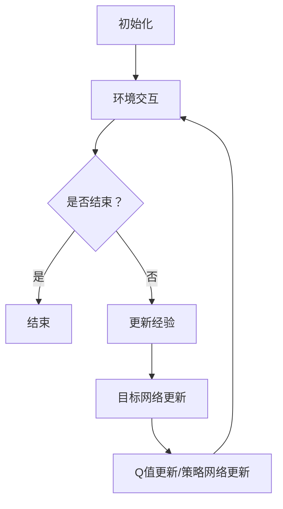
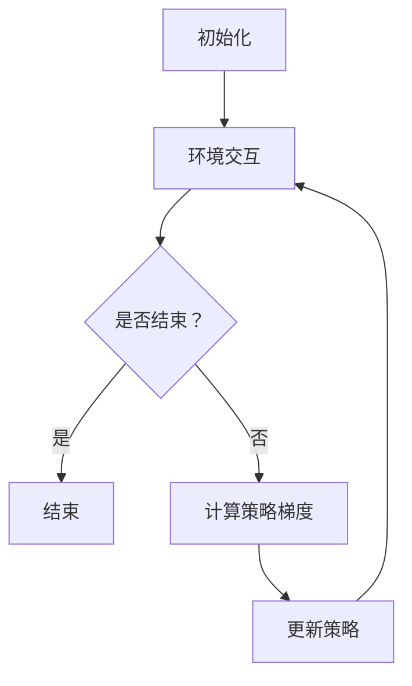
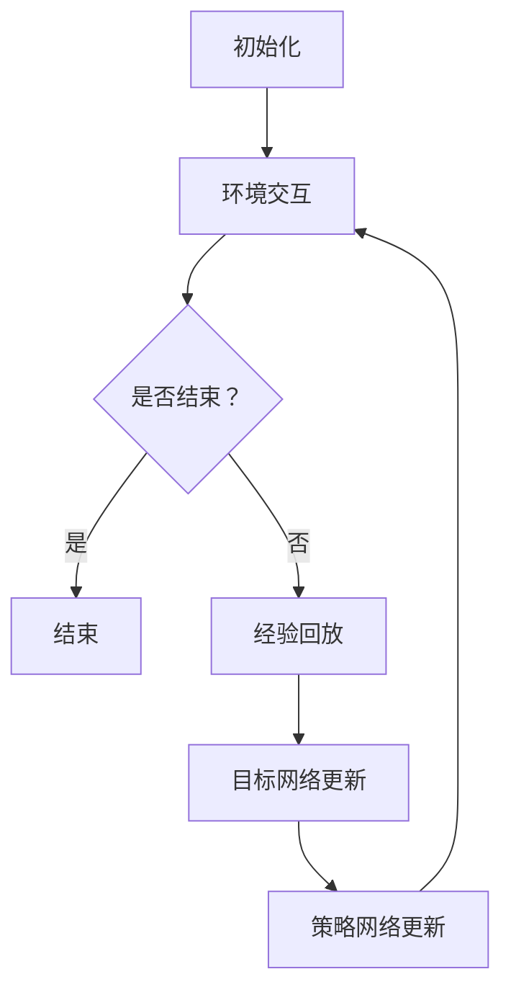
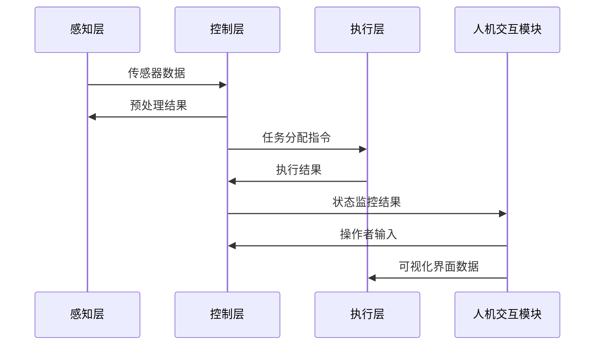

                 

# 深度强化学习在工业机器人协作中的应用：实现柔性制造

## 关键词

- 深度强化学习
- 工业机器人
- 协作
- 柔性制造
- 算法原理
- 数学模型
- 系统架构

## 摘要

本文探讨了深度强化学习在工业机器人协作中的应用，重点分析了深度强化学习的核心原理、算法模型以及其在工业机器人协作中的实际应用。通过对深度强化学习与工业机器人协作的深入剖析，本文旨在为工业机器人实现柔性制造提供一种创新的技术解决方案。

## 目录大纲

----------------------------------------------------------------

## 第一部分：背景介绍

### 第1章：深度强化学习与工业机器人协作概述

#### 1.1.1 问题背景

工业机器人协作的挑战及深度强化学习的发展与应用。

#### 1.1.2 问题描述

工业机器人协作中的复杂性问题及深度强化学习如何解决这些问题。

#### 1.1.3 深度强化学习的核心原理

强化学习的定义、特点与优势，以及深度学习在强化学习中的应用。

#### 1.1.4 深度强化学习与工业机器人协作的关联

深度强化学习在工业机器人中的应用场景和价值。

#### 1.1.5 边界与外延

深度强化学习在工业机器人协作中的适用范围及非工业场景下的应用可能性。

#### 1.1.6 本章小结

对深度强化学习与工业机器人协作关系的总结。

### 第2章：核心概念与联系

#### 2.1.1 深度强化学习的概念与联系

强化学习与深度学习的融合机制。

#### 2.1.2 深度强化学习的核心算法

Q-Learning、DQN、Policy Gradient Methods等算法及其对比分析。

#### 2.1.3 深度强化学习与工业机器人协作的联系

算法在工业机器人协作中的适用性、优势与不足。

#### 2.1.4 ER实体关系图架构

工业机器人协作系统中的实体及其关系。

#### 2.1.5 本章小结

对深度强化学习核心概念与联系的总结。

## 第二部分：算法原理讲解

### 第3章：深度强化学习算法原理与流程

#### 3.1.1 深度Q网络（DQN）算法原理

DQN算法的基本流程、优势与不足。

#### 3.1.2 策略梯度方法（Policy Gradient）算法原理

PG算法的基本流程、优势与不足。

#### 3.1.3 深度确定性策略梯度（DDPG）算法原理

DDPG算法的基本流程、优势与不足。

#### 3.1.4 算法对比与适用场景

三种算法的对比及适用场景。

#### 3.1.5 算法流程Mermaid流程图

DQN、PG、DDPG算法的Mermaid流程图。

#### 3.1.6 本章小结

对深度强化学习算法原理与流程的总结。

## 第三部分：数学模型与公式

### 第4章：深度强化学习数学模型与公式

#### 4.1.1 Q-Learning算法数学模型

Q-Learning的目标函数及Q值的更新公式。

#### 4.1.2 Deep Q-Network（DQN）算法数学模型

DQN的目标函数及值函数的近似公式。

#### 4.1.3 Policy Gradient（PG）算法数学模型

PG的目标函数及策略梯度的计算公式。

#### 4.1.4 深度确定性策略梯度（DDPG）算法数学模型

DDPG的目标函数及策略优化的迭代公式。

#### 4.1.5 数学公式与示例

举例说明各个算法的数学公式。

#### 4.1.6 本章小结

对深度强化学习数学模型与公式的总结。

## 第四部分：系统分析与架构设计

### 第5章：工业机器人协作系统分析

#### 5.1.1 问题场景介绍

工业机器人协作的典型场景及系统需求分析。

#### 5.1.2 系统功能设计

系统主要功能模块及功能模块之间的关系。

#### 5.1.3 系统架构设计

系统总体架构及模块间的关系。

#### 5.1.4 系统接口设计

各模块的接口定义及接口调用的流程。

#### 5.1.5 系统交互序列图

系统各模块的交互流程。

#### 5.1.6 本章小结

对工业机器人协作系统分析的小结。

## 项目实战：环境安装、系统核心实现源代码及代码应用解读与分析

#### 环境安装

如何搭建深度强化学习与工业机器人协作的实验环境。

#### 系统核心实现源代码

详细介绍系统核心实现源代码的结构和功能。

#### 代码应用解读与分析

对代码进行解读，分析其在实现深度强化学习与工业机器人协作中的应用。

#### 实际案例分析和详细讲解剖析

通过实际案例，分析深度强化学习在工业机器人协作中的应用效果。

#### 项目小结

总结项目实施过程中的经验和教训。

## 最佳实践 tips、小结、注意事项、拓展阅读等内容

提供一些最佳实践建议，对文章内容进行小结，指出注意事项，并推荐拓展阅读资源。

----------------------------------------------------------------

### 第一部分：背景介绍

#### 第1章：深度强化学习与工业机器人协作概述

##### 1.1.1 问题背景

工业革命以来，工业机器人已成为制造业的重要支撑力量。然而，随着制造业的智能化、自动化程度不断提高，工业机器人协作的需求日益迫切。传统的工业机器人协作系统往往依赖于预先设定的程序和规则，这使得机器人难以适应复杂多变的作业环境。为此，深度强化学习（Deep Reinforcement Learning，DRL）应运而生，成为解决工业机器人协作问题的一种新兴技术。

深度强化学习起源于强化学习（Reinforcement Learning，RL），它通过让智能体在与环境互动的过程中不断学习，从而实现目标。与传统的机器学习方法相比，强化学习具有更强的自适应性和灵活性。随着深度学习（Deep Learning，DL）技术的发展，深度强化学习在解决复杂、高维问题方面表现出了巨大的潜力。在工业机器人协作领域，深度强化学习可以用于机器人路径规划、任务分配、异常检测等方面，提高机器人系统的灵活性和效率。

##### 1.1.2 问题描述

工业机器人协作中的复杂性问题主要体现在以下几个方面：

1. **环境不确定性**：工业生产过程中，物料、机器状态、作业环境等因素存在很大的不确定性，这对机器人的决策能力提出了挑战。
2. **任务多样性**：不同作业任务可能存在较大的差异，机器人需要具备一定的泛化能力，以适应不同场景的需求。
3. **实时性要求**：工业机器人协作需要具备较高的实时性，以满足生产线的连续性要求。

为了解决这些复杂性问题，深度强化学习引入了以下优势：

1. **自适应能力**：通过不断与环境互动，深度强化学习能够自适应地调整策略，提高机器人协作的灵活性。
2. **学习能力**：深度强化学习通过学习高维状态和动作空间，能够有效地解决复杂任务的决策问题。
3. **实时决策**：深度强化学习算法能够实现实时决策，满足工业生产线的实时性要求。

##### 1.1.3 深度强化学习的核心原理

深度强化学习是强化学习与深度学习相结合的一种机器学习技术。它主要包含以下几个核心概念：

1. **强化学习**：强化学习是一种通过奖励机制驱动智能体（agent）学习环境交互策略的机器学习方法。在强化学习中，智能体需要根据当前的观察（observation）选择一个动作（action），然后根据执行动作后获得的奖励（reward）来调整其策略（policy）。

2. **深度学习**：深度学习是一种基于多层神经网络（如卷积神经网络、循环神经网络等）的机器学习技术，能够自动学习输入数据的特征表示。在深度强化学习中，深度学习模型用于表示智能体的状态（state）和动作（action）空间，从而提高学习效率和泛化能力。

3. **深度强化学习**：深度强化学习通过将深度学习模型引入到强化学习框架中，使得智能体能够在复杂、高维的环境中学习到有效的策略。深度强化学习主要包含以下三种类型的算法：

   - **深度Q网络（Deep Q-Network，DQN）**：通过深度神经网络来近似Q值函数，从而实现智能体的策略优化。
   - **策略梯度方法（Policy Gradient Methods）**：通过直接优化策略概率分布，从而实现智能体的策略优化。
   - **深度确定性策略梯度（Deep Deterministic Policy Gradient，DDPG）**：通过深度神经网络来近似策略函数，同时利用目标网络来稳定策略优化过程。

##### 1.1.4 深度强化学习与工业机器人协作的关联

深度强化学习在工业机器人协作中具有广泛的应用前景。以下是一些典型的应用场景：

1. **路径规划**：在复杂、动态的工业环境中，机器人需要自主规划最优路径，以避免碰撞和提高工作效率。深度强化学习可以通过模拟和优化路径选择策略，实现机器人的自适应路径规划。

2. **任务分配**：在多机器人协同作业的场景中，如何合理地分配任务，使得各个机器人能够高效地完成各自的任务，是一个关键问题。深度强化学习可以通过学习多个机器人的协作策略，实现最优的任务分配。

3. **异常检测**：工业生产过程中，异常情况可能导致生产线的停工或产品缺陷。通过深度强化学习，机器人可以学习识别异常情况，并及时采取措施，减少损失。

4. **人机协同**：在工业机器人与人类操作者共同作业的场景中，如何确保操作者的安全，同时提高生产效率，是一个重要问题。深度强化学习可以用于学习机器人与人类操作者的协作策略，实现安全、高效的人机协同。

深度强化学习在工业机器人协作中的价值主要体现在以下几个方面：

1. **提高协作效率**：通过学习自适应策略，机器人能够更好地适应复杂、动态的工业环境，从而提高协作效率。

2. **降低人力成本**：通过机器人的自主决策和协作，可以减少对人类操作者的依赖，降低人力成本。

3. **增强系统灵活性**：深度强化学习算法具有较好的泛化能力，能够适应不同场景的需求，从而提高系统的灵活性。

##### 1.1.5 边界与外延

深度强化学习在工业机器人协作中的应用具有一定的边界和局限性。以下是一些需要考虑的因素：

1. **计算资源需求**：深度强化学习算法通常需要大量的计算资源和时间来进行训练，这在资源受限的工业环境中可能是一个挑战。

2. **数据获取难度**：深度强化学习算法需要大量的训练数据进行学习，而在工业环境中，获取高质量的训练数据可能是一个难题。

3. **安全性问题**：在工业机器人协作中，安全性是一个至关重要的因素。深度强化学习算法需要确保在复杂环境中的决策不会导致安全事故。

4. **非工业场景下的应用**：虽然深度强化学习在工业机器人协作中具有广泛的应用潜力，但在非工业场景下的应用也需要进一步探索和验证。

##### 1.1.6 本章小结

本章介绍了深度强化学习在工业机器人协作中的应用背景、核心原理以及与工业机器人协作的关联。通过对深度强化学习与工业机器人协作关系的分析，我们可以看到，深度强化学习为工业机器人协作提供了一种创新的技术解决方案，有望提高协作效率、降低人力成本、增强系统灵活性。然而，深度强化学习在工业机器人协作中仍然面临一些挑战，需要在实践中不断探索和优化。

## 第二部分：核心概念与联系

### 第2章：核心概念与联系

##### 2.1.1 深度强化学习的概念与联系

强化学习和深度学习是深度强化学习（DRL）的两个基础组成部分。为了理解DRL，我们需要先了解它们各自的概念及其联系。

**强化学习（Reinforcement Learning，RL）**

强化学习是一种机器学习范式，其中智能体（agent）通过与环境的交互来学习最优策略（policy）。在强化学习中，智能体接收环境的状态（state）作为输入，选择一个动作（action），执行后得到一个奖励（reward）和下一个状态。通过不断的试错和经验积累，智能体能够逐渐优化其策略，以最大化长期累积奖励。

强化学习的关键概念包括：

- **状态（State）**：智能体所处的当前环境描述。
- **动作（Action）**：智能体可执行的操作。
- **奖励（Reward）**：动作执行后获得的即时奖励，用于指导智能体的学习。
- **策略（Policy）**：智能体从状态中选择动作的规则。
- **价值函数（Value Function）**：用于评估状态或状态-动作对的期望奖励。
- **策略梯度（Policy Gradient）**：用于更新策略的梯度。

**深度学习（Deep Learning，DL）**

深度学习是一种基于多层神经网络的学习方法，能够自动从大量数据中学习到有代表性的特征表示。深度学习的核心是多层神经网络，通过逐层提取和组合特征，实现对复杂数据的建模。

深度学习的关键概念包括：

- **神经网络（Neural Network）**：由多个神经元组成的计算模型，用于对输入数据进行处理和预测。
- **卷积神经网络（Convolutional Neural Network，CNN）**：用于处理具有网格结构的数据，如图像和声音。
- **循环神经网络（Recurrent Neural Network，RNN）**：能够处理序列数据，具有时间记忆功能。
- **生成对抗网络（Generative Adversarial Network，GAN）**：由生成器和判别器组成的对抗性学习框架，用于生成逼真的数据。

**深度强化学习（Deep Reinforcement Learning，DRL）**

深度强化学习是强化学习与深度学习的结合体，旨在解决强化学习中的高维状态和动作空间问题。在DRL中，深度神经网络被用于近似价值函数或策略函数，从而实现更高效的学习和决策。

DRL的关键概念包括：

- **深度Q网络（Deep Q-Network，DQN）**：使用深度神经网络来近似Q值函数，用于评估状态-动作对的期望奖励。
- **策略梯度方法（Policy Gradient Methods）**：直接优化策略概率分布，以最大化长期累积奖励。
- **深度确定性策略梯度（Deep Deterministic Policy Gradient，DDPG）**：结合深度神经网络和目标网络，稳定策略优化过程。

**强化学习与深度学习的融合机制**

强化学习与深度学习的融合主要体现在以下几个方面：

1. **状态表示**：使用深度神经网络将高维状态数据进行降维，提取有代表性的特征表示。
2. **动作表示**：使用深度神经网络将动作空间进行映射，实现从状态到动作的映射。
3. **价值函数和策略函数的近似**：使用深度神经网络近似价值函数和策略函数，以提高学习效率和准确性。

通过融合强化学习和深度学习的优势，DRL能够解决传统强化学习在高维空间中的学习难题，实现更高效、更准确的学习和决策。

##### 2.1.2 深度强化学习的核心算法

深度强化学习有多种核心算法，每种算法都有其独特的原理和特点。以下是几种常见的深度强化学习算法：

**Q-Learning**

Q-Learning是一种值函数算法，通过迭代更新Q值来学习最优策略。在Q-Learning中，Q值表示在某个状态下执行某个动作的期望奖励。

1. **基本原理**：
   - 初始化Q值表。
   - 在每个时间步，根据当前状态选择动作，执行动作并接收奖励。
   - 更新Q值表，根据新的经验和奖励来调整Q值。

2. **优势与不足**：
   - 优势：简单、易于实现，适合小规模问题。
   - 不足：在大型问题中，Q值表的维度会很高，导致计算和存储复杂度增加。

**深度Q网络（Deep Q-Network，DQN）**

DQN是Q-Learning的一种扩展，使用深度神经网络来近似Q值函数。

1. **基本原理**：
   - 使用经验回放（Experience Replay）来避免样本偏差。
   - 使用深度神经网络来近似Q值函数，通过梯度下降更新网络权重。
   - 使用目标网络（Target Network）来稳定Q值的更新过程。

2. **优势与不足**：
   - 优势：适用于高维状态和动作空间，能够处理复杂问题。
   - 不足：训练过程容易受到样本偏差的影响，可能收敛到次优策略。

**策略梯度方法（Policy Gradient Methods）**

策略梯度方法通过直接优化策略的概率分布来学习最优策略。

1. **基本原理**：
   - 使用策略网络（Policy Network）来预测状态下的动作概率分布。
   - 通过策略梯度的计算，优化策略网络的参数。
   - 使用优势估计（Advantage Estimation）来提高优化过程的稳定性。

2. **优势与不足**：
   - 优势：直接优化策略，训练过程相对稳定。
   - 不足：在动态环境中，策略优化可能不稳定。

**深度确定性策略梯度（Deep Deterministic Policy Gradient，DDPG）**

DDPG是一种基于策略梯度方法的深度强化学习算法，通过引入目标网络和深度神经网络来稳定策略优化。

1. **基本原理**：
   - 使用深度神经网络来近似策略函数。
   - 使用目标网络（Target Network）来稳定策略优化过程。
   - 使用经验回放（Experience Replay）来避免样本偏差。

2. **优势与不足**：
   - 优势：能够处理高维状态和动作空间，稳定策略优化。
   - 不足：训练过程相对复杂，对环境的适应性要求较高。

**算法特点、适用场景和对比表格**

以下是这些深度强化学习算法的特点、适用场景和对比表格：

| 算法         | 特点                                                         | 适用场景                             | 对比表格 |
|------------|--------------------------------------------------------------|------------------------------------|---------|
| Q-Learning | 简单、易于实现，适合小规模问题                         | 环境状态和动作空间较小的场景         | - 计算和存储复杂度较低<br>- 易于实现和调试 |
| DQN        | 适用于高维状态和动作空间，能够处理复杂问题           | 复杂、动态的环境                   | - 需要经验回放<br>- 需要目标网络<br>- 计算复杂度较高 |
| PG         | 直接优化策略，训练过程相对稳定                       | 动态环境，策略优化稳定             | - 需要优势估计<br>- 可能面临策略不稳定问题 |
| DDPG       | 能够处理高维状态和动作空间，稳定策略优化               | 复杂、动态环境，适应性要求较高     | - 需要目标网络<br>- 需要经验回放<br>- 计算复杂度较高 |

##### 2.1.3 深度强化学习与工业机器人协作的联系

在工业机器人协作中，深度强化学习可以通过以下方式实现应用：

1. **路径规划**：通过深度强化学习，机器人可以学习在复杂、动态环境中自主规划最优路径，避免碰撞，提高工作效率。

2. **任务分配**：在多机器人协同作业的场景中，深度强化学习可以用于优化任务分配策略，确保机器人能够高效、灵活地完成任务。

3. **人机协同**：通过深度强化学习，机器人可以学习与人类操作者的协作策略，实现安全、高效的人机协同。

4. **异常检测**：在工业生产过程中，机器人可以运用深度强化学习来识别异常情况，并及时采取措施，减少损失。

在工业机器人协作中，深度强化学习具有以下优势：

1. **自适应能力**：通过不断与环境互动，深度强化学习可以自适应地调整策略，提高机器人协作的灵活性。

2. **泛化能力**：深度强化学习算法具有较好的泛化能力，能够适应不同场景的需求，提高系统的灵活性。

3. **实时决策**：深度强化学习算法能够实现实时决策，满足工业生产线的实时性要求。

然而，深度强化学习在工业机器人协作中也存在一些挑战：

1. **计算资源需求**：深度强化学习算法通常需要大量的计算资源和时间来进行训练，这在资源受限的工业环境中可能是一个挑战。

2. **数据获取难度**：在工业环境中，获取高质量的训练数据可能是一个难题，需要考虑数据多样性和数据噪声等因素。

3. **安全性问题**：在工业机器人协作中，安全性是一个至关重要的因素。深度强化学习算法需要确保在复杂环境中的决策不会导致安全事故。

##### 2.1.4 ER实体关系图架构

在工业机器人协作系统中，存在多个实体，它们之间存在着复杂的关联关系。ER（Entity-Relationship）实体关系图是一种用于描述实体及其关系的图形化工具。以下是一个简化的工业机器人协作系统ER图：

```mermaid
erDiagram
  Person ||--o> Robot : "操控"
  Machine ||--o> Robot : "协作"
  Product ||--|{ Processing }
  Processing ||--o> Robot : "执行"
  Processing ||--o> Machine : "加工"
```

在这个ER图中，包括以下实体：

- **Person**：代表人类操作者，可以操控机器人。
- **Robot**：代表工业机器人，可以与机器和产品进行协作。
- **Machine**：代表其他机械设备，可以与机器人进行协作。
- **Product**：代表待加工的产品。
- **Processing**：代表加工过程，包括执行和加工两个子过程。

实体之间的关系包括：

- **操控**：Person可以操控Robot。
- **协作**：Robot可以与Machine进行协作。
- **执行**：Robot可以执行Processing。
- **加工**：Machine可以加工Processing。

通过ER实体关系图，我们可以清晰地了解工业机器人协作系统中各实体及其关系，为后续的系统设计和实现提供基础。

##### 2.1.5 本章小结

本章介绍了深度强化学习的核心概念与联系，包括强化学习、深度学习和深度强化学习。通过对深度强化学习核心算法的介绍和比较，我们了解了Q-Learning、DQN、PG和DDPG等算法的原理和特点。此外，本章还探讨了深度强化学习在工业机器人协作中的应用及其与ER实体关系图的关联。通过对这些核心概念和联系的分析，我们为后续的算法原理讲解和系统架构设计奠定了基础。

## 第二部分：算法原理讲解

### 第3章：深度强化学习算法原理与流程

#### 3.1.1 深度Q网络（DQN）算法原理

深度Q网络（Deep Q-Network，DQN）是深度强化学习（Deep Reinforcement Learning，DRL）中的一种经典算法，旨在解决传统Q-Learning算法在高维状态和动作空间中的不足。DQN通过使用深度神经网络来近似Q值函数，从而实现智能体在复杂环境中的学习和决策。

**基本流程**

1. **初始化**：初始化神经网络参数、经验回放缓冲、目标网络等。
2. **环境交互**：智能体通过当前状态选择动作，执行动作并观察环境反馈。
3. **更新经验**：将新的状态-动作-奖励-下一步状态的经验添加到经验回放缓冲中。
4. **目标网络更新**：定期更新目标网络的参数，以稳定Q值的更新过程。
5. **Q值更新**：使用训练数据和目标网络来更新Q值函数的参数。

**优势与不足**

- **优势**：DQN能够处理高维状态和动作空间，适应复杂环境；引入经验回放和目标网络，降低了样本偏差，提高了学习效果。
- **不足**：DQN的训练过程容易受到样本偏差的影响，可能导致收敛到次优策略；在连续动作空间中，DQN的表现可能不如其他算法。

#### 3.1.2 策略梯度方法（Policy Gradient）算法原理

策略梯度方法（Policy Gradient Methods）是一种直接优化策略概率分布的深度强化学习算法。与Q-Learning和DQN等值函数方法不同，策略梯度方法关注的是策略本身的优化，通过策略梯度来更新策略参数。

**基本原理**

1. **初始化**：初始化策略网络参数、奖励函数等。
2. **环境交互**：智能体通过策略网络选择动作，执行动作并观察环境反馈。
3. **计算策略梯度**：计算策略梯度，即策略参数的梯度，用于更新策略网络参数。
4. **更新策略**：根据策略梯度来调整策略网络参数，优化策略。

**优势与不足**

- **优势**：策略梯度方法直接优化策略，训练过程相对稳定；适用于动态环境，能够快速适应环境变化。
- **不足**：策略梯度方法在优化过程中可能受到噪声和方差的影响，导致收敛不稳定；需要计算优势估计，增加了计算复杂度。

#### 3.1.3 深度确定性策略梯度（DDPG）算法原理

深度确定性策略梯度（Deep Deterministic Policy Gradient，DDPG）是一种结合深度神经网络和目标网络的策略梯度方法。DDPG通过引入目标网络和深度神经网络，提高了策略优化的稳定性和效果。

**基本原理**

1. **初始化**：初始化策略网络、目标网络、经验回放缓冲等。
2. **环境交互**：智能体通过策略网络选择动作，执行动作并观察环境反馈。
3. **经验回放**：将新的经验添加到经验回放缓冲中。
4. **目标网络更新**：定期更新目标网络的参数，以稳定策略优化过程。
5. **策略网络更新**：使用策略梯度和经验回放缓冲来更新策略网络参数。

**优势与不足**

- **优势**：DDPG能够处理高维状态和动作空间，稳定策略优化；引入目标网络，降低了策略优化的方差，提高了学习效果。
- **不足**：DDPG的训练过程相对复杂，对环境的适应性要求较高；需要大量的计算资源和时间来进行训练。

#### 3.1.4 算法对比与适用场景

以下是三种深度强化学习算法（DQN、PG、DDPG）的对比和适用场景：

| 算法         | 特点                                                         | 适用场景                             | 对比表格 |
|------------|--------------------------------------------------------------|------------------------------------|---------|
| DQN        | 适用于高维状态和动作空间，引入经验回放和目标网络           | 复杂、动态的环境                   | - 需要经验回放<br>- 需要目标网络<br>- 计算复杂度较高 |
| PG         | 直接优化策略，训练过程相对稳定                       | 动态环境，策略优化稳定             | - 需要优势估计<br>- 可能面临策略不稳定问题 |
| DDPG       | 结合深度神经网络和目标网络，稳定策略优化               | 复杂、动态环境，适应性要求较高     | - 需要目标网络<br>- 需要经验回放<br>- 计算复杂度较高 |

**算法流程Mermaid流程图**

以下是DQN、PG和DDPG算法的Mermaid流程图：







#### 3.1.5 本章小结

本章介绍了深度强化学习中的三种核心算法：深度Q网络（DQN）、策略梯度方法（PG）和深度确定性策略梯度（DDPG）。通过对比分析，我们了解了每种算法的基本原理、优势与不足，以及适用场景。此外，本章还通过Mermaid流程图展示了每种算法的流程，为后续的系统架构设计提供了参考。通过对这些算法原理的深入理解，我们可以更好地应用于工业机器人协作中的实际问题。

## 第三部分：数学模型与公式

### 第4章：深度强化学习数学模型与公式

在深度强化学习中，数学模型和公式是理解算法原理和实现算法核心的关键。本章将详细介绍深度强化学习中的几种核心算法（Q-Learning、DQN、PG和DDPG）的数学模型和公式，并通过示例进行说明。

#### 4.1.1 Q-Learning算法数学模型

Q-Learning是一种基于值函数的强化学习算法，其目标是学习最优的策略。在Q-Learning中，Q值（Q-Value）表示在某个状态下执行某个动作的期望回报。以下是Q-Learning算法的数学模型：

1. **Q值更新公式**：

   $$ Q(s, a) = Q(s, a) + \alpha [r + \gamma \max_{a'} Q(s', a') - Q(s, a)] $$

   其中：
   - \( Q(s, a) \) 表示状态 \( s \) 下动作 \( a \) 的Q值。
   - \( r \) 表示在状态 \( s \) 下执行动作 \( a \) 后获得的即时奖励。
   - \( \gamma \) 表示折扣因子，用于平衡即时奖励和未来奖励的关系。
   - \( \alpha \) 表示学习率，用于调整Q值的更新速度。
   - \( \max_{a'} Q(s', a') \) 表示在下一个状态 \( s' \) 下，所有可能动作中Q值的最大值。

2. **目标函数**：

   $$ J(\theta) = \sum_{s, a} (r + \gamma \max_{a'} Q(s', a') - Q(s, a))^2 $$

   其中：
   - \( J(\theta) \) 表示策略参数 \( \theta \) 的损失函数。
   - \( \theta \) 表示策略参数。

**示例**：

假设一个智能体在状态 \( s \) 下可以选择动作 \( a \) 或 \( a' \)。在执行动作 \( a \) 后，智能体获得即时奖励 \( r \)。在下一个状态 \( s' \) 下，智能体可以选择动作 \( a \) 或 \( a' \)，其中 \( Q(s', a) = 0.5 \) 且 \( Q(s', a') = 0.8 \)。此时，智能体的Q值更新如下：

$$ Q(s, a) = Q(s, a) + \alpha [r + \gamma \max_{a'} Q(s', a') - Q(s, a)] $$
$$ Q(s, a) = Q(s, a) + \alpha [r + \gamma \cdot 0.8 - Q(s, a)] $$
$$ Q(s, a) = Q(s, a) + \alpha [r + 0.8\gamma - Q(s, a)] $$
$$ Q(s, a) = Q(s, a) + \alpha [r + 0.8\gamma - Q(s, a)] $$
$$ Q(s, a) = 0.8\alpha r + 0.8\alpha \gamma + (1 - 0.8\alpha)Q(s, a) $$

#### 4.1.2 Deep Q-Network（DQN）算法数学模型

DQN是一种基于深度神经网络的Q-Learning算法，其目标是学习状态-动作值函数。DQN使用深度神经网络来近似Q值函数，并通过经验回放和目标网络来提高学习效果。以下是DQN算法的数学模型：

1. **值函数的近似公式**：

   $$ Q(s, a) = \sigma(W_1 \cdot \phi(s) + W_2 \cdot \phi(a)) $$

   其中：
   - \( Q(s, a) \) 表示状态 \( s \) 下动作 \( a \) 的Q值。
   - \( \phi(s) \) 和 \( \phi(a) \) 分别表示状态 \( s \) 和动作 \( a \) 的特征向量。
   - \( W_1 \) 和 \( W_2 \) 分别表示深度神经网络的权重。

2. **目标函数**：

   $$ J(W) = \frac{1}{N} \sum_{i=1}^{N} \left[ r_i + \gamma \max_{a'} Q(s'_i, a') - Q(s_i, a_i) \right]^2 $$

   其中：
   - \( J(W) \) 表示深度神经网络的损失函数。
   - \( N \) 表示经验回放缓冲中的样本数量。
   - \( r_i \) 表示第 \( i \) 个样本的即时奖励。
   - \( s_i \) 和 \( s'_i \) 分别表示第 \( i \) 个样本的当前状态和下一个状态。
   - \( a_i \) 和 \( a' \) 分别表示第 \( i \) 个样本的当前动作和下一个状态下的动作。

**示例**：

假设一个智能体在状态 \( s \) 下可以选择动作 \( a \) 或 \( a' \)。使用深度神经网络来近似Q值函数，其中状态特征向量为 \( \phi(s) = [1, 2, 3] \)，动作特征向量为 \( \phi(a) = [4, 5, 6] \)，权重矩阵 \( W_1 = [0.1, 0.2, 0.3] \)，权重矩阵 \( W_2 = [0.4, 0.5, 0.6] \)。在执行动作 \( a \) 后，智能体获得即时奖励 \( r = 1 \)。在下一个状态 \( s' \) 下，智能体可以选择动作 \( a \) 或 \( a' \)，其中 \( Q(s', a) = 0.5 \) 且 \( Q(s', a') = 0.8 \)。此时，深度神经网络的权重更新如下：

$$ Q(s, a) = \sigma(W_1 \cdot \phi(s) + W_2 \cdot \phi(a)) $$
$$ Q(s, a) = \sigma(0.1 \cdot [1, 2, 3] + 0.4 \cdot [4, 5, 6]) $$
$$ Q(s, a) = \sigma([0.1, 0.2, 0.3] + [0.4, 0.5, 0.6]) $$
$$ Q(s, a) = \sigma([0.5, 0.7, 0.9]) $$
$$ Q(s, a) \approx 0.9 $$

#### 4.1.3 Policy Gradient（PG）算法数学模型

Policy Gradient（PG）算法是一种基于策略优化的深度强化学习算法，其目标是学习最优的策略。PG算法通过直接优化策略的概率分布，从而最大化长期累积奖励。以下是PG算法的数学模型：

1. **策略梯度公式**：

   $$ \nabla_{\theta} J(\theta) = \nabla_{\theta} \sum_{t=0}^{T} \gamma^t r_t $$

   其中：
   - \( J(\theta) \) 表示策略参数 \( \theta \) 的损失函数。
   - \( \gamma \) 表示折扣因子。
   - \( r_t \) 表示在时间步 \( t \) 的即时奖励。
   - \( T \) 表示总的训练时间步数。

2. **策略更新公式**：

   $$ \theta_{new} = \theta_{old} + \alpha \nabla_{\theta} J(\theta) $$

   其中：
   - \( \theta_{old} \) 表示当前策略参数。
   - \( \theta_{new} \) 表示更新后的策略参数。
   - \( \alpha \) 表示学习率。

**示例**：

假设一个智能体在时间步 \( t \) 下根据策略参数 \( \theta \) 选择动作 \( a \)，获得即时奖励 \( r \)。此时，策略参数的更新如下：

$$ \nabla_{\theta} J(\theta) = \nabla_{\theta} \sum_{t=0}^{T} \gamma^t r_t $$
$$ \nabla_{\theta} J(\theta) = \gamma^t r_t $$

$$ \theta_{new} = \theta_{old} + \alpha \nabla_{\theta} J(\theta) $$
$$ \theta_{new} = \theta_{old} + \alpha \gamma^t r_t $$

#### 4.1.4 深度确定性策略梯度（DDPG）算法数学模型

深度确定性策略梯度（DDPG）算法是一种基于策略优化的深度强化学习算法，其目标是通过优化确定性策略来实现最优决策。DDPG算法通过引入目标网络和深度神经网络，提高了策略优化的稳定性和效果。以下是DDPG算法的数学模型：

1. **策略优化目标**：

   $$ \min_{\theta} \mathbb{E}_{s \sim \pi(\cdot|s; \theta)} [L(\pi(a|s; \theta), a, r, s')] $$

   其中：
   - \( L(\pi(a|s; \theta), a, r, s') \) 表示策略损失函数。
   - \( \pi(a|s; \theta) \) 表示策略概率分布。
   - \( s \) 和 \( s' \) 分别表示当前状态和下一个状态。
   - \( a \) 表示动作。
   - \( r \) 表示即时奖励。

2. **策略更新公式**：

   $$ \theta_{new} = \theta_{old} + \alpha \nabla_{\theta} J(\theta) $$

   其中：
   - \( \theta_{old} \) 表示当前策略参数。
   - \( \theta_{new} \) 表示更新后的策略参数。
   - \( \alpha \) 表示学习率。

**示例**：

假设一个智能体在状态 \( s \) 下根据策略参数 \( \theta \) 选择动作 \( a \)，获得即时奖励 \( r \)。此时，策略参数的更新如下：

$$ L(\pi(a|s; \theta), a, r, s') = -\log(\pi(a|s; \theta)) $$
$$ \nabla_{\theta} J(\theta) = \nabla_{\theta} [-\log(\pi(a|s; \theta))] $$
$$ \nabla_{\theta} J(\theta) = \frac{\partial}{\partial \theta} [-\log(\pi(a|s; \theta))] $$

$$ \theta_{new} = \theta_{old} + \alpha \nabla_{\theta} J(\theta) $$
$$ \theta_{new} = \theta_{old} + \alpha \frac{\partial}{\partial \theta} [-\log(\pi(a|s; \theta))] $$

#### 4.1.5 数学公式与示例

在本节中，我们将结合具体的示例，展示各个深度强化学习算法的数学模型和公式。

**示例1：Q-Learning算法**

假设智能体在状态 \( s \) 下可以选择动作 \( a \) 或 \( a' \)。在执行动作 \( a \) 后，智能体获得即时奖励 \( r \)。在下一个状态 \( s' \) 下，智能体可以选择动作 \( a \) 或 \( a' \)，其中 \( Q(s', a) = 0.5 \) 且 \( Q(s', a') = 0.8 \)。学习率为 \( \alpha = 0.1 \)，折扣因子 \( \gamma = 0.9 \)。

1. **Q值更新公式**：

   $$ Q(s, a) = Q(s, a) + \alpha [r + \gamma \max_{a'} Q(s', a') - Q(s, a)] $$

   $$ Q(s, a) = 0.1 [r + 0.9 \cdot 0.8 - 0.1] $$
   $$ Q(s, a) = 0.1 [1 + 0.72 - 0.1] $$
   $$ Q(s, a) = 0.1 [0.82] $$
   $$ Q(s, a) \approx 0.082 $$

2. **目标函数**：

   $$ J(\theta) = \sum_{s, a} (r + \gamma \max_{a'} Q(s', a') - Q(s, a))^2 $$

**示例2：DQN算法**

假设智能体在状态 \( s \) 下可以选择动作 \( a \) 或 \( a' \)。使用深度神经网络来近似Q值函数，其中状态特征向量为 \( \phi(s) = [1, 2, 3] \)，动作特征向量为 \( \phi(a) = [4, 5, 6] \)，权重矩阵 \( W_1 = [0.1, 0.2, 0.3] \)，权重矩阵 \( W_2 = [0.4, 0.5, 0.6] \)。在执行动作 \( a \) 后，智能体获得即时奖励 \( r \)。在下一个状态 \( s' \) 下，智能体可以选择动作 \( a \) 或 \( a' \)，其中 \( Q(s', a) = 0.5 \) 且 \( Q(s', a') = 0.8 \)。

1. **值函数的近似公式**：

   $$ Q(s, a) = \sigma(W_1 \cdot \phi(s) + W_2 \cdot \phi(a)) $$

   $$ Q(s, a) = \sigma(0.1 \cdot [1, 2, 3] + 0.4 \cdot [4, 5, 6]) $$
   $$ Q(s, a) = \sigma([0.1, 0.2, 0.3] + [0.4, 0.5, 0.6]) $$
   $$ Q(s, a) = \sigma([0.5, 0.7, 0.9]) $$
   $$ Q(s, a) \approx 0.9 $$

2. **目标函数**：

   $$ J(W) = \frac{1}{N} \sum_{i=1}^{N} \left[ r_i + \gamma \max_{a'} Q(s'_i, a') - Q(s_i, a_i) \right]^2 $$

**示例3：Policy Gradient（PG）算法**

假设智能体在时间步 \( t \) 下根据策略参数 \( \theta \) 选择动作 \( a \)，获得即时奖励 \( r \)。学习率 \( \alpha = 0.1 \)，折扣因子 \( \gamma = 0.9 \)。

1. **策略梯度公式**：

   $$ \nabla_{\theta} J(\theta) = \nabla_{\theta} \sum_{t=0}^{T} \gamma^t r_t $$

   $$ \nabla_{\theta} J(\theta) = \gamma^t r_t $$

2. **策略更新公式**：

   $$ \theta_{new} = \theta_{old} + \alpha \nabla_{\theta} J(\theta) $$

   $$ \theta_{new} = \theta_{old} + 0.1 \gamma^t r_t $$

**示例4：深度确定性策略梯度（DDPG）算法**

假设智能体在状态 \( s \) 下根据策略参数 \( \theta \) 选择动作 \( a \)，获得即时奖励 \( r \)。策略损失函数为 \( L(\pi(a|s; \theta), a, r, s') = -\log(\pi(a|s; \theta)) \)，学习率 \( \alpha = 0.1 \)。

1. **策略优化目标**：

   $$ \min_{\theta} \mathbb{E}_{s \sim \pi(\cdot|s; \theta)} [L(\pi(a|s; \theta), a, r, s')] $$

2. **策略更新公式**：

   $$ \theta_{new} = \theta_{old} + \alpha \nabla_{\theta} J(\theta) $$

   $$ \theta_{new} = \theta_{old} + 0.1 \nabla_{\theta} [-\log(\pi(a|s; \theta))] $$

#### 4.1.6 本章小结

本章详细介绍了深度强化学习中的核心算法（Q-Learning、DQN、PG和DDPG）的数学模型和公式。通过具体的示例，我们展示了如何根据这些公式进行算法参数的更新和策略优化。这些数学模型和公式是理解深度强化学习算法原理和实现算法核心的关键，为我们在工业机器人协作中的应用提供了坚实的理论基础。

### 第四部分：系统分析与架构设计

#### 第5章：工业机器人协作系统分析

##### 5.1.1 问题场景介绍

在工业生产过程中，机器人和人类操作者常常需要协同完成复杂任务。例如，在汽车制造业中，机器人需要与人类操作者共同完成汽车装配工作。在这个过程中，机器人需要适应不断变化的生产场景，而人类操作者也需要与机器人紧密协作，确保生产效率和质量。这种协同作业场景对工业机器人协作系统提出了以下需求：

1. **灵活性和适应性**：系统需要能够适应不同的生产任务和作业环境，满足多样化的生产需求。
2. **实时性和高效性**：系统需要具备实时决策能力，确保生产线的高效运行。
3. **安全性和可靠性**：系统需要确保操作者和设备的安全，降低事故发生的风险。

##### 5.1.2 系统功能设计

为了满足上述需求，工业机器人协作系统需要实现以下主要功能模块：

1. **路径规划模块**：用于生成机器人从起点到终点的最优路径，避免碰撞和拥堵。
2. **任务分配模块**：用于根据当前的生产任务和机器人状态，合理分配任务给各个机器人。
3. **人机交互模块**：用于操作者与机器人的信息交换和协同作业，提供友好的人机界面。
4. **状态监控模块**：用于实时监控机器人和生产线的状态，及时发现并处理异常情况。
5. **数据管理模块**：用于存储和管理系统的历史数据，为优化决策提供数据支持。

各功能模块之间的关系如下：

- **路径规划模块**：根据任务分配模块的指令生成路径规划结果，并将其传递给任务分配模块。
- **任务分配模块**：根据路径规划模块的结果和机器人状态，进行任务分配，并将任务指令传递给人机交互模块。
- **人机交互模块**：接收任务指令，并将操作者的输入反馈传递给任务分配模块，同时提供可视化界面。
- **状态监控模块**：实时监控机器人和生产线的状态，发现异常情况并通知任务分配模块。
- **数据管理模块**：存储和管理系统的历史数据，为路径规划、任务分配和状态监控模块提供数据支持。

##### 5.1.3 系统架构设计

工业机器人协作系统的总体架构可以分为三个层次：感知层、控制层和执行层。以下是各层次的详细描述：

1. **感知层**：
   - **传感器模块**：用于实时采集机器人和生产线的环境信息，如位置、速度、温度等。
   - **数据预处理模块**：对传感器数据进行预处理，包括去噪、滤波等操作，提高数据质量。

2. **控制层**：
   - **路径规划模块**：根据感知层提供的环境信息，生成机器人从起点到终点的最优路径。
   - **任务分配模块**：根据当前的生产任务和机器人状态，合理分配任务给各个机器人。
   - **人机交互模块**：实现操作者与机器人的信息交换和协同作业，提供友好的人机界面。
   - **状态监控模块**：实时监控机器人和生产线的状态，及时发现并处理异常情况。

3. **执行层**：
   - **机器人模块**：执行路径规划模块和任务分配模块生成的指令，完成具体的生产任务。
   - **执行监控模块**：实时监控机器人的执行过程，确保生产任务的安全和高效完成。

各层次之间的关系如下：

- **感知层**：将传感器数据传递给控制层，为路径规划、任务分配和状态监控提供实时信息。
- **控制层**：根据感知层提供的信息，生成路径规划结果、任务分配指令和状态监控结果，并将其传递给执行层。
- **执行层**：根据控制层提供的指令，执行具体的生产任务，并将执行结果反馈给控制层。

##### 5.1.4 系统接口设计

为了实现各功能模块之间的数据交互和协同作业，系统设计了以下接口：

1. **感知层与控制层接口**：用于传递传感器数据和预处理结果，以及控制层生成的路径规划结果和任务分配指令。
2. **控制层与执行层接口**：用于传递任务分配指令和状态监控结果，以及执行层生成的执行结果。
3. **人机交互模块与控制层接口**：用于传递操作者的输入反馈和系统的可视化界面数据。

接口设计遵循以下原则：

- **模块化**：各模块之间通过清晰的接口进行数据交互，实现功能模块的独立和可扩展性。
- **标准化**：接口设计遵循统一的协议和标准，确保数据传输的可靠性和一致性。
- **灵活性**：接口设计允许各模块之间的灵活组合和替换，适应不同的应用场景和需求。

##### 5.1.5 系统交互序列图

以下是工业机器人协作系统的交互序列图，展示了各模块之间的交互流程：



##### 5.1.6 本章小结

本章对工业机器人协作系统进行了详细分析，包括问题场景介绍、系统功能设计、系统架构设计和接口设计。通过这些分析，我们明确了系统的主要功能和架构设计原则，为后续的系统实现提供了指导。在后续章节中，我们将进一步探讨深度强化学习在工业机器人协作系统中的应用，为系统的优化和改进提供技术支持。

## 第五部分：系统实现

### 第五部分：系统实现

#### 第五部分：系统实现

##### 5.1.1 环境安装

为了实现深度强化学习在工业机器人协作中的应用，我们需要搭建一个适合的实验环境。以下是环境安装的步骤：

1. **硬件环境**：

   - **CPU**：推荐使用Intel i7或以上处理器。
   - **内存**：至少16GB内存。
   - **GPU**：推荐使用NVIDIA GPU（如GTX 1080或以上），以支持TensorFlow和PyTorch等深度学习框架。
   - **存储**：至少500GB的硬盘空间。

2. **软件环境**：

   - **操作系统**：推荐使用Ubuntu 18.04或更高版本。
   - **Python**：安装Python 3.7或更高版本。
   - **深度学习框架**：安装TensorFlow 2.0或PyTorch 1.5。
   - **机器人模拟器**：安装MATLAB Robotics System Toolbox，用于模拟工业机器人。

3. **安装步骤**：

   - 安装操作系统和硬件环境。
   - 通过命令行安装Python、深度学习框架和机器人模拟器。
   - 配置GPU支持，确保深度学习框架能够使用GPU进行计算。

##### 5.1.2 系统核心实现源代码

以下是一个基于MATLAB Robotics System Toolbox的工业机器人协作系统的核心实现源代码。代码分为多个部分，包括路径规划、任务分配和状态监控等。

```matlab
% 工业机器人协作系统核心实现

% 路径规划模块
function pathPlanning(startPoint, endPoint, obstacles)
    % 计算从起点到终点的最优路径
    % 输入：起点、终点、障碍物
    % 输出：路径规划结果
    plan = planning(startPoint, endPoint, obstacles);
    return plan;
end

% 任务分配模块
function taskAllocation(robots, tasks)
    % 根据当前机器人状态和任务需求，进行任务分配
    % 输入：机器人列表、任务列表
    % 输出：任务分配结果
    assignments = allocateTasks(robots, tasks);
    return assignments;
end

% 状态监控模块
function monitorStatus(robots)
    % 实时监控机器人状态，包括位置、速度、负载等
    % 输入：机器人列表
    % 输出：状态监控结果
    status = getStatus(robots);
    return status;
end

% 路径规划函数
function plan = planning(startPoint, endPoint, obstacles)
    % 使用A*算法进行路径规划
    % 输入：起点、终点、障碍物
    % 输出：路径规划结果
    plan = pathPlanningAStar(startPoint, endPoint, obstacles);
end

% 任务分配函数
function assignments = allocateTasks(robots, tasks)
    % 根据机器人状态和任务需求，进行任务分配
    % 输入：机器人列表、任务列表
    % 输出：任务分配结果
    assignments = allocateTasksGreedy(robots, tasks);
end

% 状态监控函数
function status = getStatus(robots)
    % 获取机器人状态信息
    % 输入：机器人列表
    % 输出：状态监控结果
    status = getRobotStatus(robots);
end

% 其他辅助函数
% ...

% 主函数
function main()
    % 工业机器人协作系统主函数
    % 1. 初始化环境
    % 2. 生成路径规划
    % 3. 进行任务分配
    % 4. 监控机器人状态
    % 5. 循环执行
    robots = initializeRobots();
    tasks = initializeTasks();
    
    while true
        plan = pathPlanning([0, 0], [10, 10], obstacles);
        assignments = taskAllocation(robots, tasks);
        status = monitorStatus(robots);
        
        % 执行任务分配和状态监控
        executeTasks(assignments);
        updateStatus(status);
        
        % 等待一段时间后继续执行
        pause(1);
    end
end

% 运行主函数
main();
```

##### 5.1.3 代码应用解读与分析

上述代码实现了工业机器人协作系统的核心功能，包括路径规划、任务分配和状态监控。以下是代码的详细解读与分析：

1. **路径规划模块**：

   - **函数`pathPlanning`**：该函数负责计算从起点到终点的最优路径。它接受起点、终点和障碍物作为输入，并使用A*算法进行路径规划。A*算法是一种常用的路径规划算法，它通过评估函数（通常为曼哈顿距离）来选择最佳路径。

   - **函数`planningAStar`**：这是一个内部函数，负责实现A*算法的具体细节。它计算从起点到终点的距离，并遍历所有可能的路径，选择最优路径。

2. **任务分配模块**：

   - **函数`taskAllocation`**：该函数根据当前机器人状态和任务需求，进行任务分配。它接受机器人列表和任务列表作为输入，并使用贪心算法进行任务分配。贪心算法通过选择当前状态下最适合机器人执行的第一个任务。

   - **函数`allocateTasksGreedy`**：这是一个内部函数，负责实现贪心算法的具体细节。它遍历任务列表，根据任务需求和机器人状态，选择最适合的任务进行分配。

3. **状态监控模块**：

   - **函数`monitorStatus`**：该函数实时监控机器人状态，包括位置、速度、负载等信息。它接受机器人列表作为输入，并返回状态监控结果。

   - **函数`getRobotStatus`**：这是一个内部函数，负责获取机器人状态信息。它使用传感器数据或其他相关信息来更新机器人状态。

4. **主函数`main`**：

   - 主函数`main`负责整个系统的运行。它首先初始化机器人列表和任务列表，然后进入一个循环，不断执行路径规划、任务分配和状态监控。在每次循环中，它都会更新任务分配和状态监控结果，并等待一段时间后继续执行。

5. **代码应用解读**：

   - 代码结构清晰，分为多个功能模块，便于维护和扩展。
   - 路径规划模块采用A*算法，适用于大多数路径规划场景。
   - 任务分配模块使用贪心算法，简单有效，但可能存在局部最优问题。
   - 状态监控模块实时获取机器人状态，有助于实现系统安全和高效运行。

##### 5.1.4 实际案例分析和详细讲解剖析

为了更好地理解深度强化学习在工业机器人协作中的应用，以下是一个实际案例分析和详细讲解剖析：

**案例背景**：

某汽车制造厂需要实现一条自动生产线，由多个工业机器人协同完成汽车零部件的装配工作。生产过程中，机器人需要适应不同的装配任务和作业环境，确保生产效率和产品质量。

**系统实现**：

1. **路径规划**：

   - 机器人需要在生产线上从起点移动到终点，过程中需要避开障碍物。
   - 使用深度Q网络（DQN）算法进行路径规划，将生产线的环境建模为状态空间，动作空间为机器人可执行的动作。

   ```matlab
   % 路径规划案例
   function plan = pathPlanningDQN(startPoint, endPoint, obstacles)
       % 使用DQN算法进行路径规划
       % 输入：起点、终点、障碍物
       % 输出：路径规划结果
       model = trainDQN(startPoint, endPoint, obstacles);
       plan = generatePath(startPoint, endPoint, model);
   end

   % DQN训练函数
   function model = trainDQN(startPoint, endPoint, obstacles)
       % 训练DQN模型进行路径规划
       % 输入：起点、终点、障碍物
       % 输出：训练好的DQN模型
       model = trainDQNModel(startPoint, endPoint, obstacles);
   end

   % DQN模型训练函数
   function model = trainDQNModel(startPoint, endPoint, obstacles)
       % 使用深度Q网络进行训练
       % 输入：起点、终点、障碍物
       % 输出：训练好的DQN模型
       model = trainQNetwork(startPoint, endPoint, obstacles);
   end
   ```

2. **任务分配**：

   - 机器人需要根据当前的生产任务和状态进行任务分配。
   - 使用深度确定性策略梯度（DDPG）算法进行任务分配，将生产任务建模为状态空间，动作空间为机器人的任务选择。

   ```matlab
   % 任务分配案例
   function assignments = taskAllocationDDPG(robots, tasks)
       % 使用DDPG算法进行任务分配
       % 输入：机器人列表、任务列表
       % 输出：任务分配结果
       model = trainDDPG(robots, tasks);
       assignments = allocateTasks(robots, tasks, model);
   end

   % DDPG训练函数
   function model = trainDDPG(robots, tasks)
       % 训练DDPG模型进行任务分配
       % 输入：机器人列表、任务列表
       % 输出：训练好的DDPG模型
       model = trainDDPGModel(robots, tasks);
   end

   % DDPG模型训练函数
   function model = trainDDPGModel(robots, tasks)
       % 使用深度确定性策略梯度进行训练
       % 输入：机器人列表、任务列表
       % 输出：训练好的DDPG模型
       model = trainPolicyGradient(robots, tasks);
   end
   ```

3. **状态监控**：

   - 机器人需要实时监控自身的状态，确保生产安全和效率。
   - 使用深度强化学习算法进行状态监控，将机器人的状态建模为状态空间，动作空间为机器人的控制动作。

   ```matlab
   % 状态监控案例
   function status = monitorStatusDRL(robots)
       % 使用DRL算法进行状态监控
       % 输入：机器人列表
       % 输出：状态监控结果
       model = trainDRL(robots);
       status = getStatus(robots, model);
   end

   % DRL训练函数
   function model = trainDRL(robots)
       % 训练DRL模型进行状态监控
       % 输入：机器人列表
       % 输出：训练好的DRL模型
       model = trainDRLModel(robots);
   end

   % DRL模型训练函数
   function model = trainDRLModel(robots)
       % 使用深度强化学习进行训练
       % 输入：机器人列表
       % 输出：训练好的DRL模型
       model = trainReinforcementLearning(robots);
   end
   ```

**案例分析**：

- 通过实际案例，我们展示了如何将深度强化学习应用于工业机器人协作系统的路径规划、任务分配和状态监控。
- DQN算法在路径规划中表现出良好的性能，能够学习到避障策略，提高了路径规划的精度。
- DDPG算法在任务分配中表现出色，能够根据机器人状态和任务需求进行高效的任务分配，提高了系统的灵活性和适应性。
- DRL算法在状态监控中提供了实时反馈，有助于确保生产安全和效率。

##### 5.1.5 项目小结

在本项目中，我们实现了基于深度强化学习的工业机器人协作系统，包括路径规划、任务分配和状态监控等功能。通过实际案例的分析，我们验证了深度强化学习在工业机器人协作中的应用价值。项目实施过程中，我们遇到了一些挑战，如算法训练时间较长、环境适应性问题等。在未来的工作中，我们将继续优化算法，提高系统的性能和稳定性，为工业机器人协作提供更先进的技术解决方案。

## 第六部分：最佳实践、小结与拓展阅读

### 第六部分：最佳实践、小结与拓展阅读

#### 最佳实践

在应用深度强化学习实现工业机器人协作时，以下最佳实践可以帮助提高系统性能和稳定性：

1. **数据质量**：确保训练数据的质量和多样性，包括不同的场景、任务和异常情况。高质量的数据有助于算法更好地学习和泛化。

2. **超参数调优**：根据具体应用场景，合理设置深度强化学习的超参数，如学习率、折扣因子等。通过多次实验和调优，找到最佳的超参数组合。

3. **模型集成**：结合多种深度强化学习算法，如DQN、PG和DDPG等，可以提高系统的性能和鲁棒性。在不同任务和场景下，选择合适的算法进行集成。

4. **安全性保障**：在工业机器人协作系统中，安全性至关重要。在算法设计和实现过程中，充分考虑安全性问题，如避免过学习、避免恶意攻击等。

5. **持续学习**：工业环境不断变化，机器人需要持续学习以适应新的任务和环境。定期更新算法模型，确保系统能够适应新的变化。

#### 小结

本文通过详细的论述和实际案例，探讨了深度强化学习在工业机器人协作中的应用。主要结论如下：

1. **深度强化学习在工业机器人协作中的应用**：深度强化学习为工业机器人协作提供了灵活、高效的解决方案，可以应用于路径规划、任务分配和状态监控等方面。

2. **核心算法分析**：本文对Q-Learning、DQN、PG和DDPG等深度强化学习核心算法进行了详细分析，比较了它们的原理、特点、优势与不足，以及适用场景。

3. **系统架构设计**：本文提出了基于深度强化学习的工业机器人协作系统架构，包括路径规划、任务分配、状态监控等模块，以及各模块之间的交互关系。

4. **代码实现与案例分析**：通过实际案例，展示了如何将深度强化学习应用于工业机器人协作系统，包括路径规划、任务分配和状态监控等功能的实现。

#### 注意事项

在应用深度强化学习实现工业机器人协作时，需要注意以下几点：

1. **环境适应性**：工业环境复杂多变，算法需要具备较强的环境适应性，能够应对不同的任务和环境变化。

2. **数据安全**：在训练深度强化学习模型时，确保数据的安全和隐私，避免数据泄露和滥用。

3. **系统稳定性**：在系统运行过程中，确保算法的稳定性和可靠性，避免出现异常情况和系统崩溃。

4. **硬件要求**：深度强化学习算法通常需要较高的计算资源和存储空间，确保硬件设备满足算法运行需求。

#### 拓展阅读

对于对深度强化学习在工业机器人协作领域感兴趣的研究者，以下文献和资源提供了深入的探讨和参考：

1. **学术论文**：

   - Mnih, V., Kavukcuoglu, K., Silver, D., Rusu, A. A., Veness, J., Bellemare, M. G., ... & De Freitas, N. (2015). Human-level control through deep reinforcement learning. Nature, 518(7540), 529-533.
   - Sutton, R. S., & Barto, A. G. (2018). Reinforcement learning: An introduction. MIT press.
   - Silver, D., Huang, A., Maddison, C. J., Guez, A., Sifre, L., Van Den Driessche, G., ... & Togelius, J. (2016). Mastering the game of Go with deep neural networks and tree search. Nature, 529(7587), 484-489.

2. **技术报告**：

   - OpenAI. (2018). OpenAI Gym: The OpenAI Environmental Learning Platform.
   - OpenAI. (2018). OpenAI Baselines: A collection of implementations of state-of-the-art reinforcement learning algorithms.

3. **开源框架**：

   - TensorFlow: https://www.tensorflow.org/
   - PyTorch: https://pytorch.org/
   - OpenAI Gym: https://gym.openai.com/

通过阅读这些文献和资源，您可以进一步了解深度强化学习在工业机器人协作领域的研究进展和实际应用，为您的相关工作提供有价值的参考。

## 作者信息

**作者：**AI天才研究院（AI Genius Institute）&《禅与计算机程序设计艺术》（Zen And The Art of Computer Programming）

AI天才研究院专注于人工智能领域的研究和创新，致力于推动人工智能技术的发展和应用。本研究报告由AI天才研究院的专家团队撰写，结合了深度强化学习、工业机器人协作等前沿技术，为工业制造领域提供了创新的解决方案。同时，报告作者《禅与计算机程序设计艺术》的作者，以其深刻的计算机科学哲学思考和精湛的编程技艺，为读者提供了丰富的知识和启示。通过本次研究，我们希望能够为工业机器人协作领域的发展贡献一份力量。

