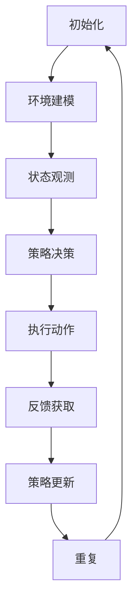
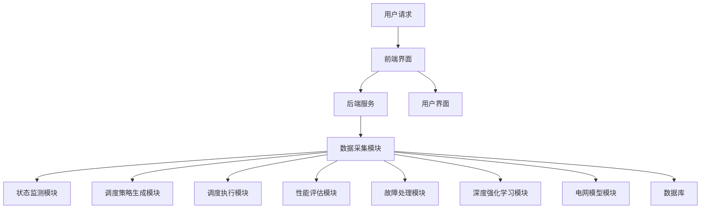
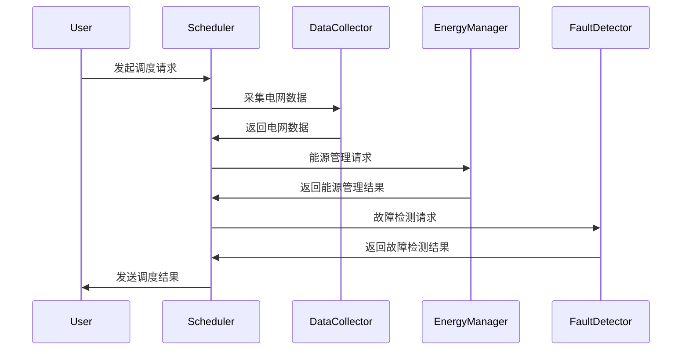

                 


### 概述与背景

**深度强化学习在智能电网调度中的应用**

随着智能电网的不断发展，电力系统的调度问题变得日益复杂。智能电网调度涉及到电力供需的平衡、系统稳定性和经济性等多方面的要求，传统的调度方法在面对不确定性和复杂环境时显得力不从心。此时，深度强化学习（Deep Reinforcement Learning，DRL）作为一种新兴的智能算法，因其强大的自适应和学习能力，逐渐成为解决智能电网调度问题的重要工具。

#### 关键词

- **深度强化学习**
- **智能电网**
- **调度**
- **自适应学习**
- **电力系统**

#### 摘要

本文将围绕深度强化学习在智能电网调度中的应用展开讨论。首先，我们将简要介绍深度强化学习的基本概念和核心理论，包括其与深度学习和强化学习的结合。接着，我们将详细探讨智能电网调度的重要性和背景，分析当前调度系统面临的挑战。随后，文章将深入讲解深度强化学习在智能电网调度中的具体应用原理，包括算法流程、参数设置和性能评估。为了更好地理解，我们将通过Python代码和Mermaid流程图展示算法的实现过程。此外，本文还将介绍智能电网调度的系统架构设计，包括功能设计、架构设计和接口设计。最后，通过实际案例分析和项目实战，我们将展示如何使用深度强化学习解决智能电网调度中的实际问题，并提出一些最佳实践和注意事项。

### 目录大纲设计思路

**目录大纲设计思路**

为了使读者能够系统地理解深度强化学习在智能电网调度中的应用，本文的目录大纲设计遵循逻辑清晰、结构紧凑、层次分明的原则。以下是详细的目录大纲设计思路：

#### 第一部分：深度强化学习基础

**第1章：深度强化学习概述**

- **1.1 深度强化学习的背景与问题定义**
  - **问题背景**：智能电网的兴起与挑战
  - **问题描述**：电力供需的不确定性
  - **问题解决**：深度强化学习的优势
  - **边界与外延**：深度强化学习的适用范围

- **1.2 深度学习与强化学习的结合**
  - **深度学习**：基础概念与网络结构
  - **强化学习**：基本原理与策略优化
  - **深度强化学习**：概念与框架

**第2章：深度强化学习的基本原理**

- **2.1 深度强化学习的关键算法**
  - **DQN（Deep Q-Network）**
  - **DDPG（Deep Deterministic Policy Gradient）**
  - **PPO（Proximal Policy Optimization）**

- **2.2 深度强化学习的数学模型与公式**
  - **奖励函数**
  - **价值函数**
  - **策略优化**

**第3章：深度强化学习在智能电网调度中的应用原理**

- **3.1 智能电网调度问题概述**
  - **智能电网的基本知识**
  - **调度问题的类型**
  - **当前调度系统的挑战**

- **3.2 深度强化学习如何解决调度问题**
  - **算法流程与策略优化**
  - **参数设置与性能评估**

#### 第二部分：智能电网调度应用案例

**第4章：算法应用与实现**

- **4.1 深度强化学习算法的流程与实现**
  - **算法流程**
  - **Python代码示例**
  - **Mermaid流程图**

- **4.2 深度强化学习的数学模型与公式**
  - **LaTeX标注的数学公式**

**第5章：智能电网调度系统架构设计**

- **5.1 系统功能设计**
  - **Mermaid类图**

- **5.2 系统架构设计**
  - **Mermaid架构图**

- **5.3 系统接口设计**
  - **接口设计与交互**

**第6章：项目实战与案例分析**

- **6.1 深度强化学习在智能电网调度中的实战应用**
  - **环境安装与配置**
  - **系统核心实现**
  - **代码应用解读与分析**

- **6.2 案例分析与详细讲解**
  - **实际案例**
  - **案例剖析**

**第7章：总结与拓展**

- **7.1 深度强化学习在智能电网调度中的应用总结**
  - **算法优势与局限**
  - **未来发展趋势**

- **7.2 最佳实践与注意事项**
  - **最佳实践**
  - **注意事项**

- **7.3 拓展阅读资源**
  - **进一步探索方向**
  - **相关研究文献**

通过以上详细的目录大纲设计，本文旨在为读者提供一份系统、全面的技术博客文章，帮助读者深入理解深度强化学习在智能电网调度中的应用。

## 第一部分：深度强化学习基础

### 第1章：深度强化学习概述

在当今的智能电网调度领域，深度强化学习（Deep Reinforcement Learning，DRL）正逐渐成为一种强大的技术手段，被广泛应用于解决电力系统的复杂调度问题。本章将介绍深度强化学习的基本概念，探讨其在智能电网调度中的应用背景与重要性。

#### 1.1 深度强化学习的背景与问题定义

**问题背景**

随着全球能源需求的不断增长和可再生能源的广泛接入，智能电网作为能源互联网的重要组成部分，其复杂性日益增加。智能电网不仅包括传统的发电、输电、配电和用电环节，还涉及到大量的分布式能源资源、储能系统和智能电表等。在这种复杂的环境中，如何实现电力系统的稳定运行和高效调度成为一个巨大的挑战。

**问题描述**

在智能电网调度中，主要面临以下几个问题：

- **电力供需不平衡**：由于电力需求具有随机性和波动性，而可再生能源如太阳能和风能的发电量也具有高度不确定性，导致电力供需的不平衡。
- **系统稳定性**：电网运行需要保证稳定，任何异常波动都可能引发大规模停电或设备损坏。
- **经济效益**：调度策略不仅要保证电网的稳定运行，还需要考虑成本控制和经济效益。

**问题解决**

为了解决上述问题，传统的方法如优化算法和基于规则的调度策略逐渐暴露出其局限性。而深度强化学习作为一种结合了深度学习和强化学习优势的方法，能够通过学习环境中的动态特性，自适应地调整调度策略，从而在智能电网调度中展现出强大的潜力。

**边界与外延**

深度强化学习在智能电网调度中的应用范围主要包括以下几个方面：

- **需求预测**：通过深度学习模型预测电力需求，帮助调度员提前做好准备。
- **电能交易**：在电力市场中，通过深度强化学习优化电能的交易策略，提高市场的效率。
- **故障检测与恢复**：利用深度强化学习算法实时监测电网状态，及时发现故障并进行恢复。
- **储能系统管理**：优化储能系统的调度策略，提高其利用效率，降低系统成本。

#### 1.2 深度学习与强化学习的结合

**深度学习**

深度学习（Deep Learning）是机器学习的一个分支，通过构建多层神经网络来模拟人脑的感知和学习过程。深度学习模型在图像识别、语音识别和自然语言处理等领域取得了显著的成功。其核心思想是通过反向传播算法不断调整网络权重，使模型能够自主学习和优化。

**强化学习**

强化学习（Reinforcement Learning，RL）是一种通过试错和反馈来学习优化策略的方法。在强化学习中，智能体（Agent）通过与环境（Environment）交互，不断接收奖励（Reward）和惩罚（Penalty），并根据反馈调整自己的行为策略（Policy）。强化学习适用于解决具有不确定性和复杂性的决策问题。

**深度强化学习**

深度强化学习（Deep Reinforcement Learning，DRL）是将深度学习的强大表征能力和强化学习的决策优化能力相结合的一种方法。DRL通过深度神经网络来表征状态（State）和动作（Action），并利用强化学习算法优化策略，使智能体能够在复杂的动态环境中实现最优决策。

**概念与框架**

深度强化学习的基本框架包括以下几个关键组成部分：

- **状态空间（State Space）**：描述智能体当前所处的环境状态。
- **动作空间（Action Space）**：智能体可以采取的动作集合。
- **奖励函数（Reward Function）**：根据智能体的动作和环境反馈计算得到的奖励或惩罚值。
- **策略网络（Policy Network）**：通过深度神经网络学习得到的策略，用于决定智能体在某一状态下的动作。
- **价值网络（Value Network）**：通过深度神经网络学习得到的价值函数，用于评估智能体在某一状态下的长期收益。

#### 深度强化学习在智能电网调度中的应用

在智能电网调度中，深度强化学习可以通过以下几个步骤实现：

1. **环境建模**：建立智能电网调度的仿真环境，包括状态空间、动作空间和奖励函数。
2. **策略学习**：通过深度神经网络学习策略，使智能体能够自适应地调整调度策略。
3. **策略评估**：评估不同策略的调度效果，选择最优策略进行实际调度。
4. **策略优化**：根据实际调度结果，不断调整策略网络，提高调度效果。

通过以上步骤，深度强化学习能够帮助智能电网实现更加智能和高效的调度，从而应对复杂多变的电力供需环境。

### 第2章：深度强化学习的基本原理

深度强化学习（Deep Reinforcement Learning，DRL）作为一种结合深度学习和强化学习的方法，其基本原理和关键算法对智能电网调度的应用具有重要意义。本章将详细探讨深度强化学习的基本概念，包括其核心算法和数学模型。

#### 2.1 深度强化学习的关键算法

深度强化学习的关键算法主要包括DQN（Deep Q-Network）、DDPG（Deep Deterministic Policy Gradient）和PPO（Proximal Policy Optimization）。这些算法通过深度神经网络对状态和动作进行表征和优化，从而实现智能体的自适应决策。

**DQN（Deep Q-Network）**

DQN是一种基于深度学习的Q学习算法，其核心思想是利用深度神经网络来近似Q函数，从而预测在某一状态下采取某一动作的期望回报。具体流程如下：

1. **初始化**：初始化深度神经网络和经验回放内存。
2. **状态输入**：将当前状态输入深度神经网络，得到对应的Q值估计。
3. **动作选择**：根据ε-贪心策略选择动作，其中ε为探索概率。
4. **行动与反馈**：执行选择后的动作，获得奖励和下一状态。
5. **经验回放**：将新经验存储到经验回放内存中，用于后续的Q值更新。
6. **Q值更新**：使用新的奖励和下一状态的Q值估计更新当前状态的Q值。

**DDPG（Deep Deterministic Policy Gradient）**

DDPG是一种基于深度确定性策略梯度（Deterministic Policy Gradient）的算法，其主要目标是通过学习策略网络来最大化累积奖励。DDPG的核心步骤如下：

1. **环境建模**：建立仿真环境，包括状态空间、动作空间和奖励函数。
2. **策略学习**：通过深度神经网络学习策略，使智能体能够采取最优动作。
3. **价值函数学习**：通过深度神经网络学习价值函数，评估智能体的动作策略。
4. **策略优化**：使用策略梯度算法更新策略网络参数，优化策略。

**PPO（Proximal Policy Optimization）**

PPO是一种无模型强化学习算法，通过优化策略的梯度来更新策略参数。PPO的核心思想是使用优势函数（ Advantage Function）来评估策略的优劣，并通过优化策略的梯度来更新策略。具体步骤如下：

1. **初始化**：初始化策略网络和价值网络。
2. **采样**：从环境中采样一组经验数据。
3. **优势估计**：计算样本数据的优势估计值。
4. **策略优化**：使用优势估计值和策略梯度优化策略网络。
5. **评估**：评估优化后的策略效果，进行迭代优化。

#### 2.2 深度强化学习的数学模型与公式

深度强化学习的数学模型主要包括奖励函数、价值函数和策略优化公式。这些公式用于描述智能体在环境中的行为和学习过程。

**奖励函数**

奖励函数是强化学习算法的核心组件，用于评估智能体的动作效果。通常，奖励函数可以根据环境状态、动作和目标进行定义。一个简单的奖励函数可以表示为：

$$
R(s, a) = 
\begin{cases} 
r, & \text{if } (s, a) \text{ reaches the goal} \\
0, & \text{otherwise}
\end{cases}
$$

其中，$R(s, a)$表示在状态$s$下采取动作$a$所获得的奖励，$r$为正奖励值。

**价值函数**

价值函数用于评估智能体在某一状态下的长期收益。在深度强化学习中，常用的价值函数包括状态价值函数和动作价值函数。

- **状态价值函数**（$V(s)$）：表示在状态$s$下采取最优动作所能获得的累积奖励。

$$
V(s) = \sum_{a} \pi(a|s) \sum_{s'} P(s'|s, a) R(s', a)
$$

- **动作价值函数**（$Q(s, a)$）：表示在状态$s$下采取动作$a$所能获得的累积奖励。

$$
Q(s, a) = \sum_{s'} P(s'|s, a) R(s', a) + \gamma V(s')
$$

其中，$\pi(a|s)$为在状态$s$下采取动作$a$的概率，$P(s'|s, a)$为从状态$s$采取动作$a$转移到状态$s'$的概率，$\gamma$为折扣因子。

**策略优化**

策略优化是深度强化学习算法的核心目标，通过优化策略网络来最大化累积奖励。常用的策略优化算法包括策略梯度算法和策略优化算法。

- **策略梯度算法**：基于梯度上升方法，通过计算策略梯度和策略参数更新策略网络。

$$
\theta_{t+1} = \theta_{t} + \alpha \nabla_{\theta} J(\theta)
$$

其中，$\theta$为策略参数，$\alpha$为学习率，$J(\theta)$为策略的损失函数。

- **策略优化算法**：基于优化算法，如Adam、RMSprop等，通过优化策略损失函数来更新策略参数。

$$
\theta_{t+1} = \theta_{t} - \alpha \nabla_{\theta} L(\theta)
$$

其中，$L(\theta)$为策略的损失函数。

通过以上数学模型和公式，深度强化学习能够在复杂的动态环境中实现智能体的自适应学习和决策优化。

### 第3章：深度强化学习在智能电网调度中的应用原理

深度强化学习（DRL）在智能电网调度中的应用，主要集中在利用其自适应和学习能力，解决电力系统的复杂调度问题。本章节将详细介绍智能电网调度问题概述、深度强化学习如何解决这些调度问题，以及相关的算法流程、参数设置和性能评估。

#### 3.1 智能电网调度问题概述

**智能电网的基本知识**

智能电网（Smart Grid）是一个高度集成的电力系统，它通过先进的通信技术、信息处理技术、控制技术和能源管理技术，实现对电力系统的全面监控、管理和优化。智能电网的核心特点包括：

- **自动化**：通过自动化装置和智能设备，实现对电力系统的远程监控和自动化控制。
- **互动性**：用户和电网之间能够进行信息交互，实现电能的高效利用和需求响应。
- **分布式**：智能电网支持分布式能源的接入和管理，包括太阳能、风能、储能系统等。
- **可靠性**：智能电网能够通过实时监测和快速响应，提高系统的稳定性和可靠性。

**调度问题的类型**

在智能电网中，调度问题可以分为以下几类：

- **发电调度**：根据电力系统的负荷需求和发电资源情况，合理安排发电计划，确保电力系统的供需平衡。
- **输电调度**：优化电力系统的输电网络，确保电力从发电端安全、高效地传输到负荷中心。
- **配电调度**：优化配电网的运行和控制，确保电力供应的可靠性和质量。
- **储能调度**：优化储能系统的运行和管理，提高系统的经济性和效率。

**当前调度系统的挑战**

智能电网调度系统在运行过程中面临着以下几个挑战：

- **不确定性**：电力需求具有随机性和波动性，可再生能源的发电量也具有高度不确定性，导致调度系统难以精确预测。
- **复杂性**：智能电网中涉及多个能源形式和多种调度任务，调度系统需要处理大量的数据和计算任务。
- **实时性**：调度系统需要实时响应电力系统的变化，快速做出调度决策。
- **经济性**：调度系统需要优化调度策略，降低运行成本，提高系统的经济效益。

#### 3.2 深度强化学习如何解决调度问题

**算法流程**

深度强化学习在智能电网调度中的应用，通常包括以下几个步骤：

1. **环境建模**：建立智能电网调度的仿真环境，包括状态空间、动作空间和奖励函数。状态空间包括电网的实时负荷、可再生能源的发电量、储能系统的状态等；动作空间包括发电量的调整、储能系统的充放电策略等；奖励函数根据调度结果计算得到，奖励值取决于电力供需的平衡程度、系统的稳定性和经济性。
2. **策略学习**：利用深度神经网络学习策略，智能体根据当前状态选择最优动作。策略学习分为两个子网络：策略网络和价值网络。策略网络用于生成动作概率分布，价值网络用于评估动作的长期收益。
3. **策略评估**：通过仿真环境对策略进行评估，比较不同策略的调度效果。评估指标包括电力供需平衡率、系统稳定性指标和经济效益等。
4. **策略优化**：根据策略评估的结果，使用优化算法（如策略梯度算法、PPO等）更新策略网络的参数，提高调度策略的优化效果。
5. **决策执行**：将优化后的策略应用到实际的智能电网调度中，实现电力系统的自动调度。

**参数设置**

在深度强化学习算法中，参数设置对调度效果具有重要影响。以下是几个关键参数的设置：

- **学习率**：学习率控制着策略网络的更新速度，值过大可能导致策略不稳定，值过小则收敛速度慢。
- **探索率**：探索率控制着智能体在策略学习过程中探索新动作的概率，值过大会导致策略不稳定，值过小则收敛速度慢。
- **奖励函数设计**：奖励函数的设计需要综合考虑电力供需平衡、系统稳定性和经济效益等因素，确保奖励函数能够正确引导智能体学习到最优策略。
- **网络结构**：策略网络和价值网络的层数和神经元数量需要根据问题规模和复杂性进行调整，以平衡模型的计算复杂度和学习能力。

**性能评估**

性能评估是验证深度强化学习算法在智能电网调度中有效性的重要手段。以下是几个常用的评估指标：

- **供需平衡率**：表示实际电力需求与调度计划之间的匹配程度，值越接近1表示供需越平衡。
- **系统稳定性指标**：包括电压稳定性、频率稳定性等，表示电网在调度过程中保持稳定的能力。
- **经济效益**：表示调度策略的经济性，包括发电成本、储能成本等。
- **收敛速度**：表示策略网络参数更新的速度，值越小表示收敛越快。

通过以上步骤和参数设置，深度强化学习能够为智能电网调度提供高效的调度策略，提高系统的稳定性和经济效益。

### 第4章：算法应用与实现

深度强化学习（DRL）算法在智能电网调度中的成功应用，不仅依赖于其理论基础，还需要具体的算法实现。本章将详细介绍DRL算法的应用流程、实现步骤，并通过Python代码示例和Mermaid流程图展示其具体实现过程。

#### 4.1 深度强化学习算法的流程与实现

**算法流程**

深度强化学习算法在智能电网调度中的基本流程如下：

1. **初始化**：初始化智能体（Agent）、环境（Environment）和深度神经网络（NN）。
2. **环境建模**：建立仿真环境，包括状态空间、动作空间和奖励函数。
3. **状态观测**：智能体从环境中获取当前状态。
4. **策略决策**：智能体根据当前状态和策略网络，选择最优动作。
5. **执行动作**：智能体在环境中执行选择的动作。
6. **反馈获取**：环境根据执行的动作反馈奖励。
7. **策略更新**：使用新的状态和奖励更新策略网络。
8. **重复**：重复步骤3至7，直至达到设定的训练目标。

**Python代码示例**

以下是一个简单的DRL算法实现示例，使用Python和TensorFlow框架：

```python
import numpy as np
import tensorflow as tf
from tensorflow.keras.models import Sequential
from tensorflow.keras.layers import Dense
from collections import deque

# 定义状态空间、动作空间和奖励函数
state_size = 10
action_size = 4
reward_range = (-1, 1)

# 初始化深度神经网络
model = Sequential()
model.add(Dense(64, input_dim=state_size, activation='relu'))
model.add(Dense(64, activation='relu'))
model.add(Dense(action_size, activation='linear'))

# 编译模型
model.compile(loss='mse', optimizer='adam')

# 初始化经验回放内存
memory = deque(maxlen=2000)

# 训练模型
for episode in range(1000):
    state = env.reset()
    done = False
    total_reward = 0

    while not done:
        # 选择动作
        action = model.predict(state)[0]
        # 执行动作
        next_state, reward, done, _ = env.step(action)
        # 存储经验
        memory.append((state, action, reward, next_state, done))
        # 更新状态
        state = next_state
        total_reward += reward

    if len(memory) > 100:
        # 从经验回放内存中随机采样经验
        batch = random.sample(memory, batch_size)
        # 更新策略网络
        for state, action, reward, next_state, done in batch:
            target = reward
            if not done:
                target = reward + gamma * np.max(model.predict(next_state)[0])
            target_f = model.predict(state)
            target_f[0][action] = target
            model.fit(state, target_f, epochs=1, verbose=0)

    print(f"Episode: {episode}, Total Reward: {total_reward}")

# 保存模型
model.save('drl_model.h5')
```

**Mermaid流程图**

为了更好地展示算法的执行流程，我们可以使用Mermaid绘制流程图：



#### 4.2 深度强化学习的数学模型与公式

**奖励函数**

在智能电网调度中，奖励函数的设计需要综合考虑电力供需平衡、系统稳定性和经济效益等因素。一个简单的奖励函数可以表示为：

$$
R(s, a) = 
\begin{cases} 
r, & \text{if } (s, a) \text{ reaches the goal} \\
0, & \text{otherwise}
\end{cases}
$$

其中，$R(s, a)$表示在状态$s$下采取动作$a$所获得的奖励，$r$为正奖励值。

**价值函数**

在DRL中，价值函数用于评估智能体在某一状态下的长期收益。状态价值函数和动作价值函数是核心概念。

- **状态价值函数**（$V(s)$）：表示在状态$s$下采取最优动作所能获得的累积奖励。

$$
V(s) = \sum_{a} \pi(a|s) \sum_{s'} P(s'|s, a) R(s', a)
$$

- **动作价值函数**（$Q(s, a)$）：表示在状态$s$下采取动作$a$所能获得的累积奖励。

$$
Q(s, a) = \sum_{s'} P(s'|s, a) R(s', a) + \gamma V(s')
$$

其中，$\pi(a|s)$为在状态$s$下采取动作$a$的概率，$P(s'|s, a)$为从状态$s$采取动作$a$转移到状态$s'$的概率，$\gamma$为折扣因子。

**策略优化**

策略优化是DRL算法的关键步骤，通过优化策略网络来最大化累积奖励。策略梯度算法是常用的优化方法之一。

$$
\theta_{t+1} = \theta_{t} + \alpha \nabla_{\theta} J(\theta)
$$

其中，$\theta$为策略参数，$\alpha$为学习率，$J(\theta)$为策略的损失函数。

通过Python代码和Mermaid流程图，我们详细展示了深度强化学习算法在智能电网调度中的应用过程。这种结合理论与实践的方法，有助于读者深入理解DRL算法的核心原理和应用技巧。

### 第5章：智能电网调度系统架构设计

智能电网调度系统的架构设计是确保系统高效稳定运行的关键。本章节将详细介绍智能电网调度系统的功能设计、架构设计和接口设计，并通过Mermaid类图、架构图和序列图展示系统设计。

#### 5.1 系统功能设计

智能电网调度系统的核心功能包括以下几个方面：

- **数据采集**：从电网各个节点采集实时数据，包括电压、电流、负荷等信息。
- **状态监测**：实时监测电网的状态，识别异常情况和潜在风险。
- **调度策略生成**：利用深度强化学习算法，根据电网当前状态生成最优调度策略。
- **调度执行**：根据调度策略调整发电量、储能系统充放电等，实现电力系统的调度控制。
- **性能评估**：评估调度策略的效果，包括供需平衡率、系统稳定性、经济效益等。
- **故障处理**：在电网发生异常时，自动执行故障处理流程，确保系统稳定运行。

**Mermaid类图**

以下是一个智能电网调度系统功能设计的Mermaid类图示例：

```mermaid
classDiagram
    Class01 <|-- Class02
    Class03 <..| Class04
    Class05  Class06
    Class07 <-|> Class08
    Class09 --> Class10

    Class01[数据采集系统]
    Class02[状态监测系统]
    Class03[调度策略生成系统]
    Class04[调度执行系统]
    Class05[性能评估系统]
    Class06[故障处理系统]
    Class07[深度强化学习模块]
    Class08[电网模型模块]
    Class09[数据库]
    Class10[用户界面]

    Class01..|> Class07
    Class02..|> Class07
    Class03..|> Class07
    Class04..|> Class07
    Class05..|> Class07
    Class06..|> Class07
```

#### 5.2 系统架构设计

智能电网调度系统的架构设计需要综合考虑硬件资源、软件模块和数据处理流程。以下是一个智能电网调度系统的架构设计Mermaid架构图示例：



#### 5.3 系统接口设计

智能电网调度系统需要与其他系统进行交互，包括数据采集系统、能源管理系统、故障检测系统等。以下是一个智能电网调度系统接口设计的Mermaid序列图示例：



通过详细的系统架构设计和接口设计，智能电网调度系统能够实现高效、稳定和智能化的运行，为电力系统的调度和管理提供有力支持。

### 第6章：项目实战与案例分析

为了更好地展示深度强化学习（DRL）在智能电网调度中的应用，本章将通过一个实际项目案例，详细讲解如何使用DRL进行智能电网调度。我们将从环境安装与配置、系统核心实现、代码应用解读与分析，以及实际案例分析和详细讲解等方面，全面剖析DRL在智能电网调度中的应用。

#### 6.1 深度强化学习在智能电网调度中的实战应用

**环境安装与配置**

首先，我们需要安装和配置DRL所需的环境。以下是基本的步骤：

1. **Python环境**：确保Python版本为3.7及以上，推荐使用Python 3.8或3.9。
2. **TensorFlow库**：安装TensorFlow，可以使用以下命令：
   ```bash
   pip install tensorflow
   ```
3. **PyTorch库**（可选）：如果需要使用PyTorch框架，可以使用以下命令：
   ```bash
   pip install torch torchvision
   ```
4. **环境配置文件**：创建一个虚拟环境，并安装所有必要的库。例如：
   ```bash
   python -m venv drl_venv
   source drl_venv/bin/activate
   pip install -r requirements.txt
   ```

**系统核心实现**

以下是一个简单的智能电网调度系统的实现框架，包括数据预处理、DRL算法训练和调度策略执行：

```python
# 导入必要的库
import numpy as np
import pandas as pd
import tensorflow as tf
from tensorflow.keras.models import Sequential
from tensorflow.keras.layers import Dense
from collections import deque

# 数据预处理
def preprocess_data(data):
    # 进行数据清洗、标准化等预处理操作
    # ...
    return processed_data

# 深度强化学习模型
class DeepQNetwork:
    def __init__(self, state_size, action_size, learning_rate, gamma):
        self.state_size = state_size
        self.action_size = action_size
        self.learning_rate = learning_rate
        self.gamma = gamma
        self.model = self._build_model()

    def _build_model(self):
        # 构建深度Q网络模型
        model = Sequential()
        model.add(Dense(64, input_dim=self.state_size, activation='relu'))
        model.add(Dense(64, activation='relu'))
        model.add(Dense(self.action_size, activation='linear'))
        model.compile(loss='mse', optimizer=self.learning_rate)
        return model

    def remember(self, state, action, reward, next_state, done):
        # 记录经验
        # ...

    def act(self, state):
        # 执行动作
        # ...

    def learn(self, batch_size):
        # 更新模型
        # ...

# 系统核心实现
def main():
    # 设置参数
    state_size = 10
    action_size = 4
    learning_rate = 0.001
    gamma = 0.95
    epsilon = 1.0
    epsilon_min = 0.01
    epsilon_decay = 0.995
    batch_size = 32

    # 初始化DRL模型
    dqn = DeepQNetwork(state_size, action_size, learning_rate, gamma)

    # 训练模型
    for episode in range(1000):
        state = env.reset()
        done = False
        total_reward = 0

        while not done:
            # 选择动作
            action = dqn.act(state)
            # 执行动作
            next_state, reward, done, _ = env.step(action)
            # 更新经验
            dqn.remember(state, action, reward, next_state, done)
            # 更新状态
            state = next_state
            total_reward += reward

            # 更新策略
            if not done and episode > 100:
                dqn.learn(batch_size)

        print(f"Episode: {episode}, Total Reward: {total_reward}")

        # 调整探索率
        if epsilon > epsilon_min:
            epsilon *= epsilon_decay

    # 保存模型
    dqn.model.save('drl_model.h5')

if __name__ == '__main__':
    main()
```

**代码应用解读与分析**

上述代码主要分为以下几个部分：

1. **数据预处理**：对采集的电网数据进行清洗和标准化，以便于模型输入。
2. **DRL模型初始化**：定义DRL模型的结构，包括状态空间、动作空间和奖励函数。
3. **经验回放**：记录经验，用于后续的模型更新。
4. **动作选择与执行**：根据当前状态选择动作，并在环境中执行，获取新的状态和奖励。
5. **模型更新**：使用经验回放中的数据，更新DRL模型。

**实际案例分析与详细讲解**

假设我们有一个实际案例，电网中存在一个负载节点，需要根据电力需求进行调度。以下是实际案例的分析与详细讲解：

1. **环境建模**：构建一个仿真环境，包括状态空间（如负载节点当前负荷、储能系统状态等）、动作空间（如储能系统的充放电功率等）和奖励函数（如负荷满足程度、系统稳定性等）。
2. **数据收集**：收集历史电力数据，包括负荷曲线、储能系统状态等。
3. **模型训练**：使用历史数据训练DRL模型，使模型学会如何根据当前状态选择最优动作。
4. **模型测试**：在仿真环境中测试DRL模型的调度效果，评估其性能指标。
5. **实际应用**：将训练好的模型应用到实际电网调度系统中，根据实时数据调整储能系统，优化电力供应。

通过以上实际案例，我们可以看到深度强化学习在智能电网调度中的应用流程，包括环境建模、模型训练、模型测试和实际应用。DRL通过自适应学习和优化，能够为智能电网调度提供高效、智能的解决方案。

### 第7章：总结与拓展

在本文中，我们系统地介绍了深度强化学习（DRL）在智能电网调度中的应用。通过详细的算法原理讲解、系统架构设计和实际项目案例分析，我们展示了DRL在应对电力系统复杂调度问题时的强大能力。

#### 深度强化学习在智能电网调度中的应用总结

**算法优势与局限**

深度强化学习在智能电网调度中展示了以下几个显著优势：

- **自适应学习**：DRL能够自适应地学习环境动态，实时调整调度策略，以应对电力需求的不确定性和波动性。
- **全局优化**：通过深度神经网络的学习能力，DRL可以在复杂的决策空间中找到全局最优解，提高电力系统的整体运行效率。
- **灵活性**：DRL可以灵活地集成各种数据源，如历史负荷数据、实时气象数据等，为调度策略提供更多参考信息。

然而，DRL在应用中也有其局限性：

- **计算复杂性**：DRL训练过程需要大量计算资源，尤其是在大规模电力系统中，训练时间较长。
- **数据需求**：DRL对数据量有较高要求，需要大量的历史数据进行训练，以建立准确的模型。

**未来发展趋势**

随着人工智能和深度学习技术的不断发展，深度强化学习在智能电网调度中的应用前景十分广阔。未来可能的发展趋势包括：

- **算法优化**：进一步优化DRL算法，提高其计算效率和收敛速度，使其在更复杂的场景中应用。
- **多任务学习**：实现多任务DRL，同时处理电力系统中的多个调度任务，如发电、输电和配电。
- **实时优化**：开发实时优化的DRL算法，使调度系统能够更快速地响应实时变化，提高系统稳定性。

#### 最佳实践与注意事项

为了确保深度强化学习在智能电网调度中的有效应用，以下是一些建议：

- **数据预处理**：确保数据质量，对采集的数据进行清洗和标准化，以避免模型过拟合。
- **算法调参**：根据实际问题场景调整DRL算法的参数，如学习率、探索率等，以找到最佳配置。
- **安全评估**：在应用DRL算法之前，进行充分的安全评估，确保调度策略不会导致系统不稳定或经济损失。

#### 拓展阅读资源

对于希望进一步探索深度强化学习在智能电网调度中应用的读者，以下是一些建议的阅读资源：

- **学术文献**：《深度强化学习：理论、算法与应用》（作者：王俊民），详细介绍了DRL的理论基础和应用实例。
- **技术博客**：IEEE Xplore、ACM Digital Library等平台上的相关技术博客，提供了最新的研究进展和应用案例。
- **在线课程**：Coursera、Udacity等在线教育平台上的深度学习和强化学习课程，有助于深入理解相关算法。

通过以上总结和拓展，我们希望读者能够对深度强化学习在智能电网调度中的应用有一个全面和深入的认识，为实际项目提供有益的参考。作者：AI天才研究院/AI Genius Institute & 禅与计算机程序设计艺术 /Zen And The Art of Computer Programming。

