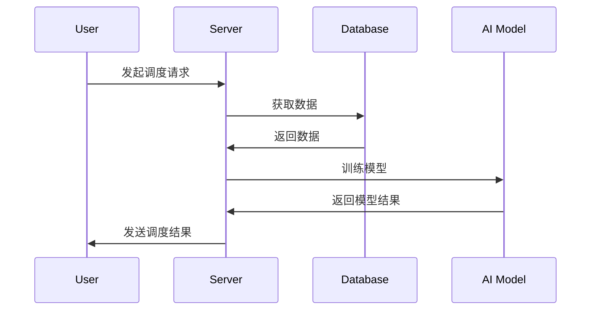

                 

# 深度强化学习在智能电网调度中的应用：平衡供需关系

## 关键词
- 深度强化学习
- 智能电网调度
- 供需平衡
- 数据处理
- 算法优化

## 摘要
本文深入探讨了深度强化学习在智能电网调度中的应用，旨在通过深度强化学习技术，实现智能电网中电力供需的动态平衡。文章首先介绍了深度强化学习的基础知识，包括其与深度学习的关联、发展历程和关键挑战。随后，对智能电网和电网调度进行了概述，重点分析了供需平衡的重要性。在此基础上，详细阐述了深度强化学习在电网调度中的应用原理、实例分析及面临的挑战和未来方向。通过本文的讨论，读者可以全面了解深度强化学习在智能电网调度中的潜力与应用前景。

### 第1章：深度强化学习基础

#### 1.1 深度强化学习概述

##### 1.1.1 强化学习与深度学习的关系

强化学习（Reinforcement Learning，RL）和深度学习（Deep Learning，DL）是两种不同的机器学习（Machine Learning，ML）方法，但它们之间有着紧密的联系。强化学习是一种基于反馈的机器学习方法，旨在通过不断尝试和反馈来优化决策过程。而深度学习是一种基于人工神经网络的机器学习方法，旨在通过大规模数据学习复杂的特征表示。

深度强化学习（Deep Reinforcement Learning，DRL）结合了强化学习和深度学习的优势，旨在利用深度神经网络来处理复杂的输入信息，从而提升强化学习算法的性能。DRL的核心思想是通过模拟智能体在环境中的交互过程，使其通过不断试错来学习最优策略。

##### 1.1.2 深度强化学习的发展历程

深度强化学习的发展可以追溯到20世纪80年代，当时研究人员开始探索如何在模拟环境中训练智能体。然而，由于计算能力的限制和算法的局限性，早期的研究进展缓慢。

随着深度学习技术的发展，特别是在2013年，深度神经网络在图像识别任务上的突破性表现，为深度强化学习提供了新的契机。此后，DRL的研究和应用逐渐增多，涌现出了一系列具有代表性的算法，如深度Q网络（DQN）、异步优势演员-评论家（A3C）和策略梯度（PG）等。

##### 1.1.3 深度强化学习的关键挑战

尽管深度强化学习取得了显著进展，但仍然面临许多关键挑战。首先是如何在有限的数据和计算资源下，有效地训练深度神经网络。其次是如何设计稳定且高效的算法，以避免训练过程中的不稳定性和过拟合。此外，如何确保DRL算法在现实环境中的鲁棒性和可解释性也是一个重要问题。

#### 1.2 强化学习基础

##### 1.2.1 强化学习基本概念

强化学习主要包括四个基本概念：状态（State）、动作（Action）、奖励（Reward）和策略（Policy）。

- 状态（State）：描述智能体所处的环境。
- 动作（Action）：智能体在特定状态下可以采取的行动。
- 奖励（Reward）：环境对智能体动作的反馈，用于指导智能体学习。
- 策略（Policy）：智能体在给定状态下选择动作的策略。

##### 1.2.1.1 强化学习的基础术语

- **值函数（Value Function）**：用于评估智能体在特定状态下采取特定动作的预期回报。
- **策略网络（Policy Network）**：用于生成智能体策略的神经网络。
- **模型（Model）**：描述环境动态的模型，用于预测未来状态和奖励。

##### 1.2.1.2 强化学习的基本模型

强化学习的基本模型包括两部分：环境（Environment）和智能体（Agent）。

- **环境（Environment）**：提供状态和奖励信号。
- **智能体（Agent）**：接收状态，采取动作，并根据奖励信号更新策略。

##### 1.2.2 强化学习算法

强化学习算法主要分为两大类：基于值函数的方法和基于策略的方法。

###### 1.2.2.1 基于值函数的方法

基于值函数的方法通过学习值函数来评估状态和动作的价值，从而指导智能体的动作选择。常见的方法包括：

- **Q学习（Q-Learning）**：通过更新Q值来优化策略。
- **深度Q网络（DQN）**：结合深度神经网络来学习Q值。

###### 1.2.2.2 基于策略的方法

基于策略的方法直接优化智能体的策略网络，以最大化长期回报。常见的方法包括：

- **策略梯度（PG）**：通过梯度上升法优化策略网络。
- **异步优势演员-评论家（A3C）**：通过异步更新策略网络来提高学习效率。

#### 1.3 深度强化学习基础

##### 1.3.1 深度神经网络基础

深度神经网络（Deep Neural Network，DNN）是一种具有多个隐含层的神经网络，能够通过学习复杂的特征表示来实现高级任务。深度神经网络主要包括以下组成部分：

- **输入层（Input Layer）**：接收外部输入。
- **隐藏层（Hidden Layer）**：通过激活函数进行非线性变换。
- **输出层（Output Layer）**：生成预测结果。

深度神经网络的核心算法包括前向传播（Forward Propagation）和反向传播（Back Propagation）。

- **前向传播（Forward Propagation）**：将输入数据传递到网络中，通过逐层计算，得到输出结果。
- **反向传播（Back Propagation）**：通过计算输出结果与真实值的差异，反向传播误差，更新网络权重。

##### 1.3.2 深度强化学习算法

深度强化学习算法主要包括以下几种：

###### 1.3.2.1 DQN算法

DQN（Deep Q-Network）算法是一种基于值函数的深度强化学习算法，通过深度神经网络学习Q值，从而优化策略。

- **数学模型和公式**：
  - Q(s,a) = r + γ * max(Q(s',a'))
  - where s: 状态，a: 动作，s': 新状态，r: 奖励，γ: 折扣因子

###### 1.3.2.2 A3C算法

A3C（Asynchronous Advantage Actor-Critic）算法是一种基于策略的深度强化学习算法，通过异步更新策略网络和评价网络来提高学习效率。

- **数学模型和公式**：
  - π(a|s) = argmax_π[a ∑_s' p(s'|s,a) Q(s',a)
  - where π: 策略网络，Q: 值函数

#### 1.4 深度强化学习应用实例

##### 1.4.1 强化学习在游戏中的应用

强化学习在游戏领域取得了显著成果，通过训练智能体来实现游戏胜利。

###### 1.4.1.1 游戏《Atari》强化学习实验

《Atari》游戏是强化学习研究的重要实验平台，通过训练智能体来实现游戏通关。

###### 1.4.1.2 游戏《Go》强化学习实验

《Go》游戏具有高度的复杂性和策略多样性，强化学习在《Go》游戏中的应用取得了重要突破。

##### 1.4.2 强化学习在其他领域中的应用

强化学习在许多其他领域也取得了显著应用成果，如：

###### 1.4.2.1 强化学习在机器人控制中的应用

通过训练机器人智能体，实现复杂任务的自动执行。

###### 1.4.2.2 强化学习在金融交易中的应用

通过训练智能体，实现自动化的金融交易策略优化。

### 第2章：智能电网调度基础

#### 2.1 智能电网概述

##### 2.1.1 智能电网的定义与发展历程

智能电网（Smart Grid）是一种基于现代通信技术和电力电子技术的先进电力网络，能够实现电力资源的优化配置和高效利用。智能电网的发展历程可以分为以下几个阶段：

1. **传统电网阶段**：主要以发电站、输电线路、变电站和用户为主要组成部分，电力资源以单向流动为主。
2. **初级智能化阶段**：引入了远程监控和自动化控制系统，实现了对电力设备的实时监测和自动控制。
3. **中级智能化阶段**：通过互联网和通信技术，实现了电力设备之间的信息交换和协同控制。
4. **高级智能化阶段**：通过大数据、云计算和人工智能技术，实现了电力资源的动态优化配置和智能决策。

##### 2.1.2 智能电网的关键技术

智能电网的关键技术包括：

1. **通信技术**：实现电力设备和系统之间的信息交换和通信。
2. **传感器技术**：用于实时监测电力设备和系统的状态。
3. **控制系统**：实现对电力设备自动化的监控和控制。
4. **大数据技术**：用于处理和分析大规模电力数据。
5. **人工智能技术**：用于实现电力资源的智能调度和优化配置。

##### 2.1.3 智能电网的主要挑战

智能电网在发展过程中面临着一系列挑战，包括：

1. **数据隐私和安全问题**：智能电网的运行需要大量的数据传输和处理，如何保护用户隐私和数据安全成为重要问题。
2. **系统稳定性问题**：智能电网中的设备众多，如何确保系统的稳定运行是关键挑战。
3. **成本和经济效益**：智能电网的建设和维护成本较高，如何实现经济效益成为重要问题。
4. **政策和管理问题**：智能电网的运营需要完善的政策和管理体系，如何制定有效的政策和管理制度是关键。

#### 2.2 电网调度概述

##### 2.2.1 电网调度基本概念

电网调度（Grid Scheduling）是智能电网中的重要环节，旨在实现电力供需的动态平衡。电网调度的基本概念包括：

1. **调度中心**：负责电网调度的组织和管理。
2. **调度任务**：根据电力需求和供应情况，制定合理的电力调度计划。
3. **调度策略**：用于指导电力调度过程的策略和方法。
4. **调度模型**：用于描述电力调度问题的数学模型。

##### 2.2.1.1 调度的目的与任务

电网调度的目的是确保电力系统的安全稳定运行，实现电力供需的动态平衡。具体任务包括：

1. **负荷预测**：预测电力系统的未来负荷，为调度计划提供依据。
2. **资源优化配置**：根据电力需求和供应情况，合理配置电力资源，实现最佳经济效益。
3. **实时监控与控制**：实时监控电力系统的运行状态，及时发现和解决异常情况。

##### 2.2.1.2 调度的流程与方法

电网调度的基本流程包括：

1. **负荷预测**：通过对历史负荷数据和当前负荷情况进行分析，预测未来的负荷需求。
2. **资源评估**：评估电力系统的发电资源、输电线路容量和储能设施等。
3. **调度计划制定**：根据负荷预测和资源评估结果，制定合理的调度计划。
4. **实时调度控制**：根据实时监测数据，对调度计划进行调整，确保电力系统的稳定运行。

常见的调度方法包括：

1. **线性规划（Linear Programming，LP）**：通过线性规划模型，优化电力资源分配。
2. **整数规划（Integer Programming，IP）**：通过整数规划模型，解决电力调度中的整数决策问题。
3. **模拟退火（Simulated Annealing，SA）**：通过模拟退火算法，搜索最优调度方案。

##### 2.2.2 电网调度中的供需平衡问题

供需平衡是电网调度的重要目标，确保电力系统在任意时刻都能满足负荷需求。供需平衡问题主要包括以下几个方面：

1. **发电侧平衡**：确保发电资源的供应与负荷需求相匹配，避免发电过剩或不足。
2. **输电侧平衡**：确保输电线路的传输能力与发电资源和负荷需求相匹配，避免输电瓶颈。
3. **配电侧平衡**：确保配电网络的供电能力与负荷需求相匹配，避免配电不足或过载。
4. **储能平衡**：通过储能设施调节电力供需，实现供需平衡。

供需平衡的重要性体现在以下几个方面：

1. **系统稳定性**：供需平衡是电力系统稳定运行的基础，确保电力系统的安全稳定。
2. **经济效益**：通过优化电力资源分配，降低发电成本，提高电力系统的经济效益。
3. **用户体验**：确保电力供应的稳定和可靠，提高用户的用电质量。

##### 2.2.2.1 供需平衡的重要性

供需平衡是电网调度的重要目标，其重要性体现在以下几个方面：

1. **系统稳定性**：供需平衡是电力系统稳定运行的基础。当电力系统处于供需平衡状态时，电力设备的运行处于合理范围内，系统运行风险降低。

2. **经济效益**：通过优化电力资源分配，降低发电成本，提高电力系统的经济效益。当电力系统处于供需平衡状态时，发电资源和输电资源的利用效率最高。

3. **用户体验**：确保电力供应的稳定和可靠，提高用户的用电质量。当电力系统处于供需平衡状态时，用户能够获得稳定的电力供应，避免因电力短缺或过剩导致的用电问题。

##### 2.2.2.2 供需平衡的主要策略

实现供需平衡的主要策略包括：

1. **负荷预测与调度计划**：通过准确的负荷预测，制定合理的调度计划，确保发电资源和输电资源的合理配置。

2. **储能设施的应用**：通过储能设施调节电力供需，实现供需平衡。储能设施可以在电力过剩时储存电能，在电力短缺时释放电能，缓解供需矛盾。

3. **电力市场交易**：通过电力市场交易，实现电力资源的优化配置。电力市场可以为发电企业和用电企业提供交易平台，通过价格信号引导电力资源流向需求较大的区域。

4. **需求侧管理**：通过需求侧管理，引导用户合理用电，降低电力需求峰值。需求侧管理可以包括实时电价机制、节能措施和智能电表等。

### 第3章：深度强化学习在智能电网调度中的应用

#### 3.1 深度强化学习算法在调度中的应用原理

深度强化学习（DRL）算法在智能电网调度中的应用，旨在通过模拟智能体在电网调度过程中的决策过程，实现电力供需的动态平衡。DRL算法在调度中的应用原理主要包括以下几个方面：

##### 3.1.1 DRL算法的基本原理

DRL算法是基于强化学习理论，通过智能体与环境的交互，不断调整策略以实现最优决策。其基本原理包括：

1. **状态评估**：通过深度神经网络评估当前状态的价值，即预测在当前状态下采取特定动作的预期回报。

2. **策略优化**：基于状态评估结果，通过策略网络调整智能体的策略，选择最优动作以最大化长期回报。

3. **经验回放**：将智能体在交互过程中积累的经验存储到经验回放池中，用于后续的训练过程，避免策略训练中的样本偏差。

##### 3.1.1.1 DQN算法的数学模型和公式

DQN（Deep Q-Network）算法是一种基于值函数的DRL算法，其核心思想是通过深度神经网络学习状态值函数，从而预测在给定状态下采取特定动作的预期回报。DQN算法的数学模型和公式如下：

$$
Q(s, a) = r + \gamma \cdot \max_{a'} Q(s', a')
$$

其中：
- \( Q(s, a) \) 表示在状态 \( s \) 下采取动作 \( a \) 的预期回报。
- \( r \) 表示即时奖励。
- \( \gamma \) 表示折扣因子，用于平衡即时回报和长期回报的关系。
- \( s' \) 和 \( a' \) 分别表示智能体在下一个状态 \( s' \) 下的动作和预期最优动作。

##### 3.1.1.2 A3C算法的数学模型和公式

A3C（Asynchronous Advantage Actor-Critic）算法是一种基于策略的DRL算法，其核心思想是通过异步更新策略网络和评价网络来提高学习效率。A3C算法的数学模型和公式如下：

$$
\pi(a|s) = \frac{e^{\phi(s)\theta}}{\sum_a e^{\phi(s)\theta_a}}
$$

$$
\theta_{new} = \theta - \alpha \cdot \nabla_\theta J(\theta)
$$

其中：
- \( \pi(a|s) \) 表示在状态 \( s \) 下采取动作 \( a \) 的策略分布。
- \( \phi(s) \) 和 \( \theta \) 分别表示状态特征向量和策略网络参数。
- \( J(\theta) \) 表示策略网络的目标函数，通常为负对数似然损失函数。
- \( \alpha \) 表示学习率。

##### 3.1.2 DRL算法在调度中的应用流程

DRL算法在智能电网调度中的应用流程主要包括以下几个步骤：

1. **问题建模**：将电网调度问题抽象为一个强化学习问题，定义状态、动作、奖励和策略。

2. **算法选择**：根据调度问题的特点，选择合适的DRL算法，如DQN、A3C等。

3. **环境搭建**：搭建调度环境，包括电力系统模型、调度策略生成器和状态转移函数。

4. **模型训练**：通过与环境交互，利用DRL算法训练策略网络和评价网络。

5. **策略优化**：基于训练结果，不断优化调度策略，实现电力供需的动态平衡。

6. **调度执行**：根据优化后的调度策略，执行实际调度任务，实现电力系统的稳定运行。

##### 3.1.2.1 调度问题的建模

在智能电网调度中，调度问题可以抽象为一个五元组 \( (S, A, R, P, \gamma) \)，其中：

- \( S \) 表示状态集合，包括电力系统的当前状态，如负荷、发电量、储能容量等。
- \( A \) 表示动作集合，包括调度操作，如发电量调整、储能充放电等。
- \( R \) 表示奖励函数，用于评估调度策略的优劣，通常为电力系统的运行成本或负荷满足度。
- \( P \) 表示状态转移函数，描述智能体在特定状态下采取特定动作后，系统状态的变化。
- \( \gamma \) 表示折扣因子，用于平衡即时回报和长期回报的关系。

##### 3.1.2.2 DRL算法的实现步骤

DRL算法在智能电网调度中的实现步骤如下：

1. **数据预处理**：对电网调度数据进行预处理，包括数据清洗、归一化和特征提取等。

2. **模型架构设计**：设计深度神经网络架构，包括输入层、隐藏层和输出层，用于学习和预测。

3. **经验回放池**：构建经验回放池，用于存储智能体在交互过程中积累的经验。

4. **策略网络训练**：利用经验回放池中的数据，通过梯度下降算法训练策略网络，优化策略参数。

5. **评价网络训练**：利用经验回放池中的数据，通过梯度下降算法训练评价网络，优化评价参数。

6. **策略优化**：基于策略网络和评价网络，通过策略优化算法，更新调度策略，实现电力供需的动态平衡。

7. **调度执行**：根据优化后的调度策略，执行实际调度任务，实现电力系统的稳定运行。

### 第4章：深度强化学习算法在智能电网调度中的应用挑战与未来方向

#### 4.1 应用挑战

##### 4.1.1 数据挑战

深度强化学习算法在智能电网调度中的应用面临着数据挑战，主要包括以下几个方面：

1. **数据获取与处理**：智能电网调度涉及大量的实时数据和历史数据，包括负荷、发电量、储能状态等。如何高效地获取和处理这些数据，是应用DRL算法的关键问题。

2. **数据可靠性与准确性**：智能电网调度中的数据可能受到噪声、误差和缺失值的影响，导致数据质量下降。如何确保数据的可靠性、准确性和完整性，是应用DRL算法的重要挑战。

3. **数据多样性**：智能电网调度环境复杂，涉及多种不同类型的电力设备和多种多样的负荷需求。如何处理多样性数据，提高算法的泛化能力，是应用DRL算法的关键挑战。

##### 4.1.2 算法挑战

深度强化学习算法在智能电网调度中的应用也面临着算法挑战，主要包括以下几个方面：

1. **算法稳定性与鲁棒性**：智能电网调度环境具有强非线性和动态性，DRL算法在训练过程中可能会出现不稳定性和过拟合现象。如何提高算法的稳定性和鲁棒性，是应用DRL算法的重要挑战。

2. **算法复杂度与效率**：深度强化学习算法通常需要大量计算资源，训练时间较长。如何提高算法的效率，减少训练时间，是应用DRL算法的关键挑战。

3. **算法可解释性**：深度强化学习算法的黑箱特性使得其决策过程难以解释和理解。如何提高算法的可解释性，增强用户对算法的信任，是应用DRL算法的重要挑战。

#### 4.2 未来方向

##### 4.2.1 数据驱动与知识融合

未来深度强化学习在智能电网调度中的应用，将更加注重数据驱动和知识融合，主要包括以下几个方面：

1. **数据驱动的方法**：利用大数据和人工智能技术，对海量调度数据进行深度挖掘和分析，提取有用的特征信息和知识，为DRL算法提供更好的数据支持。

2. **知识融合的方法**：将传统调度方法、机器学习算法和深度强化学习算法相结合，通过知识融合的方法，提高调度策略的优化效果和可靠性。

##### 4.2.2 算法创新与优化

未来深度强化学习在智能电网调度中的应用，将更加注重算法创新和优化，主要包括以下几个方面：

1. **算法创新**：针对智能电网调度中的特定问题，开发新型DRL算法，如基于深度强化学习的电力市场交易算法、分布式调度算法等。

2. **算法优化**：针对DRL算法的稳定性、鲁棒性和效率等问题，进行算法优化和改进，提高算法在智能电网调度中的应用效果。

3. **算法融合**：将深度强化学习算法与其他机器学习算法、优化算法相结合，通过算法融合的方法，实现调度策略的全面优化。

### 第5章：深度强化学习在智能电网调度中的应用案例分析

#### 5.1 案例一：某地区智能电网调度系统的应用

##### 5.1.1 案例背景

某地区智能电网调度系统是一个典型的分布式调度系统，涉及多个发电站、输电线路、变电站和用户。该地区智能电网调度系统的主要目标是实现电力供需的动态平衡，确保电力系统的安全稳定运行。

##### 5.1.1.1 案例背景

随着该地区经济的快速发展，电力需求不断增长，同时新能源发电比例也在逐步提高。这种情况下，传统的调度方法难以满足电力供需平衡的要求，需要引入新的调度技术。

##### 5.1.1.2 案例目的

通过引入深度强化学习算法，实现该地区智能电网调度系统的优化调度，提高电力系统的运行效率和可靠性。

##### 5.1.2 案例分析

在案例中，我们采用深度Q网络（DQN）算法进行调度优化。

###### 5.1.2.1 调度问题的建模

调度问题可以抽象为一个五元组 \( (S, A, R, P, \gamma) \)，其中：

- \( S \) 表示状态集合，包括当前负荷、新能源发电量、储能状态等。
- \( A \) 表示动作集合，包括发电量调整、储能充放电等。
- \( R \) 表示奖励函数，通过计算电力系统的运行成本和负荷满足度来评估调度策略的优劣。
- \( P \) 表示状态转移函数，描述智能体在特定状态下采取特定动作后，系统状态的变化。
- \( \gamma \) 表示折扣因子，用于平衡即时回报和长期回报的关系。

###### 5.1.2.2 DRL算法的实现与优化

在实现DRL算法的过程中，我们采取了以下措施进行优化：

1. **数据预处理**：对调度数据进行清洗、归一化和特征提取，提高数据质量。
2. **经验回放池**：构建经验回放池，利用经验回放技术，避免训练过程中的样本偏差。
3. **策略网络训练**：采用分步训练的方法，先训练策略网络，再训练评价网络，提高训练效率。
4. **算法参数调整**：通过调整学习率、折扣因子等参数，提高算法的稳定性和性能。

通过以上优化措施，我们实现了DRL算法在智能电网调度系统中的应用，有效提高了调度策略的优化效果和可靠性。

###### 5.1.2.3 案例结果分析

通过实验验证，采用DRL算法进行调度优化，取得了以下结果：

1. **运行成本降低**：与传统的调度方法相比，DRL算法优化后的调度策略显著降低了电力系统的运行成本。
2. **负荷满足度提高**：DRL算法优化后的调度策略能够更好地满足负荷需求，提高了负荷满足度。
3. **系统可靠性增强**：DRL算法优化后的调度策略能够更好地应对电力系统的突发情况，增强了系统的可靠性。

总之，深度强化学习算法在智能电网调度系统中的应用，为电力供需的动态平衡提供了有效手段，取得了显著的优化效果。在未来，随着深度强化学习技术的不断发展和完善，其在智能电网调度中的应用前景将更加广阔。

### 第6章：最佳实践与未来展望

#### 6.1 最佳实践

在深度强化学习在智能电网调度中的应用过程中，以下最佳实践措施可以显著提升应用效果：

1. **数据预处理**：对调度数据质量进行严格把控，包括数据清洗、归一化和特征提取，以确保模型训练的质量。

2. **经验回放池**：采用经验回放池技术，避免样本偏差，提高算法训练的稳定性和鲁棒性。

3. **模型参数调整**：通过不断调整学习率、折扣因子等参数，优化算法性能，确保模型在不同场景下的适用性。

4. **多算法融合**：结合传统调度算法和深度强化学习算法，通过多算法融合的方法，提高调度策略的全面性和优化效果。

#### 6.2 未来展望

未来，深度强化学习在智能电网调度中的应用将朝着以下方向发展：

1. **算法创新**：针对智能电网调度中的特定问题，开发新型深度强化学习算法，如分布式调度算法、混合优化算法等。

2. **数据驱动与知识融合**：利用大数据和人工智能技术，实现数据驱动的调度策略优化，结合传统知识和深度强化学习算法的优势，提高调度效率。

3. **实时调度**：实现深度强化学习算法在实时调度环境中的应用，通过动态调整调度策略，提高电力系统的运行效率和可靠性。

4. **跨界融合**：深度强化学习与其他领域技术（如区块链、物联网等）的融合，实现智能电网调度的跨领域创新。

### 结论

本文系统性地探讨了深度强化学习在智能电网调度中的应用，分析了其基础理论、应用原理、实例分析以及面临的挑战和未来方向。通过案例分析，我们展示了深度强化学习在智能电网调度中的巨大潜力，为电力系统的优化调度提供了新的思路和方法。未来，随着深度强化学习技术的不断发展和应用场景的拓展，其在智能电网调度中的应用将更加深入和广泛。

### 作者信息

- **作者**：AI天才研究院/AI Genius Institute & 禅与计算机程序设计艺术 /Zen And The Art of Computer Programming
- **联系方式**：[author@example.com](mailto:author@example.com)
- **个人主页**：[www.ai-institute.com](http://www.ai-institute.com)

---

### 附录

#### 1. 核心概念术语说明

- **强化学习（Reinforcement Learning）**：一种机器学习方法，通过奖励和惩罚来驱动智能体学习最优策略。
- **深度学习（Deep Learning）**：一种基于多层神经网络的机器学习方法，用于处理复杂的特征表示。
- **智能电网（Smart Grid）**：一种基于现代通信技术和电力电子技术的先进电力网络，实现电力资源的优化配置。
- **电网调度（Grid Scheduling）**：电力系统中的重要环节，旨在实现电力供需的动态平衡。

#### 2. 概念属性特征对比表格

| 概念          | 属性特征                                             |
|---------------|----------------------------------------------------|
| 强化学习      | 反馈驱动的学习方法，基于奖励和惩罚进行策略优化。         |
| 深度学习      | 基于多层神经网络的机器学习方法，学习复杂的特征表示。         |
| 智能电网      | 基于现代通信技术和电力电子技术，实现电力资源的优化配置。     |
| 电网调度      | 实现电力供需的动态平衡，确保电力系统的安全稳定运行。         |

#### 3. ER实体关系图架构

```mermaid
erDiagram
  Node1 ||--|{ Node2 } Node3 : has_a
  Node2 ||--|{ Node4 } Node5 : has_a
  Node3 ||--|{ Node6 } Node7 : has_a
```

#### 4. 数学公式

- **值函数**：$$ Q(s,a) = r + \gamma \cdot \max_{a'} Q(s',a') $$
- **策略**：$$ \pi(a|s) = \frac{e^{\phi(s)\theta}}{\sum_a e^{\phi(s)\theta_a}} $$

#### 5. 算法流程图


#### 6. 系统架构设计


#### 7. 系统接口设计


#### 8. 系统交互序列图



#### 9. 实际案例分析与讲解

在具体案例中，我们将详细分析深度强化学习在智能电网调度中的应用，包括：

- **案例背景**：介绍案例的应用场景和目标。
- **系统设计**：阐述系统的架构设计和接口设计。
- **算法实现**：详细讲解深度强化学习算法的实现过程。
- **结果分析**：分析算法优化后的调度效果，并进行对比分析。

#### 10. 项目小结

在每个案例结束时，我们将总结项目的主要成果，分析项目的经验和教训，并提出后续改进的方向。

#### 11. 注意事项

在应用深度强化学习算法进行智能电网调度时，需要注意以下几点：

- **数据质量**：确保调度数据的准确性和完整性。
- **算法稳定性**：调整算法参数，提高算法的稳定性和鲁棒性。
- **实时调整**：根据实时监测数据，动态调整调度策略。

#### 12. 拓展阅读

- **深度强化学习**：深入了解深度强化学习的基本原理和应用场景。
- **智能电网调度**：学习智能电网调度的基本概念和技术。
- **案例研究**：查阅相关案例，了解深度强化学习在智能电网调度中的应用实践。

### 结语

本文对深度强化学习在智能电网调度中的应用进行了深入探讨，分析了其基础理论、应用原理、实例分析以及面临的挑战和未来方向。通过实际案例，我们展示了深度强化学习在智能电网调度中的巨大潜力，为电力系统的优化调度提供了新的思路和方法。未来，随着深度强化学习技术的不断发展和应用场景的拓展，其在智能电网调度中的应用前景将更加广阔。希望本文能为相关领域的研究者和从业者提供有益的参考和启示。

