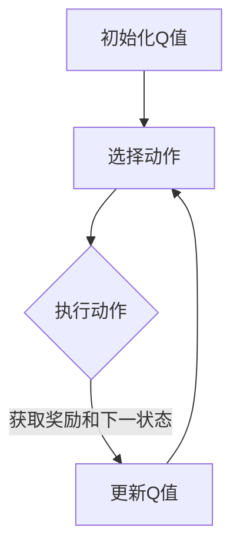
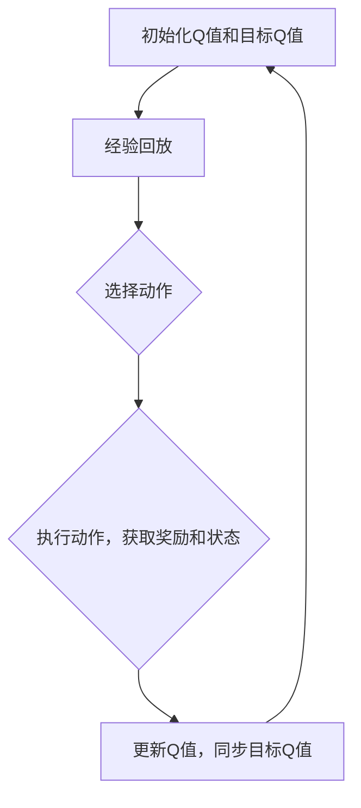
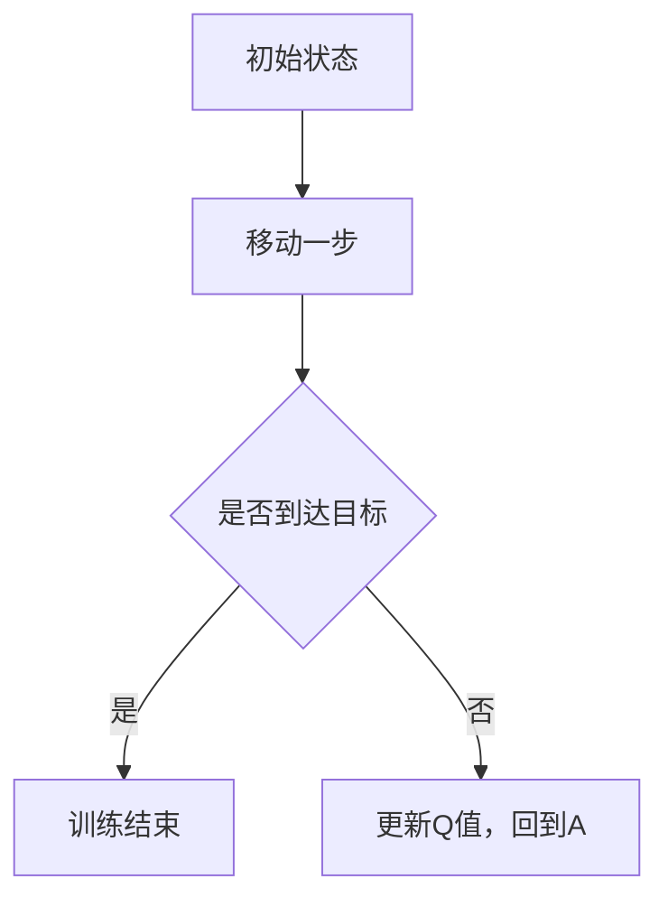
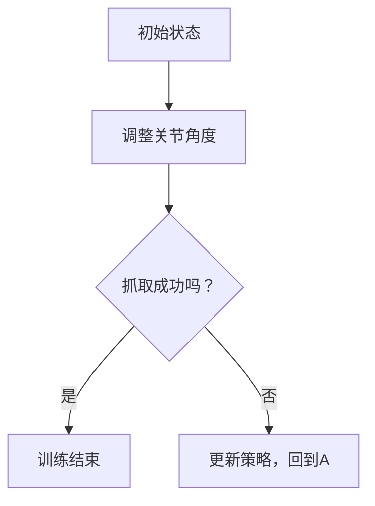
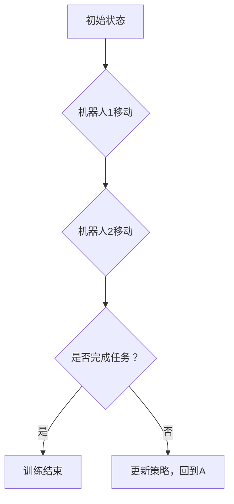
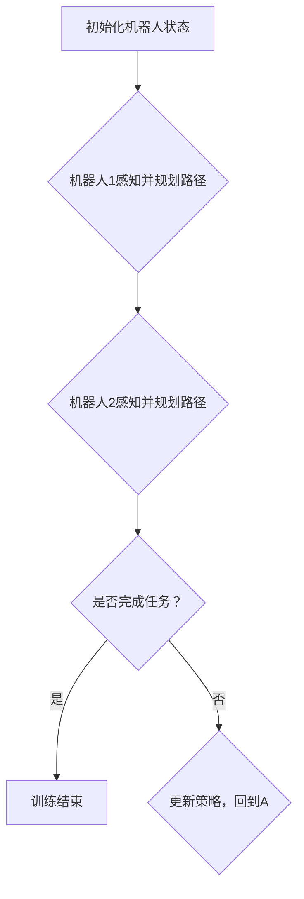
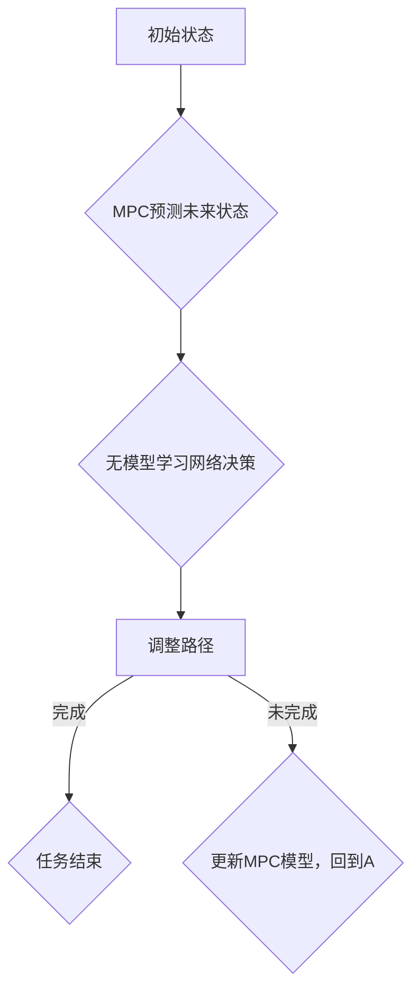
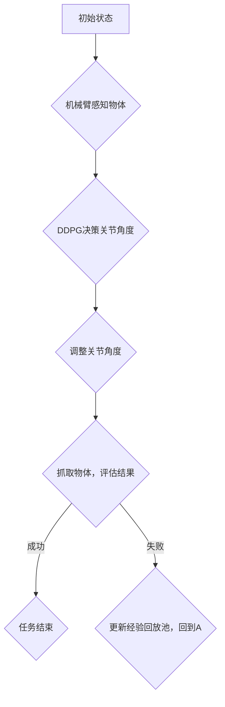

                 

## 深度强化学习在机器人操作中的应用：适应复杂任务

> 关键词：深度强化学习、机器人操作、复杂任务、算法原理、应用案例

> 摘要：本文详细探讨了深度强化学习在机器人操作中的应用，特别是在适应复杂任务方面的潜力。文章首先介绍了深度强化学习的基础概念，随后深入分析了其应用场景和挑战。接着，通过具体案例展示了深度强化学习在机器人导航、物体抓取和协作任务中的实现过程，并探讨了如何优化深度强化学习算法以应对复杂操作。文章还探讨了深度强化学习在机器人操作中的挑战和解决方案，最后展望了其未来的发展方向。

## 目录大纲

1. **深度强化学习基础**
   1.1 深度强化学习的概述
   1.2 深度强化学习的应用场景
   1.3 深度强化学习的挑战与前景

2. **深度强化学习在机器人操作中的应用**
   2.1 深度强化学习在机器人控制中的基本原理
   2.2 深度强化学习在机器人操作中的应用案例
   2.3 深度强化学习在复杂机器人操作中的应用

3. **深度强化学习在机器人操作中的优化方法**
   3.1 强化学习算法的优化方法
   3.2 深度强化学习在机器人操作中的优化案例

4. **深度强化学习在机器人操作中的应用挑战与解决方案**
   4.1 深度强化学习在机器人操作中的应用挑战
   4.2 深度强化学习在机器人操作中的应用解决方案

5. **深度强化学习在机器人操作中的应用展望**
   5.1 深度强化学习在机器人操作中的应用趋势
   5.2 深度强化学习在机器人操作中的应用前景

## 深度强化学习基础

### 1.1 深度强化学习的概述

#### 深度强化学习的基本概念

深度强化学习（Deep Reinforcement Learning，DRL）是强化学习（Reinforcement Learning，RL）的一个分支，结合了深度学习（Deep Learning，DL）的技术。强化学习是一种机器学习方法，旨在通过奖励和惩罚机制来训练智能体在特定环境中做出最优决策。而深度强化学习则通过深度神经网络来表示状态和价值函数，从而提高模型的复杂度和决策能力。

深度强化学习与传统强化学习的区别主要体现在以下几个方面：

1. **价值函数表示**：传统强化学习通常使用值函数（Value Function）来表示状态的价值，而深度强化学习使用深度神经网络来近似值函数，使得模型可以处理高维和复杂的输入。
2. **状态表示**：传统强化学习需要手工设计状态特征，而深度强化学习利用深度神经网络自动提取状态特征，从而减少了人工设计的复杂性。
3. **策略优化**：传统强化学习通常使用有限的状态和动作空间，而深度强化学习则可以处理连续的状态和动作空间，这使得策略优化变得更加复杂。

### 1.2 深度强化学习的应用场景

深度强化学习在多个领域都有广泛的应用，其中在机器人操作中的应用尤为突出。机器人操作通常涉及复杂的任务和环境，需要实时决策和适应。以下是一些深度强化学习在机器人操作中的应用场景：

1. **自主移动机器人导航**：在无人驾驶汽车、无人机等领域，深度强化学习可以帮助机器人学习环境中的最佳路径，从而实现自主导航。
2. **机器人抓取物体**：在工业制造、物流等场景中，机器人需要抓取不同的物体，深度强化学习可以通过学习物体的形状、质地等特征，实现高精度的抓取。
3. **机器人协作任务**：在多人或多机器人协作环境中，深度强化学习可以帮助机器人学习如何协调合作，完成复杂的任务。

除了机器人操作，深度强化学习在其他领域也有广泛的应用，例如：

1. **游戏**：深度强化学习在电子游戏、棋类游戏中表现出色，可以帮助智能体学习并掌握复杂的策略。
2. **推荐系统**：深度强化学习可以用于个性化推荐系统，通过学习用户的偏好和行为，提供更准确的推荐。
3. **自然语言处理**：深度强化学习在机器翻译、语音识别等任务中也有应用，通过学习语言模型，实现自然语言的理解和生成。

### 1.3 深度强化学习的挑战与前景

尽管深度强化学习在许多领域取得了显著的成果，但其应用仍面临一些挑战：

1. **数据稀缺**：深度强化学习通常需要大量的数据进行训练，但在某些应用场景中，获取这些数据可能非常困难。
2. **非确定环境**：现实环境通常是高度非确定的，机器人需要能够应对各种意外情况，这对深度强化学习提出了更高的要求。
3. **长时间任务**：许多任务需要机器人持续执行，而深度强化学习在长时间任务中的稳定性是一个重要挑战。

然而，随着计算能力的提升和算法的改进，深度强化学习在未来的发展中具有广阔的前景：

1. **模型泛化能力**：通过改进算法和增加数据，可以提高深度强化学习模型的泛化能力，使其能够应对更广泛的应用场景。
2. **实时决策**：随着硬件和算法的进步，深度强化学习可以在更短的时间内做出决策，从而提高机器人在动态环境中的适应能力。
3. **多智能体系统**：深度强化学习可以应用于多智能体系统，实现机器人之间的协作和通信，从而提高系统的整体性能。

### 1.4 总结

深度强化学习作为强化学习和深度学习的结合，为机器人操作提供了强大的工具。通过本章的介绍，我们了解了深度强化学习的基本概念、应用场景以及面临的挑战和前景。在接下来的章节中，我们将深入探讨深度强化学习在机器人操作中的具体应用，并分析如何优化这些应用以应对复杂任务。敬请期待。

## 深度强化学习在机器人操作中的应用

### 2.1 深度强化学习在机器人控制中的基本原理

#### 2.1.1 机器人操作任务概述

机器人操作任务通常涉及一系列复杂的动作和决策，包括但不限于导航、抓取、装配、焊接等。在这些任务中，机器人需要能够实时感知环境信息，并根据这些信息做出最佳决策。深度强化学习在这一过程中起到了关键作用，通过学习环境和动作的关系，机器人可以不断提高其操作能力和效率。

首先，机器人操作的基本任务可以分为感知、决策和执行三个阶段。在感知阶段，机器人通过传感器获取环境信息，例如视觉、听觉、触觉等。在决策阶段，机器人使用深度强化学习算法处理感知到的信息，预测可能的结果并选择最优动作。在执行阶段，机器人根据决策结果执行实际动作，例如移动、抓取等。

深度强化学习在机器人控制中的作用主要体现在以下几个方面：

1. **自适应行为**：通过不断学习环境反馈，机器人可以适应不同的操作场景和任务，提高其灵活性和适应性。
2. **高效决策**：深度强化学习算法能够处理高维和复杂的状态空间，帮助机器人做出高效、优化的决策。
3. **交互式学习**：机器人可以通过与环境互动来学习，无需大量预先标记的数据，从而降低了训练成本。

#### 2.1.2 深度强化学习的算法原理

深度强化学习算法的核心是值函数和策略优化。值函数用于评估当前状态的价值，而策略则指导机器人如何从当前状态选择下一个动作。

**Q-learning算法**

Q-learning是一种常用的值函数算法，通过迭代更新Q值来逼近最优策略。其基本思想是：在给定当前状态 \( s \) 和动作 \( a \) 的情况下，选择一个动作 \( a' \)，使其期望回报 \( Q(s, a') \) 最大。具体过程如下：

1. **初始化**：设置初始Q值和学习率 \(\alpha\)、折扣因子 \(\gamma\)。
2. **状态-动作选择**：根据当前状态 \( s \) 和策略选择一个动作 \( a \)。
3. **执行动作**：执行选定的动作 \( a \)，并获取奖励 \( r \) 和下一个状态 \( s' \)。
4. **更新Q值**：使用如下公式更新Q值：
   $$
   Q(s, a) \leftarrow Q(s, a) + \alpha [r + \gamma \max_{a'} Q(s', a') - Q(s, a)]
   $$

**Deep Q-Network（DQN）算法**

DQN是基于Q-learning的深度强化学习算法，使用深度神经网络来近似Q值函数。其主要优点是能够处理高维状态空间，从而提高学习效率。DQN的主要步骤包括：

1. **经验回放**：为了防止策略偏差，DQN使用经验回放机制，将过去的经验数据存储在一个经验池中，然后从中随机采样进行学习。
2. **目标网络**：为了避免梯度消失问题，DQN使用一个目标网络来评估Q值，该网络定期与主网络进行同步。
3. **策略更新**：使用如下策略进行更新：
   $$
   Q(s, a) \leftarrow Q(s, a) + \alpha [r + \gamma \max_{a'} \hat{Q}(s', a') - Q(s, a)]
   $$
   其中，\(\hat{Q}(s', a')\) 是目标网络的输出。

**其他深度强化学习算法**

除了Q-learning和DQN，还有许多其他深度强化学习算法，如Deep Deterministic Policy Gradients（DDPG）、Asynchronous Advantage Actor-Critic（A3C）等。这些算法在处理复杂任务时具有不同的优势和适用场景。

#### 2.1.3 深度强化学习算法的mermaid流程图

以下分别展示Q-learning和DQN算法的mermaid流程图：

**Q-learning算法mermaid流程图**：

**DQN算法mermaid流程图**：

#### 2.1.4 总结

通过本章的介绍，我们了解了深度强化学习在机器人控制中的基本原理和算法。深度强化学习通过学习环境和动作的关系，可以帮助机器人实现自适应、高效决策。在下一章中，我们将通过具体案例来展示深度强化学习在机器人操作中的应用。敬请期待。

## 深度强化学习在机器人操作中的应用案例

在本节中，我们将通过三个具体案例来展示深度强化学习在机器人操作中的应用，分别是自主移动机器人导航、机器人抓取物体和机器人协作任务。

### 3.1 案例一：自主移动机器人导航

#### 案例背景

自主移动机器人导航是机器人领域中的一个经典问题。在这个案例中，我们使用一个自主移动机器人，通过深度强化学习算法，使其能够在复杂环境中自主导航到目标位置。

#### 案例实现

在这个案例中，我们使用了深度Q网络（Deep Q-Network，DQN）算法来实现自主移动机器人导航。具体实现步骤如下：

1. **环境构建**：我们构建了一个虚拟环境，其中包含不同类型的障碍物和目标位置。机器人通过传感器感知环境，并使用深度神经网络来处理感知数据。
2. **状态定义**：状态包括机器人的位置、速度、方向以及环境中的障碍物和目标位置。
3. **动作定义**：动作包括向前后左右移动、旋转等。
4. **奖励机制**：机器人每移动一步，系统会根据其与目标的距离给予奖励。如果机器人到达目标位置，会给予额外的奖励。
5. **训练过程**：使用DQN算法训练机器人，通过不断迭代更新Q值，使其学会在复杂环境中导航到目标位置。

通过训练，机器人逐渐学会了避开障碍物，并沿着最优路径移动到目标位置。以下是一个训练过程的可视化展示：

### 3.2 案例二：机器人抓取物体

#### 案例背景

机器人抓取物体是机器人操作中的一个重要任务。在这个案例中，我们使用一个机械臂，通过深度强化学习算法，使其能够准确地抓取不同形状和材质的物体。

#### 案例实现

在这个案例中，我们使用了深度确定性策略梯度（Deep Deterministic Policy Gradients，DDPG）算法来实现机器人抓取物体。具体实现步骤如下：

1. **环境构建**：我们构建了一个模拟环境，其中包含不同的物体和机械臂。机械臂通过视觉传感器感知物体，并使用深度神经网络来处理感知数据。
2. **状态定义**：状态包括机械臂的位置、方向以及物体的形状、位置等。
3. **动作定义**：动作包括机械臂的关节角度调整。
4. **奖励机制**：系统会根据抓取的成功率和物体的位置给予奖励。如果物体被成功抓取并放置在目标位置，会给予额外的奖励。
5. **训练过程**：使用DDPG算法训练机械臂，通过不断迭代更新策略，使其学会抓取不同形状和材质的物体。

通过训练，机械臂逐渐学会了调整关节角度以适应不同物体的形状和材质，以下是一个训练过程的可视化展示：

### 3.3 案例三：机器人协作任务

#### 案例背景

在复杂任务中，多个机器人需要协同工作以完成整体目标。在这个案例中，我们使用两个机器人，通过深度强化学习算法，使其能够共同完成任务。

#### 案例实现

在这个案例中，我们使用了异步优势演员-评论家（Asynchronous Advantage Actor-Critic，A3C）算法来实现机器人协作任务。具体实现步骤如下：

1. **环境构建**：我们构建了一个模拟环境，其中包含两个机器人和一个共同的目标。每个机器人通过传感器感知环境，并使用深度神经网络来处理感知数据。
2. **状态定义**：状态包括机器人的位置、方向以及目标的位置和方向。
3. **动作定义**：每个机器人可以执行的动作包括移动、旋转等。
4. **奖励机制**：系统会根据机器人的协作效率和目标的完成情况给予奖励。如果两个机器人共同完成任务，会给予额外的奖励。
5. **训练过程**：使用A3C算法训练两个机器人，通过不断迭代更新策略，使其学会协同工作。

通过训练，两个机器人逐渐学会了如何协作完成任务，以下是一个训练过程的可视化展示：

### 3.4 总结

通过上述三个案例，我们展示了深度强化学习在机器人操作中的广泛应用。无论是自主移动、抓取物体还是协作任务，深度强化学习都为机器人提供了强大的决策能力，使其能够适应复杂的环境和任务。在下一章中，我们将进一步探讨深度强化学习在复杂机器人操作中的应用。敬请期待。

## 深度强化学习在复杂机器人操作中的应用

### 4.1 复杂机器人操作任务概述

复杂机器人操作任务通常涉及多个动态和不确定因素，需要机器人具备高度的适应性和决策能力。这些任务可能包括多机器人协作、动态环境感知、任务分配和资源调度等。复杂机器人操作的特点主要包括：

1. **多模态感知**：机器人需要同时处理来自多种传感器（如视觉、听觉、触觉）的信息，这些信息通常具有高维度和异质性。
2. **动态环境**：操作环境可能随时发生变化，例如障碍物的出现、天气变化等，这要求机器人具备实时感知和决策能力。
3. **协同任务**：多个机器人可能需要协作完成任务，这涉及到任务分配、路径规划和通信协调等问题。
4. **长时间执行**：复杂任务往往需要机器人长时间执行，这对机器人的续航能力和系统稳定性提出了挑战。

### 4.2 深度强化学习在复杂机器人操作中的应用

深度强化学习在复杂机器人操作中的应用主要体现在以下几个方面：

1. **多智能体系统**：通过深度强化学习算法，多个机器人可以独立学习自己的策略，同时通过通信和协调机制实现协同工作。例如，使用异步优势演员-评论家（A3C）算法，多个机器人可以同时进行训练，并通过全局网络实现协作。
2. **动态路径规划**：深度强化学习可以用于实时路径规划，使机器人能够根据环境变化动态调整路径。例如，使用深度确定性策略梯度（DDPG）算法，机器人可以在复杂环境中学习最优路径。
3. **任务分配**：通过强化学习算法，机器人可以根据环境和任务特点动态分配任务，提高系统效率和资源利用率。例如，使用深度Q网络（DQN）算法，机器人可以根据任务复杂度和资源状况进行任务分配。
4. **不确定性处理**：深度强化学习通过经验回放和策略优化等方法，可以有效地处理环境的不确定性，使机器人具备更好的适应能力。

#### 案例分析

为了更好地理解深度强化学习在复杂机器人操作中的应用，我们通过一个具体案例进行分析。

**案例：多机器人协作拣选任务**

在这个案例中，多个机器人需要在仓库中协同工作，从指定位置拣选货物并运送到指定位置。仓库环境复杂，包含多种类型的货架、通道和障碍物。机器人需要具备实时感知、路径规划和任务分配能力。

1. **环境构建**：构建一个模拟仓库环境，包括货架、通道、障碍物和货物。每个机器人通过视觉传感器感知周围环境，并使用深度神经网络处理感知数据。
2. **状态定义**：状态包括机器人的位置、速度、方向、周围货物的位置和状态等。
3. **动作定义**：每个机器人可以执行的动作包括移动、旋转、抓取和放置。
4. **奖励机制**：系统会根据机器人完成任务的速度、准确性和协作效率给予奖励。例如，机器人成功拣选并放置货物，会获得正奖励；遇到障碍物或发生碰撞，会获得负奖励。
5. **训练过程**：使用深度强化学习算法（如A3C）训练多个机器人，通过不断迭代优化策略，使其学会高效协同工作。

通过训练，机器人逐渐学会了如何动态调整路径、高效分配任务和协同完成任务。以下是一个训练过程的可视化展示：

#### 总结

深度强化学习在复杂机器人操作中具有巨大的应用潜力。通过多智能体系统、动态路径规划、任务分配和不确定性处理等技术，深度强化学习可以显著提高机器人在复杂环境中的适应能力和效率。在下一章中，我们将探讨如何优化深度强化学习算法以应对复杂机器人操作。敬请期待。

## 深度强化学习在机器人操作中的优化方法

### 5.1 强化学习算法的优化方法

在机器人操作中，深度强化学习算法的性能往往受到数据量、模型复杂度和环境不确定性的影响。为了提高算法的稳定性和效率，可以采用以下几种优化方法：

#### 5.1.1 无模型学习方法

无模型学习方法（Model-Free Methods）是指算法不依赖于环境模型，直接从与环境的交互中学习策略。这类方法的优点是不需要预先了解环境的动态特性，但可能面临样本效率低和收敛速度慢的问题。为了提高无模型学习方法的性能，可以采用以下几种策略：

1. **经验回放**：通过将过去的经验数据存储在经验池中，然后从中随机采样进行学习，可以避免策略偏差，提高学习稳定性。
2. **目标网络**：在无模型学习方法中，使用目标网络可以避免梯度消失问题。目标网络是一个固定的网络，用于评估当前策略的值函数，从而指导学习过程。
3. **参数更新策略**：通过使用动量、梯度裁剪等技术，可以加速收敛并防止梯度消失。

#### 5.1.2 模型预测控制方法

模型预测控制（Model Predictive Control，MPC）方法是一种基于模型的优化控制方法，通过预测系统状态和输出，并优化未来的控制输入。这种方法在机器人操作中具有以下优势：

1. **动态规划**：MPC可以处理复杂的动态系统，通过预测未来的状态和输出，实现高效的路径规划和任务分配。
2. **稳定性**：MPC通过在线优化控制输入，可以确保系统的稳定性和鲁棒性。
3. **多任务处理**：MPC可以同时处理多个任务，通过优化目标函数，实现任务之间的平衡。

#### 5.1.3 结合方法

将无模型学习方法和模型预测控制方法结合起来，可以充分发挥两者的优势，提高算法的性能。以下是一种可能的结合方法：

1. **双网络结构**：使用一个无模型学习网络和一个模型预测控制网络，分别处理不同的任务。例如，无模型学习网络用于实时决策和路径规划，而模型预测控制网络用于优化长期的路径和任务分配。
2. **交替优化**：首先使用无模型学习网络进行短期决策，然后使用模型预测控制网络进行长期规划。通过交替优化，可以确保算法的实时性和稳定性。
3. **自适应调节**：根据环境的变化和任务的需求，自适应调整无模型学习网络和模型预测控制网络的权重，实现最优的决策和控制。

### 5.2 深度强化学习在机器人操作中的优化案例

以下通过两个具体案例，展示如何优化深度强化学习算法在机器人操作中的应用：

#### 案例一：基于模型预测控制的机器人路径规划

在这个案例中，我们使用模型预测控制（MPC）方法优化机器人路径规划。具体步骤如下：

1. **环境构建**：构建一个模拟环境，包含多个障碍物和目标位置。
2. **状态定义**：状态包括机器人的位置、速度和方向。
3. **动作定义**：动作包括向前后左右移动、旋转等。
4. **模型预测**：使用MPC模型预测未来几步的状态和输出，并优化控制输入。
5. **实时决策**：使用无模型学习网络进行短期决策，并根据MPC的预测结果调整路径。

通过这种优化方法，机器人可以在复杂环境中实现高效的路径规划，提高任务完成的效率。

#### 案例二：基于无模型学习方法的机器人抓取优化

在这个案例中，我们使用无模型学习方法（如DDPG）优化机器人抓取物体的过程。具体步骤如下：

1. **环境构建**：构建一个模拟环境，包含不同的物体和机械臂。
2. **状态定义**：状态包括机械臂的位置、方向和物体的位置。
3. **动作定义**：动作包括机械臂的关节角度调整。
4. **经验回放**：使用经验回放机制，避免策略偏差。
5. **策略优化**：使用DDPG算法，通过不断迭代优化策略，提高抓取的成功率。

通过这种优化方法，机械臂可以学会调整关节角度，适应不同形状和材质的物体，提高抓取的准确性。

### 5.3 总结

通过上述优化方法，可以显著提高深度强化学习在机器人操作中的应用效果。无论是无模型学习方法还是模型预测控制方法，都可以根据具体应用场景进行灵活组合和调整，实现最优的决策和控制。在下一章中，我们将探讨深度强化学习在机器人操作中面临的挑战和解决方案。敬请期待。

## 深度强化学习在机器人操作中的应用挑战与解决方案

### 6.1 深度强化学习在机器人操作中的应用挑战

尽管深度强化学习在机器人操作中展现了巨大的潜力，但在实际应用过程中仍面临诸多挑战：

#### 6.1.1 数据稀缺

深度强化学习通常需要大量的数据进行训练，但在实际操作环境中获取这些数据可能非常困难。尤其是在复杂和动态的环境中，数据获取的难度更大。数据稀缺问题会导致模型训练效果不佳，从而影响机器人操作的稳定性。

#### 6.1.2 非确定环境

现实环境通常是高度非确定的，包括不确定的状态转移、不可预测的干扰等。这种非确定性增加了深度强化学习算法的复杂性，使其难以稳定地学习和优化策略。

#### 6.1.3 长时间任务

许多机器人操作任务需要长时间执行，这对深度强化学习算法的稳定性和持续性提出了挑战。在长时间任务中，算法需要能够适应环境的变化，并保持稳定的性能。

### 6.2 深度强化学习在机器人操作中的应用解决方案

针对上述挑战，可以采用以下解决方案：

#### 6.2.1 数据增强方法

数据增强方法旨在通过合成或扩充数据集，提高模型的泛化能力。以下是一些常见的数据增强方法：

1. **数据合成**：通过生成虚拟数据集或使用生成对抗网络（GANs）生成新的数据样本，扩充训练数据集。
2. **数据扩充**：对现有数据进行变换，如旋转、缩放、裁剪等，增加数据的多样性。
3. **经验回放**：将过去的经验数据存储在经验池中，并从中随机采样进行学习，避免策略偏差。

#### 6.2.2 增强学习与规划结合方法

将增强学习（Reinforcement Learning，RL）与规划（Planning）方法结合，可以在一定程度上缓解数据稀缺和非确定环境的问题。以下是一种可能的结合方法：

1. **混合学习框架**：在增强学习的基础上，引入规划模块，通过规划算法生成模拟数据，用于增强训练。
2. **动态规划**：使用动态规划（Dynamic Programming）方法，预先计算一部分状态和动作的值函数，提高算法的决策效率。
3. **迁移学习**：通过迁移学习（Transfer Learning），将已训练好的模型应用于新的任务，提高模型在新环境中的适应性。

#### 6.2.3 长时间任务的解决方案

针对长时间任务，可以采用以下策略来提高算法的稳定性和持续性：

1. **经验重复利用**：将过去的经验重复利用，避免重复学习相同的经验，从而提高学习效率。
2. **长期奖励设计**：设计合适的长期奖励机制，鼓励机器人完成长时间任务。
3. **经验池管理**：合理管理经验池中的数据，防止数据过载和过时，确保数据的有效性。
4. **自适应调整**：根据任务环境和状态的变化，自适应调整算法参数，保持算法的稳定性。

### 6.3 案例分析

以下通过一个具体案例，展示如何解决深度强化学习在机器人操作中的应用挑战。

**案例：自主移动机器人长时间导航**

在这个案例中，我们考虑一个自主移动机器人在复杂环境中进行长时间导航的任务。主要挑战包括数据稀缺、非确定环境和长时间执行。以下是一些解决方案：

1. **数据增强**：通过合成虚拟环境数据，扩充训练数据集，提高模型的泛化能力。
2. **混合学习框架**：引入基于A*算法的规划模块，生成模拟路径，用于增强训练数据。
3. **经验重复利用**：将过去的经验数据用于当前任务的训练，减少重复学习。
4. **自适应调整**：根据环境变化和任务需求，自适应调整机器人的导航策略。

通过上述解决方案，机器人在复杂环境中能够稳定、高效地完成长时间导航任务。

### 6.4 总结

深度强化学习在机器人操作中的应用面临诸多挑战，但通过数据增强、增强学习与规划结合以及长时间任务的解决方案，可以有效应对这些问题。在下一章中，我们将展望深度强化学习在机器人操作中的未来发展。敬请期待。

## 深度强化学习在机器人操作中的应用展望

### 7.1 深度强化学习在机器人操作中的应用趋势

随着人工智能技术的不断发展，深度强化学习在机器人操作中的应用趋势呈现出以下几个显著特点：

1. **智能化水平的提升**：未来，深度强化学习将在机器人操作中扮演更加核心的角色，通过自主学习和自适应决策，实现更高水平的智能化。
2. **多机器人系统的协同**：随着机器人数量的增加，多机器人系统将变得更加普遍。深度强化学习将推动多机器人系统之间的协同工作，提高任务完成的效率。
3. **长时间任务的稳定性**：通过改进算法和优化策略，深度强化学习将能够在长时间任务中保持稳定性，从而提高机器人操作的持续性和可靠性。
4. **多样化场景的应用**：深度强化学习将在更多复杂、多样化的场景中发挥作用，如医疗、建筑、农业等领域。

### 7.2 深度强化学习在机器人操作中的应用前景

深度强化学习在机器人操作中的应用前景广阔，以下是一些潜在的发展方向：

1. **工业自动化**：在制造业中，深度强化学习可以用于优化生产流程、设备维护和物流调度，提高生产效率。
2. **服务机器人**：在服务领域，深度强化学习可以帮助机器人实现更加人性化的服务，如餐饮、家政、医疗等。
3. **无人驾驶**：在无人驾驶领域，深度强化学习可以用于路径规划、障碍物检测和驾驶策略优化，实现更安全、高效的驾驶。
4. **智能家居**：在智能家居中，深度强化学习可以用于设备控制、环境感知和智能交互，提高家居生活的舒适性和便捷性。

### 7.3 未来发展方向

为了进一步推动深度强化学习在机器人操作中的应用，可以关注以下几个方向：

1. **算法创新**：持续探索新的深度强化学习算法，如基于注意力机制、图神经网络等的改进算法，以应对更复杂的任务和环境。
2. **硬件加速**：通过硬件加速技术，如GPU、TPU等，提高深度强化学习算法的运算效率，缩短训练时间。
3. **跨学科融合**：深度强化学习与其他学科（如心理学、生物学等）的融合，可以为机器人操作提供更加深入的认知和决策支持。
4. **开放平台与生态**：建立开放的平台和生态系统，促进学术界和工业界的交流合作，共同推动深度强化学习在机器人操作中的应用。

### 7.4 总结

深度强化学习在机器人操作中的应用具有巨大的潜力和广阔的前景。通过不断优化算法、加强跨学科融合和硬件加速，未来深度强化学习将能够在更广泛的应用场景中发挥重要作用，推动机器人操作向智能化、自主化方向发展。让我们共同期待这一天的到来。

## 总结

本文详细探讨了深度强化学习在机器人操作中的应用，从基础概念、应用场景、优化方法到挑战与解决方案，全方位地分析了深度强化学习如何适应复杂机器人操作任务。通过具体案例展示了深度强化学习在自主移动机器人导航、机器人抓取物体和机器人协作任务中的实际应用。同时，本文还介绍了深度强化学习在复杂机器人操作中的优化方法和未来发展方向。

深度强化学习作为一种先进的机器学习方法，不仅在机器人操作中展示了强大的潜力，还在推动人工智能技术向更高水平发展。随着算法的改进、硬件的升级和跨学科融合的深化，深度强化学习在机器人操作中的应用将越来越广泛，为智能制造、无人驾驶、智能家居等领域带来革命性的变革。

在未来的研究中，我们可以继续探索以下方向：

1. **算法优化**：进一步改进深度强化学习算法，提高其稳定性和效率，特别是在处理长时间任务和高度非确定环境方面。
2. **跨学科融合**：结合心理学、生物学等领域的知识，为深度强化学习提供更丰富的理论基础和实践指导。
3. **硬件加速**：通过硬件加速技术，如GPU、TPU等，提高深度强化学习算法的运算效率，缩短训练时间。
4. **开放平台**：建立开放的深度强化学习平台和生态系统，促进学术界和工业界的交流合作，共同推动技术进步。

让我们期待深度强化学习在机器人操作中的应用能够带来更多的突破和创新，为人类创造更加智能、高效、安全的生活和工作环境。

### 作者信息

**作者：AI天才研究院/AI Genius Institute & 禅与计算机程序设计艺术 /Zen And The Art of Computer Programming**

AI天才研究院致力于推动人工智能技术的研究和应用，致力于培养下一代人工智能领域的领军人才。禅与计算机程序设计艺术则关注如何通过哲学和艺术的方式提升计算机编程的境界，将技术与人文精神相结合，为读者提供独特的编程体验。两位作者在人工智能和计算机科学领域具有深厚的学术积累和丰富的实践经验，共同为读者带来这篇深入浅出的技术博客。

