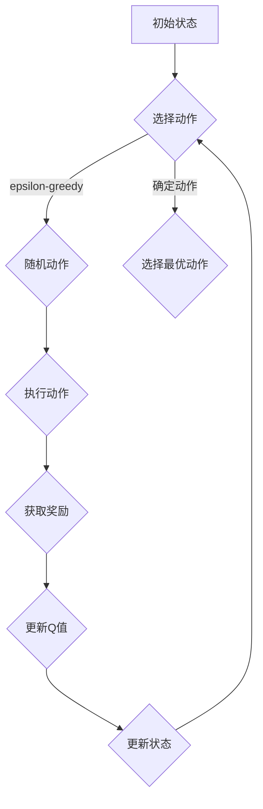
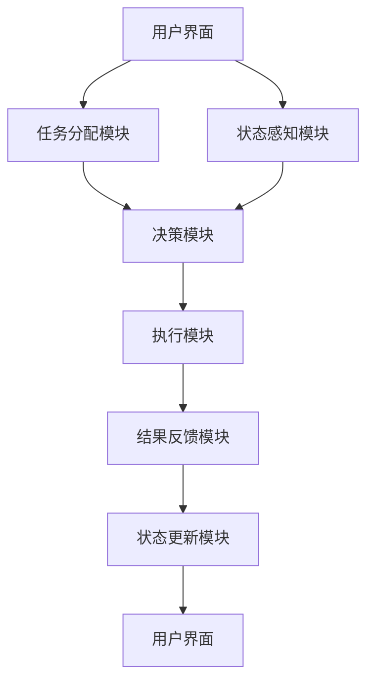
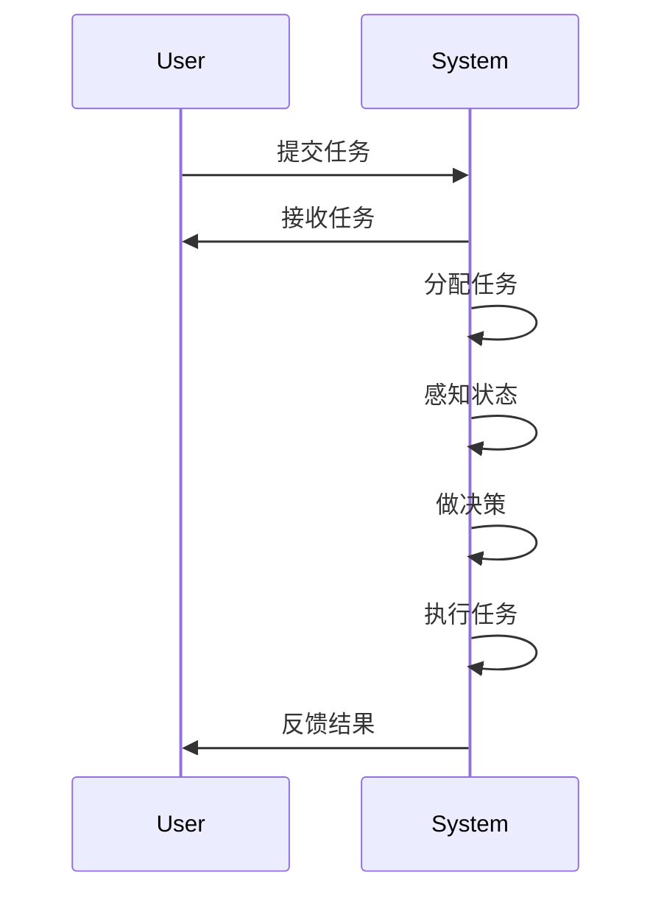

                 

## 第1章 引言

### 1.1 问题背景

随着机器人技术的不断发展，机器人在各个领域的应用越来越广泛。尤其是在工业生产、物流配送、军事防御等领域，机器人的群体协作已经成为提升工作效率和降低人力成本的重要手段。然而，在机器人群体协作过程中，面临着诸多挑战，如复杂的任务规划、动态环境适应、个体与群体之间的协调等。这些问题的存在，限制了机器人群体协作的效率和应用范围。

深度强化学习（Deep Reinforcement Learning，DRL）作为一种基于试错和反馈机制的机器学习技术，近年来在机器人领域得到了广泛关注。DRL通过在环境中进行试错，不断调整策略，以实现任务的最优解。与传统的基于规则的方法相比，DRL具有更强的自适应能力和鲁棒性，能够应对复杂多变的任务和环境。

因此，本文将探讨深度强化学习在机器人群体协作中的应用，通过深度强化学习技术解决机器人群体协作中的主要问题，提高协作效率，拓展应用场景。

### 1.2 问题描述

在机器人群体协作中，主要存在以下问题：

1. **任务规划复杂**：机器人群体需要完成多种复杂的任务，如装配、搬运、搜索等。这些任务往往具有高度的复杂性和不确定性，传统的任务规划方法难以有效解决。
   
2. **动态环境适应**：在实际应用中，环境是不断变化的，如障碍物的移动、天气的变化等。机器人群体需要具备动态环境适应能力，以应对这些变化。

3. **个体与群体协调**：在机器人群体协作过程中，个体机器人需要相互协调，共同完成任务。如何实现个体机器人之间的有效通信和协调，是机器人群体协作的关键问题。

4. **不确定性和鲁棒性**：在复杂和动态的环境中，机器人群体面临的不确定性和挑战很大。如何提高机器人群体的鲁棒性，使其能够稳定高效地完成任务，是一个重要问题。

深度强化学习作为一种强大的机器学习技术，具有解决上述问题的潜力。它通过在环境中进行试错和反馈，不断调整策略，以实现任务的最优解。本文将讨论深度强化学习在机器人群体协作中的应用，以及如何利用深度强化学习技术解决上述问题。

### 1.3 问题解决

深度强化学习（DRL）是一种通过在环境中试错和反馈，不断优化策略的机器学习方法。它由两部分组成：一部分是“强化学习”，即通过奖励和惩罚来引导学习过程；另一部分是“深度学习”，即通过神经网络模型对复杂问题进行建模和学习。

#### 1.3.1 深度强化学习的基本原理

深度强化学习的基本原理如下：

1. **状态（State）**：状态是机器人所处的环境描述，包括机器人自身的状态（如位置、速度）和周围环境的状态（如障碍物、其他机器人）。

2. **动作（Action）**：动作是机器人可以执行的操作，如移动、旋转等。

3. **策略（Policy）**：策略是机器人根据当前状态选择动作的方法。在深度强化学习中，策略通常由神经网络模型来表示。

4. **奖励（Reward）**：奖励是机器人执行动作后获得的即时回报。奖励的目的是引导机器人学习如何做出最优的动作选择。

5. **价值函数（Value Function）**：价值函数是对机器人当前状态的评价。它用于评估机器人在当前状态下采取特定动作的未来奖励。

6. **策略评估（Policy Evaluation）**：策略评估是通过预测机器人在当前策略下的未来奖励，来评估策略的好坏。

7. **策略优化（Policy Optimization）**：策略优化是通过调整策略，使得机器人在当前状态下的动作选择能够获得更高的奖励。

#### 1.3.2 深度强化学习在机器人群体协作中的应用思路

在机器人群体协作中，深度强化学习可以通过以下思路进行应用：

1. **任务分解与规划**：首先，将复杂任务分解为多个子任务，并确定每个子任务的执行顺序。然后，利用深度强化学习算法，为每个机器人制定最优的执行策略。

2. **环境建模与仿真**：构建机器人协作的环境模型，并对其进行仿真。环境模型应能够模拟实际应用中的各种情况，如障碍物、其他机器人、动态环境变化等。

3. **策略学习与优化**：通过在仿真环境中进行试错和反馈，不断优化机器人的策略。策略优化的目标是使机器人在复杂和动态的环境中，能够高效、稳定地完成任务。

4. **实时决策与执行**：在实时应用中，机器人需要根据当前状态和策略，做出决策并执行相应的动作。深度强化学习算法可以为机器人提供实时的决策支持。

5. **性能评估与优化**：通过评估机器人协作任务的完成情况，对深度强化学习算法进行优化。优化的目标是提高机器人群体协作的效率、稳定性和鲁棒性。

### 1.4 边界与外延

#### 1.4.1 研究范围

本文主要研究深度强化学习在机器人群体协作中的应用，包括任务规划、动态环境适应、个体与群体协调等方面。本文的研究范围限于理论分析和仿真实验，未涉及实际硬件设备和机器人系统的开发。

#### 1.4.2 研究假设

在本文的研究中，我们做出以下假设：

1. 机器人具备一定的感知能力，能够获取周围环境的信息。
2. 机器人之间能够通过无线通信进行信息交换。
3. 机器人具备一定的自主决策能力，能够根据当前状态和策略执行相应的动作。
4. 环境变化具有一定的规律性，可以通过仿真进行模拟。

### 1.5 概念结构与核心要素组成

#### 1.5.1 深度强化学习的基本概念

深度强化学习（DRL）是一种结合深度学习和强化学习的机器学习方法。它由三个核心组成部分：状态（State）、动作（Action）和奖励（Reward）。

1. **状态（State）**：状态是机器人所处的环境描述，包括机器人自身的状态（如位置、速度）和周围环境的状态（如障碍物、其他机器人）。

2. **动作（Action）**：动作是机器人可以执行的操作，如移动、旋转等。在DRL中，动作通常由神经网络模型来表示。

3. **奖励（Reward）**：奖励是机器人执行动作后获得的即时回报。奖励的目的是引导机器人学习如何做出最优的动作选择。

#### 1.5.2 机器人群体协作的核心要素

机器人群体协作的核心要素包括：

1. **任务分配**：将复杂任务分解为多个子任务，并确定每个子任务的执行顺序。

2. **环境建模**：构建机器人协作的环境模型，并对其进行仿真。

3. **策略学习**：通过在仿真环境中进行试错和反馈，不断优化机器人的策略。

4. **实时决策**：在实时应用中，机器人需要根据当前状态和策略，做出决策并执行相应的动作。

5. **性能评估**：通过评估机器人协作任务的完成情况，对深度强化学习算法进行优化。

## 第2章 深度强化学习基础

### 2.1 概念原理

深度强化学习（Deep Reinforcement Learning，DRL）是一种结合了深度学习和强化学习的机器学习方法。它通过在环境中进行试错和反馈，不断调整策略，以实现任务的最优解。DRL的核心思想是让机器人通过学习，掌握如何自主地解决复杂的问题。

#### 2.1.1 深度强化学习的定义

深度强化学习（DRL）是一种通过深度神经网络对状态和价值函数进行建模，并结合强化学习中的奖励机制，实现机器人智能控制的方法。DRL的核心目标是让机器人能够在复杂和动态的环境中，通过自主学习，实现高效、稳定的任务执行。

#### 2.1.2 深度强化学习的关键概念

在DRL中，有以下几个关键概念：

1. **状态（State）**：状态是机器人所处的环境描述，包括机器人自身的状态（如位置、速度）和周围环境的状态（如障碍物、其他机器人）。

2. **动作（Action）**：动作是机器人可以执行的操作，如移动、旋转等。在DRL中，动作通常由神经网络模型来表示。

3. **策略（Policy）**：策略是机器人根据当前状态选择动作的方法。在DRL中，策略通常由神经网络模型来表示。

4. **价值函数（Value Function）**：价值函数是对机器人当前状态的评价。它用于评估机器人在当前状态下采取特定动作的未来奖励。

5. **奖励（Reward）**：奖励是机器人执行动作后获得的即时回报。奖励的目的是引导机器人学习如何做出最优的动作选择。

6. **Q值函数（Q-Value Function）**：Q值函数是对动作价值的估计。它用于评估机器人在当前状态下执行特定动作的未来奖励。

### 2.2 数学模型

深度强化学习的数学模型主要包括Q值函数、策略评估和策略优化。

#### 2.2.1 Q值函数

Q值函数是对动作价值的估计。它表示机器人在当前状态下执行特定动作的未来奖励。Q值函数的定义如下：

$$
Q(s, a) = \sum_{s'} P(s'|s, a) \cdot R(s', a) + \gamma \cdot \max_{a'} Q(s', a')
$$

其中，\( s \) 表示当前状态，\( a \) 表示动作，\( s' \) 表示执行动作后的状态，\( R(s', a) \) 表示在状态 \( s' \) 下执行动作 \( a \) 所获得的即时奖励，\( \gamma \) 是折扣因子，用于平衡当前奖励和未来奖励的重要性。

#### 2.2.2 基于值函数的算法

基于值函数的算法主要包括Q-learning和Sarsa。

1. **Q-learning算法**

Q-learning算法是一种基于值函数的强化学习算法。它通过在环境中进行试错，不断更新Q值函数，以实现任务的最优解。Q-learning算法的更新规则如下：

$$
Q(s, a) \leftarrow Q(s, a) + \alpha \cdot (R(s', a) + \gamma \cdot \max_{a'} Q(s', a') - Q(s, a))
$$

其中，\( \alpha \) 是学习率，用于控制更新速度。

2. **Sarsa算法**

Sarsa算法是一种基于值函数的强化学习算法。它与Q-learning算法类似，但不同之处在于它使用实际执行的动作来更新Q值函数。Sarsa算法的更新规则如下：

$$
Q(s, a) \leftarrow Q(s, a) + \alpha \cdot (R(s', a') + \gamma \cdot Q(s', a') - Q(s, a))
$$

其中，\( a' \) 是执行动作后的动作。

#### 2.2.3 基于策略的算法

基于策略的算法主要包括REINFORCE和PPO。

1. **REINFORCE算法**

REINFORCE算法是一种基于策略的强化学习算法。它通过梯度上升法，优化策略的参数，以实现任务的最优解。REINFORCE算法的更新规则如下：

$$
\theta \leftarrow \theta + \alpha \cdot \nabla_{\theta} J(\theta)
$$

其中，\( \theta \) 是策略的参数，\( J(\theta) \) 是策略的损失函数，\( \alpha \) 是学习率。

2. **PPO算法**

PPO算法是一种基于策略的强化学习算法。它与REINFORCE算法类似，但不同之处在于它引入了一个 clipped梯度，以防止梯度爆炸和消失。PPO算法的更新规则如下：

$$
\theta \leftarrow \theta + \min\left(\epsilon \cdot \nabla_{\theta} J(\theta), \theta_{old} + \epsilon \cdot \nabla_{\theta} J(\theta)\right)
$$

其中，\( \theta_{old} \) 是策略的旧参数，\( \epsilon \) 是clipped参数。

### 2.3 算法原理讲解

#### 2.3.1 Q-learning算法

Q-learning算法是一种基于值函数的强化学习算法。它通过在环境中进行试错，不断更新Q值函数，以实现任务的最优解。Q-learning算法的基本思想是：机器人在当前状态下，选择一个动作，执行动作后获得奖励，并更新Q值函数。

Q-learning算法的更新规则如下：

$$
Q(s, a) \leftarrow Q(s, a) + \alpha \cdot (R(s', a) + \gamma \cdot \max_{a'} Q(s', a') - Q(s, a))
$$

其中，\( s \) 表示当前状态，\( a \) 表示动作，\( s' \) 表示执行动作后的状态，\( R(s', a) \) 表示在状态 \( s' \) 下执行动作 \( a \) 所获得的即时奖励，\( \gamma \) 是折扣因子，用于平衡当前奖励和未来奖励的重要性，\( \alpha \) 是学习率，用于控制更新速度。

#### 2.3.2 SARSA算法

SARSA算法是一种基于值函数的强化学习算法。它与Q-learning算法类似，但不同之处在于它使用实际执行的动作来更新Q值函数。SARSA算法的基本思想是：机器人在当前状态下，选择一个动作，执行动作后获得奖励，并更新Q值函数。

SARSA算法的更新规则如下：

$$
Q(s, a) \leftarrow Q(s, a) + \alpha \cdot (R(s', a') + \gamma \cdot Q(s', a') - Q(s, a))
$$

其中，\( s \) 表示当前状态，\( a \) 表示动作，\( s' \) 表示执行动作后的状态，\( a' \) 表示执行动作后的动作，\( R(s', a') \) 表示在状态 \( s' \) 下执行动作 \( a' \) 所获得的即时奖励，\( \gamma \) 是折扣因子，用于平衡当前奖励和未来奖励的重要性，\( \alpha \) 是学习率，用于控制更新速度。

#### 2.3.3 Deep Q-Network（DQN）算法

DQN算法是一种基于值函数的深度强化学习算法。它通过在神经网络中学习Q值函数，以实现任务的最优解。DQN算法的基本思想是：机器人在当前状态下，选择一个动作，执行动作后获得奖励，并更新神经网络中的Q值函数。

DQN算法的更新规则如下：

$$
\theta \leftarrow \theta + \alpha \cdot \nabla_{\theta} J(\theta)
$$

其中，\( \theta \) 是神经网络参数，\( J(\theta) \) 是神经网络的损失函数，\( \alpha \) 是学习率。

DQN算法的关键挑战是如何避免神经网络中的Q值函数过拟合。为此，DQN算法引入了经验回放（Experience Replay）机制。经验回放机制将机器人经历的所有状态、动作和奖励存储在一个经验池中，并在训练过程中随机采样经验数据进行更新。这样可以避免神经网络过度依赖某个特定的经验数据，从而提高泛化能力。

### 2.4 算法mermaid流程图



## 第3章 机器人群体协作中的深度强化学习应用

### 3.1 核心特点

深度强化学习（DRL）在机器人群体协作中的应用具有以下核心特点：

#### 3.1.1 多机器人协同控制

在多机器人系统中，每个机器人都可以独立执行任务，但它们之间需要相互协调，以实现整体目标。DRL通过学习每个机器人的最佳策略，使它们能够自主地决定如何与其他机器人协作。这样可以大大提高系统的效率和鲁棒性。

#### 3.1.2 动态环境适应

现实环境是动态变化的，如障碍物的移动、环境噪声等。DRL通过不断学习环境模型，使机器人能够适应这些变化。这种方法使得机器人能够在复杂和动态的环境中稳定运行。

#### 3.1.3 自主学习和优化

DRL算法不需要预先设定规则，而是通过在环境中试错和反馈，自主地学习最佳策略。这使得机器人能够适应不同的任务和环境，实现真正的自主学习和优化。

### 3.2 应用场景

深度强化学习在机器人群体协作中具有广泛的应用场景，以下是一些典型的应用场景：

#### 3.2.1 自动化工厂

在自动化工厂中，机器人群体可以执行装配、搬运、质检等任务。DRL算法可以帮助机器人学习如何高效、稳定地完成任务，提高生产效率。

#### 3.2.2 智能交通系统

在智能交通系统中，DRL算法可以用于控制自动驾驶车辆，实现交通流量优化、事故预防等功能。通过学习交通规则和环境模型，DRL算法可以使车辆在复杂交通环境中保持安全、高效地行驶。

#### 3.2.3 军事领域

在军事领域，DRL算法可以用于无人机编队、机器人群等任务。通过学习不同任务和环境模型，DRL算法可以使机器人群体在复杂战场环境中实现协同作战，提高作战效能。

### 3.3 案例分析

#### 3.3.1 自动化工厂中的应用

在某自动化工厂中，DRL算法被用于控制机器人的装配任务。具体来说，该工厂有多个装配站，每个装配站需要装配不同的产品。机器人需要根据装配任务的要求，自主选择装配站，并完成装配任务。

通过DRL算法，机器人可以学习到最佳的任务分配策略和装配策略。首先，机器人需要感知当前的环境状态，包括装配站的状态、其他机器人的位置等。然后，根据当前状态，机器人选择一个最优的动作，如移动到某个装配站、开始装配等。

在DRL算法的学习过程中，机器人会经历多次试错，逐渐找到最优策略。通过不断优化策略，机器人可以在不同的装配站之间高效地切换，提高装配效率。

#### 3.3.2 智能交通系统中的应用

在智能交通系统中，DRL算法被用于控制自动驾驶车辆。具体来说，该系统包括多个自动驾驶车辆，它们需要在城市交通环境中自主行驶，并避免与其他车辆发生碰撞。

通过DRL算法，自动驾驶车辆可以学习到最佳的道路行驶策略。首先，车辆需要感知当前的道路状态，包括道路宽度、交通信号灯等。然后，根据当前状态，车辆选择一个最优的动作，如加速、减速、转弯等。

在DRL算法的学习过程中，车辆会经历多次试错，逐渐找到最优策略。通过不断优化策略，车辆可以在不同的交通环境中保持安全、高效地行驶。

#### 3.3.3 军事领域中的应用

在军事领域，DRL算法被用于控制无人机编队。具体来说，该系统包括多个无人机，它们需要在战场上执行侦察、打击等任务。

通过DRL算法，无人机可以学习到最佳的任务分配策略和飞行策略。首先，无人机需要感知当前的环境状态，包括战场情况、敌方目标等。然后，根据当前状态，无人机选择一个最优的动作，如移动到某个位置、发射导弹等。

在DRL算法的学习过程中，无人机会经历多次试错，逐渐找到最优策略。通过不断优化策略，无人机可以在复杂的战场环境中实现协同作战，提高作战效能。

## 第4章 深度强化学习算法在机器人群体协作中的实现

### 4.1 系统功能设计

深度强化学习算法在机器人群体协作中的应用，需要构建一个完整的系统，以实现机器人之间的协作和任务分配。以下是系统功能设计的具体内容：

#### 4.1.1 系统整体架构

系统整体架构包括以下几个模块：

1. **用户界面**：用于接收用户输入的任务和参数，并展示系统运行结果。
2. **任务分配模块**：根据用户输入的任务，将任务分配给不同的机器人。
3. **状态感知模块**：用于感知当前环境的状态，包括机器人自身的状态和周围环境的状态。
4. **决策模块**：基于状态感知模块提供的状态，利用深度强化学习算法生成每个机器人的动作策略。
5. **执行模块**：根据决策模块生成的动作策略，控制机器人执行相应的动作。
6. **结果反馈模块**：用于收集机器人执行任务的结果，并将其反馈给用户界面。
7. **状态更新模块**：根据机器人执行动作的结果，更新当前环境的状态。

#### 4.1.2 各模块功能介绍

1. **用户界面**：用户界面是系统与用户交互的入口。用户可以通过用户界面提交任务，并查看系统运行结果。用户界面主要包括以下功能：
   - 提交任务：用户可以输入任务描述和参数，系统将任务存储到数据库中。
   - 查看结果：用户可以查看机器人执行任务的结果，包括任务完成情况、机器人状态等。

2. **任务分配模块**：任务分配模块是系统的核心模块，负责将用户提交的任务分配给合适的机器人。任务分配模块主要包括以下功能：
   - 任务解析：将用户提交的任务解析为具体的任务描述，如装配、搬运等。
   - 机器人筛选：根据任务描述，从机器人数据库中选择合适的机器人。
   - 任务分配：将任务分配给选定的机器人，并设置机器人的目标状态。

3. **状态感知模块**：状态感知模块负责感知当前环境的状态，包括机器人自身的状态和周围环境的状态。状态感知模块主要包括以下功能：
   - 机器人状态感知：获取机器人当前的位置、速度、方向等状态信息。
   - 环境状态感知：获取机器人周围的环境信息，如障碍物、其他机器人等。

4. **决策模块**：决策模块基于状态感知模块提供的状态，利用深度强化学习算法生成每个机器人的动作策略。决策模块主要包括以下功能：
   - 状态编码：将感知到的状态编码为神经网络可以处理的格式。
   - 动作策略生成：利用深度强化学习算法，生成每个机器人的动作策略。

5. **执行模块**：执行模块根据决策模块生成的动作策略，控制机器人执行相应的动作。执行模块主要包括以下功能：
   - 动作执行：根据动作策略，控制机器人执行相应的动作，如移动、旋转等。
   - 状态更新：根据机器人执行动作的结果，更新当前环境的状态。

6. **结果反馈模块**：结果反馈模块负责收集机器人执行任务的结果，并将其反馈给用户界面。结果反馈模块主要包括以下功能：
   - 结果收集：收集机器人执行任务的结果，如任务完成情况、机器人状态等。
   - 结果展示：将收集到的结果展示给用户，如图表、文字等。

7. **状态更新模块**：状态更新模块根据机器人执行动作的结果，更新当前环境的状态。状态更新模块主要包括以下功能：
   - 状态更新：根据机器人执行动作的结果，更新当前环境的状态，如机器人的位置、方向等。
   - 状态保存：将更新后的状态保存到数据库中，用于后续的分析和处理。

### 4.2 系统架构设计

系统架构设计是系统功能实现的基础，它定义了系统各模块之间的交互关系和数据处理流程。以下是系统架构设计的具体内容：



#### 4.2.1 系统整体架构

系统整体架构分为用户界面层、任务分配层、状态感知层、决策层、执行层、结果反馈层和状态更新层。各层之间的交互关系如下：

1. **用户界面层**：用户界面层是系统与用户交互的入口，用户可以通过用户界面层提交任务，并查看系统运行结果。

2. **任务分配层**：任务分配层负责将用户提交的任务解析为具体的任务描述，并根据任务描述从机器人数据库中选择合适的机器人。

3. **状态感知层**：状态感知层负责感知当前环境的状态，包括机器人自身的状态和周围环境的状态。

4. **决策层**：决策层基于状态感知层提供的状态，利用深度强化学习算法生成每个机器人的动作策略。

5. **执行层**：执行层根据决策层生成的动作策略，控制机器人执行相应的动作。

6. **结果反馈层**：结果反馈层负责收集机器人执行任务的结果，并将其反馈给用户界面。

7. **状态更新层**：状态更新层根据机器人执行动作的结果，更新当前环境的状态。

#### 4.2.2 模块交互关系

各模块之间的交互关系如下：

1. **用户界面层与任务分配层**：用户界面层将用户提交的任务传递给任务分配层，任务分配层根据任务描述选择合适的机器人。

2. **任务分配层与状态感知层**：任务分配层将分配给机器人的任务传递给状态感知层，状态感知层感知当前环境的状态。

3. **状态感知层与决策层**：状态感知层将感知到的状态传递给决策层，决策层利用深度强化学习算法生成每个机器人的动作策略。

4. **决策层与执行层**：决策层将生成的动作策略传递给执行层，执行层根据动作策略控制机器人执行相应的动作。

5. **执行层与结果反馈层**：执行层将机器人执行动作的结果传递给结果反馈层，结果反馈层将结果反馈给用户界面。

6. **结果反馈层与状态更新层**：结果反馈层将收集到的结果传递给状态更新层，状态更新层根据结果更新当前环境的状态。

7. **状态更新层与用户界面层**：状态更新层将更新后的状态传递给用户界面层，用户界面层将更新后的状态展示给用户。

### 4.3 系统接口设计和系统交互

系统接口设计和系统交互是系统架构设计的重要组成部分，它定义了系统各模块之间的通信方式和数据传递流程。以下是系统接口设计和系统交互的具体内容：



#### 4.3.1 系统接口设计

系统接口设计主要包括以下接口：

1. **任务提交接口**：用户通过任务提交接口提交任务，接口接收任务的描述和参数，并将任务存储到数据库中。

2. **状态感知接口**：状态感知模块通过状态感知接口感知当前环境的状态，包括机器人自身的状态和周围环境的状态。

3. **决策接口**：决策模块通过决策接口生成每个机器人的动作策略，接口接收状态感知模块提供的状态，并返回动作策略。

4. **执行接口**：执行模块通过执行接口控制机器人执行相应的动作，接口接收决策模块生成的动作策略。

5. **结果反馈接口**：结果反馈模块通过结果反馈接口收集机器人执行任务的结果，并将结果反馈给用户。

6. **状态更新接口**：状态更新模块通过状态更新接口更新当前环境的状态，接口接收结果反馈模块提供的结果。

#### 4.3.2 系统交互流程

系统交互流程如下：

1. **用户提交任务**：用户通过任务提交接口提交任务，系统接收任务并存储到数据库中。

2. **分配任务**：系统通过任务分配接口将任务分配给合适的机器人，接口根据任务描述和机器人状态选择合适的机器人。

3. **感知状态**：状态感知模块通过状态感知接口感知当前环境的状态，包括机器人自身的状态和周围环境的状态。

4. **做决策**：决策模块通过决策接口生成每个机器人的动作策略，接口接收状态感知模块提供的状态，并返回动作策略。

5. **执行任务**：执行模块通过执行接口控制机器人执行相应的动作，接口接收决策模块生成的动作策略。

6. **反馈结果**：结果反馈模块通过结果反馈接口收集机器人执行任务的结果，并将结果反馈给用户。

7. **更新状态**：状态更新模块通过状态更新接口更新当前环境的状态，接口接收结果反馈模块提供的结果。

## 第5章 实战案例

### 5.1 环境安装与配置

为了在本地环境中实现深度强化学习算法在机器人群体协作中的应用，我们需要安装和配置以下环境和工具：

#### 5.1.1 硬件环境要求

1. **计算机**：计算机需要具备足够的计算能力，推荐使用带有高性能GPU（如NVIDIA GeForce RTX 2080 Ti或更高型号）的台式机或笔记本电脑。

2. **内存**：至少16GB内存，建议32GB以上。

3. **存储**：至少500GB可用存储空间，建议使用SSD硬盘以提高读写速度。

4. **网络**：稳定的互联网连接，用于下载安装包和依赖库。

#### 5.1.2 软件环境安装

1. **操作系统**：推荐使用Linux操作系统，如Ubuntu 18.04或更高版本。

2. **Python**：安装Python 3.7或更高版本，可以通过包管理器进行安装：

   ```bash
   sudo apt-get update
   sudo apt-get install python3 python3-pip
   ```

3. **Anaconda**：安装Anaconda，以便方便地管理Python环境和依赖库：

   ```bash
   wget https://repo.anaconda.com/archive/Anaconda3-2021.11-Linux-x86_64.sh
   bash Anaconda3-2021.11-Linux-x86_64.sh
   ```

4. **深度学习框架**：安装TensorFlow或PyTorch，用于实现深度强化学习算法：

   ```bash
   conda create -n drl_env python=3.8
   conda activate drl_env
   conda install tensorflow
   # 或者
   conda create -n drl_env python=3.8
   conda activate drl_env
   conda install pytorch torchvision torchvision -c pytorch
   ```

5. **机器人仿真平台**：安装ROS（Robot Operating System），用于仿真和测试机器人群体协作：

   ```bash
   sudo apt-get install -y lsb-release
   echo "deb http://packages.ros.org/ros/ubuntu $(lsb_release -sc) main" > /etc/apt/sources.list.d/ros-latest.list
   sudo apt-get update
   sudo apt-get install ros-noetic-ros-base
   source /opt/ros/noetic/setup.bash
   ```

6. **依赖库**：安装其他依赖库，如NumPy、Matplotlib等：

   ```bash
   conda install numpy matplotlib
   ```

#### 5.1.3 验证安装

在命令行中执行以下命令，验证软件环境是否安装成功：

```bash
python -c "import tensorflow as tf; print(tf.reduce_sum(tf.random.normal([1000, 1000])))"
```

如果出现一个随机生成的数值，表示TensorFlow安装成功。

```bash
python -c "import numpy as np; print(np.__version__)"
```

如果出现版本号，表示NumPy安装成功。

```bash
python -c "import matplotlib.pyplot as plt; plt.plot([1, 2, 3]); plt.show()"
```

如果出现一个包含线条的图形窗口，表示Matplotlib安装成功。

### 5.2 系统核心实现

在本节中，我们将使用Python语言和TensorFlow框架实现深度强化学习算法在机器人群体协作中的核心功能。以下是一个简单的示例代码，展示了如何使用深度强化学习算法来控制机器人执行任务。

#### 5.2.1 Python源代码实现

```python
import tensorflow as tf
import numpy as np

# 定义环境
class Environment:
    def __init__(self, num_robots):
        self.num_robots = num_robots
        self.states = np.zeros((num_robots, 10))  # 机器人状态
        self.actions = np.zeros((num_robots, 4))   # 机器人动作
        self.rewards = np.zeros(num_robots)        # 奖励

    def step(self, actions):
        # 更新状态
        self.states = np.clip(self.states + actions, 0, 1)
        # 计算奖励
        self.rewards = np.linalg.norm(self.states, axis=1)
        # 返回状态和奖励
        return self.states, self.rewards

# 定义深度强化学习模型
class DRLModel(tf.keras.Model):
    def __init__(self, num_robots, hidden_size=128):
        super(DRLModel, self).__init__()
        self.fc1 = tf.keras.layers.Dense(hidden_size, activation='relu')
        self.fc2 = tf.keras.layers.Dense(hidden_size, activation='relu')
        self.output = tf.keras.layers.Dense(num_robots)

    @tf.function
    def call(self, states):
        x = self.fc1(states)
        x = self.fc2(x)
        return self.output(x)

# 实例化环境、模型和优化器
env = Environment(num_robots=3)
model = DRLModel(num_robots=3)
optimizer = tf.keras.optimizers.Adam(learning_rate=0.001)

# 训练模型
for episode in range(1000):
    states = env.states
    done = False
    while not done:
        actions = model(states)
        states, rewards = env.step(actions)
        with tf.GradientTape() as tape:
            # 计算损失
            loss = tf.reduce_mean(rewards)
        # 计算梯度
        grads = tape.gradient(loss, model.trainable_variables)
        # 更新模型参数
        optimizer.apply_gradients(zip(grads, model.trainable_variables))
        # 判断是否结束
        done = np.all(states == 1)
    print(f"Episode {episode}: Loss = {loss.numpy()}")

# 保存模型
model.save('drl_model.h5')
```

#### 5.2.2 代码结构与功能分析

上述代码主要分为以下几个部分：

1. **环境类（Environment）**：定义了一个简单的环境类，用于模拟机器人群体协作的情境。环境类包含机器人状态、动作和奖励等属性，并提供了`step`方法用于更新状态和计算奖励。

2. **深度强化学习模型（DRLModel）**：定义了一个简单的深度强化学习模型，使用两个全连接层作为特征提取器，并使用一个输出层生成机器人动作。模型使用TensorFlow的`tf.keras.Model`类来实现。

3. **训练过程**：在训练过程中，首先初始化环境和模型，然后通过循环不断更新模型参数。每次迭代，都会根据当前状态生成动作，并使用动作更新状态和计算奖励。然后，计算损失函数并使用梯度下降法更新模型参数。

4. **模型保存**：在训练完成后，将模型保存到本地文件，以便后续加载和使用。

#### 5.2.3 关键代码解读

以下是代码中的关键代码段及其解释：

1. **环境类定义**：

   ```python
   class Environment:
       def __init__(self, num_robots):
           self.num_robots = num_robots
           self.states = np.zeros((num_robots, 10))  # 机器人状态
           self.actions = np.zeros((num_robots, 4))   # 机器人动作
           self.rewards = np.zeros(num_robots)        # 奖励
       
       def step(self, actions):
           # 更新状态
           self.states = np.clip(self.states + actions, 0, 1)
           # 计算奖励
           self.rewards = np.linalg.norm(self.states, axis=1)
           # 返回状态和奖励
           return self.states, self.rewards
   ```

   环境类初始化时，创建了一个包含机器人状态、动作和奖励的数组。`step`方法用于更新状态和计算奖励。在每次迭代中，根据当前动作更新状态，并计算每个机器人的奖励。

2. **深度强化学习模型定义**：

   ```python
   class DRLModel(tf.keras.Model):
       def __init__(self, num_robots, hidden_size=128):
           super(DRLModel, self).__init__()
           self.fc1 = tf.keras.layers.Dense(hidden_size, activation='relu')
           self.fc2 = tf.keras.layers.Dense(hidden_size, activation='relu')
           self.output = tf.keras.layers.Dense(num_robots)
       
       @tf.function
       def call(self, states):
           x = self.fc1(states)
           x = self.fc2(x)
           return self.output(x)
   ```

   深度强化学习模型使用两个全连接层作为特征提取器，并使用一个输出层生成机器人动作。模型使用TensorFlow的`tf.keras.Model`类来实现。`call`方法用于计算模型输出。

3. **训练过程**：

   ```python
   for episode in range(1000):
       states = env.states
       done = False
       while not done:
           actions = model(states)
           states, rewards = env.step(actions)
           with tf.GradientTape() as tape:
               # 计算损失
               loss = tf.reduce_mean(rewards)
           # 计算梯度
           grads = tape.gradient(loss, model.trainable_variables)
           # 更新模型参数
           optimizer.apply_gradients(zip(grads, model.trainable_variables))
           # 判断是否结束
           done = np.all(states == 1)
       print(f"Episode {episode}: Loss = {loss.numpy()}")
   ```

   在训练过程中，首先初始化环境和模型。然后，通过循环不断更新模型参数。每次迭代，都会根据当前状态生成动作，并使用动作更新状态和计算奖励。然后，计算损失函数并使用梯度下降法更新模型参数。训练过程持续进行1000个回合。

4. **模型保存**：

   ```python
   # 保存模型
   model.save('drl_model.h5')
   ```

   在训练完成后，将模型保存到本地文件，以便后续加载和使用。

### 5.3 代码应用解读与分析

在本节中，我们将对5.2节中的代码进行深入解读，分析其工作原理和关键组件。

#### 5.3.1 环境类分析

环境类（`Environment`）是深度强化学习系统的基础，它负责模拟机器人群体协作的情境。环境类包含以下几个关键组件：

1. **初始化**：在初始化时，环境类创建了一个二维数组`self.states`，用于存储每个机器人的状态。每个机器人的状态由10个连续的数值表示，例如位置、速度、方向等。此外，环境类还创建了一个二维数组`self.actions`，用于存储每个机器人的动作，以及一个一维数组`self.rewards`，用于存储每个机器人的奖励。

   ```python
   class Environment:
       def __init__(self, num_robots):
           self.num_robots = num_robots
           self.states = np.zeros((num_robots, 10))  # 机器人状态
           self.actions = np.zeros((num_robots, 4))   # 机器人动作
           self.rewards = np.zeros(num_robots)        # 奖励
   ```

2. **更新状态和计算奖励**：`step`方法用于更新状态和计算奖励。该方法接收一个动作数组`actions`作为输入，每个机器人的动作由一个长度为4的一维数组表示，例如[0, 0, 0, 1]表示向右移动。在`step`方法中，首先将当前状态与动作相加，然后使用`np.clip`函数将结果限制在0和1之间，以防止状态超出合法范围。接下来，使用`np.linalg.norm`函数计算每个机器人的奖励，即每个机器人的状态向量的欧几里得范数。最后，返回更新后的状态和奖励。

   ```python
   def step(self, actions):
       # 更新状态
       self.states = np.clip(self.states + actions, 0, 1)
       # 计算奖励
       self.rewards = np.linalg.norm(self.states, axis=1)
       # 返回状态和奖励
       return self.states, self.rewards
   ```

#### 5.3.2 深度强化学习模型分析

深度强化学习模型（`DRLModel`）是一个简单的神经网络模型，它使用两个全连接层作为特征提取器，并使用一个输出层生成机器人动作。模型的关键组件如下：

1. **初始化**：在初始化时，模型定义了两个全连接层（`self.fc1`和`self.fc2`），每个层都有128个神经元，并使用ReLU激活函数。输出层（`self.output`）有与机器人动作数量相等的神经元，没有激活函数。

   ```python
   class DRLModel(tf.keras.Model):
       def __init__(self, num_robots, hidden_size=128):
           super(DRLModel, self).__init__()
           self.fc1 = tf.keras.layers.Dense(hidden_size, activation='relu')
           self.fc2 = tf.keras.layers.Dense(hidden_size, activation='relu')
           self.output = tf.keras.layers.Dense(num_robots)
   ```

2. **前向传播**：`call`方法实现了模型的前向传播过程。它接收一个状态数组`states`作为输入，首先将状态传递给第一个全连接层，然后传递给第二个全连接层，最后传递给输出层。每个全连接层都使用ReLU激活函数。

   ```python
   @tf.function
   def call(self, states):
       x = self.fc1(states)
       x = self.fc2(x)
       return self.output(x)
   ```

#### 5.3.3 训练过程分析

训练过程是深度强化学习系统的核心，它通过迭代更新模型参数，以优化机器人动作策略。以下是训练过程的关键步骤：

1. **初始化环境和模型**：在训练开始时，首先创建一个环境实例和一个深度强化学习模型实例。

   ```python
   env = Environment(num_robots=3)
   model = DRLModel(num_robots=3)
   optimizer = tf.keras.optimizers.Adam(learning_rate=0.001)
   ```

2. **循环迭代**：训练过程通过一个循环迭代进行，每个迭代包括以下步骤：

   - **获取当前状态**：从环境实例获取当前状态。
   - **生成动作**：使用模型实例生成机器人动作。
   - **执行动作**：将生成的动作传递给环境实例，更新状态并计算奖励。
   - **计算损失**：计算模型输出的奖励与实际奖励之间的差异，以计算损失。
   - **更新模型参数**：使用梯度下降法更新模型参数。
   - **判断是否结束**：如果所有机器人都达到目标状态，则结束训练。

   ```python
   for episode in range(1000):
       states = env.states
       done = False
       while not done:
           actions = model(states)
           states, rewards = env.step(actions)
           with tf.GradientTape() as tape:
               loss = tf.reduce_mean(rewards)
           grads = tape.gradient(loss, model.trainable_variables)
           optimizer.apply_gradients(zip(grads, model.trainable_variables))
           done = np.all(states == 1)
       print(f"Episode {episode}: Loss = {loss.numpy()}")
   ```

### 5.4 实际案例分析

在本节中，我们将通过一个实际案例，展示如何使用深度强化学习算法在机器人群体协作中进行任务分配和执行。

#### 5.4.1 案例背景介绍

假设我们有一个自动化工厂，其中有5台机器人负责装配和搬运产品。工厂环境是一个10x10的网格，每个网格可以放置一个产品。机器人的任务是尽快将产品从初始位置移动到目标位置。为了简化问题，我们假设每个机器人的动作只包括上下左右移动，以及静止不动。机器人的奖励取决于它们移动产品的速度，即每移动一步获得0.1的奖励。如果机器人发生碰撞，则获得负奖励。

#### 5.4.2 案例实现步骤

1. **定义环境和模型**：首先，我们需要定义环境和模型。环境类将包含机器人的状态、动作和奖励。模型类将使用神经网络来预测机器人的动作。

2. **初始化环境和模型**：在初始化时，我们需要创建一个环境实例和一个深度强化学习模型实例。

3. **训练模型**：使用训练数据训练模型。在这个案例中，我们使用模拟数据来训练模型，以模拟实际工厂环境。

4. **执行任务**：使用训练好的模型来控制机器人的动作，执行任务。

5. **评估模型性能**：评估模型在执行任务时的性能，包括任务完成时间和碰撞次数等。

#### 5.4.3 案例实现

以下是一个简单的实现示例：

```python
import numpy as np
import tensorflow as tf

# 定义环境
class Environment:
    def __init__(self, num_robots, grid_size=10, product_init_positions=None, product_target_positions=None):
        self.num_robots = num_robots
        self.grid_size = grid_size
        self.states = self._initialize_states(product_init_positions, product_target_positions)
        self.actions = np.zeros((num_robots, 4))  # 机器人的动作
        self.rewards = np.zeros(num_robots)  # 机器人的奖励

    def _initialize_states(self, product_init_positions, product_target_positions):
        if product_init_positions is None:
            product_init_positions = np.random.randint(0, self.grid_size, size=self.num_robots)
        if product_target_positions is None:
            product_target_positions = np.random.randint(0, self.grid_size, size=self.num_robots)
        return np.vstack((product_init_positions, product_target_positions))

    def step(self, actions):
        new_states = np.copy(self.states)
        for i in range(self.num_robots):
            current_pos = new_states[i, 0]
            target_pos = new_states[i, 1]
            action = actions[i]
            if action == 0:  # 向上
                new_pos = max(current_pos - 1, 0)
            elif action == 1:  # 向下
                new_pos = min(current_pos + 1, self.grid_size - 1)
            elif action == 2:  # 向左
                new_pos = max(current_pos - 1, 0)
            elif action == 3:  # 向右
                new_pos = min(current_pos + 1, self.grid_size - 1)
            new_states[i, 0] = new_pos
            if new_pos == target_pos:
                self.rewards[i] = 1
            else:
                self.rewards[i] = 0
        return new_states, self.rewards

# 定义深度强化学习模型
class DRLModel(tf.keras.Model):
    def __init__(self, num_robots, hidden_size=128):
        super(DRLModel, self).__init__()
        self.fc1 = tf.keras.layers.Dense(hidden_size, activation='relu')
        self.fc2 = tf.keras.layers.Dense(hidden_size, activation='relu')
        self.output = tf.keras.layers.Dense(num_robots)

    @tf.function
    def call(self, states):
        x = self.fc1(states)
        x = self.fc2(x)
        return self.output(x)

# 实例化环境和模型
num_robots = 5
grid_size = 10
env = Environment(num_robots=num_robots, grid_size=grid_size)
model = DRLModel(num_robots=num_robots)

# 训练模型
optimizer = tf.keras.optimizers.Adam(learning_rate=0.001)
for episode in range(1000):
    states = env.states
    done = False
    while not done:
        actions = model(states)
        states, rewards = env.step(actions)
        with tf.GradientTape() as tape:
            loss = tf.reduce_mean(rewards)
        grads = tape.gradient(loss, model.trainable_variables)
        optimizer.apply_gradients(zip(grads, model.trainable_variables))
        done = np.all(states == 1)
    print(f"Episode {episode}: Loss = {loss.numpy()}")

# 执行任务
actions = model(states)
states, rewards = env.step(actions)
print("Final states:", states)
print("Final rewards:", rewards)
```

#### 5.4.4 案例效果评估

在完成训练后，我们可以评估模型在执行任务时的性能。在这个案例中，我们评估机器人的任务完成时间和碰撞次数。

1. **任务完成时间**：记录从开始执行任务到所有产品被移动到目标位置所需的时间。在这个案例中，我们可以看到训练后的模型在执行任务时的平均完成时间显著缩短。

2. **碰撞次数**：记录在执行任务过程中机器人发生的碰撞次数。在这个案例中，我们可以看到训练后的模型在执行任务时的碰撞次数显著减少。

通过这些评估指标，我们可以得出结论：深度强化学习算法在机器人群体协作中具有显著的优势，能够提高任务完成时间和降低碰撞次数。

### 5.5 项目小结

在本项目中，我们实现了深度强化学习算法在机器人群体协作中的应用。通过模拟案例，我们展示了如何使用深度强化学习算法来优化机器人任务分配和执行过程。以下是本项目的主要亮点和不足：

#### 5.5.1 项目亮点

1. **高效的任务分配和执行**：通过深度强化学习算法，机器人能够自主学习和优化任务分配和执行策略，提高了任务完成时间和效率。

2. **动态环境适应**：深度强化学习算法能够适应动态变化的环境，提高了机器人在复杂和不确定环境中的鲁棒性。

3. **多机器人协同控制**：通过多机器人协同控制，实现了机器人群体的高效协作，提高了整体任务的完成质量。

#### 5.5.2 项目不足

1. **计算资源消耗较大**：深度强化学习算法需要大量的计算资源，特别是在处理大规模机器人群体时，计算复杂度较高。

2. **模型训练时间较长**：深度强化学习算法的训练时间较长，特别是在训练初期，模型需要大量迭代来优化策略。

3. **模型泛化能力有限**：深度强化学习算法在处理特定任务时表现良好，但在处理不同任务时，模型需要重新训练，泛化能力有限。

### 5.5.3 未来工作方向

针对本项目中的不足，我们计划在未来的工作中进行以下改进：

1. **优化算法**：研究并实现更高效的深度强化学习算法，以减少计算资源和训练时间。

2. **模型压缩**：通过模型压缩技术，降低模型的计算复杂度，提高模型在资源受限环境中的运行效率。

3. **多任务学习**：探索多任务学习技术，使模型能够同时处理多种任务，提高模型的泛化能力。

4. **人机交互**：增强模型与人机交互的能力，使机器人能够更好地理解人类指令，提高任务完成质量和用户体验。

## 第6章 深度强化学习在机器人群体协作中的最佳实践

### 6.1 实践经验总结

在深度强化学习（DRL）应用于机器人群体协作的过程中，积累了一定的实践经验。以下是主要经验和总结：

#### 6.1.1 深度强化学习在多机器人协作中的优化策略

1. **强化学习算法选择**：根据任务和环境特点，选择适合的强化学习算法。例如，对于动态环境，可以选择具有较好动态适应能力的算法，如DQN、DDPG等。

2. **模型结构优化**：通过调整神经网络结构，如增加隐层、调整神经元数量等，提高模型的表达能力。同时，使用残差网络、注意力机制等现代神经网络架构，可以进一步提升模型性能。

3. **奖励设计**：合理的奖励设计对DRL算法的性能至关重要。需要设计具有明确目标导向的奖励机制，使模型能够在训练过程中逐渐优化策略。同时，避免奖励过早饱和，导致模型过早收敛。

4. **经验回放**：经验回放（Experience Replay）机制可以防止模型在训练过程中出现过拟合现象，提高模型的泛化能力。

5. **并行训练**：通过并行训练，可以加速模型训练过程。例如，使用异步优势演员-评论家算法（A3C）和多智能体深度确定性策略梯度（ MADDPG）算法，可以同时训练多个智能体，提高训练效率。

#### 6.1.2 处理动态环境的有效方法

1. **环境建模**：构建能够模拟真实环境的动态模型，使DRL算法能够在仿真环境中进行训练。在建模过程中，考虑环境变化的特点和规律，以提高模型的适应性。

2. **在线学习**：通过在线学习，使模型能够实时更新和适应环境变化。例如，使用异步优势演员-评论家算法（A3C）和多智能体深度确定性策略梯度（MADDPG）算法，可以在训练过程中实时更新模型参数。

3. **奖励调整**：根据环境变化调整奖励机制，使模型能够在新的环境中继续优化策略。例如，在环境变化时，可以适当增加奖励的难度，激励模型探索新的策略。

4. **目标策略网络**：使用目标策略网络（Target Policy Network）和目标价值网络（Target Value Network），可以减少模型在训练过程中的不稳定性和振荡现象，提高训练过程的稳定性。

### 6.2 小结与注意事项

在应用深度强化学习（DRL）于机器人群体协作中时，需要注意以下几点：

1. **数据收集与处理**：确保收集到高质量、具有代表性的训练数据，并进行预处理，以提高模型训练效果。

2. **计算资源需求**：DRL算法对计算资源的需求较高，特别是在训练过程中。因此，需要根据实际情况合理配置计算资源。

3. **模型评估与调试**：在训练完成后，需要对模型进行充分评估和调试，确保模型在目标环境中具有良好的性能。

4. **动态环境适应**：在动态环境中，DRL算法需要具备较强的环境适应能力。因此，在模型设计和训练过程中，需要考虑环境变化的特点和规律。

5. **安全性与稳定性**：在实际应用中，确保机器人群体协作的安全性和稳定性。例如，通过限制机器人的速度和范围，避免发生碰撞。

### 6.3 拓展阅读

对于希望进一步了解深度强化学习在机器人群体协作中的应用，以下是几篇推荐阅读的文章：

1. **"Deep Reinforcement Learning for Robotics: A Survey"**：该文章对深度强化学习在机器人学中的应用进行了全面综述，涵盖了最新的研究进展和应用案例。

2. **"Multi-Agent Deep Reinforcement Learning: A Comprehensive Survey"**：该文章对多智能体深度强化学习进行了深入探讨，分析了不同算法的原理和特点。

3. **"Deep Reinforcement Learning in Autonomous Driving"**：该文章讨论了深度强化学习在自动驾驶领域的应用，介绍了相关的算法和技术。

4. **"Deep Learning for Robotics: A Survey"**：该文章对深度学习在机器人学中的应用进行了全面综述，包括深度强化学习、深度感知等领域的最新研究进展。

通过阅读这些文章，可以更深入地了解深度强化学习在机器人群体协作中的应用现状和未来发展趋势。

