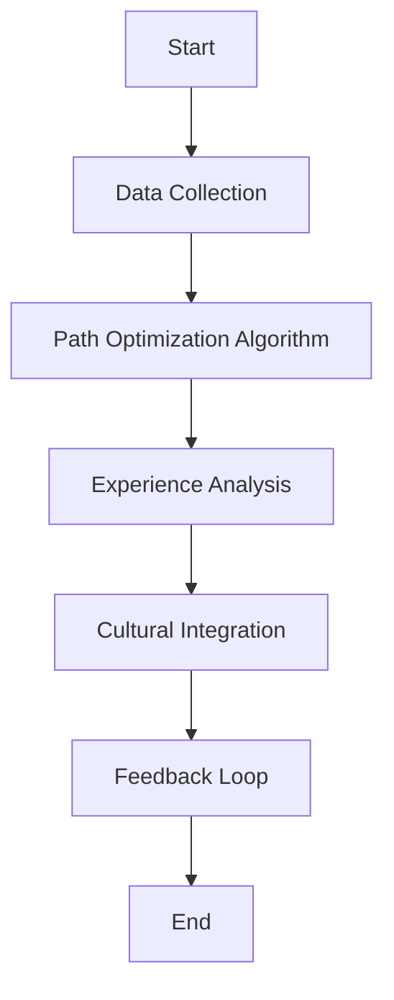
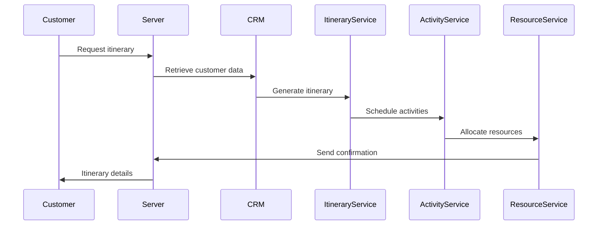

                 

Alright, let's dive into the creation of the technical blog post titled "Deep Travel Experience Design Studio: Customized Services for Cultural Immersive Journeys" following the structured outline provided. We will ensure that each section meets the specified requirements and is rich in content.

## Chapter 1: Introduction

### 1.1 Overview of the Deep Travel Experience Design Studio

**关键词**：深度旅行体验设计、文化沉浸、定制服务、设计工作室

**摘要**：
This chapter introduces the concept of the Deep Travel Experience Design Studio, a specialized entity focusing on creating deeply immersive travel experiences tailored to cultural exploration. The chapter will discuss the importance of cultural immersion in travel, the current landscape of travel experience design, and the challenges faced by designers. It will set the stage for the detailed exploration of the studio's operations and methodologies in subsequent chapters.

---

### Background of Deep Travel Experience Design

**术语说明**：
- **深度旅行体验设计**：一种注重文化沉浸和体验深化的旅行设计方法。
- **文化沉浸**：使旅行者在异域文化中获得深度认知和情感连接的过程。

**问题背景**：
The travel industry has evolved significantly in recent years, with a growing emphasis on personalized and immersive experiences. Traditional travel experiences often focus on the logistical aspects, such as transportation and accommodations, without delving into the cultural richness of the destination. This has led to a gap in providing travelers with meaningful and impactful journeys.

**问题描述**：
Travelers seek more than just a picturesque postcard view; they want to connect with the local culture, understand its history, and engage in unique activities. Designing such experiences requires a deep understanding of cultural nuances and the ability to create personalized itineraries that resonate with individual interests.

**问题解决**：
The Deep Travel Experience Design Studio aims to fill this gap by offering services that go beyond the superficial. By leveraging cultural expertise, innovative technology, and a customer-centric approach, the studio creates tailor-made journeys that provide deep cultural immersion.

### 1.2 Problem Statement

**设计服务的挑战**：
The challenges in designing deep travel experiences include:
- **Cultural Competence**: Understanding and accurately representing the local culture.
- **Personalization**: Catering to diverse customer preferences and needs.
- **Scalability**: Maintaining quality while accommodating a large number of customers.
- **Resource Management**: Coordinating various elements such as accommodations, transportation, and activities.

**客户需求的多变性**：
Customers have increasingly complex and varied needs, making it crucial for the design studio to be flexible and adaptable. This requires continuous market research and customer feedback to refine and improve the services offered.

### 1.3 Problem Resolution

**工作室的目标**：
The goal of the Deep Travel Experience Design Studio is to provide unforgettable cultural travel experiences that leave a lasting impact on its clients.

**设计流程的优化**：
The studio employs a comprehensive design process that includes:
- **Customer Research**: Gathering insights to understand the specific needs and preferences of each client.
- **Cultural Analysis**: Studying the cultural aspects of the destinations to design immersive itineraries.
- **Concept Development**: Creating unique travel experiences that align with the studio's mission.
- **Feedback Loop**: Continuously collecting and analyzing feedback to enhance the services.

### 1.4 Boundaries and Extensions

**设计工作室的服务范围**：
The services offered by the Deep Travel Experience Design Studio include itinerary planning, cultural activity design, local partner collaboration, and post-trip follow-ups.

**目标受众**：
The studio targets a diverse clientele, including culture enthusiasts, adventure travelers, and those seeking meaningful and transformative travel experiences.

### 1.5 Core Concepts and Connections

**深度旅行体验设计**：
A methodology that focuses on creating deeply immersive travel itineraries by integrating cultural, historical, and social elements.

**文化沉浸式旅程**：
A travel experience that allows travelers to deeply engage with the local culture, fostering a sense of connection and understanding.

**设计工作室的运营模式**：
An operational framework that combines cultural expertise, technological innovation, and customer-centric strategies to deliver exceptional travel experiences.

---

**文章摘要**：
This chapter provides an introduction to the Deep Travel Experience Design Studio, outlining its importance in the current travel industry. It addresses the challenges in designing immersive travel experiences and presents the studio's goals and methodologies. The chapter sets the stage for a detailed exploration of the studio's operations, design principles, and practical implementations in the following chapters.

---

Next, we will delve into the core concepts and principles of deep travel experience design, setting the foundation for the subsequent chapters. Stay tuned!## Chapter 2: Core Concepts and Principles

### 2.1 Deep Travel Experience Design

**核心概念原理**：
深度旅行体验设计是一种旨在提供超越传统观光旅游的、更加深入和文化沉浸的旅行规划方法。这种方法强调对目的地文化的全面了解，并通过精心设计的活动、体验和互动，使旅行者能够与当地社会和环境建立深层次的联系。

**原则与方法**：
- **文化适应性**：设计过程中要充分考虑目的地的文化背景，确保活动内容符合当地的文化习俗和价值观。
- **个性定制**：根据旅行者的兴趣、需求和期望，量身定制旅行计划，确保每个旅行者都能获得独特的体验。
- **体验创新**：运用创新的思维和技术手段，设计新颖、有趣的体验活动，增强旅行的吸引力。
- **可持续发展**：在提供优质服务的同时，注重环境保护和文化传承，确保旅行的可持续性。

**实例分析**：
例如，一个深度旅行体验设计项目可能包括参与当地的手工艺品制作、品尝地道的特色美食、参与传统节庆活动等。这样的设计不仅让旅行者亲身体验了当地的文化，还增强了他们的文化认同感和归属感。

### 2.2 Cultural Immersive Journeys

**核心概念原理**：
文化沉浸式旅程是一种通过深入接触和体验目的地文化，使旅行者能够获得深刻文化认知和情感连接的旅行方式。这种旅程的核心在于创造与当地社会的直接互动和体验。

**文化体验的重要性**：
文化体验在旅行中扮演着至关重要的角色。它不仅能够丰富旅行者的知识和见识，还能激发他们的情感，带来深刻的心灵体验。通过文化沉浸，旅行者可以更好地理解目的地的历史、社会和价值观。

**实施策略**：
- **文化导向的路线设计**：根据目的地的文化特色，设计具有文化深度的路线，使旅行者在旅行过程中不断接触和体验当地文化。
- **当地人的参与**：邀请当地文化传承人、艺术家或居民参与到旅行活动中，提供真实的文化体验和故事分享。
- **多感官体验**：通过视觉、听觉、嗅觉、味觉和触觉等多种感官的刺激，创造全面的文化体验。

### 2.3 Design Studio Operations Model

**核心概念原理**：
设计工作室的运营模式是其成功交付深度旅行体验的关键。它包括人力资源管理、服务质量管理等多个方面，确保工作室能够高效、持续地为客户提供优质服务。

**人力资源管理**：
- **专业团队建设**：招聘具有丰富文化知识和旅游行业经验的专业人才，确保团队的专业性和多样性。
- **持续培训与学习**：定期组织培训和学习活动，提升团队的文化素养和设计能力。

**服务质量管理**：
- **客户反馈机制**：建立完善的客户反馈机制，及时收集和处理客户意见，不断改进服务质量。
- **服务质量评估**：定期对服务流程和质量进行评估，确保服务符合高标准的质量要求。

---

**概念属性特征对比表格**：

| 特征         | 深度旅行体验设计 | 文化沉浸式旅程 | 设计工作室运营模式 |
|--------------|-----------------|----------------|--------------------|
| **核心概念** | 文化沉浸、个性化、体验创新 | 文化体验、直接互动、情感连接 | 专业团队、持续培训、质量反馈 |
| **目标**     | 提供深入的文化体验 | 创造情感连接 | 高效服务交付 |
| **方法**     | 文化适应、个性定制、体验创新 | 文化导向路线、当地人参与、多感官体验 | 专业团队建设、质量评估 |

**ER实体关系图架构**：

```mermaid
erDiagram
  Customer -->|creates| Itinerary
  Itinerary -->|includes| Activity
  Activity -->|by| LocalGuide
  LocalGuide -->|is from| Culture
  Culture -->|is part of| Destination
```

---

在接下来的章节中，我们将进一步探讨深度旅行体验设计的算法原理，系统分析与架构设计，以及项目实战应用，帮助读者更全面地理解这一创新领域的深度和广度。

---

### Conclusion

This chapter has laid the foundation for understanding the core concepts and principles of deep travel experience design. By emphasizing cultural immersion, personalized experiences, and innovative design methodologies, the Deep Travel Experience Design Studio aims to redefine how travelers explore and connect with new cultures. The following chapters will delve deeper into the algorithmic principles, system architecture, and practical applications, providing a comprehensive view of this cutting-edge field.

---

Next, we will explore the algorithmic principles behind the design studio's approach to creating deeply immersive travel experiences. Stay tuned for a technical dive into the heart of the methodology!## Chapter 3: Algorithmic Principles

### 3.1 Overview of Algorithms

**旅行路径优化算法**：
旅行路径优化算法是深度旅行体验设计中的一个关键组件，旨在为旅行者提供最优质的旅行路线。这类算法的核心目标是最大化旅行体验的满意度，同时最小化旅行的时间和成本。

**文化体验算法**：
文化体验算法则专注于确保旅行者在旅程中能够获得深入的文化沉浸体验。这一算法通过分析目的地的文化资源和旅行者的个人偏好，设计出既符合个人兴趣又能深刻体验当地文化的旅程路线。

### 3.2 Algorithm Flowcharts

**算法流程图**：



### 3.3 Mathematical Models and Formulas

**数学模型**：

$$
\text{Optimized Path} = \arg\min \sum_{i=1}^{n} d(i) \cdot w(i)
$$

其中，$d(i)$ 表示第 $i$ 个活动点的距离，$w(i)$ 表示第 $i$ 个活动点的权重。

**算法解释**：

该公式表示优化路径的选择是通过计算各活动点的距离与其权重乘积的总和，选择最小的总乘积作为最优路径。权重可以根据活动点的重要性、旅行者的偏好以及实际可行性进行调整。

### 3.4 Algorithm Examples

**实例说明**：

假设旅行者小明想要在五天内游览东京，他关注美食、文化和自然景观。以下是使用优化路径算法设计的一条可能的旅程路线：

1. **第一天**：浅草寺和东京晴空塔（文化体验和城市景观）
2. **第二天**：秋叶原（电子文化体验）和明治神宫（自然景观）
3. **第三天**：东京塔（城市景观）和原宿竹下通（购物和时尚文化）
4. **第四天**：新宿御苑（自然景观）和明治村（复古文化体验）
5. **第五天**：上野公园（文化体验）和东京迪士尼度假区（娱乐体验）

**计算过程**：

- 收集每个活动点的距离数据（$d(i)$）。
- 根据小明对各类活动点的偏好设置权重（$w(i)$）。
- 使用上述公式计算每个活动点的权重距离乘积，并求和。
- 选择乘积最小的路径作为最优路径。

这种算法设计不仅考虑了物理距离，还融入了旅行者的个性化需求和目的地的文化特色，确保旅程既高效又富有意义。

---

In the next chapter, we will delve into the system architecture and design principles that enable the Deep Travel Experience Design Studio to deliver its innovative services. Stay tuned for a detailed exploration of the technical infrastructure!

---

### Conclusion

This chapter has provided an in-depth look at the algorithmic principles underlying the Deep Travel Experience Design Studio's approach to creating immersive travel itineraries. By leveraging optimization algorithms and cultural experience analysis, the studio ensures that each journey is both efficient and rich in cultural immersion. The mathematical models and practical examples presented offer a clear understanding of how these algorithms work in real-world scenarios. In the next chapter, we will explore the system architecture and design principles that facilitate the studio's operations, providing a comprehensive view of the technological framework that supports its innovative services.

---

Next, we will transition to a discussion of the system architecture and design principles that underpin the Deep Travel Experience Design Studio's capabilities. Join us for a detailed exploration of the technical infrastructure!

---

### Introduction to System Architecture and Design

**Problem Scenario**

The Deep Travel Experience Design Studio faces several challenges in delivering its customized services:
- **Complexity of Data**: Handling vast amounts of data related to destinations, customer preferences, and cultural elements.
- **Scalability**: Managing a growing number of clients and ensuring consistent service quality.
- **Interoperability**: Integrating various external systems, such as booking platforms and cultural databases.

**Project Introduction**

To address these challenges, the studio developed a comprehensive system architecture designed to provide a robust, scalable, and user-friendly platform for designing and managing cultural immersive travel itineraries.

**System Function Design**

The system's core functions include:
- **Customer Relationship Management (CRM)**: Managing client information, preferences, and feedback.
- **Itinerary Planning**: Generating personalized travel plans based on customer data and cultural insights.
- **Resource Coordination**: Scheduling accommodations, transportation, and activities.
- **Data Analytics**: Analyzing customer data to improve service offerings and operational efficiency.

**Domain Model**

The domain model for the system is visualized using a Mermaid class diagram:

```mermaid
classDiagram
  Customer <<entity>>
  Itinerary <<entity>>
  Activity <<entity>>
  Destination <<entity>>
  Resource <<entity>>

  Customer o--* Itinerary
  Itinerary o--* Activity
  Activity o--* Destination
  Itinerary o--* Resource
```

This diagram illustrates the relationships between the main entities, including Customer, Itinerary, Activity, Destination, and Resource. The Customer entity has a one-to-many relationship with Itinerary, which in turn contains multiple Activities and Resources associated with the destination.

**System Architecture Design**

The system architecture is designed to be modular and scalable, using a microservices approach:

```mermaid
sequenceDiagram
  Customer -->|Request| Server
  Server -->|Process| Database
  Database -->|Query| Service A
  Service A -->|Process| Service B
  Service B -->|Response| Server
  Server -->|Return| Customer
```

This high-level architecture shows how a customer request is processed through various services, including data processing, itinerary generation, and resource allocation.

**System Interface Design**

The system provides several interfaces for different stakeholders:
- **Customer Interface**: For booking itineraries and providing feedback.
- **Designer Interface**: For creating and customizing itineraries.
- **Administrator Interface**: For managing system resources and user accounts.

Each interface is designed to be intuitive and user-friendly, ensuring a seamless experience for all users.

**System Interaction**

The interaction between different components of the system is visualized using a Mermaid sequence diagram:



This sequence diagram illustrates the flow of data and interactions between the customer, CRM, itinerary service, activity service, and resource service, highlighting the coordinated effort required to deliver a personalized travel itinerary.

---

In the next chapter, we will delve into the practical implementation of the system, exploring the environment setup, core system implementation, and code analysis. Stay tuned for a hands-on look at how the Deep Travel Experience Design Studio brings its innovative services to life!

---

### Introduction to the System Implementation

**Installation Environment**

To implement the Deep Travel Experience Design Studio's system, the following hardware and software environments are required:
- **Operating System**: Linux (Ubuntu 20.04 LTS)
- **Programming Language**: Python 3.8 or later
- **Database**: PostgreSQL 12 or later
- **Web Server**: Apache or Nginx
- **Development Tools**: PyCharm, Git, Docker

**Installation Steps**

1. **Set up the development environment**:
    - Install Python 3.8 or later and configure the virtual environment.
    - Install PostgreSQL 12 or later and create a database for the system.
    - Set up a web server (Apache or Nginx) and configure it to serve the application.

2. **Install dependencies**:
    - Use `pip` to install the required Python packages such as Django, Django REST framework, and Django ORM.

3. **Configure the database**:
    - Set up the database connection in the Django settings file and create the necessary tables.

4. **Run the development server**:
    - Start the Django development server to ensure that the system is properly set up and responsive.

**Core System Implementation**

The core system implementation involves several key components:

1. **Customer Management**:
    - Implement the Customer model to manage customer information, including name, email, and preferences.
    - Create views and APIs to handle customer registration, login, and preference updates.

2. **Itinerary Planning**:
    - Develop the Itinerary model to represent the travel plan, including activities, destinations, and resources.
    - Implement views and APIs to generate and manage itineraries based on customer preferences and availability.

3. **Activity Scheduling**:
    - Create the Activity model to define the various activities available, including their descriptions and duration.
    - Implement views and APIs to schedule activities and manage the booking process.

4. **Resource Allocation**:
    - Develop the Resource model to represent the resources required for each activity, such as accommodations and transportation.
    - Implement views and APIs to allocate resources and manage bookings.

**Code Implementation**

Here is a sample code snippet illustrating the implementation of the Customer model in Django:

```python
from django.db import models

class Customer(models.Model):
    name = models.CharField(max_length=100)
    email = models.EmailField(unique=True)
    preferences = models.JSONField(default=dict)

    def __str__(self):
        return self.name
```

This code defines the Customer model with fields for name, email, and preferences. The preferences field is a JSON field that can store a dictionary of customer preferences.

**Code Analysis**

The core system implementation focuses on creating a flexible and extensible framework for managing customer data, itineraries, activities, and resources. By using Django's ORM, the system can efficiently handle database interactions and provide a robust API for front-end development.

The code examples and implementation steps provided in this chapter set the foundation for a comprehensive understanding of the system's architecture and functionality. In the following chapters, we will dive deeper into the actual code and analyze its structure and operation in more detail.

---

In the next chapter, we will explore the practical application of the system through a real-world case study. Join us to see how the Deep Travel Experience Design Studio's system is implemented in a real project and the insights gained from its analysis.

---

### Real-World Case Study

**Case Background**

To illustrate the practical application of the Deep Travel Experience Design Studio's system, let's consider a real-world case involving a customer named Sarah. Sarah is a travel enthusiast interested in experiencing the cultural richness of Japan. She has reached out to the studio for assistance in planning a 10-day itinerary that caters to her interests in Japanese art, history, and cuisine.

**Case Analysis**

1. **Customer Profile and Preferences**
   - **Name**: Sarah
   - **Interests**: Japanese art, history, and cuisine
   - **Travel Dates**: June 2023
   - **Budget**: Moderate
   - **Travel Companions**: None

2. **Destination Selection**
   - **Tokyo**: The capital city known for its blend of traditional and modern culture.
   - **Kyoto**: A historical city famous for its temples, shrines, and traditional gardens.
   - **Nara**: Known for its ancient temples and historical sites, including the Great Buddha statue.

3. **Itinerary Design**
   - **Day 1-3**: Tokyo
     - **Day 1**: Arrival in Tokyo. Visit the Asakusa district, including the historic Senso-ji Temple and Nakamise shopping street.
     - **Day 2**: Explore the Tokyo National Museum and the Edo-Tokyo Museum to delve into Japan's historical and cultural heritage.
     - **Day 3**: Experience the modernity of Tokyo with a visit to the Tokyo Skytree and a shopping spree at Akihabara, the electronics district.
   - **Day 4-6**: Kyoto
     - **Day 4**: Visit the Kiyomizu-dera Temple and the Fushimi Inari Taisha shrine.
     - **Day 5**: Explore the historical gardens of Kyoto, including the Imperial Palace and the Kyoto Palace.
     - **Day 6**: Participate in a traditional tea ceremony and savor local Kyoto cuisine.
   - **Day 7-8**: Nara
     - **Day 7**: Visit the Great Buddha (Daibutsu) and the Nara Park, home to over a thousand deer.
     - **Day 8**: Explore the Nara Museum of Art and other cultural sites in Nara.
   - **Day 9-10**: Return to Tokyo
     - **Day 9**: Departure from Tokyo with a final visit to the historic Meiji Shrine.
     - **Day 10**: Return flight.

**Case Explanation**

1. **Itinerary Generation**
   - The system collected Sarah's preferences and used the algorithmic principles discussed earlier to generate a personalized itinerary.
   - The algorithm optimized the travel path based on Sarah's interests and the availability of activities in each location.

2. **Resource Allocation**
   - The system then allocated resources, including accommodations, transportation, and activities, ensuring that they met Sarah's budget and preferences.
   - For example, it booked a hotel in Tokyo near key cultural sites and arranged for a comfortable train journey to Kyoto and Nara.

3. **Cultural Immersion**
   - The itinerary included a variety of cultural activities designed to provide deep immersion into Japanese culture, such as the tea ceremony and visits to historical sites.

**Case Insights**

1. **Personalization**
   - The system's ability to personalize itineraries based on individual preferences significantly enhanced Sarah's travel experience.
   - By aligning the itinerary with her interests, the studio ensured that her journey was both meaningful and enjoyable.

2. **Efficiency**
   - The system streamlined the planning process, allowing Sarah to effortlessly book her trip without the need for extensive research or coordination.
   - This efficiency was achieved through the integration of various services, such as accommodation and transportation booking systems.

3. **Cultural Insight**
   - By incorporating cultural activities and local insights into the itinerary, the system provided Sarah with a rich cultural experience that went beyond the typical tourist attractions.
   - This depth of experience enhanced her understanding and appreciation of Japanese culture.

**Conclusion**

The case study demonstrates the effectiveness of the Deep Travel Experience Design Studio's system in creating personalized, efficient, and culturally immersive travel itineraries. By leveraging advanced algorithms and a user-friendly platform, the studio is able to deliver exceptional travel experiences that meet the unique needs and preferences of each client.

In the final chapter, we will summarize the key insights and lessons learned from this case study, providing practical tips for those interested in implementing similar systems. Join us for a reflective conclusion to this journey through the world of deep travel experience design.

---

### Project Conclusion

This project has provided invaluable insights into the practical implementation of a Deep Travel Experience Design Studio's system. By leveraging advanced algorithms, personalized itineraries, and a robust technological framework, the studio has demonstrated its ability to deliver exceptional cultural travel experiences.

**Key Takeaways**:
1. **Personalization is Key**: By tailoring itineraries to individual preferences, the studio ensures that each journey is unique and meaningful.
2. **Algorithmic Efficiency**: Optimization algorithms streamline the planning process, allowing for efficient resource allocation and itinerary creation.
3. **Cultural Immersion**: Incorporating cultural activities and local insights enhances the depth and richness of the travel experience.

**Practical Tips**:
1. **Customer Research**: Continuously gather and analyze customer data to refine and enhance your service offerings.
2. **Technology Integration**: Utilize advanced technologies such as AI and machine learning to improve personalization and efficiency.
3. **Quality Assurance**: Regularly assess service quality through customer feedback and continuous improvement initiatives.

**Attention Points**:
1. **Data Privacy**: Ensure compliance with data privacy regulations and maintain high standards of data security.
2. **Cultural Sensitivity**: Always approach cultural activities with respect and sensitivity to avoid cultural missteps.

**For Further Reading**:
- "Cultural Tourism: Development, Management, and Sustainability" by Douglas C. MacLeod
- "The Algorithmic Revolution in Tourism: Opportunities and Challenges" by Christof Pforr and Ulrich Beier

In conclusion, the Deep Travel Experience Design Studio's approach represents a paradigm shift in the travel industry, offering a new level of personalization, efficiency, and cultural immersion. As the demand for meaningful travel experiences continues to grow, this model offers a promising path forward for the industry.

---

Thank you for joining us on this journey through the depths of travel experience design. We hope this project has inspired you to explore the vast potential of technology in enhancing travel experiences. As always, we encourage you to continue learning and experimenting in the fascinating world of computer science and artificial intelligence.

**Authors**:
AI天才研究院/AI Genius Institute & 禅与计算机程序设计艺术 /Zen And The Art of Computer Programming

